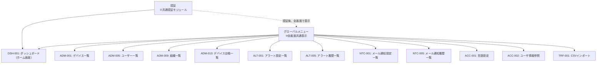
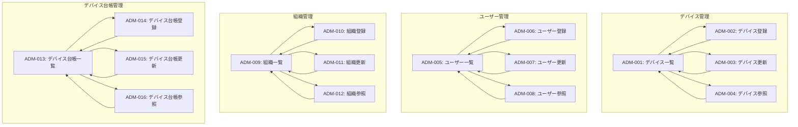
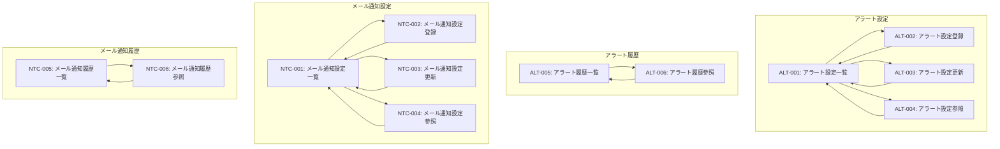
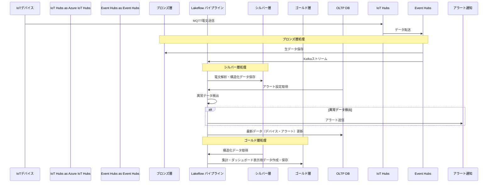

# Databricks IoTシステム 機能要件定義書

## 1. 概要

Databricks IoTシステムは、IoTデバイスから収集される膨大なデータを効率的に処理し、可視化することを目的としたIoTプラットフォームです。Databricksの強力なデータ処理能力を活用し、データ解析とインサイトの提供を行います。

### システム概要
- **データ取込み**: MQTTプロトコルによるIoTデバイスからのリアルタイムデータ収集
- **データ処理**: メダリオンアーキテクチャによる段階的なデータ処理（ブロンズ/シルバー/ゴールド）
- **分析・可視化**: Databricksダッシュボード及び対話型AIによるデータの可視化
- **管理機能**: Webベースの管理画面による各種マスタ管理

## 2. ロール定義

本システムでは、4つのロールを定義し、ロールベースアクセス制御（RBAC）を実施します。

### ロール一覧

| ロールID | ロール名       | 説明                                                                 | スコープ                 |
| -------- | -------------- | -------------------------------------------------------------------- | ------------------------ |
| ROLE-001 | システム保守者 | NSW内部の担当者。主に保守をスコープとする                            | システム全体の保守・管理 |
| ROLE-002 | 管理者         | システムの管理者。システム保守者以外（NSW外）で最大の権限を持つ      | システム管理・設定       |
| ROLE-003 | 販社ユーザ     | システムの仲介業者。自社に紐づくデータに関連するタスクのみ操作できる | 自社データの管理         |
| ROLE-004 | サービス利用者 | 本システムで管理するサービスを実際に利用しているユーザ。エンドユーザ | 自社データの参照         |

**管理者・販社ユーザの権限範囲について:**

現行想定では管理者（ROLE-002）と販社ユーザ（ROLE-003）の権限範囲に差異はありません。ただし、将来的には「販社ユーザ情報の中で管理者には閲覧できてはいけない項目要素（個人情報等）の不可視化・マスキング」といった要件が発生する可能性があります。上記のような将来的な拡張を考慮し、管理者と販社ユーザを別途定義しています。

### 権限レベル凡例

このシステムでは、以下の記号でアクセス制御を表現します：

| 記号 | 名称     | 動線制御（UI）   | データフィルタリング                                   |
| ---- | -------- | ---------------- | ------------------------------------------------------ |
| ○    | 利用可能 | UI動線**表示**   | 組織階層フィルタ（所属組織+下位組織のデータのみ表示） |
| -    | 利用不可 | UI動線**非表示** | （アクセス不可）                                       |
| !    | 未定     | 実装時に決定予定 | 実装時に決定予定                                       |

**アクセス制御の原則**:
- **すべてのユーザーに所属組織配下のデータのみ閲覧可能なフィルタが適用されます**
- データアクセス範囲は、ユーザーが所属する組織とその下位組織によって決定されます
- **ロールは動線制御（UI要素の表示/非表示）のみに使用**され、データフィルタリングには使用されません

**データアクセス制御の仕組み**:
1. すべてのユーザーに対して、`organization_closure` テーブルで下位組織リストを取得
2. その組織リストに該当するデータのみ表示
3. **ロールによるデータ制限は実施しない**（画面機能の表示制御にのみ使用）

---

## 3. 機能一覧

### 機能一覧サマリー

| 機能ID | 機能名           | カテゴリ                       | 概要                                                                                                   |
| ------ | ---------------- | ------------------------------ | ------------------------------------------------------------------------------------------------------ |
| FR-001 | ログイン認証機能 | データプラットフォーム         | 認証共通モジュール（Azure/AWS/オンプレミス対応）、OAuth トークン フェデレーション                                 |
| FR-002 | データ取込み機能 | データプラットフォーム/IoT基盤 | MQTT → Event Hubs → LDP                                                                                |
| FR-003 | アラート機能     | データプラットフォーム         | 異常検出・通知                                                                                         |
| FR-004 | マスタ管理機能   | Webアプリケーション            | デバイス/ユーザー/組織/アラート設定/デバイス台帳/メール通知設定/アカウント/CSVインポート・エクスポート |
| FR-005 | 履歴機能         | Webアプリケーション            | アラート履歴、メール通知履歴の参照                                                                     |
| FR-006 | 分析機能         | Webアプリケーション            | ダッシュボード表示、対話型AI                                                                           |

---

### 3.1 Webアプリケーション機能（Flask App）

Databricks App Compute上で動作するFlask Webアプリケーションで実現する機能群です。

#### FR-004: マスタ管理機能

**概要**: Databricks App Compute上で動作するFlask Webアプリケーションによるマスタデータ管理機能。デバイス、ユーザー、組織、アラート設定、デバイス台帳、メール通知設定、アカウント情報のCRUD操作、およびCSVインポート/エクスポート機能を含む。

##### FR-004-1: デバイス管理
**備考**:：事前にAzure IoT Hubsに登録済みのデバイス情報を登録し、Webアプリケーション側からAzure IoT Hubsへの連携は行わない

###### FR-004-1-1: デバイス一覧・検索

- デバイス情報の一覧表示
- 表示項目
  - デバイスID
  - デバイス名
  - デバイス種別
  - モデル情報
  - SIMID
  - MACアドレス
  - 設置場所
  - 所属（組織名）
- 検索条件項目
  - TODO

###### FR-004-1-2: デバイス登録

- デバイス基本情報の登録
- 表示項目
  - デバイスID
  - デバイス名
  - デバイス種別
  - モデル情報
  - SIMID
  - MACアドレス
  - 設置場所
  - 所属（組織名）

###### FR-004-1-3: デバイス編集

- デバイス基本情報の変更
- 表示項目
  - デバイスID
  - デバイス名
  - デバイス種別
  - モデル情報
  - SIMID
  - MACアドレス
  - 設置場所
  - 所属（組織名）

###### FR-004-1-4: デバイス参照

- デバイスの詳細情報表示
- 表示項目
  - デバイスID
  - デバイス名
  - デバイス種別
  - モデル情報
  - SIMID
  - MACアドレス
  - 設置場所
  - 所属（組織名）

###### FR-004-1-5: デバイス削除

- デバイスの論理削除

##### FR-004-2: ユーザー管理

###### FR-004-2-1: ユーザー一覧・検索

- ユーザー情報の一覧表示
- 表示項目
  - ユーザID
  - ユーザ名
  - メールアドレス
  - 所属（組織名）
  - ユーザ種別（権限）
  - 地域
  - 住所
- 検索条件項目
  - TODO

###### FR-004-2-2: ユーザー登録

- ユーザー基本情報の登録
- 表示項目
  - ユーザID
  - ユーザ名
  - メールアドレス
  - 所属（組織名）
  - ユーザ種別（権限）
  - 地域
  - 住所
- Databricks Userへの登録連携
- Databricksワークスペースグループへのユーザーの登録連携

###### FR-004-2-3: ユーザー編集

- ユーザー基本情報の変更
- 表示項目
  - ユーザID
  - ユーザ名
  - メールアドレス
  - 所属（組織名）
  - ユーザ種別（権限）
  - 地域
  - 住所
- Databricks Userへの更新連携
- Databricksワークスペースグループへのユーザーの更新連携

###### FR-004-2-4: ユーザー参照

- ユーザーの詳細情報表示
- 表示項目
  - ユーザID
  - ユーザ名
  - メールアドレス
  - 所属（組織名）
  - ユーザ種別（権限）
  - 地域
  - 住所

###### FR-004-2-5: ユーザー削除

- ユーザーの論理削除
- Databricks Userへの削除連携
- Databricksワークスペースグループへのユーザーの削除連携

##### FR-004-3: アラート設定管理

###### FR-004-3-1: アラート設定一覧

- アラート設定情報の一覧表示
- 表示項目
  - アラート名
  - 対象デバイス
  - アラート発生条件
  - アラート復旧条件
  - 判定時間
  - アラートレベル
  - アラート通知フラグ
  - メール送信フラグ
- 検索条件項目
  - TODO

###### FR-004-3-2: アラート設定参照

- アラート設定の詳細情報表示
- 表示項目
  - アラート名
  - 対象デバイス
  - アラート発生条件
  - アラート復旧条件
  - 判定時間
  - アラートレベル
  - アラート通知フラグ
  - メール送信フラグ

###### FR-004-3-3: アラート設定登録

- アラート設定の登録
- 表示項目
  - アラート名
  - 対象デバイス
  - アラート発生条件
  - アラート復旧条件
  - 判定時間
  - アラートレベル
  - アラート通知フラグ
  - メール送信フラグ

###### FR-004-3-4: アラート設定編集

- アラート設定の変更
- 表示項目
  - アラート名
  - 対象デバイス
  - アラート発生条件
  - アラート復旧条件
  - 判定時間
  - アラートレベル
  - アラート通知フラグ
  - メール送信フラグ

###### FR-004-3-5: アラート設定削除

- アラート設定の論理削除

##### FR-004-4: 組織管理

###### FR-004-4-1: 組織一覧・検索

- 組織情報の一覧表示
- 表示項目
  - 組織ID
  - 組織名
  - 組織種別
  - 住所
  - 電話番号
  - FAX
  - 担当者名
  - 契約状態
  - 契約開始日
  - 契約終了日
  - 関連組織名
- 検索条件項目
  - TODO

###### FR-004-4-2: 組織登録

- 組織基本情報の登録
- 表示項目
  - 組織ID
  - 組織名
  - 組織種別
  - 住所
  - 電話番号
  - FAX
  - 担当者名
  - 契約状態
  - 契約開始日
  - 契約終了日
  - 関連組織名
- Databricksワークスペースグループの作成連携

###### FR-004-4-3: 組織編集

- 組織基本情報の変更
- 表示項目
  - 組織ID
  - 組織名
  - 組織種別
  - 住所
  - 電話番号
  - FAX
  - 担当者名
  - 契約状態
  - 契約開始日
  - 契約終了日
  - 関連組織名
- Databricksワークスペースグループの更新連携

###### FR-004-4-4: 組織参照

- 組織の詳細情報表示
- 表示項目
  - 組織ID
  - 組織名
  - 組織種別
  - 住所
  - 電話番号
  - FAX
  - 担当者名
  - 契約状態
  - 契約開始日
  - 契約終了日
  - 関連組織名

###### FR-004-4-5: 組織削除

- 組織の論理削除
- Databricksワークスペースグループの削除連携

##### FR-004-5: デバイス台帳管理

###### FR-004-5-1: デバイス台帳一覧・検索

- 台帳情報の一覧表示
- 表示項目
  - デバイスID
  - デバイス名
  - デバイス種別
  - モデル情報
  - SIMID
  - MACアドレス
  - 在庫状況
  - 購入日
  - 出荷予定日
  - 出荷日
  - メーカー保証終了日
  - ベンダー保証終了日
  - 在庫場所
- 検索条件項目
  - TODO

###### FR-004-5-2: デバイス台帳登録

- デバイス台帳情報の登録
- 表示項目
  - デバイスID
  - デバイス名
  - デバイス種別
  - モデル情報
  - SIMID
  - MACアドレス
  - 在庫状況
  - 購入日
  - 出荷予定日
  - 出荷日
  - メーカー保証終了日
  - ベンダー保証終了日
  - 在庫場所

###### FR-004-5-3: デバイス台帳更新

- 台帳情報の変更
- 表示項目
  - デバイスID
  - デバイス名
  - デバイス種別
  - モデル情報
  - SIMID
  - MACアドレス
  - 在庫状況
  - 購入日
  - 出荷予定日
  - 出荷日
  - メーカー保証終了日
  - ベンダー保証終了日
  - 在庫場所

###### FR-004-5-4: デバイス台帳削除

- 台帳の論理削除

**備考**: デバイス台帳管理は物理的なデバイス在庫を管理する機能で、システム保守者（NSW内部）のみがアクセス可能。

##### FR-004-6: メール通知設定管理

###### FR-004-6-1: メール通知設定一覧

- メール通知設定の一覧表示
- 表示項目
  - TODO
- 検索条件項目
  - TODO

###### FR-004-6-2: メール通知設定参照

- メール通知設定の詳細情報表示
- 表示項目
  - TODO

###### FR-004-6-3: メール通知設定登録

- メール通知設定の登録
- 表示項目
  - TODO

###### FR-004-6-4: メール通知設定更新

- メール通知設定の更新
- 表示項目
  - TODO

##### FR-004-7: アカウント機能

###### FR-004-7-1: 言語設定

- システム表示言語の変更機能
- **対応言語**: 日本語（その他言語はスコープ外）
- **設定スコープ**: ユーザーごとに言語設定を保存
- **適用範囲**: UI表示、メール通知

###### FR-004-7-2: ユーザ情報参照

- ログインユーザー自身の情報を参照する機能
- 表示項目
  - TODO

##### FR-004-8: CSVインポート/エクスポート

**概要**: ユーザー、組織、デバイスなどのマスタデータを一括でインポート、エクスポートできる機能。

###### FR-004-8-1: CSVエクスポート

- 各マスタの一覧画面にエクスポートボタンを配置（個別のエクスポート画面は存在しない）
- **エクスポート対象**: 一覧画面の絞り込み条件が適用された状態のデータ
- **対象データ**: ユーザー、組織、デバイス、アラート設定などのマスタデータ（**IoTセンサーデータは対象外**）
- **CSV形式**: UTF-8 BOM付き、カンマ区切り
- **出力項目**: 各マスタの全項目を出力
- **ファイル名形式**: `{データ種別}_{YYYYMMDD_HHmmss}.csv`

###### FR-004-8-2: CSVインポート

- 専用のCSVインポート画面（TRF-001）
- **対象マスタ選択**: プルダウンで対象マスタ（ユーザー、組織、デバイス、アラート設定、デバイス台帳、メール通知設定）を選択
- **対象データ**: ユーザー、組織、デバイス、アラート設定などのマスタデータ（**IoTセンサーデータは対象外**）
- **インポート機能**:
  - CSVファイルのアップロード
  - データの一括登録・更新
  - エラーチェック（形式チェック、重複チェック、必須項目チェック）
  - エラー時はロールバック
- **ファイル形式**: CSV形式（UTF-8 BOM付き、カンマ区切り）
- **権限**: システム保守者、管理者、販社ユーザのみアクセス可能
  - サービス利用者は権限なし（グローバルメニューで非表示）
  - その他は各マスタのC（登録）/U（更新）権限に従う（プルダウン上への表示で制御）

##### FR-004-9: アクセス権限

| 機能                           | システム保守者 | 管理者 | 販社ユーザ | サービス利用者 |
| ------------------------------ | -------------- | ------ | ---------- | -------------- |
| **デバイス管理**               |
| デバイス一覧                   | ○              | ○      | ○          | ○              |
| デバイス参照                   | ○              | ○      | ○          | ○              |
| デバイス登録                   | ○              | ○      | ○          | -              |
| デバイス更新                   | ○              | ○      | ○          | -              |
| デバイス削除                   | ○              | ○      | ○          | -              |
| **ユーザー管理**               |
| ユーザー一覧                   | ○              | ○      | ○          | ○              |
| ユーザー参照                   | ○              | ○      | ○          | ○              |
| ユーザー登録                   | ○              | ○      | ○          | -              |
| ユーザー更新                   | ○              | ○      | ○          | ○              |
| ユーザー削除                   | ○              | ○      | ○          | -              |
| **アラート設定管理**           |
| アラート設定一覧               | ○              | ○      | ○          | ○              |
| アラート設定参照               | ○              | ○      | ○          | ○              |
| アラート設定登録               | ○              | ○      | ○          | ○              |
| アラート設定更新               | ○              | ○      | ○          | ○              |
| アラート設定削除               | ○              | ○      | ○          | ○              |
| **組織管理**                   |
| 組織一覧                       | ○              | ○      | ○          | -              |
| 組織参照                       | ○              | ○      | ○          | -              |
| 組織登録                       | ○              | ○      | ○          | -              |
| 組織更新                       | ○              | ○      | ○          | -              |
| 組織削除                       | ○              | ○      | ○          | -              |
| **デバイス台帳管理**           |
| デバイス台帳一覧               | ○              | -      | -          | -              |
| デバイス台帳登録               | ○              | -      | -          | -              |
| デバイス台帳更新               | ○              | -      | -          | -              |
| デバイス台帳削除               | ○              | -      | -          | -              |
| **メール通知設定管理**         |
| メール通知設定一覧             | ○              | ○      | ○          | ○              |
| メール通知設定参照             | ○              | ○      | ○          | ○              |
| メール通知設定登録             | ○              | ○      | ○          | ○              |
| メール通知設定更新             | ○              | ○      | ○          | ○              |
| **アカウント機能**             |
| 言語設定                       | ○              | ○      | ○          | ○              |
| ユーザ情報参照                 | ○              | ○      | ○          | ○              |
| **CSVインポート/エクスポート** |
| CSVインポート                  | ○              | ○      | ○          | -              |

**備考**:
- アクセス制御の詳細は「[権限レベル凡例](#権限レベル凡例)」を参照してください
- すべてのユーザーに所属組織配下のデータのみ閲覧可能なフィルタが適用されます

---

#### FR-005: 履歴機能

**概要**: システム内で発生したアラートやメール通知の履歴を参照する機能。

##### FR-005-1: アラート履歴

###### FR-005-1-1: アラート履歴一覧

- 過去のアラート発生履歴の一覧表示
- 表示項目
  - 日時
  - デバイス名
  - 設置場所
  - アラート名
  - アラートレベル
  - アラートステータス
- 検索条件項目
  - TODO

###### FR-005-1-2: アラート履歴参照

- アラート発生の詳細情報表示
- 表示項目
  - 日時
  - デバイス名
  - 設置場所
  - アラート名
  - アラート発生条件
  - アラート復旧条件
  - アラートレベル

##### FR-005-2: メール通知履歴

###### FR-005-2-1: メール通知履歴一覧

- メール通知履歴の一覧表示
- 表示項目
  - メール種別
  - 送信者
  - メール件名
  - メール本文
  - 送信日時
- 検索条件項目
  - TODO

###### FR-005-2-2: メール通知履歴参照

- メール通知の詳細情報表示
- 表示項目
  - メール種別
  - 送信者
  - メール件名
  - メール本文
  - 送信日時

##### FR-005-3: アクセス権限

| 機能               | システム保守者 | 管理者 | 販社ユーザ | サービス利用者 |
| ------------------ | -------------- | ------ | ---------- | -------------- |
| **アラート履歴**   |
| アラート履歴一覧   | ○              | ○      | ○          | ○              |
| アラート履歴参照   | ○              | ○      | ○          | ○              |
| **メール通知履歴** |
| メール通知履歴一覧 | ○              | ○      | ○          | ○              |
| メール通知履歴参照 | ○              | ○      | ○          | ○              |

**備考**: アクセス制御の詳細は「[権限レベル凡例](#権限レベル凡例)」を参照してください。すべてのユーザーに所属組織配下のデータのみ閲覧可能なフィルタが適用されます。

---

#### FR-006: 分析機能

**概要**: Databricksダッシュボードをiframeで埋め込み、データ可視化と対話型AI機能を提供する。

##### FR-006-1: ダッシュボード表示
- ログイン後のホーム画面として機能
- **表示方式**: Databricksダッシュボードをiframe埋め込み
- **負荷**: Compute Clusterにかかる
- **共有設定**: 作成者以外も参照可能（Databricks共有機能使用）

**ダッシュボードの内容**: Databricks側で作成された単一のダッシュボードをiframeで埋め込み表示します。ダッシュボードには以下の要素が含まれます：

- **リアルタイムデータ**: センサーデータ、デバイスステータス一覧
- **履歴データ**: 時系列グラフ、期間指定による絞り込み、複数デバイスの比較表示
- **最新アラート情報**: 直近n件のアラート通知

**表示内容の制御**: ユーザーのロールに応じてDatabricks側の動的ビューによりアクセス可能なデータが制限されます。

##### FR-006-2: データアクセス制御

- **アクセス範囲制限**: ユーザーごとにアクセス可能なデータの範囲が異なる場合
- **実装方式**: 動的ビューを経由した参照制限

##### FR-006-3: 対話型AI機能

**概要**: ダッシュボード埋め込みの対話型AI機能。個別の画面としては作成せず、ダッシュボードの一部として提供。

**機能**:
- 自然言語での質問入力
- AIによる回答生成（Databricks Genieを使用）
- データに基づいた回答の提供

**モデル認識の改善**:
- **課題**: 日本語の質問で英語の物理名で作ったテーブルをモデルが認識できない場合あり
- **対策**: 日本語名の動的ビューを作成してモデルが認識しやすくする

##### FR-006-4: アクセス権限

| 機能               | システム保守者 | 管理者 | 販社ユーザ | サービス利用者 |
| ------------------ | -------------- | ------ | ---------- | -------------- |
| ダッシュボード表示 | ○              | ○      | ○          | ○              |

---

#### 画面一覧

##### 画面設計の前提

管理画面の画面構成は、CRUD操作ごとに以下のテンプレートに基づいて統一的に設計されます。

###### 画面共通要件
- 画面サイズは1920×1080
- 画面左部にグローバルメニューカラムを表示
  - カラム上部にはロゴ、下部にはアカウント情報を表示
  - メニューの各要素として初期状態では機能分類を表示
  - マウスホバー時にサブメニューを展開し、各機能分類の子要素を表示
  - 機能分類の親要素は以下の通り
    - 管理機能
    - アラート機能
    - 通知機能
    - ダッシュボード
    - アカウント
    - CSVインポート/エクスポート
- 画面の機能名は画面左上最上部に表示
- 登録系のボタンは青系、削除ボタンは赤系を選択する
- 登録ボタンは権限の制御がない限り常時活性とし、削除ボタンは一覧でチェックボックスが選択されたときのみ活性、選択解除で非活性とする
- 登録、更新、参照画面は同画面内でモーダルとして表示する

###### CRUD画面テンプレート

**一覧画面**:
- 遷移ボタンエリア
  - 登録、削除の2ボタン
  - 画面右上、画面機能名と同列で右寄せに表示
  - 削除は画面遷移なし、画面内で処理を実施
- 検索フォームエリア（検索条件入力）
  - 画面上部に表示
  - 検索ボタンはエリア下部に表示
  - 折り畳み可能
- データテーブル（一覧表示、ページング機能）エリア
  - テーブル外上部に検索結果件数及び適用中の検索条件を表示
  - 参照画面について、一覧の各行全体にリンクを設定し押下時にモーダルとして表示する
  - 編集画面について、一覧の各行に詳細ボタンを用意し押下時にモーダルとして表示する
  - 削除機能について、チェックしたものを処理対象として削除ボタン押下時に削除処理を実行する
  - ページングは画面最下部に表示し、表示形式は「最小頁 … n-1、n、n+1 … 最大ページ」の形とする　※n=現在ページ
    - ex:最大ページ数が10で、現在5ページ目を表示中である場合
    - 1 … 4 5 6 … 10

**削除機能**:
- 一覧画面から削除ボタン押下で実行
  - 削除ボタン押下時に確認モーダルを表示
  - 削除するボタン、一覧画面へ戻るボタン
- 論理削除
- 削除成功後は一覧画面へリダイレクト

**登録画面**:
- 同画面内でモーダルとして表示
- 入力フォームエリア（各項目の入力欄）
- バリデーション（必須チェック、形式チェック、重複チェック）
- 登録ボタン、一覧に戻るボタン
  - 登録ボタン押下時に確認モーダルを表示
  - 登録するボタン、登録画面へ戻るボタン
- 登録成功後は一覧画面へリダイレクト

**更新画面**:
- 同画面内でモーダルとして表示
- 入力フォーム（現在の値を初期表示）
- バリデーション（必須チェック、形式チェック）
- 更新ボタン、更新画面に戻るボタン
  - 更新ボタン押下時に確認モーダル表示
  - 登録するボタン、登録画面へ戻るボタン
- 更新成功後は一覧画面へリダイレクト

**参照画面**:
- 同画面内でモーダルとして表示
- データの詳細情報表示（読み取り専用）

**確認モーダル**:
- 登録、更新、削除処理実行時に確認モーダルを表示
- アイコン＋タイトル、メッセージ文言、処理実行ボタン、〇〇画面へ戻るボタンを表示

**備考**: 上記テンプレートは管理系機能（デバイス管理、ユーザー管理、組織管理など）に共通して適用されます。各機能固有の項目や表示内容は個別に定義されます。

---

##### 画面一覧表

| 画面ID  | カテゴリ                | 画面名                 | スラッグ                           | 概要                                                                                 | 備考                               |
| ------- | ----------------------- | ---------------------- | ---------------------------------- | ------------------------------------------------------------------------------------ | ---------------------------------- |
| ADM-001 | 管理機能                | デバイス一覧画面       | /admin/devices                     | デバイスの一覧・検索/削除                                                            | -                                  |
| ADM-002 | 管理機能                | デバイス登録画面       | /admin/devices/register            | デバイスの登録                                                                       | -                                  |
| ADM-003 | 管理機能                | デバイス更新画面       | /admin/devices/update              | デバイスの更新                                                                       | -                                  |
| ADM-004 | 管理機能                | デバイス参照画面       | /admin/devices/detail/:id          | デバイスの詳細情報表示                                                               | -                                  |
| ADM-005 | 管理機能                | ユーザー一覧画面       | /admin/users                       | ユーザーの一覧・検索/削除                                                            | -                                  |
| ADM-006 | 管理機能                | ユーザー登録画面       | /admin/users/register              | ユーザーの登録                                                                       | -                                  |
| ADM-007 | 管理機能                | ユーザー更新画面       | /admin/users/update                | ユーザーの更新                                                                       | -                                  |
| ADM-008 | 管理機能                | ユーザー参照画面       | /admin/users/detail/:id            | ユーザーの詳細情報表示                                                               | -                                  |
| ADM-009 | 管理機能                | 組織一覧画面           | /admin/organizations               | 組織の一覧・検索/削除                                                                | -                                  |
| ADM-010 | 管理機能                | 組織登録画面           | /admin/organizations/register      | 組織の登録                                                                           | -                                  |
| ADM-011 | 管理機能                | 組織更新画面           | /admin/organizations/update        | 組織の更新                                                                           | -                                  |
| ADM-012 | 管理機能                | 組織参照画面           | /admin/organizations/detail/:id    | 組織の詳細情報表示                                                                   | -                                  |
| ADM-013 | 管理機能                | デバイス台帳一覧画面   | /admin/device-inventory            | デバイス台帳の一覧・検索/削除                                                        | システム保守者のみ                 |
| ADM-014 | 管理機能                | デバイス台帳登録画面   | /admin/device-inventory/register   | デバイス台帳の登録                                                                   | システム保守者のみ                 |
| ADM-015 | 管理機能                | デバイス台帳更新画面   | /admin/device-inventory/update     | デバイス台帳の更新                                                                   | システム保守者のみ                 |
| ADM-016 | 管理機能                | デバイス台帳参照画面   | /admin/device-inventory/detail/:id | デバイス台帳の詳細情報表示                                                           | システム保守者のみ                 |
| ALT-001 | アラート機能            | アラート設定一覧画面   | /alert/alert-settings              | アラート設定の一覧・検索/削除                                                        | -                                  |
| ALT-002 | アラート機能            | アラート設定登録画面   | /alert/alert-settings/register     | アラート設定の登録                                                                   | -                                  |
| ALT-003 | アラート機能            | アラート設定更新画面   | /alert/alert-settings/update       | アラート設定の更新                                                                   | -                                  |
| ALT-004 | アラート機能            | アラート設定参照画面   | /alert/alert-settings/detail/:id   | アラート設定の詳細情報表示                                                           | -                                  |
| ALT-005 | アラート機能            | アラート履歴一覧画面   | /alert/alert-history               | アラート履歴の一覧・検索                                                             | -                                  |
| ALT-006 | アラート機能            | アラート履歴参照画面   | /alert/alert-history/detail/:id    | アラート履歴の詳細情報表示                                                           | -                                  |
| NTC-001 | 通知機能                | メール通知設定一覧画面 | /notice/mail-settings              | メール通知設定の一覧・検索/削除                                                      | -                                  |
| NTC-002 | 通知機能                | メール通知設定登録画面 | /notice/mail-settings/register     | メール通知設定の登録                                                                 | -                                  |
| NTC-003 | 通知機能                | メール通知設定更新画面 | /notice/mail-settings/update       | メール通知設定の更新                                                                 | -                                  |
| NTC-004 | 通知機能                | メール通知設定参照画面 | /notice/mail-settings/detail/:id   | メール通知設定の詳細情報表示                                                         | -                                  |
| NTC-005 | 通知機能                | メール通知履歴一覧画面 | /notice/mail-history               | メール通知履歴の一覧・検索                                                           | -                                  |
| NTC-006 | 通知機能                | メール通知履歴参照画面 | /notice/mail-history/detail/:id    | メール通知履歴の詳細情報表示                                                         | -                                  |
| DSH-001 | ダッシュボード          | ダッシュボード表示     | /, /dashboard                      | ログイン後の初期画面。Databricks側で作成した単一のダッシュボードをiframe埋め込み表示 | 対話型AI機能を含む、ホーム画面兼用 |
| ACC-001 | アカウント              | 言語設定画面           | /account/language                  | 表示言語の変更                                                                       | 日本語/英語                        |
| ACC-002 | アカウント              | ユーザ情報参照画面     | /account/profile                   | ログインユーザー情報の詳細表示                                                       | -                                  |
| TRF-001 | インポート/エクスポート | CSVインポート画面      | /transfer/csv-import               | マスタデータの一括インポート                                                         | CSV形式でのインポート              |

---

#### 画面遷移図

##### 全体遷移図（認証後の画面遷移）

**注**: グローバルメニューは全画面で常に表示される共通UI要素。



##### 機能ごとの親画面からの画面遷移





---

### 3.2 データプラットフォーム機能（Databricks）

Databricks上で構築・設定する機能群です。

#### FR-001: 認証機能（ログイン/ログアウト）

**概要**: Databricks User認証を使用したシステムへのログイン/ログアウト機能

##### FR-001-1: ユーザー認証

- **認証基盤**:
  - **Entra ID (Azure Active Directory)**: ユーザ認証・トークン発行の中核
  - **Databricks コントロールプレーン**: ワークスペースUI/API認証
- **認証方式**: Entra ID連携によるシングルサインオン（Databricksで管理するユーザーを使用）
- **ログイン画面**: Databricks標準のログイン画面を使用（ver1ではカスタマイズなし）
- **認証フロー**:
  1. ユーザがインターネット経由でEntra IDにアクセス
  2. Entra IDがユーザ認証・トークン発行
  3. Databricks コントロールプレーンで認証
  4. サーバレスコンピューティングプレーン経路へ
  5. リバースプロキシがリクエストヘッダにユーザ識別子・アクセストークンを付与
  6. ホーム画面へリダイレクト

##### FR-001-2: 権限管理

- **ロールベースアクセス制御（RBAC）**:
  - システム保守者: 全機能へのアクセス可能（保守作業含む）
  - 管理者: 管理機能全般へのアクセス可能（NSW外で最大権限）
  - 販社ユーザ: 自社に紐づくデータに関連する機能のみアクセス可能
  - サービス利用者: 参照機能とアラート設定のみアクセス可能
- **データアクセス制御**:
  - ユーザーごとに参照可能なデータ範囲を制限
  - 販社ユーザは自社に紐づくデータのみアクセス可能
  - 動的ビューによるデータフィルタリング

##### FR-001-3: セッション管理

- ログイン状態の保持
- セッションタイムアウト設定
- ログアウト機能

---

#### FR-002: データ取込み機能（LDPパイプライン）

**概要**: IoTデバイスからのデータをLakeflow宣言型パイプライン（LDP）で処理する機能

###### FR-002-1: 構造化データ変換・保存処理

- **Input**: Event Hubs（Kafkaストリーム）
- **Output**: シルバー層（構造化データ）
- **処理内容**:
  - Event Hubsからのストリーミングデータ受信
  - 電文の解析・パース
  - データの構造化・変換
  - OLTP DBへの最新データ（デバイス・アラート）更新

**補足**: ブロンズ層への生データ保存はEvent Hubs Captureが担当（LDP処理対象外）

###### FR-002-2: 表示用データ変換・保存処理

- **Input**: シルバー層（構造化データ）
- **Output**: ゴールド層（表示用データ）
- **処理内容**:
  - シルバー層からのデータ読み取り
  - ダッシュボード表示用データの準備・保存

---

#### FR-003: アラート機能（異常検出・通知）

**概要**: 異常データを検出し、関係者に通知する機能

##### FR-003-1: 異常データ検出

- **Input**:
  - シルバー層（構造化データ）
  - OLTP DB（アラート設定）
- **Output**:
  - アラート通知（メール）
  - OLTP DB（アラート履歴）
- **処理内容**:
  - OLTP DBからアラート設定（閾値、条件）を取得
  - シルバー層の構造化データを評価
  - 異常データの検出
  - アラート通知の送信
  - OLTP DBへのアラート履歴保存
- **検出方法**: LDP内でPythonによるアラート処理を記述
- **検出例**:
  - 閾値超過
  - センサー値の急激な変化
  - 論理的に矛盾するデータ

##### FR-003-2: アラート通知

- **通知方法**: メール通知
- **通知内容**:
  - アラート種別
  - 発生日時
  - 対象デバイス
  - 検出された異常内容
  - 詳細情報へのリンク

### 3.3 IoT基盤機能（Azure IoT Services）

Azure IoT関連リソースで実現する機能群です。

#### FR-002: データ取込み機能（IoT Hubs/Event Hubs）

**概要**: IoTデバイスからのデータをリアルタイムで取り込む機能

##### FR-002-1: IoTデバイスからのデータ受信

- **Input**: IoTデバイス（MQTT電文）
- **Output**: Event Hubs
- **処理内容**:
  - IoTデバイスからMQTT電文を受信（Azure IoT Hubs）
  - Event Hubsへデータ転送
- **通信プロトコル**: MQTT
- **データソース**: 各種IoTデバイス・センサー

##### FR-002-2: Event Hubsからのデータ送信

###### FR-002-2-1: ブロンズ層への生データ保存

- **Input**: Event Hubs
- **Output**: ブロンズ層（生データ）
- **処理内容**:
  - Event Hubs Captureによる自動保存
  - ADLSのブロンズ層へ生データを保存

###### FR-002-2-2: LDPへのストリーム配信

- **Input**: Event Hubs（Kafkaストリーム）
- **Output**: LDP（Lakeflow宣言型パイプライン）
- **処理内容**:
  - Event HubsのKafkaエンドポイント経由でLDPへストリーム配信
  - LDPによる後続処理（シルバー層保存処理）へ接続

---

## 4. 業務フロー図

### データ取込みフロー



**認証フロー（ホーム画面表示まで）**

```mermaid
sequenceDiagram
    actor ユーザー
    participant Entra ID as Entra ID<br/>(Azure AD)
    participant Databricks Platform as Databricks Platform<br/>(コントロールプレーン + リバースプロキシ)
    participant Flask App as Flask App<br/>(App Compute)
    participant Databricks Dashboard
    participant Unity Catalog as Unity Catalog<br/>(Private Link経由)

    Note over ユーザー,Flask App: Flask App へのアクセス認証

    ユーザー ->> Entra ID: 1. アクセス（インターネット経由）
    Entra ID ->> Entra ID: 2. ユーザ認証
    Entra ID -->> ユーザー: 3. トークン発行

    ユーザー ->> Databricks Platform: 4. 認証要求（トークン付き）
    Note over Databricks Platform: トークン検証<br/>ヘッダ付与（ユーザ識別子・アクセストークン）
    Databricks Platform ->> Flask App: 5. リクエスト転送

    Flask App ->> ユーザー: 6. DSH-001: ダッシュボード画面レスポンス（iframe含む）

    Note over ユーザー,Databricks Dashboard: Databricks Dashboard へのアクセス認証

    ユーザー ->> Entra ID: 7. iframe内でDashboardアクセス
    Entra ID ->> Entra ID: 8. ユーザ認証
    Entra ID -->> ユーザー: 9. トークン発行

    ユーザー ->> Databricks Platform: 10. 認証要求（トークン付き）
    Note over Databricks Platform: トークン検証<br/>ヘッダ付与
    Databricks Platform ->> Databricks Dashboard: 11. リクエスト転送

    Databricks Dashboard ->> Unity Catalog: 12. データクエリ実行<br/>（ゴールド層）
    Unity Catalog -->> Databricks Dashboard: 13. データ返却
    Databricks Dashboard -->> ユーザー: 14. ウィジェット表示（ダッシュボード画面表示完了）
```

### ダッシュボード表示フロー

IoTデータの取得フローとして、認証済みユーザーがダッシュボードでリアルタイムデータを表示する流れを示します。

```mermaid
sequenceDiagram
    actor ユーザー
    participant Flask App as Flask App<br/>(App Compute)
    participant Databricks Dashboard
    participant Unity Catalog as Unity Catalog<br/>(Private Link経由)

    Note over ユーザー: 認証済み状態

    ユーザー ->> Flask App: 1. DSH-001: ダッシュボード画面アクセス
    Flask App ->> ユーザー: 2. ダッシュボード画面レスポンス（iframe含む）

    ユーザー ->> Databricks Dashboard: 3. iframe内でウィジェット読み込み
    Databricks Dashboard ->> Unity Catalog: 4. IoTデータクエリ実行<br/>（ゴールド層）
    Note over Unity Catalog: 動的ビューによる<br/>ユーザー権限制御
    Unity Catalog -->> Databricks Dashboard: 5. IoTデータ返却
    Databricks Dashboard -->> ユーザー: 6. ウィジェット表示（グラフ・チャート）

    Note over ユーザー: リアルタイムIoTデータ表示完了
    Note over ユーザー,Unity Catalog: 定期的な自動更新でリアルタイムデータを表示
```

**デバイス一覧表示フロー**

マスタデータの取得フローとして、認証済みユーザーが一覧画面を表示する流れを示します。

```mermaid
sequenceDiagram
    actor ユーザー
    participant Flask App as Flask App<br/>(App Compute)
    participant OLTP DB as MySQL互換DB<br/>(Private Link経由)

    Note over ユーザー: 認証済み状態

    ユーザー ->> Flask App: 1. ADM-001: デバイス一覧画面アクセス
    Note over Flask App: 所属組織に応じた<br/>データスコープ制限
    Flask App ->> OLTP DB: 2. デバイス一覧取得
    OLTP DB -->> Flask App: 3. デバイス一覧データ
    Flask App ->> ユーザー: 4. デバイス一覧画面レスポンス

    Note over ユーザー: デバイス一覧表示完了
    Note over ユーザー,OLTP DB: マスタ管理系画面ではIoTデータは取得しない<br/>（OLTP DBのマスタデータのみ使用）
```

---

## 5. 受け入れ条件

### FR-001: ログイン認証機能
**※Databricks標準機能（アプリでは実装しない）**
- [ ] Databricks User認証でログインできること（Databricks標準機能）
- [ ] 認証成功後、リバースプロキシによりユーザー識別子がヘッダに付与されること
- [ ] ユーザー権限に応じたアクセス制御が機能すること
- [ ] セッション管理が正常に動作すること（Databricks標準機能）

### FR-002: データ取込み機能
- [ ] MQTTプロトコルでデバイスデータを受信できること
- [ ] ブロンズ層で生データが保存されること
- [ ] シルバー層でデータが構造化されること
- [ ] ゴールド層で集計データが作成されること
- [ ] OLTP DBに最新データが更新されること

### FR-003: アラート機能
- [ ] 異常データを検出できること
- [ ] アラート通知が正常に送信されること
- [ ] OLTP DBにアラート履歴が記録されること
- [ ] アラート設定が管理画面から変更できること

### FR-004: マスタ管理機能
- [ ] デバイスのCRUD操作ができること
- [ ] ユーザーのCRUD操作ができること
- [ ] 組織のCRUD操作ができること
- [ ] アラート設定のCRUD操作ができること
- [ ] デバイス台帳のCRUD操作ができること
- [ ] メール通知設定のCRUD操作ができること
- [ ] アカウント機能（言語設定、ユーザ情報参照）が動作すること
- [ ] CSVインポート/エクスポート機能でマスタデータの一括操作ができること
- [ ] データ登録、更新、インポート時のエラーチェックが機能すること
- [ ] 検索機能が動作すること
- [ ] ページング機能が動作すること
- [ ] ロールに応じたアクセス制限が機能すること

### FR-005: 履歴機能
- [ ] アラート履歴の一覧・参照ができること
- [ ] メール通知履歴の一覧・参照ができること
- [ ] 履歴データの検索ができること
- [ ] ロールに応じたアクセス制限が機能すること

### FR-006: 分析機能
- [ ] ログイン直後にダッシュボード（ホーム画面）が表示されること
- [ ] Databricksダッシュボードがiframeで表示されること
- [ ] リアルタイムデータが表示されること
- [ ] 最新アラート情報が表示されること
- [ ] ユーザーごとのデータアクセス制限が機能すること
- [ ] 対話型AI機能がダッシュボード内で利用できること
- [ ] ロールに応じた表示内容の切り替えが機能すること

---

## 6. 実装優先順位

### フェーズ1: MVP（Minimum Viable Product）
1. FR-001: ログイン認証機能（Databricks標準機能、アプリ実装対象外）
2. FR-006: 分析機能（ダッシュボード基本表示、ホーム画面）
3. FR-004: マスタ管理機能（デバイス管理、ユーザー管理の基本機能）
4. FR-002: データ取込み機能（基本的なパイプライン）

### フェーズ2: 拡張機能
1. FR-003: アラート機能（異常検出・通知）
2. FR-004: マスタ管理機能（組織管理、アラート設定管理、メール通知設定管理、CSVインポート/エクスポート、デバイス台帳管理、アカウント機能）
3. FR-005: 履歴機能（アラート履歴、メール通知履歴）

**備考**:
- 言語設定は各フェーズで必要に応じて実装（初期構築では日本語のみ）

---

## 7. 制約事項

### 技術的制約
- App Computeは1ファイル10MB以下の制約あり
- App Computeコンテナ再起動時にログが消失する
- App Computeのシングルトン保証について要調査
- Event Hubsの障害時にブロンズ層への保存が失敗する可能性
- ヘルスチェックエンドポイントの実装は認証の問題で難しい

### 運用制約
- 監査ログはDatabricksシステムテーブルに出力される
- アプリログはUnity Catalogまたは外部ログアダプターに出力する必要がある
- 死活監視はApp Compute URLでのサイトチェックを推奨

### セキュリティ制約
- 外部向け通信はセキュリティポリシーで制限されている可能性あり
- ユーザー権限によるデータアクセス範囲の制限が必要
- 動的ビューによるデータフィルタリング実装が必要

---

## 8. 今後の改善検討項目

- App Computeのシングルトン保証確認と対策
- Event Hubsの障害対策とブロンズ層の信頼性向上
- ログの永続化方法の最適化
- ヘルスチェック機能の実装方法検討
- 対話型AIの日本語対応改善（日本語名動的ビュー）
- 対話型AIの販社ユーザ、サービス利用者向けアクセス権限の決定
- リアルタイム更新機能の実装（WebSocket/Server-Sent Events）
- キャッシュ戦略の導入
- より詳細な監視とメトリクスの可視化
- 多言語対応の拡張（日本語/英語以外）
- ToamiLiteライクなダッシュボードの実装詳細検討
- 実績ごと必要機能の詳細化

---

## 9. 編集履歴

| 日付       | バージョン | 編集者 | 変更内容                                                                                                                                                                                                                                                                                                                                                                                                       |
| ---------- | ---------- | ------ | -------------------------------------------------------------------------------------------------------------------------------------------------------------------------------------------------------------------------------------------------------------------------------------------------------------------------------------------------------------------------------------------------------------- |
| 2025-11-14 | 1.0        | Claude | 初版作成（Databricks IoTシステム用に機能要件を定義）                                                                                                                                                                                                                                                                                                                                                           |
| 2025-11-14 | 2.0        | Claude | 4つのロール定義追加、FR-004拡張（組織管理、デバイス台帳管理、メール通知、パスワード再設定、言語設定）、FR-009（CSVインポート/エクスポート）追加、FR-010（ホーム画面）追加、全機能にアクセス権限マトリクス追加、画面一覧を23画面に拡張                                                                                                                                                                          |
| 2025-11-19 | 3.0        | Claude | 顧客管理機能削除、ダッシュボード機能単一化、画面設計の前提セクション追加、FR-009をマスタ系データのみに限定、画面一覧を17画面に削減、メール通知設定参照機能追加、ロール定義修正                                                                                                                                                                                                                                 |
| 2025-11-21 | 4.0        | Claude | 3項「機能一覧」を再構成（機能一覧サマリー表追加、3.1 Webアプリケーション機能/3.2 データプラットフォーム機能/3.3 IoT基盤機能に分離）、章番号を修正（4→業務フロー図、5→受け入れ条件、6→実装優先順位、7→制約事項、8→今後の改善検討項目、9→編集履歴）                                                                                                                                                              |
| 2025-11-21 | 5.0        | Claude | 機能一覧再構成: ホーム画面(FR-010)をFR-004-0へ、ダッシュボード(FR-005)をFR-004-8へ統合、外部データ連携(FR-008)削除、機能番号振り直し（FR-007→FR-005、FR-009→FR-006）、機能数を6機能に削減                                                                                                                                                                                                                      |
| 2025-11-25 | 6.0        | Claude | スケジュールバッチ機能(FR-005)削除、FR-006→FR-005に変更、機能数を5機能に削減                                                                                                                                                                                                                                                                                                                                   |
| 2025-11-25 | 7.0        | Claude | 機能分類の再編成: FR-004をマスタ管理機能（デバイス/ユーザー/組織/アラート設定/デバイス台帳/メール通知設定/アカウント/CSVインポート・エクスポート）に、FR-005を履歴機能（アラート履歴、メール通知履歴）に、FR-006を分析機能（ダッシュボード、対話型AI）に再編。ホーム画面（HOM-001）をダッシュボード（DSH-001）に統合。画面数を34画面に削減。受け入れ条件と実装優先順位を新機能構成に合わせて更新               |
| 2025-11-25 | 8.0        | Claude | ログイン画面の整理: FR-001を「Databricks標準機能（アプリ実装対象外）」と明記、AUT-001（ログイン画面）を画面一覧から削除（Databricks管理）、画面遷移図を「Databricks認証→ダッシュボード」に更新、受け入れ条件と実装優先順位にDatabricks標準機能であることを明記、画面数を33画面に削減                                                                                                                           |
| 2025-11-25 | 9.0        | Claude | 業務フロー図再編成: 「ダッシュボード表示フロー」を新規追加（IoTデータ取得フロー）、「デバイス詳細表示フロー」からUnity Catalog取得を削除（マスタ管理系はOLTP DBのみ使用）、フロー構成を4つに整理（データ取込み、認証、ダッシュボード表示、デバイス詳細表示）                                                                                                                                                   |
| 2025-11-25 | 9.1        | Claude | 全体画面遷移図の表現改善: タイトルを「認証後の画面遷移」に変更、グローバルメニューを「全画面共通表示」として明示（点線矢印で認証後に表示されることを表現）、DSH→MENUの遷移を削除してグローバルメニューが常に表示される共通UI要素であることを明確化                                                                                                                                                             |
| 2025-11-25 | 10.0       | Claude | パスワード再設定画面（ACC-001）削除: FR-004-7-1パスワード再設定セクション削除、アクセス権限マトリクスからパスワード再設定削除、画面一覧からACC-001削除しACC-002→ACC-001・ACC-003→ACC-002に繰り上げ、全体画面遷移図の項番調整、受け入れ条件と実装優先順位からパスワード再設定削除、画面数を32画面に削減。理由: パスワード管理はEntra ID側で実施                                                                 |
| 2025-12-04 | 11.0       | Claude | 業務フロー図の修正: 認証フロー（ホーム画面表示まで）にDatabricks Dashboard への二重認証フローを追加（Flask App認証後、iframe内でDashboard認証を実施、ステップ14まで拡張）、ダッシュボード表示フローでユーザーとブラウザを統一（participant ブラウザを削除）、デバイス一覧表示フローを新規追加（デバイス詳細表示フローから分離、ユーザーとブラウザを統一、データスコープ制限をFlaskアプリ内で実装する旨を明記） |
