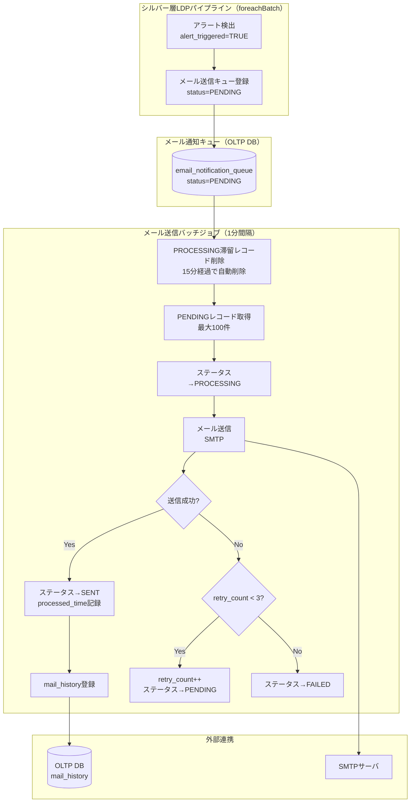
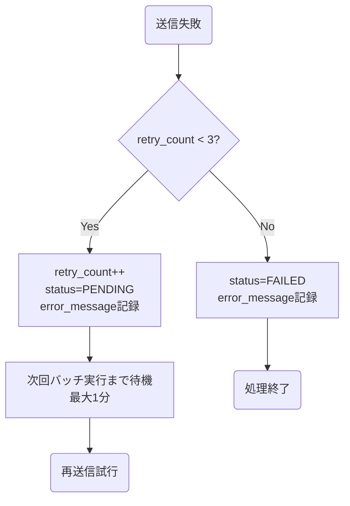

# Deltaテーブル最適化ジョブ

## 概要

Deltaテーブル最適化ジョブは、Deltaテーブルに対して登録されたデータを、Databricks Workflowで定期実行して最適化、削除を行うバッチジョブです。

### 主な責務

1. **Deltaテーブル最適化**: Deltaテーブルに登録されたデータが記載されている、物理的実体のメタデータ削減、I/O効率向上、クエリ高速化のため、登録データの再構成を行う。
2. **クリーンアップ**: データ保持期間を超過したデータを削除する。

---

## 機能ID

| 機能ID | 機能名              | 説明                               |
| ------ | ------------------- | ---------------------------------- |
| OP-001 | Deltaテーブル最適化 | Delta Lakeテーブルの最適化・圧縮   |
| OP-002 | クリーンアップ      | 古いデータ・チェックポイントの削除 |

---

## データモデル

### 入力データ

なし

### 出力先

| 出力                             | 形式                     | 説明                                                                   |
| -------------------------------- | ------------------------ | ---------------------------------------------------------------------- |
| silver_sensor_data               | Deltaテーブル            | シルバー層パイプラインがテレメトリデータを格納するテーブル             |
| gold_sensor_data_hourly_summary  | Deltaテーブル            | ゴールド層パイプラインがテレメトリデータの時次サマリを格納するテーブル |
| gold_sensor_data_daily_summary   | Deltaテーブル            | ゴールド層パイプラインがテレメトリデータの日次サマリを格納するテーブル |
| gold_sensor_data_monthly_summary | Deltaテーブル            | ゴールド層パイプラインがテレメトリデータの月次サマリを格納するテーブル |
| gold_sensor_data_yearly_summary  | Deltaテーブル            | ゴールド層パイプラインがテレメトリデータの年次サマリを格納するテーブル |
| check_point_data                 | チェックポイントテーブル | LangGraph会話状態永続化テーブル                                        |

---

## 使用テーブル一覧

### 読み取りテーブル

なし
### 書き込みテーブル（Deltaテーブル）

| テーブル名                      | 用途                                        |
| ------------------------------- | ------------------------------------------- |
| silver_sensor_data              | 登録データの最適化/データ保持期間を超過したデータの削除 |
| gold_sensor_data_hourly_summary | 送信済みメールの履歴記録                    |

---

## 処理フロー

### リトライフロー

---

## 障害時のTeams通知

以下のエラー発生時、Teamsのシステム保守者連絡チャネルに通知を行い、運用担当者が迅速に対応できるようにする。

| エラー種別         | 通知タイミング       | 説明                                       |
| ------------------ | -------------------- | ------------------------------------------ |
| SMTP接続失敗       | 最大リトライ超過後   | SMTPサーバへの接続失敗が連続した場合       |
| メール履歴記録失敗 | INSERT失敗時（即時） | mail_historyへのINSERT失敗時               |
| キュー取得失敗     | 例外発生時（即時）   | email_notification_queueへのアクセス失敗時 |
| FAILED件数過多     | 日次（100件超過）    | 大量のFAILEDレコード発生時                 |

詳細は[ジョブ仕様書](./job-specification.md)のエラーハンドリングセクションを参照。

---

## パフォーマンス要件

| 要件           | 値                       | 対応策                                     |
| -------------- | ------------------------ | ------------------------------------------ |
| 実行間隔       | 1分（60秒）              | Databricks Workflowの定期実行              |
| バッチ処理時間 | 1分以内                  | 1バッチあたり最大100件で次実行に干渉しない |
| メール送信     | 平均100件/分             | SMTP接続タイムアウト30秒以内               |
| E2Eレイテンシ  | アラート検出から70秒以内 | ストリーミング処理5秒 + キュー待機60秒     |

---

## データ保持ポリシー

| テーブル                 | 保持期間 | 削除対象            | 削除方式 |
| ------------------------ | -------- | ------------------- | -------- |
| email_notification_queue | 30日間   | SENT/FAILEDレコード | DELETE   |
| mail_history             | 恒久保持 | 削除しない          | -        |

クリーンアップは `email_queue_cleanup` ジョブ（日次 03:00）で実行する。

---

## 関連ドキュメント

### 機能仕様

- [ジョブ仕様書](./job-specification.md) - 処理コード・リトライ戦略・クリーンアップジョブ詳細

### 上流パイプライン

- [シルバー層LDPパイプライン概要](../../ldp-pipeline/silver-layer/README.md) - メール送信キュー登録元
- [シルバー層LDPパイプライン仕様書](../../ldp-pipeline/silver-layer/ldp-pipeline-specification.md) - メールキュー登録処理の詳細

### データベース設計

- [アプリケーションデータベース設計書](../../common/app-database-specification.md) - email_notification_queue・mail_historyテーブル定義

### 要件定義

- [機能要件定義書](../../../02-requirements/functional-requirements.md) - FR-003-2
- [非機能要件定義書](../../../02-requirements/non-functional-requirements.md) - NFR-PERF, NFR-AVAIL

---

## 変更履歴

| 日付       | 版数 | 変更内容 | 担当者       |
| ---------- | ---- | -------- | ------------ |
| 2026-04-01 | 1.0  | 初版作成 | Kei Sugiyama |
