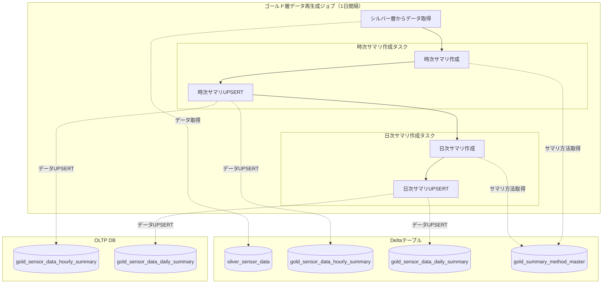
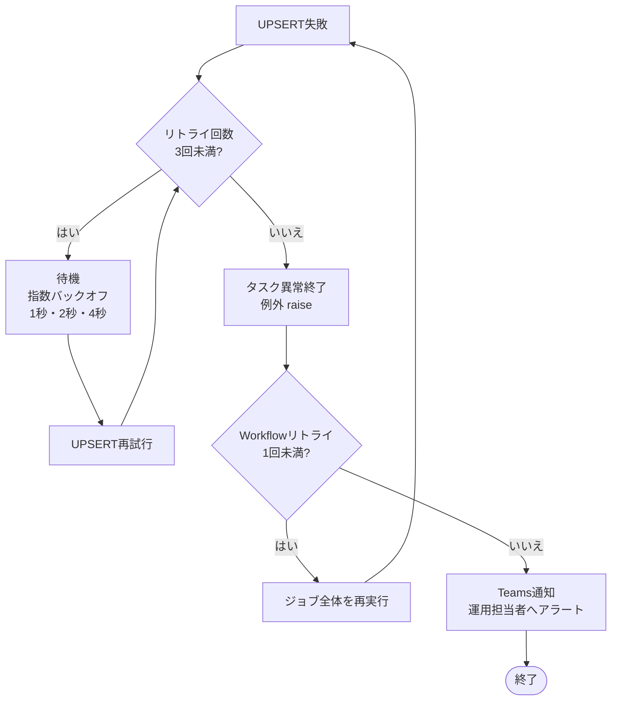

# ゴールド層データ再生成ジョブ

## 概要

ゴールド層データ再生成ジョブは、ゴールド層LDPパイプラインによって生成された時次サマリデータ、日次サマリデータを再生成するバッチジョブです。
再生成対象日のシルバー層センサーデータを全件取得し、時次サマリデータ、日次サマリデータを再生成します。
このバッチジョブの作用によって、Catalog内に存在するDeltaテーブルに登録されている時次サマリデータ、日次サマリデータと、OLTP DBに登録されている時次サマリデータ、日次サマリデータの間でのデータ不整合を解消し、業種別/顧客作成ダッシュボードから閲覧できるサマリデータと、対話型AIチャットで取得可能なサマリデータを一致させます。

### 主な責務

1. **時次サマリデータ生成**: シルバー層センサーデータ（iot_catalog.silver.silver_sensor_data）からデータを取得、時次サマリデータを生成
2. **日次サマリデータ生成**: シルバー層センサーデータ（iot_catalog.silver.silver_sensor_data）からデータを取得、日次サマリデータを生成
3. **時次サマリデータUPSERT**: 再生成した時次サマリデータの内容でDeltaテーブル（iot_catalog.gold.gold_sensor_data_hourly_summary）の登録結果、OLTP（iot_app_db.gold_sensor_data_hourly_summary）上のデータをUPSERTする
4. **日次サマリデータUPSERT**: 再生成した日次サマリデータの内容でDeltaテーブル（iot_catalog.gold.gold_sensor_data_daily_summary）の登録結果、OLTP（iot_app_db.gold_sensor_data_daily_summary）上のデータをUPSERTする

---

## 機能ID

| 機能ID   | 機能名                     | 説明                                                   |
| -------- | -------------------------- | ------------------------------------------------------ |
| FR-002-2 | 表示用データ変換・保存処理 | シルバー層センサーデータからゴールド層サマリデータ生成 |

---

## データモデル

### 入力データ

| データソース       | 形式          | 説明                                                       |
| ------------------ | ------------- | ---------------------------------------------------------- |
| silver_sensor_data | Deltaテーブル | シルバー層パイプラインが成形、登録したセンサーデータを保持 |

### 出力先

| 出力先                          | 形式                 | 説明                                |
| ------------------------------- | -------------------- | ----------------------------------- |
| gold_sensor_data_hourly_summary | OLTP DB UPSERT       | センサーデータ時次サマリの登録/更新 |
| gold_sensor_data_daily_summary  | OLTP DB UPSERT       | センサーデータ日次サマリの登録/更新 |
| gold_sensor_data_hourly_summary | Deltaテーブル UPSERT | センサーデータ時次サマリの登録/更新 |
| gold_sensor_data_daily_summary  | Deltaテーブル UPSERT | センサーデータ日次サマリの登録/更新 |

### センサーデータ時次サマリ（Deltaテーブル）カラム一覧

| #   | カラム物理名        | カラム論理名 | データ型  | NULL     | 説明                                                        |
| --- | ------------------- | ------------ | --------- | -------- | ----------------------------------------------------------- |
| 1   | device_id           | デバイスID   | INT       | NOT NULL | システム内でのIoTデバイスの一意識別子                       |
| 2   | organization_id     | 組織ID       | INT       | NOT NULL | 所属組織ID                                                  |
| 3   | collection_datetime | 集約日時     | DATETIME  | NOT NULL | センサーデータを集約した日時。形式は「YYYY/MM/DD HH:00:00」 |
| 4   | summary_item        | 集約対象項目 | INT       | NOT NULL | 集約対象の項目                                              |
| 5   | summary_method_id   | 集約方法ID   | INT       | NOT NULL | 集約方法ID（平均、分散など）                                |
| 6   | summary_value       | 集約値       | DOUBLE    | NOT NULL | 集約結果                                                    |
| 7   | data_count          | データ数     | INT       | NOT NULL | 集約したデータ数                                            |
| 8   | create_time         | 作成日時     | TIMESTAMP | NOT NULL | レコード作成日時                                            |

### センサーデータ時次サマリ（OLTP）カラム一覧

| #   | カラム物理名        | カラム論理名 | データ型  | NULL     | 説明                                                        |
| --- | ------------------- | ------------ | --------- | -------- | ----------------------------------------------------------- |
| 1   | device_id           | デバイスID   | INT       | NOT NULL | システム内でのIoTデバイスの一意識別子                       |
| 2   | organization_id     | 組織ID       | INT       | NOT NULL | 所属組織ID                                                  |
| 3   | collection_datetime | 集約日時     | DATETIME  | NOT NULL | センサーデータを集約した日時。形式は「YYYY/MM/DD HH:00:00」 |
| 4   | summary_item        | 集約対象項目 | INT       | NOT NULL | 集約対象の項目                                              |
| 5   | summary_method_id   | 集約方法ID   | INT       | NOT NULL | 集約方法ID（平均、分散など）                                |
| 6   | summary_value       | 集約値       | DOUBLE    | NOT NULL | 集約結果                                                    |
| 7   | data_count          | データ数     | INT       | NOT NULL | 集約したデータ数                                            |
| 8   | create_time         | 作成日時     | TIMESTAMP | NOT NULL | レコード作成日時                                            |

### センサーデータ日次サマリ（Deltaテーブル）カラム一覧

| #   | カラム物理名      | カラム論理名 | データ型  | NULL     | 説明                                  |
| --- | ----------------- | ------------ | --------- | -------- | ------------------------------------- |
| 1   | device_id         | デバイスID   | INT       | NOT NULL | システム内でのIoTデバイスの一意識別子 |
| 2   | organization_id   | 組織ID       | INT       | NOT NULL | 所属組織ID                            |
| 3   | collection_date   | 集約日       | DATE      | NOT NULL | センサーデータを集約した日時          |
| 4   | summary_item      | 集約対象項目 | INT       | NOT NULL | 集約対象の項目                        |
| 5   | summary_method_id | 集約方法ID   | INT       | NOT NULL | 集約方法ID（平均、分散など）          |
| 6   | summary_value     | 集約値       | DOUBLE    | NOT NULL | 集約結果                              |
| 7   | data_count        | データ数     | INT       | NOT NULL | 集約したデータ数                      |
| 8   | create_time       | 作成日時     | TIMESTAMP | NOT NULL | レコード作成日時                      |

### センサーデータ日次サマリ（OLTP）カラム一覧

| #   | カラム物理名      | カラム論理名 | データ型  | NULL     | 説明                                  |
| --- | ----------------- | ------------ | --------- | -------- | ------------------------------------- |
| 1   | device_id         | デバイスID   | INT       | NOT NULL | システム内でのIoTデバイスの一意識別子 |
| 2   | organization_id   | 組織ID       | INT       | NOT NULL | 所属組織ID                            |
| 3   | collection_date   | 集約日       | DATE      | NOT NULL | センサーデータを集約した日時          |
| 4   | summary_item      | 集約対象項目 | INT       | NOT NULL | 集約対象の項目                        |
| 5   | summary_method_id | 集約方法ID   | INT       | NOT NULL | 集約方法ID（平均、分散など）          |
| 6   | summary_value     | 集約値       | DOUBLE    | NOT NULL | 集約結果                              |
| 7   | data_count        | データ数     | INT       | NOT NULL | 集約したデータ数                      |
| 8   | create_time       | 作成日時     | TIMESTAMP | NOT NULL | レコード作成日時                      |

---

## 使用テーブル一覧

### 読み取りテーブル（Deltaテーブル）

| テーブル名                 | 用途                     |
| -------------------------- | ------------------------ |
| silver_sensor_data         | 再生成対象のデータを取得 |
| gold_summary_method_master | 再生成時の集計方法を取得 |

### 読み取りテーブル（OLTP）

なし

### 書き込みテーブル（Deltaテーブル）

| テーブル名                      | 用途                                                 |
| ------------------------------- | ---------------------------------------------------- |
| gold_sensor_data_hourly_summary | 対話側AIチャット機能で参照する時次サマリデータを格納 |
| gold_sensor_data_daily_summary  | 対話側AIチャット機能で参照する日次サマリデータを格納 |

### 書き込みテーブル（OLTP）

| テーブル名                      | 用途                                                              |
| ------------------------------- | ----------------------------------------------------------------- |
| gold_sensor_data_hourly_summary | 業種別/顧客作成ダッシュボード機能で参照する時次サマリデータを格納 |
| gold_sensor_data_daily_summary  | 業種別/顧客作成ダッシュボード機能で参照する日次サマリデータを格納 |

---

## 処理フロー

### リトライフロー

---

## 障害時のTeams通知

以下のエラー発生時、Teamsのシステム保守者連絡チャネルに通知を行い、運用担当者が迅速に対応できるようにする。

| エラー種別              | 通知タイミング       | 説明                             |
| ----------------------- | -------------------- | -------------------------------- |
| OLTP接続失敗            | 最大リトライ超過後   | OLTPへの接続失敗が連続した場合   |
| DeltaテーブルUPSERT失敗 | UPSERT失敗時（即時） | ゴールド層テーブルへの登録失敗時 |

詳細は[ジョブ仕様書](./job-specification.md)のエラーハンドリングセクションを参照。

---

## パフォーマンス要件

| 要件           | 値       | 対応策                                                         |
| -------------- | -------- | -------------------------------------------------------------- |
| 実行間隔       | 1日      | Databricks Workflowの定期実行（毎日定時実行）                  |
| バッチ処理時間 | 60分以内 | 再生成対象日はバッチ実行日の前日のデータのみとし、データ量削減 |

---

## データ保持ポリシー

| テーブル                                         | 保持期間 | 削除対象                  | 削除方式        |
| ------------------------------------------------ | -------- | ------------------------- | --------------- |
| iot_catalog.gold.gold_sensor_data_hourly_summary | 10年     | データ受信日から10年経過  | DELETE + VACUUM |
| iot_catalog.gold.gold_sensor_data_daily_summary  | 10年     | データ受信日から10年経過  | DELETE + VACUUM |
| iot_app_db.gold_sensor_data_hourly_summary       | 2か月    | データ受信日から2か月経過 | DELETE          |
| iot_app_db.gold_sensor_data_daily_summary        | 2か月    | データ受信日から2か月経過 | DELETE          |

クリーンアップは Deltaテーブル最適化ジョブ、OLTPデータ削除ジョブで実行する。詳細は各設計書を参照のこと。

---

## 関連ドキュメント

### 機能仕様

- [ジョブ仕様書](./job-specification.md) - 処理コード・リトライ戦略・ジョブ詳細

### 上流パイプライン

- [シルバー層LDPパイプライン概要](../../ldp-pipeline/silver-layer/README.md) - silver_sensor_data への書き込み元パイプライン概要
- [シルバー層LDPパイプライン仕様書](../../ldp-pipeline/silver-layer/ldp-pipeline-specification.md) - silver_sensor_data への書き込み処理の詳細

### データベース設計

- [アプリケーションデータベース設計書](../../common/app-database-specification.md) - OLTP DB上のテーブルのテーブル定義
- [UnityCatalogデータベース設計書](../../common/unity-catalog-database-specification.md) - Deltaテーブルのテーブル定義

### 要件定義

- [機能要件定義書](../../../02-requirements/functional-requirements.md) - FR-002-2
- [非機能要件定義書](../../../02-requirements/non-functional-requirements.md) - NFR-PERF, NFR-AVAIL

### 他関連機能

- [Deltaテーブル最適化ジョブ概要](../optimization/README.md)
- [Deltaテーブル最適化ジョブ仕様書](../optimization/job-specification.md)
- [OLTPデータ削除ジョブ概要](../oltp-cleanup/README.md)
- [OLTPデータ削除ジョブ仕様書](../oltp-cleanup/job-specification.md)

---

## 変更履歴

| 日付       | 版数 | 変更内容 | 担当者       |
| ---------- | ---- | -------- | ------------ |
| 2026-04-01 | 1.0  | 初版作成                                                                                                             | Kei Sugiyama |
| 2026-04-09 | 1.1  | リトライフロー図追加・上流パイプライン説明誤記修正（メール送信ジョブの記述混入箇所を修正）                           | Kei Sugiyama |
| 2026-04-09 | 1.2  | 誤記修正（日次サマリ関連「時次」「日時」→「日次」・主な責務「日次サマリデータ生成」表記統一・機能要件定義書参照 FR-003-2→FR-002-2） | Kei Sugiyama |
