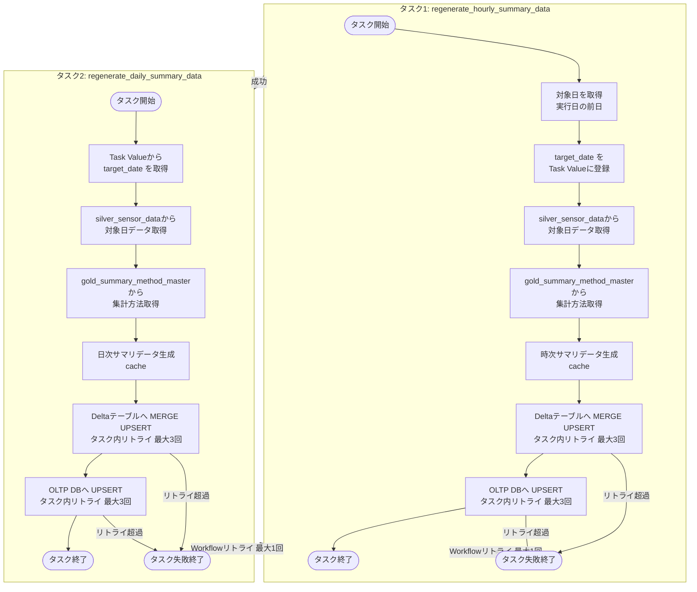
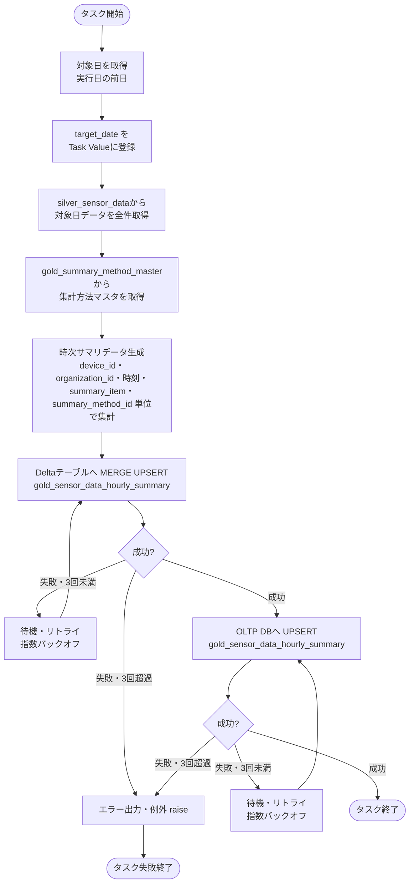
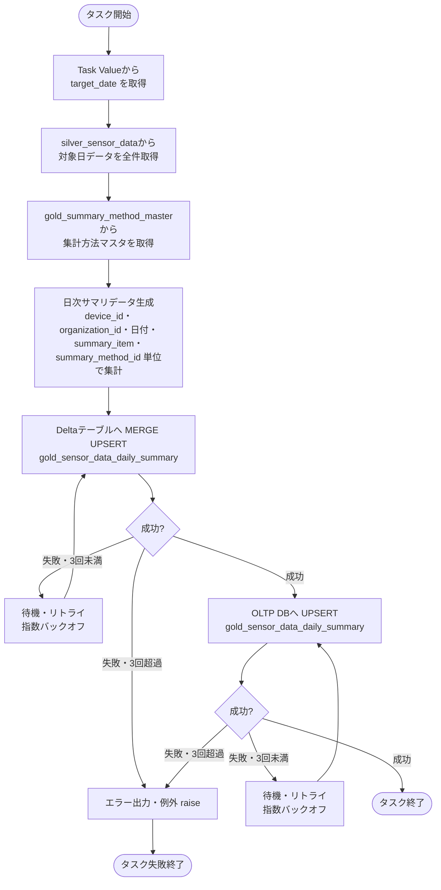

# ゴールド層データ再生成ジョブ仕様書

## 目次

- [ゴールド層データ再生成ジョブ仕様書](#ゴールド層データ再生成ジョブ仕様書)
  - [目次](#目次)
  - [概要](#概要)
    - [このドキュメントの役割](#このドキュメントの役割)
    - [対象機能](#対象機能)
    - [ジョブ一覧](#ジョブ一覧)
    - [タスク一覧](#タスク一覧)
  - [ジョブ処理フロー](#ジョブ処理フロー)
  - [共通関数](#共通関数)
  - [時次サマリデータ再生成タスク仕様](#時次サマリデータ再生成タスク仕様)
    - [タスク概要](#タスク概要)
    - [処理フロー](#処理フロー)
    - [処理コード](#処理コード)
    - [UPSERT設定](#upsert設定)
  - [日次サマリデータ再生成タスク仕様](#日次サマリデータ再生成タスク仕様)
    - [タスク概要](#タスク概要-1)
    - [処理フロー](#処理フロー-1)
    - [処理コード](#処理コード-1)
    - [UPSERT設定](#upsert設定-1)
  - [リトライ戦略](#リトライ戦略)
  - [エラーハンドリング](#エラーハンドリング)
  - [関連ドキュメント](#関連ドキュメント)
  - [変更履歴](#変更履歴)

---

## 概要

このドキュメントは、Databricks Workflowとして実装するゴールド層データ再生成ジョブの詳細を記載します。

### このドキュメントの役割

- シルバー層センサーデータからゴールド層時次・日次サマリデータを再生成する処理
- DeltaテーブルおよびOLTP DBへのUPSERT処理

### 対象機能

| 機能ID   | 機能名                     | 処理内容                                                   |
| -------- | -------------------------- | ---------------------------------------------------------- |
| FR-002-2 | 表示用データ変換・保存処理 | シルバー層センサーデータからゴールド層サマリデータを再生成 |

### ジョブ一覧

| ジョブ名               | 実行間隔      | 説明                                                                |
| ---------------------- | ------------- | ------------------------------------------------------------------- |
| gold_data_regeneration | 日次（01:00） | 前日分のシルバー層データから時次・日次サマリを再生成しUPSERTを実行 |

### タスク一覧

| タスク名                       | 実行順序 | 説明                                                         |
| ------------------------------ | -------- | ------------------------------------------------------------ |
| regenerate_hourly_summary_data | 1        | 時次サマリデータを再生成、Deltaテーブル、OLTPへ登録/更新する |
| regenerate_daily_summary_data  | 2        | 日次サマリデータを再生成、Deltaテーブル、OLTPへ登録/更新する |

実行順序が若いもの順で直列で実行する。OLTP DBへの接続負荷を抑えるため、並列実行は行わない。

---

## ジョブ処理フロー

タスク間で `target_date`（再生成対象日）を Task Values で受け渡す。



---

## 共通関数

時次・日次の両タスクで使用する共通処理を `common_gold_regeneration.py` に定義する。

```python
# common_gold_regeneration.py

import time
import pymysql
import pymysql.cursors
from datetime import date
from pyspark.sql import functions as F
from pyspark.sql.types import IntegerType, DoubleType, TimestampType

SILVER_TABLE      = "iot_catalog.silver.silver_sensor_data"
SUMMARY_MASTER    = "iot_catalog.gold.gold_summary_method_master"
MAX_RETRIES       = 3
BASE_WAIT_SEC     = 1.0
DB_SECRET_SCOPE   = "my_sql_secrets"


def _execute_with_retry(func, label: str = ""):
    """指数バックオフで最大 MAX_RETRIES 回リトライする。
    待機間隔: BASE_WAIT_SEC * 2^attempt 秒（1秒 → 2秒 → 4秒）
    全試行失敗時は最後の例外を raise する。
    注意: func は冪等な処理（UPSERT）に限定すること。
    """
    for attempt in range(MAX_RETRIES + 1):
        try:
            return func()
        except Exception as e:
            if attempt >= MAX_RETRIES:
                raise
            wait = BASE_WAIT_SEC * (2 ** attempt)
            print(f"  [{label}] リトライ {attempt + 1}/{MAX_RETRIES}: {wait:.0f}秒後に再実行 - {str(e)}")
            time.sleep(wait)


def get_db_config() -> dict:
    """OLTP DB接続設定をDatabricks Secretsから取得する。
    注意: db_configはコード内でのみ生成し、外部入力を混入させないこと。
    """
    return {
        "host":        dbutils.secrets.get(DB_SECRET_SCOPE, "mysql-host"),
        "port":        int(dbutils.secrets.get(DB_SECRET_SCOPE, "mysql-port")),
        "user":        dbutils.secrets.get(DB_SECRET_SCOPE, "mysql-user"),
        "password":    dbutils.secrets.get(DB_SECRET_SCOPE, "mysql-password"),
        "database":    dbutils.secrets.get(DB_SECRET_SCOPE, "mysql-database"),
        "cursorclass": pymysql.cursors.DictCursor,
        "charset":     "utf8mb4",
    }


def fetch_silver_data(target_date: date):
    """指定日のシルバー層センサーデータを全件取得する。"""
    print(f"シルバー層データ取得開始: {target_date}")
    df = (
        spark.table(SILVER_TABLE)
        .filter(F.to_date(F.col("event_timestamp")) == F.lit(str(target_date)))
    )
    print(f"  - 取得件数: {df.count()}件")
    return df


def fetch_summary_methods() -> dict:
    """gold_summary_method_master から集計方法マスタを取得する。
    戻り値: {summary_method_id: summary_method_code} の辞書
    """
    rows = (
        spark.table(SUMMARY_MASTER)
        .filter(F.col("delete_flag") == False)
        .select("summary_method_id", "summary_method_code")
        .collect()
    )
    return {row["summary_method_id"]: row["summary_method_code"] for row in rows}


def _build_agg_dfs(silver_df, summary_methods: dict, group_key_cols: list, datetime_col: str) -> list:
    """集計方法ごとにサマリ DataFrame を生成して返す（内部共通処理）。

    対応する summary_method_code（gold_summary_method_master）:
        AVG    (1): 平均値
        MAX    (2): 最大値
        MIN    (3): 最小値
        P25    (4): 第1四分位数（25パーセンタイル）
        MEDIAN (5): 中央値（50パーセンタイル）
        P75    (6): 第3四分位数（75パーセンタイル）
        STDDEV (7): 標準偏差
        P95    (8): 上側5％境界値（95パーセンタイル）
        SUM    (9): 合計
    """
    agg_map = {
        "AVG":    F.avg("value"),
        "MAX":    F.max("value"),
        "MIN":    F.min("value"),
        "P25":    F.percentile_approx("value", 0.25),
        "MEDIAN": F.percentile_approx("value", 0.50),
        "P75":    F.percentile_approx("value", 0.75),
        "STDDEV": F.stddev("value"),
        "P95":    F.percentile_approx("value", 0.95),
        "SUM":    F.sum("value"),
    }
    summary_dfs = []
    for method_id, method_code in summary_methods.items():
        agg_func = agg_map.get(method_code)
        if agg_func is None:
            print(f"  - 未対応の集計方法をスキップ: method_id={method_id}, method_code={method_code}")
            continue
        summary_df = (
            silver_df
            .groupBy(*group_key_cols, "measurement_item_id")
            .agg(
                agg_func.alias("summary_value"),
                F.count("value").alias("data_count"),
            )
            .withColumn("summary_item", F.col("measurement_item_id"))
            .withColumn("summary_method_id", F.lit(method_id).cast(IntegerType()))
            .withColumn("create_time", F.current_timestamp())
            .select(
                "device_id", "organization_id", datetime_col,
                "summary_item", "summary_method_id",
                F.col("summary_value").cast(DoubleType()),
                F.col("data_count").cast(IntegerType()),
                "create_time",
            )
        )
        summary_dfs.append(summary_df)
    if not summary_dfs:
        raise ValueError("集計可能な集計方法が存在しません")
    return summary_dfs


def generate_hourly_summary(silver_df, summary_methods: dict):
    """シルバー層データから時次サマリを生成する。
    集計キー: device_id, organization_id, collection_datetime（時刻切り捨て）,
               summary_item, summary_method_id
    """
    print("時次サマリ生成開始")
    df = silver_df.withColumn(
        "collection_datetime",
        F.date_trunc("hour", F.col("event_timestamp")).cast(TimestampType())
    )
    summary_dfs = _build_agg_dfs(
        df, summary_methods,
        group_key_cols=["device_id", "organization_id", "collection_datetime"],
        datetime_col="collection_datetime",
    )
    result_df = summary_dfs[0]
    for sdf in summary_dfs[1:]:
        result_df = result_df.union(sdf)
    result_df = result_df.cache()
    print(f"  - 時次サマリ生成件数: {result_df.count()}件")
    return result_df


def generate_daily_summary(silver_df, summary_methods: dict):
    """シルバー層データから日次サマリを生成する。
    集計キー: device_id, organization_id, collection_date（日付）,
               summary_item, summary_method_id
    """
    print("日次サマリ生成開始")
    df = silver_df.withColumn(
        "collection_date",
        F.to_date(F.col("event_timestamp"))
    )
    summary_dfs = _build_agg_dfs(
        df, summary_methods,
        group_key_cols=["device_id", "organization_id", "collection_date"],
        datetime_col="collection_date",
    )
    result_df = summary_dfs[0]
    for sdf in summary_dfs[1:]:
        result_df = result_df.union(sdf)
    result_df = result_df.cache()
    print(f"  - 日次サマリ生成件数: {result_df.count()}件")
    return result_df
```

---

## 時次サマリデータ再生成タスク仕様

### タスク概要

| 項目             | 設定値                              |
| ---------------- | ----------------------------------- |
| タスク名         | regenerate_hourly_summary_data      |
| 実行方式         | Databricks Workflow                 |
| 実行間隔         | 日次（cron: `0 1 * * *`）毎日 01:00 |
| クラスタ         | Jobs Compute（サーバーレス推奨）    |
| タイムアウト     | 30分                                |
| リトライポリシー | 失敗時1回リトライ                   |

### 処理フロー



### 処理コード

```python
# regenerate_hourly_summary_data.py
from datetime import date, timedelta
from delta.tables import DeltaTable
import pymysql
from common_gold_regeneration import (
    get_db_config, fetch_silver_data, fetch_summary_methods, generate_hourly_summary,
    _execute_with_retry,
)

HOURLY_DELTA    = "iot_catalog.gold.gold_sensor_data_hourly_summary"
HOURLY_OLTP_TBL = "gold_sensor_data_hourly_summary"


def upsert_to_delta_hourly(summary_df):
    """時次サマリをDeltaテーブルへ MERGE UPSERT する。
    マージキー: device_id, organization_id, collection_datetime,
                summary_item, summary_method_id
    """
    print(f"Delta UPSERT開始: {HOURLY_DELTA}")
    try:
        def _do():
            delta_table = DeltaTable.forName(spark, HOURLY_DELTA)
            (
                delta_table.alias("tgt")
                .merge(
                    summary_df.alias("src"),
                    """
                    tgt.device_id           = src.device_id
                    AND tgt.organization_id     = src.organization_id
                    AND tgt.collection_datetime = src.collection_datetime
                    AND tgt.summary_item        = src.summary_item
                    AND tgt.summary_method_id   = src.summary_method_id
                    """
                )
                .whenMatchedUpdate(set={
                    "summary_value": "src.summary_value",
                    "data_count":    "src.data_count",
                    "create_time":   "src.create_time",
                })
                .whenNotMatchedInsertAll()
                .execute()
            )
        _execute_with_retry(_do, label=HOURLY_DELTA)
        print(f"Delta UPSERT完了: {HOURLY_DELTA}")
    except Exception as e:
        print(f"Delta UPSERTエラー: {HOURLY_DELTA} - {str(e)}")
        raise


def upsert_to_oltp_hourly(summary_df):
    """時次サマリをOLTP DBへバルク UPSERT する。
    一意制約キー: device_id, organization_id, collection_datetime,
                  summary_item, summary_method_id
    """
    print(f"OLTP UPSERT開始: {HOURLY_OLTP_TBL}")
    try:
        records = summary_df.collect()

        def _do():
            with pymysql.connect(**get_db_config()) as conn:
                with conn.cursor() as cursor:
                    # テーブル名はコード内定数（HOURLY_OLTP_TBL）のみ使用。外部入力は混入させないこと。
                    sql = f"""
                        INSERT INTO {HOURLY_OLTP_TBL}
                            (device_id, organization_id, collection_datetime,
                             summary_item, summary_method_id, summary_value,
                             data_count, create_time)
                        VALUES (%s, %s, %s, %s, %s, %s, %s, %s)
                        ON DUPLICATE KEY UPDATE
                            summary_value = VALUES(summary_value),
                            data_count    = VALUES(data_count),
                            create_time   = VALUES(create_time)
                    """
                    cursor.executemany(sql, [
                        (r["device_id"], r["organization_id"], r["collection_datetime"],
                         r["summary_item"], r["summary_method_id"],
                         r["summary_value"], r["data_count"], r["create_time"])
                        for r in records
                    ])
                conn.commit()

        _execute_with_retry(_do, label=HOURLY_OLTP_TBL)
        print(f"OLTP UPSERT完了: {HOURLY_OLTP_TBL} - {len(records)}件")
    except Exception as e:
        print(f"OLTP UPSERTエラー: {HOURLY_OLTP_TBL} - {str(e)}")
        raise


def run():
    # 対象日: 実行日の前日
    target_date = date.today() - timedelta(days=1)
    print(f"時次サマリ再生成開始: 対象日={target_date}")

    # target_date を Task Value に登録（タスク2で使用）
    dbutils.jobs.taskValues.set(key="target_date", value=str(target_date))

    silver_df       = fetch_silver_data(target_date)
    summary_methods = fetch_summary_methods()
    hourly_df       = generate_hourly_summary(silver_df, summary_methods)

    try:
        upsert_to_delta_hourly(hourly_df)
        upsert_to_oltp_hourly(hourly_df)
    finally:
        hourly_df.unpersist()

    print(f"時次サマリ再生成完了: 対象日={target_date}")


# タスク実行
run()
```

### UPSERT設定

**Deltaテーブル MERGE**

| 項目           | 設定値                                                                                       |
| -------------- | -------------------------------------------------------------------------------------------- |
| 対象テーブル   | `iot_catalog.gold.gold_sensor_data_hourly_summary`                                           |
| マージキー     | device_id, organization_id, collection_datetime, summary_item, summary_method_id            |
| 一致時         | summary_value, data_count, create_time を更新                                               |
| 不一致時       | 全カラムを INSERT                                                                            |

**OLTP DB UPSERT**

| 項目           | 設定値                                                                                       |
| -------------- | -------------------------------------------------------------------------------------------- |
| 対象テーブル   | `gold_sensor_data_hourly_summary`                                                            |
| 一意制約キー   | device_id, organization_id, collection_datetime, summary_item, summary_method_id            |
| 更新カラム     | summary_value, data_count, create_time                                                      |
| 実装方式       | INSERT ON DUPLICATE KEY UPDATE（バルク executemany）                                         |

---

## 日次サマリデータ再生成タスク仕様

### タスク概要

| 項目             | 設定値                                          |
| ---------------- | ----------------------------------------------- |
| タスク名         | regenerate_daily_summary_data                   |
| 実行方式         | Databricks Workflow                             |
| 実行間隔         | regenerate_hourly_summary_data タスク完了後     |
| クラスタ         | Jobs Compute（サーバーレス推奨）                |
| タイムアウト     | 30分                                            |
| リトライポリシー | 失敗時1回リトライ                               |

### 処理フロー



### 処理コード

```python
# regenerate_daily_summary_data.py
from datetime import date, timedelta
from delta.tables import DeltaTable
import pymysql
from common_gold_regeneration import (
    get_db_config, fetch_silver_data, fetch_summary_methods, generate_daily_summary,
    _execute_with_retry,
)

DAILY_DELTA    = "iot_catalog.gold.gold_sensor_data_daily_summary"
DAILY_OLTP_TBL = "gold_sensor_data_daily_summary"


def upsert_to_delta_daily(summary_df):
    """日次サマリをDeltaテーブルへ MERGE UPSERT する。
    マージキー: device_id, organization_id, collection_date,
                summary_item, summary_method_id
    """
    print(f"Delta UPSERT開始: {DAILY_DELTA}")
    try:
        def _do():
            delta_table = DeltaTable.forName(spark, DAILY_DELTA)
            (
                delta_table.alias("tgt")
                .merge(
                    summary_df.alias("src"),
                    """
                    tgt.device_id         = src.device_id
                    AND tgt.organization_id   = src.organization_id
                    AND tgt.collection_date   = src.collection_date
                    AND tgt.summary_item      = src.summary_item
                    AND tgt.summary_method_id = src.summary_method_id
                    """
                )
                .whenMatchedUpdate(set={
                    "summary_value": "src.summary_value",
                    "data_count":    "src.data_count",
                    "create_time":   "src.create_time",
                })
                .whenNotMatchedInsertAll()
                .execute()
            )
        _execute_with_retry(_do, label=DAILY_DELTA)
        print(f"Delta UPSERT完了: {DAILY_DELTA}")
    except Exception as e:
        print(f"Delta UPSERTエラー: {DAILY_DELTA} - {str(e)}")
        raise


def upsert_to_oltp_daily(summary_df):
    """日次サマリをOLTP DBへバルク UPSERT する。
    一意制約キー: device_id, organization_id, collection_date,
                  summary_item, summary_method_id
    """
    print(f"OLTP UPSERT開始: {DAILY_OLTP_TBL}")
    try:
        records = summary_df.collect()

        def _do():
            with pymysql.connect(**get_db_config()) as conn:
                with conn.cursor() as cursor:
                    # テーブル名はコード内定数（DAILY_OLTP_TBL）のみ使用。外部入力は混入させないこと。
                    sql = f"""
                        INSERT INTO {DAILY_OLTP_TBL}
                            (device_id, organization_id, collection_date,
                             summary_item, summary_method_id, summary_value,
                             data_count, create_time)
                        VALUES (%s, %s, %s, %s, %s, %s, %s, %s)
                        ON DUPLICATE KEY UPDATE
                            summary_value = VALUES(summary_value),
                            data_count    = VALUES(data_count),
                            create_time   = VALUES(create_time)
                    """
                    cursor.executemany(sql, [
                        (r["device_id"], r["organization_id"], r["collection_date"],
                         r["summary_item"], r["summary_method_id"],
                         r["summary_value"], r["data_count"], r["create_time"])
                        for r in records
                    ])
                conn.commit()

        _execute_with_retry(_do, label=DAILY_OLTP_TBL)
        print(f"OLTP UPSERT完了: {DAILY_OLTP_TBL} - {len(records)}件")
    except Exception as e:
        print(f"OLTP UPSERTエラー: {DAILY_OLTP_TBL} - {str(e)}")
        raise


def run():
    # target_date をタスク1の Task Value から取得
    target_date_str = dbutils.jobs.taskValues.get(
        taskKey    = "regenerate_hourly_summary_data",
        key        = "target_date",
        debugValue = str(date.today() - timedelta(days=1)),
    )
    target_date = date.fromisoformat(target_date_str)
    print(f"日次サマリ再生成開始: 対象日={target_date}")

    silver_df       = fetch_silver_data(target_date)
    summary_methods = fetch_summary_methods()
    daily_df        = generate_daily_summary(silver_df, summary_methods)

    try:
        upsert_to_delta_daily(daily_df)
        upsert_to_oltp_daily(daily_df)
    finally:
        daily_df.unpersist()

    print(f"日次サマリ再生成完了: 対象日={target_date}")


# タスク実行
run()
```

### UPSERT設定

**Deltaテーブル MERGE**

| 項目           | 設定値                                                                                    |
| -------------- | ----------------------------------------------------------------------------------------- |
| 対象テーブル   | `iot_catalog.gold.gold_sensor_data_daily_summary`                                         |
| マージキー     | device_id, organization_id, collection_date, summary_item, summary_method_id             |
| 一致時         | summary_value, data_count, create_time を更新                                            |
| 不一致時       | 全カラムを INSERT                                                                         |

**OLTP DB UPSERT**

| 項目           | 設定値                                                                                    |
| -------------- | ----------------------------------------------------------------------------------------- |
| 対象テーブル   | `gold_sensor_data_daily_summary`                                                          |
| 一意制約キー   | device_id, organization_id, collection_date, summary_item, summary_method_id             |
| 更新カラム     | summary_value, data_count, create_time                                                   |
| 実装方式       | INSERT ON DUPLICATE KEY UPDATE（バルク executemany）                                      |

---

## リトライ戦略

### ジョブリトライ戦略（Databricks Workflow）

タスクが例外 raise で異常終了した場合、Databricks Workflow のリトライポリシーによりジョブ全体を再実行する。

| 項目             | 値           | 説明                                                         |
| ---------------- | ------------ | ------------------------------------------------------------ |
| 最大リトライ回数 | 1回          | Databricks Workflow のリトライポリシーによる再実行           |
| リトライ間隔     | 即時         | タスク内リトライ超過後、Workflow がジョブ全体を再実行する    |
| タイムアウト     | 各タスク30分 | タスクごとのタイムアウト                                     |
| 冪等性           | 保証         | 処理は UPSERT のため、再実行しても二重登録は発生しない       |

### タスク内リトライ戦略（コード）

Delta UPSERT・OLTP UPSERT の書き込み処理失敗時、コード内で指数バックオフによるリトライを行う。

| 項目             | 値                        | 説明                                                               |
| ---------------- | ------------------------- | ------------------------------------------------------------------ |
| 最大リトライ回数 | 3回                       | `MAX_RETRIES = 3`（`common_gold_regeneration.py`）                 |
| リトライ間隔     | 指数バックオフ            | 1回目: 1秒、2回目: 2秒、3回目: 4秒（`BASE_WAIT_SEC * 2^attempt`） |
| リトライ対象処理 | Delta UPSERT・OLTP UPSERT | `_execute_with_retry()` でラップ                                   |
| 全試行失敗時     | 例外 raise                | タスクを異常終了させ、Workflow のジョブリトライへ委譲する          |

---

## エラーハンドリング

以下のエラー発生時、Teamsのシステム保守者連絡チャネルへ通知を行う。

| エラー種別              | 通知タイミング       | 説明                                        |
| ----------------------- | -------------------- | ------------------------------------------- |
| OLTP接続失敗            | 最大リトライ超過後   | OLTP DBへの接続失敗が連続した場合           |
| DeltaテーブルUPSERT失敗 | UPSERT失敗時（即時） | ゴールド層Deltaテーブルへの登録失敗時       |

Teams通知の実装詳細は[共通仕様書](../../common/common-specification.md)を参照。

---

## 関連ドキュメント

- [README.md](./README.md) - ゴールド層データ再生成ジョブ概要
- [共通仕様書](../../common/common-specification.md) - Teams通知・共通エラーハンドリング仕様
- [シルバー層LDPパイプライン概要](../../ldp-pipeline/silver-layer/README.md) - silver_sensor_data への書き込み処理の概要
- [シルバー層LDPパイプライン仕様書](../../ldp-pipeline/silver-layer/ldp-pipeline-specification.md) - silver_sensor_data への書き込み処理の詳細
- [アプリケーションデータベース設計書](../../common/app-database-specification.md) - OLTP DB上のテーブル定義
- [UnityCatalogデータベース設計書](../../common/unity-catalog-database-specification.md) - Deltaテーブルのテーブル定義
- [Deltaテーブル最適化ジョブ仕様書](../optimization/job-specification.md) - Deltaテーブルクリーンアップ詳細
- [OLTPデータ削除ジョブ仕様書](../oltp-cleanup/job-specification.md) - OLTP DBクリーンアップ詳細

---

## 変更履歴

| 日付       | 版数 | 変更内容                                                           | 担当者       |
| ---------- | ---- | ------------------------------------------------------------------ | ------------ |
| 2026-04-09 | 1.0  | 初版作成                                                           | Kei Sugiyama |
| 2026-04-09 | 1.1  | タスク分割対応・共通関数追加・Task Values による対象日受け渡し追加 | Kei Sugiyama |
| 2026-04-09 | 1.2  | 集計方法を gold_summary_method_master の全9種に対応（P25/MEDIAN/P75/STDDEV/P95/SUM 追加） | Kei Sugiyama |
| 2026-04-09 | 1.3  | タスク内リトライ追加（指数バックオフ3回）・delete_flag フィルタ追加・debugValue バグ修正・DataFrame cache 追加・フロー図修正 | Kei Sugiyama |
| 2026-04-09 | 1.4  | DB_SECRET_SCOPE 定数追加（Secrets scope 名の明示化）                                                                       | Kei Sugiyama |
