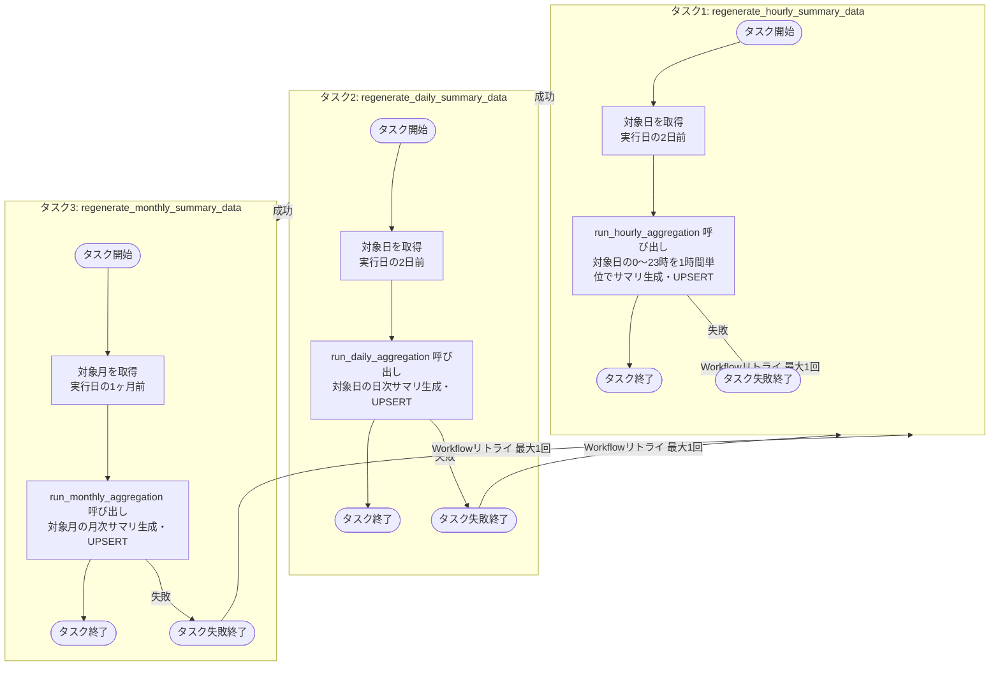
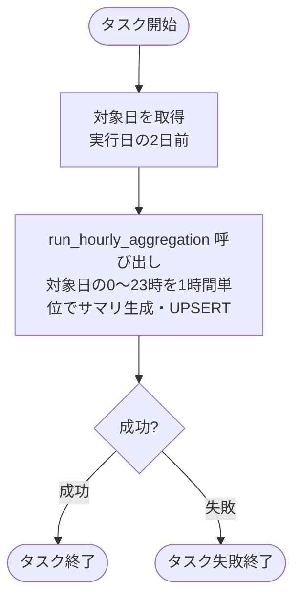
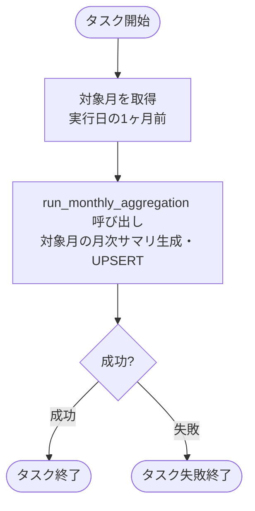

# ゴールド層データ再生成ジョブ仕様書

## 目次

- [ゴールド層データ再生成ジョブ仕様書](#ゴールド層データ再生成ジョブ仕様書)
  - [目次](#目次)
  - [概要](#概要)
    - [このドキュメントの役割](#このドキュメントの役割)
    - [対象機能](#対象機能)
    - [ジョブ一覧](#ジョブ一覧)
    - [タスク一覧](#タスク一覧)
  - [ジョブ処理フロー](#ジョブ処理フロー)
  - [共通関数](#共通関数)
  - [時次サマリデータ再生成タスク仕様](#時次サマリデータ再生成タスク仕様)
    - [タスク概要](#タスク概要)
    - [処理フロー](#処理フロー)
    - [処理コード](#処理コード)
  - [日次サマリデータ再生成タスク仕様](#日次サマリデータ再生成タスク仕様)
    - [タスク概要](#タスク概要-1)
    - [処理フロー](#処理フロー-1)
    - [処理コード](#処理コード-1)
  - [月次サマリデータ再生成タスク仕様](#月次サマリデータ再生成タスク仕様)
    - [タスク概要](#タスク概要-2)
    - [処理フロー](#処理フロー-2)
    - [処理コード](#処理コード-2)
  - [リトライ戦略](#リトライ戦略)
    - [ジョブリトライ戦略（Databricks Workflow）](#ジョブリトライ戦略databricks-workflow)
    - [タスク内リトライ戦略（コード）](#タスク内リトライ戦略コード)
  - [エラーハンドリング](#エラーハンドリング)
  - [関連ドキュメント](#関連ドキュメント)
  - [変更履歴](#変更履歴)

---

## 概要

このドキュメントは、Databricks Workflowとして実装するゴールド層データ再生成ジョブの詳細を記載します。

### このドキュメントの役割

- シルバー層センサーデータからゴールド層時次・日次サマリデータを再生成する処理
- DeltaテーブルおよびOLTP DBへのUPSERT処理

### 対象機能

| 機能ID   | 機能名                     | 処理内容                                                   |
| -------- | -------------------------- | ---------------------------------------------------------- |
| FR-002-2 | 表示用データ変換・保存処理 | シルバー層センサーデータからゴールド層サマリデータを再生成 |

### ジョブ一覧

| ジョブ名               | 実行間隔      | 説明                                                                      |
| ---------------------- | ------------- | ------------------------------------------------------------------------- |
| gold_data_regeneration | 日次（01:00） | 2日前分のシルバー層データから時次・日次・月次サマリを再生成しUPSERTを実行 |

### タスク一覧

| タスク名                        | 実行順序 | 説明                                                         |
| ------------------------------- | -------- | ------------------------------------------------------------ |
| regenerate_hourly_summary_data  | 1        | 時次サマリデータを再生成、Deltaテーブル、OLTPへ登録/更新する |
| regenerate_daily_summary_data   | 2        | 日次サマリデータを再生成、Deltaテーブル、OLTPへ登録/更新する |
| regenerate_monthly_summary_data | 3        | 月次サマリデータを再生成、Deltaテーブル、OLTPへ登録/更新する |

実行順序が若いもの順で直列で実行する。OLTP DBへの接続負荷を抑えるため、並列実行は行わない。

---

## ジョブ処理フロー

各タスクは独立して対象日時を計算し、ゴールド層LDPパイプライン関数を呼び出す。



---

## 共通関数

各タスクはゴールド層LDPパイプラインの関数（`run_hourly_aggregation` / `run_daily_aggregation` / `run_monthly_aggregation`）を呼び出す。シルバー層データ取得・サマリ生成・DeltaテーブルおよびOLTP DBへのUPSERT処理はすべてLDPパイプライン側に委譲する。

LDPパイプライン関数の実装詳細は[ゴールド層LDPパイプライン仕様書](../../ldp-pipeline/gold_layer/ldp-pipeline-specification.md)を参照。

---

## 時次サマリデータ再生成タスク仕様

### タスク概要

| 項目             | 設定値                              |
| ---------------- | ----------------------------------- |
| タスク名         | regenerate_hourly_summary_data      |
| 実行方式         | Databricks Workflow                 |
| 実行間隔         | 日次（cron: `0 3 * * *`）毎日 03:00 |
| クラスタ         | Serverless Job Compute              |
| タイムアウト     | 30分                                |
| リトライポリシー | タスク失敗時1回リトライ             |

### 処理フロー



### 処理コード

```python
# regenerate_hourly_summary_data.py
from datetime import datetime, timedelta, timezone

# ゴールド層LDPパイプライン関数をインポート
from gold_ldp_pipeline import run_hourly_aggregation


def run():
    # 対象日: JST基準で実行日の2日前
    target_date = datetime.now(timezone(timedelta(hours=9))).date() - timedelta(days=2)
    print(f"時次サマリ再生成開始: 対象日={target_date}")

    # LDPパイプライン関数呼び出し（0〜23時を1時間単位でループし、サマリ生成・UPSERT）
    run_hourly_aggregation(target_date=target_date)

    print(f"時次サマリ再生成完了: 対象日={target_date}")


# タスク実行
run()
```

---

## 日次サマリデータ再生成タスク仕様

### タスク概要

| 項目             | 設定値                                      |
| ---------------- | ------------------------------------------- |
| タスク名         | regenerate_daily_summary_data               |
| 実行方式         | Databricks Workflow                         |
| 実行間隔         | regenerate_hourly_summary_data タスク完了後 |
| クラスタ         | Serverless Job Compute                      |
| タイムアウト     | 30分                                        |
| リトライポリシー | タスク失敗時1回リトライ                     |

### 処理フロー


### 処理コード

```python
# regenerate_daily_summary_data.py
from datetime import datetime, timedelta, timezone

# ゴールド層LDPパイプライン関数をインポート
from gold_ldp_pipeline import run_daily_aggregation


def run():
    # 対象日: JST基準で実行日の2日前
    target_date = datetime.now(timezone(timedelta(hours=9))).date() - timedelta(days=2)
    print(f"日次サマリ再生成開始: 対象日={target_date}")

    # LDPパイプライン関数呼び出し（日次サマリ生成・UPSERT）
    run_daily_aggregation(target_date=target_date)

    print(f"日次サマリ再生成完了: 対象日={target_date}")


# タスク実行
run()
```

---

## 月次サマリデータ再生成タスク仕様

### タスク概要

| 項目             | 設定値                                     |
| ---------------- | ------------------------------------------ |
| タスク名         | regenerate_monthly_summary_data            |
| 実行方式         | Databricks Workflow                        |
| 実行間隔         | regenerate_daily_summary_data タスク完了後 |
| クラスタ         | Serverless Job Compute                     |
| タイムアウト     | 30分                                       |
| リトライポリシー | タスク失敗時1回リトライ                    |

### 処理フロー



### 処理コード

```python
# regenerate_monthly_summary_data.py
from datetime import datetime, timedelta, timezone
from dateutil.relativedelta import relativedelta

# ゴールド層LDPパイプライン関数をインポート
from gold_ldp_pipeline import run_monthly_aggregation


def run():
    # 対象月: JST基準で実行日の1ヶ月前（"YYYY-MM" 形式）
    target_month = (
        datetime.now(timezone(timedelta(hours=9))).date() - relativedelta(months=1)
    ).strftime("%Y-%m")
    print(f"月次サマリ再生成開始: 対象月={target_month}")

    # LDPパイプライン関数呼び出し（月次サマリ生成・UPSERT）
    run_monthly_aggregation(target_month=target_month)

    print(f"月次サマリ再生成完了: 対象月={target_month}")


# タスク実行
run()
```

---

## リトライ戦略

### ジョブリトライ戦略（Databricks Workflow）

タスクが例外 raise で異常終了した場合、Databricks Workflow のリトライポリシーによりジョブ全体を再実行する。

| 項目             | 値           | 説明                                                      |
| ---------------- | ------------ | --------------------------------------------------------- |
| 最大リトライ回数 | 1回          | Databricks Workflow のリトライポリシーによる再実行        |
| リトライ間隔     | 即時         | タスク内リトライ超過後、Workflow がジョブ全体を再実行する |
| タイムアウト     | 各タスク30分 | タスクごとのタイムアウト                                  |
| 冪等性           | 保証         | 処理は UPSERT のため、再実行しても二重登録は発生しない    |

### タスク内リトライ戦略（コード）

Delta UPSERT・OLTP UPSERT の書き込み処理失敗時、ゴールド層LDPパイプライン内部で指数バックオフによるリトライを行う。

| 項目             | 値                        | 説明                                                              |
| ---------------- | ------------------------- | ----------------------------------------------------------------- |
| 最大リトライ回数 | 3回                       | ゴールド層LDPパイプライン内部で実装                               |
| リトライ間隔     | 指数バックオフ            | 1回目: 1秒、2回目: 2秒、3回目: 4秒（`BASE_WAIT_SEC * 2^attempt`） |
| リトライ対象処理 | Delta UPSERT・OLTP UPSERT | LDPパイプライン内部でラップ                                       |
| 全試行失敗時     | 例外 raise                | タスクを異常終了させ、Workflow のジョブリトライへ委譲する         |

---

## エラーハンドリング

以下のエラー発生時、Teamsのシステム保守者連絡チャネルへ通知を行う。

| エラー種別              | 通知タイミング       | 説明                                  |
| ----------------------- | -------------------- | ------------------------------------- |
| OLTP接続失敗            | 最大リトライ超過後   | OLTP DBへの接続失敗が連続した場合     |
| DeltaテーブルUPSERT失敗 | UPSERT失敗時（即時） | ゴールド層Deltaテーブルへの登録失敗時 |

Teams通知の実装詳細は[共通仕様書](../../common/common-specification.md)を参照。

---

## 関連ドキュメント

- [README.md](./README.md) - ゴールド層データ再生成ジョブ概要
- [共通仕様書](../../common/common-specification.md) - Teams通知・共通エラーハンドリング仕様
- [シルバー層LDPパイプライン概要](../../ldp-pipeline/silver-layer/README.md) - silver_sensor_data への書き込み処理の概要
- [シルバー層LDPパイプライン仕様書](../../ldp-pipeline/silver-layer/ldp-pipeline-specification.md) - silver_sensor_data への書き込み処理の詳細
- [アプリケーションデータベース設計書](../../common/app-database-specification.md) - OLTP DB上のテーブル定義
- [UnityCatalogデータベース設計書](../../common/unity-catalog-database-specification.md) - Deltaテーブルのテーブル定義
- [Deltaテーブル最適化ジョブ仕様書](../optimization/job-specification.md) - Deltaテーブルクリーンアップ詳細
- [OLTPデータ削除ジョブ仕様書](../oltp-cleanup/job-specification.md) - OLTP DBクリーンアップ詳細

---

## 変更履歴

| 日付       | 版数 | 変更内容                                                                                                                                                   | 担当者       |
| ---------- | ---- | ---------------------------------------------------------------------------------------------------------------------------------------------------------- | ------------ |
| 2026-04-09 | 1.0  | 初版作成                                                                                                                                                   | Kei Sugiyama |
| 2026-04-09 | 1.1  | タスク分割対応・共通関数追加・Task Values による対象日受け渡し追加                                                                                         | Kei Sugiyama |
| 2026-04-09 | 1.2  | 集計方法を gold_summary_method_master の全9種に対応（P25/MEDIAN/P75/STDDEV/P95/SUM 追加）                                                                  | Kei Sugiyama |
| 2026-04-09 | 1.3  | タスク内リトライ追加（指数バックオフ3回）・delete_flag フィルタ追加・debugValue バグ修正・DataFrame cache 追加・フロー図修正                               | Kei Sugiyama |
| 2026-04-09 | 1.4  | DB_SECRET_SCOPE 定数追加（Secrets scope 名の明示化）                                                                                                       | Kei Sugiyama |
| 2026-04-10 | 1.5  | fetch_silver_data() の日付リテラルを型安全化・対象日計算を UTC 明示化（datetime.now(timezone.utc)）                                                        | Kei Sugiyama |
| 2026-04-10 | 1.6  | 対象日計算のタイムゾーンを UTC から JST に変更（datetime.now(timezone(timedelta(hours=9)))）                                                               | Kei Sugiyama |
| 2026-04-16 | 1.7  | 月次タスク追加・LDPパイプライン委譲方式に変更（共通関数廃止・run_hourly/daily/monthly_aggregation 呼び出しに統一、時次・日次対象=2日前、月次対象=1ヶ月前） | Kei Sugiyama |
