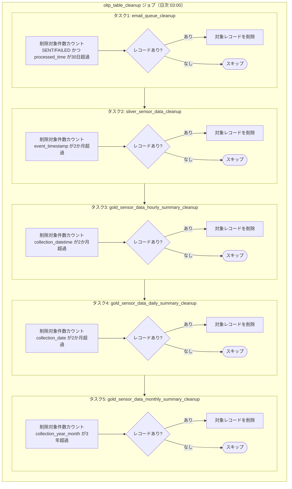

# OLTP DBクリーンアップジョブ

## 概要

OLTP DBクリーンアップジョブは、OLTP DBおよびOLTP DBに同期されたセンサーデータテーブルに蓄積されたレコードのうち、保持期間を超過したデータを定期削除するバッチジョブです。

Databricks Workflowで日次（03:00）実行し、メール通知キュー・シルバー層センサーデータ・ゴールド層サマリ（時次・日次・月次）の各テーブルを対象に、保持ポリシーに従った削除処理を直列で行います。DBへの接続負荷を抑えるためタスクは並列実行せず、順次実行します。

### 主な責務

1. **メール通知キュークリーンアップ**: 処理完了から30日経過したSENT/FAILEDレコードを`email_notification_queue`から削除
2. **シルバー層センサーデータクリーンアップ**: 2か月経過したレコードを`silver_sensor_data`から削除
3. **時次サマリクリーンアップ**: 2か月経過したレコードを`gold_sensor_data_hourly_summary`から削除
4. **日次サマリクリーンアップ**: 2か月経過したレコードを`gold_sensor_data_daily_summary`から削除
5. **月次サマリクリーンアップ**: 3年経過したレコードを`gold_sensor_data_monthly_summary`から削除

---

## 機能ID

| 機能ID | 機能名         | 説明                           |
| ------ | -------------- | ------------------------------ |
| OP-002 | クリーンアップ | 保持期間の超過したデータの削除 |

---

## データモデル

### 入力データ

| データソース                     | 形式             | 説明                                                      |
| -------------------------------- | ---------------- | --------------------------------------------------------- |
| email_notification_queue         | OLTP DB テーブル | メール送信済み・失敗レコード（SENT/FAILED）               |
| silver_sensor_data               | OLTP DB テーブル | シルバー層センサーデータ（LDPパイプライン登録）           |
| gold_sensor_data_hourly_summary  | OLTP DB テーブル | センサーデータ時次サマリ（ゴールド層LDPパイプライン登録） |
| gold_sensor_data_daily_summary   | OLTP DB テーブル | センサーデータ日次サマリ（ゴールド層LDPパイプライン登録） |
| gold_sensor_data_monthly_summary | OLTP DB テーブル | センサーデータ月次サマリ（ゴールド層LDPパイプライン登録） |

### 出力先

| 出力先                           | 形式           | 説明                                  |
| -------------------------------- | -------------- | ------------------------------------- |
| email_notification_queue         | OLTP DB DELETE | 30日経過したSENT/FAILEDレコードの削除 |
| silver_sensor_data               | OLTP DB DELETE | 2か月経過したレコードの削除           |
| gold_sensor_data_hourly_summary  | OLTP DB DELETE | 2か月経過したレコードの削除           |
| gold_sensor_data_daily_summary   | OLTP DB DELETE | 2か月経過したレコードの削除           |
| gold_sensor_data_monthly_summary | OLTP DB DELETE | 3年経過したレコードの削除             |

---

## 使用テーブル一覧

### 読み取り・削除テーブル（OLTP DB）

| テーブル名                       | 保持期間 | 削除条件カラム        | 説明                     |
| -------------------------------- | -------- | --------------------- | ------------------------ |
| email_notification_queue         | 30日     | processed_time        | メール通知キュー         |
| silver_sensor_data               | 2か月    | event_timestamp       | シルバー層センサーデータ |
| gold_sensor_data_hourly_summary  | 2か月    | collection_datetime   | センサーデータ時次サマリ |
| gold_sensor_data_daily_summary   | 2か月    | collection_date       | センサーデータ日次サマリ |
| gold_sensor_data_monthly_summary | 3年      | collection_year_month | センサーデータ月次サマリ |

---

## 処理フロー

---

## 障害時のTeams通知

以下のエラー発生時、Teamsのシステム保守者連絡チャネルに通知を行い、運用担当者が迅速に対応できるようにする。

| エラー種別             | 通知タイミング     | 説明                                   |
| ---------------------- | ------------------ | -------------------------------------- |
| OLTP DB接続失敗        | 例外発生時（即時） | MySQLへの接続失敗時                    |
| DELETE実行失敗         | 例外発生時（即時） | 各テーブルに対するDELETE文の実行失敗時 |
| タスク実行タイムアウト | タイムアウト発生時 | タスクが規定時間内に完了しなかった場合 |

詳細は[ジョブ仕様書](./job-specification.md)のエラーハンドリングセクションを参照。

---

## パフォーマンス要件

| 要件                             | 値                | 対応策                                        |
| -------------------------------- | ----------------- | --------------------------------------------- |
| 実行間隔                         | 日次（03:00）     | Databricks Workflowの定期実行                 |
| タスク実行方式                   | 直列（順次実行）  | OLTP DBへの接続負荷を抑えるため並列実行しない |
| email_queue_cleanup タイムアウト | 30分              | 対象件数が少量のため短めに設定                |
| その他タスク タイムアウト        | 各1時間           | センサーデータは大量蓄積の可能性を考慮        |
| リトライポリシー                 | 失敗時1回リトライ | 一時的なDB接続エラーに対応                    |

---

## データ保持ポリシー

| テーブル名                       | 保持期間 | 削除対象                 | 削除方式 |
| -------------------------------- | -------- | ------------------------ | -------- |
| email_notification_queue         | 30日     | SENT/FAILEDレコード      | DELETE   |
| silver_sensor_data               | 2か月    | 全レコード（期間超過分） | DELETE   |
| gold_sensor_data_hourly_summary  | 2か月    | 全レコード（期間超過分） | DELETE   |
| gold_sensor_data_daily_summary   | 2か月    | 全レコード（期間超過分） | DELETE   |
| gold_sensor_data_monthly_summary | 3年      | 全レコード（期間超過分） | DELETE   |

---

## 関連ドキュメント

### 機能仕様

- [ジョブ仕様書](./job-specification.md) - 各タスクの処理コード・クリーンアップ設定詳細

### 上流パイプライン

- [シルバー層LDPパイプライン仕様書](../../ldp-pipeline/silver-layer/ldp-pipeline-specification.md) - silver_sensor_dataへのセンサーデータ登録処理の詳細
- [ゴールド層LDPパイプライン仕様書](../../ldp-pipeline/gold-layer/ldp-pipeline-specification.md) - gold_sensor_data各サマリへの登録処理の詳細

### データベース設計

- [アプリケーションデータベース設計書](../../common/app-database-specification.md) - 各対象テーブル定義

### 要件定義

- [非機能要件定義書](../../../02-requirements/non-functional-requirements.md) - NFR-MAINT, NFR-PERF

---

## 変更履歴

| 日付       | 版数 | 変更内容                                | 担当者       |
| ---------- | ---- | --------------------------------------- | ------------ |
| 2026-04-07 | 1.0  | 初版作成                                | Kei Sugiyama |
| 2026-04-10 | 1.1  | M-1: 主な責務の保持期間を正しい値に修正 | Kei Sugiyama |
