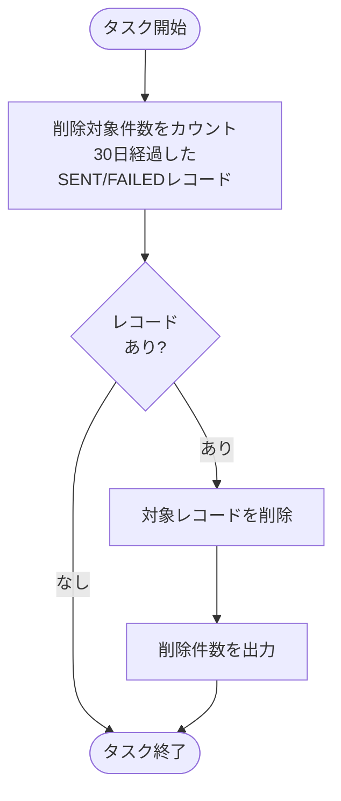
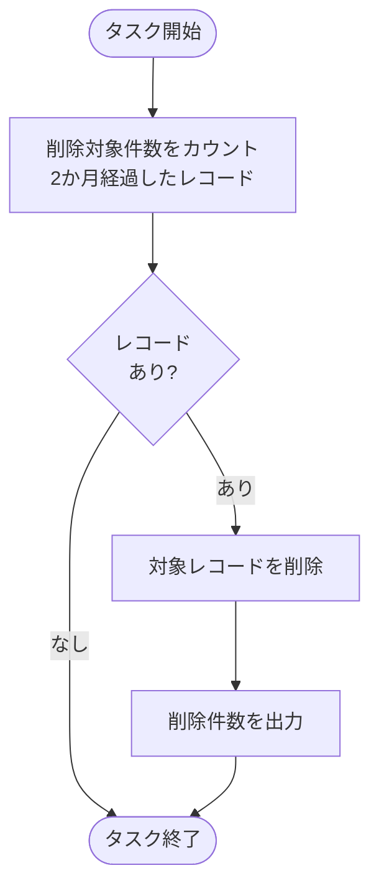

# OLTP DBクリーンアップジョブ仕様書

## 目次

- [OLTP DBクリーンアップジョブ仕様書](#oltp-dbクリーンアップジョブ仕様書)
  - [目次](#目次)
  - [概要](#概要)
    - [このドキュメントの役割](#このドキュメントの役割)
    - [対象機能](#対象機能)
    - [ジョブ一覧](#ジョブ一覧)
    - [タスク一覧](#タスク一覧)
  - [WebJob 配置構成](#webjob-配置構成)
    - [ファイル配置パス](#ファイル配置パス)
    - [settings.job.json](#settingsjobjson)
    - [必要な環境変数（App Service アプリ設定）](#必要な環境変数app-service-アプリ設定)
  - [共通関数](#共通関数)
  - [メール通知キュークリーンアップタスク仕様](#メール通知キュークリーンアップタスク仕様)
    - [タスク概要](#タスク概要)
    - [処理フロー](#処理フロー)
    - [処理コード](#処理コード)
    - [クリーンアップ設定](#クリーンアップ設定)
  - [シルバー層センサーデータテーブルクリーンアップタスク仕様](#シルバー層センサーデータテーブルクリーンアップタスク仕様)
    - [タスク概要](#タスク概要-1)
    - [処理フロー](#処理フロー-1)
    - [処理コード](#処理コード-1)
    - [クリーンアップ設定](#クリーンアップ設定-1)
  - [センサーデータ時次サマリテーブルクリーンアップタスク仕様](#センサーデータ時次サマリテーブルクリーンアップタスク仕様)
    - [タスク概要](#タスク概要-2)
    - [処理フロー](#処理フロー-2)
    - [処理コード](#処理コード-2)
    - [クリーンアップ設定](#クリーンアップ設定-2)
  - [センサーデータ日次サマリテーブルクリーンアップタスク仕様](#センサーデータ日次サマリテーブルクリーンアップタスク仕様)
    - [タスク概要](#タスク概要-3)
    - [処理フロー](#処理フロー-3)
    - [処理コード](#処理コード-3)
    - [クリーンアップ設定](#クリーンアップ設定-3)
  - [センサーデータ月次サマリテーブルクリーンアップタスク仕様](#センサーデータ月次サマリテーブルクリーンアップタスク仕様)
    - [タスク概要](#タスク概要-4)
    - [処理フロー](#処理フロー-4)
    - [処理コード](#処理コード-4)
    - [クリーンアップ設定](#クリーンアップ設定-4)
  - [関連ドキュメント](#関連ドキュメント)
  - [変更履歴](#変更履歴)

---

## 概要

このドキュメントは、Azure App Service WebJobとして実装するOLTP DBクリーンアップジョブ機能の詳細を記載します。

### このドキュメントの役割

- OLTP DBメンテナンス処理（クリーンアップ）

### 対象機能

| 機能ID | 機能名         | 処理内容                       |
| ------ | -------------- | ------------------------------ |
| OP-002 | クリーンアップ | 保持期間の超過したデータの削除 |

### ジョブ一覧

| ジョブ名           | 実行間隔      | 説明                          |
| ------------------ | ------------- | ----------------------------- |
| oltp_table_cleanup | 日次（03:00） | OLTP DBのテーブルのデータ削除 |

### タスク一覧

| タスク名                                 | 実行順序 | 説明                                         |
| ---------------------------------------- | -------- | -------------------------------------------- |
| email_queue_cleanup                      | 1        | メール通知キューテーブルのデータ削除         |
| silver_sensor_data_cleanup               | 2        | シルバー層センサーデータテーブルのデータ削除 |
| gold_sensor_data_hourly_summary_cleanup  | 3        | センサーデータ時次サマリテーブルのデータ削除 |
| gold_sensor_data_daily_summary_cleanup   | 4        | センサーデータ日次サマリテーブルのデータ削除 |
| gold_sensor_data_monthly_summary_cleanup | 5        | センサーデータ月次サマリテーブルのデータ削除 |

実行順序が若いもの順で直列で実行する。OLTP DBへの接続負荷を抑えるため、並列実行は行わない。

---

## WebJob 配置構成

### ファイル配置パス

App Service の以下のパスに配置する:

```
App_Data/
└── jobs/
    └── triggered/
        └── oltp_table_cleanup/
            ├── run.py                                      ← エントリポイント（全タスクを順次呼び出し）
            ├── common_cleanup.py                           ← 共通関数
            ├── email_queue_cleanup.py                      ← タスク1
            ├── silver_sensor_data_cleanup.py               ← タスク2
            ├── gold_sensor_data_hourly_summary_cleanup.py  ← タスク3
            ├── gold_sensor_data_daily_summary_cleanup.py   ← タスク4
            ├── gold_sensor_data_monthly_summary_cleanup.py ← タスク5
            └── settings.job.json                           ← スケジュール定義
```

### settings.job.json

```json
{
  "schedule": "0 0 3 * * *"
}
```

> **注意:** App Service のアプリ設定（環境変数）に `WEBSITE_TIME_ZONE=Tokyo Standard Time` を設定すること。未設定の場合はUTC基準となり、日本時間 03:00 では実行されない。

### 必要な環境変数（App Service アプリ設定）

| 環境変数名       | 説明                        |
| ---------------- | --------------------------- |
| `MYSQL_HOST`     | Azure DB for MySQL ホスト名 |
| `MYSQL_PORT`     | ポート番号（通常 3306）     |
| `MYSQL_USER`     | 接続ユーザー名              |
| `MYSQL_PASSWORD` | 接続パスワード              |
| `MYSQL_DATABASE` | 接続先データベース名        |

> **推奨:** パスワード等の機密情報は直接設定せず、Key Vault 参照（`@Microsoft.KeyVault(SecretUri=...)`）を使用する。

---

## 共通関数

各クリーンアップタスクはクリーンアップ対象が異なるのみで、処理内容に違いがないことから、処理の本体は共通処理化する。
各クリーンアップタスクから呼び出す共通処理を `common_cleanup.py` に定義する。

```python
# common_cleanup.py

import os
import pymysql
import pymysql.cursors


def get_db_connection() -> pymysql.Connection:
    """OLTP DB接続を返す"""
    return pymysql.connect(
        host=os.environ["MYSQL_HOST"],
        port=int(os.environ["MYSQL_PORT"]),
        user=os.environ["MYSQL_USER"],
        password=os.environ["MYSQL_PASSWORD"],
        database=os.environ["MYSQL_DATABASE"],
        cursorclass=pymysql.cursors.DictCursor,
        charset="utf8mb4",
    )


def cleanup_oltp_table(
    conn: pymysql.Connection,
    table: str,
    timestamp_col: str,
    retain_months: int,
    label: str,
    date_format: str = None,
) -> None:
    """保持期間超過レコードをOLTP DBから削除する共通処理

    Args:
        conn:           OLTP DB接続オブジェクト
        table:          削除対象テーブル名
        timestamp_col:  保持期間判定に使用するタイムスタンプカラム名
        retain_months:  データ保持月数（これを超えたレコードを削除）
        label:          ログ出力用のテーブル識別ラベル
        date_format:    タイムスタンプカラムがVARCHAR型の場合の日付フォーマット文字列
                        （例: "%Y/%m"）。Noneの場合はDATE_SUB()をそのまま使用する。
    """
    # date_format指定時はVARCHAR型カラムとの比較用に日付文字列へ変換する
    if date_format:
        cutoff_expr = f"DATE_FORMAT(DATE_SUB(NOW(), INTERVAL {retain_months} MONTH), '{date_format}')"
    else:
        cutoff_expr = f"DATE_SUB(NOW(), INTERVAL {retain_months} MONTH)"

    # table・timestamp_col はコード内定数のみ使用。外部入力を混入させないこと。
    with conn.cursor() as cursor:
        # 削除対象件数を確認
        cursor.execute(f"""
            SELECT COUNT(*) AS cnt
            FROM {table}
            WHERE {timestamp_col} < {cutoff_expr}
        """)
        count = cursor.fetchone()["cnt"]

    print(f"[{label}] 削除対象レコード数: {count}")

    if count == 0:
        print(f"[{label}] 削除対象レコードなし")
        return

    with conn.cursor() as cursor:
        cursor.execute(f"""
            DELETE FROM {table}
            WHERE {timestamp_col} < {cutoff_expr}
        """)
        deleted_count = cursor.rowcount
    conn.commit()
    print(f"[{label}] 削除完了: {deleted_count}件")
```

---

## メール通知キュークリーンアップタスク仕様

### タスク概要

| 項目             | 設定値                              |
| ---------------- | ----------------------------------- |
| タスク名         | email_queue_cleanup                 |
| 実行方式         | App Service WebJob                  |
| 実行間隔         | 日次（cron: `0 3 * * *`）毎日 03:00 |
| タイムアウト     | 30分                                |
| リトライポリシー | 失敗時1回リトライ                   |

### 処理フロー



### 処理コード

送信完了または失敗したレコードを定期的に削除する。メール通知キューは保持期間の条件（ステータス・経過日数）が他テーブルと異なるため、共通関数を使用せず個別実装とする。

```python
# email_queue_cleanup.py
import os
import pymysql
import pymysql.cursors

def cleanup_email_queue():
    """30日経過したSENT/FAILEDレコードを削除"""
    db_config = {
        "host": os.environ["MYSQL_HOST"],
        "port": int(os.environ["MYSQL_PORT"]),
        "user": os.environ["MYSQL_USER"],
        "password": os.environ["MYSQL_PASSWORD"],
        "database": os.environ["MYSQL_DATABASE"],
        "cursorclass": pymysql.cursors.DictCursor,
        "charset": "utf8mb4",
    }

    with pymysql.connect(**db_config) as conn:
        with conn.cursor() as cursor:
            # 削除対象件数を確認
            cursor.execute("""
                SELECT COUNT(*) as cnt
                FROM email_notification_queue
                WHERE status IN ('SENT', 'FAILED')
                  AND processed_time < DATE_SUB(NOW(), INTERVAL 30 DAY)
            """)
            count_before = cursor.fetchone()["cnt"]

        print(f"削除対象レコード数: {count_before}")

        if count_before == 0:
            print("削除対象レコードなし")
            return

        with conn.cursor() as cursor:
            cursor.execute("""
                DELETE FROM email_notification_queue
                WHERE status IN ('SENT', 'FAILED')
                  AND processed_time < DATE_SUB(NOW(), INTERVAL 30 DAY)
            """)
        conn.commit()
        print(f"削除完了: {count_before}件")


# タスク実行
cleanup_email_queue()
```

### クリーンアップ設定

| 項目     | 設定値                | 説明                                   |
| -------- | --------------------- | -------------------------------------- |
| 保持期間 | 30日                  | 処理完了から30日経過したレコードを削除 |
| 対象     | SENT/FAILEDステータス | 処理済みレコードのみ削除               |

---

## シルバー層センサーデータテーブルクリーンアップタスク仕様

OLTP DBのシルバー層センサーデータテーブルに登録されているデータのうち、保持期間を超過したデータを定期削除するタスク。

### タスク概要

| 項目             | 設定値                          |
| ---------------- | ------------------------------- |
| タスク名         | silver_sensor_data_cleanup      |
| 実行方式         | App Service WebJob              |
| 実行間隔         | email_queue_cleanupタスク完了後 |
| タイムアウト     | 1時間                           |
| リトライポリシー | 失敗時1回リトライ               |

### 処理フロー


### 処理コード

```python
# silver_sensor_data_cleanup.py
from common_cleanup import get_db_connection, cleanup_oltp_table

def silver_sensor_data_cleanup():
    """2か月経過したsilver_sensor_dataのレコードを削除"""
    with get_db_connection() as conn:
        cleanup_oltp_table(
            conn=conn,
            table="silver_sensor_data",
            timestamp_col="event_date",
            retain_months=2,
            label="silver_sensor_data",
        )


# タスク実行
silver_sensor_data_cleanup()
```

### クリーンアップ設定

| 項目           | 設定値                          | 説明                    |
| -------------- | ------------------------------- | ----------------------- |
| 対象テーブル   | silver_sensor_data              | センサーデータ          |
| タイムスタンプ | event_date                      | 保持期間判定カラム      |
| 保持期間       | 2か月                           | 2か月超過レコードを削除 |
| 実行タイミング | email_queue_cleanupタスク完了後 | ジョブ構成で定義        |

---

## センサーデータ時次サマリテーブルクリーンアップタスク仕様

OLTP DBのセンサーデータ時次サマリテーブルに登録されているデータのうち、保持期間を超過したデータを定期削除するタスク。

### タスク概要

| 項目             | 設定値                                  |
| ---------------- | --------------------------------------- |
| タスク名         | gold_sensor_data_hourly_summary_cleanup |
| 実行方式         | App Service WebJob                      |
| 実行間隔         | silver_sensor_data_cleanupタスク完了後  |
| タイムアウト     | 1時間                                   |
| リトライポリシー | 失敗時1回リトライ                       |

### 処理フロー



### 処理コード

```python
# gold_sensor_data_hourly_summary_cleanup.py
from common_cleanup import get_db_connection, cleanup_oltp_table

def gold_sensor_data_hourly_summary_cleanup():
    """2か月経過したgold_sensor_data_hourly_summaryのレコードを削除"""
    with get_db_connection() as conn:
        cleanup_oltp_table(
            conn=conn,
            table="gold_sensor_data_hourly_summary",
            timestamp_col="collection_datetime",
            retain_months=2,
            label="gold_sensor_data_hourly_summary",
        )


# タスク実行
gold_sensor_data_hourly_summary_cleanup()
```

### クリーンアップ設定

| 項目           | 設定値                                 | 説明                     |
| -------------- | -------------------------------------- | ------------------------ |
| 対象テーブル   | gold_sensor_data_hourly_summary        | センサーデータ時次サマリ |
| タイムスタンプ | collection_datetime                    | 保持期間判定カラム       |
| 保持期間       | 2か月                                  | 2か月超過レコードを削除  |
| 実行タイミング | silver_sensor_data_cleanupタスク完了後 | ジョブ構成で定義         |

---

## センサーデータ日次サマリテーブルクリーンアップタスク仕様

OLTP DBのセンサーデータ日次サマリテーブルに登録されているデータのうち、保持期間を超過したデータを定期削除するタスク。

### タスク概要

| 項目             | 設定値                                              |
| ---------------- | --------------------------------------------------- |
| タスク名         | gold_sensor_data_daily_summary_cleanup              |
| 実行方式         | App Service WebJob                                  |
| 実行間隔         | gold_sensor_data_hourly_summary_cleanupタスク完了後 |
| タイムアウト     | 1時間                                               |
| リトライポリシー | 失敗時1回リトライ                                   |

### 処理フロー


### 処理コード

```python
# gold_sensor_data_daily_summary_cleanup.py
from common_cleanup import get_db_connection, cleanup_oltp_table

def gold_sensor_data_daily_summary_cleanup():
    """2か月経過したgold_sensor_data_daily_summaryのレコードを削除"""
    with get_db_connection() as conn:
        cleanup_oltp_table(
            conn=conn,
            table="gold_sensor_data_daily_summary",
            timestamp_col="collection_date",
            retain_months=2,
            label="gold_sensor_data_daily_summary",
        )


# タスク実行
gold_sensor_data_daily_summary_cleanup()
```

### クリーンアップ設定

| 項目           | 設定値                                              | 説明                     |
| -------------- | --------------------------------------------------- | ------------------------ |
| 対象テーブル   | gold_sensor_data_daily_summary                      | センサーデータ日次サマリ |
| タイムスタンプ | collection_date                                     | 保持期間判定カラム       |
| 保持期間       | 2か月                                               | 2か月超過レコードを削除  |
| 実行タイミング | gold_sensor_data_hourly_summary_cleanupタスク完了後 | ジョブ構成で定義         |

---

## センサーデータ月次サマリテーブルクリーンアップタスク仕様

OLTP DBのセンサーデータ月次サマリテーブルに登録されているデータのうち、保持期間を超過したデータを定期削除するタスク。

### タスク概要

| 項目             | 設定値                                             |
| ---------------- | -------------------------------------------------- |
| タスク名         | gold_sensor_data_monthly_summary_cleanup           |
| 実行方式         | App Service WebJob                                 |
| 実行間隔         | gold_sensor_data_daily_summary_cleanupタスク完了後 |
| タイムアウト     | 1時間                                              |
| リトライポリシー | 失敗時1回リトライ                                  |

### 処理フロー


### 処理コード

```python
# gold_sensor_data_monthly_summary_cleanup.py
from common_cleanup import get_db_connection, cleanup_oltp_table

def gold_sensor_data_monthly_summary_cleanup():
    """3年（36か月）経過したgold_sensor_data_monthly_summaryのレコードを削除"""
    with get_db_connection() as conn:
        cleanup_oltp_table(
            conn=conn,
            table="gold_sensor_data_monthly_summary",
            timestamp_col="collection_year_month",
            retain_months=36,
            label="gold_sensor_data_monthly_summary",
            date_format="%Y/%m",
        )


# タスク実行
gold_sensor_data_monthly_summary_cleanup()
```

### クリーンアップ設定

| 項目           | 設定値                                             | 説明                     |
| -------------- | -------------------------------------------------- | ------------------------ |
| 対象テーブル   | gold_sensor_data_monthly_summary                   | センサーデータ月次サマリ |
| タイムスタンプ | collection_year_month                              | 保持期間判定カラム       |
| 保持期間       | 3年（36か月）                                      | 3年超過レコードを削除    |
| 実行タイミング | gold_sensor_data_daily_summary_cleanupタスク完了後 | ジョブ構成で定義         |

---

## 関連ドキュメント

- [README.md](./README.md) - OLTPクリーンアップジョブ概要
- [シルバー層LDPパイプライン仕様書](../../ldp-pipeline/silver-layer/ldp-pipeline-specification.md) - センサーデータ登録処理の詳細
- [ゴールド層LDPパイプライン仕様書](../../ldp-pipeline/gold-layer/ldp-pipeline-specification.md) - センサーデータのサマリ登録処理の詳細
- [アプリケーションデータベース設計書](../../common/app-database-specification.md) - email_notification_queue・mail_historyテーブル定義

---

## 変更履歴

| 日付       | 版数 | 変更内容                                                                                                                       | 担当者       |
| ---------- | ---- | ------------------------------------------------------------------------------------------------------------------------------ | ------------ |
| 2026-01-19 | 1.0  | 初版作成                                                                                                                       | Kei Sugiyama |
| 2026-04-07 | 1.1  | 共通関数追加・Silver/Gold各タスクの処理コード・設定を実装                                                                      | Kei Sugiyama |
| 2026-04-07 | 1.2  | 各テーブルの保持期間を変更・共通関数をretain_months対応                                                                        | Kei Sugiyama |
| 2026-04-10 | 1.3  | Secretsスコープ定数化・月次サマリVARCHAR型対応（date_formatパラメータ追加）・cursor.rowcount使用・f-string SQL安全コメント追加 | Kei Sugiyama |
| 2026-04-10 | 1.4  | cursor.rowcount をwithブロック内で退避（deleted_count変数に格納）                                                              | Kei Sugiyama |
| 2026-04-13 | 1.5  | レビュー指摘コメント反映                                                                                                       | Kei Sugiyama |
