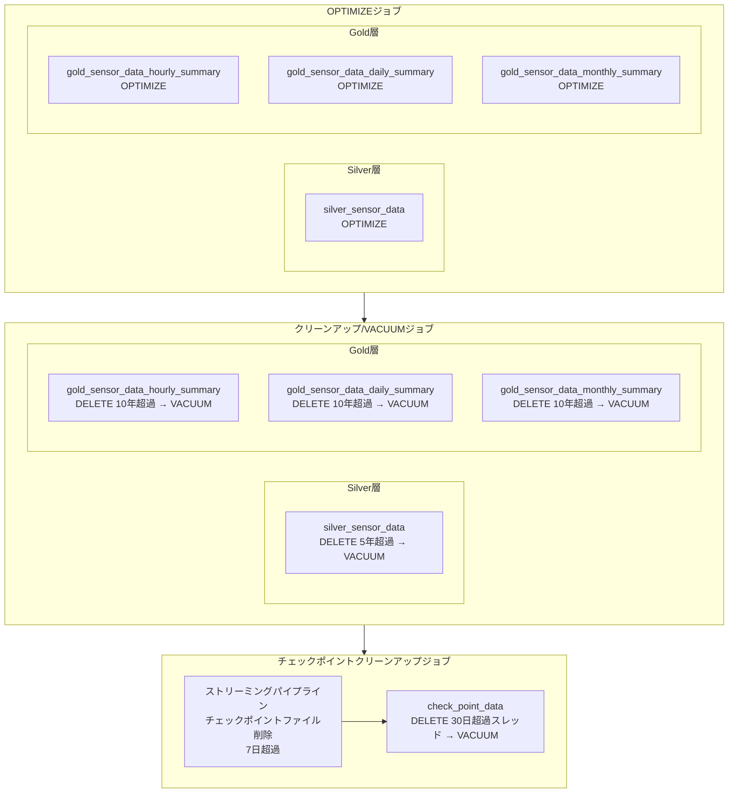

# Deltaテーブル最適化ジョブ

## 概要

Deltaテーブル最適化ジョブは、Silver層・Gold層・AIチャットのDeltaテーブルに対して、Databricks Workflowで定期実行するメンテナンスバッチジョブです。

小ファイルの統合によるクエリパフォーマンスの向上、保持期間を超過したデータの削除、および削除済みファイルの物理削除によるストレージコスト削減を目的とします。Silver層・Gold層の最適化・削除処理は共通関数で実装し、テーブルごとの保持年数・タイムスタンプカラムを設定として管理します。

### 主な責務

1. **OPTIMIZEジョブ**: Silver層・Gold層の全Deltaテーブルに対してOPTIMIZEを実行し、小ファイルを統合してクエリパフォーマンスを向上させる
2. **クリーンアップ/VACUUMジョブ**: データ保持期間を超過したレコードをDELETEし、VACUUMで物理削除する
3. **チェックポイントクリーンアップジョブ**: ストリーミングパイプラインのチェックポイントファイル（7日超過）と、AIチャットチェックポイントテーブル（30日超過スレッド）を削除する

---

## 機能ID

| 機能ID | 機能名             | 説明                               |
| ------ | ------------------ | ---------------------------------- |
| OP-001 | データメンテナンス | Delta Lakeテーブルの最適化・圧縮   |
| OP-002 | クリーンアップ     | 古いデータ・チェックポイントの削除 |

---

## ジョブ一覧

| ジョブ名                        | 実行間隔                                    | 説明                                                         |
| ------------------------------- | ------------------------------------------- | ------------------------------------------------------------ |
| sensor_data_table_optimize      | 日次（02:00）                               | Silver層テーブル、Gold層テーブルのOPTIMIZE実行               |
| sensor_table_cleanup_and_vacuum | sensor_data_table_optimizeジョブ完了後      | Silver層テーブル、Gold層テーブルのクリーンアップ・VACUUM実行 |
| checkpoint_cleanup_and_vacuum   | sensor_table_cleanup_and_vacuumジョブ完了後 | 古いチェックポイントの削除                                   |

---

## データモデル

### 入力データ

なし

### 対象テーブル一覧

| テーブル名                       | 層         | 形式          | 説明                                                                   |
| -------------------------------- | ---------- | ------------- | ---------------------------------------------------------------------- |
| silver_sensor_data               | Silver     | Deltaテーブル | シルバー層パイプラインがテレメトリデータを格納するテーブル             |
| gold_sensor_data_hourly_summary  | Gold       | Deltaテーブル | ゴールド層パイプラインがテレメトリデータの時次サマリを格納するテーブル |
| gold_sensor_data_daily_summary   | Gold       | Deltaテーブル | ゴールド層パイプラインがテレメトリデータの日次サマリを格納するテーブル |
| gold_sensor_data_monthly_summary | Gold       | Deltaテーブル | ゴールド層パイプラインがテレメトリデータの月次サマリを格納するテーブル |
| check_point_data                 | AIチャット | Deltaテーブル | LangGraphの会話状態を永続化するチェックポイントテーブル                |

---

## 使用テーブル一覧

### 読み取りテーブル

なし

### 書き込みテーブル（Deltaテーブル）

| テーブル名                       | 用途                                        |
| -------------------------------- | ------------------------------------------- |
| silver_sensor_data               | OPTIMIZE実行 / 5年超過データの削除・VACUUM  |
| gold_sensor_data_hourly_summary  | OPTIMIZE実行 / 10年超過データの削除・VACUUM |
| gold_sensor_data_daily_summary   | OPTIMIZE実行 / 10年超過データの削除・VACUUM |
| gold_sensor_data_monthly_summary | OPTIMIZE実行 / 10年超過データの削除・VACUUM |
| check_point_data                 | 30日超過スレッドの削除・VACUUM              |

---

## 処理フロー

---

## データ保持ポリシー

| テーブル                         | 保持期間 | 削除対象                 | 削除方式        |
| -------------------------------- | -------- | ------------------------ | --------------- |
| silver_sensor_data               | 5年      | 5年超過レコード          | DELETE + VACUUM |
| gold_sensor_data_hourly_summary  | 10年     | 10年超過レコード         | DELETE + VACUUM |
| gold_sensor_data_daily_summary   | 10年     | 10年超過レコード         | DELETE + VACUUM |
| gold_sensor_data_monthly_summary | 10年     | 10年超過レコード         | DELETE + VACUUM |
| check_point_data                 | 30日     | 30日超過スレッド（単位） | DELETE + VACUUM |

**注意:** Silver層・Gold層に対してADLSライフサイクルを使用すると、Delta Logとの不整合が発生しクエリエラーの原因となるため、DELETE + VACUUMで削除する。

---

## 関連ドキュメント

### 機能仕様

- [ジョブ仕様書](./job-specification.md) - 処理コード・共通関数・各ジョブ詳細

### 上流パイプライン

- [シルバー層LDPパイプライン概要](../../ldp-pipeline/silver-layer/README.md) - センサーデータの登録元
- [シルバー層LDPパイプライン仕様書](../../ldp-pipeline/silver-layer/ldp-pipeline-specification.md) - センサーデータ登録処理の詳細
- [ゴールド層LDPパイプライン概要](../../ldp-pipeline/gold-layer/README.md) - センサーデータのサマリの登録元
- [ゴールド層LDPパイプライン仕様書](../../ldp-pipeline/gold-layer/ldp-pipeline-specification.md) - センサーデータのサマリ登録処理の詳細

### データベース設計

- [UnityCatalogデータベース設計書](../../common/unity-catalog-database-specification.md) - Silver層テーブル定義、Gold層テーブル定義、AIチャットチェックポイントテーブル定義

### 要件定義

- [機能要件定義書](../../../02-requirements/functional-requirements.md) - FR-002, FR-003, FR-005
- [非機能要件定義書](../../../02-requirements/non-functional-requirements.md) - データ保持期間、パフォーマンス要件

---

## 変更履歴

| 日付       | 版数 | 変更内容                                       | 担当者       |
| ---------- | ---- | ---------------------------------------------- | ------------ |
| 2026-04-01 | 1.0  | 初版作成                                       | Kei Sugiyama |
| 2026-04-07 | 1.1  | job-specification.mdの内容に合わせてREADME整備 | Kei Sugiyama |
