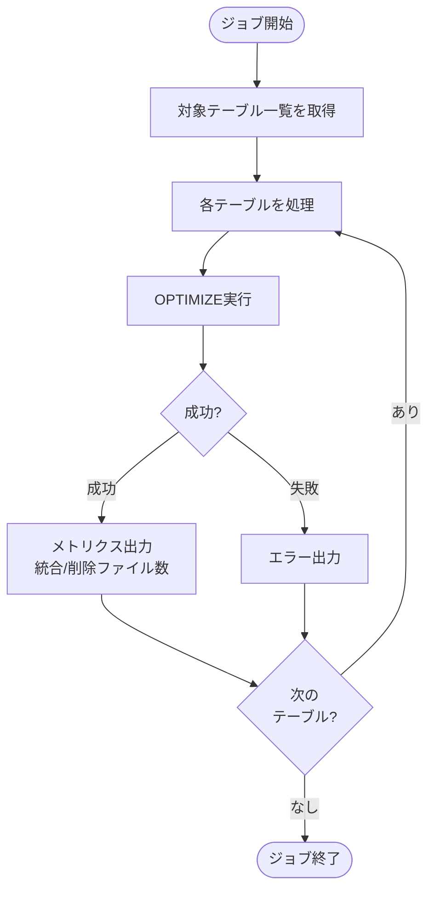
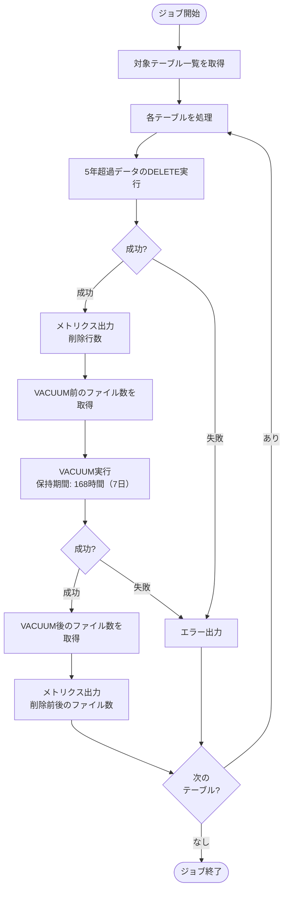
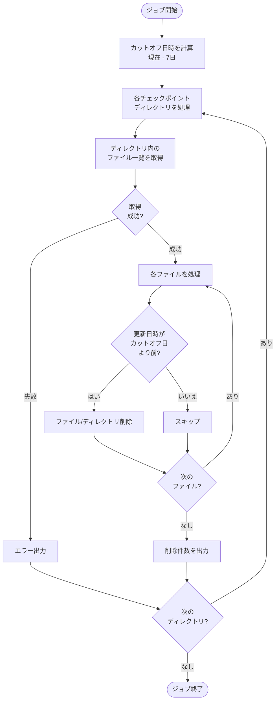

# Deltaテーブル最適化ジョブ仕様書

## 目次

- [Deltaテーブル最適化ジョブ仕様書](#deltaテーブル最適化ジョブ仕様書)
  - [目次](#目次)
  - [概要](#概要)
    - [このドキュメントの役割](#このドキュメントの役割)
    - [対象機能](#対象機能)
    - [ジョブ一覧](#ジョブ一覧)
  - [Delta Lakeメンテナンスジョブ仕様](#delta-lakeメンテナンスジョブ仕様)
    - [Silver層OPTIMIZEジョブ](#silver層optimizeジョブ)
      - [ジョブ概要](#ジョブ概要)
      - [対象テーブル](#対象テーブル)
      - [処理フロー](#処理フロー)
      - [処理コード](#処理コード)
      - [OPTIMIZE設定](#optimize設定)
    - [Silver層クリーンアップ/VACUUMジョブ](#silver層クリーンアップvacuumジョブ)
      - [ジョブ概要](#ジョブ概要-1)
      - [対象テーブル](#対象テーブル-1)
      - [処理フロー](#処理フロー-1)
      - [処理コード](#処理コード-1)
      - [DELETE設定](#delete設定)
      - [VACUUM設定](#vacuum設定)
    - [Gold層OPTIMIZEジョブ](#gold層optimizeジョブ)
      - [ジョブ概要](#ジョブ概要-2)
      - [対象テーブル](#対象テーブル-2)
      - [処理フロー](#処理フロー-2)
      - [処理コード](#処理コード-2)
      - [OPTIMIZE設定](#optimize設定-1)
    - [Silver層クリーンアップ/VACUUMジョブ](#silver層クリーンアップvacuumジョブ-1)
      - [ジョブ概要](#ジョブ概要-3)
      - [対象テーブル](#対象テーブル-3)
      - [処理フロー](#処理フロー-3)
      - [処理コード](#処理コード-3)
      - [DELETE設定](#delete設定-1)
      - [VACUUM設定](#vacuum設定-1)
    - [チェックポイントクリーンアップジョブ](#チェックポイントクリーンアップジョブ)
      - [ジョブ概要](#ジョブ概要-4)
      - [処理フロー](#処理フロー-4)
      - [処理コード](#処理コード-4)
      - [クリーンアップ設定](#クリーンアップ設定)
  - [関連ドキュメント](#関連ドキュメント)
  - [変更履歴](#変更履歴)

---

## 概要

このドキュメントは、Databricks Workflowとして実装するDeltaテーブル最適化ジョブ機能の詳細を記載します。

### このドキュメントの役割

- Delta Lakeメンテナンス処理（OPTIMIZE、VACUUM、チェックポイントクリーンアップ）

### 対象機能

| 機能ID | 機能名             | 処理内容                           |
| ------ | ------------------ | ---------------------------------- |
| OP-001 | データメンテナンス | Delta Lakeテーブルの最適化・圧縮   |
| OP-002 | クリーンアップ     | 古いデータ・チェックポイントの削除 |

### ジョブ一覧

| ジョブ名                        | 実行間隔      | 説明                               |
| ------------------------------- | ------------- | ---------------------------------- |
| silver_table_optimize           | 日次（02:00） | Silver層テーブルのOPTIMIZE実行     |
| silver_table_cleanup_and_vacuum | 日次（04:00） | Silver層テーブルのVACUUM実行       |
| gold_table_optimize             | 日次（02:00） | Gold層テーブルのOPTIMIZE実行       |
| gold_table_cleanup_and_vacuum   | 日次（04:00） | Gold層テーブルのVACUUM実行         |
| checkpoint_cleanup              | 日次（05:00） | 古いチェックポイントファイルの削除 |

---

## Delta Lakeメンテナンスジョブ仕様

Delta Lakeテーブルのパフォーマンスを維持するための定期メンテナンスジョブ。

### Silver層OPTIMIZEジョブ

小ファイルを最適なサイズに統合し、クエリパフォーマンスを向上させる。

#### ジョブ概要

| 項目             | 設定値                         |
| ---------------- | ------------------------------ |
| ジョブ名         | silver_table_optimize          |
| 実行方式         | Databricks Workflow            |
| 実行間隔         | 日次（cron: `0 2 * * *`）02:00 |
| クラスタ         | Jobs Compute                   |
| タイムアウト     | 2時間                          |
| リトライポリシー | 失敗時1回リトライ              |

#### 対象テーブル

| 物理名             | 形式          | 説明                                                       |
| ------------------ | ------------- | ---------------------------------------------------------- |
| silver_sensor_data | Deltaテーブル | シルバー層パイプラインがテレメトリデータを格納するテーブル |

#### 処理フロー


#### 処理コード

```python
def silver_table_optimize():
    """Silver層テーブルのOPTIMIZE実行"""

    # 対象テーブル一覧
    tables = [
        "iot_catalog.silver.silver_sensor_data"
    ]

    for table in tables:
        print(f"OPTIMIZE開始: {table}")
        try:
            result = spark.sql(f"OPTIMIZE {table}")
            metrics = result.first()
            print(f"  - 統合ファイル数: {metrics['numFilesAdded']}")
            print(f"  - 削除ファイル数: {metrics['numFilesRemoved']}")
            print(f"OPTIMIZE完了: {table}")
        except Exception as e:
            print(f"OPTIMIZEエラー: {table} - {str(e)}")

    print("全テーブルのOPTIMIZE完了")


# ジョブ実行
silver_table_optimize()
```

#### OPTIMIZE設定

| 項目               | 設定値                     | 説明                             |
| ------------------ | -------------------------- | -------------------------------- |
| 対象テーブル       | Silver層全テーブル         | センサーデータ、状態             |
| 実行タイミング     | 毎日 02:00（低負荷時間帯） | ストリーミング処理への影響を軽減 |
| 自動コンパクション | 有効（テーブル設定）       | 日次に加えて自動実行も併用       |

### Silver層クリーンアップ/VACUUMジョブ

削除済みファイルを物理的に削除し、ストレージ使用量を削減する。

#### ジョブ概要

| 項目             | 設定値                          |
| ---------------- | ------------------------------- |
| ジョブ名         | silver_table_cleanup_and_vacuum |
| 実行方式         | Databricks Workflow             |
| 実行間隔         | 日次（cron: `0 4 * * *`）04:00  |
| クラスタ         | Jobs Compute                    |
| タイムアウト     | 2時間                           |
| リトライポリシー | 失敗時1回リトライ               |

#### 対象テーブル

| 物理名             | 形式          | 説明                                                       |
| ------------------ | ------------- | ---------------------------------------------------------- |
| silver_sensor_data | Deltaテーブル | シルバー層パイプラインがテレメトリデータを格納するテーブル |

#### 処理フロー


#### 処理コード

```python
def silver_table_cleanup_and_vacuum():
    """Silver層テーブルのデータ削除（5年超過）およびVACUUM実行"""

    # 保持期間（時間）
    RETAIN_HOURS = 168  # 7日

    # 対象テーブル一覧
    tables = [
        "iot_catalog.silver.silver_sensor_data"
    ]

    for table in tables:
        print(f"クリーンアップ開始: {table}")
        try:
            # 5年超過データを削除
            deleted = spark.sql(f"""
                DELETE FROM {table}
                WHERE event_timestamp < DATEADD(YEAR, -5, CURRENT_DATE())
            """)
            print(f"  - 5年超過データ削除行数: {deleted.first()['num_deleted_rows']}")

            # VACUUM実行前のファイル数を取得
            before_files = spark.sql(f"DESCRIBE DETAIL {table}").first()["numFiles"]

            # VACUUM実行
            spark.sql(f"VACUUM {table} RETAIN {RETAIN_HOURS} HOURS")

            # VACUUM実行後のファイル数を取得
            after_files = spark.sql(f"DESCRIBE DETAIL {table}").first()["numFiles"]

            print(f"  - 削除前ファイル数: {before_files}")
            print(f"  - 削除後ファイル数: {after_files}")
            print(f"クリーンアップ完了: {table}")
        except Exception as e:
            print(f"クリーンアップエラー: {table} - {str(e)}")

    print("全テーブルのクリーンアップ完了")


# ジョブ実行
silver_table_cleanup_and_vacuum()
```

#### DELETE設定

| 項目           | 設定値             | 説明                             |
| -------------- | ------------------ | -------------------------------- |
| 保持期間       | 5年                | Silver層のセンサーデータ保持期間 |
| 対象テーブル   | Silver層全テーブル | センサーデータ                   |
| 実行タイミング | 04:00              | 低負荷時間帯に実行               |

#### VACUUM設定

| 項目           | 設定値             | 説明                                 |
| -------------- | ------------------ | ------------------------------------ |
| 保持期間       | 168時間（7日）     | Time Travel用に7日分のファイルを保持 |
| 対象テーブル   | Silver層全テーブル | センサーデータ                       |
| 実行タイミング | 04:00              | 低負荷時間帯に実行                   |

**注意事項:**
- VACUUMを実行すると、保持期間（7日）より古いバージョンへのTime Travelができなくなる
- 保持期間はテーブルプロパティ `delta.deletedFileRetentionDuration` と一致させる

### Gold層OPTIMIZEジョブ

小ファイルを最適なサイズに統合し、クエリパフォーマンスを向上させる。

#### ジョブ概要

| 項目             | 設定値                         |
| ---------------- | ------------------------------ |
| ジョブ名         | gold_table_optimize            |
| 実行方式         | Databricks Workflow            |
| 実行間隔         | 日次（cron: `0 2 * * *`）02:00 |
| クラスタ         | Jobs Compute                   |
| タイムアウト     | 2時間                          |
| リトライポリシー | 失敗時1回リトライ              |

#### 対象テーブル

| 物理名                           | 形式          | 説明                                                                   |
| -------------------------------- | ------------- | ---------------------------------------------------------------------- |
| gold_sensor_data_hourly_summary  | Deltaテーブル | ゴールド層パイプラインがテレメトリデータの時次サマリを格納するテーブル |
| gold_sensor_data_daily_summary   | Deltaテーブル | ゴールド層パイプラインがテレメトリデータの日次サマリを格納するテーブル |
| gold_sensor_data_monthly_summary | Deltaテーブル | ゴールド層パイプラインがテレメトリデータの月次サマリを格納するテーブル |

#### 処理フロー



#### 処理コード

```python
def gold_table_optimize():
    """Gold層テーブルのOPTIMIZE実行"""

    # 対象テーブル一覧
    tables = [
        "iot_catalog.gold.gold_sensor_data_hourly_summary",
        "iot_catalog.gold.gold_sensor_data_daily_summary",
        "iot_catalog.gold.gold_sensor_data_monthly_summary"
    ]

    for table in tables:
        print(f"OPTIMIZE開始: {table}")
        try:
            result = spark.sql(f"OPTIMIZE {table}")
            metrics = result.first()
            print(f"  - 統合ファイル数: {metrics['numFilesAdded']}")
            print(f"  - 削除ファイル数: {metrics['numFilesRemoved']}")
            print(f"OPTIMIZE完了: {table}")
        except Exception as e:
            print(f"OPTIMIZEエラー: {table} - {str(e)}")

    print("全テーブルのOPTIMIZE完了")


# ジョブ実行
gold_table_optimize()
```

#### OPTIMIZE設定

| 項目               | 設定値                                                                                                | 説明                             |
| ------------------ | ----------------------------------------------------------------------------------------------------- | -------------------------------- |
| 対象テーブル       | `gold_sensor_data_hourly_summary`,`gold_sensor_data_daily_summary`,`gold_sensor_data_monthly_summary` | センサーデータのサマリ           |
| 実行タイミング     | 毎日 02:00（低負荷時間帯）                                                                            | ストリーミング処理への影響を軽減 |
| 自動コンパクション | 有効（テーブル設定）                                                                                  | 日次に加えて自動実行も併用       |

### Silver層クリーンアップ/VACUUMジョブ

削除済みファイルを物理的に削除し、ストレージ使用量を削減する。

#### ジョブ概要

| 項目             | 設定値                         |
| ---------------- | ------------------------------ |
| ジョブ名         | gold_table_cleanup_and_vacuum  |
| 実行方式         | Databricks Workflow            |
| 実行間隔         | 日次（cron: `0 4 * * *`）04:00 |
| クラスタ         | Jobs Compute                   |
| タイムアウト     | 2時間                          |
| リトライポリシー | 失敗時1回リトライ              |

#### 対象テーブル

| 物理名                           | 形式          | 説明                                                                   |
| -------------------------------- | ------------- | ---------------------------------------------------------------------- |
| gold_sensor_data_hourly_summary  | Deltaテーブル | ゴールド層パイプラインがテレメトリデータの時次サマリを格納するテーブル |
| gold_sensor_data_daily_summary   | Deltaテーブル | ゴールド層パイプラインがテレメトリデータの日次サマリを格納するテーブル |
| gold_sensor_data_monthly_summary | Deltaテーブル | ゴールド層パイプラインがテレメトリデータの月次サマリを格納するテーブル |

#### 処理フロー



#### 処理コード

```python
def gold_table_cleanup_and_vacuum():
    """Gold層テーブルのデータ削除（10年超過）およびVACUUM実行"""

    # 保持期間（時間）
    RETAIN_HOURS = 168  # 7日

    # 対象テーブル一覧
    tables = [
        "iot_catalog.gold.gold_sensor_data_hourly_summary",
        "iot_catalog.gold.gold_sensor_data_daily_summary",
        "iot_catalog.gold.gold_sensor_data_monthly_summary"
    ]

    for table in tables:
        print(f"クリーンアップ開始: {table}")
        try:
            # 5年超過データを削除
            deleted = spark.sql(f"""
                DELETE FROM {table}
                WHERE event_timestamp < DATEADD(YEAR, -10, CURRENT_DATE())
            """)
            print(f"  - 10年超過データ削除行数: {deleted.first()['num_deleted_rows']}")

            # VACUUM実行前のファイル数を取得
            before_files = spark.sql(f"DESCRIBE DETAIL {table}").first()["numFiles"]

            # VACUUM実行
            spark.sql(f"VACUUM {table} RETAIN {RETAIN_HOURS} HOURS")

            # VACUUM実行後のファイル数を取得
            after_files = spark.sql(f"DESCRIBE DETAIL {table}").first()["numFiles"]

            print(f"  - 削除前ファイル数: {before_files}")
            print(f"  - 削除後ファイル数: {after_files}")
            print(f"クリーンアップ完了: {table}")
        except Exception as e:
            print(f"クリーンアップエラー: {table} - {str(e)}")

    print("全テーブルのクリーンアップ完了")


# ジョブ実行
gold_table_cleanup_and_vacuum()
```

#### DELETE設定

| 項目           | 設定値                                                                                                | 説明                           |
| -------------- | ----------------------------------------------------------------------------------------------------- | ------------------------------ |
| 保持期間       | 10年                                                                                                  | Gold層のセンサーデータ保持期間 |
| 対象テーブル   | `gold_sensor_data_hourly_summary`,`gold_sensor_data_daily_summary`,`gold_sensor_data_monthly_summary` | センサーデータのサマリ         |
| 実行タイミング | 04:00                                                                                                 | 低負荷時間帯に実行             |

#### VACUUM設定

| 項目           | 設定値                                                                                                | 説明                                 |
| -------------- | ----------------------------------------------------------------------------------------------------- | ------------------------------------ |
| 保持期間       | 168時間（7日）                                                                                        | Time Travel用に7日分のファイルを保持 |
| 対象テーブル   | `gold_sensor_data_hourly_summary`,`gold_sensor_data_daily_summary`,`gold_sensor_data_monthly_summary` | センサーデータのサマリ               |
| 実行タイミング | 04:00                                                                                                 | 低負荷時間帯に実行                   |

**注意事項:**
- VACUUMを実行すると、保持期間（7日）より古いバージョンへのTime Travelができなくなる
- 保持期間はテーブルプロパティ `delta.deletedFileRetentionDuration` と一致させる


### チェックポイントクリーンアップジョブ

ストリーミングパイプラインのチェックポイントファイルを定期的にクリーンアップする。

#### ジョブ概要

| 項目             | 設定値                             |
| ---------------- | ---------------------------------- |
| ジョブ名         | checkpoint_cleanup                 |
| 実行方式         | Databricks Workflow                |
| 実行間隔         | 週次（cron: `0 5 * * 0`）日曜05:00 |
| クラスタ         | Jobs Compute                       |
| タイムアウト     | 1時間                              |
| リトライポリシー | 失敗時リトライなし                 |

#### 処理フロー



#### 処理コード

```python
from datetime import datetime, timedelta

def cleanup_old_checkpoints():
    """7日以上経過したチェックポイントファイルを削除"""

    # チェックポイント保存先
    CHECKPOINT_BASE_PATH = "abfss://checkpoints@{storage_account}.dfs.core.windows.net/"

    # 保持期間（日）
    RETAIN_DAYS = 7

    # 対象パイプラインのチェックポイントディレクトリ
    checkpoint_dirs = [
        f"{CHECKPOINT_BASE_PATH}silver_pipeline/",
    ]

    cutoff_date = datetime.now() - timedelta(days=RETAIN_DAYS)

    for checkpoint_dir in checkpoint_dirs:
        print(f"チェックポイントクリーンアップ開始: {checkpoint_dir}")
        try:
            # ディレクトリ内のファイル一覧を取得
            files = dbutils.fs.ls(checkpoint_dir)

            deleted_count = 0
            for file_info in files:
                # ファイルの更新日時を確認
                if hasattr(file_info, 'modificationTime'):
                    file_time = datetime.fromtimestamp(file_info.modificationTime / 1000)
                    if file_time < cutoff_date:
                        dbutils.fs.rm(file_info.path, recurse=True)
                        deleted_count += 1

            print(f"  - 削除ファイル/ディレクトリ数: {deleted_count}")
            print(f"クリーンアップ完了: {checkpoint_dir}")
        except Exception as e:
            print(f"クリーンアップエラー: {checkpoint_dir} - {str(e)}")

    print("全チェックポイントのクリーンアップ完了")


# ジョブ実行
cleanup_old_checkpoints()
```

#### クリーンアップ設定

| 項目           | 設定値                       | 説明                                         |
| -------------- | ---------------------------- | -------------------------------------------- |
| 保持期間       | 7日                          | 障害復旧に必要な期間を確保                   |
| 対象           | チェックポイントディレクトリ | ストリーミングパイプラインのチェックポイント |
| 実行タイミング | 日曜 05:00                   | VACUUM後に実行                               |

---

## 関連ドキュメント

- [README.md](./README.md) - メール送信ジョブ概要
- [シルバー層LDPパイプライン仕様書](../../ldp-pipeline/silver-layer/ldp-pipeline-specification.md) - メールキュー登録処理の詳細
- [アプリケーションデータベース設計書](../../common/app-database-specification.md) - email_notification_queue・mail_historyテーブル定義

---

## 変更履歴

| 日付       | 版数 | 変更内容 | 担当者       |
| ---------- | ---- | -------- | ------------ |
| 2026-01-19 | 1.0  | 初版作成 | Kei Sugiyama |