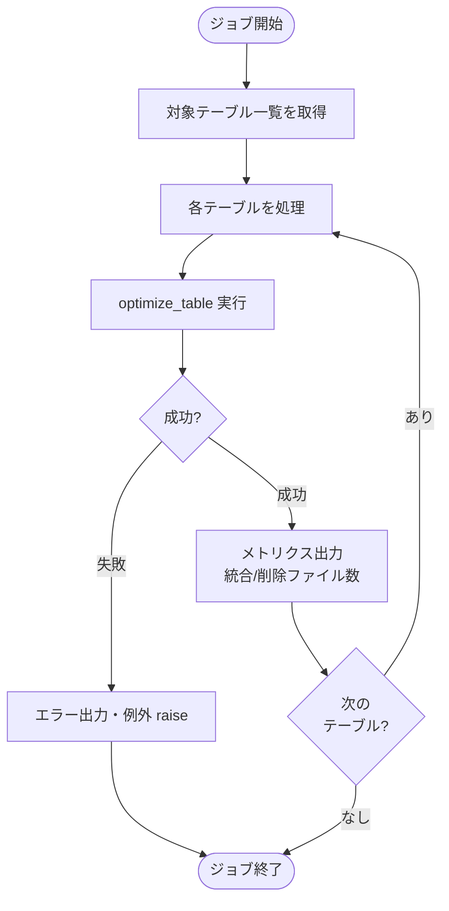
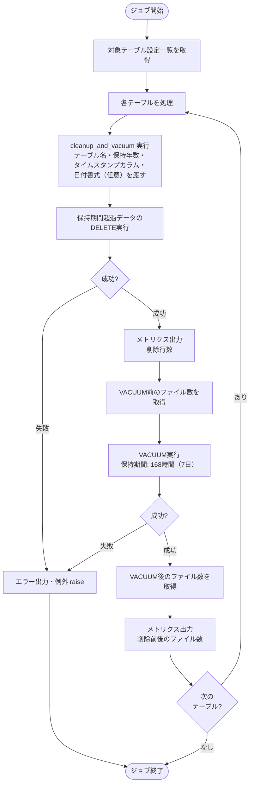
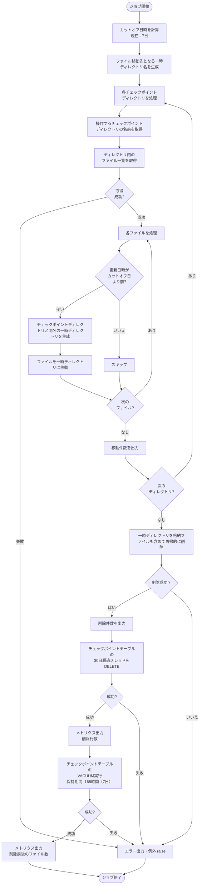

# Deltaテーブル最適化ジョブ仕様書

## 目次

- [Deltaテーブル最適化ジョブ仕様書](#deltaテーブル最適化ジョブ仕様書)
  - [目次](#目次)
  - [概要](#概要)
    - [このドキュメントの役割](#このドキュメントの役割)
    - [対象機能](#対象機能)
    - [ジョブ一覧](#ジョブ一覧)
  - [Delta Lakeメンテナンスジョブ仕様](#delta-lakeメンテナンスジョブ仕様)
    - [OPTIMIZEジョブ](#optimizeジョブ)
      - [ジョブ概要](#ジョブ概要)
      - [対象テーブル](#対象テーブル)
      - [処理フロー](#処理フロー)
      - [処理コード](#処理コード)
      - [OPTIMIZE設定](#optimize設定)
    - [クリーンアップ/VACUUMジョブ](#クリーンアップvacuumジョブ)
      - [ジョブ概要](#ジョブ概要-1)
      - [対象テーブル](#対象テーブル-1)
      - [処理フロー](#処理フロー-1)
      - [処理コード](#処理コード-1)
      - [DELETE設定](#delete設定)
      - [VACUUM設定](#vacuum設定)
    - [チェックポイントクリーンアップジョブ](#チェックポイントクリーンアップジョブ)
      - [ジョブ概要](#ジョブ概要-2)
      - [処理フロー](#処理フロー-2)
      - [処理コード](#処理コード-2)
      - [クリーンアップ設定](#クリーンアップ設定)
  - [関連ドキュメント](#関連ドキュメント)
  - [変更履歴](#変更履歴)

---

## 概要

このドキュメントは、Databricks Workflowとして実装するDeltaテーブル最適化ジョブ機能の詳細を記載します。

### このドキュメントの役割

- Delta Lakeメンテナンス処理（OPTIMIZE、VACUUM、チェックポイントクリーンアップ）

### 対象機能

| 機能ID | 機能名             | 処理内容                           |
| ------ | ------------------ | ---------------------------------- |
| OP-001 | データメンテナンス | Delta Lakeテーブルの最適化・圧縮   |
| OP-002 | クリーンアップ     | 古いデータ・チェックポイントの削除 |

### ジョブ一覧

| ジョブ名                        | 実行間隔                                    | 説明                                                         |
| ------------------------------- | ------------------------------------------- | ------------------------------------------------------------ |
| sensor_data_table_optimize      | 日次（02:00）                               | Silver層テーブル、Gold層テーブルのOPTIMIZE実行               |
| sensor_table_cleanup_and_vacuum | sensor_data_table_optimizeジョブ完了後      | Silver層テーブル、Gold層テーブルのクリーンアップ・VACUUM実行 |
| checkpoint_cleanup_and_vacuum   | sensor_table_cleanup_and_vacuumジョブ完了後 | 古いチェックポイントの削除                                   |

---

## Delta Lakeメンテナンスジョブ仕様

Delta Lakeテーブルのパフォーマンスを維持するための定期メンテナンスジョブ。

### OPTIMIZEジョブ

小ファイルを最適なサイズに統合し、クエリパフォーマンスを向上させる。Silver層・Gold層で共通の処理関数を使用する。

#### ジョブ概要

| 項目             | 内容                           |
| ---------------- | ------------------------------ |
| ジョブ名         | sensor_data_table_optimize     |
| 実行方式         | Databricks Workflows           |
| 実行間隔         | 日次（cron: `0 1 * * *`）01:00 |
| クラスタ         | Serverless Job Compute         |
| タイムアウト     | 2時間                          |
| リトライポリシー | 失敗時1回リトライ              |

#### 対象テーブル

| 物理名                           | 層     | 形式          | 説明                                                                   |
| -------------------------------- | ------ | ------------- | ---------------------------------------------------------------------- |
| silver_sensor_data               | Silver | Deltaテーブル | シルバー層パイプラインがテレメトリデータを格納するテーブル             |
| gold_sensor_data_hourly_summary  | Gold   | Deltaテーブル | ゴールド層パイプラインがテレメトリデータの時次サマリを格納するテーブル |
| gold_sensor_data_daily_summary   | Gold   | Deltaテーブル | ゴールド層パイプラインがテレメトリデータの日次サマリを格納するテーブル |
| gold_sensor_data_monthly_summary | Gold   | Deltaテーブル | ゴールド層パイプラインがテレメトリデータの月次サマリを格納するテーブル |

#### 処理フロー



#### 処理コード

```python
def optimize_table(table: str):
    """テーブルのOPTIMIZE実行（共通処理）"""
    print(f"OPTIMIZE開始: {table}")
    try:
        result = spark.sql(f"OPTIMIZE {table}")
        metrics = result.first()
        print(f"  - 統合ファイル数: {metrics['numFilesAdded']}")
        print(f"  - 削除ファイル数: {metrics['numFilesRemoved']}")
        print(f"OPTIMIZE完了: {table}")
    except Exception as e:
        print(f"OPTIMIZEエラー: {table} - {str(e)}")
        raise


def run_optimize(tables: list):
    """対象テーブル一覧のOPTIMIZE実行"""
    for table in tables:
        optimize_table(table)
    print("全テーブルのOPTIMIZE完了")


# 対象テーブル一覧（Silver層・Gold層）
OPTIMIZE_TABLES = [
    "iot_catalog.silver.silver_sensor_data",
    "iot_catalog.gold.gold_sensor_data_hourly_summary",
    "iot_catalog.gold.gold_sensor_data_daily_summary",
    "iot_catalog.gold.gold_sensor_data_monthly_summary",
]

# ジョブ実行
run_optimize(OPTIMIZE_TABLES)
```

#### OPTIMIZE設定

| 項目               | 設定値                                                                                                                                                                                            | 説明                             |
| ------------------ | ------------------------------------------------------------------------------------------------------------------------------------------------------------------------------------------------- | -------------------------------- |
| 対象テーブル       | `iot_catalog.silver.silver_sensor_data`, `iot_catalog.gold.gold_sensor_data_hourly_summary`,`iot_catalog.gold.gold_sensor_data_daily_summary`,`iot_catalog.gold.gold_sensor_data_monthly_summary` | センサーデータ、各種サマリ       |
| 実行タイミング     | 毎日 02:00（低負荷時間帯）                                                                                                                                                                        | ストリーミング処理への影響を軽減 |
| 自動コンパクション | 有効（テーブル設定）                                                                                                                                                                              | 日次に加えて自動実行も併用       |

---

### クリーンアップ/VACUUMジョブ

保持期間を超過したデータの削除、削除済みファイルの物理削除によりストレージ使用量を削減する。Silver層・Gold層で共通の処理関数を使用する。
Silver層・Gold層に対してADLSライフサイクルを使用すると、Delta Logとの不整合が発生しクエリエラーの原因となるため、DELETE + VACUUMで削除する。

#### ジョブ概要

| 項目             | 内容                                   |
| ---------------- | -------------------------------------- |
| ジョブ名         | sensor_table_cleanup_and_vacuum        |
| 実行方式         | Databricks Workflows                   |
| 実行間隔         | sensor_data_table_optimizeジョブ完了後 |
| クラスタ         | Serverless Job Compute                 |
| タイムアウト     | 2時間                                  |
| リトライポリシー | 失敗時1回リトライ                      |

#### 対象テーブル

| 物理名                           | 層     | 保持期間 | タイムスタンプカラム  | 説明                                                                   |
| -------------------------------- | ------ | -------- | --------------------- | ---------------------------------------------------------------------- |
| silver_sensor_data               | Silver | 5年      | event_timestamp       | シルバー層パイプラインがテレメトリデータを格納するテーブル             |
| gold_sensor_data_hourly_summary  | Gold   | 10年     | collection_datetime   | ゴールド層パイプラインがテレメトリデータの時次サマリを格納するテーブル |
| gold_sensor_data_daily_summary   | Gold   | 10年     | collection_date       | ゴールド層パイプラインがテレメトリデータの日次サマリを格納するテーブル |
| gold_sensor_data_monthly_summary | Gold   | 10年     | collection_year_month | ゴールド層パイプラインがテレメトリデータの月次サマリを格納するテーブル |

#### 処理フロー



#### 処理コード

```python
def cleanup_and_vacuum(table: str, retain_years: int, timestamp_col: str,
                       retain_hours: int = 168, cutoff_date_format: str = None):
    """テーブルのデータ削除（保持期間超過）およびVACUUM実行（共通処理）

    Args:
        table:              対象テーブルのフルパス
        retain_years:       データ保持年数（これを超えたレコードを削除）
        timestamp_col:      保持期間判定に使用するタイムスタンプカラム名
        retain_hours:       VACUUMの保持時間（デフォルト: 168時間 = 7日）
        cutoff_date_format: カットオフ日付の書式（省略時は DATE 型で比較）。
                            timestamp_col が STRING 型の場合に指定する
                            （例: 'yyyy-MM' → DATE_FORMAT で STRING に変換して比較）

    注意:
        table・timestamp_col・retain_years・cutoff_date_format は CLEANUP_TABLE_CONFIG の
        コード内定数からのみ渡すこと。
        外部入力（ユーザー入力・API経由の値等）を直接渡すと SQL インジェクションのリスクがある。
    """
    print(f"クリーンアップ開始: {table}")
    try:
        # カットオフ日付の式を決定（STRING型カラムの場合は書式変換）
        if cutoff_date_format:
            cutoff_expr = f"DATE_FORMAT(CURRENT_DATE() - INTERVAL {retain_years} YEAR, '{cutoff_date_format}')"
        else:
            cutoff_expr = f"CURRENT_DATE() - INTERVAL {retain_years} YEAR"

        # 保持期間超過データを削除
        deleted = spark.sql(f"""
            DELETE FROM {table}
            WHERE {timestamp_col} < {cutoff_expr}
        """)
        print(f"  - {retain_years}年超過データ削除行数: {deleted.first()['num_deleted_rows']}")

        # VACUUM実行前のファイル数を取得
        before_files = spark.sql(f"DESCRIBE DETAIL {table}").first()["numFiles"]

        # VACUUM実行
        spark.sql(f"VACUUM {table} RETAIN {retain_hours} HOURS")

        # VACUUM実行後のファイル数を取得
        after_files = spark.sql(f"DESCRIBE DETAIL {table}").first()["numFiles"]

        print(f"  - 削除前ファイル数: {before_files}")
        print(f"  - 削除後ファイル数: {after_files}")
        print(f"クリーンアップ完了: {table}")
    except Exception as e:
        print(f"クリーンアップエラー: {table} - {str(e)}")
        raise


# 対象テーブル設定（テーブル名・保持年数・タイムスタンプカラム・日付書式（任意））
CLEANUP_TABLE_CONFIG = [
    {
        "table": "iot_catalog.silver.silver_sensor_data",
        "retain_years": 5,
        "timestamp_col": "event_timestamp",
    },
    {
        "table": "iot_catalog.gold.gold_sensor_data_hourly_summary",
        "retain_years": 10,
        "timestamp_col": "collection_datetime",
    },
    {
        "table": "iot_catalog.gold.gold_sensor_data_daily_summary",
        "retain_years": 10,
        "timestamp_col": "collection_date",
    },
    {
        "table": "iot_catalog.gold.gold_sensor_data_monthly_summary",
        "retain_years": 10,
        "timestamp_col": "collection_year_month",
        "cutoff_date_format": "yyyy-MM",
    },
]

# ジョブ実行
for config in CLEANUP_TABLE_CONFIG:
    cleanup_and_vacuum(**config)

print("全テーブルのクリーンアップ完了")
```

#### DELETE設定

| 項目                   | Silver層           | Gold層（hourly/daily）                                            | Gold層（monthly）                  |
| ---------------------- | ------------------ | ----------------------------------------------------------------- | ---------------------------------- |
| 保持期間               | 5年                | 10年                                                              | 10年                               |
| タイムスタンプカラム型 | TIMESTAMP          | TIMESTAMP / DATE                                                  | STRING（YYYY-MM）                  |
| カットオフ比較方式     | DATE型で比較       | DATE型で比較                                                      | DATE_FORMAT で STRING 変換後に比較 |
| 対象テーブル           | silver_sensor_data | gold_sensor_data_hourly_summary<br>gold_sensor_data_daily_summary | gold_sensor_data_monthly_summary   |

#### VACUUM設定

| 項目         | 設定値                                                                                                                                                                                            | 説明                                 |
| ------------ | ------------------------------------------------------------------------------------------------------------------------------------------------------------------------------------------------- | ------------------------------------ |
| 保持期間     | 168時間（7日）                                                                                                                                                                                    | Time Travel用に7日分のファイルを保持 |
| 対象テーブル | `iot_catalog.silver.silver_sensor_data`, `iot_catalog.gold.gold_sensor_data_hourly_summary`,`iot_catalog.gold.gold_sensor_data_daily_summary`,`iot_catalog.gold.gold_sensor_data_monthly_summary` | センサーデータ、各種サマリ           |

**注意事項:**
- VACUUMを実行すると、保持期間（7日）より古いバージョンへのTime Travelができなくなる
- 保持期間はテーブルプロパティ `delta.deletedFileRetentionDuration` と一致させる

---

### チェックポイントクリーンアップジョブ

保持期間を超過したデータの削除、対話型AIチャット、ストリーミングパイプラインのチェックポイントファイルを定期的にクリーンアップする。

#### ジョブ概要

| 項目             | 設定値                                      |
| ---------------- | ------------------------------------------- |
| ジョブ名         | checkpoint_cleanup_and_vacuum               |
| 実行方式         | Databricks Workflows                        |
| 実行間隔         | sensor_table_cleanup_and_vacuumジョブ完了後 |
| クラスタ         | Serverless Job Compute                      |
| タイムアウト     | 1時間                                       |
| リトライポリシー | 失敗時リトライなし                          |

#### 処理フロー



#### 処理コード

```python
from datetime import datetime, timedelta

def cleanup_old_checkpoints():
    """7日以上経過したチェックポイントファイルを一時ディレクトリ経由で削除"""

    # チェックポイント保存先
    CHECKPOINT_BASE_PATH = "abfss://bronze@<account>.dfs.core.windows.net/_checkpoints/"

    # 保持期間（日）
    RETAIN_DAYS = 7

    # 対象パイプラインのチェックポイントディレクトリ
    checkpoint_dirs = [
        f"{CHECKPOINT_BASE_PATH}silver_pipeline/",
    ]

    cutoff_date = datetime.now() - timedelta(days=RETAIN_DAYS)

    # 実行日時ベースで一時ディレクトリ名を生成（並列実行時の衝突を防止）
    run_id = datetime.now().strftime("%Y%m%d_%H%M%S")
    staging_base = f"{CHECKPOINT_BASE_PATH}_staging_{run_id}/"

    total_moved = 0

    try:
        for checkpoint_dir in checkpoint_dirs:
            # チェックポイントディレクトリと同名のサブディレクトリを一時ディレクトリ配下に作成
            dir_name = checkpoint_dir.rstrip("/").split("/")[-1]
            staging_dir = f"{staging_base}{dir_name}/"

            print(f"チェックポイントクリーンアップ開始: {checkpoint_dir}")
            try:
                # ディレクトリ内のファイル一覧を取得
                files = dbutils.fs.ls(checkpoint_dir)

                moved_count = 0
                for file_info in files:
                    # ファイルの更新日時を確認
                    if hasattr(file_info, 'modificationTime'):
                        file_time = datetime.fromtimestamp(file_info.modificationTime / 1000)
                        if file_time < cutoff_date:
                            # 一時ディレクトリへ移動（mv時点でサブディレクトリが自動生成される）
                            dst = staging_dir + file_info.name
                            dbutils.fs.mv(file_info.path, dst, recurse=True)
                            moved_count += 1
                    else:
                        print(f"  - スキップ（modificationTime未取得）: {file_info.path}")

                total_moved += moved_count
                print(f"  - 一時ディレクトリへの移動件数: {moved_count}")
                print(f"クリーンアップ（移動）完了: {checkpoint_dir}")

            except Exception as e:
                print(f"クリーンアップエラー: {checkpoint_dir} - {str(e)}")
                raise

        # 全ディレクトリの移動完了後、一時ディレクトリを再帰的に一括削除
        print(f"一時ディレクトリ削除開始: {staging_base}")
        dbutils.fs.rm(staging_base, recurse=True)
        print(f"  - 削除ファイル/ディレクトリ数: {total_moved}")
        print(f"一時ディレクトリ削除完了: {staging_base}")

        print("全チェックポイントのクリーンアップ完了")

    except Exception as e:
        print(f"エラーが発生しました。一時ディレクトリが残存している可能性があります: {staging_base}")
        raise
    finally:
        # 例外発生時に一時ディレクトリが残存している場合は削除
        try:
            dbutils.fs.rm(staging_base, recurse=True)
        except Exception:
            pass  # 正常終了時は既に削除済みのため無視


def cleanup_checkpoint_table():
    """AIチャットチェックポイントテーブルの30日超過スレッド削除およびVACUUM実行"""

    TABLE = "iot_catalog.ai_chat.check_point_data"
    RETAIN_HOURS = 168  # 7日

    print(f"チェックポイントテーブルクリーンアップ開始: {TABLE}")
    try:
        # 最終更新から30日経過したスレッドをスレッド単位で削除
        deleted = spark.sql(f"""
            DELETE FROM {TABLE}
            WHERE thread_id IN (
                SELECT thread_id
                FROM {TABLE}
                GROUP BY thread_id
                HAVING MAX(`timestamp`) < CURRENT_TIMESTAMP() - INTERVAL 30 DAYS
            )
        """)
        print(f"  - 30日超過スレッド削除行数: {deleted.first()['num_deleted_rows']}")

        # VACUUM実行前のファイル数を取得
        before_files = spark.sql(f"DESCRIBE DETAIL {TABLE}").first()["numFiles"]

        # VACUUM実行
        spark.sql(f"VACUUM {TABLE} RETAIN {RETAIN_HOURS} HOURS")

        # VACUUM実行後のファイル数を取得
        after_files = spark.sql(f"DESCRIBE DETAIL {TABLE}").first()["numFiles"]

        print(f"  - 削除前ファイル数: {before_files}")
        print(f"  - 削除後ファイル数: {after_files}")
        print(f"チェックポイントテーブルクリーンアップ完了: {TABLE}")
    except Exception as e:
        print(f"チェックポイントテーブルクリーンアップエラー: {TABLE} - {str(e)}")
        raise


# ジョブ実行
cleanup_old_checkpoints()
cleanup_checkpoint_table()
```

#### クリーンアップ設定

**ストリーミングパイプライン チェックポイントファイル**

| 項目     | 設定値                       | 説明                                         |
| -------- | ---------------------------- | -------------------------------------------- |
| 保持期間 | 7日                          | 障害復旧に必要な期間を確保                   |
| 対象     | チェックポイントディレクトリ | ストリーミングパイプラインのチェックポイント |

**AIチャット チェックポイントテーブル**

| 項目           | 設定値                                 | 説明                                       |
| -------------- | -------------------------------------- | ------------------------------------------ |
| DELETE保持期間 | 30日                                   | スレッド単位で最終更新から30日経過分を削除 |
| VACUUM保持期間 | 168時間（7日）                         | Time Travel用に7日分のファイルを保持       |
| 対象テーブル   | `iot_catalog.ai_chat.check_point_data` | AIチャットの会話状態永続化テーブル         |

**注意事項:**
- スレッド内の途中チェックポイントだけ削除すると `parent_timestamp` の参照が壊れるため、スレッド単位でまとめて削除する

---

## 関連ドキュメント

- [README.md](./README.md) - Deltaテーブル最適化ジョブ概要
- [シルバー層LDPパイプライン仕様書](../../ldp-pipeline/silver-layer/ldp-pipeline-specification.md) - silver_sensor_data への書き込み処理の詳細
- [ゴールド層LDPパイプライン仕様書](../../ldp-pipeline/gold-layer/ldp-pipeline-specification.md) - gold_sensor_data_* への書き込み処理の詳細
- [UnityCatalogデータベース設計書](../../common/unity-catalog-database-specification.md) - Silver層テーブル定義、Gold層テーブル定義、AIチャットチェックポイントテーブル定義

---

## 変更履歴

| 日付       | 版数 | 変更内容                                         | 担当者       |
| ---------- | ---- | ------------------------------------------------ | ------------ |
| 2026-04-07 | 1.0  | 初版作成                                         | Kei Sugiyama |
| 2026-04-10 | 1.1  | Silver・Gold処理を共通関数化してドキュメント統合 | Kei Sugiyama |
