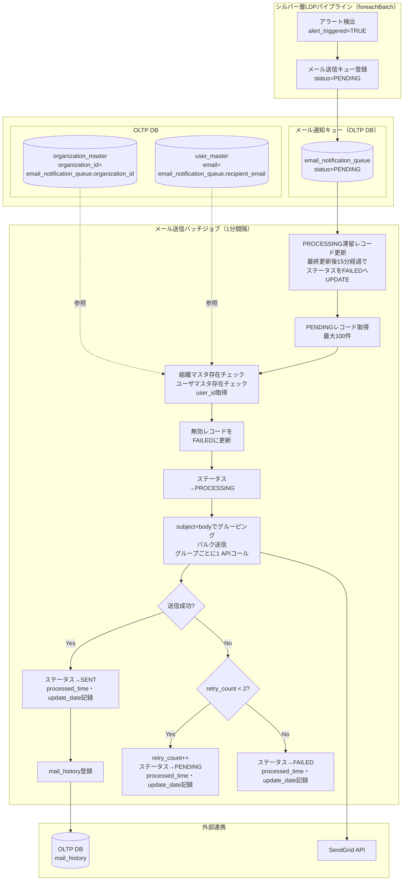
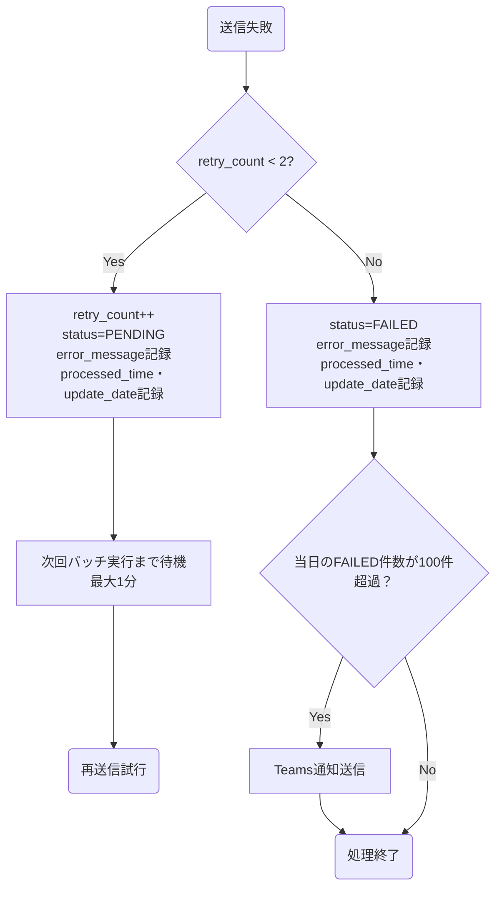

# メール通知送信ジョブ

## 目次

- [メール通知送信ジョブ](#メール通知送信ジョブ)
  - [目次](#目次)
  - [概要](#概要)
    - [主な責務](#主な責務)
  - [機能ID](#機能id)
  - [データモデル](#データモデル)
    - [入力データ](#入力データ)
    - [メール通知キューカラム一覧](#メール通知キューカラム一覧)
    - [ステータス遷移](#ステータス遷移)
    - [出力先](#出力先)
    - [メール送信履歴カラム一覧](#メール送信履歴カラム一覧)
  - [使用テーブル一覧](#使用テーブル一覧)
    - [読み取りテーブル（OLTP DB）](#読み取りテーブルoltp-db)
    - [読み取りテーブル（UnityCatalog）](#読み取りテーブルunitycatalog)
    - [書き込みテーブル（OLTP DB）](#書き込みテーブルoltp-db)
    - [書き込みテーブル（UnityCatalog）](#書き込みテーブルunitycatalog)
  - [処理フロー](#処理フロー)
    - [リトライフロー](#リトライフロー)
  - [障害時のTeams通知](#障害時のteams通知)
  - [パフォーマンス要件](#パフォーマンス要件)
  - [データ保持ポリシー](#データ保持ポリシー)
  - [関連ドキュメント](#関連ドキュメント)
    - [機能仕様](#機能仕様)
    - [上流パイプライン](#上流パイプライン)
    - [共通仕様](#共通仕様)
    - [データベース設計](#データベース設計)
    - [要件定義](#要件定義)
  - [変更履歴](#変更履歴)

---

## 概要

メール通知送信ジョブは、IoTデバイスのアラート検出時にメール通知キューへ登録されたレコードを、Azure App Service WebJobで定期実行して送信するバッチジョブです。

シルバー層LDPパイプラインがアラートを検出するたびにメール送信キュー（`email_notification_queue`）へPENDINGステータスのレコードを登録し、本ジョブが1分間隔でそのレコードを取得してSendGrid API経由でメール送信を行います。LDPストリーミング処理とメール送信を非同期化することで、ストリーミング処理のレイテンシに影響を与えないアーキテクチャを実現しています。

### 主な責務

1. **メールキュー取得**: メール通知キュー（`email_notification_queue`）からPENDINGレコードを取得
2. **メール送信**: SendGrid API経由でアラート通知メールを送信
3. **ステータス管理**: 送信結果に応じてキューレコードのステータスを更新（SENT / PENDING / FAILED）
4. **履歴記録**: 送信完了メールの記録を`mail_history`テーブルに保存
5. **リカバリ処理**: ジョブ異常終了時にPROCESSING状態で滞留しているレコードをFAILEDステータスに変更

---

## 機能ID

| 機能ID   | 機能名       | 説明                                             |
| -------- | ------------ | ------------------------------------------------ |
| FR-003-2 | アラート通知 | メール送信キューからのメール送信（バッチジョブ） |

---

## データモデル

### 入力データ

| データソース             | 形式             | 説明                                                             |
| ------------------------ | ---------------- | ---------------------------------------------------------------- |
| email_notification_queue | OLTP DB テーブル | シルバー層パイプラインがアラート検出時に登録するメール送信待機列 |

### メール通知キューカラム一覧

| #   | カラム物理名      | カラム論理名         | データ型     | NULL     | 説明                                           |
| --- | ----------------- | -------------------- | ------------ | -------- | ---------------------------------------------- |
| 1   | queue_id          | キューID             | BIGINT       | NOT NULL | キューレコードの一意識別子（自動採番）         |
| 2   | device_id         | デバイスID           | INT          | NOT NULL | アラート発生元デバイスID                       |
| 3   | organization_id   | 組織ID               | INT          | NOT NULL | デバイス所属組織ID                             |
| 4   | alert_id          | アラートID           | INT          | NOT NULL | 発生したアラート設定ID                         |
| 5   | recipient_email   | 送信先メールアドレス | JSON         | NOT NULL | 通知送信先のメールアドレス（JSON形式）         |
| 6   | subject           | メール件名           | VARCHAR(500) | NOT NULL | メール件名                                     |
| 7   | body              | メール本文           | TEXT         | NOT NULL | メール本文                                     |
| 8   | alert_detail_json | アラート詳細JSON     | JSON         | NOT NULL | アラート詳細情報（測定項目・値・閾値等）       |
| 9   | status            | ステータス           | VARCHAR(20)  | NOT NULL | `PENDING` / `PROCESSING` / `SENT` / `FAILED`   |
| 10  | retry_count       | リトライ回数         | INT          | NOT NULL | 送信リトライ回数（初期値: 0、最大: 3）         |
| 11  | error_message     | エラーメッセージ     | JSON         | NULL     | 送信失敗時のエラー内容                         |
| 12  | event_timestamp   | イベント発生日時     | DATETIME     | NOT NULL | アラートが発生した日時                         |
| 13  | processed_time    | 処理日時             | DATETIME     | NULL     | 送信処理を実施した日時（成功・失敗問わず記録） |
| 14  | create_date       | 作成日時             | DATETIME     | NOT NULL | レコード作成日時                               |
| 15  | update_date       | 更新日時             | DATETIME     | NOT NULL | レコード更新日時                               |

**recipient_emailの形式**:
```json
{
  "to": ["user1@example.com", "user2@example.com"]
}
```


### ステータス遷移

| ステータス | 説明                                                 | 遷移元               | 遷移先                  |
| ---------- | ---------------------------------------------------- | -------------------- | ----------------------- |
| PENDING    | 送信待ち（初期状態）                                 | -                    | PROCESSING              |
| PROCESSING | 送信処理中                                           | PENDING              | SENT / PENDING / FAILED |
| SENT       | 送信完了                                             | PROCESSING           | -                       |
| FAILED     | 送信失敗（最大リトライ回数超過 または マスタ不整合） | PROCESSING / PENDING | -                       |

### 出力先

| 出力先                   | 形式                 | 説明                                          |
| ------------------------ | -------------------- | --------------------------------------------- |
| SendGrid API             | HTTP POSTリクエスト  | アラート通知メールの送信                      |
| email_notification_queue | OLTP DB テーブル更新 | ステータス・retry_count・processed_timeの更新 |
| mail_history             | OLTP DB テーブル登録 | 送信済みメールの履歴記録                      |

### メール送信履歴カラム一覧

| #   | カラム物理名      | カラム論理名         | データ型     | NULL     | 説明                                      |
| --- | ----------------- | -------------------- | ------------ | -------- | ----------------------------------------- |
| 1   | mail_history_id   | メール送信履歴ID     | INT          | NOT NULL | メール送信履歴の一意識別子                |
| 2   | mail_history_uuid | メール送信履歴UUID   | VARCHAR(36)  | NOT NULL | UUID（外部公開用一意識別子）              |
| 3   | mail_type         | メール種別ID         | INT          | NOT NULL | メール種別ID（mail_type_master参照）      |
| 4   | sender_email      | 送信元メールアドレス | VARCHAR(254) | NOT NULL | 送信元のメールアドレス                    |
| 5   | recipients        | 送信先メールアドレス | JSON         | NOT NULL | 送信先のメールアドレス（JSON形式）        |
| 6   | subject           | メール件名           | VARCHAR(500) | NOT NULL | メールの件名                              |
| 7   | body              | メール本文           | TEXT         | NOT NULL | メールの本文                              |
| 8   | sent_at           | 送信日時             | DATETIME     | NOT NULL | メール送信日時                            |
| 9   | user_id           | 関連ユーザーID       | INT          | NULL     | 関連するユーザーID（user_master参照）     |
| 10  | organization_id   | 関連組織ID           | INT          | NULL     | 関連する組織ID（organization_master参照） |
| 11  | create_date       | 作成日時             | DATETIME     | NOT NULL | レコード作成日時                          |
| 12  | creator           | 作成者               | INT          | NOT NULL | レコード作成者のユーザーID                |
| 13  | update_date       | 更新日時             | DATETIME     | NULL     | レコード最終更新日時                      |
| 14  | modifier          | 更新者               | INT          | NULL     | レコード更新者のユーザーID                |

**recipientsの形式**:
```json
{
  "to": ["user1@example.com", "user2@example.com"]
}
```

---

## 使用テーブル一覧

### 読み取りテーブル（OLTP DB）

| テーブル名               | 用途                                                                               |
| ------------------------ | ---------------------------------------------------------------------------------- |
| email_notification_queue | メール送信待機レコード取得                                                         |
| organization_master      | メール通知時、通知先組織の実在チェックで利用する                                   |
| user_master              | メール送信履歴テーブルにデータ登録する際に必要な関連ユーザIDを生成するため利用する |

### 読み取りテーブル（UnityCatalog）

なし


### 書き込みテーブル（OLTP DB）

| テーブル名               | 用途                                                     |
| ------------------------ | -------------------------------------------------------- |
| email_notification_queue | ステータス・retry_count・processed_time・update_date更新 |
| mail_history             | 送信済みメールの履歴記録                                 |

### 書き込みテーブル（UnityCatalog）

なし

---

## 処理フロー



### リトライフロー



---

## 障害時のTeams通知

以下のエラー発生時、Teamsのシステム保守者連絡チャネルに通知を行い、運用担当者が迅速に対応できるようにする。

| エラー種別             | 通知タイミング       | 説明                                       |
| ---------------------- | -------------------- | ------------------------------------------ |
| SendGrid API接続失敗   | 最大リトライ超過後   | SendGrid APIへの接続失敗が連続した場合     |
| メール送信履歴記録失敗 | INSERT失敗時（即時） | mail_historyへのINSERT失敗時               |
| キュー取得失敗         | 例外発生時（即時）   | email_notification_queueへのアクセス失敗時 |
| FAILED件数過多         | 日次（100件超過）    | 大量のFAILEDレコード発生時                 |

Teams通知の実装詳細は[共通仕様書](../../common/common-specification.md)を参照。

---

## パフォーマンス要件

| 要件           | 値                       | 対応策                                                    |
| -------------- | ------------------------ | --------------------------------------------------------- |
| 実行間隔       | 1分（60秒）              | App Service WebJobのスケジュール実行（settings.job.json） |
| バッチ処理時間 | 1分以内                  | 1バッチあたり最大100件で次実行に干渉しない                |
| メール送信     | 平均100件/分             | SendGrid APIタイムアウト30秒以内                          |
| E2Eレイテンシ  | アラート検出から70秒以内 | ストリーミング処理5秒 + キュー待機60秒                    |

> 本バッチジョブは、アプリケーションの設計思想（アプリケーションのポータブル化、コスト低減）の観点から、実行契機をemail_notification_queueテーブルへのレコード挿入イベント駆動ではなく、定時実行とする。
> イベント駆動として実装しようとすると、クラウド固有機能やクラウドマネージドサービスを複数必要とするため、コスト増、クラウド基盤依存となってしまう。

---

## データ保持ポリシー

| テーブル                                    | 保持期間 | 削除対象             | 削除方式                 |
| ------------------------------------------- | -------- | -------------------- | ------------------------ |
| email_notification_queue（SENT / FAILED）   | 30日間   | SENT・FAILEDレコード | DELETE                   |
| email_notification_queue（PROCESSING 滞留） | 15分     | 削除しない           | FAILEDステータスへUPDATE |
| mail_history                                | 恒久保持 | 削除しない           | -                        |

SENT/FAILED レコードのクリーンアップは `email_queue_cleanup` ジョブ（日次 03:00）で実行する。  
PROCESSING 滞留レコードのFAILEDステータスへの更新は `email_notification_sender` ジョブ起動時に毎回実行する。

---

## 関連ドキュメント

### 機能仕様

- [ジョブ仕様書](./job-specification.md) - 処理コード・リトライ戦略詳細
- [OLTPクリーンアップジョブ仕様書](../oltp-cleanup/job-specification.md) - email_queue_cleanup ジョブ詳細

### 上流パイプライン

- [シルバー層LDPパイプライン概要](../../ldp-pipeline/silver-layer/README.md) - メール送信キュー登録元
- [シルバー層LDPパイプライン仕様書](../../ldp-pipeline/silver-layer/ldp-pipeline-specification.md) - メールキュー登録処理の詳細

### 共通仕様

- [共通仕様書](../../common/common-specification.md) - Teams通知・共通エラーハンドリング仕様

### データベース設計

- [アプリケーションデータベース設計書](../../common/app-database-specification.md) - email_notification_queue・mail_historyテーブル定義

### 要件定義

- [機能要件定義書](../../../02-requirements/functional-requirements.md) - FR-003-2
- [非機能要件定義書](../../../02-requirements/non-functional-requirements.md) - NFR-PERF, NFR-AVAIL

---

## 変更履歴

| 日付       | 版数 | 変更内容                                                       | 担当者       |
| ---------- | ---- | -------------------------------------------------------------- | ------------ |
| 2026-04-01 | 1.0  | 初版作成                                                       | Kei Sugiyama |
| 2026-04-09 | 1.1  | SendGrid対応・フロー図修正                                     | Kei Sugiyama |
| 2026-04-10 | 1.2  | 処理フロー図のsubgraphラベル修正・UserMasterノード参照条件修正 | Kei Sugiyama |
| 2026-04-14 | 1.3  | レビュー指摘コメント反映                                       | Kei Sugiyama |