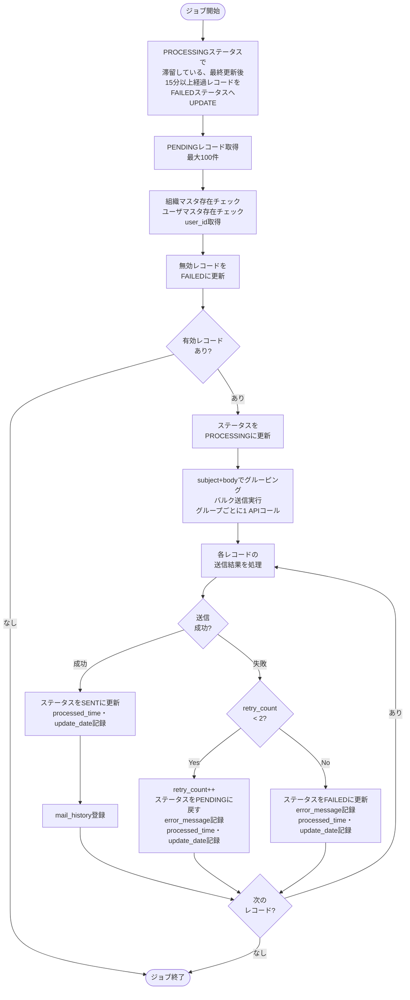

# メール通知送信ジョブ仕様書

## 目次

- [メール通知送信ジョブ仕様書](#メール通知送信ジョブ仕様書)
  - [目次](#目次)
  - [概要](#概要)
    - [このドキュメントの役割](#このドキュメントの役割)
    - [対象機能](#対象機能)
    - [ジョブ一覧](#ジョブ一覧)
  - [メール送信バッチジョブ仕様](#メール送信バッチジョブ仕様)
    - [ジョブ概要](#ジョブ概要)
    - [WebJob 配置構成](#webjob-配置構成)
    - [処理フロー](#処理フロー)
    - [バッチ処理コード](#バッチ処理コード)
    - [リトライ戦略](#リトライ戦略)
  - [関連ドキュメント](#関連ドキュメント)
  - [変更履歴](#変更履歴)

---

## 概要

このドキュメントは、Azure App Service WebJobとして実装するバッチ機能のうち、メール通知送信ジョブの詳細を記載します。

### このドキュメントの役割

- アラート通知処理
- PROCESSING状態滞留レコード削除処理

### 対象機能

| 機能ID   | 機能名       | 処理内容                         |
| -------- | ------------ | -------------------------------- |
| FR-003-2 | アラート通知 | メール送信キューからのメール送信 |

### ジョブ一覧

本バッチジョブはemail_notification_queueテーブルに対するレコード挿入イベント駆動ではなく、定時実行されるものとする。

| ジョブ名                  | 実行間隔 | 説明                                                                                                  |
| ------------------------- | -------- | ----------------------------------------------------------------------------------------------------- |
| email_notification_sender | 1分間隔  | メール送信キューからメールを送信/メール送信キューテーブルのPROCESSING状態で滞留しているレコードを削除 |


---

## メール送信バッチジョブ仕様

### ジョブ概要

| 項目             | 設定値                                    |
| ---------------- | ----------------------------------------- |
| ジョブ名         | email_notification_sender                 |
| 実行方式         | App Service WebJob                        |
| 実行間隔         | 1分間隔（cron: `* * * * *`）              |
| タイムアウト     | 5分                                       |
| リトライポリシー | 失敗時、次回バッチ実行（約1分後）で再処理 |

### WebJob 配置構成

```
App_Data/
└── jobs/
    └── triggered/
        └── email_notification_sender/
            ├── email_notification_sender.py   ← メイン処理スクリプト
            └── settings.job.json              ← スケジュール定義
```

**settings.job.json**

```json
{
  "schedule": "0 */1 * * * *"
}
```

> スケジュールはApp Serviceアプリケーション設定 `WEBSITE_TIME_ZONE=Tokyo Standard Time` を設定することでJST基準で動作する。

**環境変数（App Service アプリケーション設定）**

| 環境変数名       | 説明                    |
| ---------------- | ----------------------- |
| SENDGRID_API_KEY | SendGrid APIキー        |
| MYSQL_HOST       | MySQL接続ホスト         |
| MYSQL_PORT       | MySQL接続ポート         |
| MYSQL_USER       | MySQLユーザー名         |
| MYSQL_PASSWORD   | MySQLパスワード         |
| MYSQL_DATABASE   | MySQL接続データベース名 |

---

### 処理フロー



### バッチ処理コード

```python
import json
import os
import requests
import uuid

# =============================================================================
# 定数定義
# =============================================================================
MAX_BATCH_SIZE = 100
MAX_RETRY_COUNT = 3
ALERT_MAIL_TYPE_ID = 1   # mail_type_master のアラート通知種別ID（実際の値に合わせて変更）
SYSTEM_USER_ID = 0       # mail_history の creator に設定するシステムユーザーID（実際の値に合わせて変更）

# =============================================================================
# SendGrid設定取得
# =============================================================================
SENDGRID_CONFIG = {
    "api_key": os.environ["SENDGRID_API_KEY"],
    "endpoint": "https://api.sendgrid.com/v3/mail/send",
    "from_address": "noreply@iot-system.example.com"
}

def send_emails_bulk(records: list) -> dict:
    """
    SendGrid HTTP API経由でバルクメール送信を実行。
    同一 subject + body のレコードをグルーピングし、グループごとに
    1回の API コールで複数宛先（personalizations）へ送信する。

    Returns:
        dict[int, tuple[bool, str]]: queue_id → (成功フラグ, エラーメッセージ)
    """
    from collections import defaultdict

    results = {}

    # subject + body でグルーピング
    groups = defaultdict(list)
    for r in records:
        groups[(r["subject"], r["body"])].append(r)

    headers = {
        "Authorization": f"Bearer {SENDGRID_CONFIG['api_key']}",
        "Content-Type": "application/json",
    }

    for (subject, body), group_records in groups.items():
        payload = {
            "personalizations": [
                {"to": [{"email": email} for email in json.loads(r["recipient_email"])["to"]]}
                for r in group_records
            ],
            "from": {"email": SENDGRID_CONFIG["from_address"]},
            "subject": subject,
            "content": [{"type": "text/plain", "value": body}],
        }

        try:
            response = requests.post(
                SENDGRID_CONFIG["endpoint"],
                headers=headers,
                json=payload,
                timeout=30,
            )

            # 202 Accepted が正常応答
            if response.status_code == 202:
                for r in group_records:
                    results[r["queue_id"]] = (True, None)
            else:
                error_msg = f"SendGrid API Error: status={response.status_code}, body={response.text}"
                for r in group_records:
                    results[r["queue_id"]] = (False, error_msg)

        except requests.exceptions.Timeout:
            for r in group_records:
                results[r["queue_id"]] = (False, "SendGrid API Timeout")
        except Exception as e:
            for r in group_records:
                results[r["queue_id"]] = (False, f"Unexpected Error: {str(e)}")

    return results


def validate_and_enrich_records(conn, pending_records: list) -> tuple[list, list]:
    """
    組織マスタ・ユーザマスタによる存在チェックとuser_id取得。
    OLTP DB（MySQL）経由で一括照合する。

    Returns:
        tuple[list, list]: (valid_records, invalid_records)
        valid_records    : _user_id が付与されたレコードのリスト
        invalid_records  : (record, error_message) のタプルリスト
    """
    if not pending_records:
        return [], []

    # 組織IDの一括存在チェック
    org_ids = list({r["organization_id"] for r in pending_records})
    placeholders = ",".join(["%s"] * len(org_ids))
    with conn.cursor() as cursor:
        cursor.execute(f"""
            SELECT organization_id
            FROM organization_master
            WHERE organization_id IN ({placeholders})
              AND delete_flag = 0
        """, org_ids)
        valid_org_ids = {row["organization_id"] for row in cursor.fetchall()}

    # 送信先メールアドレスの一括存在チェック・user_id取得（JSON配列から全アドレスを展開）
    emails = list({email for r in pending_records for email in json.loads(r["recipient_email"])["to"]})
    placeholders = ",".join(["%s"] * len(emails))
    with conn.cursor() as cursor:
        cursor.execute(f"""
            SELECT user_id, email
            FROM user_master
            WHERE email IN ({placeholders})
              AND delete_flag = 0
        """, emails)
        email_to_user_id = {row["email"]: row["user_id"] for row in cursor.fetchall()}

    valid_records = []
    invalid_records = []
    for r in pending_records:
        if r["organization_id"] not in valid_org_ids:
            invalid_records.append(
                (r, f"organization_id={r['organization_id']} not found in organization_master")
            )
        else:
            recipient_emails = json.loads(r["recipient_email"])["to"]
            missing_emails = [e for e in recipient_emails if e not in email_to_user_id]
            if missing_emails:
                invalid_records.append(
                    (r, f"recipient_email={missing_emails} not found in user_master")
                )
            else:
                r["_user_id"] = email_to_user_id[recipient_emails[0]]  # 先頭メールのuser_idを使用
                valid_records.append(r)

    return valid_records, invalid_records


def cleanup_stale_processing_records(conn):
    """
    PROCESSING状態のまま最終更新後15分経過したレコードをFAILEDに更新する。
    ジョブ異常終了時のリカバリ処理として実行。
    """
    STALE_THRESHOLD_MINUTES = 15

    with conn.cursor() as cursor:
        # 更新対象件数を確認
        cursor.execute("""
            SELECT COUNT(*) as cnt
            FROM email_notification_queue
            WHERE status = 'PROCESSING'
              AND update_date < DATE_SUB(NOW(), INTERVAL %s MINUTE)
        """, (STALE_THRESHOLD_MINUTES,))
        stale_count = cursor.fetchone()["cnt"]

        if stale_count > 0:
            print(f"PROCESSING状態で{STALE_THRESHOLD_MINUTES}分経過したレコード: {stale_count}件をFAILEDに更新します")

            cursor.execute("""
                UPDATE email_notification_queue
                SET status = 'FAILED',
                    processed_time = NOW(),
                    update_date = NOW()
                WHERE status = 'PROCESSING'
                  AND update_date < DATE_SUB(NOW(), INTERVAL %s MINUTE)
            """, (STALE_THRESHOLD_MINUTES,))
            conn.commit()
            print(f"FAILED更新完了: {cursor.rowcount}件")
        else:
            print("PROCESSING状態の滞留レコードなし")


def process_email_queue():
    """メール送信キューを処理"""
    import pymysql
    import pymysql.cursors

    db_config = {
        "host": os.environ["MYSQL_HOST"],
        "port": int(os.environ["MYSQL_PORT"]),
        "user": os.environ["MYSQL_USER"],
        "password": os.environ["MYSQL_PASSWORD"],
        "database": os.environ["MYSQL_DATABASE"],
        "cursorclass": pymysql.cursors.DictCursor,
        "charset": "utf8mb4",
    }

    with pymysql.connect(**db_config) as conn:
        # STEP 0: PROCESSING状態で滞留しているレコードをFAILEDステータスへ更新（リカバリ処理）
        cleanup_stale_processing_records(conn)

        # STEP 1: PENDINGレコードを取得
        with conn.cursor() as cursor:
            cursor.execute("""
                SELECT *
                FROM email_notification_queue
                WHERE status = 'PENDING'
                ORDER BY create_date ASC
                LIMIT %s
            """, (MAX_BATCH_SIZE,))
            pending_records = cursor.fetchall()

        if not pending_records:
            print("処理対象レコードなし")
            return

        # STEP 1.5: マスタ存在チェック（組織マスタ・ユーザマスタ）
        valid_records, invalid_records = validate_and_enrich_records(conn, pending_records)

        # 無効レコードを即時 FAILED に更新（PENDINGから直接遷移）
        if invalid_records:
            with conn.cursor() as cursor:
                for record, reason in invalid_records:
                    error_json = json.dumps({"message": reason}, ensure_ascii=False)
                    cursor.execute("""
                        UPDATE email_notification_queue
                        SET status = 'FAILED',
                            error_message = %s,
                            processed_time = NOW(),
                            update_date = NOW()
                        WHERE queue_id = %s
                    """, (error_json, record["queue_id"]))
                    print(f"queue_id={record['queue_id']}: マスタ不整合によりFAILED - {reason}")
            conn.commit()

        if not valid_records:
            print("有効な処理対象レコードなし")
            return

        print(f"有効レコード: {len(valid_records)}件 / 無効レコード: {len(invalid_records)}件")

        # STEP 2: 有効レコードのステータスをPROCESSINGに更新
        queue_ids = [r["queue_id"] for r in valid_records]
        placeholders = ",".join(["%s"] * len(queue_ids))
        with conn.cursor() as cursor:
            cursor.execute(f"""
                UPDATE email_notification_queue
                SET status = 'PROCESSING', update_date = NOW()
                WHERE queue_id IN ({placeholders})
            """, queue_ids)
        conn.commit()

        # STEP 3: バルク送信（subject+bodyでグルーピングし、グループごとに1 APIコール）
        send_results = send_emails_bulk(valid_records)

        # STEP 4: 送信結果をレコードごとに処理
        record_map = {r["queue_id"]: r for r in valid_records}
        for queue_id, (success, error_msg) in send_results.items():
            record = record_map[queue_id]
            retry_count = record["retry_count"]

            with conn.cursor() as cursor:
                if success:
                    # 送信成功: ステータス更新
                    cursor.execute("""
                        UPDATE email_notification_queue
                        SET status = 'SENT',
                            processed_time = NOW(),
                            update_date = NOW()
                        WHERE queue_id = %s
                    """, (queue_id,))
                    conn.commit()

                    # mail_history 登録
                    cursor.execute("""
                        INSERT INTO mail_history (
                            mail_history_uuid, mail_type, sender_email,
                            recipients, subject, body, sent_at,
                            user_id, organization_id, create_date, creator
                        ) VALUES (
                            %s, %s, %s, %s, %s, %s, NOW(), %s, %s, NOW(), %s
                        )
                    """, (
                        str(uuid.uuid4()),
                        ALERT_MAIL_TYPE_ID,
                        SENDGRID_CONFIG["from_address"],
                        record["recipient_email"],  # DB格納済みJSONをそのまま使用
                        record["subject"],
                        record["body"],
                        record["_user_id"],           # user_id（user_masterから取得）
                        record["organization_id"],
                        SYSTEM_USER_ID,
                    ))
                    conn.commit()
                    print(f"queue_id={queue_id}: 送信成功")

                else:
                    # 送信失敗
                    new_retry_count = retry_count + 1
                    error_json = json.dumps({"message": error_msg}, ensure_ascii=False)

                    if new_retry_count >= MAX_RETRY_COUNT:  # 3回目の失敗で即FAILED
                        # リトライ上限到達 → FAILED
                        cursor.execute("""
                            UPDATE email_notification_queue
                            SET status = 'FAILED',
                                retry_count = %s,
                                error_message = %s,
                                processed_time = NOW(),
                                update_date = NOW()
                            WHERE queue_id = %s
                        """, (new_retry_count, error_json, queue_id))
                        print(f"queue_id={queue_id}: 最大リトライ超過、FAILED")
                    else:
                        # リトライ可能 → PENDINGに戻す
                        cursor.execute("""
                            UPDATE email_notification_queue
                            SET status = 'PENDING',
                                retry_count = %s,
                                error_message = %s,
                                processed_time = NOW(),
                                update_date = NOW()
                            WHERE queue_id = %s
                        """, (new_retry_count, error_json, queue_id))
                        print(f"queue_id={queue_id}: 送信失敗、リトライ待ち (retry={new_retry_count})")
                    conn.commit()


# ジョブ実行
process_email_queue()
```

### リトライ戦略

| 項目               | 値                                       | 説明                                                                                                                                   |
| ------------------ | ---------------------------------------- | -------------------------------------------------------------------------------------------------------------------------------------- |
| 最大リトライ回数   | 3回                                      | 3回目の失敗で即FAILEDに遷移（retry_countの最大値は3）                                                                                  |
| リトライ間隔       | 約1分（次回バッチ実行まで待機）          | 失敗時はPENDINGに戻し次回バッチで再処理。バッチ内スリープなし                                                                          |
| タイムアウト       | 30秒                                     | SendGrid APIタイムアウト                                                                                                               |
| 失敗時処理         | FAILED更新、error_message記録            | 原因調査・手動対応用にエラー内容を保存                                                                                                 |
| PROCESSING滞留対応 | 最終更新時刻から15分経過でFAILEDへUPDATE | ジョブ異常終了時のリカバリとして、ジョブ開始時に最終更新時刻から15分以上経過している、PROCESSING状態のレコードをFAILEDステータスへ更新 |

---

## 関連ドキュメント

- [README.md](./README.md) - メール通知送信ジョブ概要
- [共通仕様書](../../common/common-specification.md) - Teams通知・共通エラーハンドリング仕様
- [シルバー層LDPパイプライン仕様書](../../ldp-pipeline/silver-layer/ldp-pipeline-specification.md) - メールキュー登録処理の詳細
- [アプリケーションデータベース設計書](../../common/app-database-specification.md) - email_notification_queue・mail_historyテーブル定義
- [OLTPクリーンアップジョブ仕様書](../oltp-cleanup/job-specification.md) - email_queue_cleanup ジョブ詳細

---

## 変更履歴

| 日付       | 版数 | 変更内容                                                      | 担当者       |
| ---------- | ---- | ------------------------------------------------------------- | ------------ |
| 2026-01-19 | 1.0  | 初版作成                                                      | Kei Sugiyama |
| 2026-04-10 | 1.1  | validate_and_enrich_records() にdelete_flagフィルタリング追加 | Kei Sugiyama |
| 2026-04-14 | 1.2  | レビュー指摘コメント反映                                      | Kei Sugiyama |