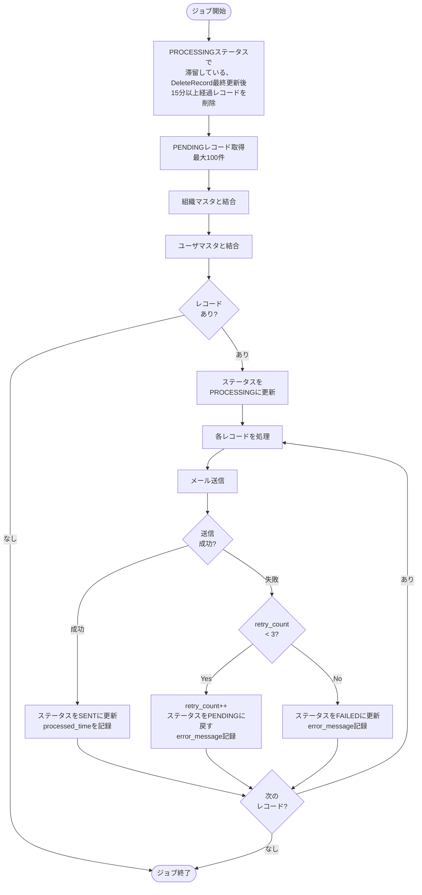

# メール送信ジョブ仕様書

## 目次

- [ジョブ仕様書](#ジョブ仕様書)
  - [目次](#目次)
  - [概要](#概要)
    - [このドキュメントの役割](#このドキュメントの役割)
    - [対象機能](#対象機能)
    - [ジョブ一覧](#ジョブ一覧)
  - [メール送信バッチジョブ仕様](#メール送信バッチジョブ仕様)
    - [ジョブ概要](#ジョブ概要)
    - [処理フロー](#処理フロー)
    - [バッチ処理コード](#バッチ処理コード)
    - [リトライ戦略](#リトライ戦略)
  - [キュークリーンアップジョブ仕様](#キュークリーンアップジョブ仕様)
    - [ジョブ概要](#ジョブ概要-1)
    - [処理フロー](#処理フロー-1)
    - [処理コード](#処理コード)
    - [クリーンアップ設定](#クリーンアップ設定)
  - [Delta Lakeメンテナンスジョブ仕様](#delta-lakeメンテナンスジョブ仕様)
    - [日次OPTIMIZEジョブ](#日次optimizeジョブ)
      - [ジョブ概要](#ジョブ概要-2)
      - [処理フロー](#処理フロー-2)
      - [処理コード](#処理コード-1)
      - [OPTIMIZE設定](#optimize設定)
    - [週次VACUUMジョブ](#週次vacuumジョブ)
      - [ジョブ概要](#ジョブ概要-3)
      - [処理フロー](#処理フロー-3)
      - [処理コード](#処理コード-2)
      - [VACUUM設定](#vacuum設定)
    - [チェックポイントクリーンアップジョブ](#チェックポイントクリーンアップジョブ)
      - [ジョブ概要](#ジョブ概要-4)
      - [処理フロー](#処理フロー-4)
      - [処理コード](#処理コード-3)
      - [クリーンアップ設定](#クリーンアップ設定-1)
  - [関連ドキュメント](#関連ドキュメント)
  - [変更履歴](#変更履歴)

---

## 概要

このドキュメントは、Databricks Workflowとして実装するバッチ機能のうち、メール送信ジョブの詳細を記載します。

### このドキュメントの役割

- アラート通知処理
- PROCESSING状態滞留レコード削除処理

### 対象機能

| 機能ID   | 機能名       | 処理内容                         |
| -------- | ------------ | -------------------------------- |
| FR-003-2 | アラート通知 | メール送信キューからのメール送信 |

### ジョブ一覧

| ジョブ名                  | 実行間隔 | 説明                                                                                               |
| ------------------------- | -------- | -------------------------------------------------------------------------------------------------- |
| email_notification_sender | 1分間隔  | メール送信キューからメールを送信/メール送信キューテーブルのPROCESS状態で滞留しているレコードを削除 |

---

## メール送信バッチジョブ仕様

### ジョブ概要

| 項目             | 設定値                                           |
| ---------------- | ------------------------------------------------ |
| ジョブ名         | email_notification_sender                        |
| 実行方式         | Databricks Workflow                              |
| 実行間隔         | 1分間隔（cron: `* * * * *`）                     |
| クラスタ         | Jobs Compute（サーバーレス推奨）                 |
| タイムアウト     | 5分                                              |
| リトライポリシー | 失敗時、ジッター付き指数バックオフを設けて再実行 |

### 処理フロー



### バッチ処理コード

```python
import smtplib
from email.mime.text import MIMEText
from email.mime.multipart import MIMEMultipart
from datetime import datetime
import time
import random

# =============================================================================
# 定数定義
# =============================================================================
MAX_BATCH_SIZE = 100
MAX_RETRY_COUNT = 3
RETRY_INTERVALS = [random.uniform(10, 12), random.uniform(10, 14), random.uniform(10, 18)]  # ジッター付き指数バックオフ（秒）

# =============================================================================
# SMTP設定取得
# =============================================================================
SMTP_CONFIG = {
    "host": dbutils.secrets.get("scope", "smtp-host"),
    "port": int(dbutils.secrets.get("scope", "smtp-port")),
    "user": dbutils.secrets.get("scope", "smtp-user"),
    "password": dbutils.secrets.get("scope", "smtp-password"),
    "from_address": "noreply@iot-system.example.com"
}

def send_email(recipient: str, subject: str, body: str) -> tuple[bool, str]:
    """
    メール送信を実行

    Returns:
        tuple[bool, str]: (成功フラグ, エラーメッセージ)
    """
    try:
        msg = MIMEMultipart()
        msg["Subject"] = subject
        msg["From"] = SMTP_CONFIG["from_address"]
        msg["To"] = recipient
        msg.attach(MIMEText(body, "plain", "utf-8"))

        with smtplib.SMTP(SMTP_CONFIG["host"], SMTP_CONFIG["port"], timeout=30) as server:
            server.starttls()
            server.login(SMTP_CONFIG["user"], SMTP_CONFIG["password"])
            server.send_message(msg)

        return True, None

    except smtplib.SMTPException as e:
        return False, f"SMTP Error: {str(e)}"
    except Exception as e:
        return False, f"Unexpected Error: {str(e)}"


def cleanup_stale_processing_records(conn):
    """
    PROCESSING状態のまま最終更新後15分経過したレコードを削除する。
    ジョブ異常終了時のリカバリ処理として実行。
    """
    STALE_THRESHOLD_MINUTES = 15

    with conn.cursor() as cursor:
        # 削除対象件数を確認
        cursor.execute("""
            SELECT COUNT(*) as cnt
            FROM email_notification_queue
            WHERE status = 'PROCESSING'
              AND update_date < DATE_SUB(NOW(), INTERVAL %s MINUTE)
        """, (STALE_THRESHOLD_MINUTES,))
        stale_count = cursor.fetchone()["cnt"]

        if stale_count > 0:
            print(f"PROCESSING状態で{STALE_THRESHOLD_MINUTES}分経過したレコード: {stale_count}件を削除します")

            cursor.execute("""
                DELETE FROM email_notification_queue
                WHERE status = 'PROCESSING'
                  AND update_date < DATE_SUB(NOW(), INTERVAL %s MINUTE)
            """, (STALE_THRESHOLD_MINUTES,))
            conn.commit()
            print(f"削除完了: {stale_count}件")
        else:
            print("PROCESSING状態の滞留レコードなし")


def process_email_queue():
    """メール送信キューを処理"""
    import pymysql
    import pymysql.cursors
    import json

    db_config = {
        "host": dbutils.secrets.get("scope", "mysql-host"),
        "port": int(dbutils.secrets.get("scope", "mysql-port")),
        "user": dbutils.secrets.get("scope", "mysql-user"),
        "password": dbutils.secrets.get("scope", "mysql-password"),
        "database": dbutils.secrets.get("scope", "mysql-database"),
        "cursorclass": pymysql.cursors.DictCursor,
        "charset": "utf8mb4",
    }

    with pymysql.connect(**db_config) as conn:
        # STEP 0: PROCESSING状態で滞留しているレコードを削除（リカバリ処理）
        cleanup_stale_processing_records(conn)

        # STEP 1: PENDINGレコードを取得
        with conn.cursor() as cursor:
            cursor.execute("""
                SELECT *
                FROM email_notification_queue
                WHERE status = 'PENDING'
                ORDER BY queued_time ASC
                LIMIT %s
            """, (MAX_BATCH_SIZE,))
            pending_records = cursor.fetchall()

        if not pending_records:
            print("処理対象レコードなし")
            return

        print(f"処理対象: {len(pending_records)}件")

        # STEP 2: ステータスをPROCESSINGに更新
        queue_ids = [r["queue_id"] for r in pending_records]
        placeholders = ",".join(["%s"] * len(queue_ids))
        with conn.cursor() as cursor:
            cursor.execute(f"""
                UPDATE email_notification_queue
                SET status = 'PROCESSING', update_date = NOW()
                WHERE queue_id IN ({placeholders})
            """, queue_ids)
        conn.commit()

        # STEP 3: 各レコードを処理
        for record in pending_records:
            queue_id = record["queue_id"]
            retry_count = record["retry_count"]

            # リトライ間隔の適用（リトライ時）
            if retry_count > 0 and retry_count <= len(RETRY_INTERVALS):
                time.sleep(RETRY_INTERVALS[retry_count - 1])

            # メール送信実行
            success, error_msg = send_email(
                recipient=record["recipient_email"],
                subject=record["subject"],
                body=record["body"]
            )

            with conn.cursor() as cursor:
                if success:
                    # 送信成功
                    cursor.execute("""
                        UPDATE email_notification_queue
                        SET status = 'SENT',
                            processed_time = NOW(),
                            update_date = NOW()
                        WHERE queue_id = %s
                    """, (queue_id,))
                    conn.commit()
                    print(f"queue_id={queue_id}: 送信成功")

                else:
                    # 送信失敗
                    new_retry_count = retry_count + 1
                    error_json = json.dumps({"message": error_msg}, ensure_ascii=False)

                    if new_retry_count >= MAX_RETRY_COUNT:
                        # リトライ上限到達 → FAILED
                        cursor.execute("""
                            UPDATE email_notification_queue
                            SET status = 'FAILED',
                                retry_count = %s,
                                error_message = %s,
                                processed_time = NOW(),
                                update_date = NOW()
                            WHERE queue_id = %s
                        """, (new_retry_count, error_json, queue_id))
                        print(f"queue_id={queue_id}: 最大リトライ超過、FAILED")
                    else:
                        # リトライ可能 → PENDINGに戻す
                        cursor.execute("""
                            UPDATE email_notification_queue
                            SET status = 'PENDING',
                                retry_count = %s,
                                error_message = %s,
                                update_date = NOW()
                            WHERE queue_id = %s
                        """, (new_retry_count, error_json, queue_id))
                        print(f"queue_id={queue_id}: 送信失敗、リトライ待ち (retry={new_retry_count})")
                    conn.commit()


# ジョブ実行
process_email_queue()
```

### リトライ戦略

| 項目               | 値                                                         | 説明                                                                                                                 |
| ------------------ | ---------------------------------------------------------- | -------------------------------------------------------------------------------------------------------------------- |
| 最大リトライ回数   | 3回                                                        | retry_countが3に達したらFAILEDに遷移                                                                                 |
| リトライ間隔       | ジッター付き指数バックオフ（10～12秒、10～14秒、10～18秒） | 送信失敗時の待機時間                                                                                                 |
| タイムアウト       | 30秒                                                       | SMTP接続タイムアウト                                                                                                 |
| 失敗時処理         | FAILED更新、error_message記録                              | 原因調査・手動対応用にエラー内容を保存                                                                               |
| PROCESSING滞留対応 | 最終更新時刻から15分経過で削除                             | ジョブ異常終了時のリカバリとして、ジョブ開始時に最終更新時刻から15分以上経過している、PROCESSING状態のレコードを削除 |
---

## 関連ドキュメント

- [README.md](./README.md) - メール送信ジョブ概要
- [シルバー層LDPパイプライン仕様書](../../ldp-pipeline/silver-layer/ldp-pipeline-specification.md) - メールキュー登録処理の詳細
- [アプリケーションデータベース設計書](../../common/app-database-specification.md) - email_notification_queue・mail_historyテーブル定義

---

## 変更履歴

| 日付       | 版数 | 変更内容 | 担当者       |
| ---------- | ---- | -------- | ------------ |
| 2026-01-19 | 1.0  | 初版作成 | Kei Sugiyama |