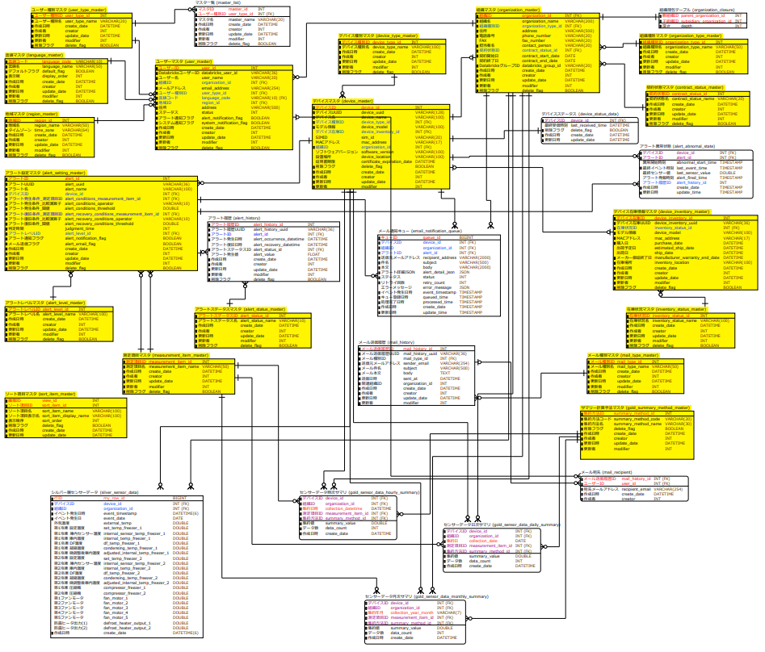

# アプリケーションデータベース設計書

## 📑 目次

- [アプリケーションデータベース設計書](#アプリケーションデータベース設計書)
  - [📑 目次](#-目次)
  - [概要](#概要)
    - [データベース種別](#データベース種別)
    - [設計方針](#設計方針)
  - [ER図](#er図)
  - [テーブル一覧](#テーブル一覧)
  - [テーブル定義](#テーブル定義)
    - [1. ユーザーマスタ (user\_master)](#1-ユーザーマスタ-user_master)
    - [2. ユーザー種別マスタ (user\_type\_master)](#2-ユーザー種別マスタ-user_type_master)
    - [3. 言語マスタ (language\_master)](#3-言語マスタ-language_master)
    - [4. 組織マスタ (organization\_master)](#4-組織マスタ-organization_master)
    - [5. 組織種別マスタ (organization\_type\_master)](#5-組織種別マスタ-organization_type_master)
    - [6. 契約状態マスタ (contract\_status\_master)](#6-契約状態マスタ-contract_status_master)
    - [7. 組織閉方テーブル (organization\_closure)](#7-組織閉方テーブル-organization_closure)
    - [8. デバイスマスタ (device\_master)](#8-デバイスマスタ-device_master)
    - [9. デバイス種別マスタ (device\_type\_master)](#9-デバイス種別マスタ-device_type_master)
    - [10. デバイス在庫情報マスタ (device\_inventory\_master)](#10-デバイス在庫情報マスタ-device_inventory_master)
    - [11. 在庫状況マスタ (inventory\_status\_master)](#11-在庫状況マスタ-inventory_status_master)
    - [12. アラート設定マスタ (alert\_setting\_master)](#12-アラート設定マスタ-alert_setting_master)
    - [13. 測定項目マスタ (measurement\_item\_master)](#13-測定項目マスタ-measurement_item_master)
    - [14. アラートレベルマスタ (alert\_level\_master)](#14-アラートレベルマスタ-alert_level_master)
    - [15. ソート項目マスタ (sort\_item\_master)](#15-ソート項目マスタ-sort_item_master)
    - [16. デバイスステータス (device\_status\_data)](#16-デバイスステータス-device_status_data)
    - [17. 地域マスタ (region\_master)](#17-地域マスタ-region_master)
    - [18. メール送信履歴 (mail\_history)](#18-メール送信履歴-mail_history)
    - [19. メール種別マスタ (mail\_type\_master)](#19-メール種別マスタ-mail_type_master)
    - [20. アラート履歴 (alert\_history)](#20-アラート履歴-alert_history)
    - [21. アラートステータスマスタ (alert\_status\_master)](#21-アラートステータスマスタ-alert_status_master)
    - [22. マスタ一覧 (master\_list)](#22-マスタ一覧-master_list)
    - [23. メール通知キュー（email\_notification\_queue）](#23-メール通知キューemail_notification_queue)
    - [24. アラート異常状態（alert\_abnomal\_state）](#24-アラート異常状態alert_abnomal_state)
    - [25. ユーザーパスワード (user\_password)](#25-ユーザーパスワード-user_password)
    - [26. パスワードリセットトークン (password\_reset\_token)](#26-パスワードリセットトークン-password_reset_token)
    - [27. ログイン履歴 (login\_history)](#27-ログイン履歴-login_history)
    - [28. アカウントロック管理 (account\_lock)](#28-アカウントロック管理-account_lock)
    - [29. ダッシュボードマスタ (dashboard\_master)](#29-ダッシュボードマスタ-dashboard_master)
    - [30. ダッシュボードグループマスタ (dashboard\_group\_master)](#30-ダッシュボードグループマスタ-dashboard_group_master)
    - [31. ダッシュボードガジェットマスタ (dashboard\_gadget\_master)](#31-ダッシュボードガジェットマスタ-dashboard_gadget_master)
    - [32. ガジェット種別マスタ (gadget\_type\_master)](#32-ガジェット種別マスタ-gadget_type_master)
    - [33. ダッシュボードユーザー設定 (dashboard\_user\_setting)](#33-ダッシュボードユーザー設定-dashboard_user_setting)
    - [34. サマリー計算手法マスタ（gold\_summary\_method\_master）](#34-サマリー計算手法マスタgold_summary_method_master)
  - [インデックス設計](#インデックス設計)
    - [パフォーマンス最適化のための推奨インデックス](#パフォーマンス最適化のための推奨インデックス)
      - [検索頻度の高いカラムへのインデックス](#検索頻度の高いカラムへのインデックス)
      - [複合インデックス（検索条件が複数の場合）](#複合インデックス検索条件が複数の場合)
  - [制約・ルール](#制約ルール)
    - [1. データ整合性制約](#1-データ整合性制約)
      - [NOT NULL制約](#not-null制約)
      - [UNIQUE制約](#unique制約)
      - [CHECK制約](#check制約)
    - [2. 外部キー制約](#2-外部キー制約)
    - [3. デフォルト値](#3-デフォルト値)
  - [関連ドキュメント](#関連ドキュメント)
    - [機能設計](#機能設計)
    - [実装関連](#実装関連)

---

## 概要

本データベースは、Databricks IoTシステムのFlaskアプリケーション用のOLTPデータベースです。

### データベース種別

- **DBMS**: Azure Database for MySQL 8.0
- **用途**: マスタデータ管理、トランザクション処理
- **文字コード**: UTF-8 (utf8mb4)
- **照合順序**: utf8mb4_general_ci

### 設計方針

1. **正規化**: 第3正規形まで正規化
2. **監査証跡**: すべてのテーブルに作成日時、更新日時、更新者を記録
3. **論理削除**: 物理削除は行わず、削除フラグで管理
4. **外部キー**: データ整合性を保つため外部キー制約を設定
5. **インデックス**: 検索性能向上のため適切なインデックスを設定

---

## ER図



**主要なリレーション:**

- ユーザーマスタ ← ユーザー種別マスタ
- ユーザーマスタ ← 組織マスタ
- ユーザーマスタ ← 言語マスタ
- ユーザーマスタ ← 地域マスタ
- 組織マスタ ← 組織種別マスタ
- 組織マスタ ← 契約状態マスタ
- 組織閉方テーブル ← 組織マスタ（閉包テーブルパターン）
- デバイスマスタ ← デバイス種別マスタ
- デバイスマスタ ← 組織マスタ
- デバイスマスタ ← デバイスステータス
- デバイス在庫情報マスタ ← デバイスマスタ
- デバイス在庫情報マスタ ← 在庫状況マスタ
- アラート設定マスタ ← デバイスマスタ
- アラート設定マスタ ← アラートレベルマスタ
- メール送信履歴 ← メール種別マスタ
- アラート履歴 ← アラートステータスマスタ
- ユーザーパスワード ← ユーザーマスタ（オンプレミス環境専用）
- パスワードリセットトークン ← ユーザーマスタ（オンプレミス環境専用）
- ログイン履歴 ← ユーザーマスタ（オンプレミス環境専用）
- アカウントロック管理 ← ユーザーマスタ（オンプレミス環境専用）

---

## テーブル一覧

| #   | テーブル物理名              | テーブル論理名              | 説明                                                                           |
| --- | -------------------------- | -------------------------- | ------------------------------------------------------------------------------ |
| 1   | user_master                | ユーザーマスタ              | システム利用ユーザーの情報を管理                                               |
| 2   | user_type_master           | ユーザー種別マスタ          | ユーザーの種別（権限）を管理                                                   |
| 3   | language_master            | 言語マスタ                 | システム表示言語を管理                                                         |
| 4   | organization_master        | 組織マスタ                 | 組織（顧客、販社等）の情報を管理                                               |
| 5   | organization_type_master   | 組織種別マスタ             | 組織の種別を管理                                                               |
| 6   | contract_status_master     | 契約状態マスタ             | 組織の契約状態を管理                                                           |
| 7   | organization_closure       | 組織閉方テーブル           | 組織の階層構造を閉包テーブルで管理。**ユーザーのデータアクセス範囲制限に使用** |
| 8   | device_master              | デバイスマスタ             | IoTデバイスの情報を管理                                                        |
| 9   | device_type_master         | デバイス種別マスタ         | デバイスの種別を管理                                                           |
| 10  | device_inventory_master    | デバイス在庫情報マスタ     | デバイスの在庫・配備状況を管理                                                 |
| 11  | inventory_status_master    | 在庫状況マスタ             | デバイス在庫状況のステータスを管理                                             |
| 12  | alert_setting_master       | アラート設定マスタ         | アラート検知条件・通知設定を管理                                               |
| 13  | measurement_item_master    | 測定項目マスタ             | センサーで読み取る、機器に関する測定項目の名前を格納                           |
| 14  | alert_level_master         | アラートレベルマスタ       | アラートの重要度レベルを管理                                                   |
| 15  | sort_item_master           | ソート項目マスタ           | 一覧画面のソート項目を管理                                                     |
| 16  | device_status_data         | デバイスステータス         | デバイスの接続状態を保持                                                       |
| 17  | region_master              | 地域マスタ                 | 地域情報を管理                                                                 |
| 18  | mail_history               | メール送信履歴             | システムから送信されたメールの履歴を管理                                       |
| 19  | mail_type_master           | メール種別マスタ           | メールの種別を管理                                                             |
| 20  | alert_history              | アラート履歴               | アラート履歴を管理                                                             |
| 21  | alert_status_master        | アラートステータスマスタ    | アラートのステータスを管理                                                     |
| 22  | master_list                | マスタ一覧                 | CSVインポート・エクスポートするマスタを管理                                    |
| 23  | email_notification_queue   | メール通知キュー           | メール送信の待機列を管理                                                       |
| 24  | alert_abnomal_state        | アラート異常状態           | デバイス×アラート設定ごとの異常継続状態を管理                                   |
| 25  | user_password              | ユーザーパスワード         | ユーザーのパスワード情報を管理 ※オンプレミス環境でのみ使用                     |
| 26  | password_reset_token       | パスワードリセットトークン | パスワードリセット・招待用トークンを管理 ※オンプレミス環境でのみ使用           |
| 27  | login_history              | ログイン履歴               | ログイン試行（成功・失敗）の履歴を管理 ※オンプレミス環境でのみ使用             |
| 28  | account_lock               | アカウントロック管理       | アカウントロック状態を管理 ※オンプレミス環境でのみ使用                         |
| 29  | dashboard_master           | ダッシュボードマスタ          | ダッシュボードを管理                                                         |
| 30  | dashboard_group_master     | ダッシュボードグループマスタ   | ダッシュボードグループを管理                                                  |
| 31  | dashboard_gadget_master    | ダッシュボードガジェットマスタ | ガジェットを管理                                                             |
| 32  | gadget_type_master         | ガジェット種別マスタ          | ガジェット種別を管理                                                         |
| 33  | dashboard_user_setting     | ダッシュボードユーザー設定     | ダッシュボードのユーザー固有設定を管理                                        |
| 34  | gold_summary_method_master | サマリー計算手法マスタ      | サマリ作成時の計算手法を管理                                                  |

---

## テーブル定義

### 1. ユーザーマスタ (user_master)

**概要**: システム利用ユーザーの基本情報を管理するテーブル

| #   | カラム物理名             | カラム論理名         | データ型     | NULL     | PK  | FK  | デフォルト値      | 説明                                              |
| --- | ------------------------ | -------------------- | ------------ | -------- | --- | --- | ----------------- | ------------------------------------------------- |
| 1   | user_id                  | ユーザーID           | INT          | NOT NULL | ○   | -   | -                 | ユーザーの一意識別子                              |
| 2   | databricks_user_id       | DatabricksユーザーID | VARCHAR(36)  | NOT NULL | -   | -   | -                 | Databricks SCIM APIから返されるユーザーID（UUID） |
| 3   | user_name                | 名称                 | VARCHAR(20)  | NOT NULL | -   | -   | -                 | ユーザーの表示名                                  |
| 4   | organization_id          | 組織ID               | INT          | NOT NULL | -   | ○   | -                 | 所属組織ID（organization_master参照）             |
| 5   | email_address            | メールアドレス       | VARCHAR(254) | NOT NULL | -   | -   | -                 | ユーザーのメールアドレス                          |
| 6   | user_type_id             | ユーザー種別ID       | INT          | NOT NULL | -   | ○   | -                 | ユーザー種別ID（user_type_master参照）            |
| 7   | language_code            | 言語コード           | VARCHAR(10)  | NOT NULL | -   | ○   | 'ja'              | 表示言語コード（language_master参照）             |
| 8   | region_id                | 地域ID               | INT          | NOT NULL | -   | ○   | -                 | ユーザーの所在地域ID                              |
| 9   | address                  | 住所                 | VARCHAR(500) | NOT NULL | -   | -   | -                 | ユーザーの住所                                    |
| 10  | status                   | ステータス           | INT          | NOT NULL | -   | -   | 1                 | 0：ロック済み  1：アクティブ                      |
| 11  | alert_notification_flag  | アラート通知フラグ   | BOOLEAN      | NOT NULL | -   | -   | TRUE              | アラート通知の有効/無効                           |
| 12  | system_notification_flag | システム通知フラグ   | BOOLEAN      | NOT NULL | -   | -   | TRUE              | システム通知の有効/無効                           |
| 13  | create_date              | 作成日時             | DATETIME     | NOT NULL | -   | -   | CURRENT_TIMESTAMP | レコード作成日時                                  |
| 14  | creator                  | 作成者               | INT          | NOT NULL | -   | -   | -                 | レコード作成者のユーザーID                        |
| 15  | update_date              | 更新日時             | DATETIME     | NOT NULL | -   | -   | CURRENT_TIMESTAMP | レコード最終更新日時                              |
| 16  | modifier                 | 更新者               | INT          | NOT NULL | -   | -   | -                 | レコード更新者のユーザーID                        |
| 17  | delete_flag              | 削除フラグ           | BOOLEAN      | NOT NULL | -   | -   | FALSE             | 論理削除状態：TRUE　その他の場合：FALSE           |

**外部キー:**
- `organization_id` → `organization_master.organization_id`
- `user_type_id` → `user_type_master.user_type_id`
- `language_code` → `language_master.language_code`

**インデックス:**
- PRIMARY KEY: `user_id`
- INDEX: `organization_id`
- INDEX: `user_type_id`
- INDEX: `language_code`

**ビジネスルール:**
- user_idはAutoIncrementで自動採番（ダミーレコード作成→ID取得→ロールバック方式）
- databricks_user_idはDatabricks SCIM APIでユーザー作成時に返されるUUID（36文字）
- email_addressは一意制約（重複登録不可）
- language_codeのデフォルト値は'ja'（日本語）

---

### 2. ユーザー種別マスタ (user_type_master)

**概要**: ユーザーの種別（権限レベル）を管理するマスタテーブル

| #   | カラム物理名   | カラム論理名   | データ型    | NULL     | PK  | FK  | デフォルト値      | 説明                                    |
| --- | -------------- | -------------- | ----------- | -------- | --- | --- | ----------------- | --------------------------------------- |
| 1   | user_type_id   | ユーザー種別ID | INT         | NOT NULL | ○   | -   | -                 | ユーザー種別の一意識別子                |
| 2   | user_type_name | ユーザー種別名 | VARCHAR(20) | NOT NULL | -   | -   | -                 | ユーザー種別の表示名                    |
| 3   | create_date    | 作成日時       | DATETIME    | NOT NULL | -   | -   | CURRENT_TIMESTAMP | レコード作成日時                        |
| 4   | creator        | 作成者         | INT         | NOT NULL | -   | -   | -                 | レコード作成者のユーザID                |
| 5   | update_date    | 更新日時       | DATETIME    | NOT NULL | -   | -   | CURRENT_TIMESTAMP | レコード最終更新日時                    |
| 6   | modifier       | 更新者         | INT         | NOT NULL | -   | -   | -                 | レコード更新者のユーザID                |
| 7   | delete_flag    | 削除フラグ     | BOOLEAN     | NOT NULL | -   | -   | FALSE             | 論理削除状態：TRUE　その他の場合：FALSE |

**インデックス:**
- PRIMARY KEY: `user_type_id`

**初期データ:**
| user_type_id | user_type_name | 説明                              |
| ------------ | -------------- | --------------------------------- |
| 1            | システム保守者 | NSW内部担当者（最上位権限）       |
| 2            | 管理者         | システム管理者（NSW外で最大権限） |
| 3            | 販社ユーザー   | 仲介業者                          |
| 4            | サービス利用者 | エンドユーザ                      |

---

### 3. 言語マスタ (language_master)

**概要**: システム表示言語を管理するマスタテーブル

| #   | カラム物理名  | カラム論理名     | データ型    | NULL     | PK  | FK  | デフォルト値      | 説明                                    |
| --- | ------------- | ---------------- | ----------- | -------- | --- | --- | ----------------- | --------------------------------------- |
| 1   | language_code | 言語コード       | VARCHAR(10) | NOT NULL | ○   | -   | -                 | 言語の一意識別子（主キー）              |
| 2   | language_name | 言語名           | VARCHAR(50) | NOT NULL | -   | -   | -                 | 言語の表示名                            |
| 3   | default_flag  | デフォルトフラグ | BOOLEAN     | NOT NULL | -   | -   | -                 | デフォルトフラグ                        |
| 4   | display_order | 表示順           | INT         | NOT NULL | -   | -   | -                 | 表示順                                  |
| 5   | create_date   | 作成日時         | DATETIME    | NOT NULL | -   | -   | CURRENT_TIMESTAMP | レコード作成日時                        |
| 6   | creator       | 作成者           | INT         | NOT NULL | -   | -   | -                 | レコード作成者のユーザID                |
| 7   | update_date   | 更新日時         | DATETIME    | NOT NULL | -   | -   | CURRENT_TIMESTAMP | レコード最終更新日時                    |
| 8   | modifier      | 更新者           | INT         | NOT NULL | -   | -   | -                 | レコード更新者のユーザID                |
| 9   | delete_flag   | 削除フラグ       | BOOLEAN     | NOT NULL | -   | -   | FALSE             | 論理削除状態：TRUE　その他の場合：FALSE |

**インデックス:**
- PRIMARY KEY: `language_code`

**初期データ:**
| language_code | language_name | 説明                   |
| ------------- | ------------- | ---------------------- |
| ja            | 日本語        | システムデフォルト言語 |

---

### 4. 組織マスタ (organization_master)

**概要**: 顧客組織、販社組織等の情報を管理するテーブル

| #   | カラム物理名         | カラム論理名         | データ型     | NULL     | PK  | FK  | デフォルト値      | 説明                                       |
| --- | -------------------- | -------------------- | ------------ | -------- | --- | --- | ----------------- | ------------------------------------------ |
| 1   | organization_id      | 組織ID               | INT          | NOT NULL | ○   | -   | -                 | 組織の一意識別子                           |
| 2   | organization_name    | 組織名               | VARCHAR(200) | NOT NULL | -   | -   | -                 | 組織の表示名                               |
| 3   | organization_type_id | 組織種別ID           | INT          | NOT NULL | -   | ○   | -                 | 組織種別ID（organization_type_master参照） |
| 4   | address              | 住所                 | VARCHAR(500) | NOT NULL | -   | -   | -                 | 組織の所在地住所                           |
| 5   | phone_number         | 電話番号             | VARCHAR(20)  | NOT NULL | -   | -   | -                 | 組織の電話番号                             |
| 6   | fax_number           | FAX                  | VARCHAR(20)  | NULL     | -   | -   | -                 | 組織のFAX番号                              |
| 7   | contact_person       | 担当者名             | VARCHAR(20)  | NOT NULL | -   | -   | -                 | 組織の担当者名                             |
| 8   | contract_status_id   | 契約状態ID           | INT          | NOT NULL | -   | ○   | -                 | 契約状態ID（contract_status_master参照）   |
| 9   | contract_start_date  | 契約開始日           | DATE         | NOT NULL | -   | -   | -                 | サービス契約開始日                         |
| 10  | contract_end_date    | 契約終了日           | DATE         | NULL     | -   | -   | -                 | サービス契約終了日                         |
| 11  | databricks_group_id  | DatabricksグループID | VARCHAR(20)  | NOT NULL | -   | -   | -                 | Databricksグループの一意の識別子           |
| 12  | create_date          | 作成日時             | DATETIME     | NOT NULL | -   | -   | CURRENT_TIMESTAMP | レコード作成日時                           |
| 13  | creator              | 作成者               | INT          | NOT NULL | -   | -   | -                 | レコード作成者のユーザID                   |
| 14  | update_date          | 更新日時             | DATETIME     | NOT NULL | -   | -   | CURRENT_TIMESTAMP | レコード最終更新日時                       |
| 15  | modifier             | 更新者               | INT          | NOT NULL | -   | -   | -                 | レコード更新者のユーザID                   |
| 16  | delete_flag          | 削除フラグ           | BOOLEAN      | NOT NULL | -   | -   | FALSE             | 論理削除状態：TRUE　その他の場合：FALSE    |

**外部キー:**
- `organization_type_id` → `organization_type_master.organization_type_id`
- `contract_status_id` → `contract_status_master.contract_status_id`

**インデックス:**
- PRIMARY KEY: `organization_id`

**ビジネスルール:**
- 組織階層はorganization_closureテーブルで管理
- contract_end_dateがNULLの場合は契約継続中
- contract_status_idで契約状態を管理（契約中、解約済み等）

---

### 5. 組織種別マスタ (organization_type_master)

**概要**: 組織の種別を管理するマスタテーブル

| #   | カラム物理名           | カラム論理名 | データ型    | NULL     | PK  | FK  | デフォルト値      | 説明                                    |
| --- | ---------------------- | ------------ | ----------- | -------- | --- | --- | ----------------- | --------------------------------------- |
| 1   | organization_type_id   | 組織種別ID   | INT         | NOT NULL | ○   | -   | -                 | 組織種別の一意識別子                    |
| 2   | organization_type_name | 組織種別名   | VARCHAR(50) | NOT NULL | -   | -   | -                 | 組織種別の表示名                        |
| 3   | create_date            | 作成日時     | DATETIME    | NOT NULL | -   | -   | CURRENT_TIMESTAMP | レコード作成日時                        |
| 4   | creator                | 作成者       | INT         | NOT NULL | -   | -   | -                 | レコード作成者のユーザID                |
| 5   | update_date            | 更新日時     | DATETIME    | NOT NULL | -   | -   | CURRENT_TIMESTAMP | レコード最終更新日時                    |
| 6   | modifier               | 更新者       | INT         | NOT NULL | -   | -   | -                 | レコード更新者のユーザID                |
| 7   | delete_flag            | 削除フラグ   | BOOLEAN     | NOT NULL | -   | -   | FALSE             | 論理削除状態：TRUE　その他の場合：FALSE |

**インデックス:**
- PRIMARY KEY: `organization_type_id`

---

### 6. 契約状態マスタ (contract_status_master)

**概要**: 組織の契約状態を管理するマスタテーブル

| #   | カラム物理名         | カラム論理名 | データ型    | NULL     | PK  | FK  | デフォルト値      | 説明                                    |
| --- | -------------------- | ------------ | ----------- | -------- | --- | --- | ----------------- | --------------------------------------- |
| 1   | contract_status_id   | 契約状態ID   | INT         | NOT NULL | ○   | -   | -                 | 契約状態の一意識別子                    |
| 2   | contract_status_name | 契約状態名   | VARCHAR(20) | NOT NULL | -   | -   | -                 | 契約状態の表示名                        |
| 3   | create_date          | 作成日時     | DATETIME    | NOT NULL | -   | -   | CURRENT_TIMESTAMP | レコード作成日時                        |
| 4   | creator              | 作成者       | INT         | NOT NULL | -   | -   | -                 | レコード作成者のユーザID                |
| 5   | update_date          | 更新日時     | DATETIME    | NOT NULL | -   | -   | CURRENT_TIMESTAMP | レコード最終更新日時                    |
| 6   | modifier             | 更新者       | INT         | NOT NULL | -   | -   | -                 | レコード更新者のユーザID                |
| 7   | delete_flag          | 削除フラグ   | BOOLEAN     | NOT NULL | -   | -   | FALSE             | 論理削除状態：TRUE　その他の場合：FALSE |

**インデックス:**
- PRIMARY KEY: `contract_status_id`

---

### 7. 組織閉方テーブル (organization_closure)

**概要**: 組織の階層構造を閉包テーブルパターンで管理するテーブル

| #   | カラム物理名               | カラム論理名 | データ型 | NULL     | PK  | FK  | デフォルト値 | 説明                                      |
| --- | -------------------------- | ------------ | -------- | -------- | --- | --- | ------------ | ----------------------------------------- |
| 1   | parent_organization_id     | 親組織ID     | INT      | NOT NULL | ○   | ○   | -            | 階層の親組織ID（organization_master参照） |
| 2   | subsidiary_organization_id | 子組織ID     | INT      | NOT NULL | ○   | ○   | -            | 階層の子組織ID（organization_master参照） |
| 3   | depth                      | 深さ         | INT      | NOT NULL | -   | -   | 0            | 親から子までの階層の深さ（0=自己参照）    |

**外部キー:**
- `parent_organization_id` → `organization_master.organization_id`
- `subsidiary_organization_id` → `organization_master.organization_id`

**インデックス:**
- PRIMARY KEY: `parent_organization_id`, `subsidiary_organization_id`（複合キー）
- INDEX: `subsidiary_organization_id`

**ビジネスルール:**
- 閉包テーブルパターンにより、組織階層の全経路を保持
- depth = 0 は自己参照（全組織が自分自身へのレコードを持つ）
- 循環参照は禁止（アプリケーション層でチェック）
- 階層検索のパフォーマンスを最適化
- **データアクセス制御**: このテーブルを使用してユーザーのデータアクセス範囲を制限
  - ユーザーの所属組織とその下位組織のデータのみアクセス可能
  - 詳細は `common-specification.md` および各機能の `workflow-specification.md` を参照

---

### 8. デバイスマスタ (device_master)

**概要**: IoTデバイスの基本情報を管理するテーブル

| #   | カラム物理名                | カラム論理名           | データ型     | NULL     | PK  | FK  | デフォルト値      | 説明                                            |
| --- | --------------------------- | ---------------------- | ------------ | -------- | --- | --- | ----------------- | ----------------------------------------------- |
| 1   | device_id                   | デバイスID             | INT          | NOT NULL | ○   | -   | -                 | デバイスの一意識別子                            |
| 2   | device_uuid                 | デバイスUUID           | VARCHAR(128) | NOT NULL | ○   | -   | -                 | AzureIoTHub、AWSIoTCoreで管理されるデバイスID |
| 3   | organization_id             | 組織ID                 | INT          | NULL     | -   | ○   | -                 | 所属組織ID（organization_master参照）           |
| 4   | device_type_id              | デバイス種別ID         | INT          | NOT NULL | -   | ○   | -                 | デバイス種別ID（device_type_master参照）        |
| 5   | device_name                 | デバイス名             | VARCHAR(100) | NOT NULL | -   | -   | -                 | デバイスの表示名                                |
| 6   | device_model                | モデル情報             | VARCHAR(100) | NOT NULL | -   | -   | -                 | デバイスのモデル名・型番                        |
| 7   | device_inventory_id         | デバイス在庫ID         | INT          | NOT NULL | -   | -   | -                 | デバイス在庫ID（device_inventory_master参照）  |
| 8   | sim_id                      | SIMID                  | VARCHAR(100) | NULL     | -   | -   | -                 | デバイスのSIM ID                                |
| 9   | mac_address                 | MACアドレス            | VARCHAR(100) | NULL     | -   | -   | -                 | デバイスのMACアドレス                           |
| 10  | software_version            | ソフトウェアバージョン | VARCHAR(100) | NULL     | -   | -   | -                 | デバイスのファームウェアバージョン              |
| 11  | device_location             | 設置場所               | VARCHAR(100) | NULL     | -   | -   | -                 | デバイスの設置場所                              |
| 12  | certificate_expiration_date | 証明書期限             | DATETIME     | NULL     | -   | -   | -                 | SSL証明書期限                                   |
| 13  | create_date                 | 作成日時               | DATETIME     | NOT NULL | -   | -   | CURRENT_TIMESTAMP | レコード作成日時                                |
| 14  | creator                     | 作成者                 | INT          | NOT NULL | -   | -   | -                 | レコード作成者のユーザID                        |
| 15  | update_date                 | 更新日時               | DATETIME     | NOT NULL | -   | -   | CURRENT_TIMESTAMP | レコード最終更新日時                            |
| 16  | modifier                    | 更新者                 | INT          | NOT NULL | -   | -   | -                 | レコード更新者のユーザID                        |
| 17  | delete_flag                 | 削除フラグ             | BOOLEAN      | NOT NULL | -   | -   | FALSE             | 論理削除状態：TRUE　その他の場合：FALSE         |

**外部キー:**
- `organization_id` → `organization_master.organization_id`
- `device_type_id` → `device_type_master.device_type_id`
- `device_inventory_id` → `device_inventory_master.device_inventory_id`

**インデックス:**
- PRIMARY KEY: `device_id`
- INDEX: `organization_id`
- INDEX: `device_type_id`
- UNIQUE: `mac_address`（NULL可）

**ビジネスルール:**
- device_uuidはAzure IoT Hub、AWS IoT Coreで管理されているデバイスIDと同期させる
- mac_addressは一意制約（重複登録不可、NULL許容）

---

### 9. デバイス種別マスタ (device_type_master)

**概要**: デバイスの種別を管理するマスタテーブル

| #   | カラム物理名     | カラム論理名   | データ型     | NULL     | PK  | FK  | デフォルト値      | 説明                                    |
| --- | ---------------- | -------------- | ------------ | -------- | --- | --- | ----------------- | --------------------------------------- |
| 1   | device_type_id   | デバイス種別ID | INT          | NOT NULL | ○   | -   | -                 | デバイス種別の一意識別子                |
| 2   | device_type_name | デバイス種別名 | VARCHAR(100) | NOT NULL | -   | -   | -                 | デバイス種別の表示名                    |
| 3   | create_date      | 作成日時       | DATETIME     | NOT NULL | -   | -   | CURRENT_TIMESTAMP | レコード作成日時                        |
| 4   | creator          | 作成者         | INT          | NOT NULL | -   | -   | -                 | レコード作成者のユーザID                |
| 5   | update_date      | 更新日時       | DATETIME     | NOT NULL | -   | -   | CURRENT_TIMESTAMP | レコード最終更新日時                    |
| 6   | modifier         | 更新者         | INT          | NOT NULL | -   | -   | -                 | レコード更新者のユーザID                |
| 7   | delete_flag      | 削除フラグ     | BOOLEAN      | NOT NULL | -   | -   | FALSE             | 論理削除状態：TRUE　その他の場合：FALSE |

**インデックス:**
- PRIMARY KEY: `device_type_id`

---

### 10. デバイス在庫情報マスタ (device_inventory_master)

**概要**: デバイスの在庫・配備状況を管理するテーブル

| #   | カラム物理名                   | カラム論理名       | データ型     | NULL      | PK  | FK  | デフォルト値      | 説明                                    |
| --- | ------------------------------ | ------------------ | ------------ | --------- | --- | --- | ----------------- | --------------------------------------- |
| 1   | device_inventory_id            | デバイス在庫ID     | INT          | NOT NULL  | ○   | -   | AUTO_INCREMENT    | デバイス在庫ID                          |
| 2   | device_inventory_uuid          | デバイス在庫UUID   | VARCHAR(36)  | NOT NULL  | -   | -   | -                 | デバイス在庫UUID（ユニーク制約、自動生成） |
| 3   | inventory_status_id            | 在庫状況ID         | INT          | NOT NULL  | -   | ○   | -                 | 在庫状況ID（inventory_status_master参照） |
| 4   | device_model                   | モデル情報         | VARCHAR(100) | NOT NULL  | -   | -   | -                 | デバイスのモデル情報                    |
| 5   | mac_address                    | MACアドレス        | VARCHAR(17)  | NOT NULL  | -   | -   | -                 | MACアドレス（XX:XX:XX:XX:XX:XX形式）    |
| 6   | purchase_date                  | 購入日             | DATETIME     | NOT NULL  | -   | -   | -                 | デバイス購入日                          |
| 7   | estimated_ship_date            | 出荷予定日         | DATETIME     | NULL      | -   | -   | -                 | デバイス出荷予定日                      |
| 8   | ship_date                      | 出荷日             | DATETIME     | NULL      | -   | -   | -                 | デバイス出荷日                          |
| 9   | manufacturer_warranty_end_date | メーカー保証終了日 | DATETIME     | NOT NULL  | -   | -   | -                 | メーカー保証の終了日                    |
| 10  | inventory_location             | 在庫場所           | VARCHAR(100) | NOT NULL  | -   | -   | -                 | 現在の在庫保管場所                      |
| 11  | create_date                    | 作成日時           | DATETIME     | NOT NULL  | -   | -   | CURRENT_TIMESTAMP | レコード作成日時                        |
| 12  | creator                        | 作成者             | INT          | NOT NULL  | -   | -   | -                 | レコード作成者のユーザID                |
| 13  | update_date                    | 更新日時           | DATETIME     | NOT NULL  | -   | -   | CURRENT_TIMESTAMP | レコード最終更新日時                    |
| 14  | modifier                       | 更新者             | INT          | NOT NULL  | -   | -   | -                 | レコード更新者のユーザID                |
| 15  | delete_flag                    | 削除フラグ         | BOOLEAN      | NOT NULL  | -   | -   | FALSE             | 論理削除状態：TRUE　その他の場合：FALSE |

**外部キー:**
- `inventory_status_id` → `inventory_status_master.inventory_status_id`

**インデックス:**
- PRIMARY KEY: `device_inventory_id`
- UNIQUE INDEX: `device_inventory_uuid`
- INDEX: `inventory_status_id`

**ビジネスルール:**
- device_inventory_idは1デバイスにつき1レコード（1:1関係）
- device_inventory_uuidはUUID形式で自動生成され、ユニーク制約を持つ
- inventory_status_idで在庫状態を管理

---

### 11. 在庫状況マスタ (inventory_status_master)

**概要**: デバイス在庫状況のステータスを管理するマスタテーブル

| #   | カラム物理名      | カラム論理名 | データ型     | NULL     | PK  | FK  | デフォルト値      | 説明                                    |
| --- | ----------------- | ------------ | ------------ | -------- | --- | --- | ----------------- | --------------------------------------- |
| 1   | inventory_status_id   | 在庫状況ID   | INT          | NOT NULL | ○   | -   | -                 | 在庫状況の一意識別子                    |
| 2   | inventory_status_name | 在庫状況名   | VARCHAR(100) | NOT NULL | -   | -   | -                 | 在庫状況の表示名                        |
| 3   | create_date       | 作成日時     | DATETIME     | NOT NULL | -   | -   | CURRENT_TIMESTAMP | レコード作成日時                        |
| 4   | creator           | 作成者       | INT          | NOT NULL | -   | -   | -                 | レコード作成者のユーザID                |
| 5   | update_date       | 更新日時     | DATETIME     | NOT NULL | -   | -   | CURRENT_TIMESTAMP | レコード最終更新日時                    |
| 6   | modifier          | 更新者       | INT          | NOT NULL | -   | -   | -                 | レコード更新者のユーザID                |
| 7   | delete_flag       | 削除フラグ   | BOOLEAN      | NOT NULL | -   | -   | FALSE             | 論理削除状態：TRUE　その他の場合：FALSE |

**インデックス:**
- PRIMARY KEY: `inventory_status_id`

**初期データ:**
| inventory_status_id | inventory_status_name | 説明                 |
| ------------------- | --------------------- | -------------------- |
| 1                   | 在庫中                | 倉庫に保管中         |
| 2                   | 出荷予定              | 出荷待ち             |
| 3                   | 出荷済み              | 顧客へ出荷完了       |
| 4                   | 修理中                | 修理・メンテナンス中 |
| 5                   | 返却予定              | 顧客から返却待ち     |
| 6                   | 廃棄予定              | 廃棄待ち             |
| 7                   | 廃棄済み              | 廃棄完了             |

---

### 12. アラート設定マスタ (alert_setting_master)

**概要**: アラート検知条件と通知設定を管理するテーブル
 
| #   | カラム物理名                                  | カラム論理名                | データ型     | NULL     | PK  | FK  | デフォルト値      | 説明                                                          |
| --- | --------------------------------------------- | --------------------------- | ------------ | -------- | --- | --- | ----------------- | ------------------------------------------------------------- |
| 1   | alert_id                                      | アラートID                  | INT          | NOT NULL | ○   | -   | AUTO_INCREMENT    | アラート設定の一意識別子                                      |
| 2   | alert_uuid                                    | アラートUUID                | VARCHAR(36)  | NOT NULL | -   | -   | UUID自動生成      | アラート設定の外部公開用識別子（URLパスパラメータとして使用） |
| 3   | alert_name                                    | アラート名                  | VARCHAR(100) | NOT NULL | -   | -   | -                 | アラート設定の表示名                                          |
| 4   | device_id                                     | デバイスID                  | INT          | NOT NULL | -   | ○   | -                 | 対象デバイスID（device_master参照）                           |
| 5   | alert_conditions_measurement_item_id          | アラート発生条件_測定項目ID | INT          | NOT NULL | -   | ○   | -                 | アラート発生条件式の測定項目のID                              |
| 6   | alert_conditions_operator                     | アラート発生条件_比較演算子 | VARCHAR(10)  | NOT NULL | -   | -   | -                 | アラート発生条件式の比較演算子                                |
| 7   | alert_conditions_threshold                    | アラート発生条件_閾値       | DOUBLE       | NOT NULL | -   | -   | -                 | アラート発生条件式の閾値                                      |
| 8   | alert_recovery_conditions_measurement_item_id | アラート復旧条件_測定項目ID | INT          | NOT NULL | -   | ○   | -                 | アラート復旧条件式の測定項目のID                              |
| 9   | alert_recovery_conditions_operator            | アラート復旧条件_比較演算子 | VARCHAR(10)  | NOT NULL | -   | -   | -                 | アラート復旧条件式の比較演算子                                |
| 10  | alert_recovery_conditions_threshold           | アラート復旧条件_閾値       | DOUBLE       | NOT NULL | -   | -   | -                 | アラート復旧条件式の閾値                                      |
| 11  | judgment_time                                 | 判定時間                    | INT          | NOT NULL | -   | -   | 5                 | アラート判定の時間窓                                          |
| 12  | alert_level_id                                | アラートレベルID            | INT          | NOT NULL | -   | ○   | -                 | アラートレベル（alert_level_master参照）                      |
| 13  | alert_notification_flag                       | アラート通知フラグ          | BOOLEAN      | NOT NULL | -   | -   | TRUE              | アラート通知を行うか（TRUE:する, FALSE:しない）               |
| 14  | alert_email_flag                              | メール送信フラグ            | BOOLEAN      | NOT NULL | -   | -   | TRUE              | メール通知を行うか（TRUE:する, FALSE:しない）                 |
| 15  | create_date                                   | 作成日時                    | DATETIME     | NOT NULL | -   | -   | CURRENT_TIMESTAMP | レコード作成日時                                              |
| 16  | creator                                       | 作成者                      | INT          | NOT NULL | -   | -   | -                 | レコード作成者のユーザID                                      |
| 17  | update_date                                   | 更新日時                    | DATETIME     | NOT NULL | -   | -   | CURRENT_TIMESTAMP | レコード最終更新日時                                          |
| 18  | modifier                                      | 更新者                      | INT          | NOT NULL | -   | -   | -                 | レコード更新者のユーザID                                      |
| 19  | delete_flag                                   | 削除フラグ                  | BOOLEAN      | NOT NULL | -   | -   | FALSE             | 論理削除状態：TRUE　その他の場合：FALSE                       |

**外部キー:**
- `device_id` → `device_master.device_id`
- `alert_conditions_measurement_item_id` → `measurement_item_master.measurement_item_id`
- `alert_recovery_conditions_measurement_item_id` → `measurement_item_master.measurement_item_id`
- `alert_level_id` → `alert_level_master.alert_level_id`

**インデックス:**
- PRIMARY KEY: `alert_id`
- INDEX: `device_id`
- INDEX: `alert_conditions_measurement_item_id`
- INDEX: `alert_recovery_conditions_measurement_item_id`
- INDEX: `alert_level_id`

---

### 13. 測定項目マスタ (measurement_item_master)

**概要**: 測定項目を管理するマスタテーブル

| #   | カラム物理名             | カラム論理名          | データ型    | NULL     | PK  | FK  | デフォルト値      | 説明                                                    |
| --- | ----------------------- | -------------------- | ----------- | -------- | --- | --- | ----------------- | ----------------------------------------------------- |
| 1   | measurement_item_id     | 測定項目ID            | INT         | NOT NULL | ○   | -   | AUTO_INCREMENT    | 自動採番、測定項目の一意識別子                           |
| 2   | measurement_item_name   | 測定項目名            | VARCHAR(50) | NOT NULL | -   | -   | -                 | センサーで読み取る、機器に関する測定項目の名前             |
| 3   | silver_data_column_name | シルバーデータカラム名 | VARCHAR(63) | NOT NULL | -   | -   | -                 | 対応するUnityCatalogのsilver_sensor_dataのカラム名       |
| 4   | display_name            | 表示名               | VARCHAR(50) | NOT NULL | -   | -   | -                 | 顧客作成ダッシュボード画面のガジェット登録画面で表示する名前 |
| 5   | unit_name               | 単位                 | VARCHAR(10) | NOT NULL | -   | -   | -                 | 顧客作成ダッシュボード画面のガジェット登録画面で表示する単位 |
| 6   | create_date             | 作成日時             | DATETIME    | NOT NULL | -   | -   | CURRENT_TIMESTAMP | レコード作成日時                                         |
| 7   | creator                 | 作成者               | INT         | NOT NULL | -   | -   | -                 | レコード作成者のユーザID                                  |
| 8   | update_date             | 更新日時             | DATETIME    | NOT NULL | -   | -   | CURRENT_TIMESTAMP | レコード最終更新日時                                      |
| 9   | modifier                | 更新者               | INT         | NOT NULL | -   | -   | -                 | レコード更新者のユーザID                                  |
| 10  | delete_flag             | 削除フラグ           | BOOLEAN     | NOT NULL | -   | -   | FALSE             | 論理削除状態：TRUE　その他の場合：FALSE                    |

**インデックス:**
- PRIMARY KEY: `measurement_item_id`

**初期データ:**
| measurement_item_id | measurement_item_name      |
| ------------------- | -------------------------- |
| 1                   | 共通外気温度[℃]            |
| 2                   | 第1冷凍設定温度[℃]         |
| 3                   | 第1冷凍庫内センサー温度[℃] |
| 4                   | 第1冷凍表示温度[℃]         |
| 5                   | 第1冷凍DF温度[℃]           |
| 6                   | 第1冷凍凝縮温度[℃]         |
| 7                   | 第1冷凍微調整後庫内温度[℃] |
| 8                   | 第2冷凍設定温度[℃]         |
| 9                   | 第2冷凍庫内センサー温度[℃] |
| 10                  | 第2冷凍表示温度[℃]         |
| 11                  | 第2冷凍DF温度[℃]           |
| 12                  | 第2冷凍凝縮温度[℃]         |
| 13                  | 第2冷凍微調整後庫内温度[℃] |
| 14                  | 第1冷凍圧縮機回転数[rpm]   |
| 15                  | 第2冷凍圧縮機回転数[rpm]   |
| 16                  | 第1ファンモータ回転数[rpm] |
| 17                  | 第2ファンモータ回転数[rpm] |
| 18                  | 第3ファンモータ回転数[rpm] |
| 19                  | 第4ファンモータ回転数[rpm] |
| 20                  | 第5ファンモータ回転数[rpm] |
| 21                  | 防露ヒータ出力(1)[%]       |
| 22                  | 防露ヒータ出力(2)[%]       |
| measurement_item_id | measurement_item_name      |
| ------------------- | -------------------------- |
| 1                   | 共通外気温度[℃]            |
| 2                   | 第1冷凍設定温度[℃]         |
| 3                   | 第1冷凍庫内センサー温度[℃] |
| 4                   | 第1冷凍表示温度[℃]         |
| 5                   | 第1冷凍DF温度[℃]           |
| 6                   | 第1冷凍凝縮温度[℃]         |
| 7                   | 第1冷凍微調整後庫内温度[℃] |
| 8                   | 第2冷凍設定温度[℃]         |
| 9                   | 第2冷凍庫内センサー温度[℃] |
| 10                  | 第2冷凍表示温度[℃]         |
| 11                  | 第2冷凍DF温度[℃]           |
| 12                  | 第2冷凍凝縮温度[℃]         |
| 13                  | 第2冷凍微調整後庫内温度[℃] |
| 14                  | 第1冷凍圧縮機回転数[rpm]   |
| 15                  | 第2冷凍圧縮機回転数[rpm]   |
| 16                  | 第1ファンモータ回転数[rpm] |
| 17                  | 第2ファンモータ回転数[rpm] |
| 18                  | 第3ファンモータ回転数[rpm] |
| 19                  | 第4ファンモータ回転数[rpm] |
| 20                  | 第5ファンモータ回転数[rpm] |
| 21                  | 防露ヒータ出力(1)[%]       |
| 22                  | 防露ヒータ出力(2)[%]       |

---

### 14. アラートレベルマスタ (alert_level_master)

**概要**: アラートの重要度レベルを管理するマスタテーブル

| #   | カラム物理名     | カラム論理名     | データ型     | NULL     | PK  | FK  | デフォルト値      | 説明                                    |
| --- | ---------------- | ---------------- | ------------ | -------- | --- | --- | ----------------- | --------------------------------------- |
| 1   | alert_level_id   | アラートレベルID | INT          | NOT NULL | ○   | -   | AUTO_INCREMENT    | 自動採番、アラートレベルの一意識別子    |
| 2   | alert_level_name | アラートレベル名 | VARCHAR(100) | NOT NULL | -   | -   | -                 | アラートレベルの表示名                  |
| 3   | create_date      | 作成日時         | DATETIME     | NOT NULL | -   | -   | CURRENT_TIMESTAMP | レコード作成日時                        |
| 4   | creator          | 作成者           | INT          | NOT NULL | -   | -   | -                 | レコード作成者のユーザID                |
| 5   | update_date      | 更新日時         | DATETIME     | NOT NULL | -   | -   | CURRENT_TIMESTAMP | レコード最終更新日時                    |
| 6   | modifier         | 更新者           | INT          | NOT NULL | -   | -   | -                 | レコード更新者のユーザID                |
| 7   | delete_flag      | 削除フラグ       | BOOLEAN      | NOT NULL | -   | -   | FALSE             | 論理削除状態：TRUE　その他の場合：FALSE |

**インデックス:**
- PRIMARY KEY: `alert_level_id`

**初期データ:**
| alert_level_id | alert_level_name |
| -------------- | ---------------- |
| 1              | Critical         |
| 2              | Warning          |
| 3              | Info             |

---

### 15. ソート項目マスタ (sort_item_master)

**概要**: 一覧のソート項目を管理するマスタテーブル

| #   | カラム物理名   | カラム論理名 | データ型     | NULL     | PK  | FK  | デフォルト値      | 説明                                    |
| --- | -------------- | ------------ | ------------ | -------- | --- | --- | ----------------- | --------------------------------------- |
| 1   | view_id        | 画面ID       | INT          | NOT NULL | ○   | -   | -                 | 画面固有のID                            |
| 2   | sort_item_id   | ソート項目ID | INT          | NOT NULL | ○   | -   | -                 | ソート項目固有のID                      |
| 3   | sort_item_name | ソート項目名 | VARCHAR(100) | NOT NULL | -   | -   |                   | ソート項目の内容                        |
| 4   | sort_order     | 表示順序     | INT          | NOT NULL | -   | -   | -                 | ソート項目リストでの表示順              |
| 5   | delete_flag    | 削除フラグ   | BOOLEAN      | NOT NULL | -   | -   | FALSE             | 論理削除状態：TRUE　その他の場合：FALSE |
| 6   | create_date    | 作成日時     | DATETIME     | NOT NULL | -   | -   | CURRENT_TIMESTAMP | レコード作成日時                        |
| 7   | update_date    | 更新日時     | DATETIME     | NOT NULL | -   | -   | CURRENT_TIMESTAMP | レコード更新日時                        |

- [ ] 各画面のソート項目が決まり次第、以下の初期データに記載すること

**初期データ:**
| view_id | sort_item_id | sort_item_name | sort_order | 説明 |
| ------- | ------------ | -------------- | ---------- | ---- |
| 7 | 0 | device_inventory_id | 0 | デバイス台帳管理: デバイス在庫ID（未選択時のデフォルト） |
| 7 | 1 | device_uuid | 1 | デバイス台帳管理: クラウドに登録するデバイスID |
| 7 | 2 | device_name | 2 | デバイス台帳管理: デバイス名 |
| 7 | 3 | device_type_id | 3 | デバイス台帳管理: デバイス種別 |
| 7 | 4 | sim_id | 4 | デバイス台帳管理: SIMID |
| 7 | 5 | mac_address | 5 | デバイス台帳管理: MACアドレス |
| 7 | 6 | inventory_status_id | 6 | デバイス台帳管理: 在庫状況 |
| 7 | 7 | purchase_date | 7 | デバイス台帳管理: 購入日 |
| 7 | 8 | manufacturer_warranty_end_date | 8 | デバイス台帳管理: 保証期限 |
| 7 | 9 | inventory_location | 9 | デバイス台帳管理: 在庫場所 |

---

### 16. デバイスステータス (device_status_data)

**概要**: デバイスの接続状態を保持するテーブル

| #   | カラム物理名       | カラム論理名 | データ型     | NULL     | PK  | FK  | デフォルト値      | 説明                                                                              |
| --- | ------------------ | ------------ | ------------ | -------- | --- | --- | ----------------- | --------------------------------------------------------------------------------- |
| 1   | device_id          | デバイスID   | VARCHAR(100) | NOT NULL | ○   | -   | -                 | デバイス固有のID                                                                  |
| 2   | last_received_time | 最終受信時刻 | TIMESTAMP    | NULL     | -   | -   | -                 | NULL：テレメトリデータ未受信 　その他の場合：テレメトリデータの最終受信時刻を表示 |
| 3   | delete_flag        | 削除フラグ   | BOOLEAN      | NOT NULL | -   | -   | FALSE             | 論理削除状態：TRUE　その他の場合：FALSE                                           |
| 4   | create_date        | 作成日時     | DATETIME     | NOT NULL | -   | -   | CURRENT_TIMESTAMP | レコード作成日時                                                                  |
| 5   | update_date        | 更新日時     | DATETIME     | NOT NULL | -   | -   | CURRENT_TIMESTAMP | レコード更新日時                                                                  |

**外部キー:**
- `device_id` → `device_master.device_id`

---

### 17. 地域マスタ (region_master)

**概要**: 地域情報を管理するマスタテーブル

| #   | カラム物理名 | カラム論理名 | データ型    | NULL     | PK  | FK  | デフォルト値      | 説明                                    |
| --- | ------------ | ------------ | ----------- | -------- | --- | --- | ----------------- | --------------------------------------- |
| 1   | region_id    | 地域ID       | INT         | NOT NULL | ○   | -   | -                 | 地域固有のID                            |
| 2   | region_name  | 地域名       | VARCHAR(50) | NOT NULL | -   | -   | -                 | 地域の表示名                            |
| 3   | time_zone    | タイムゾーン | VARCHAR(64) | NOT NULL | -   | -   | -                 | 地域のタイムゾーン設定                  |
| 4   | delete_flag  | 削除フラグ   | BOOLEAN     | NOT NULL | -   | -   | FALSE             | 論理削除状態：TRUE　その他の場合：FALSE |
| 5   | create_date  | 作成日時     | DATETIME    | NOT NULL | -   | -   | CURRENT_TIMESTAMP | レコード作成日時                        |
| 6   | update_date  | 更新日時     | DATETIME    | NOT NULL | -   | -   | CURRENT_TIMESTAMP | レコード更新日時                        |

**外部キー:**
- `region_id` → `user_master.region_id`

**ビジネスルール:**
- Webアプリケーションの管理画面上で操作不可のマスタ

---

### 18. メール送信履歴 (mail_history)

**概要**: システムから送信されたメール通知の履歴を管理するテーブル

| #   | カラム物理名      | カラム論理名         | データ型     | NULL     | PK  | FK  | デフォルト値      | 説明                                      |
| --- | ----------------- | -------------------- | ------------ | -------- | --- | --- | ----------------- | ----------------------------------------- |
| 1   | mail_history_id   | メール送信履歴ID     | INT          | NOT NULL | ○   | -   | -                 | メール送信履歴の一意識別子                |
| 2   | mail_history_uuid | メール送信履歴UUID   | VARCHAR(32)  | NOT NULL | -   | -   | -                 | UUID（外部公開用一意識別子）              |
| 3   | mail_type         | メール種別ID         | INT          | NOT NULL | -   | ○   | -                 | メール種別ID（mail_type_master参照）      |
| 4   | sender_email      | 送信元メールアドレス | VARCHAR(254) | NOT NULL | -   | -   | -                 | 送信元のメールアドレス                    |
| 5   | recipients        | 送信先メールアドレス | JSON         | NOT NULL | -   | -   | -                 | 送信先のメールアドレス（JSON形式）        |
| 6   | subject           | メール件名           | VARCHAR(500) | NOT NULL | -   | -   | -                 | メールの件名                              |
| 7   | body              | メール本文           | TEXT         | NOT NULL | -   | -   | -                 | メールの本文                              |
| 8   | sent_at           | 送信日時             | DATETIME     | NOT NULL | -   | -   | -                 | メール送信日時                            |
| 9   | user_id           | 関連ユーザーID       | INT          | NULL     | -   | ○   | -                 | 関連するユーザーID（user_master参照）     |
| 10  | organization_id   | 関連組織ID           | INT          | NULL     | -   | ○   | -                 | 関連する組織ID（organization_master参照） |
| 11  | create_date       | 作成日時             | DATETIME     | NOT NULL | -   | -   | CURRENT_TIMESTAMP | レコード作成日時                          |
| 12  | creator           | 作成者               | INT          | NOT NULL | -   | -   | -                 | レコード作成者のユーザーID                |
| 13  | update_date       | 更新日時             | DATETIME     | NULL     | -   | -   | CURRENT_TIMESTAMP | レコード最終更新日時                      |
| 14  | modifier          | 更新者               | INT          | NULL     | -   | -   | -                 | レコード更新者のユーザーID                |

**外部キー:**
- `mail_type` → `mail_type_master.mail_type_id`
- `user_id` → `user_master.user_id`
- `organization_id` → `organization_master.organization_id`

**インデックス:**
- PRIMARY KEY: `mail_history_id`
- UNIQUE INDEX: `mail_history_uuid`
- INDEX: `organization_id`
- INDEX: `sent_at`
- INDEX: `mail_type`

**ビジネスルール:**
- mail_typeはメール種別マスタのID（1:アラート通知, 2:招待メール, 3:パスワードリセット, 4:システム通知）
- recipientsはJSON形式で、toフィールドに送信先メールアドレスの配列を含む（例: `{"to": ["user1@example.com", "user2@example.com"]}`）
- メール送信履歴は作成のみで更新は行わない（update_date, modifierは通常NULL）
- データスコープ制限: organization_idでアクセス制御

---

### 19. メール種別マスタ (mail_type_master)

**概要**: メールの種別を管理するマスタテーブル

| #   | カラム物理名   | カラム論理名 | データ型    | NULL     | PK  | FK  | デフォルト値      | 説明                             |
| --- | -------------- | ------------ | ----------- | -------- | --- | --- | ----------------- | -------------------------------- |
| 1   | mail_type_id   | メール種別ID | INT         | NOT NULL | ○   | -   | -                 | メール種別の一意識別子           |
| 2   | mail_type_name | メール種別名 | VARCHAR(50) | NOT NULL | -   | -   | -                 | メール種別の表示名               |
| 3   | delete_flag    | 削除フラグ   | TINYINT     | NOT NULL | -   | -   | 0                 | 論理削除フラグ（0:有効、1:削除） |
| 4   | create_date    | 作成日時     | DATETIME    | NOT NULL | -   | -   | CURRENT_TIMESTAMP | レコード作成日時                 |
| 5   | update_date    | 更新日時     | DATETIME    | NULL     | -   | -   | CURRENT_TIMESTAMP | レコード最終更新日時             |

**インデックス:**
- PRIMARY KEY: `mail_type_id`

**ビジネスルール:**
- Webアプリケーションの管理画面上で操作不可のマスタ

**初期データ:**
| mail_type_id | mail_type_name     | 説明                             |
| ------------ | ------------------ | -------------------------------- |
| 1            | アラート通知       | アラート発生時の通知メール       |
| 2            | 招待メール         | ユーザー招待時のメール           |
| 3            | パスワードリセット | パスワードリセット依頼時のメール |
| 4            | システム通知       | システムからの各種通知メール     |

---

### 20. アラート履歴 (alert_history)

**概要**: IoTデバイスのアラート履歴を管理するテーブル

| #   | カラム物理名              | カラム論理名         | データ型    | NULL     | PK  | FK  | デフォルト値      | 説明                                               |
| --- | ------------------------- | -------------------- | ----------- | -------- | --- | --- | ----------------- | -------------------------------------------------- |
| 1   | alert_history_id          | アラート履歴ID       | INT         | NOT NULL | ○   | -   | -                 | アラート履歴の一意識別子（主キー、AutoIncrement）  |
| #   | カラム物理名              | カラム論理名         | データ型    | NULL     | PK  | FK  | デフォルト値      | 説明                                               |
| --- | ------------------------- | -------------------- | ----------- | -------- | --- | --- | ----------------- | -------------------------------------------------- |
| 1   | alert_history_id          | アラート履歴ID       | INT         | NOT NULL | ○   | -   | -                 | アラート履歴の一意識別子（主キー、AutoIncrement）  |
| 2   | alert_history_uuid        | アラート履歴UUID     | VARCHAR(36) | NOT NULL | -   | -   | -                 | 参照モーダル表示でアラート履歴を特定するためのUUID |
| 3   | alert_id                  | アラートID           | INT         | NOT NULL | -   | ○   | -                 | アラート設定の一意識別子（外部キー）               |
| 4   | alert_occurrence_datetime | アラート発生日時     | DATETIME    | NOT NULL | -   | -   | -                 | アラートの発生日時                                 |
| 5   | alert_recovery_datetime   | アラート復旧日時     | DATETIME    | NULL     | -   | -   | -                 | アラートの復旧日時                                 |
| 6   | alert_status_id           | アラートステータスID | INT         | NOT NULL | -   | ○   | -                 | アラートステータスの一意識別子（外部キー）         |
| 7   | alert_value               | アラート発生値       | FLOAT       | NULL     | -   | -   | -                 | アラート発生時の値                                 |
| 8   | create_date               | 作成日時             | DATETIME    | NOT NULL | -   | -   | CURRENT_TIMESTAMP | レコード作成日時                                   |
| 9   | creator                   | 作成者               | INT         | NOT NULL | -   | -   | -                 | レコード作成者のユーザーID                         |
| 10  | update_date               | 更新日時             | DATETIME    | NOT NULL | -   | -   | CURRENT_TIMESTAMP | レコード最終更新日時                               |
| 11  | modifier                  | 更新者               | INT         | NOT NULL | -   | -   | -                 | レコード更新者のユーザーID                         |
| 12  | delete_flag               | 削除フラグ           | BOOLEAN     | NOT NULL | -   | -   | FALSE             | 論理削除状態：TRUE　その他の場合：FALSE            |
| 3   | alert_id                  | アラートID           | INT         | NOT NULL | -   | ○   | -                 | アラート設定の一意識別子（外部キー）               |
| 4   | alert_occurrence_datetime | アラート発生日時     | DATETIME    | NOT NULL | -   | -   | -                 | アラートの発生日時                                 |
| 5   | alert_recovery_datetime   | アラート復旧日時     | DATETIME    | NULL     | -   | -   | -                 | アラートの復旧日時                                 |
| 6   | alert_status_id           | アラートステータスID | INT         | NOT NULL | -   | ○   | -                 | アラートステータスの一意識別子（外部キー）         |
| 7   | alert_value               | アラート発生値       | FLOAT       | NULL     | -   | -   | -                 | アラート発生時の値                                 |
| 8   | create_date               | 作成日時             | DATETIME    | NOT NULL | -   | -   | CURRENT_TIMESTAMP | レコード作成日時                                   |
| 9   | creator                   | 作成者               | INT         | NOT NULL | -   | -   | -                 | レコード作成者のユーザーID                         |
| 10  | update_date               | 更新日時             | DATETIME    | NOT NULL | -   | -   | CURRENT_TIMESTAMP | レコード最終更新日時                               |
| 11  | modifier                  | 更新者               | INT         | NOT NULL | -   | -   | -                 | レコード更新者のユーザーID                         |
| 12  | delete_flag               | 削除フラグ           | BOOLEAN     | NOT NULL | -   | -   | FALSE             | 論理削除状態：TRUE　その他の場合：FALSE            |

**外部キー:**
- `alert_id` → `alert_setting_master.alert_id`
- `alert_status_id` → `alert_status_master.alert_status_id`

**インデックス:**
- PRIMARY KEY: `alert_history_id`

**ビジネスルール:**
- アラート履歴は作成のみで更新は行わない（update_date, modifierは通常NULL）

---

### 21. アラートステータスマスタ (alert_status_master)

**概要**: アラートのステータスを管理するマスタテーブル

| #   | カラム物理名      | カラム論理名         | データ型    | NULL     | PK  | FK  | デフォルト値      | 説明                                                    |
| --- | ----------------- | -------------------- | ----------- | -------- | --- | --- | ----------------- | ------------------------------------------------------- |
| 1   | alert_status_id   | アラートステータスID | INT         | NOT NULL | ○   | -   | -                 | アラートステータスの一意識別子（主キー、AutoIncrement） |
| 2   | alert_status_name | アラートステータス名 | VARCHAR(10) | NOT NULL | -   | -   | -                 | アラートステータス名（発生中、復旧済み）                |
| 3   | create_date       | 作成日時             | DATETIME    | NOT NULL | -   | -   | CURRENT_TIMESTAMP | レコード作成日時                                        |
| 4   | creator           | 作成者               | INT         | NOT NULL | -   | -   | -                 | レコード作成者のユーザーID                              |
| 5   | update_date       | 更新日時             | DATETIME    | NOT NULL | -   | -   | CURRENT_TIMESTAMP | レコード最終更新日時                                    |
| 6   | modifier          | 更新者               | INT         | NOT NULL | -   | -   | -                 | レコード更新者のユーザーID                              |
| 7   | delete_flag       | 削除フラグ           | BOOLEAN     | NOT NULL | -   | -   | FALSE             | 論理削除状態：TRUE　その他の場合：FALSE                 |
| #   | カラム物理名      | カラム論理名         | データ型    | NULL     | PK  | FK  | デフォルト値      | 説明                                                    |
| --- | ----------------- | -------------------- | ----------- | -------- | --- | --- | ----------------- | ------------------------------------------------------- |
| 1   | alert_status_id   | アラートステータスID | INT         | NOT NULL | ○   | -   | -                 | アラートステータスの一意識別子（主キー、AutoIncrement） |
| 2   | alert_status_name | アラートステータス名 | VARCHAR(10) | NOT NULL | -   | -   | -                 | アラートステータス名（発生中、復旧済み）                |
| 3   | create_date       | 作成日時             | DATETIME    | NOT NULL | -   | -   | CURRENT_TIMESTAMP | レコード作成日時                                        |
| 4   | creator           | 作成者               | INT         | NOT NULL | -   | -   | -                 | レコード作成者のユーザーID                              |
| 5   | update_date       | 更新日時             | DATETIME    | NOT NULL | -   | -   | CURRENT_TIMESTAMP | レコード最終更新日時                                    |
| 6   | modifier          | 更新者               | INT         | NOT NULL | -   | -   | -                 | レコード更新者のユーザーID                              |
| 7   | delete_flag       | 削除フラグ           | BOOLEAN     | NOT NULL | -   | -   | FALSE             | 論理削除状態：TRUE　その他の場合：FALSE                 |

**インデックス:**
- PRIMARY KEY: `alert_status_id`

**ビジネスルール:**
- Webアプリケーションの管理画面上で操作不可のマスタ

**初期データ:**
| alert_status_id | alert_status_name | 説明             |
| --------------- | ----------------- | ---------------- |
| 1               | 発生中            | アラート発生中   |
| 2               | 復旧済み          | アラート復旧済み |
| 1               | 発生中            | アラート発生中   |
| 2               | 復旧済み          | アラート復旧済み |

---

### 22. マスタ一覧 (master_list)

**概要**: CSVインポート・エクスポート対象のマスタを管理するテーブル

| #   | カラム物理名 | カラム論理名   | データ型    | NULL     | PK  | FK  | デフォルト値      | 説明                                    |
| --- | ------------ | -------------- | ----------- | -------- | --- | --- | ----------------- | --------------------------------------- |
| 1   | master_id    | マスタID       | INT         | NOT NULL | ○   | -   | -                 | マスタの一意識別子（主キー）            |
| 2   | user_type_id | ユーザー種別ID | INT         | NOT NULL | -   | -   | -                 | アクセス可能なユーザーID（主キー）      |
| 2   | master_name  | マスタ名       | VARCHAR(20) | NOT NULL | -   | -   | -                 | マスタの名称                            |
| 3   | create_date  | 作成日時       | DATETIME    | NOT NULL | -   | -   | CURRENT_TIMESTAMP | レコード作成日時                        |
| 4   | creator      | 作成者         | INT         | NOT NULL | -   | -   | -                 | レコード作成者のユーザーID              |
| 5   | update_date  | 更新日時       | DATETIME    | NOT NULL | -   | -   | CURRENT_TIMESTAMP | レコード最終更新日時                    |
| 6   | modifier     | 更新者         | INT         | NOT NULL | -   | -   | -                 | レコード更新者のユーザーID              |
| 7   | delete_flag  | 削除フラグ     | BOOLEAN     | NOT NULL | -   | -   | FALSE             | 論理削除状態：TRUE　その他の場合：FALSE |

**外部キー:**
- `user_type_id` → `user_type_master.user_type_id`

**インデックス:**
- PRIMARY KEY: `master_id`

**ビジネスルール:**
- Webアプリケーションの管理画面上で操作不可のマスタ

**初期データ:**
| master_id | master_name      | 説明                   |
| --------- | ---------------- | ---------------------- |
| 1         | デバイス         | デバイスマスタ         |
| 2         | ユーザー         | ユーザーマスタ         |
| 3         | 組織             | 組織マスタ             |
| 4         | アラート設定     | アラート設定マスタ     |
| 5         | デバイス在庫情報 | デバイス在庫情報マスタ |

---

### 23. メール通知キュー（email_notification_queue）

**概要**: メール送信の待機列を保持するテーブル

| #   | カラム物理名      | カラム論理名         | データ型      | NULL     | PK  | FK  | デフォルト値      | 説明                                                         |
| --- | ----------------- | -------------------- | ------------- | -------- | --- | --- | ----------------- | ------------------------------------------------------------ |
| 1   | queue_id          | キューID             | BIGINT        | NOT NULL | 〇  | -   | -                 | キューレコードの一意識別子（自動採番）                       |
| 2   | device_id         | デバイスID           | INT           | NOT NULL | -   | 〇  | -                 | アラート発生元デバイスID                                     |
| 3   | organization_id   | 組織ID               | INT           | NOT NULL | -   | 〇  | -                 | デバイス所属組織ID                                           |
| 4   | alert_id          | アラートID           | INT           | NOT NULL | -   | 〇  | -                 | 発生したアラートの設定ID                                     |
| 5   | recipient_email   | 送信先メールアドレス | VARCHAR(2000) | NOT NULL | -   | -   | -                 | 通知送信先のメールアドレス。複数ある場合、カンマ区切りで結合 |
| 6   | subject           | 件名                 | VARCHAR(500)  | NOT NULL | -   | -   | -                 | メール件名                                                   |
| 7   | body              | 本文                 | VARCHAR(2000) | NOT NULL | -   | -   | -                 | メール本文（HTML形式可）                                     |
| 8   | alert_detail_json | アラート詳細JSON     | JSON          | NOT NULL | -   | -   | -                 | アラート詳細情報（測定項目、値、閾値等）                     |
| 9   | status            | ステータス           | VARCHAR(20)   | NOT NULL | -   | -   | -                 | PENDING/PROCESSING/SENT/FAILED                               |
| 10  | retry_count       | リトライ回数         | INT           | NOT NULL | -   | -   | -                 | 送信リトライ回数（初期値0、最大3）                           |
| 11  | error_message     | エラーメッセージ     | JSON          | NULL     | -   | -   | -                 | 送信失敗時のエラー内容                                       |
| 12  | event_timestamp   | イベント発生日時     | TIMESTAMP     | NOT NULL | -   | -   | -                 | アラートが発生した日時                                       |
| 13  | queued_time       | キュー登録日時       | TIMESTAMP     | NOT NULL | -   | -   | -                 | キューに登録された日時                                       |
| 14  | processed_time    | 処理完了日時         | TIMESTAMP     | NULL     | -   | -   | -                 | メール送信処理が完了した日時                                 |
| 15  | create_time       | 作成日時             | TIMESTAMP     | NOT NULL | -   | -   | CURRENT_TIMESTAMP | レコード作成日時                                             |
| 16  | update_time       | 更新日時             | TIMESTAMP     | NOT NULL | -   | -   | CURRENT_TIMESTAMP | レコード更新日時                                             |

**外部キー:**
- `device_id` → `device_master.device_id`
- `organization_id` → `organization_master.organization_id`
- `alert_id` → `alert_setting_master.alert_id`

**インデックス:**
- PRIMARY KEY: `queue_id`

**ステータス遷移**:

| ステータス | 説明                                 |
| ---------- | ------------------------------------ |
| PENDING    | 送信待ち（初期状態）                 |
| PROCESSING | 送信処理中（バッチジョブが処理開始） |
| SENT       | 送信完了                             |
| FAILED     | 送信失敗（最大リトライ回数超過）     |

**ビジネスルール:**
- LDPストリーミング処理でアラート検出時にPENDINGステータスでINSERT
- バッチジョブがPENDINGレコードを取得しPROCESSINGに更新後、メール送信
- 送信成功時はSENT、失敗時はretry_count増加、retry_countが3を超えた場合はFAILEDステータスに更新
- 30日経過したSENT/FAILEDレコードは定期削除ジョブで削除

---

### 24. アラート異常状態（alert_abnomal_state）

**概要**: デバイス×アラート設定ごとの異常継続状態を管理するテーブル。アラート設定マスタの判定時間（judgment_time）を超えて異常値が継続した場合にアラートを発報するための状態管理に使用する。

| #   | カラム物理名        | カラム論理名     | データ型  | NULL     | PK  | FK  | デフォルト値      | 説明                                           |
| --- | ------------------- | ---------------- | --------- | -------- | --- | --- | ----------------- | ---------------------------------------------- |
| 1   | device_id           | デバイスID       | INT       | NOT NULL | 〇  | 〇  | -                 | 対象デバイスID                                 |
| 2   | alert_id            | アラートID       | INT       | NOT NULL | 〇  | 〇  | -                 | アラート設定ID（alert_setting_master参照）     |
| 3   | abnormal_start_time | 異常開始時刻     | TIMESTAMP | NULL     | -   | -   | -                 | 異常が開始した時刻（正常時はNULL）             |
| 4   | last_event_time     | 最終イベント時刻 | TIMESTAMP | NOT NULL | -   | -   | -                 | 最後に評価したセンサーデータのイベント時刻     |
| 5   | last_sensor_value   | 最終センサー値   | DOUBLE    | NULL     | -   | -   | -                 | 最後に評価したセンサー値                       |
| 6   | alert_fired_time    | アラート発報時刻 | TIMESTAMP | NULL     | -   | -   | -                 | アラートを発報した時刻（未発報時はNULL）       |
| 7   | alert_history_id    | アラート履歴ID   | INT       | NULL     | -   | 〇  | -                 | アラート履歴ID（復旧時更新用、未発報時はNULL） |
| 8   | create_time         | 作成日時         | TIMESTAMP | NOT NULL | -   | -   | CURRENT_TIMESTAMP | レコード作成日時                               |
| 9   | update_time         | 更新日時         | TIMESTAMP | NOT NULL | -   | -   | CURRENT_TIMESTAMP | レコード更新日時                               |

**外部キー:**
- `device_id` → `device_master.device_id`
- `alert_id` → `alert_setting_master.alert_id`

**状態遷移**:

| 状態         | abnormal_start_time | alert_fired_time | 説明                           |
| ------------ | ------------------- | ---------------- | ------------------------------ |
| 正常         | NULL                | NULL             | 閾値内、異常なし               |
| 異常開始     | 異常開始時刻        | NULL             | 閾値超過開始、判定時間未経過   |
| アラート発報 | 異常開始時刻        | アラート発報時刻 | 判定時間経過、アラート発報済み |
| 復旧         | NULL                | NULL             | 正常値に復旧、状態リセット     |

**ビジネスルール**:
- デバイスID×アラートIDの組み合わせで一意にレコードを管理
- 閾値超過時に異常状態でなければ、異常開始時刻を記録
- 異常継続時間が判定時間（judgment_time）を超過した時点でアラートを発報
- アラート発報時にOLTP DBのアラート履歴にレコードを登録し、そのalert_history_idを保持
- 一度アラートを発報したら、復旧するまで再発報しない（abnormal_start_time IS NOT NULL AND alert_fired_time IS NOT NULL）
- 正常値に復旧したら、alert_history_idを使用してOLTP DBのアラート履歴に復旧日時を更新
- 復旧処理完了後、全ての状態をリセット（alert_history_id含む）

---

### 25. ユーザーパスワード (user_password)

**概要**: ユーザーのパスワード情報を管理するテーブル

> **注**: 本テーブルはオンプレミス環境（自前IdP認証）でのみ使用します。
> クラウド環境（Azure Easy Auth / AWS Cognito）ではIdPが認証を担うため、テーブルは作成されますがデータは格納されません。

| #   | カラム物理名          | カラム論理名       | データ型    | NULL     | PK  | FK  | デフォルト値      | 説明                                          |
| --- | --------------------- | ------------------ | ----------- | -------- | --- | --- | ----------------- | --------------------------------------------- |
| 1   | user_id               | ユーザーID         | INT         | NOT NULL | ○   | ○   | -                 | ユーザーID（user_master参照）                 |
| 2   | password_hash         | パスワードハッシュ | VARCHAR(60) | NULL     | -   | -   | -                 | bcryptハッシュ値（NULL=パスワード未設定）     |
| 3   | password_update_date  | パスワード更新日時 | DATETIME    | NULL     | -   | -   | -                 | パスワード更新日時                            |
| 4   | password_expires_date | パスワード有効期限 | DATETIME    | NULL     | -   | -   | -                 | パスワード有効期限（NULL=パスワード未設定時） |
| 5   | create_date           | 作成日時           | DATETIME    | NOT NULL | -   | -   | CURRENT_TIMESTAMP | レコード作成日時                              |
| 6   | update_date           | 更新日時           | DATETIME    | NOT NULL | -   | -   | CURRENT_TIMESTAMP | レコード最終更新日時                          |

**外部キー:**
- `user_id` → `user_master.user_id`

**インデックス:**
- PRIMARY KEY: `user_id`

**ビジネスルール:**
- user_masterと1:1の関係（user_idがPKかつFK）
- 新規ユーザー登録時（INVITE方式）は`password_hash=NULL`で作成
- ユーザーが招待リンクからパスワードを設定した時点で`password_hash`が設定される
- 詳細は[認証仕様書](./authentication-specification.md) 5.4.1節参照

---

### 26. パスワードリセットトークン (password_reset_token)

**概要**: パスワードリセット・招待用トークンを管理するテーブル

> **注**: 本テーブルはオンプレミス環境（自前IdP認証）でのみ使用します。
> クラウド環境（Azure Easy Auth / AWS Cognito）ではIdPが認証を担うため、テーブルは作成されますがデータは格納されません。

| #   | カラム物理名 | カラム論理名     | データ型    | NULL     | PK  | FK  | デフォルト値      | 説明                                   |
| --- | ------------ | ---------------- | ----------- | -------- | --- | --- | ----------------- | -------------------------------------- |
| 1   | token_hash   | トークンハッシュ | VARCHAR(64) | NOT NULL | ○   | -   | -                 | トークンのSHA-256ハッシュ値（PK）      |
| 2   | user_id      | ユーザーID       | INT         | NOT NULL | -   | ○   | -                 | ユーザーID（user_master参照）          |
| 3   | token_type   | トークン種別     | TINYINT     | NOT NULL | -   | -   | -                 | 1:INVITE（招待） / 2:RESET（リセット） |
| 4   | expires_date | トークン有効期限 | DATETIME    | NOT NULL | -   | -   | -                 | トークン有効期限                       |
| 5   | create_date  | 作成日時         | DATETIME    | NOT NULL | -   | -   | CURRENT_TIMESTAMP | レコード作成日時                       |
| 6   | update_date  | 更新日時         | DATETIME    | NOT NULL | -   | -   | CURRENT_TIMESTAMP | レコード最終更新日時                   |

**外部キー:**
- `user_id` → `user_master.user_id`

**インデックス:**
- PRIMARY KEY: `token_hash`
- INDEX: `user_id`
- INDEX: `expires_date`

**ビジネスルール:**
- トークンは`secrets.token_urlsafe(32)`で生成し、SHA-256でハッシュ化して保存
- INVITE（招待）トークンの有効期限: 7日間
- RESET（リセット）トークンの有効期限: 1時間
- 使用済みトークンはレコードを削除（監査証跡はuser_passwordのUPDATEログで追跡可能）
- 詳細は[認証仕様書](./authentication-specification.md) 5.2節参照

---

### 27. ログイン履歴 (login_history)

**概要**: すべてのログイン試行（成功・失敗）を記録するテーブル

> **注**: 本テーブルはオンプレミス環境（自前IdP認証）でのみ使用します。
> クラウド環境（Azure Easy Auth / AWS Cognito）ではIdPが認証を担うため、テーブルは作成されますがデータは格納されません。

| #   | カラム物理名     | カラム論理名   | データ型     | NULL     | PK  | FK  | デフォルト値      | 説明                                          |
| --- | ---------------- | -------------- | ------------ | -------- | --- | --- | ----------------- | --------------------------------------------- |
| 1   | login_history_id | ログイン履歴ID | INT          | NOT NULL | ○   | -   | AUTO_INCREMENT    | ログイン履歴ID（PK）                          |
| 2   | user_id          | ユーザーID     | INT          | NULL     | -   | ○   | -                 | ユーザーID、成功時のみ設定（user_master参照） |
| 3   | email            | メールアドレス | VARCHAR(254) | NOT NULL | -   | -   | -                 | 入力されたメールアドレス                      |
| 4   | login_date       | ログイン日時   | DATETIME     | NOT NULL | -   | -   | -                 | ログイン試行日時                              |
| 5   | ip_address       | IPアドレス     | VARCHAR(45)  | NOT NULL | -   | -   | -                 | クライアントIPアドレス（IPv6対応）            |
| 6   | user_agent       | UserAgent      | TEXT         | NOT NULL | -   | -   | -                 | ブラウザUserAgent                             |
| 7   | success          | ログイン成否   | BOOLEAN      | NOT NULL | -   | -   | -                 | TRUE:成功 / FALSE:失敗                        |
| 8   | failure_reason   | 失敗理由       | VARCHAR(100) | NULL     | -   | -   | -                 | ログイン失敗理由（成功時はNULL）              |
| 9   | create_date      | 作成日時       | DATETIME     | NOT NULL | -   | -   | CURRENT_TIMESTAMP | レコード作成日時                              |
| 10  | update_date      | 更新日時       | DATETIME     | NOT NULL | -   | -   | CURRENT_TIMESTAMP | レコード最終更新日時                          |

**外部キー:**
- `user_id` → `user_master.user_id`

**インデックス:**
- PRIMARY KEY: `login_history_id`
- INDEX: `user_id`
- INDEX: `email`
- INDEX: `login_date`

**ビジネスルール:**
- ログイン履歴は作成のみで更新は行わない（監査ログとして保持）
- failure_reasonの値: `user_not_found`, `password_not_set`, `account_locked`, `invalid_credentials`, `token_exchange_failed`
- 詳細は[認証仕様書](./authentication-specification.md) 5.4.3節参照

---

### 28. アカウントロック管理 (account_lock)

**概要**: アカウントロック状態を管理するテーブル

> **注**: 本テーブルはオンプレミス環境（自前IdP認証）でのみ使用します。
> クラウド環境（Azure Easy Auth / AWS Cognito）ではIdPが認証を担うため、テーブルは作成されますがデータは格納されません。

| #   | カラム物理名      | カラム論理名       | データ型 | NULL     | PK  | FK  | デフォルト値 | 説明                                  |
| --- | ----------------- | ------------------ | -------- | -------- | --- | --- | ------------ | ------------------------------------- |
| 1   | user_id           | ユーザーID         | INT      | NOT NULL | ○   | ○   | -            | ユーザーID（user_master参照）         |
| 2   | failed_attempts   | 連続失敗回数       | INT      | NOT NULL | -   | -   | 0            | 連続ログイン失敗回数                  |
| 3   | last_failed_date  | 最終失敗日時       | DATETIME | NOT NULL | -   | -   | -            | 最後のログイン失敗日時                |
| 4   | locked_date       | ロック日時         | DATETIME | NULL     | -   | -   | -            | アカウントロック日時（NULL=未ロック） |
| 5   | lock_expires_date | ロック解除予定日時 | DATETIME | NULL     | -   | -   | -            | ロック自動解除予定日時                |

**外部キー:**
- `user_id` → `user_master.user_id`

**インデックス:**
- PRIMARY KEY: `user_id`

**ビジネスルール:**
- user_masterと1:1の関係（user_idがPKかつFK）
- 連続失敗5回でアカウントロック（`locked_date = NOW`, `lock_expires_date = NOW + 15分`）
- `lock_expires_date > NOW` の場合、アカウントはロック中
- ログイン成功時に`failed_attempts = 0`にリセット
- 管理者による手動ロック解除も可能
- 詳細は[認証仕様書](./authentication-specification.md) 5.4.2節参照

---

### 29. ダッシュボードマスタ (dashboard_master)

**概要**: 顧客作成ダッシュボードで作成されたダッシュボードを管理するマスタテーブル

| #   | カラム物理名     | カラム論理名       | データ型     | NULL     | PK  | FK  | デフォルト値      | 説明                                             |
| --- | --------------- | ----------------- | ----------- | -------- | --- | --- | ----------------- | ----------------------------------------------- |
| 1   | dashboard_id    | ダッシュボードID   | INT         | NOT NULL | ○   | -   | -                 | ダッシュボードの一意識別子（主キー、AutoIncrement） |
| 2   | dashboard_uuid  | ダッシュボードUUID | VARCHAR(36) | NOT NULL | -   | -   | -                 | ダッシュボードのUUID（URLパラメータ用）            |
| 3   | dashboard_name  | ダッシュボード名   | VARCHAR(50) | NOT NULL | -   | -   | -                 | ダッシュボード名                                  |
| 4   | organization_id | 組織ID            | INT         | NOT NULL | -   | ○   | -                 | 組織の一意識別子（外部キー）                       |
| 5   | create_date     | 作成日時          | DATETIME    | NOT NULL | -   | -   | CURRENT_TIMESTAMP | レコード作成日時                                  |
| 6   | creator         | 作成者            | INT         | NOT NULL | -   | -   | -                 | レコード作成者のユーザーID                         |
| 7   | update_date     | 更新日時          | DATETIME    | NOT NULL | -   | -   | CURRENT_TIMESTAMP | レコード最終更新日時                               |
| 8   | modifier        | 更新者            | INT         | NOT NULL | -   | -   | -                 | レコード更新者のユーザーID                         |
| 9   | delete_flag     | 削除フラグ        | BOOLEAN     | NOT NULL | -   | -   | FALSE             | 論理削除状態：TRUE　その他の場合：FALSE             |

**外部キー:**
- `organization_id` → `organization_master.organization_id`

**インデックス:**
- PRIMARY KEY: `dashboard_id`

**ビジネスルール:**
- ダッシュボードは組織に紐づく

---

### 30. ダッシュボードグループマスタ (dashboard_group_master)

**概要**: 顧客作成ダッシュボードで作成されたダッシュボードグループを管理するマスタテーブル

| #   | カラム物理名          | カラム論理名              | データ型     | NULL     | PK  | FK  | デフォルト値      | 説明                                                     |
| --- | -------------------- | ------------------------ | ----------- | -------- | --- | --- | ----------------- | ------------------------------------------------------- |
| 1   | dashboard_group_id   | ダッシュボードグループID   | INT         | NOT NULL | ○   | -   | -                 | ダッシュボードグループの一意識別子（主キー、AutoIncrement） |
| 2   | dashboard_group_uuid | ダッシュボードグループUUID | VARCHAR(36) | NOT NULL | -   | -   | -                 | ダッシュボードグループのUUID（URLパラメータ用）            |
| 3   | dashboard_group_name | ダッシュボードグループ名   | VARCHAR(50) | NOT NULL | -   | -   | -                 | ダッシュボードグループ名                                  |
| 4   | dashboard_id         | ダッシュボードID          | INT         | NOT NULL | -   | ○   | -                 | ダッシュボードの一意識別子（外部キー）                      |
| 5   | display_order        | 表示順                   | INT         | NOT NULL | -   | -   | -                 | ダッシュボードグループの表示順                             |
| 6   | create_date          | 作成日時                 | DATETIME    | NOT NULL | -   | -   | CURRENT_TIMESTAMP | レコード作成日時                                          |
| 7   | creator              | 作成者                   | INT         | NOT NULL | -   | -   | -                 | レコード作成者のユーザーID                                 |
| 8   | update_date          | 更新日時                 | DATETIME    | NOT NULL | -   | -   | CURRENT_TIMESTAMP | レコード最終更新日時                                       |
| 9   | modifier             | 更新者                   | INT         | NOT NULL | -   | -   | -                 | レコード更新者のユーザーID                                 |
| 10  | delete_flag          | 削除フラグ               | BOOLEAN     | NOT NULL | -   | -   | FALSE             | 論理削除状態：TRUE　その他の場合：FALSE                     |

**外部キー:**
- `dashboard_id` → `dashboard_master.dashboard_id`

**インデックス:**
- PRIMARY KEY: `dashboard_group_id`

**ビジネスルール:**
- ダッシュボードグループはダッシュボードに紐づく

---

### 31. ダッシュボードガジェットマスタ (dashboard_gadget_master)

**概要**: 顧客作成ダッシュボードで作成されたガジェットを管理するマスタテーブル

| #   | カラム物理名        | カラム論理名            | データ型     | NULL     | PK  | FK  | デフォルト値      | 説明                                                                         |
| --- | ------------------ | ---------------------- | ----------- | -------- | --- | --- | ----------------- | --------------------------------------------------------------------------- |
| 1   | gadget_id          | ガジェットID            | INT         | NOT NULL | ○   | -   | -                 | ガジェットの一意識別子（主キー、AutoIncrement）                                |
| 2   | gadget_uuid        | ガジェットUUID          | VARCHAR(36) | NOT NULL | -   | -   | -                 | ガジェットのUUID（URLパラメータ用）                                            |
| 3   | gadget_name        | ガジェット名            | VARCHAR(20) | NOT NULL | -   | -   | -                 | ガジェット名                                                                  |
| 4   | dashboard_group_id | ダッシュボードグループID | INT         | NOT NULL | -   | ○   | -                 | ダッシュボードグループの一意識別子（外部キー）                                   |
| 5   | gadget_type_id     | ガジェット種別ID        | INT         | NOT NULL | -   | ○   | -                 | ガジェット種別の一意識別子（外部キー）                                           |
| 6   | chart_config       | チャート設定            | JSON        | NOT NULL | -   | -   | -                 | 抽象化されたアプリケーション設定（EChartsオプションへの変換はレンダリング時に実行） |
| 7   | data_source_config | データソース設定        | JSON        | NOT NULL | -   | -   | -                 | ガジェットが参照するデータの種別・表示設定（デフォルト設定）                       |
| 8   | position_x         | X座標                  | INT         | NOT NULL | -   | -   | -                 | グリッド位置                                                                  |
| 9   | position_y         | Y座標                  | INT         | NOT NULL | -   | -   | -                 | グリッド位置                                                                  |
| 10  | gadget_size        | ガジェットサイズ        | INT         | NOT NULL | -   | -   | -                 | 0: 2x2（480×480px）、1: 2×4（960×480px）                                      |
| 11  | display_order      | 表示順                 | INT         | NOT NULL | -   | -   | -                 | ガジェットの表示順                                                            |
| 12  | create_date        | 作成日時               | DATETIME    | NOT NULL | -   | -   | CURRENT_TIMESTAMP | レコード作成日時                                                               |
| 13  | creator            | 作成者                 | INT         | NOT NULL | -   | -   | -                 | レコード作成者のユーザーID                                                      |
| 14  | update_date        | 更新日時               | DATETIME    | NOT NULL | -   | -   | CURRENT_TIMESTAMP | レコード最終更新日時                                                            |
| 15  | modifier           | 更新者                 | INT         | NOT NULL | -   | -   | -                 | レコード更新者のユーザーID                                                      |
| 16  | delete_flag        | 削除フラグ             | BOOLEAN     | NOT NULL | -   | -   | FALSE             | 論理削除状態：TRUE　その他の場合：FALSE                                          |

**外部キー:**
- `dashboard_group_id` → `dashboard_group_master.dashboard_group_id`
- `gadget_type_id` → `gadget_type_master.gadget_type_id`

**インデックス:**
- PRIMARY KEY: `gadget_id`

**ビジネスルール:**
- ガジェットはダッシュボードグループに紐づく

---

### 32. ガジェット種別マスタ (gadget_type_master)

**概要**: ガジェット種別を管理するマスタテーブル

| #   | カラム物理名        | カラム論理名          | データ型      | NULL     | PK  | FK  | デフォルト値      | 説明                                               |
| --- | ------------------ | -------------------- | ------------- | -------- | --- | --- | ----------------- | ----------------------------------------------- |
| 1   | gadget_type_id     | ガジェット種別ID      | INT           | NOT NULL | ○   | ○   | -                 | ガジェット種別の一意識別子（主キー、AutoIncrement） |
| 2   | gadget_type_name   | ガジェット種別名      | VARCHAR(20)   | NOT NULL | -   | -   | -                 | ガジェット種別名                                  |
| 3   | data_source_type   | データソース種別      | INT           | NOT NULL | -   | -   | -                 | 0: 組織、1: デバイス                              |
| 4   | gadget_image_path  | ガジェットイメージパス | VARCHAR(100) | NOT NULL | -   | -   | -                 | 画像パス（例: static\images\xxxxx.png）            |
| 5   | gadget_description | ガジェット説明        | VARCHAR(500) | NOT NULL | -   | -   | -                 | ガジェットの説明文                                  |
| 6   | display_order      | 表示順               | INT         | NOT NULL | -   | -   | -                 | ガジェット種別の表示順                               |
| 7   | create_date        | 作成日時             | DATETIME     | NOT NULL | -   | -   | CURRENT_TIMESTAMP | レコード作成日時                                    |
| 8   | creator            | 作成者               | INT          | NOT NULL | -   | -   | -                 | レコード作成者のユーザーID                          |
| 9   | update_date        | 更新日時             | DATETIME     | NOT NULL | -   | -   | CURRENT_TIMESTAMP | レコード最終更新日時                                |
| 10  | modifier           | 更新者               | INT          | NOT NULL | -   | -   | -                 | レコード更新者のユーザーID                          |
| 11  | delete_flag        | 削除フラグ           | BOOLEAN      | NOT NULL | -   | -   | FALSE             | 論理削除状態：TRUE　その他の場合：FALSE              |

**外部キー:**
- `gadget_type_id` → `dashboard_gadget_master.gadget_type_id`

**インデックス:**
- PRIMARY KEY: `gadget_type_id`

**ビジネスルール:**
- Webアプリケーションの管理画面上で操作不可のマスタ

---

### 33. ダッシュボードユーザー設定 (dashboard_user_setting)

**概要**: ユーザー毎のダッシュボード設定（選択中ダッシュボードや組織など）を管理するテーブル

| #   | カラム物理名     | カラム論理名    | データ型 | NULL     | PK  | FK  | デフォルト値      | 説明                                              |
| --- | --------------- | -------------- | ------- | -------- | --- | --- | ----------------- | ----------------------------------------------- |
| 1   | user_id         | ユーザーID      | INT     | NOT NULL | ○   | ○   | -                 | ユーザーの一意識別子（主キー、外部キー）            |
| 2   | dashboard_id    | ダッシュボードID | INT     | NOT NULL | -   | ○   | -                 | 選択中のダッシュボードID（外部キー）                |
| 3   | organization_id | 組織ID          | INT     | NOT NULL | -   | ○   | -                 | 選択中の組織ID（外部キー）、未選択の場合は0を登録    |
| 4   | device_id       | デバイスID      | INT     | NOT NULL | -   | ○   | -                 | 選択中のデバイスID（外部キー）、未選択の場合は0を登録 |
| 5   | create_date     | 作成日時        | DATETIME | NOT NULL | -   | -   | CURRENT_TIMESTAMP | レコード作成日時                                  |
| 6   | creator         | 作成者          | INT      | NOT NULL | -   | -   | -                 | レコード作成者のユーザーID                         |
| 7   | update_date     | 更新日時        | DATETIME | NOT NULL | -   | -   | CURRENT_TIMESTAMP | レコード最終更新日時                               |
| 8   | modifier        | 更新者          | INT      | NOT NULL | -   | -   | -                 | レコード更新者のユーザーID                         |
| 9   | delete_flag     | 削除フラグ      | BOOLEAN  | NOT NULL | -   | -   | FALSE             | 論理削除状態：TRUE　その他の場合：FALSE             |

**外部キー:**
- `user_id` → `user_master.user_id`
- `dashboard_id` → `dashboard_master.dashboard_id`
- `organization_id` → `organization_master.organization_id`
- `device_id` → `device_master.device_id`

**インデックス:**
- PRIMARY KEY: `user_id`

**ビジネスルール:**
- ダッシュボード設定はユーザーに紐づく

---

### 34. サマリー計算手法マスタ（gold_summary_method_master）

**概要**: UnityCatalogのゴールドデータ作成時にどの計算手法にのっとって作成されたものかを表現するマスタ

| #   | カラム物理名        | カラム論理名   | データ型    | NULL     | PK  | FK  | デフォルト値      | 説明                                           |
| --- | ------------------- | -------------- | ----------- | -------- | --- | --- | ----------------- | ---------------------------------------------- |
| 1   | summary_method_id   | 集約方法ID     | INT         | NOT NULL | 〇  | -   | -                 |  システム内での一意識別子                       |
| 2   | summary_method_code | 集約方法コード | VARCHAR(20) | NOT NULL | -   | -   | -                 | 集約方法をコードで表現したもの（MAX、MINなど） |
| 3   | summary_method_name | 集約方法名     | VARCHAR(30) | NOT NULL | -   | -   | -                 | 集約方法名（最大値、最小値など）               |
| 4   | create_date         | 作成日時       | DATETIME   | NOT NULL | -   | -   | CURRENT_TIMESTAMP | レコード作成日時                               |
| 5   | creator             | 作成者        | INT         | NOT NULL | -   | -   | -                 | レコード作成ユーザのユーザID                   |
| 6   | update_date         | 更新日時       | DATETIME   | NOT NULL | -   | -   | CURRENT_TIMESTAMP | レコード更新日時                               |
| 7   | modifier             | 更新者        | INT         | NOT NULL | -   | -   | -                 | レコード更新ユーザのユーザID                   |
| 8   | delete_flag         | 削除フラグ     | BOOLEAN     | NOT NULL | -   | -   | -                 | 論理削除時使用                                 |

**インデックス:**
- PRIMARY KEY: `summary_method_id`

**ビジネスルール:**
- Webアプリケーションの管理画面上で操作不可のマスタ

---

## インデックス設計

### パフォーマンス最適化のための推奨インデックス

#### 検索頻度の高いカラムへのインデックス

```sql
-- ユーザマスタ
CREATE INDEX IX_user_master_organization_id ON user_master(organization_id);
CREATE INDEX IX_user_master_user_type_id ON user_master(user_type_id);
CREATE INDEX IX_user_master_language_code ON user_master(language_code);

-- 組織閉方テーブル
CREATE INDEX IX_organization_closure_subsidiary_id ON organization_closure(subsidiary_organization_id);

-- デバイスマスタ
CREATE INDEX IX_device_master_organization_id ON device_master(organization_id);
CREATE INDEX IX_device_master_type_id ON device_master(device_type_id);
CREATE UNIQUE INDEX UX_device_master_mac_address ON device_master(mac_address) WHERE mac_address IS NOT NULL;

-- アラート設定マスタ
CREATE INDEX IX_alert_setting_device_id ON alert_setting_master(device_id);
CREATE INDEX IX_alert_setting_level ON alert_setting_master(alert_level);

-- デバイス在庫情報マスタ
CREATE INDEX IX_device_inventory_device_id ON device_inventory_master(device_inventory_id);
CREATE INDEX IX_device_inventory_status_id ON device_inventory_master(inventory_status_id);

-- パスワードリセットトークン（オンプレミス環境専用）
CREATE INDEX IX_password_reset_token_user_id ON password_reset_token(user_id);
CREATE INDEX IX_password_reset_token_expires ON password_reset_token(expires_date);

-- ログイン履歴（オンプレミス環境専用）
CREATE INDEX IX_login_history_user_id ON login_history(user_id);
CREATE INDEX IX_login_history_email ON login_history(email);
CREATE INDEX IX_login_history_login_date ON login_history(login_date);
```

#### 複合インデックス（検索条件が複数の場合）

```sql
-- 組織配下のデバイス検索用
CREATE INDEX IX_device_master_org_type ON device_master(organization_id, device_type_id);

-- デバイス種別とアラート設定の組み合わせ検索用
CREATE INDEX IX_alert_setting_device_level ON alert_setting_master(device_id, alert_level);
```

---

## 制約・ルール

### 1. データ整合性制約

#### NOT NULL制約
- すべてのPKカラムにはNOT NULL制約を設定
- 登録時の監査証跡カラム（create_date, creator）にはNOT NULL制約を設定

#### UNIQUE制約
- `device_master.mac_address`: MACアドレスの重複を防止（NULL許可）

#### CHECK制約

```sql
-- アラート通知フラグは0または1のみ
ALTER TABLE alert_setting_master
ADD CONSTRAINT CK_alert_notification_flag CHECK (alert_notification_flag IN (0, 1));

ALTER TABLE alert_setting_master
ADD CONSTRAINT CK_mail_notification_flag CHECK (mail_notification_flag IN (0, 1));

-- デバイス在庫情報の割当フラグは0または1のみ
ALTER TABLE device_inventory_master
ADD CONSTRAINT CK_is_allocated CHECK (is_allocated IN (0, 1));

-- 契約期間の整合性チェック
ALTER TABLE organization_master
ADD CONSTRAINT CK_contract_dates CHECK (contract_end_date IS NULL OR contract_end_date >= contract_start_date);

-- 出荷日は割当日以降
ALTER TABLE device_inventory_master
ADD CONSTRAINT CK_ship_date CHECK (ship_date IS NULL OR allocated_date IS NULL OR ship_date >= allocated_date);
```

### 2. 外部キー制約

すべての外部キー参照には、参照整合性制約を設定：

```sql
-- ユーザマスタの外部キー
ALTER TABLE user_master
ADD CONSTRAINT FK_user_organization FOREIGN KEY (organization_id)
REFERENCES organization_master(organization_id);

ALTER TABLE user_master
ADD CONSTRAINT FK_user_type FOREIGN KEY (user_type_id)
REFERENCES user_type_master(user_type_id);

ALTER TABLE user_master
ADD CONSTRAINT FK_user_language FOREIGN KEY (language_code)
REFERENCES language_master(language_code);

-- 組織マスタの外部キー
ALTER TABLE organization_master
ADD CONSTRAINT FK_organization_type FOREIGN KEY (organization_type_id)
REFERENCES organization_type_master(organization_type_id);

ALTER TABLE organization_master
ADD CONSTRAINT FK_organization_contract_status FOREIGN KEY (contract_status_id)
REFERENCES contract_status_master(contract_status_id);

-- 組織閉方テーブルの外部キー
ALTER TABLE organization_closure
ADD CONSTRAINT FK_organization_closure_parent FOREIGN KEY (parent_organization_id)
REFERENCES organization_master(organization_id);

ALTER TABLE organization_closure
ADD CONSTRAINT FK_organization_closure_subsidiary FOREIGN KEY (subsidiary_organization_id)
REFERENCES organization_master(organization_id);

-- デバイスマスタの外部キー
ALTER TABLE device_master
ADD CONSTRAINT FK_device_organization FOREIGN KEY (organization_id)
REFERENCES organization_master(organization_id);

ALTER TABLE device_master
ADD CONSTRAINT FK_device_type FOREIGN KEY (device_type_id)
REFERENCES device_type_master(device_type_id);

ALTER TABLE device_master
ADD CONSTRAINT FK_device_type FOREIGN KEY (device_inventory_id)
REFERENCES device_inventory_master(device_inventory_id);

-- アラート設定マスタの外部キー
ALTER TABLE alert_setting_master
ADD CONSTRAINT FK_alert_setting_device FOREIGN KEY (device_id)
REFERENCES device_master(device_id);

ALTER TABLE alert_setting_master
ADD CONSTRAINT FK_alert_setting_level FOREIGN KEY (alert_level)
REFERENCES alert_level_master(alert_level_id);

-- デバイス在庫情報マスタの外部キー
ALTER TABLE device_inventory_master
ADD CONSTRAINT FK_device_inventory_status FOREIGN KEY (inventory_status_id)
REFERENCES inventory_status_master(inventory_status_id);

-- ユーザーパスワードの外部キー（オンプレミス環境専用）
ALTER TABLE user_password
ADD CONSTRAINT FK_user_password_user FOREIGN KEY (user_id)
REFERENCES user_master(user_id);

-- パスワードリセットトークンの外部キー（オンプレミス環境専用）
ALTER TABLE password_reset_token
ADD CONSTRAINT FK_password_reset_token_user FOREIGN KEY (user_id)
REFERENCES user_master(user_id);

-- ログイン履歴の外部キー（オンプレミス環境専用）
ALTER TABLE login_history
ADD CONSTRAINT FK_login_history_user FOREIGN KEY (user_id)
REFERENCES user_master(user_id);

-- アカウントロック管理の外部キー（オンプレミス環境専用）
ALTER TABLE account_lock
ADD CONSTRAINT FK_account_lock_user FOREIGN KEY (user_id)
REFERENCES user_master(user_id);
```

### 3. デフォルト値

```sql
-- すべてのテーブルに共通（MySQLではCREATE TABLE時に直接指定するか、以下の構文を使用）
ALTER TABLE table_name
MODIFY COLUMN create_date DATETIME NOT NULL DEFAULT CURRENT_TIMESTAMP;

ALTER TABLE table_name
MODIFY COLUMN update_date DATETIME NOT NULL DEFAULT CURRENT_TIMESTAMP ON UPDATE CURRENT_TIMESTAMP;
```

---

## 関連ドキュメント

### 機能設計
- [共通仕様書](./common-specification.md) - HTTPステータスコード、エラーコード、セキュリティ等
- [機能要件定義書](../../02-requirements/functional-requirements.md) - 機能要件とデータ要件

### 実装関連
- [バックエンド設計](../../01-architecture/backend.md) - Flask/LDP設計
- [各機能のREADME.md](../flask-app/) - 各機能のデータモデル詳細

---

**このデータベース設計書は、実装前に必ずレビューを受けてください。**
