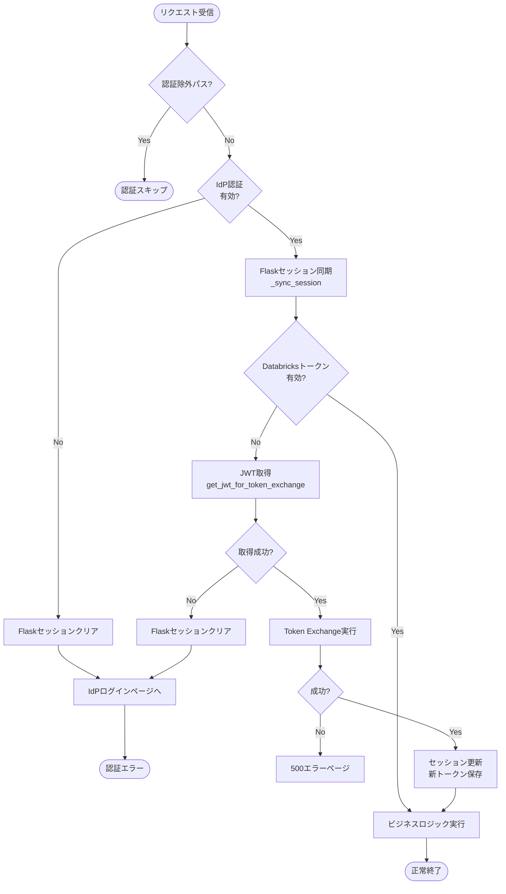
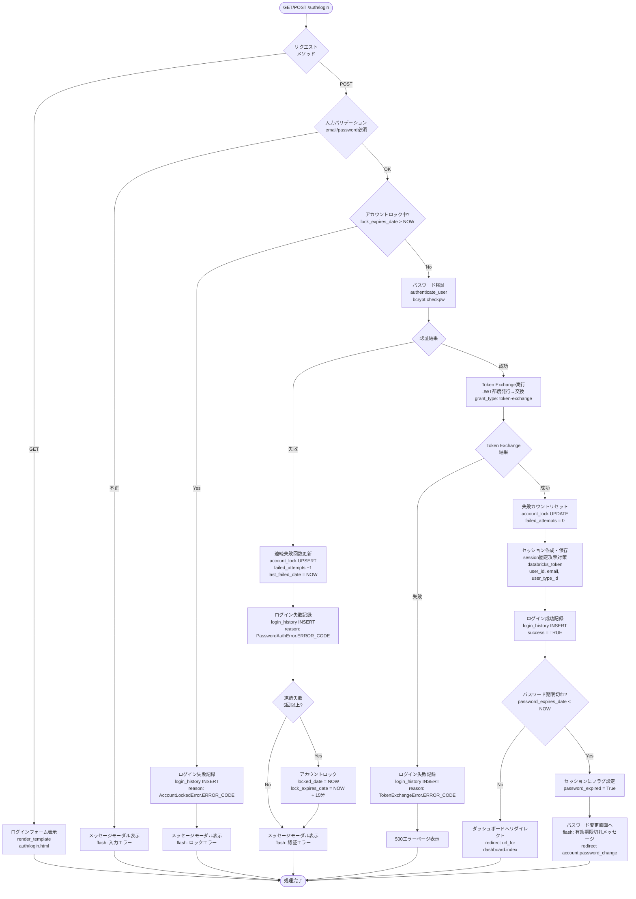
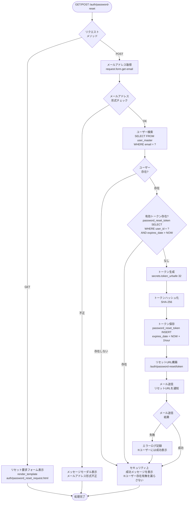
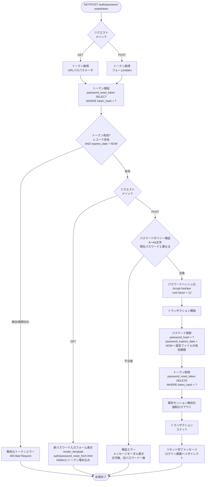

# 認証仕様書

## 目次

1. [概要](#1-概要)
2. [認証アーキテクチャ概要](#2-認証アーキテクチャ概要)
3. [リクエスト認証処理（AuthMiddleware）](#3-リクエスト認証処理authmiddleware)
   - 3.1 [認証処理フロー](#31-認証処理フロー)
   - 3.2 [認証除外パス判定](#32-認証除外パス判定)
   - 3.3 [IdP認証チェック](#33-idp認証チェック)
   - 3.4 [パスワード期限切れ時のアクセス制御](#34-パスワード期限切れ時のアクセス制御オンプレミス環境のみ)
   - 3.5 [Databricksトークン確保](#35-databricksトークン確保)
   - 3.6 [実装例](#36-実装例)
   - 3.7 [エラーハンドリング](#37-エラーハンドリング)
   - 3.8 [セッション管理](#38-セッション管理)
   - 3.9 [Unity Catalog接続](#39-unity-catalog接続)
4. [環境別仕様](#4-環境別仕様)
   - 4.1 [Azure環境（Easy Auth）](#41-azure環境easy-auth)
   - 4.2 [AWS環境（ALB + Cognito）](#42-aws環境alb--cognito)
   - 4.3 [オンプレミス環境（基本設定）](#43-オンプレミス環境基本設定)
5. [オンプレミス認証機能仕様](#5-オンプレミス認証機能仕様)
6. [関連ドキュメント](#6-関連ドキュメント)

---

## 1. 概要

### 1.1 本ドキュメントの目的

本ドキュメントは、Databricks IoTシステムにおける認証アーキテクチャの詳細仕様を定義します。認証共通モジュールにより、以下の3つの環境に対応可能な設計となっています。

| 環境             | 認証方式              | 主なユースケース                     |
| ---------------- | --------------------- | ------------------------------------ |
| Azure環境        | Easy Auth（Entra ID） | Azure App Serviceでのホスティング    |
| AWS環境          | ALB + Cognito         | AWS EC2/ECSでのホスティング          |
| オンプレミス環境 | 自前認証（Flask IdP） | オンプレミスサーバーでのホスティング |

- **オンプレミス環境における認証機能については一時凍結、スコープ対象外とする**

---

## 2. 認証アーキテクチャ概要

### 2.1 設計思想

認証共通モジュールは、**AuthProviderパターン**により認証処理を抽象化し、環境依存のコードを最小化します。

```
┌─────────────────────────────────────────────────────────┐
│                    Flaskアプリケーション                  │
│  ┌─────────────────────────────────────────────────┐   │
│  │              AuthMiddleware                      │   │
│  │   - before_request: 認証チェック                  │   │
│  │   - Token Exchange実行                           │   │
│  │   - セッション管理                                │   │
│  └─────────────────────────────────────────────────┘   │
│                          │                              │
│                          ▼                              │
│  ┌─────────────────────────────────────────────────┐   │
│  │           AuthProvider（抽象基底クラス）           │   │
│  │   - get_user_info()                              │   │
│  │   - get_jwt_for_token_exchange()                 │   │
│  │   - logout_url()                                 │   │
│  └─────────────────────────────────────────────────┘   │
│         ▲                 ▲                 ▲          │
│         │                 │                 │          │
│  ┌──────┴──────┐  ┌───────┴───────┐  ┌──────┴──────┐  │
│  │ AzureEasy   │  │ AWSCognito    │  │ LocalIdP    │  │
│  │ AuthProvider│  │ Provider      │  │ Provider    │  │
│  └─────────────┘  └───────────────┘  └─────────────┘  │
└─────────────────────────────────────────────────────────┘
```

### 2.2 AuthProviderパターン

#### 2.2.1 インターフェース定義

```python
from abc import ABC, abstractmethod
from typing import TypedDict, Optional

class UserInfo(TypedDict):
    user_id: str
    email: str
    name: Optional[str]
    groups: list[str]

class AuthProvider(ABC):
    """認証プロバイダー抽象基底クラス"""

    @abstractmethod
    def get_user_info(self, request) -> UserInfo:
        """リクエストからユーザー情報を取得"""
        pass

    @abstractmethod
    def get_jwt_for_token_exchange(self, request) -> str:
        """Token Exchange用のJWTを取得"""
        pass

    @abstractmethod
    def logout_url(self) -> str:
        """ログアウトURLを返却"""
        pass

    @abstractmethod
    def requires_additional_setup(self) -> bool:
        """追加設定（ログイン画面等）が必要か"""
        pass
```

#### 2.2.2 プロバイダー一覧

| クラス名                | 環境         | 認証ソース                   |
| ----------------------- | ------------ | ---------------------------- |
| `AzureEasyAuthProvider` | Azure        | Easy Auth（X-MS-*ヘッダー）  |
| `AWSCognitoProvider`    | AWS          | ALB（X-Amzn-Oidc-*ヘッダー） |
| `LocalIdPProvider`      | オンプレミス | Flaskセッション              |

### 2.3 認証方式の選択

環境変数`AUTH_TYPE`により認証プロバイダーを選択します。

```python
# auth/factory.py
import os
from auth.providers.azure_easy_auth import AzureEasyAuthProvider
from auth.providers.aws_cognito import AWSCognitoProvider
from auth.providers.local_idp import LocalIdPProvider

def get_auth_provider():
    auth_type = os.getenv('AUTH_TYPE', 'azure')

    providers = {
        'azure': AzureEasyAuthProvider,
        'aws': AWSCognitoProvider,
        'local': LocalIdPProvider,
    }

    provider_class = providers.get(auth_type)
    if not provider_class:
        raise ValueError(f"Unknown AUTH_TYPE: {auth_type}")

    return provider_class()
```

**環境変数設定例**:

| 環境              | AUTH_TYPE |
| ----------------- | --------- |
| Azure App Service | `azure`   |
| AWS EC2/ECS       | `aws`     |
| オンプレミス      | `local`   |

### 2.4 モジュール構成

#### 2.4.1 ディレクトリ構造

```
app/
├── auth/                          # 認証モジュール
│   ├── __init__.py
│   ├── factory.py                 # AuthProvider生成
│   ├── middleware.py              # 認証ミドルウェア
│   ├── routes.py                  # 認証ルート
│   ├── services.py                # 認証関連データアクセス
│   ├── token_exchange.py          # Token Exchange処理
│   ├── jwt_issuer.py              # JWT発行（オンプレミス用）
│   ├── well_known.py              # OIDC設定エンドポイント
│   ├── exceptions.py              # 認証例外クラス定義
│   └── providers/                 # 認証プロバイダー
│       ├── __init__.py
│       ├── base.py                # AuthProvider抽象基底クラス
│       ├── azure_easy_auth.py     # Azure Easy Auth
│       ├── aws_cognito.py         # AWS Cognito
│       └── local_idp.py           # オンプレミス自前IdP
├── common/
│   ├── exceptions.py              # 共通例外クラス定義
│   └── error_handlers.py          # 全エラーハンドラー登録
└── ...
```

#### 2.4.2 ファイル責務一覧

| ファイル                            | 責務                                                                 | 参照セクション |
| ----------------------------------- | -------------------------------------------------------------------- | -------------- |
| `auth/factory.py`                   | 環境変数に基づきAuthProviderインスタンスを生成                       | 2.3            |
| `auth/middleware.py`                | before_requestフックで認証チェックを実行                             | 3.1〜3.5       |
| `auth/routes.py`                    | ログイン・ログアウト・パスワードリセット画面のルート定義             | 5.1〜5.2       |
| `auth/services.py`                  | 認証関連データアクセス（パスワード検証・ロック管理等はオンプレのみ） | 5.1, 5.4       |
| `auth/token_exchange.py`            | IdP JWTをDatabricksトークンに交換、キャッシュ管理                    | 3.4            |
| `auth/jwt_issuer.py`                | RS256署名によるJWT発行（オンプレミス環境のみ使用）                   | 4.3.2          |
| `auth/well_known.py`                | `/.well-known/openid-configuration`, `/.well-known/jwks.json` を提供 | 4.3.3          |
| `auth/exceptions.py`                | 認証関連の例外クラス定義（AuthError, TokenExchangeError等）          | 3.7.3          |
| `auth/providers/base.py`            | AuthProvider抽象基底クラス、UserInfo型定義                           | 2.2.1          |
| `auth/providers/azure_easy_auth.py` | X-MS-*ヘッダーからユーザー情報・JWT取得                              | 4.1            |
| `auth/providers/aws_cognito.py`     | X-Amzn-Oidc-*ヘッダーからユーザー情報・JWT取得                       | 4.2            |
| `auth/providers/local_idp.py`       | Flaskセッションからユーザー情報取得、JWT再発行                       | 4.3            |
| `common/error_handlers.py`          | 認証エラー含む全HTTPエラーハンドラーを一元登録                       | 3.7.4          |

#### 2.4.3 補足

- **例外クラス定義と登録の分離**: `auth/exceptions.py` は例外クラスの定義のみを行い、Flaskへのエラーハンドラー登録は `common/error_handlers.py` で一元管理します
- **オンプレミス専用ファイル**: `routes.py`, `jwt_issuer.py`, `well_known.py` はオンプレミス環境（`AUTH_TYPE=local`）でのみ使用されます
- **環境別の読み込み**: `factory.py` が環境に応じて適切なプロバイダーのみをインスタンス化するため、不要なプロバイダーは読み込まれません

---

## 3. リクエスト認証処理（AuthMiddleware）

本セクションでは、Flaskの`before_request`フックで実行される認証処理の全体フローを説明します。

### 3.1 認証処理フロー

以下のフローは `before_request` で実行される `authenticate_request()` 内の処理を示します。



**環境別のJWT取得処理**:

| 環境    | get_jwt_for_token_exchange の動作          |
| ------- | ------------------------------------------ |
| Azure   | リクエストヘッダーから取得（なければ例外） |
| AWS     | リクエストヘッダーから取得（なければ例外） |
| 自前IdP | セッション情報を元にJWT都度発行            |

**ポイント**:
- IdP認証失敗・JWT取得失敗時は、Flaskセッションをクリアしてから IdPログインへリダイレクト
- これにより、IdPセッションとFlaskセッションの整合性を保つ（詳細は[3.3.2 セッション同期](#332-セッション同期)を参照）
- Token Exchange失敗（Databricks側エラー）は500エラーページへ遷移
- 実装例は[3.6 実装例](#36-実装例)を参照

### 3.2 認証除外パス判定

以下のパスは認証チェックをスキップします。

| パスパターン             | 説明                                       |
| ------------------------ | ------------------------------------------ |
| `/static/*`              | 静的ファイル（CSS、JS、画像等）            |
| `/auth/login`            | ログインページ（オンプレミス環境のみ）     |
| `/auth/password-reset/*` | パスワードリセット（オンプレミス環境のみ） |
| `/.well-known/*`         | OpenID Connect設定（オンプレミス環境のみ） |
| `/health`                | ヘルスチェックエンドポイント               |

```python
# auth/middleware.py
EXCLUDED_PATHS = [
    '/static',
    '/auth/login',
    '/auth/password-reset',
    '/.well-known',
    '/health',
]

def is_excluded_path(path: str) -> bool:
    """認証除外パスかどうかを判定"""
    return any(path.startswith(excluded) for excluded in EXCLUDED_PATHS)
```

### 3.3 IdP認証チェック

IdP（Identity Provider）から認証情報を取得し、Flaskセッションと同期する処理です。

#### 3.3.1 処理概要

1. **IdP認証情報取得**: `AuthProvider.get_user_info(request)`でユーザー情報を取得
2. **認証失敗時**: Flaskセッションをクリアし、IdPログインページへリダイレクト
3. **認証成功時**: Flaskセッションを最新のIdP情報で同期

**環境別の動作**:

| 環境    | IdP認証情報の取得元                    |
| ------- | -------------------------------------- |
| Azure   | X-MS-CLIENT-PRINCIPALヘッダー          |
| AWS     | X-Amzn-Oidc-Dataヘッダー               |
| 自前IdP | Flaskセッション（user_idの存在で判定） |

#### 3.3.2 セッション同期

Azure/AWSでは、IdP側のセッション（Easy Auth / ALB + Cognito）とFlaskセッションが独立して存在します。本システムでは以下の方針で両者の整合性を保ちます。

##### 3.3.2.1 同期方針

```
[IdPセッション]              [Flaskセッション]
Easy Auth / ALB管理           Flask管理
       ↓                           ↓
   JWT提供                    databricks_token等キャッシュ
       ↓                           ↓
       └───────── 同期 ─────────────┘
```

| タイミング    | 処理内容                                                |
| ------------- | ------------------------------------------------------- |
| IdP認証成功時 | Flaskセッションを最新のIdP情報で更新（`_sync_session`） |
| IdP認証失敗時 | Flaskセッションをクリア（`session.clear()`）            |
| JWT取得失敗時 | IdPセッション切れと判断し、Flaskセッションをクリア      |

##### 3.3.2.2 設計根拠

- **全環境でFlaskセッションを使用**: databricks_tokenのキャッシュ、パスワード期限切れフラグ等の保持に必要
- **IdP側をマスターとする**: IdPセッションが切れたらFlaskセッションもクリアし、再認証を強制
- **共通モジュール化の維持**: AuthMiddleware（共通）でセッション同期を行い、AuthProviderは認証情報取得の責務のみ

##### 3.3.2.3 環境別の動作

| 環境    | IdPセッション切れ時の動作                                                 |
| ------- | ------------------------------------------------------------------------- |
| Azure   | Easy Authがログインページへリダイレクト → 再認証 → Flaskセッション再作成  |
| AWS     | ALBがCognitoログインページへリダイレクト → 再認証 → Flaskセッション再作成 |
| 自前IdP | 自前ログインページへリダイレクト → 再認証 → Flaskセッション再作成         |

---

### 3.4 パスワード期限切れ時のアクセス制御（オンプレミス環境のみ）

オンプレミス環境では、セッションに`password_expired=True`が設定されている場合、許可パス以外へのアクセスをブロックし、パスワード変更画面へリダイレクトします。

#### 3.4.1 許可パス

| パスパターン               | 説明               |
| -------------------------- | ------------------ |
| `/account/password/change` | パスワード変更画面 |
| `/auth/logout`             | ログアウト         |

**注**: 認証除外パス（3.2節）は本チェックの前にスキップされるため、静的ファイル等は影響を受けません。

#### 3.4.2 判定ロジック

| 条件                                                       | 処理                                     |
| ---------------------------------------------------------- | ---------------------------------------- |
| `session.get('password_expired')` が False または未設定    | 通常処理を継続                           |
| `session.get('password_expired')` が True かつ許可パス     | 通常処理を継続                           |
| `session.get('password_expired')` が True かつ許可パス以外 | `/account/password/change`へリダイレクト |

#### 3.4.3 フラグの設定・解除タイミング

| タイミング           | 処理                                                                             |
| -------------------- | -------------------------------------------------------------------------------- |
| ログイン成功時       | `password_expires_date < NOW` の場合、`session['password_expired'] = True`を設定 |
| パスワード変更完了時 | `session.pop('password_expired', None)`でフラグを解除                            |

---

### 3.5 Databricksトークン確保

Databricksトークンの有効性チェックと、Token Exchangeによる取得・更新を行う処理です。

#### 3.5.1 有効期限管理戦略

本システムでは3種類の有効期限が存在し、それぞれの整合性を取る必要があります。

##### 3.5.1.1 有効期限の種類と制御可否

| 種類                       | Azure                     | AWS                      | 自前IdP             | 制御可否 |
| -------------------------- | ------------------------- | ------------------------ | ------------------- | -------- |
| セッション期限             | Easy Auth依存             | ALB依存                  | 自由                | △〜○     |
| JWT期限                    | Entra ID依存（通常1時間） | Cognito依存（通常1時間） | 自由                | △〜○     |
| **Databricksトークン期限** | **約1時間（固定）**       | **約1時間（固定）**      | **約1時間（固定）** | **×**    |

**ネック**: Databricksトークン期限は制御不可のため、これを基準に設計します。

##### 3.5.1.2 設計方針

```
時間軸 →

セッション ━━━━━━━━━━━━━━━━━━━━━━━━━━━━━━━━━ (8時間: ユーザー認証状態)
           │
           │  セッション有効 = ユーザー認証済み = JWT発行権限あり
           │
JWT        ━━━━┿━━━━┿━━━━┿━━━━┿━━━━┿━━━━... (1時間ごと再発行)
                ↑    ↑    ↑    ↑    ↑
             必要な時だけ再発行（オンデマンド）
           │
DBトークン ━━━━┿━━━━┿━━━━┿━━━━┿━━━━┿━━━━... (1時間ごと再取得)
```

**方針1: Databricksトークンは「消耗品」**
- 固定期限（約1時間）で必ず切れる
- 毎リクエストで有効期限をチェックし、切れていたら再取得
- 再取得にはJWTが必要

**方針2: JWTは「Databricksトークン再取得の鍵」**
- JWTがあれば、Databricksトークンを取得可能
- **Azure/AWS**: リクエストヘッダーから都度取得（IdP側で管理）
- **自前IdP**: Token Exchange時に都度発行（セッション有効なら発行権限あり）
  - JWTをセッションに保持しない
  - JWT期限切れの概念がない（都度発行するため）

**方針3: セッションは「ユーザー体験の期限」**
- ユーザーが再ログインなしで使える時間
- セッションが切れたら完全に再認証

##### 3.5.1.3 環境別推奨設定

| 環境        | セッション期限             | JWT期限      | 備考                                     |
| ----------- | -------------------------- | ------------ | ---------------------------------------- |
| **自前IdP** | 8時間                      | 都度発行     | セッション有効中はJWT都度発行で継続      |
| **Azure**   | Easy Auth設定（8時間推奨） | Entra ID依存 | Easy Authがトークン更新を自動管理        |
| **AWS**     | ALB設定（8時間推奨）       | Cognito依存  | ALBがCognitoと連携してセッション自動管理 |

#### 3.5.2 Token Exchange API仕様

Token Exchangeは、IdPが発行したJWTをDatabricksアクセストークンに交換する処理です。

```
IdP JWT → Databricks Token Exchange API → Databricksアクセストークン
```

これにより、ユーザー単位の認証とUnity Catalogのデータスコープ制御を実現します。

**エンドポイント**: `POST https://<databricks-workspace>/oidc/v1/token`

**リクエスト**:
```http
POST /oidc/v1/token HTTP/1.1
Host: <databricks-workspace>
Content-Type: application/x-www-form-urlencoded

grant_type=urn:ietf:params:oauth:grant-type:token-exchange
&subject_token=<IdP発行JWT>
&subject_token_type=urn:ietf:params:oauth:token-type:id_token
&scope=all-apis
```

**レスポンス**:
```json
{
  "access_token": "<Databricksアクセストークン>",
  "token_type": "Bearer",
  "expires_in": 3600
}
```

#### 3.5.3 audience設定

Token Exchangeを成功させるには、**Databricks側のフェデレーションポリシー**でIdPが発行するトークンの`aud`（audience）クレームを許可する設定が必要です。

##### 3.5.3.1 仕組み

```
1. IdP側：任意のaudience値でトークンを発行（例：client_id、カスタムURL等）
2. Databricks側：フェデレーションポリシーのaudiencesフィールドでそのaudience値を許可
3. マッチング：トークンのaudがポリシーのaudiencesのいずれかと一致すれば認証成功
```

##### 3.5.3.2 audienceの設定ルール

| 項目       | 説明                                                      |
| ---------- | --------------------------------------------------------- |
| 設定場所   | Databricksフェデレーションポリシーの`audiences`フィールド |
| 許可値     | 任意の非空文字列（IdPが発行するaudと一致させる）          |
| デフォルト | 指定しない場合はDatabricksアカウントIDがデフォルト        |
| 複数指定   | 配列で複数のaudienceを許可可能                            |

**重要**: IdP側のaudをDatabricks側で許可する設計であり、IdP側のaudを特定の値に強制変更する必要はありません。

#### 3.5.4 Databricks Federation Policy設定

Databricks Account Consoleで、IdPを信頼するためのFederation Policyを設定します。

##### 3.5.4.1 必須設定項目

| 項目          | 説明                                                       |
| ------------- | ---------------------------------------------------------- |
| issuer        | IdPの識別子（JWTのissクレームと一致させる）                |
| jwks_uri      | IdPの公開鍵エンドポイント                                  |
| audiences     | 許可するaudience値のリスト（IdPのaudクレームと一致させる） |
| subject_claim | ユーザー識別に使用するクレーム（通常は`sub`または`email`） |

##### 3.5.4.2 環境別の設定例

| 環境    | issuer                                                      | jwks_uri                                                                          | audiences（例）                                                |
| ------- | ----------------------------------------------------------- | --------------------------------------------------------------------------------- | -------------------------------------------------------------- |
| Azure   | `https://login.microsoftonline.com/<tenant-id>/v2.0`        | `https://login.microsoftonline.com/<tenant-id>/discovery/v2.0/keys`               | `2ff814a6-3304-4ab8-85cb-cd0e6f879c1d`（Azure Databricks固定） |
| AWS     | `https://cognito-idp.<region>.amazonaws.com/<user-pool-id>` | `https://cognito-idp.<region>.amazonaws.com/<user-pool-id>/.well-known/jwks.json` | `<cognito-client-id>`                                          |
| 自前IdP | `https://<app-domain>`                                      | `https://<app-domain>/.well-known/jwks.json`                                      | `<任意の値>`（例：`https://<app-domain>`）                     |

#### 3.5.5 Token Exchanger実装

```python
# auth/token_exchange.py
import requests
from flask import session
import os

class TokenExchanger:
    """Token Exchange処理クラス"""

    def __init__(self):
        self.databricks_host = os.getenv('DATABRICKS_HOST')
        self.token_endpoint = f"https://{self.databricks_host}/oidc/v1/token"

    def exchange_token(self, idp_jwt: str) -> dict:
        """IdP JWTをDatabricksトークンに交換

        Returns:
            dict: {'access_token': str, 'expires_in': int}
        """
        payload = {
            'grant_type': 'urn:ietf:params:oauth:grant-type:token-exchange',
            'subject_token': idp_jwt,
            'subject_token_type': 'urn:ietf:params:oauth:token-type:id_token',
            'scope': 'all-apis'
        }

        response = requests.post(self.token_endpoint, data=payload)

        if response.status_code != 200:
            raise TokenExchangeError(f"Token Exchange failed: {response.text}")

        result = response.json()
        return {
            'access_token': result['access_token'],
            'expires_in': result.get('expires_in', 3600)
        }

    def cache_token(self, access_token: str, expires_in: int):
        """トークンをセッションにキャッシュ"""
        session['databricks_token'] = access_token
        session['databricks_token_expires'] = time.time() + expires_in - 60  # 1分前に期限切れとする

    def get_cached_token(self) -> str | None:
        """キャッシュされたトークンを取得"""
        token = session.get('databricks_token')
        expires = session.get('databricks_token_expires', 0)

        if token and time.time() < expires:
            return token
        return None

    def ensure_valid_token(self, auth_provider, request) -> str:
        """有効なDatabricksトークンを確保（期限切れなら再取得）

        Args:
            auth_provider: AuthProviderインスタンス
            request: Flaskリクエストオブジェクト

        Returns:
            str: 有効なDatabricksアクセストークン

        Raises:
            JWTRetrievalError: JWT取得に失敗した場合（IdPセッション切れ等）
            TokenExchangeError: Token Exchange自体に失敗した場合
        """
        # 1. キャッシュされたDatabricksトークンが有効ならそのまま返す
        token = self.get_cached_token()
        if token:
            return token

        # 2. JWTを取得（各AuthProviderが適切に処理）
        #    - Azure/AWS: リクエストヘッダーから取得（なければJWTRetrievalError）
        #    - 自前IdP: セッション情報を元に都度発行
        try:
            jwt_token = auth_provider.get_jwt_for_token_exchange(request)
        except UnauthorizedError as e:
            # JWT取得失敗 → 呼び出し元でセッションクリア・リダイレクト処理
            raise JWTRetrievalError(str(e)) from e

        # 3. Token Exchange実行
        result = self.exchange_token(jwt_token)
        self.cache_token(result['access_token'], result['expires_in'])

        return result['access_token']
```

---

### 3.6 実装例

```python
# auth/middleware.py
from flask import g, request, redirect, url_for, abort, session
from auth.factory import get_auth_provider
from auth.exceptions import UnauthorizedError, JWTRetrievalError, TokenExchangeError

auth_provider = get_auth_provider()

def authenticate_request():
    """リクエスト認証処理（before_request）"""

    # 1. 認証除外パスチェック
    if is_excluded_path(request.path):
        return None

    # 2. IdP認証情報取得
    try:
        idp_user_info = auth_provider.get_user_info(request)
    except UnauthorizedError:
        # IdPセッション切れ → Flaskセッションもクリアして同期
        session.clear()
        return redirect(auth_provider.logout_url())

    # 3. Flaskセッション同期（IdP認証成功 = セッション有効）
    _sync_session(idp_user_info)

    # 4. グローバルコンテキストに保存（セッションから取得）
    g.current_user_id = session.get('user_id')
    g.current_user_type_id = session.get('user_type_id')

    # 5. パスワード期限切れチェック（オンプレミス環境のみ）
    if auth_provider.requires_additional_setup():
        # 許可パス（パスワード変更画面・ログアウト）へのアクセスは許可
        allowed_paths = ['/account/password/change', '/auth/logout']
        if request.path in allowed_paths:
            return None

        # パスワード期限切れ状態の場合、パスワード変更画面にリダイレクト
        if session.get('password_expired'):
            flash('パスワードの有効期限が切れました。パスワードを変更してください。', 'warning')
            return redirect(url_for('account.password_change'))

    # 6. Token Exchange（有効なDatabricksトークンを確保）
    try:
        from auth.token_exchange import TokenExchanger
        token_exchanger = TokenExchanger()
        databricks_token = token_exchanger.ensure_valid_token(auth_provider, request)
        g.databricks_token = databricks_token
    except JWTRetrievalError:
        # JWT取得失敗 → IdPセッション切れと判断、Flaskセッションクリア
        session.clear()
        return redirect(auth_provider.logout_url())
    except TokenExchangeError:
        # Token Exchange自体の失敗（Databricks側エラー）
        abort(500)

    return None


def _sync_session(idp_user_info):
    """IdP認証情報をFlaskセッションに同期

    全環境で共通して呼び出される。IdP認証成功時にFlaskセッションを
    最新のIdP情報で更新することで、両セッションの整合性を保つ。

    Args:
        idp_user_info: AuthProviderから取得したユーザー情報
    """
    session['email'] = idp_user_info['email']
    session.permanent = True
```

---

### 3.7 エラーハンドリング

#### 3.7.1 認証関連エラー分類

| エラー種別         | HTTPステータス            | 対応                                             |
| ------------------ | ------------------------- | ------------------------------------------------ |
| 未認証             | 401 Unauthorized          | ログインページへリダイレクト                     |
| 権限不足           | 403 Forbidden             | エラーメッセージモーダル表示                     |
| Token Exchange失敗 | 500 Internal Server Error | エラーページ表示、ログ記録                       |
| セッション期限切れ | 401 Unauthorized          | ログインページへリダイレクト                     |
| パスワード期限切れ | -（リダイレクト）         | パスワード変更画面へリダイレクト（オンプレのみ） |

#### 3.7.2 エラー通知（Teams）

エラー発生時、システム保守者が属するTeamsの管理チャネルに対して通知を行います。通知はTeamsチャネルに登録されたワークフロー（Incoming Webhook）を実行することで実現します。
エラー通知処理の詳細は[共通仕様書](../../common/common-specification.md)のエラー通知の章を参照。

##### 3.7.2.1 通知対象エラー

| エラーコード  | 通知有無 | 優先度 | 説明                                                                                |
| ------------- | -------- | ------ | ----------------------------------------------------------------------------------- |
| AUTH_ERR_001  | ✓        | 高     | DB接続失敗（認証関連テーブル操作時）                                                |
| AUTH_ERR_002  | ✓        | 高     | Token Exchange失敗（Databricks API通信エラー）                                      |
| AUTH_ERR_003  | ✓        | 高     | メール送信失敗（パスワードリセット）                                                |
| AUTH_ERR_004  | ✓        | 高     | JWT取得失敗（IdP通信エラー）                                                        |
| AUTH_WARN_001 | △        | 中     | 認証異常検知（1時間で100件以上のログイン失敗、または5件以上のアカウントロック発生） |


#### 3.7.3 例外クラス定義

```python
# auth/exceptions.py

class AuthError(Exception):
    """認証エラー基底クラス"""
    pass

class UnauthorizedError(AuthError):
    """未認証エラー（401）"""
    pass

class ForbiddenError(AuthError):
    """権限不足エラー（403）"""
    pass

class TokenExchangeError(AuthError):
    """Token Exchangeエラー"""
    ERROR_CODE = 'token_exchange_failed'

class SessionExpiredError(AuthError):
    """セッション期限切れエラー"""
    pass

class JWTExpiredError(AuthError):
    """JWT期限切れエラー（再発行トリガー）"""
    pass

class JWTRetrievalError(AuthError):
    """JWT取得失敗エラー（IdPセッション切れ等）

    Azure/AWSでリクエストヘッダーにJWTがない場合に発生。
    呼び出し元でFlaskセッションをクリアし、IdPログインへリダイレクトする。
    """
    pass

class PasswordExpiredError(AuthError):
    """パスワード期限切れエラー（パスワード変更画面へリダイレクト）"""
    pass

# 自前IdP固有（ERROR_CODEはlogin_historyのfailure_reasonに記録）
class UserNotFoundError(AuthError):
    """ユーザー未存在エラー"""
    ERROR_CODE = 'user_not_found'

class PasswordNotSetError(AuthError):
    """パスワード未設定エラー"""
    ERROR_CODE = 'password_not_set'

class PasswordAuthError(AuthError):
    """パスワード認証エラー（パスワード不一致）"""
    ERROR_CODE = 'invalid_credentials'

class AccountLockedError(AuthError):
    """アカウントロックエラー"""
    ERROR_CODE = 'account_locked'

class PasswordResetError(AuthError):
    """パスワードリセットエラー"""
    pass
```

#### 3.7.4 Flaskエラーハンドラ

```python
# common/error_handlers.py
from flask import render_template, redirect, url_for, flash
from auth.exceptions import *

def register_error_handlers(app):
    """認証エラーハンドラを登録"""

    @app.errorhandler(UnauthorizedError)
    def handle_unauthorized(e):
        flash('ログインが必要です', 'warning')
        return redirect(url_for('auth.login'))

    @app.errorhandler(ForbiddenError)
    def handle_forbidden(e):
        return render_template('errors/403.html'), 403

    @app.errorhandler(TokenExchangeError)
    def handle_token_exchange_error(e):
        app.logger.error(f"Token Exchange error: {e}")
        return render_template('errors/500.html'), 500

    @app.errorhandler(SessionExpiredError)
    def handle_session_expired(e):
        flash('セッションが期限切れです。再度ログインしてください', 'warning')
        return redirect(url_for('auth.login'))
```

---

### 3.8 セッション管理

#### 3.8.1 セッション設定

| 項目                       | 設定値    | 説明                           |
| -------------------------- | --------- | ------------------------------ |
| SESSION_COOKIE_NAME        | `session` | セッションCookie名             |
| SESSION_COOKIE_SECURE      | `True`    | HTTPS必須                      |
| SESSION_COOKIE_HTTPONLY    | `True`    | JavaScript無効                 |
| SESSION_COOKIE_SAMESITE    | `Lax`     | CSRF保護                       |
| PERMANENT_SESSION_LIFETIME | `28800`   | セッション有効期限（秒）※8時間 |

**注**: セッション有効期限は有効期限管理戦略（3.5節）に基づき設定します。

#### 3.8.2 セッションデータ構造

```python
session = {
    'user_id': int,              # ユーザーID
    'email': str,                # メールアドレス
    'user_type_id': int,         # ユーザー種別ID（user_type_master参照）
    'databricks_token': str,     # Databricksアクセストークン
    'databricks_token_expires': float,  # Databricksトークン有効期限（Unix時間）
    'password_expired': bool,    # パスワード期限切れフラグ（オンプレミス環境のみ）
}
```

**注**: JWTはセッションに保持しません。
- **Azure/AWS**: リクエストヘッダーから都度取得
- **自前IdP**: Token Exchange時に都度発行（セッション情報を元に署名）

#### 3.8.3 セッション固定攻撃対策

ログイン成功時にセッションIDを再生成します。

```python
from flask import session

def regenerate_session():
    """セッションID再生成（セッション固定攻撃対策）

    注意: Flaskのデフォルトセッション（署名付きcookie）では、
    セッションIDという概念がなく、cookie全体が署名される。
    そのため、session.clear()後に新しいデータを設定すれば
    新しい署名付きcookieが生成される。

    サーバーサイドセッション（Flask-Session等）を使用する場合は、
    明示的にセッションIDを再生成する必要がある。
    """
    # 保持すべきデータを退避
    user_data = {
        'user_id': session.get('user_id'),
        'email': session.get('email'),
        'user_type_id': session.get('user_type_id'),
    }

    # セッションを完全にクリア（署名付きcookieの場合、新しいcookieが生成される）
    session.clear()

    # 新しいセッションにユーザーデータを設定
    session.update(user_data)
    session.permanent = True  # PERMANENT_SESSION_LIFETIMEを適用
    session.modified = True
```

**Flaskセッションの特性**:

Flaskのデフォルトセッションは「署名付きcookie」方式であり、従来のサーバーサイドセッションとは異なります。

| 方式                              | セッションID | データ保存場所        | 再生成方法                        |
| --------------------------------- | ------------ | --------------------- | --------------------------------- |
| 署名付きcookie（Flaskデフォルト） | なし         | クライアント側cookie  | session.clear()後に新規データ設定 |
| サーバーサイド（Flask-Session）   | あり         | サーバー側（Redis等） | session.regenerate()等を使用      |

本システムではFlaskデフォルトの署名付きcookieを使用するため、`session.clear()`で既存のcookieを無効化し、新しいデータを設定することでセキュリティを確保します。

#### 3.8.4 セッション有効期限

| 環境    | セッション管理  | 有効期限                          |
| ------- | --------------- | --------------------------------- |
| Azure   | Easy Authと連動 | Easy Auth設定に従う（8時間推奨）  |
| AWS     | ALBと連動       | ALB設定に従う（8時間推奨）        |
| 自前IdP | Flaskセッション | 環境変数で設定（デフォルト8時間） |

**注**: 有効期限管理の詳細は[3.5.1 有効期限管理戦略](#351-有効期限管理戦略)を参照してください。

**注**: IdPセッションとFlaskセッションの同期については[3.3.2 セッション同期](#332-セッション同期)を参照してください。

#### 3.8.5 SECRET_KEY管理

Flaskセッションの署名に使用するSECRET_KEYの管理方針を定義します。

##### 3.8.5.1 要件

| 項目           | 要件                                            |
| -------------- | ----------------------------------------------- |
| 長さ           | 32バイト以上（推奨: 64バイト）                  |
| 生成方法       | 暗号学的に安全な乱数生成器を使用                |
| 保管場所       | 環境変数または秘密管理サービス                  |
| ローテーション | 年1回以上、またはセキュリティインシデント発生時 |

##### 3.8.5.2 生成方法

```python
import secrets

# 64バイトのランダム文字列を生成
secret_key = secrets.token_hex(64)
print(secret_key)
```

##### 3.8.5.3 設定方法

```python
import os

app.config['SECRET_KEY'] = os.environ.get('FLASK_SECRET_KEY')

if not app.config['SECRET_KEY']:
    raise RuntimeError('FLASK_SECRET_KEY environment variable is not set')
```

##### 3.8.5.4 注意事項

- **本番環境**: 環境変数`FLASK_SECRET_KEY`に設定。ハードコードは禁止
- **開発環境**: `.env`ファイルに設定（.gitignoreに追加必須）
- **ローテーション時**: 既存セッションは無効化されるため、メンテナンス時間を確保

---

### 3.9 Unity Catalog接続

#### 3.9.1 概要

Token Exchange後のDatabricksアクセストークンを使用して、Unity Catalogに接続します。これにより、ユーザー単位のデータスコープ制御が実現されます。

**詳細設計**: データスコープ制御、動的ビュー、接続プール管理については[Unity Catalog設計書](./unity-catalog-database-specification.md)を参照してください。

#### 3.9.2 接続方式

```python
# db/unity_catalog_connector.py
from databricks import sql
from flask import g
import os

class UnityCatalogConnector:
    """Unity Catalog接続クラス"""

    def __init__(self):
        self.server_hostname = os.getenv('DATABRICKS_SERVER_HOSTNAME')
        self.http_path = os.getenv('DATABRICKS_HTTP_PATH')

    def get_connection(self):
        """Unity Catalog接続を取得

        注意: access_tokenはAuthMiddlewareで事前に取得・検証済みの
        g.databricks_tokenを使用する。これにより期限切れトークンの
        使用を防止する。
        """
        access_token = getattr(g, 'databricks_token', None)

        if not access_token:
            raise UnauthorizedError('Databricks token not available')

        connection = sql.connect(
            server_hostname=self.server_hostname,
            http_path=self.http_path,
            access_token=access_token
        )

        return connection

    def execute_query(self, query: str, params: dict = None) -> list:
        """SQLクエリを実行"""
        with self.get_connection() as conn:
            cursor = conn.cursor()
            cursor.execute(query, params)
            result = cursor.fetchall()
            return result
```

---

## 4. 環境別仕様

本セクションでは、各デプロイ環境における認証設定・実装の詳細を記載します。

### 4.1 Azure環境（Easy Auth）

#### 4.1.1 概要

Azure App ServiceのEasy Auth機能を使用して、Entra IDによる認証を実現します。

#### 4.1.2 Azure App Service Easy Auth設定

##### 4.1.2.1 Azure Portal設定手順

1. Azure Portal → App Service → 認証
2. 「認証を追加」→「Microsoft」を選択
3. Entra IDアプリ登録を作成または選択
4. 以下の設定を行う

##### 4.1.2.2 loginParameters設定

```json
{
  "loginParameters": [
    "scope=openid profile email 2ff814a6-3304-4ab8-85cb-cd0e6f879c1d/user_impersonation"
  ]
}
```

**重要**: `2ff814a6-3304-4ab8-85cb-cd0e6f879c1d/user_impersonation`スコープを追加することで、Databricks用のアクセストークンが取得可能になります。

##### 4.1.2.3 APIアクセス許可追加

Entra IDアプリ登録で以下のAPIアクセス許可を追加:
- `2ff814a6-3304-4ab8-85cb-cd0e6f879c1d` (Azure Databricks)
  - `user_impersonation`

#### 4.1.3 X-MS-*ヘッダー取得方法

Easy Authは認証成功後、以下のヘッダーをリクエストに付与します。

| ヘッダー名                    | 内容                               | 用途                         |
| ----------------------------- | ---------------------------------- | ---------------------------- |
| `X-MS-CLIENT-PRINCIPAL`       | Base64エンコードされたユーザー情報 | ユーザー情報取得             |
| `X-MS-CLIENT-PRINCIPAL-ID`    | ユーザーID（Object ID）            | ユーザー識別                 |
| `X-MS-CLIENT-PRINCIPAL-NAME`  | ユーザー名（メールアドレス）       | アプリのメールアドレスと同値 |
| `X-MS-TOKEN-AAD-ACCESS-TOKEN` | Entra IDアクセストークン           | Token Exchange用             |

#### X-MS-CLIENT-PRINCIPALのデコード

```python
import base64
import json

def decode_client_principal(header_value: str) -> dict:
    """X-MS-CLIENT-PRINCIPALをデコード"""
    decoded = base64.b64decode(header_value)
    return json.loads(decoded)

# 戻り値例
{
    "auth_typ": "aad",
    "claims": [
        {"typ": "name", "val": "山田太郎"},
        {"typ": "preferred_username", "val": "yamada@example.com"},
        {"typ": "oid", "val": "12345678-1234-1234-1234-123456789012"},
        ...
    ],
    "name_typ": "name",
    "role_typ": "roles"
}
```

#### 4.1.4 AzureEasyAuthProviderクラス仕様

```python
# auth/providers/azure_easy_auth.py
import base64
import json
from flask import request
from auth.providers.base import AuthProvider, UserInfo

class AzureEasyAuthProvider(AuthProvider):
    """Azure Easy Auth認証プロバイダー"""

    def get_user_info(self, request) -> UserInfo:
        """X-MS-*ヘッダーからユーザー情報を取得"""
        client_principal = request.headers.get('X-MS-CLIENT-PRINCIPAL')

        if not client_principal:
            raise UnauthorizedError('X-MS-CLIENT-PRINCIPAL header not found')

        decoded = base64.b64decode(client_principal)
        principal_data = json.loads(decoded)

        claims = {c['typ']: c['val'] for c in principal_data.get('claims', [])}

        return UserInfo(
            user_id=claims.get('oid', ''),
            email=claims.get('preferred_username', ''),
            name=claims.get('name', ''),
            groups=claims.get('groups', [])
        )

    def get_jwt_for_token_exchange(self, request) -> str:
        """Token Exchange用のJWTを取得"""
        access_token = request.headers.get('X-MS-TOKEN-AAD-ACCESS-TOKEN')

        if not access_token:
            raise UnauthorizedError('X-MS-TOKEN-AAD-ACCESS-TOKEN header not found')

        return access_token

    def logout_url(self) -> str:
        """ログアウトURLを返却"""
        return '/.auth/logout'

    def requires_additional_setup(self) -> bool:
        """追加設定不要（Easy Authが処理）"""
        return False
```

#### 4.1.5 Databricks Federation Policy設定（Azure）

Databricks Account Consoleで以下を設定:

```json
{
  "issuer": "https://login.microsoftonline.com/<tenant-id>/v2.0",
  "jwks_uri": "https://login.microsoftonline.com/<tenant-id>/discovery/v2.0/keys",
  "audiences": ["2ff814a6-3304-4ab8-85cb-cd0e6f879c1d"],
  "subject_claim": "sub"
}
```

**注**: `2ff814a6-3304-4ab8-85cb-cd0e6f879c1d`はAzure Databricksの公式リソースIDです。Azure Easy Auth経由で取得したEntra IDトークンは、このaudienceを持つため、この値を許可リストに設定します。

---

### 4.2 AWS環境（ALB + Cognito）

#### 4.2.1 概要

AWS Application Load Balancer (ALB) のOIDC認証機能とAmazon Cognitoを組み合わせて認証を実現します。

#### 4.2.2 AWS Cognito設定

##### 4.2.2.1 ユーザープール作成

1. AWS Console → Cognito → ユーザープールを作成
2. サインインオプション: メールアドレス
3. パスワードポリシー: 要件に応じて設定
4. MFA: オプション（推奨: 有効化）

##### 4.2.2.2 アプリクライアント設定

1. アプリクライアントを追加
2. クライアントシークレットを生成
3. 認証フロー: ALLOW_USER_SRP_AUTH、ALLOW_REFRESH_TOKEN_AUTH

##### 4.2.2.3 ホストされたUI設定

1. Cognitoドメインを設定（例: `https://<domain>.auth.<region>.amazoncognito.com`）
2. コールバックURL: `https://<alb-dns>/oauth2/idpresponse`
3. サインアウトURL: `https://<alb-dns>/logout`

#### 4.2.3 ALB OIDC認証設定

##### 4.2.3.1 リスナールール設定

1. ALBリスナー → ルールを追加
2. 条件: すべてのリクエスト（または特定パス）
3. アクション: 「OIDCで認証」→ ターゲットグループに転送

##### 4.2.3.2 OIDC認証設定

| 項目                       | 値                                                                  |
| -------------------------- | ------------------------------------------------------------------- |
| 発行者                     | `https://cognito-idp.<region>.amazonaws.com/<user-pool-id>`         |
| 認可エンドポイント         | `https://<domain>.auth.<region>.amazoncognito.com/oauth2/authorize` |
| トークンエンドポイント     | `https://<domain>.auth.<region>.amazoncognito.com/oauth2/token`     |
| ユーザー情報エンドポイント | `https://<domain>.auth.<region>.amazoncognito.com/oauth2/userInfo`  |
| クライアントID             | Cognitoアプリクライアントの値                                       |
| クライアントシークレット   | Cognitoアプリクライアントの値                                       |

#### 4.2.4 X-Amzn-Oidc-*ヘッダー取得方法

ALBは認証成功後、以下のヘッダーをリクエストに付与します。

| ヘッダー名                | 内容                    | 用途             |
| ------------------------- | ----------------------- | ---------------- |
| `X-Amzn-Oidc-Data`        | JWTペイロード（Base64） | ユーザー情報取得 |
| `X-Amzn-Oidc-Identity`    | ユーザー識別子          | ユーザー識別     |
| `X-Amzn-Oidc-Accesstoken` | OIDCアクセストークン    | Token Exchange用 |

#### X-Amzn-Oidc-Dataのデコード

```python
import base64
import json

def decode_oidc_data(header_value: str) -> dict:
    """X-Amzn-Oidc-Dataをデコード（JWT形式）"""
    # JWTの3つの部分（header.payload.signature）からpayloadを取得
    parts = header_value.split('.')
    if len(parts) != 3:
        raise ValueError('Invalid JWT format')

    # Base64 URLデコード（パディング追加）
    payload = parts[1]
    payload += '=' * (4 - len(payload) % 4)
    decoded = base64.urlsafe_b64decode(payload)

    return json.loads(decoded)
```

#### 4.2.5 AWSCognitoProviderクラス仕様

```python
# auth/providers/aws_cognito.py
import base64
import json
from flask import request
from auth.providers.base import AuthProvider, UserInfo

class AWSCognitoProvider(AuthProvider):
    """AWS Cognito認証プロバイダー"""

    def get_user_info(self, request) -> UserInfo:
        """X-Amzn-Oidc-*ヘッダーからユーザー情報を取得"""
        oidc_data = request.headers.get('X-Amzn-Oidc-Data')

        if not oidc_data:
            raise UnauthorizedError('X-Amzn-Oidc-Data header not found')

        payload = self._decode_jwt_payload(oidc_data)

        return UserInfo(
            user_id=payload.get('sub', ''),
            email=payload.get('email', ''),
            name=payload.get('name', payload.get('cognito:username', '')),
            groups=payload.get('cognito:groups', [])
        )

    def get_jwt_for_token_exchange(self, request) -> str:
        """Token Exchange用のJWTを取得"""
        access_token = request.headers.get('X-Amzn-Oidc-Accesstoken')

        if not access_token:
            raise UnauthorizedError('X-Amzn-Oidc-Accesstoken header not found')

        return access_token

    def logout_url(self) -> str:
        """ログアウトURLを返却"""
        import os
        cognito_domain = os.getenv('COGNITO_DOMAIN')
        client_id = os.getenv('COGNITO_CLIENT_ID')
        logout_uri = os.getenv('LOGOUT_REDIRECT_URI')
        return f"{cognito_domain}/logout?client_id={client_id}&logout_uri={logout_uri}"

    def requires_additional_setup(self) -> bool:
        """追加設定不要（ALBが処理）"""
        return False

    def _decode_jwt_payload(self, jwt: str) -> dict:
        """JWTペイロードをデコード"""
        parts = jwt.split('.')
        if len(parts) != 3:
            raise ValueError('Invalid JWT format')

        payload = parts[1]
        payload += '=' * (4 - len(payload) % 4)
        decoded = base64.urlsafe_b64decode(payload)
        return json.loads(decoded)
```

#### 4.2.6 Databricks Federation Policy設定（AWS）

Databricks Account Consoleで以下を設定:

```json
{
  "issuer": "https://cognito-idp.<region>.amazonaws.com/<user-pool-id>",
  "jwks_uri": "https://cognito-idp.<region>.amazonaws.com/<user-pool-id>/.well-known/jwks.json",
  "audiences": ["<cognito-client-id>"],
  "subject_claim": "sub"
}
```

**注**: `audiences`にはCognitoアプリクライアントIDを設定します。CognitoはデフォルトでJWTのaudクレームにクライアントIDを設定するため、フェデレーションポリシーでそのまま許可します。

---

### 4.3 オンプレミス環境（基本設定）

- **オンプレミス環境における認証機能については作業凍結、スコープ対象外**

#### 4.3.1 概要

オンプレミス環境では、Flaskアプリケーション自体がIdP（Identity Provider）として機能し、ユーザー認証とJWT発行を行います。

#### 4.3.2 JWT発行仕様

##### 4.3.2.1 署名アルゴリズム

| 項目         | 値                     |
| ------------ | ---------------------- |
| アルゴリズム | RS256（RSA + SHA-256） |
| 鍵長         | 2048ビット以上         |
| 秘密鍵形式   | PEM                    |

##### 4.3.2.2 秘密鍵管理

| 項目           | 設定                                              |
| -------------- | ------------------------------------------------- |
| 配置場所       | `/secure/jwt/private_key.pem`（環境変数で指定可） |
| パーミッション | `400`（所有者のみ読み取り）                       |
| 所有者         | アプリケーション実行ユーザー                      |

##### 4.3.2.3 JWTペイロード構造

```json
{
  "sub": "<user_id>",
  "email": "<user_email>",
  "name": "<user_name>",
  "aud": "<audience>",
  "iss": "https://<app-domain>",
  "exp": 1234567890,
  "iat": 1234567800,
  "nbf": 1234567800
}
```

**audience設定について**:
- `aud`クレームには任意の値を設定可能です（例：`https://<app-domain>`、カスタム識別子等）
- Databricksフェデレーションポリシーの`audiences`フィールドに同じ値を設定して許可します
- issuerと同じ値（`https://<app-domain>`）を設定するのが一般的です

**有効期限設定について**:

| クレーム | 設定値       | 説明                           |
| -------- | ------------ | ------------------------------ |
| `iat`    | 現在時刻     | JWT発行時刻（Unix時間）        |
| `exp`    | `iat + 3600` | 有効期限（発行から1時間後）    |
| `nbf`    | `iat`        | 有効開始時刻（発行時刻と同じ） |

- JWT有効期限は**1時間**を推奨（Databricksトークン期限と同程度）
- セッションが有効な限り、期限切れ時は再発行可能（3.5節参照）
- 有効期限は環境変数`JWT_LIFETIME_SECONDS`で変更可能

##### 4.3.2.4 jwt_issuer.py実装例

```python
# auth/jwt_issuer.py
import time
import jwt
from flask import current_app
from typing import TypedDict

class JWTPayload(TypedDict):
    sub: str
    email: str
    name: str
    aud: str
    iss: str
    exp: int
    iat: int
    nbf: int


class JWTIssuer:
    """RS256署名によるJWT発行クラス（オンプレミス環境専用）"""

    def __init__(self):
        self.private_key = self._load_private_key()
        self.issuer = current_app.config['JWT_ISSUER']
        self.audience = current_app.config['JWT_AUDIENCE']
        self.lifetime = current_app.config.get('JWT_LIFETIME_SECONDS', 3600)

    def _load_private_key(self) -> str:
        """秘密鍵をファイルから読み込み"""
        key_path = current_app.config['JWT_PRIVATE_KEY_PATH']
        with open(key_path, 'r') as f:
            return f.read()

    def issue(self, user_id: str, email: str, name: str = '') -> str:
        """JWTを発行

        Args:
            user_id: ユーザーID（subクレーム）
            email: メールアドレス
            name: ユーザー名（省略可）

        Returns:
            署名済みJWT文字列
        """
        now = int(time.time())
        payload: JWTPayload = {
            'sub': user_id,
            'email': email,
            'name': name,
            'aud': self.audience,
            'iss': self.issuer,
            'exp': now + self.lifetime,
            'iat': now,
            'nbf': now,
        }

        return jwt.encode(
            payload,
            self.private_key,
            algorithm='RS256'
        )
```

#### 4.3.3 OpenID Configuration Endpoint

自前IdPとしてOpenID Connect仕様に準拠したエンドポイントを提供します。

##### 4.3.3.1 /.well-known/openid-configuration

```json
{
  "issuer": "https://<app-domain>",
  "authorization_endpoint": "https://<app-domain>/auth/authorize",
  "token_endpoint": "https://<app-domain>/auth/token",
  "jwks_uri": "https://<app-domain>/.well-known/jwks.json",
  "response_types_supported": ["code", "token", "id_token"],
  "subject_types_supported": ["public"],
  "id_token_signing_alg_values_supported": ["RS256"]
}
```

##### 4.3.3.2 /.well-known/jwks.json

```json
{
  "keys": [
    {
      "kty": "RSA",
      "use": "sig",
      "alg": "RS256",
      "kid": "<key-id>",
      "n": "<modulus-base64url>",
      "e": "AQAB"
    }
  ]
}
```

#### 4.3.4 LocalIdPProviderクラス仕様

```python
# auth/providers/local_idp.py
from flask import session
from auth.providers.base import AuthProvider, UserInfo

class LocalIdPProvider(AuthProvider):
    """自前IdP認証プロバイダー"""

    def get_user_info(self, request) -> UserInfo:
        """セッションからユーザー情報を取得"""
        if 'user_id' not in session:
            raise UnauthorizedError('Not logged in')

        return UserInfo(
            user_id=session.get('user_id', ''),
            email=session.get('email', ''),
            name=session.get('name', ''),
            groups=session.get('groups', [])
        )

    def get_jwt_for_token_exchange(self, request) -> str:
        """Token Exchange用のJWTを都度発行

        セッションが有効（user_idが存在）= ユーザー認証済み = JWT発行権限あり
        JWTはセッションに保持せず、呼び出しのたびに新規発行する。

        これにより:
        - JWT期限切れ管理が不要
        - セッション構造がシンプルに
        - Azure/AWSと同じインターフェースを維持
        """
        user_id = session.get('user_id')
        email = session.get('email')

        if not user_id or not email:
            raise UnauthorizedError('Not logged in')

        # 都度発行して返す（セッションには保存しない）
        return self._issue_jwt()

    def logout_url(self) -> str:
        """ログアウトURLを返却"""
        return '/auth/logout'

    def requires_additional_setup(self) -> bool:
        """ログイン画面等の追加設定が必要"""
        return True

    def _issue_jwt(self) -> str:
        """JWTを発行"""
        from auth.jwt_issuer import JWTIssuer
        issuer = JWTIssuer()
        return issuer.issue(
            user_id=session['user_id'],
            email=session['email'],
            name=session.get('name', '')
        )
```

#### 4.3.5 Databricks Federation Policy設定（自前IdP）

Databricks Account Consoleで以下を設定:

```json
{
  "issuer": "https://<app-domain>",
  "jwks_uri": "https://<app-domain>/.well-known/jwks.json",
  "audiences": ["https://<app-domain>"],
  "subject_claim": "email"
}
```

**注**: `audiences`には自前IdPが発行するJWTの`aud`クレームと同じ値を設定します。上記例ではissuerと同じ値を使用していますが、任意の識別子を設定可能です。

#### 4.3.6 秘密鍵セットアップ手順

##### 4.3.6.1 鍵ペア生成スクリプト

```bash
#!/bin/bash
# scripts/generate_rsa_keypair.sh

# 秘密鍵生成
openssl genpkey -algorithm RSA -out private_key.pem -pkeyopt rsa_keygen_bits:2048

# 公開鍵抽出
openssl rsa -pubout -in private_key.pem -out public_key.pem

# パーミッション設定
chmod 400 private_key.pem
chmod 444 public_key.pem

echo "秘密鍵を生成しました: private_key.pem"
echo "パーミッション: 400 (所有者のみ読み取り可能)"
```

##### 4.3.6.2 配置手順

1. 上記スクリプトを実行
2. `private_key.pem`を`/secure/jwt/`に配置
3. 環境変数`JWT_PRIVATE_KEY_PATH`を設定
4. アプリケーションを再起動

##### 4.3.6.3 鍵ローテーション手順

1. 新しい鍵ペアを生成
2. 既存鍵をバックアップ
3. 新しい鍵を配置
4. アプリケーションを再起動
5. Databricks Federation Policyを更新（JWKS）

---

## 5. オンプレミス認証機能仕様

本セクションでは、オンプレミス環境固有の認証機能（ログイン、パスワードリセット等）の実装詳細を記載します。
- **オンプレミス環境における認証機能については作業凍結、スコープ対象外**

### 5.1 パスワード認証フロー

#### 処理フロー図



#### 5.1.1 ログイン画面（/auth/login）

**GET**: ログイン画面表示
**POST**: ログイン処理

```python
# auth/routes.py
import time
from flask import Blueprint, render_template, request, redirect, url_for, flash, session, abort
from auth.exceptions import (
    UserNotFoundError, PasswordNotSetError, AccountLockedError,
    PasswordAuthError, TokenExchangeError
)

auth_bp = Blueprint('auth', __name__, url_prefix='/auth')

@auth_bp.route('/login', methods=['GET', 'POST'])
def login():
    if request.method == 'GET':
        return render_template('auth/login.html')

    email = request.form.get('email')
    password = request.form.get('password')

    # ユーザー存在確認
    user = get_user_by_email(email)
    if not user:
        record_login_attempt(email, success=False, reason=UserNotFoundError.ERROR_CODE)
        flash('メールアドレスまたはパスワードが正しくありません', 'error')
        return render_template('auth/login.html')

    # パスワード未設定チェック（新規ユーザーで初回パスワード設定前）
    user_password = get_user_password(user.user_id)
    if not user_password or not user_password.password_hash:
        record_login_attempt(email, success=False, reason=PasswordNotSetError.ERROR_CODE)
        flash('パスワードが設定されていません。メールに送信されたリンクからパスワードを設定してください。', 'error')
        return render_template('auth/login.html')

    # アカウントロックチェック（パスワード検証前に実施）
    if is_account_locked(user.user_id):
        record_login_attempt(email, success=False, reason=AccountLockedError.ERROR_CODE)
        flash('アカウントがロックされています。しばらく待ってから再試行してください', 'error')
        return render_template('auth/login.html')

    # パスワード検証
    user = authenticate_user(email, password)

    if not user:
        # ログイン失敗記録
        record_login_attempt(email, success=False, reason=PasswordAuthError.ERROR_CODE)
        increment_failed_attempts(email)

        # 連続失敗5回以上でアカウントロック
        if get_failed_attempts(email) >= 5:
            lock_account(email)

        flash('メールアドレスまたはパスワードが正しくありません', 'error')
        return render_template('auth/login.html')

    # Token Exchange実行（セッション作成前に実行）
    # JWTはget_jwt_for_token_exchange内で都度発行される（セッションには保存しない）
    try:
        from auth.factory import get_auth_provider
        from auth.token_exchange import TokenExchanger

        auth_provider = get_auth_provider()
        token_exchanger = TokenExchanger()

        jwt_token = auth_provider.get_jwt_for_token_exchange(request)
        result = token_exchanger.exchange_token(jwt_token)
    except TokenExchangeError as e:
        # Token Exchange失敗時はログイン失敗記録後、500エラーページへ遷移（セッション未作成のまま）
        record_login_attempt(email, success=False, reason=TokenExchangeError.ERROR_CODE)
        abort(500)

    # Token Exchange成功後の処理
    # 失敗カウントリセット
    reset_failed_attempts(user.user_id)

    # セッション作成・保存（セッション固定攻撃対策）
    session.clear()
    session['user_id'] = user.user_id
    session['email'] = user.email
    session['user_type_id'] = user.user_type_id
    session['databricks_token'] = result['access_token']
    session['databricks_token_expires'] = time.time() + result['expires_in'] - 60
    session.permanent = True

    # ログイン成功記録
    record_login_attempt(email, success=True)

    # パスワード期限切れチェック
    password_info = get_user_password(user.user_id)
    if password_info.password_expires_at and password_info.password_expires_at < datetime.now():
        session['password_expired'] = True
        flash('パスワードの有効期限が切れました。パスワードを変更してください。', 'warning')
        return redirect(url_for('account.password_change'))

    return redirect(url_for('dashboard.index'))
```

#### 5.1.2 ログアウト（/auth/logout）

```python
@auth_bp.route('/logout', methods=['POST'])
def logout():
    session.clear()
    flash('ログアウトしました', 'info')
    return redirect(url_for('auth.login'))
```

### 5.2 パスワードリセットフロー

#### 処理フロー図（パスワードリセット要求画面）



#### 処理フロー図（パスワードリセット実行画面）



#### 5.2.1 パスワードリセット要求画面（/auth/password-reset）

- ログイン画面の「パスワードを忘れた方はこちら」リンクをクリックして遷移

**GET**: パスワードリセット要求画面表示
**POST**: パスワードリセット要求処理

1. ユーザーがメールアドレスを入力
2. ランダムトークンを生成（`secrets.token_urlsafe(32)`）
3. トークンをDBに保存（有効期限: RESETは1時間、INVITEは7日間 ※5.2.3節参照）
4. リセット用URLをメール送信

#### 5.2.2 パスワードリセット実行画面（/auth/password-reset/<token>）

- メール送信されたリンクをクリックして遷移

**GET**: パスワードリセット実行画面表示
**POST**: パスワードリセット実行処理

1. トークンの有効性を検証
2. 新しいパスワードを入力
3. パスワード検証（文字数、使用済み制限）
4. bcryptでハッシュ化してDB更新
5. トークンを無効化
6. 既存セッションを無効化

#### 5.2.3 token_type による処理分岐

`password_reset_token.token_type` により、画面表示やメッセージを出し分けます。

| token_type | 用途               | 画面タイトル     | 完了メッセージ               |
| ---------- | ------------------ | ---------------- | ---------------------------- |
| 1: INVITE  | 新規ユーザー招待   | パスワード設定   | パスワードを設定しました     |
| 2: RESET   | パスワードリセット | パスワード再設定 | パスワードをリセットしました |

**INVITEの場合の追加処理**:
- `user_password` レコードが存在しない場合は INSERT（新規作成）

**注**: `password_expires_date` の設定は全パスワード設定・変更時に行う（5.4.1パスワードポリシー参照）

**実装例**:
```python
@auth_bp.route('/password-reset/<token>', methods=['GET', 'POST'])
def password_reset_execute(token):
    # トークン取得（GET: URLパスパラメータ、POST: フォームhidden）
    if request.method == 'GET':
        target_token = token
    else:
        target_token = request.form.get('token')

    # トークン検証
    token_record = validate_reset_token(target_token)
    if not token_record:
        abort(400, 'リンクが無効または期限切れです')

    # token_typeに応じたテンプレート変数
    is_invite = (token_record.token_type == 1)
    page_title = 'パスワード設定' if is_invite else 'パスワード再設定'

    if request.method == 'GET':
        # フォームにトークンを埋め込んで表示
        return render_template('auth/password_reset_form.html',
                               token=token,
                               page_title=page_title,
                               is_invite=is_invite)

    # POST: パスワード設定/リセット処理
    new_password = request.form.get('password')

    # パスワード検証（省略）...

    # user_passwordの更新または作成
    user_password = get_user_password(token_record.user_id)
    if user_password:
        # 既存レコードを更新（RESET）
        update_user_password(token_record.user_id, hash_password(new_password))
    else:
        # 新規レコードを作成（INVITE）
        create_user_password(token_record.user_id, hash_password(new_password))

    # トークン削除
    delete_token(token_record.token_hash)

    # 完了メッセージ
    message = 'パスワードを設定しました。' if is_invite else 'パスワードをリセットしました。'
    flash(message, 'success')
    return redirect(url_for('auth.login'))
```

### 5.3 パスワード変更フロー

#### 5.3.1 パスワード変更画面（/account/password/change）

ログイン済みユーザーが自分のパスワードを変更する機能。
パスワードの有効期限が切れた際に強制リダイレクトさせ、パスワードを変更させる画面としても併用。

**アクセス経路**:
| 経路                     | 条件                                 | 変更完了後の遷移先 |
| ------------------------ | ------------------------------------ | ------------------ |
| アカウント機能配下       | 通常のログイン済み状態               | アカウント画面     |
| **パスワード期限切れ時** | `session['password_expired'] = True` | ダッシュボード     |

**処理フロー**:
1. 現在のパスワードを確認
2. 新しいパスワードを入力
3. パスワード検証（文字数、現在パスワードと同一でないこと）
4. bcryptでハッシュ化してDB更新（`password_expires_date = 現在日時 + 設定ファイルの有効期限` も設定）
5. **期限切れ経由の場合**: `password_expired`フラグを解除し、ダッシュボードへリダイレクト

**実装例**:
```python
@account_bp.route('/password/change', methods=['GET', 'POST'])
@login_required
def password_change():
    # 期限切れ経由かどうかを判定
    is_expired_redirect = session.get('password_expired', False)

    if request.method == 'GET':
        return render_template('account/password_change.html',
                               is_expired_redirect=is_expired_redirect)

    # パスワード変更処理...
    current_password = request.form.get('current_password')
    new_password = request.form.get('new_password')

    # 検証・更新処理（省略）...

    # 期限切れフラグを解除
    if is_expired_redirect:
        session.pop('password_expired', None)
        flash('パスワードを変更しました。', 'success')
        return redirect(url_for('dashboard.index'))

    flash('パスワードを変更しました。', 'success')
    return redirect(url_for('account.index'))
```

**注**: 期限切れ状態（`password_expired=True`）のユーザーは、パスワード変更画面以外へのアクセスがAuthMiddlewareによりブロックされます（3.4節参照）。

### 5.4 セキュリティ要件

#### 5.4.1 パスワードポリシー

| 項目                     | 要件                                     |
| ------------------------ | ---------------------------------------- |
| 最小文字数               | 8文字以上                                |
| 最大文字数               | 64文字以下                               |
| 使用したパスワードの制限 | 現在使用中のパスワード                   |
| 有効期限                 | 90日（パスワード設定・変更時に起算）     |
| **有効期限切れ時の挙動** | **パスワード変更画面へ強制リダイレクト** |

- 有効期限の値は可変（設定ファイルで定義）
- パスワード設定（INVITE/RESET）・変更時に `password_expires_date = 現在日時 + 設定ファイルの有効期限` を設定
- 有効期限切れ時はログイン後パスワード変更画面へ自動リダイレクト
- パスワード変更完了まで他の画面へのアクセスは制限される（5.3.1節参照）

#### 5.4.2 アカウントロック

| 項目                 | 設定値 |
| -------------------- | ------ |
| 連続失敗回数上限     | 5回    |
| ロック期間           | 15分   |
| 管理者による手動解除 | 可能   |

- 連続失敗回数上限、ロック期間の値は可変（設定ファイルで定義）

#### 5.4.3 ログイン履歴記録

すべてのログイン試行（成功・失敗）を記録:
- ユーザーID
- 日時
- IPアドレス
- UserAgent
- 成功/失敗
- 失敗理由

### 5.5 認証関連テーブル

自前認証で必要となるテーブル。

#### user_password（ユーザーパスワードテーブル）

| カラム名              | 論理名             | 型           | 必須 | 説明                                          |
| --------------------- | ------------------ | ------------ | ---- | --------------------------------------------- |
| user_id               | ユーザーID         | INT          | ○    | ユーザーID（PK, FK→users.user_id）            |
| password_hash         | パスワードハッシュ | VARCHAR(255) |      | bcryptハッシュ値（NULL=パスワード未設定）     |
| password_update_date  | パスワード更新日時 | DATETIME     |      | パスワード更新日時                            |
| password_expires_date | パスワード有効期限 | DATETIME     |      | パスワード有効期限（NULL=パスワード未設定時） |
| created_date          | 作成日時           | DATETIME     | ○    | レコード作成日時                              |
| updated_date          | 更新日時           | DATETIME     | ○    | レコード最終更新日時                          |

**注**: 新規ユーザー登録時（INVITE方式）は、`user_password`レコードを`password_hash=NULL`で作成します。ユーザーが招待リンクからパスワードを設定した時点で`password_hash`が設定されます。

#### password_reset_token（パスワードリセットトークンテーブル）

| カラム名     | 論理名           | 型           | 必須 | 説明                                 |
| ------------ | ---------------- | ------------ | ---- | ------------------------------------ |
| token_hash   | トークンハッシュ | VARCHAR(255) | ○    | トークンハッシュ値 （PK）            |
| user_id      | ユーザーID       | INT          | ○    | ユーザーID（FK→users.user_id）       |
| token_type   | トークン種別     | TINYINT      | ○    | リセットの種別（1:INVITE / 2:RESET） |
| expires_date | トークン有効期限 | DATETIME     | ○    | トークン有効期限                     |
| created_date | 作成日時         | DATETIME     | ○    | レコード作成日時                     |
| updated_date | 更新日時         | DATETIME     | ○    | レコード最終更新日時                 |

#### login_history（ログイン履歴テーブル）

| カラム名         | 論理名         | 型           | 必須 | 説明                                                     |
| ---------------- | -------------- | ------------ | ---- | -------------------------------------------------------- |
| login_history_id | ログイン履歴ID | INT          | ○    | ログイン履歴ID（PK, AUTO_INCREMENT）                     |
| user_id          | ユーザーID     | INT          |      | ユーザーID、成功時のみ設定（FK→users.user_id）           |
| email            | メールアドレス | VARCHAR(254) | ○    | 入力されたメールアドレス                                 |
| login_date       | ログイン日時   | DATETIME     | ○    | ログイン日時                                             |
| ip_address       | IPアドレス     | VARCHAR(45)  | ○    | IPアドレス                                               |
| user_agent       | UserAgent      | TEXT         | ○    | UserAgent                                                |
| success          | ログイン成否   | BOOLEAN      | ○    | TRUE:成功 / False:失敗                                   |
| failure_reason   | 失敗理由       | VARCHAR(100) |      | ログイン失敗理由、業務エラーコードを設定、成功時は空文字 |
| created_date     | 作成日時       | DATETIME     | ○    | レコード作成日時                                         |
| updated_date     | 更新日時       | DATETIME     | ○    | レコード最終更新日時                                     |

#### account_lock（アカウントロック管理テーブル）

| カラム名          | 論理名             | 型       | 必須 | 説明                               |
| ----------------- | ------------------ | -------- | ---- | ---------------------------------- |
| user_id           | ユーザーID         | INT      | ○    | ユーザーID（PK, FK→users.user_id） |
| failed_attempts   | 連続失敗回数       | INT      | ○    | 連続失敗回数                       |
| last_failed_date  | 最終失敗日時       | DATETIME | ○    | 最後の失敗日時                     |
| locked_date       | ロック日時         | DATETIME |      | ロック日時（NULL=ロック解除）      |
| lock_expires_date | ロック解除予定日時 | DATETIME |      | ロック解除予定日時                 |

### 5.6 ユーザー新規登録時の認証処理

管理者によるユーザー新規登録時の認証関連処理について記載します。

**処理フローの詳細**: [ユーザー管理ワークフロー仕様書](../flask-app/users/workflow-specification.md)を参照

#### 5.6.1 招待メールの内容

```
件名: 【システム名】アカウントが作成されました

本文:
{ユーザー名}様

システム管理者があなたのアカウントを作成しました。
以下のリンクからパスワードを設定してください。

パスワード設定リンク:
https://{domain}/auth/password-reset/{token}

※このリンクの有効期限は7日間です。
※期限が切れた場合は、管理者に再発行を依頼してください。
```

#### 5.6.2 新規ユーザーのログインまでの流れ

```
1. 管理者がユーザー登録 → 招待メール送信
       ↓
2. 新規ユーザーが招待リンクをクリック
       ↓
3. /auth/password-reset/<token> でパスワード設定
   （token_type=INVITE なので「パスワード設定」画面）
       ↓
4. user_password.password_hash が設定される
       ↓
5. /auth/login でログイン可能に
```

#### 5.6.3 注意事項

- **初期パスワードは不要**: 招待リンク方式のため、管理者がパスワードを設定する必要がない
- **セキュリティ**: パスワードが平文でメール送信されることがない
- **有効期限**: INVITEトークンはRESETトークン（1時間）より長い有効期限（7日）を設定
- **再招待**: 期限切れの場合は管理者が新しい招待トークンを発行可能

---

## 6. 関連ドキュメント

### 要件定義

- [機能要件定義書](../../02-requirements/functional-requirements.md)
- [非機能要件定義書](../../02-requirements/non-functional-requirements.md) - NFR-SEC-008: パスワードポリシー
- [技術要件定義書](../../02-requirements/technical-requirements.md)

### アーキテクチャ設計

- [アーキテクチャ概要](../../01-architecture/overview.md)
- [バックエンド設計](../../01-architecture/backend.md)
- [インフラストラクチャ設計](../../01-architecture/infrastructure.md)

### 共通設計

- [共通仕様書](./common-specification.md)
- [OLTP DB設計書](./app-database-specification.md)
- [Unity Catalog設計書](./unity-catalog-database-specification.md)

---

## 編集履歴

| 日付       | バージョン | 編集者 | 変更内容                                                                                                                                                                                                                                                                                    |
| ---------- | ---------- | ------ | ------------------------------------------------------------------------------------------------------------------------------------------------------------------------------------------------------------------------------------------------------------------------------------------- |
| 2026-01-27 | 1.0        | Claude | 初版作成                                                                                                                                                                                                                                                                                    |
| 2026-01-27 | 1.1        | Claude | セクション9（自前IdP認証）に処理フロー図を追加（パスワード認証、パスワードリセット、パスワード変更）                                                                                                                                                                                        |
| 2026-01-28 | 1.2        | Claude | 9.4パスワード認証フローをお手本に準拠（エラー時フォーム再表示+flash、500エラーページ遷移）、実装例にログイン失敗記録・アカウントロック処理を追加                                                                                                                                            |
| 2026-01-28 | 1.3        | Claude | ドキュメント構成変更: セクション7-9を「7.環境別仕様」（7.1 Azure、7.2 AWS、7.3 オンプレミス基本設定）と「8.オンプレミス認証機能仕様」に再構成                                                                                                                                               |
| 2026-01-28 | 1.4        | Claude | audience設定の誤り修正: フェデレーションポリシーでIdP側のaudienceを許可する正しい仕組みに修正、AWS Pre Token Generation Lambda削除                                                                                                                                                          |
| 2026-01-28 | 1.5        | Claude | ドキュメント構成変更（Plan B）: セクション3「リクエスト認証処理（AuthMiddleware）」に認証処理フロー・Token Exchange・セッション管理・Unity Catalog接続・エラーハンドリングを統合。旧セクション7-9を4-6にリナンバリング                                                                      |
| 2026-01-28 | 1.6        | Claude | 有効期限管理戦略（3.5節）を追加: セッション/JWT/Databricksトークンの3種類の有効期限管理、期限切れ時の処理フロー、環境別推奨設定。Token Exchanger実装にensure_valid_token追加、セッション設定を8時間に変更、JWTExpiredError追加                                                              |
| 2026-01-29 | 1.7        | Claude | パスワード期限切れ時の挙動を追加: ログイン後にパスワード変更画面へ強制リダイレクト、password_expiredフラグによるアクセス制限、PasswordExpiredError追加、5.3パスワード変更フローに期限切れ経由のアクセス処理を追加                                                                           |
| 2026-01-29 | 1.8        | Claude | ユーザー新規登録フロー追加: 5.6節「ユーザー新規登録時の認証処理」新設（招待リンク方式）、5.1.1ログイン処理にパスワード未設定チェック追加、5.2.3 token_typeによる処理分岐追加（INVITE/RESET）、user_password.password_hashをNULL許容に変更                                                   |
| 2026-01-29 | 1.9        | Claude | 5.6節を簡素化: フロー図・処理概要表を削除しワークフロー仕様書への参照に変更（詳細フローはworkflow-specification.mdで管理）                                                                                                                                                                  |
| 2026-01-30 | 2.0        | Claude | パスワードポリシー変更: 「前回使用したパスワード」→「現在使用中のパスワード」に変更、password_historyテーブル不要化に伴いパスワードリセット/変更フローから履歴追加処理を削除                                                                                                                |
| 2026-01-30 | 2.1        | Claude | DB設計書との整合性修正: 「ロール」→「ユーザー種別」に用語統一、ユーザーマスタ照合SQLにuser_type_id追加、g.current_roleをg.current_user_type_idに修正、セッションデータ構造にuser_type_id追加                                                                                                |
| 2026-01-30 | 2.2        | Claude | 2.4モジュール構成セクション追加: auth/配下のファイル構成・責務一覧を定義、エラーハンドラーはcommon/error_handlers.pyで一元管理する設計に修正                                                                                                                                                |
| 2026-01-30 | 2.3        | Claude | 設計レビュー指摘対応: AUTH-001〜006修正（Token Exchanger戻り値型修正、factory.pyコメント修正、セッション再生成コード改善+Flask特性説明追加、SECRET_KEY管理追記、トークン有効期限説明補足、organization_idセッション追加）                                                                   |
| 2026-01-30 | 2.4        | Claude | JWT取得処理の責務分離: Token Exchangerから`_get_valid_jwt`を削除、JWT取得・期限管理をAuthProviderの責務に統一。LocalIdPProviderに期限切れチェック追加、ensure_valid_tokenにrequest引数追加                                                                                                  |
| 2026-02-02 | 2.5        | Claude | 設計全体レビュー対応: ログイン処理のToken Exchange戻り値・JWT期限設定修正、AuthMiddlewareにensure_valid_token呼び出し追記、UnityCatalogConnectorをg.databricks_token使用に修正、3.7節簡素化（UC設計書参照）、セッション構造からorganization_id・login_at削除                                |
| 2026-02-02 | 2.6        | Claude | JWT発行タイミング見直し: 自前IdPではToken Exchange時にJWT都度発行する設計に変更。LocalIdPProvider修正、ログイン処理からJWT保存削除、セッション構造からidp_jwt・idp_jwt_expires削除、3.5節の設計方針を更新                                                                                   |
| 2026-02-02 | 2.7        | Claude | 3.5.3フローチャート簡略化: リフレッシュトークン判定を削除、全環境でget_jwt_for_token_exchangeによるJWT取得→Token Exchangeの統一フローに変更。3.5.4備考を更新（IdP側の自動管理に言及）                                                                                                       |
| 2026-02-02 | 2.8        | Claude | IdPセッションとFlaskセッションの同期方針追加（3.6.5節新設）: IdP認証失敗・JWT取得失敗時にFlaskセッションクリア、AuthMiddlewareに_sync_session追加、JWTRetrievalError追加、3.5.3フローチャートにセッションクリア反映                                                                         |
| 2026-02-02 | 2.9        | Claude | 認証処理フローを3.3.4に統合: 3.5.3のフローチャートを3.3.4「認証処理フロー」として移動、3.3.4→3.3.5にリナンバリング、3.5.3は3.3.4への参照に簡素化。実装者が3.3を見れば処理フローが分かるよう改善                                                                                             |
| 2026-02-02 | 3.0        | Claude | フローチャート重複解消: 3.1「処理フロー概要」を「認証処理フロー」に変更し詳細フローを配置、3.3.4の重複フローを削除、3.3.5→3.3.4にリナンバリング。セクション3冒頭で全体フローを把握できる構成に整理                                                                                          |
| 2026-02-02 | 3.1        | Claude | 設計レビュー指摘対応: INT-001〜003（目次・相互参照・フローチャート整合性修正）、SEC-003（TokenExchangeErrorハンドラ修正）、MOD-001〜002（import文修正・auth/services.py追加）、MOD-004（jwt_issuer.py実装例追加）、IMP-001〜002（TypedDictアクセス構文修正・import time追加）               |
| 2026-02-03 | 3.2        | Claude | SEC-004: ログイン処理のアカウントロックチェックをパスワード検証前に移動（ブルートフォース攻撃対策強化）、DOC-001: _sync_sessionからname設定を削除（セッション構造定義との整合性修正）                                                                                                       |
| 2026-02-03 | 3.3        | Claude | MOD-005: services.pyの参照セクション修正（3.3追加、ユーザー検索が全環境共通であることを明記）、MOD-006: オンプレミス専用ファイルにroutes.py追加                                                                                                                                             |
| 2026-02-03 | 3.4        | Claude | セクション3の構成をフローベースに再編成: 認証処理フローの順序に沿った構成に変更（3.1認証処理フロー→3.2認証除外パス判定→3.3 IdP認証チェック→3.4ユーザーマスタ照合→3.5 Databricksトークン確保→3.6実装例→3.7エラーハンドリング→3.8セッション管理→3.9 Unity Catalog接続）、目次・相互参照を更新 |
| 2026-02-03 | 3.5        | Claude | オンプレミス認証フロー図の判定条件を具体化: 5.1パスワード認証フロー（入力バリデーション、アカウントロック判定、パスワード期限切れ判定、ロック期間設定）、5.2パスワードリセットフロー（トークン有効性判定、パスワードポリシー検証）にDB項目・閾値を追記                                      |
| 2026-02-03 | 3.6        | Claude | パスワード有効期限設定の記載を整理: 5.4.1パスワードポリシーに全パスワード設定・変更時の有効期限設定ルールを明記、5.2.3からINVITE固有記載を削除し共通ルール参照に変更、5.2フロー図・5.3処理フローに有効期限設定を追記                                                                        |
| 2026-02-03 | 3.7        | Claude | 5.1パスワード認証フロー図修正: アカウントロック判定をパスワード検証前に移動（実装例コードとの整合性確保、ブルートフォース攻撃対策）                                                                                                                                                         |
| 2026-02-04 | 3.8        | Claude | リクエスト認証処理からユーザーマスタ照合を削除: 旧3.4セクション削除、セクション番号リナンバリング（3.5→3.4〜3.9→3.8）、3.1フロー図・3.5実装例からユーザーマスタ照合処理を削除、ファイル責務一覧・相互参照を更新                                                                             |
| 2026-02-04 | 3.9        | Claude | パスワード期限切れ時のアクセス制御を仕様化: 新セクション3.4追加（許可パス・判定ロジック・フラグ設定タイミング）、セクション番号リナンバリング（旧3.4→3.5〜旧3.8→3.9）、3.6実装例に/auth/logout許可パス追加、目次・相互参照を更新                                                            |
| 2026-02-04 | 3.10       | Claude | 5.1パスワード認証フロー図: ログイン失敗時の処理を2ノードに分割（連続失敗回数更新: account_lock UPSERT、ログイン失敗記録: login_history INSERT）、account_lockレコードの生成タイミング（初回失敗時）を明示化                                                                                 |
| 2026-02-04 | 3.11       | Claude | パスワード認証フロー順序修正: Token Exchangeをセッション作成前に移動、Token Exchange成功後に失敗カウントリセット→セッション作成・保存→ログイン成功記録の順に変更（Token Exchange失敗時に空セッションが残る問題を解消）、5.1フロー図・5.3実装例を修正                                        |
| 2026-02-04 | 3.12       | Claude | ログイン履歴記録の網羅性向上: アカウントロック時・Token Exchange失敗時にもログイン失敗記録（login_history INSERT）を追加、5.1フロー図・5.3実装例を修正、DB設計書にfailure_reason値`token_exchange_failed`を追加                                                                             |
| 2026-02-04 | 3.13       | Claude | 例外クラスにERROR_CODE定数を追加: UserNotFoundError/PasswordNotSetError/PasswordAuthError/AccountLockedError/TokenExchangeErrorにERROR_CODE定義、5.1フロー図・5.3実装例でERROR_CODEを参照する形式に修正（静的文字列によるハードコードを防止）                                               |
| 2026-02-04 | 3.14       | Claude | 5.2パスワードリセット実行画面のトークン取得方法を明確化: GET時はURLパスパラメータ、POST時はフォームhiddenから取得するようフロー図・実装例を修正、GETでフォームにトークンを埋め込む処理を追加                                                                                                |
| 2026-02-04 | 3.15       | Claude | 5.2パスワードリセットフロー修正: 要求画面に有効トークン存在チェック追加（連続送信防止）、実行画面のトークン無効化→トークン削除に変更、DB設計書からused_dateカラム削除・ビジネスルール更新、5.2フロー図・5.4テーブル定義からused_date関連を削除                                              |
| 2026-02-09 | 3.16       | Claude | 3.7.2エラー通知（Teams）セクション追加: 認証関連のエラー通知対象を定義（DB接続失敗、Token Exchange失敗、メール送信失敗、JWT取得失敗、認証異常検知）、セクション番号振り直し（旧3.7.2→3.7.3、旧3.7.3→3.7.4）、ファイル責務一覧の参照を更新                                                   |
