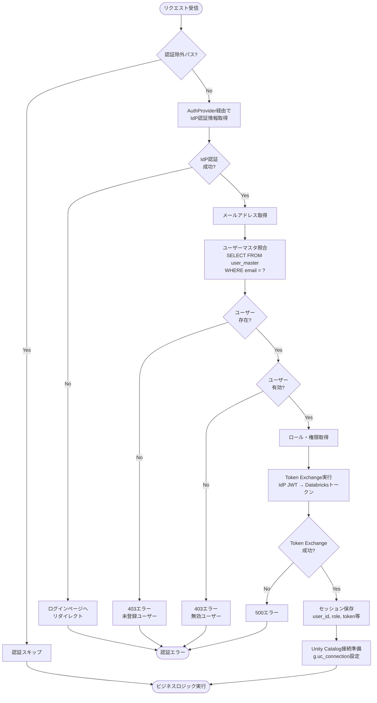
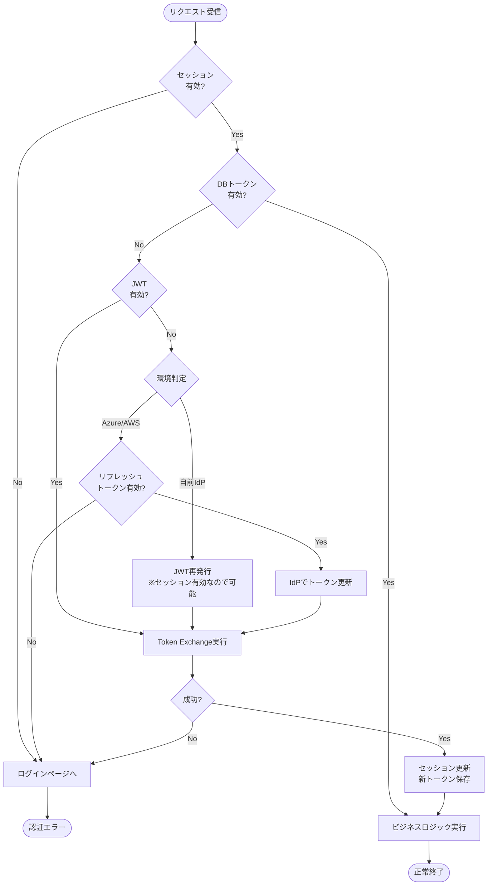
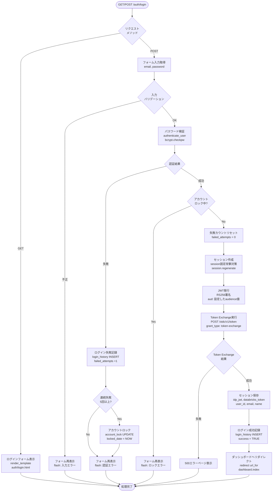
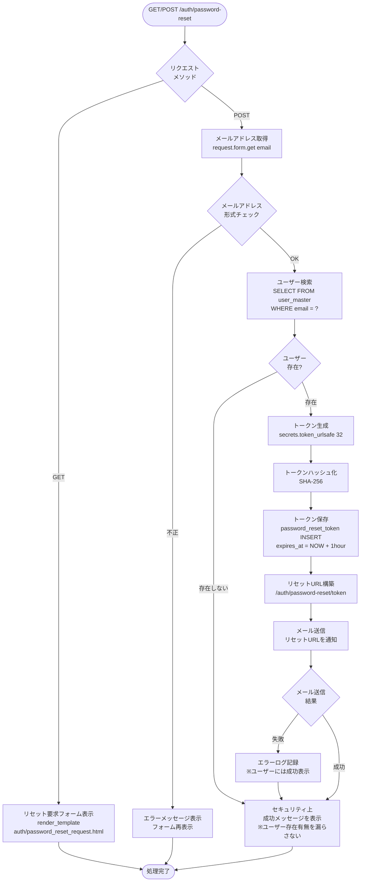
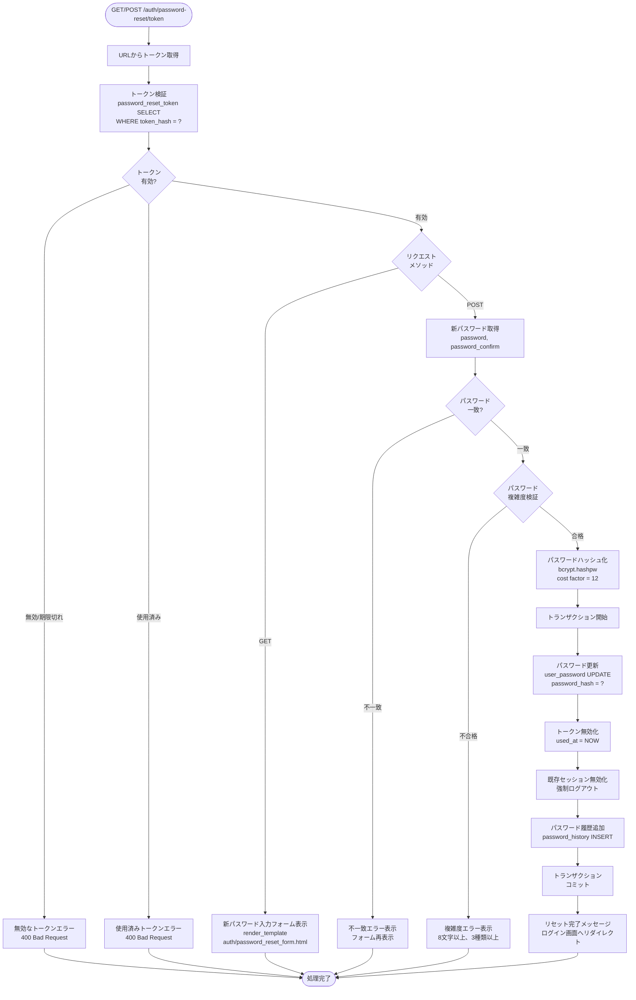

# 認証仕様書

## 目次

1. [概要](#1-概要)
2. [認証アーキテクチャ概要](#2-認証アーキテクチャ概要)
3. [リクエスト認証処理（AuthMiddleware）](#3-リクエスト認証処理authmiddleware)
   - 3.1 [処理フロー概要](#31-処理フロー概要)
   - 3.2 [認証除外パス](#32-認証除外パス)
   - 3.3 [認証チェック・ユーザーマスタ照合](#33-認証チェックユーザーマスタ照合)
   - 3.4 [Token Exchange](#34-token-exchange)
   - 3.5 [有効期限管理戦略](#35-有効期限管理戦略)
   - 3.6 [セッション管理](#36-セッション管理)
   - 3.7 [Unity Catalog接続](#37-unity-catalog接続)
   - 3.8 [エラーハンドリング](#38-エラーハンドリング)
4. [環境別仕様](#4-環境別仕様)
   - 4.1 [Azure環境（Easy Auth）](#41-azure環境easy-auth)
   - 4.2 [AWS環境（ALB + Cognito）](#42-aws環境alb--cognito)
   - 4.3 [オンプレミス環境（基本設定）](#43-オンプレミス環境基本設定)
5. [オンプレミス認証機能仕様](#5-オンプレミス認証機能仕様)
6. [関連ドキュメント](#6-関連ドキュメント)

---

## 1. 概要

### 1.1 本ドキュメントの目的

本ドキュメントは、Databricks IoTシステムにおける認証アーキテクチャの詳細仕様を定義します。認証共通モジュールにより、以下の3つの環境に対応可能な設計となっています。

| 環境             | 認証方式              | 主なユースケース                     |
| ---------------- | --------------------- | ------------------------------------ |
| Azure環境        | Easy Auth（Entra ID） | Azure App Serviceでのホスティング    |
| AWS環境          | ALB + Cognito         | AWS EC2/ECSでのホスティング          |
| オンプレミス環境 | 自前認証（Flask IdP） | オンプレミスサーバーでのホスティング |

---

## 2. 認証アーキテクチャ概要

### 2.1 設計思想

認証共通モジュールは、**AuthProviderパターン**により認証処理を抽象化し、環境依存のコードを最小化します。

```
┌─────────────────────────────────────────────────────────┐
│                    Flaskアプリケーション                  │
│  ┌─────────────────────────────────────────────────┐   │
│  │              AuthMiddleware                      │   │
│  │   - before_request: 認証チェック                  │   │
│  │   - Token Exchange実行                           │   │
│  │   - セッション管理                                │   │
│  └─────────────────────────────────────────────────┘   │
│                          │                              │
│                          ▼                              │
│  ┌─────────────────────────────────────────────────┐   │
│  │           AuthProvider（抽象基底クラス）           │   │
│  │   - get_user_info()                              │   │
│  │   - get_jwt_for_token_exchange()                 │   │
│  │   - logout_url()                                 │   │
│  └─────────────────────────────────────────────────┘   │
│         ▲                 ▲                 ▲          │
│         │                 │                 │          │
│  ┌──────┴──────┐  ┌───────┴───────┐  ┌──────┴──────┐  │
│  │ AzureEasy   │  │ AWSCognito    │  │ LocalIdP    │  │
│  │ AuthProvider│  │ Provider      │  │ Provider    │  │
│  └─────────────┘  └───────────────┘  └─────────────┘  │
└─────────────────────────────────────────────────────────┘
```

### 2.2 AuthProviderパターン

#### 2.2.1 インターフェース定義

```python
from abc import ABC, abstractmethod
from typing import TypedDict, Optional

class UserInfo(TypedDict):
    user_id: str
    email: str
    name: Optional[str]
    groups: list[str]

class AuthProvider(ABC):
    """認証プロバイダー抽象基底クラス"""

    @abstractmethod
    def get_user_info(self, request) -> UserInfo:
        """リクエストからユーザー情報を取得"""
        pass

    @abstractmethod
    def get_jwt_for_token_exchange(self, request) -> str:
        """Token Exchange用のJWTを取得"""
        pass

    @abstractmethod
    def logout_url(self) -> str:
        """ログアウトURLを返却"""
        pass

    @abstractmethod
    def requires_additional_setup(self) -> bool:
        """追加設定（ログイン画面等）が必要か"""
        pass
```

#### 2.2.2 プロバイダー一覧

| クラス名                | 環境         | 認証ソース                   |
| ----------------------- | ------------ | ---------------------------- |
| `AzureEasyAuthProvider` | Azure        | Easy Auth（X-MS-*ヘッダー）  |
| `AWSCognitoProvider`    | AWS          | ALB（X-Amzn-Oidc-*ヘッダー） |
| `LocalIdPProvider`      | オンプレミス | Flaskセッション              |

### 2.3 認証方式の選択

環境変数`AUTH_TYPE`により認証プロバイダーを選択します。

```python
# config.py
import os
from auth.providers.azure_easy_auth import AzureEasyAuthProvider
from auth.providers.aws_cognito import AWSCognitoProvider
from auth.providers.local_idp import LocalIdPProvider

def get_auth_provider():
    auth_type = os.getenv('AUTH_TYPE', 'azure')

    providers = {
        'azure': AzureEasyAuthProvider,
        'aws': AWSCognitoProvider,
        'local': LocalIdPProvider,
    }

    provider_class = providers.get(auth_type)
    if not provider_class:
        raise ValueError(f"Unknown AUTH_TYPE: {auth_type}")

    return provider_class()
```

**環境変数設定例**:

| 環境              | AUTH_TYPE |
| ----------------- | --------- |
| Azure App Service | `azure`   |
| AWS EC2/ECS       | `aws`     |
| オンプレミス      | `local`   |

---

## 3. リクエスト認証処理（AuthMiddleware）

本セクションでは、Flaskの`before_request`フックで実行される認証処理の全体フローを説明します。

### 3.1 処理フロー概要



### 3.2 認証除外パス

以下のパスは認証チェックをスキップします。

| パスパターン             | 説明                                       |
| ------------------------ | ------------------------------------------ |
| `/static/*`              | 静的ファイル（CSS、JS、画像等）            |
| `/auth/login`            | ログインページ（オンプレミス環境のみ）     |
| `/auth/password-reset/*` | パスワードリセット（オンプレミス環境のみ） |
| `/.well-known/*`         | OpenID Connect設定（オンプレミス環境のみ） |
| `/health`                | ヘルスチェックエンドポイント               |

```python
# auth/middleware.py
EXCLUDED_PATHS = [
    '/static',
    '/auth/login',
    '/auth/password-reset',
    '/.well-known',
    '/health',
]

def is_excluded_path(path: str) -> bool:
    """認証除外パスかどうかを判定"""
    return any(path.startswith(excluded) for excluded in EXCLUDED_PATHS)
```

### 3.3 認証チェック・ユーザーマスタ照合

#### 3.3.1 処理概要

1. **IdP認証情報取得**: AuthProviderからメールアドレス等を取得
2. **ユーザーマスタ照合**: メールアドレスでアプリのユーザーマスタを検索
3. **有効性チェック**: ユーザーが存在し、有効（delete_flag=FALSE）であることを確認
4. **ロール取得**: ユーザーのロール（role_id）を取得

#### 3.3.2 ユーザーマスタ照合SQL

```sql
SELECT
    user_id,
    user_name,
    email_address,
    role_id,
    organization_id,
    delete_flag
FROM user_master
WHERE email_address = :email
  AND delete_flag = FALSE
```

#### 3.3.3 エラーケース

| ケース               | HTTPステータス | 対応                                                             |
| -------------------- | -------------- | ---------------------------------------------------------------- |
| ユーザーが存在しない | 403 Forbidden  | エラーページ表示「このアカウントはシステムに登録されていません」 |
| ユーザーが削除済み   | 403 Forbidden  | エラーページ表示「このアカウントは無効です」                     |
| ロールが未割当       | 403 Forbidden  | エラーページ表示「権限が設定されていません」                     |

#### 3.3.4 実装例

```python
# auth/middleware.py
from flask import g, request, redirect, url_for, abort
from auth.factory import get_auth_provider

auth_provider = get_auth_provider()

def authenticate_request():
    """リクエスト認証処理（before_request）"""

    # 1. 認証除外パスチェック
    if is_excluded_path(request.path):
        return None

    # 2. IdP認証情報取得
    try:
        idp_user_info = auth_provider.get_user_info(request)
    except UnauthorizedError:
        return redirect(auth_provider.logout_url())

    email = idp_user_info['email']

    # 3. ユーザーマスタ照合
    user = get_user_by_email(email)

    if not user:
        abort(403, description='このアカウントはシステムに登録されていません')

    if user.delete_flag:
        abort(403, description='このアカウントは無効です')

    # 4. ロール・権限取得
    role = get_role(user.role_id)
    if not role:
        abort(403, description='権限が設定されていません')

    # 5. グローバルコンテキストに保存
    g.current_user = user
    g.current_role = role

    # 6. Token Exchange（後続処理）
    # ...

    return None
```

### 3.4 Token Exchange

Token Exchangeは、IdPが発行したJWTをDatabricksアクセストークンに交換する処理です。

#### 3.4.1 概要

```
IdP JWT → Databricks Token Exchange API → Databricksアクセストークン
```

これにより、ユーザー単位の認証とUnity Catalogのデータスコープ制御を実現します。

#### 3.4.2 Token Exchange API仕様

**エンドポイント**: `POST https://<databricks-workspace>/oidc/v1/token`

**リクエスト**:
```http
POST /oidc/v1/token HTTP/1.1
Host: <databricks-workspace>
Content-Type: application/x-www-form-urlencoded

grant_type=urn:ietf:params:oauth:grant-type:token-exchange
&subject_token=<IdP発行JWT>
&subject_token_type=urn:ietf:params:oauth:token-type:id_token
&scope=all-apis
```

**レスポンス**:
```json
{
  "access_token": "<Databricksアクセストークン>",
  "token_type": "Bearer",
  "expires_in": 3600
}
```

#### 3.4.3 audience設定

Token Exchangeを成功させるには、**Databricks側のフェデレーションポリシー**でIdPが発行するトークンの`aud`（audience）クレームを許可する設定が必要です。

##### 3.4.3.1 仕組み

```
1. IdP側：任意のaudience値でトークンを発行（例：client_id、カスタムURL等）
2. Databricks側：フェデレーションポリシーのaudiencesフィールドでそのaudience値を許可
3. マッチング：トークンのaudがポリシーのaudiencesのいずれかと一致すれば認証成功
```

##### 3.4.3.2 audienceの設定ルール

| 項目       | 説明                                                      |
| ---------- | --------------------------------------------------------- |
| 設定場所   | Databricksフェデレーションポリシーの`audiences`フィールド |
| 許可値     | 任意の非空文字列（IdPが発行するaudと一致させる）          |
| デフォルト | 指定しない場合はDatabricksアカウントIDがデフォルト        |
| 複数指定   | 配列で複数のaudienceを許可可能                            |

**重要**: IdP側のaudをDatabricks側で許可する設計であり、IdP側のaudを特定の値に強制変更する必要はありません。

#### 3.4.4 Databricks Federation Policy設定

Databricks Account Consoleで、IdPを信頼するためのFederation Policyを設定します。

##### 3.4.4.1 必須設定項目

| 項目          | 説明                                                       |
| ------------- | ---------------------------------------------------------- |
| issuer        | IdPの識別子（JWTのissクレームと一致させる）                |
| jwks_uri      | IdPの公開鍵エンドポイント                                  |
| audiences     | 許可するaudience値のリスト（IdPのaudクレームと一致させる） |
| subject_claim | ユーザー識別に使用するクレーム（通常は`sub`または`email`） |

##### 3.4.4.2 環境別の設定例

| 環境    | issuer                                                      | jwks_uri                                                                          | audiences（例）                                                |
| ------- | ----------------------------------------------------------- | --------------------------------------------------------------------------------- | -------------------------------------------------------------- |
| Azure   | `https://login.microsoftonline.com/<tenant-id>/v2.0`        | `https://login.microsoftonline.com/<tenant-id>/discovery/v2.0/keys`               | `2ff814a6-3304-4ab8-85cb-cd0e6f879c1d`（Azure Databricks固定） |
| AWS     | `https://cognito-idp.<region>.amazonaws.com/<user-pool-id>` | `https://cognito-idp.<region>.amazonaws.com/<user-pool-id>/.well-known/jwks.json` | `<cognito-client-id>`                                          |
| 自前IdP | `https://<app-domain>`                                      | `https://<app-domain>/.well-known/jwks.json`                                      | `<任意の値>`（例：`https://<app-domain>`）                     |

#### 3.4.5 Token Exchanger実装

```python
# auth/token_exchange.py
import requests
from flask import session
import os

class TokenExchanger:
    """Token Exchange処理クラス"""

    def __init__(self):
        self.databricks_host = os.getenv('DATABRICKS_HOST')
        self.token_endpoint = f"https://{self.databricks_host}/oidc/v1/token"

    def exchange_token(self, idp_jwt: str) -> str:
        """IdP JWTをDatabricksトークンに交換"""
        payload = {
            'grant_type': 'urn:ietf:params:oauth:grant-type:token-exchange',
            'subject_token': idp_jwt,
            'subject_token_type': 'urn:ietf:params:oauth:token-type:id_token',
            'scope': 'all-apis'
        }

        response = requests.post(self.token_endpoint, data=payload)

        if response.status_code != 200:
            raise TokenExchangeError(f"Token Exchange failed: {response.text}")

        result = response.json()
        return result['access_token']

    def cache_token(self, access_token: str, expires_in: int):
        """トークンをセッションにキャッシュ"""
        session['databricks_token'] = access_token
        session['databricks_token_expires'] = time.time() + expires_in - 60  # 1分前に期限切れとする

    def get_cached_token(self) -> str | None:
        """キャッシュされたトークンを取得"""
        token = session.get('databricks_token')
        expires = session.get('databricks_token_expires', 0)

        if token and time.time() < expires:
            return token
        return None

    def ensure_valid_token(self, auth_provider) -> str:
        """有効なDatabricksトークンを確保（期限切れなら再取得）"""
        # 1. キャッシュされたトークンが有効ならそのまま返す
        token = self.get_cached_token()
        if token:
            return token

        # 2. JWTを取得（期限切れなら再発行）
        jwt_token = self._get_valid_jwt(auth_provider)

        # 3. Token Exchange実行
        result = self.exchange_token(jwt_token)
        self.cache_token(result['access_token'], result['expires_in'])

        return result['access_token']

    def _get_valid_jwt(self, auth_provider) -> str:
        """有効なJWTを取得（期限切れなら再発行）"""
        jwt_token = session.get('idp_jwt')
        jwt_expires = session.get('idp_jwt_expires', 0)

        # JWTが有効ならそのまま返す
        if jwt_token and time.time() < jwt_expires:
            return jwt_token

        # 自前IdPの場合のみ再発行可能
        if auth_provider.requires_additional_setup():
            jwt_token = auth_provider.get_jwt_for_token_exchange(None)
            session['idp_jwt'] = jwt_token
            session['idp_jwt_expires'] = time.time() + 3600  # 1時間
            return jwt_token

        # Azure/AWSの場合はリフレッシュトークンで更新を試みる
        # （実装は環境依存）
        raise JWTExpiredError('JWT expired, re-authentication required')
```

---

### 3.5 有効期限管理戦略

本システムでは3種類の有効期限が存在し、それぞれの整合性を取る必要があります。

#### 3.5.1 有効期限の種類と制御可否

| 種類                       | Azure                     | AWS                      | 自前IdP             | 制御可否 |
| -------------------------- | ------------------------- | ------------------------ | ------------------- | -------- |
| セッション期限             | Easy Auth依存             | ALB依存                  | 自由                | △〜○     |
| JWT期限                    | Entra ID依存（通常1時間） | Cognito依存（通常1時間） | 自由                | △〜○     |
| **Databricksトークン期限** | **約1時間（固定）**       | **約1時間（固定）**      | **約1時間（固定）** | **×**    |

**ネック**: Databricksトークン期限は制御不可のため、これを基準に設計します。

#### 3.5.2 設計方針

```
時間軸 →

セッション ━━━━━━━━━━━━━━━━━━━━━━━━━━━━━━━━━ (8時間: ユーザー認証状態)
           │
           │  セッション有効 = ユーザー認証済み = JWT発行権限あり
           │
JWT        ━━━━┿━━━━┿━━━━┿━━━━┿━━━━┿━━━━... (1時間ごと再発行)
                ↑    ↑    ↑    ↑    ↑
             必要な時だけ再発行（オンデマンド）
           │
DBトークン ━━━━┿━━━━┿━━━━┿━━━━┿━━━━┿━━━━... (1時間ごと再取得)
```

**方針1: Databricksトークンは「消耗品」**
- 固定期限（約1時間）で必ず切れる
- 毎リクエストで有効期限をチェックし、切れていたら再取得
- 再取得にはJWTが必要

**方針2: JWTは「Databricksトークン再取得の鍵」**
- JWTが有効な限り、Databricksトークンは何度でも再取得可能
- JWT期限切れ時は、セッションが有効なら再発行（自前IdPのみ）
- Azure/AWSではIdP側のトークン更新機構に依存

**方針3: セッションは「ユーザー体験の期限」**
- ユーザーが再ログインなしで使える時間
- セッションが切れたら完全に再認証

#### 3.5.3 期限切れ時の処理フロー



#### 3.5.4 環境別推奨設定

| 環境        | セッション期限             | JWT期限           | 備考                              |
| ----------- | -------------------------- | ----------------- | --------------------------------- |
| **自前IdP** | 8時間                      | 1時間（再発行可） | セッション有効中はJWT再発行で継続 |
| **Azure**   | Easy Auth設定（8時間推奨） | Entra ID依存      | リフレッシュトークン活用を検討    |
| **AWS**     | ALB設定（8時間推奨）       | Cognito依存       | リフレッシュトークン活用を検討    |

---

### 3.6 セッション管理

#### 3.6.1 セッション設定

| 項目                       | 設定値    | 説明                           |
| -------------------------- | --------- | ------------------------------ |
| SESSION_COOKIE_NAME        | `session` | セッションCookie名             |
| SESSION_COOKIE_SECURE      | `True`    | HTTPS必須                      |
| SESSION_COOKIE_HTTPONLY    | `True`    | JavaScript無効                 |
| SESSION_COOKIE_SAMESITE    | `Lax`     | CSRF保護                       |
| PERMANENT_SESSION_LIFETIME | `28800`   | セッション有効期限（秒）※8時間 |

**注**: セッション有効期限は有効期限管理戦略（3.5節）に基づき設定します。

#### 3.6.2 セッションデータ構造

```python
session = {
    'user_id': str,              # ユーザーID
    'email': str,                # メールアドレス
    'databricks_token': str,     # Databricksアクセストークン
    'databricks_token_expires': float,  # Databricksトークン有効期限（Unix時間）
    'idp_jwt': str,              # IdP発行JWT（Token Exchange用）
    'idp_jwt_expires': float,    # JWT有効期限（Unix時間）
    'login_at': float,           # ログイン日時（Unix時間）
}
```

#### 3.6.3 セッション固定攻撃対策

ログイン成功時にセッションIDを再生成します。

```python
from flask import session

def regenerate_session():
    """セッションID再生成（セッション固定攻撃対策）"""
    # 既存データを保持
    old_data = dict(session)

    # セッションクリア
    session.clear()

    # 新しいセッションにデータを復元
    session.update(old_data)

    # セッションを永続化
    session.modified = True
```

#### 3.6.4 セッション有効期限

| 環境    | セッション管理  | 有効期限                          |
| ------- | --------------- | --------------------------------- |
| Azure   | Easy Authと連動 | Easy Auth設定に従う（8時間推奨）  |
| AWS     | ALBと連動       | ALB設定に従う（8時間推奨）        |
| 自前IdP | Flaskセッション | 環境変数で設定（デフォルト8時間） |

**注**: 有効期限管理の詳細は[3.5 有効期限管理戦略](#35-有効期限管理戦略)を参照してください。

---

### 3.7 Unity Catalog接続

#### 3.7.1 概要

Token Exchange後のDatabricksアクセストークンを使用して、Unity Catalogに接続します。これにより、ユーザー単位のデータスコープ制御が実現されます。

#### 3.7.2 接続方式

```python
# db/unity_catalog_connector.py
from databricks import sql
from flask import session, g
import os

class UnityCatalogConnector:
    """Unity Catalog接続クラス"""

    def __init__(self):
        self.server_hostname = os.getenv('DATABRICKS_SERVER_HOSTNAME')
        self.http_path = os.getenv('DATABRICKS_HTTP_PATH')

    def get_connection(self):
        """Unity Catalog接続を取得"""
        access_token = session.get('databricks_token')

        if not access_token:
            raise UnauthorizedError('Databricks token not found in session')

        connection = sql.connect(
            server_hostname=self.server_hostname,
            http_path=self.http_path,
            access_token=access_token
        )

        return connection

    def execute_query(self, query: str, params: dict = None) -> list:
        """SQLクエリを実行"""
        with self.get_connection() as conn:
            cursor = conn.cursor()
            cursor.execute(query, params)
            result = cursor.fetchall()
            return result
```

#### 3.7.3 データスコープ制御

Unity Catalogの動的ビューにより、ユーザーの所属組織に基づいたデータフィルタリングが自動的に適用されます。

```sql
-- Unity Catalog動的ビュー例
CREATE OR REPLACE VIEW devices_view AS
SELECT d.*
FROM devices d
WHERE d.delete_flag = FALSE
  AND EXISTS (
    SELECT 1
    FROM organization_closure oc
    WHERE oc.parent_organization_id = current_user_organization_id()
      AND oc.subsidiary_organization_id = d.organization_id
  );
```

#### 3.7.4 接続プール管理

- リクエストごとに1接続を使用
- リクエスト終了時に接続をクローズ
- 長時間接続は避ける（タイムアウト設定）

---

### 3.8 エラーハンドリング

#### 3.8.1 認証関連エラー分類

| エラー種別         | HTTPステータス            | 対応                           |
| ------------------ | ------------------------- | ------------------------------ |
| 未認証             | 401 Unauthorized          | ログインページへリダイレクト   |
| 権限不足           | 403 Forbidden             | エラーページ表示               |
| Token Exchange失敗 | 500 Internal Server Error | エラーページ表示、ログ記録     |
| セッション期限切れ | 401 Unauthorized          | ログインページへリダイレクト   |
| JWT期限切れ        | -（内部処理）             | JWT再発行→Token Exchange再実行 |

#### 3.8.2 例外クラス定義

```python
# auth/exceptions.py

class AuthError(Exception):
    """認証エラー基底クラス"""
    pass

class UnauthorizedError(AuthError):
    """未認証エラー（401）"""
    pass

class ForbiddenError(AuthError):
    """権限不足エラー（403）"""
    pass

class TokenExchangeError(AuthError):
    """Token Exchangeエラー"""
    pass

class SessionExpiredError(AuthError):
    """セッション期限切れエラー"""
    pass

class JWTExpiredError(AuthError):
    """JWT期限切れエラー（再発行トリガー）"""
    pass

# 自前IdP固有
class PasswordAuthError(AuthError):
    """パスワード認証エラー"""
    pass

class AccountLockedError(AuthError):
    """アカウントロックエラー"""
    pass

class PasswordResetError(AuthError):
    """パスワードリセットエラー"""
    pass
```

#### 3.8.3 Flaskエラーハンドラ

```python
# auth/error_handlers.py
from flask import render_template, redirect, url_for, flash
from auth.exceptions import *

def register_error_handlers(app):
    """認証エラーハンドラを登録"""

    @app.errorhandler(UnauthorizedError)
    def handle_unauthorized(e):
        flash('ログインが必要です', 'warning')
        return redirect(url_for('auth.login'))

    @app.errorhandler(ForbiddenError)
    def handle_forbidden(e):
        return render_template('errors/403.html'), 403

    @app.errorhandler(TokenExchangeError)
    def handle_token_exchange_error(e):
        app.logger.error(f"Token Exchange error: {e}")
        flash('認証処理に失敗しました。再度ログインしてください', 'error')
        return redirect(url_for('auth.login'))

    @app.errorhandler(SessionExpiredError)
    def handle_session_expired(e):
        flash('セッションが期限切れです。再度ログインしてください', 'warning')
        return redirect(url_for('auth.login'))
```

---

## 4. 環境別仕様

本セクションでは、各デプロイ環境における認証設定・実装の詳細を記載します。

### 4.1 Azure環境（Easy Auth）

#### 4.1.1 概要

Azure App ServiceのEasy Auth機能を使用して、Entra IDによる認証を実現します。

#### 4.1.2 Azure App Service Easy Auth設定

##### 4.1.2.1 Azure Portal設定手順

1. Azure Portal → App Service → 認証
2. 「認証を追加」→「Microsoft」を選択
3. Entra IDアプリ登録を作成または選択
4. 以下の設定を行う

##### 4.1.2.2 loginParameters設定

```json
{
  "loginParameters": [
    "scope=openid profile email 2ff814a6-3304-4ab8-85cb-cd0e6f879c1d/user_impersonation"
  ]
}
```

**重要**: `2ff814a6-3304-4ab8-85cb-cd0e6f879c1d/user_impersonation`スコープを追加することで、Databricks用のアクセストークンが取得可能になります。

##### 4.1.2.3 APIアクセス許可追加

Entra IDアプリ登録で以下のAPIアクセス許可を追加:
- `2ff814a6-3304-4ab8-85cb-cd0e6f879c1d` (Azure Databricks)
  - `user_impersonation`

#### 4.1.3 X-MS-*ヘッダー取得方法

Easy Authは認証成功後、以下のヘッダーをリクエストに付与します。

| ヘッダー名                    | 内容                               | 用途                         |
| ----------------------------- | ---------------------------------- | ---------------------------- |
| `X-MS-CLIENT-PRINCIPAL`       | Base64エンコードされたユーザー情報 | ユーザー情報取得             |
| `X-MS-CLIENT-PRINCIPAL-ID`    | ユーザーID（Object ID）            | ユーザー識別                 |
| `X-MS-CLIENT-PRINCIPAL-NAME`  | ユーザー名（メールアドレス）       | アプリのメールアドレスと同値 |
| `X-MS-TOKEN-AAD-ACCESS-TOKEN` | Entra IDアクセストークン           | Token Exchange用             |

#### X-MS-CLIENT-PRINCIPALのデコード

```python
import base64
import json

def decode_client_principal(header_value: str) -> dict:
    """X-MS-CLIENT-PRINCIPALをデコード"""
    decoded = base64.b64decode(header_value)
    return json.loads(decoded)

# 戻り値例
{
    "auth_typ": "aad",
    "claims": [
        {"typ": "name", "val": "山田太郎"},
        {"typ": "preferred_username", "val": "yamada@example.com"},
        {"typ": "oid", "val": "12345678-1234-1234-1234-123456789012"},
        ...
    ],
    "name_typ": "name",
    "role_typ": "roles"
}
```

#### 4.1.4 AzureEasyAuthProviderクラス仕様

```python
# auth/providers/azure_easy_auth.py
import base64
import json
from flask import request
from auth.providers.base import AuthProvider, UserInfo

class AzureEasyAuthProvider(AuthProvider):
    """Azure Easy Auth認証プロバイダー"""

    def get_user_info(self, request) -> UserInfo:
        """X-MS-*ヘッダーからユーザー情報を取得"""
        client_principal = request.headers.get('X-MS-CLIENT-PRINCIPAL')

        if not client_principal:
            raise UnauthorizedError('X-MS-CLIENT-PRINCIPAL header not found')

        decoded = base64.b64decode(client_principal)
        principal_data = json.loads(decoded)

        claims = {c['typ']: c['val'] for c in principal_data.get('claims', [])}

        return UserInfo(
            user_id=claims.get('oid', ''),
            email=claims.get('preferred_username', ''),
            name=claims.get('name', ''),
            groups=claims.get('groups', [])
        )

    def get_jwt_for_token_exchange(self, request) -> str:
        """Token Exchange用のJWTを取得"""
        access_token = request.headers.get('X-MS-TOKEN-AAD-ACCESS-TOKEN')

        if not access_token:
            raise UnauthorizedError('X-MS-TOKEN-AAD-ACCESS-TOKEN header not found')

        return access_token

    def logout_url(self) -> str:
        """ログアウトURLを返却"""
        return '/.auth/logout'

    def requires_additional_setup(self) -> bool:
        """追加設定不要（Easy Authが処理）"""
        return False
```

#### 4.1.5 Databricks Federation Policy設定（Azure）

Databricks Account Consoleで以下を設定:

```json
{
  "issuer": "https://login.microsoftonline.com/<tenant-id>/v2.0",
  "jwks_uri": "https://login.microsoftonline.com/<tenant-id>/discovery/v2.0/keys",
  "audiences": ["2ff814a6-3304-4ab8-85cb-cd0e6f879c1d"],
  "subject_claim": "sub"
}
```

**注**: `2ff814a6-3304-4ab8-85cb-cd0e6f879c1d`はAzure Databricksの公式リソースIDです。Azure Easy Auth経由で取得したEntra IDトークンは、このaudienceを持つため、この値を許可リストに設定します。

---

### 4.2 AWS環境（ALB + Cognito）

#### 4.2.1 概要

AWS Application Load Balancer (ALB) のOIDC認証機能とAmazon Cognitoを組み合わせて認証を実現します。

#### 4.2.2 AWS Cognito設定

##### 4.2.2.1 ユーザープール作成

1. AWS Console → Cognito → ユーザープールを作成
2. サインインオプション: メールアドレス
3. パスワードポリシー: 要件に応じて設定
4. MFA: オプション（推奨: 有効化）

##### 4.2.2.2 アプリクライアント設定

1. アプリクライアントを追加
2. クライアントシークレットを生成
3. 認証フロー: ALLOW_USER_SRP_AUTH、ALLOW_REFRESH_TOKEN_AUTH

##### 4.2.2.3 ホストされたUI設定

1. Cognitoドメインを設定（例: `https://<domain>.auth.<region>.amazoncognito.com`）
2. コールバックURL: `https://<alb-dns>/oauth2/idpresponse`
3. サインアウトURL: `https://<alb-dns>/logout`

#### 4.2.3 ALB OIDC認証設定

##### 4.2.3.1 リスナールール設定

1. ALBリスナー → ルールを追加
2. 条件: すべてのリクエスト（または特定パス）
3. アクション: 「OIDCで認証」→ ターゲットグループに転送

##### 4.2.3.2 OIDC認証設定

| 項目                       | 値                                                                  |
| -------------------------- | ------------------------------------------------------------------- |
| 発行者                     | `https://cognito-idp.<region>.amazonaws.com/<user-pool-id>`         |
| 認可エンドポイント         | `https://<domain>.auth.<region>.amazoncognito.com/oauth2/authorize` |
| トークンエンドポイント     | `https://<domain>.auth.<region>.amazoncognito.com/oauth2/token`     |
| ユーザー情報エンドポイント | `https://<domain>.auth.<region>.amazoncognito.com/oauth2/userInfo`  |
| クライアントID             | Cognitoアプリクライアントの値                                       |
| クライアントシークレット   | Cognitoアプリクライアントの値                                       |

#### 4.2.4 X-Amzn-Oidc-*ヘッダー取得方法

ALBは認証成功後、以下のヘッダーをリクエストに付与します。

| ヘッダー名                | 内容                    | 用途             |
| ------------------------- | ----------------------- | ---------------- |
| `X-Amzn-Oidc-Data`        | JWTペイロード（Base64） | ユーザー情報取得 |
| `X-Amzn-Oidc-Identity`    | ユーザー識別子          | ユーザー識別     |
| `X-Amzn-Oidc-Accesstoken` | OIDCアクセストークン    | Token Exchange用 |

#### X-Amzn-Oidc-Dataのデコード

```python
import base64
import json

def decode_oidc_data(header_value: str) -> dict:
    """X-Amzn-Oidc-Dataをデコード（JWT形式）"""
    # JWTの3つの部分（header.payload.signature）からpayloadを取得
    parts = header_value.split('.')
    if len(parts) != 3:
        raise ValueError('Invalid JWT format')

    # Base64 URLデコード（パディング追加）
    payload = parts[1]
    payload += '=' * (4 - len(payload) % 4)
    decoded = base64.urlsafe_b64decode(payload)

    return json.loads(decoded)
```

#### 4.2.5 AWSCognitoProviderクラス仕様

```python
# auth/providers/aws_cognito.py
import base64
import json
from flask import request
from auth.providers.base import AuthProvider, UserInfo

class AWSCognitoProvider(AuthProvider):
    """AWS Cognito認証プロバイダー"""

    def get_user_info(self, request) -> UserInfo:
        """X-Amzn-Oidc-*ヘッダーからユーザー情報を取得"""
        oidc_data = request.headers.get('X-Amzn-Oidc-Data')

        if not oidc_data:
            raise UnauthorizedError('X-Amzn-Oidc-Data header not found')

        payload = self._decode_jwt_payload(oidc_data)

        return UserInfo(
            user_id=payload.get('sub', ''),
            email=payload.get('email', ''),
            name=payload.get('name', payload.get('cognito:username', '')),
            groups=payload.get('cognito:groups', [])
        )

    def get_jwt_for_token_exchange(self, request) -> str:
        """Token Exchange用のJWTを取得"""
        access_token = request.headers.get('X-Amzn-Oidc-Accesstoken')

        if not access_token:
            raise UnauthorizedError('X-Amzn-Oidc-Accesstoken header not found')

        return access_token

    def logout_url(self) -> str:
        """ログアウトURLを返却"""
        import os
        cognito_domain = os.getenv('COGNITO_DOMAIN')
        client_id = os.getenv('COGNITO_CLIENT_ID')
        logout_uri = os.getenv('LOGOUT_REDIRECT_URI')
        return f"{cognito_domain}/logout?client_id={client_id}&logout_uri={logout_uri}"

    def requires_additional_setup(self) -> bool:
        """追加設定不要（ALBが処理）"""
        return False

    def _decode_jwt_payload(self, jwt: str) -> dict:
        """JWTペイロードをデコード"""
        parts = jwt.split('.')
        if len(parts) != 3:
            raise ValueError('Invalid JWT format')

        payload = parts[1]
        payload += '=' * (4 - len(payload) % 4)
        decoded = base64.urlsafe_b64decode(payload)
        return json.loads(decoded)
```

#### 4.2.6 Databricks Federation Policy設定（AWS）

Databricks Account Consoleで以下を設定:

```json
{
  "issuer": "https://cognito-idp.<region>.amazonaws.com/<user-pool-id>",
  "jwks_uri": "https://cognito-idp.<region>.amazonaws.com/<user-pool-id>/.well-known/jwks.json",
  "audiences": ["<cognito-client-id>"],
  "subject_claim": "sub"
}
```

**注**: `audiences`にはCognitoアプリクライアントIDを設定します。CognitoはデフォルトでJWTのaudクレームにクライアントIDを設定するため、フェデレーションポリシーでそのまま許可します。

---

### 4.3 オンプレミス環境（基本設定）

#### 4.3.1 概要

オンプレミス環境では、Flaskアプリケーション自体がIdP（Identity Provider）として機能し、ユーザー認証とJWT発行を行います。

#### 4.3.2 JWT発行仕様

##### 4.3.2.1 署名アルゴリズム

| 項目         | 値                     |
| ------------ | ---------------------- |
| アルゴリズム | RS256（RSA + SHA-256） |
| 鍵長         | 2048ビット以上         |
| 秘密鍵形式   | PEM                    |

##### 4.3.2.2 秘密鍵管理

| 項目           | 設定                                              |
| -------------- | ------------------------------------------------- |
| 配置場所       | `/secure/jwt/private_key.pem`（環境変数で指定可） |
| パーミッション | `400`（所有者のみ読み取り）                       |
| 所有者         | アプリケーション実行ユーザー                      |

##### 4.3.2.3 JWTペイロード構造

```json
{
  "sub": "<user_id>",
  "email": "<user_email>",
  "name": "<user_name>",
  "aud": "<audience>",
  "iss": "https://<app-domain>",
  "exp": 1234567890,
  "iat": 1234567800,
  "nbf": 1234567800
}
```

**audience設定について**:
- `aud`クレームには任意の値を設定可能です（例：`https://<app-domain>`、カスタム識別子等）
- Databricksフェデレーションポリシーの`audiences`フィールドに同じ値を設定して許可します
- issuerと同じ値（`https://<app-domain>`）を設定するのが一般的です

**有効期限設定について**:

| クレーム | 設定値       | 説明                           |
| -------- | ------------ | ------------------------------ |
| `iat`    | 現在時刻     | JWT発行時刻（Unix時間）        |
| `exp`    | `iat + 3600` | 有効期限（発行から1時間後）    |
| `nbf`    | `iat`        | 有効開始時刻（発行時刻と同じ） |

- JWT有効期限は**1時間**を推奨（Databricksトークン期限と同程度）
- セッションが有効な限り、期限切れ時は再発行可能（3.5節参照）
- 有効期限は環境変数`JWT_LIFETIME_SECONDS`で変更可能

#### 4.3.3 OpenID Configuration Endpoint

自前IdPとしてOpenID Connect仕様に準拠したエンドポイントを提供します。

##### 4.3.3.1 /.well-known/openid-configuration

```json
{
  "issuer": "https://<app-domain>",
  "authorization_endpoint": "https://<app-domain>/auth/authorize",
  "token_endpoint": "https://<app-domain>/auth/token",
  "jwks_uri": "https://<app-domain>/.well-known/jwks.json",
  "response_types_supported": ["code", "token", "id_token"],
  "subject_types_supported": ["public"],
  "id_token_signing_alg_values_supported": ["RS256"]
}
```

##### 4.3.3.2 /.well-known/jwks.json

```json
{
  "keys": [
    {
      "kty": "RSA",
      "use": "sig",
      "alg": "RS256",
      "kid": "<key-id>",
      "n": "<modulus-base64url>",
      "e": "AQAB"
    }
  ]
}
```

#### 4.3.4 LocalIdPProviderクラス仕様

```python
# auth/providers/local_idp.py
from flask import session
from auth.providers.base import AuthProvider, UserInfo

class LocalIdPProvider(AuthProvider):
    """自前IdP認証プロバイダー"""

    def get_user_info(self, request) -> UserInfo:
        """セッションからユーザー情報を取得"""
        if 'user_id' not in session:
            raise UnauthorizedError('Not logged in')

        return UserInfo(
            user_id=session.get('user_id', ''),
            email=session.get('email', ''),
            name=session.get('name', ''),
            groups=session.get('groups', [])
        )

    def get_jwt_for_token_exchange(self, request) -> str:
        """セッションからJWTを取得"""
        jwt_token = session.get('idp_jwt')

        if not jwt_token:
            # JWTがない場合は再発行
            jwt_token = self._issue_jwt()
            session['idp_jwt'] = jwt_token

        return jwt_token

    def logout_url(self) -> str:
        """ログアウトURLを返却"""
        return '/auth/logout'

    def requires_additional_setup(self) -> bool:
        """ログイン画面等の追加設定が必要"""
        return True

    def _issue_jwt(self) -> str:
        """JWTを発行"""
        from auth.jwt_issuer import JWTIssuer
        issuer = JWTIssuer()
        return issuer.issue(
            user_id=session['user_id'],
            email=session['email'],
            name=session.get('name', '')
        )
```

#### 4.3.5 Databricks Federation Policy設定（自前IdP）

Databricks Account Consoleで以下を設定:

```json
{
  "issuer": "https://<app-domain>",
  "jwks_uri": "https://<app-domain>/.well-known/jwks.json",
  "audiences": ["https://<app-domain>"],
  "subject_claim": "email"
}
```

**注**: `audiences`には自前IdPが発行するJWTの`aud`クレームと同じ値を設定します。上記例ではissuerと同じ値を使用していますが、任意の識別子を設定可能です。

#### 4.3.6 秘密鍵セットアップ手順

##### 4.3.6.1 鍵ペア生成スクリプト

```bash
#!/bin/bash
# scripts/generate_rsa_keypair.sh

# 秘密鍵生成
openssl genpkey -algorithm RSA -out private_key.pem -pkeyopt rsa_keygen_bits:2048

# 公開鍵抽出
openssl rsa -pubout -in private_key.pem -out public_key.pem

# パーミッション設定
chmod 400 private_key.pem
chmod 444 public_key.pem

echo "秘密鍵を生成しました: private_key.pem"
echo "パーミッション: 400 (所有者のみ読み取り可能)"
```

##### 4.3.6.2 配置手順

1. 上記スクリプトを実行
2. `private_key.pem`を`/secure/jwt/`に配置
3. 環境変数`JWT_PRIVATE_KEY_PATH`を設定
4. アプリケーションを再起動

##### 4.3.6.3 鍵ローテーション手順

1. 新しい鍵ペアを生成
2. 既存鍵をバックアップ
3. 新しい鍵を配置
4. アプリケーションを再起動
5. Databricks Federation Policyを更新（JWKS）

---

## 5. オンプレミス認証機能仕様

本セクションでは、オンプレミス環境固有の認証機能（ログイン、パスワードリセット等）の実装詳細を記載します。

### 5.1 パスワード認証フロー

#### 処理フロー図



#### 5.1.1 ログイン画面（/auth/login）

**GET**: ログインフォーム表示
**POST**: ログイン処理

```python
# auth/routes.py
from flask import Blueprint, render_template, request, redirect, url_for, flash, session, abort

auth_bp = Blueprint('auth', __name__, url_prefix='/auth')

@auth_bp.route('/login', methods=['GET', 'POST'])
def login():
    if request.method == 'GET':
        return render_template('auth/login.html')

    email = request.form.get('email')
    password = request.form.get('password')

    # パスワード検証
    user = authenticate_user(email, password)

    if not user:
        # ログイン失敗記録
        record_login_attempt(email, success=False, reason='invalid_credentials')
        increment_failed_attempts(email)

        # 連続失敗5回以上でアカウントロック
        if get_failed_attempts(email) >= 5:
            lock_account(email)

        flash('メールアドレスまたはパスワードが正しくありません', 'error')
        return render_template('auth/login.html')

    # アカウントロックチェック
    if is_account_locked(user.user_id):
        record_login_attempt(email, success=False, reason='account_locked')
        flash('アカウントがロックされています。しばらく待ってから再試行してください', 'error')
        return render_template('auth/login.html')

    # 失敗カウントリセット
    reset_failed_attempts(user.user_id)

    # セッション作成（セッション固定攻撃対策）
    session.clear()
    create_session(user)

    # JWT発行
    jwt_token = issue_jwt(user)
    session['idp_jwt'] = jwt_token

    # Token Exchange実行
    try:
        databricks_token = token_exchanger.exchange_token(jwt_token)
        session['databricks_token'] = databricks_token
    except TokenExchangeError as e:
        # 500エラーページへ遷移
        abort(500)

    # ログイン成功記録
    record_login_attempt(email, success=True)

    return redirect(url_for('dashboard.index'))
```

#### 5.1.2 ログアウト（/auth/logout）

```python
@auth_bp.route('/logout', methods=['POST'])
def logout():
    session.clear()
    flash('ログアウトしました', 'info')
    return redirect(url_for('auth.login'))
```

### 5.2 パスワードリセットフロー

#### 処理フロー図（リセット要求）



#### 処理フロー図（リセット実行）



#### 5.2.1 リセット要求（/auth/password-reset）

1. ユーザーがメールアドレスを入力
2. ランダムトークンを生成（`secrets.token_urlsafe(32)`）
3. トークンをDBに保存（有効期限1時間）
4. リセット用URLをメール送信

#### 5.2.2 リセット実行（/auth/password-reset/<token>）

1. トークンの有効性を検証
2. 新しいパスワードを入力
3. パスワード検証（文字数、使用済み制限）
4. bcryptでハッシュ化してDB更新
5. トークンを無効化
6. 既存セッションを無効化

### 5.3 パスワード変更フロー

#### 5.3.1 パスワード変更画面（/account/password/change）

ログイン済みユーザーが自分のパスワードを変更する機能。

1. 現在のパスワードを確認
2. 新しいパスワードを入力
3. パスワード検証（文字数、使用済み制限）
4. bcryptでハッシュ化してDB更新
5. パスワード履歴に追加

### 5.4 セキュリティ要件

#### 5.4.1 パスワードポリシー

| 項目                     | 要件                   |
| ------------------------ | ---------------------- |
| 最小文字数               | 8文字以上              |
| 最大文字数               | 64文字以下             |
| 使用したパスワードの制限 | 前回使用したパスワード |
| 有効期限                 | 90日                   |

- 有効期限の値は可変（設定ファイルで定義）

#### 5.4.2 アカウントロック

| 項目                 | 設定値 |
| -------------------- | ------ |
| 連続失敗回数上限     | 5回    |
| ロック期間           | 15分   |
| 管理者による手動解除 | 可能   |

- 連続失敗回数上限、ロック期間の値は可変（設定ファイルで定義）

#### 5.4.3 ログイン履歴記録

すべてのログイン試行（成功・失敗）を記録:
- ユーザーID
- 日時
- IPアドレス
- UserAgent
- 成功/失敗
- 失敗理由

### 5.5 認証関連テーブル設計

自前認証で必要となるテーブル設計です。

#### user_password（ユーザーパスワード）

| カラム名            | 型           | NULL | 説明                               |
| ------------------- | ------------ | ---- | ---------------------------------- |
| user_id             | VARCHAR(36)  | NO   | ユーザーID（PK, FK→users.user_id） |
| password_hash       | VARCHAR(255) | NO   | bcryptハッシュ値                   |
| password_updated_at | DATETIME     | NO   | パスワード更新日時                 |
| password_expires_at | DATETIME     | YES  | パスワード有効期限                 |
| created_at          | DATETIME     | NO   | 作成日時                           |
| updated_at          | DATETIME     | NO   | 更新日時                           |

#### password_reset_token（パスワードリセットトークン）

| カラム名   | 型           | NULL | 説明                           |
| ---------- | ------------ | ---- | ------------------------------ |
| token_id   | VARCHAR(36)  | NO   | トークンID（PK）               |
| user_id    | VARCHAR(36)  | NO   | ユーザーID（FK→users.user_id） |
| token_hash | VARCHAR(255) | NO   | トークンハッシュ値             |
| expires_at | DATETIME     | NO   | 有効期限                       |
| used_at    | DATETIME     | YES  | 使用日時（NULL=未使用）        |
| created_at | DATETIME     | NO   | 作成日時                       |

#### login_history（ログイン履歴）

| カラム名         | 型           | NULL | 説明                                 |
| ---------------- | ------------ | ---- | ------------------------------------ |
| login_history_id | BIGINT       | NO   | ログイン履歴ID（PK, AUTO_INCREMENT） |
| user_id          | VARCHAR(36)  | YES  | ユーザーID（FK、失敗時はNULL可）     |
| email            | VARCHAR(254) | NO   | 入力されたメールアドレス             |
| login_date       | DATETIME     | NO   | ログイン日時                         |
| ip_address       | VARCHAR(45)  | NO   | IPアドレス                           |
| user_agent       | TEXT         | YES  | UserAgent                            |
| success          | BOOLEAN      | NO   | 成功/失敗                            |
| failure_reason   | VARCHAR(100) | YES  | 失敗理由                             |

#### password_history（パスワード履歴）

| カラム名      | 型           | NULL | 説明                           |
| ------------- | ------------ | ---- | ------------------------------ |
| history_id    | BIGINT       | NO   | 履歴ID（PK, AUTO_INCREMENT）   |
| user_id       | VARCHAR(36)  | NO   | ユーザーID（FK→users.user_id） |
| password_hash | VARCHAR(255) | NO   | 過去のパスワードハッシュ       |
| create_date   | DATETIME     | NO   | 作成日時                       |

#### account_lock（アカウントロック状態）

| カラム名        | 型          | NULL | 説明                               |
| --------------- | ----------- | ---- | ---------------------------------- |
| user_id         | VARCHAR(36) | NO   | ユーザーID（PK, FK→users.user_id） |
| failed_attempts | INT         | NO   | 連続失敗回数                       |
| last_failed_at  | DATETIME    | YES  | 最後の失敗日時                     |
| locked_date     | DATETIME    | YES  | ロック日時（NULL=ロック解除）      |
| lock_expires_at | DATETIME    | YES  | ロック解除予定日時                 |

---

## 6. 関連ドキュメント

### 要件定義

- [機能要件定義書](../../02-requirements/functional-requirements.md)
- [非機能要件定義書](../../02-requirements/non-functional-requirements.md) - NFR-SEC-008: パスワードポリシー
- [技術要件定義書](../../02-requirements/technical-requirements.md)

### アーキテクチャ設計

- [アーキテクチャ概要](../../01-architecture/overview.md)
- [バックエンド設計](../../01-architecture/backend.md)
- [インフラストラクチャ設計](../../01-architecture/infrastructure.md)

### 共通設計

- [共通仕様書](./common-specification.md)
- [OLTP DB設計書](./app-database-specification.md)
- [Unity Catalog設計書](./unity-catalog-database-specification.md)

---

## 編集履歴

| 日付       | バージョン | 編集者 | 変更内容                                                                                                                                                                                                                       |
| ---------- | ---------- | ------ | ------------------------------------------------------------------------------------------------------------------------------------------------------------------------------------------------------------------------------ |
| 2026-01-27 | 1.0        | Claude | 初版作成                                                                                                                                                                                                                       |
| 2026-01-27 | 1.1        | Claude | セクション9（自前IdP認証）に処理フロー図を追加（パスワード認証、パスワードリセット、パスワード変更）                                                                                                                           |
| 2026-01-28 | 1.2        | Claude | 9.4パスワード認証フローをお手本に準拠（エラー時フォーム再表示+flash、500エラーページ遷移）、実装例にログイン失敗記録・アカウントロック処理を追加                                                                               |
| 2026-01-28 | 1.3        | Claude | ドキュメント構成変更: セクション7-9を「7.環境別仕様」（7.1 Azure、7.2 AWS、7.3 オンプレミス基本設定）と「8.オンプレミス認証機能仕様」に再構成                                                                                  |
| 2026-01-28 | 1.4        | Claude | audience設定の誤り修正: フェデレーションポリシーでIdP側のaudienceを許可する正しい仕組みに修正、AWS Pre Token Generation Lambda削除                                                                                             |
| 2026-01-28 | 1.5        | Claude | ドキュメント構成変更（Plan B）: セクション3「リクエスト認証処理（AuthMiddleware）」に認証処理フロー・Token Exchange・セッション管理・Unity Catalog接続・エラーハンドリングを統合。旧セクション7-9を4-6にリナンバリング         |
| 2026-01-28 | 1.6        | Claude | 有効期限管理戦略（3.5節）を追加: セッション/JWT/Databricksトークンの3種類の有効期限管理、期限切れ時の処理フロー、環境別推奨設定。Token Exchanger実装にensure_valid_token追加、セッション設定を8時間に変更、JWTExpiredError追加 |
