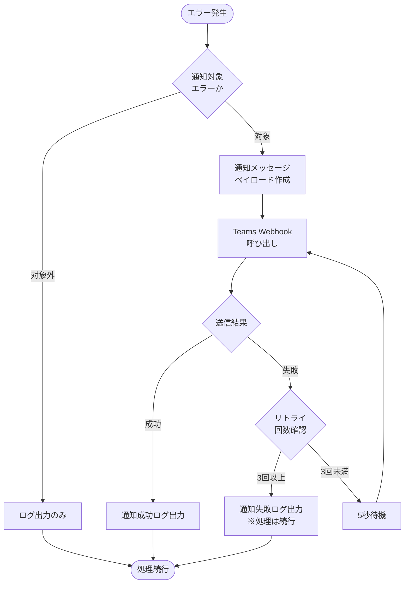
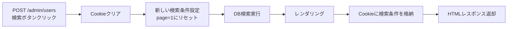

# 共通仕様

## 📑 目次

1. [概要](#概要)
2. [HTTPステータスコード](#httpステータスコード)
3. [エラーコード](#エラーコード)
4. [エラーハンドリング方針](#エラーハンドリング方針)
   - 4.1 [エラー分類とHTTPステータス](#エラー分類とhttpステータス)
   - 4.2 [エラーログ出力](#エラーログ出力)
5. [認証・認可](#認証認可)
   - 5.1 [認証方式](#認証方式)
   - 5.2 [認証フロー](#認証フロー)
   - 5.3 [ユーザー情報取得](#ユーザー情報取得)
   - 5.4 [ロール定義](#ロール定義)
   - 5.5 [ロールチェック](#ロールチェック)
   - 5.6 [組織種別定義](#組織種別定義)
6. [一覧ソート](#一覧ソート)
   - 6.1 [一覧ソートの種類](#一覧ソートの種類)
7. [日時フォーマット](#日時フォーマット)
   - 7.1 [形式](#形式)
   - 7.2 [タイムゾーン](#タイムゾーン)
8. [セキュリティ](#セキュリティ)
   - 8.1 [通信セキュリティ](#通信セキュリティ)
   - 8.2 [リクエストサイズ制限](#リクエストサイズ制限)
   - 8.3 [入力値検証](#入力値検証)
   - 8.4 [CSRF対策](#csrf対策)
9. [セッション・Cookie管理](#セッションcookie管理)
   - 9.1 [基本方針](#基本方針)
   - 9.2 [共通関数仕様](#共通関数仕様)
   - 9.3 [Cookie操作タイミング](#cookie操作タイミング)
   - 9.4 [共通関数実装例](#共通関数実装例)
   - 9.5 [使用例](#使用例)
10. [トランザクション管理](#トランザクション管理)
   - 10.1 [デフォルト設定](#デフォルト設定)
   - 10.2 [トランザクション分離レベル](#トランザクション分離レベル)
   - 10.3 [トランザクション開始・終了タイミング](#トランザクション開始終了タイミング)
   - 10.4 [ロック戦略](#ロック戦略)
   - 10.5 [デッドロック対策](#デッドロック対策)
   - 10.6 [トランザクション管理のベストプラクティス](#トランザクション管理のベストプラクティス)
11. [ログ出力ポリシー](#ログ出力ポリシー)
   - 11.1 [ログレベル定義](#ログレベル定義)
   - 11.2 [必須ログ出力項目](#必須ログ出力項目)
   - 11.3 [出力禁止項目（機密情報）](#出力禁止項目機密情報)
   - 11.4 [マスキング方針](#マスキング方針)
   - 11.5 [ログローテーション](#ログローテーション)
   - 11.6 [ログ保存先](#ログ保存先)
12. [識別子（ID）設計方針](#識別子id設計方針)
   - 12.1 [主キー（Primary Key）](#主キーprimary-key)
   - 12.2 [API識別子（UUID）](#api識別子uuid)
13. [設定ファイル管理項目](#設定ファイル管理項目)
   - 13.1 [概要](#概要-1)
   - 13.2 [統合設定ファイル全体構造](#統合設定ファイル全体構造)
14. [関連ドキュメント](#関連ドキュメント)

---

## 概要

このドキュメントは、Databricks IoTシステムにおけるFlask Webアプリケーションの全機能に共通する仕様を定義します。

**対象:**
- Flask SSRルート（サーバーサイドレンダリング）
- HTMLレスポンスまたはリダイレクト

**アーキテクチャ:**
- **Webフレームワーク**: Flask + Jinja2
- **認証基盤**: 認証共通モジュール（Azure/AWS/オンプレミス対応）※詳細は[認証仕様書](./authentication-specification.md)を参照
- **データベース**: MySQL互換DB（OLTP）、Unity Catalog（分析）
- **デプロイ環境**: Azure App Service / AWS EC2 / オンプレミスサーバー

---

## HTTPステータスコード

すべてのFlaskルートで使用する共通HTTPステータスコードを定義します。

| コード | 説明                  | 使用場面                           | Flask実装                            |
| ------ | --------------------- | ---------------------------------- | ------------------------------------ |
| 200    | OK                    | 正常処理（画面表示成功）           | `render_template()`                  |
| 302    | Found                 | リダイレクト（処理成功後）         | `redirect()`                         |
| 400    | Bad Request           | リクエスト不正（パラメータエラー） | `render_template()` with error       |
| 401    | Unauthorized          | 認証エラー                         | ログインページへリダイレクト         |
| 403    | Forbidden             | 権限不足                           | `render_template('errors/403.html')` |
| 404    | Not Found             | リソース未検出                     | `render_template('errors/404.html')` |
| 409    | Conflict              | 競合エラー（重複登録など）         | `render_template()` with error       |
| 422    | Unprocessable Entity  | バリデーションエラー               | `render_template()` with form errors |
| 500    | Internal Server Error | サーバーエラー                     | `render_template('errors/500.html')` |
| 502    | Bad Gateway           | 外部API連携エラー                  | `render_template('errors/502.html')` |
| 503    | Service Unavailable   | メンテナンス中                     | `render_template('errors/503.html')` |

**注:** Flask SSRでは、エラー時もHTMLページを返却します（JSONレスポンスは使用しません）。

---

## エラーコード

アプリケーション内部で使用するエラーコードを定義します。

| コード             | 説明                 | HTTPステータス | 表示方法                          |
| ------------------ | -------------------- | -------------- | --------------------------------- |
| AUTH_FAILED        | 認証失敗             | 401            | ログインページへリダイレクト      |
| PERMISSION_DENIED  | 権限不足             | 403            | エラーページまたはFlashメッセージ |
| RESOURCE_NOT_FOUND | リソース不在         | 404            | エラーページ                      |
| DUPLICATE_ENTRY    | 重複エラー           | 409            | フォームエラーメッセージ          |
| INVALID_PARAMETER  | パラメータ不正       | 400            | フォームエラーメッセージ          |
| VALIDATION_ERROR   | バリデーションエラー | 422            | フォームエラーメッセージ          |
| INTERNAL_ERROR     | サーバーエラー       | 500            | エラーページ                      |
| EXTERNAL_API_ERROR | 外部API連携エラー    | 502            | エラーページ                      |
| DATABASE_ERROR     | データベースエラー   | 500            | エラーページ                      |

**Flask実装例:**

```python
# パラメータ不正エラー
if not valid_parameter:
    # エラーメッセージモーダルを表示
    return render_template('users/list.html',
                         error_modal={'message': 'パラメータが不正です'}), 400

# リソース不在エラー
user = User.query.get(user_id)
if not user:
    # エラーメッセージモーダルを表示
    return render_template('users/list.html',
                         error_modal={'message': '指定されたユーザーが見つかりません'}), 404

# 権限エラー
if not current_user.has_permission('user:delete'):
    # エラーメッセージモーダルを表示
    return render_template('users/list.html',
                         error_modal={'message': 'この操作を実行する権限がありません'}), 403

# データベースエラー（例外ハンドラで処理）
try:
    db.session.commit()
except Exception as e:
    db.session.rollback()
    logger.error(f"Database error: {e}")
    # エラーメッセージモーダルを表示
    return render_template('users/list.html',
                         error_modal={'message': 'データベースエラーが発生しました'}), 500
```

---

## エラーハンドリング方針

すべてのFlaskルートで共通するエラーハンドリングの方針を定義します。

### エラー分類とHTTPステータス

| エラー分類           | 説明                           | 対応方針                     | HTTPステータス | トランザクション       |
| -------------------- | ------------------------------ | ---------------------------- | -------------- | ---------------------- |
| バリデーションエラー | 入力パラメータの形式・値が不正 | フォームにエラー表示         | 400, 422       | 開始前                 |
| 認証エラー           | 認証失敗                       | ログインページへリダイレクト | 401            | 開始前                 |
| 認可エラー           | 権限不足                       | エラーページまたはFlash      | 403            | 開始前                 |
| リソース不在エラー   | 対象データが存在しない         | エラーページまたはFlash      | 404            | 読み取りのみ           |
| 競合エラー           | データの重複・競合             | フォームにエラー表示         | 409            | 開始後（ロールバック） |
| データベースエラー   | DB接続失敗、SQL実行失敗        | ロールバック後エラーページ   | 500            | 開始後（ロールバック） |
| 外部API連携エラー    | 外部サービスとの連携失敗       | ロールバック後エラーページ   | 502            | 開始後（ロールバック） |
| タイムアウト         | 処理時間超過                   | ロールバック後エラーページ   | 504            | 開始後（ロールバック） |

**注:** トランザクション管理の詳細は[トランザクション管理](#トランザクション管理)セクションを参照してください。

### エラーログ出力

エラー発生時は、以下の情報をログに出力します。

**必須項目:**
- リクエストID（トレーシング用）
- タイムスタンプ
- エラーコード
- HTTPステータス
- エンドポイント（Flaskルート）
- HTTPメソッド
- ユーザーID（認証済みの場合）
- 組織ID（認証済みの場合）

**任意項目:**
- エラーメッセージ
- スタックトレース（500エラーのみ）
- クエリパラメータ
- フォームデータ（機密情報を除く）

**注:** ログ出力の詳細は[ログ出力ポリシー](#ログ出力ポリシー)セクションを参照してください。

### エラー通知（Teams）

エラー発生時、システム保守者が属するTeamsの管理チャネルに対して通知を行います。通知はTeamsチャネルに登録されたワークフロー（Incoming Webhook）を実行することで実現します。
エラー通知対象のエラー内容は各機能の設計書を参照。

#### 通知フロー



#### 通知メッセージ仕様

| 項目           | 内容                                  |
| -------------- | ------------------------------------- |
| 宛先           | システム保守者用Teams管理チャネル     |
| 通知方式       | Teamsワークフロー（Incoming Webhook） |
| メッセージ形式 | Adaptive Card（JSON）                 |

**通知内容:**

| 項目         | 説明                            | 例                                |
| ------------ | ------------------------------- | --------------------------------- |
| タイトル     | アラート種別と優先度            | [高] シルバー層パイプラインエラー |
| エラーコード | 発生したエラーのコード          | SILVER_ERR_001                    |
| エラー内容   | エラーメッセージ                | OLTP DBへの接続に失敗しました     |
| 発生日時     | エラー発生のタイムスタンプ      | 2026-01-29 10:15:42 JST           |
| パイプライン | 対象パイプライン名              | silver_sensor_data_pipeline       |
| バッチID     | foreachBatchのバッチID          | 12345                             |
| 詳細情報     | スタックトレース（先頭500文字） | -                                 |
| 対処リンク   | 運用手順書へのリンク            | -                                 |

#### Webhook設定

**環境変数:**

| 変数名                    | 説明                              | 設定場所                |
| ------------------------- | --------------------------------- | ----------------------- |
| TEAMS_WEBHOOK_URL         | TeamsワークフローのWebhook URL    | Databricks Secret Scope |
| TEAMS_WEBHOOK_TIMEOUT_SEC | Webhook呼び出しタイムアウト（秒） | パイプライン設定        |
| TEAMS_WEBHOOK_RETRY_COUNT | リトライ回数                      | パイプライン設定        |

**Secret Scope設定:**

```python
# Databricks Secret Scopeからwebhook URLを取得
webhook_url = dbutils.secrets.get(scope="iot-pipeline-secrets", key="teams-webhook-url")
```

#### 通知実装例（Python）

```python
import requests
import json
from datetime import datetime
import logging

logger = logging.getLogger(__name__)

class TeamsNotifier:
    """Teams通知クラス"""

    def __init__(self, webhook_url: str, timeout: int = 30, retry_count: int = 3):
        self.webhook_url = webhook_url
        self.timeout = timeout
        self.retry_count = retry_count

    def send_error_notification(
        self,
        error_code: str,
        error_message: str,
        pipeline_name: str,
        batch_id: int = None,
        stack_trace: str = None
    ) -> bool:
        """
        エラー通知をTeamsに送信

        Args:
            error_code: エラーコード（例: SILVER_ERR_001）
            error_message: エラーメッセージ
            pipeline_name: パイプライン名
            batch_id: foreachBatchのバッチID（オプション）
            stack_trace: スタックトレース（オプション）

        Returns:
            bool: 送信成功時True
        """
        payload = self._build_adaptive_card(
            error_code=error_code,
            error_message=error_message,
            pipeline_name=pipeline_name,
            batch_id=batch_id,
            stack_trace=stack_trace
        )

        for attempt in range(self.retry_count):
            try:
                response = requests.post(
                    self.webhook_url,
                    json=payload,
                    timeout=self.timeout,
                    headers={"Content-Type": "application/json"}
                )

                if response.status_code == 200:
                    logger.info(f"Teams通知送信成功: {error_code}")
                    return True
                else:
                    logger.warning(
                        f"Teams通知送信失敗 (試行 {attempt + 1}/{self.retry_count}): "
                        f"status={response.status_code}"
                    )
            except requests.exceptions.RequestException as e:
                logger.warning(
                    f"Teams通知送信エラー (試行 {attempt + 1}/{self.retry_count}): {str(e)}"
                )

            if attempt < self.retry_count - 1:
                import time
                time.sleep(5)  # 5秒待機してリトライ

        logger.error(f"Teams通知送信失敗（リトライ上限）: {error_code}")
        return False

    def _build_adaptive_card(
        self,
        error_code: str,
        error_message: str,
        pipeline_name: str,
        batch_id: int = None,
        stack_trace: str = None
    ) -> dict:
        """Adaptive Cardペイロードを構築"""

        priority = "高" if error_code.startswith("SILVER_ERR") else "中"
        priority_color = "attention" if priority == "高" else "warning"

        facts = [
            {"title": "エラーコード", "value": error_code},
            {"title": "エラー内容", "value": error_message},
            {"title": "発生日時", "value": datetime.now().strftime("%Y-%m-%d %H:%M:%S JST")},
            {"title": "パイプライン", "value": pipeline_name}
        ]

        if batch_id is not None:
            facts.append({"title": "バッチID", "value": str(batch_id)})

        card = {
            "type": "message",
            "attachments": [
                {
                    "contentType": "application/vnd.microsoft.card.adaptive",
                    "content": {
                        "$schema": "http://adaptivecards.io/schemas/adaptive-card.json",
                        "type": "AdaptiveCard",
                        "version": "1.4",
                        "body": [
                            {
                                "type": "TextBlock",
                                "size": "Large",
                                "weight": "Bolder",
                                "text": f"[{priority}] シルバー層パイプラインエラー",
                                "color": priority_color
                            },
                            {
                                "type": "FactSet",
                                "facts": facts
                            }
                        ]
                    }
                }
            ]
        }

        # スタックトレースがある場合は追加（先頭500文字）
        if stack_trace:
            card["attachments"][0]["content"]["body"].append({
                "type": "TextBlock",
                "text": f"**詳細情報:**\n```\n{stack_trace[:500]}\n```",
                "wrap": True,
                "size": "Small"
            })

        return card


# グローバルインスタンス（パイプライン起動時に初期化）
_notifier = None

def get_teams_notifier() -> TeamsNotifier:
    """TeamsNotifierのシングルトンインスタンスを取得"""
    global _notifier
    if _notifier is None:
        webhook_url = dbutils.secrets.get(scope="iot-pipeline-secrets", key="teams-webhook-url")
        _notifier = TeamsNotifier(webhook_url)
    return _notifier


def notify_error(error_code: str, error_message: str, batch_id: int = None, stack_trace: str = None):
    """エラー通知のヘルパー関数"""
    notifier = get_teams_notifier()
    notifier.send_error_notification(
        error_code=error_code,
        error_message=error_message,
        pipeline_name="silver_sensor_data_pipeline",
        batch_id=batch_id,
        stack_trace=stack_trace
    )
```

#### 組み込み例

```python
import traceback

def process_sensor_batch(batch_df, batch_id):
    """
    foreachBatchで呼び出されるメイン処理関数（Teams通知付き）
    """
    try:
        # JSONパース処理
        parsed_df = parse_sensor_data(batch_df)

        # アラート判定処理
        with_alerts = evaluate_alerts(parsed_df)

        # Delta Lake書込み
        write_to_delta_lake(with_alerts)

        # OLTP DB更新
        update_oltp_db(with_alerts, batch_id)

        # メール送信キュー登録
        enqueue_email_notifications(with_alerts, batch_id)

        logger.info(f"バッチ処理完了: batch_id={batch_id}, records={batch_df.count()}")

    except pymysql.Error as e:
        # OLTP接続エラー
        error_msg = f"OLTP DBへの接続に失敗しました: {str(e)}"
        logger.error(f"SILVER_ERR_001: {error_msg}")
        notify_error(
            error_code="SILVER_ERR_001",
            error_message=error_msg,
            batch_id=batch_id,
            stack_trace=traceback.format_exc()
        )
        # 処理は続行（Delta Lake書込みはロールバックしない）

    except Exception as e:
        # その他のエラー
        error_msg = f"センサーデータの処理中にエラーが発生しました: {str(e)}"
        logger.error(f"SILVER_ERR_003: {error_msg}")
        notify_error(
            error_code="SILVER_ERR_003",
            error_message=error_msg,
            batch_id=batch_id,
            stack_trace=traceback.format_exc()
        )
        raise  # Delta Lake書込みエラーは再スロー


def update_oltp_db(df, batch_id):
    """OLTP DB更新処理（リトライ付き）"""
    max_retries = 3
    last_error = None

    for attempt in range(max_retries):
        try:
            with get_mysql_connection() as conn:
                update_device_status(conn, df)
                insert_alert_history(conn, df)
                conn.commit()
            return  # 成功

        except pymysql.Error as e:
            last_error = e
            if not is_retryable_error(e):
                break  # リトライ不可能なエラー

            if attempt < max_retries - 1:
                wait_time = OLTP_RETRY_INTERVALS[attempt]
                logger.warning(f"OLTP更新リトライ ({attempt + 1}/{max_retries}): {wait_time}秒待機")
                time.sleep(wait_time)

    # リトライ上限到達
    error_msg = f"OLTP DBへの接続に失敗しました（{max_retries}回リトライ後）: {str(last_error)}"
    logger.error(f"SILVER_ERR_001: {error_msg}")
    notify_error(
        error_code="SILVER_ERR_001",
        error_message=error_msg,
        batch_id=batch_id,
        stack_trace=traceback.format_exc()
    )
```

---

## 認証・認可

**詳細仕様:** 認証アーキテクチャの詳細は[認証仕様書](./authentication-specification.md)を参照してください。

### 認証方式

| 項目           | 内容                                                                |
| -------------- | ------------------------------------------------------------------- |
| 認証基盤       | 認証共通モジュール（Azure/AWS/オンプレミス対応）                    |
| 認証方式       | AuthProviderパターンによる抽象化                                    |
| セッション管理 | 環境に応じた管理（Azure: Easy Auth連動、AWS: ALB連動、自前: Flask） |
| アクセス制限   | アクセス元IP制限（Databricksワークスペース）                        |

**対応環境:**

| 環境         | 認証方式              | 認証プロバイダー        |
| ------------ | --------------------- | ----------------------- |
| Azure        | Easy Auth（Entra ID） | `AzureEasyAuthProvider` |
| AWS          | ALB + Cognito         | `AWSCognitoProvider`    |
| オンプレミス | 自前認証（Flask IdP） | `LocalIdPProvider`      |

### 認証フロー

認証フローは環境によって異なりますが、共通して以下の処理を行います:

1. ユーザーがアプリケーションにアクセス
2. 認証プロバイダー（IdP）による認証
3. 認証成功後、リバースプロキシがリクエストヘッダーにユーザー情報・JWTを付与
4. Flaskアプリケーションはヘッダーからユーザー情報を取得（AuthProviderパターン）
5. OAuth Token ExchangeによりDatabricksアクセストークンを取得
6. Unity Catalog接続時、ユーザー単位のデータスコープ制御を実現

**注:** 認証フローの詳細は[認証仕様書](./authentication-specification.md)を参照してください。

### ユーザー情報取得

FlaskアプリケーションはAuthProviderを通じてユーザー情報を取得します:

```python
from flask import g, request, abort
from auth.factory import get_auth_provider

def get_current_user():
    """AuthProviderからユーザー情報を取得

    注意: 通常はAuthMiddleware（before_request）で認証処理が行われ、
    g.current_userが設定されます。この関数は認証済みユーザーへの
    アクセスを提供するヘルパーです。
    """
    if hasattr(g, 'current_user'):
        return g.current_user

    provider = get_auth_provider()
    user_info = provider.get_user_info(request)

    # データベースからユーザー情報を取得
    user = User.query.filter_by(email=user_info['email']).first()
    if not user:
        abort(403)

    g.current_user = user
    return user
```

**注:** 環境変数`AUTH_TYPE`（azure/aws/local）により、使用するAuthProviderが決定されます。

### ロール定義

システムには以下のロールが定義されています。：

| ロール                 | 説明           |
| ---------------------- | -------------- |
| `system_admin`         | システム保守者 |
| `management_admin`     | 管理者         |
| `sales_company_user`   | 販社ユーザー   |
| `service_company_user` | サービス利用者 |


**注:** ロールはユーザー種別マスタ内で管理され、UI機能の表示/非表示等の各機能の利用可/不可に関する権限制御に使用されます。
ロール定義の詳細は要件定義書を参照してください。

### ロールチェック

すべてのFlaskルートで、必要に応じて権限チェックを実施します：

```python
from functools import wraps
from flask import abort, flash, redirect, url_for

def require_role(*roles):
    """ロールチェックデコレータ"""
    def decorator(f):
        @wraps(f)
        def decorated_function(*args, **kwargs):
            current_user = get_current_user()
            if current_user.role not in roles:
                # エラーメッセージモーダルを表示
                return render_template(request.endpoint.replace('.', '/') + '.html',
                                     error_modal={'message': 'この操作を実行する権限がありません'}), 403
            return f(*args, **kwargs)
        return decorated_function
    return decorator

# 使用例
@bp.route('/users/create', methods=['POST'])
@require_role('system_admin', 'organization_admin')
def create_user():
    # ユーザー登録処理
    pass
```

### 組織種別定義

システムには以下の組織が定義されています：

| 組織種別             | 説明             | 対応するロール |
| -------------------- | ---------------- | -------------- |
| `system_company`     | システム保守会社 | システム保守者 |
| `management_company` | 管理会社         | 管理者         |
| `sales_company`      | 販売会社         | 販社ユーザー   |
| `service_company`    | サービス利用会社 | サービス利用者 |

#### 管理者と販社ユーザーの違い

**管理者（management_company）:**
- サービスを売り出す主体
- NSWと契約している会社
- デバイスは管理者が提供、またはNSWが提供
- エンドユーザー（サービス利用者）に対してサービスを直接提供する権限を持つ

**販社ユーザー（sales_company）:**
- 管理者からエンドユーザーにサービスを提供する仲介役
- 管理者が提供するサービスをエンドユーザー（サービス利用会社）に販売・提供する
- 管理者の配下で活動し、管理者が管理するデバイスを利用

**組織階層:**
```
NSW（システム保守会社）
  ↓
管理会社（management_company）
  ↓
販売会社（sales_company）
  ↓
サービス利用会社（service_company / エンドユーザー）
```

---

## 一覧ソート

一覧のソート方法について定義します。

### 一覧ソートの種類

1. 全体ソート
2. ページ内ソート

#### 全体ソート

検索結果として表示される一覧の表示内容に対して、ページをまたいでソートを行います。
ソートに使用する項目は、各画面の検索条件欄にあるソート項目ドロップダウンから選択することができます。
ソート順序は、各画面の検索条件欄にあるソート順ドロップダウンから選択することができます。
各一覧画面で表示されるソート項目ドロップダウンの表示内容は各機能のUI仕様書を参照してください。
各一覧画面で表示されるソート順ドロップダウンの表示内容は以下の通りとします。
- 空白
- 昇順
- 降順

各画面でソート項目ドロップダウン、ソート順序ドロップダウンの内容としてDBからsort_item_masterの内容を取得するとき、画面に渡す際の形式は以下の通りとします。
```Python
SORT_ORDER = [{sort_order_id: -1, sort_order_name:""}, 
              {sort_order_id: 1, sort_order_name: "昇順"},
              {sort_order_id: 2, sort_order_name: "降順"}
            ]
sort_item = [{sort_item_id: NNN, sort_item_name: SSS }, ...] # sort_item_masterを検索した結果を格納した辞書配列
```
検索実行時、画面から受け取ったsort_item_idは検索クエリのパラメータとして、sort_order_idは検索関数内でASCまたはDESCに置換して検索クエリに渡されます。

**sort_order_idを置換する過程の実装例**
```Python
if sort_order_id == 1:
    sort_order = 'ASC'
elif sort_order_id == 2:
    sort_order = 'DESC'
else:
    sort_order = None
```


#### ページ内ソート

検索結果として表示される一覧の表示内容に対して、選択中のページ内に表示された内容のみに対してフロントエンド側の処理を用いてソートを行います。
一覧のヘッダの項目を選択することで、選択したヘッダの項目に対してソートを行い、ソート順序については以下の通りとします。

- 初回のヘッダクリック：昇順
- 2回目のヘッダクリック：降順
- 3回目のヘッダクリック：デフォルトの表示順
- 4回目のクリック：昇順
以降、繰り返し

---

## 日時フォーマット

すべての日時はISO 8601形式（JST）で表現します。

### 形式

```
YYYY-MM-DDTHH:mm:ss+09:00
```

### 例

```
2025-11-01T00:00:00+09:00
2025-12-09T15:30:45+09:00
```

### タイムゾーン

- すべての日時はJST（日本標準時、UTC+9）で処理されます
- データベース（MySQL互換DB、Unity Catalog）はJSTで設定されています
- Jinja2テンプレートでの日時表示もJSTで行います
- ユーザー側でのタイムゾーン変換は不要です

**Jinja2テンプレート例:**

```jinja2
{# 日時フォーマット表示 #}
{{ user.created_at.strftime('%Y年%m月%d日 %H:%M') }}

{# ISO 8601形式 #}
{{ user.created_at.isoformat() }}
```

---

## セキュリティ

### 通信セキュリティ

- **HTTPS必須**: すべての通信はHTTPS経由で行われます（Databricks Appsが自動対応）
- **TLS 1.2以上**: TLS 1.2以上のプロトコルを使用
- **Private Link**: Event Hubs、ADLS、MySQL、Databricks UI/APIへのPrivate Link接続

### リクエストサイズ制限

| 項目                 | 制限値                |
| -------------------- | --------------------- |
| フォーム送信サイズ   | 10MB                  |
| ファイルアップロード | 10MB（CSVインポート） |
| URLの長さ            | 2,048文字             |

**Flask設定例:**

```python
app.config['MAX_CONTENT_LENGTH'] = 10 * 1024 * 1024  # 10MB
```

### 入力値検証

すべての入力値はサーバー側（Flask）でバリデーションを実施します：

- **SQLインジェクション対策**: SQLAlchemyのプリペアドステートメント使用
  - **重要な例外**: ORDER BY句ではプリペアドステートメントが使用できない
- **XSS対策**: Jinja2の自動エスケープ機能を有効化
- **パスワード管理**: bcryptによるハッシュ化（該当する場合）
- **入力値検証**: Flask-WTFによるフォームバリデーション

**Flask-WTF バリデーション例:**

```python
from flask_wtf import FlaskForm
from wtforms import StringField, EmailField
from wtforms.validators import DataRequired, Email, Length

class UserCreateForm(FlaskForm):
    name = StringField('名前', validators=[
        DataRequired(message='名前は必須です'),
        Length(min=1, max=100, message='名前は1〜100文字で入力してください')
    ])
    email = EmailField('メールアドレス', validators=[
        DataRequired(message='メールアドレスは必須です'),
        Email(message='有効なメールアドレスを入力してください')
    ])
```

### CSRF対策

Flask-WTFによるCSRF保護を全フォームで実施します：

```python
from flask_wtf.csrf import CSRFProtect

csrf = CSRFProtect(app)
```

**Jinja2テンプレート:**

```jinja2
<form method="post">
  {{ form.csrf_token }}
  {# フォームフィールド #}
</form>
```

---

## セッション・Cookie管理

### 基本方針

一覧画面における**検索条件の格納**は、**Set-Cookieヘッダー**を使用して行います。

検索条件の格納とクリアは、以下の共通関数を使用して統一的に処理します：
- `set_search_conditions_cookie()` - 検索条件の格納
- `get_search_conditions_cookie()` - 検索条件の取得
- `clear_search_conditions_cookie()` - 検索条件のクリア

### 共通関数仕様

**保存対象:**
- 検索フォームの入力値（キーワード、フィルター条件）
- ソート項目
- ソート順序（昇順/降順）
- ページ番号（page）
- 表示件数（per_page）

**Cookie設定:**
- 有効期限: 24時間（86400秒）
- セキュリティ属性: `httponly=True`, `secure=True`, `samesite='Lax'`
- Cookie名規則: `search_conditions_{画面名}`（例: `search_conditions_users`）

### Cookie操作タイミング

本システムでは、以下の3つのタイミングでCookie操作を行います：

#### 1. 初期表示時（GET、pageパラメータなし）
- **操作:** Cookie検索条件をクリア → デフォルト検索条件で検索 → Cookieに検索条件を格納
- **目的:** 画面初回アクセス時に最新のデフォルト状態から開始する


#### 2. ページング時（GET、pageパラメータあり）
- **操作:** Cookieから検索条件取得 → pageパラメータでページ番号を上書き → Cookie更新せず
- **目的:** 検索条件を維持したままページ遷移する

#### 3. 検索実行時（POST）
- **操作:** Cookieの検索条件をクリア → 新しい検索条件で検索（page=1にリセット） → Cookieに検索条件を格納
- **目的:** 新しい検索条件を適用し、1ページ目から表示する



### 共通関数実装例

**1. set_search_conditions_cookie()**

検索条件をCookieに保存する関数

```python
import json
from flask import make_response

def set_search_conditions_cookie(response, screen_name, conditions):
    """
    検索条件をCookieに保存する共通関数

    Args:
        response: Flaskのレスポンスオブジェクト
        screen_name: 画面名（例: "users", "devices"）
        conditions: 保存する検索条件（辞書型）

    Returns:
        更新されたレスポンスオブジェクト
    """
    cookie_name = f"search_conditions_{screen_name}"
    cookie_value = json.dumps(conditions, ensure_ascii=False)

    response.set_cookie(
        cookie_name,
        value=cookie_value,
        max_age=86400,  # 24時間
        httponly=True,  # JavaScriptからアクセス不可
        secure=True,    # HTTPS必須
        samesite='Lax'  # CSRF対策
    )

    return response
```

**2. get_search_conditions_cookie()**

Cookieから検索条件を取得する関数

```python
import json
from flask import request

def get_search_conditions_cookie(screen_name):
    """
    Cookieから検索条件を取得する共通関数

    Args:
        screen_name: 画面名（例: "users", "devices"）

    Returns:
        検索条件の辞書（Cookieが存在しない場合は空の辞書）
    """
    cookie_name = f"search_conditions_{screen_name}"
    cookie_value = request.cookies.get(cookie_name)

    if cookie_value:
        try:
            return json.loads(cookie_value)
        except json.JSONDecodeError:
            return {}

    return {}
```

**3. clear_search_conditions_cookie()**

検索条件のCookieを削除する関数

```python
def clear_search_conditions_cookie(response, screen_name):
    """
    検索条件のCookieを削除する共通関数

    Args:
        response: Flaskのレスポンスオブジェクト
        screen_name: 画面名（例: "users", "devices"）

    Returns:
        更新されたレスポンスオブジェクト
    """
    cookie_name = f"search_conditions_{screen_name}"
    response.delete_cookie(cookie_name)

    return response
```

### 使用例

**初期表示時（pageパラメータなし）:**

```python
from flask import Response

@app.route('/admin/users', methods=['GET'])
def list_users():
    # レスポンスオブジェクトを作成
    response = Response()

    if 'page' not in request.args:
        # === 初期表示: フロー図の順序に従う ===
        # 1. Cookieクリア
        response = clear_search_conditions_cookie(response, 'users')

        # 2. デフォルト検索条件設定
        search_params = {
            'page': 1,
            'per_page': 20,
            'sort_by': 'user_id',
            'order': 'asc',
            'user_name': '',
            'email_address': ''
        }
        save_cookie = True
    else:
        # === ページング: Cookieから取得 → pageのみ上書き ===
        search_params = get_search_conditions_cookie('users') or get_default_search_params()
        search_params['page'] = request.args.get('page', 1, type=int)
        save_cookie = False

    # 3. DB検索実行
    users, total = search_users(search_params)

    # 4. レンダリング
    response.set_data(render_template(
        'admin/users/list.html',
        users=users,
        total=total,
        search_params=search_params
    ))
    response.content_type = 'text/html'

    # 5. Cookieに検索条件を格納（初期表示時のみ）
    if save_cookie:
        response = set_search_conditions_cookie(response, 'users', search_params)

    # 6. HTMLレスポンス返却
    return response
```

**検索実行時（POST）:**

```python
from flask import Response

@app.route('/admin/users', methods=['POST'])
def search_users_post():
    # レスポンスオブジェクトを作成
    response = Response()

    # === 検索実行時: フロー図の順序に従う ===
    # 1. Cookieクリア
    response = clear_search_conditions_cookie(response, 'users')

    # 2. 新しい検索条件設定（page=1にリセット）
    search_params = {
        'page': 1,  # 検索実行時は必ず1ページ目にリセット
        'per_page': request.form.get('per_page', 20, type=int),
        'sort_by': request.form.get('sort_by', 'user_id'),
        'order': request.form.get('order', 'asc'),
        'user_name': request.form.get('user_name', ''),
        'email_address': request.form.get('email_address', '')
    }

    # 3. DB検索実行
    users, total = search_users(search_params)

    # 4. レンダリング
    response.set_data(render_template(
        'admin/users/list.html',
        users=users,
        total=total,
        search_params=search_params
    ))
    response.content_type = 'text/html'

    # 5. Cookieに検索条件を格納
    response = set_search_conditions_cookie(response, 'users', search_params)

    # 6. HTMLレスポンス返却
    return response
```

**詳細な処理フローは、各機能の `workflow-specification.md` を参照してください。**

---

## トランザクション管理

すべてのFlaskルートで共通するデータベーストランザクション管理の方針を定義します。

### デフォルト設定

| 項目             | 設定値         | 理由                                                                             |
| ---------------- | -------------- | -------------------------------------------------------------------------------- |
| **分離レベル**   | READ COMMITTED | デフォルト設定。ダーティリードを防ぎつつ、パフォーマンスと整合性のバランスを確保 |
| **ロック戦略**   | 行レベルロック | 同時実行性を最大化。テーブルロックは使用しない                                   |
| **タイムアウト** | 30秒           | デッドロック防止。長時間ロックを防ぐ                                             |
| **自動コミット** | 無効           | 明示的なトランザクション制御を行う（SQLAlchemyデフォルト）                       |

### トランザクション分離レベル

| 分離レベル          | 使用場面                            | 特徴                                         |
| ------------------- | ----------------------------------- | -------------------------------------------- |
| **READ COMMITTED**  | ほとんどのFlaskルート（デフォルト） | ダーティリード防止、ファントムリード許容     |
| **REPEATABLE READ** | 一貫性が重要な処理                  | 同一トランザクション内で同じデータを読む場合 |
| **SERIALIZABLE**    | 厳密な整合性が必要な処理            | パフォーマンス低下のため慎重に使用           |

**注:** デフォルト以外の分離レベルを使用する場合は、個別のworkflow-specification.mdで明記してください。

### トランザクション開始・終了タイミング

#### トランザクション開始

以下の条件を**すべて満たす**場合にトランザクションを開始します：

1. データベースへの書き込み操作（INSERT/UPDATE/DELETE）がある
2. フォームバリデーションが完了している
3. 認証・認可チェックが完了している

**トランザクションを開始しない場合:**
- 読み取り専用（SELECT）のみのルート（一覧表示、詳細表示）
- フォームバリデーションエラーの可能性がある処理の前
- 認証・認可チェックの前

**理由:** バリデーションエラーや認証エラーでトランザクションを開始すると、無駄なリソース消費とロールバック処理が発生するため。

**Flask実装例:**

```python
@bp.route('/users/create', methods=['POST'])
@require_role('system_admin', 'organization_admin')
def create_user():
    form = UserCreateForm()

    # バリデーション（トランザクション開始前）
    if not form.validate_on_submit():
        return render_template('users/form.html', form=form), 422

    # トランザクション開始（SQLAlchemyは暗黙的に開始）
    try:
        user = User(
            email=form.email.data,
            name=form.name.data,
            organization_id=current_user.organization_id
        )
        db.session.add(user)
        db.session.commit()  # コミット

        flash('ユーザーを登録しました', 'success')
        return redirect(url_for('users.list_users'))

    except IntegrityError as e:
        db.session.rollback()  # ロールバック
        if 'email' in str(e):
            form.email.errors.append('このメールアドレスは既に使用されています')
        return render_template('users/form.html', form=form), 409

    except Exception as e:
        db.session.rollback()  # ロールバック
        logger.error(f"Database error: {e}")
        flash('データベースエラーが発生しました', 'error')
        return render_template('errors/500.html'), 500
```

#### トランザクション終了（コミット）

以下の条件を**すべて満たす**場合にコミットします：

- すべてのデータベース操作が正常に完了
- 外部API連携がある場合は、そのレスポンスも正常
- ビジネスロジックエラーが発生していない
- タイムアウトが発生していない

#### トランザクション終了（ロールバック）

以下のいずれかのエラーが発生した場合、トランザクションをロールバックします：

| エラー種別             | 発生タイミング                          | ロールバック実施 | 理由                   |
| ---------------------- | --------------------------------------- | ---------------- | ---------------------- |
| パラメータ不正         | トランザクション開始前                  | ❌ 不要           | トランザクション未開始 |
| 認証・認可エラー       | トランザクション開始前                  | ❌ 不要           | トランザクション未開始 |
| リソース不在エラー     | 読み取り処理中                          | ❌ 不要           | データ変更なし         |
| **データベースエラー** | SQL実行時                               | ✅ **実施**       | データ整合性保持       |
| **外部API連携エラー**  | API呼び出し時（トランザクション開始後） | ✅ **実施**       | データ整合性保持       |

**注:** エラー分類の詳細は[エラーハンドリング方針](#エラーハンドリング方針)セクションを参照してください。

#### ロールバック失敗時の対応

ロールバック処理自体が失敗した場合（稀なケース）：

1. **エラーログに詳細を記録**
   - リクエストID
   - トランザクションID
   - 失敗理由
   - 実行されたSQL履歴
   - データベース接続状態

2. **システム管理者へアラート通知**
   - 即座に通知（メール・Slack等）
   - 緊急度: Critical

3. **HTTPステータス 500 でエラーページ返却**
   - ユーザーには「サーバーエラー」として表示
   - リクエストIDを含める（手動調査用）

4. **手動確認の準備**
   - トランザクションIDをログに記録
   - データベースの状態を確認できるよう、関連テーブルのスナップショットを保存（可能な場合）

### ロック戦略

#### 基本方針

- **行レベルロック**: 標準使用
- **テーブルロック**: 原則使用禁止（メンテナンス時のみ）
- **楽観的ロック**: バージョン管理カラム（version）を使用する場合
- **悲観的ロック**: SELECT ... FOR UPDATE を使用する場合

#### 楽観的ロック vs 悲観的ロック

| 項目               | 楽観的ロック                   | 悲観的ロック                   |
| ------------------ | ------------------------------ | ------------------------------ |
| **使用場面**       | 競合が少ない処理               | 競合が多い処理、在庫管理など   |
| **実装方法**       | versionカラムで更新時チェック  | SELECT ... FOR UPDATE          |
| **競合時**         | 更新失敗、リトライまたはエラー | ロック待ち（タイムアウトあり） |
| **パフォーマンス** | 高い                           | 低い（ロック待ち発生）         |

**実装例（楽観的ロック）:**
```python
# SQLAlchemy ORM with version column
class User(db.Model):
    id = db.Column(db.Integer, primary_key=True)
    name = db.Column(db.String(100))
    version = db.Column(db.Integer, default=1)

# 更新処理
user = User.query.get(user_id)
current_version = user.version

user.name = new_name
user.version = current_version + 1

result = db.session.execute(
    update(User)
    .where(User.id == user_id)
    .where(User.version == current_version)
    .values(name=new_name, version=current_version + 1)
)

if result.rowcount == 0:
    # 競合エラー
    db.session.rollback()
    flash('他のユーザーによって更新されています。再度お試しください', 'error')
    return redirect(url_for('users.edit_user', user_id=user_id))
```

**実装例（悲観的ロック）:**
```python
# ロック取得
user = db.session.query(User).filter_by(id=user_id).with_for_update().first()

# 更新処理
user.name = new_name
db.session.commit()
```

### デッドロック対策

**デッドロック防止策:**

1. **ロック順序の統一**: 複数テーブルをロックする場合、常に同じ順序でアクセス
2. **ロック時間の最小化**: トランザクション内の処理を最小限にする
3. **タイムアウト設定**: 30秒でタイムアウト
4. **インデックス利用**: WHERE句で使用するカラムにインデックスを設定し、ロック範囲を最小化

**デッドロック発生時の対応:**

1. エラーログに記録（関連するSQL、テーブル、トランザクションID）
2. トランザクションをロールバック
3. HTTPステータス 500 でエラーページ返却
4. リトライは行わない（ユーザーが再度操作）

### トランザクション管理のベストプラクティス

1. ✅ **トランザクションは短く保つ**: 不要な処理はトランザクション外で実施
2. ✅ **外部API呼び出しはトランザクション外**: ネットワーク遅延でロック時間が延びる
3. ✅ **ファイルI/Oはトランザクション外**: I/O待ちでロック時間が延びる
4. ✅ **バリデーションはトランザクション前**: 入力チェックでトランザクション時間を無駄にしない
5. ❌ **トランザクション内でのループ処理は避ける**: バッチ処理を検討

---

## ログ出力ポリシー

すべてのFlaskルートで共通するログ出力の方針を定義します。

> **実装詳細**（ロガー実装・自動付与フィールド・タイミングパターン・フィールド規則）は [ログ設計書](./logging-specification.md) を参照してください。

### ログレベル定義

| ログレベル | 使用場面       | 出力内容                                                     |
| ---------- | -------------- | ------------------------------------------------------------ |
| **ERROR**  | エラー発生時   | HTTPステータス 500系、データベースエラー、外部API連携エラー  |
| **WARN**   | 警告事象発生時 | HTTPステータス 400系、認証・認可エラー |
| **INFO**   | 通常処理       | リクエスト開始・終了、認証成功、外部API呼び出し・完了、MySQL書き込み |
| **DEBUG**  | 開発・調査用   | SQL SELECT クエリ（本番環境では無効化）                 |


### 出力禁止項目（機密情報）

以下の情報は**絶対にログ出力してはいけません**：

#### 認証情報
- ❌ パスワード（平文・ハッシュ化後問わず）
- ❌ 認証トークン（Databricksトークン、アクセストークン）
- ❌ セッションID（トレーシング以外の目的）
- ❌ CSRFトークン

#### 個人情報
- ❌ クレジットカード番号
- ❌ マイナンバー
- ❌ 生年月日（フルフォーマット）
- ❌ メールアドレス（マスキングなしでの出力）※認証失敗時の `raw_email` は例外（下記参照）
- ❌ 電話番号（マスキングなしでの出力）
- ❌ 住所（詳細）

#### その他機密情報
- ❌ 暗号化キー
- ❌ Salt値
- ❌ データベース接続文字列（パスワード部分）

### マスキング方針

個人情報を出力する必要がある場合は、以下のルールでマスキングします。マスキングは `LoggerAdapter` が指定キー名を検出して自動適用します。

| キー名 | マスキング方法 | 例 |
| --- | --- | --- |
| `email` | ローカル部の先頭2文字以外を `****` に置換 | `ya****@example.com` |
| `phone` | 中間4桁をマスク | `090-****-5678` |

> **認証失敗時の例外**: 管理外（未登録）のメールアドレスは `raw_email` キーで出力し、マスキングを適用しない。マスキングすると調査不能になるため意図的な非マスクとする。

### ログローテーション

| 項目               | 設定値                                |
| ------------------ | ------------------------------------- |
| ローテーション周期 | 日次（毎日0時）                       |
| 保存期間           | 90日間                                |
| 圧縮               | あり（gzip）                          |
| ファイルサイズ上限 | 100MB（超過時は即座にローテーション） |

### ログ保存先

| 環境     | 保存先                              | 備考                               |
| -------- | ----------------------------------- | ---------------------------------- |
| 開発環境 | stdout（JSON）+ `app.log`（テキスト） | ローカル開発時の可読性確保 |
| stg / 本番環境 | stdout（JSON）→ Azure Log Analytics | フィールド単位のクエリ・アラート設定 |

---

## 識別子（ID）設計方針

画面上で登録内容を管理するテーブルに関しては、主キーとAPI識別子を使い分けて設計します。

### 主キー（Primary Key）

**データ型:** 数値型の連番（INT）

**使用目的:**
- データベース内部での結合処理
- インデックス効率の最適化
- 内部的なリレーションシップ管理

### API識別子（UUID）

**データ型:** UUID

**使用目的:**
- APIのパスパラメータ
- フォーム送信値
- 外部システムとの連携
- URL内での識別子

---

## 設定ファイル管理項目

### 概要

データベースのマスタテーブルではなく、**設定ファイル（YAML）で管理する項目**を定義します。

**設定ファイル管理の利点:**
- デプロイ不要でアプリケーション再起動のみで設定変更可能
- バージョン管理が容易
- 環境ごとの設定差分管理が簡単
- データベースマイグレーション不要

**設定ファイル格納場所:**
```
config/
└── application_settings.yaml  # アプリケーション設定（全項目統合）
```

### 統合設定ファイル全体構造

`config/application_settings.yaml` には、以下の全設定項目を統合して管理します。

```yaml
# アラート比較演算子
alert_operators:
  - operator_id: gt
    operator_symbol: ">"
  - operator_id: lt
    operator_symbol: "<"
  - operator_id: gte
    operator_symbol: ">="
  - operator_id: lte
    operator_symbol: "<="
  - operator_id: eq
    operator_symbol: "="
  - operator_id: neq
    operator_symbol: "!="

# 判定時間（分）
judgment_times: [1, 5, 10, 15, 30, 60]

# ソート順序
sort_orders:
  - sort_order_id: asc
    sort_order_name: 昇順

  - sort_order_id: desc
    sort_order_name: 降順

# ページネーション設定
pagination:
  default_items_per_page: 25

# マスタデフォルト値
master_defaults:
  user_status:
    active: 1
    locked: 0
```

**Flaskでの読み込み実装例:**

```python
import yaml
from pathlib import Path

def load_application_settings():
    """
    application_settings.yamlを読み込む共通関数

    Returns:
        dict: アプリケーション設定の辞書
    """
    config_path = Path(__file__).parent / 'config' / 'application_settings.yaml'

    with open(config_path, 'r', encoding='utf-8') as f:
        settings = yaml.safe_load(f)

    return settings

```

---

## 関連ドキュメント

### 認証・セキュリティ

- [認証仕様書](./authentication-specification.md) - 認証アーキテクチャ、Token Exchange、Unity Catalog接続

### 機能設計・仕様

- [ログ設計書](./logging-specification.md) - ロガー実装・タイミングパターン・フィールド規則の詳細
- [機能別実装ガイド作成ルール](../feature-guide.md) - 実装ガイドの作成方法
- [UI仕様書テンプレート](../templates/ui-specification-template.md) - ui-specification.md のテンプレート
- [ワークフロー仕様書テンプレート](../templates/workflow-specification-template.md) - workflow-specification.md のテンプレート
- [機能要件定義書](../../02-requirements/functional-requirements.md) - 全機能の要件定義
- [技術要件定義書](../../02-requirements/technical-requirements.md) - 技術仕様・セキュリティ要件
- [非機能要件定義書](../../02-requirements/non-functional-requirements.md) - パフォーマンス・可用性要件

### アーキテクチャ設計

- [アーキテクチャ概要](../../01-architecture/overview.md)
- [バックエンド設計](../../01-architecture/backend.md) - Flask/LDP設計
- [フロントエンド設計](../../01-architecture/frontend.md) - Flask + Jinja2設計
- [インフラストラクチャ設計](../../01-architecture/infrastructure.md)

### データベース

- [データベース設計書](../../01-architecture/database.md) - テーブル定義、インデックス設計、データスコープ制限（TODO: 今後03-features/common/に移動予定）

---

**この共通仕様は、すべてのFlask機能実装で必ず遵守してください。**
