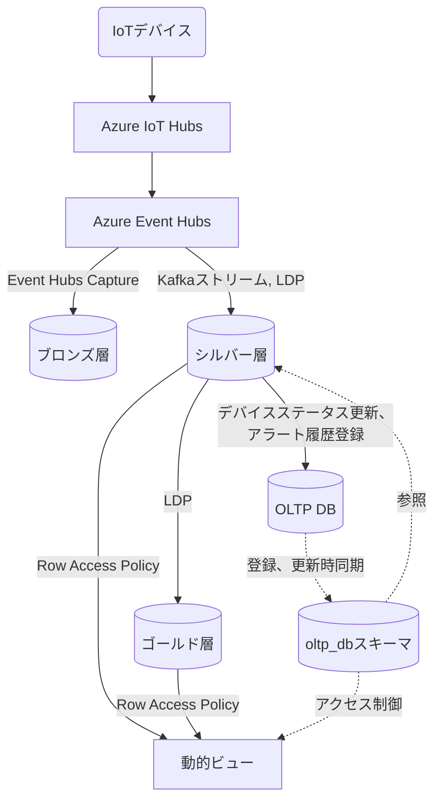

# Unity Catalog データベース設計書

## 目次

- [Unity Catalog データベース設計書](#unity-catalog-データベース設計書)
  - [目次](#目次)
  - [概要](#概要)
    - [データストア種別](#データストア種別)
    - [メダリオンアーキテクチャ](#メダリオンアーキテクチャ)
    - [設計方針](#設計方針)
  - [データフロー](#データフロー)
  - [カタログ・スキーマ構成](#カタログスキーマ構成)
  - [テーブル一覧](#テーブル一覧)
    - [ブロンズ層](#ブロンズ層)
    - [シルバー層](#シルバー層)
    - [ゴールド層](#ゴールド層)
    - [ビュー](#ビュー)
  - [テーブル定義](#テーブル定義)
    - [UnityCatalogのテーブルでの一意性識別](#unitycatalogのテーブルでの一意性識別)
    - [ブロンズ層](#ブロンズ層-1)
    - [シルバー層テーブル](#シルバー層テーブル)
      - [1. センサーデータ (silver\_sensor\_data)](#1-センサーデータ-silver_sensor_data)
      - [2. メール送信キュー (silver\_email\_notification\_queue)](#2-メール送信キュー-silver_email_notification_queue)
      - [3. アラート異常状態 (silver\_alert\_abnormal\_state)](#3-アラート異常状態-silver_alert_abnormal_state)
    - [ゴールド層テーブル](#ゴールド層テーブル)
      - [1. センサーデータ日次サマリ (gold\_sensor\_data\_daily\_summary)](#1-センサーデータ日次サマリ-gold_sensor_data_daily_summary)
      - [2. センサーデータ月次サマリ (gold\_sensor\_data\_monthly\_summary)](#2-センサーデータ月次サマリ-gold_sensor_data_monthly_summary)
      - [3. センサーデータ年次サマリ (gold\_sensor\_data\_yearly\_summary)](#3-センサーデータ年次サマリ-gold_sensor_data_yearly_summary)
    - [外部DBのマスタ類を同期するテーブル](#外部dbのマスタ類を同期するテーブル)
      - [1. デバイスマスタ（device\_master）](#1-デバイスマスタdevice_master)
      - [2. 組織マスタ（organization\_master）](#2-組織マスタorganization_master)
      - [3. 組織閉包テーブル（organization\_closure）](#3-組織閉包テーブルorganization_closure)
      - [4. ユーザマスタ（user\_master）](#4-ユーザマスタuser_master)
      - [各マスタ類の同期タイミング](#各マスタ類の同期タイミング)
  - [動的ビュー](#動的ビュー)
    - [動的ビュー一覧](#動的ビュー一覧)
      - [1. センサーデータビュー (sensor\_data\_view)](#1-センサーデータビュー-sensor_data_view)
    - [動的ビューに対するデータアクセス制御](#動的ビューに対するデータアクセス制御)
    - [行レベルセキュリティの実装](#行レベルセキュリティの実装)
      - [Row Access Policyの定義](#row-access-policyの定義)
      - [動作イメージ](#動作イメージ)
  - [データ保持ポリシー](#データ保持ポリシー)
    - [保持期間](#保持期間)
    - [データ削除方法](#データ削除方法)
    - [タイムトラベル設定](#タイムトラベル設定)
    - [シルバー層・ゴールド層の削除ジョブ例](#シルバー層ゴールド層の削除ジョブ例)
  - [クラスター設計](#クラスター設計)
  - [制約・ルール](#制約ルール)
    - [1. スキーマ制約](#1-スキーマ制約)
    - [2. 命名規則](#2-命名規則)
  - [OLTP DBとの連携](#oltp-dbとの連携)
  - [関連ドキュメント](#関連ドキュメント)
    - [要件定義](#要件定義)
    - [設計関連](#設計関連)

---

## 概要

本データベース設計書は、Databricks IoTシステムの分析用データストアであるUnity Catalog（Delta Lake）のテーブル設計を定義します。

### データストア種別

| 項目                     | 内容                                |
| ------------------------ | ----------------------------------- |
| **ストレージ**           | Azure Data Lake Storage (ADLS) Gen2 |
| **テーブルフォーマット** | Delta Lake                          |
| **メタデータ管理**       | Unity Catalog                       |
| **アクセス方式**         | SQL Warehouse経由                   |
| **接続ドライバー**       | databricks-sql-connector (Python)   |

### メダリオンアーキテクチャ

本システムでは、メダリオンアーキテクチャ（Bronze/Silver/Gold）を採用し、段階的にデータを変換・集計します。

| 層             | 役割                             | 処理主体                                           | データ保持期間 |
| -------------- | -------------------------------- | -------------------------------------------------- | -------------- |
| **ブロンズ層** | 生データをADLSに保存（Avro形式） | Event Hubs Capture                                 | 7日            |
| **シルバー層** | クレンジング、異常検出           | Kafkaストリーム、LDP（Lakeflow宣言型パイプライン） | 5年            |
| **ゴールド層** | 集計データ                       | LDP                                                | 10年           |

### 設計方針

1. **ACIDトランザクション**: Delta Lakeの機能を活用し、データの一貫性を保証
2. **スキーマ進化**: 将来のセンサー項目追加に対応可能な設計
3. **タイムトラベル**: 過去データの復旧・監査に対応
4. **リキッドクラスタリング**: 時系列クエリ、行フィルタリングの最適化
5. **エラーデータ処理**: 生データをLakeflow宣言型パイプラインによってシルバー層へ投入する際、パースエラーなどによってエラーが発生したデータは破棄するため、エラー発生データを登録するテーブルは設けない。

---

## データフロー




---

## カタログ・スキーマ構成

```
iot_catalog/                                        # Unity Catalogカタログ
├── bronze/                                         # 生データが格納されるADLS内のディレクトリ
│   └── YYYYMMDD/                                   # 生データは日付ごとに投入される
├── silver/                                         # シルバー層スキーマ
│   ├── silver_sensor_data                          # JSON形式にパースしたセンサーデータ
│   ├── silver_email_notification_queue                    # メール送信キューテーブル
│   └── silver_alert_abnormal_state                        # アラート異常状態テーブル
├── gold/                                           # ゴールド層スキーマ
│   ├── gold_sensor_data_daily_summary              # センサーデータ日次サマリ
│   ├── gold_sensor_data_monthly_summary            # センサーデータ月次サマリ
│   └── gold_sensor_data_yearly_summary             # センサーデータ年次サマリ
├── views/                                          # 動的ビュースキーマ
│   └── sensor_data_view                            # センサーデータビュー
└── oltp_db/                                        # 外部DBの内容を同期するスキーマ
    ├── device_master                               # デバイスマスタ
    ├── organization_master                         # 組織マスタ
    ├── organization_closure                        # 組織閉包テーブル
    └── user_master                                 # ユーザマスタ
```

---

## テーブル一覧

### ブロンズ層

ブロンズ層はADLS内にAvro形式の物理ファイルとして保存されるため、Unity Catalog上のテーブルは定義しない。

### シルバー層

| #   | テーブル物理名           | テーブル論理名   | 説明                                         |
| --- | ------------------------ | ---------------- | -------------------------------------------- |
| 1   | silver_sensor_data       | センサーデータ   | 構造化済みセンサーデータ                     |
| 2   | silver_email_notification_queue | メール送信キュー | アラート発生時のメール送信待ちキューテーブル |
| 3   | silver_alert_abnormal_state     | アラート異常状態 | デバイス×アラート設定ごとの異常継続状態管理  |

### ゴールド層

| #   | テーブル物理名                   | テーブル論理名           | 説明                                 |
| --- | -------------------------------- | ------------------------ | ------------------------------------ |
| 1   | gold_sensor_data_daily_summary   | センサーデータ日次サマリ | センサーデータを日次集計したテーブル |
| 2   | gold_sensor_data_monthly_summary | センサーデータ月次サマリ | センサーデータを月次集計したテーブル |
| 3   | gold_sensor_data_yearly_summary  | センサーデータ年次サマリ | センサーデータを年次集計したテーブル |

### ビュー

| #   | テーブル物理名   | テーブル論理名       | 説明                             |
| --- | ---------------- | -------------------- | -------------------------------- |
| 1   | sensor_data_view | センサーデータビュー | ダッシュボード表示用の動的ビュー |


---

## テーブル定義

### UnityCatalogのテーブルでの一意性識別

UnityCatalogは主キー、外部キーをサポートしていないため、以下の記載の「PK」は一意性識別キーを意味する。

### ブロンズ層

ブロンズ層では、生データを管理するためのUnityCatalog内のテーブルは用意せず、
生データはADLS内にAvro形式の物理ファイルとして保存する。
データ保持期間を超過したファイルについては、ADLSのライフサイクル機能を用いてAvro形式ファイルを物理削除する。

---

### シルバー層テーブル

#### 1. センサーデータ (silver_sensor_data)

**概要**: センサーデータを構造化したテーブル。

| #   | カラム物理名                     | カラム論理名             | データ型  | NULL     | PK  | FK  | 説明                                                                 |
| --- | -------------------------------- | ------------------------ | --------- | -------- | --- | --- | -------------------------------------------------------------------- |
| 1   | device_id                        | デバイスID               | INT       | NOT NULL | 〇  |     | システム内でのIoTデバイスの一意識別子                                |
| 2   | organization_id                  | 組織ID                   | INT       | NOT NULL | 〇  |     | 所属組織ID                                                           |
| 3   | event_timestamp                  | イベント発生日時         | TIMESTAMP | NOT NULL | 〇  |     | センサーがデータを取得した日時（ダッシュボード内グラフ横軸表示項目） |
| 4   | event_date                       | イベント発生日           | DATE      | NOT NULL |     |     | センサーがデータを取得した日（クラスタリングキー）                   |
| 5   | external_temp                    | 外気温度                 | DOUBLE    | NULL     |     |     | 冷蔵冷凍庫の外気温度[℃]（ダッシュボード内グラフ縦軸表示項目）        |
| 6   | set_temp_freezer_1               | 第1冷凍 設定温度         | DOUBLE    | NULL     |     |     | 第1冷凍庫の設定温度[℃]（ダッシュボード内グラフ縦軸表示項目）         |
| 7   | internal_sensor_temp_freezer_1   | 第1冷凍 庫内センサー温度 | DOUBLE    | NULL     |     |     | 第1冷凍庫の庫内センサー温度[℃]（ダッシュボード内グラフ縦軸表示項目） |
| 8   | internal_temp_freezer_1          | 第1冷凍 庫内温度         | DOUBLE    | NULL     |     |     | 第1冷凍庫の庫内温度[℃]（ダッシュボード内グラフ縦軸表示項目）         |
| 9   | df_temp_freezer_1                | 第1冷凍 DF温度           | DOUBLE    | NULL     |     |     | 第1冷凍庫のDF温度[℃]（ダッシュボード内グラフ縦軸表示項目）           |
| 10  | condensing_temp_freezer_1        | 第1冷凍 凝縮温度         | DOUBLE    | NULL     |     |     | 第1冷凍庫の凝縮温度[℃]（ダッシュボード内グラフ縦軸表示項目）         |
| 11  | adjusted_internal_temp_freezer_1 | 第1冷凍 微調整後庫内温度 | DOUBLE    | NULL     |     |     | 第1冷凍庫の微調整後庫内温度[℃]（ダッシュボード内グラフ縦軸表示項目） |
| 12  | set_temp_freezer_2               | 第2冷凍 設定温度         | DOUBLE    | NULL     |     |     | 第2冷凍庫の設定温度[℃]（ダッシュボード内グラフ縦軸表示項目）         |
| 13  | internal_sensor_temp_freezer_2   | 第2冷凍 庫内センサー温度 | DOUBLE    | NULL     |     |     | 第2冷凍庫の庫内センサー温度[℃]（ダッシュボード内グラフ縦軸表示項目） |
| 14  | internal_temp_freezer_2          | 第2冷凍 庫内温度         | DOUBLE    | NULL     |     |     | 第2冷凍庫の庫内温度[℃]（ダッシュボード内グラフ縦軸表示項目）         |
| 15  | df_temp_freezer_2                | 第2冷凍 DF温度           | DOUBLE    | NULL     |     |     | 第2冷凍庫のDF温度[℃]（ダッシュボード内グラフ縦軸表示項目）           |
| 16  | condensing_temp_freezer_2        | 第2冷凍 凝縮温度         | DOUBLE    | NULL     |     |     | 第2冷凍庫の凝縮温度[℃]（ダッシュボード内グラフ縦軸表示項目）         |
| 17  | adjusted_internal_temp_freezer_2 | 第2冷凍 微調整後庫内温度 | DOUBLE    | NULL     |     |     | 第2冷凍庫の微調整後庫内温度[℃]（ダッシュボード内グラフ縦軸表示項目） |
| 18  | compressor_freezer_1             | 第1冷凍 圧縮機           | DOUBLE    | NULL     |     |     | 第1冷凍庫の圧縮機の回転数[rpm]（ダッシュボード内グラフ縦軸表示項目） |
| 19  | compressor_freezer_2             | 第2冷凍 圧縮機           | DOUBLE    | NULL     |     |     | 第2冷凍庫の圧縮機の回転数[rpm]（ダッシュボード内グラフ縦軸表示項目） |
| 20  | fan_motor_1                      | 第1ファンモータ          | DOUBLE    | NULL     |     |     | 第1ファンモータの回転数[rpm]（ダッシュボード内グラフ縦軸表示項目）   |
| 21  | fan_motor_2                      | 第2ファンモータ          | DOUBLE    | NULL     |     |     | 第2ファンモータの回転数[rpm]（ダッシュボード内グラフ縦軸表示項目）   |
| 22  | fan_motor_3                      | 第3ファンモータ          | DOUBLE    | NULL     |     |     | 第3ファンモータの回転数[rpm]（ダッシュボード内グラフ縦軸表示項目）   |
| 23  | fan_motor_4                      | 第4ファンモータ          | DOUBLE    | NULL     |     |     | 第4ファンモータの回転数[rpm]（ダッシュボード内グラフ縦軸表示項目）   |
| 24  | fan_motor_5                      | 第5ファンモータ          | DOUBLE    | NULL     |     |     | 第5ファンモータの回転数[rpm]（ダッシュボード内グラフ縦軸表示項目）   |
| 25  | defrost_heater_output_1          | 防露ヒータ出力(1)        | DOUBLE    | NULL     |     |     | 防露ヒータ(1)の出力[％]（ダッシュボード内グラフ縦軸表示項目）        |
| 26  | defrost_heater_output_2          | 防露ヒータ出力(2)        | DOUBLE    | NULL     |     |     | 防露ヒータ(2)の出力[％]（ダッシュボード内グラフ縦軸表示項目）        |
| 27  | sensor_data_json                 | センサーデータ本体       | VARIANT   | NOT NULL |     |     | 構造化以前のJSON形式のセンサーデータ                                 |
| 28  | create_time                      | 作成日時                 | TIMESTAMP | NOT NULL |     |     | レコード作成日時                                                     |

**クラスタリングキー**: `event_date`, `device_id`

**テーブルプロパティ**:
```sql
CREATE TABLE IF NOT EXISTS iot_catalog.silver.silver_sensor_data (
    device_id INT NOT NULL, 
    organization_id INT NOT NULL, 
    event_timestamp TIMESTAMP NOT NULL,
    event_date DATE NOT NULL, 
    external_temp DOUBLE NULL,
    set_temp_freezer_1 DOUBLE NULL, 
    internal_sensor_temp_freezer_1 DOUBLE NULL, 
    internal_temp_freezer_1 DOUBLE NULL, 
    df_temp_freezer_1 DOUBLE NULL, 
    condensing_temp_freezer_1 DOUBLE NULL, 
    adjusted_internal_temp_freezer_1 DOUBLE NULL, 
    set_temp_freezer_2 DOUBLE NULL, 
    internal_sensor_temp_freezer_2 DOUBLE NULL, 
    internal_temp_freezer_2 DOUBLE NULL, 
    df_temp_freezer_2 DOUBLE NULL, 
    condensing_temp_freezer_2 DOUBLE NULL, 
    adjusted_internal_temp_freezer_2 DOUBLE NULL, 
    compressor_freezer_1 DOUBLE NULL,
    compressor_freezer_2 DOUBLE NULL,
    fan_motor_1 DOUBLE NULL,
    fan_motor_2 DOUBLE NULL,
    fan_motor_3 DOUBLE NULL,
    fan_motor_4 DOUBLE NULL,
    fan_motor_5 DOUBLE NULL,
    defrost_heater_output_1 DOUBLE NULL,
    defrost_heater_output_2 DOUBLE NULL,
    sensor_data_json VARIANT NOT NULL, 
    create_time TIMESTAMP NOT NULL 
)
USING DELTA
CLUSTER BY (event_date, device_id)
TBLPROPERTIES (
    'delta.autoOptimize.optimizeWrite' = 'true',
    'delta.autoOptimize.autoCompact' = 'true',
    'delta.logRetentionDuration' = 'interval 7 days',
    'delta.deletedFileRetentionDuration' = 'interval 7 days',
    'delta.tuneFileSizesForRewrites' = 'true'
);
```

**ビジネスルール**:
- device_id、organization_idはOLTPのdevice_masterから取得

---

#### 2. メール送信キュー (silver_email_notification_queue)

**概要**: アラート発生時にメール送信をキューイングするテーブル。Databricks Workflowのバッチジョブにより定期的に処理される。

| #   | カラム物理名      | カラム論理名         | データ型     | NULL     | PK  | FK  | 説明                                     |
| --- | ----------------- | -------------------- | ------------ | -------- | --- | --- | ---------------------------------------- |
| 1   | queue_id          | キューID             | BIGINT       | NOT NULL | 〇  |     | キューレコードの一意識別子（自動採番）   |
| 2   | device_id         | デバイスID           | INT          | NOT NULL |     |     | アラート発生元デバイスID                 |
| 3   | organization_id   | 組織ID               | INT          | NOT NULL |     |     | デバイス所属組織ID                       |
| 4   | alert_id          | アラートID           | INT          | NOT NULL |     |     | 発生したアラートの設定ID                 |
| 5   | recipient_email   | 送信先メールアドレス | VARCHAR(255) | NOT NULL |     |     | 通知送信先のメールアドレス               |
| 6   | subject           | 件名                 | VARCHAR(500) | NOT NULL |     |     | メール件名                               |
| 7   | body              | 本文                 | STRING       | NOT NULL |     |     | メール本文（HTML形式可）                 |
| 8   | alert_detail_json | アラート詳細JSON     | VARIANT      | NOT NULL |     |     | アラート詳細情報（測定項目、値、閾値等） |
| 9   | status            | ステータス           | VARCHAR(20)  | NOT NULL |     |     | PENDING/PROCESSING/SENT/FAILED           |
| 10  | retry_count       | リトライ回数         | INT          | NOT NULL |     |     | 送信リトライ回数（初期値0、最大3）       |
| 11  | error_message     | エラーメッセージ     | STRING       | NULL     |     |     | 送信失敗時のエラー内容                   |
| 12  | event_timestamp   | イベント発生日時     | TIMESTAMP    | NOT NULL |     |     | アラートが発生した日時                   |
| 13  | queued_time       | キュー登録日時       | TIMESTAMP    | NOT NULL |     |     | キューに登録された日時                   |
| 14  | processed_time    | 処理完了日時         | TIMESTAMP    | NULL     |     |     | メール送信処理が完了した日時             |
| 15  | create_time       | 作成日時             | TIMESTAMP    | NOT NULL |     |     | レコード作成日時                         |
| 16  | update_time       | 更新日時             | TIMESTAMP    | NOT NULL |     |     | レコード更新日時                         |

**クラスタリングキー**: `status`, `queued_time`

**テーブルプロパティ**:
```sql
CREATE TABLE IF NOT EXISTS iot_catalog.silver.silver_email_notification_queue (
    queue_id BIGINT GENERATED ALWAYS AS IDENTITY NOT NULL,
    device_id INT NOT NULL,
    organization_id INT NOT NULL,
    alert_id INT NOT NULL,
    alert_name VARCHAR(255) NOT NULL,
    alert_level_id INT NOT NULL,
    recipient_email VARCHAR(255) NOT NULL,
    subject VARCHAR(500) NOT NULL,
    body STRING NOT NULL,
    alert_detail_json VARIANT NOT NULL,
    status VARCHAR(20) NOT NULL DEFAULT 'PENDING',
    retry_count INT NOT NULL DEFAULT 0,
    error_message STRING NULL,
    event_timestamp TIMESTAMP NOT NULL,
    queued_time TIMESTAMP NOT NULL,
    processed_time TIMESTAMP NULL,
    create_time TIMESTAMP NOT NULL,
    update_time TIMESTAMP NOT NULL
)
USING DELTA
CLUSTER BY (status, queued_time)
TBLPROPERTIES (
    'delta.autoOptimize.optimizeWrite' = 'true',
    'delta.autoOptimize.autoCompact' = 'true',
    'delta.logRetentionDuration' = 'interval 7 days',
    'delta.deletedFileRetentionDuration' = 'interval 7 days',
    'delta.tuneFileSizesForRewrites' = 'true'
);
```

**ステータス遷移**:

| ステータス | 説明                                 |
| ---------- | ------------------------------------ |
| PENDING    | 送信待ち（初期状態）                 |
| PROCESSING | 送信処理中（バッチジョブが処理開始） |
| SENT       | 送信完了                             |
| FAILED     | 送信失敗（最大リトライ回数超過）     |

**バッチ処理仕様**:

| 項目             | 値                              | 説明                                    |
| ---------------- | ------------------------------- | --------------------------------------- |
| 実行間隔         | 1分                             | Databricks Workflowで定期実行           |
| 最大リトライ回数 | 3回                             | retry_countが3を超えたらFAILEDに遷移    |
| リトライ間隔     | 指数バックオフ（1秒、2秒、4秒） | リトライ時の待機時間                    |
| 処理単位         | 100件/バッチ                    | 1回の実行で処理する最大キュー数         |
| データ保持期間   | 30日                            | SENT/FAILEDステータスのレコード保持期間 |

**ビジネスルール**:
- LDPストリーミング処理でアラート検出時にPENDINGステータスでINSERT
- バッチジョブがPENDINGレコードを取得しPROCESSINGに更新後、メール送信
- 送信成功時はSENT、失敗時はretry_count増加、retry_countが3を超えた場合はFAILEDステータスに更新
- 30日経過したSENT/FAILEDレコードは定期削除ジョブで削除

---

#### 3. アラート異常状態 (silver_alert_abnormal_state)

**概要**: デバイス×アラート設定ごとの異常継続状態を管理するテーブル。アラート設定マスタの判定時間（judgment_time）を超えて異常値が継続した場合にアラートを発砲するための状態管理に使用する。

| #   | カラム物理名        | カラム論理名     | データ型  | NULL     | PK  | FK  | 説明                                             |
| --- | ------------------- | ---------------- | --------- | -------- | --- | --- | ------------------------------------------------ |
| 1   | device_id           | デバイスID       | INT       | NOT NULL | 〇  |     | 対象デバイスID                                   |
| 2   | alert_id            | アラートID       | INT       | NOT NULL | 〇  |     | アラート設定ID（alert_setting_master参照）       |
| 3   | is_abnormal         | 異常状態フラグ   | BOOLEAN   | NOT NULL |     |     | 現在異常状態か（TRUE:異常、FALSE:正常）          |
| 4   | abnormal_start_time | 異常開始時刻     | TIMESTAMP | NULL     |     |     | 異常が開始した時刻（正常時はNULL）               |
| 5   | last_event_time     | 最終イベント時刻 | TIMESTAMP | NOT NULL |     |     | 最後に評価したセンサーデータのイベント時刻       |
| 6   | last_sensor_value   | 最終センサー値   | DOUBLE    | NULL     |     |     | 最後に評価したセンサー値                         |
| 7   | alert_fired         | アラート発砲済   | BOOLEAN   | NOT NULL |     |     | 今回の異常期間でアラートを発砲済みか             |
| 8   | alert_fired_time    | アラート発砲時刻 | TIMESTAMP | NULL     |     |     | アラートを発砲した時刻（未発砲時はNULL）         |
| 9   | alert_history_id    | アラート履歴ID   | INT       | NULL     |     |     | OLTP DBのアラート履歴ID（復旧時更新用、未発砲時はNULL） |
| 10  | create_time         | 作成日時         | TIMESTAMP | NOT NULL |     |     | レコード作成日時                                 |
| 11  | update_time         | 更新日時         | TIMESTAMP | NOT NULL |     |     | レコード更新日時                                 |

**クラスタリングキー**: `device_id`, `alert_id`

**テーブルプロパティ**:
```sql
CREATE TABLE IF NOT EXISTS iot_catalog.silver.silver_alert_abnormal_state (
    device_id INT NOT NULL,
    alert_id INT NOT NULL,
    is_abnormal BOOLEAN NOT NULL DEFAULT FALSE,
    abnormal_start_time TIMESTAMP NULL,
    last_event_time TIMESTAMP NOT NULL,
    last_sensor_value DOUBLE NULL,
    alert_fired BOOLEAN NOT NULL DEFAULT FALSE,
    alert_fired_time TIMESTAMP NULL,
    alert_history_id INT NULL,
    create_time TIMESTAMP NOT NULL,
    update_time TIMESTAMP NOT NULL
)
USING DELTA
CLUSTER BY (device_id, alert_id)
TBLPROPERTIES (
    'delta.autoOptimize.optimizeWrite' = 'true',
    'delta.autoOptimize.autoCompact' = 'true',
    'delta.logRetentionDuration' = 'interval 7 days',
    'delta.deletedFileRetentionDuration' = 'interval 7 days',
    'delta.tuneFileSizesForRewrites' = 'true'
);
```

**状態遷移**:

| 状態         | is_abnormal | abnormal_start_time | alert_fired | 説明                           |
| ------------ | ----------- | ------------------- | ----------- | ------------------------------ |
| 正常         | FALSE       | NULL                | FALSE       | 閾値内、異常なし               |
| 異常開始     | TRUE        | 異常開始時刻        | FALSE       | 閾値超過開始、判定時間未経過   |
| アラート発砲 | TRUE        | 異常開始時刻        | TRUE        | 判定時間経過、アラート発砲済み |
| 復旧         | FALSE       | NULL                | FALSE       | 正常値に復旧、状態リセット     |

**ビジネスルール**:
- デバイスID×アラートIDの組み合わせで一意にレコードを管理
- 閾値超過時に異常状態でなければ、異常開始時刻を記録
- 異常継続時間が判定時間（judgment_time）を超過した時点でアラートを発砲
- アラート発砲時にOLTP DBのアラート履歴にレコードを登録し、そのalert_history_idを保持
- 一度アラートを発砲したら、復旧するまで再発砲しない（alert_fired=TRUE）
- 正常値に復旧したら、alert_history_idを使用してOLTP DBのアラート履歴に復旧日時を更新
- 復旧処理完了後、全ての状態をリセット（alert_history_id含む）

---

### ゴールド層テーブル

以下テーブル内で記載のある集約対象項目（summary_item）、集約方法（summary_method）は、ゴールド層テーブルを利用する要件が発生した場合に追加で定義する。

#### 1. センサーデータ日次サマリ (gold_sensor_data_daily_summary)

**概要**: センサーデータを日次で集計したテーブル

| #   | カラム物理名    | カラム論理名 | データ型  | NULL     | PK  | FK  | 説明                                  |
| --- | --------------- | ------------ | --------- | -------- | --- | --- | ------------------------------------- |
| 1   | device_id       | デバイスID   | INT       | NOT NULL | 〇  |     | システム内でのIoTデバイスの一意識別子 |
| 2   | organization_id | 組織ID       | INT       | NOT NULL | 〇  |     | 所属組織ID                            |
| 3   | collection_date | 集約日       | DATE      | NOT NULL | 〇  |     | センサーデータを集約した日時          |
| 4   | summary_item    | 集約対象項目 | INT       | NOT NULL | 〇  |     | 集約対象の項目                        |
| 5   | summary_method  | 集約方法     | INT       | NOT NULL |     |     | 集約方法（平均、分散など）            |
| 6   | summary_value   | 集約値       | DOUBLE    | NOT NULL |     |     | 集約結果                              |
| 7   | data_count      | データ数     | INT       | NOT NULL |     |     | 集約したデータ数                      |
| 8   | create_time     | 作成日時     | TIMESTAMP | NOT NULL |     |     | レコード作成日時                      |

**クラスタリングキー**: `collection_date`, `device_id`

**テーブルプロパティ**:
```sql
CREATE TABLE IF NOT EXISTS iot_catalog.gold.gold_sensor_data_daily_summary (
    device_id INT NOT NULL, 
    organization_id INT NOT NULL, 
    collection_date DATE NOT NULL, 
    summary_item INT NOT NULL,
    summary_method INT NOT NULL, 
    summary_value DOUBLE NOT NULL, 
    data_count INT NOT NULL, 
    create_time TIMESTAMP NOT NULL 
)
USING DELTA
CLUSTER BY (collection_date, device_id)
TBLPROPERTIES (
    'delta.autoOptimize.optimizeWrite' = 'true',
    'delta.autoOptimize.autoCompact' = 'true',
    'delta.logRetentionDuration' = 'interval 7 days',
    'delta.deletedFileRetentionDuration' = 'interval 7 days',
    'delta.tuneFileSizesForRewrites' = 'true'
);
```

#### 2. センサーデータ月次サマリ (gold_sensor_data_monthly_summary)

**概要**: センサーデータを月次で集計したテーブル

| #   | カラム物理名          | カラム論理名 | データ型   | NULL     | PK  | FK  | 説明                                    |
| --- | --------------------- | ------------ | ---------- | -------- | --- | --- | --------------------------------------- |
| 1   | device_id             | デバイスID   | INT        | NOT NULL | 〇  |     | システム内でのIoTデバイスの一意識別子   |
| 2   | organization_id       | 組織ID       | INT        | NOT NULL | 〇  |     | 所属組織ID                              |
| 3   | collection_year_month | 集約年月     | VARCHAR(7) | NOT NULL | 〇  |     | センサーデータを集約した年月（YYYY/MM） |
| 4   | summary_item          | 集約対象項目 | INT        | NOT NULL | 〇  |     | 集約対象の項目                          |
| 5   | summary_method        | 集約方法     | INT        | NOT NULL |     |     | 集約方法（平均、分散など）              |
| 6   | summary_value         | 集約値       | DOUBLE     | NOT NULL |     |     | 集約結果                                |
| 7   | data_count            | データ数     | INT        | NOT NULL |     |     | 集約したデータ数                        |
| 8   | create_time           | 作成日時     | TIMESTAMP  | NOT NULL |     |     | レコード作成日時                        |

**クラスタリングキー**: `collection_year_month`, `device_id`

**テーブルプロパティ**:
```sql
CREATE TABLE IF NOT EXISTS iot_catalog.gold.gold_sensor_data_monthly_summary (
    device_id INT NOT NULL, 
    organization_id INT NOT NULL, 
    collection_year_month VARCHAR(7) NOT NULL, 
    summary_item INT NOT NULL,
    summary_method INT NOT NULL, 
    summary_value DOUBLE NOT NULL, 
    data_count INT NOT NULL, 
    create_time TIMESTAMP NOT NULL 
)
USING DELTA
CLUSTER BY (collection_year_month, device_id)
TBLPROPERTIES (
    'delta.autoOptimize.optimizeWrite' = 'true',
    'delta.autoOptimize.autoCompact' = 'true',
    'delta.logRetentionDuration' = 'interval 7 days',
    'delta.deletedFileRetentionDuration' = 'interval 7 days',
    'delta.tuneFileSizesForRewrites' = 'true'
);
```

#### 3. センサーデータ年次サマリ (gold_sensor_data_yearly_summary)

**概要**: センサーデータを年次で集計したテーブル

| #   | カラム物理名    | カラム論理名 | データ型  | NULL     | PK  | FK  | 説明                                  |
| --- | --------------- | ------------ | --------- | -------- | --- | --- | ------------------------------------- |
| 1   | device_id       | デバイスID   | INT       | NOT NULL | 〇  |     | システム内でのIoTデバイスの一意識別子 |
| 2   | organization_id | 組織ID       | INT       | NOT NULL | 〇  |     | 所属組織ID                            |
| 3   | collection_year | 集約年       | INT       | NOT NULL | 〇  |     | センサーデータを集約した年（YYYY）    |
| 4   | summary_item    | 集約対象項目 | INT       | NOT NULL | 〇  |     | 集約対象の項目                        |
| 5   | summary_method  | 集約方法     | INT       | NOT NULL |     |     | 集約方法（平均、分散など）            |
| 6   | summary_value   | 集約値       | DOUBLE    | NOT NULL |     |     | 集約結果                              |
| 7   | data_count      | データ数     | INT       | NOT NULL |     |     | 集約したデータ数                      |
| 8   | create_time     | 作成日時     | TIMESTAMP | NOT NULL |     |     | レコード作成日時                      |

**クラスタリングキー**: `collection_year`, `device_id`

**テーブルプロパティ**:
```sql
CREATE TABLE IF NOT EXISTS iot_catalog.gold.gold_sensor_data_yearly_summary (
    device_id INT NOT NULL, 
    organization_id INT NOT NULL, 
    collection_year INT NOT NULL, 
    summary_item INT NOT NULL,
    summary_method INT NOT NULL, 
    summary_value DOUBLE NOT NULL, 
    data_count INT NOT NULL, 
    create_time TIMESTAMP NOT NULL 
)
USING DELTA
CLUSTER BY (collection_year, device_id)
TBLPROPERTIES (
    'delta.autoOptimize.optimizeWrite' = 'true',
    'delta.autoOptimize.autoCompact' = 'true',
    'delta.logRetentionDuration' = 'interval 7 days',
    'delta.deletedFileRetentionDuration' = 'interval 7 days',
    'delta.tuneFileSizesForRewrites' = 'true'
);
```

---

### 外部DBのマスタ類を同期するテーブル
#### 1. デバイスマスタ（device_master）

アプリケーションデータベース設計書のデバイスマスタ（device_master）の章を参照。

#### 2. 組織マスタ（organization_master）

アプリケーションデータベース設計書の組織マスタ（organization_master）の章を参照。

#### 3. 組織閉包テーブル（organization_closure）

アプリケーションデータベース設計書の組織閉包テーブル（organization_closure）の章を参照。

#### 4. ユーザマスタ（user_master）

アプリケーションデータベース設計書のユーザマスタ（user_master）の章を参照。

#### 各マスタ類の同期タイミング

OLTP DBへの登録、更新、削除時、同時にUnityCatalog上のマスタ類への登録、更新、削除を実施する

---

## 動的ビュー

### 動的ビュー一覧

#### 1. センサーデータビュー (sensor_data_view)

```sql
CREATE OR REPLACE VIEW iot_catalog.views.sensor_data_view AS
SELECT
    device_id
    , organization_id
    , event_timestamp 
    , event_date
    , external_temp
    , set_temp_freezer_1
    , internal_sensor_temp_freezer_1
    , internal_temp_freezer_1
    , df_temp_freezer_1
    , condensing_temp_freezer_1 
    , adjusted_internal_temp_freezer_1
    , set_temp_freezer_2
    , internal_sensor_temp_freezer_2
    , internal_temp_freezer_2
    , df_temp_freezer_2
    , condensing_temp_freezer_2
    , adjusted_internal_temp_freezer_2
    , compressor_freezer_1
    , compressor_freezer_2
    , fan_motor_1
    , fan_motor_2
    , fan_motor_3
    , fan_motor_4
    , fan_motor_5
    , defrost_heater_output_1
    , defrost_heater_output_2
FROM iot_catalog.silver.silver_sensor_data sl
;
```
**シルバー層のセンサーデータテーブルからの除外カラム**:
- `sensor_data_json`: 構造化済みカラムで十分なため除外
- `create_time`: ダッシュボード表示に不要なため除外


### 動的ビューに対するデータアクセス制御

本動的ビューのデータに対して、APIを用いて表示対象のデータに紐づく組織IDを渡し、その組織IDを用いて動的ビューを検索する。

### 行レベルセキュリティの実装

#### Row Access Policyの定義

```sql
-- Unity Catalogでアクセス制御関数を作成
CREATE FUNCTION iot_catalog.security.user_accessible_orgs()
RETURNS ARRAY<INT>
RETURN (
    SELECT COLLECT_LIST(oc.subsidiary_organization_id)
    FROM iot_catalog.oltp_db.organization_closure oc
    INNER JOIN iot_catalog.oltp_db.user_master um
        ON oc.parent_organization_id = um.organization_id
    WHERE um.email = current_user()  -- Databricksログインユーザー
);

-- Row Access Policyの作成
CREATE ROW ACCESS POLICY iot_catalog.security.organization_filter
AS (organization_id INT)
RETURNS BOOLEAN
RETURN (
    -- システム管理者は全データアクセス可能
    is_account_group_member('system_admins')
    OR
    -- 一般ユーザーは配下組織のみ
    ARRAY_CONTAINS(iot_catalog.security.user_accessible_orgs(), organization_id)
);

-- VIEWにRow Access Policyを適用
ALTER VIEW iot_catalog.views.sensor_data_view
SET ROW FILTER iot_catalog.security.organization_filter ON (organization_id);
```

#### 動作イメージ

```sql
-- ユーザーが以下のクエリを実行する
SELECT * FROM iot_catalog.views.sensor_data_view;

-- 自動的にこのように変換される
SELECT *
FROM iot_catalog.views.sensor_data_view
WHERE ARRAY_CONTAINS(
    (SELECT COLLECT_LIST(oc.subsidiary_organization_id)
     FROM iot_catalog.oltp_db.organization_closure oc
     INNER JOIN iot_catalog.oltp_db.user_master um
         ON oc.parent_organization_id = um.organization_id
     WHERE um.email = current_user()),
    organization_id
);
```

---

## データ保持ポリシー

### 保持期間

| 層         | 保持期間 |
| ---------- | -------- |
| ブロンズ層 | 7日      |
| シルバー層 | 5年      |
| ゴールド層 | 10年     |

### データ削除方法

| 層         | 削除方法           | 理由                                           |
| ---------- | ------------------ | ---------------------------------------------- |
| ブロンズ層 | ADLSライフサイクル | Unity Catalog管理外のAvroファイルのため        |
| シルバー層 | DELETE + VACUUM    | Delta Lakeトランザクション整合性を維持するため |
| ゴールド層 | DELETE + VACUUM    | Delta Lakeトランザクション整合性を維持するため |

**注意**: シルバー層・ゴールド層に対してADLSライフサイクルを使用すると、
Delta Logとの不整合が発生しクエリエラーの原因となる。

### タイムトラベル設定

各層でタイムトラベル（バージョニング）の保持期間を設定します。

- logRetentionDurationプロパティ：トランザクションログを保持する期間。履歴情報の保持期間
- deletedFileRetentionDurationプロパティ：VACUUMによって削除済みParquetファイルが削除可能になるまでの期間。

| 層         | logRetentionDuration | deletedFileRetentionDuration |
| ---------- | -------------------- | ---------------------------- |
| シルバー層 | 7日                  | 7日                          |
| ゴールド層 | 7日                  | 7日                          |

### シルバー層・ゴールド層の削除ジョブ例

```sql
-- 月次バッチジョブで実行（5年超過データの削除）
DELETE FROM iot_catalog.silver.silver_sensor_data
WHERE event_timestamp < DATEADD(YEAR, -5, CURRENT_DATE());

-- VACUUM実行（削除から7日経過後(テーブルをCREATE時に指定)に物理削除可能）
VACUUM iot_catalog.silver.silver_sensor_data;
```


---

## クラスター設計

| テーブル                         | クラスタリングキー                   | 目的                                |
| -------------------------------- | ------------------------------------ | ----------------------------------- |
| silver_sensor_data               | `DATE(event_timestamp)`, `device_id` | 時系列クエリの最適化                |
| silver_email_notification_queue         | `status`, `queued_time`              | ステータス別キュー取得の最適化      |
| silver_alert_abnormal_state             | `device_id`, `alert_id`              | デバイス×アラート別状態取得の最適化 |
| gold_sensor_data_daily_summary   | `collection_date`, `device_id`       | 集計単位でのアクセス最適化          |
| gold_sensor_data_monthly_summary | `collection_year_month`, `device_id` | 集計単位でのアクセス最適化          |
| gold_sensor_data_yearly_summary  | `collection_year`, `device_id`       | 集計単位でのアクセス最適化          |

---

## 制約・ルール

### 1. スキーマ制約

- **NOT NULL制約**: クラスタリングキー、主要検索カラムに適用
- **データ型制約**: Delta Lakeのスキーマエンフォースメントで自動適用

### 2. 命名規則

| 層         | プレフィックス/サフィックス | 例                       |
| ---------- | --------------------------- | ------------------------ |
| ブロンズ層 | `bronze_*`                  | `bronze_raw_sensor_data` |
| シルバー層 | `silver_*`                  | `silver_sensor_data`     |
| ゴールド層 | `gold_*`                    | `gold_sensor_data`       |
| 動的ビュー | `*_view`                    | `sensor_data_view`       |


---

## OLTP DBとの連携

Unity CatalogはOLTP DB（MySQL互換）と連携して動作します。

| データ種別       | 保存先        | 連携方法                                                                                                                                       |
| ---------------- | ------------- | ---------------------------------------------------------------------------------------------------------------------------------------------- |
| 組織マスタ       | OLTP DB       | OLTP DBの組織マスタへの登録、更新時、同時にUnity Catalogの組織マスタに対しても同様の処理を実施、組織の存在チェックで使用                       |
| デバイスマスタ   | OLTP DB       | OLTP DBのデバイスマスタへの登録、更新時、同時にUnity Catalogのデバイスマスタに対しても同様の処理を実施、デバイスID、組織IDの引き当てで使用     |
| 組織閉包テーブル | OLTP DB       | OLTP DBの組織閉包テーブルへの登録、更新時、同時にUnity Catalogの組織閉包テーブルに対しても同様の処理を実施、センサーデータのアクセス制御に使用 |
| ユーザマスタ     | OLTP DB       | OLTP DBのユーザマスタへの登録、更新時、同時にUnity Catalogのユーザマスタに対しても同様の処理を実施、ユーザの所属組織の特定に利用               |
| センサーデータ   | Unity Catalog | 本設計書のテーブル                                                                                                                             |

---

## 関連ドキュメント

### 要件定義

- [機能要件定義書](../../02-requirements/functional-requirements.md) - FR-002, FR-003, FR-005, FR-006
- [非機能要件定義書](../../02-requirements/non-functional-requirements.md) - データ保持期間、パフォーマンス要件
- [技術要件定義書](../../02-requirements/technical-requirements.md) - TR-DB-002, TR-SEC-005

### 設計関連

- [アプリケーションデータベース設計書](./app-database-specification.md) - OLTP DB設計
- [共通仕様書](./common-specification.md) - セキュリティ、エラーコード
- [バックエンド設計](../../01-architecture/backend.md) - Flask/LDP設計

---

| 版数 | 日付       | 更新者       | 更新内容                                         |
| ---- | ---------- | ------------ | ------------------------------------------------ |
| 1.0  | 2026-01-13 | Kei Sugiyama | 初版作成                                         |
| 1.1  | 2026-01-14 | Kei Sugiyama | Row Access Policy追加、型変更対応                |
| 1.2  | 2026-01-16 | Kei Sugiyama | レビュー指摘事項反映                             |
| 1.3  | 2026-01-22 | Kei Sugiyama | メール送信キューテーブル追加                     |
| 1.4  | 2026-01-23 | Kei Sugiyama | アラート異常状態テーブル追加（継続時間判定対応） |

**このデータベース設計書は、実装前に必ずレビューを受けてください。**
