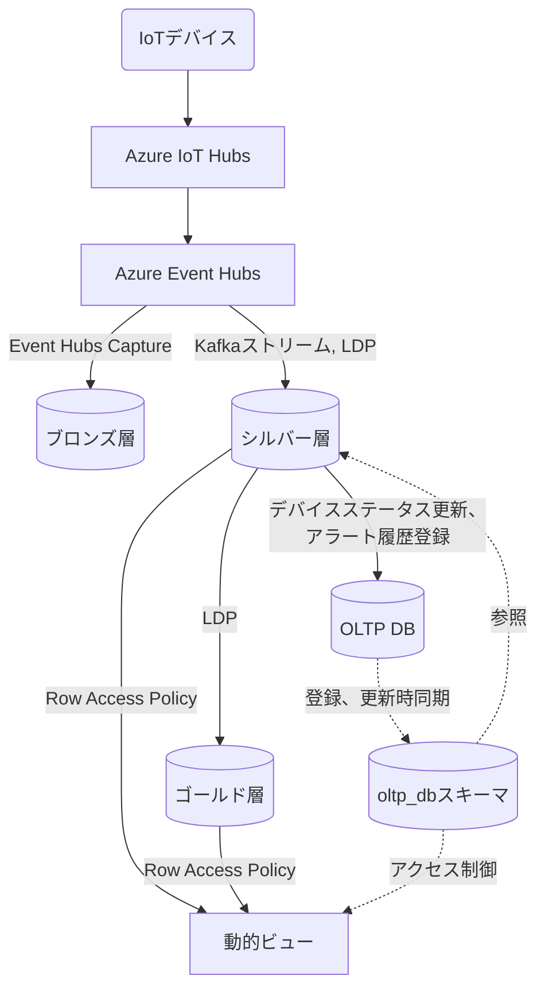

# Unity Catalog データベース設計書

## 目次

- [Unity Catalog データベース設計書](#unity-catalog-データベース設計書)
  - [目次](#目次)
  - [概要](#概要)
    - [データストア種別](#データストア種別)
    - [メダリオンアーキテクチャ](#メダリオンアーキテクチャ)
    - [設計方針](#設計方針)
  - [データフロー](#データフロー)
  - [カタログ・スキーマ構成](#カタログスキーマ構成)
  - [テーブル一覧](#テーブル一覧)
    - [ブロンズ層](#ブロンズ層)
    - [シルバー層](#シルバー層)
    - [ゴールド層](#ゴールド層)
    - [ビュー](#ビュー)
    - [AIチャット用スキーマ](#aiチャット用スキーマ)
  - [テーブル定義](#テーブル定義)
    - [UnityCatalogのテーブルでの一意性識別](#unitycatalogのテーブルでの一意性識別)
    - [ブロンズ層](#ブロンズ層-1)
    - [シルバー層テーブル](#シルバー層テーブル)
      - [1. センサーデータ (silver\_sensor\_data)](#1-センサーデータ-silver_sensor_data)
    - [ゴールド層テーブル](#ゴールド層テーブル)
      - [1. センサーデータ時次サマリ (gold\_sensor\_data\_hourly\_summary)](#1-センサーデータ時次サマリ-gold_sensor_data_hourly_summary)
      - [2. センサーデータ日次サマリ (gold\_sensor\_data\_daily\_summary)](#2-センサーデータ日次サマリ-gold_sensor_data_daily_summary)
      - [3. センサーデータ月次サマリ (gold\_sensor\_data\_monthly\_summary)](#3-センサーデータ月次サマリ-gold_sensor_data_monthly_summary)
      - [4. センサーデータ年次サマリ (gold\_sensor\_data\_yearly\_summary)](#4-センサーデータ年次サマリ-gold_sensor_data_yearly_summary)
      - [5. サマリー計算手法マスタ（gold\_summary\_method\_master）](#5-サマリー計算手法マスタgold_summary_method_master)
    - [外部DBのマスタ類を同期するテーブル](#外部dbのマスタ類を同期するテーブル)
      - [1. デバイスマスタ（device\_master）](#1-デバイスマスタdevice_master)
      - [2. 組織マスタ（organization\_master）](#2-組織マスタorganization_master)
      - [3. 組織閉包テーブル（organization\_closure）](#3-組織閉包テーブルorganization_closure)
      - [4. ユーザマスタ（user\_master）](#4-ユーザマスタuser_master)
      - [各マスタ類の同期タイミング](#各マスタ類の同期タイミング)
    - [AIチャット用スキーマ](#aiチャット用スキーマ-1)
      - [1. チェックポイントテーブル（check\_point\_data）](#1-チェックポイントテーブルcheck_point_data)
  - [動的ビュー](#動的ビュー)
    - [動的ビュー一覧](#動的ビュー一覧)
      - [1. センサーデータビュー (sensor\_data\_view)](#1-センサーデータビュー-sensor_data_view)
      - [2. 時次サマリビュー（hourly\_summary\_view）](#2-時次サマリビューhourly_summary_view)
      - [3. 日次サマリビュー（daily\_summary\_view）](#3-日次サマリビューdaily_summary_view)
      - [4. 月次サマリビュー（monthly\_summary\_view）](#4-月次サマリビューmonthly_summary_view)
      - [5. 年次サマリビュー（yearly\_summary\_view）](#5-年次サマリビューyearly_summary_view)
    - [行レベルセキュリティの実装](#行レベルセキュリティの実装)
      - [Row Access Policyの定義](#row-access-policyの定義)
      - [動作イメージ](#動作イメージ)
  - [データ保持ポリシー](#データ保持ポリシー)
    - [保持期間](#保持期間)
    - [データ削除方法](#データ削除方法)
    - [タイムトラベル設定](#タイムトラベル設定)
    - [シルバー層・ゴールド層の削除ジョブ例](#シルバー層ゴールド層の削除ジョブ例)
    - [チェックポイントテーブルの削除ジョブ例](#チェックポイントテーブルの削除ジョブ例)
  - [クラスター設計](#クラスター設計)
  - [制約・ルール](#制約ルール)
    - [1. スキーマ制約](#1-スキーマ制約)
    - [2. 命名規則](#2-命名規則)
  - [OLTP DBとの連携](#oltp-dbとの連携)
  - [関連ドキュメント](#関連ドキュメント)
    - [要件定義](#要件定義)
    - [設計関連](#設計関連)

---

## 概要

本データベース設計書は、Databricks IoTシステムの分析用データストアであるUnity Catalog（Delta Lake）のテーブル設計を定義します。

### データストア種別

| 項目                     | 内容                                |
| ------------------------ | ----------------------------------- |
| **ストレージ**           | Azure Data Lake Storage (ADLS) Gen2 |
| **テーブルフォーマット** | Delta Lake                          |
| **メタデータ管理**       | Unity Catalog                       |
| **アクセス方式**         | SQL Warehouse経由                   |
| **接続ドライバー**       | databricks-sql-connector (Python)   |

### メダリオンアーキテクチャ

本システムでは、メダリオンアーキテクチャ（Bronze/Silver/Gold）を採用し、段階的にデータを変換・集計します。

| 層             | 役割                             | 処理主体                                           | データ保持期間 |
| -------------- | -------------------------------- | -------------------------------------------------- | -------------- |
| **ブロンズ層** | 生データをADLSに保存（Avro形式） | Event Hubs Capture                                 | 7日            |
| **シルバー層** | クレンジング、異常検出           | Kafkaストリーム、LDP（Lakeflow宣言型パイプライン） | 5年            |
| **ゴールド層** | 集計データ                       | LDP                                                | 10年           |

### 設計方針

1. **ACIDトランザクション**: Delta Lakeの機能を活用し、データの一貫性を保証
2. **スキーマ進化**: 将来のセンサー項目追加に対応可能な設計
3. **タイムトラベル**: 過去データの復旧・監査に対応
4. **リキッドクラスタリング**: 時系列クエリ、行フィルタリングの最適化
5. **エラーデータ処理**: 生データをLakeflow宣言型パイプラインによってシルバー層へ投入する際、パースエラーなどによってエラーが発生したデータは破棄するため、エラー発生データを登録するテーブルは設けない。

---

## データフロー



---

## カタログ・スキーマ構成

```text
iot_catalog/                                        # Unity Catalogカタログ
│
├── bronze/                                         # 生データが格納されるADLS内のディレクトリ
│   └── YYYYMMDD/                                   # 生データは日付ごとに投入される
│
├── silver/                                         # シルバー層スキーマ
│   └── silver_sensor_data                          # JSON形式にパースしたセンサーデータ
│
├── gold/                                           # ゴールド層スキーマ
│   ├── gold_sensor_data_hourly_summary             # センサーデータ時次サマリ
│   ├── gold_sensor_data_daily_summary              # センサーデータ日次サマリ
│   ├── gold_sensor_data_monthly_summary            # センサーデータ月次サマリ
│   ├── gold_sensor_data_yearly_summary             # センサーデータ年次サマリ
│   └── gold_summary_method_master                  # サマリ作成時の算術マスタ
│
├── views/                                          # 動的ビュースキーマ
│   ├── sensor_data_view                            # センサーデータビュー
│   ├── daily_summary_view                          # 日次サマリビュー
│   ├── monthly_summary_view                        # 月次サマリビュー
│   └── yearly_summary_view                         # 年次サマリビュー
│
├── ai_chat/                                        # LangGraph Checkpointer用スキーマ
│   └── check_point_data                            # チェックポイントテーブル
│
├── security/                                       # LangGraph Checkpointer用スキーマ
│   ├── user_accessible_orgs()                      # ユーザ定義関数: ユーザアクセス可能組織一覧
│   └── organization_filter                         # Row Access Policy
│
└── oltp_db/                                        # 外部DBの内容を同期するスキーマ
    ├── device_master                               # デバイスマスタ
    ├── organization_master                         # 組織マスタ
    ├── organization_closure                        # 組織閉包テーブル
    └── user_master                                 # ユーザマスタ
```

---

## テーブル一覧

### ブロンズ層

ブロンズ層はADLS内にAvro形式の物理ファイルとして保存されるため、Unity Catalog上のテーブルは定義しない。

### シルバー層

| #   | テーブル物理名     | テーブル論理名 | 説明                     |
| --- | ------------------ | -------------- | ------------------------ |
| 1   | silver_sensor_data | センサーデータ | 構造化済みセンサーデータ |

**注記**: メール送信キュー（email_notification_queue）とアラート異常状態（alert_abnormal_state）は、OLTPレスポンス要件のためOLTP DB（MySQL）に配置されています。詳細はアプリケーションデータベース設計書を参照してください。

### ゴールド層

| #   | テーブル物理名                   | テーブル論理名           | 説明                                 |
| --- | -------------------------------- | ------------------------ | ------------------------------------ |
| 1   | gold_sensor_data_hourly_summary  | センサーデータ時次サマリ | センサーデータを時次集計したテーブル |
| 2   | gold_sensor_data_daily_summary   | センサーデータ日次サマリ | センサーデータを日次集計したテーブル |
| 3   | gold_sensor_data_monthly_summary | センサーデータ月次サマリ | センサーデータを月次集計したテーブル |
| 4   | gold_sensor_data_yearly_summary  | センサーデータ年次サマリ | センサーデータを年次集計したテーブル |

### ビュー

| #   | テーブル物理名       | テーブル論理名       | 説明                             |
| --- | -------------------- | -------------------- | -------------------------------- |
| 1   | sensor_data_view     | センサーデータビュー | ダッシュボード表示用の動的ビュー |
| 2   | daily_summary_view   | 日次サマリビュー     | 日次集計データ参照用             |
| 3   | monthly_summary_view | 月次サマリビュー     | 月次集計データ参照用             |
| 4   | yearly_summary_view  | 年次サマリビュー     | 年次集計データ参照用             |

### AIチャット用スキーマ

| #   | テーブル物理名   | テーブル論理名           | 説明                            |
| --- | ---------------- | ------------------------ | ------------------------------- |
| 1   | check_point_data | チェックポイントテーブル | LangGraph会話状態永続化テーブル |

---

## テーブル定義

### UnityCatalogのテーブルでの一意性識別

UnityCatalogは主キー、外部キーをサポートしていないため、以下の記載の「PK」は一意性識別キーを意味する。

### ブロンズ層

ブロンズ層では、生データを管理するためのUnityCatalog内のテーブルは用意せず、
生データはADLS内にAvro形式の物理ファイルとして保存する。
データ保持期間を超過したファイルについては、ADLSのライフサイクル機能を用いてAvro形式ファイルを物理削除する。

---

### シルバー層テーブル

#### 1. センサーデータ (silver_sensor_data)

**概要**: センサーデータを構造化したテーブル。

| #   | カラム物理名                     | カラム論理名             | データ型  | NULL     | PK  | FK  | 説明                                                                 |
| --- | -------------------------------- | ------------------------ | --------- | -------- | --- | --- | -------------------------------------------------------------------- |
| 1   | device_id                        | デバイスID               | INT       | NOT NULL | 〇  |     | システム内でのIoTデバイスの一意識別子                                |
| 2   | organization_id                  | 組織ID                   | INT       | NOT NULL | 〇  |     | 所属組織ID                                                           |
| 3   | event_timestamp                  | イベント発生日時         | TIMESTAMP | NOT NULL | 〇  |     | センサーがデータを取得した日時（ダッシュボード内グラフ横軸表示項目） |
| 4   | event_date                       | イベント発生日           | DATE      | NOT NULL |     |     | センサーがデータを取得した日（クラスタリングキー）                   |
| 5   | external_temp                    | 外気温度                 | DOUBLE    | NULL     |     |     | 冷蔵冷凍庫の外気温度[℃]（ダッシュボード内グラフ縦軸表示項目）        |
| 6   | set_temp_freezer_1               | 第1冷凍 設定温度         | DOUBLE    | NULL     |     |     | 第1冷凍庫の設定温度[℃]（ダッシュボード内グラフ縦軸表示項目）         |
| 7   | internal_sensor_temp_freezer_1   | 第1冷凍 庫内センサー温度 | DOUBLE    | NULL     |     |     | 第1冷凍庫の庫内センサー温度[℃]（ダッシュボード内グラフ縦軸表示項目） |
| 8   | internal_temp_freezer_1          | 第1冷凍 庫内温度         | DOUBLE    | NULL     |     |     | 第1冷凍庫の庫内温度[℃]（ダッシュボード内グラフ縦軸表示項目）         |
| 9   | df_temp_freezer_1                | 第1冷凍 DF温度           | DOUBLE    | NULL     |     |     | 第1冷凍庫のDF温度[℃]（ダッシュボード内グラフ縦軸表示項目）           |
| 10  | condensing_temp_freezer_1        | 第1冷凍 凝縮温度         | DOUBLE    | NULL     |     |     | 第1冷凍庫の凝縮温度[℃]（ダッシュボード内グラフ縦軸表示項目）         |
| 11  | adjusted_internal_temp_freezer_1 | 第1冷凍 微調整後庫内温度 | DOUBLE    | NULL     |     |     | 第1冷凍庫の微調整後庫内温度[℃]（ダッシュボード内グラフ縦軸表示項目） |
| 12  | set_temp_freezer_2               | 第2冷凍 設定温度         | DOUBLE    | NULL     |     |     | 第2冷凍庫の設定温度[℃]（ダッシュボード内グラフ縦軸表示項目）         |
| 13  | internal_sensor_temp_freezer_2   | 第2冷凍 庫内センサー温度 | DOUBLE    | NULL     |     |     | 第2冷凍庫の庫内センサー温度[℃]（ダッシュボード内グラフ縦軸表示項目） |
| 14  | internal_temp_freezer_2          | 第2冷凍 庫内温度         | DOUBLE    | NULL     |     |     | 第2冷凍庫の庫内温度[℃]（ダッシュボード内グラフ縦軸表示項目）         |
| 15  | df_temp_freezer_2                | 第2冷凍 DF温度           | DOUBLE    | NULL     |     |     | 第2冷凍庫のDF温度[℃]（ダッシュボード内グラフ縦軸表示項目）           |
| 16  | condensing_temp_freezer_2        | 第2冷凍 凝縮温度         | DOUBLE    | NULL     |     |     | 第2冷凍庫の凝縮温度[℃]（ダッシュボード内グラフ縦軸表示項目）         |
| 17  | adjusted_internal_temp_freezer_2 | 第2冷凍 微調整後庫内温度 | DOUBLE    | NULL     |     |     | 第2冷凍庫の微調整後庫内温度[℃]（ダッシュボード内グラフ縦軸表示項目） |
| 18  | compressor_freezer_1             | 第1冷凍 圧縮機           | DOUBLE    | NULL     |     |     | 第1冷凍庫の圧縮機の回転数[rpm]（ダッシュボード内グラフ縦軸表示項目） |
| 19  | compressor_freezer_2             | 第2冷凍 圧縮機           | DOUBLE    | NULL     |     |     | 第2冷凍庫の圧縮機の回転数[rpm]（ダッシュボード内グラフ縦軸表示項目） |
| 20  | fan_motor_1                      | 第1ファンモータ          | DOUBLE    | NULL     |     |     | 第1ファンモータの回転数[rpm]（ダッシュボード内グラフ縦軸表示項目）   |
| 21  | fan_motor_2                      | 第2ファンモータ          | DOUBLE    | NULL     |     |     | 第2ファンモータの回転数[rpm]（ダッシュボード内グラフ縦軸表示項目）   |
| 22  | fan_motor_3                      | 第3ファンモータ          | DOUBLE    | NULL     |     |     | 第3ファンモータの回転数[rpm]（ダッシュボード内グラフ縦軸表示項目）   |
| 23  | fan_motor_4                      | 第4ファンモータ          | DOUBLE    | NULL     |     |     | 第4ファンモータの回転数[rpm]（ダッシュボード内グラフ縦軸表示項目）   |
| 24  | fan_motor_5                      | 第5ファンモータ          | DOUBLE    | NULL     |     |     | 第5ファンモータの回転数[rpm]（ダッシュボード内グラフ縦軸表示項目）   |
| 25  | defrost_heater_output_1          | 防露ヒータ出力(1)        | DOUBLE    | NULL     |     |     | 防露ヒータ(1)の出力[％]（ダッシュボード内グラフ縦軸表示項目）        |
| 26  | defrost_heater_output_2          | 防露ヒータ出力(2)        | DOUBLE    | NULL     |     |     | 防露ヒータ(2)の出力[％]（ダッシュボード内グラフ縦軸表示項目）        |
| 27  | sensor_data_json                 | センサーデータ本体       | VARIANT   | NOT NULL |     |     | 構造化以前のJSON形式のセンサーデータ                                 |
| 28  | create_time                      | 作成日時                 | TIMESTAMP | NOT NULL |     |     | レコード作成日時                                                     |

**クラスタリングキー**: `event_date`, `device_id`

**テーブルプロパティ**:

```sql
CREATE TABLE IF NOT EXISTS iot_catalog.silver.silver_sensor_data (
    device_id INT NOT NULL, 
    organization_id INT NOT NULL, 
    event_timestamp TIMESTAMP NOT NULL,
    event_date DATE NOT NULL, 
    external_temp DOUBLE NULL,
    set_temp_freezer_1 DOUBLE NULL, 
    internal_sensor_temp_freezer_1 DOUBLE NULL, 
    internal_temp_freezer_1 DOUBLE NULL, 
    df_temp_freezer_1 DOUBLE NULL, 
    condensing_temp_freezer_1 DOUBLE NULL, 
    adjusted_internal_temp_freezer_1 DOUBLE NULL, 
    set_temp_freezer_2 DOUBLE NULL, 
    internal_sensor_temp_freezer_2 DOUBLE NULL, 
    internal_temp_freezer_2 DOUBLE NULL, 
    df_temp_freezer_2 DOUBLE NULL, 
    condensing_temp_freezer_2 DOUBLE NULL, 
    adjusted_internal_temp_freezer_2 DOUBLE NULL, 
    compressor_freezer_1 DOUBLE NULL,
    compressor_freezer_2 DOUBLE NULL,
    fan_motor_1 DOUBLE NULL,
    fan_motor_2 DOUBLE NULL,
    fan_motor_3 DOUBLE NULL,
    fan_motor_4 DOUBLE NULL,
    fan_motor_5 DOUBLE NULL,
    defrost_heater_output_1 DOUBLE NULL,
    defrost_heater_output_2 DOUBLE NULL,
    sensor_data_json VARIANT NOT NULL, 
    create_time TIMESTAMP NOT NULL 
)
USING DELTA
CLUSTER BY (event_date, device_id)
TBLPROPERTIES (
    'delta.autoOptimize.optimizeWrite' = 'true',
    'delta.autoOptimize.autoCompact' = 'true',
    'delta.logRetentionDuration' = 'interval 7 days',
    'delta.deletedFileRetentionDuration' = 'interval 7 days',
    'delta.tuneFileSizesForRewrites' = 'true'
);
```

**ビジネスルール**:

- device_id、organization_idはOLTPのdevice_masterから取得

---

### ゴールド層テーブル

#### 1. センサーデータ時次サマリ (gold_sensor_data_hourly_summary)

**概要**: センサーデータを時次で集計したテーブル

| #   | カラム物理名         | カラム論理名 | データ型  | NULL     | PK  | FK  | 説明                                  |
| --- | ------------------- | ------------ | --------- | -------- | --- | --- | ------------------------------------- |
| 1   | device_id           | デバイスID   | INT       | NOT NULL | 〇  |     | システム内でのIoTデバイスの一意識別子 |
| 2   | organization_id     | 組織ID       | INT       | NOT NULL | 〇  |     | 所属組織ID                            |
| 3   | collection_datetime | 集約日時     | DATETIME  | NOT NULL | 〇  |     | センサーデータを集約した日時。形式は「YYYY/MM/DD HH:00:00」          |
| 4   | summary_item        | 集約対象項目 | INT       | NOT NULL | 〇  |     | 集約対象の項目                        |
| 5   | summary_method_id   | 集約方法ID   | INT       | NOT NULL |     |     | 集約方法ID（平均、分散など）          |
| 6   | summary_value       | 集約値       | DOUBLE    | NOT NULL |     |     | 集約結果                              |
| 7   | data_count          | データ数     | INT       | NOT NULL |     |     | 集約したデータ数                      |
| 8   | create_time         | 作成日時     | TIMESTAMP | NOT NULL |     |     | レコード作成日時                      |

**クラスタリングキー**: `collection_datetime`, `device_id`

**テーブルプロパティ**:
```sql
CREATE TABLE IF NOT EXISTS iot_catalog.gold.gold_sensor_data_hourly_summary (
    device_id INT NOT NULL, 
    organization_id INT NOT NULL, 
    collection_datetime DATETIME NOT NULL, 
    summary_item INT NOT NULL,
    summary_method_id INT NOT NULL, 
    summary_value DOUBLE NOT NULL, 
    data_count INT NOT NULL, 
    create_time TIMESTAMP NOT NULL 
)
USING DELTA
CLUSTER BY (collection_datetime, device_id)
TBLPROPERTIES (
    'delta.autoOptimize.optimizeWrite' = 'true',
    'delta.autoOptimize.autoCompact' = 'true',
    'delta.logRetentionDuration' = 'interval 7 days',
    'delta.deletedFileRetentionDuration' = 'interval 7 days',
    'delta.tuneFileSizesForRewrites' = 'true'
);
```

#### 2. センサーデータ日次サマリ (gold_sensor_data_daily_summary)

**概要**: センサーデータを日次で集計したテーブル

| #   | カラム物理名      | カラム論理名 | データ型  | NULL     | PK  | FK  | 説明                                  |
| --- | ----------------- | ------------ | --------- | -------- | --- | --- | ------------------------------------- |
| 1   | device_id         | デバイスID   | INT       | NOT NULL | 〇  |     | システム内でのIoTデバイスの一意識別子 |
| 2   | organization_id   | 組織ID       | INT       | NOT NULL | 〇  |     | 所属組織ID                            |
| 3   | collection_date   | 集約日       | DATE      | NOT NULL | 〇  |     | センサーデータを集約した日時          |
| 4   | summary_item      | 集約対象項目 | INT       | NOT NULL | 〇  |     | 集約対象の項目                        |
| 5   | summary_method_id | 集約方法ID   | INT       | NOT NULL |     |     | 集約方法ID（平均、分散など）          |
| 6   | summary_value     | 集約値       | DOUBLE    | NOT NULL |     |     | 集約結果                              |
| 7   | data_count        | データ数     | INT       | NOT NULL |     |     | 集約したデータ数                      |
| 8   | create_time       | 作成日時     | TIMESTAMP | NOT NULL |     |     | レコード作成日時                      |

**クラスタリングキー**: `collection_date`, `device_id`

**テーブルプロパティ**:

```sql
CREATE TABLE IF NOT EXISTS iot_catalog.gold.gold_sensor_data_daily_summary (
    device_id INT NOT NULL, 
    organization_id INT NOT NULL, 
    collection_date DATE NOT NULL, 
    summary_item INT NOT NULL,
    summary_method_id INT NOT NULL, 
    summary_value DOUBLE NOT NULL, 
    data_count INT NOT NULL, 
    create_time TIMESTAMP NOT NULL 
)
USING DELTA
CLUSTER BY (collection_date, device_id)
TBLPROPERTIES (
    'delta.autoOptimize.optimizeWrite' = 'true',
    'delta.autoOptimize.autoCompact' = 'true',
    'delta.logRetentionDuration' = 'interval 7 days',
    'delta.deletedFileRetentionDuration' = 'interval 7 days',
    'delta.tuneFileSizesForRewrites' = 'true'
);
```

#### 3. センサーデータ月次サマリ (gold_sensor_data_monthly_summary)

**概要**: センサーデータを月次で集計したテーブル

| #   | カラム物理名          | カラム論理名 | データ型   | NULL     | PK  | FK  | 説明                                    |
| --- | --------------------- | ------------ | ---------- | -------- | --- | --- | --------------------------------------- |
| 1   | device_id             | デバイスID   | INT        | NOT NULL | 〇  |     | システム内でのIoTデバイスの一意識別子   |
| 2   | organization_id       | 組織ID       | INT        | NOT NULL | 〇  |     | 所属組織ID                              |
| 3   | collection_year_month | 集約年月     | VARCHAR(7) | NOT NULL | 〇  |     | センサーデータを集約した年月（YYYY/MM） |
| 4   | summary_item          | 集約対象項目 | INT        | NOT NULL | 〇  |     | 集約対象の項目                          |
| 5   | summary_method_id     | 集約方法ID   | INT        | NOT NULL |     |     | 集約方法ID（平均、分散など）            |
| 6   | summary_value         | 集約値       | DOUBLE     | NOT NULL |     |     | 集約結果                                |
| 7   | data_count            | データ数     | INT        | NOT NULL |     |     | 集約したデータ数                        |
| 8   | create_time           | 作成日時     | TIMESTAMP  | NOT NULL |     |     | レコード作成日時                        |

**クラスタリングキー**: `collection_year_month`, `device_id`

**テーブルプロパティ**:

```sql
CREATE TABLE IF NOT EXISTS iot_catalog.gold.gold_sensor_data_monthly_summary (
    device_id INT NOT NULL, 
    organization_id INT NOT NULL, 
    collection_year_month VARCHAR(7) NOT NULL, 
    summary_item INT NOT NULL,
    summary_method_id INT NOT NULL, 
    summary_value DOUBLE NOT NULL, 
    data_count INT NOT NULL, 
    create_time TIMESTAMP NOT NULL 
)
USING DELTA
CLUSTER BY (collection_year_month, device_id)
TBLPROPERTIES (
    'delta.autoOptimize.optimizeWrite' = 'true',
    'delta.autoOptimize.autoCompact' = 'true',
    'delta.logRetentionDuration' = 'interval 7 days',
    'delta.deletedFileRetentionDuration' = 'interval 7 days',
    'delta.tuneFileSizesForRewrites' = 'true'
);
```

#### 4. センサーデータ年次サマリ (gold_sensor_data_yearly_summary)

**概要**: センサーデータを年次で集計したテーブル

| #   | カラム物理名      | カラム論理名 | データ型  | NULL     | PK  | FK  | 説明                                  |
| --- | ----------------- | ------------ | --------- | -------- | --- | --- | ------------------------------------- |
| 1   | device_id         | デバイスID   | INT       | NOT NULL | 〇  |     | システム内でのIoTデバイスの一意識別子 |
| 2   | organization_id   | 組織ID       | INT       | NOT NULL | 〇  |     | 所属組織ID                            |
| 3   | collection_year   | 集約年       | INT       | NOT NULL | 〇  |     | センサーデータを集約した年（YYYY）    |
| 4   | summary_item      | 集約対象項目 | INT       | NOT NULL | 〇  |     | 集約対象の項目                        |
| 5   | summary_method_id | 集約方法ID   | INT       | NOT NULL |     |     | 集約方法ID（平均、分散など）          |
| 6   | summary_value     | 集約値       | DOUBLE    | NOT NULL |     |     | 集約結果                              |
| 7   | data_count        | データ数     | INT       | NOT NULL |     |     | 集約したデータ数                      |
| 8   | create_time       | 作成日時     | TIMESTAMP | NOT NULL |     |     | レコード作成日時                      |

**クラスタリングキー**: `collection_year`, `device_id`

**テーブルプロパティ**:

```sql
CREATE TABLE IF NOT EXISTS iot_catalog.gold.gold_sensor_data_yearly_summary (
    device_id INT NOT NULL, 
    organization_id INT NOT NULL, 
    collection_year INT NOT NULL, 
    summary_item INT NOT NULL,
    summary_method_id INT NOT NULL, 
    summary_value DOUBLE NOT NULL, 
    data_count INT NOT NULL, 
    create_time TIMESTAMP NOT NULL 
)
USING DELTA
CLUSTER BY (collection_year, device_id)
TBLPROPERTIES (
    'delta.autoOptimize.optimizeWrite' = 'true',
    'delta.autoOptimize.autoCompact' = 'true',
    'delta.logRetentionDuration' = 'interval 7 days',
    'delta.deletedFileRetentionDuration' = 'interval 7 days',
    'delta.tuneFileSizesForRewrites' = 'true'
);
```

#### 5. サマリー計算手法マスタ（gold_summary_method_master）

**概要**: サマリ作成時にどの計算手法にのっとって作成されたものかを表現するマスタ

| #   | カラム物理名        | カラム論理名   | データ型    | NULL     | PK  | FK  | 説明                                           |
| --- | ------------------- | -------------- | ----------- | -------- | --- | --- | ---------------------------------------------- |
| 1   | summary_method_id   | 集約方法ID     | INT         | NOT NULL | 〇  |     | システム内での一意識別子                       |
| 2   | summary_method_code | 集約方法コード | VARCHAR(20) | NOT NULL |     |     | 集約方法をコードで表現したもの（MAX、MINなど） |
| 3   | summary_method_name | 集約方法名     | VARCHAR(30) | NOT NULL |     |     | 集約方法名（最大値、最小値など）               |
| 4   | delete_flag         | 削除フラグ     | BOOLEAN     | NOT NULL |     |     | 論理削除時使用                                 |
| 5   | create_time         | 作成日時       | TIMESTAMP   | NOT NULL |     |     | レコード作成日時                               |
| 6   | creator             | 作成者ID       | INT         | NOT NULL |     |     | レコード作成ユーザのユーザID                   |
| 7   | update_time         | 更新日時       | TIMESTAMP   | NOT NULL |     |     | レコード更新日時                               |
| 8   | updater             | 更新者ID       | INT         | NOT NULL |     |     | レコード更新ユーザのユーザID                   |

サマリー計算手法マスタに登録されている内容は以下のとおりとする。

| summary_method_id | summary_method_code | 集約方法名    |
| ----------------- | ------------------- | ------------- |
| 1                 | AVG                 | 平均値        |
| 2                 | MAX                 | 最大値        |
| 3                 | MIN                 | 最小値        |
| 4                 | P25                 | 第1四分位数   |
| 5                 | MEDIAN              | 中央値        |
| 6                 | P75                 | 第3四分位数   |
| 7                 | STDDEV              | 標準偏差      |
| 8                 | P95                 | 上側5％境界値 |

**テーブルプロパティ**：

```sql
-- テーブルが既に存在する場合は削除（必要に応じて調整）
-- DROP TABLE IF EXISTS m_summary_methods;

CREATE TABLE IF NOT EXISTS iot_catalog.gold.gold_summary_method_master (
  summary_method_id INT NOT NULL,
  summary_method_code VARCHAR(20) NOT NULL,
  summary_method_name VARCHAR(30) NOT NULL,
  delete_flag BOOLEAN NOT NULL DEFAULT false,
  create_time TIMESTAMP NOT NULL DEFAULT current_timestamp(),
  creator INT NOT NULL,
  update_time TIMESTAMP NOT NULL DEFAULT current_timestamp(),
  updater INT NOT NULL,
)
USING delta;

INSERT INTO m_summary_methods (summary_method_id, summary_method_code, summary_method_name, creator, updater) VALUES
(1, 'AVG',    '平均値',         999, 999),
(2, 'MAX',    '最大値',         999, 999),
(3, 'MIN',    '最小値',         999, 999),
(4, 'P25',    '第1四分位数',    999, 999),
(5, 'MEDIAN', '中央値',         999, 999),
(6, 'P75',    '第3四分位数',    999, 999),
(7, 'STDDEV', '標準偏差',       999, 999),
(8, 'P95',    '上側5％境界値', 999, 999);
-- 作成者ID、更新者IDをシステム保守者の仮ID「999」として記載している
```

---

### 外部DBのマスタ類を同期するテーブル

#### 1. デバイスマスタ（device_master）

アプリケーションデータベース設計書のデバイスマスタ（device_master）の章を参照。

#### 2. 組織マスタ（organization_master）

アプリケーションデータベース設計書の組織マスタ（organization_master）の章を参照。

#### 3. 組織閉包テーブル（organization_closure）

アプリケーションデータベース設計書の組織閉包テーブル（organization_closure）の章を参照。

#### 4. ユーザマスタ（user_master）

アプリケーションデータベース設計書のユーザマスタ（user_master）の章を参照。

#### 各マスタ類の同期タイミング

OLTP DBへの登録、更新、削除時、同時にUnityCatalog上のマスタ類への登録、更新、削除を実施する

---

### AIチャット用スキーマ

#### 1. チェックポイントテーブル（check_point_data）

**概要**: AIチャットのうち、LangGraphの会話状態を永続化するテーブル。ServingEndpoint自体がステートレスであるため、前回の入力の内容を記憶する領域としてこのテーブルを用いる。

| #   | カラム物理名     | カラム論理名     | データ型 | NULL     | PK  | FK  | 説明                                                           |
| --- | ---------------- | ---------------- | -------- | -------- | --- | --- | -------------------------------------------------------------- |
| 1   | thread_id        | スレッドID       | STRING   | NOT NULL | 〇  |     | 会話スレッドID（UUID）                                         |
| 2   | timestamp        | タイムスタンプ   | STRING   | NOT NULL | 〇  |     | タイムスタンプ（チェックポイントの版管理）, UNIXTIMEで管理する |
| 3   | parent_timestamp | 親タイムスタンプ | STRING   | NULL     |     |     | 親のタイムスタンプ。AIの会話の連続性を担う。UNIXTIMEで管理する |
| 4   | checkpoint       | チェックポイント | STRING   | NOT NULL |     |     | シリアライズされた状態（Base64+JSON）                          |
| 5   | metadata         | メタデータ       | STRING   | NULL     |     |     | メタデータ（Base64+JSON）                                      |

**クラスタリングキー**: `thread_id`

**テーブルプロパティ**:

```sql
CREATE TABLE IF NOT EXISTS iot_catalog.ai_chat.check_point_data (
    thread_id STRING NOT NULL, 
    "timestamp" STRING NOT NULL, 
    parent_timestamp STRING NULL, 
    "checkpoint" STRING NOT NULL,
    metadata STRING NULL
)
USING DELTA
CLUSTER BY (thread_id)
TBLPROPERTIES (
    'delta.autoOptimize.optimizeWrite' = 'true',
    'delta.autoOptimize.autoCompact' = 'true',
    'delta.logRetentionDuration' = 'interval 7 days',
    'delta.deletedFileRetentionDuration' = 'interval 7 days',
    'delta.tuneFileSizesForRewrites' = 'true'
);
```

**ビジネスルール**:

- thread_id, timestampの組み合わせで一意識別とする
- AIオーケストレータ内の各ノード実行後に自動書き込みする
- checkpointカラムの中身は以下の例のような内容が格納される
  ```JSON
  {
    "messages": ["ユーザー質問", "DataFrame要約", "グラフ解説", "最終回答"],
    "selected_apis": [{"api": "GenieAPI"}, {"api": "GraphAPI"}, {"api": "LLM"}],
    "space": "SENSOR_SPACE",
    "sql_query": "SELECT AVG(...) FROM ...",
    "genie_conversation_info": ["conv_id_xxx", "msg_id_xxx"],
    "dataframe": null,   // ← 容量削減のためNull化
    "fig_data": null      // ← 容量削減のためNull化
  }
  ```
- 使われ方の具体例は以下の通り
  - 保存（各ノード実行後に自動）
        ユーザー：「昨日の冷凍庫の温度は？」（thread_id = "abc-123"）
            Planner実行 → check_point_dataに保存（timestamp="t1"）
            GenieAPI実行 → check_point_dataに保存（timestamp="t2", parent_timestamp="t1"）
            GraphAPI実行 → check_point_dataに保存（timestamp="t3", parent_timestamp="t2"）
            LLM実行     → check_point_dataに保存（timestamp="t4", parent_timestamp="t3"）
        → 回答返却：「平均温度は -18.5℃ でした」+ グラフ
  - 復元（次のリクエスト受信時）
        ユーザー：「それを月別で見せて」（thread_id = "abc-123"）
            1. check_point_dataテーブルから thread_id="abc-123" の最新チェックポイントを取得
            2. AgentStateを復元
                → messages に前回の会話履歴がある
                → genie_conversation_info に前回のGenie会話IDがある
                → space に前回使ったGenieスペースIDがある
            3. 復元された状態でグラフ実行開始
                → Plannerが「それ」= 前回の冷凍庫データだと理解できる
                → GenieAPIが同一conversation_idで継続投稿できる
  - HITL（Human-in-the-Loop）中断・再開
        ユーザー：「先月の温度推移を教えて」
            Planner → GenieAPI実行 → データ取得完了
            → ここで中断（interrupt）
            → check_point_dataに保存（snapshot.next = "GraphAPI"）
            → レスポンス：status="interrupted"
                「以下のデータを取得しました。グラフを作成しますか？」
        ユーザー：「はい、お願いします」（同じ thread_id）
            1. check_point_dataから復元
            2. snapshot.next が存在 → 中断地点から再開
            3. Command(resume=prompt) で GraphAPI から処理続行

---

## 動的ビュー

### 動的ビュー一覧

#### 1. センサーデータビュー (sensor_data_view)

```sql
CREATE OR REPLACE VIEW iot_catalog.views.sensor_data_view AS
SELECT
    device_id
    , organization_id
    , event_timestamp 
    , event_date
    , external_temp
    , set_temp_freezer_1
    , internal_sensor_temp_freezer_1
    , internal_temp_freezer_1
    , df_temp_freezer_1
    , condensing_temp_freezer_1 
    , adjusted_internal_temp_freezer_1
    , set_temp_freezer_2
    , internal_sensor_temp_freezer_2
    , internal_temp_freezer_2
    , df_temp_freezer_2
    , condensing_temp_freezer_2
    , adjusted_internal_temp_freezer_2
    , compressor_freezer_1
    , compressor_freezer_2
    , fan_motor_1
    , fan_motor_2
    , fan_motor_3
    , fan_motor_4
    , fan_motor_5
    , defrost_heater_output_1
    , defrost_heater_output_2
FROM iot_catalog.silver.silver_sensor_data sl
;

-- Genieによる検索精度を上げるため、日本語でコメントをつける
COMMENT ON VIEW iot_catalog.views.sensor_data_view IS 'センサーデータ、センサーのデータ、センサー値、センサーの値、センサー値のデータ、センサーの値のデータ';
COMMENT ON COLUMN iot_catalog.views.sensor_data_view.device_id IS 'デバイスID';
COMMENT ON COLUMN iot_catalog.views.sensor_data_view.organization_id IS '組織ID';
COMMENT ON COLUMN iot_catalog.views.sensor_data_view.event_timestamp IS 'イベント時刻、イベント発生時刻、送信時刻、時刻';
COMMENT ON COLUMN iot_catalog.views.sensor_data_view.event_date IS 'イベント日、イベント発生日、送信日';
COMMENT ON COLUMN iot_catalog.views.sensor_data_view.external_temp IS '外気温度、外気温、外気の温度';
COMMENT ON COLUMN iot_catalog.views.sensor_data_view.set_temp_freezer_1 IS '第1冷凍設定温度';
COMMENT ON COLUMN iot_catalog.views.sensor_data_view.internal_sensor_temp_freezer_1 IS '第1冷凍庫内センサー温度';
COMMENT ON COLUMN iot_catalog.views.sensor_data_view.internal_temp_freezer_1 IS '第1冷凍表示温度';
COMMENT ON COLUMN iot_catalog.views.sensor_data_view.df_temp_freezer_1 IS '第1冷凍DF温度';
COMMENT ON COLUMN iot_catalog.views.sensor_data_view.condensing_temp_freezer_1 IS '第1冷凍凝縮温度';
COMMENT ON COLUMN iot_catalog.views.sensor_data_view.adjusted_internal_temp_freezer_1 IS '第1冷凍微調整後庫内温度';
COMMENT ON COLUMN iot_catalog.views.sensor_data_view.set_temp_freezer_2 IS '第2冷凍設定温度';
COMMENT ON COLUMN iot_catalog.views.sensor_data_view.internal_sensor_temp_freezer_2 IS '第2冷凍庫内センサー温度';
COMMENT ON COLUMN iot_catalog.views.sensor_data_view.internal_temp_freezer_2 IS '第2冷凍表示温度';
COMMENT ON COLUMN iot_catalog.views.sensor_data_view.df_temp_freezer_2 IS '第2冷凍DF温度';
COMMENT ON COLUMN iot_catalog.views.sensor_data_view.condensing_temp_freezer_2 IS '第2冷凍凝縮温度';
COMMENT ON COLUMN iot_catalog.views.sensor_data_view.adjusted_internal_temp_freezer_2 IS '第2冷凍微調整後庫内温度';
COMMENT ON COLUMN iot_catalog.views.sensor_data_view.compressor_freezer_1 IS '第1冷凍圧縮機回転数';
COMMENT ON COLUMN iot_catalog.views.sensor_data_view.compressor_freezer_2 IS '第2冷凍圧縮機回転数';
COMMENT ON COLUMN iot_catalog.views.sensor_data_view.fan_motor_1 IS '第1ファンモータ回転数';
COMMENT ON COLUMN iot_catalog.views.sensor_data_view.fan_motor_2 IS '第2ファンモータ回転数';
COMMENT ON COLUMN iot_catalog.views.sensor_data_view.fan_motor_3 IS '第3ファンモータ回転数';
COMMENT ON COLUMN iot_catalog.views.sensor_data_view.fan_motor_4 IS '第4ファンモータ回転数';
COMMENT ON COLUMN iot_catalog.views.sensor_data_view.fan_motor_5 IS '第5ファンモータ回転数';
COMMENT ON COLUMN iot_catalog.views.sensor_data_view.defrost_heater_output_1 IS '防露ヒーター出力(1)';
COMMENT ON COLUMN iot_catalog.views.sensor_data_view.defrost_heater_output_2 IS '防露ヒーター出力(2)';

-- 既存のPolicyを各ビューに適用
ALTER VIEW iot_catalog.views.sensor_data_view
SET ROW FILTER iot_catalog.security.organization_filter ON (organization_id);
```

**シルバー層のセンサーデータテーブルからの除外カラム**:

- `sensor_data_json`: 構造化済みカラムで十分なため除外
- `create_time`: ダッシュボード表示に不要なため除外


#### 2. 時次サマリビュー（hourly_summary_view）

```SQL
CREATE OR REPLACE VIEW iot_catalog.views.hourly_summary_view (
    device_id, 
    organization_id, 
    collection_datetime, 
    summary_item,
    summary_method_id, 
    summary_value, 
    data_count 
)
FROM iot_catalog.gold.gold_sensor_data_hourly_summary;

-- Genieによる検索精度を上げるため、日本語でコメントをつける
COMMENT ON VIEW iot_catalog.views.hourly_summary_view IS '時次サマリ、1時間ごとのサマリ、時別のサマリ';
COMMENT ON COLUMN iot_catalog.views.hourly_summary_view.device_id IS 'デバイスID';
COMMENT ON COLUMN iot_catalog.views.hourly_summary_view.organization_id IS '組織ID、所属組織のID、組織のID';
COMMENT ON COLUMN iot_catalog.views.hourly_summary_view.collection_datetime IS '集計時、集約時、時刻';
COMMENT ON COLUMN iot_catalog.views.hourly_summary_view.summary_item IS '集約対象';
COMMENT ON COLUMN iot_catalog.views.hourly_summary_view.summary_method_id IS '集約方法ID';
COMMENT ON COLUMN iot_catalog.views.hourly_summary_view.summary_value IS '集約結果、計算結果、集約値';
COMMENT ON COLUMN iot_catalog.views.hourly_summary_view.data_count IS 'データ件数、データの件数、データ数';

-- 既存のPolicyを各ビューに適用
ALTER VIEW iot_catalog.views.hourly_summary_view
SET ROW FILTER iot_catalog.security.organization_filter ON (organization_id);
```

**ゴールド層の時次サマリテーブルからの除外カラム**:

- `create_time`: ダッシュボード表示、AIによる走査対象に不要のため除外

#### 3. 日次サマリビュー（daily_summary_view）

```SQL
CREATE OR REPLACE VIEW iot_catalog.views.daily_summary_view AS
SELECT
    device_id
    , organization_id 
    , collection_date 
    , summary_item 
    , summary_method_id 
    , summary_value  
    , data_count 
FROM iot_catalog.gold.gold_sensor_data_daily_summary;

-- Genieによる検索精度を上げるため、日本語でコメントをつける
COMMENT ON VIEW iot_catalog.views.daily_summary_view IS '日次サマリ、日ごとのサマリ、日別のサマリ';
COMMENT ON COLUMN iot_catalog.views.daily_summary_view.device_id IS 'デバイスID';
COMMENT ON COLUMN iot_catalog.views.daily_summary_view.organization_id IS '組織ID、所属組織のID、組織のID';
COMMENT ON COLUMN iot_catalog.views.daily_summary_view.collection_date IS '集計日、集約日、日付';
COMMENT ON COLUMN iot_catalog.views.daily_summary_view.summary_item IS '集約対象';
COMMENT ON COLUMN iot_catalog.views.daily_summary_view.summary_method_id IS '集約方法ID';
COMMENT ON COLUMN iot_catalog.views.daily_summary_view.summary_value IS '集約結果、計算結果、集約値';
COMMENT ON COLUMN iot_catalog.views.daily_summary_view.data_count IS 'データ件数、データの件数、データ数';

-- 既存のPolicyを各ビューに適用
ALTER VIEW iot_catalog.views.daily_summary_view
SET ROW FILTER iot_catalog.security.organization_filter ON (organization_id);
```

**ゴールド層の日次サマリテーブルからの除外カラム**:

- `create_time`: ダッシュボード表示、AIによる走査対象に不要のため除外

#### 4. 月次サマリビュー（monthly_summary_view）

```SQL
CREATE OR REPLACE VIEW iot_catalog.views.monthly_summary_view AS
SELECT
    device_id
    , organization_id 
    , collection_year_month 
    , summary_item 
    , summary_method_id 
    , summary_value  
    , data_count 
FROM iot_catalog.gold.gold_sensor_data_monthly_summary;

-- Genieによる検索精度を上げるため、日本語でコメントをつける
COMMENT ON VIEW iot_catalog.views.monthly_summary_view IS '日次サマリ、日ごとのサマリ、日別のサマリ';
COMMENT ON COLUMN iot_catalog.views.monthly_summary_view.device_id IS 'デバイスID';
COMMENT ON COLUMN iot_catalog.views.monthly_summary_view.organization_id IS '組織ID、所属組織のID、組織のID';
COMMENT ON COLUMN iot_catalog.views.monthly_summary_view.collection_year_month IS '集計年月';
COMMENT ON COLUMN iot_catalog.views.monthly_summary_view.summary_item IS '集約対象';
COMMENT ON COLUMN iot_catalog.views.monthly_summary_view.summary_method_id IS '集約方法ID';
COMMENT ON COLUMN iot_catalog.views.monthly_summary_view.summary_value IS '集約結果、計算結果、集約値';
COMMENT ON COLUMN iot_catalog.views.monthly_summary_view.data_count IS 'データ件数、データの件数、データ数';

-- 既存のPolicyを各ビューに適用
ALTER VIEW iot_catalog.views.monthly_summary_view
SET ROW FILTER iot_catalog.security.organization_filter ON (organization_id);
```

**ゴールド層の月次サマリテーブルからの除外カラム**:

- `create_time`: ダッシュボード表示、AIによる走査対象に不要のため除外

#### 5. 年次サマリビュー（yearly_summary_view）

```SQL
CREATE OR REPLACE VIEW iot_catalog.views.yearly_summary_view AS
SELECT
    device_id
    , organization_id 
    , collection_year
    , summary_item 
    , summary_method_id 
    , summary_value  
    , data_count 
FROM iot_catalog.gold.gold_sensor_data_yearly_summary;

-- Genieによる検索精度を上げるため、日本語でコメントをつける
COMMENT ON VIEW iot_catalog.views.yearly_summary_view IS '日次サマリ、日ごとのサマリ、日別のサマリ';
COMMENT ON COLUMN iot_catalog.views.yearly_summary_view.device_id IS 'デバイスID';
COMMENT ON COLUMN iot_catalog.views.yearly_summary_view.organization_id IS '組織ID、所属組織のID、組織のID';
COMMENT ON COLUMN iot_catalog.views.yearly_summary_view.collection_year IS '集計年';
COMMENT ON COLUMN iot_catalog.views.yearly_summary_view.summary_item IS '集約対象';
COMMENT ON COLUMN iot_catalog.views.yearly_summary_view.summary_method_id IS '集約方法ID';
COMMENT ON COLUMN iot_catalog.views.yearly_summary_view.summary_value IS '集約結果、計算結果、集約値';
COMMENT ON COLUMN iot_catalog.views.yearly_summary_view.data_count IS 'データ件数、データの件数、データ数';

-- 既存のPolicyを各ビューに適用
ALTER VIEW iot_catalog.views.yearly_summary_view
SET ROW FILTER iot_catalog.security.organization_filter ON (organization_id);
```

**ゴールド層の年次サマリテーブルからの除外カラム**:

- `create_time`: ダッシュボード表示、AIによる走査対象に不要のため除外


### 行レベルセキュリティの実装

#### Row Access Policyの定義

```sql
-- Unity Catalogでアクセス制御関数を作成
CREATE FUNCTION iot_catalog.security.user_accessible_orgs()
RETURNS ARRAY<INT>
RETURN (
    SELECT COLLECT_LIST(oc.subsidiary_organization_id)
    FROM iot_catalog.oltp_db.organization_closure oc
    INNER JOIN iot_catalog.oltp_db.user_master um
        ON oc.parent_organization_id = um.organization_id
    WHERE um.email = current_user()  -- Databricksログインユーザー
);

-- Row Access Policyの作成
CREATE ROW ACCESS POLICY iot_catalog.security.organization_filter
AS (organization_id INT)
RETURNS BOOLEAN
RETURN (
    -- システム管理者は全データアクセス可能
    is_account_group_member('system_admins')
    OR
    -- 一般ユーザーは配下組織のみ
    ARRAY_CONTAINS(iot_catalog.security.user_accessible_orgs(), organization_id)
);

-- VIEWにRow Access Policyを適用
ALTER VIEW iot_catalog.views.sensor_data_view
SET ROW FILTER iot_catalog.security.organization_filter ON (organization_id);

ALTER VIEW iot_catalog.views.daily_summary_view
SET ROW FILTER iot_catalog.security.organization_filter ON (organization_id);

ALTER VIEW iot_catalog.views.monthly_summary_view
SET ROW FILTER iot_catalog.security.organization_filter ON (organization_id);

ALTER VIEW iot_catalog.views.yearly_summary_view
SET ROW FILTER iot_catalog.security.organization_filter ON (organization_id);
```

#### 動作イメージ

```sql
-- ユーザーが以下のクエリを実行する
SELECT * FROM iot_catalog.views.sensor_data_view;

-- 自動的にこのように変換される
SELECT *
FROM iot_catalog.views.sensor_data_view
WHERE ARRAY_CONTAINS(
    (SELECT COLLECT_LIST(oc.subsidiary_organization_id)
     FROM iot_catalog.oltp_db.organization_closure oc
     INNER JOIN iot_catalog.oltp_db.user_master um
         ON oc.parent_organization_id = um.organization_id
     WHERE um.email = current_user()),
    organization_id
);
```

---

## データ保持ポリシー

### 保持期間

| 層                       | 保持期間 |
| ------------------------ | -------- |
| ブロンズ層               | 7日      |
| シルバー層               | 5年      |
| ゴールド層               | 10年     |
| チェックポイントテーブル | 30日     |

### データ削除方法

| 層                       | 削除方法           | 理由                                           |
| ------------------------ | ------------------ | ---------------------------------------------- |
| ブロンズ層               | ADLSライフサイクル | Unity Catalog管理外のAvroファイルのため        |
| シルバー層               | DELETE + VACUUM    | Delta Lakeトランザクション整合性を維持するため |
| ゴールド層               | DELETE + VACUUM    | Delta Lakeトランザクション整合性を維持するため |
| チェックポイントテーブル | DELETE + VACUUM    | Delta Lakeトランザクション整合性を維持するため |

**注意**: シルバー層・ゴールド層に対してADLSライフサイクルを使用すると、
Delta Logとの不整合が発生しクエリエラーの原因となる。

### タイムトラベル設定

各層でタイムトラベル（バージョニング）の保持期間を設定します。

- logRetentionDurationプロパティ：トランザクションログを保持する期間。履歴情報の保持期間
- deletedFileRetentionDurationプロパティ：VACUUMによって削除済みParquetファイルが削除可能になるまでの期間。

| 層                       | logRetentionDuration | deletedFileRetentionDuration |
| ------------------------ | -------------------- | ---------------------------- |
| シルバー層               | 7日                  | 7日                          |
| ゴールド層               | 7日                  | 7日                          |
| チェックポイントテーブル | 7日                  | 7日                          |

### シルバー層・ゴールド層の削除ジョブ例

```sql
-- 月次バッチジョブで実行（5年超過データの削除）
DELETE FROM iot_catalog.silver.silver_sensor_data
WHERE event_timestamp < DATEADD(YEAR, -5, CURRENT_DATE());

-- VACUUM実行（削除から7日経過後(テーブルをCREATE時に指定)に物理削除可能）
VACUUM iot_catalog.silver.silver_sensor_data;
```

### チェックポイントテーブルの削除ジョブ例

timestamp（チェックポイントID/タイムスタンプ）の最新値で判定します。スレッド内の古いチェックポイントだけ消すと親子関係（parent_timestamp）が壊れるため、スレッド単位でまとめて削除します。

```sql
-- 最終更新から30日経過したスレッドを削除
DELETE FROM iot_catalog.ai_chat.check_point_data
WHERE thread_id IN (
    SELECT thread_id
    FROM iot_catalog.ai_chat.check_point_data
    GROUP BY thread_id
    HAVING MAX(`timestamp`) < DATE_SUB(CURRENT_TIMESTAMP(), 30)
);

-- VACUUM実行（7日経過後に物理削除）
VACUUM iot_catalog.ai_chat.check_point_data;
```

---

## クラスター設計

| テーブル                         | クラスタリングキー                   | 目的                           |
| -------------------------------- | ------------------------------------ | ------------------------------ |
| silver_sensor_data               | `DATE(event_timestamp)`, `device_id` | 時系列クエリの最適化           |
| gold_sensor_data_daily_summary   | `collection_date`, `device_id`       | 集計単位でのアクセス最適化     |
| gold_sensor_data_monthly_summary | `collection_year_month`, `device_id` | 集計単位でのアクセス最適化     |
| gold_sensor_data_yearly_summary  | `collection_year`, `device_id`       | 集計単位でのアクセス最適化     |
| check_point_data                 | `thread_id`                          | 会話履歴単位でのアクセス最適化 |

---

## 制約・ルール

### 1. スキーマ制約

- **NOT NULL制約**: クラスタリングキー、主要検索カラムに適用
- **データ型制約**: Delta Lakeのスキーマエンフォースメントで自動適用

### 2. 命名規則

| 層         | プレフィックス/サフィックス | 例                       |
| ---------- | --------------------------- | ------------------------ |
| ブロンズ層 | `bronze_*`                  | `bronze_raw_sensor_data` |
| シルバー層 | `silver_*`                  | `silver_sensor_data`     |
| ゴールド層 | `gold_*`                    | `gold_sensor_data`       |
| 動的ビュー | `*_view`                    | `sensor_data_view`       |

---

## OLTP DBとの連携

Unity CatalogはOLTP DB（MySQL互換）と連携して動作します。

| データ種別       | 保存先        | 連携方法                                                                                                                                       |
| ---------------- | ------------- | ---------------------------------------------------------------------------------------------------------------------------------------------- |
| 組織マスタ       | OLTP DB       | OLTP DBの組織マスタへの登録、更新時、同時にUnity Catalogの組織マスタに対しても同様の処理を実施、組織の存在チェックで使用                       |
| デバイスマスタ   | OLTP DB       | OLTP DBのデバイスマスタへの登録、更新時、同時にUnity Catalogのデバイスマスタに対しても同様の処理を実施、デバイスID、組織IDの引き当てで使用     |
| 組織閉包テーブル | OLTP DB       | OLTP DBの組織閉包テーブルへの登録、更新時、同時にUnity Catalogの組織閉包テーブルに対しても同様の処理を実施、センサーデータのアクセス制御に使用 |
| ユーザマスタ     | OLTP DB       | OLTP DBのユーザマスタへの登録、更新時、同時にUnity Catalogのユーザマスタに対しても同様の処理を実施、ユーザの所属組織の特定に利用               |
| センサーデータ   | Unity Catalog | 本設計書のテーブル                                                                                                                             |

---

## 関連ドキュメント

### 要件定義

- [機能要件定義書](../../02-requirements/functional-requirements.md) - FR-002, FR-003, FR-005, FR-006
- [非機能要件定義書](../../02-requirements/non-functional-requirements.md) - データ保持期間、パフォーマンス要件
- [技術要件定義書](../../02-requirements/technical-requirements.md) - TR-DB-002, TR-SEC-005

### 設計関連

- [アプリケーションデータベース設計書](./app-database-specification.md) - OLTP DB設計
- [共通仕様書](./common-specification.md) - セキュリティ、エラーコード
- [バックエンド設計](../../01-architecture/backend.md) - Flask/LDP設計

---

| 版数 | 日付       | 更新者       | 更新内容                                                                |
| ---- | ---------- | ------------ | ----------------------------------------------------------------------- |
| 1.0  | 2026-01-13 | Kei Sugiyama | 初版作成                                                                |
| 1.1  | 2026-01-14 | Kei Sugiyama | Row Access Policy追加、型変更対応                                       |
| 1.2  | 2026-01-16 | Kei Sugiyama | レビュー指摘事項反映                                                    |
| 1.3  | 2026-01-22 | Kei Sugiyama | メール送信キューテーブル追加                                            |
| 1.4  | 2026-01-23 | Kei Sugiyama | アラート異常状態テーブル追加（継続時間判定対応）                        |
| 1.5  | 2026-02-02 | Kei Sugiyama | 異常状態テーブル・メール送信キューをOLTP DBに移設（シルバー層から削除） |
| 1.6  | 2026-02-16 | Kei Sugiyama | 対話型AIチャット機能で使用するテーブルの設計内容反映                    |
| 1.7  | 2026-02-24 | Kei Sugiyama | 対話型AIチャット機能　レビュー指摘修正                                  |

