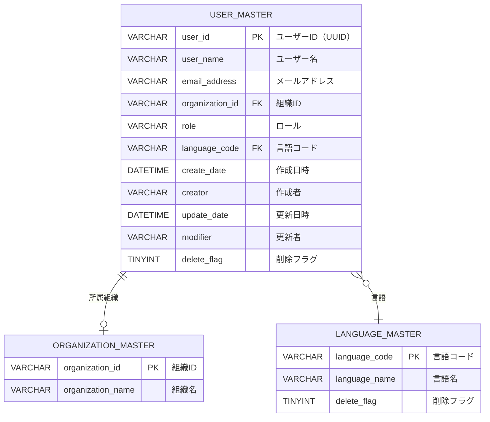

# アカウント機能 (account) - 機能概要

## 📑 目次

- [基本情報](#基本情報)
- [機能概要](#機能概要)
- [データモデル](#データモデル)
- [使用テーブル一覧](#使用テーブル一覧)
- [画面一覧](#画面一覧)
- [Flaskルート一覧](#flaskルート一覧)
- [関連ドキュメント](#関連ドキュメント)

---

## 基本情報

| 項目 | 内容 |
|------|------|
| 機能ID | FR-004-7 |
| 機能名 | アカウント機能 |
| カテゴリ | マスタ管理機能 |
| 画面ID | ACC-001（言語設定画面）、ACC-002（ユーザ情報参照画面） |
| 実装領域 | Flask アプリケーション |
| ディレクトリ | `docs/03-features/flask-app/account/` |

---

## 機能概要

### 目的

ログインユーザー自身のアカウント設定と情報参照を行う機能。システム表示言語の変更や、自分自身のユーザー情報を参照できる。

### 主要機能

- **言語設定**: システム表示言語の変更
- **ユーザー情報参照**: ログインユーザー自身の情報を参照（ユーザID、ユーザ名、メールアドレス、所属組織、ロール等）

### 特徴

- **参照・設定機能**: ログインユーザー自身の情報のみアクセス可能
- **全ロールアクセス可能**: システム保守者、管理者、販社ユーザ、サービス利用者のすべてが利用可能
- **将来の拡張性**: 英語対応を想定した設計

### アクセス権限

| ロール | 権限レベル | アクセス可能なデータ範囲 |
|--------|-----------|---------------------|
| システム保守者 | 〇 | 自分自身の情報のみ |
| 管理者 | 〇 | 自分自身の情報のみ |
| 販社ユーザ | 〇 | 自分自身の情報のみ |
| サービス利用者 | 〇 | 自分自身の情報のみ |

---

## データモデル

### エンティティ関連図（ER図）

### データ項目定義

#### 言語マスタ（language_master）

**アカウント機能で使用するカラム**:

| No | カラム名 | 論理名 | データ型 | NULL | デフォルト値 | 説明 |
|----|---------|--------|---------|------|-------------|------|
| 1 | language_code | 言語コード | VARCHAR(10) | NOT NULL | - | 主キー、ISO 639-1コード（ja, en等） |
| 2 | language_name | 言語名 | VARCHAR(50) | NOT NULL | - | 表示用言語名（日本語、English等） |
| 3 | delete_flag | 削除フラグ | TINYINT | NOT NULL | 0 | 論理削除フラグ（0: 有効、1: 削除済み） |

---

#### ユーザーマスタ（user_master）

**アカウント機能で使用するカラム**:

| No | カラム名 | 論理名 | データ型 | NULL | デフォルト値 | 説明 |
|----|---------|--------|---------|------|-------------|------|
| 1 | user_id | ユーザーID | VARCHAR(100) | NOT NULL | - | 主キー |
| 2 | user_name | ユーザー名 | VARCHAR(255) | NOT NULL | - | ユーザーの表示名 |
| 3 | email_address | メールアドレス | VARCHAR(254) | NOT NULL | - | ユーザーのメールアドレス |
| 4 | organization_id | 組織ID | VARCHAR(100) | NULL | - | 所属組織ID（外部キー、organization_master.organization_id参照） |
| 5 | role | ロール | VARCHAR(50) | NOT NULL | - | ユーザーのロール（システム保守者、管理者、販社ユーザ、サービス利用者） |
| 6 | language_code | 言語コード | VARCHAR(10) | NOT NULL | 'ja' | 言語コード（外部キー、language_master.language_code参照） |
| 7 | create_date | 作成日時 | DATETIME | NOT NULL | NOW() | レコード作成日時 |
| 8 | creator | 作成者 | VARCHAR(100) | NOT NULL | - | レコード作成者のユーザID |
| 9 | update_date | 更新日時 | DATETIME | NULL | NOW() | レコード最終更新日時 |
| 10 | modifier | 更新者 | VARCHAR(100) | NULL | - | レコード更新者のユーザID |
| 11 | delete_flag | 削除フラグ | TINYINT | NOT NULL | 0 | 論理削除フラグ（0: 有効、1: 削除済み） |

## 使用テーブル一覧

| No | テーブル名 | 論理名 | 操作種別 | 用途 |
|----|-----------|--------|---------|------|
| 1 | user_master | ユーザーマスタ | SELECT, UPDATE | ユーザー情報の取得、言語設定の更新 |
| 2 | organization_master | 組織マスタ | SELECT | 所属組織名の取得（user_master.organization_id → organization_master.organization_idで結合） |
| 3 | language_master | 言語マスタ | SELECT | 言語選択肢の取得（language_code, language_name）、言語設定画面のプルダウン表示 |

**注:** テーブル詳細は [アプリケーションデータベース設計書](../../common/app-database-specification.md) を参照してください。organization_masterの定義は [組織管理機能](../organizations/README.md) を参照してください。

### インデックス設計

| テーブル名 | インデックス名 | カラム | 種別 | 用途 |
|-----------|--------------|--------|------|------|
| user_master | PRIMARY | user_id | PRIMARY KEY | 主キー |
| user_master | idx_organization_id | organization_id | INDEX | 組織別検索用 |
| user_master | fk_user_language | language_code | FOREIGN KEY | 言語マスタ参照 |

---

## 画面一覧

| 画面ID | 画面名 | パス | 概要 |
|--------|--------|------|------|
| ACC-001 | 言語設定画面 | `/account/language` | システム表示言語の変更 |
| ACC-002 | ユーザ情報参照画面 | `/account/profile` | ログインユーザー自身の情報参照 |

---

## Flaskルート一覧

| No | ルート名 | エンドポイント | メソッド | 用途 | レスポンス形式 | 認可 |
|----|---------|---------------|---------|------|---------------|------|
| 1 | 言語設定画面表示 | `/account/language` | GET | 言語設定画面の表示 | HTML | 全ロール |
| 2 | 言語設定更新 | `/account/language` | POST | 言語設定の更新 | HTML（リダイレクト） | 全ロール |
| 3 | ユーザ情報参照画面表示 | `/account/profile` | GET | ユーザ情報参照画面の表示 | HTML | 全ロール |

## 関連ドキュメント

### 機能設計・仕様

- [UI仕様書](./ui-specification.md) - 画面レイアウト、UI要素の詳細仕様
- [ワークフロー仕様書](./workflow-specification.md) - ユーザー操作の処理フローと動作詳細
- [機能要件定義書](../../../02-requirements/functional-requirements.md) - FR-004-7: アカウント機能
- [非機能要件定義書](../../../02-requirements/non-functional-requirements.md) - パフォーマンス・セキュリティ要件
- [技術要件定義書](../../../02-requirements/technical-requirements.md) - Flask/Jinja2技術仕様

### アーキテクチャ設計

- [アーキテクチャ概要](../../../01-architecture/overview.md)
- [バックエンド設計](../../../01-architecture/backend.md) - Flask/Blueprint設計
- [フロントエンド設計](../../../01-architecture/frontend.md) - Flask + Jinja2設計
- [データベース設計](../../../01-architecture/database.md) - テーブル定義、インデックス設計

### 共通仕様

- [共通仕様書](../../common/common-specification.md) - HTTPステータスコード、エラーコード、セキュリティ等
- [UI共通仕様書](../../common/ui-common-specification.md) - すべての画面に共通するUI仕様
- [アプリケーションデータベース設計書](../../common/app-database-specification.md) - テーブル定義、インデックス設計

---

**このドキュメントは、実装前に必ずレビューを受けてください。**
