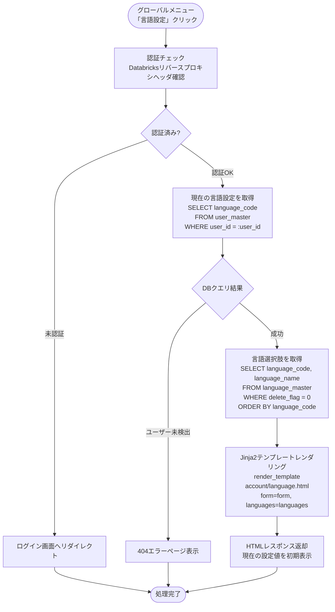
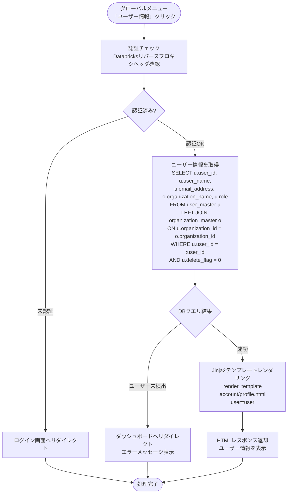

# アカウント機能 ワークフロー仕様書

## 📑 目次

- [基本情報](#基本情報)
- [Flaskルート一覧](#flaskルート一覧)
- [処理フロー](#処理フロー)
- [データベース操作](#データベース操作)
- [セキュリティ実装](#セキュリティ実装)
- [エラーハンドリング](#エラーハンドリング)
- [トランザクション管理](#トランザクション管理)
- [関連ドキュメント](#関連ドキュメント)

---

## 基本情報

| 項目 | 内容 |
|------|------|
| 機能ID | FR-004-7 |
| 機能名 | アカウント機能 |
| Blueprint | `account` |
| ディレクトリ | `app/account/` |
| テンプレートディレクトリ | `app/templates/account/` |

---

## Flaskルート一覧

| No | ルート名 | エンドポイント | メソッド | 用途 | レスポンス形式 | 認可 |
|----|---------|---------------|---------|------|---------------|------|
| 1 | 言語設定画面表示 | `/account/language` | GET | 言語設定画面の表示 | HTML | 全ロール |
| 2 | 言語設定更新 | `/account/language` | POST | 言語設定の更新 | HTML（リダイレクト） | 全ロール |
| 3 | ユーザ情報参照画面表示 | `/account/profile` | GET | ユーザ情報参照画面の表示 | HTML | 全ロール |

### ルート詳細

#### ルート1: 言語設定画面表示

**エンドポイント**: `GET /account/language`

**目的**: 言語設定画面を表示する

**認可**: 全ロール（システム保守者、管理者、販社ユーザ、サービス利用者）

**リクエストパラメータ**: なし

**レスポンス**:
- **成功時（200 OK）**: `account/language.html` をレンダリング
- **認証エラー（401 Unauthorized）**: ログイン画面へリダイレクト

**処理概要**:
1. ログインユーザーのuser_idを取得（ミドルウェアが `g.current_user` に設定済み）
2. user_masterから現在の言語設定（language_code）を取得
3. 言語設定フォームを表示

---

#### ルート2: 言語設定更新

**エンドポイント**: `POST /account/language`

**目的**: 言語設定を更新する

**認可**: 全ロール（システム保守者、管理者、販社ユーザ、サービス利用者）

**リクエストパラメータ**:
| パラメータ名 | 必須 | データ型 | 説明 |
|-------------|------|---------|------|
| language_code | ◎ | VARCHAR(10) | 言語コード（language_masterに存在するlanguage_code） |

**レスポンス**:
- **成功時（302 Found）**: `/account/language` へリダイレクト（成功メッセージ表示）
- **バリデーションエラー（400 Bad Request）**: エラーメッセージ表示
- **認証エラー（401 Unauthorized）**: ログイン画面へリダイレクト

**処理概要**:
1. CSRFトークン検証
2. 入力値バリデーション（language_codeがlanguage_masterに存在することを確認）
3. ログインユーザーのuser_idを取得
4. user_master.language_codeを更新（WHERE user_id = :current_user_id）
5. 成功メッセージをフラッシュ
6. `/account/language` へリダイレクト

---

#### ルート3: ユーザ情報参照画面表示

**エンドポイント**: `GET /account/profile`

**目的**: ユーザ情報参照画面を表示する

**認可**: 全ロール（システム保守者、管理者、販社ユーザ、サービス利用者）

**リクエストパラメータ**: なし

**レスポンス**:
- **成功時（200 OK）**: `account/profile.html` をレンダリング
- **認証エラー（401 Unauthorized）**: ログイン画面へリダイレクト

**処理概要**:
1. ログインユーザーのuser_idを取得（ミドルウェアが `g.current_user` に設定済み）
2. user_masterとorganization_masterを結合してユーザ情報を取得（WHERE user_id = :current_user_id）
3. ユーザ情報をテンプレートに渡してレンダリング

---

## 処理フロー

### フロー1: 言語設定画面表示フロー

**トリガー:** グローバルメニュー「言語設定」クリック

**前提条件:**
- ユーザーがログイン済み（Databricks認証完了）
- 適切な権限を持っている（全ロール）

#### 処理フロー



#### 処理詳細（サーバーサイド）

**① 認証チェック**

認証は `auth/middleware.py` の `before_request` フックで処理済みです。ビューコードでは `g.current_user` を参照します。

**処理内容:**
- `g.current_user.user_id` からログインユーザーのIDを取得（認証済みが保証されている）

**変数・パラメータ:**
- `current_user_id`: string - `g.current_user.user_id` から取得したユーザーID

**② 現在の言語設定を取得**

user_masterから現在の言語設定（language_code）を取得します。

**使用テーブル:** user_master

**SQL詳細:**
```sql
SELECT language_code
FROM user_master
WHERE user_id = %s
  AND delete_flag = 0;
```

**変数・パラメータ:**
- `current_user_id`: VARCHAR(100) - ログインユーザーのuser_id
- `language_code`: VARCHAR(10) - 言語コード

**③ 言語選択肢を取得**

language_masterから有効な言語の一覧を取得します。

**使用テーブル:** language_master

**SQL詳細:**
```sql
SELECT language_code, language_name
FROM language_master
WHERE delete_flag = 0
ORDER BY language_code;
```

**変数・パラメータ:**
- `language_code`: VARCHAR(10) - 言語コード
- `language_name`: VARCHAR(50) - 言語名（日本語、English等）

**④ HTMLレンダリング**

Jinja2テンプレートをレンダリングしてHTMLレスポンスを返却します。

**処理内容:**
- テンプレート: `account/language.html`
- コンテキスト: `form`（現在の言語設定値を初期値として設定）、`languages`（language_masterから取得した言語一覧）

**実装例（Python）**:
```python
@account_bp.route('/language', methods=['GET'])
@role_required(Role.SYSTEM_ADMIN, Role.ADMIN, Role.SALES_USER, Role.SERVICE_USER)
def language_settings():
    """言語設定画面表示"""
    # ミドルウェアが設定した g.current_user からユーザーIDを取得
    current_user_id = g.current_user.user_id

    try:
        # ユーザーの現在の言語設定を取得
        user = UserMaster.query.filter_by(
            user_id=current_user_id, delete_flag=0
        ).first()

        if not user:
            flash('ユーザー情報が見つかりません', 'error')
            return redirect(url_for('dashboard.index'))

        # language_masterから言語選択肢を取得
        languages = LanguageMaster.query.filter_by(delete_flag=0).order_by(
            LanguageMaster.language_code
        ).all()

        # フォーム初期値設定
        form = LanguageSettingsForm()
        form.language_code.choices = [
            (lang.language_code, lang.language_name) for lang in languages
        ]
        form.language_code.data = user.language_code or 'ja'

        return render_template('account/language.html', form=form, languages=languages)

    except Exception as e:
        logger.error(f'言語設定画面表示エラー: {str(e)}')
        flash('画面表示に失敗しました', 'error')
        return redirect(url_for('dashboard.index'))
```

#### 表示メッセージ

| メッセージID | 表示内容 | 表示タイミング | 表示場所 |
|-------------|---------|---------------|---------|
| ERR_001 | ユーザー情報が見つかりません | ユーザー未検出時 | エラーページ |
| ERR_002 | 画面表示に失敗しました | DBクエリ失敗時 | エラーページ |

#### エラーハンドリング

| HTTPステータス | エラー種別 | 処理内容 | 表示内容 |
|--------------|-----------|---------|---------|
| 401 | 認証エラー | ログイン画面へリダイレクト | - |
| 404 | ユーザー未検出 | ダッシュボードへリダイレクト | ユーザー情報が見つかりません |
| 500 | データベースエラー | ダッシュボードへリダイレクト | 画面表示に失敗しました |

#### UI状態

- 言語選択プルダウン: 現在の言語設定値（language_code）を初期表示
- 設定ボタン: 活性
- キャンセルボタン: 活性

### フロー2: 言語設定更新フロー

**トリガー:** 「設定」ボタンクリック

**前提条件:**
- 言語選択プルダウンで言語が選択されている

#### 処理フロー

```mermaid
flowchart TD
    Start([「設定」ボタンクリック]) --> CSRF[CSRFトークン検証]
    CSRF --> CheckCSRF{CSRFトークン<br/>検証結果}
    CheckCSRF -->|失敗| Error400[400エラーページ表示]

    CheckCSRF -->|成功| Validate[バリデーション<br/>language_codeがlanguage_masterに存在することを確認]
    Validate --> CheckValidate{バリデーション<br/>結果}

    CheckValidate -->|失敗| ValidateError[フォーム再表示<br/>エラーメッセージ表示]

    CheckValidate -->|成功| StartTx[トランザクション開始<br/>BEGIN TRANSACTION]
    StartTx --> Update[UPDATE user_master<br/>SET language_code = :language_code,<br/>update_date = NOW(),<br/>modifier = :user_id<br/>WHERE user_id = :user_id]
    Update --> CheckUpdate{UPDATE結果}

    CheckUpdate -->|0 rows affected| NotFound[ユーザー未検出<br/>ROLLBACK]
    NotFound --> Error404[リダイレクト<br/>エラーメッセージ表示]

    CheckUpdate -->|1 row affected| Commit[COMMIT]
    Commit --> Redirect[リダイレクト<br/>/account/language<br/>成功メッセージ]

    CheckUpdate -->|DBエラー| Rollback[ROLLBACK]
    Rollback --> Error500[リダイレクト<br/>エラーメッセージ表示]

    Error400 --> End([処理完了])
    ValidateError --> End
    Error404 --> End
    Error500 --> End
    Redirect --> End
```

#### 処理詳細（サーバーサイド）

**① CSRFトークン検証**

Flask-WTFによるCSRFトークン検証を実施します。

**処理内容:**
- POSTリクエストに含まれるCSRFトークンを検証
- トークンが無効な場合は400エラーを返却

**② バリデーション**

入力値のバリデーションを実施します。

**処理内容:**
- `language_code`がlanguage_masterに存在する有効なlanguage_codeであることを確認
- delete_flag = 0のレコードのみ許可

**変数・パラメータ:**
- `language_code`: VARCHAR(10) - 言語コード（language_masterに存在するlanguage_code）

**③ データベース更新**

user_masterの言語設定を更新します。

**使用テーブル:** user_master

**SQL詳細:**
```sql
UPDATE user_master
SET language_code = %s,
    update_date = NOW(),
    modifier = %s
WHERE user_id = %s
  AND delete_flag = 0;
```

**変数・パラメータ:**
- `language_code`: VARCHAR(10) - 言語コード（language_masterに存在するlanguage_code）
- `current_user_id`: VARCHAR(100) - ログインユーザーのuser_id
- 影響行数: 1行（正常時）、0行（ユーザー未検出時）

**④ リダイレクト**

処理成功時に言語設定画面へリダイレクトします。

**処理内容:**
- リダイレクト先: `/account/language`
- 成功メッセージをフラッシュメッセージとして設定

**実装例（Python）**:
```python
@account_bp.route('/language', methods=['POST'])
@role_required(Role.SYSTEM_ADMIN, Role.ADMIN, Role.SALES_USER, Role.SERVICE_USER)
def update_language_settings():
    """言語設定更新"""
    # ミドルウェアが設定した g.current_user からユーザーIDを取得
    current_user_id = g.current_user.user_id

    # language_masterから言語選択肢を取得（フォーム初期化用）
    languages = LanguageMaster.query.filter_by(delete_flag=0).order_by(
        LanguageMaster.language_code
    ).all()

    # フォーム初期化
    form = LanguageSettingsForm()
    form.language_code.choices = [
        (lang.language_code, lang.language_name) for lang in languages
    ]

    if not form.validate_on_submit():
        # バリデーションエラー
        flash('入力内容を確認してください', 'error')
        return render_template('account/language.html', form=form, languages=languages), 422

    language_code = form.language_code.data

    try:
        # データベース更新
        user = UserMaster.query.filter_by(
            user_id=current_user_id, delete_flag=0
        ).first()

        if not user:
            flash('ユーザー情報が見つかりません', 'error')
            return redirect(url_for('account.language_settings'))

        user.language_code = language_code
        user.modifier = current_user_id
        db.session.commit()

        flash('言語設定を保存しました', 'success')
        return redirect(url_for('account.language_settings'))

    except Exception as e:
        db.session.rollback()
        logger.error(f'言語設定更新エラー: {str(e)}')
        flash('更新に失敗しました', 'error')
        return redirect(url_for('account.language_settings'))
```

#### 表示メッセージ

| メッセージID | 表示内容 | 表示タイミング | 表示場所 |
|-------------|---------|---------------|---------|
| MSG_001 | 言語設定を保存しました | 更新成功時 | フラッシュメッセージ（成功） |
| ERR_003 | 入力内容を確認してください | バリデーションエラー時 | フラッシュメッセージ（エラー） |
| ERR_004 | ユーザー情報が見つかりません | 更新対象レコードなし時 | フラッシュメッセージ（エラー） |
| ERR_005 | 更新に失敗しました | DB更新エラー時 | フラッシュメッセージ（エラー） |

#### エラーハンドリング

| HTTPステータス | エラー種別 | 処理内容 | ロールバック |
|--------------|-----------|---------|------------|
| 400 | バリデーションエラー | フォーム再表示（エラーメッセージ付き） | × |
| 401 | 認証エラー | ログイン画面へリダイレクト | × |
| 404 | ユーザー未検出 | 言語設定画面へリダイレクト | ✓ |
| 500 | データベースエラー | 言語設定画面へリダイレクト | ✓ |

### フロー3: ユーザ情報参照画面表示フロー

**トリガー:** グローバルメニュー「ユーザー情報」クリック

**前提条件:**
- ユーザーがログイン済み（Databricks認証完了）
- 適切な権限を持っている（全ロール）

#### 処理フロー



#### 処理詳細（サーバーサイド）

**① 認証チェック**

認証は `auth/middleware.py` の `before_request` フックで処理済みです。ビューコードでは `g.current_user` を参照します。

**処理内容:**
- `g.current_user.user_id` からログインユーザーのIDを取得（認証済みが保証されている）

**変数・パラメータ:**
- `current_user_id`: string - `g.current_user.user_id` から取得したユーザーID

**② ユーザー情報を取得**

user_masterとorganization_masterを結合してユーザ情報を取得します。

**使用テーブル:** user_master、organization_master

**SQL詳細:**
```sql
SELECT
    u.user_id,
    u.user_name,
    u.email_address,
    o.organization_name,
    u.role
FROM user_master u
LEFT JOIN organization_master o ON u.organization_id = o.organization_id
WHERE u.user_id = %s
  AND u.delete_flag = 0;
```

**変数・パラメータ:**
- `current_user_id`: VARCHAR(100) - ログインユーザーのuser_id
- `user_id`: VARCHAR(100) - ユーザーID
- `user_name`: VARCHAR(255) - ユーザー名
- `email_address`: VARCHAR(254) - メールアドレス
- `organization_name`: VARCHAR(200) - 所属組織名
- `role`: VARCHAR(50) - ロール

**③ HTMLレンダリング**

Jinja2テンプレートをレンダリングしてHTMLレスポンスを返却します。

**処理内容:**
- テンプレート: `account/profile.html`
- コンテキスト: `user`（ユーザー情報）

**実装例（Python）**:
```python
@account_bp.route('/profile', methods=['GET'])
@role_required(Role.SYSTEM_ADMIN, Role.ADMIN, Role.SALES_USER, Role.SERVICE_USER)
def profile():
    """ユーザ情報参照画面表示"""
    # ミドルウェアが設定した g.current_user からユーザーIDを取得
    current_user_id = g.current_user.user_id

    try:
        # ユーザー情報を取得（organization_masterと結合）
        user = db.session.query(
            UserMaster.user_id,
            UserMaster.user_name,
            UserMaster.email_address,
            OrganizationMaster.organization_name,
            UserMaster.role
        ).outerjoin(
            OrganizationMaster,
            UserMaster.organization_id == OrganizationMaster.organization_id
        ).filter(
            UserMaster.user_id == current_user_id,
            UserMaster.delete_flag == 0
        ).first()

        if not user:
            flash('ユーザー情報が見つかりません', 'error')
            return redirect(url_for('dashboard.index'))

        return render_template('account/profile.html', user=user)

    except Exception as e:
        logger.error(f'ユーザ情報参照画面表示エラー: {str(e)}')
        flash('画面表示に失敗しました', 'error')
        return redirect(url_for('dashboard.index'))
```

#### 表示メッセージ

| メッセージID | 表示内容 | 表示タイミング | 表示場所 |
|-------------|---------|---------------|---------|
| ERR_006 | ユーザー情報が見つかりません | ユーザー未検出時 | エラーページ |
| ERR_007 | 画面表示に失敗しました | DBクエリ失敗時 | エラーページ |

#### エラーハンドリング

| HTTPステータス | エラー種別 | 処理内容 | 表示内容 |
|--------------|-----------|---------|---------|
| 401 | 認証エラー | ログイン画面へリダイレクト | - |
| 404 | ユーザー未検出 | ダッシュボードへリダイレクト | ユーザー情報が見つかりません |
| 500 | データベースエラー | ダッシュボードへリダイレクト | 画面表示に失敗しました |

#### UI状態

- ユーザー情報カード: 読み取り専用で表示
  - ユーザーID
  - ユーザー名
  - メールアドレス
  - 所属組織
  - ロール

---

## データベース操作

### SELECT文

#### 言語設定取得

```sql
-- 現在の言語設定を取得
SELECT language_code
FROM user_master
WHERE user_id = %s
  AND delete_flag = 0;
```

**パラメータ**:
- `current_user_id`: ログインユーザーのuser_id

**結果**:
- `language_code`: 言語コード

---

#### 言語選択肢取得

```sql
-- language_masterから有効な言語の一覧を取得
SELECT language_code, language_name
FROM language_master
WHERE delete_flag = 0
ORDER BY language_code;
```

**パラメータ**: なし

**結果**:
- `language_code`: 言語コード（ja: 日本語、en: English等）
- `language_name`: 言語名（日本語、English等）

---

#### ユーザ情報取得

```sql
-- ユーザー情報を取得（organization_masterと結合）
SELECT
    u.user_id,
    u.user_name,
    u.email_address,
    o.organization_name,
    u.role
FROM user_master u
LEFT JOIN organization_master o ON u.organization_id = o.organization_id
WHERE u.user_id = %s
  AND u.delete_flag = 0;
```

**パラメータ**:
- `current_user_id`: ログインユーザーのuser_id

**結果**:
- `user_id`: ユーザーID
- `user_name`: ユーザー名
- `email_address`: メールアドレス
- `organization_name`: 所属組織名
- `role`: ロール

---

### UPDATE文

#### 言語設定更新

```sql
-- 言語設定を更新
UPDATE user_master
SET language_code = %s,
    update_date = NOW(),
    modifier = %s
WHERE user_id = %s
  AND delete_flag = 0;
```

**パラメータ**:
- `language_code`: 言語コード（language_masterに存在するlanguage_code）
- `current_user_id`: ログインユーザーのuser_id

**影響行数**: 1行（正常時）

---

### データスコープ制限

**原則**: ログインユーザー自身のデータのみアクセス可能

**実装**:
```sql
WHERE user_id = %s
```

**説明**:
- すべてのSELECT/UPDATE文に `WHERE user_id = %s` を追加（current_user_idをバインド）
- 他ユーザーのデータへのアクセスを防止

---

## セキュリティ実装

### 認証

**Azure Easy Auth 認証**:
- Azure App Service の Easy Auth が `X-MS-CLIENT-PRINCIPAL` ヘッダを付与
- `auth/middleware.py` の `before_request` フック（`authenticate_request()`）が認証処理を一元管理
- 認証済みユーザー情報は `g.current_user` に設定される（`user_id`, `user_type_id`, `organization_id`）

**実装例**:
```python
from flask import g

current_user_id = g.current_user.user_id
```

---

### 認可

**ロールベースアクセス制御**:
- `@role_required` デコレーターを使用
- 全ロール（システム保守者、管理者、販社ユーザ、サービス利用者）がアクセス可能

**実装例**:
```python
@account_bp.route('/language', methods=['GET'])
@role_required(Role.SYSTEM_ADMIN, Role.ADMIN, Role.SALES_USER, Role.SERVICE_USER)
def language_settings():
    # ...
```

---

### データスコープ制限

**原則**: ログインユーザー自身のデータのみアクセス可能

**実装**:
```python
query = """
    SELECT * FROM user_master
    WHERE user_id = %s AND delete_flag = 0
"""
cursor.execute(query, (current_user_id,))
```

**他ユーザーへのアクセス試行時の動作**:
- データが見つからない（404 Not Found）として処理
- 監査ログに不正アクセス試行として記録

---

### CSRF対策

**Flask-WTF**を使用:
```python
from flask_wtf import FlaskForm

class LanguageSettingsForm(FlaskForm):
    preferred_language = SelectField(...)
```

**テンプレート**:
```html
<form method="POST">
  {{ form.hidden_tag() }}  {# CSRFトークン #}
  ...
</form>
```

---

### XSS対策

**Jinja2自動エスケープ**:
- すべてのテンプレート変数を自動エスケープ
- `{{ user.user_name }}` → HTMLエスケープされる

---

### SQLインジェクション対策

**パラメータ化クエリ**:
```python
# ✅ 推奨
cursor.execute(
    "SELECT * FROM user_master WHERE user_id = %s",
    (current_user_id,)
)

# ❌ 禁止
query = f"SELECT * FROM user_master WHERE user_id = '{current_user_id}'"
```

---

## エラーハンドリング

### エラー種別と対応

| エラー種別 | HTTPステータス | 対応 | メッセージ |
|----------|--------------|------|----------|
| 認証エラー | 401 Unauthorized | ログイン画面へリダイレクト | 「認証が必要です」 |
| 権限エラー | 403 Forbidden | 403エラーページ表示 | 「アクセス権限がありません」 |
| データ未検出 | 404 Not Found | ダッシュボードへリダイレクト | 「ユーザー情報が見つかりません」 |
| バリデーションエラー | 400 Bad Request | エラーメッセージ表示 | 「入力内容を確認してください」 |
| データベースエラー | 500 Internal Server Error | エラーメッセージ表示 | 「更新に失敗しました」 |

### エラーハンドリング実装例

```python
try:
    # データベース操作
    connection.start_transaction()
    cursor.execute(query, params)
    connection.commit()
    flash('言語設定を保存しました', 'success')
    return redirect(url_for('account.language_settings'))

except Exception as e:
    connection.rollback()
    logging.error(f'言語設定更新エラー: {str(e)}')
    flash('更新に失敗しました', 'error')
    return redirect(url_for('account.language_settings'))
finally:
    cursor.close()
    connection.close()
```

---

## トランザクション管理

### トランザクション範囲

**言語設定更新**:
- トランザクション開始: `connection.start_transaction()`
- UPDATE文実行
- コミット: `connection.commit()`
- ロールバック（エラー時）: `connection.rollback()`

**読み取り専用操作**:
- ユーザ情報参照: トランザクション不要（SELECT文のみ）
- 言語設定画面表示: トランザクション不要（SELECT文のみ）

### 実装例

```python
connection = mysql_pool.get_connection()
try:
    connection.start_transaction()

    # UPDATE文実行
    cursor.execute(update_query, params)

    # コミット
    connection.commit()

except Exception as e:
    # ロールバック
    connection.rollback()
    raise e

finally:
    cursor.close()
    connection.close()
```

---

## 関連ドキュメント

### 機能設計・仕様

- [README](./README.md) - 機能概要、データモデル、画面一覧
- [UI仕様書](./ui-specification.md) - 画面レイアウト、UI要素の詳細仕様
- [機能要件定義書](../../../02-requirements/functional-requirements.md) - FR-004-7: アカウント機能
- [非機能要件定義書](../../../02-requirements/non-functional-requirements.md) - パフォーマンス・セキュリティ要件
- [技術要件定義書](../../../02-requirements/technical-requirements.md) - Flask/Jinja2技術仕様

### 共通仕様

- [共通仕様書](../../common/common-specification.md) - HTTPステータスコード、エラーコード、セキュリティ等
- [UI共通仕様書](../../common/ui-common-specification.md) - すべての画面に共通するUI仕様
- [アプリケーションデータベース設計書](../../common/app-database-specification.md) - テーブル定義、インデックス設計

---

**このドキュメントは、実装前に必ずレビューを受けてください。**
