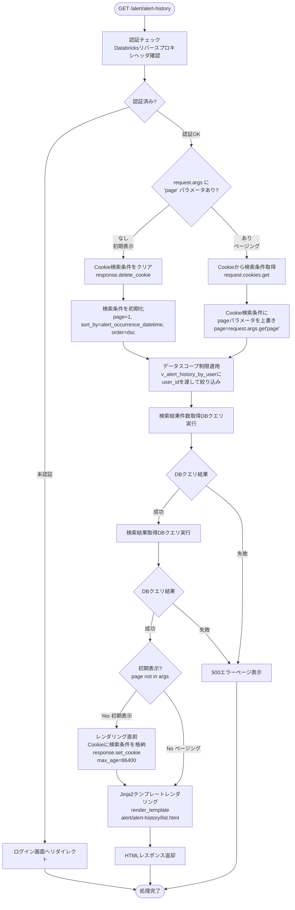
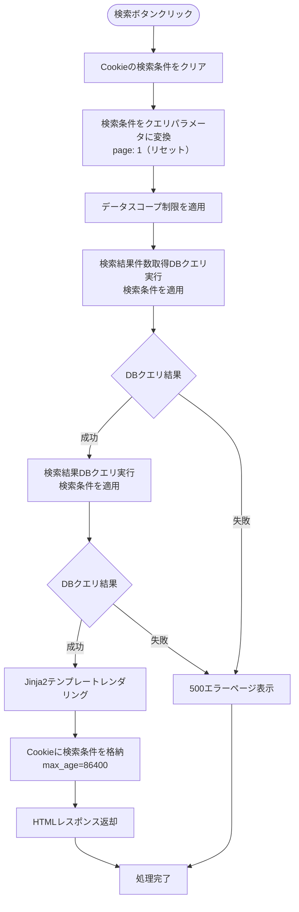
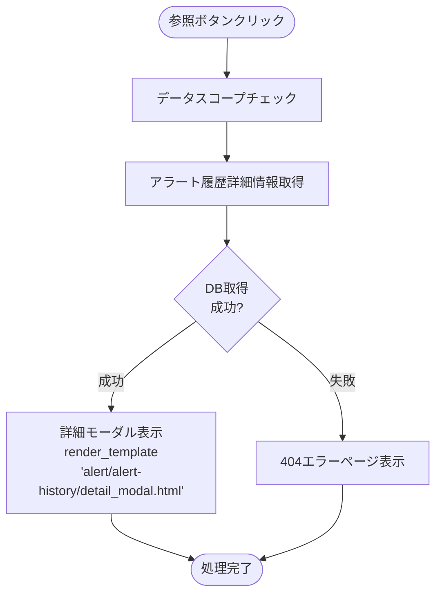

# アラート履歴画面 - ワークフロー仕様書

## 📑 目次

- [アラート履歴画面 - ワークフロー仕様書](#アラート履歴画面---ワークフロー仕様書)
  - [📑 目次](#-目次)
  - [概要](#概要)
  - [使用するFlaskルート一覧](#使用するflaskルート一覧)
  - [ルート呼び出しマッピング](#ルート呼び出しマッピング)
  - [ワークフロー一覧](#ワークフロー一覧)
    - [初期表示](#初期表示)
      - [処理フロー](#処理フロー)
      - [Flaskルート](#flaskルート)
      - [バリデーション](#バリデーション)
      - [処理詳細（サーバーサイド）](#処理詳細サーバーサイド)
      - [表示メッセージ](#表示メッセージ)
      - [エラーハンドリング](#エラーハンドリング)
      - [ログ出力タイミング](#ログ出力タイミング)
      - [検索条件の保持方法](#検索条件の保持方法)
      - [UI状態](#ui状態)
    - [検索・絞り込み](#検索絞り込み)
      - [処理フロー](#処理フロー-1)
      - [処理詳細（サーバーサイド）](#処理詳細サーバーサイド-1)
      - [表示メッセージ](#表示メッセージ-1)
      - [エラーハンドリング](#エラーハンドリング-1)
      - [ログ出力タイミング](#ログ出力タイミング-1)
      - [検索条件の保持方法](#検索条件の保持方法-1)
      - [UI状態](#ui状態-1)
    - [全体ソート](#全体ソート)
      - [処理詳細](#処理詳細)
    - [ページ内ソート](#ページ内ソート)
      - [処理詳細](#処理詳細-1)
    - [ページング](#ページング)
      - [処理詳細](#処理詳細-2)
      - [UI状態](#ui状態-2)
    - [詳細表示](#詳細表示)
      - [処理フロー](#処理フロー-2)
      - [処理詳細（サーバーサイド）](#処理詳細サーバーサイド-2)
      - [ログ出力タイミング](#ログ出力タイミング-2)
  - [使用データベース詳細](#使用データベース詳細)
    - [使用テーブル一覧](#使用テーブル一覧)
    - [インデックス最適化](#インデックス最適化)
  - [セキュリティ実装](#セキュリティ実装)
    - [認証・認可実装](#認証認可実装)
    - [ログ出力ルール](#ログ出力ルール)
  - [関連ドキュメント](#関連ドキュメント)
    - [画面仕様](#画面仕様)
    - [アーキテクチャ設計](#アーキテクチャ設計)
    - [共通仕様](#共通仕様)

---

## 概要

このドキュメントは、アラート履歴画面のユーザー操作に対する処理フロー、バリデーション実行タイミング、データベース処理の詳細を記載します。

**このドキュメントの役割:**
- ✅ ユーザー操作のトリガー条件
- ✅ 処理フローの詳細（Flaskルート呼び出しシーケンス、フォーム送信、リダイレクト）
- ✅ バリデーション実行タイミング（いつチェックするか）
- ✅ エラーハンドリングフロー
- ✅ サーバーサイド処理詳細（SQL、変数、条件分岐、コード例）
- ✅ データベース利用詳細（テーブル操作、インデックス）
- ✅ セキュリティ実装詳細（認証、データスコープ制限、ログ出力）

**UI仕様書との役割分担:**
- **UI仕様書**: バリデーションルール定義（何をチェックするか）、UI要素の詳細仕様
- **ワークフロー仕様書**: バリデーション実行タイミング（いつどのようにチェックするか）、処理フロー、サーバーサイド実装詳細

**注:** UI要素の詳細やバリデーションルールは [UI仕様書](./ui-specification.md) を参照してください。

---

## 使用するFlaskルート一覧

この画面で使用するすべてのFlaskルート（エンドポイント）を記載します。

| No | ルート名 | エンドポイント | メソッド | 用途 | レスポンス形式 | 備考 |
|----|---------|---------------|---------|------|---------------|------|
| 1 | アラート履歴初期表示 | `/alert/alert-history` | GET | アラート履歴の初期表示・ページング | HTML | pageパラメータなし=初期表示、あり=ページング |
| 2 | アラート履歴検索 | `/alert/alert-history` | POST | アラート履歴検索実行 | HTML | 検索条件をCookieに格納 |
| 3 | アラート履歴参照画面 | `/alert/alert-history/<alert_history_uuid>` | GET | アラート履歴詳細情報表示 | HTML（モーダル） | - |

**注:**
- **レスポンス形式**:
  - `HTML`: Jinja2テンプレートをレンダリングして返す（`render_template()`）
  - `HTML（モーダル）`: モーダル内容のみのHTMLフラグメントを返す
- **Flask Blueprint**: `alert_bp` として実装

---

## ルート呼び出しマッピング

| ユーザー操作 | トリガー | 呼び出すルート | パラメータ | レスポンス | エラー時の挙動 |
|-------------|----------|--------------|------------|-----------|---------------|
| 画面初期表示 | URL直接アクセス | `GET /alert/alert-history` | なし | HTML（アラート履歴一覧画面） | エラーページ表示 |
| 検索ボタン押下 | フォーム送信 | `POST /alert/alert-history` | `start_datetime, end_datetime, device_name, device_location, alert_name, alert_level_id, alert_status_id, sort_by, order` | HTML（検索結果画面） | エラーメッセージ表示 |
| ページボタン押下 | リンククリック | `GET /alert/alert-history` | `page` | HTML（検索結果画面） | エラーページ表示 |
| 参照ボタン押下 | ボタンクリック | `GET /alert/alert-history/<alert_history_uuid>` | alert_history_uuid | HTML（参照モーダル） | 404エラーページ表示 |

---

## ワークフロー一覧

### 初期表示

**トリガー:** URL直接アクセス時（ユーザーが `/alert/alert-history` にアクセスしたとき）

**前提条件:**
- ユーザーがログイン済み（Databricks認証完了）
- 適切な権限を持っている

#### 処理フロー



#### Flaskルート

| ルート | エンドポイント | 詳細 |
|-------|---------------|------|
| アラート履歴一覧表示 | `GET /alert/alert-history` | クエリパラメータ: `page` |

#### バリデーション

**実行タイミング:** なし（初期表示のため、デフォルト値を使用）

**データスコープ制限:**
- **フィルタリングロジックは全ユーザーで共通、実質的なアクセス可能範囲に差分あり**
- システム保守者・管理者: すべてのユーザーにアクセス可能
- 販社ユーザー・サービス利用者: ログインユーザーの `organization_id` に紐づく全子組織でフィルタリング

#### 処理詳細（サーバーサイド）

**① 認証・認可チェック**

リバースプロキシヘッダから認証情報を取得し、権限を確認します。

**処理内容:**
- ヘッダ `X-Forwarded-User` からユーザーIDを取得
- データベースから現在ユーザー情報を取得（ユーザー種別、組織ID）
- 組織に応じてデータスコープを決定

**変数・パラメータ:**
- `current_user_id`: string - リバースプロキシヘッダから取得したユーザーID
- `current_user`: User - データベースから取得したユーザーオブジェクト
- `user_type_id`: int - ユーザー種別ID（user_type_masterへの外部キー）
- `organization_id`: string - データスコープ制限用の組織ID

**実装例:**
```python
from flask import request, abort, g
from functools import wraps

def require_auth(f):
    @wraps(f)
    def decorated_function(*args, **kwargs):
        user_id = request.headers.get('X-Forwarded-User')
        if not user_id:
            abort(401)

        user = User.query.filter_by(user_id=user_id, delete_flag=FALSE).first()
        if not user:
            abort(403)

        g.current_user = user
        return f(*args, **kwargs)
    return decorated_function
```

**② クエリパラメータ取得**

デフォルトの検索条件を設定します。

**処理内容:**
- `start_datetime`: 現在日時から7日前の00:00
- `end_datetime`: 現在日時の23:59
- `page`: 1
- `per_page`: 25（固定）
- `sort_by`: alert_occurrence_datetime
- `order`: desc（降順、最新のアラートが上）

```python
from datetime import datetime, timedelta

# デフォルト値を設定（設定ファイルから取得）
now = datetime.now()
default_start = (now - timedelta(days=INIT_START_DATETIME)).replace(hour=0, minute=0, second=0)
default_end = now.replace(hour=23, minute=59, second=59)

start_datetime = request.args.get('start_datetime', default_start.strftime('%Y/%m/%d %H:%M'))
end_datetime = request.args.get('end_datetime', default_end.strftime('%Y/%m/%d %H:%M'))

page = request.args.get('page', 1, type=int)
per_page = ITEM_PER_PAGE
sort_by = request.args.get('sort_by', 'alert_occurrence_datetime')
order = request.args.get('order', 'desc')
```

**③ データスコープ制限の適用**

`v_alert_history_by_user` にログインユーザーの `user_id` を渡すことで、アクセス可能な組織配下のデータに自動的に絞り込まれます。

詳細な実装仕様は[認証・認可実装](#認証認可実装)を参照してください。

**④ データベースクエリ実行**

アラート履歴データを取得します。

**使用テーブル:** v_alert_history_by_user（アラート履歴一覧用VIEW）、alert_status_master（アラートステータスマスタ）、alert_level_master（アラートレベルマスタ）

**SQL詳細:**
- 検索結果件数取得DBクエリ
```sql
SELECT
  COUNT(alert_history_id) AS data_count
FROM
  v_alert_history_by_user
WHERE
  user_id = :user_id
  AND delete_flag = FALSE
  AND alert_occurrence_datetime BETWEEN :start_datetime AND :end_datetime
```

- 検索結果取得DBクエリ
```sql
SELECT
  ah.alert_occurrence_datetime,
  ah.device_id,
  ah.alert_id,
  ah.alert_history_uuid,
  ah.alert_status_id,
  ah.alert_value,
  asm.alert_status_name,
  al.alert_level_id,
  al.alert_level_name
FROM
  v_alert_history_by_user ah
LEFT JOIN alert_status_master asm
  ON ah.alert_status_id = asm.alert_status_id
  AND asm.delete_flag = FALSE
LEFT JOIN alert_setting_master am
  ON ah.alert_id = am.alert_id
  AND am.delete_flag = FALSE
LEFT JOIN alert_level_master al
  ON am.alert_level_id = al.alert_level_id
  AND al.delete_flag = FALSE
WHERE
  ah.user_id = :user_id
  AND ah.delete_flag = FALSE
  AND ah.alert_occurrence_datetime BETWEEN :start_datetime AND :end_datetime
ORDER BY
  ah.alert_occurrence_datetime DESC,
  ah.alert_history_id DESC -- 第二ソートキー
LIMIT :item_per_page OFFSET 0
```

**実装例:**

- `get_default_search_params()` / `search_alert_histories()` は `alert_history_service.py` に定義
- Cookie操作は `common` の `get_search_conditions_cookie` / `set_search_conditions_cookie` / `clear_search_conditions_cookie` を使用

```python
# services/alert_history_service.py

def get_default_search_params() -> dict:
    """アラート履歴一覧検索のデフォルトパラメータを返す"""
    now = datetime.now()
    return {
        'page': 1,
        'per_page': ITEM_PER_PAGE,
        'sort_by': 'alert_occurrence_datetime',
        'order': 'desc',
        'start_datetime': (now - timedelta(days=INIT_START_DATETIME)).replace(hour=0, minute=0, second=0).strftime('%Y/%m/%d %H:%M'),
        'end_datetime': now.replace(hour=23, minute=59, second=59).strftime('%Y/%m/%d %H:%M'),
        'device_name': '',
        'device_location': '',
        'alert_name': '',
        'alert_level_id': None,
        'alert_status_id': None,
    }


def search_alert_histories(search_params: dict, user_id: int) -> tuple[list, int]:
    """アラート履歴一覧をスコープ制限付きで検索する

    Args:
        search_params: 検索条件（page, per_page, sort_by, order, 各検索項目）
        user_id: ログインユーザーID（スコープ制限に使用）

    Returns:
        (alert_histories, total): アラート履歴リストと総件数のタプル
    """
    page = search_params['page']
    per_page = search_params['per_page']
    sort_by = search_params['sort_by']
    order = search_params['order']
    offset = (page - 1) * per_page

    query = db.session.query(AlertHistoryByUser).filter(
        AlertHistoryByUser.user_id == user_id,
        AlertHistoryByUser.delete_flag == False,
    )

    sort_col = getattr(AlertHistoryByUser, sort_by)
    if search_params.get('start_datetime') and search_params.get('end_datetime'):
        query = query.filter(AlertHistoryByUser.alert_occurrence_datetime.between(
            search_params['start_datetime'], search_params['end_datetime']
        ))
    if search_params.get('alert_level_id') is not None:
        query = query.filter(AlertHistoryByUser.alert_level_id == search_params['alert_level_id'])
    if search_params.get('alert_status_id') is not None:
        query = query.filter(AlertHistoryByUser.alert_status_id == search_params['alert_status_id'])

    query = query.order_by(sort_col.asc() if order == 'asc' else sort_col.desc())

    total = query.count()
    alert_histories = query.limit(per_page).offset(offset).all()
    return alert_histories, total
```

**⑤ HTMLレンダリング**

Jinja2テンプレートをレンダリングしてHTMLレスポンスを返却します。
検索条件欄に初期値を設定します。

**実装例:**
```python
# views/alert/alert_history.py（alert_histories_list 内）
return response  # make_response + render_template は下記ルート実装例を参照
```

**初期表示とページングの実装例**
```python
# views/alert/alert_history.py
@alert_bp.route('/alert/alert-history', methods=['GET'])
@require_auth
def alert_histories_list():
    """初期表示・ページング（統合）"""

    if 'page' not in request.args:
        # 初期表示: デフォルト検索条件
        search_params = get_default_search_params()  # → alert_history_service
        save_cookie = True
    else:
        # ページング: Cookie から検索条件取得 → page 上書き
        search_params = get_search_conditions_cookie('alert_history') or get_default_search_params()
        search_params['page'] = request.args.get('page', 1, type=int)
        save_cookie = False

    try:
        alert_histories, total = search_alert_histories(search_params, g.current_user.user_id)  # → alert_history_service
    except Exception:
        abort(500)

    response = make_response(render_template(
        'alert/alert-history/list.html',
        alert_histories=alert_histories,
        total=total,
        search_params=search_params,
    ))
    if save_cookie:
        response = clear_search_conditions_cookie(response, 'alert_history')
        response = set_search_conditions_cookie(response, 'alert_history', search_params)
    return response
```

#### 表示メッセージ

| メッセージID | 表示内容                   | 表示タイミング | 表示場所     |
| ------------ | -------------------------- | -------------- | ------------ |
| ERR_DB_001   | データの取得に失敗しました | DBクエリ失敗時 | エラーページ |

#### エラーハンドリング

| HTTPステータス | エラー種別         | 処理内容                   | 表示内容                   |
| -------------- | ------------------ | -------------------------- | -------------------------- |
| 401            | 認証エラー         | ログイン画面へリダイレクト | -                          |
| 500            | データベースエラー | 500エラーページ表示        | データの取得に失敗しました |

#### ログ出力タイミング
DBクエリ実行の直前、直後に操作ログを出力する

#### 検索条件の保持方法
Cookieに検索条件を保持する

#### UI状態

- 検索条件: デフォルト値（期間は直近7日間）
- テーブル: アラート履歴一覧データ表示（最新順）
- ページネーション: 1ページ目を選択状態

---

### 検索・絞り込み

**トリガー:** (2.10) 検索ボタンクリック（フォーム送信）

**前提条件:**
- 検索条件が入力されている（空でも可）

#### 処理フロー



#### 処理詳細（サーバーサイド）

**検索クエリ実行**
**使用テーブル:** v_alert_history_by_user（アラート履歴一覧用VIEW）、alert_status_master（アラートステータスマスタ）、alert_level_master（アラートレベルマスタ）

**SQL詳細:**
- 検索結果件数取得DBクエリ
```sql
SELECT
  COUNT(alert_history_id) AS data_count
FROM
  v_alert_history_by_user ah
LEFT JOIN alert_setting_master am
  ON ah.alert_id = am.alert_id
  AND am.delete_flag = FALSE
LEFT JOIN device_master dm
  ON ah.device_id = dm.device_id
  AND dm.delete_flag = FALSE
WHERE
  ah.user_id = :user_id
  AND ah.delete_flag = FALSE
  AND CASE WHEN :start_datetime IS NULL OR :end_datetime IS NULL THEN TRUE ELSE ah.alert_occurrence_datetime BETWEEN :start_datetime AND :end_datetime END
  AND CASE WHEN :device_name IS NULL THEN TRUE ELSE dm.device_name LIKE CONCAT('%', :device_name, '%') END
  AND CASE WHEN :device_location IS NULL THEN TRUE ELSE dm.device_location LIKE CONCAT('%', :device_location, '%') END
  AND CASE WHEN :alert_name IS NULL THEN TRUE ELSE am.alert_name LIKE CONCAT('%', :alert_name, '%') END
  AND CASE WHEN :alert_level_id IS NULL THEN TRUE ELSE am.alert_level_id = :alert_level_id END
  AND CASE WHEN :alert_status_id IS NULL THEN TRUE ELSE ah.alert_status_id = :alert_status_id END
```

- 検索結果取得DBクエリ
```sql
SELECT
  ah.alert_occurrence_datetime,
  ah.alert_history_uuid,
  ah.alert_status_id,
  ah.alert_value,
  dm.device_name,
  dm.device_location,
  am.alert_name,
  al.alert_level_id,
  al.alert_level_name,
  asm.alert_status_name
FROM
  v_alert_history_by_user ah
LEFT JOIN alert_status_master asm
  ON ah.alert_status_id = asm.alert_status_id
  AND asm.delete_flag = FALSE
LEFT JOIN alert_setting_master am
  ON ah.alert_id = am.alert_id
  AND am.delete_flag = FALSE
LEFT JOIN alert_level_master al
  ON am.alert_level_id = al.alert_level_id
  AND al.delete_flag = FALSE
LEFT JOIN device_master dm
  ON ah.device_id = dm.device_id
  AND dm.delete_flag = FALSE
WHERE
  ah.user_id = :user_id
  AND ah.delete_flag = FALSE
  AND CASE WHEN :start_datetime IS NULL OR :end_datetime IS NULL THEN TRUE ELSE ah.alert_occurrence_datetime BETWEEN :start_datetime AND :end_datetime END
  AND CASE WHEN :device_name IS NULL THEN TRUE ELSE dm.device_name LIKE CONCAT('%', :device_name, '%') END
  AND CASE WHEN :device_location IS NULL THEN TRUE ELSE dm.device_location LIKE CONCAT('%', :device_location, '%') END
  AND CASE WHEN :alert_name IS NULL THEN TRUE ELSE am.alert_name LIKE CONCAT('%', :alert_name, '%') END
  AND CASE WHEN :alert_level_id IS NULL THEN TRUE ELSE am.alert_level_id = :alert_level_id END
  AND CASE WHEN :alert_status_id IS NULL THEN TRUE ELSE ah.alert_status_id = :alert_status_id END
ORDER BY
  {sort_by} {order},
  ah.alert_history_id {order} -- 第二ソートキー
LIMIT :item_per_page OFFSET (:page -1) * :item_per_page
```

#### 表示メッセージ

| メッセージID | 表示内容                   | 表示タイミング | 表示場所     |
| ------------ | -------------------------- | -------------- | ------------ |
| ERR_DB_001   | データの取得に失敗しました | DBクエリ失敗時 | エラーページ |

#### エラーハンドリング

| HTTPステータス | エラー種別         | 処理内容            | 表示内容                   |
| -------------- | ------------------ | ------------------- | -------------------------- |
| 500            | データベースエラー | 500エラーページ表示 | データの取得に失敗しました |

#### ログ出力タイミング
DBクエリ実行の直前、直後に操作ログを出力する

#### 検索条件の保持方法
Cookieに検索条件を保持する

#### UI状態

- 検索条件: 入力値を保持（フォームに再設定）
- テーブル: 検索結果データ表示
- ページネーション: 1ページ目にリセット

---

### 全体ソート

**トリガー:** (2) 検索条件欄でソート項目、ソート順ドロップダウンで具体値を選択し、検索を実行

#### 処理詳細
検索条件欄のソート項目ドロップダウンで選択した内容に対して、ソート順ドロップダウンで選択した順序でページをまたいだソートを行う。
詳細は[共通仕様書](../../common/common-specification.md)参照のこと。

---

### ページ内ソート

**トリガー:**（5）データテーブルのソート可能カラムのヘッダをクリック

#### 処理詳細
データテーブルのヘッダをクリックすることで、ページ内で閉じたソートを行う。
詳細は[共通仕様書](../../common/common-specification.md)参照のこと

---

### ページング

**トリガー:** (5.8) ページネーションのページ番号ボタンクリック

#### 処理詳細
ページネーションのページ番号を選択することで、選択されたページ番号に対応するデータをデータテーブルに表示する。
具体的な処理は[初期表示](#初期表示)の処理と同様とする。

#### UI状態

- 検索条件: 保持
- ソート条件: 保持
- テーブル: 選択ページのデータ表示
- ページネーション: 選択ページをアクティブ状態

---

### 詳細表示

**トリガー:** (5.7) 参照ボタンクリック

**前提条件:**
- データスコープ制限内のアラート履歴である

#### 処理フロー



#### 処理詳細（サーバーサイド）

**実装例:**
```python
@alert_bp.route('/alert/alert-history/<alert_history_uuid>', methods=['GET'])
@require_auth
def view_alert_history_detail(alert_history_uuid):
    try:
        # アラート履歴詳細情報取得（データスコープチェック含む）
        # v_alert_history_by_user に user_id を渡すことでスコープ制限が自動適用される
        alert_history = db.session.query(AlertHistoryByUser).filter(
            AlertHistoryByUser.alert_history_uuid == alert_history_uuid,
            AlertHistoryByUser.user_id == g.current_user.user_id,
            AlertHistoryByUser.delete_flag == False,
        ).first_or_404()

        return render_template('alert/alert-history/detail_modal.html', alert_history=alert_history)

    except Exception as e:
        logger.error(f"アラート履歴詳細表示に失敗: {str(e)}")
        abort(404)
```

#### ログ出力タイミング
DBクエリ実行の直前、直後に操作ログを出力する

---

## 使用データベース詳細

### 使用テーブル一覧

| No  | テーブル名               | 論理名                       | 操作種別 | ワークフロー             | 目的                                                                                                   | インデックス利用                                                              |
| --- | ------------------------ | ---------------------------- | -------- | ------------------------ | ------------------------------------------------------------------------------------------------------ | ----------------------------------------------------------------------------- |
| 1   | v_alert_history_by_user  | アラート履歴一覧用VIEW       | SELECT   | 初期表示、検索、詳細表示 | アラート履歴データ取得（組織スコープ制限込み）                                                         | PRIMARY KEY (alert_history_id)                                                |
| 2   | alert_status_master      | アラートステータスマスタ     | SELECT   | 全ワークフロー           | アラートステータスの参照                                                                               | PRIMARY KEY (alert_status_id)                                                 |
| 3   | alert_setting_master     | アラート設定マスタ           | SELECT   | 全ワークフロー           | アラート名・条件の参照                                                                                 | PRIMARY KEY (alert_id)                                                        |
| 4   | alert_level_master       | アラートレベルマスタ         | SELECT   | 全ワークフロー           | アラートレベルの参照                                                                                   | PRIMARY KEY (alert_level_id)                                                  |
| 5   | device_master            | デバイスマスタ               | SELECT   | 全ワークフロー           | デバイス名・設置場所の参照                                                                             | PRIMARY KEY (device_id)                                                       |
| 6   | organization_closure     | 組織閉包テーブル             | SELECT   | 全ワークフロー（VIEW経由） | データスコープ制限（VIEWの内部実装で使用。アプリから直接アクセスしない）                             | PRIMARY KEY (parent_organization_id, subsidiary_organization_id)              |
| 7   | user_master              | ユーザーマスタ               | SELECT   | 認証チェック             | ユーザー情報・権限取得                                                                                 | PRIMARY KEY (user_id)                                                         |

### インデックス最適化

**使用するインデックス:**
- alert_history.alert_history_id: PRIMARY KEY - アラート履歴一意識別
- alert_status_master.alert_status_id: PRIMARY KEY - アラートステータス一意識別

---

## セキュリティ実装

### 認証・認可実装

**認証方式:**
- Databricksリバースプロキシヘッダ認証（`X-Forwarded-User`）

**認可ロジック:**

組織階層に基づいて、ユーザーがアクセスできるデータを制限します。

**処理内容:**
- **全ユーザー共通**: 各リソース用VIEW（`v_alert_history_by_user` 等）に `user_id` を渡すことでスコープ制限を自動適用
  - VIEWが内部で `organization_closure` を参照し、アクセス可能な組織配下のデータのみ返す
  - **ロールによる条件分岐は一切行わない**

**注**: システム保守者・管理者が全データにアクセスできるのは、
ルート組織（すべての組織を子組織に持つ）に所属しているため

**実装例:**
```python
# 使用例: アラート履歴一覧取得
@alert_bp.route('/alert/alert-history', methods=['GET'])
@require_auth
def list_alert_histories():
    # v_alert_history_by_user に user_id を渡すだけでスコープ制限が自動適用される
    alert_histories = db.session.query(AlertHistoryByUser).filter(
        AlertHistoryByUser.user_id == g.current_user.user_id,
        AlertHistoryByUser.delete_flag == False,
    ).all()
    return render_template('alert/alert-history/list.html', alert_histories=alert_histories)
```

### ログ出力ルール

**出力する情報:**
- リクエストID
- ユーザーID（操作者）
- 操作種別（一覧表示、詳細表示）
- 対象リソースID（alert-history_uuid）
- 処理結果（成功/失敗）
- エラー種別（DBエラー）
- タイムスタンプ（UTC）

**出力しない情報（機密情報）:**
- 認証トークン
- 機密情報

---

## 関連ドキュメント

### 画面仕様
- [機能概要 README](./README.md) - 画面の概要、データモデル、使用するテーブル一覧
- [UI仕様書](./ui-specification.md) - UI要素の詳細、バリデーションルール定義

### アーキテクチャ設計
- [バックエンド設計](../../01-architecture/backend.md) - Flask/LDP設計、Blueprint構成
- [データベース設計](../../01-architecture/database.md) - テーブル定義、インデックス設計

### 共通仕様
- [共通仕様書](../../common/common-specification.md) - HTTPステータスコード、エラーコード、トランザクション管理、セキュリティ等
- [UI共通仕様書](../../common/ui-common-specification.md) - すべての画面に共通するUI仕様

---

**このワークフロー仕様書は、実装前に必ずレビューを受けてください。**
