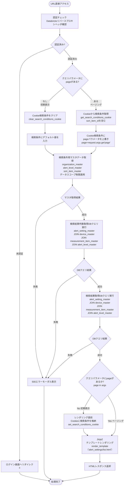
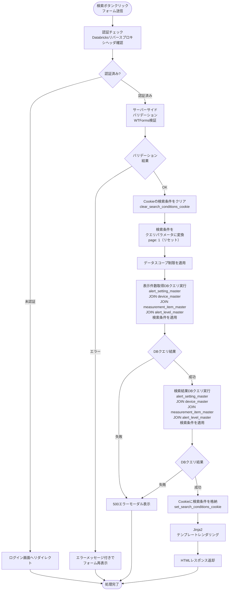
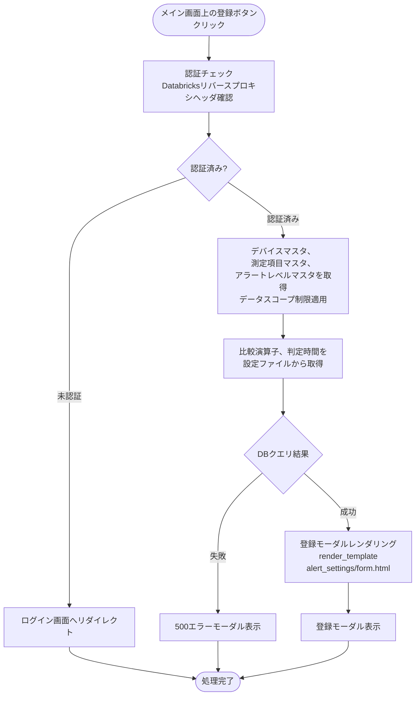
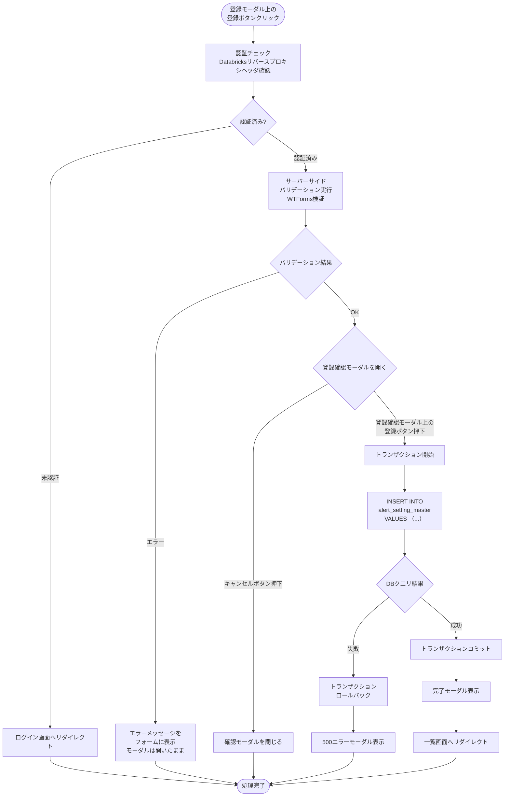
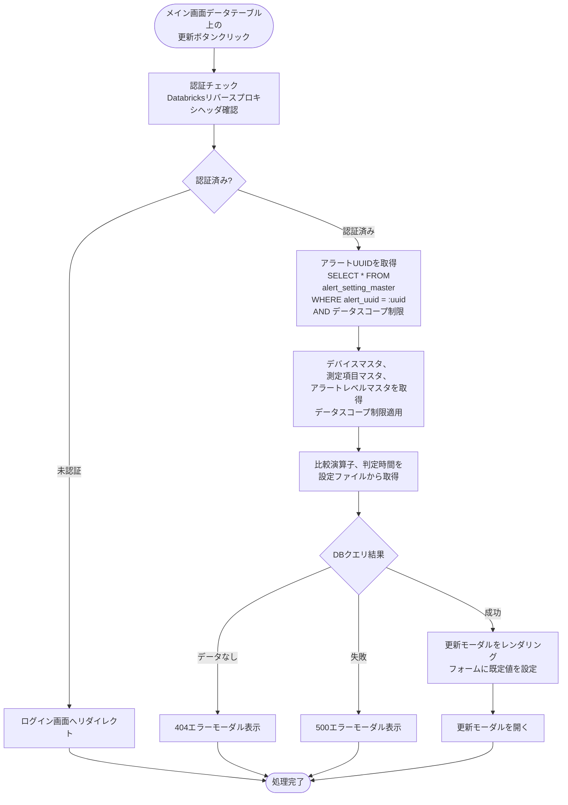
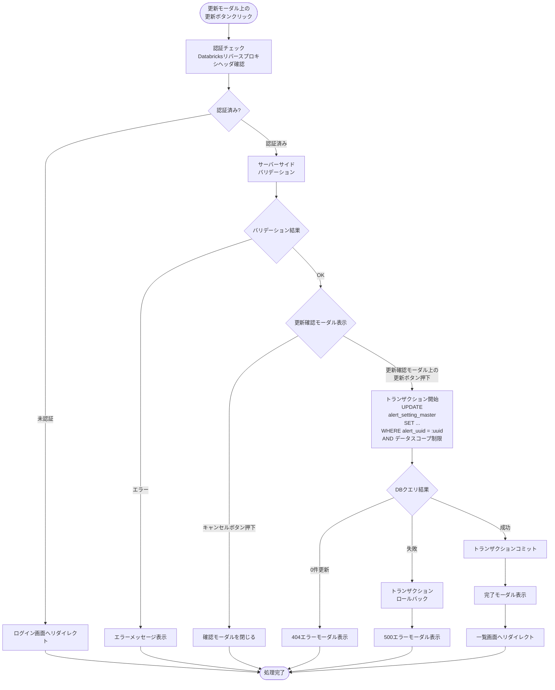
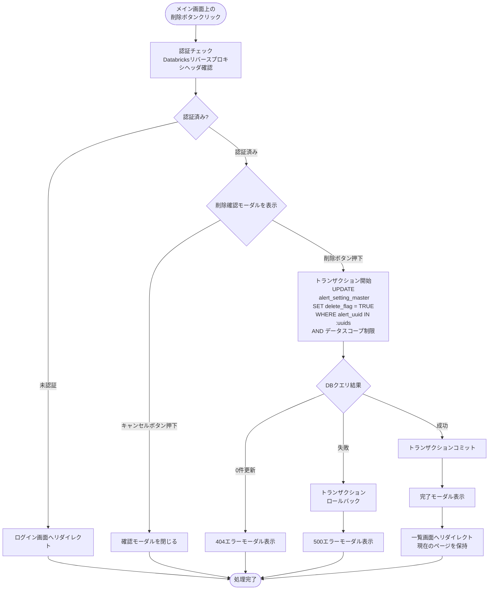
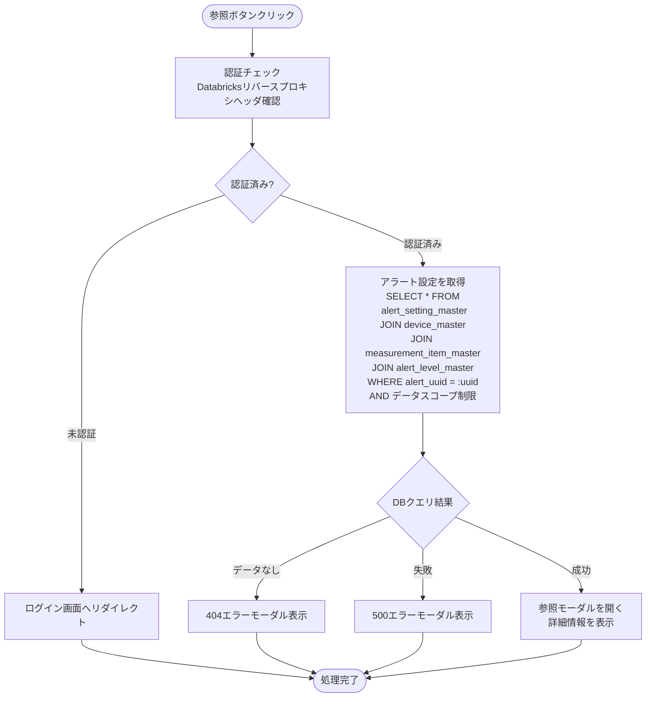
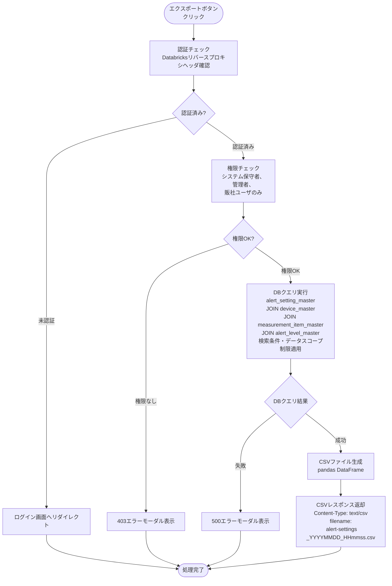

# アラート設定管理画面 - ワークフロー仕様書

## 📑 目次

- [概要](#概要)
- [使用するFlaskルート一覧](#使用するflaskルート一覧)
- [ワークフロー一覧](#ワークフロー一覧)
  - [初期表示](#初期表示)
  - [検索・絞り込み](#検索絞り込み)
  - [アラート設定登録](#アラート設定登録)
  - [アラート設定更新](#アラート設定更新)
  - [アラート設定削除](#アラート設定削除)
  - [アラート設定参照](#アラート設定参照)
  - [CSVエクスポート](#csvエクスポート)
- [使用データベース詳細](#使用データベース詳細)
- [セキュリティ実装](#セキュリティ実装)
- [関連ドキュメント](#関連ドキュメント)

---

## 概要

このドキュメントは、アラート設定管理画面のユーザー操作に対する処理フロー、バリデーション実行タイミング、データベース処理の詳細を記載します。

**このドキュメントの役割:**
- ✅ ユーザー操作のトリガー条件
- ✅ 処理フローの詳細（Flaskルート呼び出しシーケンス、フォーム送信、リダイレクト）
- ✅ バリデーション実行タイミング（いつチェックするか）
- ✅ エラーハンドリングフロー
- ✅ サーバーサイド処理詳細（SQL、変数、条件分岐、コード例）
- ✅ データベース利用詳細（トランザクション管理、テーブル操作）
- ✅ セキュリティ実装詳細（認証、入力検証、ログ出力）

**UI仕様書との役割分担:**
- **UI仕様書**: バリデーションルール定義（何をチェックするか）、UI要素の詳細仕様
- **ワークフロー仕様書**: バリデーション実行タイミング（いつどのようにチェックするか）、処理フロー、サーバーサイド実装詳細

**注:** UI要素の詳細やバリデーションルールは [UI仕様書](./ui-specification.md) を参照してください。

---

## 使用するFlaskルート一覧

| No | ルート名 | エンドポイント | メソッド | 用途 | レスポンス形式 | 備考 |
|----|---------|---------------|---------|------|---------------|------|
| 1 | アラート設定一覧表示 | `/alert/alert-setting` | GET | アラート設定一覧・検索 | HTML | ページング・検索対応。デバイス・測定項目・アラートレベル名はDBから取得。検索条件用に組織マスタ・アラートレベルマスタ・ソート項目マスタも取得 |
| 2 | アラート設定登録フォーム表示 | `/alert/alert-setting/create` | GET | 登録フォーム表示 | HTML | デバイス・測定項目・アラートレベルはDBから、比較演算子・判定時間は設定ファイルから取得 |
| 3 | アラート設定登録実行 | `/alert/alert-setting/create` | POST | アラート設定登録処理 | リダイレクト (302) | 成功時: 一覧へ、失敗時: フォーム再表示 |
| 4 | アラート設定更新フォーム表示 | `/alert/alert-setting/<alert_uuid>/edit` | GET | 更新フォーム表示 | HTML | 現在の設定値を表示。デバイス・測定項目・アラートレベルはDBから、比較演算子・判定時間は設定ファイルから取得 |
| 5 | アラート設定更新実行 | `/alert/alert-setting/<alert_uuid>/update` | POST | アラート設定更新処理 | リダイレクト (302) | 成功時: 一覧へ |
| 6 | アラート設定詳細表示 | `/alert/alert-setting/<alert_uuid>` | GET | アラート設定詳細情報表示 | HTML | モーダル表示用。デバイス・測定項目・アラートレベル名はDBから取得 |
| 7 | アラート設定削除実行 | `/alert/alert-setting/delete` | POST | アラート設定削除処理 | リダイレクト (302) | 成功時: 一覧へ |
| 8 | CSVエクスポート | `/alert/alert-setting?export=csv` | GET | CSVエクスポート | CSV | 絞り込み条件適用済み。デバイス・測定項目・アラートレベル名はDBから取得 |

**注:**
- **レスポンス形式**:
  - `HTML`: Jinja2テンプレートをレンダリングして返す（`render_template()`）
  - `リダイレクト (302)`: 成功時に別のルートへリダイレクト（`redirect(url_for())`）、失敗時はフォームを再表示
  - `CSV`: CSVファイルをダウンロード
- **Flask Blueprint**: `alert_settings_bp`（URL prefix: `/alert/alert-setting`）
- **SSR特性**: すべての処理はサーバーサイドで完結（JSONレスポンスなし）

---

## ワークフロー一覧

### 初期表示

**トリガー:** URL直接アクセス時（`/alert/alert-setting`）

**前提条件:**
- ユーザーがログイン済み（Databricks認証完了）

#### 処理フロー



#### Flaskルート

| ルート | エンドポイント | 詳細 |
|-------|---------------|------|
| アラート設定一覧表示 | `GET /alert/alert-setting` | クエリパラメータ:`page`。デバイス・測定項目・アラートレベル名をDBから取得。検索条件用に組織マスタ・アラートレベルマスタ・ソート項目マスタも取得 |

#### バリデーション

**実行タイミング:** なし（初期表示のため、デフォルト値を使用）

**データスコープ制限:** 自社デバイスおよび傘下組織デバイスのアラート設定にアクセス可能

#### 処理詳細（サーバーサイド）

**① 認証・認可チェック**

```python
from flask import request, abort
from decorators.auth import get_current_user, require_role
from models.role import Role

@alert_settings_bp.route('/alert/alert-setting', methods=['GET'])
def list_alert_settings():
    # 認証チェック（リバースプロキシヘッダ）
    current_user = get_current_user()

    # データスコープ制限は後続のクエリで適用
```

**② クエリパラメータ取得**

```python
from common.cookie_utils import get_search_conditions_cookie

# ページングの場合（pageパラメータあり）: Cookieから検索条件を取得し、pageのみ上書き
# 初期表示の場合（pageパラメータなし）: デフォルト値を使用
if 'page' in request.args:
    # ページング時: Cookieから検索条件を取得（共通関数使用）
    conditions = get_search_conditions_cookie('alert_settings')
    alert_name = conditions.get('alert_name', '')
    organization_name = conditions.get('organization_name', 'すべて')
    device_name = conditions.get('device_name', '')
    alert_level_id = conditions.get('alert_level_id', 'すべて')
    alert_notification_flag = conditions.get('alert_notification_flag', 'すべて')
    alert_email_flag = conditions.get('alert_email_flag', 'すべて')
    page = request.args.get('page', 1, type=int)  # クエリパラメータから取得
    per_page = conditions.get('per_page', 25)
    sort_item_id = conditions.get('sort_item_id', 0)  # sort_item_master の sort_item_id（0=alert_id）
    sort_order = conditions.get('sort_order', 'asc')  # asc / desc（デフォルト: asc）
else:
    # 初期表示時: デフォルト値を使用
    alert_name = ''
    organization_name = 'すべて'
    device_name = ''
    alert_level_id = 'すべて'
    alert_notification_flag = 'すべて'
    alert_email_flag = 'すべて'
    page = 1
    per_page = 25
    sort_item_id = 0       # デフォルト: アラートID（sort_item_master.sort_item_id = 0）
    sort_order = 'asc'     # デフォルト: 昇順

# ソート順の検証（許可値: asc, desc のみ、不正値はデフォルト昇順）
if sort_order not in ['asc', 'desc']:
    sort_order = 'asc'
```

**③ 検索条件用マスタデータ取得**

```python
from models import organization_master, organization_closure, alert_level_master, sort_item_master

# 組織マスタ取得（データスコープ制限適用）
organizations = (
    organization_master.query
    .join(organization_closure, organization_master.organization_id == organization_closure.subsidiary_organization_id)
    .join(user_master, organization_closure.parent_organization_id == user_master.organization_id)
    .filter(user_master.email_address == current_user.email_address)
    .filter(user_master.delete_flag == False)
    .filter(organization_master.delete_flag == False)
    .order_by(organization_master.organization_name)
    .all()
)

# アラートレベルマスタ取得
alert_levels = (
    alert_level_master.query
    .filter(alert_level_master.delete_flag == False)
    .order_by(alert_level_master.alert_level_id)
    .all()
)

# ソート項目マスタ取得（view_id = 6: アラート設定一覧画面）
sort_items = (
    sort_item_master.query
    .filter(sort_item_master.view_id == 6)
    .filter(sort_item_master.delete_flag == False)
    .order_by(sort_item_master.sort_order)
    .all()
)
```

**④ データベースクエリ実行**

```python
from models import alert_setting_master, device_master, measurement_item_master, alert_level_master
from sqlalchemy.orm import aliased

measurement_item_occur = aliased(measurement_item_master)
measurement_item_recovery = aliased(measurement_item_master)

query = (
    alert_setting_master.query
    .join(device_master, alert_setting_master.device_id == device_master.device_id)
    .filter(device_master.delete_flag == False)
    .join(measurement_item_occur, alert_setting_master.alert_conditions_measurement_item_id == measurement_item_occur.measurement_item_id)
    .filter(measurement_item_occur.delete_flag == False)
    .join(measurement_item_recovery, alert_setting_master.alert_recovery_conditions_measurement_item_id == measurement_item_recovery.measurement_item_id)
    .filter(measurement_item_recovery.delete_flag == False)
    .join(alert_level_master, alert_setting_master.alert_level_id == alert_level_master.alert_level_id)
    .filter(alert_level_master.delete_flag == False)
    .filter(alert_setting_master.delete_flag == False)
)

# データスコープ制限
query = query.join(organization_master, device_master.organization_id == organization_master.organization_id)
query = query.filter(organization_master.delete_flag == False)
query = query.join(organization_closure, organization_master.organization_id == organization_closure.subsidiary_organization_id)
query = query.join(user_master, organization_closure.parent_organization_id == user_master.organization_id)
query = query.filter(user_master.email_address == current_user.email_address)

# ソート項目IDをカラム名にマッピング（sort_item_master テーブルで検証）
# view_id = 6（アラート設定一覧画面）, sort_item_id = sort_item_id, delete_flag = FALSE で検索
# 取得した sort_item_name をソートキーとして使用（sort_item_id=0 は alert_id）
sort_by = None
sort_item = sort_item_master.query.filter_by(
    view_id=6,
    sort_item_id=sort_item_id,
    delete_flag=False
).first()
if sort_item:
    sort_by = sort_item.sort_item_name

# ソート適用
# sort_item_name に応じてソートカラムを決定（クロステーブル対応）
SORT_COLUMN_MAP = {
    'alert_id':                                      alert_setting_master.alert_id,
    'alert_name':                                    alert_setting_master.alert_name,
    'organization_name':                             organization_master.organization_name,
    'device_name':                                   device_master.device_name,
    'alert_conditions_measurement_item_id':          measurement_item_occur.measurement_item_id,
    'alert_recovery_conditions_measurement_item_id': measurement_item_recovery.measurement_item_id,
    'judgment_time':                                 alert_setting_master.judgment_time,
    'alert_level_id':                                alert_setting_master.alert_level_id,
    'alert_notification_flag':                       alert_setting_master.alert_notification_flag,
    'alert_email_flag':                              alert_setting_master.alert_email_flag,
}

if sort_by:
    sort_column = SORT_COLUMN_MAP.get(sort_by)
    if sort_column is not None:
        if sort_by == 'alert_id':
            # alert_id は一意なため第2ソートキー不要
            query = query.order_by(
                sort_column.asc() if sort_order == 'asc' else sort_column.desc()
            )
        else:
            query = query.order_by(
                sort_column.asc() if sort_order == 'asc' else sort_column.desc(),
                alert_setting_master.alert_id.asc()  # 第2ソートキー
            )
    else:
        # sort_item_name がマップに存在しない場合は alert_id にフォールバック
        query = query.order_by(
            alert_setting_master.alert_id.asc() if sort_order == 'asc' else alert_setting_master.alert_id.desc()
        )
else:
    # sort_item_id が sort_item_master に存在しない場合（異常系）: alert_id でフォールバック
    query = query.order_by(
        alert_setting_master.alert_id.asc() if sort_order == 'asc' else alert_setting_master.alert_id.desc()
    )

# ページング
offset = (page - 1) * per_page
alert_settings = query.limit(per_page).offset(offset).all()
total = query.count()
```

**⑤ HTMLレンダリング**

```python
return render_template('alert_settings/list.html',
                      device_name=device_name,
                      alert_level_id=alert_level_id,
                      alert_notification_flag=alert_notification_flag,
                      alert_email_flag=alert_email_flag,
                      alert_settings=alert_settings,
                      total=total,
                      page=page,
                      per_page=per_page,
                      sort_item_id=sort_item_id,             # 選択中のソート項目ID（デフォルト: 0=アラートID）
                      sort_order=sort_order,       # 選択中のソート順（デフォルト: asc）
                      organizations=organizations, # 組織マスタ（検索条件用）
                      alert_levels=alert_levels,   # アラートレベルマスタ（検索条件用）
                      sort_items=sort_items)        # ソート項目マスタ（検索条件用）
```

#### エラーハンドリング

| HTTPステータス | エラー種別 | 処理内容 | 表示内容 |
|--------------|-----------|---------|---------|
| 401 | 認証エラー | ログイン画面へリダイレクト | - |
| 500 | データベースエラー | 500エラーモーダル表示 | データの取得に失敗しました |

500エラー発生時のエラー通知については、共通仕様書参照。

---

### 検索・絞り込み

**トリガー:** 検索ボタンクリック（フォーム送信）

**前提条件:**
- 検索条件が入力されている (「未選択」でも可)

#### 処理フロー



#### Flaskルート

| ルート | エンドポイント | 詳細 |
|-------|---------------|------|
| アラート設定一覧表示（検索） | `GET /alert/alert-setting` | クエリパラメータ: `alert_name`, `organization_name`, `device_name`, `alert_level_id`, `alert_notification_flag`, `alert_email_flag`, `page`, `per_page`, `sort_item_id`, `sort_order`。デバイス・測定項目・アラートレベル名をDBから取得 |

#### バリデーション

**実行タイミング:** 検索ボタンクリック直後（サーバーサイド）

**バリデーションルール:** [UI仕様書](./ui-specification.md) の要素詳細 (2) 検索エリア > バリデーション を参照

**データスコープ制限:** 自社デバイスおよび傘下組織デバイスのアラート設定にアクセス可能

#### 処理詳細（サーバーサイド）

**検索クエリ実行:**

```python
from sqlalchemy import or_
from models import alert_setting_master, device_master, measurement_item_master, alert_level_master
from sqlalchemy.orm import aliased

measurement_item_occur = aliased(measurement_item_master)
measurement_item_recovery = aliased(measurement_item_master)

query = (
    alert_setting_master.query
    .join(device_master, alert_setting_master.device_id == device_master.device_id)
    .filter(device_master.delete_flag == False)
    .join(measurement_item_occur, alert_setting_master.alert_conditions_measurement_item_id == measurement_item_occur.measurement_item_id)
    .filter(measurement_item_occur.delete_flag == False)
    .join(measurement_item_recovery, alert_setting_master.alert_recovery_conditions_measurement_item_id == measurement_item_recovery.measurement_item_id)
    .filter(measurement_item_recovery.delete_flag == False)
    .join(alert_level_master, alert_setting_master.alert_level_id == alert_level_master.alert_level_id)
    .filter(alert_level_master.delete_flag == False)
    .filter(alert_setting_master.delete_flag == False)
)

# データスコープ制限（初期表示と同様）
# ...

# アラート名検索
alert_name = request.args.get('alert_name', '')
if alert_name:
    query = query.filter(alert_setting_master.alert_name.like(f'%{alert_name}%'))

# デバイス名絞り込み
device_name = request.args.get('device_name', '')
if device_name:
    query = query.filter(device_master.device_name.like(f'%{device_name}%'))

# アラートレベル絞り込み
alert_level_id = request.args.getlist('alert_level_id')
if alert_level_id:
    query = query.filter(alert_setting_master.alert_level_id.in_(alert_level_id))

# ステータスフラグ絞り込み
if request.args.get('alert_notification_flag') == '1':
    query = query.filter(alert_setting_master.alert_notification_flag == True)
if request.args.get('alert_email_flag') == '1':
    query = query.filter(alert_setting_master.alert_email_flag == True)

# ソート・ページング
# ...
```

---

### ソート

**トリガー:** (2.7) ソート項目、(2.8) ソート順の選択後、(2.9) 検索ボタンクリック

#### 処理フロー

ソート条件を変更して `GET /alert/alert-setting` へリダイレクト。検索条件は保持し、ページは1にリセット。

```
GET /alert/alert-setting?alert_name=...&sort_item_id=1&sort_order=asc&page=1
```

**ソート項目マスタ:**
フロントエンドから送信されるソート項目IDと実際のカラム名のマッピングは、`sort_item_master` テーブルで管理します。セキュリティのため、テーブルに登録された項目IDのみを受け付けます（ホワイトリスト方式）。

**テーブル構造:** `sort_item_master`

| カラム物理名 | カラム論理名 | データ型 | NULL | PK | デフォルト値 | 説明 |
|------------|------------|---------|------|----|-----------|----|
| view_id | 画面ID | INT | NOT NULL | ○ | - | 画面固有のID |
| sort_item_id | ソート項目ID | INT | NOT NULL | ○ | - | ソート項目固有のID |
| sort_item_name | ソート項目名 | VARCHAR(100) | NOT NULL | - | - | ソートに使用するDBカラム名 |
| sort_order | 表示順序 | INT | NOT NULL | - | - | ドロップダウンでの表示順 |
| delete_flag | 削除フラグ | BOOLEAN | NOT NULL | - | FALSE | 論理削除 |

**アラート設定一覧画面の初期データ（view_id = 6）:**

| view_id | sort_item_id | sort_item_name | sort_order | delete_flag | 説明 |
|---------|-------------|----------------|-----------|------------|------|
| 6 | 0 | alert_id | 0 | FALSE | アラートID（デフォルトソート・「未選択」時に使用） |
| 6 | 1 | alert_name | 1 | FALSE | アラート名（alert_setting_master.alert_name） |
| 6 | 2 | organization_name | 2 | FALSE | 組織名（organization_master.organization_name） |
| 6 | 3 | device_name | 3 | FALSE | デバイス名（device_master.device_name） |
| 6 | 4 | alert_conditions_measurement_item_id | 4 | FALSE | アラート発生条件（測定項目IDでソート） |
| 6 | 5 | alert_recovery_conditions_measurement_item_id | 5 | FALSE | アラート復旧条件（測定項目IDでソート） |
| 6 | 6 | judgment_time | 6 | FALSE | 判定時間（alert_setting_master.judgment_time） |
| 6 | 7 | alert_level_id | 7 | FALSE | アラートレベル（alert_setting_master.alert_level_id） |
| 6 | 8 | alert_notification_flag | 8 | FALSE | アラート通知（alert_setting_master.alert_notification_flag） |
| 6 | 9 | alert_email_flag | 9 | FALSE | メール送信（alert_setting_master.alert_email_flag） |

**注意事項:**
- 昇順/降順の情報はテーブルに保持しない
- 現在のソート状態（昇順/降順）は Cookie で管理し、リクエストパラメータ `sort_order` (asc/desc) で送信される
- `sort_order` のデフォルト値は `asc`（昇順）。未選択・不正値の場合も昇順を適用する
- `sort_item_id=0` は `alert_id` に対応する特別エントリ。「未選択」時のデフォルト値として使用する
- `alert_id` でソートする場合は一意なため第2ソートキーを付与しない。それ以外の項目には `alert_id ASC` を第2ソートキーとして付与し、ページング時の並び順を安定させる
- `organization_name` / `device_name` のようなクロステーブル項目は、既存JOINのカラムを使用してソートする

---

### ページ内ソート

**トリガー:**（3）データテーブルのソート可能カラム（アラート名、組織名、デバイス名、アラート発生条件、アラート復旧条件、判定時間、アラートレベル、アラート通知、メール送信）のヘッダをクリック

#### 処理詳細
データテーブルのヘッダをクリックすることで、ページ内で閉じたソートを行う。
詳細は[UI共通仕様書](../../common/ui-common-specification.md)参照のこと

---

### ページング

**トリガー:** (3.12) ページネーションのページ番号ボタンクリック

#### 処理フロー

ページ番号を変更して `GET /alert/alert-setting` へリダイレクト。検索条件とソート条件は保持。

```
GET /alert/alert-setting?alert_name=...&sort_item_id=1&sort_order=asc&page=3
```

---

### アラート設定登録

#### アラート設定登録ボタン押下

**トリガー:** メイン画面上のアラート設定登録ボタン押下

##### 処理フロー



##### Flaskルート

| ルート | エンドポイント | 詳細 |
|-------|---------------|------|
| アラート設定登録フォーム表示 | `GET /alert/alert-setting/create` | デバイス・測定項目・アラートレベルをDBから、比較演算子・判定時間を設定ファイルから取得 |

---

#### アラート設定登録実行

**トリガー:** 登録ボタンクリック

**前提条件:**
- すべての必須項目が入力されている

##### 処理フロー



##### Flaskルート

| ルート | エンドポイント | 詳細 |
|-------|---------------|------|
| アラート設定登録実行 | `POST /alert/alert-setting/create` | フォームデータを受け取り、DB登録 |

##### バリデーション

**実行タイミング:** 登録ボタンクリック直後（サーバーサイド）

**バリデーションルール:** [UI仕様書](./ui-specification.md) の要素詳細 (4) アラート設定登録モーダル > バリデーション を参照

##### 処理詳細（サーバーサイド）

```python
import uuid
from flask import request, redirect, url_for, flash
from werkzeug.exceptions import BadRequest
from models import alert_setting_master, db
from forms.alert_setting_form import alert_setting_masterForm

@alert_settings_bp.route('/alert/alert-setting/create', methods=['POST'])
def create_alert_setting():
    form = alert_setting_masterForm(request.form)

    if not form.validate():
        return render_template('alert_settings/form.html', form=form)

    try:
        # トランザクション開始
        alert_setting = alert_setting_master(
            # alert_id は AUTO_INCREMENT のため指定不要
            alert_uuid=str(uuid.uuid4()),  # UUID自動生成
            alert_name=form.alert_name.data,
            device_id=form.device_id.data,
            alert_conditions_measurement_item_id=form.alert_conditions_measurement_item_id.data,
            alert_conditions_operator=form.alert_conditions_operator.data,
            alert_conditions_threshold=form.alert_conditions_threshold.data,
            alert_recovery_conditions_measurement_item_id=form.alert_recovery_conditions_measurement_item_id.data,
            alert_recovery_conditions_operator=form.alert_recovery_conditions_operator.data,
            alert_recovery_conditions_threshold=form.alert_recovery_conditions_threshold.data,
            judgment_time=form.judgment_time.data,
            alert_level_id=form.alert_level_id.data,
            alert_notification_flag=form.alert_notification_flag.data,
            alert_email_flag=form.alert_email_flag.data,
            create_date=datetime.now(),
            creator=current_user.user_id,
            update_date=datetime.now(),
            modifier=current_user.user_id,
            delete_flag=False
        )
        db.session.add(alert_setting)
        db.session.commit()

        flash('アラート設定を登録しました', 'success')
        return redirect(url_for('alert_settings.list_alert_settings'))

    except Exception as e:
        db.session.rollback()
        flash('アラート設定の登録に失敗しました', 'error')
        return render_template('alert_settings/form.html', form=form)
```

---

### アラート設定更新

#### アラート設定更新ボタン押下

**トリガー:** 一覧画面の「更新」ボタンクリック

##### 処理フロー



※1　403エラー発生時、ドロップダウン、テキストボックスに具体的なデータは表示せず、空で表示する。

##### Flaskルート

| ルート | エンドポイント | 詳細 |
|-------|---------------|------|
| アラート設定更新フォーム表示 | `GET /alert/alert-setting/<alert_uuid>/edit` | 現在の設定値を含むフォームを返却。デバイス・測定項目・アラートレベルをDBから、比較演算子・判定時間を設定ファイルから取得 |

**パスパラメータ**: `alert_uuid` - 対象アラートのUUID

---

#### アラート設定更新実行

**トリガー:** 更新ボタンクリック

##### 処理フロー



##### Flaskルート

| ルート | エンドポイント | 詳細 |
|-------|---------------|------|
| アラート設定更新実行 | `POST /alert/alert-setting/<alert_uuid>/update` | フォームデータを受け取り、DB更新 |

**パスパラメータ**: `alert_uuid` - 対象アラートのUUID

---

### アラート設定削除

**前提条件:**
- 1件以上のチェックボックス (3.1) が選択されている（未選択時は削除ボタンが非活性のため操作不可）

#### 削除実行

**トリガー:**
- ワークフロー開始: (1.5) 削除ボタンクリック
- 削除処理実行: (9.1) 確認モーダル上の削除ボタン押下

#### 処理フロー



#### Flaskルート

| ルート | エンドポイント | 詳細 |
|-------|---------------|------|
| アラート設定削除実行 | `POST /alert/alert-setting/delete` | 論理削除（delete_flag=TRUE） |

**フォームデータ**: `alert_uuids` - 削除対象のアラートUUIDリスト（`request.form.getlist('alert_uuids')`で取得）

---

### アラート設定参照

**トリガー:** 一覧画面の「参照」ボタンクリック

#### 処理フロー



#### Flaskルート

| ルート | エンドポイント | 詳細 |
|-------|---------------|------|
| アラート設定詳細表示 | `GET /alert/alert-setting/<alert_uuid>` | アラート設定の詳細情報を返却。デバイス・測定項目・アラートレベル名をDBから取得 |

**パスパラメータ**: `alert_uuid` - 対象アラートのUUID

---

### CSVエクスポート

**トリガー:** 一覧画面のエクスポートボタンクリック

#### 処理フロー



#### Flaskルート

| ルート | エンドポイント | 詳細 |
|-------|---------------|------|
| CSVエクスポート | `GET /alert/alert-setting?export=csv` | 検索条件を適用してCSVダウンロード。デバイス・測定項目・アラートレベル名をDBから取得 |

#### 処理詳細（サーバーサイド）

```python
import pandas as pd
from datetime import datetime
from models import alert_setting_master, device_master, measurement_item_master, alert_level_master

@alert_settings_bp.route('/alert/alert-setting', methods=['GET'])
def list_alert_settings():
    # ... 検索条件適用済みクエリ（measurement_item_master, alert_level_masterをJOIN済み、各テーブルのdelete_flag == Falseでフィルタ済み） ...

    # CSVエクスポート処理
    if request.args.get('export') == 'csv':
        # サービス利用者は権限なし
        if current_user.role == 'サービス利用者':
            abort(403)

        data = query.all()
        df = pd.DataFrame([{
            'アラートID': a.alert_id,
            'アラート名': a.alert_name,
            'デバイス名': a.device.device_name,
            'アラート発生条件_測定項目名': a.alert_conditions_measurement_item.measurement_item_name,
            'アラート発生条件_比較演算子': a.alert_conditions_operator,
            'アラート発生条件_閾値': a.alert_conditions_threshold,
            'アラート復旧条件_測定項目名': a.alert_recovery_conditions_measurement_item.measurement_item_name,
            'アラート復旧条件_比較演算子': a.alert_recovery_conditions_operator,
            'アラート復旧条件_閾値': a.alert_recovery_conditions_threshold,
            '判定時間（分）': a.judgment_time,
            'アラートレベル': a.alert_level.alert_level_name,
            'アラート通知': '有効' if a.alert_notification_flag else '無効',
            'メール送信': '有効' if a.alert_email_flag else '無効',
            '作成日時': a.create_date.strftime('%Y/%m/%d %H:%M:%S'),
            '作成者': a.creator,
            '更新日時': a.update_date.strftime('%Y/%m/%d %H:%M:%S') if a.update_date else '',
            '更新者': a.modifier
        } for a in data])

        csv_data = df.to_csv(index=False, encoding='utf-8-sig')

        timestamp = datetime.now().strftime('%Y%m%d_%H%M%S')
        filename = f'alert-settings_{timestamp}.csv'

        response = make_response(csv_data)
        response.headers['Content-Type'] = 'text/csv; charset=utf-8-sig'
        response.headers['Content-Disposition'] = f'attachment; filename="{filename}"'
        return response
```

---

## 使用データベース詳細

### 使用テーブル一覧

| No | テーブル名 | 論理名 | 操作種別 | ワークフロー | 目的 |
|----|-----------|--------|---------|------------|------|
| 1 | alert_setting_master | アラート設定マスタ | SELECT | 初期表示、検索、参照、CSVエクスポート | アラート設定情報取得 |
| 2 | alert_setting_master | アラート設定マスタ | INSERT | アラート設定登録 | 新規アラート設定作成 |
| 3 | alert_setting_master | アラート設定マスタ | UPDATE | アラート設定更新 | アラート設定変更 |
| 4 | alert_setting_master | アラート設定マスタ | UPDATE | アラート設定削除 | 論理削除（delete_flag=TRUE） |
| 5 | device_master | デバイスマスタ | SELECT | 初期表示、検索、登録フォーム、更新フォーム、参照、CSVエクスポート | デバイス情報取得、選択肢表示 |
| 6 | measurement_item_master | 測定項目マスタ | SELECT | 初期表示、検索、登録フォーム、更新フォーム、参照、CSVエクスポート | 測定項目名取得、選択肢表示 |
| 7 | alert_level_master | アラートレベルマスタ | SELECT | 初期表示、検索、登録フォーム、更新フォーム、参照、CSVエクスポート | アラートレベル名取得、選択肢表示 |
| 8 | organization_master | 組織マスタ | SELECT | 初期表示、検索、データスコープ制限 | 組織情報取得、検索条件用選択肢表示 |
| 9 | organization_closure | 組織閉包テーブル | SELECT | 初期表示、検索、データスコープ制限 | 組織階層関係の取得 |
| 10 | user_master | ユーザーマスタ | SELECT | データスコープ制限 | ログインユーザーの所属組織特定 |
| 11 | sort_item_master | ソート項目マスタ | SELECT | 初期表示、検索、ソート | ソート項目の選択肢取得とカラム名マッピング（view_id = 6） |

### SQL実行順序

| 順序 | ワークフロー | SQL種別 | テーブル | トランザクション | 備考 |
|------|------------|---------|---------|----------------|------|
| 1 | アラート設定登録 | INSERT | alert_setting_master | 書き込み | 新規アラート設定作成 |
| 1 | アラート設定更新 | UPDATE | alert_setting_master | 書き込み | アラート設定変更 |
| 1 | アラート設定削除 | UPDATE | alert_setting_master | 書き込み | 論理削除（delete_flag=TRUE） |

---

## セキュリティ実装

### 認証・認可実装

**認証方式:**
- Databricksリバースプロキシヘッダ認証（`X-Forwarded-User`, `X-Forwarded-Email`）
- セッション管理: Flaskセッション（サーバーサイド）

**認可ロジック:** 自社デバイスおよび傘下組織デバイスのアラート設定を管理可能

**実装例:**

```python
from functools import wraps
from flask import abort

def require_data_scope(f):
    @wraps(f)
    def decorated_function(*args, **kwargs):
        current_user = get_current_user()
        alert_uuid = kwargs.get('alert_uuid')

        if alert_uuid:
            # 指定されたアラート設定が、ログインユーザーのデータスコープ内にあるかチェック
            result = (
                alert_setting_master.query
                .join(device_master, alert_setting_master.device_id == device_master.device_id)
                .filter(device_master.delete_flag == False)
                .join(organization_master, device_master.organization_id == organization_master.organization_id)
                .filter(organization_master.delete_flag == False)
                .join(organization_closure, organization_master.organization_id == organization_closure.subsidiary_organization_id)
                .join(user_master, organization_closure.parent_organization_id == user_master.organization_id)
                .filter(user_master.delete_flag == False)
                .filter(user_master.email_address == current_user.email_address)
                .filter(alert_setting_master.alert_uuid == alert_uuid)
                .filter(alert_setting_master.delete_flag == False)
                .first()
            )
            if not result:
                abort(403)
        return f(*args, **kwargs)
    return decorated_function

@alert_settings_bp.route('/alert/alert-setting/delete', methods=['POST'])
def delete_alert_settings():
    # 削除対象のUUIDリストを取得
    alert_uuids = request.form.getlist('alert_uuids')
    # 削除処理（各UUIDに対してデータスコープチェック適用）
    pass
```

### 入力検証

**検証項目:**
- alert_name: 最大100文字、必須
- device_id: 存在するデバイスID、必須
- alert_conditions_measurement_item_id: 必須
- alert_conditions_operator: 必須
- alert_conditions_threshold: 必須
- alert_recovery_conditions_measurement_item_id: 必須
- alert_recovery_conditions_operator: 必須
- alert_recovery_conditions_threshold: 必須
- judgment_time: 必須
- alert_level_id: alert_level_masterテーブルに存在するID、必須
- alert_notification_flag: 必須
- alert_email_flag: 必須

**DB制約項目（システム自動設定）:**
- create_date: 必須（システム自動設定）
- creator: 必須（システム自動設定）
- update_date: 必須（システム自動設定）
- modifier: 必須（システム自動設定）
- delete_flag: 必須（デフォルト: FALSE）

**セキュリティ対策:**
- SQLインジェクション対策: SQLAlchemy ORM使用（プリペアドステートメント）
- XSS対策: Jinja2自動エスケープ
- CSRF対策: Flask-WTF CSRF保護
- ソート項目の安全性確保: フロントエンドからカラム名文字列を直接受け取らず、整数ID（`sort_item_id`）を経由して `sort_item_master` テーブルで検証済みのカラム名にマッピング（ホワイトリスト方式）。これによりSQLインジェクションリスクを排除する。

### ログ出力ルール

**出力する情報:**
- リクエストID
- ユーザーID（操作者）
- 操作種別（アラート設定登録、更新、削除等）
- 対象リソースID（alert_id、alert_uuid）
- 処理結果（成功/失敗）
- エラー種別（バリデーションエラー、DBエラー等）

**出力しない情報:**
- アラート発生条件・復旧条件の詳細（機密情報の可能性）

---

## 関連ドキュメント

### 画面仕様
- [機能概要 README](./README.md) - 画面の概要、データモデル、使用するテーブル一覧
- [UI仕様書](./ui-specification.md) - UI要素の詳細、バリデーションルール定義

### アーキテクチャ設計
- [バックエンド設計](../../01-architecture/backend.md) - Flask/LDP設計、Blueprint構成
- [データベース設計](../../01-architecture/database.md) - テーブル定義、インデックス設計

### 共通仕様
- [共通仕様書](../common/common-specification.md) - HTTPステータスコード、エラーコード、トランザクション管理、セキュリティ等
- [認証仕様書](../common/authentication-specification.md) - 認証アーキテクチャ、Token Exchange、Unity Catalog接続
- [UI共通仕様書](../common/ui-common-specification.md) - すべての画面に共通するUI仕様

---

**このワークフロー仕様書は、実装前に必ずレビューを受けてください。**

---

## 編集履歴

| 日付 | バージョン | 編集者 | 変更内容 |
|------|------------|--------|----------|
| 2025-12-10 | 1.0 | Claude | 初版作成（アラート設定管理画面のワークフロー仕様を定義） |
| 2026-02-04 | 1.1 | Claude | AIレビュー完了版 |
| 2026-03-03 | 1.2 | Claude | ソート項目をsort_item_masterテーブルから取得する方式に変更。sort_byパラメータをsort_item_idに変更。初期表示フロー・マスタ取得・DBクエリ・HTMLレンダリング・使用テーブル一覧・セキュリティ実装を更新。ソートセクションにsort_item_master初期データ（view_id=6）を追加。第2ソートキー（alert_id ASC）を追加。 |