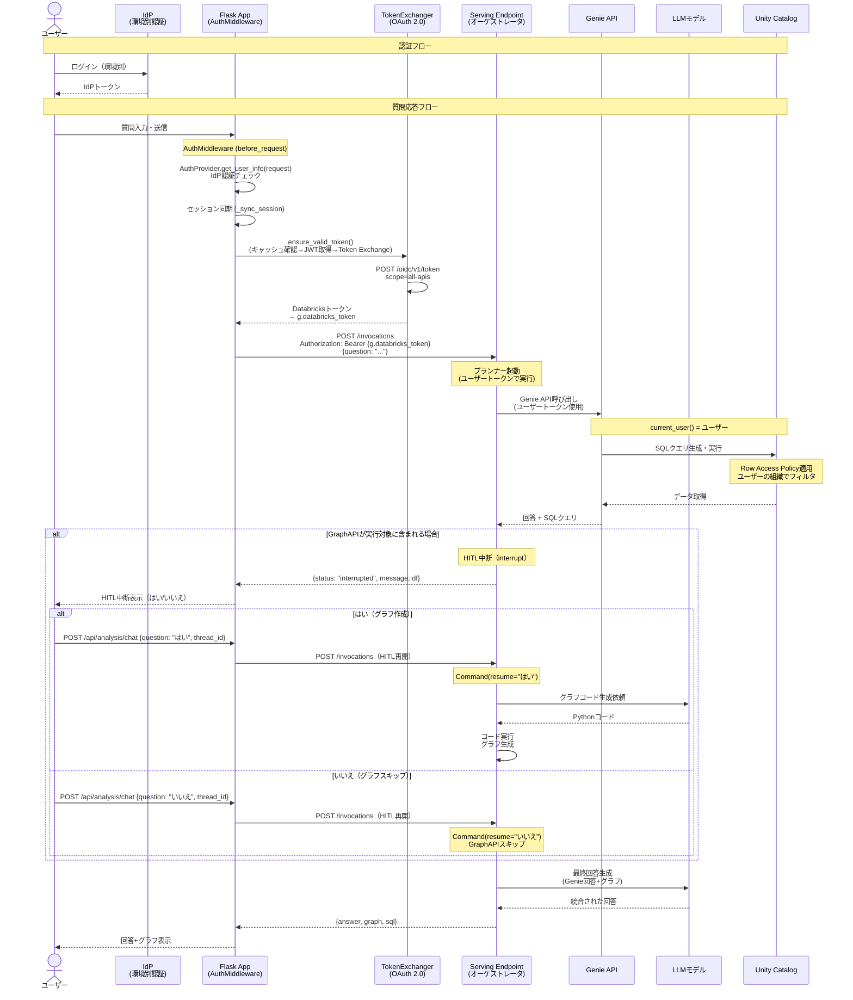
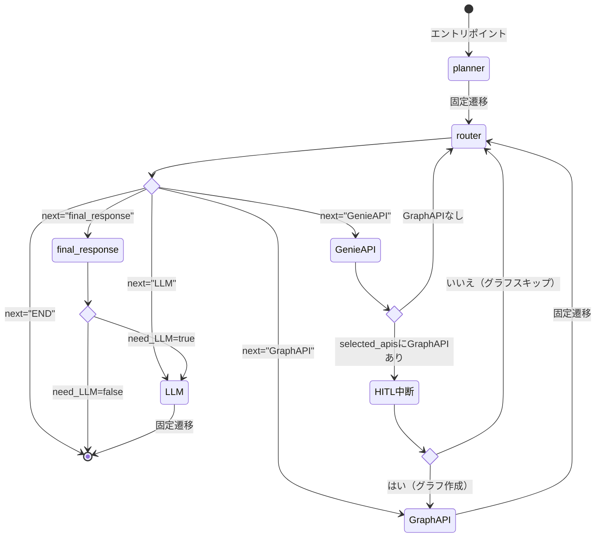

# 対話型AIチャット機能

## 概要

対話型AIチャット機能は、Databricks Genie APIを活用した自然言語によるデータ問い合わせ機能です。ユーザーは日本語で質問を入力し、IoTセンサーデータに基づいた回答を得ることができます。

本機能はFlaskアプリケーションで独自のチャットUIを提供し、Databricks Model Serving Endpoint上のAIオーケストレータAPIを経由してDatabricks Genie APIと連携して回答を取得します。認証には認証共通モジュール（AuthProviderパターン）を使用し、環境に応じた認証方式（Azure Easy Auth / AWS ALB+Cognito / 自前IdP）で統一的に認証処理を行います。OAuth 2.0 Token Exchange（TokenExchanger）によりユーザープリンシパルを維持したままDatabricks APIを呼び出します。

## 機能情報

| 項目     | 内容               |
| -------- | ------------------ |
| 機能ID   | FR-006-3           |
| 機能名   | 対話型AI機能       |
| カテゴリ | 分析機能（FR-006） |
| 画面ID   | CHT-001            |
| URL      | `/analysis/chat`            |

## 機能仕様

### 主要機能

1. **自然言語での質問入力**
   - 日本語による質問入力
   - センサーデータ、デバイス情報に関する問い合わせ

2. **AIオーケストレータによる回答生成**
   - Databricks Genie API、Graph API、LLMを呼び出し
   - Unity Catalog内のデータを参照した回答生成
   - 生成されたSQLクエリの表示（オプション）
   - グラフ生成前のHITL確認（Human-in-the-Loop）

3. **チャット履歴管理**
   - セッション内のチャット履歴を保持
   - 会話コンテキストを維持した連続質問

4. **データアクセス制御**
   - ユーザーの所属組織に基づくデータフィルタリング
   - Row Access Policyによる行レベルセキュリティ

## アーキテクチャ

### システム全体構成

```text
┌─────────────────────────────────────────────────────────────────────┐
│                       Flask UI (Web Apps)                           │
│  ┌────────────────────────────────────────────────────────────────┐ │
│  │                    対話型AIチャット画面 (CHT-001)                │ │
│  │  ┌──────────────────────────────────────────────────────────┐  │ │
│  │  │                   チャット履歴表示エリア                   │  │ │
│  │  │  ┌────────────────────────────────────────────────────┐  │  │ │
│  │  │  │ 🧑 昨日の第1冷凍庫の平均温度は？                    │  │  │ │
│  │  │  │ 🤖 昨日の第1冷凍庫の平均温度は -18.5℃ でした。     │  │  │ │
│  │  │  │    [グラフ表示]                                    │  │  │ │
│  │  │  └────────────────────────────────────────────────────┘  │  │ │
│  │  └──────────────────────────────────────────────────────────┘  │ │
│  │  ┌──────────────────────────────────────────────────────────┐  │ │
│  │  │ [質問入力テキストボックス                        ] [送信] │  │ │
│  │  └──────────────────────────────────────────────────────────┘  │ │
│  └────────────────────────────────────────────────────────────────┘ │
│                                │                                     │
│  ┌─────────────────────────────▼──────────────────────────────────┐ │
│  │                      Flask Backend API                          │ │
│  │  - AuthMiddleware認証（AuthProviderパターン）                    │ │
│  │  - TokenExchanger（OAuth 2.0 Token Exchange）                   │ │
│  └─────────────────────────────┬──────────────────────────────────┘ │
└────────────────────────────────┼───────────────────────────────────┘
                                 │ ユーザーDatabricksトークン
                                 ▼
┌─────────────────────────────────────────────────────────────────────┐
│              Databricks Model Serving Endpoint                       │
│                   (AIオーケストレータAPI)                             │
│  ┌────────────────────────────────────────────────────────────────┐ │
│  │                         プランナー                              │ │
│  │  ┌──────────────┐  ┌──────────────┐  ┌──────────────────────┐ │ │
│  │  │ Genie API    │  │ LLMモデル    │  │ Claude 4 Sonnet      │ │ │
│  │  │ (UC検索)     │  │ (コード生成) │  │ (最終回答生成)        │ │ │
│  │  └──────┬───────┘  └──────┬───────┘  └──────┬───────────────┘ │ │
│  └─────────┼─────────────────┼─────────────────┼─────────────────┘ │
└────────────┼─────────────────┼─────────────────┼───────────────────┘
             │                 │                 │
             ▼                 │                 │
┌─────────────────────────┐    │                 │
│   Databricks Genie      │    │                 │
│        API              │    │                 │
│  ┌─────────────────┐    │    │                 │
│  │ Genie Space     │    │    │                 │
│  │ (Conversation)  │    │    │                 │
│  └────────┬────────┘    │    │                 │
└───────────┼─────────────┘    │                 │
            │                  │                 │
            ▼                  ▼                 ▼
┌─────────────────────────────────────────────────────────────────────┐
│                          Unity Catalog                               │
│  ┌──────────────────┐  ┌──────────────────────────────────────────┐ │
│  │ Row Access Policy│  │         動的ビュー (views)                │ │
│  │ (組織フィルタ)    │◄─│  - sensor_data_view                      │ │
│  └──────────────────┘  │  - daily_summary_view                    │ │
│                        │  - monthly_summary_view                  │ │
│                        │  - yearly_summary_view                   │ │
│                        └──────────┬───────────────────────────────┘ │
│                                   ▼                                  │
│  ┌───────────────────────────────────────────────────────────────┐  │
│  │ データテーブル                                                  │  │
│  │  - silver_sensor_data                                          │  │
│  │  - gold_sensor_data_daily_summary                              │  │
│  │  - gold_sensor_data_monthly_summary                            │  │
│  │  - gold_sensor_data_yearly_summary                             │  │
│  │  - organization_closure (組織閉包)                              │  │
│  └───────────────────────────────────────────────────────────────┘  │
└─────────────────────────────────────────────────────────────────────┘
```

### 認証・データフロー



## Genie API仕様

Databricks Genie APIを使用して、自然言語による質問をSQLに変換しデータを取得します。会話開始、メッセージ送信、メッセージ取得、クエリ結果取得の4つのAPIエンドポイントを使用します。

Genie API連携の詳細（APIエンドポイント仕様、リクエスト/レスポンス例、ポーリング処理）は [ワークフロー仕様書 - Genie API連携仕様](./workflow-specification.md#genie-api連携仕様) を参照してください。

### Genie Space設定

| 項目         | 設定値                             |
| ------------ | ---------------------------------- |
| Space ID     | 環境変数 `GENIE_SPACE_ID` から取得 |
| 公開カタログ | `iot_catalog`                      |
| 公開スキーマ | `views`                            |
| アクセス権限 | ユーザープリンシパル単位           |
| 説明         | IoTセンサーデータ分析用Genie Space |

## アクセス権限

| ロール         | 対話型AI機能 | データアクセス範囲 |
| -------------- | ------------ | ------------------ |
| システム保守者 | ○            | 全データ           |
| 管理者         | ○            | 所属組織+下位組織  |
| 販社ユーザ     | ○            | 所属組織+下位組織  |
| サービス利用者 | ○            | 所属組織+下位組織  |

**備考**: すべてのユーザーに所属組織配下のデータのみ閲覧可能なフィルタが適用されます（Row Access Policy）。

## 技術仕様

### 使用技術

| 技術要素                       | 採用技術                                                                               |
| ------------------------------ | -------------------------------------------------------------------------------------- |
| **フロントエンド**             | Flask + Jinja2 + JavaScript                                                            |
| **ホスティング (UI)**          | Azure Web Apps（Azure環境の場合）                                                      |
| **認証**                       | AuthProvider認証共通モジュール（Azure: Easy Auth / AWS: ALB+Cognito / Local: 自前IdP） |
| **バックエンドAPI**            | Flask REST API                                                                         |
| **AIオーケストレータ**         | Databricks Model Serving Endpoint (MLflow PythonModel + LangGraph)                     |
| **エージェントフレームワーク** | LangGraph StateGraph（条件付き遷移によるマルチエージェント）                           |
| **LLMモデル**                  | Claude 4 Sonnet（ChatDatabricks経由）                                                  |
| **データ取得**                 | Databricks Genie API                                                                   |
| **グラフ生成**                 | Plotly（LLM生成コードの動的実行）                                                      |
| **会話状態永続化**             | Unity Catalog Delta Table（LangGraph Checkpointer）                                    |
| **トークン管理**               | TokenExchanger（OAuth 2.0 Token Exchange、認証共通モジュール）                         |
| **データストレージ**           | Unity Catalog (Delta Lake)                                                             |
| **データアクセス制御**         | Row Access Policy (組織ベースフィルタリング)                                           |
| **データアクセス**             | SQL Warehouse + Databricks SQL Connector                                               |

### 認証・認可フロー

認証・認可の詳細（AuthMiddleware、AuthProvider、TokenExchangerの仕組み・処理フロー・環境別認証方式）は [認証仕様書](../../common/authentication-specification.md) を参照してください。

本機能では、認証共通モジュールにより取得された `g.databricks_token`（ユーザーのDatabricksトークン）を使用してServing Endpointを呼び出します。

#### ユーザープリンシパルの伝搬（本機能固有）

本機能では、ユーザートークンがFlask App → Serving Endpoint → Genie API / Unity Catalogまで伝搬され、`current_user()`によるRow Access Policyが正しく適用されます。

| レイヤー             | トークン種別                        | 実行コンテキスト            |
| -------------------- | ----------------------------------- | --------------------------- |
| Flask App            | AuthMiddlewareで取得済み            | ユーザー（IdP認証済み）     |
| Flask Backend        | `g.databricks_token`                | -                           |
| Serving Endpoint     | ユーザーDatabricksトークン          | ユーザープリンシパル        |
| ┣ GenieAPI / SQL実行 | TokenContext（ユーザートークン）    | `current_user()` = ユーザー |
| ┣ CSVアップロード    | WorkspaceClient（ユーザートークン） | ユーザープリンシパル        |
| ┗ LLM呼び出し        | ChatDatabricks（Endpoint実行ID）    | Endpointサービス資格情報    |
| Unity Catalog        | Row Access Policy自動適用           | ユーザーの組織でフィルタ    |

**重要**: データアクセスを伴う処理（GenieAPI、SQL実行、CSVアップロード）はユーザートークンで実行されるため、`current_user()`がユーザーのメールアドレスを返し、Row Access Policyが正しく適用されます。LLM呼び出し（ChatDatabricks）はEndpointのサービス資格情報で実行されますが、テキスト生成処理のみでユーザーデータへの直接アクセスは行わないため、セキュリティ上の影響はありません。

### AIオーケストレータAPI仕様

#### Serving Endpoint設定

| 項目               | 設定値                                              |
| ------------------ | --------------------------------------------------- |
| Endpoint名         | `ai-orchestrator-chat`                              |
| モデル形式         | MLflow PythonModel（LangGraphServingModel）         |
| エージェント基盤   | LangGraph StateGraph                                |
| LLMモデル          | Claude 4 Sonnet（ChatDatabricks経由）               |
| ワークロードサイズ | Small（初期）                                       |
| スケール設定       | Auto-scaling（0〜3インスタンス）                    |
| トークン伝搬       | リクエストトークンを使用                            |
| 会話状態永続化     | Unity Catalog Delta Table（LangGraph Checkpointer） |

#### 実装アーキテクチャ

AIオーケストレータは、MLflow PythonModelを継承した`LangGraphServingModel`クラスとして実装される。内部ではLangGraphの`StateGraph`を用いたマルチエージェントグラフを構築し、条件付き遷移により動的にノードを選択・実行する。

#### エージェントグラフ構成



**ノード一覧（6ノード）:**

| ノード名         | 役割                         |
| ---------------- | ---------------------------- |
| `planner`        | API選択・実行計画の決定      |
| `router`         | 条件付き遷移制御             |
| `GenieAPI`       | Genie API連携・データ取得    |
| `GraphAPI`       | グラフコード生成・実行       |
| `final_response` | LLM実行要否の分岐判定        |
| `LLM`            | 高度データ分析・最終回答生成 |

**API選択ルール:**

| ユーザー要求               | 選択されるAPI                        |
| -------------------------- | ------------------------------------ |
| データ取得・集計           | GenieAPI                             |
| データの可視化・グラフ作成 | GenieAPI → HITL確認 → GraphAPI       |
| 分析・要因・理由・考察     | GenieAPI → LLM                       |
| データ取得+可視化+分析     | GenieAPI → HITL確認 → GraphAPI → LLM |
| 一般的な質問（データ不要） | LLM                                  |

各ノードの詳細処理（AgentState定義、ノード間データフロー、リクエスト/レスポンス仕様、トークン検証、会話状態の永続化、Genieスペースの動的管理、LLM呼び出し共通基盤）は [ワークフロー仕様書 - AIオーケストレータ詳細仕様](./workflow-specification.md#aiオーケストレータ詳細仕様) を参照してください。

#### LLM設定

| 項目              | 値                           |
| ----------------- | ---------------------------- |
| LLMエンドポイント | `databricks-claude-4-sonnet` |
| temperature       | 0.1（低温度で安定出力）      |

### 参照テーブル/ビュー

| テーブル/ビュー      | スキーマ | 用途                           |
| -------------------- | -------- | ------------------------------ |
| sensor_data_view     | views    | センサーデータ参照用動的ビュー |
| daily_summary_view   | views    | 日次サマリ動的ビュー           |
| monthly_summary_view | views    | 月次サマリ動的ビュー           |
| yearly_summary_view  | views    | 年次サマリ動的ビュー           |
| check_point_data     | ai_chat  | LangGraphの会話状態永続化      |

### 日本語対応

Databricks Genieが英語の物理名テーブルを認識しやすくするため、以下のテーブルに対して、テーブルコメント、カラムコメントを日本語で設定します。

| テーブル/ビュー      | スキーマ | 用途                           |
| -------------------- | -------- | ------------------------------ |
| sensor_data_view     | views    | センサーデータ参照用動的ビュー |
| daily_summary_view   | views    | 日次サマリ動的ビュー           |
| monthly_summary_view | views    | 月次サマリ動的ビュー           |
| yearly_summary_view  | views    | 年次サマリ動的ビュー           |

## 関連ドキュメント

### 要件定義

- [機能要件定義書](../../../02-requirements/functional-requirements.md) - FR-006-3
- [非機能要件定義書](../../../02-requirements/non-functional-requirements.md) - NFR-PERF-003, NFR-SEC-007
- [技術要件定義書](../../../02-requirements/technical-requirements.md) - TR-DB-001

### 詳細仕様書

- [UI仕様書](./ui-specification.md) - 画面レイアウト、UI要素定義、状態遷移
- [ワークフロー仕様書](./workflow-specification.md) - 処理フロー、AIオーケストレータ詳細、Genie API連携、エラーハンドリング

### 設計書

- [Unity Catalogデータベース設計書](../../common/unity-catalog-database-specification.md)
- [アプリケーションデータベース設計書](../../common/app-database-specification.md)

### Genie API リファレンス

- [Databricks Genie API Documentation](https://docs.databricks.com/api/workspace/genie)

---

## 変更履歴

| 日付       | 版数 | 変更内容         | 担当者       |
| ---------- | ---- | ---------------- | ------------ |
| 2026-02-16 | 1.0  | 初版作成         | Kei Sugiyama |
| 2026-02-24 | 1.1  | レビュー指摘修正 | Kei Sugiyama |