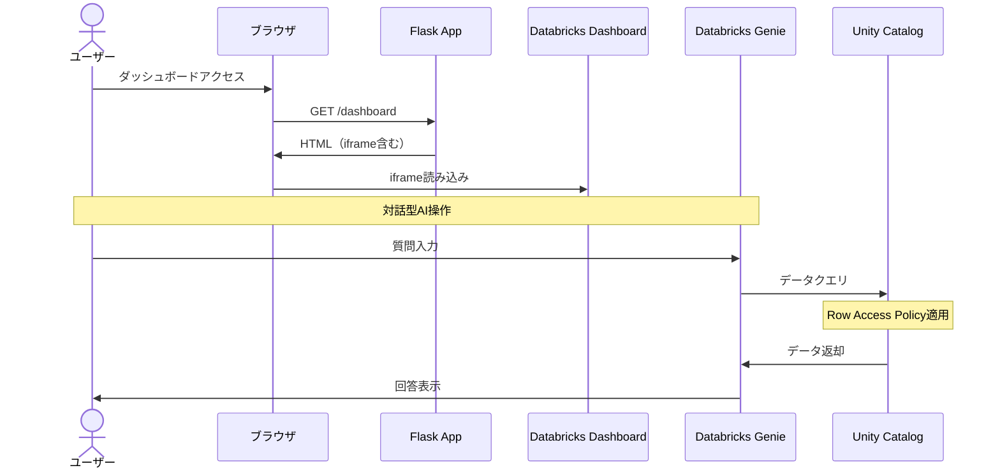

# 対話型AIチャット機能 設計準備ドキュメント

## 1. 把握した要件

### 1.1 機能要件（FR-006-3: 対話型AI機能）

#### 概要
ダッシュボード埋め込みの対話型AI機能。個別の画面としては作成せず、ダッシュボード（DSH-001）の一部として提供。

#### 機能仕様
| 項目 | 内容 |
|------|------|
| 機能ID | FR-006-3 |
| 機能名 | 対話型AI機能 |
| 画面配置 | ダッシュボード（DSH-001）内に統合 |
| AIエンジン | Databricks Genie |
| 対象ユーザー | 全ロール（システム保守者、管理者、販社ユーザ、サービス利用者） |

#### コア機能
1. **自然言語での質問入力**
   - ユーザーが日本語で質問を入力
   - センサーデータ、デバイス情報に関する問い合わせ対応

2. **AIによる回答生成**
   - Databricks Genieを使用した自然言語処理
   - データに基づいた回答の提供
   - Unity Catalog内のデータを参照

3. **データアクセス制御**
   - ユーザーの所属組織に基づくデータフィルタリング
   - Row Access Policyによる行レベルセキュリティ

#### 技術的課題と対策
| 課題 | 対策 |
|------|------|
| 日本語の質問で英語の物理名テーブルを認識できない | 日本語名の動的ビューを作成してモデルが認識しやすくする |

### 1.2 非機能要件（関連項目抽出）

#### パフォーマンス要件
| 要件ID | 項目 | 指標 |
|--------|------|------|
| NFR-PERF-003 | ダッシュボード表示時間 | 10秒以内（Databricks側処理含む） |
| NFR-PERF-004 | Unity Catalog単純クエリ | 500ms以内 |
| NFR-PERF-004 | Unity Catalog集計クエリ | 5秒以内 |

#### セキュリティ要件
| 要件ID | 項目 | 実装方針 |
|--------|------|----------|
| NFR-SEC-006 | ロールベースアクセス制御 | ダッシュボード表示権限に準ずる |
| NFR-SEC-007 | データスコープ制限 | 組織階層ベースのフィルタリング（Row Access Policy） |

#### ユーザビリティ要件
| 要件ID | 項目 | 指標 |
|--------|------|------|
| NFR-USAB-001 | タスク完了率 | 95%以上 |
| NFR-USAB-003 | エラーメッセージ理解度 | 90%以上 |

### 1.3 技術要件（関連項目抽出）

#### Databricks Platform
- **AIエンジン**: Databricks Genie
- **データストレージ**: Unity Catalog（Delta Lake）
- **アクセス方式**: SQL Warehouse経由
- **表示方式**: Databricksダッシュボード iframeに統合

#### データアクセス
- **センサーデータ**: Unity Catalog（silver_sensor_data, gold_*_summary）
- **アクセス制御**: 動的ビュー + Row Access Policy
- **ユーザー認証**: Databricks User認証（リバースプロキシヘッダ経由）

### 1.4 データベース仕様（関連項目）

#### Unity Catalog テーブル
| スキーマ | テーブル | 用途 |
|----------|----------|------|
| silver | silver_sensor_data | センサーデータ（構造化済み） |
| gold | gold_sensor_data_daily_summary | 日次サマリ |
| gold | gold_sensor_data_monthly_summary | 月次サマリ |
| gold | gold_sensor_data_yearly_summary | 年次サマリ |
| views | sensor_data_view | 動的ビュー（アクセス制御適用） |
| oltp_db | organization_closure | 組織階層（アクセス制御用） |

#### 動的ビューのRow Access Policy
```sql
-- ユーザーの所属組織と下位組織のデータのみアクセス可能
CREATE ROW ACCESS POLICY iot_catalog.security.organization_filter
AS (organization_id INT)
RETURNS BOOLEAN
RETURN (
    is_account_group_member('system_admins')
    OR
    ARRAY_CONTAINS(iot_catalog.security.user_accessible_orgs(), organization_id)
);
```

### 1.5 アクセス権限

| 機能 | システム保守者 | 管理者 | 販社ユーザ | サービス利用者 |
|------|---------------|--------|-----------|---------------|
| 対話型AI機能 | ○ | ○ | ○ | ○ |

**備考**: ダッシュボード表示権限（FR-006-1）に準ずる。すべてのユーザーに所属組織配下のデータのみ閲覧可能なフィルタが適用される。

---

## 2. 解析した不足情報

### 2.1 要件定義書に明示されていない項目

| # | 項目 | 現状 | 設計時の方針 |
|---|------|------|-------------|
| 1 | チャット履歴の保存 | 未定義 | セッション内のみ保持（永続化しない） |
| 2 | 同時リクエスト制限 | 未定義 | Databricks Genie側の制限に従う |
| 3 | 質問文字数制限 | 未定義 | 1000文字以内を推奨 |
| 4 | 回答の最大長 | 未定義 | Databricks Genie側の制限に従う |
| 5 | タイムアウト設定 | 未定義 | 30秒（ダッシュボード表示時間の3倍を目安） |
| 6 | エラー時の再試行 | 未定義 | 自動再試行なし、ユーザー操作で再送信 |

### 2.2 検討が必要な技術的事項

| # | 項目 | 検討内容 |
|---|------|----------|
| 1 | Genie Space設定 | どのテーブル/ビューをGenieに公開するか |
| 2 | 日本語ビュー命名 | 日本語論理名をビュー名に採用する際の命名規則 |
| 3 | レート制限 | Databricks Genie APIのレート制限への対応 |
| 4 | コスト最適化 | SQL Warehouseの使用量を最適化する方針 |

---

## 3. 新設した章の詳細

### 3.1 UI仕様書への追加章

#### 追加なし
対話型AI機能はDatabricksダッシュボード内に統合されているため、Flask SSR側でのUI実装はiframe埋め込みのみ。Databricks Genie自体のUIはDatabricks側で提供される。

### 3.2 ワークフロー仕様書への追加章

#### 3.2.1 Databricks Genie連携処理フロー
**追加理由**: 外部AI（Databricks Genie）との連携フローを明確化するため

**内容**:
- Genie Space初期化
- 質問送信シーケンス
- 回答受信・表示フロー
- セッション管理

#### 3.2.2 データアクセス制御フロー
**追加理由**: Unity Catalogの動的ビュー/Row Access Policyによるアクセス制御を明確化するため

**内容**:
- ユーザー所属組織の取得
- 組織閉包テーブルによる下位組織の特定
- Row Access Policy適用の流れ

---

## 4. 設計方針

### 4.1 実装範囲

| 領域 | 実装内容 | 担当 |
|------|----------|------|
| Flask App | ダッシュボード画面（iframe埋め込み） | 本設計書 |
| Databricks | Genie Space設定、動的ビュー作成 | Databricks側設定 |

### 4.2 画面構成

対話型AI機能は独立した画面を持たず、ダッシュボード（DSH-001）内にDatabricks Genieウィジェットとして統合される。

```
ダッシュボード（DSH-001）
├── センサーデータグラフウィジェット
├── デバイスステータスウィジェット
├── アラート情報ウィジェット
└── 対話型AIチャットウィジェット ← Databricks Genie
```

### 4.3 データフロー



---

## 5. 参照ドキュメント

| ドキュメント | パス | 参照内容 |
|--------------|------|----------|
| 機能要件定義書 | `02-requirements/functional-requirements.md` | FR-006-3, DSH-001 |
| 非機能要件定義書 | `02-requirements/non-functional-requirements.md` | NFR-PERF-003, NFR-SEC-006, NFR-SEC-007 |
| 技術要件定義書 | `02-requirements/technical-requirements.md` | TR-DB-001, TR-SEC-001 |
| Unity Catalogデータベース設計書 | `03-features/common/unity-catalog-database-specification.md` | 動的ビュー、Row Access Policy |
| アプリケーションデータベース設計書 | `03-features/common/app-database-specification.md` | organization_closure |
| 機能仕様書作成ガイド | `03-features/feature-guide.md` | テンプレート、命名規則 |

---

*最終更新: 2026-02-03*
