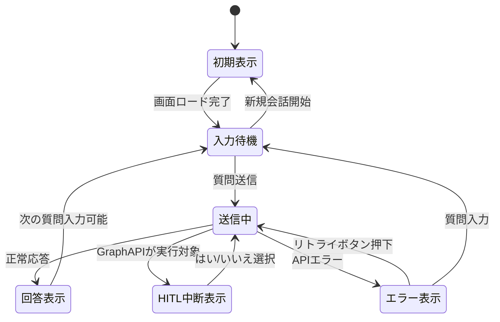

# 対話型AIチャット機能 - UI仕様書

## 目次

- [基本情報](#基本情報)
- [画面レイアウト](#画面レイアウト)
  - [ワイヤーフレーム](#ワイヤーフレーム)
  - [レイアウト構成](#レイアウト構成)
- [要素概要](#要素概要)
- [要素詳細](#要素詳細)
- [状態遷移](#状態遷移)
- [レスポンシブ対応](#レスポンシブ対応)
- [備考](#備考)

**注:** すべてのUI仕様書でこの目次構成を統一してください。

---

**重要:** このUI仕様書を作成する前に、必ず [UI共通仕様書](../common/ui-common-specification.md) を参照してください。UI共通仕様書には、すべての画面で共通するUI仕様（ボタン、フォーム要素、テーブル、モーダル、バリデーション、エラーメッセージ、アクセシビリティ等）が定義されています。このテンプレートには、画面固有の仕様のみを記載してください。

---

## 基本情報

| 項目         | 内容                                                           |
| ------------ | -------------------------------------------------------------- |
| 画面ID       | `CHT-001`                                                      |
| 画面名       | 対話型AIチャット                                               |
| 画面パス     | `/analysis/chat`                                                        |
| アクセス権限 | システム保守者、管理者、販社ユーザ、サービス利用者（全ロール） |
| 親画面       | なし（独立画面）                                               |
| 子画面       | なし                                                           |

**注:**

- 対話型AI機能はFlaskアプリケーションで独自に実装するチャット画面です
- 認証には認証共通モジュール（AuthProviderパターン）を使用します（Azure環境ではEasy Auth（Entra ID）、AWS環境ではALB+Cognito、オンプレミス環境では自前IdP）
- 認証処理はAuthMiddleware（`before_request`フック）で一元実行され、各画面ルートでの個別認証は不要です
- Databricksトークンの取得・キャッシュはTokenExchanger（OAuth 2.0 Token Exchange、`scope=all-apis`）で管理されます
- Databricks Genie APIと連携して回答を取得・表示します（ユーザープリンシパル伝播）

---

## 画面レイアウト

### ワイヤーフレーム

**対話型AIチャット画面（CHT-001）:**

```
┌─────────────────────────────────────────────────────────────────────────┐
│                                                                         │
├───────────┐                                                             │
│           │ (2) 画面タイトル: AIチャット                          　 　　   │
│（1）　　   ├─────────────────────────────────────────────────────────────┤
│  グローバル│                                                             │
│  メニュー  │ ┌─────────────────────────────────────────────────────────┐ │
│           │ │ (3) チャットコンテナ                                      │ │
│           │ │ ┌───────────────────────────────────────────────────┐   │ │
│           │ │ │                                                   │   │ │
│           │ │ │ ┌─────────────────────────────────────────────┐   │   │ │
│           │ │ │ │ 🧑 昨日の第1冷凍庫の平均温度は？              │   │   │ │
│           │ │ │ └─────────────────────────────────────────────┘   │   │ │
│           │ │ │                                                   │   │ │
│           │ │ │ ┌─────────────────────────────────────────────┐   │   │ │
│           │ │ │ │ 🤖 昨日（2026/02/03）の第1冷凍庫の平均        │   │   │ │
│           │ │ │ │    温度は **-18.5℃** でした。                │   │   │ │
│           │ │ │ │                                             │   │   │ │
│           │ │ │ └─────────────────────────────────────────────┘   │   │ │
│           │ | │ ┌────────────────────────────────────────────────┐│   │ │
│           │ │ │ │                                                ││   │ │
│           │ │ │ │ 以下のデータを取得しました。グラフを作成しますか？  ││   │ │
│           │ │ │ │                                                ││   │ │
│           │ │ │ │ [{"date": "2026-02-03", "avg_temp": -18.5}],...││   │ │
│           │ │ │ │                                                ││   │ │
│           │ │ │ │                                [はい]  [いいえ] ││   │ │
│           │ │ │ └────────────────────────────────────────────────┘│   │ │
│           │ │ └───────────────────────────────────────────────────┘   │ │
│           │ │                                                         │ │
│           │ │ ┌───────────────────────────────────────────────────┐   │ │
│           │ │ │ 🤖 ⏳ 回答を生成中です...                         │   │ │
│           │ │ └───────────────────────────────────────────────────┘   │ │
│           │ └─────────────────────────────────────────────────────────┘ │
│           │                                                             │
│           │ (4) 入力エリア                                               │
│           │ ┌─────────────────────────────────────────────────────────┐ │
│           │ │ ┌───────────────────────────────────────────┐           │ │
│           │ │ │ 質問を入力してください...                   │ [送信]    │ │
│           │ │ └───────────────────────────────────────────┘           │ │
│           │ │  文字数カウント: 0/1000                                  │ │
│           │ └─────────────────────────────────────────────────────────┘ │
│           │                                                             │
│           │ (5) フッター                                                 │
│           │ ┌─────────────────────────────────────────────────────────┐ │
│           │ │ [新しい会話を開始]                                        │ │
│           │ └─────────────────────────────────────────────────────────┘ │
└───────────┴─────────────────────────────────────────────────────────────┘
```

### レイアウト構成

画面の主要なレイアウト領域を説明します。

| No  | 領域               | 説明                                                   | 備考             |
| --- | ------------------ | ------------------------------------------------------ | ---------------- |
| (1) | グローバルメニュー | 左サイドバーメニュー                                   | UI共通仕様参照   |
| (2) | 画面タイトル       | 画面タイトル「AIチャット」                             | 固定表示         |
| (3) | チャットコンテナ   | ユーザーとAIのメッセージ、メッセージ履歴、AIの回答履歴 | スクロール可能   |
| (4) | 入力エリア         | 質問入力と送信ボタン、文字数カウント                   | 固定表示（下部） |
| (5) | フッター           | 「新しい会話を開始」ボタン                             | 固定表示         |

---

## 要素概要

### Flask側で管理するUI要素

| No        | 項目名                       | オブジェクト名        | 入力タイプ | I/O | 必須 | 最大桁 | 初期値   | 表示内容                                                             | 備考                                                                                                                 |
| --------- | ---------------------------- | --------------------- | ---------- | --- | ---- | ------ | -------- | -------------------------------------------------------------------- | -------------------------------------------------------------------------------------------------------------------- |
| (2)       | 画面タイトル                 | page_title            | -          | O   | -    | -      | -        | 固定値：「AIチャット」                                               | 固定表示                                                                                                             |
| (3.1)     | チャット履歴表示             | chat_history          | -          | O   | -    | -      | []       | メッセージ履歴                                                       | JavaScript動的更新                                                                                                   |
| (3.1.1)   | ユーザーメッセージ           | user_message          | Label      | O   | -    | -      | -        | ユーザーの質問                                                       | マークダウン非対応                                                                                                   |
| (3.1.2)   | リトライボタン               | retry_btn             | button     | -   | -    | -      | hidden   | 「リトライ」                                                         | エラー時のみ表示                                                                                                     |
| (3.1.3)   | AIレスポンス                 | ai_response           | -          | O   | -    | -      | -        | AIの回答                                                             | -                                                                                                                    |
| (3.1.3.1) | AIレスポンスメッセージ       | ai_response_message   | Label      | O   | -    | -      | -        | AIの回答                                                             | マークダウン対応                                                                                                     |
| (3.1.4)   | HITL中断表示                 | hitl_view             | -          | O   | -    | -      | -        | -                                                                    | AIオーケストレータがGraphAPIを実行対象に選択している場合に表示                                                       |
| (3.1.4.1) | グラフ作成要否確認メッセージ | graph_confirm_message | Label      | O   | -    | -      | hidden   | 固定値: 「以下のデータを取得しました。グラフを作成しますか？」       | -                                                                                                                    |
| (3.1.4.2) | Genie取得結果表示            | genie_result_content  | Label      | O   | -    | -      | hidden   | GenieAPIのレスポンスのうち、UnityCatalogから取得したデータを表示する | HITL中断状態でページをリロードした場合、HITL確認UIは復元されない。この場合、ユーザーは同一質問を再送信する必要がある |
| (3.1.4.3) | はいボタン                   | yes_button            | button     | -   | -    | -      | hidden   | 固定値: 「はい」                                                     | はいボタンを押下することで、GraphAPI以降の処理を継続                                                                 |
| (3.1.4.4) | いいえボタン                 | no_button             | button     | -   | -    | -      | hidden   | 固定値: 「いいえ」                                                   | いいえボタンを押下することで、GraphAPIの処理を行わず、LLMでの処理を実行                                              |
| (3.2)     | ローディング表示             | loading_indicator     | Label      | O   | -    | -      | hidden   | 「回答を生成中...」                                                  | 送信中のみ表示                                                                                                       |
| (4.1)     | 質問入力                     | question_input        | text       | I   | ○    | 1000   | ""       | プレースホルダー付き                                                 | Enter+Shift=改行                                                                                                     |
| (4.2)     | 送信ボタン                   | submit_btn            | button     | -   | -    | -      | -        | 「送信」                                                             | Enter押下でも送信                                                                                                    |
| (4.3)     | 文字数カウント               | char_count            | Label      | O   | -    | -      | "0/1000" | 入力文字数/上限                                                      | リアルタイム更新                                                                                                     |
| (5.1)     | 新規会話ボタン               | new_conversation_btn  | button     | -   | -    | -      | -        | 「新しい会話を開始」                                                 | セカンダリボタン                                                                                                     |

---

## 要素詳細

### (3) チャットコンテナ

**要素構成図:**

```
┌─────────────────────────────────────────────────────────────────┐
│ (3) チャットコンテナ                                            │
├─────────────────────────────────────────────────────────────────┤
│                                                                 │
│  (3.1) チャット履歴表示エリア                                    │
│  ┌───────────────────────────────────────────────────────────┐  │
│  │                                                           │  │
│  │  [メッセージリスト: JavaScript動的生成]                    │  │
│  │                                                           │  │
│  └───────────────────────────────────────────────────────────┘  │
│                                                                 │
│  (3.2) ローディング表示（条件付き）                              │
│  ┌───────────────────────────────────────────────────────────┐  │
│  │ 🤖  回答を生成中です...       │  │
│  └───────────────────────────────────────────────────────────┘  │
│                                                                 │
└─────────────────────────────────────────────────────────────────┘
```

**3-2: ローディング表示（条件付き）**

- 概要: AIが回答を作成中であることを表現する
- ラベル： なし
  

---

### (3.1) チャット履歴表示エリア

**要素構成図:**

```
┌─────────────────────────────────────────────────────────────────┐
│ (3.1.1) ユーザーメッセージ                                       │
├─────────────────────────────────────────────────────────────────┤
│ ┌──────────────────────────────────────────────────────┐ 🧑    │
│ │ 昨日の第1冷凍庫の平均温度は？      　　(3.1.2) [リトライ]│       │
│ └──────────────────────────────────────────────────────┘       │
│                                              [送信時刻: 10:30]  │
│ (3.1.3) AIレスポンスメッセージ                                   │
│ 🤖 ┌──────────────────────────────────────────────────────┐    │
│    │ (3.1.3.1) 回答テキスト                                │    │
│    │ 昨日（2026/02/03）の第1冷凍庫の平均温度は              │    │
│    │ **-18.5℃** でした。                                 │    │
│    │                                                     │    │
│    │ 詳細:                                                │    │
│    │ - 最高温度: -17.2℃                                   │    │
│    │ - 最低温度: -19.8℃                                   │    │
│    |                                                      |    │
│    |                                                      |    │
│    |  (3.1.3.3)                                           |    │
|    │ ┌────────────────────────────────────────────────┐   │    │
│    │ │  │                                             │   │    │
│    │ │  │                                         /   │   │    │
│    │ │  │                                        /    │   │    │
│    │ │  │                                       /     │   │    │
│    │ │  │                                      /      │   │    │
│    │ │  │                                     /       │   │    │
│    │ │  │                                    /        │   │    │
│    │ │  │                                   /         │   │    │
│    │ │  │      ____________________________/          │   │    │
│    │ │  │     /                                       │   │    │
│    │ │  │    /                                        │   │    │
│    │ │  │   /                                         │   │    │
│    │ │  │  /                                          │   │    │
│    │ │  │ /                                           │   │    │
│    │ │ 0└──────────────────────────────────────────   │   │    │
│    │ └────────────────────────────────────────────────┘   │    │
│    │ 　　　　　　　　　　　　　　　　　　　　　　　　　　　　　│    │
│    │ (3.1.4)HITL中断表示                                   |    │
|    │ ┌────────────────────────────────────────────────┐   │    │
│    │ │ (3.1.4.1)グラフ作成要否確認メッセージ             │   │    │
│    │ │ 以下のデータを取得しました。グラフを作成しますか？  │   │    │
│    │ │ (3.1.4.2)Genie取得結果表示                      │   │    │
│    │ │ [{"date": "2026-02-03", "avg_temp": -18.5}],...│   │    │
│    │ │                           (3.1.4.3)  (3.1.4.4) │   │    │
│    │ │                                [はい]  [いいえ] │   │    │
│    | └────────────────────────────────────────────────┘   |    │
│    └──────────────────────────────────────────────────────┘    │
│                                              [受信時刻: 10:32]  │
└─────────────────────────────────────────────────────────────────┘
```

**3-1-1: ユーザメッセージ**

- 概要: ユーザが過去に入力したメッセージを表示する
- 表示制限: 最大表示可能文字長は1000文字とする
- ユーザメッセージ表示欄は画面内右寄せとする
- border-radiusプロパティの設定内容は「16px 4px 16px 16px」とし、吹き出し形状とする
- ユーザメッセージ表示欄の最大幅は80％とする

**3-1-2: リトライボタン**

- 概要: API呼び出しがエラーとなったときに、該当ユーザーメッセージの右下に表示する。押下時、エラーとなったユーザーメッセージの質問テキストを使用して再送信処理を行う
- ラベル: 「リトライ」
- スタイル: テキストリンク形式（アンダーライン付き、プライマリカラー、フォントサイズ小）
- 表示位置: エラーとなったユーザーメッセージ吹き出しの右下
- リトライボタンの表示/非表示制御は以下のとおりとする

    | 状態   | 条件                                                                                                                  |
    | ------ | --------------------------------------------------------------------------------------------------------------------- |
    | 表示   | ユーザーメッセージの送信がエラーとなったとき（`GENIE_ERROR`、`GENIE_TIMEOUT`、`NETWORK_ERROR`、`ORCHESTRATOR_ERROR`） |
    | 非表示 | 正常応答時、`VALIDATION_ERROR`時、`AUTH_ERROR`時、リトライ送信開始後                                                  |

- 押下時の動作:
    1. リトライボタンを非表示にする
    2. エラー時に表示されたエラーメッセージ（AIレスポンス位置）を削除する
    3. ローディング表示を開始する
    4. 入力エリア・送信ボタンを無効化する
    5. エラーとなったユーザーメッセージの質問テキストと同一の`thread_id`を使用して`POST /api/analysis/chat`を再送信する
    6. 応答結果に応じて通常の回答表示処理またはエラー表示処理を実行する
- リトライ回数の制限: なし（ユーザーが任意の回数リトライ可能）

**3-1-3-1: AIレスポンスメッセージ（回答テキスト）**

- 概要: 入力されたユーザメッセージをもとにAIが処理を行い、その結果として返却された回答テキストの内容を表示する
- AIレスポンスメッセージ表示欄は画面内左寄せとする
- border-radiusプロパティの設定内容は「16px 16px 16px 4px」とし、吹き出し形状とする
- AIレスポンスメッセージ表示欄の最大幅は80％とする


**3-1-4-1: グラフ作成要否確認メッセージ**

- 概要: AIオーケストレータが実行対象にGenieAPI、GraphAPIを選択したとき表示されるメッセージ
- ラベル: 「以下のデータを取得しました。グラフを作成しますか？」
- HITL中断表示領域内で左詰め表示とする

**3-1-4-2: Genie取得結果表示**

- 概要: GenieAPIが処理完了後に返却する内容のうち、UnityCatalogから取得したデータを表示する
- 表示内容が長い場合、最初の100文字を表示し、それ以降は「...」による省略表記とする
- HITL中断表示領域内で左詰め表示とする

**3-1-4-3: はいボタン**

- 概要: ボタン押下により、GraphAPIによるグラフ生成処理、LLMによる表示内容生成処理を連続で実行する
- ラベル: 「はい」
- プライマリーボタンとして表示する
- ボタン押下時、HITL中断表示を非表示に変更する

**3-1-4-4: いいえボタン**

- 概要: ボタン押下により、LLMによる表示内容処理を実行する
- ラベル: 「いいえ」
- セカンダリーボタンとして表示する
- ボタン押下時、HITL中断表示を非表示に変更する


**マークダウン対応:**

AIの回答はマークダウン形式でレンダリングします。

| マークダウン記法 | レンダリング結果 |
| ---------------- | ---------------- |
| `**太字**`       | **太字**         |
| `- リスト`       | 箇条書きリスト   |
| `1. 番号付き`    | 番号付きリスト   |
| `` `コード` ``   | インラインコード |
| ```` ```sql ```` | コードブロック   |
| `                | 表               |

**3-1-3-3: グラフ表示欄**

- 概要: Plotlyによって作成されたグラフを描画する
- AIオーケストレータ内でグラフ作成が不要と判断され、グラフ生成が行われなかった場合、非表示とする
- AIレスポンスメッセージ領域の最下方に表示する

---

### (4) 入力エリア

**要素構成図:**

```
┌─────────────────────────────────────────────────────────────────┐
│ (4) 入力エリア                                                   │
│                                                                 │
│ (4.1) 質問入力テキストボックス        (4.2) 送信ボタン           │
│ ┌───────────────────────────────────────────────────┐ ┌───────┐│
│ │ 質問を入力してください...                          　│ │ 送信  ││
│ └───────────────────────────────────────────────────┘ └───────┘│
│                                                                 │
│ (4.3) 文字数カウント                                             │
│ 　0/1000                                                        │
│                                                                 │
└─────────────────────────────────────────────────────────────────┘
```

**4-1: 質問入力テキストボックス**

- 概要: AIに送信するユーザメッセージを入力する
- プレースホルダー: 「質問を入力してください...」
- 入力可能最大文字長は1000文字とする
- デフォルトで表示されるテキストエリアの高さは2行分とし、
  入力中に必要となった場合、自動拡張される。自動拡張時、最大のテキストボックスの高さは10行分とする

**キーボード操作:**

| キー          | 動作               |
| ------------- | ------------------ |
| Enter         | 質問を送信         |
| Shift + Enter | 改行を挿入         |
| Ctrl + Enter  | 質問を送信（代替） |

**4-2: 送信ボタン**

- 概要: 質問入力テキストボックスに入力されたメッセージをAIにリクエストする
- ラベル: 「送信」
- 送信ボタンの活性/非活性は以下の表のとおりとする
  
  | 状態   | 条件                                                                                     | 表示                           |
  | ------ | ---------------------------------------------------------------------------------------- | ------------------------------ |
  | 非活性 | 入力テキストなし、または、入力テキストが空文字、空白のみで構成されている、または、送信中 | グレーアウト、クリック不可     |
  | 活性   | 入力テキストあり、かつ、入力テキストに空文字、空白以外を含み、かつ、送信中でない         | プライマリカラー、クリック可能 |


**実装例:**

```html
<div class="input-area">
    <form id="chat_form" class="input-form">
        <div class="input-wrapper">
            <textarea
                id="question_input"
                name="question"
                class="form-control"
                placeholder="質問を入力してください...（例: 昨日の第1冷凍庫の平均温度は？）"
                maxlength="1000"
                rows="2"
                autocomplete="off"
                aria-label="質問入力"
                required
            ></textarea>
            <button
                type="submit"
                id="submit_btn"
                class="btn btn-primary"
                aria-label="質問を送信"
            >
                送信
            </button>
        </div>
        <div class="input-footer">
            <span id="char_count" class="char-count">0/1000</span>
        </div>
    </form>
</div>
```

---

### (5) フッター

**要素構成図:**

```
┌─────────────────────────────────────────────────────────────────┐
│ (5) フッター                                                     │
│                                                                 │
│ (5.1) 新規会話ボタン                                             │
│ ┌───────────────────────┐                                       │
│ │ 🔄 新しい会話を開始    │                                       │
│ └───────────────────────┘                                       │
└─────────────────────────────────────────────────────────────────┘
```

**5-1: 新規会話ボタン**

- 概要: 確認ダイアログを表示し、確認ダイアログで「はい」が選択された場合、SessionStorageのチャット履歴をクリアし、新しい`thread_id`を生成する
- スタイル: セカンダリボタン
- ボタン押下時、チャット履歴がある場合は、以下の内容の確認ダイアログを表示する。
  - ダイアログメッセージ：「現在の会話履歴がクリアされます。よろしいですか？」
  - アクションボタン：「はい」
  - セカンダリボタン：「キャンセル」
- ボタン押下時、チャット履歴がない場合は、確認ダイアログを表示することなく、SessionStorageのクリアと新しい`thread_id`の生成を実行する
- サーバーサイドAPIの呼び出しは不要（フロントエンドのみで完結）

---

## 状態遷移

### 画面全体の状態



### 状態別UI表示

| 状態       | チャット履歴     | ローディング | 入力エリア | 送信ボタン       | リトライボタン | HITL中断表示 |
| ---------- | ---------------- | ------------ | ---------- | ---------------- | -------------- | ------------ |
| 初期表示   | 空または前回履歴 | 非表示       | 有効       | 無効（入力なし） | 非表示         | 非表示       |
| 入力待機   | メッセージ表示   | 非表示       | 有効       | 有効（入力あり） | 非表示         | 非表示       |
| 送信中     | メッセージ表示   | 表示         | 無効       | 無効             | 非表示         | 非表示       |
| 回答表示   | メッセージ追加   | 非表示       | 有効       | 有効（入力あり） | 非表示         | 非表示       |
| エラー表示 | エラーメッセージ | 非表示       | 有効       | 有効             | 表示           | 非表示       |
| HITL中断   | メッセージ表示   | 非表示       | 無効       | 無効             | 非表示         | 表示         |

---

## レスポンシブ対応

### ブレイクポイント

| デバイス     | 幅            | チャット画面の表示                      |
| ------------ | ------------- | --------------------------------------- |
| デスクトップ | 1280px以上    | サイドメニュー + チャット全幅           |
| タブレット   | 768px〜1279px | サイドメニュー折りたたみ + チャット全幅 |
| モバイル     | 768px未満     | 非対応                                  |

---

## アクセシビリティ

### ARIA属性

| 要素         | 属性       | 値             | 説明                     |
| ------------ | ---------- | -------------- | ------------------------ |
| チャット履歴 | role       | log            | ログ領域として認識       |
| チャット履歴 | aria-live  | polite         | 新着メッセージを通知     |
| 質問入力     | aria-label | 「質問入力」   | スクリーンリーダー対応   |
| 送信ボタン   | aria-label | 「質問を送信」 | スクリーンリーダー対応   |
| ローディング | aria-busy  | true           | 処理中であることを通知   |
| ローディング | role       | status         | ステータス表示として認識 |

### キーボードナビゲーション

| キー      | フォーカス位置 | 動作           |
| --------- | -------------- | -------------- |
| Tab       | -              | 次の要素へ移動 |
| Shift+Tab | -              | 前の要素へ移動 |
| Enter     | 質問入力       | 質問を送信     |
| Escape    | 質問入力       | 入力をクリア   |

---

## 備考

### 実装上の注意事項

1. **セッション管理（SessionStorage + LangGraph Checkpointerハイブリッド方式）**
   - `thread_id`（UUID）と表示用チャット履歴をSessionStorageに保存
   - `thread_id`はフロントエンドで`crypto.randomUUID()`により生成
   - 各質問送信時に`thread_id`をリクエストに含め、同一`thread_id`で会話を継続
   - ブラウザリロード時はSessionStorageから履歴を復元表示
   - ブラウザタブを閉じるとSessionStorageが消失し、会話履歴はクリア
   - サーバーサイドではLangGraph CheckpointerがDelta Tableにエージェント状態を永続化（`thread_id`がキー）
   - 詳細は[ワークフロー仕様書の会話履歴管理方式](./workflow-specification.md#会話履歴管理方式)を参照

2. **マークダウンレンダリング**
   - marked.js または similar ライブラリを使用
   - XSS対策としてサニタイズ処理を実施

3. **自動スクロール**
   - 新しいメッセージ追加時、自動的に最下部へスクロール
   - ユーザーが上部をスクロール中は自動スクロール無効

4. **エラーハンドリング**
   - APIエラー（`GENIE_ERROR`、`GENIE_TIMEOUT`、`NETWORK_ERROR`、`ORCHESTRATOR_ERROR`）時はエラーメッセージを表示し、該当ユーザーメッセージの右下にリトライボタンを表示
   - リトライボタン押下時、エラーメッセージを削除し、同一質問テキスト・同一`thread_id`で再送信する
   - `VALIDATION_ERROR`時はリトライボタンを表示せず、入力修正を促すメッセージのみ表示

5. **パフォーマンス**
   - 履歴メッセージが100件を超えた場合、古いメッセージを仮想化

### JavaScript実装例

```javascript
// chat.js

// SessionStorageキー定数
const SS_THREAD_ID = 'chat_thread_id';
const SS_HISTORY = 'chat_history';

class ChatUI {
    constructor() {
        this.form = document.getElementById('chat_form');
        this.input = document.getElementById('question_input');
        this.submitBtn = document.getElementById('submit_btn');
        this.chatHistory = document.getElementById('chat_history');
        this.loadingIndicator = document.getElementById('loading_indicator');
        this.charCount = document.getElementById('char_count');

        // SessionStorageからthread_idを復元、なければ新規生成
        this.threadId = sessionStorage.getItem(SS_THREAD_ID);
        if (!this.threadId) {
            this.threadId = crypto.randomUUID();
            sessionStorage.setItem(SS_THREAD_ID, this.threadId);
        }

        this.initEventListeners();
        this.restoreHistory();
    }

    initEventListeners() {
        // フォーム送信
        this.form.addEventListener('submit', (e) => this.handleSubmit(e));

        // 文字数カウント
        this.input.addEventListener('input', () => this.updateCharCount());

        // Enter送信、Shift+Enter改行
        this.input.addEventListener('keydown', (e) => {
            if (e.key === 'Enter' && !e.shiftKey) {
                e.preventDefault();
                this.form.dispatchEvent(new Event('submit'));
            }
        });

        // 新規会話ボタン
        document.getElementById('new_conversation_btn')
            .addEventListener('click', () => this.startNewConversation());
    }

    // --- SessionStorage操作 ---

    restoreHistory() {
        // SessionStorageからチャット履歴を復元表示
        const saved = sessionStorage.getItem(SS_HISTORY);
        if (!saved) return;

        const history = JSON.parse(saved);
        history.forEach(entry => {
            if (entry.role === 'user') {
                this.addUserMessage(entry.content, false);
            } else {
                this.addAIMessage(entry, false);
            }
        });
    }

    saveToHistory(entry) {
        // チャット履歴をSessionStorageに追記
        const saved = sessionStorage.getItem(SS_HISTORY);
        const history = saved ? JSON.parse(saved) : [];
        history.push(entry);
        sessionStorage.setItem(SS_HISTORY, JSON.stringify(history));
    }

    // --- メッセージ送受信 ---

    async handleSubmit(e) {
        e.preventDefault();

        const question = this.input.value.trim();
        if (!question) return;

        // ユーザーメッセージを表示・保存
        this.addUserMessage(question);
        this.saveToHistory({
            role: 'user',
            content: question,
            timestamp: new Date().toISOString()
        });

        this.showLoading();
        this.disableInput();

        let response = null;
        try {
            response = await this.sendQuestion(question);

            if (response.status === 'interrupted') {
                // HITL中断: グラフ作成確認を表示
                this.showHITLConfirmation(response);
                this.saveToHistory({
                    role: 'ai',
                    content: response.message,
                    status: response.status,
                    df: response.df,
                    sql_query: response.sql_query,
                    timestamp: new Date().toISOString()
                });
            } else {
                this.addAIMessage(response);
                this.saveToHistory({
                    role: 'ai',
                    content: response.message,
                    status: response.status,
                    df: response.df,
                    fig_data: response.fig_data,
                    sql_query: response.sql_query,
                    timestamp: new Date().toISOString()
                });
            }
        } catch (error) {
            this.addErrorMessage(error.message, question);
        } finally {
            this.hideLoading();
            if (response?.status !== 'interrupted') {
                this.enableInput();
            }
            this.input.value = '';
            this.updateCharCount();
        }
    }

    async sendQuestion(question) {
        const response = await fetch('/api/analysis/chat', {
            method: 'POST',
            headers: { 'Content-Type': 'application/json' },
            body: JSON.stringify({
                question: question,
                thread_id: this.threadId
            })
        });

        if (!response.ok) {
            throw new Error('回答の取得に失敗しました');
        }

        return await response.json();
    }

    // --- リトライ ---

    handleRetry(question, retryBtn, errorMessageEl) {
        // リトライボタン非表示 + エラーメッセージ削除
        retryBtn.style.display = 'none';
        if (errorMessageEl) errorMessageEl.remove();

        // 同一質問テキスト・同一thread_idで再送信
        this.showLoading();
        this.disableInput();

        let response = null;

        this.sendQuestion(question)
            .then(res => {
                response = res;
                if (res.status === 'interrupted') {
                    this.showHITLConfirmation(res);
                    // interrupted時はenableInputしない
                } else {
                    this.addAIMessage(res);
                }
                this.saveToHistory({
                    role: 'ai',
                    content: res.message,
                    status: res.status,
                    df: res.df,
                    fig_data: res.fig_data,
                    sql_query: res.sql_query,
                    timestamp: new Date().toISOString()
                });
            })
            .catch(error => {
                this.addErrorMessage(error.message, question);
            })
            .finally(() => {
                this.hideLoading();
                if (response?.status !== 'interrupted') {
                    this.enableInput();
                }
            });
    }

    // --- HITL中断処理 ---

    showHITLConfirmation(response) {
        // HITL中断表示を構築
        const hitlView = document.createElement('div');
        hitlView.className = 'hitl-view';

        // グラフ作成要否確認メッセージ
        const message = document.createElement('p');
        message.textContent = response.message;
        hitlView.appendChild(message);

        // Genie取得結果表示（先頭100文字 + 省略）
        const preview = document.createElement('pre');
        const previewText = JSON.stringify(response.df);
        preview.textContent = previewText.length > 100
            ? previewText.substring(0, 100) + '...'
            : previewText;
        hitlView.appendChild(preview);

        // はい/いいえボタン
        const btnContainer = document.createElement('div');

        const yesBtn = document.createElement('button');
        yesBtn.textContent = 'はい';
        yesBtn.className = 'btn-primary';
        yesBtn.addEventListener('click', () => this.handleHITLResponse('はい', hitlView));

        const noBtn = document.createElement('button');
        noBtn.textContent = 'いいえ';
        noBtn.className = 'btn-secondary';
        noBtn.addEventListener('click', () => this.handleHITLResponse('いいえ', hitlView));

        btnContainer.appendChild(yesBtn);
        btnContainer.appendChild(noBtn);
        hitlView.appendChild(btnContainer);

        this.chatHistory.appendChild(hitlView);
        this.disableInput();
    }

    async handleHITLResponse(answer, hitlView) {
        // はい/いいえボタンを無効化
        hitlView.querySelectorAll('button').forEach(btn => btn.disabled = true);
        hitlView.style.display = 'none';  // HITL中断表示を非表示
        this.showLoading();

        try {
            // 同一thread_idでresume値を送信
            const response = await this.sendQuestion(answer);
            this.addAIMessage(response);
            this.saveToHistory({
                role: 'ai',
                content: response.message,
                status: response.status,
                df: response.df,
                fig_data: response.fig_data,
                sql_query: response.sql_query,
                timestamp: new Date().toISOString()
            });
        } catch (error) {
            this.addErrorMessage(error.message);
        } finally {
            this.hideLoading();
            this.enableInput();
        }
    }

    // --- 新規会話 ---

    startNewConversation() {
        const saved = sessionStorage.getItem(SS_HISTORY);
        if (saved && JSON.parse(saved).length > 0) {
            if (!confirm('現在の会話履歴がクリアされます。よろしいですか？')) {
                return;
            }
        }
        sessionStorage.removeItem(SS_HISTORY);
        this.threadId = crypto.randomUUID();
        sessionStorage.setItem(SS_THREAD_ID, this.threadId);
        this.chatHistory.innerHTML = '';
    }

    // ... その他のメソッド（addUserMessage, addAIMessage, showLoading等）
}

// 初期化
document.addEventListener('DOMContentLoaded', () => {
    new ChatUI();
});
```

---

**ワークフロー仕様:**

- ユーザー操作に対する処理フロー、バリデーション実行タイミング、エラーハンドリングの詳細は [ワークフロー仕様書](./workflow-specification.md) を参照してください

**関連ドキュメント:**

- [機能概要 README](./README.md)
- [UI共通仕様書](../../common/ui-common-specification.md) - すべての画面に共通するUI仕様
- [ワークフロー仕様書](./workflow-specification.md) - ユーザー操作の処理フローと動作詳細
- [Unity Catalogデータベース設計書](../../common/unity-catalog-database-specification.md) - 参照データの定義

---

**このUI仕様書は、実装前に必ずレビューを受けてください。**

---

## 変更履歴

| 日付       | 版数 | 変更内容         | 担当者       |
| ---------- | ---- | ---------------- | ------------ |
| 2026-02-16 | 1.0  | 初版作成         | Kei Sugiyama |
| 2026-02-24 | 1.1  | レビュー指摘修正 | Kei Sugiyama |