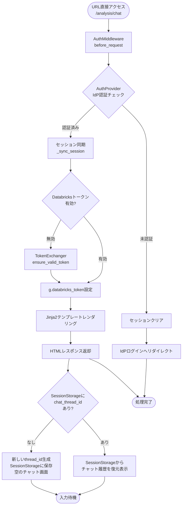
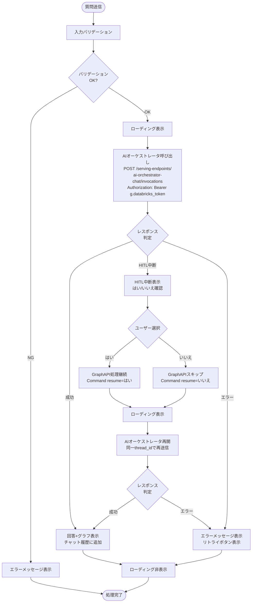
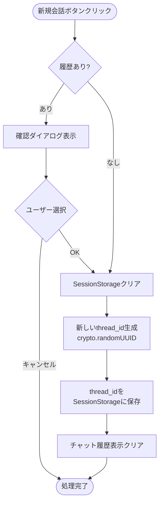
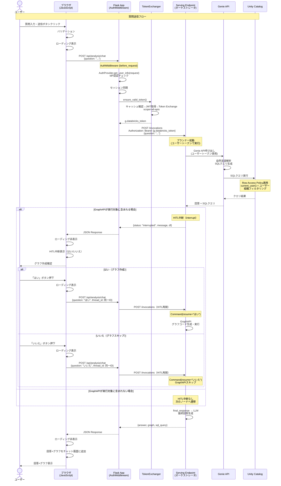
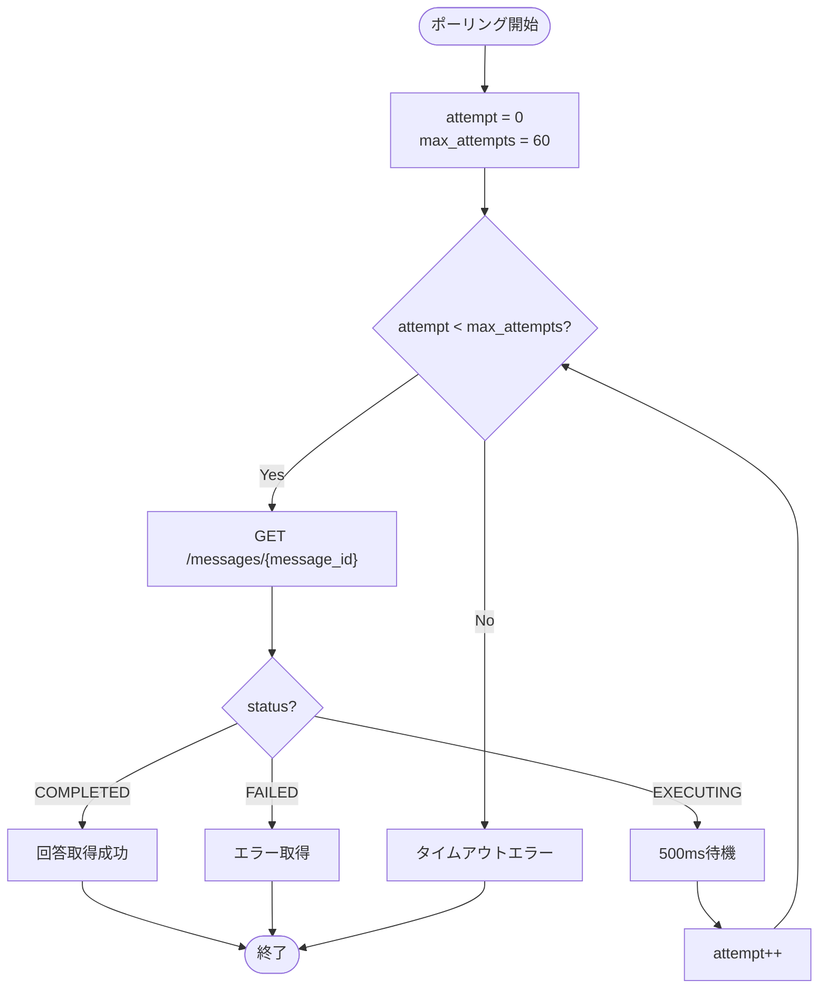
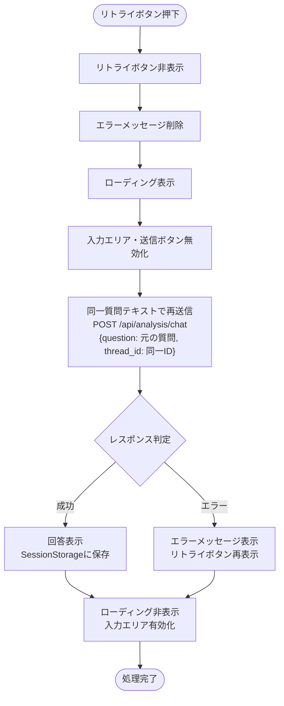
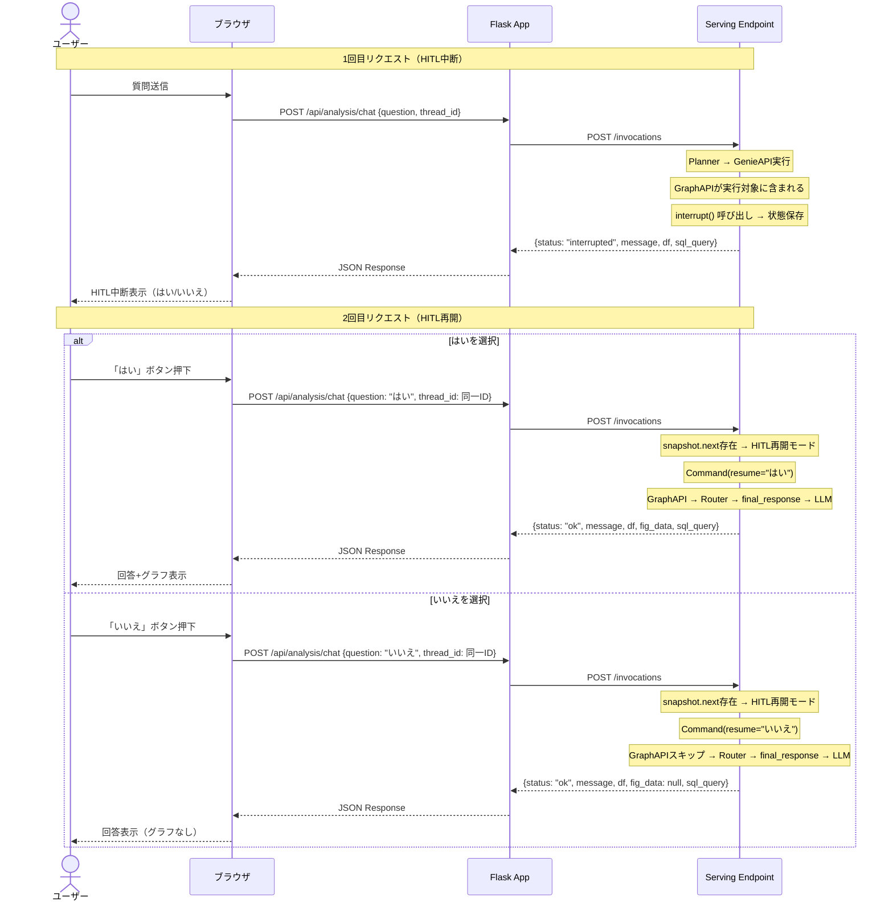
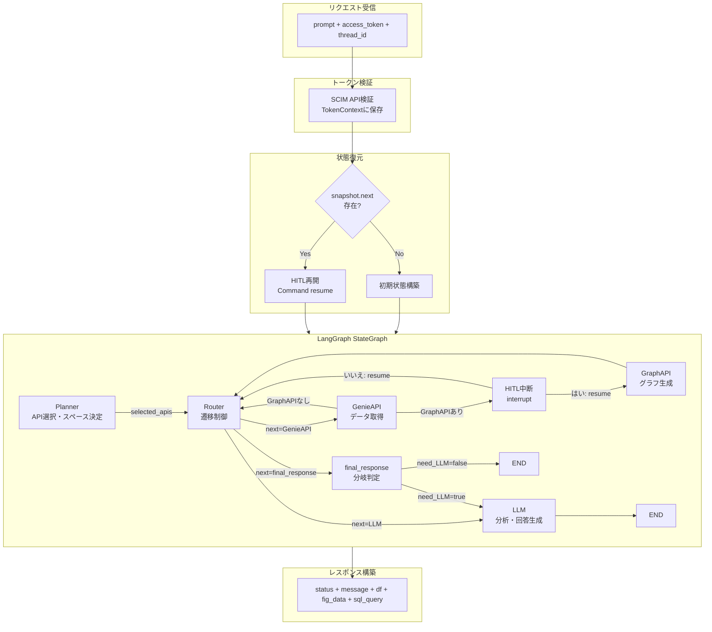

# 対話型AIチャット機能 - ワークフロー仕様書

## 目次

- [対話型AIチャット機能 - ワークフロー仕様書](#対話型aiチャット機能---ワークフロー仕様書)
  - [目次](#目次)
  - [概要](#概要)
  - [使用するFlaskルート一覧](#使用するflaskルート一覧)
    - [画面表示ルート](#画面表示ルート)
    - [APIルート](#apiルート)
  - [ワークフロー一覧](#ワークフロー一覧)
    - [チャット画面初期表示](#チャット画面初期表示)
      - [処理フロー](#処理フロー)
      - [Flaskルート実装例](#flaskルート実装例)
    - [質問送信処理](#質問送信処理)
      - [処理フロー](#処理フロー-1)
      - [APIリクエスト・レスポンス仕様](#apiリクエストレスポンス仕様)
      - [Flask API実装例](#flask-api実装例)
    - [新規会話開始処理](#新規会話開始処理)
      - [処理フロー](#処理フロー-2)
    - [会話履歴管理方式](#会話履歴管理方式)
      - [設計方針](#設計方針)
      - [2層構造](#2層構造)
      - [SessionStorageのデータ構造](#sessionstorageのデータ構造)
      - [thread\_idのライフサイクル](#thread_idのライフサイクル)
  - [Genie API連携仕様](#genie-api連携仕様)
    - [API概要](#api概要)
    - [会話開始API](#会話開始api)
    - [メッセージ送信API](#メッセージ送信api)
    - [メッセージ取得API](#メッセージ取得api)
    - [クエリ結果取得API](#クエリ結果取得api)
  - [シーケンス図](#シーケンス図)
    - [質問応答フロー](#質問応答フロー)
    - [GenieAPIノード内部のポーリング処理](#genieapiノード内部のポーリング処理)
  - [エラーハンドリング](#エラーハンドリング)
    - [エラー分類](#エラー分類)
    - [クライアントサイドエラーハンドリング](#クライアントサイドエラーハンドリング)
  - [AIオーケストレータ詳細仕様](#aiオーケストレータ詳細仕様)
    - [Serving Endpointの入出力処理](#serving-endpointの入出力処理)
      - [リクエスト受信・入力正規化](#リクエスト受信入力正規化)
      - [トークン検証処理](#トークン検証処理)
      - [会話状態の復元と初期化](#会話状態の復元と初期化)
      - [エージェントグラフの実行](#エージェントグラフの実行)
      - [レスポンス構築処理](#レスポンス構築処理)
      - [HITL中断処理（Human-in-the-Loop）](#hitl中断処理human-in-the-loop)
    - [エージェントノード間のデータフロー](#エージェントノード間のデータフロー)
    - [ノード間のstate受け渡し](#ノード間のstate受け渡し)
    - [Plannerノード処理詳細](#plannerノード処理詳細)
    - [GenieAPIノード処理詳細](#genieapiノード処理詳細)
    - [GraphAPIノード処理詳細](#graphapiノード処理詳細)
    - [LLMノード処理詳細](#llmノード処理詳細)
    - [会話状態の永続化処理](#会話状態の永続化処理)
  - [セキュリティ実装](#セキュリティ実装)
    - [認証・認可](#認証認可)
    - [認可ロジック](#認可ロジック)
    - [Row Access Policy](#row-access-policy)
      - [概要](#概要-1)
      - [適用対象ビュー](#適用対象ビュー)
      - [フィルタリング動作](#フィルタリング動作)
      - [ユーザープリンシパルの伝搬フロー](#ユーザープリンシパルの伝搬フロー)
    - [動的コード実行のサンドボックス化](#動的コード実行のサンドボックス化)
      - [サンドボックス設計方針](#サンドボックス設計方針)
      - [L1: コード静的解析](#l1-コード静的解析)
      - [L2: 制限付き実行名前空間](#l2-制限付き実行名前空間)
      - [L3: 実行タイムアウト](#l3-実行タイムアウト)
      - [L4: Serving Endpointコンテナ隔離](#l4-serving-endpointコンテナ隔離)
    - [入力サニタイズ](#入力サニタイズ)
    - [ログ出力](#ログ出力)
  - [パフォーマンス最適化](#パフォーマンス最適化)
    - [タイムアウト設定](#タイムアウト設定)
    - [接続プール](#接続プール)
    - [フロントエンド最適化](#フロントエンド最適化)
  - [関連ドキュメント](#関連ドキュメント)
    - [画面仕様](#画面仕様)
    - [API仕様](#api仕様)
    - [アーキテクチャ設計](#アーキテクチャ設計)
    - [共通仕様](#共通仕様)
    - [要件定義](#要件定義)
  - [変更履歴](#変更履歴)

---

## 概要

このドキュメントは、対話型AIチャット機能（FR-006-3）のユーザー操作に対する処理フロー、Genie API連携、エラーハンドリングの詳細を記載します。

**このドキュメントの役割:**

- Flask独自チャットUI画面の表示処理
- Databricks Genie APIとの連携フロー
- 質問送信から回答取得までの非同期処理
- Unity Catalog動的ビューによるデータアクセス制御
- エラーハンドリングフロー

**実装範囲:**

| 領域               | 実装内容                                                             | 責任             |
| ------------------ | -------------------------------------------------------------------- | ---------------- |
| Flask App          | チャットUI（HTML/CSS/JavaScript）、AuthMiddleware認証                | 本設計書         |
| Flask Backend      | TokenExchanger（OAuth 2.0 Token Exchange）、Serving Endpoint呼び出し | 本設計書         |
| Databricks Serving | AIオーケストレータAPI（Genie連携、グラフ生成、回答生成）             | Databricks側設定 |
| Databricks         | Genie Space設定、動的ビュー、Row Access Policy                       | Databricks側設定 |

**UI仕様書との役割分担:**

- **UI仕様書**: 画面レイアウト、UI要素定義、状態遷移
- **ワークフロー仕様書**: API仕様、処理フロー、Genie連携詳細

---

## 使用するFlaskルート一覧

この機能で使用するすべてのFlaskルート（エンドポイント）を記載します。

### 画面表示ルート

| No  | ルート名         | エンドポイント | メソッド | 用途             | レスポンス形式 |
| --- | ---------------- | -------------- | -------- | ---------------- | -------------- |
| 1   | チャット画面表示 | `/analysis/chat`        | GET      | チャット画面表示 | HTML           |

### APIルート

| No  | ルート名    | エンドポイント | メソッド | 用途                   | レスポンス形式 |
| --- | ----------- | -------------- | -------- | ---------------------- | -------------- |
| 2   | 質問送信API | `/api/analysis/chat`    | POST     | 質問を送信し回答を取得 | JSON           |

**Blueprint構成:** `chat_bp`

---

## ワークフロー一覧

### チャット画面初期表示

**トリガー:** URL直接アクセス時（`/analysis/chat`へのアクセス）

**前提条件:**

- ユーザーがログイン済み（AuthMiddlewareによるIdP認証完了）

#### 処理フロー



#### Flaskルート実装例

```python
from flask import Blueprint, render_template, g, session

chat_bp = Blueprint('chat', __name__)

@chat_bp.route('/analysis/chat', methods=['GET'])
def show_chat():
    """チャット画面を表示

    注: 認証チェック・トークン取得はAuthMiddleware（before_request）で実行済み。
    g.current_user_id, g.databricks_token, session['email'] が利用可能。

    会話履歴の復元はフロントエンド（SessionStorage）で行う。
    サーバーサイドではHTMLテンプレートのレンダリングのみ実行。
    """
    return render_template('chat/index.html',
                          user_email=session.get('email'))
```

**注:** 会話履歴の復元・表示はフロントエンドのJavaScriptがSessionStorageから行う。サーバーサイドでの履歴取得処理は不要。詳細は[UI仕様書のJavaScript実装例](./ui-specification.md)を参照。

---

### 質問送信処理

**トリガー:** ユーザーが質問を入力して送信ボタンをクリック

**前提条件:**

- ユーザーがログイン済み
- 質問テキストが入力されている（1〜1000文字）

#### 処理フロー



#### APIリクエスト・レスポンス仕様

**リクエスト:**

```json
POST /api/analysis/chat
Content-Type: application/json

{
    "question": "昨日の第1冷凍庫の平均温度は？",
    "thread_id": "01234567-89ab-cdef-0123-456789abcdef"
}
```

| フィールド  | 型     | 必須 | 説明                                               |
| ----------- | ------ | ---- | -------------------------------------------------- |
| `question`  | string | Yes  | ユーザーの質問テキスト（1〜1000文字）              |
| `thread_id` | string | Yes  | 会話スレッドID（UUID）。フロントエンドで生成・管理 |

**レスポンス（成功 - 正常完了）:**

```json
{
    "success": true,
    "thread_id": "01234567-89ab-cdef-0123-456789abcdef",
    "status": "ok",
    "message": "昨日（2026/02/03）の第1冷凍庫の平均温度は **-18.5℃** でした。\n\n詳細:\n- 最高温度: -17.2℃\n- 最低温度: -19.8℃",
    "df": [{"avg_temp": -18.5}],
    "fig_data": null,
    "sql_query": "SELECT AVG(internal_temp_freezer_1) as avg_temp FROM sensor_data_view WHERE DATE(event_timestamp) = '2026-02-03'"
}
```

**レスポンス（成功 - HITL中断）:**

```json
{
    "success": true,
    "thread_id": "01234567-89ab-cdef-0123-456789abcdef",
    "status": "interrupted",
    "message": "以下のデータを取得しました。グラフを作成しますか？",
    "df": [{"date": "2026-02-03", "avg_temp": -18.5}],
    "fig_data": null,
    "sql_query": "SELECT ..."
}
```

| フィールド  | 型           | 説明                                                             |
| ----------- | ------------ | ---------------------------------------------------------------- |
| `success`   | boolean      | リクエスト処理の成否                                             |
| `thread_id` | string       | 会話スレッドID                                                   |
| `status`    | string       | オーケストレータの処理結果（`"ok"`, `"interrupted"`, `"error"`） |
| `message`   | string       | 回答テキスト（Markdown形式）またはエラーメッセージ               |
| `df`        | array\|null  | 取得データ（JSON配列）。データなしの場合は`null`                 |
| `fig_data`  | object\|null | Plotlyグラフオブジェクト（JSON）。グラフなしの場合は`null`       |
| `sql_query` | string\|null | Genieが生成したSQLクエリ                                         |

**レスポンス（エラー）:**

```json
{
    "success": false,
    "error_code": "ORCHESTRATOR_ERROR",
    "error_message": "回答の生成に失敗しました。しばらく経ってから再度お試しください。"
}
```

#### Flask API実装例

**注:** Flask側の質問送信処理は、AuthMiddleware（`before_request`）で認証・トークン取得が完了した後に実行されます。`g.databricks_token`でユーザーのDatabricksトークンにアクセスできます。詳細な認証処理は[セキュリティ実装](#セキュリティ実装)セクションおよび[認証仕様書](../../common/authentication-specification.md)を参照してください。

```python
import requests
from flask import jsonify, request, g
from config import Config

@chat_bp.route('/api/analysis/chat', methods=['POST'])
def send_question():
    """質問を送信してAIオーケストレータから回答を取得

    注: 認証チェック・トークン取得はAuthMiddleware（before_request）で実行済み。
    g.databricks_token が利用可能。認証失敗時はミドルウェアでリダイレクト済み。
    """
    data = request.get_json()
    question = sanitize_question(data.get('question', '').strip())
    thread_id = data.get('thread_id', '').strip()

    # バリデーション
    if not question:
        return jsonify({
            "success": False,
            "error_code": "VALIDATION_ERROR",
            "error_message": "質問を入力してください"
        }), 400

    if len(question) > 1000:
        return jsonify({
            "success": False,
            "error_code": "VALIDATION_ERROR",
            "error_message": "質問は1000文字以内で入力してください"
        }), 400

    if not thread_id:
        return jsonify({
            "success": False,
            "error_code": "VALIDATION_ERROR",
            "error_message": "thread_idが指定されていません"
        }), 400

    if not uuid.UUID(thread_id):
        return jsonify({
            "success": False,
            "error_code": "VALIDATION_ERROR",
            "error_message": "無効なthread_idが指定されました"
        }), 400

    try:
        # Serving Endpoint（AIオーケストレータ）を呼び出し
        # g.databricks_token はAuthMiddlewareで取得・検証済み
        result = call_orchestrator_endpoint(
            question=question,
            thread_id=thread_id,
            user_token=g.databricks_token
        )

        return jsonify({
            "success": True,
            "thread_id": thread_id,
            **result
        })

    except Exception as e:
        return jsonify({
            "success": False,
            "error_code": "ORCHESTRATOR_ERROR",
            "error_message": "回答の生成に失敗しました"
        }), 500


def call_orchestrator_endpoint(
    question: str,
    thread_id: str,
    user_token: str
) -> dict:
    """AIオーケストレータAPIを呼び出す（ユーザートークンで実行）

    Args:
        question: ユーザーの質問テキスト
        thread_id: 会話スレッドID（LangGraph Checkpointerのキー）
        user_token: ユーザーのDatabricksトークン
    """
    response = requests.post(
        f"https://{Config.DATABRICKS_HOST}/serving-endpoints/ai-orchestrator-chat/invocations",
        headers={
            "Authorization": f"Bearer {user_token}",
            "Content-Type": "application/json"
        },
        json={
            "dataframe_records": [{
                "prompt": question,
                "access_token": user_token,
                "thread_id": thread_id
            }]
        },
        timeout=60
    )

    response.raise_for_status()
    result = response.json()

    # Serving Endpointのレスポンスから predictions を取得
    prediction = result.get("predictions", result)

    return {
        "status": prediction.get("status"),
        "message": prediction.get("message"),
        "df": prediction.get("df"),
        "fig_data": prediction.get("fig_data"),
        "sql_query": prediction.get("sql_query")
    }
```

---

### 新規会話開始処理

**トリガー:** ユーザーが「新しい会話を開始」ボタンをクリック

**前提条件:**

- ユーザーがログイン済み

#### 処理フロー



**処理内容:**

1. フロントエンドでSessionStorageのチャット履歴と`thread_id`をクリア
2. 新しいUUID（`crypto.randomUUID()`）を生成し、SessionStorageに保存
3. チャット画面の表示をクリア

**注:** サーバーサイドAPIの呼び出しは不要。`thread_id`はフロントエンドで管理し、次回の`/api/analysis/chat`リクエスト時に新しい`thread_id`が送信されることで、オーケストレータ側のLangGraph Checkpointerが新しい会話として処理する。

---

### 会話履歴管理方式

本機能では**SessionStorage + LangGraph Checkpointerのハイブリッド方式**で会話履歴を管理する。

#### 設計方針

| 項目                 | 方式                                     | 説明                                                |
| -------------------- | ---------------------------------------- | --------------------------------------------------- |
| 表示用チャット履歴   | SessionStorage（フロントエンド）         | 質問・回答テキスト・グラフ・SQL等をブラウザ側で保持 |
| 会話スレッドID       | SessionStorage（フロントエンド）         | `thread_id`（UUID）をフロントエンドで生成・管理     |
| エージェント会話状態 | LangGraph Checkpointer（サーバーサイド） | `thread_id`をキーにDelta Tableへ自動永続化          |

#### 2層構造

```text
┌─────────────────────────────────────────────────┐
│ フロントエンド（SessionStorage）                │
│                                                 │
│  thread_id: "uuid-xxx"                          │
│  chatHistory: [                                 │
│    {role: "user", content: "質問テキスト"},      │
│    {role: "ai", content: "回答テキスト",         │
│     df: [...], fig_data: {...}, sql_query: "..."} │
│  ]                                              │
└──────────────────────┬──────────────────────────┘
                       │ POST /api/analysis/chat
                       │ {question, thread_id}
                       ▼
┌─────────────────────────────────────────────────┐
│ サーバーサイド（LangGraph Checkpointer）        │
│                                                 │
│  Delta Table: checkpoint テーブル               │
│  キー: thread_id                                │
│  保存内容: messages, selected_apis, space 等    │
│  ※ dataframe, fig_data は容量削減のためNull化  │
└─────────────────────────────────────────────────┘
```

#### SessionStorageのデータ構造

```json
{
  "chat_thread_id": "01234567-89ab-cdef-0123-456789abcdef",
  "chat_history": [
    {
      "role": "user",
      "content": "昨日の第1冷凍庫の平均温度は？",
      "timestamp": "2026-02-04T10:32:00Z"
    },
    {
      "role": "ai",
      "content": "昨日の第1冷凍庫の平均温度は **-18.5℃** でした。",
      "status": "ok",
      "df": [{"avg_temp": -18.5}],
      "fig_data": null,
      "sql_query": "SELECT AVG(...) FROM ...",
      "timestamp": "2026-02-04T10:32:15Z"
    }
  ]
}
```

#### thread_idのライフサイクル

| イベント                 | thread_id の動作                           | SessionStorage     | Checkpointer                              |
| ------------------------ | ------------------------------------------ | ------------------ | ----------------------------------------- |
| 初回アクセス（タブ起動） | 新規UUID生成、SessionStorageに保存         | 空で初期化         | 未作成（初回リクエスト時に生成）          |
| 質問送信                 | SessionStorageから取得してリクエストに付与 | 回答を追記         | ノード実行ごとに自動保存                  |
| ブラウザリロード         | SessionStorageから復元（タブ内なら残存）   | 表示用履歴も復元   | 変化なし（永続化済み）                    |
| 新規会話ボタン           | 新規UUID生成、SessionStorageを上書き       | クリアして再初期化 | 旧thread_idのデータは残存（参照されない） |
| タブを閉じる             | SessionStorage消失                         | 消失               | 変化なし（永続化済み）                    |


---

## Genie API連携仕様

### API概要

Databricks Genie APIを使用して、自然言語による質問を処理し、回答を生成します。

| 項目      | 内容                                               |
| --------- | -------------------------------------------------- |
| ベースURL | `https://<workspace>.databricks.com/api/2.0/genie` |
| 認証      | Bearer Token（Databricks Personal Access Token）   |
| Space ID  | 環境変数 `GENIE_SPACE_ID`                          |

### 会話開始API

新しい会話を開始し、最初の質問を送信します。

**エンドポイント:**

```text
POST /api/2.0/genie/spaces/{space_id}/start-conversation
```

**リクエスト:**

```json
{
    "content": "昨日の第1冷凍庫の平均温度は？"
}
```

**レスポンス:**

```json
{
    "conversation_id": "01234567-89ab-cdef-0123-456789abcdef",
    "message_id": "msg_01234567",
    "status": "EXECUTING"
}
```

### メッセージ送信API

既存の会話にメッセージを送信します。

**エンドポイント:**

```text
POST /api/2.0/genie/spaces/{space_id}/conversations/{conversation_id}/messages
```

**リクエスト:**

```json
{
    "content": "同じ期間の第2冷凍庫は？"
}
```

**レスポンス:**

```json
{
    "message_id": "msg_01234568",
    "status": "EXECUTING"
}
```

### メッセージ取得API

メッセージの詳細と回答を取得します。ポーリングで使用します。

**エンドポイント:**

```text
GET /api/2.0/genie/spaces/{space_id}/conversations/{conversation_id}/messages/{message_id}
```

**レスポンス（処理中）:**

```json
{
    "id": "msg_01234567",
    "status": "EXECUTING",
    "created_at": "2026-02-04T10:30:00Z"
}
```

**レスポンス（完了）:**

```json
{
    "id": "msg_01234567",
    "status": "COMPLETED",
    "content": "昨日（2026/02/03）の第1冷凍庫の平均温度は -18.5℃ でした。",
    "attachments": [
        {
            "type": "QUERY",
            "query": {
                "query": "SELECT AVG(internal_temp_freezer_1) as avg_temp FROM sensor_data_view WHERE DATE(event_timestamp) = '2026-02-03'",
                "description": "第1冷凍庫の平均温度を計算"
            }
        }
    ],
    "created_at": "2026-02-04T10:30:00Z"
}
```

**レスポンス（失敗）:**

```json
{
    "id": "msg_01234567",
    "status": "FAILED",
    "error": {
        "code": "QUERY_EXECUTION_ERROR",
        "message": "クエリの実行に失敗しました"
    },
    "created_at": "2026-02-04T10:30:00Z"
}
```

### クエリ結果取得API

生成されたSQLクエリの実行結果を取得します。

**エンドポイント:**

```text
GET /api/2.0/genie/spaces/{space_id}/conversations/{conversation_id}/messages/{message_id}/query-result
```

**レスポンス:**

```json
{
    "statement_response": {
        "status": {
            "state": "SUCCEEDED"
        },
        "manifest": {
            "schema": {
                "columns": [
                    {"name": "avg_temp", "type_name": "DOUBLE"}
                ]
            }
        },
        "result": {
            "data_array": [
                ["-18.5"]
            ]
        }
    }
}
```

---

## シーケンス図

### 質問応答フロー

ユーザーが質問してから回答を受け取るまでの全体フローです。



### GenieAPIノード内部のポーリング処理

ServingEndpoint上で実行されているAIオーケストレータのうち、GenieAPIノード内において実装するポーリングの使用は以下のフローに従う



---

## エラーハンドリング

### エラー分類

| HTTPステータス | エラーコード       | 発生箇所  | 表示メッセージ                       | 対応                       |
| -------------- | ------------------ | --------- | ------------------------------------ | -------------------------- |
| 200            | -                  | -         | -                                    | 正常                       |
| 400            | VALIDATION_ERROR   | Flask     | 「質問を入力してください」等         | 入力修正を促す             |
| 401            | AUTH_ERROR         | Flask     | -                                    | ログイン画面へリダイレクト |
| 500            | ORCHESTRATOR_ERROR | Endpoint  | 「回答の生成に失敗しました」         | リトライボタン表示         |
| 500            | GENIE_ERROR        | Genie API | 「回答の生成に失敗しました」         | リトライボタン表示         |
| 500            | GENIE_TIMEOUT      | Flask     | 「回答の取得がタイムアウトしました」 | リトライボタン表示         |
| 500            | NETWORK_ERROR      | Flask     | 「接続エラーが発生しました」         | リトライボタン表示         |

### クライアントサイドエラーハンドリング

```javascript
async function handleAPIResponse(response, data, originalQuestion) {
    if (!data.success) {
        switch (data.error_code) {
            case 'VALIDATION_ERROR':
                showInlineError(data.error_message);
                break;
            case 'AUTH_ERROR':
                window.location.href = '/login';
                break;
            case 'GENIE_ERROR':
            case 'GENIE_TIMEOUT':
            case 'NETWORK_ERROR':
            case 'ORCHESTRATOR_ERROR':
                showErrorMessage(data.error_message, {
                    showRetry: true,
                    onRetry: () => handleRetry(originalQuestion)
                });
                break;
            default:
                showErrorMessage('予期しないエラーが発生しました');
        }
        return;
    }

    // 成功時の処理
    addAIMessage(data);
}
```

**リトライボタン押下時の処理フロー:**



---

## AIオーケストレータ詳細仕様

本セクションでは、Databricks Model Serving Endpoint上で稼働するAIオーケストレータの内部処理を詳述する。

### Serving Endpointの入出力処理

#### リクエスト受信・入力正規化

Serving Endpointは、Flask Backend APIからのHTTP POSTリクエストを受信する。MLflow PythonModelの`predict`メソッドが呼び出され、以下の処理を行う。

**入力正規化処理:**

1. `model_input`がDataFrameの場合、`.to_dict(orient="records")[0]`で辞書に変換
2. `model_input`が辞書の場合、そのまま使用
3. 上記以外の型は`ValueError`を送出

**入力フィールド:**

| フィールド     | 型     | 説明                         |
| -------------- | ------ | ---------------------------- |
| `prompt`       | string | ユーザーの質問テキスト       |
| `access_token` | string | ユーザーのDatabricksトークン |
| `thread_id`    | string | 会話スレッドID（UUID）       |

#### トークン検証処理

リクエスト受信後、ユーザートークンの有効性を検証する。

**検証フロー:**

```text
1. access_tokenの存在チェック
   - 未設定の場合 → エラーレスポンス返却
   ↓
2. Databricks SCIM API呼び出し
   - GET /api/2.0/preview/scim/v2/Me
   - Authorization: Bearer {access_token}
   - タイムアウト: 5秒
   ↓
3. HTTPステータスコード判定
   - 200: トークン有効 → TokenContextに保存して処理続行
   - 401: トークン無効 → エラーレスポンス返却
   - 403: 権限不足 → エラーレスポンス返却
```

TokenContextはスレッドローカルな辞書オブジェクトで、検証済みトークンを`auth_token`キーで保存する。以降のGenie API呼び出し、SQL実行、ファイルアップロード等で共通参照される。

#### 会話状態の復元と初期化

トークン検証後、会話の継続/新規を判定する。

**判定ロジック:**

```text
1. LangGraph Checkpointerからスナップショットを取得
   - thread_idに紐づく最新チェックポイントをDelta Tableから読み出し
   ↓
2. snapshot.nextが存在するか判定
   - 存在する場合（HITL再開モード）:
     → Command(resume=prompt, update={"prompt": prompt})で中断処理を再開
   - 存在しない場合（通常モード）:
     → 初期状態を構築して新規ターンを開始
```

**初期状態の構成:**

| フィールド                | 初期値                 |
| ------------------------- | ---------------------- |
| `prompt`                  | ユーザーの質問テキスト |
| `messages`                | `[]`（空リスト）       |
| `sql_query`               | `""`（空文字列）       |
| `genie_download_url`      | `None`                 |
| `dataframe`               | `None`                 |
| `fig_data`                | `None`                 |
| `next_api_index`          | `0`                    |
| `need_LLM`                | `False`                |
| `Error`                   | `False`                |
| `selected_apis`           | `[]`（空リスト）       |
| `space`                   | `None`                 |
| `genie_conversation_info` | `None`                 |

#### エージェントグラフの実行

初期化された状態をLangGraph StateGraphに投入し、ストリーミングモードで実行する。

**実行方式:**

- `agent.stream(state, config=config, stream_mode="updates")`でノード単位の更新をイテレーション
- 各チャンク（ノード出力）を逐次処理し、最終チャンクを保持
- 中断ペイロード（`__interrupt__`）が検出された場合はループを即座に終了

**中断ペイロードの検出:**

- チャンクのトップレベルに`__interrupt__`キーが存在する場合
- チャンクのネストされた値の中に`__interrupt__`キーが存在する場合
- 中断時の値（`.value`）をペイロードとして抽出

#### レスポンス構築処理

エージェント実行完了後、最終チャンクからレスポンスを構築する。

**正常完了時:**

1. 最終チャンクからstate情報を抽出（`messages`, `dataframe`, `fig_data`等のキーを探索）
2. `messages`の最終要素（AIMessage）から`content`を取得して回答テキストとする
3. `state["Error"]`が真の場合、ステータスを`"error"`に変更
4. レスポンス辞書を構築して返却

**中断時:**

1. 中断ペイロードから各フィールドを取得し、以下のマッピングでレスポンスを構築:
   - payload["message"]    → response["message"]
   - payload["preview"]    → response["df"]（フィールド名変換）
   - payload["sql_query"]  → response["sql_query"]
   - None                  → response["fig_data"]
2. ステータスを"interrupted"に設定
3. レスポンス辞書を構築して返却


#### HITL中断処理（Human-in-the-Loop）

AIオーケストレータ内で、PlannerがGenieAPIとGraphAPIの両方を実行対象として選択した場合、GenieAPIノードでデータ取得が完了した後にHITL中断が発生する。これはLangGraphの`interrupt()`機構を使用して実装する。

**中断発生条件:**

- GenieAPIノードの処理が正常完了（データ取得成功）
- `selected_apis`にGraphAPIが含まれている

**中断発生箇所:**

GenieAPIノードの処理完了後、GraphAPIノードへの遷移前にLangGraphの`interrupt()`を呼び出す。`interrupt()`を呼び出すと、LangGraphはCheckpointerに現在の状態を保存し、`__interrupt__`ペイロードを返却してグラフの実行を一時停止する。

**中断ペイロード:**

```python
interrupt({
    "message": "以下のデータを取得しました。グラフを作成しますか？",
    "preview": dataframe.head(10).to_dict(orient="records"),
    "sql_query": state["sql_query"],
    "genie_download_url": state["genie_download_url"]
})
```

**HITL中断・再開フロー:**



**再開時の処理分岐:**

| ユーザー選択 | resume値   | 実行フロー                                         | fig_data |
| ------------ | ---------- | -------------------------------------------------- | -------- |
| はい         | `"はい"`   | GraphAPI → Router → final_response → (LLM)         | あり     |
| いいえ       | `"いいえ"` | GraphAPIスキップ → Router → final_response → (LLM) | null     |

**再開時のGraphAPIスキップ実装:**

GenieAPIノード内で`interrupt()`から再開されたとき、resume値を判定する。resume値が`"いいえ"`の場合、GraphAPIへの遷移をスキップしRouterに直接遷移する。

```python
# GenieAPIノード内の中断・再開処理（概念コード）
if "GraphAPI" in [api["api"] for api in state["selected_apis"]]:
    # HITL中断: ユーザーにグラフ作成を確認
    user_response = interrupt({
        "message": "以下のデータを取得しました。グラフを作成しますか？",
        "preview": df.head(10).to_dict(orient="records"),
        "sql_query": state["sql_query"],
        "genie_download_url": state.get("genie_download_url")
    })

    if user_response == "いいえ":
        # GraphAPIをselected_apisから除外してスキップ
        updated_apis = [
            api for api in state["selected_apis"]
            if api["api"] != "GraphAPI"
        ]
        return {**result, "selected_apis": updated_apis}
```

### エージェントノード間のデータフロー



### ノード間のstate受け渡し

各ノードはAgentState（共有状態オブジェクト）を通じてデータを受け渡す。特に`messages`フィールドは各ノードがAIMessageを追加することで、後続ノードにコンテキストを伝搬する。

**各ノードのstate読み書き:**

| ノード             | 読み取るstateフィールド                             | 書き込むstateフィールド                                                                                 | 実行ID                                                 |
| ------------------ | --------------------------------------------------- | ------------------------------------------------------------------------------------------------------- | ------------------------------------------------------ |
| **Planner**        | `prompt`, `messages`                                | `selected_apis`, `space`                                                                                | Endpoint実行ID                                         |
| **Router**         | `selected_apis`, `next_api_index`                   | `next_api_index`, `need_LLM`                                                                            | -（ロジック分岐のみ）                                  |
| **GenieAPI**       | `selected_apis`, `genie_conversation_info`, `space` | `dataframe`, `sql_query`, `genie_conversation_info`, `genie_download_url`, `messages`（+DataFrame要約） | ユーザートークン                                       |
| **GraphAPI**       | `sql_query`, `prompt`, `dataframe`, `Error`         | `fig_data`, `messages`（+グラフ解説文）                                                                 | SQL実行: ユーザートークン / コード生成: Endpoint実行ID |
| **final_response** | `need_LLM`                                          | -（分岐判定のみ）                                                                                       | -（ロジック分岐のみ）                                  |
| **LLM**            | `selected_apis`, `dataframe`, `messages`            | `messages`（+最終回答）                                                                                 | Endpoint実行ID                                         |

**実行IDの使い分け:**

- **ユーザートークン（`TokenContext.auth_token`）**: データアクセスを伴う処理（GenieAPI呼び出し、SQL実行、CSVアップロード）。Row Access Policyの正しい適用に必須
- **Endpoint実行ID（ChatDatabricks）**: LLMによるテキスト生成処理（Planner、GraphAPIのコード生成、LLMノード）。ユーザーデータへの直接アクセスは行わないため、Endpointのサービス資格情報で実行

**messages経由のデータ伝搬（GenieAPI → GraphAPI → LLM の場合）:**

```text
GenieAPI実行
  → state.messages += AIMessage("DataFrame要約: df.info(), df.head(), df.describe()")
    ↓
GraphAPI実行
  → state.messages += AIMessage("グラフ解説: Markdown形式の説明文")
    ↓
LLM実行
  ← state.messages を読み取り（GenieAPI要約 + GraphAPI解説を含む会話履歴）
  ← state.dataframe を読み取り → Advanced Data Analysis実行
  → state.messages += AIMessage("最終回答: Markdown形式")
```

**重要**: LLMノードはGenieAPI/GraphAPIの出力を直接参照するのではなく、各ノードが`messages`に追加したAIMessageを会話履歴として受け取ることでコンテキストを得る。これにより、LLMは先行ノードの処理結果を踏まえた統合的な回答を生成できる。

---

### Plannerノード処理詳細

**入力:** `state.prompt`（ユーザーの質問）、`state.messages`（会話履歴）

**処理フロー:**

```text
1. LLM呼び出し（Claude 4 Sonnet、temperature=0.1）
   - システムプロンプト: API選択ルール・Genieスペース定義を含む
   - ユーザー入力: 質問テキスト
   - 会話履歴: 前回までのメッセージ
   ↓
2. LLM応答パース
   - JSON形式でselected_apis配列を取得
   - 各要素: {api, prompt, space(任意)}
   ↓
3. API重複排除
   - 同一API名のエントリを1つに集約
   ↓
4. Genieスペース解決
   - LLM返却値のspace → 直前会話のspace_id → 設定ファイルの逆引き
   - GenieAPI項目にspaceが未設定の場合は自動補完
   ↓
5. GraphAPI単独選択の補正
   - GraphAPIのみ選択時、GenieAPIを先頭に自動挿入
   - 直前の会話でGenieデータが未取得の場合はエラー
     （"データがみつかりませんでした"メッセージを返却）
   ↓
6. フォールバック処理
   - APIが1つも選択されなかった場合、LLMを自動設定
   ↓
7. 出力: {selected_apis, space(space_id)}
```

**Genieスペース自動選択のシステムプロンプト:**

- 設定ファイルに定義された全スペースの`description`、`keywords`、`examples`を動的にプロンプトに組み込む
- プランナーはキーワードマッチと意味理解によりスペースを選択
- 選択結果は`"space": "SPACE_NAME"`としてJSON出力に含める

### GenieAPIノード処理詳細

**入力:** `state.selected_apis`、`state.genie_conversation_info`、`state.space`

**処理フロー:**

```text
1. 新規データ取得判定（LLM呼び出し）
   - Claude 4 Sonnetに質問と会話履歴を送信
   - {"continue": true}（新規取得）or {"continue": false}（既存データ使用）を判定
   - 判定失敗時はデフォルトで既存データ使用
   ↓
2. スペースID整合性チェック
   - 前回の会話のspace_idと今回のspace_idが異なる場合
     → conversation_infoをリセット（新規会話を開始）
   ↓
3. Genie API呼び出し（3パターン）
   a) 既存データ参照（search=false かつ conversation_info存在）:
      → GET メッセージ取得APIで前回結果を再取得
   b) 初回投稿（conversation_info未設定）:
      → POST 会話開始APIで新規会話を開始
   c) 継続投稿（conversation_info存在 かつ search=true）:
      → POST メッセージ送信APIで既存会話にメッセージ追加
   ↓
4. ポーリング処理
   - GET メッセージ取得APIを繰り返し呼び出し
   - ステータス判定:
     - COMPLETED: 結果処理へ進む
     - FAILED/CANCELED: エラーメッセージを返却
     - その他: 500ms待機して再ポーリング
   - タイムアウト: 30秒
   ↓
5. クエリ結果処理
   - attachments[0].query からSQL、statement_id、descriptionを抽出
   - ステートメントAPI（GET /api/2.0/sql/statements/{statement_id}）で結果取得
   - manifest.schema.columns からカラム名、result.data_array から行データを取得
   - DataFrameを構築
   ↓
6. CSVファイル生成・アップロード（行数1件以上の場合）
   - Databricks SQL ConnectorでSQLを再実行し完全なデータを取得
   - DataFrameをCSV形式（UTF-8 BOM付き）でメモリ上に変換
   - WorkspaceClient（ユーザートークン）でDBFS /FileStore/配下にアップロード
   - ダウンロードURL生成: https://{host}/files/{csv_file_name}
   ↓
7. DataFrame要約情報の生成
   - object型カラムの自動数値変換（pd.to_numeric）
   - df.info()、df.head()、df.describe()（数値カラムのみ）を文字列化
   - 要約情報をAIMessageとして会話履歴に追加
   ↓
8. HITL中断判定
   - selected_apisにGraphAPIが含まれる場合:
     → LangGraph interrupt()を呼び出し、処理を中断
     → 中断ペイロード: {message, preview, sql_query, genie_download_url}
     → ユーザーが「はい」で再開 → GraphAPIへ遷移
     → ユーザーが「いいえ」で再開 → GraphAPIをスキップしRouterへ遷移
   - GraphAPIが含まれない場合:
     → 中断せず次のノードへ遷移
   ↓
9. 出力: {messages, sql_query, genie_conversation_info, genie_download_url, dataframe}
```

### GraphAPIノード処理詳細

**入力:** `state.sql_query`、`state.prompt`、`state.dataframe`

**処理フロー:**

```text
1. 先行ノードエラーチェック
   - state["Error"]が真 → 例外送出して処理中断
   ↓
2. SQLクエリ検証
   - sql_queryが空文字列またはNone → エラーメッセージ返却
   ↓
3. Databricks SQL Connectorでデータ再取得
   - TokenContextからauth_tokenを取得
   - sql.connect()でSQL Warehouseに接続
   - sql_queryを実行してDataFrameを構築
   ↓
4. グラフコード生成（LLM呼び出し）
   - 入力: DataFrame + ユーザーの質問 + SQLクエリ
   - LLM（Claude 4 Sonnet、temperature=0.1）に送信
   - システムプロンプト: Plotly形式のコード生成ルールを指定
   - LLM応答: JSON形式で {python_code, explain} を返却
   ↓
5. 生成コードの前処理
   - 全角記号→半角変換: 、→, 。→. ：→: （→( ）→)
   - 全角スペース→半角スペース変換
   ↓
6. コード静的解析（セキュリティチェック）
   - 禁止パターンの検出: import文、open()、eval()、exec()、
     __builtins__、__import__、getattr()、subprocess、os.system等
   - 禁止パターン検出時はエラーとして処理（コード実行をスキップ）
   ↓
7. コードの動的実行（サンドボックス環境）
   - 制限付き実行名前空間を構築:
     {"df": df, "go": go, "px": px, "pd": pd, "np": np, "print": print, "__builtins__": {}}
   - exec()で前処理済みコードを実行（タイムアウト: 30秒）
   - 実行名前空間から fig 変数（Plotly Figure）を取得
   ↓
8. リトライ機構（最大5回）
   - 実行エラー発生時、エラーメッセージをプロンプトに追記
     （"次のエラー出ないようにしてください:{error}"）
   - 修正されたコードをLLMに再生成させて再実行
   - リトライ時もステップ6の静的解析を再実行
   ↓
9. 結果変換
   - fig.to_json() でPlotly FigureをJSON文字列に変換
   - to_json()が使用不可の場合はNullを設定
   ↓
10. 出力: {fig_data, messages(+explain), sql_query, genie_conversation_info}
```

### LLMノード処理詳細

**入力:** `state.selected_apis`、`state.dataframe`、`state.messages`

**処理フロー:**

```text
1. LLM設定の取得
   - selected_apis から api="LLM" の項目を探索
   - LLM項目のpromptを取得
   - LLM設定が見つからない場合 → "LLM設定なし"メッセージで終了
   ↓
2. 高度データ分析（Advanced Data Analysis）
   - 条件: dataframeが存在する場合に実行
   a) DataFrameスキーマ情報の抽出:
      - JSON文字列→DataFrame復元
      - df.info()でカラム情報取得
      - object型/category型のユニーク値を抽出（20件未満は全数、以上はTop10）
      - df.head(3)でサンプル行を取得
   b) 分析コード生成（LLM呼び出し）:
      - スキーマ情報 + ユーザー質問をClaude 4 Sonnetに送信
      - システムプロンプト: Pandas分析コード生成ルールを指定
      - 外部ファイル読み込み禁止、グラフ描画禁止、print()必須
   c) コード前処理:
      - Markdownコードブロック（```python...```）の抽出
   d) コード静的解析（セキュリティチェック）:
      - 禁止パターンの検出（GraphAPIノードと同一ルール）
      - 禁止パターン検出時はエラーとして処理
   e) コード実行（サンドボックス環境）:
      - 制限付き実行名前空間: {"df": df, "pd": pd, "np": np, "__builtins__": {}}
      - sys.stdoutをStringIOにリダイレクトしてprint出力をキャプチャ
      - exec()で生成コードを実行（タイムアウト: 30秒）
      - 最大5回のリトライ（リトライ時も静的解析を再実行）
   f) 結果: print出力テキストを分析結果として返却
   ↓
3. 最終回答生成（LLM呼び出し）
   - API選択パターンに応じてプロンプトを切り替え:
     a) LLMのみ選択時:
        - 汎用AIアシスタントプロンプトを使用
        - ユーザーの質問に対して直接回答
     b) 他APIとの組み合わせ時:
        - データ分析プロンプトを使用
        - ユーザー質問 + 分析結果（Advanced Data Analysisの出力）をコンテキストに含める
   - LLM応答: JSON形式 {"message": "回答テキスト(Markdown形式)"}
   ↓
4. 出力: {messages(+回答), dataframe, sql_query, fig_data, genie_conversation_info}
```

### 会話状態の永続化処理

エージェントグラフの各ノード実行後、LangGraph Checkpointerが自動的に状態をDelta Tableに保存する。

**保存前の最適化処理:**

```text
1. メッセージトリミング
   - 往復数制限: HumanMessageの数で最大15往復
     → 超過分は古いメッセージから削除
   - サイズ制限: 全メッセージのUTF-8バイト合計で最大512KB
     → 超過分は古いメッセージから削除
   ↓
2. 大容量データの除外
   - dataframe → Null に置換
   - fig_data → Null に置換
   （容量削減のため、チェックポイントにはデータ本体を保存しない）
   ↓
3. シリアライズ
   - JsonPlusSerializer でオブジェクトをバイナリ化
   - Base64エンコードしてJSON文字列に変換
   - Delta TableのSTRINGカラムに保存
```

**DB接続管理:**

- Databricks SQL Connectorによる接続プール管理
- access_tokenをキーとしたコネクション再利用（キャッシュ）
- 接続有効性を`SELECT 1`で確認、切断時は再接続

---

## セキュリティ実装

### 認証・認可

本機能の認証処理は、認証共通モジュール（AuthMiddleware + AuthProvider + TokenExchanger）を使用する。各画面ルート・APIルートでの個別認証は不要であり、`before_request`フックで一元的に処理される。

認証アーキテクチャの詳細（AuthMiddleware処理フロー、環境別AuthProvider、TokenExchangerによるOAuth 2.0 Token Exchange、トークンキャッシュ戦略、エラーハンドリング）は [認証仕様書](../../common/authentication-specification.md) を参照。

本機能で使用する認証関連の主要インターフェース:

| 項目             | 内容                                                            |
| ---------------- | --------------------------------------------------------------- |
| トークンアクセス | `g.databricks_token`（AuthMiddlewareで事前セット済み）          |
| ユーザー情報     | `g.current_user_id`、`session['email']`（AuthMiddlewareで設定） |

### 認可ロジック

| レベル                 | 制御内容               | 実装方法                      |
| ---------------------- | ---------------------- | ----------------------------- |
| **L1: 画面アクセス**   | 全ロールがアクセス可能 | AuthMiddleware（IdP認証のみ） |
| **L2: データアクセス** | 所属組織+下位組織のみ  | Row Access Policy             |
| **L3: 機能制限**       | ロール別機能制限なし   | -                             |

**データアクセス制御:**

- Serving Endpointがユーザートークン（`g.databricks_token`）でGenie APIを呼び出す
- Genie APIがUnity CatalogでSQLを実行
- `current_user()` = ユーザーのメールアドレス
- Row Access Policyが自動適用
- ユーザーの所属組織+配下組織のデータのみ返却

### Row Access Policy

#### 概要

Unity CatalogのRow Access Policyにより、ユーザーの所属組織に基づいてデータを自動フィルタリングします。

**重要**: ユーザートークン（`g.databricks_token`）でServing Endpointを実行することで、`current_user()`がユーザーのメールアドレスを返し、Row Access Policyが正しく適用されます。

#### 適用対象ビュー

- `iot_catalog.views.sensor_data_view`
- `iot_catalog.views.daily_summary_view`
- `iot_catalog.views.monthly_summary_view`
- `iot_catalog.views.yearly_summary_view`

#### フィルタリング動作

```sql
-- ユーザーがクエリを実行
SELECT * FROM iot_catalog.views.sensor_data_view;

-- Row Access Policyにより自動的に以下のように変換
SELECT * FROM iot_catalog.views.sensor_data_view
WHERE organization_id IN (
    -- current_user() = ユーザーのメールアドレス
    SELECT oc.subsidiary_organization_id
    FROM iot_catalog.oltp_db.organization_closure oc
    INNER JOIN iot_catalog.oltp_db.user_master um
        ON oc.parent_organization_id = um.organization_id
    WHERE um.email = current_user()
);
```

#### ユーザープリンシパルの伝搬フロー

```text
1. Flask App（AuthMiddleware）
   - AuthProvider.get_user_info(request) でユーザー認証
   - ユーザー: user@example.com
   ↓
2. TokenExchanger（OAuth 2.0 Token Exchange）
   - IdP JWT → Databricksトークン（user@example.com用）
   - scope=all-apis
   - g.databricks_token にセット
   ↓
3. Serving Endpoint呼び出し
   - Authorization: Bearer {g.databricks_token}
   ↓
4. Serving Endpoint内（オーケストレータ）
   - TokenContext.auth_token = ユーザートークン
   ↓
5. GenieAPI / SQL実行 → ユーザートークンで実行
   - TokenContext.auth_token を使用
   - current_user() = "user@example.com"
   ↓
6. LLM呼び出し（ChatDatabricks）→ Endpoint実行IDで実行
   - Endpointのサービス資格情報を使用
   - テキスト生成のみ（データアクセスなし）
   ↓
7. Unity Catalog SQLクエリ実行
   - Row Access Policy自動適用
   - WHERE organization_id IN (ユーザーの組織ID...)
   ↓
8. データ返却
   - ユーザーの所属組織+配下組織のデータのみ
```

**セキュリティ保証:**

- データアクセスを伴う処理（GenieAPI、SQL実行、CSVアップロード）はユーザートークンで実行される
- `current_user()`がユーザーのメールアドレスを返す
- Row Access Policyが透過的に適用される
- アプリケーション層での追加フィルタリング不要
- LLM呼び出しはEndpoint実行IDだが、テキスト生成処理のみでユーザーデータへの直接アクセスは行わない
- SQLインジェクションリスクなし（Unity Catalogレベルで制御）

### 動的コード実行のサンドボックス化

GraphAPIノードおよびLLMノードでは、LLM生成のPythonコードを`exec()`で動的実行する。プロンプトインジェクション等により悪意あるコードが生成されるリスクに対し、以下の多層防御を実装する。

#### サンドボックス設計方針

| レイヤー                 | 対策内容                                     | 防御対象                                     |
| ------------------------ | -------------------------------------------- | -------------------------------------------- |
| **L1: コード静的解析**   | 禁止パターンの事前検出・拒否                 | 危険な関数呼び出し、モジュールインポート     |
| **L2: 実行名前空間**     | `__builtins__`を空にし許可ライブラリのみ注入 | 任意モジュールインポート、組み込み関数の悪用 |
| **L3: 実行タイムアウト** | 30秒のタイムアウト設定                       | 無限ループ、長時間実行によるリソース枯渇     |
| **L4: コンテナ隔離**     | Serving Endpointのコンテナ環境               | ホスト・他サービスへの影響                   |

#### L1: コード静的解析

`exec()`実行前に、LLM生成コードに対して禁止パターンの検出を行う。禁止パターンが検出された場合、コードを実行せずエラーとして処理する。

**禁止パターン一覧:**

| カテゴリ             | 禁止パターン                                                                  | リスク                       |
| -------------------- | ----------------------------------------------------------------------------- | ---------------------------- |
| モジュールインポート | `import`、`__import__`                                                        | 任意モジュールのロード       |
| ファイル操作         | `open(`、`pathlib`                                                            | ファイルシステムへのアクセス |
| コード実行           | `eval(`、`exec(`、`compile(`                                                  | 再帰的な動的コード実行       |
| 属性アクセス         | `getattr(`、`setattr(`、`delattr(`、`__builtins__`、`__globals__`、`__dict__` | サンドボックスの迂回         |
| プロセス実行         | `subprocess`、`os.system`、`os.popen`                                         | 任意コマンドの実行           |
| ネットワーク         | `socket`、`requests`、`urllib`、`http.client`                                 | 外部への通信・データ送信     |

**実装例:**

```python
import re

FORBIDDEN_PATTERNS = [
    r'\bimport\b',
    r'__import__',
    r'\bopen\s*\(',
    r'\beval\s*\(',
    r'\bexec\s*\(',
    r'\bcompile\s*\(',
    r'\bgetattr\s*\(',
    r'\bsetattr\s*\(',
    r'\bdelattr\s*\(',
    r'__builtins__',
    r'__globals__',
    r'__dict__',
    r'\bsubprocess\b',
    r'os\.system',
    r'os\.popen',
    r'\bsocket\b',
    r'\bpathlib\b',
]

def validate_generated_code(code: str) -> tuple[bool, str]:
    """LLM生成コードの安全性を検証する。

    Returns:
        (is_safe, violation_detail): 安全な場合は(True, "")、
        危険な場合は(False, 検出されたパターンの説明)
    """
    for pattern in FORBIDDEN_PATTERNS:
        match = re.search(pattern, code)
        if match:
            return False, f"禁止パターン検出: {match.group()}"
    return True, ""
```

#### L2: 制限付き実行名前空間

`globals().copy()`の代わりに、必要最小限のライブラリのみを注入した制限付き名前空間で`exec()`を実行する。`__builtins__`を空辞書に設定することで、`print()`以外の組み込み関数（`open()`、`eval()`、`__import__()`等）へのアクセスを遮断する。

**GraphAPIノード用:**

```python
sandbox_namespace = {
    "df": df,
    "go": go,       # plotly.graph_objects
    "px": px,       # plotly.express
    "pd": pd,       # pandas
    "np": np,       # numpy
    "print": print,  # print
    "__builtins__": {}
}
exec(preprocessed_code, sandbox_namespace)
fig = sandbox_namespace.get("fig")
```

**LLMノード用（Advanced Data Analysis）:**

```python
import sys
from io import StringIO

sandbox_namespace = {
    "df": df,
    "pd": pd,       # pandas
    "np": np,       # numpy
    "print": print,  # print()のみ明示的に許可
    "__builtins__": {},
}

captured_output = StringIO()
sys.stdout = captured_output
try:
    exec(preprocessed_code, sandbox_namespace)
finally:
    sys.stdout = sys.__stdout__

result_text = captured_output.getvalue()
```

#### L3: 実行タイムアウト

`exec()`の実行時間を30秒に制限し、無限ループやリソース枯渇攻撃を防止する。

```python
import signal

class CodeExecutionTimeoutError(Exception):
    pass

def timeout_handler(signum, frame):
    raise CodeExecutionTimeoutError("コード実行がタイムアウトしました（30秒）")

def execute_with_timeout(code: str, namespace: dict, timeout_sec: int = 30):
    """タイムアウト付きでコードを実行する"""
    original_handler = signal.signal(signal.SIGALRM, timeout_handler)
    signal.alarm(timeout_sec)
    try:
        exec(code, namespace)
    finally:
        signal.alarm(0)
        signal.signal(signal.SIGALRM, original_handler)
```

#### L4: Serving Endpointコンテナ隔離

Databricks Model Serving Endpointはコンテナ環境で実行されるため、以下の隔離が提供される。

| 隔離項目         | 内容                                               |
| ---------------- | -------------------------------------------------- |
| プロセス隔離     | コンテナ内でのプロセス実行、ホストへのアクセス不可 |
| リソース制限     | ワークロードサイズ（Small）によるCPU/メモリ制限    |
| ネットワーク制限 | Databricks内部ネットワークに限定                   |
| ファイルシステム | コンテナ内に閉じた一時ファイルシステム             |
| ライフサイクル   | リクエスト処理後にコンテナ状態がリセットされる     |

**注意**: L4はDatabricksプラットフォームが提供する隔離であり、L1〜L3のアプリケーションレベルの対策と組み合わせることで多層防御を実現する。


```text
┌─────────────────────────────────────────┐
│  Serving Endpoint (1スケールユニット)      │
│                                         │
│  ┌─────────────────────────────────┐    │
│  │  コンテナ (モデルサーバープロセス)   │    │
│  │                                 │    │
│  │  ・モデルロード                   │    │
│  │  ・predict()実行                 │    │
│  │  ・exec()関数                    │    │
│  └─────────────────────────────────┘    │
└─────────────────────────────────────────┘
```

### 入力サニタイズ

```python
import re
from markupsafe import escape

def sanitize_question(question: str) -> str:
    """質問テキストをサニタイズ"""
    # HTMLエスケープ
    question = escape(question)

    # 制御文字を除去
    question = re.sub(r'[\x00-\x1f\x7f-\x9f]', '', question)

    return question.strip()
```

### ログ出力

```python
import logging
from flask import g, session
import uuid

logger = logging.getLogger(__name__)

@chat_bp.before_request
def before_request():
    """チャット機能固有のリクエスト前処理

    注: 認証処理はAuthMiddleware（before_request）で実行済み。
    g.current_user_id, g.databricks_token が利用可能。
    """
    g.request_id = str(uuid.uuid4())
    logger.info(f"リクエスト開始 - request_id: {g.request_id}, "
                f"current_user_id: {g.current_user_id}, endpoint: {request.endpoint}")

@chat_bp.after_request
def after_request(response):
    # 質問内容はログに記録しない（プライバシー配慮）
    logger.info(f"リクエスト完了 - request_id: {g.request_id}, "
                f"status: {response.status_code}")
    return response
```

---

## パフォーマンス最適化

### タイムアウト設定

| 項目                          | 設定値 | 説明                           |
| ----------------------------- | ------ | ------------------------------ |
| Genie API呼び出しタイムアウト | 10秒   | 単一API呼び出しの上限          |
| ポーリング最大待機時間        | 30秒   | 回答取得までの上限             |
| ポーリング間隔                | 500ms  | 各ポーリング間の待機時間       |
| クライアントタイムアウト      | 60秒   | フロントエンドでのタイムアウト |

### 接続プール

```python
import requests
from requests.adapters import HTTPAdapter
from urllib3.util.retry import Retry

def create_genie_session():
    """Genie API用のセッションを作成（接続プール、リトライ設定）"""
    session = requests.Session()

    retry_strategy = Retry(
        total=3,
        backoff_factor=0.5,
        status_forcelist=[502, 503, 504],
    )

    adapter = HTTPAdapter(
        pool_connections=10,
        pool_maxsize=10,
        max_retries=retry_strategy
    )

    session.mount("https://", adapter)
    return session

# グローバルセッション
genie_session = create_genie_session()
```

### フロントエンド最適化

```javascript
// デバウンス（連続送信防止）
let submitTimeout;
function handleSubmit(e) {
    e.preventDefault();

    if (submitTimeout) return;

    submitTimeout = setTimeout(() => {
        submitTimeout = null;
    }, 1000);

    // 送信処理
    sendQuestion();
}
```

---

## 関連ドキュメント

### 画面仕様

- [機能概要 README](./README.md) - 機能の概要、アーキテクチャ
- [UI仕様書](./ui-specification.md) - UI要素の詳細、画面レイアウト

### API仕様

- [Databricks Genie API Documentation](https://docs.databricks.com/api/workspace/genie)

### アーキテクチャ設計

- [技術要件定義書](../../../02-requirements/technical-requirements.md) - Databricks連携、Flask構成
- [Unity Catalogデータベース設計書](../../common/unity-catalog-database-specification.md) - テーブル定義、動的ビュー

### 共通仕様

- [アプリケーションデータベース設計書](../../common/app-database-specification.md) - organization_closure定義


### 要件定義

- [機能要件定義書](../../../02-requirements/functional-requirements.md) - FR-006-3
- [非機能要件定義書](../../../02-requirements/non-functional-requirements.md) - パフォーマンス要件、セキュリティ要件

---

## 変更履歴

| 日付       | 版数 | 変更内容         | 担当者       |
| ---------- | ---- | ---------------- | ------------ |
| 2026-02-16 | 1.0  | 初版作成         | Kei Sugiyama |
| 2026-02-24 | 1.1  | レビュー指摘修正 | Kei Sugiyama |