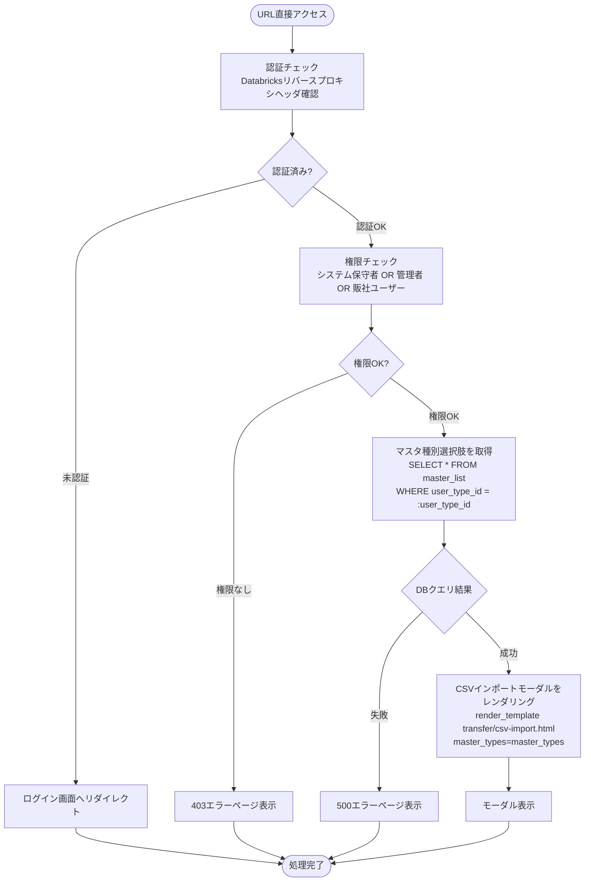
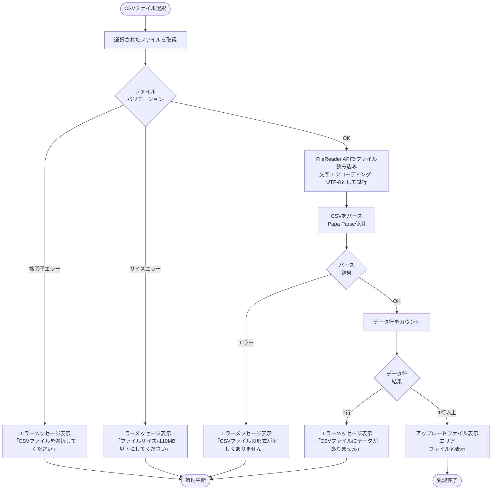
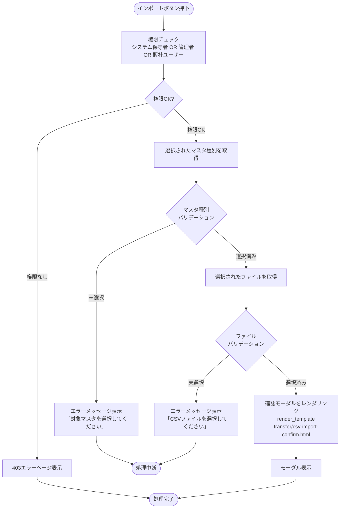
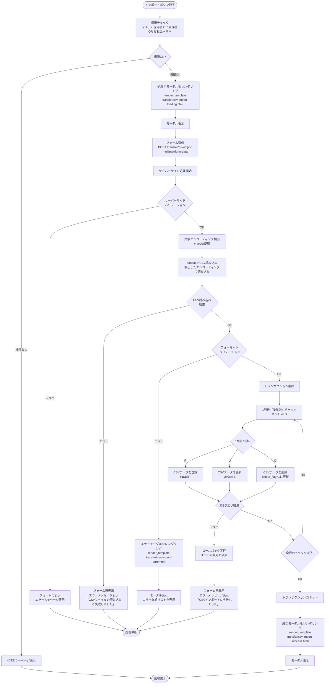
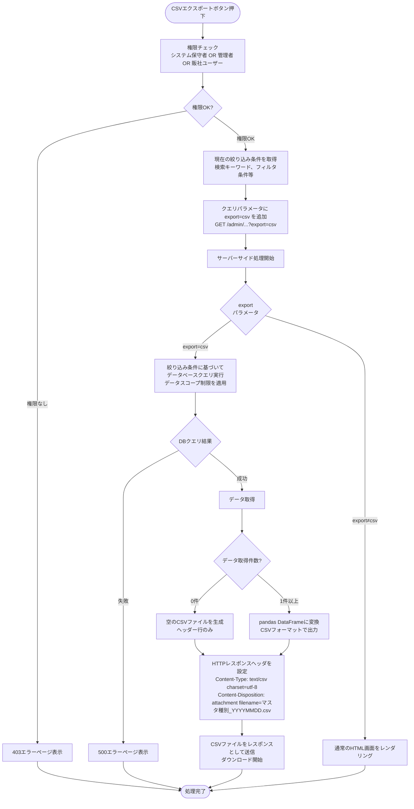

# CSVインポート/エクスポート機能 - ワークフロー仕様書

## 📑 目次

- [CSVインポート/エクスポート機能 - ワークフロー仕様書](#csvインポートエクスポート機能---ワークフロー仕様書)
  - [📑 目次](#-目次)
  - [概要](#概要)
  - [使用するFlaskルート一覧](#使用するflaskルート一覧)
  - [ルート呼び出しマッピング](#ルート呼び出しマッピング)
  - [ワークフロー一覧](#ワークフロー一覧)
    - [CSVインポート画面表示](#csvインポート画面表示)
      - [処理フロー](#処理フロー)
      - [Flaskルート](#flaskルート)
      - [バリデーション](#バリデーション)
      - [処理詳細（サーバーサイド）](#処理詳細サーバーサイド)
      - [表示メッセージ](#表示メッセージ)
      - [エラーハンドリング](#エラーハンドリング)
      - [UI状態](#ui状態)
    - [CSVインポート: ファイル選択](#csvインポート-ファイル選択)
      - [処理フロー](#処理フロー-1)
      - [Flaskルート](#flaskルート-1)
      - [バリデーション](#バリデーション-1)
      - [処理詳細（クライアントサイド）](#処理詳細クライアントサイド)
      - [表示メッセージ](#表示メッセージ-1)
      - [エラーハンドリング](#エラーハンドリング-1)
    - [CSVインポート: 確認モーダル表示](#csvインポート-確認モーダル表示)
      - [処理フロー](#処理フロー-2)
      - [バリデーション](#バリデーション-2)
      - [処理詳細（クライアントサイド）](#処理詳細クライアントサイド-1)
      - [表示メッセージ](#表示メッセージ-2)
      - [エラーハンドリング](#エラーハンドリング-2)
    - [CSVインポート: インポート実行](#csvインポート-インポート実行)
      - [処理フロー](#処理フロー-3)
      - [Flaskルート](#flaskルート-2)
      - [バリデーション](#バリデーション-3)
      - [処理詳細（サーバーサイド）](#処理詳細サーバーサイド-1)
      - [表示メッセージ](#表示メッセージ-3)
      - [エラーハンドリング](#エラーハンドリング-3)
      - [UI状態](#ui状態-1)
    - [CSVエクスポート: エクスポート実行](#csvエクスポート-エクスポート実行)
      - [処理フロー](#処理フロー-4)
      - [Flaskルート](#flaskルート-3)
      - [バリデーション](#バリデーション-4)
      - [処理詳細（サーバーサイド）](#処理詳細サーバーサイド-2)
      - [表示メッセージ](#表示メッセージ-4)
      - [エラーハンドリング](#エラーハンドリング-4)
      - [UI状態](#ui状態-2)
  - [使用データベース詳細](#使用データベース詳細)
    - [使用テーブル一覧](#使用テーブル一覧)
    - [インデックス最適化](#インデックス最適化)
  - [トランザクション管理](#トランザクション管理)
    - [トランザクション開始・終了タイミング](#トランザクション開始終了タイミング)
  - [セキュリティ実装](#セキュリティ実装)
    - [認証・認可実装](#認証認可実装)
    - [入力検証](#入力検証)
    - [ログ出力ルール](#ログ出力ルール)
  - [関連ドキュメント](#関連ドキュメント)
    - [画面仕様](#画面仕様)
    - [アーキテクチャ設計](#アーキテクチャ設計)
    - [共通仕様](#共通仕様)

---

## 概要

このドキュメントは、CSVインポート/エクスポート機能のユーザー操作に対する処理フロー、バリデーション実行タイミング、データベース処理の詳細を記載します。

**このドキュメントの役割:**
- ✅ ユーザー操作のトリガー条件
- ✅ 処理フローの詳細（Flaskルート呼び出しシーケンス、フォーム送信、リダイレクト）
- ✅ バリデーション実行タイミング（いつチェックするか）
- ✅ エラーハンドリングフロー
- ✅ サーバーサイド処理詳細（SQL、変数、条件分岐、コード例）
- ✅ データベース利用詳細（トランザクション管理、テーブル操作、インデックス）
- ✅ セキュリティ実装詳細（認証、入力検証、ログ出力）

**UI仕様書との役割分担:**
- **UI仕様書**: バリデーションルール定義（何をチェックするか）、UI要素の詳細仕様
- **ワークフロー仕様書**: バリデーション実行タイミング（いつどのようにチェックするか）、処理フロー、サーバーサイド実装詳細

**注:** UI要素の詳細やバリデーションルールは [UI仕様書](./ui-specification.md) を参照してください。

---

## 使用するFlaskルート一覧

この機能で使用するすべてのFlaskルート（エンドポイント）を記載します。

| No | ルート名 | エンドポイント | メソッド | 用途 | レスポンス形式 | 備考 |
|----|---------|---------------|---------|------|---------------|------|
| 1 | CSVインポート画面 | `/transfer/csv-import` | GET | CSVインポート画面表示 | HTML（モーダル） | マスタ種別選択肢を含む |
| 2 | CSVインポート実行 | `/transfer/csv-import` | POST | CSVファイルアップロード・インポート実行 | HTML（モーダル） | 処理中: 処理中モーダル表示、成功時: 成功モーダル表示、失敗時: エラーモーダル表示 |
| 3 | デバイス一覧CSVエクスポート | `/admin/devices?export=csv` | GET | デバイス一覧CSVエクスポート | text/csv | 現在の検索条件を適用 |
| 4 | ユーザー一覧CSVエクスポート | `/admin/users?export=csv` | GET | ユーザー一覧CSVエクスポート | text/csv | 現在の検索条件を適用 |
| 5 | 組織一覧CSVエクスポート | `/admin/organizations?export=csv` | GET | 組織一覧CSVエクスポート | text/csv | 現在の検索条件を適用 |
| 6 | アラート一覧マスタCSVエクスポート | `/admin/alert-settings?export=csv` | GET | アラート設定一覧CSVエクスポート | text/csv | 現在の検索条件を適用 |
| 7 | デバイス在庫一覧CSVエクスポート | `/admin/device-inventory?export=csv` | GET | デバイス在庫一覧CSVエクスポート | text/csv | 現在の検索条件を適用 |

**注:**
- **レスポンス形式**:
  - `HTML`: Jinja2テンプレートをレンダリングして返す（`render_template()`）
  - `リダイレクト (302)`: 処理後に別のルートへリダイレクト（`redirect(url_for())`）
  - `text/csv`: CSVファイルをダウンロード（`Content-Type: text/csv; charset=utf-8`、`Content-Disposition: attachment`）
- **Flask Blueprint構成**: `transfer_bp` として実装

---

## ルート呼び出しマッピング

ユーザー操作とルート呼び出しの対応関係を一覧化します。

| ユーザー操作 | トリガー | 呼び出すルート | パラメータ | レスポンス | エラー時の挙動 |
|-------------|---------|-------------|-----------|-----------|---------------|
| CSVインポート画面表示 | URL直接アクセス | `GET /transfer/csv-import` | なし | HTML（CSVインポートモーダル） | エラーページ表示 |
| インポート実行 | (7) インポート実行ボタン押下 | `POST /transfer/csv-import` | `master_type`, `csv_file` | HTML（成功モーダル） | エラーメッセージ表示 |
| デバイスマスタエクスポート | 一覧画面のエクスポートボタン押下 | `GET /admin/devices?export=csv` | 現在の検索条件 | CSV（ダウンロード） | エラーメッセージ表示 |
| ユーザーマスタエクスポート | 一覧画面のエクスポートボタン押下 | `GET /admin/users?export=csv` | 現在の検索条件 | CSV（ダウンロード） | エラーメッセージ表示 |
| 組織マスタエクスポート | 一覧画面のエクスポートボタン押下 | `GET /admin/organizations?export=csv` | 現在の検索条件 | CSV（ダウンロード） | エラーメッセージ表示 |
| アラート設定マスタエクスポート | 一覧画面のエクスポートボタン押下 | `GET /admin/alert-settings?export=csv` | 現在の検索条件 | CSV（ダウンロード） | エラーメッセージ表示 |
| デバイス在庫マスタエクスポート | 一覧画面のエクスポートボタン押下 | `GET /admin/device-inventory?export=csv` | 現在の検索条件 | CSV（ダウンロード） | エラーメッセージ表示 |

---

## ワークフロー一覧

### CSVインポート画面表示

**トリガー:** URL直接アクセス時（`/transfer/csv-import`）

**前提条件:**
- ユーザーがログイン済み（Databricks認証完了）
- 適切な権限を持っている（システム保守者、管理者、販社ユーザーのみ）

#### 処理フロー



#### Flaskルート

| ルート | エンドポイント | 詳細 |
|-------|---------------|------|
| CSVインポート画面表示 | `GET /transfer/csv-import` | パラメータなし |

#### バリデーション

**実行タイミング:** なし（初期表示のため、デフォルト値を使用）

#### 処理詳細（サーバーサイド）

**① 認証・認可チェック**

リバースプロキシヘッダから認証情報を取得し、権限を確認します。

**処理内容:**
- ヘッダ `X-Forwarded-User` からユーザーIDを取得
- データベースから現在ユーザー情報を取得（ユーザー種別、組織ID）
- 組織に応じてデータスコープを決定
- ユーザー種別に応じてアクセス権限を決定

**変数・パラメータ:**
- `current_user_id`: string - リバースプロキシヘッダから取得したユーザーID
- `current_user`: User - データベースから取得したユーザーオブジェクト
- `user_type_id`: int - ユーザー種別ID（user_type_masterへの外部キー）
- `organization_id`: string - データスコープ制限用の組織ID

**実装例:**
```python
from flask import request, abort, g
from functools import wraps

def require_auth(f):
    @wraps(f)
    def decorated_function(*args, **kwargs):
        user_id = request.headers.get('X-Forwarded-User')
        if not user_id:
            abort(401)

        user = User.query.filter_by(user_id=user_id, delete_flag=0).first()
        if not user:
            abort(403)

        g.current_user = user
        return f(*args, **kwargs)
    return decorated_function

# 権限チェック（サービス利用者はアクセス不可）
if g.current_user.user_type_id == 4:
    abort(403)
```

**② マスタ種別選択肢の取得**

ユーザー種別別にアクセス可能なマスタ種別をDBから取得します。

**処理内容:**
- システム保守者: すべてのマスタ種別にアクセス可能
- 管理者、販社ユーザー: デバイスマスタ、ユーザーマスタ、組織マスタ、アラート設定マスタにアクセス可能（デバイス在庫マスタはアクセス不可）

**変数・パラメータ:**
- `master_types`: list - 表示するマスタ種別のリスト

**実装例:**
```python
# マスタ種別選択肢の取得
master_list = Master.query.filter_by(user_type_id=user_type_id, delete_flag=0).all()
```

**③ HTMLレンダリング**

Jinja2テンプレートをレンダリングしてHTMLレスポンスを返却します。

**処理内容:**
- テンプレート: `transfer/csv-import.html`
- コンテキスト: `master_types`, `current_user`

**実装例:**
```python
return render_template('transfer/csv-import.html',
                      master_types=master_types,
                      current_user=current_user)
```

#### 表示メッセージ

なし

#### エラーハンドリング

| HTTPステータス | エラー種別 | 処理内容 | 表示内容 |
|--------------|-----------|---------|---------|
| 401 | 認証エラー | ログイン画面へリダイレクト | - |
| 403 | 権限エラー | 403エラーページ表示 | この機能を利用する権限がありません |
| 500 | データベースエラー | 500エラーページ表示 | データの取得に失敗しました |

#### UI状態

- マスタ種別: 未選択
- ファイル: 未選択

---

### CSVインポート: ファイル選択

**トリガー:** (3-1) ドラッグ&ドロップフィールド、(3-2) ファイル選択ボタン

#### 処理フロー



#### Flaskルート

なし（クライアントサイドJavaScript処理のみ）

#### バリデーション

**実行タイミング:** ファイル選択直後（クライアントサイド）

**バリデーション対象:** CSVファイル

**バリデーションルール:** [UI仕様書](./ui-specification.md) の要素詳細 (3) ファイルアップロードエリア > バリデーション を参照

**エラー表示:**
- 表示場所: (4) エラーメッセージ表示エリア
- 表示方法: エラーメッセージ（赤色背景）

#### 処理詳細（クライアントサイド）

**JavaScript処理:**
```javascript
// CSVファイル選択イベント
document.getElementById('csv-file-upload').addEventListener('change', function(e) {
    const file = e.target.files[0];
    const messageArea = document.getElementById('message-area');
    const fileInfoArea = document.getElementById('file-info-area');

    // エラーメッセージ表示エリアをクリア
    messageArea.innerHTML = '';

    // アップロードファイル表示エリアをクリア
    fileInfoArea.innerHTML = '';

    if (!file) {
        return;
    }

    // バリデーション: 拡張子チェック
    if (!file.name.endsWith('.csv')) {
        showError('CSVファイルを選択してください');
        return;
    }

    // バリデーション: ファイルサイズチェック（10MB以下）
    const maxSize = 10 * 1024 * 1024; // 10MB
    if (file.size > maxSize) {
        showError('ファイルサイズは10MB以下にしてください');
        return;
    }

    // ファイル読み込み
    const reader = new FileReader();
    reader.onload = function(event) {
        const csvContent = event.target.result;

        // CSVパース（Papa Parse使用）
        Papa.parse(csvContent, {
            header: true,
            skipEmptyLines: true,
            complete: function(results) {
                if (results.errors.length > 0) {
                    showError('CSVファイルの形式が正しくありません');
                    return;
                }

                const data = results.data;

                if (data.length === 0) {
                    showError('CSVファイルにデータがありません');
                    return;
                }
            }
        });
    };

    // アップロードファイル表示エリアにファイル名を表示
    fileInfoArea.innerHTML = `<div class="file-info">${file.name}</div>`;

    reader.readAsText(file, 'UTF-8');
});

function showError(message) {
    const messageArea = document.getElementById('message-area');
    messageArea.innerHTML = `<div class="alert alert-danger">${message}</div>`;
}
```

#### 表示メッセージ

| メッセージID | 表示内容 | 表示タイミング | 表示場所 |
|-------------|---------|---------------|---------|
| ERR_FILE_EXT | CSVファイルを選択してください | 拡張子がCSVでない | (4) エラーメッセージ表示エリア（エラー） |
| ERR_FILE_SIZE | ファイルサイズは10MB以下にしてください | ファイルサイズが10MBを超過 | (4) エラーメッセージ表示エリア（エラー） |
| ERR_FILE_FORMAT | CSVファイルの形式が正しくありません | CSVパース失敗 | (4) エラーメッセージ表示エリア（エラー） |
| ERR_FILE_EMPTY | CSVファイルにデータがありません | データ行が0行 | (4) エラーメッセージ表示エリア（エラー） |

#### エラーハンドリング

| エラー種別 | 処理内容 |
|-----------|---------|
| 拡張子エラー | ERR_FILE_EXTメッセージを表示 |
| サイズエラー | ERR_FILE_SIZEメッセージを表示 |
| フォーマットエラー | ERR_FILE_FORMATメッセージを表示 |
| 空ファイルエラー | ERR_FILE_EMPTYメッセージを表示 |

---

### CSVインポート: 確認モーダル表示

**トリガー:** (6.1) インポートボタン押下

#### 処理フロー



#### バリデーション

**実行タイミング:** (6.1) インポートボタン押下直後（クライアントサイド）

**バリデーション対象:** マスタ種別、CSVファイル

**バリデーションルール:** [UI仕様書](./ui-specification.md) の要素詳細 (2) マスタ種別選択エリア > バリデーション と (3) ファイルアップロードエリア > バリデーション を参照

**エラー表示:**
- 表示場所: (4) エラーメッセージ表示エリア
- 表示方法: エラーメッセージ（赤色背景）

#### 処理詳細（クライアントサイド）

**JavaScript処理:**
```javascript
// インポートボタン押下イベント
document.getElementById('csv-import-button').addEventListener('click', function(e) {
    const masterType = document.getElementById('master-type-select').value;
    const file = document.getElementById('csv-file-upload').files[0];
    const messageArea = document.getElementById('message-area');

    // メッセージをクリア
    messageArea.innerHTML = '';

    // マスタ種別バリデーション: 存在チェック
    if (!masterType) {
        showError('対象マスタを選択してください');
        return;
    }

    // ファイルバリデーション: 存在チェック
    if (!file) {
        showError('CSVファイルを選択してください');
        return;
    }

    // 確認モーダル表示
});

function showError(message) {
    const messageArea = document.getElementById('message-area');
    messageArea.innerHTML = `<div class="alert alert-danger">${message}</div>`;
}
```

#### 表示メッセージ

| メッセージID | 表示内容 | 表示タイミング | 表示場所 |
|-------------|---------|---------------|---------|
| ERR_MASTER_TYPE_EXT | 対象マスタを選択してください | 対象マスタが選択されていない | (4) エラーメッセージ表示エリア（エラー） |
| ERR_FILE_EXT | CSVファイルを選択してください | ファイルが選択されていない | (4) エラーメッセージ表示エリア（エラー） |

#### エラーハンドリング

| エラー種別 | 処理内容 |
|-----------|---------|
| 対象マスタ未選択エラー | ERR_MASTER_TYPE_EXTメッセージを表示 |
| ファイル未選択エラー | ERR_FILE_EXTメッセージを表示 |

---

### CSVインポート: インポート実行

**トリガー:** (9) インポートボタン押下

#### 処理フロー



#### Flaskルート

| ルート | エンドポイント | 詳細 |
|-------|---------------|------|
| CSVインポート実行 | `POST /transfer/csv-import` | フォームデータ: `master_type`, `csv_file` |

#### バリデーション

**実行タイミング:** フォーム送信直後（サーバーサイド）

**バリデーション対象:** マスタ種別、CSVファイル、CSVデータ

**バリデーションルール:** [UI仕様書](./ui-specification.md) の要素詳細 > バリデーション を参照

**エラー表示:**
- 表示場所: (4) エラーメッセージ表示エリア、(10) CSVインポートエラーモーダル
- 表示方法: エラーメッセージ（赤色背景）、エラー詳細リスト（リスト形式）

#### 処理詳細（サーバーサイド）

**① フォーム検証（WTForms）**

WTFormsを使用してフォームデータを検証します。

**処理内容:**
- `master_type_id`: 必須、許可された値のみ（DB: master_listに存在）
- `csv_file`: 必須、拡張子`.csv`、最大サイズ10MB

**変数・パラメータ:**
- `form`: CSVImportForm - WTFormsフォームオブジェクト
- `master_type_id`: int - マスタ種別
- `csv_file`: FileStorage - アップロードされたCSVファイル

**実装例:**
```python
from flask import request, render_template, redirect, url_for, flash
from werkzeug.utils import secure_filename

class CSVImportForm(FlaskForm):
    master_type_id = SelectField('マスタ種別', validators=[DataRequired()], choices=[])
    csv_file = FileField('CSVファイル', validators=[
        DataRequired(),
        FileAllowed(['csv'], 'CSVファイルを選択してください'),
        FileSize(max_size=10 * 1024 * 1024, message='ファイルサイズは10MB以下にしてください')
    ])

@transfer_bp.route('/csv-import', methods=['POST'])
def csv_import_execute():
    form = CSVImportForm()

    master_type_id = form.master_type_id.data
    csv_file = form.csv_file.data

    # 処理続行...
```

**② 文字エンコーディング検出**

`chardet`ライブラリを使用してCSVファイルの文字エンコーディングを自動検出します。

**処理内容:**
- ファイル内容をバイナリで読み込み
- chardetで文字エンコーディングを検出
- 対応文字コード: UTF-8（BOM付き/なし）、Shift-JIS、EUC-JP

**変数・パラメータ:**
- `file_content`: bytes - CSVファイルの内容（バイナリ）
- `detected_encoding`: dict - 検出結果（`encoding`, `confidence`）
- `encoding`: string - 使用する文字エンコーディング

**実装例:**
```python
import chardet

# ファイル内容を読み込み
file_content = csv_file.read()
csv_file.seek(0)  # ファイルポインタを先頭に戻す

# 文字エンコーディング検出
detected = chardet.detect(file_content)
encoding = detected['encoding']

# UTF-8 BOM対応
if file_content.startswith(b'\xef\xbb\xbf'):
    encoding = 'utf-8-sig'

logger.info(f"検出した文字エンコーディング: {encoding}（信頼度: {detected['confidence']}）")
```

**③ CSV読み込み（pandas）**

pandasを使用してCSVファイルを読み込みます。

**処理内容:**
- 検出した文字エンコーディングでCSVを読み込み
- ヘッダー行を1行目として扱う
- 空行をスキップ

**変数・パラメータ:**
- `df`: pandas.DataFrame - 読み込んだCSVデータ

**実装例:**
```python
import pandas as pd
from io import StringIO

try:
    # CSVをDataFrameとして読み込み
    csv_content = file_content.decode(encoding)
    df = pd.read_csv(StringIO(csv_content), keep_default_na=False)

    logger.info(f"CSV読み込み成功: {len(df)}行、{len(df.columns)}列")

except Exception as e:
    logger.error(f"CSV読み込みエラー: {str(e)}")
    flash('CSVファイルの読み込みに失敗しました', 'error')
    return render_template('transfer/csv-import.html', form=form)
```

**④ フォーマットバリデーション**

CSVデータのフォーマットを検証します。

**処理内容:**
- 必須カラムの存在チェック
- データ型チェック（文字列長、数値形式、日付形式）
- 必須項目チェック（NULL不可）
- 重複チェック（主キー重複）
- データスコープ制限チェック

**変数・パラメータ:**
- `errors`: list - エラーリスト（行番号、カラム名、エラーメッセージ）
- `required_columns`: list - 必須カラムリスト（マスタ種別ごとに定義）

**実装例:**
```python
from sqlalchemy import create_engine, inspect
errors = []

# マスタ種別IDからテーブル名を取得
master_table = Master.query.filter_by(master_id=master_type_id, delete_flag=0).first()
table_name = master_table.master_name

# テーブルカラム情報を取得
engine = create_engine('sqlite:///xxxx_database.db')
inspector = inspect(engine)
columns_info = inspector.get_columns(table_name)

# カラム名リストを抽出
required_columns = [col['name'] for col in columns_info if not col.get('nullable', True)]

# 必須カラムの存在チェック
missing_columns = set(required_columns) - set(df.columns)
if missing_columns:
    errors.append({
        'row': 0,
        'column': ', '.join(missing_columns),
        'message': f'必須カラムが不足しています'
    })
    return render_template('transfer/csv-import.html',
                          form=form,
                          errors=errors)

# 各行のバリデーション
for index, row in df.iterrows():
    row_num = index + 2  # ヘッダー行を考慮（Excel行番号）

    # 必須項目チェック
    for col in required_columns:
        if pd.isna(row[col]) or str(row[col]).strip() == '':
            errors.append({
                'row': row_num,
                'column': col,
                'message': '必須項目です'
            })

    # データ型チェック（マスタ種別ごとにカスタムバリデーション）
    if master_type == 'devices':
        # デバイスIDの形式チェック（例: DEV-XXXXX）
        if not re.match(r'^DEV-\d{5}$', str(row['デバイスID'])):
            errors.append({
                'row': row_num,
                'column': 'デバイスID',
                'message': 'デバイスIDの形式が正しくありません（例: DEV-00001）'
            })

    # データスコープ制限チェック
    if master_type == 'devices':
        if str(row['組織ID']) != current_user.organization_id:
            errors.append({
                'row': row_num,
                'column': '組織ID',
                'message': '他組織のデータは登録できません'
            })

# エラーがある場合は処理中断
if errors:
    return render_template('transfer/csv-import.html',
                          form=form,
                          import_errors=errors)
```

**⑤ トランザクション処理（登録/更新）**

データベーストランザクションを使用して登録/更新を実行します。

**処理内容:**
- トランザクション開始
- 1列目（操作列）が「R」の場合は登録、「U」の場合は更新、「D」の場合は論理削除（`delete_flag=1`）
- トランザクションコミット
- エラー時はロールバック

**使用テーブル:** マスタ種別に応じて異なる（device_master, user_master organization_master等）

**実装例:**
```python
from sqlalchemy.exc import IntegrityError

try:
    # トランザクション開始
    db.session.begin()

    # 処理対象のオブジェクトリスト
    objects_to_add = []

    for index, row in df.iterrows():
        # 1列目（操作列）チェック
        operation = row.iloc[0]  # または row['操作列']

        if operation == 'R':
            # データ登録
            device = Device(
                device_id=row['デバイスID'],
                device_name=row['デバイス名'],
                organization_id=row['組織ID'],
                # ... その他のカラム
                created_by=current_user.user_id,
                created_at=datetime.now(),
                delete_flag=0
            )
            objects_to_add.append(device)
        
        elif operation == 'U':
            # データ更新
            device = Device.query.filter_by(
                device_id=row['デバイスID'],
                delete_flag=0
            ).first()

            if device:
                device.device_name = row['デバイス名']
                device.device_model = row['モデル情報']
                # ... その他のカラムを更新
                device.updated_by = current_user.user_id
                device.updated_at = datetime.now()
            else:
                errors.append({
                'row': index + 2,
                'column': 'デバイスID',
                'message': '更新対象のデータが見つかりません'
                })

        elif operation == 'D':
            # データ削除（論理削除）
            device = Device.query.filter_by(
                device_id=row['デバイスID'],
                delete_flag=0
            ).first()

            if device:
                device.delete_flag = 1
                device.updated_by = current_user.user_id
                device.updated_at = datetime.now()
            else:
                errors.append({
                    'row': index + 2,
                    'column': 'デバイスID',
                    'message': '削除対象のデータが見つかりません'
                })

    # 一括追加
    db.session.add_all(objects_to_add)
    db.session.commit()

    logger.info(f"CSVインポート成功: {master_type}, {len(df)}件")

    flash('CSVファイルのインポートが完了しました。', 'success')
    return redirect(url_for('transfer.csv_import_get'))

except IntegrityError as e:
    # トランザクションロールバック
    db.session.rollback()

    logger.error(f"CSVインポート失敗（整合性エラー）: {str(e)}")
    flash('CSVファイルのインポートが失敗しました。', 'error')
    return render_template('transfer/csv-import.html', form=form)

except Exception as e:
    # トランザクションロールバック
    db.session.rollback()

    logger.error(f"CSVインポート失敗: {str(e)}")
    flash('CSVファイルのインポートが失敗しました。', 'error')
    return render_template('transfer/csv-import.html', form=form)
```

#### 表示メッセージ

| メッセージID | 表示内容 | 表示タイミング | 表示場所 |
|-------------|---------|---------------|---------|
| SUCCESS_IMPORT | CSVファイルのインポートが完了しました | インポート成功時 | (9) CSVインポート成功モーダル |
| ERR_IMPORT | CSVファイルのインポートが失敗しました | インポート失敗時 | (10) CSVインポートエラーモーダル |

#### エラーハンドリング

| HTTPステータス | エラー種別 | 処理内容 | 表示内容 |
|--------------|-----------|---------|---------|
| 200 | バリデーションエラー | (10) CSVインポートエラーモーダル表示（エラー詳細リスト付き） | ERR_IMPORT + エラー詳細リスト |
| 200 | CSV読み込みエラー | (10) CSVインポートエラーモーダル表示（エラー詳細リスト付き） | ERR_IMPORT + エラー詳細リスト |
| 200 | データベースエラー | (10) CSVインポートエラーモーダル表示（エラー詳細リスト付き） + ロールバック | ERR_IMPORT + エラー詳細リスト |
| 200 | 重複エラー | (10) CSVインポートエラーモーダル表示（エラー詳細リスト付き） + ロールバック | ERR_IMPORT + エラー詳細リスト |
| 302 | 成功 | (9) CSVインポート成功モーダル | SUCCESS_IMPORT（成功モーダル） |

#### UI状態

- マスタ種別: 保持
- ファイル: クリア

---

### CSVエクスポート: エクスポート実行

**トリガー:** 各マスタ一覧画面のCSVエクスポートボタン押下

**前提条件:**
- 各マスタ一覧画面が表示されている
- 適切な権限を持っている（システム保守者、管理者、販社ユーザーのみ）

#### 処理フロー



#### Flaskルート

| ルート | エンドポイント | 詳細 |
|-------|---------------|------|
| 各マスタ一覧画面 | `GET /admin/devices?export=csv` 等 | クエリパラメータ: `export=csv` + 絞り込み条件 |

#### バリデーション

**実行タイミング:** なし（クエリパラメータは検証済み）

#### 処理詳細（サーバーサイド）

**① クエリパラメータ取得**

リクエストからクエリパラメータを取得します。

**処理内容:**
- `export`: エクスポート指定（`csv`）
- 絞り込み条件: 検索キーワード、フィルタ条件等（マスタ種別ごとに異なる）

**変数・パラメータ:**
- `export_format`: string - エクスポート形式（`csv`）
- `search_params`: dict - 絞り込み条件

**実装例:**
```python
from flask import request, Response

@devices_bp.route('/devices', methods=['GET'])
def list_devices():
    export_format = request.args.get('export')

    if export_format == 'csv':
        return export_devices_csv()
    else:
        # 通常のHTML画面表示
        return render_template('devices/list.html', ...)
```

**② データベースクエリ実行**

絞り込み条件とデータスコープ制限を適用してデータを取得します。

**処理内容:**
- 絞り込み条件を適用（検索キーワード、フィルタ等）
- データスコープ制限を適用
- 論理削除されていないデータのみ取得（`delete_flag=0`）

**使用テーブル:** マスタ種別に応じて異なる（device_master, user_master organization_master等）

**実装例:**
```python
def export_devices_csv():
    # 絞り込み条件を取得
    keyword = request.args.get('keyword', '')
    status = request.args.get('status', '')

    # クエリ構築
    query = Device.query.filter_by(delete_flag=0)

    # データスコープ制限（組織階層を考慮）
    query = apply_data_scope_filter(query, current_user)

    # 絞り込み条件を適用
    if keyword:
        query = query.filter(
            or_(
                Device.device_id.like(f'%{keyword}%'),
                Device.device_name.like(f'%{keyword}%')
            )
        )

    if status:
        query = query.filter_by(status=status)

    # データ取得
    devices = query.all()

    # CSVデータ生成処理に続く...
```

**③ CSV生成（pandas）**

pandasを使用してCSVファイルを生成します。

**処理内容:**
- データをpandas DataFrameに変換
- カラム名を日本語ヘッダーに変換
- CSVフォーマットで出力（UTF-8 BOM付き）

**変数・パラメータ:**
- `df`: pandas.DataFrame - CSV出力用データ
- `csv_content`: string - CSV文字列

**実装例:**
```python
import pandas as pd
from datetime import datetime

def export_devices_csv():
    # ... データ取得処理（前述）

    # DataFrameに変換
    data = []
    for device in devices:
        data.append({
            'デバイスID': device.device_id,
            'デバイス名': device.device_name,
            '組織ID': device.organization_id,
            '販社ID': device.sales_company_id,
            'ステータス': device.status,
            # ... その他のカラム
        })

    df = pd.DataFrame(data)

    # CSVに変換（UTF-8 BOM付き）
    csv_content = df.to_csv(index=False, encoding='utf-8-sig')

    # ファイル名生成（例: devices_20260106.csv）
    filename = f"devices_{datetime.now().strftime('%Y%m%d')}.csv"

    # HTTPレスポンス生成
    return Response(
        csv_content,
        mimetype='text/csv',
        headers={
            'Content-Disposition': f'attachment; filename={filename}',
            'Content-Type': 'text/csv; charset=utf-8'
        }
    )
```

#### 表示メッセージ

なし（ダウンロードのみ）

#### エラーハンドリング

| HTTPステータス | エラー種別 | 処理内容 | 表示内容 |
|--------------|-----------|---------|---------|
| 200 | 成功（データあり） | CSVファイルダウンロード | - |
| 200 | 成功（データなし） | 空のCSVファイルダウンロード（ヘッダー行のみ） | - |
| 500 | データベースエラー | エラーページ表示 | データの取得に失敗しました |

#### UI状態

- 画面: 変更なし（バックグラウンドでダウンロード）
- ダウンロードダイアログ: 表示（ブラウザ標準）

---

## 使用データベース詳細

### 使用テーブル一覧

| No | テーブル名 | 論理名 | 操作種別 | ワークフロー | 目的 | インデックス利用 |
|----|-----------|--------|---------|------------|------|----------------|
| 1 | device_master | デバイスマスタ | INSERT | CSVインポート実行 | CSVデータ登録 | PRIMARY KEY (device_id) |
| 2 | device_master | デバイスマスタ | UPDATE | CSVインポート実行 | CSVデータ更新 | PRIMARY KEY (device_id) |
| 3 | device_master | デバイスマスタ | UPDATE | CSVインポート実行 | CSVデータ論理削除 | PRIMARY KEY (device_id) |
| 4 | device_master | デバイスマスタ | SELECT | CSVエクスポート実行 | エクスポートデータ取得 | INDEX (delete_flag) |
| 5 | user_master | ユーザーマスタ | INSERT | CSVインポート実行 | CSVデータ登録 | PRIMARY KEY (user_id)<br>UNIQUE INDEX (email) |
| 6 | user_master | ユーザーマスタ | UPDATE | CSVインポート実行 | CSVデータ更新 | PRIMARY KEY (user_id) |
| 7 | user_master | ユーザーマスタ | UPDATE | CSVインポート実行 | CSVデータ論理削除 | PRIMARY KEY (user_id) |
| 8 | user_master | ユーザーマスタ | SELECT | CSVエクスポート実行 | エクスポートデータ取得 | INDEX (delete_flag) |
| 9 | organization_master | 組織マスタ | INSERT | CSVインポート実行 | CSVデータ登録 | PRIMARY KEY (organization_id) |
| 10 | organization_master | 組織マスタ | UPDATE | CSVインポート実行 | CSVデータ更新 | PRIMARY KEY (organization_id) |
| 11 | organization_master | 組織マスタ | UPDATE | CSVインポート実行 | CSVデータ論理削除 | PRIMARY KEY (organization_id) |
| 12 | organization_master | 組織マスタ | SELECT | CSVエクスポート実行 | エクスポートデータ取得 | INDEX (delete_flag) |
| 13 | alert_setting_master | アラート設定マスタ | INSERT | CSVインポート実行 | CSVデータ登録 | PRIMARY KEY (alert_id) |
| 14 | alert_setting_master | アラート設定マスタ | UPDATE | CSVインポート実行 | CSVデータ更新 | PRIMARY KEY (alert_id) |
| 15 | alert_setting_master | アラート設定マスタ | UPDATE | CSVインポート実行 | CSVデータ論理削除 | PRIMARY KEY (alert_id) |
| 16 | alert_setting_master | アラート設定マスタ | SELECT | CSVエクスポート実行 | エクスポートデータ取得 | INDEX (delete_flag) |
| 17 | device_stock_info_master | デバイス在庫情報マスタ | INSERT | CSVインポート実行 | CSVデータ登録 | PRIMARY KEY (device_stock_id) |
| 18 | device_stock_info_master | デバイス在庫情報マスタ | UPDATE | CSVインポート実行 | CSVデータ更新 | PRIMARY KEY (device_stock_id) |
| 19 | device_stock_info_master | デバイス在庫情報マスタ | UPDATE | CSVインポート実行 | CSVデータ論理削除 | PRIMARY KEY (device_stock_id) |
| 20 | device_stock_info_master | デバイス在庫情報マスタ | SELECT | CSVエクスポート実行 | エクスポートデータ取得 | INDEX (delete_flag) |

### インデックス最適化

**使用するインデックス:**
- device_master.device_id: PRIMARY KEY - デバイス一意識別
- device_master.delete_flag: INDEX - 論理削除データ除外の高速化
- user_master.user_id: PRIMARY KEY - ユーザー一意識別
- user_master.email: UNIQUE INDEX - メールアドレス重複チェック高速化
- user_master.delete_flag: INDEX - 論理削除データ除外の高速化
- organization_master.organization_id: PRIMARY KEY - 組織一意識別
- organization_master.delete_flag: INDEX - 論理削除データ除外の高速化
- alert_setting_master.alert_id: PRIMARY KEY - アラート設定一意識別
- alert_setting_master.delete_flag: INDEX - 論理削除データ除外の高速化
- device_stock_info_master.device_stock_id: PRIMARY KEY - 在庫一意識別
- device_stock_info_master.delete_flag: INDEX - 論理削除データ除外の高速化

**注:** インデックス詳細は データベース設計書 を参照してください。

---

## トランザクション管理

### トランザクション開始・終了タイミング

**トランザクション開始:**
- ワークフロー: CSVインポート実行
- 開始タイミング: フォーマットバリデーション完了後、DB操作開始前
- 開始条件: すべてのバリデーションが成功

**トランザクション終了（コミット）:**
- 終了タイミング: CSVファイルの全データの登録・更新・論理削除完了後
- 終了条件: すべてのDB操作が正常完了

**トランザクション終了（ロールバック）:**
- ロールバックタイミング: いずれかのDB操作失敗時
- ロールバック対象: CSVデータ登録（INSERT）、CSVデータ更新（UPDATE）、CSVデータ論理削除（UPDATE）
- ロールバック条件: IntegrityError（主キー重複、外部キー制約違反）、その他のException

**分離レベル:**
- デフォルト分離レベル: `READ COMMITTED`（MySQL/PostgreSQLデフォルト）
- 同時実行制御: トランザクション単位でロック

---

## セキュリティ実装

### 認証・認可実装

**認証方式:**
- Databricksリバースプロキシヘッダ認証（`X-Forwarded-User`）

**認可ロジック:**

組織階層に基づいて、ユーザーがアクセスできるデータを制限します。

**処理内容:**
- **全ユーザー共通**: 組織階層（`organization_closure`）でフィルタ
  - ユーザーの `organization_id` を親組織IDとして検索
  - 下位組織リスト（`subsidiary_organization_id`）を取得
  - そのリストに該当する組織のデータのみアクセス可能
  - **ロールによる条件分岐は一切行わない**

**注**: システム保守者・管理者が全データにアクセスできるのは、ルート組織（すべての組織を子組織に持つ）に所属しているため

**実装例:**
```python
def apply_data_scope_filter(query, current_user):
    """組織階層に基づいたデータスコープ制限を適用

    すべてのユーザーに対して同じフィルタリングロジックを適用。
    ロールによる条件分岐は一切行わない。

    システム保守者・管理者が全データにアクセスできるのは、
    ルート組織に所属しており、すべての組織がその下位組織として
    登録されているため。
    """
    # organization_closure テーブルから下位組織リストを取得（全ユーザー共通）
    accessible_org_ids = db.session.query(
        OrganizationClosure.subsidiary_organization_id
    ).filter(
        OrganizationClosure.parent_organization_id == current_user.organization_id
    ).all()

    # 下位組織IDのリストを抽出
    org_ids = [org_id[0] for org_id in accessible_org_ids]

    if not org_ids:
        # アクセス可能な組織がない場合は空の結果を返す
        return query.filter(User.organization_id.in_([]))

    # 組織IDリストでフィルタリング
    return query.filter(User.organization_id.in_(org_ids))

# 使用例
@admin_bp.route('/users', methods=['GET'])
@require_auth
def list_users():
    query = User.query.filter_by(delete_flag=0)

    # データスコープ制限適用
    query = apply_data_scope_filter(query, g.current_user)

    users = query.all()
    return render_template('users/list.html', users=users)
```

### 入力検証

**検証項目:**
- CSVファイル: 拡張子`.csv`、最大サイズ10MB、形式チェック
- マスタ種別: 許可された値のみ（DB: master_listに存在）、ロール別アクセス制御
- CSVデータ:
  - 必須カラムの存在チェック
  - データ型チェック（文字列長、数値形式、日付形式、真偽値）
  - 必須項目チェック（NULL不可）
  - 主キー重複チェック
  - データスコープ制限チェック
- SQLインジェクション対策: SQLAlchemy ORM使用（プリペアドステートメント）
- XSS対策: Jinja2自動エスケープ（`{{ variable }}`）
- CSRF対策: Flask-WTF CSRF保護

**実装例:**
```python
from wtforms import SelectField, FileField
from wtforms.validators import DataRequired
from flask_wtf.file import FileAllowed, FileSize
from sqlalchemy import create_engine, inspect

class CSVImportForm(FlaskForm):
    master_type = SelectField('マスタ種別', validators=[DataRequired()], choices=[])
    csv_file = FileField('CSVファイル', validators=[
        DataRequired(message='CSVファイルを選択してください'),
        FileAllowed(['csv'], 'CSVファイルのみアップロード可能です'),
        FileSize(max_size=10 * 1024 * 1024, message='ファイルサイズは10MB以下にしてください')
    ])

# フォーマットバリデーション
def validate_csv_format(df, master_type, current_user):
    errors = []

    # マスタ種別IDからテーブル名を取得
    master_table = Master.query.filter_by(master_id=master_type_id, delete_flag=0).first()
    table_name = master_table.master_name

    # テーブルカラム情報を取得
    engine = create_engine('sqlite:///xxxx_database.db')
    inspector = inspect(engine)
    columns_info = inspector.get_columns(table_name)

    # カラム名リストを抽出
    required_columns = [col['name'] for col in columns_info if not col.get('nullable', True)]

    # 必須カラムの存在チェック
    missing_columns = set(required_columns) - set(df.columns)
    if missing_columns:
        errors.append({
            'row': 0,
            'column': ', '.join(missing_columns),
            'message': '必須カラムが不足しています'
        })
        return errors

    # 各行のバリデーション
    for index, row in df.iterrows():
        row_num = index + 2  # ヘッダー行を考慮

        # 必須項目チェック
        for col in required_columns:
            if pd.isna(row[col]) or str(row[col]).strip() == '':
                errors.append({
                    'row': row_num,
                    'column': col,
                    'message': '必須項目です'
                })

        # データ型チェック（マスタ種別ごとにカスタム）
        if master_type == 'devices':
            # デバイスIDの形式チェック
            if not re.match(r'^DEV-\d{5}$', str(row.get('デバイスID', ''))):
                errors.append({
                    'row': row_num,
                    'column': 'デバイスID',
                    'message': 'デバイスIDの形式が正しくありません（例: DEV-00001）'
                })

        # データスコープ制限チェック
        if master_type == 'devices':
            if str(row['組織ID']) != current_user.organization_id:
                errors.append({
                    'row': row_num,
                    'column': '組織ID',
                    'message': '他組織のデータは登録できません'
                })

    return errors
```

---

### ログ出力ルール

**出力する情報:**
- リクエストID
- ユーザーID（操作者）
- 操作種別（CSVインポート、CSVエクスポート）
- マスタ種別
- 処理件数
- 処理結果（成功/失敗）
- エラー種別（バリデーションエラー、DBエラー等）
- タイムスタンプ（UTC）

**出力しない情報:**
- 認証トークン
- CSVファイルの内容（個人情報含む可能性）
- 機密情報

---

## 関連ドキュメント

### 画面仕様
- [機能概要 README](./README.md) - 機能概要、データモデル、CSVフォーマット仕様
- [UI仕様書](./ui-specification.md) - UI要素の詳細、バリデーションルール定義

### アーキテクチャ設計
- バックエンド設計 - Flask/LDP設計、Blueprint構成
- データベース設計 - テーブル定義、インデックス設計

### 共通仕様
- [共通仕様書](../../common/common-specification.md) - HTTPステータスコード、エラーコード、トランザクション管理、セキュリティ等
- [認証仕様書](../../common/authentication-specification.md) - 認証アーキテクチャ、Token Exchange、Unity Catalog接続
- [UI共通仕様書](../../common/ui-common-specification.md) - すべての画面に共通するUI仕様

---

**このワークフロー仕様書は、実装前に必ずレビューを受けてください。**
