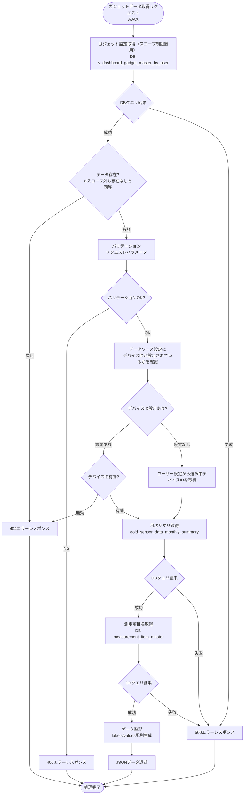
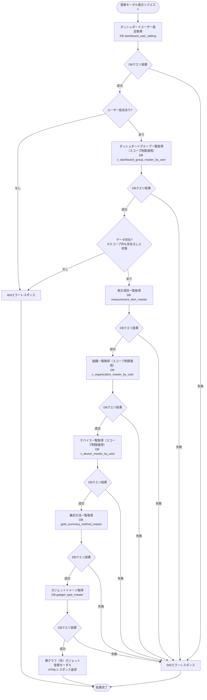
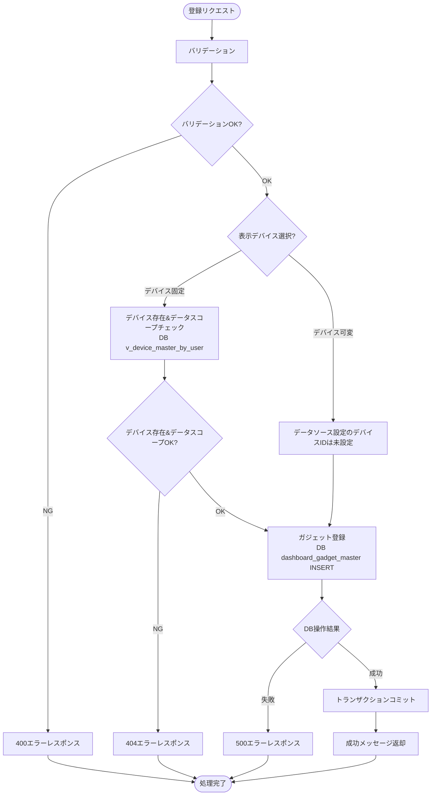
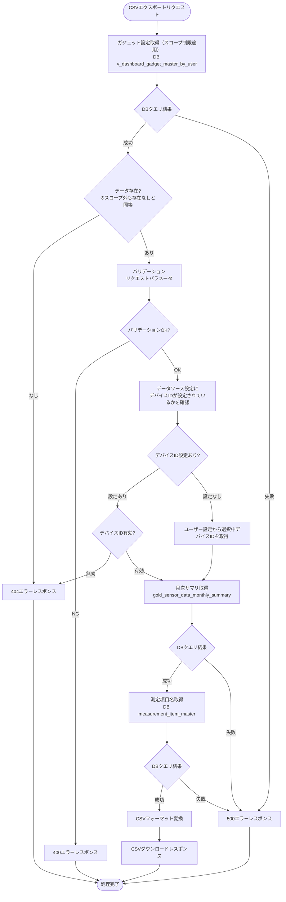

# 顧客作成ダッシュボード棒グラフ（年）ガジェット - ワークフロー仕様書

## 📑 目次

- [顧客作成ダッシュボード棒グラフ（年）ガジェット - ワークフロー仕様書](#顧客作成ダッシュボード棒グラフ年ガジェット---ワークフロー仕様書)
  - [📑 目次](#-目次)
  - [概要](#概要)
  - [使用するFlaskルート一覧](#使用するflaskルート一覧)
  - [ルート呼び出しマッピング](#ルート呼び出しマッピング)
    - [棒グラフ（年）ガジェット](#棒グラフ年ガジェット)
    - [棒グラフ（年）ガジェット登録モーダル](#棒グラフ年ガジェット登録モーダル)
  - [ワークフロー一覧](#ワークフロー一覧)
    - [ガジェット初期表示](#ガジェット初期表示)
      - [処理フロー](#処理フロー)
      - [Flaskルート](#flaskルート)
      - [バリデーション](#バリデーション)
      - [処理詳細（サーバーサイド）](#処理詳細サーバーサイド)
    - [ガジェットデータ取得](#ガジェットデータ取得)
      - [処理フロー](#処理フロー-1)
      - [Flaskルート](#flaskルート-1)
      - [バリデーション](#バリデーション-1)
      - [処理詳細（サーバーサイド）](#処理詳細サーバーサイド-1)
    - [ガジェット登録モーダル表示](#ガジェット登録モーダル表示)
      - [処理フロー](#処理フロー-2)
      - [Flaskルート](#flaskルート-2)
      - [バリデーション](#バリデーション-2)
      - [処理詳細（サーバーサイド）](#処理詳細サーバーサイド-2)
      - [エラーハンドリング](#エラーハンドリング)
    - [ガジェット登録](#ガジェット登録)
      - [処理フロー](#処理フロー-3)
      - [Flaskルート](#flaskルート-3)
      - [バリデーション](#バリデーション-3)
      - [処理詳細（サーバーサイド）](#処理詳細サーバーサイド-3)
      - [エラーハンドリング](#エラーハンドリング-1)
    - [CSVエクスポート](#csvエクスポート)
      - [処理フロー](#処理フロー-4)
      - [Flaskルート](#flaskルート-4)
      - [バリデーション](#バリデーション-4)
      - [処理詳細（サーバーサイド）](#処理詳細サーバーサイド-4)
      - [エラーハンドリング](#エラーハンドリング-2)
  - [セキュリティ実装](#セキュリティ実装)
    - [認証・認可実装](#認証認可実装)
    - [ログ出力ルール](#ログ出力ルール)
  - [関連ドキュメント](#関連ドキュメント)
    - [画面仕様](#画面仕様)
    - [共通仕様](#共通仕様)
    - [データベース](#データベース)

**重要:** 顧客作成ダッシュボード画面の共通仕様は [共通ワークフロー仕様書](../common/workflow-specification.md) を参照してください。

---

## 概要

このドキュメントは、顧客作成ダッシュボード棒グラフ（年）機能のユーザー操作に対する処理フロー、データベース処理、エラーハンドリングの詳細を記載します。

**このドキュメントの役割:**
- ✅ ユーザー操作のトリガー条件
- ✅ 処理フローの詳細（Flaskルート呼び出し、AJAX通信、リダイレクト）
- ✅ エラーハンドリングフロー
- ✅ サーバーサイド処理詳細（SQL、変数、条件分岐、コード例）
- ✅ データベース利用詳細（テーブル操作、トランザクション管理）
- ✅ セキュリティ実装詳細（認証、データスコープ制限、ログ出力）

**UI仕様書との役割分担:**
- **UI仕様書**: 画面レイアウト、UI要素の詳細仕様
- **ワークフロー仕様書**: 処理フロー、データベース処理、エラーハンドリング、サーバーサイド実装詳細

**注:** UI要素の詳細は [UI仕様書](./ui-specification.md) を参照してください。

---

## 使用するFlaskルート一覧

| No | ルート名 | エンドポイント | メソッド | 用途 | レスポンス形式 | 備考 |
|----|---------|---------------|---------|------|---------------|------|
| 1 | 顧客作成ダッシュボード表示 | `/analysis/customer-dashboard` | GET | 初期表示（棒グラフ（年）ガジェットを埋め込み） | HTML | 共通ルート |
| 2 | ガジェットデータ取得 | `/analysis/customer-dashboard/gadgets/<gadget_uuid>/data` | POST | ガジェットのグラフ表示用データ取得 | JSON (AJAX) | ガジェット種別共通ルート |
| 3 | ガジェット登録画面 | `/analysis/customer-dashboard/gadgets/bar-chart-year/create` | GET | 棒グラフ（年）ガジェット登録モーダル表示 | HTML（モーダル） | - |
| 4 | ガジェット登録実行 | `/analysis/customer-dashboard/gadgets/bar-chart-year/register` | POST | 棒グラフ（年）ガジェット登録処理 | JSON (AJAX) | - |
| 5 | CSVエクスポート | `/analysis/customer-dashboard/gadgets/<gadget_uuid>?export=csv` | GET | ガジェットのグラフデータをCSVファイルとしてダウンロード | CSV | - |

**注:**
- **レスポンス形式**:
  - `HTML`: Jinja2テンプレートをレンダリングして返す（`render_template()`）
  - `HTML（モーダル）`: モーダルダイアログ用のHTMLフラグメントを返す
  - `JSON (AJAX)`: JavaScriptからの非同期リクエストに対してJSONレスポンスを返す
  - `CSV`: CSVファイルをダウンロードレスポンスとして返す
- **Flask Blueprint構成**: `customer_dashboard_bp` として実装

---

## ルート呼び出しマッピング

### 棒グラフ（年）ガジェット

| ユーザー操作 | トリガー | 呼び出すルート | パラメータ | レスポンス | エラー時の挙動 |
|-------------|---------|-------------|-----------|-----------|---------------|
| 画面初期表示 | URL直接アクセス | `GET /analysis/customer-dashboard` | - | HTML（ガジェット含む） | エラーページ表示 |
| 年選択 | ドロップダウン選択 | `POST /analysis/customer-dashboard/gadgets/<gadget_uuid>/data` | `gadget_uuid, base_year, base_month` | JSON | ガジェット内エラー表示 |
| 基準月選択 | ドロップダウン選択 | `POST /analysis/customer-dashboard/gadgets/<gadget_uuid>/data` | `gadget_uuid, base_year, base_month` | JSON | ガジェット内エラー表示 |
| 自動更新（60秒毎） | setInterval | `POST /analysis/customer-dashboard/gadgets/<gadget_uuid>/data` | `gadget_uuid, base_year, base_month` | JSON | ガジェット内エラー表示 |
| CSVエクスポートボタン押下 | ボタンクリック | `GET /analysis/customer-dashboard/gadgets/<gadget_uuid>?export=csv` | `gadget_uuid, base_year, base_month` | CSVダウンロード | エラートースト表示 |

### 棒グラフ（年）ガジェット登録モーダル

| ユーザー操作 | トリガー | 呼び出すルート | パラメータ | レスポンス | エラー時の挙動 |
|-------------|---------|-------------|-----------|-----------|---------------|
| ガジェット種別選択（棒グラフ（年）） | ガジェット追加モーダルでの選択 | `GET /analysis/customer-dashboard/gadgets/bar-chart-year/create` | - | HTML（登録モーダル） | エラーページ表示 |
| 登録ボタン押下 | フォーム送信 | `POST /analysis/customer-dashboard/gadgets/bar-chart-year/register` | `title, device_mode, device_id, group_id, summary_method_id, measurement_item_id, min_value, max_value, gadget_size` | JSON (AJAX) | エラートースト表示 |

---

## ワークフロー一覧

### ガジェット初期表示

**トリガー:** ダッシュボードページロード後、JavaScriptがガジェットごとにデータ取得を自動実行

**前提条件:**
- ユーザーがログイン済み（Databricks認証完了）
- 適切な権限を持っている（システム保守者、管理者、販社ユーザ、サービス利用者）

#### 処理フロー

[共通ワークフロー仕様書](../common/workflow-specification.md) のダッシュボード初期表示と同様の処理フローに従います。

#### Flaskルート

| ルート | エンドポイント | 詳細 |
|-------|---------------|------|
| 顧客作成ダッシュボード表示 | `GET /analysis/customer-dashboard` | 共通ルート（ガジェット設定を含むHTMLを返す） |

#### バリデーション

**実行タイミング:** なし

#### 処理詳細（サーバーサイド）

[共通ワークフロー仕様書](../common/workflow-specification.md) のダッシュボード初期表示の処理詳細（①〜⑩）と同様の処理を実行します。

棒グラフ（年）ガジェット固有の追加処理はありません。

---

### ガジェットデータ取得

**トリガー:** 画面初期表示時 / 年選択時 / 基準月選択時 / 自動更新時

**前提条件:**
- `gadget_uuid` が有効なガジェットを指している
- ユーザーのデータスコープ内のデバイスであること

#### 処理フロー



#### Flaskルート

| ルート | エンドポイント | 詳細 |
|-------|---------------|------|
| ガジェットデータ取得 | `POST /analysis/customer-dashboard/gadgets/<gadget_uuid>/data` | パスパラメータ: `gadget_uuid` リクエストボディ（JSON）: `base_year, base_month` |

#### バリデーション

**実行タイミング:** リクエスト受信直後（サーバーサイド）

**バリデーションルール:**

| 項目 | ルール | エラーメッセージ |
|------|--------|-----------------|
| 年 | 許容値（現在年を含む直近10年以内） | 有効な年を入力してください |
| 月 | 許容値（1~12） | 有効な月を入力してください |

#### 処理詳細（サーバーサイド）

**① ガジェット設定取得**

**使用テーブル:** v_dashboard_gadget_master_by_user

**SQL詳細:**
```sql
SELECT
  gadget_id,
  gadget_uuid,
  gadget_type_id,
  chart_config,
  data_source_config
FROM
  v_dashboard_gadget_master_by_user
WHERE
  user_id = :current_user_id
  AND gadget_uuid = :gadget_uuid
  AND delete_flag = FALSE
```

**chart_config JSON スキーマ:**
```json
{
  "measurement_item_id": 1,
  "summary_method_id": 1,
  "min_value": 0.0,
  "max_value": 100.0
}
```

**data_source_config JSON スキーマ:**
```json
{
  "device_id": 12345
}
```
※ `device_id` が `null` の場合はデバイス可変モード

---

**② デバイスID決定**

`data_source_config.device_id` を参照し、デバイスIDを決定します。

- **デバイス固定モード** (`device_id` が設定されている場合): `data_source_config.device_id` を使用
  - デバイスIDの削除フラグチェックを実施する → デバイスIDが論理削除済みなら404エラーレスポンスを返却
- **デバイス可変モード** (`device_id` が `null` の場合): ユーザー設定 (`dashboard_user_setting.device_id`) を使用

**SQL詳細（デバイス固定モード: デバイスID有効性チェック）:**
```sql
SELECT
  device_id
FROM
  v_device_master_by_user
WHERE
  user_id = :current_user_id
  AND device_id = :device_id
  AND delete_flag = FALSE
```

**SQL詳細（デバイス可変モード: ユーザー設定取得）:**
```sql
SELECT
  device_id
FROM
  dashboard_user_setting
WHERE
  user_id = :current_user_id
  AND delete_flag = FALSE
```

---

**③ センサーデータ取得**

**使用テーブル:** gold_sensor_data_monthly_summary, user_master, organization_closure

**SQL詳細**
```sql
SELECT
  s.collection_year_month,
  s.summary_value
FROM
  user_master u
INNER JOIN
  organization_closure oc
  ON u.organization_id = oc.parent_organization_id
INNER JOIN
  gold_sensor_data_monthly_summary s
  ON oc.subsidiary_organization_id = s.organization_id
WHERE
  u.user_id = :current_user_id
  AND u.delete_flag = FALSE
  AND s.device_id = :device_id
  AND s.measurement_item_id = :measurement_item_id
  AND s.summary_method_id = :summary_method_id
  AND s.collection_year_month BETWEEN :start_year_month AND :end_year_month
ORDER BY
  s.collection_year_month ASC
```

**start_year_month, end_year_month の算出例:**

| パラメータ | 算出式（base_year=2026, base_month=6 の場合） | 結果 |
|-----------|----------------------------------------------|------|
| start_year_month | `(base_year - 2)/base_month` → `"YYYY/MM"` | `"2024/06"` |
| end_year_month | `(base_year + 1)/(base_month - 1)` ※1月の場合は前年12月 | `"2027/05"` |

---

**④ 測定項目名取得**

**使用テーブル:** measurement_item_master

**SQL詳細:** 
```sql
SELECT
  measurement_item_id,
  silver_data_column_name,
  display_name,
  unit_name
FROM
  measurement_item_master
WHERE
  measurement_item_id = :measurement_item_id
  AND delete_flag = FALSE
```

---

**⑤ データ整形**

取得データを ECharts 棒グラフ（年）用の `labels` / `values` 配列に変換します。

```python
# services/customer_dashboard/bar_chart_year.py

```

---

**⑥ レスポンス形式**

基準月=1
```json
{
  "gadget_uuid": "xxxxxxxx-xxxx-xxxx-xxxx-xxxxxxxxxxxx",
  "chart_data": {
    "labels": [1, 2, 3, 4, 5, 6, 7, 8, 9, 10, 11, 12],  // カレンダー月番号（基準月始まり）
    "series": [
      {
        "name": "2024/01~2024/12",
        "values": [10.5, 12.3, 9.8, ...]
      },
      {
        "name": "2025/01~2025/12",
        "values": [10.5, 12.3, 9.8, ...]
      },
      {
        "name": "2026/01~2026/12",
        "values": [10.5, 12.3, 9.8, ...]
      }
    ]
  },
  "updated_at": "2026/03/05 12:00:00"
}
```

基準月=6
```json
{
  "gadget_uuid": "xxxxxxxx-xxxx-xxxx-xxxx-xxxxxxxxxxxx",
  "chart_data": {
    "labels": [6, 7, 8, 9, 10, 11, 12, 1, 2, 3, 4, 5],  // カレンダー月番号（基準月始まり）
    "series": [
      {
        "name": "2024/06~2025/05",
        "values": [10.5, 12.3, 9.8, ...]
      },
      {
        "name": "2025/06~2026/05",
        "values": [10.5, 12.3, 9.8, ...]
      },
      {
        "name": "2026/06~2027/05",
        "values": [10.5, 12.3, 9.8, ...]
      }
    ]
  },
  "updated_at": "2026/03/05 12:00:00"
}
```

データなしの場合:
```json
{
  "gadget_uuid": "xxxxxxxx-xxxx-xxxx-xxxx-xxxxxxxxxxxx",
  "chart_data": {"labels": [], "series": []},
  "updated_at": "2026/03/05 12:00:00"
}
```

---

**⑦ 実装例**

```python
# views/analysis/customer_dashboard/bar_chart_year.py
def handle_gadget_data(gadget_uuid):
    """棒グラフ（年）ガジェットデータ取得（AJAX）"""

```

---

### ガジェット登録モーダル表示

**トリガー:** ガジェット追加モーダルの登録画面ボタンクリック

**前提条件:**
- ガジェット追加モーダルが表示されている
- ガジェット種別が選択されている

**注:** ガジェット追加モーダルのUI仕様は [共通UI仕様書](../common/ui-specification.md) を参照してください。

#### 処理フロー



#### Flaskルート

| ルート | エンドポイント | 詳細 |
|-------|---------------|------|
| 棒グラフ（年）ガジェット登録画面 | `GET /analysis/customer-dashboard/gadgets/bar-chart-year/create` | パラメータ: なし |

#### バリデーション

**実行タイミング:** なし

#### 処理詳細（サーバーサイド）

**① ダッシュボードユーザー設定取得**

**使用テーブル:** dashboard_user_setting

```sql
SELECT
  dashboard_id,
  organization_id,
  device_id
FROM
  dashboard_user_setting
WHERE
  user_id = :current_user_id
  AND delete_flag = FALSE
```

---

**② ダッシュボードグループ一覧取得**

**使用テーブル:** v_dashboard_group_master_by_user

```sql
SELECT
  dashboard_group_id,
  dashboard_group_uuid,
  dashboard_group_name
FROM
  v_dashboard_group_master_by_user
WHERE
  user_id = :current_user_id
  AND dashboard_id = :dashboard_id
  AND delete_flag = FALSE
ORDER BY
  display_order ASC
```

---

**③ 表示項目一覧取得**

**使用テーブル:** measurement_item_master

```sql
SELECT
  measurement_item_id,
  display_name,
  unit_name
FROM
  measurement_item_master
WHERE
  delete_flag = FALSE
ORDER BY
  measurement_item_id ASC
```

---

**④ 組織一覧取得**

**使用テーブル:** v_organization_master_by_user

```sql
SELECT
  organization_id,
  organization_name
FROM
  v_organization_master_by_user
WHERE
  user_id = :current_user_id
  AND delete_flag = FALSE
ORDER BY
  organization_id ASC
```

---

**⑤ デバイス一覧取得（デバイス固定モード用）**

**使用テーブル:** v_device_master_by_user

```sql
SELECT
  device_id,
  device_name,
  organization_id
FROM
  v_device_master_by_user
WHERE
  user_id = :current_user_id
  AND delete_flag = FALSE
ORDER BY
  device_id ASC
```

---

**⑥ 集約方法一覧取得**

**使用テーブル:** gold_summary_method_master

```sql
SELECT
  summary_method_id,
  summary_method_name
FROM
  gold_summary_method_master
WHERE
  delete_flag = FALSE
ORDER BY
  summary_method_id ASC
```

**⑦ ガジェット種別取得**

**使用テーブル:** gadget_type_master

```sql
SELECT
  gadget_type_id,
  gadget_type_name,
  gadget_image_path
FROM
  gadget_type_master
WHERE
  gadget_type_slug = :gadget_type_slug
  AND delete_flag = FALSE
```

---

**⑧ 実装例**

```python
# views/analysis/customer_dashboard/bar_chart_year.py
def handle_gadget_create(gadget_type):
    """棒グラフ（年）ガジェット登録モーダル表示"""
    setting = get_dashboard_user_setting(g.current_user.user_id)
    if setting is None:
        abort(404)

    groups = get_dashboard_groups(setting.dashboard_id)
    if not groups:
        abort(404)

    try:
        context = get_bar_chart_year_create_context(g.current_user.user_id)
    except Exception as e:
        logger.error(f'棒グラフ（年）登録モーダル表示エラー: {str(e)}')
        abort(500)

    gadget_type_info = get_gadget_type_info(gadget_type)
    if gadget_type_info is None:
        abort(500)

    form = BarChartGadgetForm()
    form.device_id.choices = [(0, '選択してください')] + [
        (d.device_id, d.device_name) for d in context['devices']
    ]
    form.group_id.choices = [(0, '選択してください')] + [
        (gr.dashboard_group_id, gr.dashboard_group_name) for gr in groups
    ]
    form.summary_method_id.choices = [(0, '選択してください')] + [
        (sm.summary_method_id, sm.summary_method_name) for sm in context['summary_methods']
    ]
    form.measurement_item_id.choices = [(0, '選択してください')] + [
        (m.measurement_item_id, m.display_name) for m in context['measurement_items']
    ]
    return render_template(
        'analysis/customer_dashboard/gadgets/modals/bar_chart_year.html',
        form=form,
        gadget_type=gadget_type,
        gadget_type_info=gadget_type_info,
        groups=groups,
        **context,
    )
```

#### エラーハンドリング

| HTTPステータス | エラー種別 | 処理内容 | 表示内容 |
|--------------|-----------|---------|---------|
| 400 | バリデーションエラー | フォーム再表示 | バリデーションエラーメッセージ |
| 404 | リソース不存在 | 404エラートースト表示 | ダッシュボードが見つかりません |
| 500 | データベースエラー | 500エラーページ表示 | データの取得に失敗しました |

---

### ガジェット登録

**トリガー:** ガジェット登録モーダルの登録ボタンクリック

**前提条件:**
- すべての必須フォーム項目が入力されている

#### 処理フロー



#### Flaskルート

| ルート | エンドポイント | 詳細 |
|-------|---------------|------|
| 棒グラフ（年）ガジェット登録実行 | `POST /analysis/customer-dashboard/gadgets/bar-chart-year/register` | フォームデータ: `title, device_mode, device_id, group_id, summary_method_id, measurement_item_id, min_value, max_value, gadget_size` |

#### バリデーション

**実行タイミング:** フォーム送信直後（サーバーサイド、WTForms）

**バリデーション対象:** [UI仕様書](./ui-specification.md) の バリデーション（ガジェット登録画面） を参照

#### 処理詳細（サーバーサイド）

**① デバイス存在&データスコープチェック（デバイス固定モード時のみ）**

**使用テーブル:** v_device_master_by_user

```sql
SELECT
  device_id,
  device_name,
  organization_id
FROM
  v_device_master_by_user
WHERE
  user_id = :current_user_id
  AND device_id = :device_id
  AND delete_flag = FALSE
```

---

**② ガジェット登録**

**使用テーブル:** dashboard_gadget_master

```sql
INSERT INTO dashboard_gadget_master (
  gadget_uuid,
  gadget_name,
  dashboard_group_id,
  gadget_type_id,
  chart_config,
  data_source_config,
  position_x,
  position_y,
  gadget_size,
  display_order,
  create_date,
  creator,
  update_date,
  modifier,
  delete_flag
) VALUES (
  :gadget_uuid,
  :gadget_name,
  :dashboard_group_id,
  :gadget_type_id,
  :chart_config,
  :data_source_config,
  0,
  (
    SELECT COALESCE(MAX(position_y), 0) + 1
    FROM dashboard_gadget_master
    WHERE dashboard_group_id = :dashboard_group_id
    AND delete_flag = FALSE
  ),
  :gadget_size,
  (
    SELECT COALESCE(MAX(display_order), 0) + 1
    FROM dashboard_gadget_master
    WHERE dashboard_group_id = :dashboard_group_id
    AND delete_flag = FALSE
  ),
  NOW(),
  :current_user_id,
  NOW(),
  :current_user_id,
  FALSE
)
```

**フォームパラメータの格納先:**

| パラメータ | 格納先 |
|-----------|--------|
| title | gadget_name |
| measurement_item_id | chart_config |
| summary_method_id | chart_config |
| min_value | chart_config |
| max_value | chart_config |
| device_id | data_source_config |

※ `device_mode` は `data_source_config.device_id` の null/非null で表現

---

**③ 実装例**

```python
# views/analysis/customer_dashboard/bar_chart_year.py
def handle_gadget_register(gadget_type):
    """棒グラフ（年）ガジェット登録実行"""
    form = BarChartGadgetForm()
    # device_id / measurement_item_id / group_id / summary_method_id はJS動的ロードのため送信値をそのまま choices に設定
    submitted_device_id = request.form.get('device_id', type=int) or 0
    form.device_id.choices = [(submitted_device_id, '')]
    submitted_measurement_item_id = request.form.get('measurement_item_id', type=int) or 0
    form.measurement_item_id.choices = [(submitted_measurement_item_id, '')]
    submitted_group_id = request.form.get('group_id', type=int) or 0
    submitted_summary_method_id = request.form.get('summary_method_id', type=int) or 0
    form.group_id.choices = [(submitted_group_id, '')]
    form.summary_method_id.choices = [(submitted_summary_method_id, '')]

    if not form.validate_on_submit():
        try:
            context = get_bar_chart_year_create_context(g.current_user.user_id)
            setting = get_dashboard_user_setting(g.current_user.user_id)
            groups = get_dashboard_groups(setting.dashboard_id) if setting else []
        except Exception as e:
            logger.error(f'棒グラフ（年）ガジェット登録コンテキスト取得エラー: {str(e)}')
            abort(500)
        return render_template(
            'analysis/customer_dashboard/gadgets/modals/bar_chart_year.html',
            form=form,
            gadget_type=gadget_type,
            groups=groups,
            **context,
        ), 400

    # デバイス固定モード時: デバイス存在&データスコープチェック
    if form.device_mode.data == 'fixed':
        if check_device_access(form.device_id.data, g.current_user.user_id) is None:
            abort(404)

    params = {
        'title': form.title.data,
        'device_mode': form.device_mode.data,
        'device_id': form.device_id.data,
        'group_id': form.group_id.data,
        'summary_method_id': form.summary_method_id.data,
        'measurement_item_id': form.measurement_item_id.data,
        'min_value': form.min_value.data,
        'max_value': form.max_value.data,
        'gadget_size': form.gadget_size.data,
    }

    try:
        register_bar_chart_year_gadget(
            params=params,
            current_user_id=g.current_user.user_id,
        )
        return jsonify({'message': msg_created('ガジェット')})

    except ValidationError as e:
        return jsonify({'error': str(e)}), 400
    except NotFoundError:
        abort(404)
    except Exception as e:
        logger.error(f'棒グラフ（年）ガジェット登録エラー: {str(e)}')
        abort(500)
```

#### エラーハンドリング

| HTTPステータス | エラー種別 | 処理内容 | 表示内容 |
|--------------|-----------|---------|---------|
| 400 | バリデーションエラー | フォーム再表示 | バリデーションエラーメッセージ |
| 404 | リソース不存在 | 404エラートースト表示 | 指定されたデバイスが見つかりません |
| 500 | データベースエラー | 500エラーページ表示 | データの取得に失敗しました |

---

### CSVエクスポート

**トリガー:** CSVエクスポートボタンクリック

**前提条件:**
- ガジェットが表示されている
- データが存在する

#### 処理フロー



#### Flaskルート

| ルート | エンドポイント | 詳細 |
|-------|---------------|------|
| CSVエクスポート | `GET /analysis/customer-dashboard/gadgets/<gadget_uuid>?export=csv` | パスパラメータ: `gadget_uuid` クエリパラメータ: `base_year, base_month` |

#### バリデーション

**実行タイミング:** CSVエクスポートボタン押下時（サーバーサイド）

| 項目 | ルール | エラーメッセージ |
|------|--------|-----------------|
| 年 | 許容値（現在年を含む直近10年以内） | 有効な年を入力してください |
| 月 | 許容値（1~12） | 有効な月を入力してください |


#### 処理詳細（サーバーサイド）

**① ガジェット設定取得**

[ガジェットデータ取得 ①](#ガジェットデータ取得) と同様のSQL（v_dashboard_gadget_master_by_user）を実行します。

---

**② デバイスID決定**

[ガジェットデータ取得 ②](#ガジェットデータ取得) と同様のロジックを適用します。

---

**③ センサーデータ取得**

[ガジェットデータ取得 ③](#ガジェットデータ取得) と同様のSQL（gold_sensor_data_monthly_summary）を実行します。

**グラフ表示との差異:**

| 項目 | ガジェットデータ取得 | CSVエクスポート |
|------|----------------|--------------|
| 最大取得件数 | 100件 | 100,000件 |
| レスポンス形式 | JSON | CSV |

---

**④ CSVカラム定義**

| 列番号 | 表示名 | 内容 | 形式 |
|--------|--------|-----|------|
| 1 | デバイス名 | デバイス名 | |
| 2 | 月 | 月（グラフX軸） | M |
| 3 | 凡例名1 | センサー値（グラフY軸） | 数値（小数点2桁） |
| 4 | 凡例名2 | センサー値（グラフY軸） | 数値（小数点2桁） |
| 5 | 凡例名3 | センサー値（グラフY軸） | 数値（小数点2桁） |

**CSVサンプル**

```csv
デバイス名,月,2024/01～2024/12,2025/01～2025/12,2026/01～2026/12
DEV-001,1,25.50,15.50,10.50
DEV-001,2,25.51,15.51,10.51
DEV-001,3,25.52,15.52,10.52
```

---

**⑤ 実装例**

```python
# views/analysis/customer_dashboard/bar_chart_year.py
def handle_gadget_csv_export(gadget_uuid):
    """棒グラフ（年）ガジェット CSVエクスポート"""
    if request.args.get('export') != 'csv':
        abort(404)

    gadget = get_gadget_config_by_uuid(gadget_uuid, g.current_user.user_id)
    if not gadget:
        abort(404)

    base_year_str = request.args.get('base_year')
    base_month_str = request.args.get('base_month')

    error = validate_year_month_params(base_year_str, base_month_str)
    if error:
        return jsonify({'error': error}), 400

    try:
        data_source_config = json.loads(gadget.data_source_config or '{}')
        device_id = data_source_config.get('device_id')
        if device_id is not None:
            if check_device_access(device_id, g.current_user.user_id) is None:
                return jsonify({'error': err_not_found('デバイス')}), 404
        else:
            setting = get_dashboard_user_setting(g.current_user.user_id)
            device_id = setting.device_id if setting else None
        chart_config = json.loads(gadget.chart_config or '{}')
        measurement_item_id = chart_config.get('measurement_item_id', 1)
        summary_method_id = chart_config.get('summary_method_id', 1)
        base_year = int(base_year_str)
        base_month = int(base_month_str)

        measurement_item = get_measurement_item(measurement_item_id)
        if measurement_item is None:
            abort(500)

        rows = fetch_bar_chart_year_data(
            device_id=device_id,
            base_year=base_year,
            base_month=base_month,
            measurement_item_id=measurement_item_id,
            summary_method_id=summary_method_id,
            limit=100_000,
        )
        chart_data = format_bar_chart_year_data(rows, base_year, base_month, measurement_item)
        device_name = get_device_name_by_id(device_id)
        csv_content = generate_bar_chart_year_csv(chart_data, base_year, base_month, device_name, measurement_item)

        filename = f"sensor_data_{datetime.now().strftime('%Y%m%d%H%M%S')}.csv"
        return Response(
            csv_content,
            mimetype='text/csv',
            headers={'Content-Disposition': f'attachment; filename={filename}'},
        )

    except Exception as e:
        logger.error(f'棒グラフ（年）CSVエクスポートエラー: gadget_uuid={gadget_uuid}, error={str(e)}')
        abort(500)
```

#### エラーハンドリング

| HTTPステータス | エラー種別 | 処理内容 | 表示内容 |
|--------------|-----------|---------|---------|
| 400 | バリデーションエラー | フォーム再表示 | バリデーションエラーメッセージ |
| 404 | リソース不存在 | 404エラートースト表示 | 指定されたデバイスが見つかりません |
| 500 | データベースエラー | 500エラーページ表示 | データの取得に失敗しました |

---

## セキュリティ実装

### 認証・認可実装

**認証方式:**
- Azure環境: Easy Auth認証（Entra ID統合）（`X-MS-*` ヘッダーからユーザー情報・JWT取得）
- AWS環境: ALB + Cognito認証（`X-Amzn-Oidc-*` ヘッダーからユーザー情報・JWT取得）
- オンプレミス環境: 自前認証（Flask IdP）（Flaskセッションからユーザー情報取得、JWT再発行）

**認可ロジック:**
- すべてのロール（システム保守者・管理者・販社ユーザ・サービス利用者）がアクセス可能

**データスコープ制限（全ユーザー共通）:**
- 組織・デバイス等の一覧取得VIEW（v_organization_master_by_user 等）:
  - VIEWが内部で organization_closure を参照し、アクセス可能な組織配下のデータのみ返す
- ダッシュボード用VIEW（v_dashboard_master_by_user 等）:
  - user_master.organization_id = dashboard_master.organization_id の直接JOINでスコープ制限を適用
  - ユーザーの所属組織のダッシュボードのみアクセス可能（下位組織のダッシュボードは対象外）
- センサーデータ（silver_sensor_data 等）:
  - VIEWを使用せず、データ取得処理の度に organization_closure を参照し、アクセス可能な組織配下のデータのみ返す（組織・デバイス等の一覧取得VIEWと内部処理は同じ）

**実装例:**
```python
# 組織一覧取得
def get_organizations():
    # v_organization_master_by_user に user_id を渡すだけでスコープ制限が自動適用される
    return (
        db.session.query(VOrganizationMasterByUser)
        .filter(
            VOrganizationMasterByUser.user_id == g.current_user.user_id,
            VOrganizationMasterByUser.delete_flag == False,
        )
        .order_by(VOrganizationMasterByUser.organization_id)
        .all()
    )
```

### ログ出力ルール

**出力する情報:**
- リクエストID
- ユーザーID（操作者）
- 操作種別（ガジェット登録）
- 登録結果（成功/失敗）
- エラー種別（バリデーションエラー・DBエラー等）

**出力しない情報:**
- センサーデータの数値（個人情報の可能性）
- 認証トークン
- パスワード

**実装例:**
```python
# 登録成功
logger.info(
    f'数値表示ガジェット登録成功: gadget_uuid={gadget.gadget_uuid}'
)

# 登録失敗
logger.error(
    f'数値表示ガジェット登録失敗: error={str(e)}'
)
```

---

## 関連ドキュメント

### 画面仕様
- [機能概要 README](./README.md)
- [UI仕様書](./ui-specification.md) - UI要素の詳細・数値フォーマット仕様

### 共通仕様
- [共通仕様書](../../../common/common-specification.md) - HTTPステータスコード、エラーコード等
- [UI共通仕様書](../../../common/ui-common-specification.md) - すべての画面に共通するUI仕様
- [顧客作成ダッシュボード共通ワークフロー仕様書](../common/workflow-specification.md) - ダッシュボード全体の共通処理

### データベース
- [アプリケーションDB設計書](../../../common/app-database-specification.md) - テーブル定義
