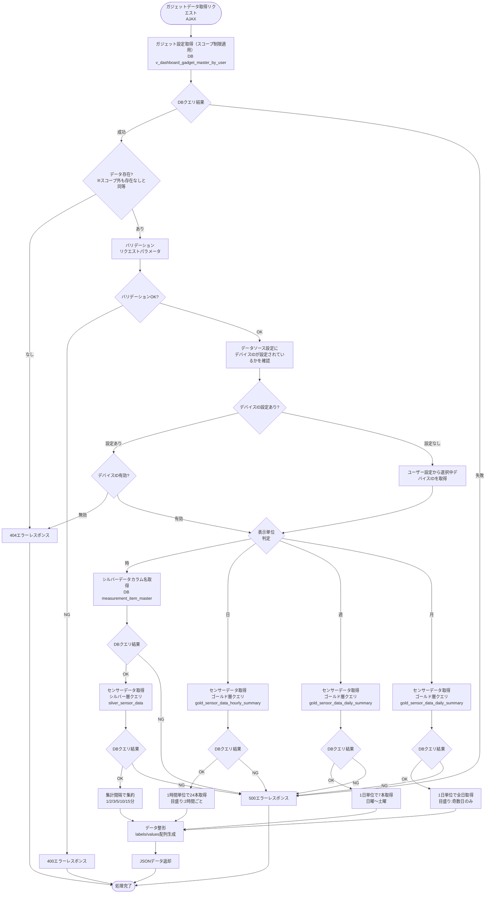
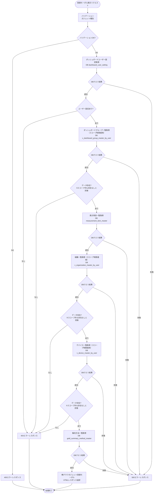
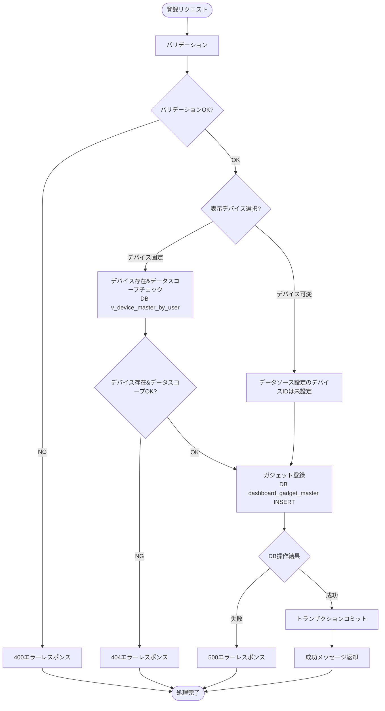
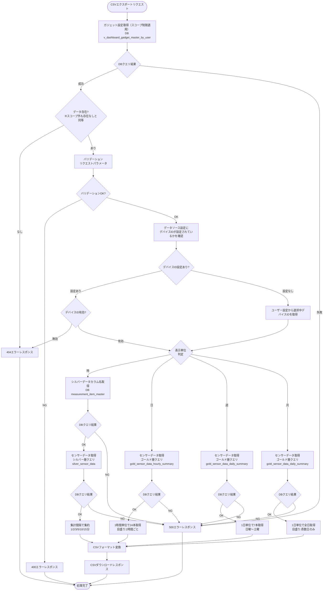

# 顧客作成ダッシュボード棒グラフガジェット - ワークフロー仕様書

## 📑 目次

- [顧客作成ダッシュボード棒グラフガジェット - ワークフロー仕様書](#顧客作成ダッシュボード棒グラフガジェット---ワークフロー仕様書)
  - [📑 目次](#-目次)
  - [概要](#概要)
  - [使用するFlaskルート一覧](#使用するflaskルート一覧)
  - [ルート呼び出しマッピング](#ルート呼び出しマッピング)
    - [棒グラフガジェット](#棒グラフガジェット)
    - [棒グラフガジェット登録モーダル](#棒グラフガジェット登録モーダル)
  - [ワークフロー一覧](#ワークフロー一覧)
    - [ガジェット初期表示](#ガジェット初期表示)
      - [処理フロー](#処理フロー)
      - [Flaskルート](#flaskルート)
      - [バリデーション](#バリデーション)
      - [処理詳細（サーバーサイド）](#処理詳細サーバーサイド)
    - [ガジェットデータ取得](#ガジェットデータ取得)
      - [処理フロー](#処理フロー-1)
      - [Flaskルート](#flaskルート-1)
      - [バリデーション](#バリデーション-1)
      - [処理詳細（サーバーサイド）](#処理詳細サーバーサイド-1)
    - [ガジェット登録モーダル表示](#ガジェット登録モーダル表示)
      - [処理フロー](#処理フロー-2)
      - [Flaskルート](#flaskルート-2)
      - [バリデーション](#バリデーション-2)
      - [処理詳細（サーバーサイド）](#処理詳細サーバーサイド-2)
      - [エラーハンドリング](#エラーハンドリング)
    - [ガジェット登録](#ガジェット登録)
      - [処理フロー](#処理フロー-3)
      - [Flaskルート](#flaskルート-3)
      - [バリデーション](#バリデーション-3)
      - [処理詳細（サーバーサイド）](#処理詳細サーバーサイド-3)
      - [エラーハンドリング](#エラーハンドリング-1)
    - [CSVエクスポート](#csvエクスポート)
      - [処理フロー](#処理フロー-4)
      - [Flaskルート](#flaskルート-4)
      - [バリデーション](#バリデーション-4)
      - [処理詳細（サーバーサイド）](#処理詳細サーバーサイド-4)
      - [エラーハンドリング](#エラーハンドリング-2)
  - [セキュリティ実装](#セキュリティ実装)
    - [認証・認可実装](#認証認可実装)
    - [ログ出力ルール](#ログ出力ルール)
  - [関連ドキュメント](#関連ドキュメント)

**重要:** 顧客作成ダッシュボード画面の共通仕様は [共通ワークフロー仕様書](../common/workflow-specification.md) を参照してください。

---

## 概要

このドキュメントは、顧客作成ダッシュボード棒グラフ機能のユーザー操作に対する処理フロー、データベース処理、エラーハンドリングの詳細を記載します。

**このドキュメントの役割:**
- ✅ ユーザー操作のトリガー条件
- ✅ 処理フローの詳細（Flaskルート呼び出し、フォーム送信、AJAX通信）
- ✅ エラーハンドリングフロー
- ✅ サーバーサイド処理詳細（SQL、変数、条件分岐、コード例）
- ✅ データベース利用詳細（トランザクション管理、テーブル操作）
- ✅ セキュリティ実装詳細（認証、データスコープ制限、ログ出力）
- ✅ クライアントサイド処理詳細（AJAX、ドラッグ＆ドロップ、自動更新）

**UI仕様書との役割分担:**
- **UI仕様書**: 画面レイアウト、UI要素の詳細仕様
- **ワークフロー仕様書**: 処理フロー、データベース処理、エラーハンドリング、サーバーサイド実装詳細

**注:** UI要素の詳細は [UI仕様書](./ui-specification.md) を参照してください。

---

## 使用するFlaskルート一覧

この機能で使用するすべてのFlaskルート（エンドポイント）を記載します。

| No | ルート名 | エンドポイント | メソッド | 用途 | レスポンス形式 | 備考 |
|----|---------|---------------|---------|------|---------------|------|
| 1 | 顧客作成ダッシュボード表示 | `/analysis/customer-dashboard` | GET | 初期表示（顧客作成ダッシュボード画面に棒グラフガジェットを埋め込み） | HTML | - |
| 2 | ガジェットデータ取得 | `/analysis/customer-dashboard/gadgets/<gadget_uuid>/data` | POST | ガジェットのグラフ表示用データ取得 | JSON (AJAX) | 非同期通信 |
| 3 | ガジェット登録画面 | `/analysis/customer-dashboard/gadgets/bar-chart/create` | GET | 棒グラフガジェット登録モーダル表示 | HTML（モーダル） | - |
| 4 | ガジェット登録実行 | `/analysis/customer-dashboard/gadgets/bar-chart/register` | POST | 棒グラフガジェット登録処理 | JSON (AJAX) | - |
| 5 | CSVエクスポート | `/analysis/customer-dashboard/gadgets/<gadget_uuid>?export=csv` | GET | ガジェットのグラフデータをCSVファイルとしてダウンロード | CSV | - |

**注:**
- **レスポンス形式**:
  - `HTML`: Jinja2テンプレートをレンダリングして返す（`render_template()`）
  - `HTML（モーダル）`: モーダルダイアログ用のHTMLフラグメントを返す
  - `リダイレクト (302)`: 処理成功後に `/analysis/customer-dashboard` へリダイレクト
  - `JSON (AJAX)`: JavaScriptからの非同期リクエストに対してJSONレスポンスを返す
  - `CSV`: CSVファイルをダウンロードレスポンスとして返す
- **Flask Blueprint構成**: `customer_dashboard_bp` として実装

---

## ルート呼び出しマッピング

### 棒グラフガジェット

| ユーザー操作 | トリガー | 呼び出すルート | パラメータ | レスポンス | エラー時の挙動 |
|-------------|---------|-------------|-----------|-----------|---------------|
| 画面初期表示 | URL直接アクセス | `GET /analysis/customer-dashboard`, `POST /analysis/customer-dashboard/gadgets/<gadget_uuid>/data` | なし | HTML（顧客作成ダッシュボード画面に棒グラフガジェットを埋め込み） | エラーページ表示 |
| 表示時間単位切替（時/日/週/月） | ボタンクリック | `POST /analysis/customer-dashboard/gadgets/<gadget_uuid>/data` | `gadget_uuid` | JSON | エラートースト表示 |
| 集計時間幅選択 | ドロップダウン選択 | `POST /analysis/customer-dashboard/gadgets/<gadget_uuid>/data` | `gadget_uuid` | JSON | エラートースト表示 |
| 時間帯選択 | デイトタイムピッカー選択 | `POST /analysis/customer-dashboard/gadgets/<gadget_uuid>/data` | `gadget_uuid` | JSON | エラートースト表示 |
| 更新ボタン押下 | ボタンクリック | `POST /analysis/customer-dashboard/gadgets/<gadget_uuid>/data` | `gadget_uuid` | JSON | エラートースト表示 |
| CSVエクスポートボタン押下 | ボタンクリック | `GET /analysis/customer-dashboard/gadgets/<gadget_uuid>?export=csv` | `gadget_uuid` | CSVダウンロード | エラートースト表示 |

### 棒グラフガジェット登録モーダル

| ユーザー操作 | トリガー | 呼び出すルート | パラメータ | レスポンス | エラー時の挙動 |
|-------------|---------|-------------|-----------|-----------|---------------|
| 画面初期表示 | URL直接アクセス | `GET /analysis/customer-dashboard/gadgets/bar-chart/create` | なし | HTML（モーダル） | エラーページ表示 |
| 登録ボタン押下 | ボタンクリック | `POST /analysis/customer-dashboard/gadgets/bar-chart/register` | `title, device_mode, device_id, group_id, summary_method_id, measurement_item_id, min_value, max_value, gadget_size` | JSON (AJAX) | エラートースト表示 |

---

## ワークフロー一覧

### ガジェット初期表示

**トリガー:** 顧客作成ダッシュボード画面アクセス時

**前提条件:**
- ユーザーがログイン済み（Databricks認証完了）
- 適切な権限を持っている（システム保守者、管理者、販社ユーザ、サービス利用者）

#### 処理フロー

[共通ワークフロー仕様書](../common/workflow-specification.md) のダッシュボード初期表示と同様の処理フローに従います。

#### Flaskルート

| ルート | エンドポイント | 詳細 |
|-------|---------------|------|
| 顧客作成ダッシュボード表示 | `GET /analysis/customer-dashboard` | クエリパラメータ: なし |

#### バリデーション

**実行タイミング:** なし

**データスコープ制限:**
- ダッシュボードスコープ制限（全ユーザー共通）:
  - ユーザーの所属組織に属するダッシュボードのみアクセス可能（v_dashboard_master_by_user による制御）
  - 下位組織のダッシュボードはアクセス不可
- 組織選択肢スコープ制限:
  - v_organization_master_by_user による制御

#### 処理詳細（サーバーサイド）

[共通ワークフロー仕様書](../common/workflow-specification.md) のダッシュボード初期表示の処理詳細（①〜⑩）と同様の処理を実行します。

棒グラフガジェット固有の追加処理はありません。

---

### ガジェットデータ取得

**トリガー:** 画面初期表示時 / 表示時間単位切替時 / 集計時間幅選択時 / 時間帯選択時 / 更新ボタン押下時

**前提条件:**
- ガジェットが表示されている
- データソース設定が存在する

#### 処理フロー



#### Flaskルート

| ルート | エンドポイント | 詳細 |
|-------|---------------|------|
| ガジェットデータ取得 | `POST /analysis/customer-dashboard/gadgets/<gadget_uuid>/data` | パスパラメータ: `gadget_uuid` リクエストボディ（JSON）: `display_unit, interval, base_datetime` |

#### バリデーション

**実行タイミング:** ガジェット設定取得後

**バリデーションルール:**

| 項目 | ルール | エラーメッセージ |
|------|--------|-----------------|
| 表示単位 | 許容値（hour/day/week/month） | 表示単位が不正です |
| 集計間隔（時単位のみ） | 許容値（1min, 2min, 3min, 5min, 10min, 15min） | 集計間隔が不正です |
| 基準日時 | 形式（YYYY/MM/DD HH:mm:ss） | 正しい日付形式で入力してください |

#### 処理詳細（サーバーサイド）

**① ガジェット設定取得**

**使用テーブル:** v_dashboard_gadget_master_by_user

**SQL詳細:**
```sql
SELECT
  gadget_id,
  gadget_uuid,
  gadget_type_id,
  chart_config,
  data_source_config
FROM
  v_dashboard_gadget_master_by_user
WHERE
  user_id = :current_user_id
  AND gadget_uuid = :gadget_uuid
  AND delete_flag = FALSE
```

**chart_config JSON スキーマ:**
```json
{
  "measurement_item_id": 1,
  "summary_method_id": 1,
  "min_value": 0.0,
  "max_value": 100.0
}
```

**data_source_config JSON スキーマ:**
```json
{
  "device_id": 12345
}
```
※ `device_id` が `null` の場合はデバイス可変モード

---

**② デバイスID決定**

`data_source_config.device_id` を参照し、デバイスIDを決定します。

- **デバイス固定モード** (`device_id` が設定されている場合): `data_source_config.device_id` を使用
  - デバイスIDの削除フラグチェックを実施する → デバイスIDが論理削除済みなら404エラーレスポンスを返却
- **デバイス可変モード** (`device_id` が `null` の場合): ユーザー設定 (`dashboard_user_setting.device_id`) を使用

**SQL詳細（デバイス固定モード: デバイスID有効性チェック）:**
```sql
SELECT
  device_id
FROM
  v_device_master_by_user
WHERE
  user_id = :current_user_id
  AND device_id = :device_id
  AND delete_flag = FALSE
```

**SQL詳細（デバイス可変モード: ユーザー設定取得）:**
```sql
SELECT
  device_id
FROM
  dashboard_user_setting
WHERE
  user_id = :current_user_id
  AND delete_flag = FALSE
```

---

**③ 表示単位別センサーデータ取得**

| display_unit | 参照層 | テーブル | 集計粒度 |
|-------------|-------|---------|--------|
| hour | シルバー層 | silver_sensor_data | インターバル単位（1/2/3/5/10/15分） |
| day | ゴールド層 | gold_sensor_data_hourly_summary | 1時間単位（24本） |
| week | ゴールド層 | gold_sensor_data_daily_summary | 1日単位（7本、日曜〜土曜） |
| month | ゴールド層 | gold_sensor_data_daily_summary | 1日単位（月の全日） |

**時間範囲の決定:**

| display_unit | start | end |
|-------------|-------|-----|
| hour | base_datetime の時刻を00分00秒に切り捨て | start + 1時間 |
| day | base_datetime の日付 00:00:00 | base_datetime の日付 23:59:59 |
| week | base_datetime の週の日曜日 00:00:00 | base_datetime の週の土曜日 23:59:59 |
| month | base_datetime の月の初日 00:00:00 | base_datetime の月の最終日 23:59:59 |

**SQL詳細（display_unit=hour / シルバー層）:**
```sql
SELECT
  event_timestamp, 
  external_temp,
  set_temp_freezer_1,
  internal_sensor_temp_freezer_1,
  internal_temp_freezer_1,
  df_temp_freezer_1,
  condensing_temp_freezer_1,
  adjusted_internal_temp_freezer_1,
  set_temp_freezer_2,
  internal_sensor_temp_freezer_2,
  internal_temp_freezer_2,
  df_temp_freezer_2,
  condensing_temp_freezer_2,
  adjusted_internal_temp_freezer_2,
  compressor_freezer_1,
  compressor_freezer_2,
  fan_motor_1,
  fan_motor_2,
  fan_motor_3,
  fan_motor_4,
  fan_motor_5,
  defrost_heater_output_1,
  defrost_heater_output_2
FROM
  user_master u
INNER JOIN
  organization_closure oc
  ON u.organization_id = oc.parent_organization_id
INNER JOIN
  silver_sensor_data s
  ON oc.subsidiary_organization_id = s.organization_id
WHERE
  u.user_id = :current_user_id
  AND u.delete_flag = FALSE
  AND device_id = :device_id
  AND event_timestamp BETWEEN :start_datetime AND :end_datetime
ORDER BY
  event_timestamp ASC
```

**SQL詳細（display_unit=hour / 測定項目マスタ）:**
```sql
SELECT
  silver_data_column_name
FROM
  measurement_item_master
WHERE
  measurement_item_id = :measurement_item_id
```

※ インターバル単位のグループ化・集計・表示項目選択はPython側で実施する（下記④参照）

**SQL詳細（display_unit=day / ゴールド層 hourly）:**
```sql
SELECT
  HOUR(collection_datetime) AS collection_hour,
  summary_value
FROM
  user_master u
INNER JOIN
  organization_closure oc
  ON u.organization_id = oc.parent_organization_id
INNER JOIN
  gold_sensor_data_hourly_summary g
  ON oc.subsidiary_organization_id = g.organization_id
WHERE
  u.user_id = :current_user_id
  AND u.delete_flag = FALSE
  AND device_id = :device_id
  AND measurement_item_id = :measurement_item_id
  AND summary_method_id = :summary_method_id
  AND DATE(collection_datetime) = :target_date
ORDER BY
  collection_hour ASC
```

**SQL詳細（display_unit=week または month / ゴールド層 daily）:**
```sql
SELECT
  collection_date,
  summary_value
FROM
  user_master u
INNER JOIN
  organization_closure oc
  ON u.organization_id = oc.parent_organization_id
INNER JOIN
  gold_sensor_data_daily_summary g
  ON oc.subsidiary_organization_id = g.organization_id
WHERE
  u.user_id = :current_user_id
  AND u.delete_flag = FALSE
  AND device_id = :device_id
  AND measurement_item_id = :measurement_item_id
  AND summary_method_id = :summary_method_id
  AND collection_date BETWEEN :start_date AND :end_date
ORDER BY
  collection_date ASC
```

---

**④ データ整形**

取得データを ECharts 棒グラフ用の `labels` / `values` 配列に変換します。

| display_unit | ラベル形式 | 備考 |
|-------------|---------|------|
| hour | HH:mm | インターバル単位の開始時刻 |
| day | HH | 0〜23時（24本） |
| week | E | 日曜〜土曜（7本） |
| month | DD | 月初〜月末（目盛りはフロント側で奇数日のみ表示） |

```python
# services/customer_dashboard/bar_chart.py
INTERVAL_MINUTES = {
    '1min': 1, '2min': 2, '3min': 3,
    '5min': 5, '10min': 10, '15min': 15
}

def format_bar_chart_data(rows, display_unit, interval="10min", summary_method_id=1, column_name=None):
    if not rows:
        return {"labels": [], "values": []}

    labels, values = [], []

    if display_unit == "hour":
        interval_min = INTERVAL_MINUTES.get(interval, 10)
        groups = {}
        for row in rows:
            dt = row["event_timestamp"]
            bucket = dt.replace(
                minute=(dt.minute // interval_min) * interval_min,
                second=0,
                microsecond=0,
            )
            key = bucket.strftime("%H:%M")
            groups.setdefault(key, []).append(row[column_name])
        for key in sorted(groups):
            labels.append(key)
            values.append(aggregate_values(groups[key], summary_method_id))

    elif display_unit == "day":
        for row in rows:
            labels.append(f"{row['collection_hour']:02d}:00")
            values.append(row["summary_value"])

    elif display_unit == "week":
        for row in rows:
            labels.append(row["collection_date"].strftime("%a"))
            values.append(row["summary_value"])

    elif display_unit == "month":
        for row in rows:
            labels.append(row["collection_date"].strftime("%d"))
            values.append(row["summary_value"])

    return {"labels": labels, "values": values}
```

---

**⑤ レスポンス形式**

```json
{
  "gadget_uuid": "xxxxxxxx-xxxx-xxxx-xxxx-xxxxxxxxxxxx",
  "chart_data": {
    "labels": ["00:00", "00:05", "00:10"],
    "values": [10.5, 12.3, 9.8]
  },
  "updated_at": "2026/03/05 12:00:00"
}
```

データなしの場合:
```json
{
  "gadget_uuid": "xxxxxxxx-xxxx-xxxx-xxxx-xxxxxxxxxxxx",
  "chart_data": {"labels": [], "values": []},
  "updated_at": "2026/03/05 12:00:00"
}
```

---

**⑥ 実装例**

```python
# views/analysis/customer_dashboard/bar_chart.py
def handle_gadget_data(gadget_uuid):
    """棒グラフガジェットデータ取得（AJAX）"""

    gadget = get_gadget_by_uuid(gadget_uuid)
    if not gadget:
        return jsonify({'error': err_not_found('ガジェット')}), 404

    params = request.get_json() or {}
    display_unit = params.get('display_unit', 'hour')
    interval = params.get('interval', '10min')
    base_datetime_str = params.get('base_datetime')

    error = validate_chart_params(display_unit, interval, base_datetime_str)
    if error:
        return jsonify({'error': error}), 400

    try:
        base_datetime = datetime.strptime(base_datetime_str, '%Y/%m/%d %H:%M:%S')
        data_source_config = json.loads(gadget.data_source_config or '{}')
        device_id = data_source_config.get('device_id')
        if device_id is not None:
            if check_device_access(device_id, g.current_user.user_id) is None:
                return jsonify({'error': err_not_found('デバイス')}), 404
        else:
            setting = get_dashboard_user_setting(g.current_user.user_id)
            device_id = setting.device_id if setting else None
        chart_config = json.loads(gadget.chart_config or '{}')
        measurement_item_id = chart_config.get('measurement_item_id', 1)
        summary_method_id = chart_config.get('summary_method_id', 1)

        column_name = None
        if display_unit == 'hour':
            column_name = get_measurement_item_column_name(measurement_item_id)
            if column_name is None:
                return jsonify({'error': ERR_MEASUREMENT_NOT_FOUND}), 500

        rows = fetch_bar_chart_data(
            device_id=device_id, display_unit=display_unit,
            interval=interval, base_datetime=base_datetime,
            measurement_item_id=measurement_item_id,
            summary_method_id=summary_method_id, limit=100,
        )
        chart_data = format_bar_chart_data(rows, display_unit, interval, summary_method_id, column_name=column_name)
        return jsonify({
            'gadget_uuid': gadget_uuid,
            'chart_data': chart_data,
            'updated_at': datetime.now().strftime('%Y/%m/%d %H:%M:%S'),
        })

    except Exception as e:
        logger.error(f'棒グラフデータ取得エラー: gadget_uuid={gadget_uuid}, error={str(e)}', exc_info=True, extra={"error_type": type(e).__name__})
        return jsonify({'error': err_fetch_failed('データ')}), 500
```

---

### ガジェット登録モーダル表示

**トリガー:** ガジェット追加モーダルの登録画面ボタンクリック

**前提条件:**
- ガジェット追加モーダルが表示されている
- ガジェット種別が選択されている

**注:** ガジェット追加モーダルのUI仕様は [共通UI仕様書](../common/ui-specification.md) を参照してください。

#### 処理フロー



#### Flaskルート

| ルート | エンドポイント | 詳細 |
|-------|---------------|------|
| 棒グラフガジェット登録画面 | `GET /analysis/customer-dashboard/gadgets/bar-chart/create` | パラメータ: なし |

#### バリデーション

**実行タイミング:** 登録画面ボタン押下時

**バリデーションルール:**

| 項目 | ルール | エラーメッセージ |
|------|--------|-----------------|
| ガジェット種別 | 必須 | ガジェットを選択してください |

#### 処理詳細（サーバーサイド）

**① ダッシュボードユーザー設定取得**

**使用テーブル:** dashboard_user_setting

```sql
SELECT
  dashboard_id,
  organization_id,
  device_id
FROM
  dashboard_user_setting
WHERE
  user_id = :current_user_id
  AND delete_flag = FALSE
```

---

**② ダッシュボードグループ一覧取得**

**使用テーブル:** v_dashboard_group_master_by_user

```sql
SELECT
  dashboard_group_id,
  dashboard_group_uuid,
  dashboard_group_name
FROM
  v_dashboard_group_master_by_user
WHERE
  user_id = :current_user_id
  AND dashboard_id = :dashboard_id
  AND delete_flag = FALSE
ORDER BY
  display_order ASC
```

---

**③ 表示項目一覧取得**

**使用テーブル:** measurement_item_master

```sql
SELECT
  measurement_item_id,
  display_name,
  unit_name
FROM
  measurement_item_master
WHERE
  delete_flag = FALSE
ORDER BY
  measurement_item_id ASC
```

---

**④ 組織一覧取得**

**使用テーブル:** v_organization_master_by_user

```sql
SELECT
  organization_id,
  organization_name
FROM
  v_organization_master_by_user
WHERE
  user_id = :current_user_id
  AND delete_flag = FALSE
ORDER BY
  organization_id ASC
```

---

**⑤ デバイス一覧取得（デバイス固定モード用）**

**使用テーブル:** v_device_master_by_user

```sql
SELECT
  device_id,
  device_name,
  organization_id
FROM
  v_device_master_by_user
WHERE
  user_id = :current_user_id
  AND delete_flag = FALSE
ORDER BY
  device_id ASC
```

---

**⑥ 集約方法一覧取得**

**使用テーブル:** gold_summary_method_master

```sql
SELECT
  summary_method_id,
  summary_method_name
FROM
  gold_summary_method_master
WHERE
  delete_flag = FALSE
ORDER BY
  summary_method_id ASC
```

---

**⑦ 実装例**

```python
# views/analysis/customer_dashboard/bar_chart.py
def handle_gadget_create(gadget_type):
    """棒グラフガジェット登録モーダル表示"""
    setting = get_dashboard_user_setting(g.current_user.user_id)
    if setting is None:
        abort(404)

    groups = get_dashboard_groups(setting.dashboard_id)
    if not groups:
        abort(404)

    try:
        context = get_bar_chart_create_context(g.current_user.user_id)
    except Exception as e:
        logger.error(f'棒グラフ登録モーダル表示エラー: {str(e)}')
        abort(500)

    form = BarChartGadgetForm()
    form.device_id.choices = [(0, '選択してください')] + [
        (d.device_id, d.device_name) for d in context['devices']
    ]
    form.group_id.choices = [(0, '選択してください')] + [
        (gr.dashboard_group_id, gr.dashboard_group_name) for gr in groups
    ]
    form.summary_method_id.choices = [(0, '選択してください')] + [
        (sm.summary_method_id, sm.summary_method_name) for sm in context['summary_methods']
    ]
    form.measurement_item_id.choices = [(0, '選択してください')] + [
        (m.measurement_item_id, m.display_name) for m in context['measurement_items']
    ]
    return render_template(
        'analysis/customer_dashboard/gadgets/modals/bar_chart.html',
        form=form,
        gadget_type=gadget_type,
        groups=groups,
        **context,
    )
```

#### エラーハンドリング

| HTTPステータス | エラー種別 | 処理内容 | 表示内容 |
|--------------|-----------|---------|---------|
| 400 | バリデーションエラー | フォーム再表示 | バリデーションエラーメッセージ |
| 404 | リソース不存在 | 404エラートースト表示 | ダッシュボードが見つかりません |
| 500 | データベースエラー | 500エラーページ表示 | データの取得に失敗しました |

---

### ガジェット登録

**トリガー:** ガジェット登録モーダルの登録ボタンクリック

**前提条件:** ガジェット登録モーダルが表示されている

#### 処理フロー



#### Flaskルート

| ルート | エンドポイント | 詳細 |
|-------|---------------|------|
| 棒グラフガジェット登録実行 | `POST /analysis/customer-dashboard/gadgets/bar-chart/register` | フォームデータ: `title, device_mode, device_id, group_id, summary_method_id, measurement_item_id, min_value, max_value, gadget_size` |

#### バリデーション

**実行タイミング:** フォーム送信時（サーバーサイド）

| 項目 | ルール | エラーメッセージ |
|------|--------|-----------------|
| タイトル | 必須 | タイトルを入力してください |
| タイトル | 最大20文字 | タイトルは20文字以内で入力してください |
| 表示デバイス | 必須 | 表示デバイスを選択してください |
| デバイス（デバイス固定時のみ） | 必須 | デバイスを選択してください |
| グループ | 必須 | グループを選択してください |
| 集約方法 | 必須 | 集約方法を選択してください |
| 表示項目 | 必須 | 表示項目を選択してください |
| 最小値 | 数値、最大値未満 | 最小値は最大値より小さい値を入力してください |
| 最大値 | 数値、最小値超過 | 最大値は最小値より大きい値を入力してください |
| 部品サイズ | 必須 | 部品サイズを選択してください |

#### 処理詳細（サーバーサイド）

**① デバイス存在&データスコープチェック（デバイス固定モード時のみ）**

**使用テーブル:** v_device_master_by_user

```sql
SELECT
  device_id,
  device_name,
  organization_id
FROM
  v_device_master_by_user
WHERE
  user_id = :current_user_id
  AND device_id = :device_id
  AND delete_flag = FALSE
```

---

**② chart_config / data_source_config JSONスキーマ**

```json
// chart_config
{
  "measurement_item_id": 1,
  "summary_method_id": 1,
  "min_value": 0.0,
  "max_value": 100.0
}

// data_source_config（デバイス固定モード）
{"device_id": 12345}

// data_source_config（デバイス可変モード）
{"device_id": null}
```

---

**③ ガジェット登録**

**使用テーブル:** dashboard_gadget_master

```sql
INSERT INTO dashboard_gadget_master (
  gadget_uuid,
  gadget_name,
  dashboard_group_id,
  gadget_type_id,
  chart_config,
  data_source_config,
  position_x,
  position_y,
  gadget_size,
  display_order,
  create_date,
  creator,
  update_date,
  modifier,
  delete_flag
) VALUES (
  :gadget_uuid,
  :gadget_name,
  :dashboard_group_id,
  :gadget_type_id,
  :chart_config,
  :data_source_config,
  0,
  (
    SELECT COALESCE(MAX(position_y), 0) + 1
    FROM dashboard_gadget_master
    WHERE dashboard_group_id = :dashboard_group_id
    AND delete_flag = FALSE
  ),
  :gadget_size,
  (
    SELECT COALESCE(MAX(display_order), 0) + 1
    FROM dashboard_gadget_master
    WHERE dashboard_group_id = :dashboard_group_id
    AND delete_flag = FALSE
  ),
  NOW(),
  :current_user_id,
  NOW(),
  :current_user_id,
  FALSE
)
```

---

**④ 実装例**

```python
# views/analysis/customer_dashboard/bar_chart.py
def handle_gadget_register(gadget_type):
    """棒グラフガジェット登録実行"""
    form = BarChartGadgetForm()
    # device_id / measurement_item_id / group_id / summary_method_id はJS動的ロードのため送信値をそのまま choices に設定
    submitted_device_id = request.form.get('device_id', type=int) or 0
    form.device_id.choices = [(submitted_device_id, '')]
    submitted_measurement_item_id = request.form.get('measurement_item_id', type=int) or 0
    form.measurement_item_id.choices = [(submitted_measurement_item_id, '')]
    submitted_group_id = request.form.get('group_id', type=int) or 0
    submitted_summary_method_id = request.form.get('summary_method_id', type=int) or 0
    form.group_id.choices = [(submitted_group_id, '')]
    form.summary_method_id.choices = [(submitted_summary_method_id, '')]

    if not form.validate_on_submit():
        try:
            context = get_bar_chart_create_context(g.current_user.user_id)
            setting = get_dashboard_user_setting(g.current_user.user_id)
            groups = get_dashboard_groups(setting.dashboard_id) if setting else []
        except Exception as e:
            logger.error(f'棒グラフガジェット登録コンテキスト取得エラー: {str(e)}')
            abort(500)
        return render_template(
            'analysis/customer_dashboard/gadgets/modals/bar_chart.html',
            form=form,
            gadget_type=gadget_type,
            groups=groups,
            **context,
        ), 400

    # デバイス固定モード時: デバイス存在&データスコープチェック
    if form.device_mode.data == 'fixed':
        if check_device_access(form.device_id.data, g.current_user.user_id) is None:
            abort(404)

    params = {
        'title': form.title.data,
        'device_mode': form.device_mode.data,
        'device_id': form.device_id.data,
        'group_id': form.group_id.data,
        'summary_method_id': form.summary_method_id.data,
        'measurement_item_id': form.measurement_item_id.data,
        'min_value': form.min_value.data,
        'max_value': form.max_value.data,
        'gadget_size': form.gadget_size.data,
    }

    try:
        register_bar_chart_gadget(
            params=params,
            current_user_id=g.current_user.user_id,
        )
        return jsonify({'message': msg_created('ガジェット')})

    except ValidationError as e:
        return jsonify({'error': str(e)}), 400
    except NotFoundError:
        abort(404)
    except Exception as e:
        logger.error(f'棒グラフガジェット登録エラー: {str(e)}')
        abort(500)
```

#### エラーハンドリング

| HTTPステータス | エラー種別 | 処理内容 | 表示内容 |
|--------------|-----------|---------|---------|
| 400 | バリデーションエラー | フォーム再表示 | バリデーションエラーメッセージ |
| 404 | リソース不存在 | 404エラートースト表示 | 指定されたデバイスが見つかりません |
| 500 | データベースエラー | 500エラーページ表示 | データの取得に失敗しました |

---

### CSVエクスポート

**トリガー:** CSVエクスポートボタンクリック

**前提条件:**
- ガジェットが表示されている
- データが存在する

#### 処理フロー



#### Flaskルート

| ルート | エンドポイント | 詳細 |
|-------|---------------|------|
| CSVエクスポート | `GET /analysis/customer-dashboard/gadgets/<gadget_uuid>?export=csv` | パスパラメータ: `gadget_uuid` クエリパラメータ: `display_unit, interval, base_datetime` |

#### バリデーション

**実行タイミング:** CSVエクスポートボタン押下時（サーバーサイド）

| 項目 | ルール | エラーメッセージ |
|------|--------|-----------------|
| 表示単位 | 許容値（hour/day/week/month） | 表示単位が不正です |
| 集計間隔（時単位のみ） | 許容値（1min, 2min, 3min, 5min, 10min, 15min） | 集計間隔が不正です |
| 基準日時 | 形式（YYYY/MM/DD HH:mm:ss） | 正しい日付形式で入力してください |


#### 処理詳細（サーバーサイド）

**① ガジェット設定取得**

[ガジェットデータ取得 ①](#ガジェットデータ取得) と同様のSQL（v_dashboard_gadget_master_by_user）を実行します。

---

**② デバイスID決定**

[ガジェットデータ取得 ②](#ガジェットデータ取得) と同様のロジックを適用します。

---

**③ 表示単位別センサーデータ取得**

[ガジェットデータ取得 ③](#ガジェットデータ取得) と同様のSQL（Silver/Gold層）を実行します。

**グラフ表示との差異:**

| 項目 | ガジェットデータ取得 | CSVエクスポート |
|------|----------------|--------------|
| 最大取得件数 | 100件 | 100,000件 |
| レスポンス形式 | JSON | CSV |

---

**④ CSVカラム定義**

| 列番号 | 表示名 | 内容 | 形式 |
|--------|--------|-----|------|
| 1 | デバイス名 | デバイス名 | |
| 2 | 表示時間単位に応じた名称（時間 / 時間 / 曜日 / 日付） | 表示時間（グラフX軸） | 表示時間単位に応じた形式（YYYY/MM/DD HH:mm / YYYY/MM/DD HH:mm / YYYY/MM/DD(E) / YYYY/MM/DD） |
| 3 | 凡例名 | センサー値（グラフY軸） | 数値（小数点2桁） |

**CSVサンプル**

- 時単位
```csv
デバイス名,時間,外気温度（℃）
DEV-001,2026/02/05 10:10,25.50
DEV-001,2026/02/05 10:20,25.51
DEV-001,2026/02/05 10:30,25.52
```

- 日単位
```csv
デバイス名,時間,外気温度（℃）
DEV-001,2026/02/05 00:00,25.50
DEV-001,2026/02/05 01:00,25.51
DEV-001,2026/02/05 02:00,25.52
```

- 週単位
```csv
デバイス名,曜日,外気温度（℃）
DEV-001,2026/02/01(日),25.50
DEV-001,2026/02/02(月),25.51
DEV-001,2026/02/03(火),25.52
```

- 月単位
```csv
デバイス名,日付,外気温度（℃）
DEV-001,2026/02/01,25.50
DEV-001,2026/02/02,25.51
DEV-001,2026/02/03,25.52
```

---

**⑤ 実装例**

```python
# views/analysis/customer_dashboard/bar_chart.py
def handle_gadget_csv_export(gadget_uuid):
    """棒グラフガジェット CSVエクスポート"""
    if request.args.get('export') != 'csv':
        abort(404)

    gadget = get_gadget_by_uuid(gadget_uuid)
    if not gadget:
        abort(404)

    display_unit = request.args.get('display_unit', 'hour')
    interval = request.args.get('interval', '10min')
    base_datetime_str = request.args.get('base_datetime')

    error = validate_chart_params(display_unit, interval, base_datetime_str)
    if error:
        return jsonify({'error': error}), 400

    try:
        data_source_config = json.loads(gadget.data_source_config or '{}')
        device_id = data_source_config.get('device_id')
        if device_id is not None:
            if check_device_access(device_id, g.current_user.user_id) is None:
                return jsonify({'error': err_not_found('デバイス')}), 404
        else:
            setting = get_dashboard_user_setting(g.current_user.user_id)
            device_id = setting.device_id if setting else None
        chart_config = json.loads(gadget.chart_config or '{}')
        measurement_item_id = chart_config.get('measurement_item_id', 1)
        summary_method_id = chart_config.get('summary_method_id', 1)
        base_datetime = datetime.strptime(base_datetime_str, '%Y/%m/%d %H:%M:%S')

        column_name = None
        if display_unit == 'hour':
            column_name = get_measurement_item_column_name(measurement_item_id)
            if column_name is None:
                abort(500)

        rows = fetch_bar_chart_data(
            device_id=device_id, display_unit=display_unit, interval=interval,
            base_datetime=base_datetime, measurement_item_id=measurement_item_id,
            summary_method_id=summary_method_id, limit=100_000,
        )
        chart_data = format_bar_chart_data(rows, display_unit, interval, summary_method_id, column_name=column_name)
        device_name = get_device_name_by_id(device_id)
        legend_name = get_measurement_item_legend_name(measurement_item_id)
        csv_content = generate_bar_chart_csv(chart_data, display_unit, base_datetime, device_name, legend_name)

        filename = f"sensor_data_{datetime.now().strftime('%Y%m%d%H%M%S')}.csv"
        return Response(
            csv_content,
            mimetype='text/csv',
            headers={'Content-Disposition': f'attachment; filename={filename}'},
        )

    except Exception as e:
        logger.error(f'棒グラフCSVエクスポートエラー: gadget_uuid={gadget_uuid}, error={str(e)}')
        abort(500)
```

#### エラーハンドリング

| HTTPステータス | エラー種別 | 処理内容 | 表示内容 |
|--------------|-----------|---------|---------|
| 400 | バリデーションエラー | フォーム再表示 | バリデーションエラーメッセージ |
| 404 | リソース不存在 | 404エラートースト表示 | 指定されたデバイスが見つかりません |
| 500 | データベースエラー | 500エラーページ表示 | データの取得に失敗しました |

---

## セキュリティ実装

### 認証・認可実装

**認証方式:**
- Databricksリバースプロキシヘッダ認証（`X-Forwarded-User`）

**認可ロジック:**

組織階層に基づいて、ユーザーがアクセスできるデータを制限します。

**処理内容:**
- 組織・デバイス等の一覧取得VIEW（v_organization_master_by_user 等）:
  - VIEWが内部で organization_closure を参照し、アクセス可能な組織配下のデータのみ返す
- ダッシュボード用VIEW（v_dashboard_master_by_user 等）:
  - user_master.organization_id = dashboard_master.organization_id の直接JOINでスコープ制限を適用
  - ユーザーの所属組織のダッシュボードのみアクセス可能（下位組織のダッシュボードは対象外）
- センサーデータ（silver_sensor_data 等）:
  - VIEWを使用せず、データ取得処理の度に organization_closure を参照し、アクセス可能な組織配下のデータのみ返す（組織・デバイス等の一覧取得VIEWと内部処理は同じ）

**実装例:**
```python
# 組織一覧取得
def get_organizations():
    # v_organization_master_by_user に user_id を渡すだけでスコープ制限が自動適用される
    return (
        db.session.query(VOrganizationMasterByUser)
        .filter(
            VOrganizationMasterByUser.user_id == g.current_user.user_id,
            VOrganizationMasterByUser.delete_flag == False,
        )
        .order_by(VOrganizationMasterByUser.organization_id)
        .all()
    )
```

### ログ出力ルール

**出力する情報:**
- リクエストID
- ユーザーID（操作者）
- 操作種別（ダッシュボード登録、更新、削除、ガジェット登録、レイアウト保存等）
- 対象リソースID（dashboard_id、group_id、gadget_id）
- 処理結果（成功/失敗）
- エラー種別（バリデーションエラー、DBエラー等）
- タイムスタンプ（UTC）

**出力しない情報（機密情報）:**
- 認証トークン
- センサーデータの具体値

**実装例:**
```python
import logging

logger = logging.getLogger(__name__)

@customer_dashboard_bp.route('/dashboards/register', methods=['POST'])
@require_auth
def dashboard_register():
    logger.info(f'ダッシュボード登録開始: user_id={g.current_user.user_id}')

    try:
        # ... 処理 ...
        logger.info(f'ダッシュボード登録成功: dashboard_id={dashboard.dashboard_id}')
        return response
    except Exception as e:
        logger.error(f'ダッシュボード登録エラー: error={str(e)}')
        abort(500)
```

---

## 関連ドキュメント

- [UI仕様書](./ui-specification.md) - 画面要素・レイアウト仕様
- [README.md](./README.md) - 機能概要
- [シルバー層仕様](../../ldp-pipeline/silver-layer/README.md) - センサーデータスキーマ
- [ゴールド層仕様](../../ldp-pipeline/gold_layer/README.md) - 集計データスキーマ
- [共通仕様](../../common/common-specification.md) - 認証・セキュリティ共通仕様
