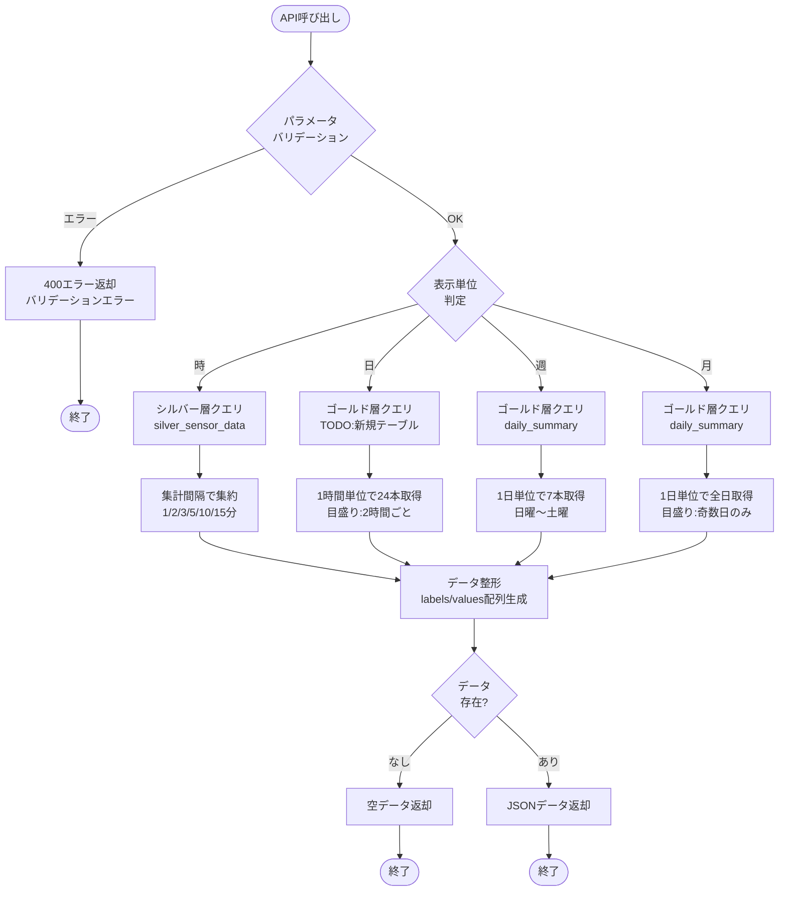
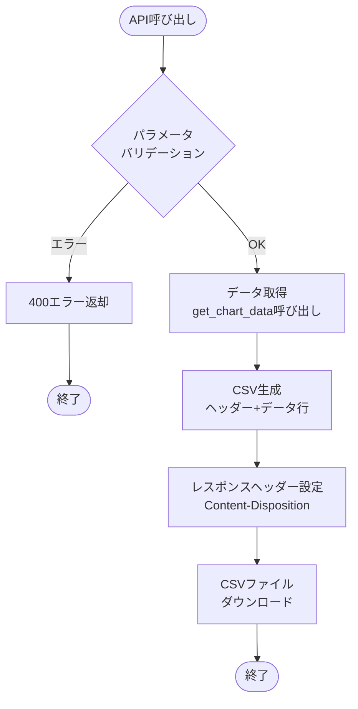
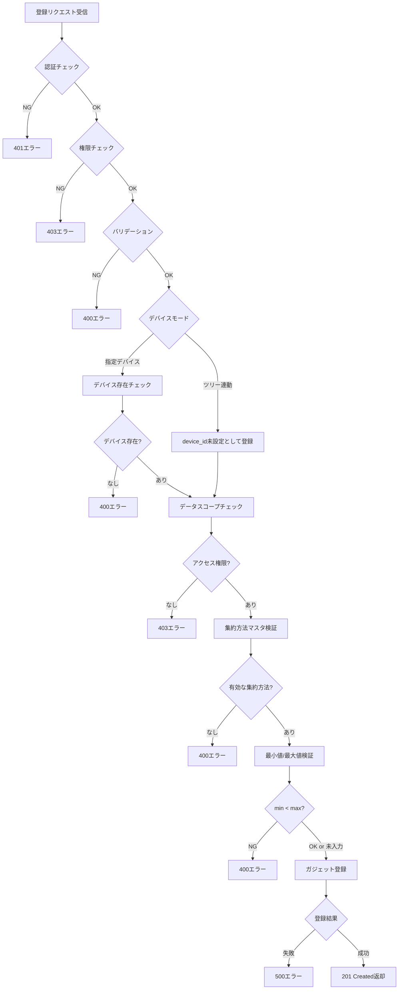
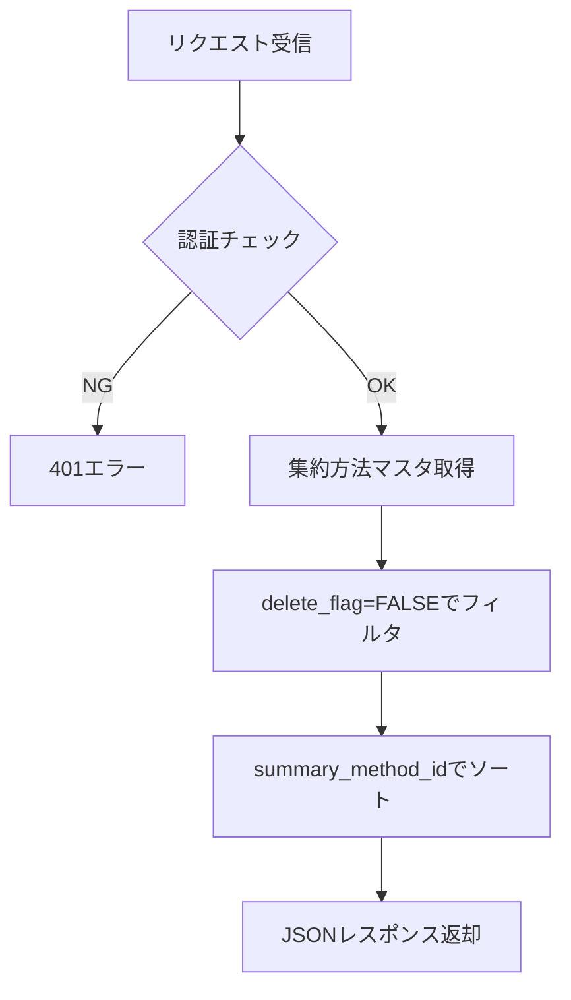

# ダッシュボード棒グラフ - ワークフロー仕様書

## 目次

- [概要](#概要)
  - [このドキュメントの役割](#このドキュメントの役割)
  - [対象機能](#対象機能)
- [処理フロー全体図](#処理フロー全体図)
- [Flaskルート定義](#flaskルート定義)
  - [ルート一覧](#ルート一覧)
  - [グラフデータ取得API](#グラフデータ取得api)
  - [CSV出力API](#csv出力api)
- [データ取得ワークフロー](#データ取得ワークフロー)
  - [処理フロー図](#処理フロー図)
  - [表示単位別データソース](#表示単位別データソース)
  - [データ取得実装](#データ取得実装)
  - [シルバー層クエリ（時単位）](#シルバー層クエリ時単位)
  - [ゴールド層クエリ（日単位）](#ゴールド層クエリ日単位)
  - [ゴールド層クエリ（週単位）](#ゴールド層クエリ週単位)
  - [ゴールド層クエリ（月単位）](#ゴールド層クエリ月単位)
- [CSV出力ワークフロー](#csv出力ワークフロー)
  - [処理フロー図](#処理フロー図-1)
  - [CSV出力実装](#csv出力実装)
- [バリデーション仕様](#バリデーション仕様)
  - [リクエストパラメータ定義](#リクエストパラメータ定義)
  - [バリデーション実装](#バリデーション実装)
  - [許可値一覧](#許可値一覧)
- [エラーハンドリング](#エラーハンドリング)
  - [エラー分類](#エラー分類)
  - [エラーハンドリング実装](#エラーハンドリング実装)
- [セキュリティ設計](#セキュリティ設計)
  - [入力検証](#入力検証)
- [パフォーマンス設計](#パフォーマンス設計)
  - [性能目標](#性能目標)
  - [最適化方針](#最適化方針)
- [テスト仕様](#テスト仕様)
  - [単体テスト](#単体テスト)
  - [統合テスト](#統合テスト)
- [関連ドキュメント](#関連ドキュメント)
- [変更履歴](#変更履歴)

---

## 概要

このドキュメントは、ダッシュボード棒グラフ機能のデータ取得ワークフロー、エラーハンドリングの詳細を記載します。

### このドキュメントの役割

- データ取得APIの処理フロー
- シルバー層/ゴールド層からのデータ取得ロジック
- バリデーション・エラーハンドリング
- CSV出力処理

### 対象機能

| 機能ID | 機能名 | 処理内容 |
| ------ | ------ | -------- |
| DBG-001 | グラフ表示 | センサーデータを棒グラフで時系列表示 |
| DBG-002 | 表示単位切替 | 時/日/週/月単位での表示切替 |
| DBG-003 | 期間選択 | 日時ピッカーによる表示期間の指定 |
| DBG-004 | 集計間隔選択 | データの集計間隔を選択（時単位のみ） |
| DBG-005 | CSVエクスポート | 表示データをCSVファイルとしてダウンロード |
| DBG-006 | ガジェット登録 | 棒グラフガジェットの新規登録 |

---

## Flaskルート定義

### ルート一覧

| メソッド | URL | 関数名 | 説明 |
| -------- | --- | ------ | ---- |
| GET | /api/customer-dashboard/bar-chart/data | get_bar_chart_data | グラフデータ取得API |
| GET | /api/customer-dashboard/bar-chart/export | export_bar_chart_csv | CSV出力API |
| POST | /api/customer-dashboard/bar-chart/register | register_bar_chart | ガジェット登録API |
| GET | /api/customer-dashboard/bar-chart/aggregation-methods | get_aggregation_methods | 集約方法一覧取得API |

### グラフデータ取得API

```python
from flask import Blueprint, jsonify, request, g
from datetime import datetime, timedelta
from functools import wraps
import pytz

bp = Blueprint('dashboard_bar_chart', __name__)
JST = pytz.timezone('Asia/Tokyo')

# =============================================================================
# デコレータ定義
# =============================================================================
def login_required(f):
    """認証チェックデコレータ"""
    @wraps(f)
    def decorated_function(*args, **kwargs):
        if not g.get('current_user'):
            return jsonify({'status': 'error', 'message': '認証が必要です'}), 401
        return f(*args, **kwargs)
    return decorated_function

def require_role(*roles):
    """権限チェックデコレータ"""
    def decorator(f):
        @wraps(f)
        def decorated_function(*args, **kwargs):
            if g.current_user.role not in roles:
                return jsonify({'status': 'error', 'message': 'アクセス権限がありません'}), 403
            return f(*args, **kwargs)
        return decorated_function
    return decorator

# =============================================================================
# グラフデータ取得API
# =============================================================================
@bp.route('/api/customer-dashboard/bar-chart/data', methods=['GET'])
@login_required
@require_role('system_admin', 'management_admin', 'sales_company_user', 'service_company_user')
def get_bar_chart_data():
    """
    棒グラフ用データを取得

    リクエストパラメータ:
    - device_id: デバイスID（必須）
    - display_unit: 表示単位 hour/day/week/month（必須）
    - interval: 集計間隔（時単位のみ必須）
    - item: 表示項目（必須）
    - method_id: 集計方法ID（必須）
    - base_datetime: 基準日時（必須）

    レスポンス:
    - 成功時: {"status": "success", "data": {...}}
    - エラー時: {"status": "error", "message": "..."}
    """
    # パラメータ取得
    params = {
        'device_id': request.args.get('device_id'),
        'display_unit': request.args.get('display_unit'),
        'interval': request.args.get('interval'),
        'item': request.args.get('item'),
        'method_id': request.args.get('method_id', type=int),
        'base_datetime': request.args.get('base_datetime')
    }

    # バリデーション
    errors = validate_chart_params(params)
    if errors:
        return jsonify({'status': 'error', 'message': errors[0]}), 400

    # データ取得
    try:
        data = get_chart_data(
            device_id=params['device_id'],
            display_unit=params['display_unit'],
            interval=params['interval'],
            item=params['item'],
            method_id=params['method_id'],
            base_datetime=datetime.fromisoformat(params['base_datetime'])
        )

        if not data['values']:
            return jsonify({
                'status': 'success',
                'data': {
                    'labels': [],
                    'values': [],
                    'item_name': data['item_name'],
                    'unit': data['unit'],
                    'device_name': data['device_name'],
                    'message': '指定期間のデータがありません'
                }
            })

        return jsonify({'status': 'success', 'data': data})

    except Exception as e:
        logger.error(f'Chart data fetch error: {e}')
        return jsonify({'status': 'error', 'message': 'データの取得に失敗しました'}), 500
```

### CSV出力API

```python
from flask import Response
import csv
import io

# =============================================================================
# CSV出力API
# =============================================================================
@bp.route('/api/customer-dashboard/bar-chart/export', methods=['GET'])
@login_required
@require_role('system_admin', 'management_admin', 'sales_company_user', 'service_company_user')
def export_bar_chart_csv():
    """
    グラフデータをCSVとしてエクスポート

    リクエストパラメータ:
    get_bar_chart_dataと同一

    レスポンス:
    - 成功時: CSVファイルダウンロード
    - エラー時: JSONエラーレスポンス
    """
    # パラメータ取得・バリデーション（get_bar_chart_dataと同一）
    params = {
        'device_id': request.args.get('device_id'),
        'display_unit': request.args.get('display_unit'),
        'interval': request.args.get('interval'),
        'item': request.args.get('item'),
        'method_id': request.args.get('method_id', type=int),
        'base_datetime': request.args.get('base_datetime')
    }

    errors = validate_chart_params(params)
    if errors:
        return jsonify({'status': 'error', 'message': errors[0]}), 400

    try:
        # データ取得
        data = get_chart_data(
            device_id=params['device_id'],
            display_unit=params['display_unit'],
            interval=params['interval'],
            item=params['item'],
            method_id=params['method_id'],
            base_datetime=datetime.fromisoformat(params['base_datetime'])
        )

        # CSV生成
        output = io.StringIO()
        writer = csv.writer(output)

        # ヘッダー行
        writer.writerow(['日時', f'{data["item_name"]} ({data["unit"]})'])

        # データ行
        for label, value in zip(data['labels'], data['values']):
            writer.writerow([label, value])

        # レスポンス生成
        output.seek(0)
        timestamp = datetime.now(JST).strftime('%Y%m%d%H%M%S')
        filename = f'bar_chart_{params["device_id"]}_{timestamp}.csv'

        return Response(
            output.getvalue(),
            mimetype='text/csv; charset=utf-8',
            headers={
                'Content-Disposition': f'attachment; filename="{filename}"'
            }
        )

    except Exception as e:
        logger.error(f'CSV export error: {e}')
        return jsonify({'status': 'error', 'message': 'CSV出力に失敗しました'}), 500
```

### ガジェット登録API

```python
# =============================================================================
# ガジェット登録API
# =============================================================================
@bp.route('/api/customer-dashboard/bar-chart/register', methods=['POST'])
@login_required
@require_role('system_admin', 'management_admin', 'sales_company_user', 'service_company_user')
def register_bar_chart():
    """
    棒グラフガジェットを登録

    リクエストボディ:
    - title: ガジェットタイトル（必須）
    - device_mode: 表示デバイス選択（'specified' or 'tree_linked'）（必須）
    - device_id: デバイスID（device_mode='specified'の場合必須）
    - group_id: グループID（必須）
    - aggregation_method_id: 集約方法ID（必須）
    - item: 表示項目（必須、1つのみ）
    - min_value: Y軸最小値（任意）
    - max_value: Y軸最大値（任意）
    - gadget_size: 部品サイズ（必須）

    レスポンス:
    - 成功時: {"status": "success", "gadget_id": "..."}
    - エラー時: {"status": "error", "message": "..."}
    """
    data = request.get_json()

    # バリデーション
    errors = validate_register_params(data)
    if errors:
        return jsonify({'status': 'error', 'message': errors[0]}), 400

    try:
        # ガジェット登録
        # TODO: 登録先DBにガジェット情報を保存
        gadget = BarChartGadget(
            title=data['title'],
            device_mode=data['device_mode'],
            device_id=data.get('device_id'),
            group_id=data['group_id'],
            aggregation_method_id=data['aggregation_method_id'],
            item=data['item'],
            min_value=data.get('min_value'),
            max_value=data.get('max_value'),
            gadget_size=data['gadget_size'],
            created_by=g.current_user.id
        )
        db.session.add(gadget)
        db.session.commit()

        return jsonify({
            'status': 'success',
            'gadget_id': gadget.id
        }), 201

    except Exception as e:
        db.session.rollback()
        logger.error(f'Gadget registration error: {e}')
        return jsonify({'status': 'error', 'message': '登録に失敗しました'}), 500


def validate_register_params(data: dict) -> list:
    """
    登録パラメータをバリデーション
    """
    errors = []

    # title
    if not data.get('title'):
        errors.append('タイトルは必須です')
    elif len(data['title']) > 20:
        errors.append('タイトルは20文字以内で入力してください')

    # device_mode
    if data.get('device_mode') not in ['specified', 'tree_linked']:
        errors.append('表示デバイス選択が不正です')

    # device_id (指定デバイスモード時のみ必須)
    if data.get('device_mode') == 'specified':
        if not data.get('device_id'):
            errors.append('デバイスIDは必須です')
        elif not UUID_PATTERN.match(data['device_id']):
            errors.append('デバイスIDの形式が不正です')

    # group_id
    if not data.get('group_id'):
        errors.append('グループIDは必須です')

    # aggregation_method_id
    if not data.get('aggregation_method_id'):
        errors.append('集約方法は必須です')
    elif data['aggregation_method_id'] not in range(1, 9):
        errors.append('集約方法が不正です')

    # item（1つのみ）
    if not data.get('item'):
        errors.append('表示項目は必須です')
    elif data['item'] not in ALLOWED_ITEMS:
        errors.append(f'不正な項目です: {data["item"]}')

    # min_value / max_value（任意、両方入力時は大小チェック）
    min_val = data.get('min_value')
    max_val = data.get('max_value')

    if min_val is not None:
        try:
            min_val = float(min_val)
        except (ValueError, TypeError):
            errors.append('最小値は数値で入力してください')
            min_val = None

    if max_val is not None:
        try:
            max_val = float(max_val)
        except (ValueError, TypeError):
            errors.append('最大値は数値で入力してください')
            max_val = None

    if min_val is not None and max_val is not None:
        if min_val >= max_val:
            errors.append('最小値は最大値より小さい値を入力してください')

    # gadget_size
    VALID_GADGET_SIZES = ['2x2', '2x4']
    if not data.get('gadget_size'):
        errors.append('部品サイズは必須です')
    elif data['gadget_size'] not in VALID_GADGET_SIZES:
        errors.append('部品サイズが不正です')

    return errors
```

### 集約方法一覧取得API

```python
# =============================================================================
# 集約方法一覧取得API
# =============================================================================
@bp.route('/api/customer-dashboard/bar-chart/aggregation-methods', methods=['GET'])
@login_required
def get_aggregation_methods():
    """
    集約方法一覧を取得

    レスポンス:
    - 成功時: {"status": "success", "data": [...]}
    """
    try:
        # gold_summary_method_masterから有効な集約方法を取得
        methods = get_active_aggregation_methods()

        return jsonify({
            'status': 'success',
            'data': methods
        })

    except Exception as e:
        logger.error(f'Aggregation methods fetch error: {e}')
        return jsonify({'status': 'error', 'message': '集約方法の取得に失敗しました'}), 500


def get_active_aggregation_methods() -> list:
    """
    有効な集約方法一覧を取得

    Returns:
        list: 集約方法リスト
    """
    query = """
    SELECT
        summary_method_id,
        summary_method_code,
        summary_method_name
    FROM iot_catalog.gold.gold_summary_method_master
    WHERE delete_flag = FALSE
    ORDER BY summary_method_id
    """

    result = spark.sql(query).collect()

    return [
        {
            'id': row.summary_method_id,
            'code': row.summary_method_code,
            'name': row.summary_method_name
        }
        for row in result
    ]
```

**集約方法マスタ（gold_summary_method_master）:**

| summary_method_id | summary_method_code | summary_method_name | 計算ロジック |
| ----------------- | ------------------- | ------------------- | ------------ |
| 1 | AVG | 平均値 | `AVG(sensor_value)` |
| 2 | MAX | 最大値 | `MAX(sensor_value)` |
| 3 | MIN | 最小値 | `MIN(sensor_value)` |
| 4 | P25 | 第1四分位数 | `PERCENTILE_APPROX(sensor_value, 0.25)` |
| 5 | MEDIAN | 中央値 | `PERCENTILE_APPROX(sensor_value, 0.5)` |
| 6 | P75 | 第3四分位数 | `PERCENTILE_APPROX(sensor_value, 0.75)` |
| 7 | STDDEV | 標準偏差 | `STDDEV(sensor_value)` |
| 8 | P95 | 上側5％境界値 | `PERCENTILE_APPROX(sensor_value, 0.95)` |

---

## データ取得ワークフロー

### 処理フロー図



### 表示単位別データソース

| 表示単位 | データソース | 集計間隔 | 表示目盛り | データ本数 |
| -------- | ------------ | -------- | ---------- | ---------- |
| 時（hour） | シルバー層 silver_sensor_data | 1/2/3/5/10/15分（選択可） | 集計間隔と同じ | 可変 |
| 日（day） | **TODO**（新規時間単位サマリーテーブル） | 1時間（固定） | 2時間ごと（0時, 2時, ..., 22時） | 24本 |
| 週（week） | ゴールド層 daily_summary | 1日（固定） | 1日ごと（日曜〜土曜） | 7本 |
| 月（month） | ゴールド層 daily_summary | 1日（固定） | 2日飛ばし（奇数日のみ表示） | 月の日数分 |

**日単位の補足:**
- データは1時間単位で24本取得
- 表示目盛りは2時間ごと（0時, 2時, 4時, ..., 22時）
- 取得先テーブルは今後作成予定（TODO）

**月単位の補足:**
- データは1日単位で月の全日分取得
- 表示目盛りは奇数日のみ（1日, 3日, 5日, ..., 月末奇数日）

### データ取得実装

```python
from databricks import sql as databricks_sql
from datetime import datetime, timedelta
from calendar import monthrange
import pytz

JST = pytz.timezone('Asia/Tokyo')

# =============================================================================
# Databricks SQL Connector設定
# =============================================================================
DATABRICKS_CONFIG = {
    'server_hostname': dbutils.secrets.get('iot-secrets', 'databricks-host'),
    'http_path': dbutils.secrets.get('iot-secrets', 'databricks-http-path'),
    'access_token': dbutils.secrets.get('iot-secrets', 'databricks-token')
}

def get_databricks_connection():
    """Databricks SQL接続を取得"""
    return databricks_sql.connect(**DATABRICKS_CONFIG)


# =============================================================================
# チャートデータ取得メイン処理
# =============================================================================
def get_chart_data(
    device_id: str,
    display_unit: str,
    interval: str,
    item: str,
    method_id: int,
    base_datetime: datetime
) -> dict:
    """
    棒グラフ用データを取得

    Args:
        device_id: デバイスID
        display_unit: 表示単位（hour/day/week/month）
        interval: 集計間隔（時単位のみ使用）
        item: 表示項目（センサーカラム名）
        method_id: 集計方法ID
        base_datetime: 基準日時

    Returns:
        {
            'labels': ['15:00', '15:10', ...],
            'values': [120, 135, ...],
            'item_name': '通信通電時間',
            'unit': 'm',
            'device_name': 'デバイス001'
        }
    """
    # デバイス名・項目情報取得
    device_info = get_device_info(device_id)
    item_info = get_item_info(item)

    # 表示単位に応じてデータ取得
    if display_unit == 'hour':
        raw_data = fetch_silver_data(device_id, item, interval, base_datetime)
    elif display_unit == 'day':
        raw_data = fetch_gold_daily_data(device_id, item, method_id, base_datetime)
    elif display_unit == 'week':
        raw_data = fetch_gold_weekly_data(device_id, item, method_id, base_datetime)
    else:  # month
        raw_data = fetch_gold_monthly_data(device_id, item, method_id, base_datetime)

    # データ整形
    labels = [row['time_label'] for row in raw_data]
    values = [row['value'] for row in raw_data]

    return {
        'labels': labels,
        'values': values,
        'item_name': item_info['measurement_item_name'],
        'unit': item_info['unit'],
        'device_name': device_info['device_name']
    }
```

### シルバー層クエリ（時単位）

```python
# =============================================================================
# シルバー層データ取得（時単位）
# =============================================================================
def fetch_silver_data(
    device_id: str,
    item: str,
    interval: str,
    base_datetime: datetime
) -> list:
    """
    シルバー層からセンサーデータを取得し、指定間隔で集計

    Args:
        device_id: デバイスID
        item: センサーカラム名
        interval: 集計間隔（1min/2min/3min/5min/10min/15min）
        base_datetime: 基準日時

    Returns:
        [{'time_label': '15:00', 'value': 120.5}, ...]

    表示例（base_datetime=15:58:39, interval=10min）:
        15:10, 15:20, 15:30, 15:40, 15:50, 16:00
    """
    # 集計間隔をSQLのINTERVAL用に変換
    interval_mapping = {
        '1min': 1,
        '2min': 2,
        '3min': 3,
        '5min': 5,
        '10min': 10,
        '15min': 15
    }
    interval_minutes = interval_mapping.get(interval, 10)

    # 表示期間計算（基準日時の前後1時間）
    start_datetime = base_datetime - timedelta(hours=1)
    end_datetime = base_datetime + timedelta(hours=1)

    query = f"""
        SELECT
            DATE_TRUNC('minute', event_timestamp) -
                INTERVAL (MINUTE(event_timestamp) % {interval_minutes}) MINUTE AS time_bucket,
            DATE_FORMAT(
                DATE_TRUNC('minute', event_timestamp) -
                    INTERVAL (MINUTE(event_timestamp) % {interval_minutes}) MINUTE,
                'HH:mm'
            ) AS time_label,
            AVG({item}) AS value
        FROM iot_catalog.silver.silver_sensor_data
        WHERE device_id = :device_id
          AND event_timestamp >= :start_datetime
          AND event_timestamp < :end_datetime
        GROUP BY time_bucket
        ORDER BY time_bucket
    """

    with get_databricks_connection() as conn:
        with conn.cursor() as cursor:
            cursor.execute(
                query,
                {
                    'device_id': device_id,
                    'start_datetime': start_datetime.isoformat(),
                    'end_datetime': end_datetime.isoformat()
                }
            )
            columns = [desc[0] for desc in cursor.description]
            return [dict(zip(columns, row)) for row in cursor.fetchall()]
```

### ゴールド層クエリ（日単位）

**TODO:** 取得先テーブルは新規作成予定。テーブル名・スキーマが確定後に実装。

```python
# =============================================================================
# ゴールド層データ取得（日単位）
# =============================================================================
def fetch_gold_hourly_data(
    device_id: str,
    item: str,
    method_id: int,
    base_datetime: datetime
) -> list:
    """
    ゴールド層から日単位データを取得（1時間単位）

    Args:
        device_id: デバイスID
        item: センサーカラム名（summary_item）
        method_id: 集計方法ID
        base_datetime: 基準日時

    Returns:
        [{'time_label': '0時', 'value': 120.5}, ...]

    データ取得:
        0時〜23時の24本（1時間単位で集計済み）

    表示目盛り:
        2時間ごと（0時, 2時, 4時, ..., 22時）
        ※目盛り表示はフロント側で制御
    """
    # TODO: 取得先テーブルが確定後に実装
    # テーブル名: gold_sensor_data_hourly_summary（仮）

    base_date = base_datetime.date()

    query = """
        SELECT
            collection_hour,
            CONCAT(collection_hour, '時') AS time_label,
            summary_value AS value
        FROM iot_catalog.gold.gold_sensor_data_hourly_summary  -- TODO: テーブル名確定後に修正
        WHERE device_id = :device_id
          AND summary_item = :item
          AND summary_method_id = :method_id
          AND collection_date = :base_date
        ORDER BY collection_hour
    """

    with get_databricks_connection() as conn:
        with conn.cursor() as cursor:
            cursor.execute(
                query,
                {
                    'device_id': device_id,
                    'item': item,
                    'method_id': method_id,
                    'base_date': base_date.isoformat()
                }
            )
            columns = [desc[0] for desc in cursor.description]
            return [dict(zip(columns, row)) for row in cursor.fetchall()]
```

### ゴールド層クエリ（週単位）

```python
# =============================================================================
# ゴールド層データ取得（週単位）
# =============================================================================
def fetch_gold_weekly_data(
    device_id: str,
    item: str,
    method_id: int,
    base_datetime: datetime
) -> list:
    """
    ゴールド層から週単位データを取得（日曜〜土曜）

    Args:
        device_id: デバイスID
        item: センサーカラム名（summary_item）
        method_id: 集計方法ID
        base_datetime: 基準日時

    Returns:
        [{'time_label': '2/1(日)', 'value': 120.5}, ...]

    表示例（base_datetime=2026/02/06（金曜日））:
        2/1(日), 2/2(月), 2/3(火), 2/4(水), 2/5(木), 2/6(金), 2/7(土)（7本）
    """
    base_date = base_datetime.date()

    # 週の開始日（日曜日）を計算
    # weekday(): 月曜=0, 日曜=6
    days_since_sunday = (base_date.weekday() + 1) % 7
    week_start = base_date - timedelta(days=days_since_sunday)
    week_end = week_start + timedelta(days=6)

    # 曜日ラベル
    weekday_labels = ['日', '月', '火', '水', '木', '金', '土']

    query = """
        SELECT
            collection_date,
            summary_value AS value
        FROM iot_catalog.gold.gold_sensor_data_daily_summary
        WHERE device_id = :device_id
          AND summary_item = :item
          AND summary_method_id = :method_id
          AND collection_date >= :week_start
          AND collection_date <= :week_end
        ORDER BY collection_date
    """

    with get_databricks_connection() as conn:
        with conn.cursor() as cursor:
            cursor.execute(
                query,
                {
                    'device_id': device_id,
                    'item': item,
                    'method_id': method_id,
                    'week_start': week_start.isoformat(),
                    'week_end': week_end.isoformat()
                }
            )
            columns = [desc[0] for desc in cursor.description]
            rows = [dict(zip(columns, row)) for row in cursor.fetchall()]

    # 曜日ラベルを付与
    result = []
    for row in rows:
        date = row['collection_date']
        weekday_index = (date.weekday() + 1) % 7  # 日曜=0
        time_label = f"{date.month}/{date.day}({weekday_labels[weekday_index]})"
        result.append({
            'time_label': time_label,
            'value': row['value']
        })

    return result
```

### ゴールド層クエリ（月単位）

```python
# =============================================================================
# ゴールド層データ取得（月単位）
# =============================================================================
def fetch_gold_monthly_data(
    device_id: str,
    item: str,
    method_id: int,
    base_datetime: datetime
) -> list:
    """
    ゴールド層から月単位データを取得（全日分）

    Args:
        device_id: デバイスID
        item: センサーカラム名（summary_item）
        method_id: 集計方法ID
        base_datetime: 基準日時

    Returns:
        [{'time_label': '1日', 'value': 120.5}, ...]

    データ取得:
        月の全日分（1日〜月末日）

    表示目盛り:
        2日飛ばし（奇数日: 1日, 3日, 5日, ..., 月末奇数日）
        ※目盛り表示はフロント側で制御
    """
    base_date = base_datetime.date()
    year = base_date.year
    month = base_date.month

    # 月の日数を取得
    _, last_day = monthrange(year, month)

    # 月の開始日と終了日
    month_start = base_date.replace(day=1)
    month_end = base_date.replace(day=last_day)

    query = """
        SELECT
            collection_date,
            DAY(collection_date) AS day_of_month,
            summary_value AS value
        FROM iot_catalog.gold.gold_sensor_data_daily_summary
        WHERE device_id = :device_id
          AND summary_item = :item
          AND summary_method_id = :method_id
          AND collection_date >= :month_start
          AND collection_date <= :month_end
        ORDER BY collection_date
    """

    with get_databricks_connection() as conn:
        with conn.cursor() as cursor:
            cursor.execute(
                query,
                {
                    'device_id': device_id,
                    'item': item,
                    'method_id': method_id,
                    'month_start': month_start.isoformat(),
                    'month_end': month_end.isoformat()
                }
            )
            columns = [desc[0] for desc in cursor.description]
            rows = [dict(zip(columns, row)) for row in cursor.fetchall()]

    # ラベルを付与
    result = []
    for row in rows:
        time_label = f"{row['day_of_month']}日"
        result.append({
            'time_label': time_label,
            'value': row['value']
        })

    return result
```

---

## CSV出力ワークフロー

### 処理フロー図



### CSV出力実装

```python
# =============================================================================
# CSV生成処理
# =============================================================================
def generate_csv(data: dict) -> str:
    """
    グラフデータをCSV形式に変換

    Args:
        data: get_chart_dataの戻り値

    Returns:
        CSV文字列（UTF-8 BOM付き）
    """
    output = io.StringIO()

    # UTF-8 BOM付き（Excel対応）
    output.write('\ufeff')

    writer = csv.writer(output)

    # ヘッダー行
    header = ['日時', f'{data["item_name"]} ({data["unit"]})']
    writer.writerow(header)

    # データ行
    for label, value in zip(data['labels'], data['values']):
        writer.writerow([label, value if value is not None else ''])

    return output.getvalue()
```

---

## ガジェット登録ワークフロー

### 処理フロー図



### 登録処理の流れ

1. **認証・権限チェック**: ログインユーザーの認証状態とロールを確認
2. **バリデーション**: 必須項目、文字数、形式をチェック
3. **デバイスモード分岐**:
   - 指定デバイス: デバイスの存在確認とデータスコープチェック
   - ツリー連動: device_id未設定として登録（表示時にツリー上で選択したデバイスのデータを取得）
4. **集約方法検証**: gold_summary_method_masterで有効性を確認
5. **最小値/最大値検証**: 両方入力時は最小値 < 最大値をチェック
6. **ガジェット登録**: **TODO** 登録先DBにガジェット情報を保存

---

## 集約方法一覧取得ワークフロー

### 処理フロー図



### 取得処理の流れ

1. **認証チェック**: ログイン状態を確認（権限チェックは不要）
2. **マスタ取得**: gold_summary_method_masterから有効な集約方法を取得
3. **レスポンス**: ID、コード、名称のリストを返却

---

## バリデーション仕様

### リクエストパラメータ定義（データ取得API）

| パラメータ | 型 | 必須 | 説明 | 例 |
| ---------- | -- | ---- | ---- | -- |
| device_id | string | ○ | デバイスID | "DEV001" |
| display_unit | string | ○ | 表示単位 | "hour" |
| interval | string | △ | 集計間隔（時単位のみ必須） | "10min" |
| item | string | ○ | 表示項目 | "communication_power_time" |
| method_id | integer | ○ | 集計方法ID | 1 |
| base_datetime | string | ○ | 基準日時（YYYY/MM/DD HH:mm:ss形式） | "2026-02-05 15:32:42" |

### リクエストパラメータ定義（ガジェット登録API）

| パラメータ | 型 | 必須 | 説明 |
| ---------- | -- | ---- | ---- |
| title | string | ○ | ガジェットタイトル（1-20文字） |
| device_mode | string | ○ | 表示デバイス選択（'specified' / 'tree_linked'） |
| device_id | string | △ | デバイスID（device_mode='specified'時必須） |
| group_id | string | ○ | グループID |
| aggregation_method_id | integer | ○ | 集約方法ID（1-8） |
| item | string | ○ | 表示項目（1つのみ） |
| min_value | number | - | Y軸最小値（任意） |
| max_value | number | - | Y軸最大値（任意） |
| gadget_size | string | ○ | 部品サイズ（'2x2' / '2x4'） |

### バリデーション実装

```python
from datetime import datetime

# =============================================================================
# 許可値定義
# =============================================================================
VALID_DISPLAY_UNITS = ['hour', 'day', 'week', 'month']

VALID_INTERVALS = {
    'hour': ['1min', '2min', '3min', '5min', '10min', '15min']
}

VALID_ITEMS = [
    'external_temp',                      # 外気温度
    'set_temp_freezer_1',                 # 第1冷凍 設定温度
    'internal_sensor_temp_freezer_1',     # 第1冷凍 庫内センサー温度
    'internal_temp_freezer_1',            # 第1冷凍 庫内温度
    'df_temp_freezer_1',                  # 第1冷凍 DF温度
    'condensing_temp_freezer_1',          # 第1冷凍 凝縮温度
    'adjusted_internal_temp_freezer_1',   # 第1冷凍 微調整後庫内温度
    'set_temp_freezer_2',                 # 第2冷凍 設定温度
    'internal_sensor_temp_freezer_2',     # 第2冷凍 庫内センサー温度
    'internal_temp_freezer_2',            # 第2冷凍 庫内温度
    'df_temp_freezer_2',                  # 第2冷凍 DF温度
    'condensing_temp_freezer_2',          # 第2冷凍 凝縮温度
    'adjusted_internal_temp_freezer_2',   # 第2冷凍 微調整後庫内温度
    'compressor_freezer_1',               # 第1冷凍 圧縮機
    'compressor_freezer_2',               # 第2冷凍 圧縮機
    'fan_motor_1',                        # 第1ファンモータ回転数
    'fan_motor_2',                        # 第2ファンモータ回転数
    'fan_motor_3',                        # 第3ファンモータ回転数
    'fan_motor_4',                        # 第4ファンモータ回転数
    'fan_motor_5',                        # 第5ファンモータ回転数
    'defrost_heater_output_1',            # 防露ヒータ出力(1)
    'defrost_heater_output_2'             # 防露ヒータ出力(2)
]

VALID_METHOD_IDS = [1, 2, 3, 4, 5, 6, 7, 8]


# =============================================================================
# バリデーション処理
# =============================================================================
def validate_chart_params(params: dict) -> list:
    """
    チャートパラメータのバリデーション

    Args:
        params: リクエストパラメータ辞書

    Returns:
        エラーメッセージのリスト（空リストは正常）
    """
    errors = []

    # 必須チェック
    if not params.get('device_id'):
        errors.append('デバイスIDは必須です')

    if not params.get('display_unit'):
        errors.append('表示単位は必須です')
    elif params['display_unit'] not in VALID_DISPLAY_UNITS:
        errors.append('表示単位が不正です')

    # 集計間隔チェック（時単位のみ必須）
    if params.get('display_unit') == 'hour':
        if not params.get('interval'):
            errors.append('集計間隔は必須です')
        elif params['interval'] not in VALID_INTERVALS['hour']:
            errors.append('集計間隔が不正です')

    if not params.get('item'):
        errors.append('表示項目は必須です')
    elif params['item'] not in VALID_ITEMS:
        errors.append('表示項目が不正です')

    if params.get('method_id') is None:
        errors.append('集計方法は必須です')
    elif params['method_id'] not in VALID_METHOD_IDS:
        errors.append('集計方法が不正です')

    if not params.get('base_datetime'):
        errors.append('基準日時は必須です')
    else:
        try:
            datetime.fromisoformat(params['base_datetime'])
        except ValueError:
            errors.append('基準日時の形式が不正です')

    return errors
```

### 許可値一覧

**表示単位（display_unit）:**

| 値 | ラベル | データソース |
| -- | ------ | ------------ |
| hour | 時 | シルバー層 |
| day | 日 | ゴールド層（hourly_summary） |
| week | 週 | ゴールド層（daily_summary） |
| month | 月 | ゴールド層（daily_summary） |

**集計間隔（interval）:**

| 表示単位 | 集計間隔 | 分換算 | 選択可否 | 表示本数 |
| -------- | -------- | ------ | -------- | -------- |
| hour | 1min, 2min, 3min, 5min, 10min, 15min | 1〜15分 | 選択可能 | 可変 |
| day | 1時間 | 60分 | 固定（非表示） | 24本 |
| week | 1日 | 1440分 | 固定（非表示） | 7本 |
| month | 1日 | 1440分 | 固定（非表示） | 28〜31本 |

**集計方法（method_id）:**

| ID | 方法 | 説明 |
| -- | ---- | ---- |
| 1 | AVG | 平均値 |
| 2 | MAX | 最大値 |
| 3 | MIN | 最小値 |
| 4 | P25 | 25パーセンタイル |
| 5 | MEDIAN | 中央値 |
| 6 | P75 | 75パーセンタイル |
| 7 | STDDEV | 標準偏差 |
| 8 | P95 | 95パーセンタイル |

---

## エラーハンドリング

### エラー分類

| エラー種別 | HTTPステータス | 対応 | ログ出力 |
| ---------- | -------------- | ---- | -------- |
| 認証エラー | 401 | エラーJSON返却 | なし |
| 権限エラー | 403 | エラーJSON返却 | WARN |
| パラメータエラー | 400 | エラーJSON返却 | INFO |
| データなし | 200 | 空データJSON返却 | なし |
| DB接続エラー | 500 | エラーJSON返却 | ERROR |
| 予期せぬエラー | 500 | エラーJSON返却 | ERROR |

### エラーハンドリング実装

```python
import logging
from flask import jsonify
from functools import wraps

logger = logging.getLogger(__name__)


# =============================================================================
# エラーハンドラー
# =============================================================================
@bp.errorhandler(400)
def handle_bad_request(error):
    """400 Bad Request"""
    return jsonify({'status': 'error', 'message': str(error)}), 400


@bp.errorhandler(401)
def handle_unauthorized(error):
    """401 Unauthorized"""
    return jsonify({'status': 'error', 'message': '認証が必要です'}), 401


@bp.errorhandler(403)
def handle_forbidden(error):
    """403 Forbidden"""
    logger.warning(f'Access denied: user={g.current_user.user_id}, path={request.path}')
    return jsonify({'status': 'error', 'message': 'アクセス権限がありません'}), 403


@bp.errorhandler(500)
def handle_internal_error(error):
    """500 Internal Server Error"""
    logger.error(f'Internal error: {error}', exc_info=True)
    return jsonify({'status': 'error', 'message': 'サーバーエラーが発生しました'}), 500


# =============================================================================
# 共通例外処理デコレータ
# =============================================================================
def handle_exceptions(f):
    """API用例外処理デコレータ"""
    @wraps(f)
    def decorated_function(*args, **kwargs):
        try:
            return f(*args, **kwargs)
        except ValidationError as e:
            logger.info(f'Validation error: {e}')
            return jsonify({'status': 'error', 'message': str(e)}), 400
        except PermissionError as e:
            logger.warning(f'Permission error: {e}')
            return jsonify({'status': 'error', 'message': 'アクセス権限がありません'}), 403
        except DatabaseError as e:
            logger.error(f'Database error: {e}', exc_info=True)
            return jsonify({'status': 'error', 'message': 'データベースエラーが発生しました'}), 500
        except Exception as e:
            logger.error(f'Unexpected error: {e}', exc_info=True)
            return jsonify({'status': 'error', 'message': 'サーバーエラーが発生しました'}), 500
    return decorated_function
```

---

## セキュリティ設計

### 入力検証

| 項目 | 実装 |
| ---- | ---- |
| パラメータ検証 | 独自バリデータ（validate_chart_params） |
| 型チェック | 厳格な型チェック |
| 許可値チェック | ホワイトリスト方式 |
| SQLインジェクション対策 | パラメータバインディング使用 |

---

## パフォーマンス設計

### 性能目標

| 項目 | 目標値 |
| ---- | ------ |
| APIレスポンス | 500ms以内 |
| CSV出力 | 5秒以内（10万件まで） |

### 最適化方針

| 項目 | 方針 |
| ---- | ---- |
| クエリ最適化 | クラスタリングキー（device_id, collection_date）活用 |
| データ件数制限 | グラフ表示は最大100件、CSV出力は最大10万件 |
| マスタキャッシュ | センサー項目、集計方法マスタをアプリケーションキャッシュ |
| 接続プーリング | Databricks SQL Connectorのコネクションプール使用 |

---

## テスト仕様

### 単体テスト

| テスト項目 | 内容 |
| ---------- | ---- |
| validate_chart_params | 各パラメータの境界値、不正値テスト |
| fetch_silver_data | 時単位データ取得・集計処理（各interval） |
| fetch_gold_daily_data | 日単位データ取得（2時間間隔） |
| fetch_gold_weekly_data | 週単位データ取得（日曜〜土曜） |
| fetch_gold_monthly_data | 月単位データ取得（奇数日、各月日数考慮） |
| generate_csv | CSV形式変換処理 |

### 統合テスト

| テスト項目 | 内容 |
| ---------- | ---- |
| データ取得API | 各表示単位・集計間隔でのデータ取得 |
| CSV出力 | ファイルダウンロード・内容確認 |
| エラーハンドリング | 各エラーパターンでの動作確認 |
| 月末処理 | 2月（28/29日）、30日の月、31日の月 |

---

## 関連ドキュメント

- [UI仕様書](./ui-specification.md) - 画面要素・レイアウト仕様
- [README.md](./README.md) - 機能概要
- [シルバー層仕様](../../ldp-pipeline/silver-layer/README.md) - センサーデータスキーマ
- [ゴールド層仕様](../../ldp-pipeline/gold_layer/README.md) - 集計データスキーマ
- [共通仕様](../../common/common-specification.md) - 認証・セキュリティ共通仕様

---

## 変更履歴

| 日付 | 版数 | 変更内容 | 担当者 |
| ---- | ---- | -------- | ------ |
| 2026-02-05 | 1.0 | 初版作成 | - |
| 2026-02-06 | 1.1 | 集計時間幅を1/2/3/5/10/15分に変更（時単位のみ選択可能） | - |
| 2026-02-06 | 2.0 | データ取得ワークフローに特化、表示単位別集計仕様を詳細化 | - |
| 2026-02-09 | 2.1 | 日単位:TODO（新規テーブル）、月単位:全日取得に変更、Apache ECharts使用を明記 | - |
| 2026-02-10 | 2.2 | 処理フロー全体図のmermaid構文をシンプル化して修正 | - |
| 2026-02-13 | 2.3 | ガジェット登録API、集約方法一覧取得API追加 | - |
| 2026-02-13 | 2.4 | ガジェット登録ワークフロー（mermaidフロー図）追加 | - |
