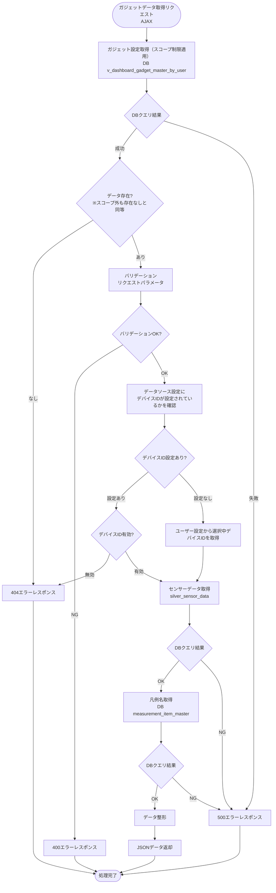
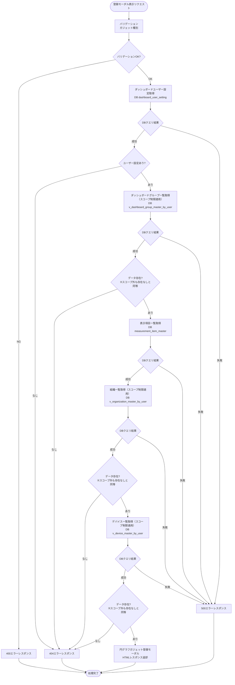
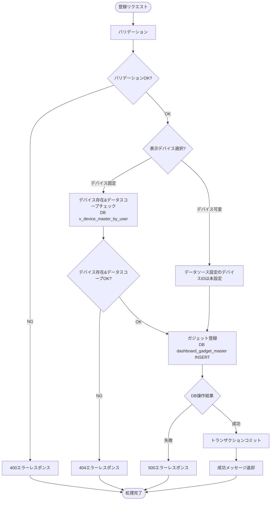

# 顧客作成ダッシュボード円グラフガジェット - ワークフロー仕様書

## 📑 目次

- [顧客作成ダッシュボード円グラフガジェット - ワークフロー仕様書](#顧客作成ダッシュボード円グラフガジェット---ワークフロー仕様書)
  - [📑 目次](#-目次)
  - [概要](#概要)
  - [使用するFlaskルート一覧](#使用するflaskルート一覧)
  - [ルート呼び出しマッピング](#ルート呼び出しマッピング)
    - [円グラフガジェット](#円グラフガジェット)
    - [円グラフガジェット登録モーダル](#円グラフガジェット登録モーダル)
  - [ワークフロー一覧](#ワークフロー一覧)
    - [ガジェット初期表示](#ガジェット初期表示)
      - [処理フロー](#処理フロー)
      - [Flaskルート](#flaskルート)
      - [バリデーション](#バリデーション)
      - [処理詳細（サーバーサイド）](#処理詳細サーバーサイド)
    - [ガジェットデータ取得](#ガジェットデータ取得)
      - [処理フロー](#処理フロー-1)
      - [Flaskルート](#flaskルート-1)
      - [バリデーション](#バリデーション-1)
      - [処理詳細（サーバーサイド）](#処理詳細サーバーサイド-1)
    - [ガジェット登録モーダル表示](#ガジェット登録モーダル表示)
      - [処理フロー](#処理フロー-2)
      - [Flaskルート](#flaskルート-2)
      - [バリデーション](#バリデーション-2)
      - [処理詳細（サーバーサイド）](#処理詳細サーバーサイド-2)
      - [エラーハンドリング](#エラーハンドリング)
    - [ガジェット登録](#ガジェット登録)
      - [処理フロー](#処理フロー-3)
      - [Flaskルート](#flaskルート-3)
      - [バリデーション](#バリデーション-3)
      - [処理詳細（サーバーサイド）](#処理詳細サーバーサイド-3)
      - [エラーハンドリング](#エラーハンドリング-1)
  - [セキュリティ実装](#セキュリティ実装)
    - [認証・認可実装](#認証認可実装)
    - [ログ出力ルール](#ログ出力ルール)
  - [関連ドキュメント](#関連ドキュメント)

**重要:** 顧客作成ダッシュボード画面の共通仕様は [共通ワークフロー仕様書](../common/workflow-specification.md) を参照してください。

---

## 概要

このドキュメントは、顧客作成ダッシュボード円グラフガジェット機能のユーザー操作に対する処理フロー、データベース処理、エラーハンドリングの詳細を記載します。

**このドキュメントの役割:**
- ✅ ユーザー操作のトリガー条件
- ✅ 処理フローの詳細（Flaskルート呼び出し、フォーム送信、AJAX通信）
- ✅ エラーハンドリングフロー
- ✅ サーバーサイド処理詳細（SQL、変数、条件分岐、コード例）
- ✅ データベース利用詳細（トランザクション管理、テーブル操作）
- ✅ セキュリティ実装詳細（認証、データスコープ制限、ログ出力）
- ✅ クライアントサイド処理詳細（AJAX、ドラッグ＆ドロップ、自動更新）

**UI仕様書との役割分担:**
- **UI仕様書**: 画面レイアウト、UI要素の詳細仕様
- **ワークフロー仕様書**: 処理フロー、データベース処理、エラーハンドリング、サーバーサイド実装詳細

**注:** UI要素の詳細は [UI仕様書](./ui-specification.md) を参照してください。

---

## 使用するFlaskルート一覧

この機能で使用するすべてのFlaskルート（エンドポイント）を記載します。

| No | ルート名 | エンドポイント | メソッド | 用途 | レスポンス形式 | 備考 |
|----|---------|---------------|---------|------|---------------|------|
| 1 | 顧客作成ダッシュボード表示 | `/analysis/customer-dashboard` | GET | 初期表示（顧客作成ダッシュボード画面に円グラフガジェットを埋め込み） | HTML | - |
| 2 | ガジェットデータ取得 | `/analysis/customer-dashboard/gadgets/<gadget_uuid>/data` | POST | ガジェットのグラフ表示用データ取得 | JSON (AJAX) | 非同期通信 |
| 3 | ガジェット登録画面 | `/analysis/customer-dashboard/gadgets/circle-chart/create` | GET | 円グラフガジェット登録モーダル表示 | HTML（モーダル） | - |
| 4 | ガジェット登録実行 | `/analysis/customer-dashboard/gadgets/circle-chart/register` | POST | 円グラフガジェット登録処理 | JSON (AJAX) | - |

**注:**
- **レスポンス形式**:
  - `HTML`: Jinja2テンプレートをレンダリングして返す（`render_template()`）
  - `HTML（モーダル）`: モーダルダイアログ用のHTMLフラグメントを返す
  - `リダイレクト (302)`: 処理成功後に `/analysis/customer-dashboard` へリダイレクト
  - `JSON (AJAX)`: JavaScriptからの非同期リクエストに対してJSONレスポンスを返す
- **Flask Blueprint構成**: `customer_dashboard_bp` として実装

---

## ルート呼び出しマッピング

### 円グラフガジェット

| ユーザー操作 | トリガー | 呼び出すルート | パラメータ | レスポンス | エラー時の挙動 |
|-------------|---------|-------------|-----------|-----------|---------------|
| 画面初期表示 | URL直接アクセス | `GET /analysis/customer-dashboard`, `POST /analysis/customer-dashboard/gadgets/<gadget_uuid>/data` | なし | HTML（顧客作成ダッシュボード画面に円グラフガジェットを埋め込み） | エラーページ表示 |

### 円グラフガジェット登録モーダル

| ユーザー操作 | トリガー | 呼び出すルート | パラメータ | レスポンス | エラー時の挙動 |
|-------------|---------|-------------|-----------|-----------|---------------|
| 画面初期表示 | URL直接アクセス | `GET /analysis/customer-dashboard/gadgets/circle-chart/create` | なし | HTML（モーダル） | エラーページ表示 |
| 登録ボタン押下 | ボタンクリック | `POST /analysis/customer-dashboard/gadgets/circle-chart/register` | `title, device_mode, device_id, group_id, items` | JSON (AJAX) | エラートースト表示 |

---

## ワークフロー一覧

### ガジェット初期表示

**トリガー:** 顧客作成ダッシュボード画面アクセス時

**前提条件:**
- ユーザーがログイン済み（Databricks認証完了）
- 適切な権限を持っている（システム保守者、管理者、販社ユーザ、サービス利用者）

#### 処理フロー

[共通ワークフロー仕様書](../common/workflow-specification.md) のダッシュボード初期表示と同様の処理フローに従います。

#### Flaskルート

| ルート | エンドポイント | 詳細 |
|-------|---------------|------|
| 顧客作成ダッシュボード表示 | `GET /analysis/customer-dashboard` | クエリパラメータ: なし |

#### バリデーション

**実行タイミング:** なし

**データスコープ制限:**
- ダッシュボードスコープ制限（全ユーザー共通）:
  - ユーザーの所属組織に属するダッシュボードのみアクセス可能（v_dashboard_master_by_user による制御）
  - 下位組織のダッシュボードはアクセス不可
- 組織選択肢スコープ制限:
  - v_organization_master_by_user による制御

#### 処理詳細（サーバーサイド）

[共通ワークフロー仕様書](../common/workflow-specification.md) のダッシュボード初期表示の処理詳細（①〜⑨）と同様の処理を実行します。

円グラフガジェット固有の追加処理はありません。

---

### ガジェットデータ取得

**トリガー:** 画面初期表示時

**前提条件:**
- ガジェットが表示されている
- データソース設定が存在する

#### 処理フロー



#### Flaskルート

| ルート | エンドポイント | 詳細 |
|-------|---------------|------|
| ガジェットデータ取得 | `POST /analysis/customer-dashboard/gadgets/<gadget_uuid>/data` | パスパラメータ: `gadget_uuid` クエリパラメータ: なし |

#### バリデーション

**実行タイミング:** なし

#### 処理詳細（サーバーサイド）

**① ガジェット設定取得**

**使用テーブル:** v_dashboard_gadget_master_by_user

**SQL詳細:**
```sql
SELECT
  gadget_id,
  gadget_uuid,
  gadget_type_id,
  chart_config,
  data_source_config
FROM
  v_dashboard_gadget_master_by_user
WHERE
  user_id = :current_user_id
  AND gadget_uuid = :gadget_uuid
  AND delete_flag = FALSE
```

**chart_config JSON スキーマ:**
```json
{
  "measurement_item_ids": [1, 2, 3]
}
```

**data_source_config JSON スキーマ:**
```json
{
  "device_id": 12345
}
```
※ `device_id` が `null` の場合はデバイス可変モード

---

**② デバイスID決定**

`data_source_config.device_id` を参照し、デバイスIDを決定します。

- **デバイス固定モード** (`device_id` が設定されている場合): `data_source_config.device_id` を使用
  - デバイスIDの削除フラグチェックを実施する → デバイスIDが論理削除済みなら404エラーレスポンスを返却
- **デバイス可変モード** (`device_id` が `null` の場合): ユーザー設定 (`dashboard_user_setting.device_id`) を使用

**SQL詳細（デバイス固定モード: デバイスID有効性チェック）:**
```sql
SELECT
  device_id
FROM
  v_device_master_by_user
WHERE
  user_id = :current_user_id
  AND device_id = :device_id
  AND delete_flag = FALSE
```

**SQL詳細（デバイス可変モード: ユーザー設定取得）:**
```sql
SELECT
  device_id
FROM
  dashboard_user_setting
WHERE
  user_id = :current_user_id
  AND delete_flag = FALSE
```

---

**③ センサーデータ取得**

**使用テーブル:** silver_sensor_data, user_master, organization_closure

**SQL詳細:** 
```sql
SELECT
  event_timestamp, 
  external_temp,
  set_temp_freezer_1,
  internal_sensor_temp_freezer_1,
  internal_temp_freezer_1,
  df_temp_freezer_1,
  condensing_temp_freezer_1,
  adjusted_internal_temp_freezer_1,
  set_temp_freezer_2,
  internal_sensor_temp_freezer_2,
  internal_temp_freezer_2,
  df_temp_freezer_2,
  condensing_temp_freezer_2,
  adjusted_internal_temp_freezer_2,
  compressor_freezer_1,
  compressor_freezer_2,
  fan_motor_1,
  fan_motor_2,
  fan_motor_3,
  fan_motor_4,
  fan_motor_5,
  defrost_heater_output_1,
  defrost_heater_output_2
FROM
  user_master u
INNER JOIN
  organization_closure oc
  ON u.organization_id = oc.parent_organization_id
INNER JOIN
  silver_sensor_data s
  ON oc.subsidiary_organization_id = s.organization_id
WHERE
  u.user_id = :current_user_id
  AND u.delete_flag = FALSE
  AND device_id = :device_id
ORDER BY
  event_timestamp DESC
LIMIT 1
```

---

**④ 凡例名取得**

**使用テーブル:** measurement_item_master

**SQL詳細:** 
```sql
SELECT
  measurement_item_id,
  silver_data_column_name,
  display_name
FROM
  measurement_item_master
WHERE
  delete_flag = FALSE
ORDER BY
  measurement_item_id
```

---

**⑤ データ整形**

取得データを ECharts 円グラフ用の `labels` / `values` 配列に変換します。

```python
# services/customer_dashboard/circle_chart.py
def format_circle_chart_data(rows, columns):
    if not rows:
        return {"labels": [], "values": []}

    row = rows[0]

    labels = []
    values = []

    for item in columns:
        column_name = item["silver_data_column_name"]
        value = row.get(column_name)
        labels.append(item["display_name"])
        values.append(value)

    return {"labels": labels, "values": values}
```

---

**⑥ レスポンス形式**

```json
{
  "gadget_uuid": "xxxxxxxx-xxxx-xxxx-xxxx-xxxxxxxxxxxx",
  "device_name": "Device-001",
  "chart_data": {
    "labels": ["外気温度", "第1冷凍 設定温度", "第1冷凍 庫内センサー温度"],
    "values": [10.5, 12.3, 9.8]
  },
  "updated_at": "2026/03/05 12:00:00"
}
```

データなしの場合:
```json
{
  "gadget_uuid": "xxxxxxxx-xxxx-xxxx-xxxx-xxxxxxxxxxxx",
  "device_name": "Device-001",
  "chart_data": {"labels": [], "values": []},
  "updated_at": "2026/03/05 12:00:00"
}
```

---

**⑦ 実装例**

```python
# views/analysis/customer_dashboard/circle_chart.py
def handle_gadget_data(gadget_uuid):
    """円グラフガジェットデータ取得（AJAX）"""

    gadget = get_gadget_by_uuid(gadget_uuid)
    if not gadget:
        return jsonify({'error': err_not_found('ガジェット')}), 404

    try:
        data_source_config = json.loads(gadget.data_source_config or '{}')
        device_id = data_source_config.get('device_id')

        if device_id is not None:
            if check_device_access(device_id, g.current_user.user_id) is None:
                return jsonify({'error': err_not_found('デバイス')}), 404
        else:
            setting = get_dashboard_user_setting(g.current_user.user_id)
            device_id = setting.device_id if setting else None

        device_name = get_device_name(device_id) if device_id is not None else None

        rows = fetch_circle_chart_data(device_id) if device_id is not None else []

        all_columns = get_column_definition()
        chart_config = json.loads(gadget.chart_config or '{}')
        measurement_item_ids = chart_config.get('measurement_item_ids', [])
        item_map = {col.measurement_item_id: col for col in all_columns}
        columns = [
            {'silver_data_column_name': item_map[mid].silver_data_column_name,
             'display_name': item_map[mid].display_name}
            for mid in measurement_item_ids
            if mid in item_map
        ]

        rows_as_dicts = [row if isinstance(row, dict) else dict(row._mapping) for row in rows] if rows else []
        chart_data = format_circle_chart_data(rows_as_dicts, columns)

        return jsonify({
            'gadget_uuid': gadget_uuid,
            'device_name': device_name,
            'chart_data': chart_data,
            'updated_at': datetime.now().strftime('%Y/%m/%d %H:%M:%S'),
        })

    except Exception as e:
        g.last_exception_type = type(e).__name__
        logger.error(f'円グラフデータ取得エラー: gadget_uuid={gadget_uuid}, error={str(e)}')
        return jsonify({'error': err_fetch_failed('データ')}), 500
```

---

### ガジェット登録モーダル表示

**トリガー:** ガジェット追加モーダルの登録画面ボタンクリック

**前提条件:**
- ガジェット追加モーダルが表示されている
- ガジェット種別が選択されている

**注:** ガジェット追加モーダルのUI仕様は [共通UI仕様書](../common/ui-specification.md) を参照してください。

#### 処理フロー



#### Flaskルート

| ルート | エンドポイント | 詳細 |
|-------|---------------|------|
| 円グラフガジェット登録画面 | `GET /analysis/customer-dashboard/gadgets/circle-chart/create` | パラメータ: なし |

#### バリデーション

**実行タイミング:** 登録画面ボタン押下時

**バリデーションルール:**

| 項目 | ルール | エラーメッセージ |
|------|--------|-----------------|
| ガジェット種別 | 必須 | ガジェットを選択してください |

#### 処理詳細（サーバーサイド）

**① ダッシュボードユーザー設定取得**

**使用テーブル:** dashboard_user_setting

```sql
SELECT
  dashboard_id,
  organization_id,
  device_id
FROM
  dashboard_user_setting
WHERE
  user_id = :current_user_id
  AND delete_flag = FALSE
```

---

**② ダッシュボードグループ一覧取得**

**使用テーブル:** v_dashboard_group_master_by_user

```sql
SELECT
  dashboard_group_id,
  dashboard_group_uuid,
  dashboard_group_name
FROM
  v_dashboard_group_master_by_user
WHERE
  user_id = :current_user_id
  AND dashboard_id = :dashboard_id
  AND delete_flag = FALSE
ORDER BY
  display_order ASC
```

---

**③ 表示項目一覧取得**

**使用テーブル:** measurement_item_master

```sql
SELECT
  measurement_item_id,
  display_name,
  unit_name
FROM
  measurement_item_master
WHERE
  delete_flag = FALSE
ORDER BY
  measurement_item_id ASC
```

---

**④ 組織一覧取得**

**使用テーブル:** v_organization_master_by_user

```sql
SELECT
  organization_id,
  organization_name
FROM
  v_organization_master_by_user
WHERE
  user_id = :current_user_id
  AND delete_flag = FALSE
ORDER BY
  organization_id ASC
```

---

**⑤ デバイス一覧取得（デバイス固定モード用）**

**使用テーブル:** v_device_master_by_user

```sql
SELECT
  device_id,
  device_name,
  organization_id
FROM
  v_device_master_by_user
WHERE
  user_id = :current_user_id
  AND delete_flag = FALSE
ORDER BY
  device_id ASC
```

---

**⑥ 実装例**

```python
# views/analysis/customer_dashboard/circle_chart.py
def handle_gadget_create(gadget_type):
    """円グラフガジェット登録モーダル表示"""

    setting = get_dashboard_user_setting(g.current_user.user_id)
    if setting is None:
        abort(404)

    groups = get_dashboard_groups(setting.dashboard_id)
    if not groups:
        abort(404)

    try:
        measurement_items = get_measurement_items()
        organizations = get_organizations(g.current_user.user_id)
        devices = get_all_devices_in_scope(g.current_user.user_id)
    except Exception as e:
        logger.error(f'円グラフ登録モーダル表示エラー: {str(e)}')
        abort(500)

    form = CircleChartGadgetForm()
    form.measurement_item_ids.choices = [
        (item.measurement_item_id, item.display_name) for item in measurement_items
    ]
    form.gadget_name.data = '円グラフ'
    if groups:
        form.group_id.data = groups[0].dashboard_group_id

    return render_template(
        'analysis/customer_dashboard/gadgets/modals/circle_chart.html',
        form=form,
        gadget_type=gadget_type,
        groups=groups,
        measurement_items=measurement_items,
        organizations=organizations,
        devices=devices,
    )
```

#### エラーハンドリング

| HTTPステータス | エラー種別 | 処理内容 | 表示内容 |
|--------------|-----------|---------|---------|
| 400 | バリデーションエラー | フォーム再表示 | バリデーションエラーメッセージ |
| 404 | リソース不存在 | 404エラートースト表示 | ダッシュボードが見つかりません |
| 500 | データベースエラー | 500エラーページ表示 | データの取得に失敗しました |

---

### ガジェット登録

**トリガー:** ガジェット登録モーダルの登録ボタンクリック

**前提条件:** ガジェット登録モーダルが表示されている

#### 処理フロー



#### Flaskルート

| ルート | エンドポイント | 詳細 |
|-------|---------------|------|
| 円グラフガジェット登録実行 | `POST /analysis/customer-dashboard/gadgets/circle-chart/register` | フォームデータ: `title, device_mode, device_id, group_id, items` |

#### バリデーション

**実行タイミング:** フォーム送信時（サーバーサイド）

| 項目 | ルール | エラーメッセージ |
|------|--------|-----------------|
| タイトル | 必須 | タイトルを入力してください |
| タイトル | 最大20文字 | タイトルは20文字以内で入力してください |
| 表示デバイス | 必須 | 表示デバイスを選択してください |
| デバイス（デバイス固定時のみ） | 必須 | デバイスを選択してください |
| グループ | 必須 | グループを選択してください |
| 表示項目 | 必須 | 表示項目を1つ以上5つ以下で選択してください |

#### 処理詳細（サーバーサイド）

**① デバイス存在&データスコープチェック（デバイス固定モード時のみ）**

**使用テーブル:** v_device_master_by_user

```sql
SELECT
  device_id,
  device_name,
  organization_id
FROM
  v_device_master_by_user
WHERE
  user_id = :current_user_id
  AND device_id = :device_id
  AND delete_flag = FALSE
```

---

**② chart_config / data_source_config JSONスキーマ**

```json
// chart_config
{
  "measurement_item_ids": [1, 2, 3]
}

// data_source_config（デバイス固定モード）
{"device_id": 12345}

// data_source_config（デバイス可変モード）
{"device_id": null}
```

---

**③ ガジェット登録**

**使用テーブル:** dashboard_gadget_master

```sql
INSERT INTO dashboard_gadget_master (
  gadget_uuid,
  gadget_name,
  dashboard_group_id,
  gadget_type_id,
  chart_config,
  data_source_config,
  position_x,
  position_y,
  gadget_size,
  display_order,
  create_date,
  creator,
  update_date,
  modifier,
  delete_flag
) VALUES (
  :gadget_uuid,
  :gadget_name,
  :dashboard_group_id,
  :gadget_type_id,
  :chart_config,
  :data_source_config,
  0,
  (
    SELECT COALESCE(MAX(position_y), 0) + 1
    FROM dashboard_gadget_master
    WHERE dashboard_group_id = :dashboard_group_id
    AND delete_flag = FALSE
  ),
  0,
  (
    SELECT COALESCE(MAX(display_order), 0) + 1
    FROM dashboard_gadget_master
    WHERE dashboard_group_id = :dashboard_group_id
    AND delete_flag = FALSE
  ),
  NOW(),
  :current_user_id,
  NOW(),
  :current_user_id,
  FALSE
)
```

---

**④ 実装例**

```python
# views/analysis/customer_dashboard/circle_chart.py
def handle_gadget_register(gadget_type):
    """円グラフガジェット登録実行"""

    form = CircleChartGadgetForm()
    # measurement_item_ids はJS動的ロードのため送信値をchoicesに設定
    # 未選択時も sentinel [(-1, '')] を設定してバリデーターを必ず実行させる
    submitted_item_ids = [int(v) for v in (form.measurement_item_ids.raw_data or []) if v.isdigit()]
    form.measurement_item_ids.choices = [(mid, '') for mid in submitted_item_ids] if submitted_item_ids else [(-1, '')]

    if not form.validate_on_submit():
        measurement_items = get_measurement_items()
        setting = get_dashboard_user_setting(g.current_user.user_id)
        groups = get_dashboard_groups(setting.dashboard_id) if setting else []
        organizations = get_organizations(g.current_user.user_id)
        devices = get_all_devices_in_scope(g.current_user.user_id)
        return render_template(
            'analysis/customer_dashboard/gadgets/modals/circle_chart.html',
            form=form,
            gadget_type=gadget_type,
            groups=groups,
            measurement_items=measurement_items,
            organizations=organizations,
            devices=devices,
        ), 400

    device_id = None
    if form.device_mode.data == 'fixed':
        if check_device_access(form.device_id.data, g.current_user.user_id) is None:
            abort(404)
        device_id = form.device_id.data

    item_ids = form.measurement_item_ids.data or []
    chart_config = {'measurement_item_ids': item_ids[:5]}

    data_source_config = {'device_id': device_id}

    try:
        create_circle_chart_gadget(
            gadget_name=form.gadget_name.data,
            dashboard_group_id=form.group_id.data,
            chart_config=chart_config,
            data_source_config=data_source_config,
            user_id=g.current_user.user_id,
        )
        return jsonify({'message': msg_created('ガジェット')})

    except Exception as e:
        logger.error(f'円グラフガジェット登録エラー: {str(e)}')
        abort(500)
```

#### エラーハンドリング

| HTTPステータス | エラー種別 | 処理内容 | 表示内容 |
|--------------|-----------|---------|---------|
| 400 | バリデーションエラー | フォーム再表示| バリデーションエラーメッセージ |
| 404 | リソース不存在 | 404エラートースト表示 | 指定されたデバイスが見つかりません |
| 500 | データベースエラー | 500エラーページ表示 | データの取得に失敗しました |

---

## セキュリティ実装

### 認証・認可実装

**認証方式:**
- Azure環境: Easy Auth認証（Entra ID統合）（`X-MS-*` ヘッダーからユーザー情報・JWT取得）
- AWS環境: ALB + Cognito認証（`X-Amzn-Oidc-*` ヘッダーからユーザー情報・JWT取得）
- オンプレミス環境: 自前認証（Flask IdP）（Flaskセッションからユーザー情報取得、JWT再発行）

**認可ロジック:**

組織階層に基づいて、ユーザーがアクセスできるデータを制限します。

**処理内容:**
- 組織・デバイス等の一覧取得VIEW（v_organization_master_by_user 等）:
  - VIEWが内部で organization_closure を参照し、アクセス可能な組織配下のデータのみ返す
- ダッシュボード用VIEW（v_dashboard_master_by_user 等）:
  - user_master.organization_id = dashboard_master.organization_id の直接JOINでスコープ制限を適用
  - ユーザーの所属組織のダッシュボードのみアクセス可能（下位組織のダッシュボードは対象外）
- センサーデータ（silver_sensor_data 等）:
  - VIEWを使用せず、データ取得処理の度に organization_closure を参照し、アクセス可能な組織配下のデータのみ返す（組織・デバイス等の一覧取得VIEWと内部処理は同じ）

**実装例:**
```python
# 組織一覧取得
def get_organizations():
    # v_organization_master_by_user に user_id を渡すだけでスコープ制限が自動適用される
    return (
        db.session.query(VOrganizationMasterByUser)
        .filter(
            VOrganizationMasterByUser.user_id == g.current_user.user_id,
            VOrganizationMasterByUser.delete_flag == False,
        )
        .order_by(VOrganizationMasterByUser.organization_id)
        .all()
    )
```

### ログ出力ルール

**出力する情報:**
- リクエストID
- ユーザーID（操作者）
- 操作種別（ダッシュボード登録、更新、削除、ガジェット登録、レイアウト保存等）
- 対象リソースID（dashboard_id、group_id、gadget_id）
- 処理結果（成功/失敗）
- エラー種別（バリデーションエラー、DBエラー等）
- タイムスタンプ（UTC）

**出力しない情報（機密情報）:**
- 認証トークン
- センサーデータの具体値

**実装例:**
```python
import logging

logger = logging.getLogger(__name__)

@customer_dashboard_bp.route('/dashboards/register', methods=['POST'])
@require_auth
def dashboard_register():
    logger.info(f'ダッシュボード登録開始: user_id={g.current_user.user_id}')

    try:
        # ... 処理 ...
        logger.info(f'ダッシュボード登録成功: dashboard_id={dashboard.dashboard_id}')
        return response
    except Exception as e:
        logger.error(f'ダッシュボード登録エラー: error={str(e)}')
        abort(500)
```

---

## 関連ドキュメント

- [UI仕様書](./ui-specification.md) - 画面要素・レイアウト仕様
- [README.md](./README.md) - 機能概要
- [シルバー層仕様](../../ldp-pipeline/silver-layer/README.md) - センサーデータスキーマ
- [ゴールド層仕様](../../ldp-pipeline/gold_layer/README.md) - 集計データスキーマ
- [共通仕様](../../common/common-specification.md) - 認証・セキュリティ共通仕様