# 顧客作成ダッシュボード画面 - ワークフロー仕様書

## 📑 目次

- [顧客作成ダッシュボード画面 - ワークフロー仕様書](#顧客作成ダッシュボード画面---ワークフロー仕様書)
  - [📑 目次](#-目次)
  - [概要](#概要)
  - [使用するFlaskルート一覧](#使用するflaskルート一覧)
  - [ルート呼び出しマッピング](#ルート呼び出しマッピング)
    - [顧客作成ダッシュボード表示画面](#顧客作成ダッシュボード表示画面)
    - [ダッシュボード管理モーダル](#ダッシュボード管理モーダル)
    - [ガジェット追加モーダル](#ガジェット追加モーダル)
    - [登録・更新モーダル](#登録更新モーダル)
    - [削除確認モーダル](#削除確認モーダル)
  - [ワークフロー一覧](#ワークフロー一覧)
    - [ダッシュボード初期表示](#ダッシュボード初期表示)
      - [処理フロー](#処理フロー)
      - [Flaskルート](#flaskルート)
      - [バリデーション](#バリデーション)
      - [処理詳細（サーバーサイド）](#処理詳細サーバーサイド)
      - [表示メッセージ](#表示メッセージ)
      - [エラーハンドリング](#エラーハンドリング)
      - [ログ出力タイミング](#ログ出力タイミング)
      - [UI状態](#ui状態)
    - [ダッシュボード管理モーダル表示](#ダッシュボード管理モーダル表示)
      - [処理フロー](#処理フロー-1)
      - [Flaskルート](#flaskルート-1)
      - [処理詳細（サーバーサイド）](#処理詳細サーバーサイド-1)
      - [表示メッセージ](#表示メッセージ-1)
      - [エラーハンドリング](#エラーハンドリング-1)
      - [ログ出力タイミング](#ログ出力タイミング-1)
      - [UI状態](#ui状態-1)
    - [ダッシュボード登録](#ダッシュボード登録)
      - [処理フロー](#処理フロー-2)
      - [Flaskルート](#flaskルート-2)
      - [バリデーション](#バリデーション-1)
      - [処理詳細（サーバーサイド）](#処理詳細サーバーサイド-2)
      - [表示メッセージ](#表示メッセージ-2)
      - [エラーハンドリング](#エラーハンドリング-2)
      - [ログ出力タイミング](#ログ出力タイミング-2)
    - [ダッシュボード表示切替](#ダッシュボード表示切替)
      - [処理フロー](#処理フロー-3)
      - [処理詳細（サーバーサイド）](#処理詳細サーバーサイド-3)
      - [エラーハンドリング](#エラーハンドリング-3)
      - [ログ出力タイミング](#ログ出力タイミング-3)
    - [ダッシュボードタイトル更新](#ダッシュボードタイトル更新)
      - [処理フロー](#処理フロー-4)
      - [バリデーション](#バリデーション-2)
      - [処理詳細（サーバーサイド）](#処理詳細サーバーサイド-4)
      - [表示メッセージ](#表示メッセージ-3)
      - [エラーハンドリング](#エラーハンドリング-4)
      - [ログ出力タイミング](#ログ出力タイミング-4)
    - [ダッシュボード削除](#ダッシュボード削除)
      - [処理フロー](#処理フロー-5)
      - [処理詳細（サーバーサイド）](#処理詳細サーバーサイド-5)
      - [表示メッセージ](#表示メッセージ-4)
      - [エラーハンドリング](#エラーハンドリング-5)
      - [ログ出力タイミング](#ログ出力タイミング-5)
    - [ダッシュボードグループ登録](#ダッシュボードグループ登録)
      - [処理フロー](#処理フロー-6)
      - [バリデーション](#バリデーション-3)
      - [処理詳細（サーバーサイド）](#処理詳細サーバーサイド-6)
      - [表示メッセージ](#表示メッセージ-5)
      - [エラーハンドリング](#エラーハンドリング-6)
      - [ログ出力タイミング](#ログ出力タイミング-6)
    - [ダッシュボードグループタイトル更新](#ダッシュボードグループタイトル更新)
      - [処理フロー](#処理フロー-7)
      - [バリデーション](#バリデーション-4)
      - [処理詳細（サーバーサイド）](#処理詳細サーバーサイド-7)
      - [表示メッセージ](#表示メッセージ-6)
      - [エラーハンドリング](#エラーハンドリング-7)
      - [ログ出力タイミング](#ログ出力タイミング-7)
    - [ダッシュボードグループ削除](#ダッシュボードグループ削除)
      - [処理フロー](#処理フロー-8)
      - [処理詳細（サーバーサイド）](#処理詳細サーバーサイド-8)
      - [表示メッセージ](#表示メッセージ-7)
      - [エラーハンドリング](#エラーハンドリング-8)
      - [ログ出力タイミング](#ログ出力タイミング-8)
    - [ガジェット追加モーダル表示](#ガジェット追加モーダル表示)
      - [処理フロー](#処理フロー-9)
      - [処理詳細（サーバーサイド）](#処理詳細サーバーサイド-9)
      - [表示メッセージ](#表示メッセージ-8)
      - [エラーハンドリング](#エラーハンドリング-9)
      - [ログ出力タイミング](#ログ出力タイミング-9)
    - [ガジェット登録モーダル表示](#ガジェット登録モーダル表示)
    - [ガジェット登録](#ガジェット登録)
    - [ガジェットタイトル更新](#ガジェットタイトル更新)
      - [処理フロー](#処理フロー-10)
      - [バリデーション](#バリデーション-5)
      - [処理詳細（サーバーサイド）](#処理詳細サーバーサイド-10)
      - [表示メッセージ](#表示メッセージ-9)
      - [エラーハンドリング](#エラーハンドリング-10)
      - [ログ出力タイミング](#ログ出力タイミング-10)
    - [ガジェット削除](#ガジェット削除)
      - [処理フロー](#処理フロー-11)
      - [処理詳細（サーバーサイド）](#処理詳細サーバーサイド-11)
      - [表示メッセージ](#表示メッセージ-10)
      - [エラーハンドリング](#エラーハンドリング-11)
      - [ログ出力タイミング](#ログ出力タイミング-11)
    - [ガジェットデータ取得](#ガジェットデータ取得)
    - [レイアウト保存](#レイアウト保存)
      - [処理フロー](#処理フロー-12)
      - [処理詳細（サーバーサイド）](#処理詳細サーバーサイド-12)
      - [表示メッセージ](#表示メッセージ-11)
      - [エラーハンドリング](#エラーハンドリング-12)
      - [ログ出力タイミング](#ログ出力タイミング-12)
    - [日時設定ボタン](#日時設定ボタン)
      - [処理フロー](#処理フロー-13)
      - [処理詳細](#処理詳細)
      - [エラーハンドリング](#エラーハンドリング-13)
    - [日時初期化](#日時初期化)
      - [処理フロー](#処理フロー-14)
      - [処理詳細](#処理詳細-1)
    - [自動更新](#自動更新)
      - [処理フロー](#処理フロー-15)
      - [処理詳細](#処理詳細-2)
    - [データソース選択](#データソース選択)
      - [処理フロー](#処理フロー-16)
      - [処理詳細](#処理詳細-3)
    - [CSVエクスポート](#csvエクスポート)
    - [展開・縮小操作](#展開縮小操作)
      - [処理詳細](#処理詳細-4)
  - [使用データベース詳細](#使用データベース詳細)
    - [使用テーブル一覧](#使用テーブル一覧)
  - [トランザクション管理](#トランザクション管理)
  - [セキュリティ実装](#セキュリティ実装)
    - [認証・認可実装](#認証認可実装)
    - [ログ出力ルール](#ログ出力ルール)
  - [関連ドキュメント](#関連ドキュメント)
    - [画面仕様](#画面仕様)
    - [アーキテクチャ設計](#アーキテクチャ設計)
    - [共通仕様](#共通仕様)
    - [要件定義](#要件定義)

---

## 概要

このドキュメントは、顧客作成ダッシュボード画面のユーザー操作に対する処理フロー、データベース処理、エラーハンドリングの詳細を記載します。

**このドキュメントの役割:**
- ✅ ユーザー操作のトリガー条件
- ✅ 処理フローの詳細（Flaskルート呼び出し、フォーム送信、AJAX通信）
- ✅ エラーハンドリングフロー
- ✅ サーバーサイド処理詳細（SQL、変数、条件分岐、コード例）
- ✅ データベース利用詳細（トランザクション管理、テーブル操作）
- ✅ セキュリティ実装詳細（認証、データスコープ制限、ログ出力）
- ✅ クライアントサイド処理詳細（AJAX、ドラッグ＆ドロップ、自動更新）

**UI仕様書との役割分担:**
- **UI仕様書**: 画面レイアウト、UI要素の詳細仕様
- **ワークフロー仕様書**: 処理フロー、データベース処理、エラーハンドリング、サーバーサイド実装詳細

**注:** UI要素の詳細は [UI仕様書](./ui-specification.md) を参照してください。

---

## 使用するFlaskルート一覧

この画面で使用するすべてのFlaskルート（エンドポイント）を記載します。

| No | ルート名 | エンドポイント | メソッド | 用途 | レスポンス形式 | 備考 |
|----|---------|---------------|---------|------|---------------|------|
| 1 | 顧客作成ダッシュボード表示 | `/analysis/customer-dashboard` | GET | 顧客作成ダッシュボード画面の初期表示 | HTML | - |
| 2 | ダッシュボード管理画面 | `/analysis/customer-dashboard/dashboards` | GET | ダッシュボード管理モーダル表示 | HTML（モーダル） | - |
| 3 | ダッシュボード登録画面 | `/analysis/customer-dashboard/dashboards/create` | GET | ダッシュボード登録モーダル表示 | HTML（モーダル） | - |
| 4 | ダッシュボード登録実行 | `/analysis/customer-dashboard/dashboards/register` | POST | ダッシュボード登録処理 | リダイレクト (302) | 成功時: `/analysis/customer-dashboard` |
| 5 | ダッシュボードタイトル更新画面 | `/analysis/customer-dashboard/dashboards/<dashboard_uuid>/edit` | GET | ダッシュボードタイトル更新モーダル表示 | HTML（モーダル） | - |
| 6 | ダッシュボードタイトル更新実行 | `/analysis/customer-dashboard/dashboards/<dashboard_uuid>/update` | POST | ダッシュボードタイトル更新処理 | リダイレクト (302) | 成功時: `/analysis/customer-dashboard` |
| 7 | ダッシュボード削除確認画面 | `/analysis/customer-dashboard/dashboards/<dashboard_uuid>/delete` | GET | ダッシュボード削除確認モーダル表示 | HTML（モーダル） | - |
| 8 | ダッシュボード削除実行 | `/analysis/customer-dashboard/dashboards/<dashboard_uuid>/delete` | POST | ダッシュボード削除処理 | リダイレクト (302) | 成功時: `/analysis/customer-dashboard` |
| 9 | ダッシュボード表示切替 | `/analysis/customer-dashboard/dashboards/<dashboard_uuid>/switch` | POST | 表示するダッシュボードの切替 | リダイレクト (302) | 成功時: `/analysis/customer-dashboard` |
| 10 | ダッシュボードグループ登録画面 | `/analysis/customer-dashboard/groups/create` | GET | ダッシュボードグループ登録モーダル表示 | HTML（モーダル） | - |
| 11 | ダッシュボードグループ登録実行 | `/analysis/customer-dashboard/groups/register` | POST | ダッシュボードグループ登録処理 | リダイレクト (302) | 成功時: `/analysis/customer-dashboard` |
| 12 | ダッシュボードグループタイトル更新画面 | `/analysis/customer-dashboard/groups/<dashboard_group_uuid>/edit` | GET | ダッシュボードグループタイトル更新モーダル表示 | HTML（モーダル） | - |
| 13 | ダッシュボードグループタイトル更新実行 | `/analysis/customer-dashboard/groups/<dashboard_group_uuid>/update` | POST | ダッシュボードグループタイトル更新処理 | リダイレクト (302) | 成功時: `/analysis/customer-dashboard` |
| 14 | ダッシュボードグループ削除確認画面 | `/analysis/customer-dashboard/groups/<dashboard_group_uuid>/delete` | GET | ダッシュボードグループ削除確認モーダル表示 | HTML（モーダル） | - |
| 15 | ダッシュボードグループ削除実行 | `/analysis/customer-dashboard/groups/<dashboard_group_uuid>/delete` | POST | ダッシュボードグループ削除処理 | リダイレクト (302) | 成功時: `/analysis/customer-dashboard` |
| 16 | ガジェット追加画面 | `/analysis/customer-dashboard/gadgets/add` | GET | ガジェット追加モーダル表示 | HTML（モーダル） | - |
| 17 | ガジェット登録画面 | `/analysis/customer-dashboard/gadgets/{gadget_type}/create` | GET | ガジェット登録モーダル表示 | HTML（モーダル） | ガジェット毎にFlaskルートが異なる（棒グラフの場合: `/analysis/customer-dashboard/gadgets/bar-chart/create`） |
| 18 | ガジェット登録実行 | `/analysis/customer-dashboard/gadgets/{gadget_type}/register` | POST | ガジェット登録処理 | リダイレクト (302) | 成功時: `/analysis/customer-dashboard`、ガジェット毎にFlaskルートが異なる（棒グラフの場合: `/analysis/customer-dashboard/gadgets/bar-chart/register`） |
| 19 | ガジェットタイトル更新画面 | `/analysis/customer-dashboard/gadgets/<gadget_uuid>/edit` | GET | ガジェットタイトル更新モーダル表示 | HTML（モーダル） | - |
| 20 | ガジェットタイトル更新実行 | `/analysis/customer-dashboard/gadgets/<gadget_uuid>/update` | POST | ガジェットタイトル更新処理 | リダイレクト (302) | 成功時: `/analysis/customer-dashboard` |
| 21 | ガジェット削除確認画面 | `/analysis/customer-dashboard/gadgets/<gadget_uuid>/delete` | GET | ガジェット削除確認モーダル表示 | HTML（モーダル） | - |
| 22 | ガジェット削除実行 | `/analysis/customer-dashboard/gadgets/<gadget_uuid>/delete` | POST | ガジェット削除処理 | リダイレクト (302) | 成功時: `/analysis/customer-dashboard` |
| 23 | ガジェットデータ取得 | `/analysis/customer-dashboard/gadgets/<gadget_uuid>/data` | POST | ガジェットのグラフ表示用データ取得 | JSON (AJAX) | 非同期通信 |
| 24 | レイアウト保存 | `/analysis/customer-dashboard/layout/save` | POST | ガジェットのレイアウト設定保存 | JSON (AJAX) | 非同期通信 |
| 25 | CSVエクスポート | `/analysis/customer-dashboard/gadgets/<gadget_uuid>?export=csv` | GET | ガジェットのグラフデータをCSVファイルとしてダウンロード | CSV | - |
| 26 | デバイス一覧取得 | `/analysis/customer-dashboard/organizations/<org_id>/devices` | GET | 組織選択変更時のデバイス選択肢取得 | JSON (AJAX) | 非同期通信 |
| 27 | データソース設定保存 | `/analysis/customer-dashboard/datasource/save` | POST | データソース選択状態を `dashboard_user_setting` に永続化 | JSON (AJAX) | 非同期通信 |

**注:**
- **レスポンス形式**:
  - `HTML`: Jinja2テンプレートをレンダリングして返す（`render_template()`）
  - `HTML（モーダル）`: モーダルダイアログ用のHTMLフラグメントを返す
  - `リダイレクト (302)`: 処理成功後に `/analysis/customer-dashboard` へリダイレクト
  - `JSON (AJAX)`: JavaScriptからの非同期リクエストに対してJSONレスポンスを返す
  - `CSV`: CSVファイルをダウンロードレスポンスとして返す
- **Flask Blueprint構成**: `customer_dashboard_bp` として実装

---

## ルート呼び出しマッピング

### 顧客作成ダッシュボード表示画面

| ユーザー操作 | トリガー | 呼び出すルート | パラメータ | レスポンス | エラー時の挙動 |
|-------------|---------|-------------|-----------|-----------|---------------|
| 画面初期表示 | URL直接アクセス | `GET /analysis/customer-dashboard` | なし | HTML（顧客作成ダッシュボード画面） | エラーページ表示 |
| ダッシュボード管理ボタン押下 | ボタンクリック | `GET /analysis/customer-dashboard/dashboards` | なし | HTML（モーダル） | エラーページ表示 |
| 日時設定ボタン押下（今日/昨日/今週/今月/今年） | ボタンクリック | `POST /analysis/customer-dashboard/gadgets/<gadget_uuid>/data` | `gadget_uuid`（各ガジェット） | JSON | エラーモーダル表示 |
| カスタムボタン押下（適用） | ボタンクリック | `POST /analysis/customer-dashboard/gadgets/<gadget_uuid>/data` | `gadget_uuid`（各ガジェット） | JSON | エラーモーダル表示 |
| 日時初期化ボタン押下 | ボタンクリック | `POST /analysis/customer-dashboard/gadgets/<gadget_uuid>/data` | `gadget_uuid`（各ガジェット） | JSON | エラーモーダル表示 |
| 自動更新ON | チェックボックス変更 | `POST /analysis/customer-dashboard/gadgets/<gadget_uuid>/data` | `gadget_uuid`（各ガジェット） | JSON | エラーモーダル表示 |
| 組織選択変更 | セレクト変更 | `GET /analysis/customer-dashboard/organizations/<org_id>/devices` | `org_id` | JSON（デバイス一覧） | エラーモーダル表示 |
| デバイス選択変更 | セレクト変更 | `POST /analysis/customer-dashboard/datasource/save` | `organization_id`, `device_id`（JSON） | JSON | エラーモーダル表示 |
| 編集モード切替 | トグル変更 | なし（クライアントサイド処理） | - | - | - |
| レイアウト保存ボタン押下 | ボタンクリック | `POST /analysis/customer-dashboard/layout/save` | レイアウト情報（JSON） | JSON | エラーモーダル表示 |
| CSVエクスポートボタン押下 | ボタンクリック | `GET /analysis/customer-dashboard/gadgets/<gadget_uuid>?export=csv` | `gadget_uuid` | CSVダウンロード | エラーモーダル表示 |

### ダッシュボード管理モーダル

| ユーザー操作 | トリガー | 呼び出すルート | パラメータ | レスポンス | エラー時の挙動 |
|-------------|---------|-------------|-----------|-----------|---------------|
| 登録ボタン押下 | ボタンクリック | `GET /analysis/customer-dashboard/dashboards/create` | なし | HTML（モーダル） | エラーモーダル表示 |
| 削除ボタン押下 | ボタンクリック | `GET /analysis/customer-dashboard/dashboards/<dashboard_uuid>/delete` | `dashboard_uuid` | HTML（モーダル） | エラーモーダル表示 |
| 変更ボタン押下 | ボタンクリック | `POST /analysis/customer-dashboard/dashboards/<dashboard_uuid>/switch` | `dashboard_uuid` | リダイレクト | エラーモーダル表示 |
| キャンセルボタン押下 | ボタンクリック | なし（モーダルを閉じる） | - | - | - |

### ガジェット追加モーダル

| ユーザー操作 | トリガー | 呼び出すルート | パラメータ | レスポンス | エラー時の挙動 |
|-------------|---------|-------------|-----------|-----------|---------------|
| 登録画面ボタン押下 | ボタンクリック | `GET /analysis/customer-dashboard/gadgets/{gadget_type}/create` | なし | HTML（モーダル） | エラーモーダル表示 |
| キャンセルボタン押下 | ボタンクリック | なし（モーダルを閉じる） | - | - | - |

### 登録・更新モーダル

| ユーザー操作 | トリガー | 呼び出すルート | パラメータ | レスポンス | エラー時の挙動 |
|-------------|---------|-------------|-----------|-----------|---------------|
| ダッシュボード登録実行 | フォーム送信 | `POST /analysis/customer-dashboard/dashboards/register` | `dashboard_name` | リダイレクト | フォーム再表示 |
| ダッシュボードタイトル更新実行 | フォーム送信 | `POST /analysis/customer-dashboard/dashboards/<dashboard_uuid>/update` | `dashboard_name` | リダイレクト | フォーム再表示 |
| ダッシュボードグループ登録実行 | フォーム送信 | `POST /analysis/customer-dashboard/groups/register` | `dashboard_group_name` | リダイレクト | フォーム再表示 |
| ダッシュボードグループタイトル更新実行 | フォーム送信 | `POST /analysis/customer-dashboard/groups/<dashboard_group_uuid>/update` | `dashboard_group_name` | リダイレクト | フォーム再表示 |
| ガジェットタイトル更新実行 | フォーム送信 | `POST /analysis/customer-dashboard/gadgets/<gadget_uuid>/update` | `gadget_name` | リダイレクト | フォーム再表示 |
| キャンセルボタン押下 | ボタンクリック | なし（モーダルを閉じる） | - | - | - |

### 削除確認モーダル

| ユーザー操作 | トリガー | 呼び出すルート | パラメータ | レスポンス | エラー時の挙動 |
|-------------|---------|-------------|-----------|-----------|---------------|
| ダッシュボード削除実行 | ボタンクリック | `POST /analysis/customer-dashboard/dashboards/<dashboard_uuid>/delete` | `dashboard_uuid` | リダイレクト | エラーモーダル表示 |
| ダッシュボードグループ削除実行 | ボタンクリック | `POST /analysis/customer-dashboard/groups/<dashboard_group_uuid>/delete` | `dashboard_group_uuid` | リダイレクト | エラーモーダル表示 |
| ガジェット削除実行 | ボタンクリック | `POST /analysis/customer-dashboard/gadgets/<gadget_uuid>/delete` | `gadget_uuid` | リダイレクト | エラーモーダル表示 |
| キャンセルボタン押下 | ボタンクリック | なし（モーダルを閉じる） | - | - | - |

---

## ワークフロー一覧

### ダッシュボード初期表示

**トリガー:** URL直接アクセス時（ユーザーが画面にアクセスしたとき）

**前提条件:**
- ユーザーがログイン済み（Databricks認証完了）
- 適切な権限を持っている（システム保守者、管理者、販社ユーザ、サービス利用者）

#### 処理フロー

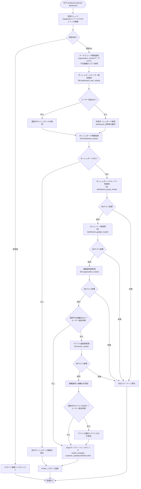

#### Flaskルート

| ルート | エンドポイント | 詳細 |
|-------|---------------|------|
| 顧客作成ダッシュボード表示 | `GET /analysis/customer-dashboard` | クエリパラメータ: なし |

#### バリデーション

**実行タイミング:** なし

**データスコープ制限:**
- **全ユーザー共通**: 組織階層（`organization_closure`）でフィルタ
  - ユーザーの `organization_id` を親組織IDとして検索
  - 下位組織リスト（`subsidiary_organization_id`）を取得
  - そのリストに該当する組織のデータのみアクセス可能
  - **ロールによる条件分岐は一切行わない**

**注**: システム保守者・管理者が全データにアクセスできるのは、ルート組織に所属しているため

#### 処理詳細（サーバーサイド）

**① 認証・認可チェック**

リバースプロキシヘッダから認証情報を取得し、権限を確認します。

**処理内容:**
- ヘッダ `X-Forwarded-User` からユーザーIDを取得
- データベースから現在ユーザー情報を取得（ユーザー種別、組織ID）
- 組織に応じてデータスコープを決定

**変数・パラメータ:**
- `current_user_id`: string - リバースプロキシヘッダから取得したユーザーID
- `current_user`: User - データベースから取得したユーザーオブジェクト
- `organization_id`: int - データスコープ制限用の組織ID

**② データスコープ制限の適用**

組織階層に基づいてデータスコープ制限を適用します。

**実装例:**
```python
def get_accessible_organizations(current_user_organization_id):
    """アクセス可能な組織IDリストを取得"""
    accessible_org_ids = db.session.query(
        OrganizationClosure.subsidiary_organization_id
    ).filter(
        OrganizationClosure.parent_organization_id == current_user_organization_id
    ).all()
    return [org_id[0] for org_id in accessible_org_ids]
```

**③ ダッシュボードユーザー設定取得**

ダッシュボードユーザー設定テーブルから、現在ユーザーが選択中のダッシュボードIDを取得します。

**使用テーブル:** dashboard_user_setting

**SQL詳細:**
```sql
SELECT
  dashboard_id,
  organization_id,
  device_id
FROM
  dashboard_user_setting
WHERE
  user_id = :current_user_id
  AND delete_flag = FALSE
```

**④ ダッシュボード情報取得**

選択中（またはデフォルト）のダッシュボード情報を取得します。

**使用テーブル:** dashboard_master

**SQL詳細:**
```sql
SELECT
  dashboard_id,
  dashboard_name
FROM
  dashboard_master
WHERE
  organization_id IN (:accessible_org_ids)
  AND delete_flag = FALSE
ORDER BY
  dashboard_id ASC
```

**⑤ ダッシュボードグループ一覧取得**

選択中のダッシュボードに紐づくグループ一覧を取得します。

**使用テーブル:** dashboard_group_master

**SQL詳細:**
```sql
SELECT
  dashboard_group_id,
  dashboard_group_name,
  display_order
FROM
  dashboard_group_master
WHERE
  dashboard_id = :dashboard_id
  AND delete_flag = FALSE
ORDER BY
  display_order ASC
```

**⑥ ガジェット一覧取得**

各グループに紐づくガジェット一覧を取得します。

**使用テーブル:** dashboard_gadget_master

**SQL詳細:**
```sql
SELECT
  gadget_id,
  gadget_name,
  dashboard_group_id,
  gadget_type_id,
  chart_config,
  data_source_config,
  position_x,
  position_y,
  gadget_size,
  display_order
FROM
  dashboard_gadget_master
WHERE
  dashboard_group_id IN (:group_ids)
  AND delete_flag = FALSE
ORDER BY
  display_order ASC
```

**⑦ 組織選択肢取得**

データソース選択フォーム用の組織選択肢を取得します。

**使用テーブル:** organization_master

**SQL詳細:**
```sql
SELECT
  organization_id,
  organization_name
FROM
  organization_master
WHERE
  organization_id IN (:accessible_org_ids)
  AND delete_flag = FALSE
ORDER BY
  organization_id ASC
```

**⑧ デバイス選択肢取得**

ユーザー設定で選択組織IDが設定されているの場合（0以外）、データソース選択フォーム用のデバイス選択肢を取得します。

**使用テーブル:** device_master

**SQL詳細:**
```sql
SELECT
  device_id,
  device_name
FROM
  device_master
WHERE
  organization_id = :organization_id
  AND delete_flag = FALSE
ORDER BY
  device_id ASC
```

**⑨ HTMLレンダリング**

**実装例:**
```python
@customer_dashboard_bp.route('/analysis/customer-dashboard', methods=['GET'])
@require_auth
def customer_dashboard():
    """顧客作成ダッシュボード初期表示"""

    # データスコープ制限適用
    accessible_org_ids = get_accessible_organizations(g.current_user.organization_id)

    # ダッシュボードユーザー設定取得
    user_setting = get_dashboard_user_setting(g.current_user.user_id)

    # 選択中のダッシュボードID決定
    if user_setting and user_setting.dashboard_id:
        dashboard_id = user_setting.dashboard_id
    else:
        # デフォルト: 先頭ダッシュボード
        first_dashboard = get_first_dashboard(accessible_org_ids)
        dashboard_id = first_dashboard.dashboard_id if first_dashboard else None

    # ダッシュボード一覧取得
    dashboards = get_dashboards(accessible_org_ids)

    if not dashboard_id:
        # ダッシュボードなし: 空の画面表示
        return render_template(
            'customer_dashboard/index.html',
            dashboards=[],
            groups=[],
            gadgets=[],
            organizations=get_organizations(accessible_org_ids),
            dashboard=None
        )

    # 選択中ダッシュボード取得
    dashboard = get_dashboard_by_id(dashboard_id)

    # ダッシュボードグループ一覧取得
    groups = get_dashboard_groups(dashboard_id)

    # ガジェット一覧取得
    group_ids = [g.dashboard_group_id for g in groups]
    gadgets = get_gadgets_by_groups(group_ids) if group_ids else []

    # 組織選択肢取得
    organizations = get_organizations(accessible_org_ids)

    # ユーザー設定で選択組織IDが設定されている場合（NULLでない場合）
    devices = []
    if user_setting.organization_id is not None:
      # デバイス選択肢取得
      devices = get_devices(user_setting.organization_id)

    return render_template(
        'customer_dashboard/index.html',
        dashboards=dashboards,
        dashboard=dashboard,
        groups=groups,
        gadgets=gadgets,
        organizations=organizations,
        devices=devices,
        user_setting=user_setting
    )
```

#### 表示メッセージ

| メッセージID | 表示内容 | 表示タイミング | 表示場所 |
|-------------|---------|---------------|---------|
| ERR_001 | データの取得に失敗しました | DBクエリ失敗時 | エラーモーダル |

#### エラーハンドリング

| HTTPステータス | エラー種別 | 処理内容 | 表示内容 |
|--------------|-----------|---------|---------|
| 401 | 認証エラー | ログイン画面へリダイレクト | - |
| 500 | データベースエラー | 500エラーページ表示 | データの取得に失敗しました |

#### ログ出力タイミング

DBクエリ実行の直前、直後に操作ログを出力する

#### UI状態

- ダッシュボード: ユーザー設定で選択中のダッシュボード（または先頭ダッシュボード）を表示
- ダッシュボードグループ: 展開状態
- ガジェット: 保存されたレイアウトで配置
- 組織選択: ユーザー設定で選択中の組織（または未選択）を設定
- デバイス選択: ユーザー設定で選択中のデバイス（または非活性）を設定
- 編集モード: OFF
- 自動更新: ON
- 最終更新時刻: 画面表示時の時刻

---

### ダッシュボード管理モーダル表示

**トリガー:** (2.3) ダッシュボード管理ボタンクリック

**前提条件:**
- ダッシュボード画面が表示されている

#### 処理フロー

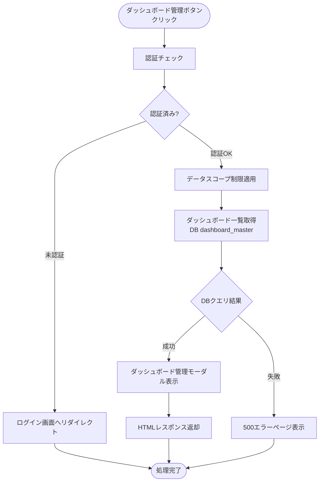

#### Flaskルート

| ルート | エンドポイント | 詳細 |
|-------|---------------|------|
| ダッシュボード管理画面 | `GET /analysis/customer-dashboard/dashboards` | パラメータ: なし |

#### 処理詳細（サーバーサイド）

**① ダッシュボード一覧取得**

**使用テーブル:** dashboard_master

**SQL詳細:**
```sql
SELECT
  dashboard_id,
  dashboard_name
FROM
  dashboard_master
WHERE
  organization_id IN (:accessible_org_ids)
  AND delete_flag = FALSE
ORDER BY
  dashboard_id ASC
```

**実装例:**
```python
@customer_dashboard_bp.route('/analysis/customer-dashboard/dashboards', methods=['GET'])
@require_auth
def dashboard_management():
    """ダッシュボード管理モーダル表示"""
    accessible_org_ids = get_accessible_organizations(g.current_user.organization_id)
    dashboards = get_dashboards(accessible_org_ids)

    return render_template(
        'customer_dashboard/modals/dashboard_management.html',
        dashboards=dashboards
    )
```

#### 表示メッセージ

| メッセージID | 表示内容 | 表示タイミング | 表示場所 |
|-------------|---------|---------------|---------|
| ERR_001 | データの取得に失敗しました | DBクエリ失敗時 | エラーモーダル |

#### エラーハンドリング

| HTTPステータス | エラー種別 | 処理内容 | 表示内容 |
|--------------|-----------|---------|---------|
| 401 | 認証エラー | ログイン画面へリダイレクト | - |
| 500 | データベースエラー | 500エラーページ表示 | データの取得に失敗しました |

#### ログ出力タイミング

DBクエリ実行の直前、直後に操作ログを出力する

#### UI状態

- モーダル: ダッシュボード管理モーダルを表示
- ダッシュボード一覧: dashboard_id昇順で表示

---

### ダッシュボード登録

**トリガー:** (9.1) 登録ボタンクリック（ダッシュボード管理モーダル）→ (11.2) 登録ボタンクリック（ダッシュボード登録モーダル）

**前提条件:**
- ダッシュボード管理モーダルが表示されている

#### 処理フロー

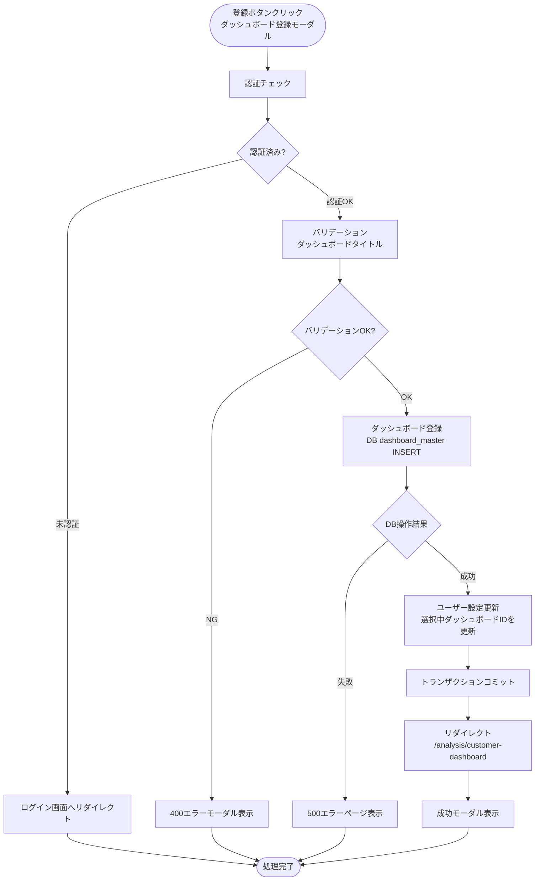

#### Flaskルート

| ルート | エンドポイント | 詳細 |
|-------|---------------|------|
| ダッシュボード登録画面 | `GET /analysis/customer-dashboard/dashboards/create` | パラメータ: なし |
| ダッシュボード登録実行 | `POST /analysis/customer-dashboard/dashboards/register` | フォームデータ: `dashboard_name` |

#### バリデーション

**実行タイミング:** フォーム送信時（サーバーサイド）

**バリデーションルール:**

| 項目 | ルール | エラーメッセージ |
|------|--------|-----------------|
| ダッシュボードタイトル | 必須 | ダッシュボードタイトルを入力してください |
| ダッシュボードタイトル | 最大50文字 | ダッシュボードタイトルは50文字以内で入力してください |

#### 処理詳細（サーバーサイド）

**① ダッシュボード登録**

**使用テーブル:** dashboard_master

**SQL詳細:**
```sql
INSERT INTO dashboard_master (
  dashboard_uuid,
  dashboard_name,
  organization_id,
  create_date,
  creator,
  update_date,
  modifier,
  delete_flag
) VALUES (
  :dashboard_uuid,
  :dashboard_name,
  :organization_id,
  NOW(),
  :current_user_id,
  NOW(),
  :current_user_id,
  FALSE
)
```

**② ユーザー設定更新**

新規登録したダッシュボードを選択中ダッシュボードとして設定します。

**使用テーブル:** dashboard_user_setting

**SQL詳細:**
```sql
INSERT INTO dashboard_user_setting (
  user_id,
  dashboard_id,
  organization_id,
  device_id,
  create_date,
  creator,
  update_date,
  modifier,
  delete_flag
) VALUES (
  :current_user_id,
  :new_dashboard_id,
  0,
  0,
  NOW(),
  :current_user_id,
  NOW(),
  :current_user_id,
  FALSE
)
ON DUPLICATE KEY UPDATE
  dashboard_id = :new_dashboard_id,
  update_date = NOW(),
  modifier = :current_user_id
```

**実装例:**
```python
@customer_dashboard_bp.route('/analysis/customer-dashboard/dashboards/register', methods=['POST'])
@require_auth
def dashboard_register():
    """ダッシュボード登録実行"""
    form = DashboardForm()

    if not form.validate_on_submit():
        return render_template(
            'customer_dashboard/modals/dashboard_register.html',
            form=form
        ), 400

    try:
        dashboard = DashboardMaster(
            dashboard_name=form.dashboard_name.data,
            organization_id=g.current_user.organization_id,
            creator=g.current_user.user_id,
            modifier=g.current_user.user_id
        )
        db.session.add(dashboard)
        db.session.flush()

        # ユーザー設定更新
        upsert_dashboard_user_setting(
            g.current_user.user_id,
            dashboard.dashboard_id
        )

        db.session.commit()
        modal('ダッシュボードを登録しました', 'success')
        return redirect(url_for('customer_dashboard.customer_dashboard'))

    except Exception as e:
        db.session.rollback()
        logger.error(f'ダッシュボード登録エラー: {str(e)}')
        modal('ダッシュボードの登録に失敗しました', 'error')
        return render_template(
            'customer_dashboard/modals/dashboard_register.html',
            form=form
        ), 500
```

#### 表示メッセージ

| メッセージID | 表示内容 | 表示タイミング | 表示場所 |
|-------------|---------|---------------|---------|
| SUC_001 | ダッシュボードを登録しました | 登録成功時 | 成功モーダル |
| ERR_002 | ダッシュボードの登録に失敗しました | DB操作失敗時 | エラーモーダル |

#### エラーハンドリング

| HTTPステータス | エラー種別 | 処理内容 | 表示内容 |
|--------------|-----------|---------|---------|
| 400 | バリデーションエラー | フォーム再表示（エラーモーダル表示） | バリデーションエラーメッセージ |
| 401 | 認証エラー | ログイン画面へリダイレクト | - |
| 500 | データベースエラー | 500エラーページ表示 | ダッシュボードの登録に失敗しました |

#### ログ出力タイミング

DBクエリ実行の直前、直後に操作ログを出力する

---

### ダッシュボード表示切替

**トリガー:** (9.4) 変更ボタンクリック（ダッシュボード管理モーダル）

**前提条件:**
- ダッシュボード管理モーダルでダッシュボードが選択されている

#### 処理フロー

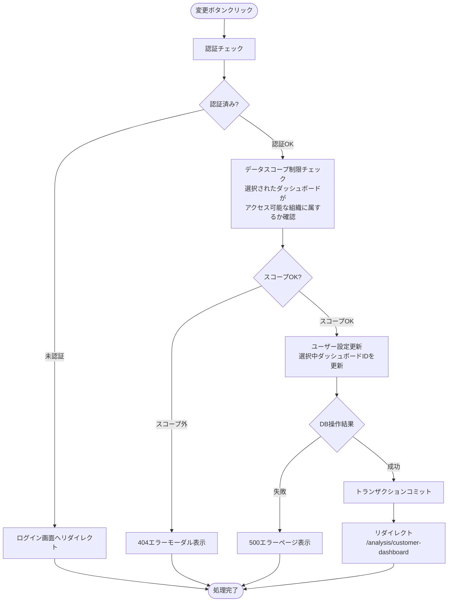

#### 処理詳細（サーバーサイド）

**実装例:**
```python
@customer_dashboard_bp.route('/analysis/customer-dashboard/dashboards/<string:dashboard_uuid>/switch', methods=['POST'])
@require_auth
def dashboard_switch(dashboard_uuid):
    """ダッシュボード表示切替"""
    accessible_org_ids = get_accessible_organizations(g.current_user.organization_id)

    # ダッシュボードアクセス権限チェック
    dashboard = check_dashboard_access(dashboard_uuid, accessible_org_ids)
    if not dashboard:
        abort(404)

    try:
        upsert_dashboard_user_setting(
            g.current_user.user_id,
            dashboard.dashboard_id
        )
        db.session.commit()
        return redirect(url_for('customer_dashboard.customer_dashboard'))

    except Exception as e:
        db.session.rollback()
        logger.error(f'ダッシュボード切替エラー: {str(e)}')
        abort(500)
```

#### エラーハンドリング

| HTTPステータス | エラー種別 | 処理内容 | 表示内容 |
|--------------|-----------|---------|---------|
| 401 | 認証エラー | ログイン画面へリダイレクト | - |
| 404 | リソース不存在 | 404エラーモーダル表示 | 指定されたダッシュボードが見つかりません |
| 500 | データベースエラー | 500エラーページ表示 | データの更新に失敗しました |

#### ログ出力タイミング

DBクエリ実行の直前、直後に操作ログを出力する

---

### ダッシュボードタイトル更新

**トリガー:** (11.2) 更新ボタンクリック（ダッシュボードタイトル更新モーダル）

**前提条件:**
- ダッシュボードタイトル更新モーダルが表示されている

#### 処理フロー

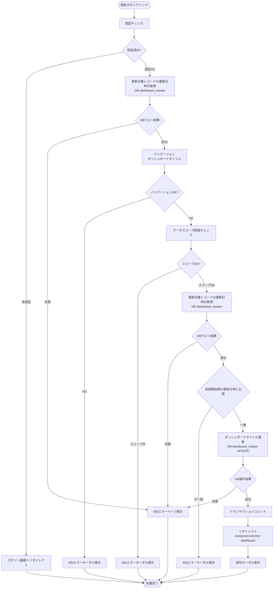

#### バリデーション

**実行タイミング:** フォーム送信時（サーバーサイド）

**バリデーションルール:**

| 項目 | ルール | エラーメッセージ |
|------|--------|-----------------|
| ダッシュボードタイトル | 必須 | ダッシュボードタイトルを入力してください |
| ダッシュボードタイトル | 最大50文字 | ダッシュボードタイトルは50文字以内で入力してください |

#### 処理詳細（サーバーサイド）

**使用テーブル:** dashboard_master

**SQL詳細:**
```sql
UPDATE dashboard_master
SET
  dashboard_name = :dashboard_name,
  update_date = NOW(),
  modifier = :current_user_id
WHERE
  dashboard_uuid = :dashboard_uuid
  AND delete_flag = FALSE
```

**実装例:**
```python
@customer_dashboard_bp.route('/analysis/customer-dashboard/dashboards/<string:dashboard_uuid>/update', methods=['POST'])
@require_auth
def dashboard_update(dashboard_uuid):
    """ダッシュボードタイトル更新実行"""

    # ① 更新対象レコードの更新日時を取得（楽観ロック用スナップショット）
    try:
        snapshot_update_date = db.session.query(DashboardMaster.update_date).filter(
            DashboardMaster.dashboard_uuid == dashboard_uuid,
            DashboardMaster.delete_flag == False
        ).scalar()
    except Exception as e:
        logger.error(f'ダッシュボード更新日時取得エラー: {str(e)}')
        abort(500)

    # ② バリデーション
    form = DashboardForm()
    if not form.validate_on_submit():
        dashboard = db.session.query(DashboardMaster).filter(
            DashboardMaster.dashboard_uuid == dashboard_uuid,
            DashboardMaster.delete_flag == False
        ).first()
        return render_template(
            'customer_dashboard/modals/dashboard_edit.html',
            form=form, dashboard=dashboard
        ), 400

    # ③ データスコープ制限チェック
    accessible_org_ids = get_accessible_organizations(g.current_user.organization_id)
    dashboard = check_dashboard_access(dashboard_uuid, accessible_org_ids)
    if not dashboard:
        abort(404)

    # ④ 更新対象レコードの更新日時を再取得（楽観ロック検証）
    try:
        current_update_date = db.session.query(DashboardMaster.update_date).filter(
            DashboardMaster.dashboard_uuid == dashboard_uuid,
            DashboardMaster.delete_flag == False
        ).scalar()
    except Exception as e:
        logger.error(f'ダッシュボード更新日時再取得エラー: {str(e)}')
        abort(500)

    # ⑤ 更新日時の比較（楽観ロック）
    if snapshot_update_date != current_update_date:
        logger.warning(f'楽観ロック競合検出: dashboard_uuid={dashboard_uuid}, user_id={g.current_user.user_id}')
        abort(409)

    # ⑥ ダッシュボードタイトル更新
    try:
        dashboard.dashboard_name = form.dashboard_name.data
        dashboard.update_date = datetime.now()
        dashboard.modifier = g.current_user.user_id
        db.session.commit()
        modal('ダッシュボードタイトルを更新しました', 'success')
        return redirect(url_for('customer_dashboard.customer_dashboard'))

    except Exception as e:
        db.session.rollback()
        logger.error(f'ダッシュボードタイトル更新エラー: {str(e)}')
        abort(500)
```

#### 表示メッセージ

| メッセージID | 表示内容 | 表示タイミング | 表示場所 |
|-------------|---------|---------------|---------|
| SUC_002 | ダッシュボードタイトルを更新しました | 更新成功時 | 成功モーダル |
| ERR_003 | ダッシュボードタイトルの更新に失敗しました | DB操作失敗時 | エラーモーダル |

#### エラーハンドリング

| HTTPステータス | エラー種別 | 処理内容 | 表示内容 |
|--------------|-----------|---------|---------|
| 400 | バリデーションエラー | フォーム再表示（エラーモーダル表示） | バリデーションエラーメッセージ |
| 401 | 認証エラー | ログイン画面へリダイレクト | - |
| 404 | リソース不存在 | 404エラーモーダル表示 | 指定されたダッシュボードが見つかりません |
| 409 | 競合エラー | 409エラーモーダル表示 | 他のユーザーが先に更新しました。ページを更新してから再度お試しください。 |
| 500 | データベースエラー | 500エラーページ表示 | ダッシュボードタイトルの更新に失敗しました |

#### ログ出力タイミング

DBクエリ実行の直前、直後に操作ログを出力する

---

### ダッシュボード削除

**トリガー:** (12.2) 削除ボタンクリック（ダッシュボード削除確認モーダル）

**前提条件:**
- ダッシュボード削除確認モーダルが表示されている

#### 処理フロー

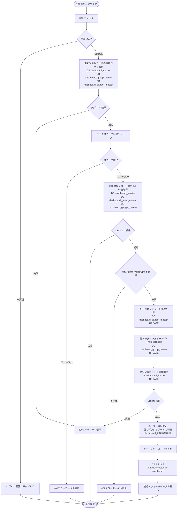

#### 処理詳細（サーバーサイド）

**① 配下のガジェットを論理削除**

**SQL詳細:**
```sql
UPDATE dashboard_gadget_master
SET
  delete_flag = TRUE,
  update_date = NOW(),
  modifier = :current_user_id
WHERE
  dashboard_group_id IN (
    SELECT dashboard_group_id
    FROM dashboard_group_master
    WHERE dashboard_id = (
      SELECT dashboard_id FROM dashboard_master
      WHERE dashboard_uuid = :dashboard_uuid AND delete_flag = FALSE
    )
    AND delete_flag = FALSE
  )
  AND delete_flag = FALSE
```

**② 配下のグループを論理削除**

**SQL詳細:**
```sql
UPDATE dashboard_group_master
SET
  delete_flag = TRUE,
  update_date = NOW(),
  modifier = :current_user_id
WHERE
  dashboard_id = (
    SELECT dashboard_id FROM dashboard_master
    WHERE dashboard_uuid = :dashboard_uuid AND delete_flag = FALSE
  )
  AND delete_flag = FALSE
```

**③ ダッシュボードを論理削除**

**SQL詳細:**
```sql
UPDATE dashboard_master
SET
  delete_flag = TRUE,
  update_date = NOW(),
  modifier = :current_user_id
WHERE
  dashboard_uuid = :dashboard_uuid
  AND delete_flag = FALSE
```

**実装例:**
```python
@customer_dashboard_bp.route('/analysis/customer-dashboard/dashboards/<string:dashboard_uuid>/delete', methods=['POST'])
@require_auth
def dashboard_delete(dashboard_uuid):
    """ダッシュボード削除実行"""

    # ① 更新対象レコードの更新日時を取得（楽観ロック用スナップショット）
    try:
        snapshot_update_date = db.session.query(DashboardMaster.update_date).filter(
            DashboardMaster.dashboard_uuid == dashboard_uuid,
            DashboardMaster.delete_flag == False
        ).scalar()
    except Exception as e:
        logger.error(f'ダッシュボード更新日時取得エラー: {str(e)}')
        abort(500)

    # ② データスコープ制限チェック
    accessible_org_ids = get_accessible_organizations(g.current_user.organization_id)
    dashboard = check_dashboard_access(dashboard_uuid, accessible_org_ids)
    if not dashboard:
        abort(404)

    # ③ 更新対象レコードの更新日時を再取得（楽観ロック検証）
    try:
        current_update_date = db.session.query(DashboardMaster.update_date).filter(
            DashboardMaster.dashboard_uuid == dashboard_uuid,
            DashboardMaster.delete_flag == False
        ).scalar()
    except Exception as e:
        logger.error(f'ダッシュボード更新日時再取得エラー: {str(e)}')
        abort(500)

    # ④ 更新日時の比較（楽観ロック）
    if snapshot_update_date != current_update_date:
        logger.warning(f'楽観ロック競合検出: dashboard_uuid={dashboard_uuid}, user_id={g.current_user.user_id}')
        abort(409)

    # ⑤ ダッシュボード削除
    try:
        # 配下のガジェットを論理削除
        delete_gadgets_by_dashboard(dashboard_uuid, g.current_user.user_id)

        # 配下のグループを論理削除
        delete_groups_by_dashboard(dashboard_uuid, g.current_user.user_id)

        # ダッシュボードを論理削除
        dashboard.delete_flag = True
        dashboard.update_date = datetime.now()
        dashboard.modifier = g.current_user.user_id

        # ユーザー設定更新（別のダッシュボードに切替）
        next_dashboard = get_first_dashboard(accessible_org_ids, exclude_id=dashboard.dashboard_id)
        if next_dashboard:
            upsert_dashboard_user_setting(g.current_user.user_id, next_dashboard.dashboard_id)
        else:
            delete_dashboard_user_setting(g.current_user.user_id)

        db.session.commit()
        modal('ダッシュボードを削除しました', 'success')
        return redirect(url_for('customer_dashboard.customer_dashboard'))

    except Exception as e:
        db.session.rollback()
        logger.error(f'ダッシュボード削除エラー: {str(e)}')
        abort(500)
```

#### 表示メッセージ

| メッセージID | 表示内容 | 表示タイミング | 表示場所 |
|-------------|---------|---------------|---------|
| SUC_003 | ダッシュボードを削除しました | 削除成功時 | 成功モーダル |
| ERR_004 | ダッシュボードの削除に失敗しました | DB操作失敗時 | エラーモーダル |

#### エラーハンドリング

| HTTPステータス | エラー種別 | 処理内容 | 表示内容 |
|--------------|-----------|---------|---------|
| 401 | 認証エラー | ログイン画面へリダイレクト | - |
| 404 | リソース不存在 | 404エラーモーダル表示 | 指定されたダッシュボードが見つかりません |
| 409 | 競合エラー | 409エラーモーダル表示 | 他のユーザーが先に更新しました。ページを更新してから再度お試しください。 |
| 500 | データベースエラー | 500エラーページ表示 | ダッシュボードの削除に失敗しました |

#### ログ出力タイミング

DBクエリ実行の直前、直後に操作ログを出力する

---

### ダッシュボードグループ登録

**トリガー:** (11.2) 登録ボタンクリック（ダッシュボードグループ登録モーダル）

**前提条件:**
- ダッシュボードグループ登録モーダルが表示されている

#### 処理フロー

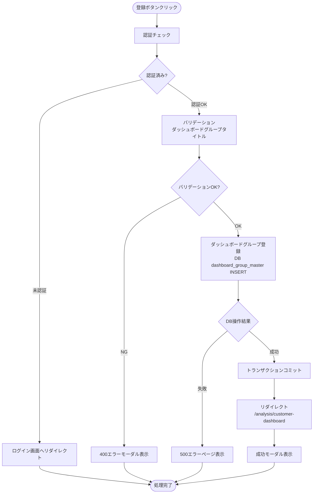

#### バリデーション

**実行タイミング:** フォーム送信時（サーバーサイド）

| 項目 | ルール | エラーメッセージ |
|------|--------|-----------------|
| ダッシュボードグループタイトル | 必須 | ダッシュボードグループタイトルを入力してください |
| ダッシュボードグループタイトル | 最大50文字 | ダッシュボードグループタイトルは50文字以内で入力してください |

#### 処理詳細（サーバーサイド）

**使用テーブル:** dashboard_group_master

**SQL詳細:**
```sql
INSERT INTO dashboard_group_master (
  dashboard_group_uuid,
  dashboard_group_name,
  dashboard_id,
  display_order,
  create_date,
  creator,
  update_date,
  modifier,
  delete_flag
) VALUES (
  :dashboard_group_uuid,
  :dashboard_group_name,
  :dashboard_id,
  (
    SELECT COALESCE(MAX(display_order), 0) + 1
    FROM dashboard_group_master
    WHERE dashboard_id = :dashboard_id
    AND delete_flag = FALSE
  ),
  NOW(),
  :current_user_id,
  NOW(),
  :current_user_id,
  FALSE
)
```

**実装例:**
```python
@customer_dashboard_bp.route('/analysis/customer-dashboard/groups/register', methods=['POST'])
@require_auth
def group_register():
    """ダッシュボードグループ登録実行"""
    form = DashboardGroupForm()

    if not form.validate_on_submit():
        return render_template(
            'customer_dashboard/modals/group_register.html',
            form=form
        ), 400

    try:
        accessible_org_ids = get_accessible_organizations(g.current_user.organization_id)

        # 対象ダッシュボードのアクセス権限チェック
        dashboard = check_dashboard_access(form.dashboard_uuid.data, accessible_org_ids)
        if not dashboard:
            abort(404)

        # display_orderの最大値+1を取得
        max_order = db.session.query(
            func.coalesce(func.max(DashboardGroupMaster.display_order), 0)
        ).filter(
            DashboardGroupMaster.dashboard_id == dashboard.dashboard_id,
            DashboardGroupMaster.delete_flag == False
        ).scalar()

        group = DashboardGroupMaster(
            dashboard_group_uuid=str(uuid.uuid4()),
            dashboard_group_name=form.dashboard_group_name.data,
            dashboard_id=dashboard.dashboard_id,
            display_order=max_order + 1,
            creator=g.current_user.user_id,
            modifier=g.current_user.user_id
        )
        db.session.add(group)
        db.session.commit()

        modal('ダッシュボードグループを登録しました', 'success')
        return redirect(url_for('customer_dashboard.customer_dashboard'))

    except Exception as e:
        db.session.rollback()
        logger.error(f'ダッシュボードグループ登録エラー: {str(e)}')
        modal('ダッシュボードグループの登録に失敗しました', 'error')
        abort(500)
```

#### 表示メッセージ

| メッセージID | 表示内容 | 表示タイミング | 表示場所 |
|-------------|---------|---------------|---------|
| SUC_004 | ダッシュボードグループを登録しました | 登録成功時 | 成功モーダル |
| ERR_005 | ダッシュボードグループの登録に失敗しました | DB操作失敗時 | エラーモーダル |

#### エラーハンドリング

| HTTPステータス | エラー種別 | 処理内容 | 表示内容 |
|--------------|-----------|---------|---------|
| 400 | バリデーションエラー | フォーム再表示（エラーモーダル表示）| バリデーションエラーメッセージ |
| 401 | 認証エラー | ログイン画面へリダイレクト | - |
| 500 | データベースエラー | 500エラーページ表示 | ダッシュボードグループの登録に失敗しました |

#### ログ出力タイミング

DBクエリ実行の直前、直後に操作ログを出力する

---

### ダッシュボードグループタイトル更新

**トリガー:** (11.2) 更新ボタンクリック（ダッシュボードグループタイトル更新モーダル）

**前提条件:**
- ダッシュボードグループタイトル更新モーダルが表示されている

#### 処理フロー

ダッシュボードタイトル更新と同様の処理フローに従います。対象テーブルが `dashboard_group_master` に変わります。

#### バリデーション

**実行タイミング:** フォーム送信時（サーバーサイド）

| 項目 | ルール | エラーメッセージ |
|------|--------|-----------------|
| ダッシュボードグループタイトル | 必須 | ダッシュボードグループタイトルを入力してください |
| ダッシュボードグループタイトル | 最大50文字 | ダッシュボードグループタイトルは50文字以内で入力してください |

#### 処理詳細（サーバーサイド）

**使用テーブル:** dashboard_group_master

**SQL詳細:**
```sql
UPDATE dashboard_group_master
SET
  dashboard_group_name = :dashboard_group_name,
  update_date = NOW(),
  modifier = :current_user_id
WHERE
  dashboard_group_uuid = :dashboard_group_uuid
  AND delete_flag = FALSE
```

**実装例:**
```python
@customer_dashboard_bp.route('/analysis/customer-dashboard/groups/<string:dashboard_group_uuid>/update', methods=['POST'])
@require_auth
def group_update(dashboard_group_uuid):
    """ダッシュボードグループタイトル更新実行"""

    # ① 更新対象レコードの更新日時を取得（楽観ロック用スナップショット）
    try:
        snapshot_update_date = db.session.query(DashboardGroupMaster.update_date).filter(
            DashboardGroupMaster.dashboard_group_uuid == dashboard_group_uuid,
            DashboardGroupMaster.delete_flag == False
        ).scalar()
    except Exception as e:
        logger.error(f'ダッシュボードグループ更新日時取得エラー: {str(e)}')
        abort(500)

    # ② バリデーション
    form = DashboardGroupForm()
    if not form.validate_on_submit():
        group = db.session.query(DashboardGroupMaster).filter(
            DashboardGroupMaster.dashboard_group_uuid == dashboard_group_uuid,
            DashboardGroupMaster.delete_flag == False
        ).first()
        return render_template(
            'customer_dashboard/modals/group_edit.html',
            form=form, group=group
        ), 400

    # ③ データスコープ制限チェック
    accessible_org_ids = get_accessible_organizations(g.current_user.organization_id)
    group = check_group_access(dashboard_group_uuid, accessible_org_ids)
    if not group:
        abort(404)

    # ④ 更新対象レコードの更新日時を再取得（楽観ロック検証）
    try:
        current_update_date = db.session.query(DashboardGroupMaster.update_date).filter(
            DashboardGroupMaster.dashboard_group_uuid == dashboard_group_uuid,
            DashboardGroupMaster.delete_flag == False
        ).scalar()
    except Exception as e:
        logger.error(f'ダッシュボードグループ更新日時再取得エラー: {str(e)}')
        abort(500)

    # ⑤ 更新日時の比較（楽観ロック）
    if snapshot_update_date != current_update_date:
        logger.warning(f'楽観ロック競合検出: dashboard_group_uuid={dashboard_group_uuid}, user_id={g.current_user.user_id}')
        abort(409)

    # ⑥ ダッシュボードグループタイトル更新
    try:
        group.dashboard_group_name = form.dashboard_group_name.data
        group.update_date = datetime.now()
        group.modifier = g.current_user.user_id
        db.session.commit()
        modal('ダッシュボードグループタイトルを更新しました', 'success')
        return redirect(url_for('customer_dashboard.customer_dashboard'))

    except Exception as e:
        db.session.rollback()
        logger.error(f'ダッシュボードグループタイトル更新エラー: {str(e)}')
        abort(500)
```

#### 表示メッセージ

| メッセージID | 表示内容 | 表示タイミング | 表示場所 |
|-------------|---------|---------------|---------|
| SUC_005 | ダッシュボードグループタイトルを更新しました | 更新成功時 | 成功モーダル |
| ERR_006 | ダッシュボードグループタイトルの更新に失敗しました | DB操作失敗時 | エラーモーダル |

#### エラーハンドリング

| HTTPステータス | エラー種別 | 処理内容 | 表示内容 |
|--------------|-----------|---------|---------|
| 400 | バリデーションエラー | フォーム再表示（エラーモーダル表示）| バリデーションエラーメッセージ |
| 401 | 認証エラー | ログイン画面へリダイレクト | - |
| 404 | リソース不存在 | 404エラーモーダル表示 | 指定されたダッシュボードグループが見つかりません |
| 409 | 競合エラー | 409エラーモーダル表示 | 他のユーザーが先に更新しました。ページを更新してから再度お試しください。 |
| 500 | データベースエラー | 500エラーページ表示 | ダッシュボードグループタイトルの更新に失敗しました |

#### ログ出力タイミング

DBクエリ実行の直前、直後に操作ログを出力する

---

### ダッシュボードグループ削除

**トリガー:** (12.2) 削除ボタンクリック（ダッシュボードグループ削除確認モーダル）

**前提条件:**
- ダッシュボードグループ削除確認モーダルが表示されている

#### 処理フロー

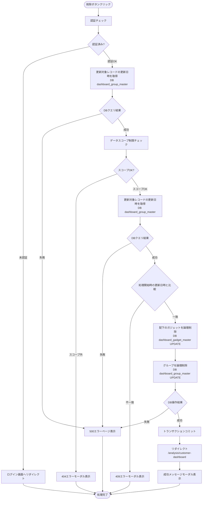

#### 処理詳細（サーバーサイド）

**① 配下のガジェットを論理削除**

**SQL詳細:**
```sql
UPDATE dashboard_gadget_master
SET
  delete_flag = TRUE,
  update_date = NOW(),
  modifier = :current_user_id
WHERE
  dashboard_group_id IN (
    SELECT dashboard_group_id
    FROM dashboard_group_master
    WHERE dashboard_group_uuid = :dashboard_group_uuid
    AND delete_flag = FALSE
  )
  AND delete_flag = FALSE
```

**② グループを論理削除**

**SQL詳細:**
```sql
UPDATE dashboard_group_master
SET
  delete_flag = TRUE,
  update_date = NOW(),
  modifier = :current_user_id
WHERE
  dashboard_group_uuid = :dashboard_group_uuid
  AND delete_flag = FALSE
```

**実装例:**
```python
@customer_dashboard_bp.route('/analysis/customer-dashboard/groups/<string:dashboard_group_uuid>/delete', methods=['POST'])
@require_auth
def group_delete(dashboard_group_uuid):
    """ダッシュボードグループ削除実行"""

    # ① 更新対象レコードの更新日時を取得（楽観ロック用スナップショット）
    try:
        snapshot_update_date = db.session.query(DashboardGroupMaster.update_date).filter(
            DashboardGroupMaster.dashboard_group_uuid == dashboard_group_uuid,
            DashboardGroupMaster.delete_flag == False
        ).scalar()
    except Exception as e:
        logger.error(f'ダッシュボードグループ更新日時取得エラー: {str(e)}')
        abort(500)

    # ② データスコープ制限チェック
    accessible_org_ids = get_accessible_organizations(g.current_user.organization_id)
    group = check_group_access(dashboard_group_uuid, accessible_org_ids)
    if not group:
        abort(404)

    # ③ 更新対象レコードの更新日時を再取得（楽観ロック検証）
    try:
        current_update_date = db.session.query(DashboardGroupMaster.update_date).filter(
            DashboardGroupMaster.dashboard_group_uuid == dashboard_group_uuid,
            DashboardGroupMaster.delete_flag == False
        ).scalar()
    except Exception as e:
        logger.error(f'ダッシュボードグループ更新日時再取得エラー: {str(e)}')
        abort(500)

    # ④ 更新日時の比較（楽観ロック）
    if snapshot_update_date != current_update_date:
        logger.warning(f'楽観ロック競合検出: dashboard_group_uuid={dashboard_group_uuid}, user_id={g.current_user.user_id}')
        abort(409)

    # ⑤ グループ削除
    try:
        # 配下のガジェットを論理削除
        delete_gadgets_by_group(dashboard_group_uuid, g.current_user.user_id)

        # グループを論理削除
        group.delete_flag = True
        group.update_date = datetime.now()
        group.modifier = g.current_user.user_id

        db.session.commit()
        modal('ダッシュボードグループを削除しました', 'success')
        return redirect(url_for('customer_dashboard.customer_dashboard'))

    except Exception as e:
        db.session.rollback()
        logger.error(f'ダッシュボードグループ削除エラー: {str(e)}')
        abort(500)
```

#### 表示メッセージ

| メッセージID | 表示内容 | 表示タイミング | 表示場所 |
|-------------|---------|---------------|---------|
| SUC_006 | ダッシュボードグループを削除しました | 削除成功時 | 成功モーダル |
| ERR_007 | ダッシュボードグループの削除に失敗しました | DB操作失敗時 | エラーモーダル |

#### エラーハンドリング

| HTTPステータス | エラー種別 | 処理内容 | 表示内容 |
|--------------|-----------|---------|---------|
| 401 | 認証エラー | ログイン画面へリダイレクト | - |
| 404 | リソース不存在 | 404エラーモーダル表示 | 指定されたダッシュボードグループが見つかりません |
| 409 | 競合エラー | 409エラーモーダル表示 | 他のユーザーが先に更新しました。ページを更新してから再度お試しください。 |
| 500 | データベースエラー | 500エラーページ表示 | ダッシュボードグループの削除に失敗しました |

#### ログ出力タイミング

DBクエリ実行の直前、直後に操作ログを出力する

---

### ガジェット追加モーダル表示

**トリガー:** (6.3) ダッシュボードグループ設定メニュー > ガジェット追加

**前提条件:**
- ダッシュボードグループが表示されている

#### 処理フロー

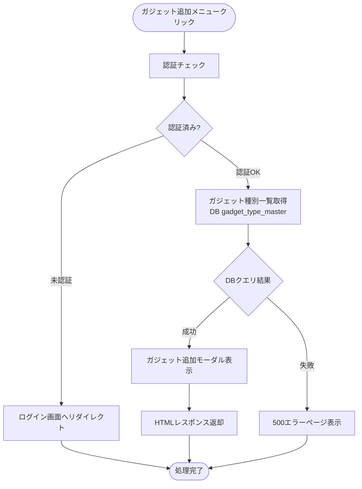

#### 処理詳細（サーバーサイド）

**使用テーブル:** gadget_type_master

**SQL詳細:**
```sql
SELECT
  gadget_type_id,
  gadget_type_name,
  data_source_type,
  gadget_image_path,
  gadget_description,
  display_order
FROM
  gadget_type_master
WHERE
  delete_flag = FALSE
ORDER BY
  data_source_type ASC,
  display_order ASC
```

#### 表示メッセージ

| メッセージID | 表示内容 | 表示タイミング | 表示場所 |
|-------------|---------|---------------|---------|
| ERR_001 | データの取得に失敗しました | DBクエリ失敗時 | エラーモーダル |

#### エラーハンドリング

| HTTPステータス | エラー種別 | 処理内容 | 表示内容 |
|--------------|-----------|---------|---------|
| 401 | 認証エラー | ログイン画面へリダイレクト | - |
| 500 | データベースエラー | 500エラーページ表示 | データの取得に失敗しました |

#### ログ出力タイミング

DBクエリ実行の直前、直後に操作ログを出力する

---

### ガジェット登録モーダル表示

**トリガー:** (10.4) 登録画面ボタンクリック（ガジェット追加モーダル）

**前提条件:**
- ガジェット追加モーダルが表示されている
- ガジェット種別が選択されている

詳細はガジェット個別仕様書の`ガジェット登録モーダル表示`を参照してください。

- **棒グラフ:** [棒グラフ-ワークフロー仕様書](../bar-chart/workflow-specification.md)
- **円グラフ:** [円グラフ-ワークフロー仕様書](../circle/workflow-specification.md)
- **帯グラフ:** [帯グラフ-ワークフロー仕様書](../belt-chart/workflow-specification.md)
- **時系列グラフ:** [時系列グラフ-ワークフロー仕様書](../timeline/workflow-specification.md)
- **表:** [表-ワークフロー仕様書](../grid/workflow-specification.md)

---

### ガジェット登録

詳細はガジェット個別仕様書の`ガジェット登録`を参照してください。

- **棒グラフ:** [棒グラフ-ワークフロー仕様書](../bar-chart/workflow-specification.md)
- **円グラフ:** [円グラフ-ワークフロー仕様書](../circle/workflow-specification.md)
- **帯グラフ:** [帯グラフ-ワークフロー仕様書](../belt-chart/workflow-specification.md)
- **時系列グラフ:** [時系列グラフ-ワークフロー仕様書](../timeline/workflow-specification.md)
- **表:** [表-ワークフロー仕様書](../grid/workflow-specification.md)

---

### ガジェットタイトル更新

**トリガー:** (11.2) 更新ボタンクリック（ガジェットタイトル更新モーダル）

**前提条件:**
- ガジェットタイトル更新モーダルが表示されている

#### 処理フロー

ダッシュボードタイトル更新と同様の処理フローに従います。対象テーブルが `dashboard_gadget_master` に変わります。

#### バリデーション

**実行タイミング:** フォーム送信時（サーバーサイド）

| 項目 | ルール | エラーメッセージ |
|------|--------|-----------------|
| ガジェットタイトル | 必須 | ガジェットタイトルを入力してください |
| ガジェットタイトル | 最大20文字 | ガジェットタイトルは20文字以内で入力してください |

#### 処理詳細（サーバーサイド）

**使用テーブル:** dashboard_gadget_master

**SQL詳細:**
```sql
UPDATE dashboard_gadget_master
SET
  gadget_name = :gadget_name,
  update_date = NOW(),
  modifier = :current_user_id
WHERE
  gadget_uuid = :gadget_uuid
  AND delete_flag = FALSE
```

**実装例:**
```python
@customer_dashboard_bp.route('/analysis/customer-dashboard/gadgets/<string:gadget_uuid>/update', methods=['POST'])
@require_auth
def gadget_update(gadget_uuid):
    """ガジェットタイトル更新実行"""

    # ① 更新対象レコードの更新日時を取得（楽観ロック用スナップショット）
    try:
        snapshot_update_date = db.session.query(DashboardGadgetMaster.update_date).filter(
            DashboardGadgetMaster.gadget_uuid == gadget_uuid,
            DashboardGadgetMaster.delete_flag == False
        ).scalar()
    except Exception as e:
        logger.error(f'ガジェット更新日時取得エラー: {str(e)}')
        abort(500)

    # ② バリデーション
    form = GadgetForm()
    if not form.validate_on_submit():
        gadget = db.session.query(DashboardGadgetMaster).filter(
            DashboardGadgetMaster.gadget_uuid == gadget_uuid,
            DashboardGadgetMaster.delete_flag == False
        ).first()
        return render_template(
            'customer_dashboard/modals/gadget_edit.html',
            form=form, gadget=gadget
        ), 400

    # ③ データスコープ制限チェック
    accessible_org_ids = get_accessible_organizations(g.current_user.organization_id)
    gadget = check_gadget_access(gadget_uuid, accessible_org_ids)
    if not gadget:
        abort(404)

    # ④ 更新対象レコードの更新日時を再取得（楽観ロック検証）
    try:
        current_update_date = db.session.query(DashboardGadgetMaster.update_date).filter(
            DashboardGadgetMaster.gadget_uuid == gadget_uuid,
            DashboardGadgetMaster.delete_flag == False
        ).scalar()
    except Exception as e:
        logger.error(f'ガジェット更新日時再取得エラー: {str(e)}')
        abort(500)

    # ⑤ 更新日時の比較（楽観ロック）
    if snapshot_update_date != current_update_date:
        logger.warning(f'楽観ロック競合検出: gadget_uuid={gadget_uuid}, user_id={g.current_user.user_id}')
        abort(409)

    # ⑥ ガジェットタイトル更新
    try:
        gadget.gadget_name = form.gadget_name.data
        gadget.update_date = datetime.now()
        gadget.modifier = g.current_user.user_id
        db.session.commit()
        modal('ガジェットタイトルを更新しました', 'success')
        return redirect(url_for('customer_dashboard.customer_dashboard'))

    except Exception as e:
        db.session.rollback()
        logger.error(f'ガジェットタイトル更新エラー: {str(e)}')
        abort(500)
```

#### 表示メッセージ

| メッセージID | 表示内容 | 表示タイミング | 表示場所 |
|-------------|---------|---------------|---------|
| SUC_008 | ガジェットタイトルを更新しました | 更新成功時 | 成功モーダル |
| ERR_009 | ガジェットタイトルの更新に失敗しました | DB操作失敗時 | エラーモーダル |

#### エラーハンドリング

| HTTPステータス | エラー種別 | 処理内容 | 表示内容 |
|--------------|-----------|---------|---------|
| 400 | バリデーションエラー | フォーム再表示（エラーモーダル表示）| バリデーションエラーメッセージ |
| 401 | 認証エラー | ログイン画面へリダイレクト | - |
| 404 | リソース不存在 | 404エラーモーダル表示 | 指定されたガジェットが見つかりません |
| 409 | 競合エラー | 409エラーモーダル表示 | 他のユーザーが先に更新しました。ページを更新してから再度お試しください。 |
| 500 | データベースエラー | 500エラーページ表示 | ガジェットタイトルの更新に失敗しました |

#### ログ出力タイミング

DBクエリ実行の直前、直後に操作ログを出力する

---

### ガジェット削除

**トリガー:** (12.2) 削除ボタンクリック（ガジェット削除確認モーダル）

**前提条件:**
- ガジェット削除確認モーダルが表示されている

#### 処理フロー

ダッシュボード削除と同様の処理フローに従います。対象テーブルが `dashboard_gadget_master` に変わります。

#### 処理詳細（サーバーサイド）

**使用テーブル:** dashboard_gadget_master

**SQL詳細:**
```sql
UPDATE dashboard_gadget_master
SET
  delete_flag = TRUE,
  update_date = NOW(),
  modifier = :current_user_id
WHERE
  gadget_uuid = :gadget_uuid
  AND delete_flag = FALSE
```

**実装例:**
```python
@customer_dashboard_bp.route('/analysis/customer-dashboard/gadgets/<string:gadget_uuid>/delete', methods=['POST'])
@require_auth
def gadget_delete(gadget_uuid):
    """ガジェット削除実行"""

    # ① 更新対象レコードの更新日時を取得（楽観ロック用スナップショット）
    try:
        snapshot_update_date = db.session.query(DashboardGadgetMaster.update_date).filter(
            DashboardGadgetMaster.gadget_uuid == gadget_uuid,
            DashboardGadgetMaster.delete_flag == False
        ).scalar()
    except Exception as e:
        logger.error(f'ガジェット更新日時取得エラー: {str(e)}')
        abort(500)

    # ② データスコープ制限チェック
    accessible_org_ids = get_accessible_organizations(g.current_user.organization_id)
    gadget = check_gadget_access(gadget_uuid, accessible_org_ids)
    if not gadget:
        abort(404)

    # ③ 更新対象レコードの更新日時を再取得（楽観ロック検証）
    try:
        current_update_date = db.session.query(DashboardGadgetMaster.update_date).filter(
            DashboardGadgetMaster.gadget_uuid == gadget_uuid,
            DashboardGadgetMaster.delete_flag == False
        ).scalar()
    except Exception as e:
        logger.error(f'ガジェット更新日時再取得エラー: {str(e)}')
        abort(500)

    # ④ 更新日時の比較（楽観ロック）
    if snapshot_update_date != current_update_date:
        logger.warning(f'楽観ロック競合検出: gadget_uuid={gadget_uuid}, user_id={g.current_user.user_id}')
        abort(409)

    # ⑤ ガジェット削除
    try:
        gadget.delete_flag = True
        gadget.update_date = datetime.now()
        gadget.modifier = g.current_user.user_id
        db.session.commit()
        modal('ガジェットを削除しました', 'success')
        return redirect(url_for('customer_dashboard.customer_dashboard'))

    except Exception as e:
        db.session.rollback()
        logger.error(f'ガジェット削除エラー: {str(e)}')
        abort(500)
```

#### 表示メッセージ

| メッセージID | 表示内容 | 表示タイミング | 表示場所 |
|-------------|---------|---------------|---------|
| SUC_009 | ガジェットを削除しました | 削除成功時 | 成功モーダル |
| ERR_010 | ガジェットの削除に失敗しました | DB操作失敗時 | エラーモーダル |

#### エラーハンドリング

| HTTPステータス | エラー種別 | 処理内容 | 表示内容 |
|--------------|-----------|---------|---------|
| 401 | 認証エラー | ログイン画面へリダイレクト | - |
| 404 | リソース不存在 | 404エラーモーダル表示 | 指定されたガジェットが見つかりません |
| 409 | 競合エラー | 409エラーモーダル表示 | 他のユーザーが先に更新しました。ページを更新してから再度お試しください。 |
| 500 | データベースエラー | 500エラーページ表示 | ガジェットの削除に失敗しました |

#### ログ出力タイミング

DBクエリ実行の直前、直後に操作ログを出力する

---

### ガジェットデータ取得

詳細はガジェット個別仕様書の`ガジェットデータ取得`を参照してください。

- **棒グラフ:** [棒グラフ-ワークフロー仕様書](../bar-chart/workflow-specification.md)
- **円グラフ:** [円グラフ-ワークフロー仕様書](../circle/workflow-specification.md)
- **帯グラフ:** [帯グラフ-ワークフロー仕様書](../belt-chart/workflow-specification.md)
- **時系列グラフ:** [時系列グラフ-ワークフロー仕様書](../timeline/workflow-specification.md)
- **表:** [表-ワークフロー仕様書](../grid/workflow-specification.md)

---

### レイアウト保存

**トリガー:** (2.2) レイアウト保存ボタンクリック

**前提条件:**
- 編集モードがON
- ガジェットの配置が変更されている

#### 処理フロー

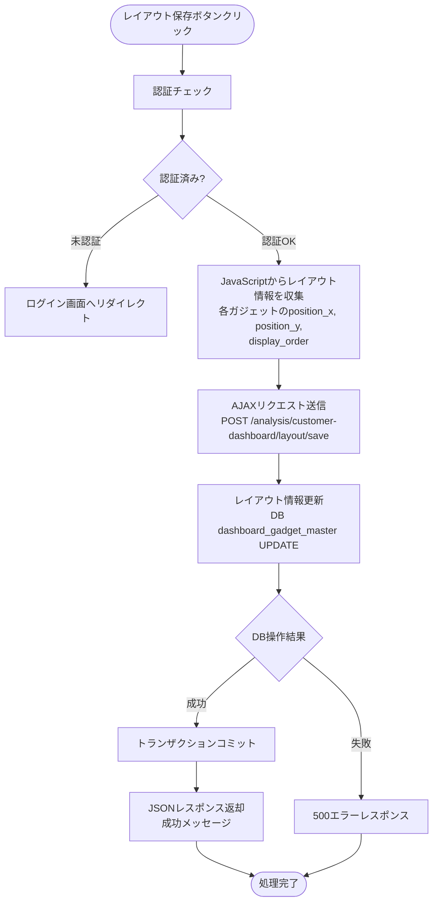

#### 処理詳細（サーバーサイド）

**使用テーブル:** dashboard_gadget_master

**SQL詳細（各ガジェットに対して実行）:**

**注:** `gadget_size` はガジェット登録時のみ設定し、レイアウト保存時には変更しない（2パターン固定サイズ: 0=480×480, 1=960×480）。

```sql
UPDATE dashboard_gadget_master
SET
  position_x = :position_x,
  position_y = :position_y,
  display_order = :display_order,
  update_date = NOW(),
  modifier = :current_user_id
WHERE
  gadget_uuid = :gadget_uuid
  AND delete_flag = FALSE
```

**実装例:**
```python
@customer_dashboard_bp.route('/analysis/customer-dashboard/layout/save', methods=['POST'])
@require_auth
def layout_save():
    """レイアウト保存（AJAX）"""
    try:
        layout_data = request.get_json()
        gadgets = layout_data.get('gadgets', [])

        for gadget_info in gadgets:
            update_gadget_layout(
                gadget_uuid=gadget_info['gadget_uuid'],
                position_x=gadget_info['position_x'],
                position_y=gadget_info['position_y'],
                display_order=gadget_info['display_order'],
                modifier=g.current_user.user_id
            )

        db.session.commit()
        return jsonify({'message': 'レイアウトを保存しました'}), 200

    except Exception as e:
        db.session.rollback()
        logger.error(f'レイアウト保存エラー: {str(e)}')
        return jsonify({'error': 'レイアウトの保存に失敗しました'}), 500
```

#### 表示メッセージ

| メッセージID | 表示内容 | 表示タイミング | 表示場所 |
|-------------|---------|---------------|---------|
| SUC_010 | レイアウトを保存しました | 保存成功時 | 成功モーダル |
| ERR_011 | レイアウトの保存に失敗しました | DB操作失敗時 | エラーモーダル |

#### エラーハンドリング

| HTTPステータス | エラー種別 | 処理内容 | 表示内容 |
|--------------|-----------|---------|---------|
| 401 | 認証エラー | 401エラーレスポンス | - |
| 500 | データベースエラー | 500エラーレスポンス | レイアウトの保存に失敗しました |

#### ログ出力タイミング

DBクエリ実行の直前、直後に操作ログを出力する

---

### 日時設定ボタン

**トリガー:** (4.1)〜(4.6) 日時設定ボタンクリック（今日/昨日/今週/今月/今年/カスタム）

**前提条件:**
- ダッシュボード画面が表示されている

#### 処理フロー

**今日/昨日/今週/今月/今年ボタン押下時:**


**カスタムボタン押下時:**

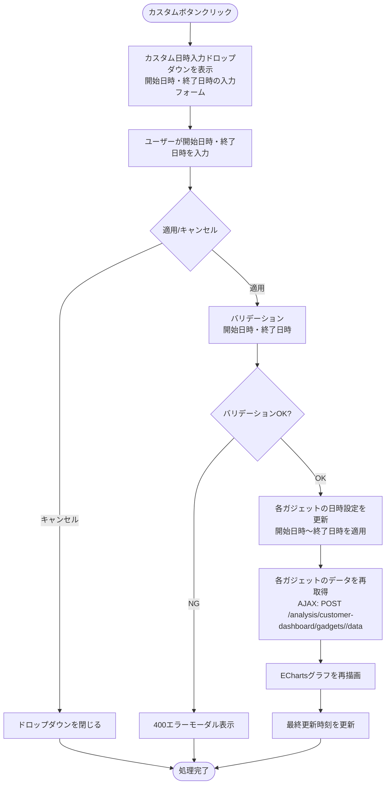

#### 処理詳細

日時設定ボタンはクライアントサイドの処理がメインです。ボタン押下時に各ガジェットの日時パラメータを更新し、[ガジェットデータ取得](#ガジェットデータ取得) のAJAXリクエストを実行して最新データでグラフを再描画します。

**日時設定ボタン押下時のガジェット種別ごとの変換ルール:**

| 日時設定ボタン | 棒グラフ・帯グラフ（日次） | 棒グラフ・帯グラフ（年次） | 表・時系列グラフ | 円グラフ・メーター |
|---------------|--------------------------|--------------------------|----------------|-------------------|
| 今日 | 表示時間単位: 時、時間帯: 現在時刻 | 今年 | 現在時刻より1時間前～現在時刻 | 最新値 |
| 昨日 | 表示時間単位: 日、表示日: 昨日 | 昨年 | 昨日の00:00～23:59 | 最新値 |
| 今週 | 表示時間単位: 週、表示週: 今週月曜日 | 今年 | 現在時刻より1時間前～現在時刻 | 最新値 |
| 今月 | 表示時間単位: 月、表示月: 今月 | 今年 | 現在時刻より1時間前～現在時刻 | 最新値 |
| 今年 | 表示時間単位: 時、時間帯: 現在時刻 | 今年 | 現在時刻より1時間前～現在時刻 | 最新値 |
| カスタム | 表示時間単位: 時、時間帯: 開始日時 | 開始日時の年 | 開始日時～終了日時 | 最新値 |

**カスタムドロップダウン入力バリデーション:**

| 項目 | バリデーションルール | エラーメッセージ |
|------|---------------------|-----------------|
| 開始日時 | 必須 | 「開始日時を入力してください」 |
| 終了日時 | 必須 | 「終了日時を入力してください」 |
| 開始日時・終了日時 | 開始日時 < 終了日時 | 「開始日時は終了日時より前に設定してください」 |

#### エラーハンドリング

| HTTPステータス | エラー種別 | 処理内容 | 表示内容 |
|--------------|-----------|---------|---------|
| 400 | バリデーションエラー | フォーム再表示（エラーモーダル表示） | バリデーションエラーメッセージ |

---

### 日時初期化

**トリガー:** (4.7) 日時初期化ボタンクリック → 確認モーダルで「はい」を選択

**前提条件:**
- ガジェットが表示されている

#### 処理フロー

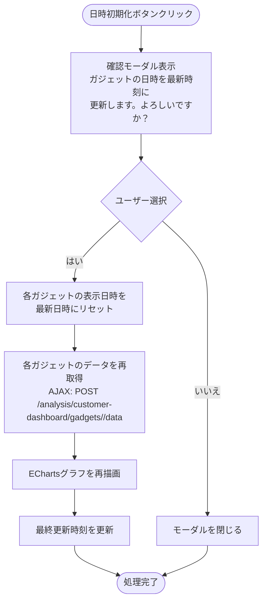

#### 処理詳細

日時初期化はクライアントサイドの処理がメインです。各ガジェットに対して [ガジェットデータ取得](#ガジェットデータ取得) のAJAXリクエストを実行し、最新データでグラフを再描画します。

---

### 自動更新

**トリガー:** (4.8) 自動更新切替ボタンをONに変更

**前提条件:**
- ガジェットが表示されている

#### 処理フロー

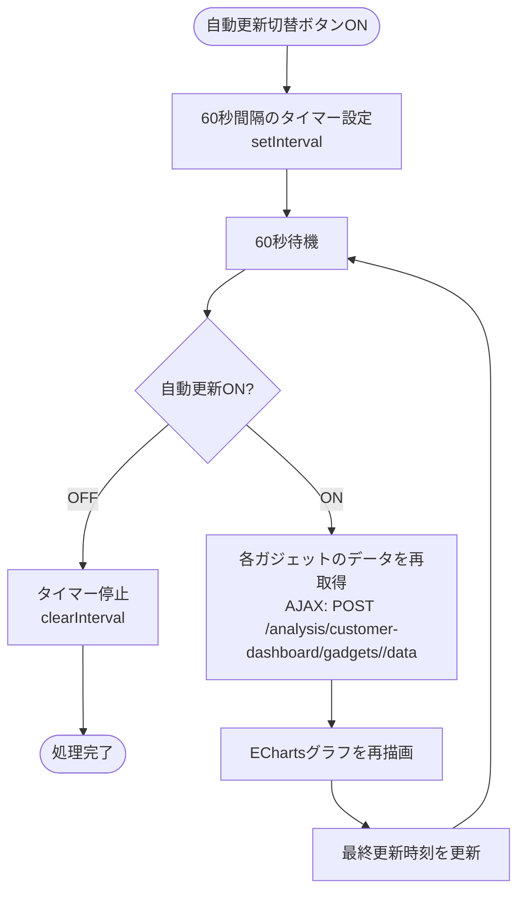

#### 処理詳細

自動更新はクライアントサイドの処理です。60秒間隔で各ガジェットに対して [ガジェットデータ取得](#ガジェットデータ取得) のAJAXリクエストを実行します。

---

### データソース選択

**トリガー:** (3.1) 組織選択変更 / (3.2) デバイス選択変更

**前提条件:**
- ダッシュボード画面が表示されている

#### 処理フロー


#### 処理詳細

データソース選択はクライアントサイドとサーバーサイドの連携処理です。データソース選択フォームはグローバルフィルタとして機能し、ガジェットの `data_source_config` 自体は変更せず、Unity Catalogからデータ取得する際のWHERE句パラメータを動的に変更します。

**組織選択変更時:**
- 選択された組織に紐づくデバイス一覧を取得
- デバイス選択の選択肢を更新
- デバイス選択を活性化
- データソースが「組織」のガジェットは、選択された組織がデータソースになる（WHERE句の `organization_id` が変更）

**デバイス選択変更時:**
- データソースが「デバイス」のガジェットは、選択されたデバイスがデータソースになる（WHERE句の `device_id` が変更）
- 各ガジェットのデータを再取得

**組織・デバイスが未選択の場合:**
- ガジェットにデータが表示されない（ガジェットの枠とタイトルのみ表示）

**選択状態の永続化:**
- ユーザーの選択状態は `dashboard_user_setting.organization_id` と `dashboard_user_setting.device_id` に保存する

**ユーザー設定保存SQL:**
```sql
UPDATE dashboard_user_setting
SET
  organization_id = :organization_id,
  device_id = :device_id,
  update_date = NOW(),
  modifier = :current_user_id
WHERE
  user_id = :current_user_id
  AND delete_flag = FALSE
```

**デバイス一覧取得SQL:**
```sql
SELECT
  device_id,
  device_name
FROM
  device_master
WHERE
  organization_id = :organization_id
  AND delete_flag = FALSE
ORDER BY
  device_id ASC
```

**Flaskルート実装例（No.26 デバイス一覧取得）:**

```python
@customer_dashboard_bp.route('/analysis/customer-dashboard/organizations/<int:org_id>/devices', methods=['GET'])
@require_auth
def get_devices(org_id):
    """デバイス一覧取得（AJAX）"""
    try:
        devices = get_devices_by_organization(db, org_id)
        return jsonify({
            'devices': [
                {'device_id': d.device_id, 'device_name': d.device_name}
                for d in devices
            ]
        })
    except Exception as e:
        logger.error(f'デバイス一覧取得エラー: {str(e)}')
        return jsonify({'error': 'デバイス一覧の取得に失敗しました'}), 500
```

**Flaskルート実装例（No.27 データソース設定保存）:**

```python
@customer_dashboard_bp.route('/analysis/customer-dashboard/datasource/save', methods=['POST'])
@require_auth
def datasource_save():
    """データソース設定保存（AJAX）"""
    try:
        data = request.get_json()
        organization_id = data.get('organization_id')  # 未選択の場合は None（NULLとして保存）
        device_id = data.get('device_id')              # 未選択の場合は None（NULLとして保存）
        current_user_id = session.get('user_id')
        update_datasource_setting(db, current_user_id, organization_id, device_id, current_user_id)
        db.session.commit()
        return jsonify({'status': 'ok'})
    except Exception as e:
        db.session.rollback()
        logger.error(f'データソース設定保存エラー: {str(e)}')
        return jsonify({'error': 'データソース設定の保存に失敗しました'}), 500
```

**`update_datasource_setting` サービス関数（実装時の注意）:**

```python
def update_datasource_setting(db, user_id, organization_id, device_id, modifier):
    # organization_id / device_id は None のまま渡す（未選択はNULLで保持）
    # UPDATE処理...
```

---

### CSVエクスポート

詳細はガジェット個別仕様書の`CSVエクスポート`を参照してください。

- **棒グラフ:** [棒グラフ-ワークフロー仕様書](../bar-chart/workflow-specification.md)
- **円グラフ:** [円グラフ-ワークフロー仕様書](../circle/workflow-specification.md)
- **帯グラフ:** [帯グラフ-ワークフロー仕様書](../belt-chart/workflow-specification.md)
- **時系列グラフ:** [時系列グラフ-ワークフロー仕様書](../timeline/workflow-specification.md)
- **表:** [表-ワークフロー仕様書](../grid/workflow-specification.md)

---

### 展開・縮小操作

**トリガー:** (6.1) 展開縮小ボタンクリック

**前提条件:** なし

#### 処理詳細

展開・縮小はクライアントサイドのみの処理です。サーバーサイドへのリクエストは発生しません。

- ダッシュボードグループヘッダーの展開縮小ボタンクリック: 該当グループ内のガジェットの表示/非表示を切り替え

---

## 使用データベース詳細

### 使用テーブル一覧

| No | テーブル名 | 論理名 | データソース | 操作種別 | ワークフロー | 目的 |
|----|-----------|--------|-------------|---------|------------|------|
| 1 | dashboard_master | ダッシュボードマスタ | OLTP DB | SELECT/INSERT/UPDATE | ダッシュボード管理 | ダッシュボード情報の取得・登録・更新・論理削除 |
| 2 | dashboard_group_master | ダッシュボードグループマスタ | OLTP DB | SELECT/INSERT/UPDATE | グループ管理 | グループ情報の取得・登録・更新・論理削除 |
| 3 | dashboard_gadget_master | ダッシュボードガジェットマスタ | OLTP DB | SELECT/INSERT/UPDATE | ガジェット管理、レイアウト保存 | ガジェット情報の取得・登録・更新・論理削除、レイアウト情報保存 |
| 4 | gadget_type_master | ガジェット種別マスタ | OLTP DB | SELECT | ガジェット追加 | ガジェット種別の選択肢取得 |
| 5 | dashboard_user_setting | ダッシュボードユーザー設定 | OLTP DB | SELECT/INSERT/UPDATE | 初期表示、表示切替 | ユーザー固有設定の管理 |
| 6 | organization_master | 組織マスタ | OLTP DB | SELECT | 初期表示、データソース選択 | 組織選択肢取得 |
| 7 | organization_closure | 組織閉包テーブル | OLTP DB | SELECT | 全ワークフロー | データスコープ制限 |
| 8 | device_master | デバイスマスタ | OLTP DB | SELECT | データソース選択 | デバイス選択肢取得 |
| 9 | sensor_data_view | センサーデータビュー | Unity Catalog | SELECT | ガジェットデータ取得、CSVエクスポート | グラフ表示用データ取得 |

---

## トランザクション管理

**トランザクション開始条件:**
- データベースへの書き込み操作（INSERT/UPDATE）がある場合
- フォームバリデーションが完了している場合
- 認証・認可チェックが完了している場合

**トランザクションコミット条件:**
- すべてのデータベース操作が正常に完了した場合

**トランザクションロールバック条件:**
- いずれかのデータベース操作が失敗した場合

**トランザクション管理が必要なワークフロー:**

| ワークフロー | 操作テーブル | トランザクション要否 | 備考 |
|------------|------------|-------------------|------|
| ダッシュボード登録 | dashboard_master, dashboard_user_setting | 必要 | 2テーブルへの書き込み |
| ダッシュボード削除 | dashboard_gadget_master, dashboard_group_master, dashboard_master, dashboard_user_setting | 必要 | 4テーブルへの書き込み（カスケード削除） |
| ダッシュボードグループ削除 | dashboard_gadget_master, dashboard_group_master | 必要 | 2テーブルへの書き込み（カスケード削除） |
| レイアウト保存 | dashboard_gadget_master | 必要 | 複数レコードへの一括更新 |
| データソース設定保存 | dashboard_user_setting | 必要 | 1レコードへの更新 |

**読み取り専用ワークフロー（トランザクション不要）:**
- ダッシュボード初期表示
- ダッシュボード管理モーダル表示
- ガジェット追加モーダル表示
- ガジェットデータ取得
- CSVエクスポート
- デバイス一覧取得

---

## セキュリティ実装

### 認証・認可実装

**認証方式:**
- Databricksリバースプロキシヘッダ認証（`X-Forwarded-User`）

**認可ロジック:**

組織階層に基づいて、ユーザーがアクセスできるデータを制限します。

**処理内容:**
- **全ユーザー共通**: 組織階層（`organization_closure`）でフィルタ
  - ユーザーの `organization_id` を親組織IDとして検索
  - 下位組織リスト（`subsidiary_organization_id`）を取得
  - そのリストに該当する組織のダッシュボード・ガジェットデータのみアクセス可能
  - **ロールによる条件分岐は一切行わない**

**注**: システム保守者・管理者が全データにアクセスできるのは、ルート組織（すべての組織を子組織に持つ）に所属しているため

**実装例:**
```python
def apply_dashboard_data_scope_filter(query, current_user):
    """組織階層に基づいたダッシュボードデータのスコープ制限を適用"""
    accessible_org_ids = db.session.query(
        OrganizationClosure.subsidiary_organization_id
    ).filter(
        OrganizationClosure.parent_organization_id == current_user.organization_id
    ).all()

    org_ids = [org_id[0] for org_id in accessible_org_ids]

    if not org_ids:
        return query.filter(DashboardMaster.organization_id.in_([]))

    return query.filter(DashboardMaster.organization_id.in_(org_ids))
```

### ログ出力ルール

**出力する情報:**
- リクエストID
- ユーザーID（操作者）
- 操作種別（ダッシュボード登録、更新、削除、ガジェット登録、レイアウト保存等）
- 対象リソースID（dashboard_id、group_id、gadget_id）
- 処理結果（成功/失敗）
- エラー種別（バリデーションエラー、DBエラー等）
- タイムスタンプ（UTC）

**出力しない情報（機密情報）:**
- 認証トークン
- センサーデータの具体値

**実装例:**
```python
import logging

logger = logging.getLogger(__name__)

@customer_dashboard_bp.route('/analysis/customer-dashboard/dashboards/register', methods=['POST'])
@require_auth
def dashboard_register():
    logger.info(f'ダッシュボード登録開始: user_id={g.current_user.user_id}')

    try:
        # ... 処理 ...
        logger.info(f'ダッシュボード登録成功: dashboard_id={dashboard.dashboard_id}')
        return response
    except Exception as e:
        logger.error(f'ダッシュボード登録エラー: error={str(e)}')
        abort(500)
```

---

## 関連ドキュメント

### 画面仕様
- [機能概要 README](./README.md) - 画面の概要、アーキテクチャ
- [UI仕様書](./ui-specification.md) - UI要素の詳細、バリデーションルール

### アーキテクチャ設計
- [バックエンド設計](../../../01-architecture/backend.md) - Flask/LDP設計、Blueprint構成
- [フロントエンド設計](../../../01-architecture/frontend.md) - Flask + Jinja2設計

### 共通仕様
- [共通仕様書](../../common/common-specification.md) - HTTPステータスコード、エラーコード等
- [UI共通仕様書](../../common/ui-common-specification.md) - すべての画面に共通するUI仕様

### 要件定義
- [機能要件定義書](../../../02-requirements/functional-requirements.md) - FR-006
- [非機能要件定義書](../../../02-requirements/non-functional-requirements.md) - パフォーマンス、セキュリティ要件
- [技術要件定義書](../../../02-requirements/technical-requirements.md) - 技術スタック、実装方針

---

**このワークフロー仕様書は、実装前に必ずレビューを受けてください。**
