# 顧客作成ダッシュボード画面 - ワークフロー仕様書

## 📑 目次

- [顧客作成ダッシュボード画面 - ワークフロー仕様書](#顧客作成ダッシュボード画面---ワークフロー仕様書)
  - [📑 目次](#-目次)
  - [概要](#概要)
  - [使用するFlaskルート一覧](#使用するflaskルート一覧)
  - [ルート呼び出しマッピング](#ルート呼び出しマッピング)
    - [顧客作成ダッシュボード表示画面](#顧客作成ダッシュボード表示画面)
    - [ダッシュボード管理モーダル](#ダッシュボード管理モーダル)
    - [ガジェット追加モーダル](#ガジェット追加モーダル)
    - [登録・更新モーダル](#登録更新モーダル)
    - [削除確認モーダル](#削除確認モーダル)
  - [ワークフロー一覧](#ワークフロー一覧)
    - [ダッシュボード初期表示](#ダッシュボード初期表示)
      - [処理フロー](#処理フロー)
      - [Flaskルート](#flaskルート)
      - [バリデーション](#バリデーション)
      - [処理詳細（サーバーサイド）](#処理詳細サーバーサイド)
      - [表示メッセージ](#表示メッセージ)
      - [エラーハンドリング](#エラーハンドリング)
      - [ログ出力タイミング](#ログ出力タイミング)
      - [UI状態](#ui状態)
    - [ダッシュボード管理モーダル表示](#ダッシュボード管理モーダル表示)
      - [処理フロー](#処理フロー-1)
      - [Flaskルート](#flaskルート-1)
      - [処理詳細（サーバーサイド）](#処理詳細サーバーサイド-1)
      - [表示メッセージ](#表示メッセージ-1)
      - [エラーハンドリング](#エラーハンドリング-1)
      - [ログ出力タイミング](#ログ出力タイミング-1)
      - [UI状態](#ui状態-1)
    - [ダッシュボード登録](#ダッシュボード登録)
      - [処理フロー](#処理フロー-2)
      - [Flaskルート](#flaskルート-2)
      - [バリデーション](#バリデーション-1)
      - [処理詳細（サーバーサイド）](#処理詳細サーバーサイド-2)
      - [表示メッセージ](#表示メッセージ-2)
      - [エラーハンドリング](#エラーハンドリング-2)
      - [ログ出力タイミング](#ログ出力タイミング-2)
    - [ダッシュボード表示切替](#ダッシュボード表示切替)
      - [処理フロー](#処理フロー-3)
      - [処理詳細（サーバーサイド）](#処理詳細サーバーサイド-3)
      - [エラーハンドリング](#エラーハンドリング-3)
      - [ログ出力タイミング](#ログ出力タイミング-3)
    - [ダッシュボードタイトル更新](#ダッシュボードタイトル更新)
      - [処理フロー](#処理フロー-4)
      - [バリデーション](#バリデーション-2)
      - [処理詳細（サーバーサイド）](#処理詳細サーバーサイド-4)
      - [表示メッセージ](#表示メッセージ-3)
      - [エラーハンドリング](#エラーハンドリング-4)
      - [ログ出力タイミング](#ログ出力タイミング-4)
    - [ダッシュボード削除](#ダッシュボード削除)
      - [処理フロー](#処理フロー-5)
      - [処理詳細（サーバーサイド）](#処理詳細サーバーサイド-5)
      - [表示メッセージ](#表示メッセージ-4)
      - [エラーハンドリング](#エラーハンドリング-5)
      - [ログ出力タイミング](#ログ出力タイミング-5)
    - [ダッシュボードグループ登録](#ダッシュボードグループ登録)
      - [処理フロー](#処理フロー-6)
      - [バリデーション](#バリデーション-3)
      - [処理詳細（サーバーサイド）](#処理詳細サーバーサイド-6)
      - [表示メッセージ](#表示メッセージ-5)
      - [エラーハンドリング](#エラーハンドリング-6)
      - [ログ出力タイミング](#ログ出力タイミング-6)
    - [ダッシュボードグループタイトル更新](#ダッシュボードグループタイトル更新)
      - [処理フロー](#処理フロー-7)
      - [バリデーション](#バリデーション-4)
      - [処理詳細（サーバーサイド）](#処理詳細サーバーサイド-7)
      - [表示メッセージ](#表示メッセージ-6)
      - [エラーハンドリング](#エラーハンドリング-7)
      - [ログ出力タイミング](#ログ出力タイミング-7)
    - [ダッシュボードグループ削除](#ダッシュボードグループ削除)
      - [処理フロー](#処理フロー-8)
      - [処理詳細（サーバーサイド）](#処理詳細サーバーサイド-8)
      - [表示メッセージ](#表示メッセージ-7)
      - [エラーハンドリング](#エラーハンドリング-8)
      - [ログ出力タイミング](#ログ出力タイミング-8)
    - [ガジェット追加モーダル表示](#ガジェット追加モーダル表示)
      - [処理フロー](#処理フロー-9)
      - [処理詳細（サーバーサイド）](#処理詳細サーバーサイド-9)
      - [表示メッセージ](#表示メッセージ-8)
      - [エラーハンドリング](#エラーハンドリング-9)
      - [ログ出力タイミング](#ログ出力タイミング-9)
    - [ガジェット登録モーダル表示](#ガジェット登録モーダル表示)
      - [処理フロー](#処理フロー-10)
      - [処理詳細（サーバーサイド）](#処理詳細サーバーサイド-10)
    - [ガジェット登録](#ガジェット登録)
      - [処理フロー](#処理フロー-11)
      - [処理詳細（サーバーサイド）](#処理詳細サーバーサイド-11)
    - [ガジェットタイトル更新](#ガジェットタイトル更新)
      - [処理フロー](#処理フロー-12)
      - [バリデーション](#バリデーション-5)
      - [処理詳細（サーバーサイド）](#処理詳細サーバーサイド-12)
      - [表示メッセージ](#表示メッセージ-9)
      - [エラーハンドリング](#エラーハンドリング-10)
      - [ログ出力タイミング](#ログ出力タイミング-10)
    - [ガジェット削除](#ガジェット削除)
      - [処理フロー](#処理フロー-13)
      - [処理詳細（サーバーサイド）](#処理詳細サーバーサイド-13)
      - [表示メッセージ](#表示メッセージ-10)
      - [エラーハンドリング](#エラーハンドリング-11)
      - [ログ出力タイミング](#ログ出力タイミング-11)
    - [ガジェットデータ取得](#ガジェットデータ取得)
    - [レイアウト保存](#レイアウト保存)
      - [処理フロー](#処理フロー-14)
      - [処理詳細（サーバーサイド）](#処理詳細サーバーサイド-14)
      - [表示メッセージ](#表示メッセージ-11)
      - [エラーハンドリング](#エラーハンドリング-12)
      - [ログ出力タイミング](#ログ出力タイミング-12)
    - [日時設定ボタン](#日時設定ボタン)
      - [処理フロー](#処理フロー-15)
      - [処理詳細](#処理詳細)
      - [エラーハンドリング](#エラーハンドリング-13)
    - [日時初期化](#日時初期化)
      - [処理フロー](#処理フロー-16)
      - [処理詳細](#処理詳細-1)
    - [自動更新](#自動更新)
      - [処理フロー](#処理フロー-17)
      - [処理詳細](#処理詳細-2)
    - [データソース選択](#データソース選択)
      - [処理フロー](#処理フロー-18)
      - [処理詳細](#処理詳細-3)
    - [CSVエクスポート](#csvエクスポート)
    - [展開・縮小操作](#展開縮小操作)
      - [処理詳細](#処理詳細-4)
  - [使用データベース詳細](#使用データベース詳細)
    - [使用テーブル一覧](#使用テーブル一覧)
  - [トランザクション管理](#トランザクション管理)
  - [セキュリティ実装](#セキュリティ実装)
    - [認証・認可実装](#認証認可実装)
    - [ログ出力ルール](#ログ出力ルール)
  - [関連ドキュメント](#関連ドキュメント)
    - [画面仕様](#画面仕様)
    - [アーキテクチャ設計](#アーキテクチャ設計)
    - [共通仕様](#共通仕様)
    - [要件定義](#要件定義)

---

## 概要

このドキュメントは、顧客作成ダッシュボード画面のユーザー操作に対する処理フロー、データベース処理、エラーハンドリングの詳細を記載します。

**このドキュメントの役割:**
- ✅ ユーザー操作のトリガー条件
- ✅ 処理フローの詳細（Flaskルート呼び出し、フォーム送信、AJAX通信）
- ✅ エラーハンドリングフロー
- ✅ サーバーサイド処理詳細（SQL、変数、条件分岐、コード例）
- ✅ データベース利用詳細（トランザクション管理、テーブル操作）
- ✅ セキュリティ実装詳細（認証、データスコープ制限、ログ出力）
- ✅ クライアントサイド処理詳細（AJAX、ドラッグ＆ドロップ、自動更新）

**UI仕様書との役割分担:**
- **UI仕様書**: 画面レイアウト、UI要素の詳細仕様
- **ワークフロー仕様書**: 処理フロー、データベース処理、エラーハンドリング、サーバーサイド実装詳細

**注:** UI要素の詳細は [UI仕様書](./ui-specification.md) を参照してください。

---

## 使用するFlaskルート一覧

この画面で使用するすべてのFlaskルート（エンドポイント）を記載します。

| No | ルート名 | エンドポイント | メソッド | 用途 | レスポンス形式 | 備考 |
|----|---------|---------------|---------|------|---------------|------|
| 1 | 顧客作成ダッシュボード表示 | `/analysis/customer-dashboard` | GET | 顧客作成ダッシュボード画面の初期表示 | HTML | - |
| 2 | ダッシュボード管理画面 | `/analysis/customer-dashboard/dashboards` | GET | ダッシュボード管理モーダル表示 | HTML（モーダル） | - |
| 3 | ダッシュボード登録画面 | `/analysis/customer-dashboard/dashboards/create` | GET | ダッシュボード登録モーダル表示 | HTML（モーダル） | - |
| 4 | ダッシュボード登録実行 | `/analysis/customer-dashboard/dashboards/register` | POST | ダッシュボード登録処理 | JSON (AJAX) | - |
| 5 | ダッシュボードタイトル更新画面 | `/analysis/customer-dashboard/dashboards/<dashboard_uuid>/edit` | GET | ダッシュボードタイトル更新モーダル表示 | HTML（モーダル） | - |
| 6 | ダッシュボードタイトル更新実行 | `/analysis/customer-dashboard/dashboards/<dashboard_uuid>/update` | POST | ダッシュボードタイトル更新処理 | JSON (AJAX) | - |
| 7 | ダッシュボード削除確認画面 | `/analysis/customer-dashboard/dashboards/<dashboard_uuid>/delete` | GET | ダッシュボード削除確認モーダル表示 | HTML（モーダル） | - |
| 8 | ダッシュボード削除実行 | `/analysis/customer-dashboard/dashboards/<dashboard_uuid>/delete` | POST | ダッシュボード削除処理 | JSON (AJAX) | - |
| 9 | ダッシュボード表示切替 | `/analysis/customer-dashboard/dashboards/<dashboard_uuid>/switch` | POST | 表示するダッシュボードの切替 | リダイレクト (302) | 成功時: `/analysis/customer-dashboard` |
| 10 | ダッシュボードグループ登録画面 | `/analysis/customer-dashboard/groups/create` | GET | ダッシュボードグループ登録モーダル表示 | HTML（モーダル） | - |
| 11 | ダッシュボードグループ登録実行 | `/analysis/customer-dashboard/groups/register` | POST | ダッシュボードグループ登録処理 | JSON (AJAX) | - |
| 12 | ダッシュボードグループタイトル更新画面 | `/analysis/customer-dashboard/groups/<dashboard_group_uuid>/edit` | GET | ダッシュボードグループタイトル更新モーダル表示 | HTML（モーダル） | - |
| 13 | ダッシュボードグループタイトル更新実行 | `/analysis/customer-dashboard/groups/<dashboard_group_uuid>/update` | POST | ダッシュボードグループタイトル更新処理 | JSON (AJAX) | - |
| 14 | ダッシュボードグループ削除確認画面 | `/analysis/customer-dashboard/groups/<dashboard_group_uuid>/delete` | GET | ダッシュボードグループ削除確認モーダル表示 | HTML（モーダル） | - |
| 15 | ダッシュボードグループ削除実行 | `/analysis/customer-dashboard/groups/<dashboard_group_uuid>/delete` | POST | ダッシュボードグループ削除処理 | JSON (AJAX) | - |
| 16 | ガジェット追加画面 | `/analysis/customer-dashboard/gadgets/add` | GET | ガジェット追加モーダル表示 | HTML（モーダル） | - |
| 17 | ガジェット登録画面 | `/analysis/customer-dashboard/gadgets/{gadget_type}/create` | GET | ガジェット登録モーダル表示 | HTML（モーダル） | `{gadget_type}` は `_GADGET_REGISTRY` の `slug` 値（例: `timeline`, `bar-chart`）。`common.py` の共通ルートがガジェット種別ごとのハンドラーにディスパッチする |
| 18 | ガジェット登録実行 | `/analysis/customer-dashboard/gadgets/{gadget_type}/register` | POST | ガジェット登録処理 | JSON (AJAX) | `{gadget_type}` は `_GADGET_REGISTRY` の `slug` 値。`common.py` の共通ルートがディスパッチする |
| 19 | ガジェットタイトル更新画面 | `/analysis/customer-dashboard/gadgets/<gadget_uuid>/edit` | GET | ガジェットタイトル更新モーダル表示 | HTML（モーダル） | - |
| 20 | ガジェットタイトル更新実行 | `/analysis/customer-dashboard/gadgets/<gadget_uuid>/update` | POST | ガジェットタイトル更新処理 | JSON (AJAX) | - |
| 21 | ガジェット削除確認画面 | `/analysis/customer-dashboard/gadgets/<gadget_uuid>/delete` | GET | ガジェット削除確認モーダル表示 | HTML（モーダル） | - |
| 22 | ガジェット削除実行 | `/analysis/customer-dashboard/gadgets/<gadget_uuid>/delete` | POST | ガジェット削除処理 | JSON (AJAX) | - |
| 23 | ガジェットデータ取得 | `/analysis/customer-dashboard/gadgets/<gadget_uuid>/data` | POST | ガジェットのグラフ表示用データ取得 | JSON (AJAX) | 非同期通信 |
| 24 | レイアウト保存 | `/analysis/customer-dashboard/layout/save` | POST | ガジェットのレイアウト設定保存 | JSON (AJAX) | 非同期通信 |
| 25 | CSVエクスポート | `/analysis/customer-dashboard/gadgets/<gadget_uuid>?export=csv` | GET | ガジェットのグラフデータをCSVファイルとしてダウンロード | CSV | - |
| 26 | デバイス一覧取得 | `/analysis/customer-dashboard/organizations/<org_id>/devices` | GET | 組織選択変更時のデバイス選択肢取得 | JSON (AJAX) | 非同期通信 |
| 27 | データソース設定保存 | `/analysis/customer-dashboard/datasource/save` | POST | データソース選択状態を `dashboard_user_setting` に永続化 | JSON (AJAX) | 非同期通信 |

**注:**
- **レスポンス形式**:
  - `HTML`: Jinja2テンプレートをレンダリングして返す（`render_template()`）
  - `HTML（モーダル）`: モーダルダイアログ用のHTMLフラグメントを返す
  - `リダイレクト (302)`: 処理成功後に `/analysis/customer-dashboard` へリダイレクト
  - `JSON (AJAX)`: JavaScriptからの非同期リクエストに対してJSONレスポンスを返す
  - `CSV`: CSVファイルをダウンロードレスポンスとして返す
- **Flask Blueprint構成**: `customer_dashboard_bp` として実装

---

## ルート呼び出しマッピング

### 顧客作成ダッシュボード表示画面

| ユーザー操作 | トリガー | 呼び出すルート | パラメータ | レスポンス | エラー時の挙動 |
|-------------|---------|-------------|-----------|-----------|---------------|
| 画面初期表示 | URL直接アクセス | `GET /analysis/customer-dashboard` | なし | HTML（顧客作成ダッシュボード画面） | エラーページ表示 |
| ダッシュボード管理ボタン押下 | ボタンクリック | `GET /analysis/customer-dashboard/dashboards` | なし | HTML（モーダル） | エラーページ表示 |
| 日時設定ボタン押下（今日/昨日/今週/今月/今年） | ボタンクリック | `POST /analysis/customer-dashboard/gadgets/<gadget_uuid>/data` | `gadget_uuid`（各ガジェット） | JSON | エラートースト表示 |
| カスタムボタン押下（適用） | ボタンクリック | `POST /analysis/customer-dashboard/gadgets/<gadget_uuid>/data` | `gadget_uuid`（各ガジェット） | JSON | エラートースト表示 |
| 日時初期化ボタン押下 | ボタンクリック | `POST /analysis/customer-dashboard/gadgets/<gadget_uuid>/data` | `gadget_uuid`（各ガジェット） | JSON | エラートースト表示 |
| 自動更新ON | チェックボックス変更 | `POST /analysis/customer-dashboard/gadgets/<gadget_uuid>/data` | `gadget_uuid`（各ガジェット） | JSON | エラートースト表示 |
| 組織選択変更 | セレクト変更 | `GET /analysis/customer-dashboard/organizations/<org_id>/devices` | `org_id` | JSON（デバイス一覧） | エラートースト表示 |
| デバイス選択変更 | セレクト変更 | `POST /analysis/customer-dashboard/datasource/save` | `organization_id`, `device_id`（JSON） | JSON | エラートースト表示 |
| 編集モード切替 | トグル変更 | なし（クライアントサイド処理） | - | - | - |
| レイアウト保存ボタン押下 | ボタンクリック | `POST /analysis/customer-dashboard/layout/save` | レイアウト情報（JSON） | JSON | エラートースト表示 |
| CSVエクスポートボタン押下 | ボタンクリック | `GET /analysis/customer-dashboard/gadgets/<gadget_uuid>?export=csv` | `gadget_uuid` | CSVダウンロード | エラートースト表示 |

### ダッシュボード管理モーダル

| ユーザー操作 | トリガー | 呼び出すルート | パラメータ | レスポンス | エラー時の挙動 |
|-------------|---------|-------------|-----------|-----------|---------------|
| 登録ボタン押下 | ボタンクリック | `GET /analysis/customer-dashboard/dashboards/create` | なし | HTML（モーダル） | エラートースト表示 |
| 削除ボタン押下 | ボタンクリック | `GET /analysis/customer-dashboard/dashboards/<dashboard_uuid>/delete` | `dashboard_uuid` | HTML（モーダル） | エラートースト表示 |
| 変更ボタン押下 | ボタンクリック | `POST /analysis/customer-dashboard/dashboards/<dashboard_uuid>/switch` | `dashboard_uuid` | リダイレクト | エラートースト表示 |
| キャンセルボタン押下 | ボタンクリック | なし（モーダルを閉じる） | - | - | - |

### ガジェット追加モーダル

| ユーザー操作 | トリガー | 呼び出すルート | パラメータ | レスポンス | エラー時の挙動 |
|-------------|---------|-------------|-----------|-----------|---------------|
| 登録画面ボタン押下 | ボタンクリック | `GET /analysis/customer-dashboard/gadgets/{gadget_type}/create` | なし | HTML（モーダル） | エラートースト表示（`{gadget_type}` は `gadget_type_master.gadget_type_slug` の値（例: `timeline`, `bar-chart`）を使用。DBから取得した `gadget_type_slug` を直接 URL に使用） |
| キャンセルボタン押下 | ボタンクリック | なし（モーダルを閉じる） | - | - | - |

### 登録・更新モーダル

| ユーザー操作 | トリガー | 呼び出すルート | パラメータ | レスポンス | エラー時の挙動 |
|-------------|---------|-------------|-----------|-----------|---------------|
| ダッシュボード登録実行 | フォーム送信 | `POST /analysis/customer-dashboard/dashboards/register` | `dashboard_name` | JSON (AJAX) | フォーム再表示 |
| ダッシュボードタイトル更新実行 | フォーム送信 | `POST /analysis/customer-dashboard/dashboards/<dashboard_uuid>/update` | `dashboard_name` | JSON (AJAX) | フォーム再表示 |
| ダッシュボードグループ登録実行 | フォーム送信 | `POST /analysis/customer-dashboard/groups/register` | `dashboard_group_name` | JSON (AJAX) | フォーム再表示 |
| ダッシュボードグループタイトル更新実行 | フォーム送信 | `POST /analysis/customer-dashboard/groups/<dashboard_group_uuid>/update` | `dashboard_group_name` | JSON (AJAX) | フォーム再表示 |
| ガジェットタイトル更新実行 | フォーム送信 | `POST /analysis/customer-dashboard/gadgets/<gadget_uuid>/update` | `gadget_name` | JSON (AJAX) | フォーム再表示 |
| キャンセルボタン押下 | ボタンクリック | なし（モーダルを閉じる） | - | - | - |

### 削除確認モーダル

| ユーザー操作 | トリガー | 呼び出すルート | パラメータ | レスポンス | エラー時の挙動 |
|-------------|---------|-------------|-----------|-----------|---------------|
| ダッシュボード削除実行 | ボタンクリック | `POST /analysis/customer-dashboard/dashboards/<dashboard_uuid>/delete` | `dashboard_uuid` | JSON (AJAX) | エラートースト表示 |
| ダッシュボードグループ削除実行 | ボタンクリック | `POST /analysis/customer-dashboard/groups/<dashboard_group_uuid>/delete` | `dashboard_group_uuid` | JSON (AJAX) | エラートースト表示 |
| ガジェット削除実行 | ボタンクリック | `POST /analysis/customer-dashboard/gadgets/<gadget_uuid>/delete` | `gadget_uuid` | JSON (AJAX) | エラートースト表示 |
| キャンセルボタン押下 | ボタンクリック | なし（モーダルを閉じる） | - | - | - |

---

## ワークフロー一覧

### ダッシュボード初期表示

**トリガー:** URL直接アクセス時（ユーザーが画面にアクセスしたとき）

**前提条件:**
- ユーザーがログイン済み（Databricks認証完了）
- 適切な権限を持っている（システム保守者、管理者、販社ユーザ、サービス利用者）

#### 処理フロー

```mermaid
flowchart TD
    Start([GET /analysis/customer-dashboard]) --> Auth[認証チェック<br>Databricksリバースプロキシヘッダ確認]
    Auth --> CheckAuth{認証済み?}
    CheckAuth -->|未認証| LoginRedirect[ログイン画面へリダイレクト]
    CheckAuth -->|認証OK| UserSetting[ダッシュボードユーザー設定取得<br>DB dashboard_user_setting]

    UserSetting --> CheckUserSetting{ユーザー設定あり?}
    CheckUserSetting -->|あり| GetDashboard[選択中ダッシュボードID取得]
    CheckUserSetting -->|なし| GetFirstDashboard[先頭ダッシュボード取得<br>dashboard_id昇順の最初]

    GetFirstDashboard --> CheckAutoRegist{ユーザー設定未登録 かつ<br>先頭ダッシュボードあり?}
    CheckAutoRegist -->|はい| UpsertUserSetting[ユーザー設定を自動登録<br>DB dashboard_user_setting UPSERT]
    CheckAutoRegist -->|いいえ| DashboardQuery[ダッシュボード情報取得<br>DB dashboard_master]

    UpsertUserSetting --> DashboardQuery
    GetDashboard --> DashboardQuery

    DashboardQuery --> CheckDashboard{ダッシュボードあり?}
    CheckDashboard -->|なし| RenderEmpty[空のダッシュボード画面を表示]
    CheckDashboard -->|あり| GroupQuery[ダッシュボードグループ一覧取得<br>DB dashboard_group_master]

    GroupQuery --> CheckGroupQuery{DBクエリ結果}
    CheckGroupQuery -->|成功| GadgetQuery[ガジェット一覧取得<br>DB dashboard_gadget_master]
    CheckGroupQuery -->|失敗| Error500[500エラーページ表示]

    GadgetQuery --> CheckGadgetQuery{DBクエリ結果}
    CheckGadgetQuery -->|成功| OrgQuery[組織選択肢取得<br>DB organization_master]
    CheckGadgetQuery -->|失敗| Error500
    
    OrgQuery --> CheckOrgQuery{DBクエリ結果}
    CheckOrgQuery -->|成功| CheckSelectOrgId{選択中の組織IDあり？<br>ユーザー設定参照}
    CheckOrgQuery -->|失敗| Error500

    CheckSelectOrgId -->|なし| DeviceNameQuery[固定モードガジェットのデバイス名取得]
    CheckSelectOrgId -->|あり| DeviceQuery[デバイス選択肢取得<br>DB device_master]
    
    DeviceQuery --> CheckDeviceQuery{DBクエリ結果}
    CheckDeviceQuery -->|成功| SetOrgId[組織選択に組織IDを設定]
    CheckDeviceQuery -->|失敗| Error500

    SetOrgId --> CheckSelectDeviceId{選択中のデバイスIDあり？<br>ユーザー設定参照}
    CheckSelectDeviceId -->|なし| DeviceNameQuery
    CheckSelectDeviceId -->|あり| SetDeviceId[デバイス選択にデバイスIDを設定]

    SetDeviceId --> DeviceNameQuery
    DeviceNameQuery --> CheckDeviceNameQuery{DBクエリ結果}
    CheckDeviceNameQuery -->|成功| Template[Jinja2テンプレートレンダリング<br>render_template<br>customer_dashboard/index.html]
    CheckDeviceNameQuery -->|失敗| Error500

    Template --> CheckCreator{ログインユーザーが<br>ダッシュボードの作成者?}
    CheckCreator -->|作成者| Response[HTMLレスポンス返却]
    CheckCreator -->|作成者以外| HiddenButton[編集モード切替ボタン<br>レイアウト保存ボタン<br>各種設定ボタン<br>非表示]
    HiddenButton --> Response

    RenderEmpty --> Response

    LoginRedirect --> End([処理完了])
    Response --> End
    Error500 --> End
```

#### Flaskルート

| ルート | エンドポイント | 詳細 |
|-------|---------------|------|
| 顧客作成ダッシュボード表示 | `GET /analysis/customer-dashboard` | クエリパラメータ: なし |

#### バリデーション

**実行タイミング:** なし

**データスコープ制限:**
- ダッシュボードスコープ制限（全ユーザー共通）:
  - ユーザーの所属組織に属するダッシュボードのみアクセス可能（v_dashboard_master_by_user による制御）
  - 下位組織のダッシュボードはアクセス不可
- 組織選択肢スコープ制限:
  - v_organization_master_by_user による制御

#### 処理詳細（サーバーサイド）

**① 認証・認可チェック**

リバースプロキシヘッダから認証情報を取得し、権限を確認します。

**処理内容:**
- ヘッダ `X-Forwarded-User` からメールアドレスを取得
- データベースから現在ユーザー情報を取得（ユーザーID、ユーザー種別ID）

**変数・パラメータ:**
- `email`: string - リバースプロキシヘッダから取得したメールアドレス
- `user_id`: int - データベースから取得したユーザーID
- `user_type_id`: int - データベースから取得したユーザー種別ID

**② データスコープ制限の適用**

view にログインユーザーの `user_id` を渡すことで、アクセス可能な組織配下のデータに自動的に絞り込まれます。

詳細な実装仕様は[認証・認可実装](#認証認可実装)を参照してください。

**③ ダッシュボードユーザー設定取得**

ダッシュボードユーザー設定テーブルから、現在ユーザーが選択中のダッシュボードIDを取得します。
ユーザー設定が未登録かつアクセス可能なダッシュボードがある場合は先頭を自動登録します。

**使用テーブル:** dashboard_user_setting

**SQL詳細:**
```sql
SELECT
  dashboard_id,
  organization_id,
  device_id
FROM
  dashboard_user_setting
WHERE
  user_id = :current_user_id
  AND delete_flag = FALSE
```

**サービス関数実装例:**
```python
# services/customer_dashboard/common.py
def get_dashboard_user_setting(user_id):
    """ユーザーのダッシュボード設定を返す。存在しない場合はNone"""
    return (
        db.session.query(DashboardUserSetting)
        .filter(
            DashboardUserSetting.user_id == user_id,
            DashboardUserSetting.delete_flag == False,
        )
        .first()
    )


def get_first_dashboard(user_id, exclude_id=None):
    """ログインユーザーの組織に属する先頭ダッシュボードを返す。exclude_id指定時は除外する"""
    query = (
        db.session.query(VDashboardMasterByUser)
        .filter(
            VDashboardMasterByUser.user_id == user_id,
            VDashboardMasterByUser.delete_flag == False,
        )
    )
    if exclude_id is not None:
        query = query.filter(VDashboardMasterByUser.dashboard_id != exclude_id)
    return query.order_by(VDashboardMasterByUser.dashboard_id).first()


def upsert_dashboard_user_setting(user_id, dashboard_id):
    """ユーザー設定が存在しない場合はINSERT、存在する場合はdashboard_idを更新する"""
    setting = (
        db.session.query(DashboardUserSetting)
        .filter(
            DashboardUserSetting.user_id == user_id,
            DashboardUserSetting.delete_flag == False,
        )
        .first()
    )
    if setting is None:
        new_setting = DashboardUserSetting(
            user_id=user_id,
            dashboard_id=dashboard_id,
            organization_id=None,
            device_id=None,
            creator=user_id,
            modifier=user_id,
        )
        db.session.add(new_setting)
    else:
        setting.dashboard_id = dashboard_id
```

**④ ダッシュボード情報取得**

選択中（またはデフォルト）のダッシュボード情報を取得します。

**使用テーブル:** dashboard_master

**SQL詳細:**
```sql
SELECT
  d.dashboard_id,
  d.dashboard_name
FROM
  dashboard_master d
INNER JOIN
  user_master u
  ON u.organization_id = d.organization_id
WHERE
  u.user_id = :current_user_id
  AND u.delete_flag = FALSE
  AND d.delete_flag = FALSE
ORDER BY
  d.dashboard_id ASC
```

**サービス関数実装例:**
```python
# services/customer_dashboard/common.py
def get_dashboards(user_id):
    """ログインユーザーの組織に属するダッシュボード一覧をdashboard_id昇順で返す"""
    return (
        db.session.query(VDashboardMasterByUser)
        .filter(
            VDashboardMasterByUser.user_id == user_id,
            VDashboardMasterByUser.delete_flag == False,
        )
        .order_by(VDashboardMasterByUser.dashboard_id)
        .all()
    )


def get_dashboard_by_id(dashboard_id):
    """dashboard_idでダッシュボードを取得する"""
    return (
        db.session.query(VDashboardMasterByUser)
        .filter(VDashboardMasterByUser.dashboard_id == dashboard_id)
        .first()
    )
```

**⑤ ダッシュボードグループ一覧取得**

選択中のダッシュボードに紐づくグループ一覧を取得します。

**使用テーブル:** dashboard_group_master

**SQL詳細:**
```sql
SELECT
  dashboard_group_id,
  dashboard_group_name,
  display_order
FROM
  dashboard_group_master
WHERE
  dashboard_id = :dashboard_id
  AND delete_flag = FALSE
ORDER BY
  display_order ASC
```

**サービス関数実装例:**
```python
# services/customer_dashboard/common.py
def get_dashboard_groups(dashboard_id):
    """ダッシュボードに紐づくグループをdisplay_order昇順で返す"""
    return (
        db.session.query(DashboardGroupMaster)
        .filter(
            DashboardGroupMaster.dashboard_id == dashboard_id,
            DashboardGroupMaster.delete_flag == False,
        )
        .order_by(DashboardGroupMaster.display_order)
        .all()
    )
```

**⑥ ガジェット一覧取得**

各グループに紐づくガジェット一覧を取得します。

**使用テーブル:** dashboard_gadget_master

**SQL詳細:**
```sql
SELECT
  gadget_id,
  gadget_name,
  dashboard_group_id,
  gadget_type_id,
  chart_config,
  data_source_config,
  position_x,
  position_y,
  gadget_size,
  display_order
FROM
  dashboard_gadget_master
WHERE
  dashboard_group_id IN (:group_ids)
  AND delete_flag = FALSE
ORDER BY
  display_order ASC
```

**サービス関数実装例:**
```python
# services/customer_dashboard/common.py
def get_gadgets_by_groups(group_ids):
    """指定グループIDに紐づくガジェット一覧を返す。group_idsが空の場合はDBアクセスしない"""
    if not group_ids:
        return []
    return (
        db.session.query(DashboardGadgetMaster)
        .filter(
            DashboardGadgetMaster.dashboard_group_id.in_(group_ids),
            DashboardGadgetMaster.delete_flag == False,
        )
        .order_by(DashboardGadgetMaster.display_order)
        .all()
    )
```

**⑦ 組織選択肢取得**

データソース選択フォーム用の組織選択肢を取得します。

**使用テーブル:** organization_master

**SQL詳細:**
```sql
SELECT
  organization_id,
  organization_name
FROM
  organization_master
WHERE
  organization_id IN (:accessible_org_ids)
  AND delete_flag = FALSE
ORDER BY
  organization_id ASC
```

**サービス関数実装例:**
```python
# services/customer_dashboard/common.py
def get_organizations():
    """ユーザーのアクセス可能スコープ内の組織一覧をorganization_id昇順で返す"""
    return (
        db.session.query(VOrganizationMasterByUser)
        .filter(
            VOrganizationMasterByUser.user_id == g.current_user.user_id,
            VOrganizationMasterByUser.delete_flag == False,
        )
        .order_by(VOrganizationMasterByUser.organization_id)
        .all()
    )
```

**⑧ デバイス選択肢取得**

ユーザー設定で選択組織IDが設定されているの場合（0以外）、データソース選択フォーム用のデバイス選択肢を取得します。

**使用テーブル:** device_master

**SQL詳細:**
```sql
SELECT
  device_id,
  device_name
FROM
  device_master
WHERE
  organization_id = :organization_id
  AND delete_flag = FALSE
ORDER BY
  device_id ASC
```

**サービス関数実装例:**
```python
# services/customer_dashboard/common.py
def get_devices(organization_id):
    """組織に紐づくデバイス一覧をdevice_id昇順で返す"""
    return (
        db.session.query(DeviceMaster)
        .filter(
            DeviceMaster.organization_id == organization_id,
            DeviceMaster.delete_flag == False,
        )
        .order_by(DeviceMaster.device_id)
        .all()
    )
```

**⑨ ガジェット固定デバイス名取得**

固定モード（`data_source_config.device_id` が設定されている）のガジェットに対して、デバイス名を取得します。

**サービス関数実装例:**
```python
# services/customer_dashboard/common.py
def get_fixed_gadget_device_names(gadgets):
    """固定モードガジェットのデバイス名を返す

    Returns:
        dict: {gadget_uuid: device_name} （固定モードのガジェットのみ）
    """
    fixed_device_id_map = {}
    for gadget in gadgets:
        if gadget.data_source_config:
            try:
                config = json.loads(gadget.data_source_config)
                device_id = config.get('device_id')
                if device_id is not None:
                    fixed_device_id_map[gadget.gadget_uuid] = device_id
            except (json.JSONDecodeError, AttributeError):
                pass

    if not fixed_device_id_map:
        return {}

    device_name_map = {
        d.device_id: d.device_name
        for d in _get_devices_by_ids(list(set(fixed_device_id_map.values())))
    }
    return {
        gadget_uuid: device_name_map.get(device_id, '--')
        for gadget_uuid, device_id in fixed_device_id_map.items()
    }


def _get_devices_by_ids(device_ids):
    """デバイスID一覧に対応するデバイス一覧を返す（内部使用）"""
    if not device_ids:
        return []
    return (
        db.session.query(DeviceMaster)
        .filter(
            DeviceMaster.device_id.in_(device_ids),
            DeviceMaster.delete_flag == False,
        )
        .all()
    )
```

**⑩ HTMLレンダリング**

**実装例:**
```python
# views/analysis/customer_dashboard/common.py
@customer_dashboard_bp.route('', methods=['GET'])
def customer_dashboard():
    """顧客作成ダッシュボード初期表示"""

    # ダッシュボードユーザー設定取得
    user_setting = get_dashboard_user_setting(g.current_user.user_id)

    # 選択中のダッシュボードID決定
    if user_setting and user_setting.dashboard_id:
        dashboard_id = user_setting.dashboard_id
    else:
        # デフォルト: 先頭ダッシュボード
        first = get_first_dashboard(g.current_user.user_id)
        dashboard_id = first.dashboard_id if first else None
        # ユーザー設定が未登録かつアクセス可能なダッシュボードがある場合は先頭を自動登録
        if dashboard_id and not user_setting:
            upsert_dashboard_user_setting(g.current_user.user_id, dashboard_id)
            db.session.commit()
            user_setting = get_dashboard_user_setting(g.current_user.user_id)

    # ダッシュボード一覧取得
    dashboards = get_dashboards(g.current_user.user_id)

    # 組織選択肢取得
    organizations = get_organizations()

    # ガジェット種別情報取得
    gadget_static_files = list(_GADGET_REGISTRY.values())
    gadget_id_to_template = {
        get_gadget_type_id_by_slug(slug): info['template']
        for slug, info in _GADGET_REGISTRY.items()
    }
    gadget_type_ids = {
        slug: get_gadget_type_id_by_slug(slug)
        for slug in _GADGET_REGISTRY
    }

    if not dashboard_id:
        # ダッシュボードなし: 空の画面表示
        return render_template(
            'analysis/customer_dashboard/index.html',
            dashboards=[],
            dashboard=None,
            groups=[],
            gadgets=[],
            gadget_id_to_template=gadget_id_to_template,
            gadget_type_ids=gadget_type_ids,
            gadget_static_files=gadget_static_files,
            organizations=organizations,
            devices=[],
            user_setting=user_setting,
        )

    # 選択中ダッシュボード取得
    dashboard = get_dashboard_by_id(dashboard_id)

    # ダッシュボードグループ一覧取得
    groups = get_dashboard_groups(dashboard_id)

    # ガジェット一覧取得
    group_ids = [grp.dashboard_group_id for grp in groups]
    gadgets = get_gadgets_by_groups(group_ids)

    # ユーザー設定で選択組織IDが設定されている場合（NULLでない場合）デバイス選択肢取得
    devices = []
    if user_setting and user_setting.organization_id is not None:
        devices = get_devices(user_setting.organization_id)

    # 固定モードガジェットのデバイス名取得
    gadget_device_names = get_fixed_gadget_device_names(gadgets)

    return render_template(
        'analysis/customer_dashboard/index.html',
        dashboards=dashboards,
        dashboard=dashboard,
        groups=groups,
        gadgets=gadgets,
        gadget_id_to_template=gadget_id_to_template,
        gadget_type_ids=gadget_type_ids,
        gadget_static_files=gadget_static_files,
        organizations=organizations,
        devices=devices,
        user_setting=user_setting,
        gadget_device_names=gadget_device_names,
    )
```

#### 表示メッセージ

| メッセージID | 表示内容 | 表示タイミング | 表示場所 |
|-------------|---------|---------------|---------|
| ERR_001 | データの取得に失敗しました | DBクエリ失敗時 | エラートースト |

#### エラーハンドリング

| HTTPステータス | エラー種別 | 処理内容 | 表示内容 |
|--------------|-----------|---------|---------|
| 401 | 認証エラー | ログイン画面へリダイレクト | - |
| 500 | データベースエラー | 500エラーページ表示 | データの取得に失敗しました |

#### ログ出力タイミング

DBクエリ実行の直前、直後に操作ログを出力する

#### UI状態

- ダッシュボード: ユーザー設定で選択中のダッシュボード（または先頭ダッシュボード）を表示
- ダッシュボードグループ: 展開状態
- ガジェット: 保存されたレイアウトで配置
- 組織選択: ユーザー設定で選択中の組織（または未選択）を設定
- デバイス選択: ユーザー設定で選択中のデバイス（または非活性）を設定
- 編集モード: 
  - ログインユーザーが表示ダッシュボードの作成者: 表示（OFF状態）
  - ログインユーザーが表示ダッシュボードの作成者以外: 非表示
- レイアウト保存:
  - ログインユーザーが表示ダッシュボードの作成者: 表示
  - ログインユーザーが表示ダッシュボードの作成者以外: 非表示
- 各種設定ボタン（ダッシュボード・ダッシュボードグループ・ガジェット）:
  - ログインユーザーが表示ダッシュボードの作成者: 表示
  - ログインユーザーが表示ダッシュボードの作成者以外: 非表示
- 自動更新: ON
- 最終更新時刻: 画面表示時の時刻

---

### ダッシュボード管理モーダル表示

**トリガー:** (2.3) ダッシュボード管理ボタンクリック

**前提条件:**
- ダッシュボード画面が表示されている

#### 処理フロー

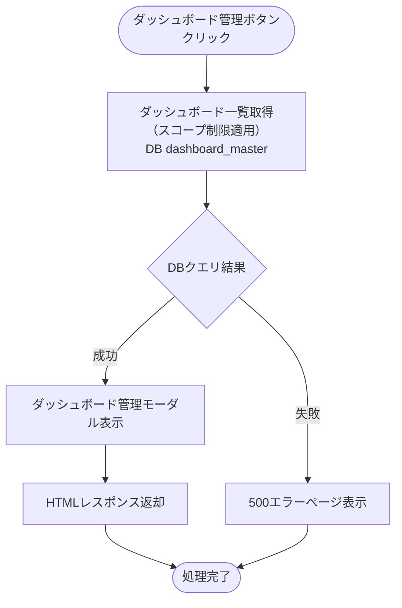

#### Flaskルート

| ルート | エンドポイント | 詳細 |
|-------|---------------|------|
| ダッシュボード管理画面 | `GET /analysis/customer-dashboard/dashboards` | パラメータ: なし |

#### 処理詳細（サーバーサイド）

**① ダッシュボード一覧取得**

**使用テーブル:** dashboard_master

**SQL詳細:**
```sql
SELECT
  d.dashboard_id,
  d.dashboard_name
FROM
  dashboard_master d
INNER JOIN
  user_master u
  ON u.organization_id = d.organization_id
WHERE
  u.user_id = :current_user_id
  AND u.delete_flag = FALSE
  AND d.delete_flag = FALSE
ORDER BY
  d.dashboard_id ASC
```

**実装例:**
```python
# views/analysis/customer_dashboard/common.py
@customer_dashboard_bp.route('/dashboards', methods=['GET'])
def dashboard_management():
    """ダッシュボード管理モーダル表示"""
    dashboards = get_dashboards(g.current_user.user_id)

    return render_template(
        'analysis/customer_dashboard/modals/dashboard_management.html',
        dashboards=dashboards
    )
```

#### 表示メッセージ

| メッセージID | 表示内容 | 表示タイミング | 表示場所 |
|-------------|---------|---------------|---------|
| ERR_001 | データの取得に失敗しました | DBクエリ失敗時 | エラートースト |

#### エラーハンドリング

| HTTPステータス | エラー種別 | 処理内容 | 表示内容 |
|--------------|-----------|---------|---------|
| 500 | データベースエラー | 500エラーページ表示 | データの取得に失敗しました |

#### ログ出力タイミング

DBクエリ実行の直前、直後に操作ログを出力する

#### UI状態

- モーダル: ダッシュボード管理モーダルを表示
- ダッシュボード一覧: dashboard_id昇順で表示

---

### ダッシュボード登録

**トリガー:** (9.1) 登録ボタンクリック（ダッシュボード管理モーダル）→ (11.2) 登録ボタンクリック（ダッシュボード登録モーダル）

**前提条件:**
- ダッシュボード管理モーダルが表示されている

#### 処理フロー

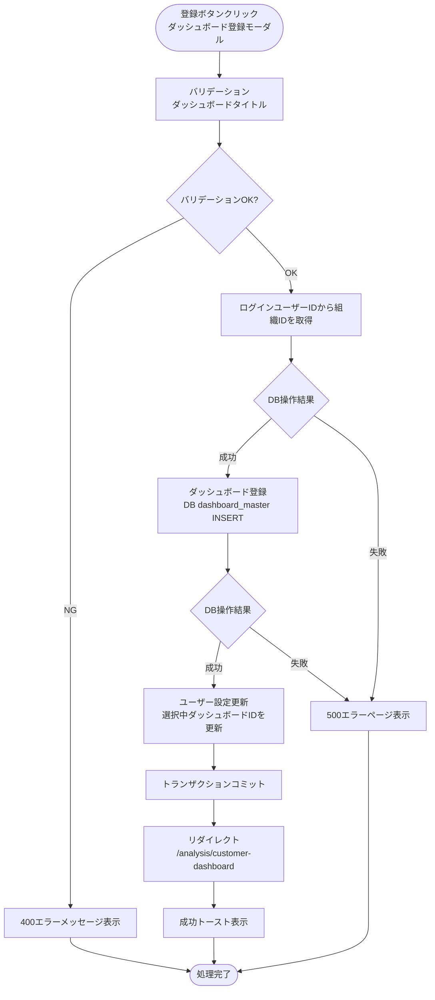

#### Flaskルート

| ルート | エンドポイント | 詳細 |
|-------|---------------|------|
| ダッシュボード登録画面 | `GET /analysis/customer-dashboard/dashboards/create` | パラメータ: なし |
| ダッシュボード登録実行 | `POST /analysis/customer-dashboard/dashboards/register` | フォームデータ: `dashboard_name` |

#### バリデーション

**実行タイミング:** フォーム送信時（サーバーサイド）

**バリデーションルール:**

| 項目 | ルール | エラーメッセージ |
|------|--------|-----------------|
| ダッシュボードタイトル | 必須 | ダッシュボードタイトルを入力してください |
| ダッシュボードタイトル | 最大50文字 | ダッシュボードタイトルは50文字以内で入力してください |

#### 処理詳細（サーバーサイド）

**① 組織ID取得**

ダッシュボード登録用に user_id から organization_id を取得

**サービス関数実装例:**
```python
# services/customer_dashboard/common.py
def get_organization_id_by_user(user_id):
    """ユーザーIDから所属組織IDを返す。"""
    return (
        db.session.query(User.organization_id)
        .filter(User.user_id == user_id, User.delete_flag == False)
        .scalar()
    )
```

**② ダッシュボード登録**

**使用テーブル:** dashboard_master

**SQL詳細:**
```sql
INSERT INTO dashboard_master (
  dashboard_uuid,
  dashboard_name,
  organization_id,
  create_date,
  creator,
  update_date,
  modifier,
  delete_flag
) VALUES (
  :dashboard_uuid,
  :dashboard_name,
  :organization_id,
  NOW(),
  :current_user_id,
  NOW(),
  :current_user_id,
  FALSE
)
```

**サービス関数実装例:**
```python
# services/customer_dashboard/common.py
def create_dashboard(name, organization_id, user_id):
    """ダッシュボードを新規作成してsessionに追加する"""
    dashboard = DashboardMaster(
        dashboard_uuid=str(uuid.uuid4()),
        dashboard_name=name,
        organization_id=organization_id,
        creator=user_id,
        modifier=user_id,
    )
    db.session.add(dashboard)
    return dashboard
```

**③ ユーザー設定更新**

新規登録したダッシュボードを選択中ダッシュボードとして設定します。`upsert_dashboard_user_setting` サービス関数を使用します（実装例は「ダッシュボード初期表示 ③」参照）。

**実装例:**
```python
# forms/customer_dashboard/common.py
class DashboardForm(FlaskForm):
    dashboard_name = StringField(
        'ダッシュボード名',
        validators=[
            DataRequired(message='ダッシュボードタイトルを入力してください'),
            Length(max=50, message='ダッシュボードタイトルは50文字以内で入力してください'),
        ]
    )

# views/analysis/customer_dashboard/common.py
@customer_dashboard_bp.route('/dashboards/register', methods=['POST'])
def dashboard_register():
    """ダッシュボード登録実行"""
    form = DashboardForm()

    if not form.validate_on_submit():
        return render_template(
            'analysis/customer_dashboard/modals/dashboard_register.html',
            form=form,
        ), 400

    try:
        logger.info(f'ダッシュボード登録開始: user_id={g.current_user.user_id}')
        dashboard = create_dashboard(
            name=form.dashboard_name.data,
            organization_id=get_organization_id_by_user(g.current_user.user_id),
            user_id=g.current_user.user_id,
        )
        db.session.flush()
        upsert_dashboard_user_setting(g.current_user.user_id, dashboard.dashboard_id)
        db.session.commit()
        logger.info(f'ダッシュボード登録成功: dashboard_id={dashboard.dashboard_id}')
        return jsonify({'message': 'ダッシュボードを登録しました'})

    except Exception as e:
        db.session.rollback()
        logger.error(f'ダッシュボード登録エラー: {str(e)}')
        abort(500)
```

#### 表示メッセージ

| メッセージID | 表示内容 | 表示タイミング | 表示場所 |
|-------------|---------|---------------|---------|
| SUC_001 | ダッシュボードを登録しました | 登録成功時 | 成功トースト |
| ERR_002 | ダッシュボードの登録に失敗しました | DB操作失敗時 | エラートースト |

#### エラーハンドリング

| HTTPステータス | エラー種別 | 処理内容 | 表示内容 |
|--------------|-----------|---------|---------|
| 400 | バリデーションエラー | フォーム再表示 | バリデーションエラーメッセージ |
| 500 | データベースエラー | 500エラーページ表示 | ダッシュボードの登録に失敗しました |

#### ログ出力タイミング

DBクエリ実行の直前、直後に操作ログを出力する

---

### ダッシュボード表示切替

**トリガー:** (9.4) 変更ボタンクリック（ダッシュボード管理モーダル）

**前提条件:**
- ダッシュボード管理モーダルでダッシュボードが選択されている

#### 処理フロー

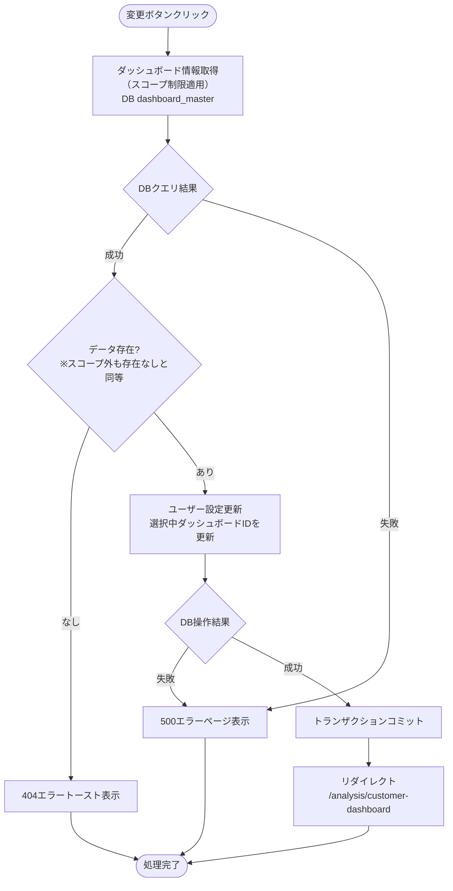

#### 処理詳細（サーバーサイド）

**サービス関数実装例:**
```python
# services/customer_dashboard/common.py
def get_dashboard_by_uuid(dashboard_uuid, user_id):
    """dashboard_uuidでダッシュボードを取得する（スコープ制限適用）"""
    return (
        db.session.query(VDashboardMasterByUser)
        .filter(
            VDashboardMasterByUser.user_id == user_id,
            VDashboardMasterByUser.dashboard_uuid == dashboard_uuid,
            VDashboardMasterByUser.delete_flag == False,
        )
        .first()
    )
```

**実装例:**
```python
# views/analysis/customer_dashboard/common.py
@customer_dashboard_bp.route('/dashboards/<string:dashboard_uuid>/switch', methods=['POST'])
def dashboard_switch(dashboard_uuid):
    """ダッシュボード表示切替"""
    # ダッシュボード情報取得
    dashboard = get_dashboard_by_uuid(dashboard_uuid, g.current_user.user_id)
    if not dashboard:
        abort(404)

    try:
        upsert_dashboard_user_setting(
            g.current_user.user_id,
            dashboard.dashboard_id
        )
        db.session.commit()
        return redirect(url_for('customer_dashboard.customer_dashboard'))

    except Exception as e:
        db.session.rollback()
        logger.error(f'ダッシュボード切替エラー: {str(e)}')
        abort(500)
```

#### エラーハンドリング

| HTTPステータス | エラー種別 | 処理内容 | 表示内容 |
|--------------|-----------|---------|---------|
| 404 | リソース不存在 | 404エラートースト表示 | 指定されたダッシュボードが見つかりません |
| 500 | データベースエラー | 500エラーページ表示 | データの更新に失敗しました |

#### ログ出力タイミング

DBクエリ実行の直前、直後に操作ログを出力する

---

### ダッシュボードタイトル更新

**トリガー:** (11.2) 更新ボタンクリック（ダッシュボードタイトル更新モーダル）

**前提条件:**
- ダッシュボードタイトル更新モーダルが表示されている

#### 処理フロー

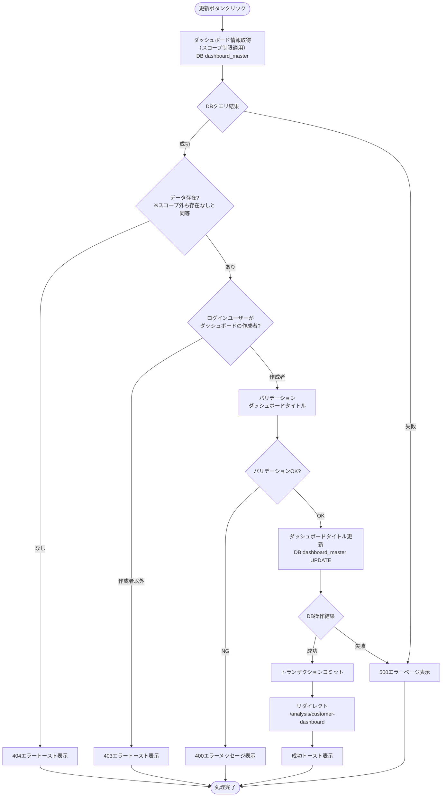

#### バリデーション

**実行タイミング:** フォーム送信時（サーバーサイド）

**バリデーションルール:**

| 項目 | ルール | エラーメッセージ |
|------|--------|-----------------|
| ダッシュボードタイトル | 必須 | ダッシュボードタイトルを入力してください |
| ダッシュボードタイトル | 最大50文字 | ダッシュボードタイトルは50文字以内で入力してください |

#### 処理詳細（サーバーサイド）

**ダッシュボードタイトル更新**

**使用テーブル:** dashboard_master

**SQL詳細:**
```sql
UPDATE dashboard_master
SET
  dashboard_name = :dashboard_name,
  update_date = NOW(),
  modifier = :current_user_id
WHERE
  dashboard_uuid = :dashboard_uuid
  AND delete_flag = FALSE
```

**サービス関数実装例:**
```python
# services/customer_dashboard/common.py
def update_dashboard_title(dashboard, name, modifier):
    """ダッシュボード名とmodifierを更新する"""
    dashboard.dashboard_name = name
    dashboard.modifier = modifier
```

**実装例:**
```python
# views/analysis/customer_dashboard/common.py
@customer_dashboard_bp.route('/dashboards/<string:dashboard_uuid>/update', methods=['POST'])
def dashboard_update(dashboard_uuid):
    """ダッシュボードタイトル更新実行"""

    # ① ダッシュボード情報取得
    dashboard = get_dashboard_by_uuid(dashboard_uuid, g.current_user.user_id)
    if not dashboard:
        abort(404)

    # ② ログインユーザーがダッシュボードの作成者かを確認
    if g.current_user.user_id != dashboard.creator:
        abort(403)

    # ③ バリデーション
    form = DashboardForm()
    if not form.validate_on_submit():
        return render_template(
            'customer_dashboard/modals/dashboard_edit.html',
            form=form, dashboard=dashboard
        ), 400

    # ④ ダッシュボードタイトル更新
    try:
        update_dashboard_title(dashboard, form.dashboard_name.data, g.current_user.user_id)
        db.session.commit()
        return jsonify({'message': 'ダッシュボードタイトルを更新しました'})

    except Exception as e:
        db.session.rollback()
        logger.error(f'ダッシュボードタイトル更新エラー: {str(e)}')
        abort(500)
```

#### 表示メッセージ

| メッセージID | 表示内容 | 表示タイミング | 表示場所 |
|-------------|---------|---------------|---------|
| SUC_002 | ダッシュボードタイトルを更新しました | 更新成功時 | 成功トースト |
| ERR_003 | ダッシュボードタイトルの更新に失敗しました | DB操作失敗時 | エラートースト |

#### エラーハンドリング

| HTTPステータス | エラー種別 | 処理内容 | 表示内容 |
|--------------|-----------|---------|---------|
| 400 | バリデーションエラー | フォーム再表示 | バリデーションエラーメッセージ |
| 403 | 権限エラー | 403エラートースト表示 | この操作を実行する権限がありません |
| 404 | リソース不存在 | 404エラートースト表示 | 指定されたダッシュボードが見つかりません |
| 500 | データベースエラー | 500エラーページ表示 | ダッシュボードタイトルの更新に失敗しました |

#### ログ出力タイミング

DBクエリ実行の直前、直後に操作ログを出力する

---

### ダッシュボード削除

**トリガー:** (12.2) 削除ボタンクリック（ダッシュボード削除確認モーダル）

**前提条件:**
- ダッシュボード削除確認モーダルが表示されている

#### 処理フロー

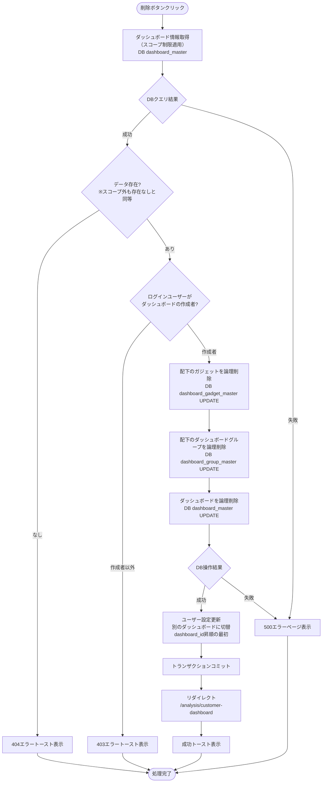

#### 処理詳細（サーバーサイド）

**① 配下のガジェットを論理削除**

**SQL詳細:**
```sql
UPDATE dashboard_gadget_master
SET
  delete_flag = TRUE,
  update_date = NOW(),
  modifier = :current_user_id
WHERE
  dashboard_group_id IN (
    SELECT dashboard_group_id
    FROM dashboard_group_master
    WHERE dashboard_id = (
      SELECT dashboard_id FROM dashboard_master
      WHERE dashboard_uuid = :dashboard_uuid AND delete_flag = FALSE
    )
    AND delete_flag = FALSE
  )
  AND delete_flag = FALSE
```

**サービス関数実装例:**
```python
# services/customer_dashboard/common.py
def delete_gadgets_by_dashboard(dashboard_id, modifier):
    """ダッシュボード配下の全ガジェットを論理削除する"""
    gadgets = (
        db.session.query(DashboardGadgetMaster)
        .join(DashboardGroupMaster)
        .filter(
            DashboardGroupMaster.dashboard_id == dashboard_id,
            DashboardGadgetMaster.delete_flag == False,
        )
        .all()
    )
    for gadget in gadgets:
        gadget.delete_flag = True
        gadget.modifier = modifier
```

**② 配下のグループを論理削除**

**SQL詳細:**
```sql
UPDATE dashboard_group_master
SET
  delete_flag = TRUE,
  update_date = NOW(),
  modifier = :current_user_id
WHERE
  dashboard_id = (
    SELECT dashboard_id FROM dashboard_master
    WHERE dashboard_uuid = :dashboard_uuid AND delete_flag = FALSE
  )
  AND delete_flag = FALSE
```

**サービス関数実装例:**
```python
# services/customer_dashboard/common.py
def delete_groups_by_dashboard(dashboard_id, modifier):
    """ダッシュボード配下の全グループを論理削除する"""
    groups = (
        db.session.query(DashboardGroupMaster)
        .filter(
            DashboardGroupMaster.dashboard_id == dashboard_id,
            DashboardGroupMaster.delete_flag == False,
        )
        .all()
    )
    for group in groups:
        group.delete_flag = True
        group.modifier = modifier
```

**③ ダッシュボードを論理削除**

**SQL詳細:**
```sql
UPDATE dashboard_master
SET
  delete_flag = TRUE,
  update_date = NOW(),
  modifier = :current_user_id
WHERE
  dashboard_uuid = :dashboard_uuid
  AND delete_flag = FALSE
```

**実装例:**
```python
# services/customer_dashboard/common.py
def delete_dashboard_user_setting(user_id, modifier):
    """ユーザー設定を論理削除する"""
    setting = (
        db.session.query(DashboardUserSetting)
        .filter(DashboardUserSetting.user_id == user_id)
        .first()
    )
    if setting is not None:
        setting.delete_flag = True
        setting.modifier = modifier

def delete_dashboard_with_cascade(dashboard, user_id):
    """ダッシュボードをカスケード論理削除する。次のダッシュボードがあればユーザー設定を更新する"""
    dashboard_id = dashboard.dashboard_id

    delete_gadgets_by_dashboard(dashboard_id=dashboard_id, modifier=user_id)
    delete_groups_by_dashboard(dashboard_id=dashboard_id, modifier=user_id)

    dashboard.delete_flag = True
    dashboard.modifier = user_id

    next_dashboard = get_first_dashboard(user_id, exclude_id=dashboard_id)
    if next_dashboard is not None:
        upsert_dashboard_user_setting(user_id, next_dashboard.dashboard_id)
    else:
        delete_dashboard_user_setting(user_id=user_id, modifier=user_id)


# views/analysis/customer_dashboard/common.py
@customer_dashboard_bp.route('/dashboards/<string:dashboard_uuid>/delete', methods=['POST'])
def dashboard_delete(dashboard_uuid):
    """ダッシュボード削除実行"""

    # ダッシュボード情報取得
    dashboard = get_dashboard_by_uuid(dashboard_uuid, g.current_user.user_id)
    if not dashboard:
        abort(404)

    # ② ログインユーザーがダッシュボードの作成者かを確認
    if g.current_user.user_id != dashboard.creator:
        abort(403)

    # ③ ダッシュボード削除（カスケード）
    try:
        delete_dashboard_with_cascade(dashboard, g.current_user.user_id)
        db.session.commit()
        return jsonify({'message': 'ダッシュボードを削除しました'})

    except Exception as e:
        db.session.rollback()
        logger.error(f'ダッシュボード削除エラー: {str(e)}')
        abort(500)
```

#### 表示メッセージ

| メッセージID | 表示内容 | 表示タイミング | 表示場所 |
|-------------|---------|---------------|---------|
| SUC_003 | ダッシュボードを削除しました | 削除成功時 | 成功トースト |
| ERR_004 | ダッシュボードの削除に失敗しました | DB操作失敗時 | エラートースト |

#### エラーハンドリング

| HTTPステータス | エラー種別 | 処理内容 | 表示内容 |
|--------------|-----------|---------|---------|
| 403 | 権限エラー | 403エラートースト表示 | この操作を実行する権限がありません |
| 404 | リソース不存在 | 404エラートースト表示 | 指定されたダッシュボードが見つかりません |
| 500 | データベースエラー | 500エラーページ表示 | ダッシュボードの削除に失敗しました |

#### ログ出力タイミング

DBクエリ実行の直前、直後に操作ログを出力する

---

### ダッシュボードグループ登録

**トリガー:** (11.2) 登録ボタンクリック（ダッシュボードグループ登録モーダル）

**前提条件:**
- ダッシュボードグループ登録モーダルが表示されている

#### 処理フロー

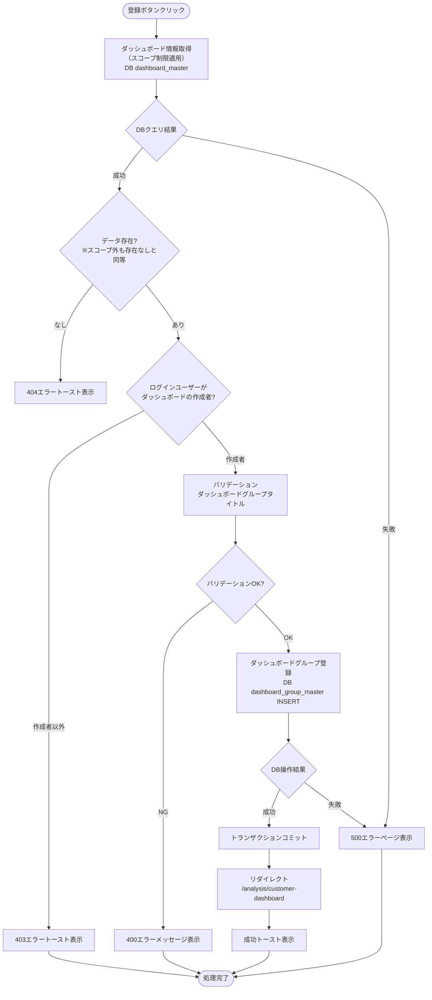

#### バリデーション

**実行タイミング:** フォーム送信時（サーバーサイド）

| 項目 | ルール | エラーメッセージ |
|------|--------|-----------------|
| ダッシュボードグループタイトル | 必須 | ダッシュボードグループタイトルを入力してください |
| ダッシュボードグループタイトル | 最大50文字 | ダッシュボードグループタイトルは50文字以内で入力してください |

#### 処理詳細（サーバーサイド）

**使用テーブル:** dashboard_group_master

**SQL詳細:**
```sql
INSERT INTO dashboard_group_master (
  dashboard_group_uuid,
  dashboard_group_name,
  dashboard_id,
  display_order,
  create_date,
  creator,
  update_date,
  modifier,
  delete_flag
) VALUES (
  :dashboard_group_uuid,
  :dashboard_group_name,
  :dashboard_id,
  (
    SELECT COALESCE(MAX(display_order), 0) + 1
    FROM dashboard_group_master
    WHERE dashboard_id = :dashboard_id
    AND delete_flag = FALSE
  ),
  NOW(),
  :current_user_id,
  NOW(),
  :current_user_id,
  FALSE
)
```

**サービス関数実装例:**
```python
# services/customer_dashboard/common.py
def create_dashboard_group(group_name, dashboard_id, user_id):
    """グループを新規作成する。display_orderは既存最大値+1を設定する"""
    max_order = (
        db.session.query(func.max(DashboardGroupMaster.display_order))
        .filter(DashboardGroupMaster.dashboard_id == dashboard_id)
        .scalar()
    )
    display_order = (max_order or 0) + 1

    group = DashboardGroupMaster(
        dashboard_group_uuid=str(uuid.uuid4()),
        dashboard_group_name=group_name,
        dashboard_id=dashboard_id,
        display_order=display_order,
        creator=user_id,
        modifier=user_id,
    )
    db.session.add(group)
    return group
```

**実装例:**
```python
# views/analysis/customer_dashboard/common.py
@customer_dashboard_bp.route('/groups/register', methods=['POST'])
def group_register():
    """ダッシュボードグループ登録実行"""
    form = DashboardGroupForm()

    # ① ダッシュボード情報取得
    dashboard = get_dashboard_by_uuid(form.dashboard_uuid.data, g.current_user.user_id)
    if not dashboard:
        abort(404)

    # ② ログインユーザーがダッシュボードの作成者かを確認
    if g.current_user.user_id != dashboard.creator:
        abort(403)

    # ③ バリデーション
    if not form.validate_on_submit():
        return render_template(
            'analysis/customer_dashboard/modals/group_register.html',
            form=form,
        ), 400

    # ④ ダッシュボード登録
    try:
        logger.info(f'グループ登録開始: user_id={g.current_user.user_id}, dashboard_id={dashboard.dashboard_id}')
        create_dashboard_group(
            group_name=form.dashboard_group_name.data,
            dashboard_id=dashboard.dashboard_id,
            user_id=g.current_user.user_id,
        )
        db.session.commit()
        logger.info(f'グループ登録成功: dashboard_id={dashboard.dashboard_id}')
        return jsonify({'message': 'ダッシュボードグループを登録しました'})

    except Exception as e:
        db.session.rollback()
        logger.error(f'ダッシュボードグループ登録エラー: {str(e)}')
        abort(500)
```

#### 表示メッセージ

| メッセージID | 表示内容 | 表示タイミング | 表示場所 |
|-------------|---------|---------------|---------|
| SUC_004 | ダッシュボードグループを登録しました | 登録成功時 | 成功トースト |
| ERR_005 | ダッシュボードグループの登録に失敗しました | DB操作失敗時 | エラートースト |

#### エラーハンドリング

| HTTPステータス | エラー種別 | 処理内容 | 表示内容 |
|--------------|-----------|---------|---------|
| 400 | バリデーションエラー | フォーム再表示| バリデーションエラーメッセージ |
| 403 | 権限エラー | 403エラートースト表示 | この操作を実行する権限がありません |
| 500 | データベースエラー | 500エラーページ表示 | ダッシュボードグループの登録に失敗しました |

#### ログ出力タイミング

DBクエリ実行の直前、直後に操作ログを出力する

---

### ダッシュボードグループタイトル更新

**トリガー:** (11.2) 更新ボタンクリック（ダッシュボードグループタイトル更新モーダル）

**前提条件:**
- ダッシュボードグループタイトル更新モーダルが表示されている

#### 処理フロー

ダッシュボードタイトル更新と同様の処理フローに従います。対象テーブルが `dashboard_group_master` に変わります。

#### バリデーション

**実行タイミング:** フォーム送信時（サーバーサイド）

| 項目 | ルール | エラーメッセージ |
|------|--------|-----------------|
| ダッシュボードグループタイトル | 必須 | ダッシュボードグループタイトルを入力してください |
| ダッシュボードグループタイトル | 最大50文字 | ダッシュボードグループタイトルは50文字以内で入力してください |

#### 処理詳細（サーバーサイド）

**使用テーブル:** dashboard_group_master

**SQL詳細:**
```sql
UPDATE dashboard_group_master
SET
  dashboard_group_name = :dashboard_group_name,
  update_date = NOW(),
  modifier = :current_user_id
WHERE
  dashboard_group_uuid = :dashboard_group_uuid
  AND delete_flag = FALSE
```

**サービス関数実装例:**
```python
# services/customer_dashboard/common.py
def get_group_by_uuid(dashboard_group_uuid, user_id):
    """dashboard_group_uuidでダッシュボードグループを取得する（スコープ制限適用）"""
    return (
        db.session.query(VDashboardGroupMasterByUser)
        .filter(
            VDashboardGroupMasterByUser.user_id == user_id,
            VDashboardGroupMasterByUser.dashboard_group_uuid == dashboard_group_uuid,
            VDashboardGroupMasterByUser.delete_flag == False,
        )
        .first()
    )

def update_group_title(group, name, modifier):
    """グループ名とmodifierを更新する"""
    group.dashboard_group_name = name
    group.modifier = modifier
```

**実装例:**
```python
# views/analysis/customer_dashboard/common.py
@customer_dashboard_bp.route('/groups/<string:dashboard_group_uuid>/update', methods=['POST'])
def group_update(dashboard_group_uuid):
    """ダッシュボードグループタイトル更新実行"""

    # ① ダッシュボードグループ情報取得
    group = get_group_by_uuid(dashboard_group_uuid, g.current_user.user_id)
    if not group:
        abort(404)

    # ② ログインユーザーがダッシュボードグループの作成者かを確認
    if g.current_user.user_id != group.creator:
        abort(403)

    # ③ バリデーション
    form = DashboardGroupForm()
    if not form.validate_on_submit():
        return render_template(
            'customer_dashboard/modals/group_edit.html',
            form=form, group=group
        ), 400

    # ④ ダッシュボードグループタイトル更新
    try:
        update_group_title(group, form.dashboard_group_name.data, g.current_user.user_id)
        db.session.commit()
        return jsonify({'message': 'ダッシュボードグループタイトルを更新しました'})

    except Exception as e:
        db.session.rollback()
        logger.error(f'ダッシュボードグループタイトル更新エラー: {str(e)}')
        abort(500)
```

#### 表示メッセージ

| メッセージID | 表示内容 | 表示タイミング | 表示場所 |
|-------------|---------|---------------|---------|
| SUC_005 | ダッシュボードグループタイトルを更新しました | 更新成功時 | 成功トースト |
| ERR_006 | ダッシュボードグループタイトルの更新に失敗しました | DB操作失敗時 | エラートースト |

#### エラーハンドリング

| HTTPステータス | エラー種別 | 処理内容 | 表示内容 |
|--------------|-----------|---------|---------|
| 400 | バリデーションエラー | フォーム再表示| バリデーションエラーメッセージ |
| 403 | 権限エラー | 403エラートースト表示 | この操作を実行する権限がありません |
| 404 | リソース不存在 | 404エラートースト表示 | 指定されたダッシュボードグループが見つかりません |
| 500 | データベースエラー | 500エラーページ表示 | ダッシュボードグループタイトルの更新に失敗しました |

#### ログ出力タイミング

DBクエリ実行の直前、直後に操作ログを出力する

---

### ダッシュボードグループ削除

**トリガー:** (12.2) 削除ボタンクリック（ダッシュボードグループ削除確認モーダル）

**前提条件:**
- ダッシュボードグループ削除確認モーダルが表示されている

#### 処理フロー

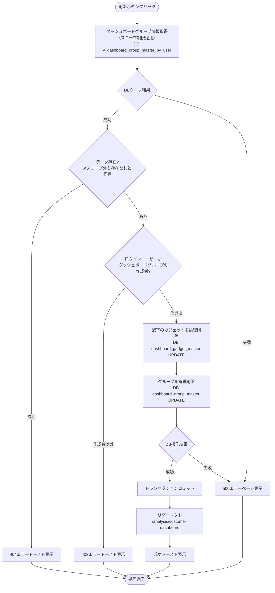

#### 処理詳細（サーバーサイド）

**① 配下のガジェットを論理削除**

**SQL詳細:**
```sql
UPDATE dashboard_gadget_master
SET
  delete_flag = TRUE,
  update_date = NOW(),
  modifier = :current_user_id
WHERE
  dashboard_group_id IN (
    SELECT dashboard_group_id
    FROM dashboard_group_master
    WHERE dashboard_group_uuid = :dashboard_group_uuid
    AND delete_flag = FALSE
  )
  AND delete_flag = FALSE
```

**サービス関数実装例:**
```python
# services/customer_dashboard/common.py
def delete_gadgets_by_group(group_id, modifier):
    """グループ配下の全ガジェットを論理削除する"""
    gadgets = (
        db.session.query(DashboardGadgetMaster)
        .filter(
            DashboardGadgetMaster.dashboard_group_id == group_id,
            DashboardGadgetMaster.delete_flag == False,
        )
        .all()
    )
    for gadget in gadgets:
        gadget.delete_flag = True
        gadget.modifier = modifier
```

**② グループを論理削除**

**SQL詳細:**
```sql
UPDATE dashboard_group_master
SET
  delete_flag = TRUE,
  update_date = NOW(),
  modifier = :current_user_id
WHERE
  dashboard_group_uuid = :dashboard_group_uuid
  AND delete_flag = FALSE
```

**サービス関数実装例:**
```python
# services/customer_dashboard/common.py
def delete_group_with_cascade(group, user_id):
    """グループをカスケード論理削除する"""
    delete_gadgets_by_group(group_id=group.dashboard_group_id, modifier=user_id)
    group.delete_flag = True
    group.modifier = user_id
```

**実装例:**
```python
# views/analysis/customer_dashboard/common.py
@customer_dashboard_bp.route('/groups/<string:dashboard_group_uuid>/delete', methods=['POST'])
def group_delete(dashboard_group_uuid):
    """ダッシュボードグループ削除実行"""

    # ① ダッシュボードグループ情報取得
    group = get_group_by_uuid(dashboard_group_uuid, g.current_user.user_id)
    if not group:
        abort(404)

    # ② ログインユーザーがダッシュボードグループの作成者かを確認
    if g.current_user.user_id != group.creator:
        abort(403)

    # ③ グループ削除（カスケード）
    try:
        delete_group_with_cascade(group, g.current_user.user_id)
        db.session.commit()
        return jsonify({'message': 'ダッシュボードグループを削除しました'})

    except Exception as e:
        db.session.rollback()
        logger.error(f'ダッシュボードグループ削除エラー: {str(e)}')
        abort(500)
```

#### 表示メッセージ

| メッセージID | 表示内容 | 表示タイミング | 表示場所 |
|-------------|---------|---------------|---------|
| SUC_006 | ダッシュボードグループを削除しました | 削除成功時 | 成功トースト |
| ERR_007 | ダッシュボードグループの削除に失敗しました | DB操作失敗時 | エラートースト |

#### エラーハンドリング

| HTTPステータス | エラー種別 | 処理内容 | 表示内容 |
|--------------|-----------|---------|---------|
| 403 | 権限エラー | 403エラートースト表示 | この操作を実行する権限がありません |
| 404 | リソース不存在 | 404エラートースト表示 | 指定されたダッシュボードグループが見つかりません |
| 500 | データベースエラー | 500エラーページ表示 | ダッシュボードグループの削除に失敗しました |

#### ログ出力タイミング

DBクエリ実行の直前、直後に操作ログを出力する

---

### ガジェット追加モーダル表示

**トリガー:** (6.3) ダッシュボードグループ設定メニュー > ガジェット追加

**前提条件:**
- ダッシュボードグループが表示されている

#### 処理フロー

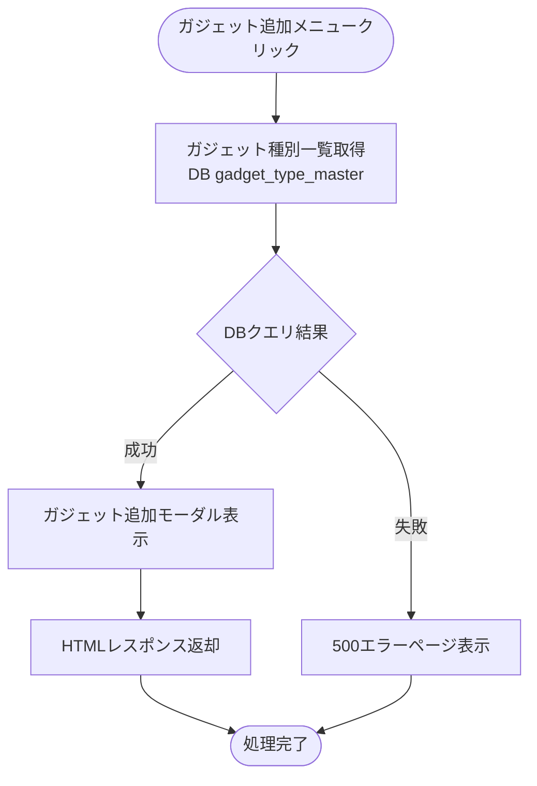

#### 処理詳細（サーバーサイド）

**使用テーブル:** gadget_type_master

**SQL詳細:**
```sql
SELECT
  gadget_type_id,
  gadget_type_name,
  data_source_type,
  gadget_image_path,
  gadget_description,
  display_order
FROM
  gadget_type_master
WHERE
  delete_flag = FALSE
ORDER BY
  data_source_type ASC,
  display_order ASC
```

**サービス関数実装例:**
```python
def get_gadget_types():
    """全ガジェット種別をdisplay_order昇順で返す"""
    return (
        db.session.query(GadgetTypeMaster)
        .filter(GadgetTypeMaster.delete_flag == False)
        .order_by(GadgetTypeMaster.data_source_type, GadgetTypeMaster.display_order)
        .all()
    )
```

**実装例:**
```python
@customer_dashboard_bp.route('/gadgets/add', methods=['GET'])
def gadget_add():
    """ガジェット追加モーダル表示"""
    gadget_types = get_gadget_types()
    return render_template(
        'analysis/customer_dashboard/modals/gadget_add.html',
        gadget_types=gadget_types,
    )
```

#### 表示メッセージ

| メッセージID | 表示内容 | 表示タイミング | 表示場所 |
|-------------|---------|---------------|---------|
| ERR_001 | データの取得に失敗しました | DBクエリ失敗時 | エラートースト |

#### エラーハンドリング

| HTTPステータス | エラー種別 | 処理内容 | 表示内容 |
|--------------|-----------|---------|---------|
| 401 | 認証エラー | ログイン画面へリダイレクト | - |
| 500 | データベースエラー | 500エラーページ表示 | データの取得に失敗しました |

#### ログ出力タイミング

DBクエリ実行の直前、直後に操作ログを出力する

---

### ガジェット登録モーダル表示

**トリガー:** (10.4) 登録画面ボタンクリック（ガジェット追加モーダル）

**前提条件:**
- ガジェット追加モーダルが表示されている
- ガジェット種別が選択されている

#### 処理フロー

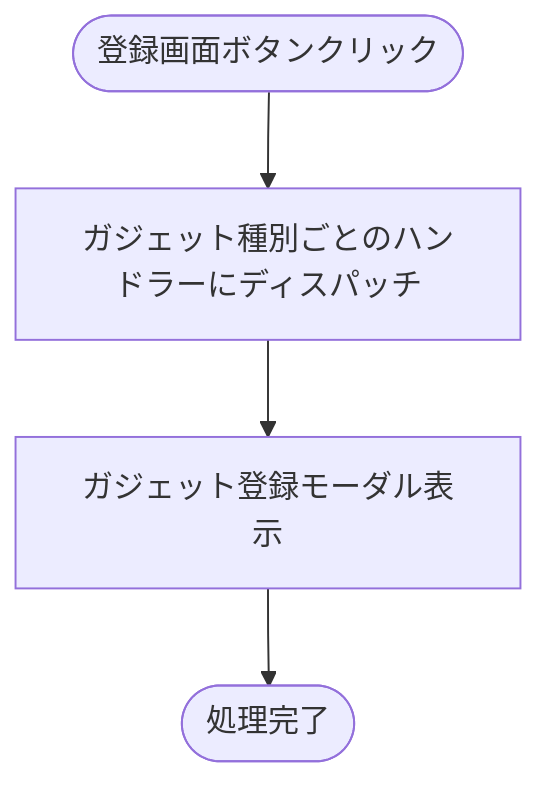

#### 処理詳細（サーバーサイド）

**実装例:**
```python
# views/analysis/customer_dashboard/common.py
@customer_dashboard_bp.route('/gadgets/<string:gadget_type>/create', methods=['GET'])
def gadget_create(gadget_type):
    """ガジェット登録モーダル表示（ガジェット種別ごとのハンドラーにディスパッチ）"""
    if gadget_type not in _GADGET_REGISTRY:
        logger.info(f'未実装のガジェット種別が選択されました: gadget_type={gadget_type}')
        return jsonify({'error': '追加予定のガジェットです'}), 404
    handler = _get_handler(gadget_type, 'handle_gadget_create')
    return handler(gadget_type)
```

詳細はガジェット個別仕様書の`ガジェット登録モーダル表示`を参照してください。

- **棒グラフ:** [棒グラフ-ワークフロー仕様書](../bar-chart/workflow-specification.md)
- **円グラフ:** [円グラフ-ワークフロー仕様書](../circle/workflow-specification.md)
- **積み上げ棒グラフ:** [積み上げ棒グラフ-ワークフロー仕様書](../stacked-bar-chart/workflow-specification.md)
- **時系列グラフ:** [時系列グラフ-ワークフロー仕様書](../timeline/workflow-specification.md)
- **表:** [表-ワークフロー仕様書](../grid/workflow-specification.md)

---

### ガジェット登録

**トリガー:** 登録ボタンクリック（ガジェット登録モーダル）

**前提条件:**
- ガジェット登録モーダルが表示されている

#### 処理フロー

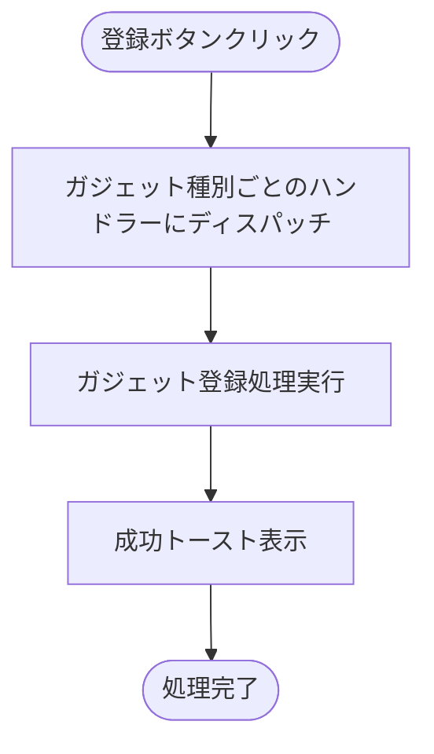

#### 処理詳細（サーバーサイド）

**実装例:**
```python
# views/analysis/customer_dashboard/common.py
@customer_dashboard_bp.route('/gadgets/<string:gadget_type>/register', methods=['POST'])
def gadget_register(gadget_type):
    """ガジェット登録実行（ガジェット種別ごとのハンドラーにディスパッチ）"""
    if gadget_type not in _GADGET_REGISTRY:
        logger.error(f'未対応のガジェット種別: gadget_type={gadget_type}')
        abort(500)
    handler = _get_handler(gadget_type, 'handle_gadget_register')
    return handler(gadget_type)
```

詳細はガジェット個別仕様書の`ガジェット登録`を参照してください。

- **棒グラフ:** [棒グラフ-ワークフロー仕様書](../bar-chart/workflow-specification.md)
- **円グラフ:** [円グラフ-ワークフロー仕様書](../circle/workflow-specification.md)
- **積み上げ棒グラフ:** [積み上げ棒グラフ-ワークフロー仕様書](../stacked-bar-chart/workflow-specification.md)
- **時系列グラフ:** [時系列グラフ-ワークフロー仕様書](../timeline/workflow-specification.md)
- **表:** [表-ワークフロー仕様書](../grid/workflow-specification.md)

---

### ガジェットタイトル更新

**トリガー:** (11.2) 更新ボタンクリック（ガジェットタイトル更新モーダル）

**前提条件:**
- ガジェットタイトル更新モーダルが表示されている

#### 処理フロー

ダッシュボードタイトル更新と同様の処理フローに従います。対象テーブルが `dashboard_gadget_master` に変わります。

#### バリデーション

**実行タイミング:** フォーム送信時（サーバーサイド）

| 項目 | ルール | エラーメッセージ |
|------|--------|-----------------|
| ガジェットタイトル | 必須 | ガジェットタイトルを入力してください |
| ガジェットタイトル | 最大20文字 | ガジェットタイトルは20文字以内で入力してください |

#### 処理詳細（サーバーサイド）

**使用テーブル:** dashboard_gadget_master

**SQL詳細:**
```sql
UPDATE dashboard_gadget_master
SET
  gadget_name = :gadget_name,
  update_date = NOW(),
  modifier = :current_user_id
WHERE
  gadget_uuid = :gadget_uuid
  AND delete_flag = FALSE
```

**サービス関数実装例:**
```python
# services/customer_dashboard/common.py
def get_gadget_by_uuid(gadget_uuid, user_id):
    """gadget_uuidでガジェットを取得する（スコープ制限適用）"""
    return (
        db.session.query(VDashboardGadgetMasterByUser)
        .filter(
            VDashboardGadgetMasterByUser.user_id == user_id,
            VDashboardGadgetMasterByUser.gadget_uuid == gadget_uuid,
            VDashboardGadgetMasterByUser.delete_flag == False,
        )
        .first()
    )


def update_gadget_title(gadget, name, modifier):
    """ガジェット名とmodifierを更新する"""
    gadget.gadget_name = name
    gadget.modifier = modifier
```

**実装例:**
```python
# views/analysis/customer_dashboard/common.py
@customer_dashboard_bp.route('/gadgets/<string:gadget_uuid>/update', methods=['POST'])
def gadget_update(gadget_uuid):
    """ガジェットタイトル更新実行"""

    # ① ガジェット情報取得
    gadget = get_gadget_by_uuid(gadget_uuid, g.current_user.user_id)
    if not gadget:
        abort(404)

    # ② ログインユーザーがガジェットの作成者かを確認
    if g.current_user.user_id != gadget.creator:
        abort(403)

    # ③ バリデーション
    form = GadgetForm()
    if not form.validate_on_submit():
        return render_template(
            'customer_dashboard/modals/gadget_edit.html',
            form=form, gadget=gadget
        ), 400

    # ④ ガジェットタイトル更新
    try:
        update_gadget_title(gadget, form.gadget_name.data, g.current_user.user_id)
        db.session.commit()
        return jsonify({'message': 'ガジェットタイトルを更新しました'})

    except Exception as e:
        db.session.rollback()
        logger.error(f'ガジェットタイトル更新エラー: {str(e)}')
        abort(500)
```

#### 表示メッセージ

| メッセージID | 表示内容 | 表示タイミング | 表示場所 |
|-------------|---------|---------------|---------|
| SUC_008 | ガジェットタイトルを更新しました | 更新成功時 | 成功トースト |
| ERR_009 | ガジェットタイトルの更新に失敗しました | DB操作失敗時 | エラートースト |

#### エラーハンドリング

| HTTPステータス | エラー種別 | 処理内容 | 表示内容 |
|--------------|-----------|---------|---------|
| 400 | バリデーションエラー | フォーム再表示（エラートースト表示）| バリデーションエラーメッセージ |
| 403 | 権限エラー | 403エラートースト表示 | この操作を実行する権限がありません |
| 404 | リソース不存在 | 404エラートースト表示 | 指定されたガジェットが見つかりません |
| 500 | データベースエラー | 500エラーページ表示 | ガジェットタイトルの更新に失敗しました |

#### ログ出力タイミング

DBクエリ実行の直前、直後に操作ログを出力する

---

### ガジェット削除

**トリガー:** (12.2) 削除ボタンクリック（ガジェット削除確認モーダル）

**前提条件:**
- ガジェット削除確認モーダルが表示されている

#### 処理フロー

ダッシュボード削除と同様の処理フローに従います。対象テーブルが `dashboard_gadget_master` に変わります。

#### 処理詳細（サーバーサイド）

**使用テーブル:** dashboard_gadget_master

**SQL詳細:**
```sql
UPDATE dashboard_gadget_master
SET
  delete_flag = TRUE,
  update_date = NOW(),
  modifier = :current_user_id
WHERE
  gadget_uuid = :gadget_uuid
  AND delete_flag = FALSE
```

**サービス関数実装例:**
```python
# services/customer_dashboard/common.py
def delete_gadget(gadget, modifier):
    """ガジェットを論理削除する"""
    gadget.delete_flag = True
    gadget.modifier = modifier
```

**実装例:**
```python
# views/analysis/customer_dashboard/common.py
@customer_dashboard_bp.route('/gadgets/<string:gadget_uuid>/delete', methods=['POST'])
def gadget_delete(gadget_uuid):
    """ガジェット削除実行"""

    # ① ガジェット情報取得
    gadget = get_gadget_by_uuid(gadget_uuid, g.current_user.user_id)
    if not gadget:
        abort(404)

    # ② ログインユーザーがガジェットの作成者かを確認
    if g.current_user.user_id != gadget.creator:
        abort(403)

    # ③ ガジェット削除
    try:
        delete_gadget(gadget, g.current_user.user_id)
        db.session.commit()
        return jsonify({'message': 'ガジェットを削除しました'})

    except Exception as e:
        db.session.rollback()
        logger.error(f'ガジェット削除エラー: {str(e)}')
        abort(500)
```

#### 表示メッセージ

| メッセージID | 表示内容 | 表示タイミング | 表示場所 |
|-------------|---------|---------------|---------|
| SUC_009 | ガジェットを削除しました | 削除成功時 | 成功トースト |
| ERR_010 | ガジェットの削除に失敗しました | DB操作失敗時 | エラートースト |

#### エラーハンドリング

| HTTPステータス | エラー種別 | 処理内容 | 表示内容 |
|--------------|-----------|---------|---------|
| 403 | 権限エラー | 403エラートースト表示 | この操作を実行する権限がありません |
| 404 | リソース不存在 | 404エラートースト表示 | 指定されたガジェットが見つかりません |
| 500 | データベースエラー | 500エラーページ表示 | ガジェットの削除に失敗しました |

#### ログ出力タイミング

DBクエリ実行の直前、直後に操作ログを出力する

---

### ガジェットデータ取得

詳細はガジェット個別仕様書の`ガジェットデータ取得`を参照してください。

- **棒グラフ:** [棒グラフ-ワークフロー仕様書](../bar-chart/workflow-specification.md)
- **円グラフ:** [円グラフ-ワークフロー仕様書](../circle/workflow-specification.md)
- **積み上げ棒グラフ:** [積み上げ棒グラフ-ワークフロー仕様書](../stacked-bar-chart/workflow-specification.md)
- **時系列グラフ:** [時系列グラフ-ワークフロー仕様書](../timeline/workflow-specification.md)
- **表:** [表-ワークフロー仕様書](../grid/workflow-specification.md)

---

### レイアウト保存

**トリガー:** (2.2) レイアウト保存ボタンクリック

**前提条件:**
- 編集モードがON
- ガジェットの配置が変更されている

#### 処理フロー

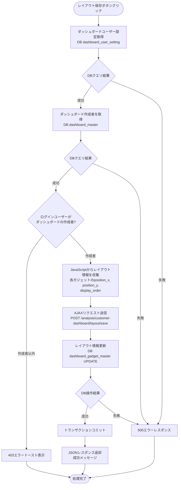

#### 処理詳細（サーバーサイド）

**使用テーブル:** dashboard_gadget_master

**SQL詳細（各ガジェットに対して実行）:**

**注:** `gadget_size` はガジェット登録時のみ設定し、レイアウト保存時には変更しない（2パターン固定サイズ: 0=480×480, 1=960×480）。

```sql
UPDATE dashboard_gadget_master
SET
  position_x = :position_x,
  position_y = :position_y,
  display_order = :display_order,
  update_date = NOW(),
  modifier = :current_user_id
WHERE
  gadget_uuid = :gadget_uuid
  AND delete_flag = FALSE
```

**サービス関数実装例:**
```python
# services/customer_dashboard/common.py
def save_layout(layout_data, modifier):
    """レイアウトデータに基づき各ガジェットのposition/display_orderを更新する"""
    try:
        for item in layout_data:
            gadget = (
                db.session.query(DashboardGadgetMaster)
                .filter(DashboardGadgetMaster.gadget_uuid == item['gadget_uuid'])
                .first()
            )
            if gadget is None:
                continue
            gadget.position_x = item['position_x']
            gadget.position_y = item['position_y']
            gadget.display_order = item['display_order']
            gadget.modifier = modifier
    except Exception:
        db.session.rollback()
        raise
```

**実装例:**
```python
# views/analysis/customer_dashboard/common.py
@customer_dashboard_bp.route('/layout/save', methods=['POST'])
def layout_save():
    """レイアウト保存（AJAX）"""

    # ① ダッシュボードユーザー設定取得
    user_setting = get_dashboard_user_setting(g.current_user.user_id)

    # ② ダッシュボード情報取得
    dashboard = get_dashboard_by_id(user_setting.dashboard_id)
    if not dashboard:
        abort(404)

    # ③ ログインユーザーがダッシュボードの作成者かを確認
    if g.current_user.user_id != dashboard.creator:
        abort(403)

    # ④ レイアウト保存
    try:
        data = request.get_json()
        gadgets = data.get('gadgets', []) if data else []
        logger.info(f'レイアウト保存開始: user_id={g.current_user.user_id}, gadget_count={len(gadgets)}')
        save_layout(gadgets, g.current_user.user_id)
        db.session.commit()
        logger.info(f'レイアウト保存成功: user_id={g.current_user.user_id}')
        return jsonify({'message': 'レイアウトを保存しました'}), 200

    except Exception as e:
        db.session.rollback()
        logger.error(f'レイアウト保存エラー: {str(e)}')
        return jsonify({'error': 'レイアウトの保存に失敗しました'}), 500
```

#### 表示メッセージ

| メッセージID | 表示内容 | 表示タイミング | 表示場所 |
|-------------|---------|---------------|---------|
| SUC_010 | レイアウトを保存しました | 保存成功時 | 成功トースト |
| ERR_011 | レイアウトの保存に失敗しました | DB操作失敗時 | エラートースト |

#### エラーハンドリング

| HTTPステータス | エラー種別 | 処理内容 | 表示内容 |
|--------------|-----------|---------|---------|
| 403 | 権限エラー | 403エラートースト表示 | この操作を実行する権限がありません |
| 500 | データベースエラー | 500エラーレスポンス | レイアウトの保存に失敗しました |

#### ログ出力タイミング

DBクエリ実行の直前、直後に操作ログを出力する

---

### 日時設定ボタン

**トリガー:** (4.1)〜(4.6) 日時設定ボタンクリック（今日/昨日/今週/今月/今年/カスタム）

**前提条件:**
- ダッシュボード画面が表示されている

#### 処理フロー

**今日/昨日/今週/今月/今年ボタン押下時:**

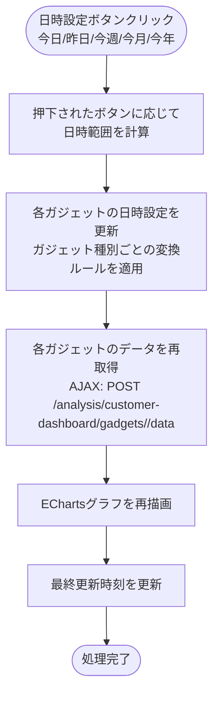

**カスタムボタン押下時:**


#### 処理詳細

日時設定ボタンはクライアントサイドの処理がメインです。ボタン押下時に各ガジェットの日時パラメータを更新し、[ガジェットデータ取得](#ガジェットデータ取得) のAJAXリクエストを実行して最新データでグラフを再描画します。

**日時設定ボタン押下時のガジェット種別ごとの変換ルール:**

| 日時設定ボタン | 棒グラフ・積み上げ棒グラフ（日次） | 棒グラフ・積み上げ棒グラフ（年次） | 表・時系列グラフ | 円グラフ・メーター |
|---------------|--------------------------|--------------------------|----------------|-------------------|
| 今日 | 表示時間単位: 時、時間帯: 現在時刻 | 今年 | 現在時刻より1時間前～現在時刻 | 最新値 |
| 昨日 | 表示時間単位: 日、表示日: 昨日 | 昨年 | 昨日の00:00～23:59 | 最新値 |
| 今週 | 表示時間単位: 週、表示週: 今週月曜日 | 今年 | 現在時刻より1時間前～現在時刻 | 最新値 |
| 今月 | 表示時間単位: 月、表示月: 今月 | 今年 | 現在時刻より1時間前～現在時刻 | 最新値 |
| 今年 | 表示時間単位: 時、時間帯: 現在時刻 | 今年 | 現在時刻より1時間前～現在時刻 | 最新値 |
| カスタム | 表示時間単位: 時、時間帯: 開始日時 | 開始日時の年 | 開始日時～終了日時 | 最新値 |

**カスタムドロップダウン入力バリデーション:**

| 項目 | バリデーションルール | エラーメッセージ |
|------|---------------------|-----------------|
| 開始日時 | 必須 | 「開始日時を入力してください」 |
| 終了日時 | 必須 | 「終了日時を入力してください」 |
| 開始日時・終了日時 | 開始日時 < 終了日時 | 「開始日時は終了日時より前に設定してください」 |

#### エラーハンドリング

| HTTPステータス | エラー種別 | 処理内容 | 表示内容 |
|--------------|-----------|---------|---------|
| 400 | バリデーションエラー | フォーム再表示 | バリデーションエラーメッセージ |

---

### 日時初期化

**トリガー:** (4.7) 日時初期化ボタンクリック → 確認モーダルで「はい」を選択

**前提条件:**
- ガジェットが表示されている

#### 処理フロー


#### 処理詳細

日時初期化はクライアントサイドの処理がメインです。各ガジェットに対して [ガジェットデータ取得](#ガジェットデータ取得) のAJAXリクエストを実行し、最新データでグラフを再描画します。

---

### 自動更新

**トリガー:** (4.8) 自動更新切替ボタンをONに変更

**前提条件:**
- ガジェットが表示されている

#### 処理フロー

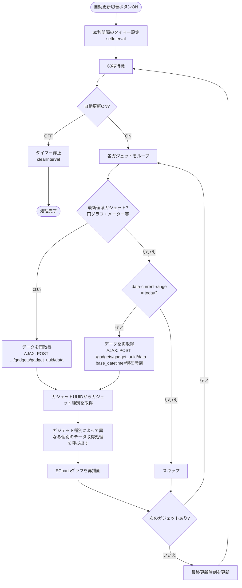

#### 処理詳細

自動更新はクライアントサイドの処理です。60秒間隔で各ガジェットを対象に [ガジェットデータ取得](#ガジェットデータ取得) のAJAXリクエストを実行します。

**自動更新の対象判定:**

| ガジェット種別 | 自動更新対象の条件 |
|--------------|-----------------|
| 最新値系（円グラフ・メーター等） | 常時対象（日時パラメータを持たないため `data-current-range` スキームから除外） |
| それ以外 | `data-current-range="today"` の場合のみ対象 |

**`data-current-range` スキームの設計:**

各ガジェット要素の `data-current-range` 属性を、common.js と各ガジェットJSの共通インターフェースとして使用する。

| 役割 | 担当 | 処理内容 |
|------|------|---------|
| 属性を読む | common.js | 自動更新タイマー発火時に各ガジェットの `data-current-range` を参照し、`"today"` のガジェットのみデータ取得 |
| 属性を書く（一括） | common.js | グローバルツールバーの日時ボタン押下時に全ガジェットの属性を一律更新 |
| 属性を書く（個別） | 各ガジェットJS | 個別の日時コントロール操作時に自ガジェットの属性のみ更新 |

common.js はセマンティックな選択状態（`"today"`, `"yesterday"` 等）を `data-current-range` に書き込むだけで、ガジェット固有のパラメータ（`display_unit`, `start_datetime` 等）への変換は**各ガジェットJSが担う**。

**決定事項:**

- **`base_datetime` の解決タイミング**: タイマー発火ごとに毎回 `Date.now()` で現在時刻を取得して送信する
- **`interval` のグローバル制御**: `interval` はグローバル日時ボタンの制御対象外。各ガジェットが個別に保持する値を維持する
- **最新値系ガジェットの扱い**: 常時自動更新対象とする。`data-current-range` スキームから除外し、日時ボタン押下の影響を受けない

---

### データソース選択

**トリガー:** (3.1) 組織選択変更 / (3.2) デバイス選択変更

**前提条件:**
- ダッシュボード画面が表示されている

#### 処理フロー

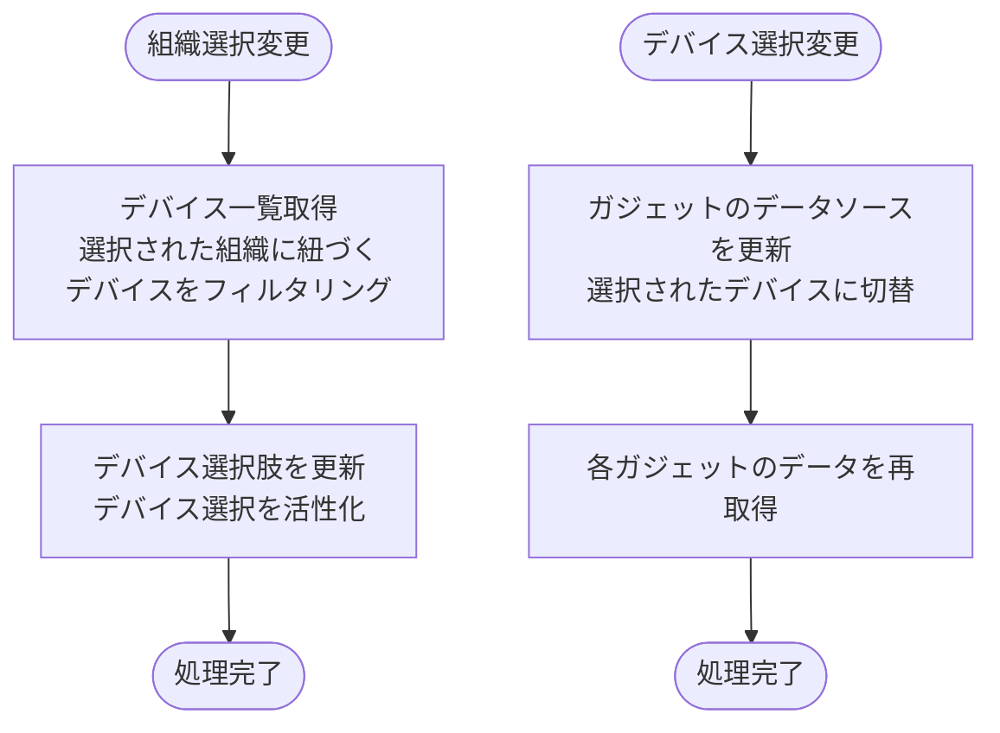

#### 処理詳細

データソース選択はクライアントサイドとサーバーサイドの連携処理です。データソース選択フォームはグローバルフィルタとして機能し、ガジェットの `data_source_config` 自体は変更せず、Unity Catalogからデータ取得する際のWHERE句パラメータを動的に変更します。

**組織選択変更時:**
- 選択された組織に紐づくデバイス一覧を取得
- デバイス選択の選択肢を更新
- デバイス選択を活性化
- データソースが「組織」のガジェットは、選択された組織がデータソースになる（WHERE句の `organization_id` が変更）

**デバイス選択変更時:**
- データソースが「デバイス」のガジェットのうち、**デバイス可変モード**（`data_source_config.device_id` が null）のものは、選択されたデバイスがデータソースになる（WHERE句の `device_id` が変更）
- **デバイス固定モード**（`data_source_config.device_id` が設定されている）のガジェットは、グローバルフィルタの変更対象外。登録時に指定されたデバイスIDを常に使用する
- 各ガジェットのデータを再取得

**組織・デバイスが未選択の場合:**
- ガジェットにデータが表示されない（ガジェットの枠とタイトルのみ表示）

**選択状態の永続化:**
- ユーザーの選択状態は `dashboard_user_setting.organization_id` と `dashboard_user_setting.device_id` に保存する

**ユーザー設定保存SQL:**
```sql
UPDATE dashboard_user_setting
SET
  organization_id = :organization_id,
  device_id = :device_id,
  update_date = NOW(),
  modifier = :current_user_id
WHERE
  user_id = :current_user_id
  AND delete_flag = FALSE
```

**デバイス一覧取得SQL:**
```sql
SELECT
  device_id,
  device_name
FROM
  device_master
WHERE
  organization_id = :organization_id
  AND delete_flag = FALSE
ORDER BY
  device_id ASC
```

**サービス関数実装例:**
```python
# services/customer_dashboard/common.py
def get_devices_by_organization(org_id):
    """組織に紐づくデバイス一覧をdevice_id昇順で返す（AJAXエンドポイント用）"""
    return (
        db.session.query(DeviceMaster)
        .filter(
            DeviceMaster.organization_id == org_id,
            DeviceMaster.delete_flag == False,
        )
        .order_by(DeviceMaster.device_id)
        .all()
    )


def update_datasource_setting(user_id, organization_id, device_id, modifier):
    """ユーザー設定の組織ID・デバイスIDを更新する。未選択はNULLで保持する"""
    setting = (
        db.session.query(DashboardUserSetting)
        .filter(
            DashboardUserSetting.user_id == user_id,
            DashboardUserSetting.delete_flag == False,
        )
        .first()
    )
    if setting is not None:
        setting.organization_id = organization_id
        setting.device_id = device_id
        setting.modifier = modifier
```

**Flaskルート実装例（No.26 デバイス一覧取得）:**
```python
# views/analysis/customer_dashboard/common.py
@customer_dashboard_bp.route('/organizations/<int:org_id>/devices', methods=['GET'])
def organization_devices(org_id):
    """デバイス一覧取得（AJAX）"""

    # スコープ内に対象組織が存在するかチェック
    org = (
        db.session.query(VOrganizationMasterByUser)
        .filter(
            VOrganizationMasterByUser.user_id == g.current_user.user_id,
            VOrganizationMasterByUser.organization_id == org_id,
            VOrganizationMasterByUser.delete_flag == False,
        )
        .first()
    )
    if not org:
        abort(403)

    try:
        devices = get_devices_by_organization(org_id)
        return jsonify({
            'devices': [
                {'device_id': d.device_id, 'device_name': d.device_name}
                for d in devices
            ]
        })

    except Exception as e:
        logger.error(f'デバイス一覧取得エラー: {str(e)}')
        return jsonify({'error': 'デバイス一覧の取得に失敗しました'}), 500
```

**Flaskルート実装例（No.27 データソース設定保存）:**
```python
# views/analysis/customer_dashboard/common.py
@customer_dashboard_bp.route('/datasource/save', methods=['POST'])
def datasource_save():
    """データソース設定保存（AJAX）"""
    try:
        data = request.get_json()
        organization_id = data.get('organization_id') if data else None  # 未選択の場合は None（NULLとして保存）
        device_id = data.get('device_id') if data else None              # 未選択の場合は None（NULLとして保存）
        update_datasource_setting(
            user_id=g.current_user.user_id,
            organization_id=organization_id,
            device_id=device_id,
            modifier=g.current_user.user_id,
        )
        db.session.commit()
        return jsonify({'status': 'ok'})

    except Exception as e:
        db.session.rollback()
        logger.error(f'データソース設定保存エラー: {str(e)}')
        return jsonify({'error': 'データソース設定の保存に失敗しました'}), 500
```

---

### CSVエクスポート

詳細はガジェット個別仕様書の`CSVエクスポート`を参照してください。

- **棒グラフ:** [棒グラフ-ワークフロー仕様書](../bar-chart/workflow-specification.md)
- **円グラフ:** [円グラフ-ワークフロー仕様書](../circle/workflow-specification.md)
- **積み上げ棒グラフ:** [積み上げ棒グラフ-ワークフロー仕様書](../stacked-bar-chart/workflow-specification.md)
- **時系列グラフ:** [時系列グラフ-ワークフロー仕様書](../timeline/workflow-specification.md)
- **表:** [表-ワークフロー仕様書](../grid/workflow-specification.md)

---

### 展開・縮小操作

**トリガー:** (6.1) 展開縮小ボタンクリック

**前提条件:** なし

#### 処理詳細

展開・縮小はクライアントサイドのみの処理です。サーバーサイドへのリクエストは発生しません。

- ダッシュボードグループヘッダーの展開縮小ボタンクリック: 該当グループ内のガジェットの表示/非表示を切り替え

---

## 使用データベース詳細

### 使用テーブル一覧

| No | テーブル名 | 論理名 | データソース | 操作種別 | ワークフロー | 目的 |
|----|-----------|--------|-------------|---------|------------|------|
| 1 | dashboard_master | ダッシュボードマスタ | OLTP DB | SELECT/INSERT/UPDATE | ダッシュボード管理 | ダッシュボード情報の取得・登録・更新・論理削除 |
| 2 | dashboard_group_master | ダッシュボードグループマスタ | OLTP DB | SELECT/INSERT/UPDATE | グループ管理 | グループ情報の取得・登録・更新・論理削除 |
| 3 | dashboard_gadget_master | ダッシュボードガジェットマスタ | OLTP DB | SELECT/INSERT/UPDATE | ガジェット管理、レイアウト保存 | ガジェット情報の取得・登録・更新・論理削除、レイアウト情報保存 |
| 4 | gadget_type_master | ガジェット種別マスタ | OLTP DB | SELECT | ガジェット追加 | ガジェット種別の選択肢取得 |
| 5 | dashboard_user_setting | ダッシュボードユーザー設定 | OLTP DB | SELECT/INSERT/UPDATE | 初期表示、表示切替 | ユーザー固有設定の管理 |
| 6 | organization_master | 組織マスタ | OLTP DB | SELECT | 初期表示、データソース選択 | 組織選択肢取得 |
| 7 | organization_closure | 組織閉包テーブル | OLTP DB | SELECT | 全ワークフロー | データスコープ制限 |
| 8 | device_master | デバイスマスタ | OLTP DB | SELECT | データソース選択 | デバイス選択肢取得 |

---

## トランザクション管理

**トランザクション開始条件:**
- データベースへの書き込み操作（INSERT/UPDATE）がある場合
- フォームバリデーションが完了している場合
- 認証・認可チェックが完了している場合

**トランザクションコミット条件:**
- すべてのデータベース操作が正常に完了した場合

**トランザクションロールバック条件:**
- いずれかのデータベース操作が失敗した場合

**トランザクション管理が必要なワークフロー:**

| ワークフロー | 操作テーブル | トランザクション要否 | 備考 |
|------------|------------|-------------------|------|
| ダッシュボード初期表示（ユーザー設定未登録時） | dashboard_user_setting | 必要 | ユーザー設定が存在しない場合のみ先頭ダッシュボードIDを自動登録 |
| ダッシュボード登録 | dashboard_master, dashboard_user_setting | 必要 | 2テーブルへの書き込み |
| ダッシュボード削除 | dashboard_gadget_master, dashboard_group_master, dashboard_master, dashboard_user_setting | 必要 | 4テーブルへの書き込み（カスケード削除） |
| ダッシュボードグループ削除 | dashboard_gadget_master, dashboard_group_master | 必要 | 2テーブルへの書き込み（カスケード削除） |
| レイアウト保存 | dashboard_gadget_master | 必要 | 複数レコードへの一括更新 |
| データソース設定保存 | dashboard_user_setting | 必要 | 1レコードへの更新 |

**読み取り専用ワークフロー（トランザクション不要）:**
- ダッシュボード初期表示（※ユーザー設定未登録時は dashboard_user_setting への書き込みが発生するため除く）
- ダッシュボード管理モーダル表示
- ガジェット追加モーダル表示
- ガジェットデータ取得
- CSVエクスポート
- デバイス一覧取得

---

## セキュリティ実装

### 認証・認可実装

**認証方式:**
- Databricksリバースプロキシヘッダ認証（`X-Forwarded-User`）

**認可ロジック:**

組織階層に基づいて、ユーザーがアクセスできるデータを制限します。

**処理内容:**
- 組織・デバイス等の一覧取得VIEW（v_organization_master_by_user 等）:
  - VIEWが内部で organization_closure を参照し、アクセス可能な組織配下のデータのみ返す
- ダッシュボード用VIEW（v_dashboard_master_by_user 等）:
  - user_master.organization_id = dashboard_master.organization_id の直接JOINでスコープ制限を適用
  - ユーザーの所属組織のダッシュボードのみアクセス可能（下位組織のダッシュボードは対象外）

**実装例:**
```python
# 組織一覧取得
def get_organizations():
    # v_organization_master_by_user に user_id を渡すだけでスコープ制限が自動適用される
    return (
        db.session.query(VOrganizationMasterByUser)
        .filter(
            VOrganizationMasterByUser.user_id == g.current_user.user_id,
            VOrganizationMasterByUser.delete_flag == False,
        )
        .order_by(VOrganizationMasterByUser.organization_id)
        .all()
    )
```

### ログ出力ルール

**出力する情報:**
- リクエストID
- ユーザーID（操作者）
- 操作種別（ダッシュボード登録、更新、削除、ガジェット登録、レイアウト保存等）
- 対象リソースID（dashboard_id、group_id、gadget_id）
- 処理結果（成功/失敗）
- エラー種別（バリデーションエラー、DBエラー等）
- タイムスタンプ（UTC）

**出力しない情報（機密情報）:**
- 認証トークン
- センサーデータの具体値

**実装例:**
```python
import logging

logger = logging.getLogger(__name__)

@customer_dashboard_bp.route('/dashboards/register', methods=['POST'])
def dashboard_register():
    logger.info(f'ダッシュボード登録開始: user_id={g.current_user.user_id}')

    try:
        # ... 処理 ...
        logger.info(f'ダッシュボード登録成功: dashboard_id={dashboard.dashboard_id}')
        return response
    except Exception as e:
        logger.error(f'ダッシュボード登録エラー: error={str(e)}')
        abort(500)
```

---

## 関連ドキュメント

### 画面仕様
- [機能概要 README](./README.md) - 画面の概要、アーキテクチャ
- [UI仕様書](./ui-specification.md) - UI要素の詳細、バリデーションルール

### アーキテクチャ設計
- [バックエンド設計](../../../01-architecture/backend.md) - Flask/LDP設計、Blueprint構成
- [フロントエンド設計](../../../01-architecture/frontend.md) - Flask + Jinja2設計

### 共通仕様
- [共通仕様書](../../common/common-specification.md) - HTTPステータスコード、エラーコード等
- [UI共通仕様書](../../common/ui-common-specification.md) - すべての画面に共通するUI仕様

### 要件定義
- [機能要件定義書](../../../02-requirements/functional-requirements.md) - FR-006
- [非機能要件定義書](../../../02-requirements/non-functional-requirements.md) - パフォーマンス、セキュリティ要件
- [技術要件定義書](../../../02-requirements/technical-requirements.md) - 技術スタック、実装方針

---
