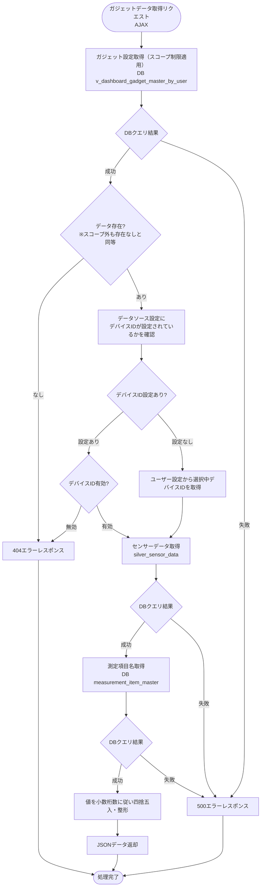
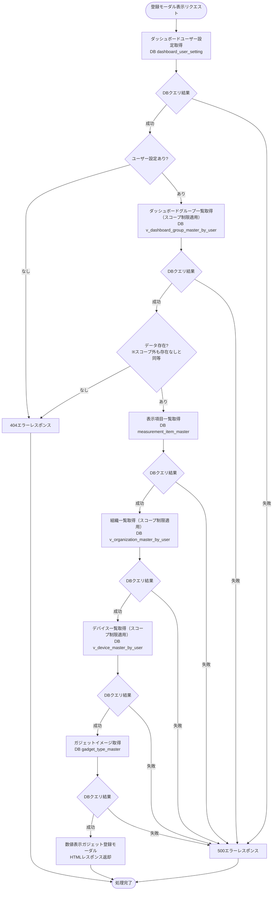
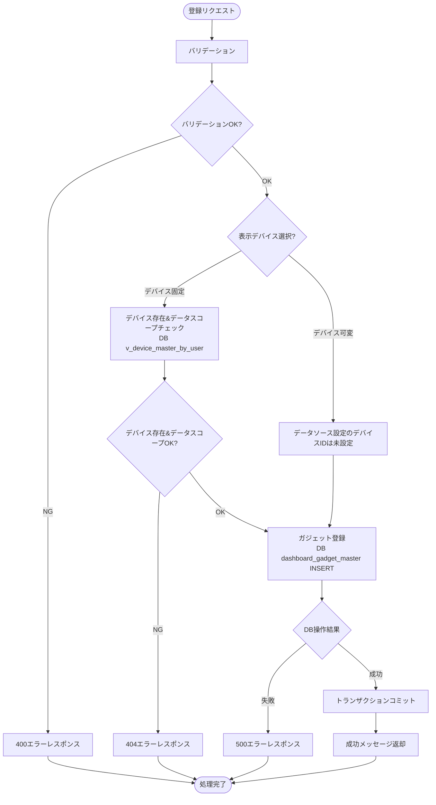

# 顧客作成ダッシュボード数値表示ガジェット - ワークフロー仕様書

## 📑 目次

- [顧客作成ダッシュボード数値表示ガジェット - ワークフロー仕様書](#顧客作成ダッシュボード数値表示ガジェット---ワークフロー仕様書)
  - [📑 目次](#-目次)
  - [概要](#概要)
  - [使用するFlaskルート一覧](#使用するflaskルート一覧)
  - [ルート呼び出しマッピング](#ルート呼び出しマッピング)
    - [数値表示ガジェット](#数値表示ガジェット)
    - [数値表示ガジェット登録モーダル](#数値表示ガジェット登録モーダル)
  - [ワークフロー一覧](#ワークフロー一覧)
    - [ガジェット初期表示](#ガジェット初期表示)
      - [処理フロー](#処理フロー)
      - [Flaskルート](#flaskルート)
      - [バリデーション](#バリデーション)
      - [処理詳細（サーバーサイド）](#処理詳細サーバーサイド)
    - [ガジェットデータ取得](#ガジェットデータ取得)
      - [処理フロー](#処理フロー-1)
      - [Flaskルート](#flaskルート-1)
      - [バリデーション](#バリデーション-1)
      - [処理詳細（サーバーサイド）](#処理詳細サーバーサイド-1)
    - [ガジェット登録モーダル表示](#ガジェット登録モーダル表示)
      - [処理フロー](#処理フロー-2)
      - [Flaskルート](#flaskルート-2)
      - [バリデーション](#バリデーション-2)
      - [処理詳細（サーバーサイド）](#処理詳細サーバーサイド-2)
      - [エラーハンドリング](#エラーハンドリング)
    - [ガジェット登録](#ガジェット登録)
      - [処理フロー](#処理フロー-3)
      - [Flaskルート](#flaskルート-3)
      - [バリデーション](#バリデーション-3)
      - [処理詳細（サーバーサイド）](#処理詳細サーバーサイド-3)
      - [エラーハンドリング](#エラーハンドリング-1)
  - [セキュリティ実装](#セキュリティ実装)
    - [認証・認可実装](#認証認可実装)
    - [入力検証](#入力検証)
    - [ログ出力ルール](#ログ出力ルール)
  - [関連ドキュメント](#関連ドキュメント)
    - [画面仕様](#画面仕様)
    - [共通仕様](#共通仕様)
    - [データベース](#データベース)

**重要:** 顧客作成ダッシュボード画面の共通仕様は [共通ワークフロー仕様書](../common/workflow-specification.md) を参照してください。

---

## 概要

このドキュメントは、顧客作成ダッシュボード数値表示ガジェット機能のユーザー操作に対する処理フロー、データベース処理、エラーハンドリングの詳細を記載します。

**このドキュメントの役割:**
- ✅ ユーザー操作のトリガー条件
- ✅ 処理フローの詳細（Flaskルート呼び出し、AJAX通信、リダイレクト）
- ✅ エラーハンドリングフロー
- ✅ サーバーサイド処理詳細（SQL、変数、条件分岐、コード例）
- ✅ データベース利用詳細（テーブル操作、トランザクション管理）
- ✅ セキュリティ実装詳細（認証、データスコープ制限、ログ出力）

**UI仕様書との役割分担:**
- **UI仕様書**: 画面レイアウト、UI要素の詳細仕様、数値フォーマット定義
- **ワークフロー仕様書**: 処理フロー、データベース処理、エラーハンドリング、サーバーサイド実装詳細

**注:** UI要素の詳細は [UI仕様書](./ui-specification.md) を参照してください。

---

## 使用するFlaskルート一覧

| No | ルート名 | エンドポイント | メソッド | 用途 | レスポンス形式 | 備考 |
|----|---------|---------------|---------|------|---------------|------|
| 1 | 顧客作成ダッシュボード表示 | `/analysis/customer-dashboard` | GET | 初期表示（数値表示ガジェット埋め込み） | HTML | 共通ルート |
| 2 | ガジェットデータ取得 | `/analysis/customer-dashboard/gadgets/<gadget_uuid>/data` | POST | 最新センサー値取得 | JSON (AJAX) | ガジェット種別共通ルート |
| 3 | ガジェット登録画面 | `/analysis/customer-dashboard/gadgets/numerical-display/create` | GET | 登録モーダル表示 | HTML（モーダル） | - |
| 4 | ガジェット登録実行 | `/analysis/customer-dashboard/gadgets/numerical-display/register` | POST | ガジェット登録処理 | JSON (AJAX) | - |

**注:**
- **レスポンス形式**:
  - `HTML`: Jinja2テンプレートをレンダリングして返す（`render_template()`）
  - `HTML（モーダル）`: モーダルダイアログ用のHTMLフラグメントを返す
  - `JSON (AJAX)`: JavaScriptからの非同期リクエストに対してJSONレスポンスを返す
- **Flask Blueprint構成**: `customer_dashboard_bp` として実装

---

## ルート呼び出しマッピング

### 数値表示ガジェット

| ユーザー操作 | トリガー | 呼び出すルート | パラメータ | レスポンス | エラー時の挙動 |
|-------------|---------|-------------|-----------|-----------|---------------|
| ダッシュボード表示 | URLアクセス | `GET /analysis/customer-dashboard` | - | HTML（ガジェット含む） | エラーページ表示 |
| ガジェット初期表示（自動） | ページロード後JS | `POST /analysis/customer-dashboard/gadgets/<gadget_uuid>/data` | `gadget_uuid` | JSON（最新値） | ガジェット内エラー表示 |
| 自動更新（60秒毎） | setInterval | `POST /analysis/customer-dashboard/gadgets/<gadget_uuid>/data` | 同上 | JSON（最新値） | ガジェット内エラー表示 |

### 数値表示ガジェット登録モーダル

| ユーザー操作 | トリガー | 呼び出すルート | パラメータ | レスポンス | エラー時の挙動 |
|-------------|---------|-------------|-----------|-----------|---------------|
| ガジェット種別選択（数値表示） | ガジェット追加モーダルでの選択 | `GET /analysis/customer-dashboard/gadgets/numerical-display/create` | - | HTML（登録モーダル） | エラーページ表示 |
| 登録ボタン押下 | フォーム送信 | `POST /analysis/customer-dashboard/gadgets/numerical-display/register` | フォームデータ | JSON（成功/エラー） | エラートースト表示 |

---

## ワークフロー一覧

### ガジェット初期表示

**トリガー:** ダッシュボードページロード後、JavaScriptがガジェットごとにデータ取得を自動実行

**前提条件:**
- ユーザーがログイン済み（Databricks認証完了）
- 適切な権限を持っている（システム保守者、管理者、販社ユーザ、サービス利用者）

#### 処理フロー

[共通ワークフロー仕様書](../common/workflow-specification.md) のダッシュボード初期表示と同様の処理フローに従います。

#### Flaskルート

| ルート | エンドポイント | 詳細 |
|-------|---------------|------|
| 顧客作成ダッシュボード表示 | `GET /analysis/customer-dashboard` | 共通ルート（ガジェット設定を含むHTMLを返す） |

#### バリデーション

**実行タイミング:** なし

#### 処理詳細（サーバーサイド）

[共通ワークフロー仕様書](../common/workflow-specification.md) のダッシュボード初期表示の処理詳細（①〜⑨）と同様の処理を実行します。

数値表示ガジェット固有の追加処理はありません。

---

### ガジェットデータ取得

**トリガー:** ページロード後の自動実行、および60秒ごとの自動更新

**前提条件:**
- `gadget_uuid` が有効なガジェットを指している
- ユーザーのデータスコープ内のデバイスであること

#### 処理フロー



#### Flaskルート

| ルート | エンドポイント | 詳細 |
|-------|---------------|------|
| ガジェットデータ取得 | `POST /analysis/customer-dashboard/gadgets/<gadget_uuid>/data` | `gadget_uuid` でガジェット特定、ガジェット種別に応じた処理を実行 |

#### バリデーション

**実行タイミング:** リクエスト受信直後（サーバーサイド）

**バリデーション対象:** なし

**ガジェット種別チェックについて:**

`handle_gadget_data` 呼び出し時点で、ガジェット種別が「数値表示」であることはルーティング層が保証しているため、本ハンドラ内でのガジェット種別チェックは不要。

ルーティングの保証は `common.py` の `gadget_data` ルート（No.23）が以下の手順で実現する：

1. `get_gadget_type(gadget_uuid)` で DB から `gadget_type_name`（例: `"数値表示"`）を取得
2. `_GADGET_REGISTRY` に登録済みの種別名に対応するモジュールの `handle_gadget_data` をディスパッチ
3. `_GADGET_REGISTRY` に未登録の種別は `handler = None` → `abort(500)` となりハンドラに到達しない

したがって、`handle_gadget_data` が実行される時点では `gadget_uuid` が数値表示ガジェットを指すことが確定している。数値表示ガジェット機能を実装する際は `_GADGET_REGISTRY`（`views/analysis/customer_dashboard/common.py`）への登録が必要。

#### 処理詳細（サーバーサイド）

**① ガジェット設定取得**

**使用テーブル:** v_dashboard_gadget_master_by_user

**SQL詳細:**
```sql
SELECT
  gadget_id,
  gadget_uuid,
  gadget_type_id,
  gadget_type_slug,
  chart_config,
  data_source_config
FROM
  v_dashboard_gadget_master_by_user
WHERE
  user_id = :current_user_id
  AND gadget_uuid = :gadget_uuid
  AND delete_flag = FALSE
```

**chart_config JSON スキーマ:**
```json
{
  "primary_measurement_item_id": 1,
  "secondary_measurement_item_id": 2
}
```
※ `secondary_measurement_item_id` が `null` の場合はガジェットに1項目のみ表示

**data_source_config JSON スキーマ:**
```json
{
  "device_id": 12345
}
```
※ `device_id` が `null` の場合はデバイス可変モード

---

**② デバイスID決定**

`data_source_config.device_id` を参照し、デバイスIDを決定します。

- **デバイス固定モード** (`device_id` が設定されている場合): `data_source_config.device_id` を使用
  - デバイスIDの削除フラグチェックを実施する → デバイスIDが論理削除済みなら404エラーレスポンスを返却
- **デバイス可変モード** (`device_id` が `null` の場合): ユーザー設定 (`dashboard_user_setting.device_id`) を使用

**SQL詳細（デバイス固定モード: デバイスID有効性チェック）:**
```sql
SELECT
  device_id
FROM
  v_device_master_by_user
WHERE
  user_id = :current_user_id
  AND device_id = :device_id
  AND delete_flag = FALSE
```

**SQL詳細（デバイス可変モード: ユーザー設定取得）:**
```sql
SELECT
  device_id
FROM
  dashboard_user_setting
WHERE
  user_id = :current_user_id
  AND delete_flag = FALSE
```

---

**③ センサーデータ取得**

**使用テーブル:** silver_sensor_data, user_master, organization_closure

**SQL詳細:** 
```sql
SELECT
  event_timestamp, 
  external_temp,
  set_temp_freezer_1,
  internal_sensor_temp_freezer_1,
  internal_temp_freezer_1,
  df_temp_freezer_1,
  condensing_temp_freezer_1,
  adjusted_internal_temp_freezer_1,
  set_temp_freezer_2,
  internal_sensor_temp_freezer_2,
  internal_temp_freezer_2,
  df_temp_freezer_2,
  condensing_temp_freezer_2,
  adjusted_internal_temp_freezer_2,
  compressor_freezer_1,
  compressor_freezer_2,
  fan_motor_1,
  fan_motor_2,
  fan_motor_3,
  fan_motor_4,
  fan_motor_5,
  defrost_heater_output_1,
  defrost_heater_output_2
FROM
  user_master u
INNER JOIN
  organization_closure oc
  ON u.organization_id = oc.parent_organization_id
INNER JOIN
  silver_sensor_data s
  ON oc.subsidiary_organization_id = s.organization_id
WHERE
  u.user_id = :current_user_id
  AND u.delete_flag = FALSE
  AND device_id = :device_id
ORDER BY
  event_timestamp DESC
LIMIT 1
```

---

**④ 測定項目名取得**

**使用テーブル:** measurement_item_master

**SQL詳細:** 
```sql
SELECT
  measurement_item_id,
  silver_data_column_name,
  display_name,
  unit_name
FROM
  measurement_item_master
WHERE
  delete_flag = FALSE
ORDER BY
  measurement_item_id
```

**⑤ データ整形**

取得データを四捨五入・整形します。

```python
# 変数: chart_config, sensor_row, item_map は前ステップで取得済み
# item_map: {measurement_item_id: MeasurementItemMaster row}

primary_item_id = chart_config.get("primary_measurement_item_id")
secondary_item_id = chart_config.get("secondary_measurement_item_id")


def _get_label(item_id):
    """測定項目IDから "表示名（単位）" 形式のラベルを返す。未存在の場合は None"""
    item = item_map.get(item_id)
    if item is None:
        return None
    return f"{item.display_name}（{item.unit_name}）"


def _get_value(item_id):
    """測定項目IDに対応する最新センサー値を小数点以下2桁で四捨五入して返す。
    sensor_row が None または値が NULL の場合は None を返す。
    """
    if sensor_row is None or item_id is None:
        return None
    item = item_map.get(item_id)
    if item is None:
        return None
    raw = dict(sensor_row._mapping).get(item.silver_data_column_name)
    if raw is None:
        return None
    return round(float(raw), 2)


chart_data = {
    "primary_label": _get_label(primary_item_id),
    "primary_value": _get_value(primary_item_id),
    "secondary_label": _get_label(secondary_item_id),
    "secondary_value": _get_value(secondary_item_id),
}

# センサーデータあり: event_timestamp を使用
# センサーデータなし: 現在時刻を使用（データなし時も updated_at は返却する）
updated_at = (
    sensor_row.event_timestamp.strftime("%Y/%m/%d %H:%M:%S")
    if sensor_row and sensor_row.event_timestamp
    else datetime.now().strftime("%Y/%m/%d %H:%M:%S")
)
```

---

**⑥ レスポンス形式**

```json
{
  "gadget_uuid": "xxxxxxxx-xxxx-xxxx-xxxx-xxxxxxxxxxxx",
  "device_name": "DEV-001",
  "chart_data": {
    "primary_label": "外気温度（℃）",
    "primary_value": 25.11,
    "secondary_label": "第1冷凍 設定温度（℃）",
    "secondary_value": -5.11
  },
  "updated_at": "2026/03/05 12:00:00"
}
```

データなしの場合:
```json
{
  "gadget_uuid": "xxxxxxxx-xxxx-xxxx-xxxx-xxxxxxxxxxxx",
  "device_name": "DEV-001",
  "chart_data": {"primary_label": null, "primary_value": null, "secondary_label": null, "secondary_value": null},
  "updated_at": "2026/03/05 12:00:00"
}
```

---

**⑦ 実装例**

```python
def handle_gadget_data(gadget_uuid):
    """数値表示ガジェットデータ取得（AJAX）"""
    current_user_id = g.current_user.user_id

    # ① ガジェット設定取得（v_dashboard_gadget_master_by_user によりスコープ制限適用）
    gadget_row = db.session.execute(
        text("""
            SELECT gadget_uuid, chart_config, data_source_config
            FROM v_dashboard_gadget_master_by_user
            WHERE user_id = :current_user_id
              AND gadget_uuid = :gadget_uuid
              AND delete_flag = FALSE
        """),
        {"current_user_id": current_user_id, "gadget_uuid": gadget_uuid},
    ).fetchone()

    if gadget_row is None:
        return jsonify({"error": err_not_found("ガジェット")}), 404

    chart_config = json.loads(gadget_row.chart_config or "{}")
    data_source_config = json.loads(gadget_row.data_source_config or "{}")

    # ② デバイスID決定
    device_id = data_source_config.get("device_id")

    if device_id is not None:
        # デバイス固定モード: v_device_master_by_user で有効性チェック
        device_check = db.session.execute(
            text("""
                SELECT device_id, device_name
                FROM v_device_master_by_user
                WHERE user_id = :current_user_id
                  AND device_id = :device_id
                  AND delete_flag = FALSE
            """),
            {"current_user_id": current_user_id, "device_id": device_id},
        ).fetchone()

        if device_check is None:
            return jsonify({"error": err_not_found("デバイス")}), 404
        device_name = device.check.device_name
    else:
        # デバイス可変モード: dashboard_user_setting からデバイスIDを取得
        setting = db.session.execute(
            text("""
                SELECT device_id
                FROM dashboard_user_setting
                WHERE user_id = :current_user_id
                  AND delete_flag = FALSE
            """),
            {"current_user_id": current_user_id},
        ).fetchone()
        device_id = setting.device_id if setting else None
        device_name = None

    try:
        # ③ センサーデータ取得（user_master・organization_closure JOIN でスコープ制限）
        sensor_row = None
        if device_id is not None:
            sensor_row = db.session.execute(
                text("""
                    SELECT
                      s.event_timestamp,
                      s.external_temp, s.set_temp_freezer_1,
                      s.internal_sensor_temp_freezer_1, s.internal_temp_freezer_1,
                      s.df_temp_freezer_1, s.condensing_temp_freezer_1,
                      s.adjusted_internal_temp_freezer_1, s.set_temp_freezer_2,
                      s.internal_sensor_temp_freezer_2, s.internal_temp_freezer_2,
                      s.df_temp_freezer_2, s.condensing_temp_freezer_2,
                      s.adjusted_internal_temp_freezer_2, s.compressor_freezer_1,
                      s.compressor_freezer_2, s.fan_motor_1, s.fan_motor_2,
                      s.fan_motor_3, s.fan_motor_4, s.fan_motor_5,
                      s.defrost_heater_output_1, s.defrost_heater_output_2
                    FROM user_master u
                    INNER JOIN organization_closure oc
                      ON u.organization_id = oc.parent_organization_id
                    INNER JOIN silver_sensor_data s
                      ON oc.subsidiary_organization_id = s.organization_id
                    WHERE u.user_id = :current_user_id
                      AND u.delete_flag = FALSE
                      AND s.device_id = :device_id
                    ORDER BY s.event_timestamp DESC
                    LIMIT 1
                """),
                {"current_user_id": current_user_id, "device_id": device_id},
            ).fetchone()

        # ④ 測定項目名取得
        item_rows = db.session.execute(
            text("""
                SELECT measurement_item_id, silver_data_column_name, display_name
                FROM measurement_item_master
                WHERE delete_flag = FALSE
                ORDER BY measurement_item_id
            """)
        ).fetchall()
        item_map = {row.measurement_item_id: row for row in item_rows}

        # ⑤ データ整形
        primary_item_id = chart_config.get("primary_measurement_item_id")
        secondary_item_id = chart_config.get("secondary_measurement_item_id")

        def _get_label(item_id):
            item = item_map.get(item_id)
            return f"{item.display_name}（{item.unit_name}）" if item else None

        def _get_value(item_id):
            if sensor_row is None or item_id is None:
                return None
            item = item_map.get(item_id)
            if item is None:
                return None
            raw = dict(sensor_row._mapping).get(item.silver_data_column_name)
            if raw is None:
                return None
            return round(float(raw), 2)

        chart_data = {
            "primary_label": _get_label(primary_item_id),
            "primary_value": _get_value(primary_item_id),
            "secondary_label": _get_label(secondary_item_id),
            "secondary_value": _get_value(secondary_item_id),
        }
        updated_at = (
            sensor_row.event_timestamp.strftime("%Y/%m/%d %H:%M:%S")
            if sensor_row and sensor_row.event_timestamp
            else datetime.now().strftime("%Y/%m/%d %H:%M:%S")
        )

        return jsonify({
            "gadget_uuid": gadget_uuid,
            "device_name": device_name,
            "chart_data": chart_data,
            "updated_at": updated_at,
        })

    except Exception as e:
        logger.error(
            f"数値表示データ取得エラー: gadget_uuid={gadget_uuid}, error={str(e)}",
            exc_info=True,
        )
        return jsonify({"error": err_fetch_failed("データ")}), 500
```

---

### ガジェット登録モーダル表示

**トリガー:** ガジェット追加モーダルの登録画面ボタンクリック

**前提条件:**
- ガジェット追加モーダルが表示されている
- ガジェット種別が選択されている

**注:** ガジェット追加モーダルのUI仕様は [共通UI仕様書](../common/ui-specification.md) を参照してください。

#### 処理フロー



#### Flaskルート

| ルート | エンドポイント | 詳細 |
|-------|---------------|------|
| ガジェット登録画面 | `GET /analysis/customer-dashboard/gadgets/numerical-display/create` | モーダルHTMLを返す |

#### バリデーション

**実行タイミング:** なし

#### 処理詳細（サーバーサイド）

**① ダッシュボードユーザー設定取得**

**使用テーブル:** dashboard_user_setting

```sql
SELECT
  dashboard_id,
  organization_id,
  device_id
FROM
  dashboard_user_setting
WHERE
  user_id = :current_user_id
  AND delete_flag = FALSE
```

---

**② ダッシュボードグループ一覧取得**

**使用テーブル:** v_dashboard_group_master_by_user

```sql
SELECT
  dashboard_group_id,
  dashboard_group_uuid,
  dashboard_group_name
FROM
  v_dashboard_group_master_by_user
WHERE
  user_id = :current_user_id
  AND dashboard_id = :dashboard_id
  AND delete_flag = FALSE
ORDER BY
  display_order ASC
```

---

**③ 表示項目一覧取得**

**使用テーブル:** measurement_item_master

```sql
SELECT
  measurement_item_id,
  display_name,
  unit_name
FROM
  measurement_item_master
WHERE
  delete_flag = FALSE
ORDER BY
  measurement_item_id ASC
```

---

**④ 組織一覧取得**

**使用テーブル:** v_organization_master_by_user

```sql
SELECT
  organization_id,
  organization_name
FROM
  v_organization_master_by_user
WHERE
  user_id = :current_user_id
  AND delete_flag = FALSE
ORDER BY
  organization_id ASC
```

---

**⑤ デバイス一覧取得（デバイス固定モード用）**

**使用テーブル:** v_device_master_by_user

```sql
SELECT
  device_id,
  device_name,
  organization_id
FROM
  v_device_master_by_user
WHERE
  user_id = :current_user_id
  AND delete_flag = FALSE
ORDER BY
  device_id ASC
```

---

**⑥ 実装例**

```python
def handle_gadget_create(gadget_type):
    """数値表示ガジェット登録モーダル表示"""
    from iot_app.forms.customer_dashboard.numerical_display import NumericalDisplayGadgetForm
    current_user_id = g.current_user.user_id

    # ① ダッシュボードユーザー設定取得
    setting = db.session.execute(
        text("""
            SELECT dashboard_id, organization_id, device_id
            FROM dashboard_user_setting
            WHERE user_id = :current_user_id
              AND delete_flag = FALSE
        """),
        {"current_user_id": current_user_id},
    ).fetchone()

    if setting is None:
        abort(404)

    # ② ダッシュボードグループ一覧取得（v_dashboard_group_master_by_user でスコープ制限）
    group_rows = db.session.execute(
        text("""
            SELECT dashboard_group_id, dashboard_group_uuid, dashboard_group_name
            FROM v_dashboard_group_master_by_user
            WHERE user_id = :current_user_id
              AND dashboard_id = :dashboard_id
              AND delete_flag = FALSE
            ORDER BY display_order ASC
        """),
        {"current_user_id": current_user_id, "dashboard_id": setting.dashboard_id},
    ).fetchall()

    if not group_rows:
        abort(404)

    # ③ 表示項目一覧取得
    item_rows = db.session.execute(
        text("""
            SELECT measurement_item_id, display_name, unit_name
            FROM measurement_item_master
            WHERE delete_flag = FALSE
            ORDER BY measurement_item_id ASC
        """)
    ).fetchall()

    # ④ 組織一覧取得（v_organization_master_by_user でスコープ制限）
    org_rows = db.session.execute(
        text("""
            SELECT organization_id, organization_name
            FROM v_organization_master_by_user
            WHERE user_id = :current_user_id
              AND delete_flag = FALSE
            ORDER BY organization_id ASC
        """),
        {"current_user_id": current_user_id},
    ).fetchall()

    # ⑤ デバイス一覧取得（v_device_master_by_user でスコープ制限）
    device_rows = db.session.execute(
        text("""
            SELECT device_id, device_name, organization_id
            FROM v_device_master_by_user
            WHERE user_id = :current_user_id
              AND delete_flag = FALSE
            ORDER BY device_id ASC
        """),
        {"current_user_id": current_user_id},
    ).fetchall()

    form = NumericalDisplayGadgetForm()
    form.primary_item_id.choices = [
        (item.measurement_item_id, item.display_name) for item in item_rows
    ]
    form.secondary_item_id.choices = [(0, "（なし）")] + [
        (item.measurement_item_id, item.display_name) for item in item_rows
    ]
    form.device_id.choices = [(0, "選択してください")] + [
        (d.device_id, d.device_name) for d in device_rows
    ]
    form.group_id.choices = [(0, "選択してください")] + [
        (gr.dashboard_group_id, gr.dashboard_group_name) for gr in group_rows
    ]

    return render_template(
        "analysis/customer_dashboard/gadgets/modals/numerical_display.html",
        form=form,
        gadget_type=gadget_type,
        group_rows=group_rows,
        item_rows=item_rows,
        org_rows=org_rows,
        device_rows=device_rows,
    )
```

#### エラーハンドリング

| HTTPステータス | エラー種別 | 処理内容 | 表示内容 |
|--------------|-----------|---------|---------|
| 400 | バリデーションエラー | フォーム再表示 | バリデーションエラーメッセージ |
| 404 | リソース不存在 | 404エラートースト表示 | ダッシュボードが見つかりません |
| 500 | データベースエラー | 500エラーページ表示 | データの取得に失敗しました |

---

### ガジェット登録

**トリガー:** ガジェット登録モーダルの登録ボタンクリック

**前提条件:**
- すべての必須フォーム項目が入力されている

#### 処理フロー



#### Flaskルート

| ルート | エンドポイント | 詳細 |
|-------|---------------|------|
| ガジェット登録実行 | `POST /analysis/customer-dashboard/gadgets/numerical-display/register` | フォームデータ: `title, device_mode, device_id, group_id, primary_item_id, secondary_item_id` |

#### バリデーション

**実行タイミング:** フォーム送信直後（サーバーサイド、WTForms）

**バリデーション対象:** [UI仕様書](./ui-specification.md) の バリデーション（ガジェット登録画面） を参照

#### 処理詳細（サーバーサイド）

**① デバイス存在&データスコープチェック（デバイス固定モード時のみ）**

**使用テーブル:** v_device_master_by_user

```sql
SELECT
  device_id,
  device_name,
  organization_id
FROM
  v_device_master_by_user
WHERE
  user_id = :current_user_id
  AND device_id = :device_id
  AND delete_flag = FALSE
```

---

**② ガジェット登録**

**使用テーブル:** dashboard_gadget_master

```sql
INSERT INTO dashboard_gadget_master (
  gadget_uuid,
  gadget_name,
  dashboard_group_id,
  gadget_type_id,
  chart_config,
  data_source_config,
  position_x,
  position_y,
  gadget_size,
  display_order,
  create_date,
  creator,
  update_date,
  modifier,
  delete_flag
) VALUES (
  :gadget_uuid,
  :gadget_name,
  :dashboard_group_id,
  :gadget_type_id,
  :chart_config,
  :data_source_config,
  0,
  (
    SELECT COALESCE(MAX(position_y), 0) + 1
    FROM dashboard_gadget_master
    WHERE dashboard_group_id = :dashboard_group_id
    AND delete_flag = FALSE
  ),
  :0,
  (
    SELECT COALESCE(MAX(display_order), 0) + 1
    FROM dashboard_gadget_master
    WHERE dashboard_group_id = :dashboard_group_id
    AND delete_flag = FALSE
  ),
  NOW(),
  :current_user_id,
  NOW(),
  :current_user_id,
  FALSE
)
```

**注意事項:** `gadget_size` は `0`（`2×2`）固定とする

---

**③ 実装例**

```python
def handle_gadget_register(gadget_type):
    """数値表示ガジェット登録実行"""
    from iot_app.forms.customer_dashboard.numerical_display import NumericalDisplayGadgetForm
    current_user_id = g.current_user.user_id

    form = NumericalDisplayGadgetForm()
    # JS動的ロードのため送信値をそのまま choices に設定
    submitted_primary_id = request.form.get("primary_item_id", type=int) or 0
    submitted_secondary_id = request.form.get("secondary_item_id", type=int) or 0
    submitted_device_id = request.form.get("device_id", type=int) or 0
    submitted_group_id = request.form.get("group_id", type=int) or 0
    form.primary_item_id.choices = [(submitted_primary_id, "")]
    form.secondary_item_id.choices = [(submitted_secondary_id, "")]
    form.device_id.choices = [(submitted_device_id, "")]
    form.group_id.choices = [(submitted_group_id, "")]

    if not form.validate_on_submit():
        item_rows = db.session.execute(
            text("""
                SELECT measurement_item_id, display_name, unit_name
                FROM measurement_item_master WHERE delete_flag = FALSE
                ORDER BY measurement_item_id ASC
            """)
        ).fetchall()
        setting = db.session.execute(
            text("""
                SELECT dashboard_id FROM dashboard_user_setting
                WHERE user_id = :current_user_id AND delete_flag = FALSE
            """),
            {"current_user_id": current_user_id},
        ).fetchone()
        group_rows = (
            db.session.execute(
                text("""
                    SELECT dashboard_group_id, dashboard_group_name
                    FROM v_dashboard_group_master_by_user
                    WHERE user_id = :current_user_id AND dashboard_id = :dashboard_id
                      AND delete_flag = FALSE
                    ORDER BY display_order ASC
                """),
                {"current_user_id": current_user_id, "dashboard_id": setting.dashboard_id},
            ).fetchall()
            if setting else []
        )
        device_rows = db.session.execute(
            text("""
                SELECT device_id, device_name FROM v_device_master_by_user
                WHERE user_id = :current_user_id AND delete_flag = FALSE
                ORDER BY device_id ASC
            """),
            {"current_user_id": current_user_id},
        ).fetchall()
        org_rows = db.session.execute(
            text("""
                SELECT organization_id, organization_name FROM v_organization_master_by_user
                WHERE user_id = :current_user_id AND delete_flag = FALSE
                ORDER BY organization_id ASC
            """),
            {"current_user_id": current_user_id},
        ).fetchall()
        return render_template(
            "analysis/customer_dashboard/gadgets/modals/numerical_display.html",
            form=form,
            gadget_type=gadget_type,
            group_rows=group_rows,
            item_rows=item_rows,
            org_rows=org_rows,
            device_rows=device_rows,
        ), 400

    # デバイス固定モード: v_device_master_by_user で存在&スコープチェック
    device_id = None
    if form.device_mode.data == "fixed":
        device_row = db.session.execute(
            text("""
                SELECT device_id FROM v_device_master_by_user
                WHERE user_id = :current_user_id
                  AND device_id = :device_id
                  AND delete_flag = FALSE
            """),
            {"current_user_id": current_user_id, "device_id": form.device_id.data},
        ).fetchone()

        if device_row is None:
            abort(404)
        device_id = form.device_id.data

    secondary_item_id = form.secondary_item_id.data if form.secondary_item_id.data != 0 else None

    chart_config = json.dumps({
        "primary_measurement_item_id": form.primary_item_id.data,
        "secondary_measurement_item_id": secondary_item_id,
    })
    data_source_config = json.dumps({"device_id": device_id})

    try:
        max_position_y = (
            db.session.query(func.max(DashboardGadgetMaster.position_y))
            .filter(
                DashboardGadgetMaster.dashboard_group_id == form.group_id.data,
                DashboardGadgetMaster.delete_flag == False,
            )
            .scalar()
        ) or 0

        max_order = (
            db.session.query(func.max(DashboardGadgetMaster.display_order))
            .filter(
                DashboardGadgetMaster.dashboard_group_id == form.group_id.data,
                DashboardGadgetMaster.delete_flag == False,
            )
            .scalar()
        ) or 0

        gadget_type_obj = (
            db.session.query(GadgetTypeMaster)
            .filter_by(gadget_type_name="数値表示", delete_flag=False)
            .first()
        )

        gadget = DashboardGadgetMaster(
            gadget_uuid=str(uuid.uuid4()),
            gadget_name=form.title.data,
            dashboard_group_id=form.group_id.data,
            gadget_type_id=gadget_type_obj.gadget_type_id,
            chart_config=chart_config,
            data_source_config=data_source_config,
            position_x=0,
            position_y=max_position_y + 1,
            gadget_size=0,
            display_order=max_order + 1,
            creator=current_user_id,
            modifier=current_user_id,
        )
        db.session.add(gadget)
        db.session.commit()
        return jsonify({"message": msg_created("ガジェット")})

    except Exception as e:
        db.session.rollback()
        logger.error(f"数値表示ガジェット登録エラー: {str(e)}", exc_info=True)
        abort(500)
```

#### エラーハンドリング

| HTTPステータス | エラー種別 | 処理内容 | 表示内容 |
|--------------|-----------|---------|---------|
| 400 | バリデーションエラー | フォーム再表示 | バリデーションエラーメッセージ |
| 404 | リソース不存在 | 404エラートースト表示 | 指定されたデバイスが見つかりません |
| 500 | データベースエラー | 500エラーページ表示 | データの取得に失敗しました |

---

## セキュリティ実装

### 認証・認可実装

**認証方式:**
- Azure環境: Easy Auth認証（Entra ID統合）（`X-MS-*` ヘッダーからユーザー情報・JWT取得）
- AWS環境: ALB + Cognito認証（`X-Amzn-Oidc-*` ヘッダーからユーザー情報・JWT取得）
- オンプレミス環境: 自前認証（Flask IdP）（Flaskセッションからユーザー情報取得、JWT再発行）

**認可ロジック:**
- すべてのロール（システム保守者・管理者・販社ユーザ・サービス利用者）がアクセス可能

**データスコープ制限（全ユーザー共通）:**
- 組織・デバイス等の一覧取得VIEW（v_organization_master_by_user 等）:
  - VIEWが内部で organization_closure を参照し、アクセス可能な組織配下のデータのみ返す
- ダッシュボード用VIEW（v_dashboard_master_by_user 等）:
  - user_master.organization_id = dashboard_master.organization_id の直接JOINでスコープ制限を適用
  - ユーザーの所属組織のダッシュボードのみアクセス可能（下位組織のダッシュボードは対象外）
- センサーデータ（silver_sensor_data 等）:
  - VIEWを使用せず、データ取得処理の度に organization_closure を参照し、アクセス可能な組織配下のデータのみ返す（組織・デバイス等の一覧取得VIEWと内部処理は同じ）

**実装例:**
```python
# 組織一覧取得
def get_organizations():
    # v_organization_master_by_user に user_id を渡すだけでスコープ制限が自動適用される
    return (
        db.session.query(VOrganizationMasterByUser)
        .filter(
            VOrganizationMasterByUser.user_id == g.current_user.user_id,
            VOrganizationMasterByUser.delete_flag == False,
        )
        .order_by(VOrganizationMasterByUser.organization_id)
        .all()
    )
```

### 入力検証

| 検証対象 | 検証内容 |
|---------|---------|
| `gadget_uuid` | UUID形式チェック（パスパラメータ） |
| `measurement_item_id` | 整数型チェック、`measurement_item_master` 存在確認 |
| `device_id`（fixed時） | 整数型チェック、データスコープ内確認 |
| CSRF保護 | Flask-WTF CSRFトークン検証（登録フォーム） |

### ログ出力ルール

**出力する情報:**
- リクエストID
- ユーザーID（操作者）
- 操作種別（ガジェット登録）
- 登録結果（成功/失敗）
- エラー種別（バリデーションエラー・DBエラー等）

**出力しない情報:**
- センサーデータの数値（個人情報の可能性）
- 認証トークン
- パスワード

**実装例:**
```python
# 登録成功
logger.info(
    f'数値表示ガジェット登録成功: gadget_uuid={gadget.gadget_uuid}'
)

# 登録失敗
logger.error(
    f'数値表示ガジェット登録失敗: error={str(e)}'
)
```

---

## 関連ドキュメント

### 画面仕様
- [機能概要 README](./README.md)
- [UI仕様書](./ui-specification.md) - UI要素の詳細・数値フォーマット仕様

### 共通仕様
- [共通仕様書](../../../common/common-specification.md) - HTTPステータスコード、エラーコード等
- [UI共通仕様書](../../../common/ui-common-specification.md) - すべての画面に共通するUI仕様
- [顧客作成ダッシュボード共通ワークフロー仕様書](../common/workflow-specification.md) - ダッシュボード全体の共通処理

### データベース
- [アプリケーションDB設計書](../../../common/app-database-specification.md) - テーブル定義
