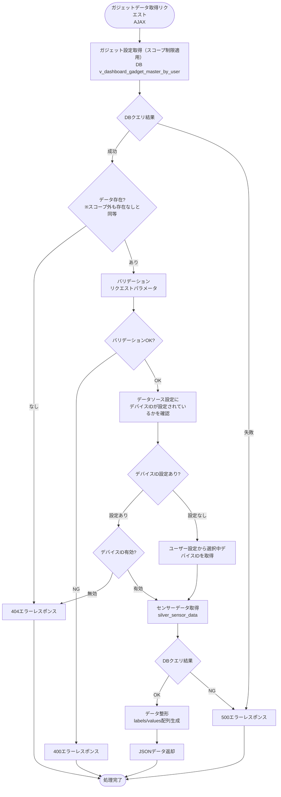
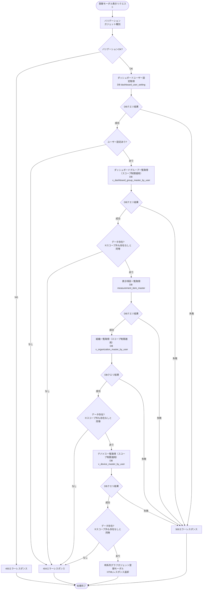
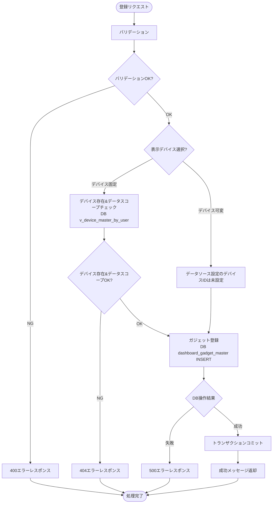
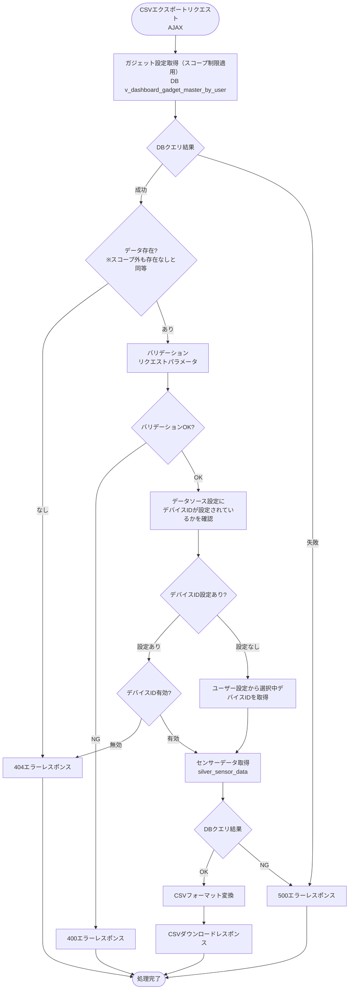

# 顧客作成ダッシュボード時系列グラフガジェット - ワークフロー仕様書

## 📑 目次

- [顧客作成ダッシュボード時系列グラフガジェット - ワークフロー仕様書](#顧客作成ダッシュボード時系列グラフガジェット---ワークフロー仕様書)
  - [📑 目次](#-目次)
  - [概要](#概要)
  - [使用するFlaskルート一覧](#使用するflaskルート一覧)
  - [ルート呼び出しマッピング](#ルート呼び出しマッピング)
    - [時系列グラフガジェット](#時系列グラフガジェット)
    - [時系列グラフガジェット登録モーダル](#時系列グラフガジェット登録モーダル)
  - [ワークフロー一覧](#ワークフロー一覧)
    - [ガジェット初期表示](#ガジェット初期表示)
      - [処理フロー](#処理フロー)
      - [Flaskルート](#flaskルート)
      - [バリデーション](#バリデーション)
      - [処理詳細（サーバーサイド）](#処理詳細サーバーサイド)
    - [ガジェットデータ取得](#ガジェットデータ取得)
      - [処理フロー](#処理フロー-1)
      - [Flaskルート](#flaskルート-1)
      - [バリデーション](#バリデーション-1)
      - [処理詳細（サーバーサイド）](#処理詳細サーバーサイド-1)
    - [ガジェット登録モーダル表示](#ガジェット登録モーダル表示)
      - [処理フロー](#処理フロー-2)
      - [Flaskルート](#flaskルート-2)
      - [バリデーション](#バリデーション-2)
      - [処理詳細（サーバーサイド）](#処理詳細サーバーサイド-2)
      - [エラーハンドリング](#エラーハンドリング)
    - [ガジェット登録](#ガジェット登録)
      - [処理フロー](#処理フロー-3)
      - [Flaskルート](#flaskルート-3)
      - [バリデーション](#バリデーション-3)
      - [処理詳細（サーバーサイド）](#処理詳細サーバーサイド-3)
      - [エラーハンドリング](#エラーハンドリング-1)
    - [CSVエクスポート](#csvエクスポート)
      - [処理フロー](#処理フロー-4)
      - [Flaskルート](#flaskルート-4)
      - [バリデーション](#バリデーション-4)
      - [処理詳細（サーバーサイド）](#処理詳細サーバーサイド-4)
      - [エラーハンドリング](#エラーハンドリング-2)
  - [セキュリティ実装](#セキュリティ実装)
    - [認証・認可実装](#認証認可実装)
    - [ログ出力ルール](#ログ出力ルール)
  - [関連ドキュメント](#関連ドキュメント)

**重要:** 顧客作成ダッシュボード画面の共通仕様は [共通ワークフロー仕様書](../common/workflow-specification.md) を参照してください。

---

## 概要

このドキュメントは、顧客作成ダッシュボード時系列グラフ機能のユーザー操作に対する処理フロー、データベース処理、エラーハンドリングの詳細を記載します。

**このドキュメントの役割:**
- ✅ ユーザー操作のトリガー条件
- ✅ 処理フローの詳細（Flaskルート呼び出し、フォーム送信、AJAX通信）
- ✅ エラーハンドリングフロー
- ✅ サーバーサイド処理詳細（SQL、変数、条件分岐、コード例）
- ✅ データベース利用詳細（トランザクション管理、テーブル操作）
- ✅ セキュリティ実装詳細（認証、データスコープ制限、ログ出力）
- ✅ クライアントサイド処理詳細（AJAX、ドラッグ＆ドロップ、自動更新）

**UI仕様書との役割分担:**
- **UI仕様書**: 画面レイアウト、UI要素の詳細仕様
- **ワークフロー仕様書**: 処理フロー、データベース処理、エラーハンドリング、サーバーサイド実装詳細

**注:** UI要素の詳細は [UI仕様書](./ui-specification.md) を参照してください。

---

## 使用するFlaskルート一覧

この機能で使用するすべてのFlaskルート（エンドポイント）を記載します。

| No | ルート名 | エンドポイント | メソッド | 用途 | レスポンス形式 | 備考 |
|----|---------|---------------|---------|------|---------------|------|
| 1 | 顧客作成ダッシュボード表示 | `/analysis/customer-dashboard` | GET | 初期表示（顧客作成ダッシュボード画面に時系列グラフガジェットを埋め込み） | HTML | - |
| 2 | ガジェットデータ取得 | `/analysis/customer-dashboard/gadgets/<gadget_uuid>/data` | POST | ガジェットのグラフ表示用データ取得 | JSON (AJAX) | 非同期通信 |
| 3 | ガジェット登録画面 | `/analysis/customer-dashboard/gadgets/timeline/create` | GET | 時系列グラフガジェット登録モーダル表示 | HTML（モーダル） | - |
| 4 | ガジェット登録実行 | `/analysis/customer-dashboard/gadgets/timeline/register` | POST | 時系列グラフガジェット登録処理 | JSON (AJAX) | - |
| 5 | CSVエクスポート | `/analysis/customer-dashboard/gadgets/<gadget_uuid>?export=csv` | GET | ガジェットのグラフデータをCSVファイルとしてダウンロード | CSV | - |

**注:**
- **レスポンス形式**:
  - `HTML`: Jinja2テンプレートをレンダリングして返す（`render_template()`）
  - `HTML（モーダル）`: モーダルダイアログ用のHTMLフラグメントを返す
  - `リダイレクト (302)`: 処理成功後に `/analysis/customer-dashboard` へリダイレクト
  - `JSON (AJAX)`: JavaScriptからの非同期リクエストに対してJSONレスポンスを返す
  - `CSV`: CSVファイルをダウンロードレスポンスとして返す
- **Flask Blueprint構成**: `customer_dashboard_bp` として実装

---

## ルート呼び出しマッピング

### 時系列グラフガジェット

| ユーザー操作 | トリガー | 呼び出すルート | パラメータ | レスポンス | エラー時の挙動 |
|-------------|---------|-------------|-----------|-----------|---------------|
| 画面初期表示 | URL直接アクセス | `GET /analysis/customer-dashboard`, `POST /analysis/customer-dashboard/gadgets/<gadget_uuid>/data` | なし | HTML（顧客作成ダッシュボード画面に時系列グラフガジェットを埋め込み） | エラーページ表示 |
| 開始日時・終了日時選択 | デイトタイムピッカー選択 | `POST /analysis/customer-dashboard/gadgets/<gadget_uuid>/data` | `gadget_uuid` | JSON | エラートースト表示 |
| 更新ボタン押下 | ボタンクリック | `POST /analysis/customer-dashboard/gadgets/<gadget_uuid>/data` | `gadget_uuid` | JSON | エラートースト表示 |
| CSVエクスポートボタン押下 | ボタンクリック | `GET /analysis/customer-dashboard/gadgets/<gadget_uuid>?export=csv` | `gadget_uuid` | CSVダウンロード | エラートースト表示 |

### 時系列グラフガジェット登録モーダル

| ユーザー操作 | トリガー | 呼び出すルート | パラメータ | レスポンス | エラー時の挙動 |
|-------------|---------|-------------|-----------|-----------|---------------|
| 画面初期表示 | URL直接アクセス | `GET /analysis/customer-dashboard/gadgets/timeline/create` | なし | HTML（モーダル） | エラーページ表示 |
| 登録ボタン押下 | ボタンクリック | `POST /analysis/customer-dashboard/gadgets/timeline/register` | `title, device_mode, device_id, group_id, primary_item_id, secondary_item_id, primary_min_value, secondary_min_value, primary_max_value, secondary_max_value, gadget_size` | JSON (AJAX) | エラートースト表示 |

---

## ワークフロー一覧

### ガジェット初期表示

**トリガー:** 顧客作成ダッシュボード画面アクセス時

**前提条件:**
- ユーザーがログイン済み（Databricks認証完了）
- 適切な権限を持っている（システム保守者、管理者、販社ユーザ、サービス利用者）

#### 処理フロー

[共通ワークフロー仕様書](../common/workflow-specification.md) のダッシュボード初期表示と同様の処理フローに従います。

#### Flaskルート

| ルート | エンドポイント | 詳細 |
|-------|---------------|------|
| 顧客作成ダッシュボード表示 | `GET /analysis/customer-dashboard` | クエリパラメータ: なし |

#### バリデーション

**実行タイミング:** なし

**データスコープ制限:**
- ダッシュボードスコープ制限（全ユーザー共通）:
  - ユーザーの所属組織に属するダッシュボードのみアクセス可能（v_dashboard_master_by_user による制御）
  - 下位組織のダッシュボードはアクセス不可
- 組織選択肢スコープ制限:
  - v_organization_master_by_user による制御

#### 処理詳細（サーバーサイド）

[共通ワークフロー仕様書](../common/workflow-specification.md) のダッシュボード初期表示の処理詳細（①〜⑨）と同様の処理を実行します。

時系列グラフガジェット固有の追加処理はありません。

---

### ガジェットデータ取得

**トリガー:** 画面初期表示時 / 開始日時・終了日時選択時 / 更新ボタン押下時

**前提条件:**
- ガジェットが表示されている
- データソース設定が存在する

#### 処理フロー



#### Flaskルート

| ルート | エンドポイント | 詳細 |
|-------|---------------|------|
| ガジェットデータ取得 | `POST /analysis/customer-dashboard/gadgets/<gadget_uuid>/data` | パスパラメータ: `gadget_uuid` リクエストボディ（JSON）: `start_datetime, end_datetime` |

#### バリデーション

**実行タイミング:** ガジェット設定取得後

**バリデーションルール:**

| 項目 | ルール | エラーメッセージ |
|------|--------|-----------------|
| 開始日時 | 日付形式 | 正しい日付形式で入力してください |
| 終了日時 | 日付形式 | 正しい日付形式で入力してください |
| 開始日時 | 開始日時 < 終了日時 | 終了日時は開始日時以降の日時を入力してください |

#### 処理詳細（サーバーサイド）

**① ガジェット設定取得**

**使用テーブル:** v_dashboard_gadget_master_by_user

**SQL詳細:**
```sql
SELECT
  gadget_id,
  gadget_uuid,
  gadget_type_id,
  chart_config,
  data_source_config
FROM
  v_dashboard_gadget_master_by_user
WHERE
  user_id = :current_user_id
  AND gadget_uuid = :gadget_uuid
  AND delete_flag = FALSE
```

**chart_config JSON スキーマ:**
```json
{
  "primary_item_id": 1,
  "secondary_item_id": 2,
  "primary_min_value": 0.0,
  "secondary_min_value": 10.0,
  "primary_max_value": 100.0,
  "secondary_max_value": 110.0
}
```

**data_source_config JSON スキーマ:**
```json
{
  "device_id": 12345
}
```
※ `device_id` が `null` の場合はデバイス可変モード

---

**② デバイスID決定**

`data_source_config.device_id` を参照し、デバイスIDを決定します。

- **デバイス固定モード** (`device_id` が設定されている場合): `data_source_config.device_id` を使用
  - デバイスIDの削除フラグチェックを実施する → デバイスIDが論理削除済みなら404エラーレスポンスを返却
- **デバイス可変モード** (`device_id` が `null` の場合): ユーザー設定 (`dashboard_user_setting.device_id`) を使用

**SQL詳細（デバイス固定モード: デバイスID有効性チェック）:**
```sql
SELECT
  device_id
FROM
  v_device_master_by_user
WHERE
  user_id = :current_user_id
  AND device_id = :device_id
  AND delete_flag = FALSE
```

**SQL詳細（デバイス可変モード: ユーザー設定取得）:**
```sql
SELECT
  device_id
FROM
  dashboard_user_setting
WHERE
  user_id = :current_user_id
  AND delete_flag = FALSE
```

---

**③ センサーデータ取得**

**使用テーブル:** silver_sensor_data 

**SQL詳細:** 
```sql
SELECT
  event_timestamp, 
  external_temp,
  set_temp_freezer_1,
  internal_sensor_temp_freezer_1,
  internal_temp_freezer_1,
  df_temp_freezer_1,
  condensing_temp_freezer_1,
  adjusted_internal_temp_freezer_1,
  set_temp_freezer_2,
  internal_sensor_temp_freezer_2,
  internal_temp_freezer_2,
  df_temp_freezer_2,
  condensing_temp_freezer_2,
  adjusted_internal_temp_freezer_2,
  compressor_freezer_1,
  compressor_freezer_2,
  fan_motor_1,
  fan_motor_2,
  fan_motor_3,
  fan_motor_4,
  fan_motor_5,
  defrost_heater_output_1,
  defrost_heater_output_2
FROM
  user_master u
INNER JOIN
  organization_closure oc
  ON u.organization_id = oc.parent_organization_id
INNER JOIN
  silver_sensor_data s
  ON oc.subsidiary_organization_id = s.organization_id
WHERE
  u.user_id = :current_user_id
  AND u.delete_flag = FALSE
  AND device_id = :device_id
  AND event_timestamp BETWEEN :start_datetime AND :end_datetime
ORDER BY
  event_timestamp ASC
```

※ 表示項目選択はPython側で実施する（下記④参照）

---

**④ データ整形**

取得データを ECharts 時系列グラフ用の `labels` / `values` 配列に変換します。

```python
# services/customer_dashboard/timeline.py
def format_timeline_data(rows, primary_column_name, secondary_column_name):
    labels = []
    primary_values = []
    secondary_values = []
    for row in rows:
        labels.append(row['event_timestamp'].strftime('%Y/%m/%d %H:%M:%S'))
        primary_values.append(row[primary_column_name])
        secondary_values.append(row[secondary_column_name])
    return {'labels': labels, 'primary_values': primary_values, 'secondary_values': secondary_values}
```

---

**⑤ レスポンス形式**

```json
{
  "gadget_uuid": "xxxxxxxx-xxxx-xxxx-xxxx-xxxxxxxxxxxx",
  "chart_data": {
    "labels": ["2026/02/17 00:00:00", "2026/02/17 00:01:00", "..."],
    "primary_values": [10.5, 12.3, 9.8],
    "secondary_values": [2500.0, 2480.0, 2510.0]
  },
  "updated_at": "2026/03/05 12:00:00"
}
```

データなしの場合:
```json
{
  "gadget_uuid": "xxxxxxxx-xxxx-xxxx-xxxx-xxxxxxxxxxxx",
  "chart_data": {"labels": [], "primary_values": [], "secondary_values": []},
  "updated_at": "2026/03/05 12:00:00"
}
```

---

**⑥ 実装例**

```python
# views/analysis/customer_dashboard/timeline.py
def handle_gadget_data(gadget_uuid):
    """時系列グラフガジェット データ取得（AJAX）"""

    # ① ガジェット設定取得
    gadget = get_gadget_by_uuid(gadget_uuid)
    if not gadget:
        return jsonify({'error': err_not_found('ガジェット')}), 404

    params = request.get_json() or {}
    start_datetime_str = params.get('start_datetime')
    end_datetime_str   = params.get('end_datetime')

    error = validate_chart_params(start_datetime_str, end_datetime_str)
    if error:
        return jsonify({'error': error}), 400

    try:
        start_datetime = datetime.strptime(start_datetime_str, _DATETIME_FORMAT)
        end_datetime   = datetime.strptime(end_datetime_str,   _DATETIME_FORMAT)

        # ② デバイスID決定
        import json as _json
        data_source_config = _json.loads(gadget.data_source_config or '{}')
        device_id = data_source_config.get('device_id')
        if device_id is not None:
            if check_device_access(device_id, g.current_user.user_id) is None:
                return jsonify({'error': err_not_found('デバイス')}), 404
        else:
            user_setting = get_dashboard_user_setting(g.current_user.user_id)
            device_id = user_setting.device_id if user_setting else None

        chart_config = _json.loads(gadget.chart_config or '{}')

        # ③ カラム名・表示情報取得
        primary_item = get_measurement_item(chart_config['primary_item_id'])
        secondary_item = get_measurement_item(chart_config['secondary_item_id'])
        primary_col = primary_item.silver_data_column_name
        secondary_col = secondary_item.silver_data_column_name

        rows = fetch_timeline_data(
            device_id=device_id,
            start_datetime=start_datetime,
            end_datetime=end_datetime,
            primary_item_id=chart_config['primary_item_id'],
            secondary_item=chart_config['secondary_item_id'],
        )

        # ④ データ整形 + ラベル・単位・最小/最大値を補完 [A]
        chart_data = format_timeline_data(rows, primary_col, secondary_col)
        chart_data.update({
            'primary_label':  primary_item.display_name  if primary_item  else '左軸',
            'secondary_label': secondary_item.display_name if secondary_item else '右軸',
            'primary_unit':   primary_item.unit_name     if primary_item  else '',
            'secondary_unit':  secondary_item.unit_name    if secondary_item else '',
            'primary_min':    chart_config.get('primary_min_value'),
            'primary_max':    chart_config.get('primary_max_value'),
            'secondary_min':   chart_config.get('secondary_min_value'),
            'secondary_max':   chart_config.get('secondary_max_value'),
        })

        return jsonify({
            'gadget_uuid': gadget_uuid,
            'chart_data':  chart_data,
            'updated_at':  datetime.now().strftime(_DATETIME_FORMAT),
        })
    except Exception as e:
        logger.error(f'時系列グラフデータ取得エラー: gadget_uuid={gadget_uuid}', exc_info=True)
        return jsonify({'error': err_fetch_failed('データ')}), 500
```

---

### ガジェット登録モーダル表示

**トリガー:** ガジェット追加モーダルの登録画面ボタンクリック

**前提条件:**
- ガジェット追加モーダルが表示されている
- ガジェット種別が選択されている

**注:** ガジェット追加モーダルのUI仕様は [共通UI仕様書](../common/ui-specification.md) を参照してください。

#### 処理フロー



#### Flaskルート

| ルート | エンドポイント | 詳細 |
|-------|---------------|------|
| 時系列グラフガジェット登録画面 | `GET /analysis/customer-dashboard/gadgets/timeline/create` | パラメータ: なし |

#### バリデーション

**実行タイミング:** 登録画面ボタン押下時

**バリデーションルール:**

| 項目 | ルール | エラーメッセージ |
|------|--------|-----------------|
| ガジェット種別 | 必須 | ガジェットを選択してください |

#### 処理詳細（サーバーサイド）

**① ダッシュボードユーザー設定取得**

**使用テーブル:** dashboard_user_setting

```sql
SELECT
  dashboard_id,
  organization_id,
  device_id
FROM
  dashboard_user_setting
WHERE
  user_id = :current_user_id
  AND delete_flag = FALSE
```

---

**② ダッシュボードグループ一覧取得**

**使用テーブル:** v_dashboard_group_master_by_user

```sql
SELECT
  dashboard_group_id,
  dashboard_group_uuid,
  dashboard_group_name
FROM
  v_dashboard_group_master_by_user
WHERE
  user_id = :current_user_id
  AND dashboard_id = :dashboard_id
  AND delete_flag = FALSE
ORDER BY
  display_order ASC
```

---

**③ 表示項目一覧取得**

**使用テーブル:** measurement_item_master

```sql
SELECT
  measurement_item_id,
  display_name,
  unit_name
FROM
  measurement_item_master
WHERE
  delete_flag = FALSE
ORDER BY
  measurement_item_id ASC
```

---

**④ 組織一覧取得**

**使用テーブル:** v_organization_master_by_user

```sql
SELECT
  organization_id,
  organization_name
FROM
  v_organization_master_by_user
WHERE
  user_id = :current_user_id
  AND delete_flag = FALSE
ORDER BY
  organization_id ASC
```

---

**⑤ デバイス一覧取得（デバイス固定モード用）**

**使用テーブル:** v_device_master_by_user

```sql
SELECT
  device_id,
  device_name,
  organization_id
FROM
  v_device_master_by_user
WHERE
  user_id = :current_user_id
  AND delete_flag = FALSE
ORDER BY
  device_id ASC
```

---

**⑥ 実装例**

```python
# views/analysis/customer_dashboard/timeline.py
def handle_gadget_create(gadget_type):
    """時系列グラフガジェット登録モーダル表示"""

    try:
        context = get_timeline_create_context(g.current_user.user_id)
    except NotFoundError:
        abort(404)
    except Exception:
        abort(500)

    form = TimelineGadgetForm()
    form.group_id.choices = [
        (grp.dashboard_group_id, grp.dashboard_group_name) for grp in context['groups']
    ]
    if context['groups']:
        form.group_id.data = context['groups'][0].dashboard_group_id

    return render_template(
        'analysis/customer_dashboard/gadgets/modals/timeline.html',
        form=form,
        gadget_type=gadget_type,
        **context,
    )
```

#### エラーハンドリング

| HTTPステータス | エラー種別 | 処理内容 | 表示内容 |
|--------------|-----------|---------|---------|
| 400 | バリデーションエラー | フォーム再表示 | バリデーションエラーメッセージ |
| 404 | リソース不存在 | 404エラートースト表示 | ダッシュボードが見つかりません |
| 500 | データベースエラー | 500エラーページ表示 | データの取得に失敗しました |

---

### ガジェット登録

**トリガー:** ガジェット登録モーダルの登録ボタンクリック

**前提条件:** ガジェット登録モーダルが表示されている

#### 処理フロー



#### Flaskルート

| ルート | エンドポイント | 詳細 |
|-------|---------------|------|
| 時系列グラフガジェット登録実行 | `POST /analysis/customer-dashboard/gadgets/timeline/register` | フォームデータ: `title, device_mode, device_id, group_id, primary_item_id, secondary_item_id, primary_min_value, secondary_min_value, primary_max_value, secondary_max_value, gadget_size` |

#### バリデーション

**実行タイミング:** フォーム送信時（サーバーサイド）

**バリデーションルール:** [UI仕様書](./ui-specification.md) の バリデーション（登録画面） を参照

#### 処理詳細（サーバーサイド）

**① デバイス存在&データスコープチェック（デバイス固定モード時のみ）**

**使用テーブル:** v_device_master_by_user

```sql
SELECT
  device_id,
  device_name,
  organization_id
FROM
  v_device_master_by_user
WHERE
  user_id = :current_user_id
  AND device_id = :device_id
  AND delete_flag = FALSE
```

---

**② chart_config / data_source_config JSONスキーマ**

```json
// chart_config
{
  "primary_item_id": 1,
  "secondary_item_id": 2,
  "primary_min_value": 0.0,
  "secondary_min_value": 10.0,
  "primary_max_value": 100.0,
  "secondary_max_value": 110.0
}

// data_source_config（デバイス固定モード）
{"device_id": 12345}

// data_source_config（デバイス可変モード）
{"device_id": null}
```

---

**③ ガジェット登録**

**使用テーブル:** dashboard_gadget_master

```sql
INSERT INTO dashboard_gadget_master (
  gadget_uuid,
  gadget_name,
  dashboard_group_id,
  gadget_type_id,
  chart_config,
  data_source_config,
  position_x,
  position_y,
  gadget_size,
  display_order,
  create_date,
  creator,
  update_date,
  modifier,
  delete_flag
) VALUES (
  :gadget_uuid,
  :gadget_name,
  :dashboard_group_id,
  :gadget_type_id,
  :chart_config,
  :data_source_config,
  0,
  (
    SELECT COALESCE(MAX(position_y), 0) + 1
    FROM dashboard_gadget_master
    WHERE dashboard_group_id = :dashboard_group_id
    AND delete_flag = FALSE
  ),
  :gadget_size,
  (
    SELECT COALESCE(MAX(display_order), 0) + 1
    FROM dashboard_gadget_master
    WHERE dashboard_group_id = :dashboard_group_id
    AND delete_flag = FALSE
  ),
  NOW(),
  :current_user_id,
  NOW(),
  :current_user_id,
  FALSE
)
```

---

**④ 実装例**

```python
# views/analysis/customer_dashboard/timeline.py
def handle_gadget_register(gadget_type):
    """時系列グラフガジェット 登録実行"""
    form = TimelineGadgetForm()

    # group_id: 送信値の存在チェックのみ（必須選択）
    submitted_group_id = request.form.get('group_id', type=int) or 0
    form.group_id.choices = [(submitted_group_id, '')]

    if not form.validate_on_submit():
        # [D] 400時にフルコンテキストを渡す
        from iot_app.common.exceptions import NotFoundError
        try:
            context = get_timeline_create_context(g.current_user.user_id)
        except NotFoundError:
            abort(404)
        except Exception:
            abort(500)
        # グループ選択肢をフル選択肢に更新（検証用の1件だけでは再描画時に空になるため）
        form.group_id.choices = [
            (grp.dashboard_group_id, grp.dashboard_group_name) for grp in context['groups']
        ]
        return render_template(
            'analysis/customer_dashboard/gadgets/modals/timeline.html',
            form=form,
            gadget_type=gadget_type,
            **context,
        ), 400

    # デバイス固定モード時: デバイス存在&データスコープチェック
    if form.device_mode.data == 'fixed':
        if check_device_in_scope(form.device_id.data, g.current_user.user_id) is None:
            abort(404)

    params = {
        'title': form.title.data,
        'device_mode': form.device_mode.data,
        'device_id': form.device_id.data,
        'group_id': form.group_id.data,
        'primary_item_id': form.primary_item_id.data,
        'secondary_item_id': form.secondary_item_id.data,
        'primary_min_value': form.primary_min_value.data,
        'primary_max_value': form.primary_max_value.data,
        'secondary_min_value': form.secondary_min_value.data,
        'secondary_max_value': form.secondary_max_value.data,
        'gadget_size': form.gadget_size.data,
    }

    from iot_app.common.exceptions import ValidationError as AppValidationError

    try:
        register_gadget(params, current_user_id=g.current_user.user_id)
        logger.info(f'時系列グラフガジェット登録成功: user_id={g.current_user.user_id}')
        return jsonify({'message': msg_created('ガジェット')})

    except AppValidationError as e:
        db.session.rollback()
        logger.warning(f'時系列グラフガジェット登録バリデーションエラー: {str(e)}')
        abort(400)

    except Exception as e:
        db.session.rollback()
        logger.error(f'時系列グラフガジェット登録エラー: {str(e)}', exc_info=True)
        abort(500)
```

#### エラーハンドリング

| HTTPステータス | エラー種別 | 処理内容 | 表示内容 |
|--------------|-----------|---------|---------|
| 400 | バリデーションエラー | フォーム再表示 | バリデーションエラーメッセージ |
| 404 | リソース不存在 | 404エラートースト表示 | 指定されたデバイスが見つかりません |
| 500 | データベースエラー | 500エラーページ表示 | データの取得に失敗しました |

---

### CSVエクスポート

**トリガー:** CSVエクスポートボタンクリック

**前提条件:**
- ガジェットが表示されている
- データが存在する

#### 処理フロー



#### Flaskルート

| ルート | エンドポイント | 詳細 |
|-------|---------------|------|
| CSVエクスポート | `GET /analysis/customer-dashboard/gadgets/<gadget_uuid>?export=csv` | パスパラメータ: `gadget_uuid` クエリパラメータ: `start_datetime, end_datetime` |

#### バリデーション

**実行タイミング:** CSVエクスポートボタン押下時（サーバーサイド）

| 項目 | ルール | エラーメッセージ |
|------|--------|-----------------|
| 開始日時 | 日付形式 | 正しい日付形式で入力してください |
| 終了日時 | 日付形式 | 正しい日付形式で入力してください |
| 開始日時 | 開始日時 < 終了日時 | 終了日時は開始日時以降の日時を入力してください |

#### 処理詳細（サーバーサイド）

**① ガジェット設定取得**

[ガジェットデータ取得 ①](#ガジェットデータ取得) と同様のSQL（v_dashboard_gadget_master_by_user）を実行します。

---

**② デバイスID決定**

[ガジェットデータ取得 ②](#ガジェットデータ取得) と同様のロジックを適用します。

---

**③ センサーデータ取得**

[ガジェットデータ取得 ③](#ガジェットデータ取得) と同様のSQL（silver_sensor_data）を実行します。

**グラフ表示との差異:**

| 項目 | ガジェットデータ取得 | CSVエクスポート |
|------|----------------|--------------|
| 最大取得件数 | 100件 | 100,000件 |
| レスポンス形式 | JSON | CSV |

---

**④ CSVカラム定義**

| 列番号 | 表示名 | 内容 | 形式 |
|--------|-------|------|------|
| 1 | デバイス名 | デバイス名 | |
| 2 | 時刻 | 表示時間（グラフX軸） | YYYY/MM/DD HH:mm:ss |
| 3 | 凡例名 | 左表示項目のセンサー値（グラフY軸左） | 数値（小数点2桁） |
| 4 | 凡例名 | 右表示項目のセンサー値（グラフY軸右） | 数値（小数点2桁） |

**CSVサンプル**
```csv
デバイス名,時刻,外気温度（℃）,第1冷凍 設定温度（℃）
DEV-001,2026/02/01 10:00:00,25.1,5.1
DEV-001,2026/02/01 10:10:00,25.2,5.2
DEV-001,2026/02/01 10:20:00,25.3,5.3
```

---

**⑤ 実装例**

```python
# views/analysis/customer_dashboard/timeline.py
def handle_gadget_csv_export(gadget_uuid):
    """時系列グラフガジェット CSVエクスポート"""
    if request.args.get('export') != 'csv':
        abort(404)

    gadget = get_gadget_by_uuid(gadget_uuid)
    if not gadget:
        abort(404)

    start_datetime_str = request.args.get('start_datetime')
    end_datetime_str   = request.args.get('end_datetime')

    error = validate_chart_params(start_datetime_str, end_datetime_str)
    if error:
        return jsonify({'error': error}), 400

    try:
        csv_content = export_timeline_csv(
            gadget_uuid=gadget_uuid,
            start_datetime=start_datetime_str,
            end_datetime=end_datetime_str,
            current_user_id=g.current_user.user_id,
        )

        filename = f"sensor_data_{datetime.now().strftime('%Y%m%d%H%M%S')}.csv"
        return Response(
            csv_content.encode('utf-8'),
            mimetype='text/csv; charset=utf-8',
            headers={'Content-Disposition': f'attachment; filename={filename}'},
        )

    except NotFoundError:
        abort(404)

    except Exception:
        logger.error(f'時系列グラフCSVエクスポートエラー: gadget_uuid={gadget_uuid}', exc_info=True)
        abort(500)
```

#### エラーハンドリング

| HTTPステータス | エラー種別 | 処理内容 | 表示内容 |
|--------------|-----------|---------|---------|
| 400 | バリデーションエラー | フォーム再表示（エラーモーダル表示） | バリデーションエラーメッセージ |
| 404 | リソース不存在 | 404エラーモーダル表示 | 指定されたデバイスが見つかりません |
| 500 | データベースエラー | 500エラーページ表示 | データの取得に失敗しました |

---

## セキュリティ実装

### 認証・認可実装

**認証方式:**
- Azure環境: Easy Auth認証（Entra ID統合）（`X-MS-*` ヘッダーからユーザー情報・JWT取得）
- AWS環境: ALB + Cognito認証（`X-Amzn-Oidc-*` ヘッダーからユーザー情報・JWT取得）
- オンプレミス環境: 自前認証（Flask IdP）（Flaskセッションからユーザー情報取得、JWT再発行）

**認可ロジック:**

組織階層に基づいて、ユーザーがアクセスできるデータを制限します。

**処理内容:**
- 組織・デバイス等の一覧取得VIEW（v_organization_master_by_user 等）:
  - VIEWが内部で organization_closure を参照し、アクセス可能な組織配下のデータのみ返す
- ダッシュボード用VIEW（v_dashboard_master_by_user 等）:
  - user_master.organization_id = dashboard_master.organization_id の直接JOINでスコープ制限を適用
  - ユーザーの所属組織のダッシュボードのみアクセス可能（下位組織のダッシュボードは対象外）
- センサーデータ（silver_sensor_data 等）:
  - VIEWを使用せず、データ取得処理の度に organization_closure を参照し、アクセス可能な組織配下のデータのみ返す（組織・デバイス等の一覧取得VIEWと内部処理は同じ）

**実装例:**
```python
# 組織一覧取得
def get_organizations():
    # v_organization_master_by_user に user_id を渡すだけでスコープ制限が自動適用される
    return (
        db.session.query(VOrganizationMasterByUser)
        .filter(
            VOrganizationMasterByUser.user_id == g.current_user.user_id,
            VOrganizationMasterByUser.delete_flag == False,
        )
        .order_by(VOrganizationMasterByUser.organization_id)
        .all()
    )
```

### ログ出力ルール

**出力する情報:**
- リクエストID
- ユーザーID（操作者）
- 操作種別（ダッシュボード登録、更新、削除、ガジェット登録、レイアウト保存等）
- 対象リソースID（dashboard_id、group_id、gadget_id）
- 処理結果（成功/失敗）
- エラー種別（バリデーションエラー、DBエラー等）
- タイムスタンプ（UTC）

**出力しない情報（機密情報）:**
- 認証トークン
- センサーデータの具体値

**実装例:**
```python
import logging

logger = logging.getLogger(__name__)

@customer_dashboard_bp.route('/dashboards/register', methods=['POST'])
@require_auth
def dashboard_register():
    logger.info(f'ダッシュボード登録開始: user_id={g.current_user.user_id}')

    try:
        # ... 処理 ...
        logger.info(f'ダッシュボード登録成功: dashboard_id={dashboard.dashboard_id}')
        return response
    except Exception as e:
        logger.error(f'ダッシュボード登録エラー: error={str(e)}')
        abort(500)
```

---

## 関連ドキュメント

- [UI仕様書](./ui-specification.md) - 画面要素・レイアウト仕様
- [README.md](./README.md) - 機能概要
- [シルバー層仕様](../../ldp-pipeline/silver-layer/README.md) - センサーデータスキーマ
- [ゴールド層仕様](../../ldp-pipeline/gold_layer/README.md) - 集計データスキーマ
- [共通仕様](../../common/common-specification.md) - 認証・セキュリティ共通仕様