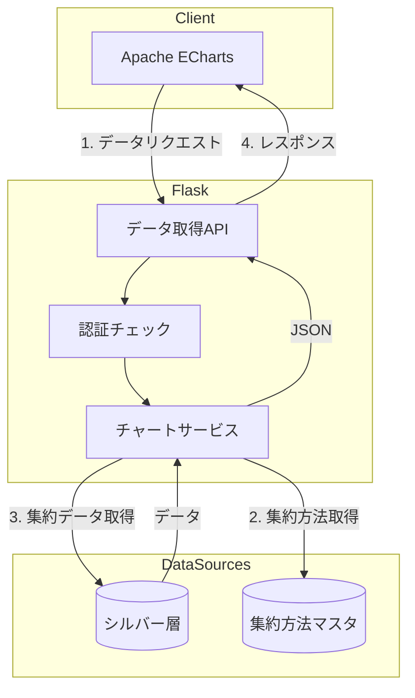
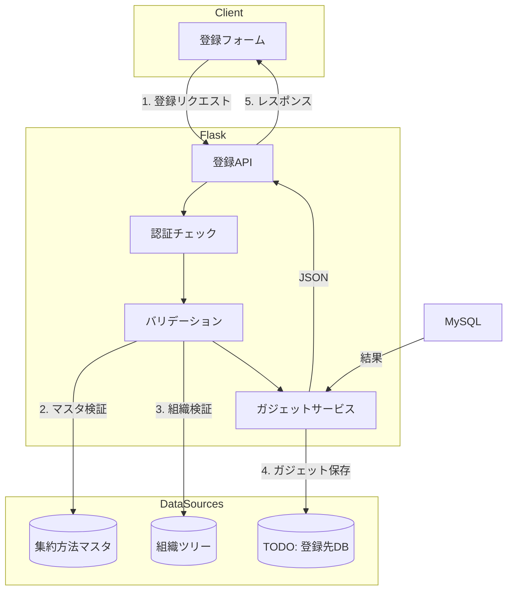
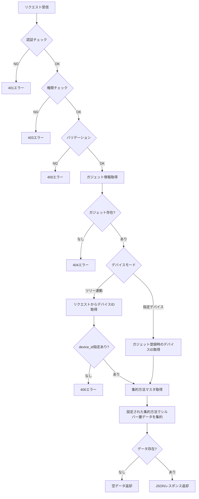
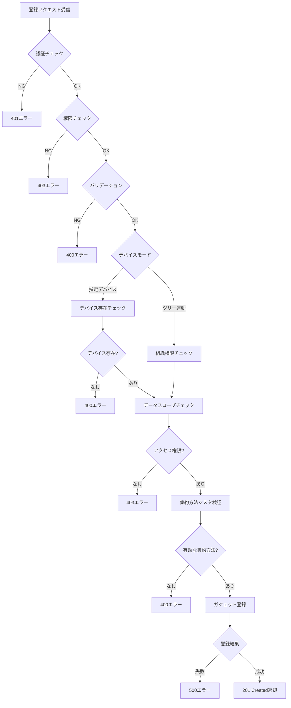
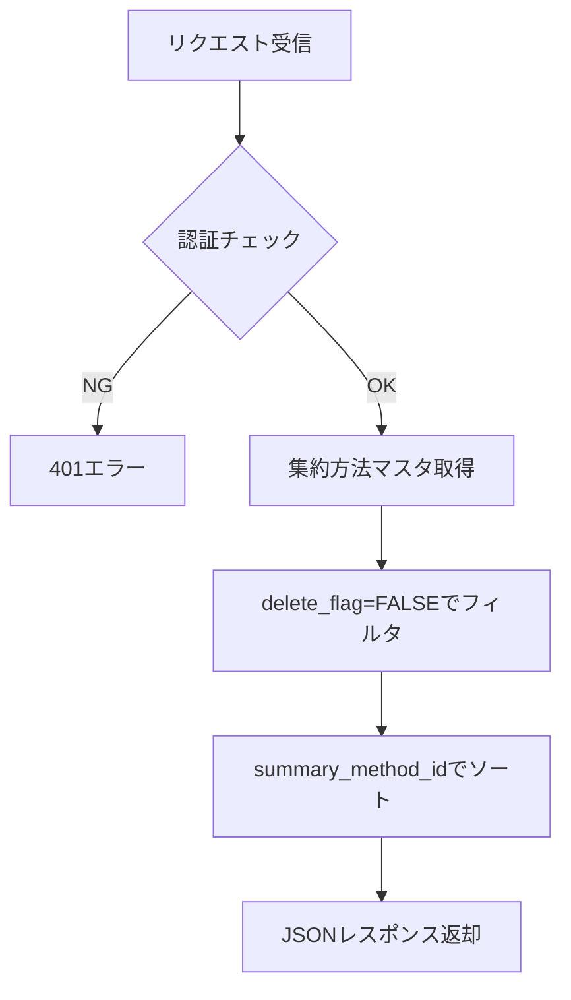

# ダッシュボード円グラフ - ワークフロー仕様書

## 目次

- [概要](#概要)
  - [このドキュメントの役割](#このドキュメントの役割)
  - [対象機能](#対象機能)
- [処理フロー全体図](#処理フロー全体図)
  - [データ取得フロー](#データ取得フロー)
  - [ガジェット登録フロー](#ガジェット登録フロー)
- [Flaskルート定義](#flaskルート定義)
  - [ルート一覧](#ルート一覧)
  - [グラフデータ取得API](#グラフデータ取得api)
  - [ガジェット登録API](#ガジェット登録api)
  - [集約方法一覧取得API](#集約方法一覧取得api)
- [データ取得ワークフロー](#データ取得ワークフロー)
  - [処理フロー図](#処理フロー図)
  - [データ取得実装](#データ取得実装)
  - [シルバー層クエリ](#シルバー層クエリ)
- [ガジェット登録ワークフロー](#ガジェット登録ワークフロー)
  - [処理フロー図](#処理フロー図-1)
  - [登録処理の流れ](#登録処理の流れ)
- [集約方法一覧取得ワークフロー](#集約方法一覧取得ワークフロー)
  - [処理フロー図](#処理フロー図-2)
  - [取得処理の流れ](#取得処理の流れ)
- [バリデーション仕様](#バリデーション仕様)
  - [リクエストパラメータ定義](#リクエストパラメータ定義)
  - [バリデーション実装](#バリデーション実装)
- [エラーハンドリング](#エラーハンドリング)
  - [エラー分類](#エラー分類)
  - [エラーハンドリング実装](#エラーハンドリング実装)
- [セキュリティ設計](#セキュリティ設計)
- [パフォーマンス設計](#パフォーマンス設計)
- [テスト仕様](#テスト仕様)
- [関連ドキュメント](#関連ドキュメント)
- [変更履歴](#変更履歴)

---

## 概要

このドキュメントは、ダッシュボード円グラフ機能のデータ取得ワークフロー、エラーハンドリングの詳細を記載します。

### このドキュメントの役割

- データ取得APIの処理フロー
- シルバー層からのデータ取得ロジック
- バリデーション・エラーハンドリング

### 対象機能

| 機能ID | 機能名 | 処理内容 |
| ------ | ------ | -------- |
| DCG-001 | グラフ表示 | センサーデータを円グラフで割合表示 |
| DCG-002 | ガジェット登録 | 円グラフガジェットの新規登録 |

---

## 処理フロー全体図

### データ取得フロー



### ガジェット登録フロー



---

## Flaskルート定義

### ルート一覧

| メソッド | URL | 関数名 | 説明 |
| -------- | --- | ------ | ---- |
| GET | /api/customer-dashboard/circle-chart/data | get_circle_chart_data | グラフデータ取得API |
| POST | /api/customer-dashboard/circle-chart/register | register_circle_chart | ガジェット登録API |
| GET | /api/customer-dashboard/circle-chart/aggregation-methods | get_aggregation_methods | 集約方法一覧取得API |

### グラフデータ取得API

```python
from flask import Blueprint, jsonify, request, g
from datetime import datetime
from functools import wraps
import pytz

bp = Blueprint('dashboard_circle_chart', __name__)
JST = pytz.timezone('Asia/Tokyo')

# =============================================================================
# デコレータ定義
# =============================================================================
def login_required(f):
    """認証チェックデコレータ"""
    @wraps(f)
    def decorated_function(*args, **kwargs):
        if not g.get('current_user'):
            return jsonify({'status': 'error', 'message': '認証が必要です'}), 401
        return f(*args, **kwargs)
    return decorated_function

def require_role(*roles):
    """権限チェックデコレータ"""
    def decorator(f):
        @wraps(f)
        def decorated_function(*args, **kwargs):
            if g.current_user.role not in roles:
                return jsonify({'status': 'error', 'message': 'アクセス権限がありません'}), 403
            return f(*args, **kwargs)
        return decorated_function
    return decorator

# =============================================================================
# グラフデータ取得API
# =============================================================================
@bp.route('/api/customer-dashboard/circle-chart/data', methods=['GET'])
@login_required
@require_role('system_admin', 'management_admin', 'sales_company_user', 'service_company_user')
def get_circle_chart_data():
    """
    円グラフ用データを取得

    リクエストパラメータ:
    - gadget_id: ガジェットID（必須）
    - device_id: デバイスID（ツリー連動モード時は必須）
    - base_datetime: 基準日時 ISO 8601形式（必須）

    レスポンス:
    - 成功時: {"status": "success", "data": {...}}
    - エラー時: {"status": "error", "message": "..."}
    """
    # パラメータ取得
    params = {
        'gadget_id': request.args.get('gadget_id'),
        'device_id': request.args.get('device_id'),  # ツリー連動モード時のみ使用
        'base_datetime': request.args.get('base_datetime')
    }

    # バリデーション
    errors = validate_chart_params(params)
    if errors:
        return jsonify({'status': 'error', 'message': errors[0]}), 400

    # ガジェット情報取得
    gadget = get_gadget_info(params['gadget_id'])
    if not gadget:
        return jsonify({'status': 'error', 'message': 'ガジェットが見つかりません'}), 404

    # デバイスID取得（指定デバイス or ツリー連動）
    if gadget['device_mode'] == 'specified':
        # 指定デバイスモード: ガジェット登録時に固定されたデバイス
        device_id = gadget['device_id']
    else:
        # ツリー連動モード: ツリー上で選択されたデバイス
        device_id = params['device_id']
        if not device_id:
            return jsonify({'status': 'error', 'message': 'device_idは必須です'}), 400

    # データ取得（ガジェットに設定された集約方法を使用）
    try:
        data = get_chart_data(
            device_id=device_id,
            items=gadget['items'],
            aggregation_method_id=gadget['aggregation_method_id'],
            base_datetime=datetime.fromisoformat(params['base_datetime'])
        )

        if not data['values']:
            return jsonify({
                'status': 'success',
                'data': {
                    'labels': [],
                    'values': [],
                    'device_name': data['device_name'],
                    'message': 'データがありません'
                }
            })

        return jsonify({'status': 'success', 'data': data})

    except Exception as e:
        logger.error(f'Chart data fetch error: {e}')
        return jsonify({'status': 'error', 'message': 'データの取得に失敗しました'}), 500
```

### ガジェット登録API

```python
# =============================================================================
# ガジェット登録API
# =============================================================================
@bp.route('/api/customer-dashboard/circle-chart/register', methods=['POST'])
@login_required
@require_role('system_admin', 'management_admin', 'sales_company_user', 'service_company_user')
def register_circle_chart():
    """
    円グラフガジェットを登録

    リクエストボディ:
    - title: ガジェットタイトル（必須）
    - device_mode: 表示デバイス選択（'specified' or 'tree_linked'）（必須）
    - device_id: デバイスID（device_mode='specified'の場合必須）
    - group_id: グループID（必須）
    - aggregation_method_id: 集約方法ID（必須）
    - items: 表示項目リスト（必須、1-5個）

    レスポンス:
    - 成功時: {"status": "success", "gadget_id": "..."}
    - エラー時: {"status": "error", "message": "..."}
    """
    data = request.get_json()

    # バリデーション
    errors = validate_register_params(data)
    if errors:
        return jsonify({'status': 'error', 'message': errors[0]}), 400

    try:
        # ガジェット登録
        gadget = CircleChartGadget(
            title=data['title'],
            device_mode=data['device_mode'],
            device_id=data.get('device_id'),
            group_id=data['group_id'],
            aggregation_method_id=data['aggregation_method_id'],
            items=data['items'],
            created_by=g.current_user.id
        )
        db.session.add(gadget)
        db.session.commit()

        return jsonify({
            'status': 'success',
            'gadget_id': gadget.id
        }), 201

    except Exception as e:
        db.session.rollback()
        logger.error(f'Gadget registration error: {e}')
        return jsonify({'status': 'error', 'message': '登録に失敗しました'}), 500


def validate_register_params(data: dict) -> list:
    """
    登録パラメータをバリデーション
    """
    errors = []

    # title
    if not data.get('title'):
        errors.append('タイトルは必須です')
    elif len(data['title']) > 50:
        errors.append('タイトルは50文字以内で入力してください')

    # device_mode
    if data.get('device_mode') not in ['specified', 'tree_linked']:
        errors.append('表示デバイス選択が不正です')

    # device_id (指定デバイスモード時のみ必須)
    if data.get('device_mode') == 'specified':
        if not data.get('device_id'):
            errors.append('デバイスIDは必須です')
        elif not UUID_PATTERN.match(data['device_id']):
            errors.append('デバイスIDの形式が不正です')

    # group_id
    if not data.get('group_id'):
        errors.append('グループIDは必須です')

    # aggregation_method_id
    if not data.get('aggregation_method_id'):
        errors.append('集約方法は必須です')
    elif data['aggregation_method_id'] not in range(1, 9):
        errors.append('集約方法が不正です')

    # items
    if not data.get('items'):
        errors.append('表示項目は必須です')
    elif not isinstance(data['items'], list):
        errors.append('表示項目はリスト形式で指定してください')
    elif len(data['items']) < 1 or len(data['items']) > 5:
        errors.append('表示項目は1つ以上5つ以下で選択してください')
    else:
        for item in data['items']:
            if item not in ALLOWED_ITEMS:
                errors.append(f'不正な項目です: {item}')

    return errors
```

### 集約方法一覧取得API

```python
# =============================================================================
# 集約方法一覧取得API
# =============================================================================
@bp.route('/api/customer-dashboard/circle-chart/aggregation-methods', methods=['GET'])
@login_required
def get_aggregation_methods():
    """
    集約方法一覧を取得

    レスポンス:
    - 成功時: {"status": "success", "data": [...]}
    """
    try:
        # gold_summary_method_masterから有効な集約方法を取得
        methods = get_active_aggregation_methods()

        return jsonify({
            'status': 'success',
            'data': methods
        })

    except Exception as e:
        logger.error(f'Aggregation methods fetch error: {e}')
        return jsonify({'status': 'error', 'message': '集約方法の取得に失敗しました'}), 500


def get_active_aggregation_methods() -> list:
    """
    有効な集約方法一覧を取得

    Returns:
        list: 集約方法リスト
    """
    query = """
    SELECT
        summary_method_id,
        summary_method_code,
        summary_method_name
    FROM iot_catalog.gold.gold_summary_method_master
    WHERE delete_flag = FALSE
    ORDER BY summary_method_id
    """

    result = spark.sql(query).collect()

    return [
        {
            'id': row.summary_method_id,
            'code': row.summary_method_code,
            'name': row.summary_method_name
        }
        for row in result
    ]
```

**集約方法マスタ（gold_summary_method_master）:**

| summary_method_id | summary_method_code | summary_method_name | 計算ロジック |
| ----------------- | ------------------- | ------------------- | ------------ |
| 1 | AVG | 平均値 | `AVG(sensor_value)` |
| 2 | MAX | 最大値 | `MAX(sensor_value)` |
| 3 | MIN | 最小値 | `MIN(sensor_value)` |
| 4 | P25 | 第1四分位数 | `PERCENTILE_APPROX(sensor_value, 0.25)` |
| 5 | MEDIAN | 中央値 | `PERCENTILE_APPROX(sensor_value, 0.5)` |
| 6 | P75 | 第3四分位数 | `PERCENTILE_APPROX(sensor_value, 0.75)` |
| 7 | STDDEV | 標準偏差 | `STDDEV(sensor_value)` |
| 8 | P95 | 上側5％境界値 | `PERCENTILE_APPROX(sensor_value, 0.95)` |

---

## データ取得ワークフロー

### 処理フロー図



**デバイス指定方法の違い:**
- **指定デバイス**: ガジェット登録時に固定されたデバイスのデータを表示
- **ツリー連動**: ツリー上で選択されたデバイスのデータを表示（動的に変更可能）

### データ取得実装

```python
def get_chart_data(device_id: str, items: list, aggregation_method_id: int, base_datetime: datetime) -> dict:
    """
    円グラフ用データを取得

    Args:
        device_id: デバイスID
        items: 表示項目リスト
        aggregation_method_id: 集約方法ID
        base_datetime: 基準日時

    Returns:
        dict: グラフデータ
    """
    # データスコープチェック
    device = get_device_info(device_id)
    if not device:
        raise ValueError('デバイスが見つかりません')
    if not check_data_scope(g.current_user, device):
        raise PermissionError('アクセス権限がありません')

    # 集約方法情報取得
    aggregation_method = get_aggregation_method(aggregation_method_id)
    if not aggregation_method:
        raise ValueError('集約方法が見つかりません')

    # シルバー層から集約データ取得
    aggregated_data = query_silver_aggregated(device_id, items, aggregation_method['code'], base_datetime)

    # レスポンス構築
    labels = []
    values = []
    for item in items:
        item_info = SENSOR_ITEMS.get(item)
        if item_info and item in aggregated_data:
            labels.append(item_info['label'])
            values.append(aggregated_data[item])

    return {
        'labels': labels,
        'values': values,
        'device_name': device['device_name'],
        'aggregation_method': aggregation_method['name']
    }
```

### シルバー層クエリ

```python
# 集約方法コードと計算ロジックのマッピング
AGGREGATION_FUNCTIONS = {
    'AVG': 'AVG',
    'MAX': 'MAX',
    'MIN': 'MIN',
    'P25': 'PERCENTILE_APPROX({column}, 0.25)',
    'MEDIAN': 'PERCENTILE_APPROX({column}, 0.5)',
    'P75': 'PERCENTILE_APPROX({column}, 0.75)',
    'STDDEV': 'STDDEV',
    'P95': 'PERCENTILE_APPROX({column}, 0.95)'
}

def query_silver_aggregated(device_id: str, items: list, method_code: str, base_datetime: datetime) -> dict:
    """
    シルバー層から集約データを取得

    Args:
        device_id: デバイスID
        items: 取得する項目リスト
        method_code: 集約方法コード（AVG, MAX, MIN, etc.）
        base_datetime: 基準日時

    Returns:
        dict: 項目名と集約値の辞書

    Note:
        - 基準日時から過去1時間分のデータを集約
    """
    # 集約関数を構築
    agg_func = AGGREGATION_FUNCTIONS.get(method_code, 'AVG')

    # 項目ごとの集約式を構築
    select_columns = []
    for item in items:
        if 'PERCENTILE' in agg_func:
            select_columns.append(f"{agg_func.format(column=item)} AS {item}")
        else:
            select_columns.append(f"{agg_func}({item}) AS {item}")

    columns_sql = ', '.join(select_columns)

    # 基準日時から過去1時間分のデータを取得
    start_datetime = base_datetime - timedelta(hours=1)

    query = f"""
    SELECT {columns_sql}
    FROM iot_catalog.silver.silver_sensor_data
    WHERE device_uuid = '{device_id}'
      AND received_at >= '{start_datetime.isoformat()}'
      AND received_at <= '{base_datetime.isoformat()}'
    """

    result = spark.sql(query).first()

    if not result:
        return {}

    return {item: result[item] for item in items if result[item] is not None}


def get_aggregation_method(method_id: int) -> dict:
    """
    集約方法情報を取得

    Args:
        method_id: 集約方法ID

    Returns:
        dict: 集約方法情報 {id, code, name}
    """
    query = """
    SELECT
        summary_method_id,
        summary_method_code,
        summary_method_name
    FROM iot_catalog.gold.gold_summary_method_master
    WHERE summary_method_id = :method_id
      AND delete_flag = FALSE
    """

    result = spark.sql(query, {'method_id': method_id}).first()

    if not result:
        return None

    return {
        'id': result.summary_method_id,
        'code': result.summary_method_code,
        'name': result.summary_method_name
    }


def get_gadget_info(gadget_id: str) -> dict:
    """
    ガジェット情報を取得

    Args:
        gadget_id: ガジェットID

    Returns:
        dict: ガジェット情報 {id, title, device_mode, device_id, items, aggregation_method_id, ...}
    """
    # TODO: 登録先DBからガジェット情報を取得
    gadget = CircleChartGadget.query.get(gadget_id)

    if not gadget:
        return None

    return {
        'id': gadget.id,
        'title': gadget.title,
        'device_mode': gadget.device_mode,
        'device_id': gadget.device_id,
        'group_id': gadget.group_id,
        'aggregation_method_id': gadget.aggregation_method_id,
        'items': gadget.items
    }
```

---

## ガジェット登録ワークフロー

### 処理フロー図



### 登録処理の流れ

1. **認証・権限チェック**: ログインユーザーの認証状態とロールを確認
2. **バリデーション**: 必須項目、文字数、形式をチェック
3. **デバイスモード分岐**:
   - 指定デバイス: デバイスの存在確認とデータスコープチェック
   - ツリー連動: 組織権限チェック
4. **集約方法検証**: gold_summary_method_masterで有効性を確認
5. **ガジェット登録**: **TODO** 登録先DBにガジェット情報を保存

---

## 集約方法一覧取得ワークフロー

### 処理フロー図



### 取得処理の流れ

1. **認証チェック**: ログイン状態を確認（権限チェックは不要）
2. **マスタ取得**: gold_summary_method_masterから有効な集約方法を取得
3. **レスポンス**: ID、コード、名称のリストを返却

---

## バリデーション仕様

### リクエストパラメータ定義（データ取得API）

| パラメータ | 型 | 必須 | 説明 |
| ---------- | -- | ---- | ---- |
| gadget_id | string | ○ | ガジェットID |
| device_id | string | △ | デバイスID（ツリー連動モード時必須） |
| base_datetime | string | ○ | 基準日時（ISO 8601形式） |

**備考:**
- 表示項目（items）、集約方法（aggregation_method_id）はガジェット登録時に設定された値を使用
- **指定デバイスモード**: ガジェット登録時に固定されたデバイスのデータを表示
- **ツリー連動モード**: リクエストで指定したデバイス（ツリー上で選択）のデータを表示
- **基準日時**: 指定した日時から過去1時間分のデータを集約

### リクエストパラメータ定義（ガジェット登録API）

| パラメータ | 型 | 必須 | 説明 |
| ---------- | -- | ---- | ---- |
| title | string | ○ | ガジェットタイトル（1-50文字） |
| device_mode | string | ○ | 表示デバイス選択（'specified' / 'tree_linked'） |
| device_id | string | △ | デバイスID（device_mode='specified'時必須） |
| group_id | string | ○ | グループID |
| aggregation_method_id | integer | ○ | 集約方法ID（1-8） |
| items | array | ○ | 表示項目リスト（1-5個） |

### バリデーション実装

```python
import re

# UUID形式の正規表現
UUID_PATTERN = re.compile(
    r'^[0-9a-f]{8}-[0-9a-f]{4}-[0-9a-f]{4}-[0-9a-f]{4}-[0-9a-f]{12}$',
    re.IGNORECASE
)

# 許可された項目リスト
ALLOWED_ITEMS = [
    'external_temp',
    'set_temp_freezer_1',
    'internal_sensor_temp_freezer_1',
    'internal_temp_freezer_1',
    'df_temp_freezer_1',
    'condensing_temp_freezer_1',
    'adjusted_internal_temp_freezer_1',
    'set_temp_freezer_2',
    'internal_sensor_temp_freezer_2',
    'internal_temp_freezer_2',
    'df_temp_freezer_2',
    'condensing_temp_freezer_2',
    'adjusted_internal_temp_freezer_2',
    'compressor_freezer_1',
    'compressor_freezer_2',
    'fan_motor_1',
    'fan_motor_2',
    'fan_motor_3',
    'fan_motor_4',
    'fan_motor_5',
    'defrost_heater_output_1',
    'defrost_heater_output_2'
]

def validate_chart_params(params: dict) -> list:
    """
    データ取得APIのリクエストパラメータをバリデーション

    Args:
        params: リクエストパラメータ

    Returns:
        list: エラーメッセージリスト
    """
    errors = []

    # gadget_id（必須）
    if not params.get('gadget_id'):
        errors.append('gadget_idは必須です')

    # device_id（ツリー連動モード時のみ必須、API側でチェック）
    # 形式チェックのみ実施
    if params.get('device_id') and not UUID_PATTERN.match(params['device_id']):
        errors.append('device_idの形式が不正です')

    # base_datetime（必須）
    if not params.get('base_datetime'):
        errors.append('base_datetimeは必須です')
    else:
        try:
            datetime.fromisoformat(params['base_datetime'])
        except ValueError:
            errors.append('base_datetimeの形式が不正です')

    return errors
```

---

## エラーハンドリング

### エラー分類

| HTTPステータス | エラー種別 | 説明 |
| -------------- | ---------- | ---- |
| 400 | バリデーションエラー | パラメータ不正 |
| 401 | 認証エラー | 未認証 |
| 403 | 権限エラー | アクセス権限なし |
| 404 | 未検出エラー | ガジェット/リソース未検出 |
| 500 | サーバーエラー | 予期せぬエラー |

### エラーハンドリング実装

```python
from flask import jsonify
import logging

logger = logging.getLogger(__name__)

@bp.errorhandler(400)
def bad_request(error):
    return jsonify({
        'status': 'error',
        'message': str(error)
    }), 400

@bp.errorhandler(401)
def unauthorized(error):
    return jsonify({
        'status': 'error',
        'message': '認証が必要です'
    }), 401

@bp.errorhandler(403)
def forbidden(error):
    return jsonify({
        'status': 'error',
        'message': 'アクセス権限がありません'
    }), 403

@bp.errorhandler(500)
def internal_error(error):
    logger.error(f'Internal error: {error}')
    return jsonify({
        'status': 'error',
        'message': 'サーバーエラーが発生しました'
    }), 500
```

---

## セキュリティ設計

### 入力検証

- SQLインジェクション対策: SQLAlchemyプリペアドステートメント使用
- XSS対策: Jinja2自動エスケープ有効
- パラメータ検証: 許可された項目リストとのホワイトリスト照合

---

## パフォーマンス設計

### 性能目標

| 指標 | 目標値 |
| ---- | ------ |
| API応答時間 | 500ms以下 |
| 最大同時接続 | 100接続 |

### 最適化方針

- 最新レコード1件のみ取得（LIMIT 1）
- 必要なカラムのみ取得

---

## テスト仕様

### 単体テスト

| テストケース | 入力 | 期待結果 |
| ------------ | ---- | -------- |
| 正常系 | 有効なdevice_id, items | 200 + データ |
| 認証エラー | 未認証 | 401 |
| 権限エラー | 権限なし | 403 |
| パラメータエラー | 不正なdevice_id | 400 |
| データなし | 存在しないデバイス | 200 + 空データ |

### 統合テスト

| テストケース | 検証内容 |
| ------------ | -------- |
| E2E表示 | 画面表示からグラフ描画まで |
| データスコープ | 組織外データへのアクセス拒否 |

---

## 関連ドキュメント

- [UI仕様書](./ui-specification.md)
- [機能概要](./README.md)
- [シルバー層仕様](../../ldp-pipeline/silver-layer/README.md)
- [共通仕様書](../../common/common-specification.md)

---

## 変更履歴

| 日付 | バージョン | 更新内容 |
|------|------------|----------|
| 2026-02-12 | 1.0 | 初版作成 |
| 2026-02-13 | 1.1 | ガジェット登録API、集約方法一覧取得API追加 |
| 2026-02-13 | 1.2 | mermaidワークフロー図追加（登録フロー、集約方法取得フロー） |
| 2026-02-13 | 1.3 | データ取得APIをガジェットID指定方式に変更（登録済み集約方法を使用） |
| 2026-02-13 | 1.4 | ツリー連動モード時の複数デバイス集計対応追加 |
| 2026-02-13 | 1.5 | データ取得APIにbase_datetimeパラメータ追加（日時ピッカー対応） |
| 2026-02-13 | 1.6 | ツリー連動モード仕様訂正（単一デバイス指定に変更、organization_id→device_id） |
