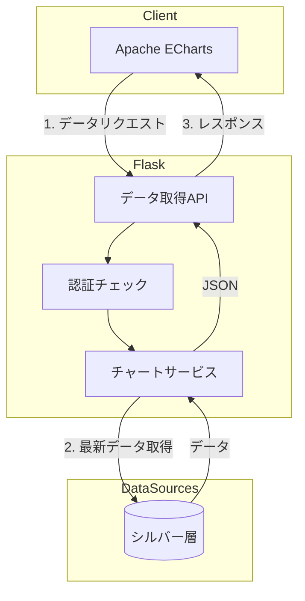
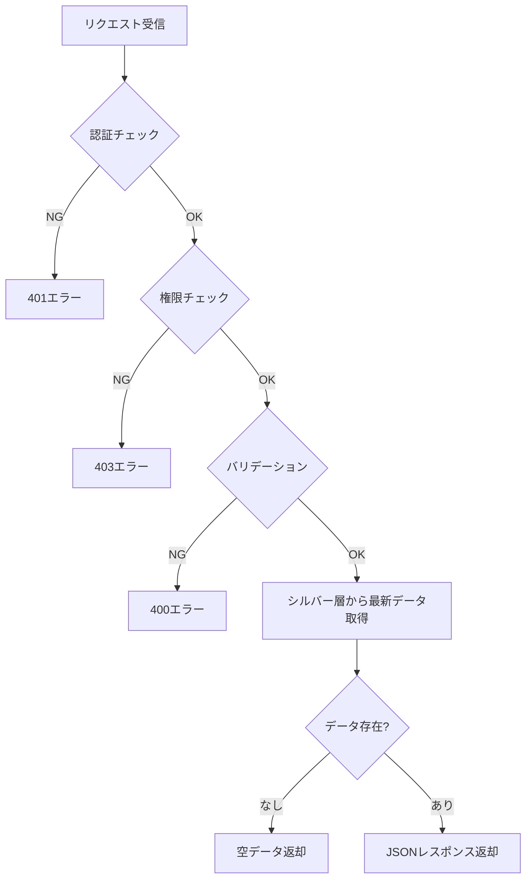

# ダッシュボード円グラフ - ワークフロー仕様書

## 目次

- [概要](#概要)
  - [このドキュメントの役割](#このドキュメントの役割)
  - [対象機能](#対象機能)
- [処理フロー全体図](#処理フロー全体図)
- [Flaskルート定義](#flaskルート定義)
  - [ルート一覧](#ルート一覧)
  - [グラフデータ取得API](#グラフデータ取得api)
- [データ取得ワークフロー](#データ取得ワークフロー)
  - [処理フロー図](#処理フロー図)
  - [データ取得実装](#データ取得実装)
  - [シルバー層クエリ](#シルバー層クエリ)
- [バリデーション仕様](#バリデーション仕様)
  - [リクエストパラメータ定義](#リクエストパラメータ定義)
  - [バリデーション実装](#バリデーション実装)
- [エラーハンドリング](#エラーハンドリング)
  - [エラー分類](#エラー分類)
  - [エラーハンドリング実装](#エラーハンドリング実装)
- [セキュリティ設計](#セキュリティ設計)
- [パフォーマンス設計](#パフォーマンス設計)
- [テスト仕様](#テスト仕様)
- [関連ドキュメント](#関連ドキュメント)
- [変更履歴](#変更履歴)

---

## 概要

このドキュメントは、ダッシュボード円グラフ機能のデータ取得ワークフロー、エラーハンドリングの詳細を記載します。

### このドキュメントの役割

- データ取得APIの処理フロー
- シルバー層からのデータ取得ロジック
- バリデーション・エラーハンドリング

### 対象機能

| 機能ID | 機能名 | 処理内容 |
| ------ | ------ | -------- |
| DCG-001 | グラフ表示 | センサーデータを円グラフで割合表示 |
| DCG-002 | ガジェット設定 | ガジェットタイトル変更・削除 |

---

## 処理フロー全体図



---

## Flaskルート定義

### ルート一覧

| メソッド | URL | 関数名 | 説明 |
| -------- | --- | ------ | ---- |
| GET | /api/customer-dashboard/circle-chart/data | get_circle_chart_data | グラフデータ取得API |

### グラフデータ取得API

```python
from flask import Blueprint, jsonify, request, g
from datetime import datetime
from functools import wraps
import pytz

bp = Blueprint('dashboard_circle_chart', __name__)
JST = pytz.timezone('Asia/Tokyo')

# =============================================================================
# デコレータ定義
# =============================================================================
def login_required(f):
    """認証チェックデコレータ"""
    @wraps(f)
    def decorated_function(*args, **kwargs):
        if not g.get('current_user'):
            return jsonify({'status': 'error', 'message': '認証が必要です'}), 401
        return f(*args, **kwargs)
    return decorated_function

def require_role(*roles):
    """権限チェックデコレータ"""
    def decorator(f):
        @wraps(f)
        def decorated_function(*args, **kwargs):
            if g.current_user.role not in roles:
                return jsonify({'status': 'error', 'message': 'アクセス権限がありません'}), 403
            return f(*args, **kwargs)
        return decorated_function
    return decorator

# =============================================================================
# グラフデータ取得API
# =============================================================================
@bp.route('/api/customer-dashboard/circle-chart/data', methods=['GET'])
@login_required
@require_role('system_admin', 'management_admin', 'sales_company_user', 'service_company_user')
def get_circle_chart_data():
    """
    円グラフ用データを取得

    リクエストパラメータ:
    - device_id: デバイスID（必須）
    - items: 表示項目リスト（必須、カンマ区切り）

    レスポンス:
    - 成功時: {"status": "success", "data": {...}}
    - エラー時: {"status": "error", "message": "..."}
    """
    # パラメータ取得
    params = {
        'device_id': request.args.get('device_id'),
        'items': request.args.get('items')
    }

    # バリデーション
    errors = validate_chart_params(params)
    if errors:
        return jsonify({'status': 'error', 'message': errors[0]}), 400

    # データ取得
    try:
        items_list = params['items'].split(',')
        data = get_chart_data(
            device_id=params['device_id'],
            items=items_list
        )

        if not data['values']:
            return jsonify({
                'status': 'success',
                'data': {
                    'labels': [],
                    'values': [],
                    'device_name': data['device_name'],
                    'message': 'データがありません'
                }
            })

        return jsonify({'status': 'success', 'data': data})

    except Exception as e:
        logger.error(f'Chart data fetch error: {e}')
        return jsonify({'status': 'error', 'message': 'データの取得に失敗しました'}), 500
```

---

## データ取得ワークフロー

### 処理フロー図



### データ取得実装

```python
def get_chart_data(device_id: str, items: list) -> dict:
    """
    円グラフ用データを取得

    Args:
        device_id: デバイスID
        items: 表示項目リスト

    Returns:
        dict: グラフデータ
    """
    # デバイス情報取得
    device = get_device_info(device_id)
    if not device:
        raise ValueError('デバイスが見つかりません')

    # データスコープチェック
    if not check_data_scope(g.current_user, device):
        raise PermissionError('アクセス権限がありません')

    # シルバー層から最新データ取得
    latest_data = query_silver_latest(device_id, items)

    # レスポンス構築
    labels = []
    values = []
    for item in items:
        item_info = SENSOR_ITEMS.get(item)
        if item_info and item in latest_data:
            labels.append(item_info['label'])
            values.append(latest_data[item])

    return {
        'labels': labels,
        'values': values,
        'device_name': device.name
    }
```

### シルバー層クエリ

```python
def query_silver_latest(device_id: str, items: list) -> dict:
    """
    シルバー層から最新データを取得

    Args:
        device_id: デバイスID
        items: 取得する項目リスト

    Returns:
        dict: 項目名と値の辞書
    """
    # 項目カラムを構築
    columns = ', '.join(items)

    query = f"""
    SELECT {columns}
    FROM silver_sensor_data
    WHERE device_uuid = :device_id
    ORDER BY received_at DESC
    LIMIT 1
    """

    result = spark.sql(query, {'device_id': device_id}).first()

    if not result:
        return {}

    return {item: result[item] for item in items if result[item] is not None}
```

---

## バリデーション仕様

### リクエストパラメータ定義

| パラメータ | 型 | 必須 | 説明 |
| ---------- | -- | ---- | ---- |
| device_id | string | ○ | デバイスID（UUID形式） |
| items | string | ○ | 表示項目（カンマ区切り） |

### バリデーション実装

```python
import re

# UUID形式の正規表現
UUID_PATTERN = re.compile(
    r'^[0-9a-f]{8}-[0-9a-f]{4}-[0-9a-f]{4}-[0-9a-f]{4}-[0-9a-f]{12}$',
    re.IGNORECASE
)

# 許可された項目リスト
ALLOWED_ITEMS = [
    'external_temp',
    'set_temp_freezer_1',
    'internal_sensor_temp_freezer_1',
    'internal_temp_freezer_1',
    'df_temp_freezer_1',
    'condensing_temp_freezer_1',
    'adjusted_internal_temp_freezer_1',
    'set_temp_freezer_2',
    'internal_sensor_temp_freezer_2',
    'internal_temp_freezer_2',
    'df_temp_freezer_2',
    'condensing_temp_freezer_2',
    'adjusted_internal_temp_freezer_2',
    'compressor_freezer_1',
    'compressor_freezer_2',
    'fan_motor_1',
    'fan_motor_2',
    'fan_motor_3',
    'fan_motor_4',
    'fan_motor_5',
    'defrost_heater_output_1',
    'defrost_heater_output_2'
]

def validate_chart_params(params: dict) -> list:
    """
    リクエストパラメータをバリデーション

    Args:
        params: リクエストパラメータ

    Returns:
        list: エラーメッセージリスト
    """
    errors = []

    # device_id
    if not params.get('device_id'):
        errors.append('device_idは必須です')
    elif not UUID_PATTERN.match(params['device_id']):
        errors.append('device_idの形式が不正です')

    # items
    if not params.get('items'):
        errors.append('itemsは必須です')
    else:
        items_list = params['items'].split(',')
        for item in items_list:
            if item not in ALLOWED_ITEMS:
                errors.append(f'不正な項目です: {item}')

    return errors
```

---

## エラーハンドリング

### エラー分類

| HTTPステータス | エラー種別 | 説明 |
| -------------- | ---------- | ---- |
| 400 | バリデーションエラー | パラメータ不正 |
| 401 | 認証エラー | 未認証 |
| 403 | 権限エラー | アクセス権限なし |
| 500 | サーバーエラー | 予期せぬエラー |

### エラーハンドリング実装

```python
from flask import jsonify
import logging

logger = logging.getLogger(__name__)

@bp.errorhandler(400)
def bad_request(error):
    return jsonify({
        'status': 'error',
        'message': str(error)
    }), 400

@bp.errorhandler(401)
def unauthorized(error):
    return jsonify({
        'status': 'error',
        'message': '認証が必要です'
    }), 401

@bp.errorhandler(403)
def forbidden(error):
    return jsonify({
        'status': 'error',
        'message': 'アクセス権限がありません'
    }), 403

@bp.errorhandler(500)
def internal_error(error):
    logger.error(f'Internal error: {error}')
    return jsonify({
        'status': 'error',
        'message': 'サーバーエラーが発生しました'
    }), 500
```

---

## セキュリティ設計

### 入力検証

- SQLインジェクション対策: SQLAlchemyプリペアドステートメント使用
- XSS対策: Jinja2自動エスケープ有効
- パラメータ検証: 許可された項目リストとのホワイトリスト照合

---

## パフォーマンス設計

### 性能目標

| 指標 | 目標値 |
| ---- | ------ |
| API応答時間 | 500ms以下 |
| 最大同時接続 | 100接続 |

### 最適化方針

- 最新レコード1件のみ取得（LIMIT 1）
- 必要なカラムのみ取得

---

## テスト仕様

### 単体テスト

| テストケース | 入力 | 期待結果 |
| ------------ | ---- | -------- |
| 正常系 | 有効なdevice_id, items | 200 + データ |
| 認証エラー | 未認証 | 401 |
| 権限エラー | 権限なし | 403 |
| パラメータエラー | 不正なdevice_id | 400 |
| データなし | 存在しないデバイス | 200 + 空データ |

### 統合テスト

| テストケース | 検証内容 |
| ------------ | -------- |
| E2E表示 | 画面表示からグラフ描画まで |
| データスコープ | 組織外データへのアクセス拒否 |

---

## 関連ドキュメント

- [UI仕様書](./ui-specification.md)
- [機能概要](./README.md)
- [シルバー層仕様](../../ldp-pipeline/silver-layer/README.md)
- [共通仕様書](../../common/common-specification.md)

---

## 変更履歴

| 日付 | バージョン | 更新内容 |
|------|------------|----------|
| 2026-02-12 | 1.0 | 初版作成 |
