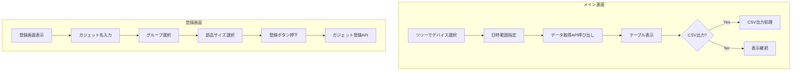
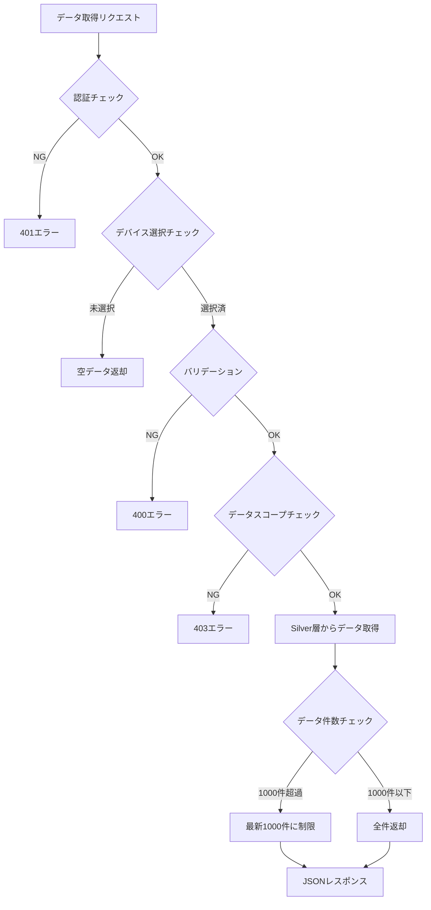
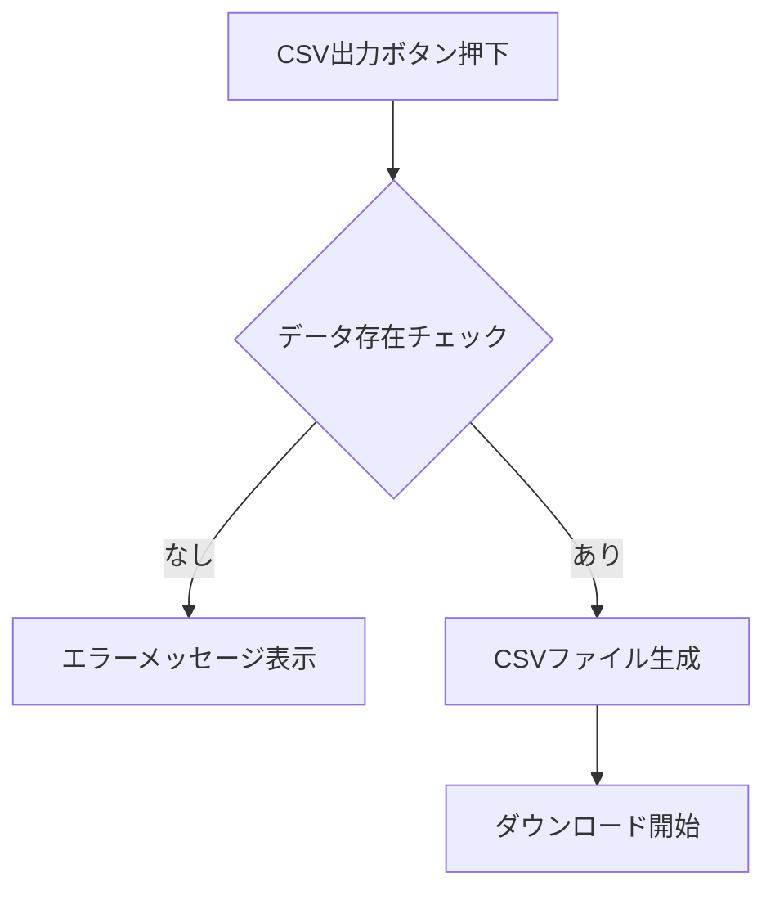
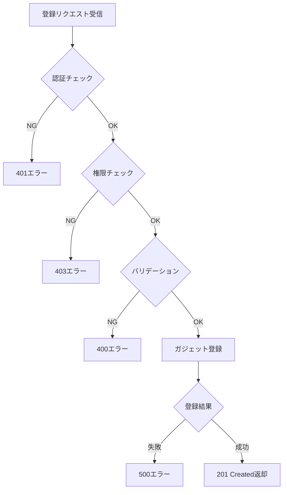

# ダッシュボード表ガジェット - ワークフロー仕様書

## 目次

- [概要](#概要)
- [データ取得ワークフロー](#データ取得ワークフロー)
- [CSV出力ワークフロー](#csv出力ワークフロー)
- [ガジェット登録ワークフロー](#ガジェット登録ワークフロー)
- [バリデーション](#バリデーション)
- [エラーハンドリング](#エラーハンドリング)

---

## 概要

本仕様書では、ダッシュボード表ガジェット機能のワークフローを定義する。

### 処理フロー概要



---

## データ取得ワークフロー

### 処理フロー図



### APIエンドポイント

**GET /api/dashboard/table/data**

### リクエストパラメータ

| パラメータ | 型 | 必須 | 説明 |
|-----------|-----|------|------|
| device_id | string | ○ | デバイスID |
| start_datetime | string | ○ | 開始日時（ISO 8601形式） |
| end_datetime | string | ○ | 終了日時（ISO 8601形式） |

### レスポンス

```json
{
  "success": true,
  "data": {
    "device_id": "DEV001",
    "device_name": "Device-001",
    "records": [
      {
        "timestamp": "2026-02-16T08:41:46+09:00",
        "external_temp": 25.5,
        "set_temp_freezer_1": -18.0,
        "internal_sensor_temp_freezer_1": -17.8,
        "internal_temp_freezer_1": -18.2,
        "df_temp_freezer_1": -15.0,
        "condensing_temp_freezer_1": 35.0,
        "adjusted_internal_temp_freezer_1": -18.1,
        "set_temp_freezer_2": -20.0,
        "internal_sensor_temp_freezer_2": -19.5,
        "internal_temp_freezer_2": -20.1,
        "df_temp_freezer_2": -16.0,
        "condensing_temp_freezer_2": 36.0,
        "adjusted_internal_temp_freezer_2": -20.0,
        "compressor_freezer_1": 2500,
        "compressor_freezer_2": 2600,
        "fan_motor_1": 1200,
        "fan_motor_2": 1180,
        "fan_motor_3": 1190,
        "fan_motor_4": 1210,
        "fan_motor_5": 1195,
        "defrost_heater_output_1": 45.0,
        "defrost_heater_output_2": 42.5
      }
    ],
    "total_count": 360,
    "truncated": false
  }
}
```

### データ取得クエリ（参考）

```python
def get_table_data(device_id: str, start_datetime: datetime, end_datetime: datetime) -> dict:
    """
    表ガジェット用のセンサーデータを取得

    Args:
        device_id: デバイスID
        start_datetime: 開始日時
        end_datetime: 終了日時

    Returns:
        センサーデータのリスト
    """
    # 最大取得件数
    MAX_RECORDS = 1000

    query = """
        SELECT
            received_at as timestamp,
            device_name,
            external_temp,
            set_temp_freezer_1,
            internal_sensor_temp_freezer_1,
            internal_temp_freezer_1,
            df_temp_freezer_1,
            condensing_temp_freezer_1,
            adjusted_internal_temp_freezer_1,
            set_temp_freezer_2,
            internal_sensor_temp_freezer_2,
            internal_temp_freezer_2,
            df_temp_freezer_2,
            condensing_temp_freezer_2,
            adjusted_internal_temp_freezer_2,
            compressor_freezer_1,
            compressor_freezer_2,
            fan_motor_1,
            fan_motor_2,
            fan_motor_3,
            fan_motor_4,
            fan_motor_5,
            defrost_heater_output_1,
            defrost_heater_output_2
        FROM silver_sensor_data
        WHERE device_id = :device_id
          AND received_at >= :start_datetime
          AND received_at <= :end_datetime
        ORDER BY received_at DESC
        LIMIT :max_records
    """

    records = execute_query(query, {
        'device_id': device_id,
        'start_datetime': start_datetime,
        'end_datetime': end_datetime,
        'max_records': MAX_RECORDS
    })

    return {
        'records': records,
        'total_count': len(records),
        'truncated': len(records) >= MAX_RECORDS
    }
```

---

## CSV出力ワークフロー

### 処理フロー図



### CSV出力仕様

**ファイル名形式:**
`table_{device_uuid}_{yyyyMMddHHmmss}.csv`

**文字コード:** UTF-8（BOM付き）

**CSV列構成:**

| 列番号 | ヘッダー名 | 説明 |
|--------|-----------|------|
| 1 | timestamp | 受信日時（YYYY-MM-DD HH:mm:ss形式） |
| 2 | device_name | デバイス名称 |
| 3 | external_temp | 外気温度 |
| 4 | set_temp_freezer_1 | 第1冷凍 設定温度 |
| 5 | internal_sensor_temp_freezer_1 | 第1冷凍 庫内センサー温度 |
| 6 | internal_temp_freezer_1 | 第1冷凍 庫内温度 |
| 7 | df_temp_freezer_1 | 第1冷凍 DF温度 |
| 8 | condensing_temp_freezer_1 | 第1冷凍 凝縮温度 |
| 9 | adjusted_internal_temp_freezer_1 | 第1冷凍 微調整後庫内温度 |
| 10 | set_temp_freezer_2 | 第2冷凍 設定温度 |
| 11 | internal_sensor_temp_freezer_2 | 第2冷凍 庫内センサー温度 |
| 12 | internal_temp_freezer_2 | 第2冷凍 庫内温度 |
| 13 | df_temp_freezer_2 | 第2冷凍 DF温度 |
| 14 | condensing_temp_freezer_2 | 第2冷凍 凝縮温度 |
| 15 | adjusted_internal_temp_freezer_2 | 第2冷凍 微調整後庫内温度 |
| 16 | compressor_freezer_1 | 第1冷凍 圧縮機 |
| 17 | compressor_freezer_2 | 第2冷凍 圧縮機 |
| 18 | fan_motor_1 | 第1ファンモータ回転数 |
| 19 | fan_motor_2 | 第2ファンモータ回転数 |
| 20 | fan_motor_3 | 第3ファンモータ回転数 |
| 21 | fan_motor_4 | 第4ファンモータ回転数 |
| 22 | fan_motor_5 | 第5ファンモータ回転数 |
| 23 | defrost_heater_output_1 | 防露ヒータ出力(1) |
| 24 | defrost_heater_output_2 | 防露ヒータ出力(2) |

### CSV出力処理（参考）

```python
import csv
import io
from datetime import datetime

def generate_table_csv(records: list, device_name: str) -> str:
    """
    表ガジェットのCSVを生成

    Args:
        records: センサーデータのリスト
        device_name: デバイス名称

    Returns:
        CSVファイルの内容（UTF-8 BOM付き）
    """
    output = io.StringIO()

    # BOM付きUTF-8
    output.write('\ufeff')

    writer = csv.writer(output)

    # ヘッダー行
    headers = [
        'timestamp', 'device_name',
        'external_temp', 'set_temp_freezer_1', 'internal_sensor_temp_freezer_1',
        'internal_temp_freezer_1', 'df_temp_freezer_1', 'condensing_temp_freezer_1',
        'adjusted_internal_temp_freezer_1', 'set_temp_freezer_2',
        'internal_sensor_temp_freezer_2', 'internal_temp_freezer_2',
        'df_temp_freezer_2', 'condensing_temp_freezer_2',
        'adjusted_internal_temp_freezer_2', 'compressor_freezer_1',
        'compressor_freezer_2', 'fan_motor_1', 'fan_motor_2',
        'fan_motor_3', 'fan_motor_4', 'fan_motor_5',
        'defrost_heater_output_1', 'defrost_heater_output_2'
    ]
    writer.writerow(headers)

    # データ行
    for record in records:
        row = [
            record['timestamp'].strftime('%Y-%m-%d %H:%M:%S'),
            device_name,
            record.get('external_temp', ''),
            record.get('set_temp_freezer_1', ''),
            record.get('internal_sensor_temp_freezer_1', ''),
            record.get('internal_temp_freezer_1', ''),
            record.get('df_temp_freezer_1', ''),
            record.get('condensing_temp_freezer_1', ''),
            record.get('adjusted_internal_temp_freezer_1', ''),
            record.get('set_temp_freezer_2', ''),
            record.get('internal_sensor_temp_freezer_2', ''),
            record.get('internal_temp_freezer_2', ''),
            record.get('df_temp_freezer_2', ''),
            record.get('condensing_temp_freezer_2', ''),
            record.get('adjusted_internal_temp_freezer_2', ''),
            record.get('compressor_freezer_1', ''),
            record.get('compressor_freezer_2', ''),
            record.get('fan_motor_1', ''),
            record.get('fan_motor_2', ''),
            record.get('fan_motor_3', ''),
            record.get('fan_motor_4', ''),
            record.get('fan_motor_5', ''),
            record.get('defrost_heater_output_1', ''),
            record.get('defrost_heater_output_2', '')
        ]
        writer.writerow(row)

    return output.getvalue()
```

---

## ガジェット登録ワークフロー

### 処理フロー図



### APIエンドポイント

**POST /api/dashboard/table/gadgets**

### リクエストボディ

| パラメータ | 型 | 必須 | 説明 |
|-----------|-----|------|------|
| gadget_name | string | ○ | ガジェット名（最大50文字） |
| group_id | string | ○ | グループID |
| gadget_size | string | ○ | 部品サイズ（'2x2' / '3x2'） |

### リクエスト例

```json
{
  "gadget_name": "センサーデータ一覧",
  "group_id": "grp_001",
  "gadget_size": "2x2"
}
```

### レスポンス（成功時）

```json
{
  "success": true,
  "data": {
    "gadget_id": "gdt_12345",
    "gadget_name": "センサーデータ一覧",
    "gadget_type": "table",
    "group_id": "grp_001",
    "gadget_size": "2x2",
    "created_at": "2026-02-16T10:30:00+09:00"
  }
}
```

### 登録処理の流れ

1. **認証・権限チェック**: ログインユーザーの認証状態とロールを確認
2. **バリデーション**: 必須項目、文字数、形式をチェック
3. **ガジェット登録**: **TODO** 登録先DBにガジェット情報を保存

### 円グラフ・棒グラフとの主な違い

| 項目 | 円グラフ/棒グラフ | 表 |
|------|------------------|-----|
| デバイスモード | device_mode（'specified' / 'tree_linked'） | なし（常にツリー連動） |
| device_id | あり（指定デバイス時） | なし |
| センサー選択 | items / item | なし（全項目固定） |
| 集約方法 | aggregation_method_id | なし |
| 最小値/最大値 | 棒グラフのみ | なし |

---

## バリデーション

### 日時範囲バリデーション

```python
from datetime import datetime, timedelta

# =============================================================================
# 許可値定義
# =============================================================================
MAX_RANGE_HOURS = 24  # 最大取得範囲（時間）

VALID_GADGET_SIZES = ['2x2', '3x2']


# =============================================================================
# バリデーション処理
# =============================================================================
def validate_datetime_range(start_datetime: str, end_datetime: str) -> list:
    """
    日時範囲のバリデーション

    Args:
        start_datetime: 開始日時（ISO 8601形式）
        end_datetime: 終了日時（ISO 8601形式）

    Returns:
        エラーメッセージのリスト（空リストは正常）
    """
    errors = []

    # 形式チェック
    try:
        start_dt = datetime.fromisoformat(start_datetime)
    except ValueError:
        errors.append('開始日時の形式が不正です')
        return errors

    try:
        end_dt = datetime.fromisoformat(end_datetime)
    except ValueError:
        errors.append('終了日時の形式が不正です')
        return errors

    # 範囲チェック
    if start_dt >= end_dt:
        errors.append('開始日時は終了日時より前に設定してください')

    # 最大範囲チェック
    if (end_dt - start_dt) > timedelta(hours=MAX_RANGE_HOURS):
        errors.append(f'取得範囲は{MAX_RANGE_HOURS}時間以内で指定してください')

    return errors


def validate_gadget_params(params: dict) -> list:
    """
    ガジェット登録パラメータのバリデーション

    Args:
        params: リクエストパラメータ辞書

    Returns:
        エラーメッセージのリスト（空リストは正常）
    """
    errors = []

    # ガジェット名
    if not params.get('gadget_name'):
        errors.append('ガジェット名は必須です')
    elif len(params['gadget_name']) > 50:
        errors.append('ガジェット名は50文字以内で入力してください')

    # グループID
    if not params.get('group_id'):
        errors.append('グループIDは必須です')

    # 部品サイズ
    if not params.get('gadget_size'):
        errors.append('部品サイズは必須です')
    elif params['gadget_size'] not in VALID_GADGET_SIZES:
        errors.append('部品サイズが不正です')

    return errors
```

### 許可値一覧

**部品サイズ（gadget_size）:**

| 値 | ラベル | 説明 |
|----|--------|------|
| 2x2 | 2x2 | 標準サイズ |
| 3x2 | 3x2 | 横長サイズ |

**日時範囲:**

| 制約 | 値 | 説明 |
|------|-----|------|
| 最大範囲 | 24時間 | 開始〜終了の差分 |
| 形式 | ISO 8601 | YYYY-MM-DDTHH:mm:ss+09:00 |

---

## エラーハンドリング

### エラー分類

| HTTPステータス | エラー種別 | 説明 |
|---------------|-----------|------|
| 400 | Bad Request | バリデーションエラー、パラメータ不正 |
| 401 | Unauthorized | 認証エラー（未ログイン、セッション切れ） |
| 403 | Forbidden | 権限エラー（データスコープ外アクセス） |
| 404 | Not Found | リソース未検出（デバイス、ガジェット） |
| 500 | Internal Server Error | サーバー内部エラー |

### エラーレスポンス形式

```json
{
  "success": false,
  "error": {
    "code": "VALIDATION_ERROR",
    "message": "取得範囲は24時間以内で指定してください",
    "details": [
      {
        "field": "datetime_range",
        "message": "取得範囲は24時間以内で指定してください"
      }
    ]
  }
}
```

### エラーコード一覧

| コード | 説明 | 対応HTTPステータス |
|--------|------|-------------------|
| VALIDATION_ERROR | バリデーションエラー | 400 |
| INVALID_DATETIME_FORMAT | 日時形式不正 | 400 |
| DATETIME_RANGE_EXCEEDED | 日時範囲超過 | 400 |
| UNAUTHORIZED | 認証エラー | 401 |
| FORBIDDEN | アクセス権限なし | 403 |
| DEVICE_NOT_FOUND | デバイス未検出 | 404 |
| GADGET_NOT_FOUND | ガジェット未検出 | 404 |
| INTERNAL_ERROR | サーバーエラー | 500 |

---

## 更新履歴

| 日付 | バージョン | 更新内容 |
|------|------------|----------|
| 2026-02-16 | 1.0 | 初版作成 |
