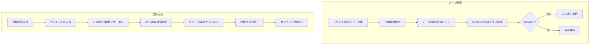
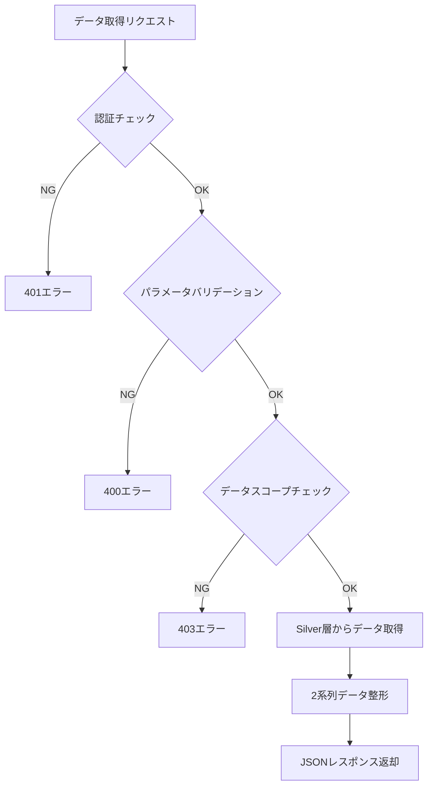
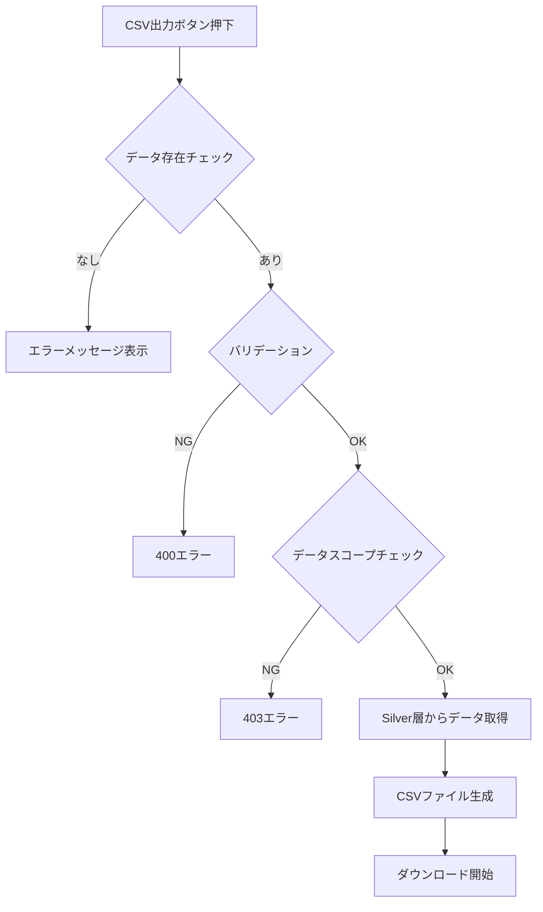
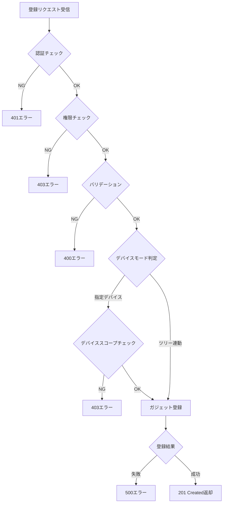

# ダッシュボード時系列グラフ - ワークフロー仕様書

## 📑 目次

- [概要](#概要)
- [Flaskルート定義](#flaskルート定義)
- [データ取得ワークフロー](#データ取得ワークフロー)
- [CSV出力ワークフロー](#csv出力ワークフロー)
- [ガジェット登録ワークフロー](#ガジェット登録ワークフロー)
- [バリデーション仕様](#バリデーション仕様)
- [エラーハンドリング](#エラーハンドリング)
- [セキュリティ設計](#セキュリティ設計)
- [パフォーマンス設計](#パフォーマンス設計)
- [テスト仕様](#テスト仕様)
- [関連ドキュメント](#関連ドキュメント)
- [更新履歴](#更新履歴)

---

## 概要

このドキュメントは、ダッシュボード時系列グラフ機能のワークフローを定義する。

**このドキュメントの役割:**
- ✅ データ取得API処理フロー（Silver層からの生データ取得）
- ✅ CSV出力処理フロー
- ✅ ガジェット登録処理フロー
- ✅ バリデーション・エラーハンドリング

**対象機能:**

| 機能ID | 機能名 | 説明 |
|--------|--------|------|
| DTL-001 | 時系列グラフ表示 | 指定期間のセンサーデータを折れ線グラフで表示 |
| DTL-002 | 期間選択 | 開始・終了日時を指定してデータ範囲を変更 |
| DTL-003 | CSV出力 | 表示中のデータをCSVファイルとしてダウンロード |
| DTL-004 | ガジェット登録 | 時系列グラフをダッシュボードに登録 |

**注:** UI要素の詳細やバリデーションルールは [UI仕様書](./ui-specification.md) を参照してください。

### 処理フロー概要



---

## Flaskルート定義

### ルート一覧

| No | ルート名 | エンドポイント | メソッド | 用途 | レスポンス形式 | 備考 |
|----|---------|---------------|---------|------|---------------|------|
| 1 | データ取得 | `/api/dashboard/timeline/data` | GET | 時系列データ取得 | JSON | Silver層から生データ取得 |
| 2 | CSV出力 | `/api/dashboard/timeline/csv` | GET | CSV出力 | CSVファイル | UTF-8 BOM付き |
| 3 | ガジェット登録 | `/api/dashboard/timeline/gadgets` | POST | ガジェット登録 | JSON | 201 Created |

---

### グラフデータ取得API

```python
from flask import Blueprint, request, jsonify
from datetime import datetime

timeline_bp = Blueprint('dashboard_timeline', __name__)


@timeline_bp.route('/api/dashboard/timeline/data', methods=['GET'])
@require_login
@require_role('system_admin', 'management_admin', 'sales_company_user', 'service_company_user')
def get_timeline_data():
    """時系列グラフ用のセンサーデータを取得"""

    # パラメータ取得
    device_id = request.args.get('device_id')
    left_item = request.args.get('left_item')
    right_item = request.args.get('right_item')
    start_datetime = request.args.get('start_datetime')
    end_datetime = request.args.get('end_datetime')

    # バリデーション
    errors = validate_chart_params(device_id, left_item, right_item, start_datetime, end_datetime)
    if errors:
        return jsonify({'success': False, 'error': {'code': 'VALIDATION_ERROR', 'message': errors[0], 'details': errors}}), 400

    # データスコープチェック
    if not check_device_scope(device_id, current_user):
        return jsonify({'success': False, 'error': {'code': 'FORBIDDEN', 'message': 'アクセス権限がありません'}}), 403

    # データ取得
    try:
        chart_data = get_chart_data(
            device_id=device_id,
            left_item=left_item,
            right_item=right_item,
            start_datetime=datetime.fromisoformat(start_datetime),
            end_datetime=datetime.fromisoformat(end_datetime)
        )
        return jsonify({'success': True, 'data': chart_data}), 200

    except Exception as e:
        logger.error(f"時系列データ取得失敗: {e}")
        return jsonify({'success': False, 'error': {'code': 'INTERNAL_ERROR', 'message': 'データの取得に失敗しました'}}), 500
```

---

### CSV出力API

```python
import csv
import io
from flask import Response

@timeline_bp.route('/api/dashboard/timeline/csv', methods=['GET'])
@require_login
@require_role('system_admin', 'management_admin', 'sales_company_user', 'service_company_user')
def export_timeline_csv():
    """時系列データをCSV出力"""

    # パラメータ取得・バリデーション
    device_id = request.args.get('device_id')
    left_item = request.args.get('left_item')
    right_item = request.args.get('right_item')
    start_datetime = request.args.get('start_datetime')
    end_datetime = request.args.get('end_datetime')

    errors = validate_chart_params(device_id, left_item, right_item, start_datetime, end_datetime)
    if errors:
        return jsonify({'success': False, 'error': {'code': 'VALIDATION_ERROR', 'message': errors[0]}}), 400

    # データスコープチェック
    if not check_device_scope(device_id, current_user):
        return jsonify({'success': False, 'error': {'code': 'FORBIDDEN', 'message': 'アクセス権限がありません'}}), 403

    # データ取得
    chart_data = get_chart_data(
        device_id=device_id,
        left_item=left_item,
        right_item=right_item,
        start_datetime=datetime.fromisoformat(start_datetime),
        end_datetime=datetime.fromisoformat(end_datetime)
    )

    # CSV生成
    csv_content = generate_timeline_csv(chart_data, left_item, right_item)

    # ファイル名生成
    device_uuid = get_device_uuid(device_id)
    timestamp = datetime.now().strftime('%Y%m%d%H%M%S')
    filename = f'timeline_{device_uuid}_{timestamp}.csv'

    return Response(
        csv_content,
        mimetype='text/csv; charset=utf-8',
        headers={'Content-Disposition': f'attachment; filename={filename}'}
    )
```

---

### ガジェット登録API

```python
@timeline_bp.route('/api/dashboard/timeline/gadgets', methods=['POST'])
@require_login
@require_role('system_admin', 'management_admin', 'sales_company_user', 'service_company_user')
def register_timeline_gadget():
    """時系列グラフガジェットを登録"""

    params = request.get_json()

    # バリデーション
    errors = validate_register_params(params)
    if errors:
        return jsonify({'success': False, 'error': {'code': 'VALIDATION_ERROR', 'message': errors[0], 'details': errors}}), 400

    # デバイスモードが指定デバイスの場合、データスコープチェック
    if params.get('device_mode') == 'specified':
        if not check_device_scope(params.get('device_id'), current_user):
            return jsonify({'success': False, 'error': {'code': 'FORBIDDEN', 'message': 'アクセス権限がありません'}}), 403

    # ガジェット登録
    try:
        gadget = register_gadget(params)  # TODO: 登録先DB
        return jsonify({
            'success': True,
            'data': {
                'gadget_id': gadget['gadget_id'],
                'gadget_name': params['gadget_name'],
                'gadget_type': 'timeline',
                'group_id': params['group_id'],
                'gadget_size': params['gadget_size'],
                'created_at': datetime.now().isoformat()
            }
        }), 201

    except Exception as e:
        logger.error(f"ガジェット登録失敗: {e}")
        return jsonify({'success': False, 'error': {'code': 'INTERNAL_ERROR', 'message': 'ガジェットの登録に失敗しました'}}), 500
```

---

## データ取得ワークフロー

### 処理フロー図



### APIエンドポイント

**GET /api/dashboard/timeline/data**

### リクエストパラメータ

| パラメータ | 型 | 必須 | 説明 |
|-----------|-----|------|------|
| device_id | string | ○ | デバイスID |
| left_item | string | ○ | 左Y軸のセンサー項目カラム名 |
| right_item | string | ○ | 右Y軸のセンサー項目カラム名 |
| start_datetime | string | ○ | 開始日時（ISO 8601形式） |
| end_datetime | string | ○ | 終了日時（ISO 8601形式） |

### レスポンス

```json
{
  "success": true,
  "data": {
    "device_id": "DEV001",
    "device_name": "Device-001",
    "left_item": {
      "column": "external_temp",
      "label": "共通外気温度",
      "unit": "℃"
    },
    "right_item": {
      "column": "compressor_freezer_1",
      "label": "第1冷凍圧縮機回転数",
      "unit": "rpm"
    },
    "timestamps": [
      "2026-02-17T08:00:00+09:00",
      "2026-02-17T08:00:10+09:00",
      "2026-02-17T08:00:20+09:00"
    ],
    "left_values": [25.5, 25.6, 25.4],
    "right_values": [2500, 2510, 2495],
    "total_count": 360
  }
}
```

### データ取得実装

```python
from databricks import sql as databricks_sql

# センサー項目マスタ
SENSOR_ITEMS = {
    'external_temp': {'label': '共通外気温度', 'unit': '℃'},
    'set_temp_freezer_1': {'label': '第1冷凍設定温度', 'unit': '℃'},
    'internal_sensor_temp_freezer_1': {'label': '第1冷凍庫内センサー温度', 'unit': '℃'},
    'internal_temp_freezer_1': {'label': '第1冷凍表示温度', 'unit': '℃'},
    'df_temp_freezer_1': {'label': '第1冷凍DF温度', 'unit': '℃'},
    'condensing_temp_freezer_1': {'label': '第1冷凍凝縮温度', 'unit': '℃'},
    'adjusted_internal_temp_freezer_1': {'label': '第1冷凍微調整後庫内温度', 'unit': '℃'},
    'set_temp_freezer_2': {'label': '第2冷凍設定温度', 'unit': '℃'},
    'internal_sensor_temp_freezer_2': {'label': '第2冷凍庫内センサー温度', 'unit': '℃'},
    'internal_temp_freezer_2': {'label': '第2冷凍表示温度', 'unit': '℃'},
    'df_temp_freezer_2': {'label': '第2冷凍DF温度', 'unit': '℃'},
    'condensing_temp_freezer_2': {'label': '第2冷凍凝縮温度', 'unit': '℃'},
    'adjusted_internal_temp_freezer_2': {'label': '第2冷凍微調整後庫内温度', 'unit': '℃'},
    'compressor_freezer_1': {'label': '第1冷凍圧縮機回転数', 'unit': 'rpm'},
    'compressor_freezer_2': {'label': '第2冷凍圧縮機回転数', 'unit': 'rpm'},
    'fan_motor_1': {'label': '第1ファンモータ回転数', 'unit': 'rpm'},
    'fan_motor_2': {'label': '第2ファンモータ回転数', 'unit': 'rpm'},
    'fan_motor_3': {'label': '第3ファンモータ回転数', 'unit': 'rpm'},
    'fan_motor_4': {'label': '第4ファンモータ回転数', 'unit': 'rpm'},
    'fan_motor_5': {'label': '第5ファンモータ回転数', 'unit': 'rpm'},
    'defrost_heater_output_1': {'label': '防露ヒータ出力(1)', 'unit': '%'},
    'defrost_heater_output_2': {'label': '防露ヒータ出力(2)', 'unit': '%'},
}


def get_chart_data(device_id: str, left_item: str, right_item: str,
                   start_datetime: datetime, end_datetime: datetime) -> dict:
    """
    時系列グラフ用のセンサーデータを取得

    Args:
        device_id: デバイスID
        left_item: 左Y軸のセンサー項目カラム名
        right_item: 右Y軸のセンサー項目カラム名
        start_datetime: 開始日時
        end_datetime: 終了日時

    Returns:
        時系列チャートデータ
    """
    records = fetch_silver_data(device_id, left_item, right_item, start_datetime, end_datetime)

    # レスポンスデータ整形
    timestamps = [r['event_timestamp'].isoformat() for r in records]
    left_values = [r['left_value'] for r in records]
    right_values = [r['right_value'] for r in records]

    device_name = get_device_name(device_id)

    return {
        'device_id': device_id,
        'device_name': device_name,
        'left_item': {
            'column': left_item,
            'label': SENSOR_ITEMS[left_item]['label'],
            'unit': SENSOR_ITEMS[left_item]['unit']
        },
        'right_item': {
            'column': right_item,
            'label': SENSOR_ITEMS[right_item]['label'],
            'unit': SENSOR_ITEMS[right_item]['unit']
        },
        'timestamps': timestamps,
        'left_values': left_values,
        'right_values': right_values,
        'total_count': len(records)
    }
```

### Silver層クエリ

```python
def fetch_silver_data(device_id: str, left_item: str, right_item: str,
                      start_datetime: datetime, end_datetime: datetime) -> list:
    """
    Silver層からセンサーデータを取得（集約なし、生データ直接）

    Args:
        device_id: デバイスID
        left_item: 左Y軸のカラム名
        right_item: 右Y軸のカラム名
        start_datetime: 開始日時
        end_datetime: 終了日時

    Returns:
        センサーデータのリスト
    """
    # ホワイトリスト照合済みのカラム名を使用
    query = f"""
        SELECT
            event_timestamp,
            {left_item} as left_value,
            {right_item} as right_value
        FROM sensor_data_view
        WHERE device_id = :device_id
          AND event_timestamp >= :start_datetime
          AND event_timestamp <= :end_datetime
        ORDER BY event_timestamp ASC
    """

    records = execute_query(query, {
        'device_id': device_id,
        'start_datetime': start_datetime,
        'end_datetime': end_datetime
    })

    return records
```

**注:** `left_item` / `right_item` のカラム名は `SENSOR_ITEMS` のホワイトリストで照合済みのため、SQLインジェクションのリスクはない。`sensor_data_view` はRow Access Policyが適用された動的ビューであり、ユーザーのデータスコープ制限が自動的に適用される。

---

## CSV出力ワークフロー

### 処理フロー図



### CSV出力仕様

**ファイル名形式:**
`timeline_{device_uuid}_{yyyyMMddHHmmss}.csv`

**文字コード:** UTF-8（BOM付き）

**CSV列構成:**

| 列番号 | ヘッダー名 | 説明 |
|--------|-----------|------|
| 1 | timestamp | 受信日時（YYYY-MM-DD HH:mm:ss形式） |
| 2 | device_name | デバイス名称 |
| 3 | {左Y軸項目のラベル} | 左Y軸に選択されたセンサー値 |
| 4 | {右Y軸項目のラベル} | 右Y軸に選択されたセンサー値 |

### CSV出力処理（参考）

```python
import csv
import io
from datetime import datetime


def generate_timeline_csv(chart_data: dict, left_item: str, right_item: str) -> str:
    """
    時系列グラフのCSVを生成

    Args:
        chart_data: グラフデータ（get_chart_dataの戻り値）
        left_item: 左Y軸のカラム名
        right_item: 右Y軸のカラム名

    Returns:
        CSVファイルの内容（UTF-8 BOM付き）
    """
    output = io.StringIO()

    # BOM付きUTF-8
    output.write('\ufeff')

    writer = csv.writer(output)

    # ヘッダー行
    left_label = SENSOR_ITEMS[left_item]['label']
    right_label = SENSOR_ITEMS[right_item]['label']
    headers = ['timestamp', 'device_name', left_label, right_label]
    writer.writerow(headers)

    # データ行
    device_name = chart_data['device_name']
    for i, timestamp in enumerate(chart_data['timestamps']):
        row = [
            datetime.fromisoformat(timestamp).strftime('%Y-%m-%d %H:%M:%S'),
            device_name,
            chart_data['left_values'][i] if chart_data['left_values'][i] is not None else '',
            chart_data['right_values'][i] if chart_data['right_values'][i] is not None else ''
        ]
        writer.writerow(row)

    return output.getvalue()
```

---

## ガジェット登録ワークフロー

### 処理フロー図



### APIエンドポイント

**POST /api/dashboard/timeline/gadgets**

### リクエストボディ

| パラメータ | 型 | 必須 | 説明 |
|-----------|-----|------|------|
| gadget_name | string | ○ | ガジェット名（最大50文字） |
| device_mode | string | ○ | デバイスモード（'specified' / 'tree_linked'） |
| device_id | string | ※ | デバイスID（※ device_mode='specified' の場合必須） |
| left_item | string | ○ | 左Y軸のセンサー項目カラム名 |
| right_item | string | ○ | 右Y軸のセンサー項目カラム名 |
| left_min | number | - | 左Y軸の最小値（任意） |
| left_max | number | - | 左Y軸の最大値（任意） |
| right_min | number | - | 右Y軸の最小値（任意） |
| right_max | number | - | 右Y軸の最大値（任意） |
| group_id | string | ○ | グループID |
| gadget_size | string | ○ | 部品サイズ（'2x2' / '2x4'） |

### リクエスト例

```json
{
  "gadget_name": "温度・圧縮機比較",
  "device_mode": "specified",
  "device_id": "DEV001",
  "left_item": "external_temp",
  "right_item": "compressor_freezer_1",
  "left_min": -30,
  "left_max": 50,
  "right_min": 0,
  "right_max": 5000,
  "group_id": "grp_001",
  "gadget_size": "2x4"
}
```

### レスポンス（成功時）

```json
{
  "success": true,
  "data": {
    "gadget_id": "gdt_12345",
    "gadget_name": "温度・圧縮機比較",
    "gadget_type": "timeline",
    "group_id": "grp_001",
    "gadget_size": "2x4",
    "created_at": "2026-02-17T10:30:00+09:00"
  }
}
```

### 登録処理の流れ

1. **認証・権限チェック**: ログインユーザーの認証状態とロールを確認
2. **バリデーション**: 必須項目、文字数、形式、許可値をチェック
3. **デバイスモード分岐**: 指定デバイスの場合はデバイスのスコープチェック
4. **最小値/最大値整合チェック**: min < max の検証（設定されている場合）
5. **ガジェット登録**: **TODO** 登録先DBにガジェット情報を保存

### 棒グラフ・円グラフとの主な違い

| 項目 | 棒グラフ/円グラフ | 時系列 |
|------|------------------|------------|
| センサー選択方式 | items（1項目または1-5項目） | left_item / right_item（2項目固定） |
| 集約方法 | aggregation_method_id（8種） | なし |
| 最小値/最大値 | min_value / max_value（棒グラフのみ、1軸分） | left_min/max, right_min/max（2軸分） |
| 部品サイズ | 2x2 / 2x4 | 2x2 / 2x4 |

---

## バリデーション仕様

### リクエストパラメータ定義（データ取得API）

| パラメータ | 型 | 必須 | バリデーション |
|-----------|-----|------|--------------|
| device_id | string | ○ | 空文字不可 |
| left_item | string | ○ | SENSOR_ITEMS のキーに含まれること |
| right_item | string | ○ | SENSOR_ITEMS のキーに含まれること |
| start_datetime | string | ○ | ISO 8601形式 |
| end_datetime | string | ○ | ISO 8601形式、start_datetime より後 |

### リクエストパラメータ定義（ガジェット登録API）

| パラメータ | 型 | 必須 | バリデーション |
|-----------|-----|------|--------------|
| gadget_name | string | ○ | 1-50文字 |
| device_mode | string | ○ | 'specified' / 'tree_linked' |
| device_id | string | ※ | device_mode='specified' の場合必須 |
| left_item | string | ○ | SENSOR_ITEMS のキーに含まれること |
| right_item | string | ○ | SENSOR_ITEMS のキーに含まれること |
| left_min | number | - | 数値形式、left_max より小さいこと |
| left_max | number | - | 数値形式、left_min より大きいこと |
| right_min | number | - | 数値形式、right_max より小さいこと |
| right_max | number | - | 数値形式、right_min より大きいこと |
| group_id | string | ○ | 空文字不可 |
| gadget_size | string | ○ | '2x2' / '2x4' |

### バリデーション実装

```python
from datetime import datetime, timedelta

# =============================================================================
# 許可値定義
# =============================================================================
MAX_RANGE_HOURS = 24  # 最大取得範囲（時間）

VALID_ITEMS = list(SENSOR_ITEMS.keys())

VALID_DEVICE_MODES = ['specified', 'tree_linked']

VALID_GADGET_SIZES = ['2x2', '2x4']


# =============================================================================
# バリデーション処理
# =============================================================================
def validate_chart_params(device_id: str, left_item: str, right_item: str,
                          start_datetime: str, end_datetime: str) -> list:
    """
    データ取得APIのバリデーション

    Args:
        device_id: デバイスID
        left_item: 左Y軸カラム名
        right_item: 右Y軸カラム名
        start_datetime: 開始日時（ISO 8601形式）
        end_datetime: 終了日時（ISO 8601形式）

    Returns:
        エラーメッセージのリスト（空リストは正常）
    """
    errors = []

    # デバイスID
    if not device_id:
        errors.append('デバイスIDは必須です')

    # センサー項目（左Y軸）
    if not left_item:
        errors.append('左Y軸の表示項目は必須です')
    elif left_item not in VALID_ITEMS:
        errors.append('左Y軸の表示項目が不正です')

    # センサー項目（右Y軸）
    if not right_item:
        errors.append('右Y軸の表示項目は必須です')
    elif right_item not in VALID_ITEMS:
        errors.append('右Y軸の表示項目が不正です')

    # 日時形式チェック
    try:
        start_dt = datetime.fromisoformat(start_datetime)
    except (ValueError, TypeError):
        errors.append('開始日時の形式が不正です')
        return errors

    try:
        end_dt = datetime.fromisoformat(end_datetime)
    except (ValueError, TypeError):
        errors.append('終了日時の形式が不正です')
        return errors

    # 範囲チェック
    if start_dt >= end_dt:
        errors.append('開始日時は終了日時より前に設定してください')

    # 最大範囲チェック
    if (end_dt - start_dt) > timedelta(hours=MAX_RANGE_HOURS):
        errors.append(f'取得範囲は{MAX_RANGE_HOURS}時間以内で指定してください')

    return errors


def validate_register_params(params: dict) -> list:
    """
    ガジェット登録パラメータのバリデーション

    Args:
        params: リクエストパラメータ辞書

    Returns:
        エラーメッセージのリスト（空リストは正常）
    """
    errors = []

    # ガジェット名
    if not params.get('gadget_name'):
        errors.append('ガジェット名は必須です')
    elif len(params['gadget_name']) > 50:
        errors.append('ガジェット名は50文字以内で入力してください')

    # デバイスモード
    device_mode = params.get('device_mode')
    if not device_mode:
        errors.append('デバイスモードは必須です')
    elif device_mode not in VALID_DEVICE_MODES:
        errors.append('デバイスモードが不正です')
    elif device_mode == 'specified' and not params.get('device_id'):
        errors.append('指定デバイスモードではデバイスIDが必須です')

    # センサー項目（左Y軸）
    left_item = params.get('left_item')
    if not left_item:
        errors.append('左Y軸の表示項目は必須です')
    elif left_item not in VALID_ITEMS:
        errors.append('左Y軸の表示項目が不正です')

    # センサー項目（右Y軸）
    right_item = params.get('right_item')
    if not right_item:
        errors.append('右Y軸の表示項目は必須です')
    elif right_item not in VALID_ITEMS:
        errors.append('右Y軸の表示項目が不正です')

    # 最小値/最大値（左Y軸）
    left_min = params.get('left_min')
    left_max = params.get('left_max')
    if left_min is not None and left_max is not None:
        if not isinstance(left_min, (int, float)) or not isinstance(left_max, (int, float)):
            errors.append('左Y軸の最小値/最大値は数値で入力してください')
        elif left_min >= left_max:
            errors.append('左Y軸の最小値は最大値より小さい値を設定してください')

    # 最小値/最大値（右Y軸）
    right_min = params.get('right_min')
    right_max = params.get('right_max')
    if right_min is not None and right_max is not None:
        if not isinstance(right_min, (int, float)) or not isinstance(right_max, (int, float)):
            errors.append('右Y軸の最小値/最大値は数値で入力してください')
        elif right_min >= right_max:
            errors.append('右Y軸の最小値は最大値より小さい値を設定してください')

    # グループID
    if not params.get('group_id'):
        errors.append('グループIDは必須です')

    # 部品サイズ
    if not params.get('gadget_size'):
        errors.append('部品サイズは必須です')
    elif params['gadget_size'] not in VALID_GADGET_SIZES:
        errors.append('部品サイズが不正です')

    return errors
```

### 許可値一覧

**センサー項目（left_item / right_item）:**

22項目（[README.md 対象センサー項目](./README.md#対象センサー項目) 参照）

**デバイスモード（device_mode）:**

| 値 | ラベル | 説明 |
|----|--------|------|
| specified | 指定デバイス | 特定のデバイスを指定 |
| tree_linked | ツリー連動 | ダッシュボードのツリーで選択中のデバイスに連動 |

**部品サイズ（gadget_size）:**

| 値 | ラベル | 説明 |
|----|--------|------|
| 2x2 | 2x2 | 標準サイズ |
| 2x4 | 2x4 | 横長サイズ |

**日時範囲:**

| 制約 | 値 | 説明 |
|------|-----|------|
| 最大範囲 | 24時間 | 開始〜終了の差分 |
| 形式 | ISO 8601 | YYYY-MM-DDTHH:mm:ss+09:00 |

---

## エラーハンドリング

### エラー分類

| HTTPステータス | エラー種別 | 説明 |
|---------------|-----------|------|
| 400 | Bad Request | バリデーションエラー、パラメータ不正 |
| 401 | Unauthorized | 認証エラー（未ログイン、セッション切れ） |
| 403 | Forbidden | 権限エラー（データスコープ外アクセス） |
| 404 | Not Found | リソース未検出（デバイス、ガジェット） |
| 500 | Internal Server Error | サーバー内部エラー |

### エラーレスポンス形式

```json
{
  "success": false,
  "error": {
    "code": "VALIDATION_ERROR",
    "message": "左Y軸の表示項目が不正です",
    "details": [
      {
        "field": "left_item",
        "message": "左Y軸の表示項目が不正です"
      }
    ]
  }
}
```

### エラーコード一覧

| コード | 説明 | 対応HTTPステータス |
|--------|------|-------------------|
| VALIDATION_ERROR | バリデーションエラー | 400 |
| INVALID_DATETIME_FORMAT | 日時形式不正 | 400 |
| DATETIME_RANGE_EXCEEDED | 日時範囲超過 | 400 |
| INVALID_SENSOR_ITEM | センサー項目不正 | 400 |
| INVALID_MIN_MAX | 最小値/最大値不正 | 400 |
| UNAUTHORIZED | 認証エラー | 401 |
| FORBIDDEN | アクセス権限なし | 403 |
| DEVICE_NOT_FOUND | デバイス未検出 | 404 |
| GADGET_NOT_FOUND | ガジェット未検出 | 404 |
| INTERNAL_ERROR | サーバーエラー | 500 |

### エラーハンドリング実装

```python
from flask import jsonify

@timeline_bp.errorhandler(400)
def bad_request(error):
    return jsonify({
        'success': False,
        'error': {'code': 'VALIDATION_ERROR', 'message': str(error)}
    }), 400


@timeline_bp.errorhandler(401)
def unauthorized(error):
    return jsonify({
        'success': False,
        'error': {'code': 'UNAUTHORIZED', 'message': '認証が必要です'}
    }), 401


@timeline_bp.errorhandler(403)
def forbidden(error):
    return jsonify({
        'success': False,
        'error': {'code': 'FORBIDDEN', 'message': 'アクセス権限がありません'}
    }), 403


@timeline_bp.errorhandler(404)
def not_found(error):
    return jsonify({
        'success': False,
        'error': {'code': 'NOT_FOUND', 'message': 'リソースが見つかりません'}
    }), 404


@timeline_bp.errorhandler(500)
def internal_error(error):
    return jsonify({
        'success': False,
        'error': {'code': 'INTERNAL_ERROR', 'message': 'サーバーエラーが発生しました'}
    }), 500
```

---

## セキュリティ設計

### 入力検証

| 検証項目 | 対策 |
|---------|------|
| センサー項目名 | ホワイトリスト方式（`VALID_ITEMS` リストで照合） |
| SQLパラメータ | パラメータバインディング（`:device_id`, `:start_datetime` 等） |
| カラム名の動的挿入 | ホワイトリスト照合後にのみSQLに展開（SQLインジェクション防止） |
| 日時パラメータ | ISO 8601形式チェック + `datetime.fromisoformat()` でのパース |

### データアクセス制御

- `sensor_data_view` 経由でRow Access Policyが適用される
- `organization_closure` テーブルによりユーザーの所属組織と配下組織のデータのみアクセス可能
- デバイスIDのスコープチェックを `check_device_scope()` で実施

---

## パフォーマンス設計

### 性能目標

| 指標 | 目標値 |
|------|--------|
| API応答時間 | 500ms以内（データ取得API） |
| CSV出力時間 | 5秒以内 |
| 最大同時接続 | 100接続 |

### 最適化方針

- **クラスタリングキー活用**: `silver_sensor_data` は `event_date`, `device_id` でクラスタリングされているため、日時範囲 + デバイスIDでの検索は高速
- **必要カラムのみSELECT**: 全22カラムではなく、選択された2カラムのみを取得
- **ORDER BY event_timestamp ASC**: クラスタリングキーの順序に沿ったソートのため追加コスト最小
- **最大取得範囲制限**: 24時間に制限することで大量データ取得を防止

---

## テスト仕様

### 単体テスト

| No | テストケース | 期待結果 |
|----|------------|---------|
| 1 | 正常なパラメータでデータ取得 | 200 OK、2系列のデータが返却される |
| 2 | 不正なセンサー項目名でリクエスト | 400エラー、INVALID_SENSOR_ITEM |
| 3 | 24時間を超える日時範囲でリクエスト | 400エラー、DATETIME_RANGE_EXCEEDED |
| 4 | 権限外デバイスへのアクセス | 403エラー、FORBIDDEN |
| 5 | CSV出力（正常系） | UTF-8 BOM付きCSV、4列出力 |
| 6 | ガジェット登録（正常系） | 201 Created、gadget_type="timeline" |
| 7 | 最小値 ≥ 最大値で登録 | 400エラー、INVALID_MIN_MAX |

### 統合テスト

| No | テストケース | 期待結果 |
|----|------------|---------|
| 1 | データ取得 → ECharts描画 | 折れ線グラフが正常に描画される |
| 2 | ガジェット登録 → ダッシュボード表示 | 登録したガジェットが表示される |
| 3 | Row Access Policy適用確認 | 組織外デバイスのデータが表示されない |
| 4 | 最小値/最大値設定 → 描画除外確認 | 範囲外データがグラフに描画されない |

---

## 関連ドキュメント

### 画面仕様
- [機能概要 README](./README.md) - 機能概要、データモデル
- [UI仕様書](./ui-specification.md) - UI要素の詳細、バリデーションルール定義

### アーキテクチャ設計
- [バックエンド設計](../../../01-architecture/backend.md) - Flask/LDP設計、Blueprint構成
- [データベース設計](../../../01-architecture/database.md) - テーブル定義、インデックス設計

### データベース仕様
- [シルバー層仕様](../../common/unity-catalog-database-specification.md) - silver_sensor_dataテーブル定義
- [OLTP DB仕様](../../common/app-database-specification.md) - デバイスマスタ等

### 共通仕様
- [共通仕様書](../../common/common-specification.md) - HTTPステータスコード、エラーコード
- [UI共通仕様書](../../common/ui-common-specification.md) - すべての画面に共通するUI仕様

---

## 更新履歴

| 日付 | バージョン | 更新内容 |
|------|------------|----------|
| 2026-02-17 | 1.0 | 初版作成 |
