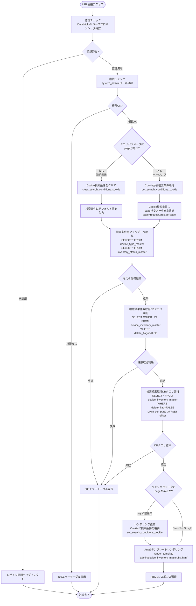
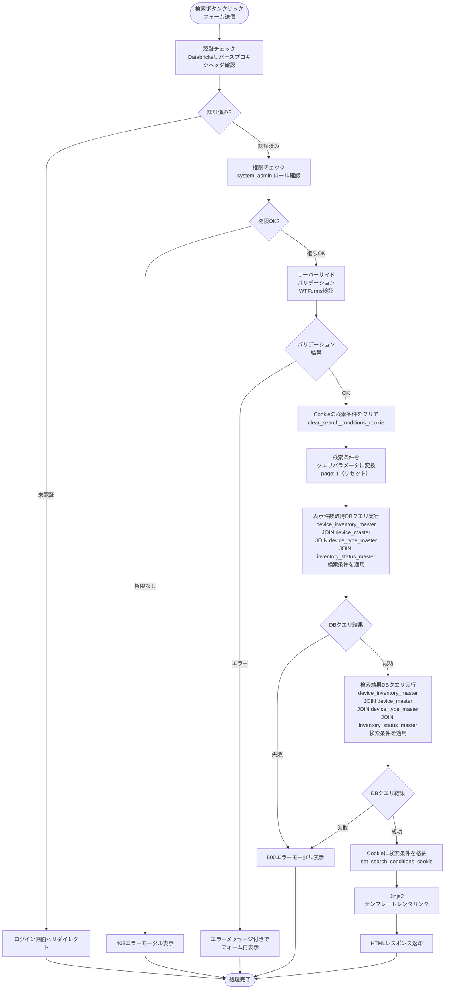
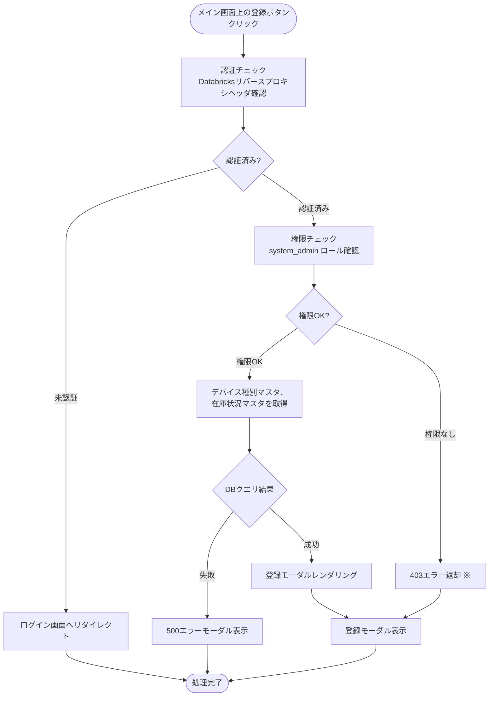
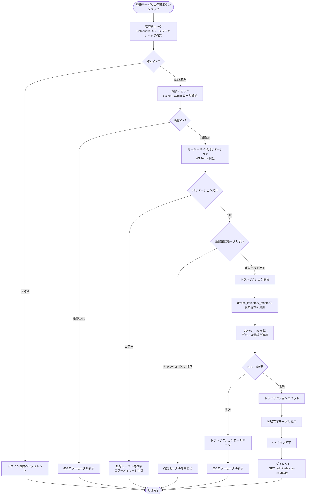
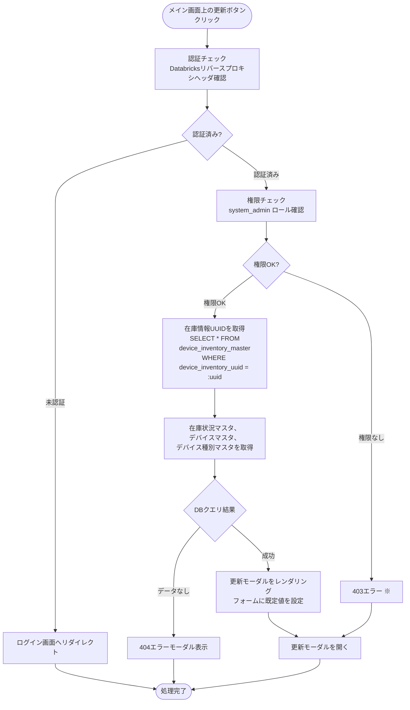
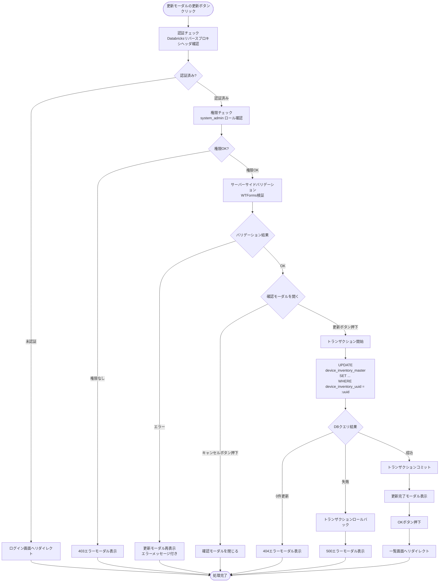
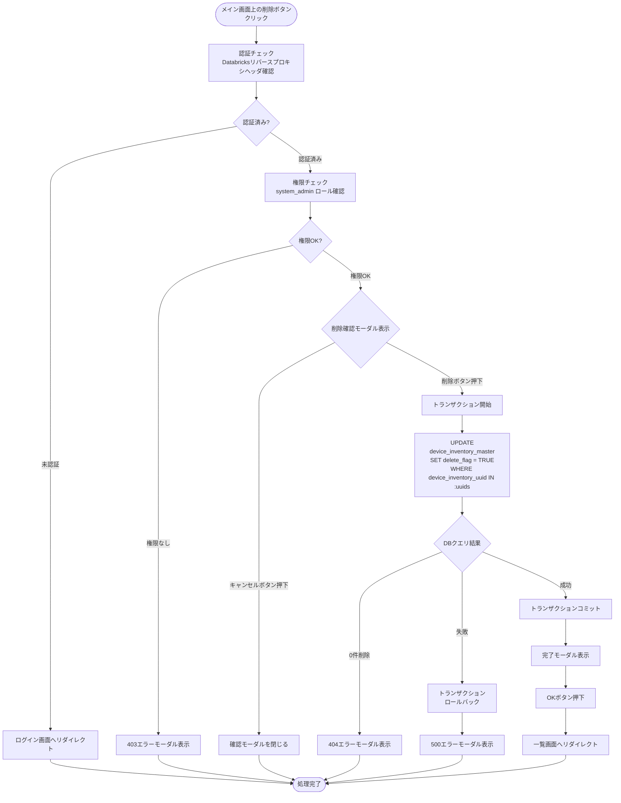
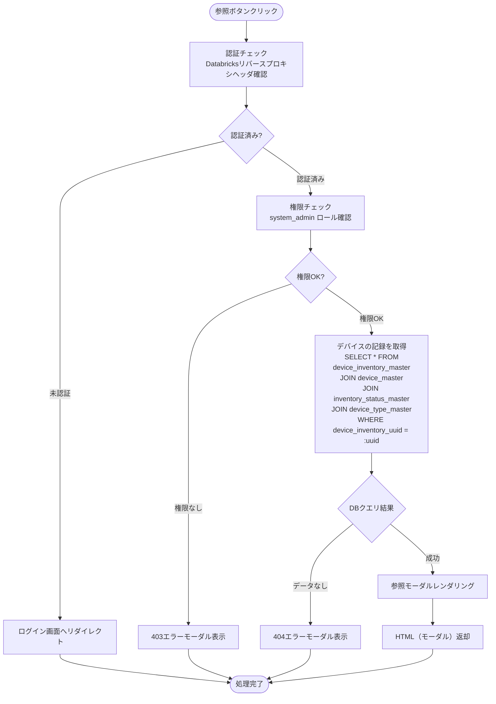

# デバイス台帳管理 - ワークフロー仕様書

## 📑 目次

- [概要](#概要)
- [使用するFlaskルート一覧](#使用するflaskルート一覧)
- [ルート呼び出しマッピング](#ルート呼び出しマッピング)
- [ワークフロー一覧](#ワークフロー一覧)
  - [初期表示](#初期表示)
  - [検索・絞り込み](#検索絞り込み)
  - [ソート](#ソート)
  - [ページング](#ページング)
  - [デバイス台帳登録](#デバイス台帳登録)
  - [デバイス台帳更新](#デバイス台帳更新)
  - [デバイス台帳削除](#デバイス台帳削除)
  - [デバイス台帳参照](#デバイス台帳参照)
  - [CSVエクスポート](#csvエクスポート)
- [使用データベース詳細](#使用データベース詳細)
- [トランザクション管理](#トランザクション管理)
- [セキュリティ実装](#セキュリティ実装)
- [関連ドキュメント](#関連ドキュメント)

---

## 概要

このドキュメントは、デバイス台帳管理画面のユーザー操作に対する処理フロー、バリデーション実行タイミング、データベース処理の詳細を記載します。

**このドキュメントの役割:**
- ✅ ユーザー操作のトリガー条件
- ✅ 処理フローの詳細（Flaskルート呼び出しシーケンス、フォーム送信、リダイレクト）
- ✅ バリデーション実行タイミング（いつチェックするか）
- ✅ エラーハンドリングフロー
- ✅ サーバーサイド処理詳細（SQL、変数、条件分岐、コード例）
- ✅ データベース利用詳細（トランザクション管理、テーブル操作）
- ✅ セキュリティ実装詳細（認証、入力検証、ログ出力）

**UI仕様書との役割分担:**
- **UI仕様書**: バリデーションルール定義（何をチェックするか）、UI要素の詳細仕様
- **ワークフロー仕様書**: バリデーション実行タイミング（いつどのようにチェックするか）、処理フロー、サーバーサイド実装詳細

**注:** UI要素の詳細やバリデーションルールは [UI仕様書](./ui-specification.md) を参照してください。

---

## 使用するFlaskルート一覧

| No | ルート名 | エンドポイント | メソッド | 用途 | レスポンス形式 | 備考 |
|----|---------|---------------|---------|------|---------------|------|
| 1 | 台帳一覧表示 | `/admin/device-inventory` | GET | 一覧・検索表示 | HTML | ページング・検索対応 |
| 2 | 台帳登録画面 | `/admin/device-inventory/create` | GET | 登録モーダル表示 | HTML (partial) | AJAX対応 |
| 3 | 台帳登録実行 | `/admin/device-inventory/create` | POST | 登録処理 | リダイレクト (302) | 成功時: 一覧へ |
| 4 | 台帳詳細表示 | `/admin/device-inventory/<device_inventory_uuid>` | GET | 参照モーダル表示 | HTML (partial) | AJAX対応 |
| 5 | 台帳更新画面 | `/admin/device-inventory/<device_inventory_uuid>/edit` | GET | 更新モーダル表示 | HTML (partial) | AJAX対応 |
| 6 | 台帳更新実行 | `/admin/device-inventory/<device_inventory_uuid>/update` | POST | 更新処理 | リダイレクト (302) | 成功時: 一覧へ |
| 7 | 台帳削除実行 | `/admin/device-inventory/delete` | POST | 削除処理 | リダイレクト (302) | 論理削除、複数選択対応 |
| 8 | CSVエクスポート | `/admin/device-inventory?export=csv` | GET | CSV出力 | CSV | 検索条件適用 |

---

## ルート呼び出しマッピング

| ユーザー操作 | トリガー | 呼び出すルート | パラメータ | レスポンス | エラー時の挙動 |
|-------------|---------|---------------|-----------|-----------|---------------|
| 画面初期表示 | URL直接アクセス | `GET /admin/device-inventory` | `page=1` | HTML（一覧画面） | エラーモーダル表示 |
| 検索ボタン押下 | フォーム送信 | `GET /admin/device-inventory` | 検索条件 | HTML（検索結果） | エラーメッセージ表示 |
| 台帳登録ボタン押下 | リンククリック | `GET /admin/device-inventory/create` | なし | HTML（登録モーダル） | エラーモーダル表示 |
| 登録実行 | フォーム送信 | `POST /admin/device-inventory/create` | フォームデータ | リダイレクト → 一覧 | モーダル再表示 |
| 参照ボタン押下 | ボタンクリック | `GET /admin/device-inventory/<device_inventory_uuid>` | device_inventory_uuid | HTML（参照モーダル） | エラーモーダル表示 |
| 編集ボタン押下 | リンククリック | `GET /admin/device-inventory/<device_inventory_uuid>/edit` | device_inventory_uuid | HTML（更新モーダル） | エラーモーダル表示 |
| 更新実行 | フォーム送信 | `POST /admin/device-inventory/<device_inventory_uuid>/update` | フォームデータ | リダイレクト → 一覧 | モーダル再表示 |
| 削除ボタン押下 | フォーム送信 | `POST /admin/device-inventory/delete` | device_inventory_uuids（配列） | リダイレクト → 一覧 | エラーメッセージ表示 |
| CSVエクスポート押下 | リンククリック | `GET /admin/device-inventory?export=csv` | 検索条件 | CSVファイル | エラーメッセージ表示 |

---

## ワークフロー一覧

### 初期表示

**トリガー:** URL直接アクセス時（ユーザーが画面にアクセスしたとき）

**前提条件:**
- ユーザーがログイン済み（Databricks認証完了）
- システム保守者（`SYSTEM_ADMIN`）権限を持っている

#### 処理フロー



#### Flaskルート

| ルート | エンドポイント | 詳細 |
|-------|---------------|------|
| 台帳一覧表示 | `GET /admin/device-inventory` | クエリパラメータ: `page`, `device_name`, `device_type`, `inventory_status`, `inventory_location`, `purchase_date_from`, `purchase_date_to`, `sort_column`, `sort_order` |

#### バリデーション

**実行タイミング:** なし（初期表示のため、デフォルト値を使用）

**データスコープ制限:**
- なし（システム保守者は全デバイス台帳データにアクセス可能）

#### 処理詳細（サーバーサイド）

**① 認証・認可チェック**

```python
from flask import request, abort
from decorators.auth import get_current_user, require_role
from models.role import Role

@device_inventory_master_bp.route('/admin/device-inventory', methods=['GET'])
@require_role(Role.SYSTEM_ADMIN)
def list_device_inventory_master():
    # 認証チェック（リバースプロキシヘッダ）
    current_user = get_current_user()
```

**② クエリパラメータ取得**

```python
from common.cookie_utils import get_search_conditions_cookie

# ページングの場合（pageパラメータあり）: Cookieから検索条件を取得し、pageのみ上書き
# 初期表示の場合（pageパラメータなし）: デフォルト値を使用
if 'page' in request.args:
    # ページング時: Cookieから検索条件を取得（共通関数使用）
    conditions = get_search_conditions_cookie('device_inventory')
    device_name = conditions.get('device_name', '')
    device_type = conditions.get('device_type', 'all')
    inventory_status = conditions.get('inventory_status', 'all')
    inventory_location = conditions.get('inventory_location', '')
    purchase_date_from = conditions.get('purchase_date_from', None)
    purchase_date_to = conditions.get('purchase_date_to', None)
    page = request.args.get('page', 1, type=int)  # クエリパラメータから取得
    sort_column = conditions.get('sort_column', '')
    sort_order = conditions.get('sort_order', '')
else:
    # 初期表示時: デフォルト値を使用
    device_name = ''
    device_type = 'all'
    inventory_status = 'all'
    inventory_location = ''
    purchase_date_from = None
    purchase_date_to = None
    page = 1
    sort_column = ''
    sort_order = ''

per_page = 25  # 固定
```

**③ 検索条件用マスタデータ取得**

```python
from models import device_type_master, inventory_status_master

# デバイス種別マスタ取得
device_types = (
    device_type_master.query
    .filter(device_type_master.delete_flag == False)
    .order_by(device_type_master.device_type_name)
    .all()
)

# 在庫状況マスタ取得
inventory_statuses = (
    inventory_status_master.query
    .filter(inventory_status_master.delete_flag == False)
    .order_by(inventory_status_master.inventory_status_id)
    .all()
)
```

**④ データベースクエリ実行**

```python
from models import device_inventory_master, device_master, device_type_master, inventory_status_master

query = (
    device_inventory_master.query
    .join(device_master, device_inventory_master.device_inventory_id == device_master.device_inventory_id)
    .filter(device_master.delete_flag == False)
    .join(device_type_master, device_master.device_type_id == device_type_master.device_type_id)
    .filter(device_type_master.delete_flag == False)
    .join(inventory_status_master, device_inventory_master.inventory_status_id == inventory_status_master.inventory_status_id)
    .filter(inventory_status_master.delete_flag == False)
    .filter(device_inventory_master.delete_flag == False)
)

# データスコープ制限なし（システム保守者は全データにアクセス可能）

# ソート
if sort_column:
    # sort_orderが未選択の場合は昇順をデフォルトとする
    order_direction = sort_order if sort_order else 'asc'
    query = query.order_by(
        getattr(device_master, sort_column).asc() if order_direction == 'asc'
        else getattr(device_master, sort_column).desc()
    )
else:
    query = query.order_by(device_master.device_name.asc())

# 件数取得
total = query.count()

# ページング
offset = (page - 1) * per_page
inventories = query.limit(per_page).offset(offset).all()
```

**⑤ HTMLレンダリング**

```python
return render_template('admin/device_inventory_master/list.html',
                      inventories=inventories,
                      total=total,
                      page=page,
                      per_page=per_page,
                      sort_column=sort_column,
                      sort_order=sort_order,
                      device_name=device_name,
                      device_type=device_type,
                      inventory_status=inventory_status,
                      inventory_location=inventory_location,
                      purchase_date_from=purchase_date_from,
                      purchase_date_to=purchase_date_to,
                      device_types=device_types,
                      inventory_statuses=inventory_statuses)
```

#### エラーハンドリング

| HTTPステータス | エラー種別 | 処理内容 | 表示内容 |
|--------------|-----------|---------|---------|
| 401 | 認証エラー | ログイン画面へリダイレクト | - |
| 403 | 権限エラー | 403エラーモーダル表示 | この操作を実行する権限がありません |
| 500 | データベースエラー | 500エラーモーダル表示 | データの取得に失敗しました |

500エラー発生時のエラー通知については、共通仕様書参照。

---

### 検索・絞り込み

**トリガー:** (2.9) 検索ボタンクリック（フォーム送信）

**前提条件:**
- 検索条件が入力されている（空でも可）

#### 処理フロー



#### Flaskルート

| ルート | エンドポイント | 詳細 |
|-------|---------------|------|
| 台帳一覧表示（検索） | `GET /admin/device-inventory` | クエリパラメータ: `device_name`, `device_type`, `inventory_status`, `inventory_location`, `purchase_date_from`, `purchase_date_to`, `page`, `per_page`, `sort_column`, `sort_order`。デバイス・在庫状況名をDBから取得 |

#### バリデーション

**実行タイミング:** 検索ボタンクリック直後（サーバーサイド）

**バリデーション対象:** (2.1) デバイス名、(2.4) 在庫場所、(2.5)〜(2.6) 購入日範囲

**バリデーションルール:** [UI仕様書](./ui-specification.md) の要素詳細 (2) 検索フォーム > バリデーション を参照

**データスコープ制限:** システム保守者は全デバイス台帳にアクセス可能

#### 処理詳細（サーバーサイド）

**検索クエリ実行:**

```python
from models import device_inventory_master, device_master, device_type_master, inventory_status_master

query = (
    device_inventory_master.query
    .join(device_master, device_inventory_master.device_inventory_id == device_master.device_inventory_id)
    .filter(device_master.delete_flag == False)
    .join(device_type_master, device_master.device_type_id == device_type_master.device_type_id)
    .filter(device_type_master.delete_flag == False)
    .join(inventory_status_master, device_inventory_master.inventory_status_id == inventory_status_master.inventory_status_id)
    .filter(inventory_status_master.delete_flag == False)
    .filter(device_inventory_master.delete_flag == False)
)

# データスコープ制限なし（システム保守者は全データにアクセス可能）

# デバイス名検索（部分一致）
device_name = request.args.get('device_name', '')
if device_name:
    query = query.filter(device_master.device_name.like(f'%{device_name}%'))

# デバイス種別絞り込み
device_type = request.args.get('device_type', 'all')
if device_type and device_type != 'all':
    query = query.filter(device_master.device_type_id == device_type)

# 在庫状況絞り込み
inventory_status = request.args.get('inventory_status', 'all')
if inventory_status and inventory_status != 'all':
    query = query.filter(device_inventory_master.inventory_status_id == inventory_status)

# 在庫場所検索（部分一致）
inventory_location = request.args.get('inventory_location', '')
if inventory_location:
    query = query.filter(device_inventory_master.inventory_location.like(f'%{inventory_location}%'))

# 購入日範囲フィルタ
purchase_date_from = request.args.get('purchase_date_from')
purchase_date_to = request.args.get('purchase_date_to')
if purchase_date_from:
    query = query.filter(device_inventory_master.purchase_date >= purchase_date_from)
if purchase_date_to:
    query = query.filter(device_inventory_master.purchase_date <= purchase_date_to)

# ソート・ページング
# ...
```

---

### ソート

**トリガー:** (2.7) ソート項目、(2.8) ソート順の選択後、(2.9) 検索ボタンクリック

#### 処理フロー

ソート条件を変更して `GET /admin/device-inventory` へリダイレクト。検索条件は保持し、ページは1にリセット。

```
GET /admin/device-inventory?device_name=...&sort_column=device_id&sort_order=desc&page=1
```

---

### ページ内ソート

**トリガー:**（3）データテーブルのソート可能カラム（デバイス名、デバイス種別、SIMID、MACアドレス、在庫状況、購入日、保証期限、在庫場所）のヘッダをクリック

#### 処理詳細
データテーブルのヘッダをクリックすることで、ページ内で閉じたソートを行う。
詳細は[UI共通仕様書](../../common/ui-common-specification.md)参照のこと

---

### ページング

**トリガー:** (3.12) ページネーションのページ番号ボタンクリック

#### 処理フロー

ページ番号を変更して `GET /admin/device-inventory` へリダイレクト。検索条件とソート条件は保持。

```
GET /admin/device-inventory?device_name=...&sort_column=device_id&sort_order=asc&page=3
```

---

### デバイス台帳登録

#### 登録モーダル表示

**トリガー:** (1.4) 登録ボタンクリック

#### 処理フロー



※1　403エラー発生時、ドロップダウン、テキストボックスに具体的なデータは表示せず、空で表示する。

#### 登録実行

**トリガー:** (7.13) 登録モーダルの登録ボタンクリック

#### 処理フロー（登録実行）



#### バリデーション

**実行タイミング:** 登録ボタンクリック直後（サーバーサイド）

**バリデーション対象:** (4.1)〜(4.11) 全フォーム項目

**バリデーションルール:** [UI仕様書](./ui-specification.md) の要素詳細 (4) 登録モーダル > バリデーション を参照

#### 処理詳細（サーバーサイド）

```python
import uuid
from flask import request, redirect, url_for, flash
from models import device_inventory_master, device_master, db
from forms.device_inventory_master_form import DeviceInventoryMasterForm

@device_inventory_master_bp.route('/admin/device-inventory/create', methods=['POST'])
@require_role(Role.SYSTEM_ADMIN)
def create_device_inventory_master():
    form = DeviceInventoryMasterForm(request.form)

    if not form.validate():
        return render_template('admin/device_inventory_master/form.html', form=form)

    try:
        # トランザクション開始
        # device_inventory_master にINSERT（在庫情報）
        device_inventory = device_inventory_master(
            device_inventory_uuid=str(uuid.uuid4()),
            inventory_status_id=form.inventory_status.data,
            purchase_date=form.purchase_date.data,
            # ... 他のフィールド ...
            creator=current_user.user_id,
            modifier=current_user.user_id,
            delete_flag=False
        )
        db.session.add(device_inventory)
        db.session.flush()

        # device_master にINSERT（デバイス情報）
        device = device_master(
            device_inventory_id=device_inventory.device_inventory_id,
            device_name=form.device_name.data,
            # ... 他のフィールド ...
            creator=current_user.user_id,
            modifier=current_user.user_id,
            delete_flag=False
        )
        db.session.add(device)
        db.session.commit()

        flash('デバイス台帳を登録しました', 'success')
        return redirect(url_for('device_inventory_master.list_device_inventory_master'))

    except Exception as e:
        db.session.rollback()
        flash('デバイス台帳の登録に失敗しました', 'error')
        return render_template('admin/device_inventory_master/form.html', form=form)
```

---

### デバイス台帳更新

#### 更新モーダル表示

**トリガー:** (3.11) 更新ボタンクリック

#### 処理フロー（更新モーダル表示）



※1　403エラー発生時、ドロップダウン、テキストボックスに具体的なデータは表示せず、空で表示する。

#### 更新実行

**トリガー:** (8) 更新モーダルの更新ボタンクリック

#### 処理フロー（更新実行）



##### Flaskルート

| ルート | エンドポイント | 詳細 |
|-------|---------------|------|
| 台帳更新フォーム表示 | `GET /admin/device-inventory/<device_inventory_uuid>/edit` | 現在の設定値を含むフォームを返却。デバイス・在庫状況・デバイス種別をDBから取得 |
| 台帳更新実行 | `POST /admin/device-inventory/<device_inventory_uuid>/update` | フォームデータを受け取り、DB更新 |

**パスパラメータ**: `device_inventory_uuid` - 対象デバイス在庫のUUID

---

### デバイス台帳削除

**前提条件:**
- 1件以上のチェックボックス (3.1) が選択されている（未選択時は削除ボタンが非活性のため操作不可）

#### 削除実行

**トリガー:** (1.5) 削除ボタンクリック

#### 処理フロー（削除実行）



#### Flaskルート

| ルート | エンドポイント | 詳細 |
|-------|---------------|------|
| 台帳削除実行 | `POST /admin/device-inventory/delete` | 論理削除（delete_flag=TRUE） |

**フォームデータ**: `device_inventory_uuids` - 削除対象のデバイス在庫UUIDリスト（`request.form.getlist('device_inventory_uuids')`で取得）

---

### デバイス台帳参照

**トリガー:** (3.2) デバイス名リンククリック または (3.10) 参照ボタンクリック

#### 処理フロー



#### Flaskルート

| ルート | エンドポイント | 詳細 |
|-------|---------------|------|
| 台帳詳細表示 | `GET /admin/device-inventory/<device_inventory_uuid>` | デバイス台帳の詳細情報を返却。デバイス・在庫状況・デバイス種別名をDBから取得 |

**パスパラメータ**: `device_inventory_uuid` - 対象デバイス在庫のUUID

---

### CSVエクスポート

**トリガー:** (1.3) CSVエクスポートボタンクリック

#### 処理フロー


#### Flaskルート

| ルート | エンドポイント | 詳細 |
|-------|---------------|------|
| CSVエクスポート | `GET /admin/device-inventory?export=csv` | 検索条件を適用してCSVダウンロード。デバイス・在庫状況・デバイス種別名をDBから取得 |

#### 処理詳細（サーバーサイド）

```python
import pandas as pd
from datetime import datetime
from models import device_inventory_master, device_master, device_type_master, inventory_status_master

@device_inventory_master_bp.route('/admin/device-inventory', methods=['GET'])
@require_role(Role.SYSTEM_ADMIN)
def list_device_inventory_master():
    # ... 検索条件適用済みクエリ（各テーブルをJOIN済み、各テーブルのdelete_flag == Falseでフィルタ済み） ...

    # CSVエクスポート処理
    if request.args.get('export') == 'csv':
        data = query.all()
        df = pd.DataFrame([{
            'デバイス名': d.device.device_name,
            'デバイス種別': d.device.device_type.device_type_name,
            'モデル情報': d.device.device_model or '',
            'SIMID': d.device.sim_id or '',
            'MACアドレス': d.device.mac_address or '',
            '在庫状況': d.inventory_status.inventory_status_name,
            '購入日': d.purchase_date.strftime('%Y/%m/%d') if d.purchase_date else '',
            '出荷予定日': d.estimated_ship_date.strftime('%Y/%m/%d') if d.estimated_ship_date else '',
            '出荷日': d.ship_date.strftime('%Y/%m/%d') if d.ship_date else '',
            'メーカー保証終了日': d.manufacturer_warranty_end_date.strftime('%Y/%m/%d') if d.manufacturer_warranty_end_date else '',
            '在庫場所': d.inventory_location or ''
        } for d in data])

        csv_data = df.to_csv(index=False, encoding='utf-8-sig')

        timestamp = datetime.now().strftime('%Y%m%d_%H%M%S')
        filename = f'device_inventory_{timestamp}.csv'

        response = make_response(csv_data)
        response.headers['Content-Type'] = 'text/csv; charset=utf-8-sig'
        response.headers['Content-Disposition'] = f'attachment; filename="{filename}"'
        return response
```

---

## 使用データベース詳細

### 使用テーブル一覧

| No | テーブル名 | 論理名 | 操作種別 | ワークフロー | 目的 |
|----|-----------|--------|---------|------------|------|
| 1 | device_inventory_master | デバイス在庫情報マスタ | SELECT | 初期表示、検索、参照 | 在庫情報取得 |
| 2 | device_inventory_master | デバイス在庫情報マスタ | INSERT | 登録 | 新規在庫情報作成 |
| 3 | device_inventory_master | デバイス在庫情報マスタ | UPDATE | 更新、削除 | 在庫情報更新、論理削除 |
| 4 | device_master | デバイスマスタ | SELECT | 初期表示、検索、参照 | デバイス情報取得（結合） |
| 5 | device_master | デバイスマスタ | INSERT | 登録 | 新規デバイス情報作成 |
| 6 | device_master | デバイスマスタ | UPDATE | 更新、削除 | デバイス情報更新、論理削除 |
| 7 | device_type_master | デバイス種別マスタ | SELECT | 初期表示、検索、登録、更新 | デバイス種別選択肢取得（結合） |
| 8 | inventory_status_master | 在庫状況マスタ | SELECT | 初期表示、検索、登録、更新 | 在庫状況選択肢取得（結合） |
| 9 | users | ユーザー | SELECT | 認証 | 現在ユーザー情報取得 |

### テーブル結合関係

```
device_inventory_master (dsi)
    ├── INNER JOIN device_master (dm)
    │       ON dsi.device_inventory_id = dm.device_inventory_id
    │       └── INNER JOIN device_type_master (dtm)
    │               ON dm.device_type_id = dtm.device_type_id
    └── INNER JOIN inventory_status_master (ssm)
            ON dsi.inventory_status_id = ssm.inventory_status_id
```

---

## トランザクション管理

### 登録・更新・削除処理

**トランザクション開始:**
- ワークフロー: デバイス台帳登録、更新、削除
- 開始タイミング: バリデーション完了後、DB操作開始前
- 開始条件: フォームバリデーションが成功

**トランザクション終了（コミット）:**
- 終了タイミング: すべてのDB操作完了後
- 終了条件: INSERT/UPDATE操作が成功

**トランザクション終了（ロールバック）:**
- ロールバックタイミング: DB操作失敗時
- ロールバック対象: 該当トランザクション内のすべての変更
- ロールバック条件: IntegrityError、その他の例外発生時

---

## セキュリティ実装

### 認証・認可実装

**認証方式:**
- Databricksリバースプロキシヘッダ認証（`X-Forwarded-User`, `X-Forwarded-Email`）

**認可ロジック:**
- `system_admin` ロールのみアクセス可能
- `@require_role(Role.SYSTEM_ADMIN)` デコレーターで制御

### データスコープ制限

**実装方式:**
- なし（デバイス台帳管理はシステム保守者専用機能のため、データスコープ制限は適用しない）

**認可ロジック:** システム保守者は全デバイス台帳データにアクセス可能

### 入力検証

**検証項目:**
- device_name: 最大100文字、必須
- device_type: 必須（マスタ値のみ）
- device_model: 最大100文字、必須
- sim_id: 最大20文字
- mac_address: XX:XX:XX:XX:XX:XX形式
- inventory_status: 必須（マスタ値のみ）
- inventory_location: 最大100文字、必須
- purchase_date: 必須、日付形式
- estimated_ship_date: 購入日以降
- ship_date: 出荷予定日以降
- manufacturer_warranty_end_date: 必須、購入日以降

**セキュリティ対策:**
- SQLインジェクション対策: SQLAlchemy ORM使用
- XSS対策: Jinja2自動エスケープ
- CSRF対策: Flask-WTF CSRF保護

### ログ出力ルール

**出力する情報:**
- リクエストID
- ユーザーID（操作者）
- 操作種別（登録、更新、削除）
- 対象リソースID（device_inventory_id）
- 処理結果（成功/失敗）
- 在庫状況変更時: 変更前後の値

**出力しない情報:**
- 認証トークン
- 個人情報（デバイスID以外の詳細）→ IDのみ記録

---

## 関連ドキュメント

### 画面仕様
- [機能概要 README](./README.md) - 画面の概要、データモデル、使用するテーブル一覧
- [UI仕様書](./ui-specification.md) - UI要素の詳細、バリデーションルール定義

### アーキテクチャ設計
- [バックエンド設計](../../../../01-architecture/backend.md) - Flask/LDP設計、Blueprint構成
- [データベース設計](../../../../01-architecture/database.md) - テーブル定義

### 共通仕様
- [共通仕様書](../../common/common-specification.md) - HTTPステータスコード、エラーコード、トランザクション管理、セキュリティ等
- [UI共通仕様書](../../common/ui-common-specification.md) - すべての画面に共通するUI仕様

---

**このワークフロー仕様書は、実装前に必ずレビューを受けてください。**
