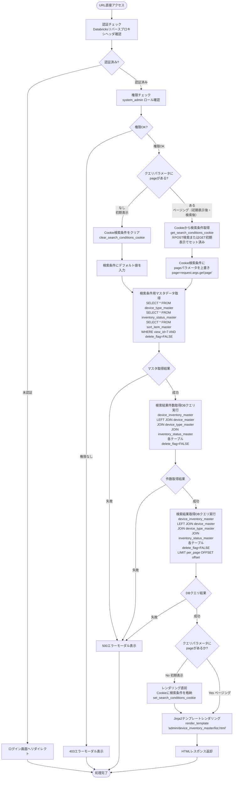
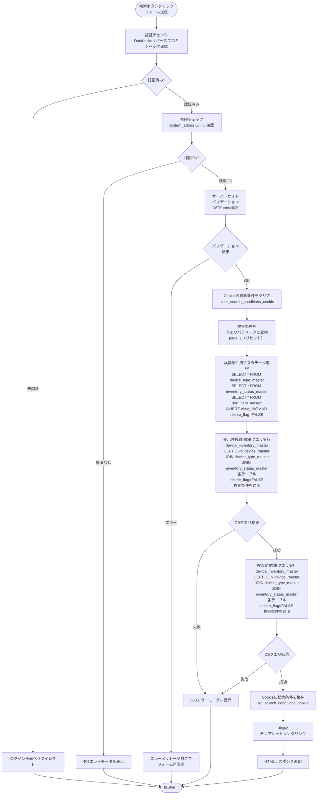
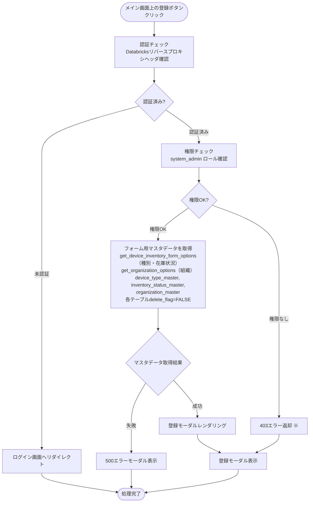
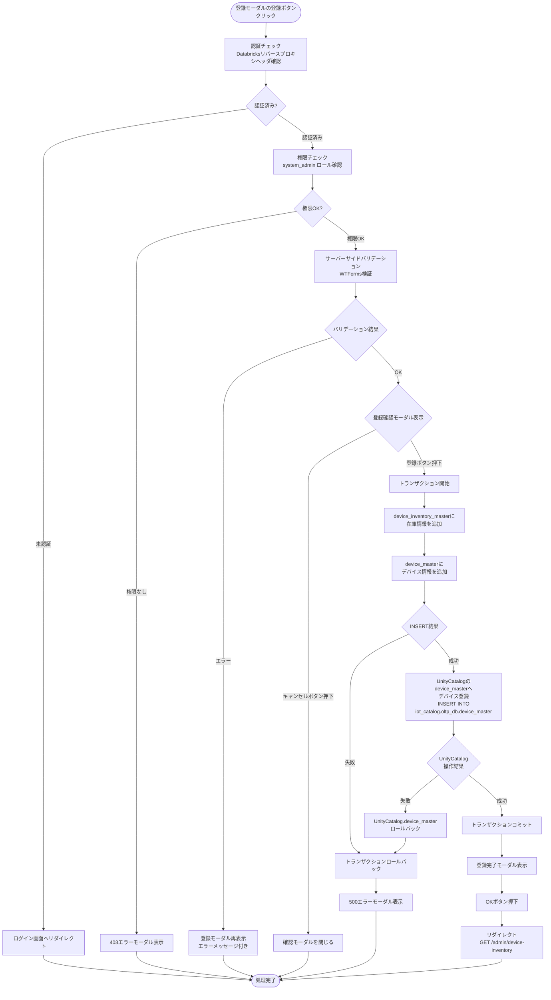
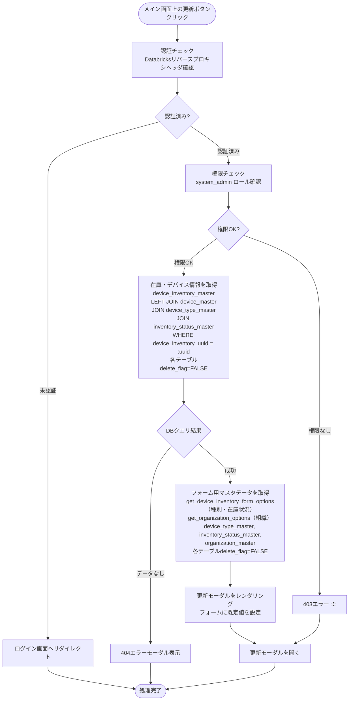
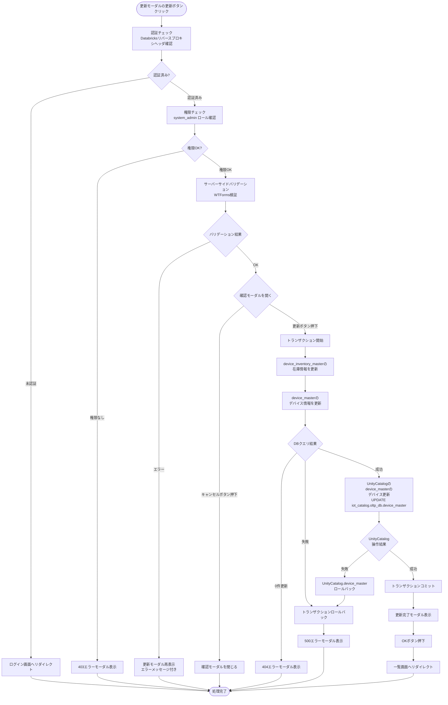
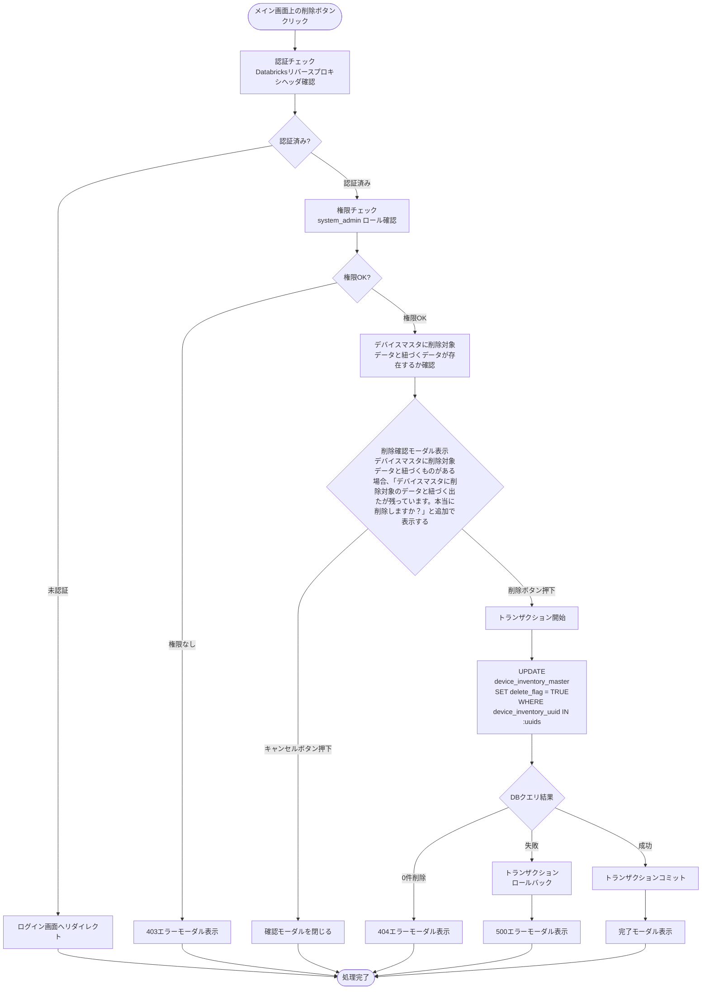
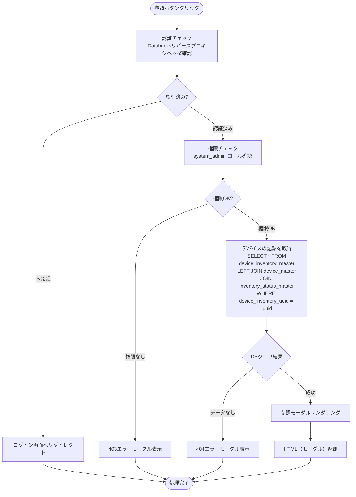
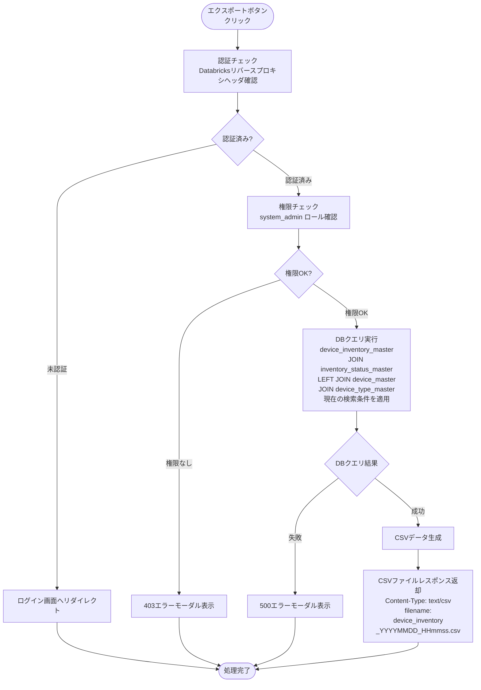

# デバイス台帳管理 - ワークフロー仕様書

> **注記**: 本仕様書では、簡単のため「デバイス在庫情報マスタ」を「台帳マスタ」と記載する。

## 📑 目次

- [概要](#概要)
- [使用するFlaskルート一覧](#使用するflaskルート一覧)
- [ルート呼び出しマッピング](#ルート呼び出しマッピング)
- [ワークフロー一覧](#ワークフロー一覧)
  - [初期表示](#初期表示)
  - [検索・絞り込み](#検索絞り込み)
  - [ソート](#ソート)
  - [ページング](#ページング)
  - [デバイス台帳登録](#デバイス台帳登録)
  - [デバイス台帳更新](#デバイス台帳更新)
  - [デバイス台帳削除](#デバイス台帳削除)
  - [デバイス台帳参照](#デバイス台帳参照)
  - [CSVエクスポート](#csvエクスポート)
- [使用データベース詳細](#使用データベース詳細)
- [トランザクション管理](#トランザクション管理)
- [セキュリティ実装](#セキュリティ実装)
- [関連ドキュメント](#関連ドキュメント)

---

## 概要

このドキュメントは、デバイス台帳管理画面のユーザー操作に対する処理フロー、バリデーション実行タイミング、データベース処理の詳細を記載します。

**このドキュメントの役割:**
- ✅ ユーザー操作のトリガー条件
- ✅ 処理フローの詳細（Flaskルート呼び出しシーケンス、フォーム送信、リダイレクト）
- ✅ バリデーション実行タイミング（いつチェックするか）
- ✅ エラーハンドリングフロー
- ✅ サーバーサイド処理詳細（SQL、変数、条件分岐、コード例）
- ✅ データベース利用詳細（トランザクション管理、テーブル操作）
- ✅ セキュリティ実装詳細（認証、入力検証、ログ出力）

**UI仕様書との役割分担:**
- **UI仕様書**: バリデーションルール定義（何をチェックするか）、UI要素の詳細仕様
- **ワークフロー仕様書**: バリデーション実行タイミング（いつどのようにチェックするか）、処理フロー、サーバーサイド実装詳細

**注:** UI要素の詳細やバリデーションルールは [UI仕様書](./ui-specification.md) を参照してください。

---

## 使用するFlaskルート一覧

| No  | ルート名             | エンドポイント                                           | メソッド | 用途             | レスポンス形式     | 備考                   |
| --- | -------------------- | -------------------------------------------------------- | -------- | ---------------- | ------------------ | ---------------------- |
| 1   | 台帳一覧表示         | `/admin/device-inventory`                                | GET      | 一覧初期表示     | HTML               | ページング対応         |
| 2   | 台帳一覧表示（検索） | `/admin/device-inventory`                                | POST     | 検索・絞り込み   | HTML               | 検索条件をCookieに保存 |
| 3   | 台帳登録画面         | `/admin/device-inventory/create`                         | GET      | 登録モーダル表示 | HTML (partial)     | AJAX対応               |
| 4   | 台帳登録実行         | `/admin/device-inventory/create`                         | POST     | 登録処理         | リダイレクト (302) | 成功時: 一覧へ         |
| 5   | 台帳詳細表示         | `/admin/device-inventory/<device_inventory_uuid>`        | GET      | 参照モーダル表示 | HTML (partial)     | AJAX対応               |
| 6   | 台帳更新画面         | `/admin/device-inventory/<device_inventory_uuid>/edit`   | GET      | 更新モーダル表示 | HTML (partial)     | AJAX対応               |
| 7   | 台帳更新実行         | `/admin/device-inventory/<device_inventory_uuid>/update` | POST     | 更新処理         | リダイレクト (302) | 成功時: 一覧へ         |
| 8   | 台帳削除実行         | `/admin/device-inventory/delete`                         | POST     | 削除処理         | リダイレクト (302) | 論理削除、複数選択対応 |
| 9   | CSVエクスポート      | `/admin/device-inventory/export`                         | POST     | CSV出力          | CSV                | 検索条件適用           |

---

## ルート呼び出しマッピング

| ユーザー操作        | トリガー                       | 呼び出すルート                                                | パラメータ                             | レスポンス           | エラー時の挙動       |
| ------------------- | ------------------------------ | ------------------------------------------------------------- | -------------------------------------- | -------------------- | -------------------- |
| 画面初期表示        | URL直接アクセス                | `GET /admin/device-inventory`                                 | `page=1`                               | HTML（一覧画面）     | エラーモーダル表示   |
| 検索ボタン押下      | フォーム送信                   | `POST /admin/device-inventory`                                | 検索条件                               | HTML（検索結果）     | エラーメッセージ表示 |
| ページング          | ページネーション操作           | `GET /admin/device-inventory`                                 | `page=N`（Cookieから検索条件引き継ぎ） | HTML（一覧画面）     | エラーモーダル表示   |
| 台帳登録ボタン押下  | リンククリック                 | `GET /admin/device-inventory/create`                          | なし                                   | HTML（登録モーダル） | エラーモーダル表示   |
| 登録実行            | フォーム送信                   | `POST /admin/device-inventory/create`                         | フォームデータ                         | リダイレクト → 一覧  | モーダル再表示       |
| 参照ボタン押下      | ボタンクリック                 | `GET /admin/device-inventory/<device_inventory_uuid>`         | device_inventory_uuid                  | HTML（参照モーダル） | エラーモーダル表示   |
| 編集ボタン押下      | リンククリック                 | `GET /admin/device-inventory/<device_inventory_uuid>/edit`    | device_inventory_uuid                  | HTML（更新モーダル） | エラーモーダル表示   |
| 更新実行            | フォーム送信                   | `POST /admin/device-inventory/<device_inventory_uuid>/update` | フォームデータ                         | リダイレクト → 一覧  | モーダル再表示       |
| 削除ボタン押下      | フォーム送信                   | `POST /admin/device-inventory/delete`                         | device_inventory_uuids（配列）         | リダイレクト → 一覧  | エラーメッセージ表示 |
| CSVエクスポート押下 | ボタンクリック（フォーム送信） | `POST /admin/device-inventory/export`                         | なし（Cookieから検索条件を取得）       | CSVファイル          | エラーメッセージ表示 |

---

## ワークフロー一覧

### 初期表示

**トリガー:** URL直接アクセス時（ユーザーが画面にアクセスしたとき）

**前提条件:**
- ユーザーがログイン済み（Databricks認証完了）
- システム保守者（`SYSTEM_ADMIN`）権限を持っている

#### 処理フロー



#### Flaskルート

| ルート       | エンドポイント                | 詳細                                                                                                                                                                                    |
| ------------ | ----------------------------- | --------------------------------------------------------------------------------------------------------------------------------------------------------------------------------------- |
| 台帳一覧表示 | `GET /admin/device-inventory` | クエリパラメータ: `page`, `device_uuid`, `device_name`, `device_type`, `inventory_status`, `inventory_location`, `purchase_date_from`, `purchase_date_to`, `sort_item_id`, `sort_order` |

#### バリデーション

**実行タイミング:** なし（初期表示のため、デフォルト値を使用）

**データスコープ制限:**
- なし（システム保守者は全デバイス台帳データにアクセス可能）

#### 処理詳細（サーバーサイド）

- `get_default_search_params()` / `search_device_inventories()` / `get_device_inventory_form_options()` は `device_inventory_service.py` に定義
- Cookie操作は `common` の `get_search_conditions_cookie` / `set_search_conditions_cookie` / `clear_search_conditions_cookie` を使用

```python
# forms/device_inventory.py

class DeviceInventorySearchForm(FlaskForm):
    device_uuid         = StringField('デバイスUUID')
    device_name         = StringField('デバイス名')
    device_type         = SelectField('デバイス種別', coerce=int)
    inventory_status    = SelectField('在庫状況', coerce=int)
    inventory_location  = StringField('在庫場所')
    purchase_date_from  = DateField('購入日（From）', validators=[Optional()])
    purchase_date_to    = DateField('購入日（To）', validators=[Optional()])
    sort_item_id        = SelectField('ソート項目', coerce=int)
    sort_order          = SelectField('ソート順', choices=[(-1, ''), (1, '昇順'), (2, '降順')], coerce=int)
```

```python
# services/device_inventory_service.py

DEVICE_INVENTORY_VIEW_ID = 7
PER_PAGE = 25

_DEVICE_MASTER_SORT_COLUMNS = {'device_uuid', 'device_name', 'device_type_id', 'sim_id', 'mac_address'}


def get_default_search_params() -> dict:
    """デバイス台帳一覧検索のデフォルトパラメータを返す"""
    return {
        'page': 1,
        'per_page': PER_PAGE,
        'device_uuid': '',
        'device_name': '',
        'device_type': -1,
        'inventory_status': -1,
        'inventory_location': '',
        'purchase_date_from': None,
        'purchase_date_to': None,
        'sort_item_id': -1,
        'sort_order': -1,
    }


def get_device_inventory_form_options() -> tuple[list, list, list]:
    """検索・登録・更新フォーム用マスタデータを取得する

    Returns:
        (device_types, inventory_statuses, sort_items)
    """
    device_types = DeviceTypeMaster.query.filter_by(delete_flag=False).all()
    inventory_statuses = InventoryStatusMaster.query.filter_by(delete_flag=False).all()
    sort_items = SortItemMaster.query.filter(
        SortItemMaster.view_id == DEVICE_INVENTORY_VIEW_ID,
        SortItemMaster.delete_flag == False,
    ).order_by(SortItemMaster.sort_order).all()
    return device_types, inventory_statuses, sort_items


def get_organization_options() -> list:
    """登録・更新フォーム用組織選択肢を取得する（get_device_inventory_form_optionsとは別関数）

    Returns:
        organizations: 組織マスタのリスト
    """
    return OrganizationMaster.query.filter_by(delete_flag=False).order_by(
        OrganizationMaster.organization_name
    ).all()


def search_device_inventories(search_params: dict) -> tuple[list, int]:
    """デバイス台帳一覧を検索する

    Args:
        search_params: 検索条件（page, per_page, sort_item_id, sort_order, 各検索項目）
                       データスコープ制限なし（システム保守者は全データにアクセス可能）

    Returns:
        (inventories, total): 台帳リストと総件数のタプル
    """
    page         = search_params['page']
    per_page     = search_params['per_page']
    sort_item_id = search_params['sort_item_id']
    sort_order   = search_params['sort_order']
    offset       = (page - 1) * per_page

    query = (
        DeviceInventoryMaster.query
        .outerjoin(DeviceMaster, DeviceInventoryMaster.device_inventory_id == DeviceMaster.device_inventory_id)
        .filter(or_(DeviceMaster.delete_flag == False, DeviceMaster.device_id.is_(None)))
        .join(DeviceTypeMaster, DeviceMaster.device_type_id == DeviceTypeMaster.device_type_id)
        .filter(DeviceTypeMaster.delete_flag == False)
        .join(InventoryStatusMaster, DeviceInventoryMaster.inventory_status_id == InventoryStatusMaster.inventory_status_id)
        .filter(InventoryStatusMaster.delete_flag == False)
        .filter(DeviceInventoryMaster.delete_flag == False)
    )

    if search_params.get('device_uuid'):
        query = query.filter(DeviceMaster.device_uuid.like(f"%{search_params['device_uuid']}%"))
    if search_params.get('device_name'):
        query = query.filter(DeviceMaster.device_name.like(f"%{search_params['device_name']}%"))
    if search_params.get('device_type') and search_params['device_type'] != -1:
        query = query.filter(DeviceMaster.device_type_id == search_params['device_type'])
    if search_params.get('inventory_status') and search_params['inventory_status'] != -1:
        query = query.filter(DeviceInventoryMaster.inventory_status_id == search_params['inventory_status'])
    if search_params.get('inventory_location'):
        query = query.filter(DeviceInventoryMaster.inventory_location.like(f"%{search_params['inventory_location']}%"))
    if search_params.get('purchase_date_from'):
        query = query.filter(DeviceInventoryMaster.purchase_date >= search_params['purchase_date_from'])
    if search_params.get('purchase_date_to'):
        query = query.filter(DeviceInventoryMaster.purchase_date <= search_params['purchase_date_to'])

    # ソート項目IDをカラム名にマッピング（sort_item_master テーブルで検証）
    # sort_item_id=-1 または sort_order=-1（未選択）の場合はデフォルトソート: device_inventory_id DESC
    if sort_item_id != -1 and sort_order != -1:
        sort_item = SortItemMaster.query.filter_by(
            view_id=DEVICE_INVENTORY_VIEW_ID, sort_item_id=sort_item_id, delete_flag=False
        ).first()
        if sort_item:
            sort_column     = sort_item.sort_item_name
            order_direction = 'asc' if sort_order == 1 else 'desc'  # 1: 昇順, 2: 降順
            sort_model      = DeviceMaster if sort_column in _DEVICE_MASTER_SORT_COLUMNS else DeviceInventoryMaster
            sort_attr       = getattr(sort_model, sort_column)
            query = query.order_by(
                sort_attr.desc() if order_direction == 'desc' else sort_attr.asc(),
                DeviceInventoryMaster.device_inventory_id.asc(),  # セカンダリソートキー（ページング時の並び順を一定に保つ）
            )
        else:
            query = query.order_by(DeviceInventoryMaster.device_inventory_id.desc())
    else:
        query = query.order_by(DeviceInventoryMaster.device_inventory_id.desc())

    total       = query.count()

    if per_page == -1:
        inventories = query.all()
    else:
        inventories = query.limit(per_page).offset(offset).all()
    
    return inventories, total
```

```python
# views/admin/device_inventory.py

@device_inventory_bp.route('/admin/device-inventory', methods=['GET'])
@require_role('system_admin')
def list_device_inventory():
    """初期表示・ページング（統合）"""

    if 'page' not in request.args:
        # 初期表示: デフォルト検索条件
        search_params = get_default_search_params()  # → device_inventory_service
        save_cookie = True
    else:
        # ページング: Cookie から検索条件取得 → page 上書き
        # CookieはPOST検索（search_device_inventory）またはGET初期表示（list_device_inventory）でセットされる
        # Cookieが存在しない場合（直接URLアクセス等）はデフォルト値にフォールバック
        search_params = get_search_conditions_cookie('device_inventory') or get_default_search_params()
        search_params['page'] = request.args.get('page', 1, type=int)
        save_cookie = False

    try:
        inventories, total = search_device_inventories(search_params)  # → device_inventory_service
        device_types, inventory_statuses, sort_items = get_device_inventory_form_options()  # → device_inventory_service
    except Exception:
        abort(500)

    response = make_response(render_template(
        'admin/device_inventory/list.html',
        inventories=inventories,
        total=total,
        search_params=search_params,
        device_types=device_types,
        inventory_statuses=inventory_statuses,
        sort_items=sort_items,
    ))
    if save_cookie:
        response = clear_search_conditions_cookie(response, 'device_inventory')
        response = set_search_conditions_cookie(response, 'device_inventory', search_params)
    return response
```

#### エラーハンドリング

エラーハンドリングは [共通仕様書 §4 エラーハンドリング](../../common/common-specification.md#4-エラーハンドリング) に従う。

500エラー時の表示内容: データの取得に失敗しました

---

### 検索・絞り込み

**トリガー:** (2.10) 検索ボタンクリック（フォーム送信）

**前提条件:**
- 検索条件が入力されている（空でも可）

#### 処理フロー



#### Flaskルート

| ルート               | エンドポイント                 | 詳細                                                                                                                                                                                                                                          |
| -------------------- | ------------------------------ | --------------------------------------------------------------------------------------------------------------------------------------------------------------------------------------------------------------------------------------------- |
| 台帳一覧表示（検索） | `POST /admin/device-inventory` | フォームデータ: `device_uuid`, `device_name`, `device_type`, `inventory_status`, `inventory_location`, `purchase_date_from`, `purchase_date_to`, `page`, `per_page`, `sort_item_id`, `sort_order`。デバイス・在庫状況・ソート項目をDBから取得 |

#### バリデーション

**実行タイミング:** 検索ボタンクリック直後（サーバーサイド）

**バリデーション対象:** (2.1) デバイスUUID、(2.2) デバイス名、(2.5) 在庫場所、(2.6)〜(2.7) 購入日範囲

**バリデーションルール:** [UI仕様書](./ui-specification.md) の要素詳細 (2) 検索フォーム > バリデーション を参照

**データスコープ制限:** システム保守者は全デバイス台帳にアクセス可能

#### 処理詳細（サーバーサイド）

- `DeviceInventorySearchForm` は `forms/device_inventory.py` に定義（初期表示の処理詳細を参照）
- `search_device_inventories()` / `get_device_inventory_form_options()` は初期表示と共用（`device_inventory_service.py`）
- Cookie操作は共通関数を使用

```python
# views/admin/device_inventory.py

@device_inventory_bp.route('/admin/device-inventory', methods=['POST'])
@require_role('system_admin')
def search_device_inventory():
    form = DeviceInventorySearchForm(request.form)
    if not form.validate():
        abort(400)

    search_params = {
        'page': 1,
        'per_page': PER_PAGE,
        'device_uuid':        form.device_uuid.data or '',
        'device_name':        form.device_name.data or '',
        'device_type':        form.device_type.data if form.device_type.data is not None else -1,
        'inventory_status':   form.inventory_status.data if form.inventory_status.data is not None else -1,
        'inventory_location': form.inventory_location.data or '',
        'purchase_date_from': form.purchase_date_from.data,
        'purchase_date_to':   form.purchase_date_to.data,
        'sort_item_id':       form.sort_item_id.data if form.sort_item_id.data is not None else -1,
        'sort_order':         form.sort_order.data if form.sort_order.data is not None else -1,
    }

    try:
        inventories, total = search_device_inventories(search_params)  # → device_inventory_service
        device_types, inventory_statuses, sort_items = get_device_inventory_form_options()  # → device_inventory_service
    except Exception:
        abort(500)

    response = make_response(render_template(
        'admin/device_inventory/list.html',
        inventories=inventories,
        total=total,
        search_params=search_params,
        device_types=device_types,
        inventory_statuses=inventory_statuses,
        sort_items=sort_items,
    ))
    response = clear_search_conditions_cookie(response, 'device_inventory')
    response = set_search_conditions_cookie(response, 'device_inventory', search_params)
    return response
```

---

### ソート

**トリガー:** (2.8) ソート項目、(2.9) ソート順の選択後、(2.10) 検索ボタンクリック

#### 処理フロー

ソート条件を変更して `POST /admin/device-inventory` へリダイレクト。検索条件は保持し、ページは1にリセット。

**ソート項目マスタ:**
フロントエンドから送信されるソート項目IDと実際のカラム名のマッピングは、`sort_item_master` テーブルで管理します。セキュリティのため、テーブルに登録された項目IDのみを受け付けます。

**テーブル構造:** `sort_item_master`

| カラム物理名   | カラム論理名 | データ型     | NULL     | PK  | FK  | デフォルト値      | 説明                                    |
| -------------- | ------------ | ------------ | -------- | --- | --- | ----------------- | --------------------------------------- |
| view_id        | 画面ID       | INT          | NOT NULL | ○   | -   | -                 | 画面固有のID                            |
| sort_item_id   | ソート項目ID | INT          | NOT NULL | ○   | -   | -                 | ソート項目固有のID                      |
| sort_item_name | ソート項目名 | VARCHAR(100) | NOT NULL | -   | -   | -                 | ソート項目の内容（カラム名）            |
| sort_order     | 表示順序     | INT          | NOT NULL | -   | -   | -                 | ソート項目リストでの表示順              |
| delete_flag    | 削除フラグ   | BOOLEAN      | NOT NULL | -   | -   | FALSE             | 論理削除状態：TRUE　その他の場合：FALSE |
| create_date    | 作成日時     | DATETIME     | NOT NULL | -   | -   | CURRENT_TIMESTAMP | レコード作成日時                        |
| update_date    | 更新日時     | DATETIME     | NULL     | -   | -   | -                 | レコード更新日時                        |

**デバイス台帳管理画面の初期データ（view_id = 7）:**

| view_id | sort_item_id | sort_item_name                 | sort_order | delete_flag | 説明                                   |
| ------- | ------------ | ------------------------------ | ---------- | ----------- | -------------------------------------- |
| 7       | 0            | device_inventory_id            | 0          | FALSE       | デバイス在庫ID（未選択時のデフォルト） |
| 7       | 1            | device_uuid                    | 1          | FALSE       | クラウドに登録するデバイスID           |
| 7       | 2            | device_name                    | 2          | FALSE       | デバイス名                             |
| 7       | 3            | device_type_id                 | 3          | FALSE       | デバイス種別                           |
| 7       | 4            | sim_id                         | 4          | FALSE       | SIMID                                  |
| 7       | 5            | mac_address                    | 5          | FALSE       | MACアドレス                            |
| 7       | 6            | inventory_status_id            | 6          | FALSE       | 在庫状況                               |
| 7       | 7            | purchase_date                  | 7          | FALSE       | 購入日                                 |
| 7       | 8            | manufacturer_warranty_end_date | 8          | FALSE       | メーカー保証終了日                     |
| 7       | 9            | inventory_location             | 9          | FALSE       | 在庫場所                               |

**注意事項:**
- `sort_item_id=-1` または `sort_order=-1` の場合はデフォルトソート: `device_inventory_id DESC`
- 未選択時（sort_item_id=-1）はフロントエンドからサーバーへ `sort_item_id=-1` を送信する
- 昇順/降順の情報はテーブルに保持しない
- 現在のソート状態はフロントエンドで管理し、リクエストパラメータ `sort_order` の値は `1`（昇順）/ `2`（降順）/ `-1`（未選択）で送信される
- 第2ソートキーとして常に `device_inventory_id ASC` を使用し、ページング時の並び順を一定に保つ
- `device_uuid`・`device_name`・`device_type_id`・`sim_id` は `device_master`、それ以外は `device_inventory_master` のカラムを参照する

```
# デバイス名でソート（昇順） - 項目ID: 2, sort_order: 1
GET /admin/device-inventory?sort_item_id=2&sort_order=1&page=1

# 未選択（ソートなし） - 項目ID: -1, sort_order: -1
GET /admin/device-inventory?sort_item_id=-1&sort_order=-1&page=1
```

---

### ページ内ソート

**トリガー:**（3）データテーブルのソート可能カラム（デバイス名、デバイス種別、SIMID、MACアドレス、在庫状況、購入日、保証期限、在庫場所）のヘッダをクリック

#### 処理詳細
データテーブルのヘッダをクリックすることで、ページ内で閉じたソートを行う。
詳細は[UI共通仕様書](../../common/ui-common-specification.md)参照のこと

---

### ページング

**トリガー:** (3.12) ページネーションのページ番号ボタンクリック

#### 処理フロー

ページ番号をクエリパラメータ `page` に設定して `GET /admin/device-inventory` へリクエストする。検索条件・ソート条件はURLに含めず、**Cookieから取得**する。

**Cookieの設定タイミング:**

| 操作                   | ルート                         | Cookie への影響                                      |
| ---------------------- | ------------------------------ | ---------------------------------------------------- |
| 検索ボタン押下         | `POST /admin/device-inventory` | 入力した検索条件でCookieを上書き（page=1でリセット） |
| 初期表示（pageなし）   | `GET /admin/device-inventory`  | デフォルト検索条件でCookieをセット                   |
| ページング（pageあり） | `GET /admin/device-inventory`  | Cookieを更新しない（読み取りのみ）                   |

**ページングリクエストの形式:**

```
GET /admin/device-inventory?page=3
```

`list_device_inventory` は `page` クエリパラメータの有無で処理を分岐する（初期表示の処理フロー参照）：

- `page` なし → 初期表示: デフォルト検索条件を使用し、Cookieを更新する
- `page` あり → ページング: CookieからPOST検索（または前回の初期表示）の検索条件を取得し、`page` のみ上書きする。Cookieが存在しない場合はデフォルト値にフォールバック

---

### デバイス台帳登録

#### 登録モーダル表示

**トリガー:** (1.4) 登録ボタンクリック

#### 処理フロー



※1　403エラー発生時、ドロップダウン、テキストボックスに具体的なデータは表示せず、空で表示する。

#### 登録実行

**トリガー:** (7.17) 登録確認モーダルの登録ボタンクリック

#### 処理フロー（登録実行）



#### バリデーション

**実行タイミング:** 登録ボタンクリック直後（サーバーサイド）

**バリデーション対象:** (4.1)〜(4.16) 全フォーム項目

**バリデーションルール:** [UI仕様書](./ui-specification.md) の要素詳細 (4) 登録モーダル > バリデーション を参照

#### 処理詳細（サーバーサイド）

**登録処理の概要:**
ユースケース仕様書に従い、デバイス購入直後の登録時に以下を順次実行する:
1. OLTP上のdevice_inventory_master（台帳マスタ）にレコード登録
2. OLTP上のdevice_master（デバイスマスタ）にレコード登録
3. UnityCatalog上のdevice_masterにレコードを登録

**データ格納形式:**
- MACアドレス: コロン込み（XX:XX:XX:XX:XX:XX形式、17文字）でそのまま格納
  - フォーム入力値を変換せずに格納
  - device_inventory_master.mac_address および device_master.mac_address に同じ値を格納

**注意:** フロー図では、バリデーションOK後に登録確認モーダル（ADM-017）を表示し、
そこで登録ボタンが押されたらDB登録処理を実行する流れになっています。
以下の実装例では、確認モーダル表示とDB登録処理を含めた全体の流れを示しています。

```python
# forms/device_inventory.py

class DeviceInventoryCreateForm(FlaskForm):
    device_uuid                     = StringField('デバイスUUID', validators=[DataRequired(), Length(max=128)])
    device_name                     = StringField('デバイス名', validators=[DataRequired(), Length(max=100)])
    device_type_id                  = SelectField('デバイス種別', coerce=int, validators=[DataRequired()])
    device_model                    = StringField('モデル情報', validators=[DataRequired(), Length(max=100)])
    sim_id                          = StringField('SIM ID', validators=[Optional(), Length(max=20)])
    mac_address                     = StringField('MACアドレス', validators=[DataRequired(), Regexp(r'^([0-9A-Fa-f]{2}:){5}[0-9A-Fa-f]{2}$')])
    software_version                = StringField('ソフトウェアバージョン', validators=[Optional(), Length(max=100)])
    device_location                 = StringField('設置場所', validators=[Optional(), Length(max=100)])
    certificate_expiration_date     = DateField('証明書有効期限', validators=[Optional()])
    organization_id                 = SelectField('組織', validators=[DataRequired()])
    inventory_status_id             = SelectField('在庫状況', coerce=int, validators=[DataRequired()])
    purchase_date                   = DateField('購入日', validators=[DataRequired()])
    estimated_ship_date             = DateField('出荷予定日', validators=[Optional()])
    ship_date                       = DateField('出荷日', validators=[Optional()])
    manufacturer_warranty_end_date  = DateField('メーカー保証終了日', validators=[DataRequired()])
    inventory_location              = StringField('在庫場所', validators=[DataRequired(), Length(max=100)])
```

```python
# services/device_inventory_service.py

def create_device_inventory(form_data: dict, creator_id: int) -> None:
    """デバイス台帳を登録する（device_inventory_master + device_master + Unity Catalog の同時INSERT）

    Args:
        form_data:   フォームから取得した登録データ
        creator_id:  登録者のユーザーID

    Raises:
        Exception: 登録処理失敗時（ロールバック済み）
    """
    try:
        # 1. device_inventory_master にINSERT（台帳情報）
        device_inventory = DeviceInventoryMaster(
            device_inventory_uuid=str(uuid.uuid4()),  # ユニーク制約
            inventory_status_id=form_data['inventory_status_id'],
            device_model=form_data['device_model'],   # オリジナル値を保持
            mac_address=form_data['mac_address'],     # オリジナル値を保持
            purchase_date=form_data['purchase_date'],
            estimated_ship_date=form_data['estimated_ship_date'],
            ship_date=form_data['ship_date'],
            manufacturer_warranty_end_date=form_data['manufacturer_warranty_end_date'],
            inventory_location=form_data['inventory_location'],
            creator=creator_id,
            modifier=creator_id,
            delete_flag=False,
        )
        db.session.add(device_inventory)
        db.session.flush()

        # 2. device_master にINSERT（デバイス情報）
        device = DeviceMaster(
            device_uuid=form_data['device_uuid'],     # ユニーク制約
            device_name=form_data['device_name'],
            device_type_id=form_data['device_type_id'],
            device_model=form_data['device_model'],
            device_inventory_id=device_inventory.device_inventory_id,
            sim_id=form_data['sim_id'],
            mac_address=form_data['mac_address'],
            organization_id=form_data['organization_id'],
            software_version=form_data['software_version'],
            device_location=form_data['device_location'],
            certificate_expiration_date=form_data['certificate_expiration_date'],
            creator=creator_id,
            modifier=creator_id,
            delete_flag=False,
        )
        db.session.add(device)
        db.session.flush()

    except Exception:
        db.session.rollback()
        raise

    # 3. Unity Catalog の device_master に INSERT
    uc = UnityCatalogConnector()
    try:
        uc.execute_dml(
            """
            INSERT INTO iot_catalog.oltp_db.device_master
                (device_id, device_uuid, device_name, device_type_id, device_model,
                 device_inventory_id, sim_id, mac_address, organization_id,
                 software_version, device_location, certificate_expiration_date,
                 creator, modifier, delete_flag)
            VALUES
                (:device_id, :device_uuid, :device_name, :device_type_id, :device_model,
                 :device_inventory_id, :sim_id, :mac_address, :organization_id,
                 :software_version, :device_location, :certificate_expiration_date,
                 :creator, :modifier, false)
            """,
            {
                'device_id':                   device.device_id,  # flush() 後にSQLAlchemy(RETURNING/lastrowid)で確定したSEQUENCE値
                'device_uuid':                 form_data['device_uuid'],
                'device_name':                 form_data['device_name'],
                'device_type_id':              form_data['device_type_id'],
                'device_model':                form_data['device_model'],
                'device_inventory_id':         device.device_inventory_id,
                'sim_id':                      form_data['sim_id'],
                'mac_address':                 form_data['mac_address'],
                'organization_id':             form_data['organization_id'],
                'software_version':            form_data['software_version'],
                'device_location':             form_data['device_location'],
                'certificate_expiration_date': form_data['certificate_expiration_date'],
                'creator':                     creator_id,
                'modifier':                    creator_id,
            },
            operation='UC device_master INSERT',
        )
    except Exception:
        # UC INSERT 失敗 → UC を補償DELETE してから OLTP もロールバック
        # （ネットワーク断等によりUC側にデータが残存している可能性があるため）
        try:
            uc.execute_dml(
                """
                DELETE FROM iot_catalog.oltp_db.device_master
                WHERE device_id = :device_id
                """,
                {'device_id': device.device_id},
                operation='UC device_master INSERT ロールバック（補償DELETE）',
            )
        except Exception:
            pass  # UC 補償DELETEも失敗した場合は無視して OLTP ロールバックへ進む
        db.session.rollback()
        raise

    db.session.commit()
```

```python
# views/admin/device_inventory.py

@device_inventory_bp.route('/admin/device-inventory/create', methods=['GET'])
@require_role('system_admin')
def show_create_device_inventory():
    form = DeviceInventoryCreateForm()
    device_types, inventory_statuses, _ = get_device_inventory_form_options()  # → device_inventory_service
    organizations = get_organization_options()                                  # → device_inventory_service
    return render_template('admin/device_inventory/form.html',
                           mode='create', form=form,
                           device_types=device_types,
                           inventory_statuses=inventory_statuses,
                           organizations=organizations)
```

```python
# views/admin/device_inventory.py

@device_inventory_bp.route('/admin/device-inventory/create', methods=['POST'])
@require_role('system_admin')
def create_device_inventory_view():
    form = DeviceInventoryCreateForm(request.form)
    if not form.validate():
        device_types, inventory_statuses, _ = get_device_inventory_form_options()  # → device_inventory_service
        organizations = get_organization_options()                                  # → device_inventory_service
        return render_template('admin/device_inventory/form.html',
                               mode='create', form=form,
                               device_types=device_types,
                               inventory_statuses=inventory_statuses,
                               organizations=organizations), 422

    form_data = {
        'device_uuid':                    form.device_uuid.data,
        'device_name':                    form.device_name.data,
        'device_type_id':                 form.device_type_id.data,
        'device_model':                   form.device_model.data,
        'sim_id':                         form.sim_id.data,
        'mac_address':                    form.mac_address.data,
        'software_version':               form.software_version.data,
        'device_location':                form.device_location.data,
        'certificate_expiration_date':    form.certificate_expiration_date.data,
        'organization_id':                form.organization_id.data,
        'inventory_status_id':            form.inventory_status_id.data,
        'purchase_date':                  form.purchase_date.data,
        'estimated_ship_date':            form.estimated_ship_date.data,
        'ship_date':                      form.ship_date.data,
        'manufacturer_warranty_end_date': form.manufacturer_warranty_end_date.data,
        'inventory_location':             form.inventory_location.data,
    }

    try:
        create_device_inventory(form_data, g.current_user.user_id)  # → device_inventory_service
    except Exception:
        abort(500)

    flash('デバイス台帳を登録しました', 'success')
    return redirect(url_for('device_inventory.list_device_inventory'))
```

---

### デバイス台帳更新

#### 更新モーダル表示

**トリガー:** (3.11) 更新ボタンクリック

#### 処理フロー（更新モーダル表示）



※1　403エラー発生時、ドロップダウン、テキストボックスに具体的なデータは表示せず、空で表示する。

#### 更新実行

**トリガー:** (8) 更新確認モーダルの更新ボタンクリック

#### 処理フロー（更新実行）



##### Flaskルート

| ルート               | エンドポイント                                                | 詳細                                                                           |
| -------------------- | ------------------------------------------------------------- | ------------------------------------------------------------------------------ |
| 台帳更新フォーム表示 | `GET /admin/device-inventory/<device_inventory_uuid>/edit`    | 現在の設定値を含むフォームを返却。デバイス・在庫状況・デバイス種別をDBから取得 |
| 台帳更新実行         | `POST /admin/device-inventory/<device_inventory_uuid>/update` | フォームデータを受け取り、DB更新                                               |

**パスパラメータ**: `device_inventory_uuid` - 対象デバイス在庫のUUID

#### 処理詳細（サーバーサイド）

**更新処理の概要:**
ユースケース仕様書に従い、台帳マスタとデバイスマスタを順次更新する:
1. device_inventory_master（台帳マスタ）の更新（在庫状況、在庫場所、出荷予定日、出荷日、購入日、メーカー保証終了日、デバイスモデル、MACアドレス）
2. OLTPのdevice_master（デバイスマスタ）の更新（デバイス名、種別、SIMID、ソフトウェアバージョン、設置場所、組織、デバイスモデル、MACアドレス、証明書有効期限）
3. UnityCatalogのdevice_master（デバイスマスタ）の更新（デバイス名、種別、SIMID、ソフトウェアバージョン、設置場所、デバイスUUID、デバイスモデル、MACアドレス、組織、証明書有効期限）

**データ格納形式:**
- MACアドレス: コロン込み（XX:XX:XX:XX:XX:XX形式、17文字）でそのまま格納
  - フォーム入力値を変換せずに格納
  - device_inventory_master.mac_address および device_master.mac_address に同じ値を格納

**注意:** フロー図では、バリデーションOK後に更新確認モーダル（ADM-018）を表示し、
そこで更新ボタンが押されたらDB更新処理を実行する流れになっています。
以下の実装例では、確認モーダル表示とDB更新処理を含めた全体の流れを示しています。

```python
# forms/device_inventory.py

class DeviceInventoryUpdateForm(FlaskForm):
    device_uuid                     = StringField('デバイスUUID', validators=[DataRequired(), Length(max=128)])
    device_name                     = StringField('デバイス名', validators=[DataRequired(), Length(max=100)])
    device_type_id                  = SelectField('デバイス種別', coerce=int, validators=[DataRequired()])
    device_model                    = StringField('モデル情報', validators=[DataRequired(), Length(max=100)])
    sim_id                          = StringField('SIM ID', validators=[Optional(), Length(max=20)])
    mac_address                     = StringField('MACアドレス', validators=[DataRequired(), Regexp(r'^([0-9A-Fa-f]{2}:){5}[0-9A-Fa-f]{2}$')])
    software_version                = StringField('ソフトウェアバージョン', validators=[Optional(), Length(max=100)])
    device_location                 = StringField('設置場所', validators=[Optional(), Length(max=100)])
    certificate_expiration_date     = DateField('証明書有効期限', validators=[Optional()])
    organization_id                 = SelectField('組織', validators=[DataRequired()])
    inventory_status_id             = SelectField('在庫状況', coerce=int, validators=[DataRequired()])
    purchase_date                   = DateField('購入日', validators=[DataRequired()])
    estimated_ship_date             = DateField('出荷予定日', validators=[Optional()])
    ship_date                       = DateField('出荷日', validators=[Optional()])
    manufacturer_warranty_end_date  = DateField('メーカー保証終了日', validators=[DataRequired()])
    inventory_location              = StringField('在庫場所', validators=[DataRequired(), Length(max=100)])
```

```python
# services/device_inventory_service.py

def update_device_inventory(inventory_uuid: str, form_data: dict, modifier_id: int) -> None:
    """デバイス台帳を更新する（device_inventory_master + device_master + Unity Catalog の同時UPDATE）

    Args:
        inventory_uuid: 対象デバイス在庫UUID
        form_data:      フォームから取得した更新データ
        modifier_id:    更新者のユーザーID

    Raises:
        404:       対象レコードが存在しない場合
        Exception: 更新処理失敗時（ロールバック済み）
    """
    inventory = DeviceInventoryMaster.query.filter_by(
        device_inventory_uuid=inventory_uuid, delete_flag=False
    ).first_or_404()
    device = DeviceMaster.query.filter_by(
        device_inventory_id=inventory.device_inventory_id, delete_flag=False
    ).first_or_404()

    # UC ロールバック用に更新前の値を退避
    old_device_values = {
        'device_uuid':                 device.device_uuid,
        'device_name':                 device.device_name,
        'device_type_id':              device.device_type_id,
        'device_model':                device.device_model,
        'sim_id':                      device.sim_id,
        'mac_address':                 device.mac_address,
        'organization_id':             device.organization_id,
        'software_version':            device.software_version,
        'device_location':             device.device_location,
        'certificate_expiration_date': device.certificate_expiration_date,
        'modifier':                    device.modifier,
    }

    try:
        # 1. device_inventory_master の更新（台帳情報）
        inventory.device_model                   = form_data['device_model']
        inventory.mac_address                    = form_data['mac_address']
        inventory.inventory_status_id            = form_data['inventory_status_id']
        inventory.inventory_location             = form_data['inventory_location']
        inventory.purchase_date                  = form_data['purchase_date']
        inventory.manufacturer_warranty_end_date = form_data['manufacturer_warranty_end_date']
        inventory.estimated_ship_date            = form_data['estimated_ship_date']
        inventory.ship_date                      = form_data['ship_date']
        inventory.modifier                       = modifier_id

        # 2. device_master の更新（デバイス情報）
        device.device_uuid                    = form_data['device_uuid']
        device.device_name                    = form_data['device_name']
        device.device_type_id                 = form_data['device_type_id']
        device.organization_id                = form_data['organization_id']
        device.sim_id                         = form_data['sim_id']
        device.software_version               = form_data['software_version']
        device.device_location                = form_data['device_location']
        device.certificate_expiration_date    = form_data['certificate_expiration_date']
        device.device_model                   = form_data['device_model']
        device.mac_address                    = form_data['mac_address']
        device.modifier                       = modifier_id

        db.session.flush()

    except Exception:
        db.session.rollback()
        raise

    # 3. Unity Catalog の device_master を UPDATE
    uc = UnityCatalogConnector()
    try:
        uc.execute_dml(
            """
            UPDATE iot_catalog.oltp_db.device_master
            SET
                device_uuid                    = :device_uuid,
                device_name                    = :device_name,
                device_type_id                 = :device_type_id,
                device_model                   = :device_model,
                sim_id                         = :sim_id,
                mac_address                    = :mac_address,
                organization_id                = :organization_id,
                software_version               = :software_version,
                device_location                = :device_location,
                certificate_expiration_date    = :certificate_expiration_date,
                modifier                       = :modifier
            WHERE device_inventory_id = :device_inventory_id
              AND delete_flag = false
            """,
            {
                'device_uuid':                 form_data['device_uuid'],
                'device_name':                 form_data['device_name'],
                'device_type_id':              form_data['device_type_id'],
                'device_model':                form_data['device_model'],
                'sim_id':                      form_data['sim_id'],
                'mac_address':                 form_data['mac_address'],
                'organization_id':             form_data['organization_id'],
                'software_version':            form_data['software_version'],
                'device_location':             form_data['device_location'],
                'certificate_expiration_date': form_data['certificate_expiration_date'],
                'modifier':                    modifier_id,
                'device_inventory_id':         device.device_inventory_id,
            },
            operation='UC device_master UPDATE',
        )
    except Exception:
        # UC UPDATE 失敗 → UC を旧値に戻してから OLTP もロールバック
        try:
            uc.execute_dml(
                """
                UPDATE iot_catalog.oltp_db.device_master
                SET
                    device_uuid                    = :device_uuid,
                    device_name                    = :device_name,
                    device_type_id                 = :device_type_id,
                    device_model                   = :device_model,
                    sim_id                         = :sim_id,
                    mac_address                    = :mac_address,
                    organization_id                = :organization_id,
                    software_version               = :software_version,
                    device_location                = :device_location,
                    certificate_expiration_date    = :certificate_expiration_date,
                    modifier                       = :modifier
                WHERE device_inventory_id = :device_inventory_id
                """,
                {**old_device_values, 'device_inventory_id': device.device_inventory_id},
                operation='UC device_master UPDATE ロールバック',
            )
        except Exception:
            pass  # UC ロールバックも失敗した場合は無視して OLTP ロールバックへ進む
        db.session.rollback()
        raise

    db.session.commit()
```

```python
# views/admin/device_inventory.py

@device_inventory_bp.route('/admin/device-inventory/<device_inventory_uuid>/edit', methods=['GET'])
@require_role('system_admin')
def show_edit_device_inventory(device_inventory_uuid):
    inventory = DeviceInventoryMaster.query.filter_by(
        device_inventory_uuid=device_inventory_uuid, delete_flag=False
    ).first_or_404()
    device = DeviceMaster.query.filter_by(
        device_inventory_id=inventory.device_inventory_id, delete_flag=False
    ).first_or_404()
    form = DeviceInventoryUpdateForm(obj=device)
    form.inventory_status_id.data    = inventory.inventory_status_id
    form.purchase_date.data          = inventory.purchase_date
    form.estimated_ship_date.data    = inventory.estimated_ship_date
    form.ship_date.data              = inventory.ship_date
    form.manufacturer_warranty_end_date.data = inventory.manufacturer_warranty_end_date
    form.inventory_location.data     = inventory.inventory_location
    form.device_model.data           = inventory.device_model
    form.mac_address.data            = inventory.mac_address
    device_types, inventory_statuses, _ = get_device_inventory_form_options()  # → device_inventory_service
    organizations = get_organization_options()                                  # → device_inventory_service
    return render_template('admin/device_inventory/edit.html',
                           mode='edit', form=form,
                           device_inventory_uuid=device_inventory_uuid,
                           device_types=device_types,
                           inventory_statuses=inventory_statuses,
                           organizations=organizations)
```

```python
# views/admin/device_inventory.py

@device_inventory_bp.route('/admin/device-inventory/<device_inventory_uuid>/update', methods=['POST'])
@require_role('system_admin')
def update_device_inventory_view(device_inventory_uuid):
    form = DeviceInventoryUpdateForm(request.form)
    if not form.validate():
        device_types, inventory_statuses, _ = get_device_inventory_form_options()  # → device_inventory_service
        organizations = get_organization_options()                                  # → device_inventory_service
        return render_template('admin/device_inventory/edit.html',
                               mode='edit', form=form,
                               device_inventory_uuid=device_inventory_uuid,
                               device_types=device_types,
                               inventory_statuses=inventory_statuses,
                               organizations=organizations), 422

    form_data = {
        'device_uuid':                    form.device_uuid.data,
        'device_name':                    form.device_name.data,
        'device_type_id':                 form.device_type_id.data,
        'device_model':                   form.device_model.data,
        'sim_id':                         form.sim_id.data,
        'mac_address':                    form.mac_address.data,
        'software_version':               form.software_version.data,
        'device_location':                form.device_location.data,
        'certificate_expiration_date':    form.certificate_expiration_date.data,
        'organization_id':                form.organization_id.data,
        'inventory_status_id':            form.inventory_status_id.data,
        'purchase_date':                  form.purchase_date.data,
        'estimated_ship_date':            form.estimated_ship_date.data,
        'ship_date':                      form.ship_date.data,
        'manufacturer_warranty_end_date': form.manufacturer_warranty_end_date.data,
        'inventory_location':             form.inventory_location.data,
    }

    try:
        update_device_inventory(device_inventory_uuid, form_data, g.current_user.user_id)  # → device_inventory_service
    except Exception:
        abort(500)

    flash('デバイス台帳を更新しました', 'success')
    return redirect(url_for('device_inventory.list_device_inventory'))
```

---

### デバイス台帳削除

**前提条件:**
- 1件以上のチェックボックス (3.1) が選択されている（未選択時は削除ボタンが非活性のため操作不可）

#### 削除実行

**トリガー:** (1.5) 削除ボタンクリック

#### 処理フロー（削除実行）



#### Flaskルート

| ルート       | エンドポイント                        | 詳細                         |
| ------------ | ------------------------------------- | ---------------------------- |
| 台帳削除実行 | `POST /admin/device-inventory/delete` | 論理削除（delete_flag=TRUE） |

**フォームデータ**: `device_inventory_uuids` - 削除対象のデバイス在庫UUIDリスト（`request.form.getlist('device_inventory_uuids')`で取得）

#### 処理詳細（サーバーサイド）

**削除処理の概要:**
選択された複数のデバイス台帳を論理削除する:
1. OLTPのdevice_inventory_master（台帳マスタ）のdelete_flagをTRUEに更新

> 削除対象のデバイス台帳データと紐づくデバイスマスタデータの削除は本機能の対象外とする。
> デバイスマスタデータの削除はデバイス管理画面で閉じているものとする。

**注意:** フロー図では、削除ボタン押下後に削除確認モーダル（ADM-019）を表示し、
そこで削除ボタンが押されたらDB削除処理を実行する流れになっています。

```python
# services/device_inventory_service.py

def delete_device_inventories(inventory_uuids: list[str], modifier_id: int) -> None:
    """デバイス台帳を論理削除する（device_inventory_master のみ）

    Args:
        inventory_uuids: 削除対象のデバイス在庫UUIDリスト
        modifier_id:     削除者のユーザーID

    Raises:
        ValueError: 削除対象レコードが存在しない場合
        Exception:  削除処理失敗時（ロールバック済み）
    """
    inventories = DeviceInventoryMaster.query.filter(
        DeviceInventoryMaster.device_inventory_uuid.in_(inventory_uuids),
        DeviceInventoryMaster.delete_flag == False,
    ).all()

    if not inventories:
        raise ValueError('削除対象が見つかりません')

    try:
        for inventory in inventories:
            # device_inventory_master の論理削除
            inventory.delete_flag = True
            inventory.modifier    = modifier_id

        db.session.flush()

    except Exception:
        db.session.rollback()
        raise

    db.session.commit()
```

```python
# views/admin/device_inventory.py

@device_inventory_bp.route('/admin/device-inventory/delete', methods=['POST'])
@require_role('system_admin')
def delete_device_inventory_view():
    inventory_uuids = request.form.getlist('device_inventory_uuids')
    if not inventory_uuids:
        flash('削除対象が選択されていません', 'error')
        return redirect(url_for('device_inventory.list_device_inventory'))

    try:
        delete_device_inventories(inventory_uuids, g.current_user.user_id)  # → device_inventory_service
    except ValueError:
        abort(404)
    except Exception:
        abort(500)

    flash('デバイス台帳を削除しました', 'success')
    return redirect(url_for('device_inventory.list_device_inventory'))
```

---

### デバイス台帳参照

**トリガー:** (3.10) 参照ボタンクリック

#### 処理フロー



#### Flaskルート

| ルート       | エンドポイント                                        | 詳細                                                                         |
| ------------ | ----------------------------------------------------- | ---------------------------------------------------------------------------- |
| 台帳詳細表示 | `GET /admin/device-inventory/<device_inventory_uuid>` | デバイス台帳の詳細情報を返却。デバイス・在庫状況・デバイス種別名をDBから取得 |

**パスパラメータ**: `device_inventory_uuid` - 対象デバイス在庫のUUID

#### 処理詳細（サーバーサイド）

```python
# views/admin/device_inventory.py

@device_inventory_bp.route('/admin/device-inventory/<device_inventory_uuid>', methods=['GET'])
@require_role('system_admin')
def show_device_inventory(device_inventory_uuid):
    try:
        inventory = (
            DeviceInventoryMaster.query
            .outerjoin(DeviceMaster, DeviceInventoryMaster.device_inventory_id == DeviceMaster.device_inventory_id)
            .filter(or_(DeviceMaster.delete_flag == False, DeviceMaster.device_id.is_(None)))
            .join(InventoryStatusMaster, DeviceInventoryMaster.inventory_status_id == InventoryStatusMaster.inventory_status_id)
            .filter(InventoryStatusMaster.delete_flag == False)
            .filter(DeviceInventoryMaster.device_inventory_uuid == device_inventory_uuid)
            .filter(DeviceInventoryMaster.delete_flag == False)
            .first_or_404()
        )
    except Exception:
        abort(500)

    return render_template('admin/device_inventory/show.html', inventory=inventory)
```

---

### CSVエクスポート

**トリガー:** (1.3) CSVエクスポートボタンクリック

#### 処理フロー



#### Flaskルート

| ルート          | エンドポイント                        | 詳細                                                                              |
| --------------- | ------------------------------------- | --------------------------------------------------------------------------------- |
| CSVエクスポート | `POST /admin/device-inventory/export` | 検索条件を適用してCSVダウンロード。デバイス・在庫状況・デバイス種別名をDBから取得 |

#### 処理詳細（サーバーサイド）

- `search_device_inventories()` は初期表示と共用（`device_inventory_service.py`）
- CSV出力されるカラムのうち、`操作列`カラムは空文字で出力する

```python
# services/device_inventory_service.py

def export_device_inventories_csv(search_params: dict) -> str:
    """検索条件に合致するデバイス台帳データをCSV文字列で返す

    Args:
        search_params: 現在の検索条件（page/per_page は全件取得用に上書きする）

    Returns:
        CSV文字列（utf-8-sig エンコード）
    """

    inventories, _ = search_device_inventories({
        **search_params,
        'page': 1,
        'per_page': -1,
    })
    df = pd.DataFrame([{
        '操作列':            '',
        'デバイス名':         d.device.device_name,
        'デバイス種別':       d.device.device_type.device_type_name,
        'モデル情報':         d.device.device_model or '',
        'SIMID':             d.device.sim_id or '',
        'MACアドレス':        d.device.mac_address or '',
        '在庫状況':           d.inventory_status.inventory_status_name,
        '購入日':             d.purchase_date.strftime('%Y/%m/%d') if d.purchase_date else '',
        '出荷予定日':         d.estimated_ship_date.strftime('%Y/%m/%d') if d.estimated_ship_date else '',
        '出荷日':             d.ship_date.strftime('%Y/%m/%d') if d.ship_date else '',
        'メーカー保証終了日': d.manufacturer_warranty_end_date.strftime('%Y/%m/%d') if d.manufacturer_warranty_end_date else '',
        '在庫場所':           d.inventory_location or '',
    } for d in inventories])
    return df.to_csv(index=False, encoding='utf-8-sig')
```

```python
# views/admin/device_inventory.py

@device_inventory_bp.route('/admin/device-inventory/export', methods=['POST'])
@require_role('system_admin')
def export_device_inventory():
    search_params = get_search_conditions_cookie('device_inventory') or get_default_search_params()  # → device_inventory_service

    try:
        csv_data = export_device_inventories_csv(search_params)  # → device_inventory_service
    except Exception:
        abort(500)

    timestamp = datetime.now().strftime('%Y%m%d_%H%M%S')
    response = make_response(csv_data)
    response.headers['Content-Type'] = 'text/csv; charset=utf-8-sig'
    response.headers['Content-Disposition'] = f'attachment; filename="device_inventory_{timestamp}.csv"'
    return response
```

---

## 使用データベース詳細

### 使用テーブル一覧

| No  | テーブル名              | 論理名                 | 操作種別 | ワークフロー               | 目的                                              |
| --- | ----------------------- | ---------------------- | -------- | -------------------------- | ------------------------------------------------- |
| 1   | device_inventory_master | デバイス在庫情報マスタ | SELECT   | 初期表示、検索、参照       | 在庫情報取得                                      |
| 2   | device_inventory_master | デバイス在庫情報マスタ | INSERT   | 登録                       | 新規在庫情報作成                                  |
| 3   | device_inventory_master | デバイス在庫情報マスタ | UPDATE   | 更新、削除                 | 在庫情報更新、論理削除                            |
| 4   | device_master           | デバイスマスタ         | SELECT   | 初期表示、検索、参照       | デバイス情報取得（結合）                          |
| 5   | device_master           | デバイスマスタ         | INSERT   | 登録                       | 新規デバイス情報作成                              |
| 6   | device_master           | デバイスマスタ         | UPDATE   | 更新、削除                 | デバイス情報更新、論理削除                        |
| 7   | device_type_master      | デバイス種別マスタ     | SELECT   | 初期表示、検索、登録、更新 | デバイス種別選択肢取得（結合）                    |
| 8   | inventory_status_master | 在庫状況マスタ         | SELECT   | 初期表示、検索、登録、更新 | 在庫状況選択肢取得（結合）                        |
| 9   | user_master             | ユーザーマスタ         | SELECT   | 認証                       | 現在ユーザー情報取得                              |
| 10  | organization_master     | 組織マスタ             | SELECT   | 登録、更新                 | 組織選択肢取得(結合)                              |
| 11  | sort_item_master        | ソート項目マスタ       | SELECT   | 初期表示、検索、ソート     | ソート項目の検証とカラム名マッピング（view_id=7） |

### テーブル結合関係

```
device_inventory_master (dim)
    ├── LEFT JOIN device_master (dm)
    │       ON dim.device_inventory_id = dm.device_inventory_id
    │       └── INNER JOIN device_type_master (dtm)
    │               ON dm.device_type_id = dtm.device_type_id
    │       └── INNER JOIN organization_master (om)
    │               ON dm.organization_id = om.organization_id
    └── INNER JOIN inventory_status_master (ism)
            ON dim.inventory_status_id = ism.inventory_status_id
```

**注:** `organization_closure` テーブルはデータスコープ制御（ユーザーの所属組織配下への絞り込み）のために他機能で使用されるが、デバイス台帳管理はシステム保守者専用機能であり全データへのアクセスが許可されているため、本機能では結合しない。`organization_closure` は登録・更新フォームの組織選択肢取得（`get_device_inventory_form_options()`、`get_organization_options()`）においても使用しない。

---

## トランザクション管理

トランザクション管理の共通方針は [共通仕様書 §10 トランザクション管理](../../common/common-specification.md#10-トランザクション管理) に従う。

### 本機能のトランザクション対象ワークフロー

- デバイス台帳登録
- デバイス台帳更新
- デバイス台帳削除

---

## セキュリティ実装

### 認証・認可実装

認証方式の詳細は [認証仕様書](../../common/authentication-specification.md) を参照。

**認可ロジック:**
- `system_admin` ロールのみアクセス可能
- `@require_role(Role.SYSTEM_ADMIN)` デコレーターで制御

### データスコープ制限

**実装方式:**
- なし（デバイス台帳管理はシステム保守者専用機能のため、データスコープ制限は適用しない）

**認可ロジック:** システム保守者は全デバイス台帳データにアクセス可能

### 入力検証

| 項目                           | 検証ルール                                   | 備考                 |
| ------------------------------ | -------------------------------------------- | -------------------- |
| device_inventory_uuid          | UUID形式、ユニーク制約（DB側）               | 台帳マスタ、自動生成 |
| device_uuid                    | 必須、最大128文字、ユニーク制約（DB側）      | デバイスマスタ       |
| device_name                    | 必須、最大100文字                            | デバイスマスタ       |
| device_type                    | 必須（デバイス種別マスタにあるレコードのみ） | デバイスマスタ       |
| organization_id                | 必須（組織マスタにあるレコードのみ）         | デバイスマスタ       |
| sim_id                         | 最大20文字                                   | デバイスマスタ       |
| software_version               | 最大100文字                                  | デバイスマスタ       |
| device_location                | 最大100文字                                  | デバイスマスタ       |
| certificate_expiration_date    | 日付形式                                     | デバイスマスタ       |
| inventory_status_id            | 必須（在庫状況マスタにあるレコードのみ）     | 台帳マスタ           |
| device_model                   | 必須、最大100文字                            | 台帳マスタ           |
| mac_address                    | 必須、XX:XX:XX:XX:XX:XX形式                  | 台帳マスタ           |
| inventory_location             | 必須、最大100文字                            | 台帳マスタ           |
| purchase_date                  | 必須、日付形式                               | 台帳マスタ           |
| manufacturer_warranty_end_date | 必須、購入日以降                             | 台帳マスタ           |
| estimated_ship_date            | 購入日以降                                   | 台帳マスタ           |
| ship_date                      | 購入日以降                                   | 台帳マスタ           |

**ユニーク制約違反時の処理:**
- `device_inventory_uuid`、`device_uuid` のユニーク制約違反（IntegrityError）が発生した場合は、データベースエラー（500エラー）として処理する
- 登録処理でユニーク制約違反が発生した場合、トランザクションをロールバックし、500エラーモーダルを表示する

**セキュリティ対策:**

[共通仕様書 §8 セキュリティ](../../common/common-specification.md#8-セキュリティ) に従う。

**■ device_uuidバリデーション実装例:**

device_uuidは接続するクラウドサービスによりバリデーション方法が異なる。環境変数`AUTH_TYPE`に基づき、適切なバリデータを取得する。

```python
# services/device_inventory_service.py
import os
import re

def get_device_uuid_validator():
    """クラウドプロバイダーに応じたdevice_uuidバリデータを返す"""
    auth_type = os.getenv('AUTH_TYPE', 'azure')

    validators = {
        'azure': {
            'max_length': 128,
            'pattern': r'^[A-Za-z0-9\-\.%#_\*\?\,\:\']+$',
            'description': 'ASCII 7ビット英数字、(- . % # _ * ? , : \')使用可'
        },
        'aws': {
            'max_length': 128,
            'pattern': r'^[a-zA-Z0-9_-]+$',
            'description': '[a-zA-Z0-9_-]使用可'
        },
    }

    # localはazureと同じバリデーションを使用
    validators['local'] = validators['azure']

    validator = validators.get(auth_type)
    if not validator:
        raise ValueError(f"Unknown AUTH_TYPE: {auth_type}")

    return validator


def validate_device_uuid(device_uuid: str) -> tuple[bool, str]:
    """device_uuidのバリデーションを実行"""
    validator = get_device_uuid_validator()

    if len(device_uuid) > validator['max_length']:
        return False, f"device_uuidは{validator['max_length']}文字以内で入力してください"

    if not re.match(validator['pattern'], device_uuid):
        return False, f"device_uuidの形式が不正です（{validator['description']}）"

    return True, ""
```

| AUTH_TYPE | バリデーションルール                                                                                 |
| --------- | ---------------------------------------------------------------------------------------------------- |
| azure     | 最大128文字、英大文字(`A-Z`)、英小文字(`a-z`)、半角数字(`0-9`)、記号9種類(`- . % # _ * ? , :`)使用可 |
| aws       | 最大128文字、英大文字(`A-Z`)、英小文字(`a-z`)、半角数字(`0-9`)、記号2種類(`- _`)使用可               |
| local     | azureと同じバリデーションを使用                                                                      |

### ログ出力ルール

共通ログ出力方針は [共通仕様書 §11 ログ出力ポリシー](../../common/common-specification.md#11-ログ出力ポリシー) に従う。

**本機能固有の出力項目:**
- 対象リソースID（device_inventory_id）
- 在庫状況変更時: 変更前後の値

---

## 関連ドキュメント

### 画面仕様
- [機能概要 README](./README.md) - 画面の概要、データモデル、使用するテーブル一覧
- [UI仕様書](./ui-specification.md) - UI要素の詳細、バリデーションルール定義
- [ユースケース](./usecase-specification.md) - 想定ユースケース

### アーキテクチャ設計
- [バックエンド設計](../../../../01-architecture/backend.md) - Flask/LDP設計、Blueprint構成

### データベース設計
- [アプリケーションデータベース設計](../../common/app-database-specification.md) - テーブル定義
- [UnityCatalogデータベース設計](../../common/unity-catalog-database-specification.md) - テーブル定義

### 共通仕様
- [共通仕様書](../../common/common-specification.md) - HTTPステータスコード、エラーコード、トランザクション管理、セキュリティ等
- [UI共通仕様書](../../common/ui-common-specification.md) - すべての画面に共通するUI仕様

---

---

## 変更履歴

| 日付       | 版数 | 変更内容                                                                                                                                                                                                                                                                                                                                                                                                                                                                                                                                                                               | 担当者              |
| ---------- | ---- | -------------------------------------------------------------------------------------------------------------------------------------------------------------------------------------------------------------------------------------------------------------------------------------------------------------------------------------------------------------------------------------------------------------------------------------------------------------------------------------------------------------------------------------------------------------------------------------- | ------------------- |
| 2026-01-26 | 1.0  | 初版作成                                                                                                                                                                                                                                                                                                                                                                                                                                                                                                                                                                               | Yoshiharu Mukaiyama |
| 2026-04-10 | 1.1  | 処理詳細コードブロックを forms / services / views の3層に分割（users形式に統一）                                                                                                                                                                                                                                                                                                                                                                                                                                                                                                       | Kei Sugiyama        |
| 2026-04-10 | 1.2  | 検索・絞り込みルートを GET → POST に修正。CSVエクスポート views ルートを `/export` GET → `/export` POST に修正                                                                                                                                                                                                                                                                                                                                                                                                                                                                         | Kei Sugiyama        |
| 2026-04-10 | 1.3  | 登録・更新・削除の services 実装例に Unity Catalog への反映処理（INSERT/UPDATE/論理削除）とロールバック処理を追加                                                                                                                                                                                                                                                                                                                                                                                                                                                                      | Kei Sugiyama        |
| 2026-04-13 | 1.4  | ルート呼び出しマッピングにページング行追加。初期表示フロー（mermaid・viewsコード）に検索後ページング（Cookie経由）の依存関係を明記。ページングセクションにCookie設定タイミング表を追加                                                                                                                                                                                                                                                                                                                                                                                                 | Kei Sugiyama        |
| 2026-04-13 | 1.5  | `execute_dml()` メソッド追加・全DML呼び出しを `uc.execute()` → `uc.execute_dml()` に変更。UC INSERT失敗時の補償DELETE追加。UC `device_master` INSERTに `device_id`（`flush()` 後のSEQUENCE値）追加。`search_device_inventories()` に `per_page=-1` 全件取得分岐追加。ルート呼び出しマッピングCSVエクスポート行修正（URL・トリガー・パラメータ）。テーブル結合関係から `organization_closure` 削除・未使用理由注記追加。入力検証一覧に `inventory_status_id` 追加。登録モーダル表示フローmermaid修正・`GET /create` views実装例追加。更新フローmermaidノードラベル「追加」→「更新」修正 | Kei Sugiyama        |
| 2026-04-13 | 1.6  | `search_device_inventories()` にセカンダリソートキー（`device_inventory_id ASC`）追加。`get_organization_options()` 関数新設（組織選択肢の別関数化）。登録・更新モーダル表示フロー mermaid および GET/POST views 実装例に `organizations` 渡す処理を追加。`show_edit_device_inventory`（`GET /edit`）views 実装例追加。更新モーダル表示フロー `Query` ノードから `JOIN organization_master` 削除し `LoadMaster` ノード追加。「更新処理の概要」ステップ1〜3のフィールド説明を実装コードに合わせて更新。テーブル結合関係注記の関数例示に `get_organization_options()` を追加             | Kei Sugiyama        |

---

**このワークフロー仕様書は、実装前に必ずレビューを受けてください。**
