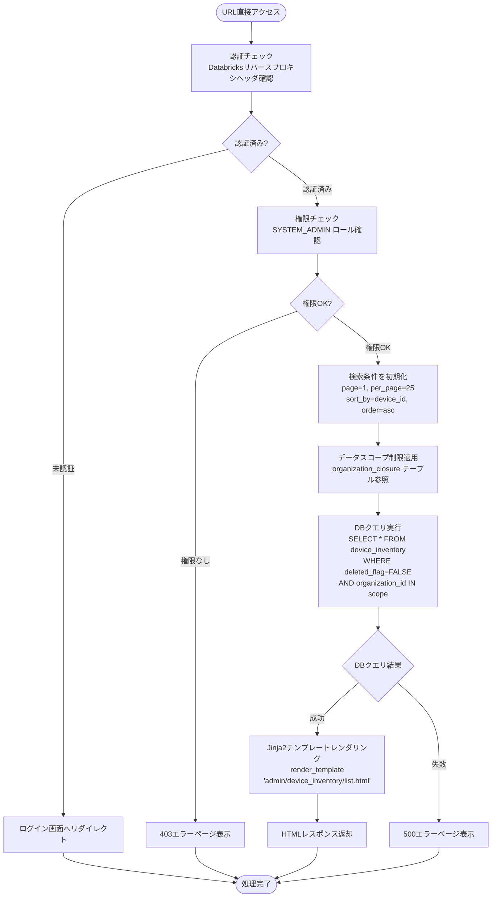
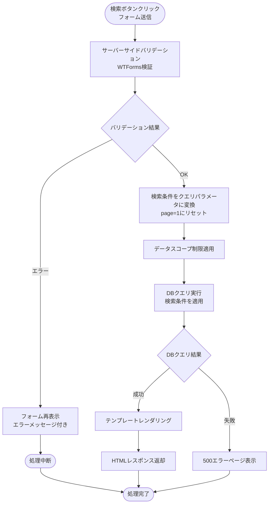
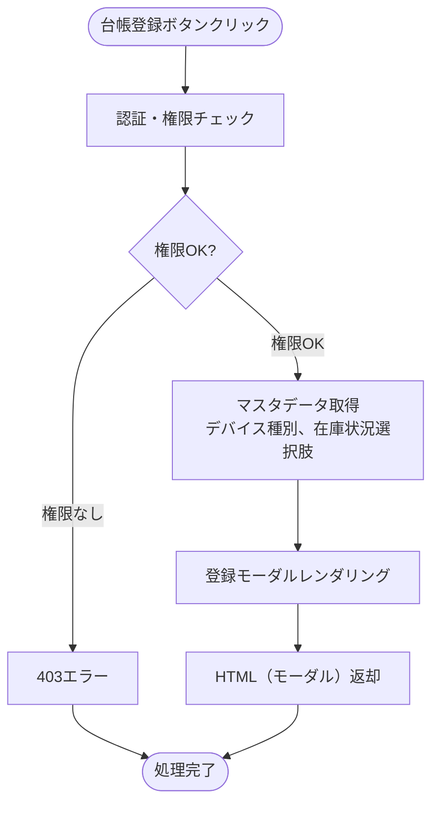
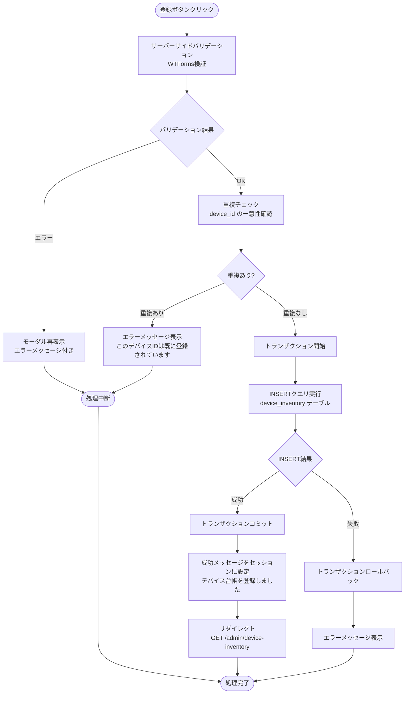
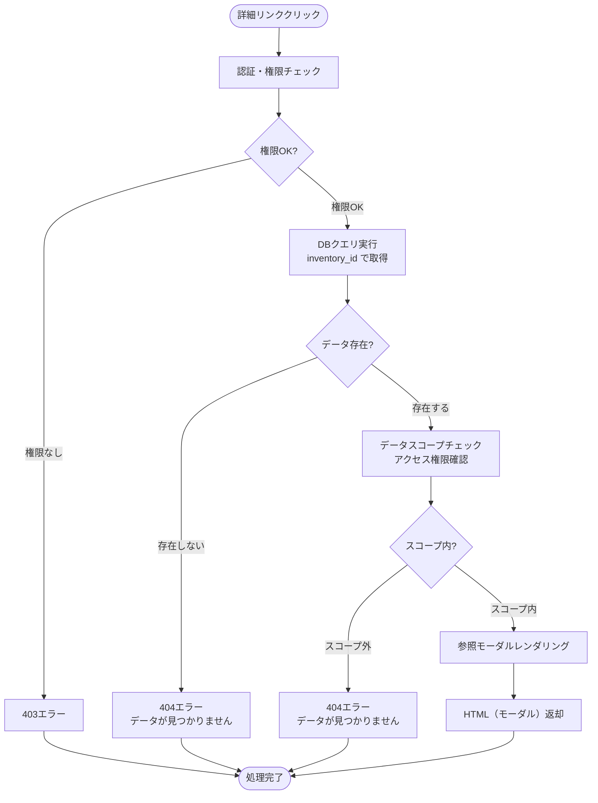
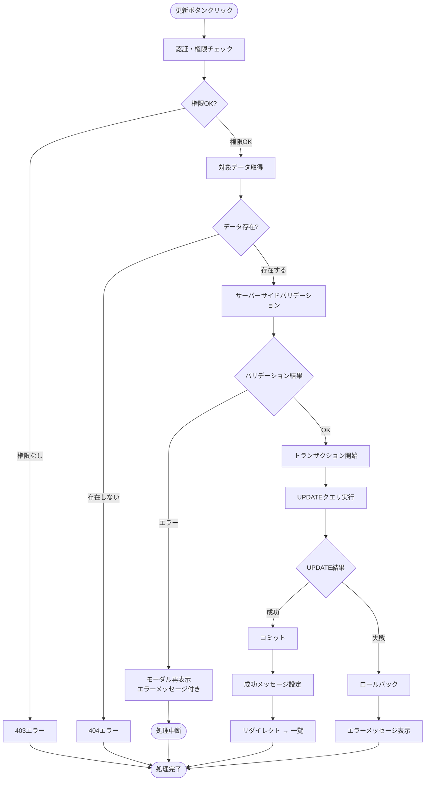
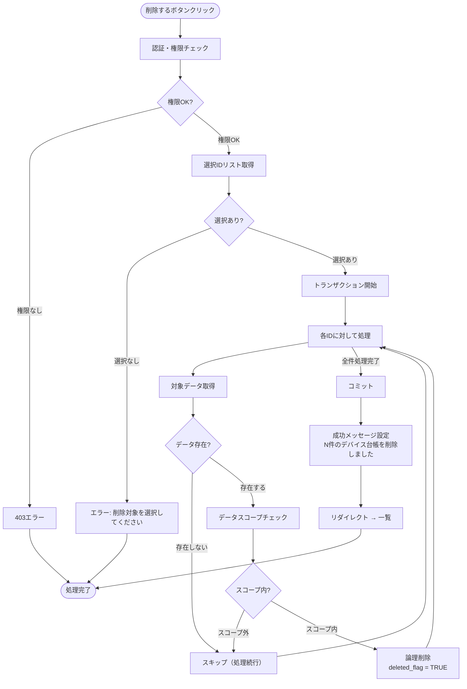
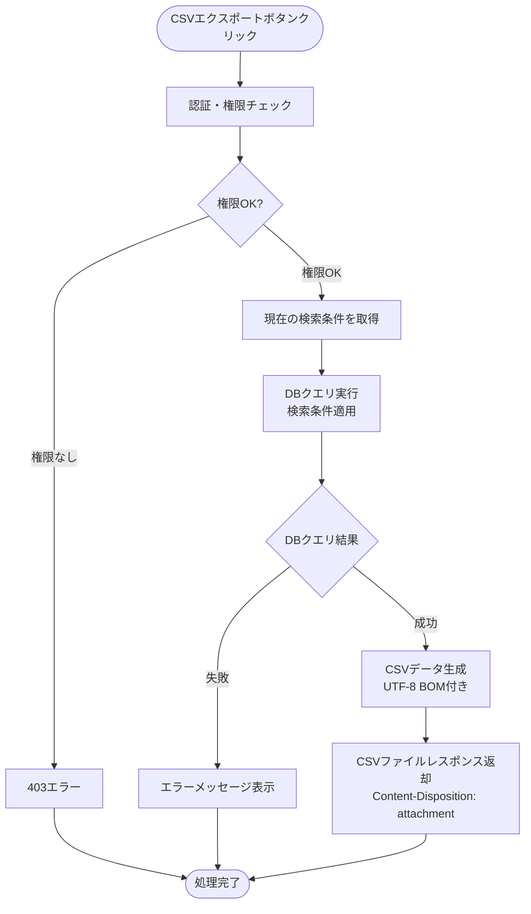

# デバイス台帳管理 - ワークフロー仕様書

## 📑 目次

- [概要](#概要)
- [使用するFlaskルート一覧](#使用するflaskルート一覧)
- [ルート呼び出しマッピング](#ルート呼び出しマッピング)
- [ワークフロー一覧](#ワークフロー一覧)
  - [初期表示](#初期表示)
  - [検索・絞り込み](#検索絞り込み)
  - [ソート](#ソート)
  - [ページング](#ページング)
  - [デバイス台帳登録](#デバイス台帳登録)
  - [デバイス台帳参照](#デバイス台帳参照)
  - [デバイス台帳更新](#デバイス台帳更新)
  - [デバイス台帳削除](#デバイス台帳削除)
  - [CSVエクスポート](#csvエクスポート)
- [使用データベース詳細](#使用データベース詳細)
- [トランザクション管理](#トランザクション管理)
- [セキュリティ実装](#セキュリティ実装)
- [関連ドキュメント](#関連ドキュメント)

---

## 概要

このドキュメントは、デバイス台帳管理画面のユーザー操作に対する処理フロー、バリデーション実行タイミング、データベース処理の詳細を記載します。

**このドキュメントの役割:**
- ✅ ユーザー操作のトリガー条件
- ✅ 処理フローの詳細（Flaskルート呼び出しシーケンス、フォーム送信、リダイレクト）
- ✅ バリデーション実行タイミング（いつチェックするか）
- ✅ エラーハンドリングフロー
- ✅ サーバーサイド処理詳細（SQL、変数、条件分岐、コード例）
- ✅ データベース利用詳細（トランザクション管理、テーブル操作）
- ✅ セキュリティ実装詳細（認証、入力検証、ログ出力）

**UI仕様書との役割分担:**
- **UI仕様書**: バリデーションルール定義（何をチェックするか）、UI要素の詳細仕様
- **ワークフロー仕様書**: バリデーション実行タイミング（いつどのようにチェックするか）、処理フロー、サーバーサイド実装詳細

**注:** UI要素の詳細やバリデーションルールは [UI仕様書](./ui-specification.md) を参照してください。

---

## 使用するFlaskルート一覧

| No | ルート名 | エンドポイント | メソッド | 用途 | レスポンス形式 | 備考 |
|----|---------|---------------|---------|------|---------------|------|
| 1 | 台帳一覧表示 | `/admin/device-inventory` | GET | 一覧・検索表示 | HTML | ページング・検索対応 |
| 2 | 台帳登録画面 | `/admin/device-inventory/create` | GET | 登録モーダル表示 | HTML (partial) | AJAX対応 |
| 3 | 台帳登録実行 | `/admin/device-inventory/create` | POST | 登録処理 | リダイレクト (302) | 成功時: 一覧へ |
| 4 | 台帳詳細表示 | `/admin/device-inventory/<inventory_id>` | GET | 参照モーダル表示 | HTML (partial) | AJAX対応 |
| 5 | 台帳更新画面 | `/admin/device-inventory/<inventory_id>/edit` | GET | 更新モーダル表示 | HTML (partial) | AJAX対応 |
| 6 | 台帳更新実行 | `/admin/device-inventory/<inventory_id>/update` | POST | 更新処理 | リダイレクト (302) | 成功時: 一覧へ |
| 7 | 台帳削除実行 | `/admin/device-inventory/delete` | POST | 削除処理 | リダイレクト (302) | 複数選択対応 |
| 8 | CSVエクスポート | `/admin/device-inventory?export=csv` | GET | CSV出力 | CSV | 検索条件適用 |

---

## ルート呼び出しマッピング

| ユーザー操作 | トリガー | 呼び出すルート | パラメータ | レスポンス | エラー時の挙動 |
|-------------|---------|---------------|-----------|-----------|---------------|
| 画面初期表示 | URL直接アクセス | `GET /admin/device-inventory` | `page=1` | HTML（一覧画面） | エラーページ表示 |
| 検索ボタン押下 | フォーム送信 | `GET /admin/device-inventory` | 検索条件 | HTML（検索結果） | エラーメッセージ表示 |
| 台帳登録ボタン押下 | リンククリック | `GET /admin/device-inventory/create` | なし | HTML（登録モーダル） | エラーページ表示 |
| 登録実行 | フォーム送信 | `POST /admin/device-inventory/create` | フォームデータ | リダイレクト → 一覧 | モーダル再表示 |
| デバイスIDクリック | リンククリック | `GET /admin/device-inventory/<id>` | inventory_id | HTML（参照モーダル） | エラーページ表示 |
| 編集ボタン押下 | リンククリック | `GET /admin/device-inventory/<id>/edit` | inventory_id | HTML（更新モーダル） | エラーページ表示 |
| 更新実行 | フォーム送信 | `POST /admin/device-inventory/<id>/update` | フォームデータ | リダイレクト → 一覧 | モーダル再表示 |
| 削除ボタン押下 | フォーム送信 | `POST /admin/device-inventory/delete` | inventory_ids[] | リダイレクト → 一覧 | エラーメッセージ表示 |
| CSVエクスポート押下 | リンククリック | `GET /admin/device-inventory?export=csv` | 検索条件 | CSVファイル | エラーメッセージ表示 |

---

## ワークフロー一覧

### 初期表示

**トリガー:** URL直接アクセス時（ユーザーが画面にアクセスしたとき）

**前提条件:**
- ユーザーがログイン済み（Databricks認証完了）
- システム保守者（`SYSTEM_ADMIN`）権限を持っている

#### 処理フロー



#### Flaskルート

| ルート | エンドポイント | 詳細 |
|-------|---------------|------|
| 台帳一覧表示 | `GET /admin/device-inventory` | クエリパラメータ: `page`, `keyword`, `device_type`, `stock_status`, `storage_location`, `purchase_date_from`, `purchase_date_to`, `sort_by`, `order` |

#### バリデーション

**実行タイミング:** なし（初期表示のため、デフォルト値を使用）

**データスコープ制限:**
- ログインユーザーの `organization_id` でデータを自動的にフィルタリング
- `organization_closure` テーブルを使用して下位組織も含む

#### 処理詳細（サーバーサイド）

**① 認証・認可チェック**

```python
from flask import request, abort
from functools import wraps

def require_role(*allowed_roles):
    def decorator(f):
        @wraps(f)
        def decorated_function(*args, **kwargs):
            user_id = request.headers.get('X-Databricks-User-Id')
            if not user_id:
                abort(401)

            user = User.query.filter_by(user_id=user_id).first()
            if not user or user.role not in [role.value for role in allowed_roles]:
                abort(403)

            return f(*args, **kwargs)
        return decorated_function
    return decorator

@device_inventory_bp.route('/admin/device-inventory')
@require_role(Role.SYSTEM_ADMIN)
def list_device_inventory():
    # 処理続行
    pass
```

**② クエリパラメータ取得**

```python
page = request.args.get('page', 1, type=int)
per_page = 25  # 固定
sort_by = request.args.get('sort_by', 'device_id')
order = request.args.get('order', 'asc')
```

**③ データベースクエリ実行**

```sql
SELECT
  di.inventory_id,
  di.device_id,
  di.device_name,
  di.device_type,
  di.sim_id,
  di.mac_address,
  di.stock_status,
  di.purchase_date,
  di.manufacturer_warranty_end,
  di.vendor_warranty_end,
  di.storage_location
FROM
  device_inventory di
WHERE
  di.deleted_flag = FALSE
  AND di.organization_id IN (
    SELECT oc.subsidiary_organization_id
    FROM organization_closure oc
    WHERE oc.parent_organization_id = :current_user_organization_id
  )
ORDER BY
  {sort_by} {order}
LIMIT :per_page OFFSET :offset
```

**④ HTMLレンダリング**

```python
return render_template('admin/device_inventory/list.html',
                      inventories=inventories,
                      total=total,
                      page=page,
                      per_page=per_page,
                      sort_by=sort_by,
                      order=order)
```

#### 表示メッセージ

| メッセージID | 表示内容 | 表示タイミング | 表示場所 |
|-------------|---------|---------------|---------|
| ERR_001 | データの取得に失敗しました | DBクエリ失敗時 | エラーページ |
| INFO_001 | デバイス台帳が見つかりませんでした | 検索結果が0件 | データテーブル内 |

#### エラーハンドリング

| HTTPステータス | エラー種別 | 処理内容 | 表示内容 |
|--------------|-----------|---------|---------|
| 401 | 認証エラー | ログイン画面へリダイレクト | - |
| 403 | 権限エラー | 403エラーページ表示 | この操作を実行する権限がありません |
| 500 | データベースエラー | 500エラーページ表示 | データの取得に失敗しました |

---

### 検索・絞り込み

**トリガー:** (2.7) 検索ボタンクリック（フォーム送信）

**前提条件:**
- 検索条件が入力されている（空でも可）

#### 処理フロー



#### バリデーション

**実行タイミング:** フォーム送信直後（サーバーサイド）

**バリデーション対象:** (2.1) キーワード、(2.5)〜(2.6) 購入日範囲

**バリデーションルール:** [UI仕様書](./ui-specification.md) の要素詳細 (2) 検索フォーム > バリデーション を参照

#### 処理詳細（サーバーサイド）

**① フォーム検証**

```python
class SearchForm(FlaskForm):
    keyword = StringField('キーワード', validators=[Length(max=100)])
    device_type = SelectField('デバイス種別', choices=[...])
    stock_status = SelectField('在庫状況', choices=[...])
    storage_location = SelectField('在庫場所', choices=[...])
    purchase_date_from = DateField('購入日（開始）', validators=[Optional()])
    purchase_date_to = DateField('購入日（終了）', validators=[Optional()])

form = SearchForm(request.args)
if not form.validate():
    return render_template('admin/device_inventory/list.html',
                          form=form,
                          inventories=[],
                          errors=form.errors)
```

**② 検索クエリ実行**

```python
query = DeviceInventory.query.filter_by(deleted_flag=False)

# データスコープ制限
query = query.filter(DeviceInventory.organization_id.in_(
    get_accessible_organization_ids(current_user.organization_id)
))

# キーワード検索
if keyword:
    query = query.filter(
        or_(
            DeviceInventory.device_id.like(f'%{keyword}%'),
            DeviceInventory.device_name.like(f'%{keyword}%')
        )
    )

# デバイス種別フィルタ
if device_type and device_type != 'all':
    query = query.filter(DeviceInventory.device_type == device_type)

# 在庫状況フィルタ
if stock_status and stock_status != 'all':
    query = query.filter(DeviceInventory.stock_status == stock_status)

# 購入日範囲フィルタ
if purchase_date_from:
    query = query.filter(DeviceInventory.purchase_date >= purchase_date_from)
if purchase_date_to:
    query = query.filter(DeviceInventory.purchase_date <= purchase_date_to)

inventories = query.order_by(...).limit(per_page).offset(offset).all()
total = query.count()
```

---

### ソート

**トリガー:** (4) データテーブルのソート可能カラムのヘッダークリック

#### 処理フロー

ソート条件を変更して `GET /admin/device-inventory` へリダイレクト。検索条件は保持し、ページは1にリセット。

```
GET /admin/device-inventory?keyword=...&sort_by=device_name&order=desc&page=1
```

---

### ページング

**トリガー:** (4.12) ページネーションのページ番号ボタンクリック

#### 処理フロー

ページ番号を変更して `GET /admin/device-inventory` へリダイレクト。検索条件とソート条件は保持。

```
GET /admin/device-inventory?keyword=...&sort_by=device_id&order=asc&page=3
```

---

### デバイス台帳登録

#### 登録モーダル表示

**トリガー:** (3.2) 台帳登録ボタンクリック

#### 処理フロー



#### 登録実行

**トリガー:** (6.14) 登録ボタンクリック

#### 処理フロー



#### バリデーション

**実行タイミング:** 登録ボタンクリック直後（サーバーサイド）

**バリデーション対象:** (6.1)〜(6.13) 全フォーム項目

**バリデーションルール:** [UI仕様書](./ui-specification.md) の要素詳細 (6) 登録モーダル > バリデーション を参照

#### 処理詳細（サーバーサイド）

```python
@device_inventory_bp.route('/admin/device-inventory/create', methods=['POST'])
@require_role(Role.SYSTEM_ADMIN)
def create_device_inventory():
    form = DeviceInventoryForm()

    if not form.validate_on_submit():
        return render_template('admin/device_inventory/form.html', form=form)

    # 重複チェック
    existing = DeviceInventory.query.filter_by(
        device_id=form.device_id.data,
        deleted_flag=False
    ).first()
    if existing:
        form.device_id.errors.append('このデバイスIDは既に登録されています')
        return render_template('admin/device_inventory/form.html', form=form)

    try:
        inventory = DeviceInventory(
            inventory_id=str(uuid.uuid4()),
            device_id=form.device_id.data,
            device_name=form.device_name.data,
            device_type=form.device_type.data,
            model_info=form.model_info.data,
            sim_id=form.sim_id.data,
            mac_address=form.mac_address.data,
            stock_status=form.stock_status.data,
            storage_location=form.storage_location.data,
            purchase_date=form.purchase_date.data,
            scheduled_ship_date=form.scheduled_ship_date.data,
            ship_date=form.ship_date.data,
            manufacturer_warranty_end=form.manufacturer_warranty_end.data,
            vendor_warranty_end=form.vendor_warranty_end.data,
            organization_id=current_user.organization_id,
            created_by=current_user.user_id,
            updated_by=current_user.user_id
        )
        db.session.add(inventory)
        db.session.commit()

        flash('デバイス台帳を登録しました', 'success')
        return redirect(url_for('device_inventory.list_device_inventory'))

    except Exception as e:
        db.session.rollback()
        logger.error(f"デバイス台帳登録失敗: {e}")
        flash('デバイス台帳の登録に失敗しました', 'error')
        return render_template('admin/device_inventory/form.html', form=form)
```

#### 表示メッセージ

| メッセージID | 表示内容 | 表示タイミング | 表示場所 |
|-------------|---------|---------------|---------|
| INV_001 | デバイス台帳を登録しました | 登録成功時 | メッセージ表示エリア（成功） |
| ERR_002 | デバイス台帳の登録に失敗しました | 登録失敗時 | モーダル内（エラー） |
| ERR_003 | このデバイスIDは既に登録されています | デバイスID重複時 | デバイスIDフィールド下 |

---

### デバイス台帳参照

**トリガー:** (4.2) デバイスIDリンククリック または (4.11) 詳細ボタンクリック

#### 処理フロー



#### 処理詳細（サーバーサイド）

```python
@device_inventory_bp.route('/admin/device-inventory/<inventory_id>')
@require_role(Role.SYSTEM_ADMIN)
def view_device_inventory(inventory_id):
    inventory = DeviceInventory.query.filter_by(
        inventory_id=inventory_id,
        deleted_flag=False
    ).first()

    if not inventory:
        abort(404)

    # データスコープチェック
    if not is_in_scope(inventory.organization_id, current_user.organization_id):
        abort(404)

    return render_template('admin/device_inventory/detail.html',
                          inventory=inventory)
```

---

### デバイス台帳更新

#### 更新モーダル表示

**トリガー:** (4.11) 編集ボタンクリック または (7) 参照モーダル内の編集ボタンクリック

#### 更新実行

**トリガー:** 更新モーダル内の更新ボタンクリック

#### 処理フロー



#### 処理詳細（サーバーサイド）

```python
@device_inventory_bp.route('/admin/device-inventory/<inventory_id>/update', methods=['POST'])
@require_role(Role.SYSTEM_ADMIN)
def update_device_inventory(inventory_id):
    inventory = DeviceInventory.query.filter_by(
        inventory_id=inventory_id,
        deleted_flag=False
    ).first()

    if not inventory:
        abort(404)

    if not is_in_scope(inventory.organization_id, current_user.organization_id):
        abort(404)

    form = DeviceInventoryForm()

    if not form.validate_on_submit():
        return render_template('admin/device_inventory/form.html',
                              form=form,
                              inventory=inventory)

    try:
        # 更新前の在庫状況をログ用に保存
        old_stock_status = inventory.stock_status

        inventory.device_name = form.device_name.data
        inventory.device_type = form.device_type.data
        inventory.model_info = form.model_info.data
        inventory.sim_id = form.sim_id.data
        inventory.mac_address = form.mac_address.data
        inventory.stock_status = form.stock_status.data
        inventory.storage_location = form.storage_location.data
        inventory.purchase_date = form.purchase_date.data
        inventory.scheduled_ship_date = form.scheduled_ship_date.data
        inventory.ship_date = form.ship_date.data
        inventory.manufacturer_warranty_end = form.manufacturer_warranty_end.data
        inventory.vendor_warranty_end = form.vendor_warranty_end.data
        inventory.updated_by = current_user.user_id
        inventory.updated_at = datetime.utcnow()

        db.session.commit()

        # 在庫状況が変更された場合、ログ出力
        if old_stock_status != inventory.stock_status:
            logger.info(f"在庫状況変更 - inventory_id: {inventory_id}, "
                       f"変更前: {old_stock_status}, 変更後: {inventory.stock_status}, "
                       f"操作者: {current_user.user_id}")

        flash('デバイス台帳を更新しました', 'success')
        return redirect(url_for('device_inventory.list_device_inventory'))

    except Exception as e:
        db.session.rollback()
        logger.error(f"デバイス台帳更新失敗: {e}")
        flash('デバイス台帳の更新に失敗しました', 'error')
        return render_template('admin/device_inventory/form.html',
                              form=form,
                              inventory=inventory)
```

#### 表示メッセージ

| メッセージID | 表示内容 | 表示タイミング | 表示場所 |
|-------------|---------|---------------|---------|
| INV_002 | デバイス台帳を更新しました | 更新成功時 | メッセージ表示エリア（成功） |
| ERR_004 | デバイス台帳の更新に失敗しました | 更新失敗時 | モーダル内（エラー） |

---

### デバイス台帳削除

**トリガー:** (3.3) 削除ボタンクリック → (8) 削除確認モーダルで「削除する」ボタンクリック

**前提条件:**
- 1件以上のチェックボックスが選択されている

#### 処理フロー



#### 処理詳細（サーバーサイド）

```python
@device_inventory_bp.route('/admin/device-inventory/delete', methods=['POST'])
@require_role(Role.SYSTEM_ADMIN)
def delete_device_inventory():
    inventory_ids = request.form.getlist('inventory_ids[]')

    if not inventory_ids:
        flash('削除対象を選択してください', 'error')
        return redirect(url_for('device_inventory.list_device_inventory'))

    try:
        deleted_count = 0
        for inventory_id in inventory_ids:
            inventory = DeviceInventory.query.filter_by(
                inventory_id=inventory_id,
                deleted_flag=False
            ).first()

            if not inventory:
                continue

            if not is_in_scope(inventory.organization_id, current_user.organization_id):
                continue

            inventory.deleted_flag = True
            inventory.updated_by = current_user.user_id
            inventory.updated_at = datetime.utcnow()
            deleted_count += 1

        db.session.commit()

        flash(f'{deleted_count}件のデバイス台帳を削除しました', 'success')
        return redirect(url_for('device_inventory.list_device_inventory'))

    except Exception as e:
        db.session.rollback()
        logger.error(f"デバイス台帳削除失敗: {e}")
        flash('デバイス台帳の削除に失敗しました', 'error')
        return redirect(url_for('device_inventory.list_device_inventory'))
```

#### 表示メッセージ

| メッセージID | 表示内容 | 表示タイミング | 表示場所 |
|-------------|---------|---------------|---------|
| INV_003 | {n}件のデバイス台帳を削除しました | 削除成功時 | メッセージ表示エリア（成功） |
| ERR_005 | デバイス台帳の削除に失敗しました | 削除失敗時 | メッセージ表示エリア（エラー） |
| ERR_006 | 削除対象を選択してください | 未選択時 | メッセージ表示エリア（エラー） |

---

### CSVエクスポート

**トリガー:** (3.1) CSVエクスポートボタンクリック

#### 処理フロー



#### 処理詳細（サーバーサイド）

```python
@device_inventory_bp.route('/admin/device-inventory')
@require_role(Role.SYSTEM_ADMIN)
def list_device_inventory():
    # CSVエクスポートリクエストの判定
    if request.args.get('export') == 'csv':
        return export_device_inventory_csv()

    # 通常の一覧表示処理
    ...

def export_device_inventory_csv():
    # 検索条件を適用してデータ取得
    inventories = get_filtered_inventories()

    # CSVデータ生成
    import csv
    from io import StringIO

    output = StringIO()
    # UTF-8 BOM
    output.write('\ufeff')

    writer = csv.writer(output)

    # ヘッダー
    writer.writerow([
        'デバイスID', 'デバイス名', 'デバイス種別', 'モデル情報',
        'SIMID', 'MACアドレス', '在庫状況', '購入日', '出荷予定日',
        '出荷日', 'メーカー保証終了日', 'ベンダー保証終了日', '在庫場所'
    ])

    # データ行
    for inv in inventories:
        writer.writerow([
            inv.device_id,
            inv.device_name,
            inv.device_type,
            inv.model_info or '',
            inv.sim_id or '',
            inv.mac_address or '',
            inv.stock_status,
            inv.purchase_date.strftime('%Y/%m/%d') if inv.purchase_date else '',
            inv.scheduled_ship_date.strftime('%Y/%m/%d') if inv.scheduled_ship_date else '',
            inv.ship_date.strftime('%Y/%m/%d') if inv.ship_date else '',
            inv.manufacturer_warranty_end.strftime('%Y/%m/%d') if inv.manufacturer_warranty_end else '',
            inv.vendor_warranty_end.strftime('%Y/%m/%d') if inv.vendor_warranty_end else '',
            inv.storage_location or ''
        ])

    # レスポンス生成
    timestamp = datetime.now().strftime('%Y%m%d_%H%M%S')
    filename = f'device_inventory_{timestamp}.csv'

    response = make_response(output.getvalue())
    response.headers['Content-Type'] = 'text/csv; charset=utf-8-sig'
    response.headers['Content-Disposition'] = f'attachment; filename="{filename}"'
    return response
```

---

## 使用データベース詳細

### 使用テーブル一覧

| No | テーブル名 | 論理名 | 操作種別 | ワークフロー | 目的 |
|----|-----------|--------|---------|------------|------|
| 1 | device_inventory | デバイス台帳 | SELECT | 初期表示、検索、参照 | 台帳情報取得 |
| 2 | device_inventory | デバイス台帳 | INSERT | 登録 | 新規台帳作成 |
| 3 | device_inventory | デバイス台帳 | UPDATE | 更新、削除 | 台帳情報更新、論理削除 |
| 4 | organization_closure | 組織階層 | SELECT | 全操作 | データスコープ制限 |
| 5 | users | ユーザー | SELECT | 認証 | 現在ユーザー情報取得 |

### インデックス最適化

**使用するインデックス:**
- device_inventory.inventory_id: PRIMARY KEY - 主キー
- device_inventory.device_id: UNIQUE INDEX - デバイスID重複チェック
- device_inventory.organization_id: INDEX - データスコープ制限
- device_inventory.stock_status: INDEX - 在庫状況検索
- device_inventory.device_type: INDEX - デバイス種別検索
- organization_closure.(parent_organization_id, subsidiary_organization_id): INDEX - 組織階層検索

---

## トランザクション管理

### 登録・更新・削除処理

**トランザクション開始:**
- ワークフロー: デバイス台帳登録、更新、削除
- 開始タイミング: バリデーション完了後、DB操作開始前
- 開始条件: フォームバリデーションが成功

**トランザクション終了（コミット）:**
- 終了タイミング: すべてのDB操作完了後
- 終了条件: INSERT/UPDATE操作が成功

**トランザクション終了（ロールバック）:**
- ロールバックタイミング: DB操作失敗時
- ロールバック対象: 該当トランザクション内のすべての変更
- ロールバック条件: IntegrityError、その他の例外発生時

---

## セキュリティ実装

### 認証・認可実装

**認証方式:**
- Databricksリバースプロキシヘッダ認証（`X-Databricks-User-Id`, `X-Databricks-Access-Token`）

**認可ロジック:**
- `SYSTEM_ADMIN` ロールのみアクセス可能
- `@require_role(Role.SYSTEM_ADMIN)` デコレーターで制御

### データスコープ制限

**実装方式:**
- `organization_closure` テーブルを使用して下位組織リストを取得
- すべてのクエリにスコープフィルタを自動適用

```python
def get_accessible_organization_ids(user_organization_id):
    """アクセス可能な組織IDリストを取得"""
    closure = db.session.query(OrganizationClosure.subsidiary_organization_id).filter(
        OrganizationClosure.parent_organization_id == user_organization_id
    ).all()
    return [c[0] for c in closure]

def is_in_scope(target_organization_id, user_organization_id):
    """対象データがユーザーのスコープ内かチェック"""
    accessible_ids = get_accessible_organization_ids(user_organization_id)
    return target_organization_id in accessible_ids
```

### 入力検証

**検証項目:**
- device_id: 半角英数字/ハイフン/アンダースコアのみ、最大50文字、重複チェック
- device_name: 最大100文字、必須
- mac_address: XX:XX:XX:XX:XX:XX形式
- SQLインジェクション対策: SQLAlchemy ORM使用
- XSS対策: Jinja2自動エスケープ
- CSRF対策: Flask-WTF CSRF保護

### ログ出力ルール

**出力する情報:**
- リクエストID
- ユーザーID（操作者）
- 操作種別（登録、更新、削除）
- 対象リソースID（inventory_id）
- 処理結果（成功/失敗）
- 在庫状況変更時: 変更前後の値

**出力しない情報:**
- 認証トークン
- 個人情報（デバイスID以外の詳細）→ IDのみ記録

---

## 関連ドキュメント

### 画面仕様
- [機能概要 README](./README.md) - 画面の概要、データモデル、使用するテーブル一覧
- [UI仕様書](./ui-specification.md) - UI要素の詳細、バリデーションルール定義

### アーキテクチャ設計
- [バックエンド設計](../../../../01-architecture/backend.md) - Flask/LDP設計、Blueprint構成
- [データベース設計](../../../../01-architecture/database.md) - テーブル定義、インデックス設計

### 共通仕様
- [共通仕様書](../../common/common-specification.md) - HTTPステータスコード、エラーコード、トランザクション管理、セキュリティ等
- [UI共通仕様書](../../common/ui-common-specification.md) - すべての画面に共通するUI仕様

---

**このワークフロー仕様書は、実装前に必ずレビューを受けてください。**
