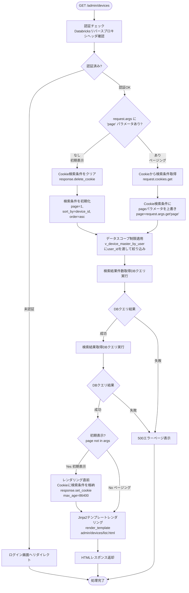
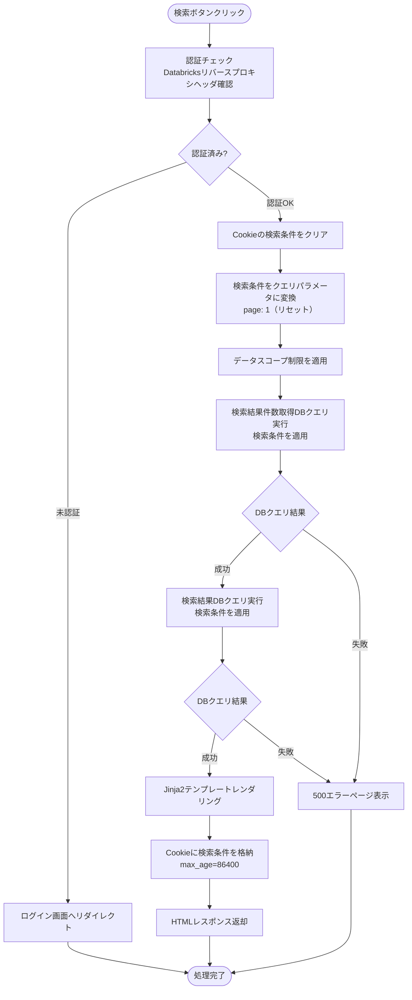
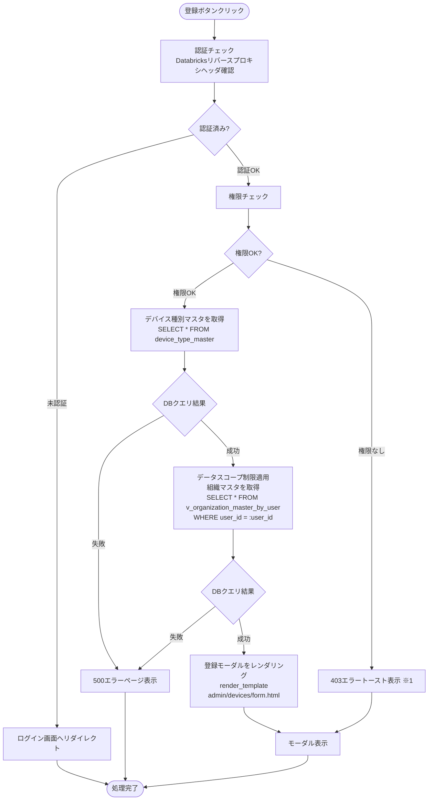
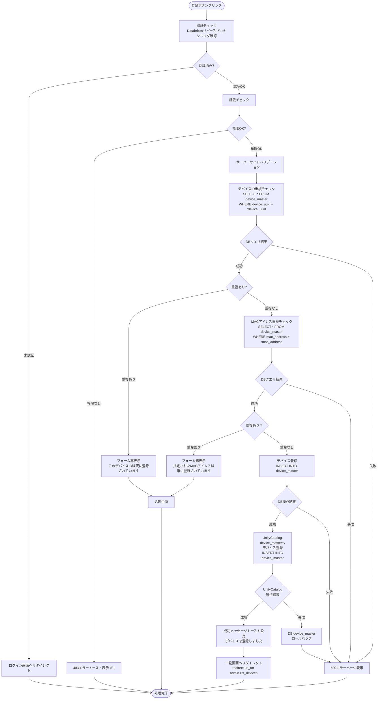
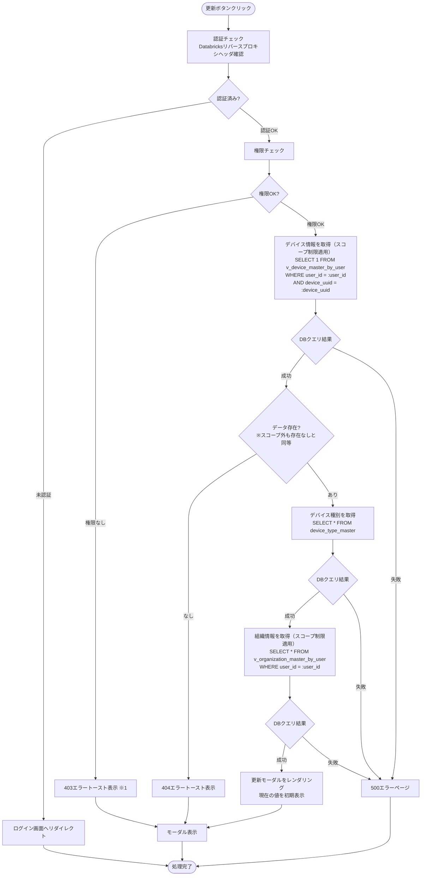
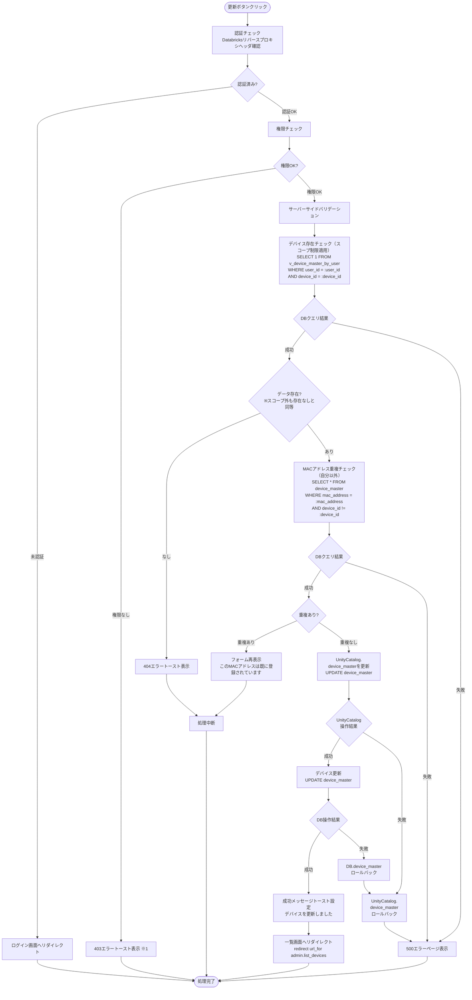
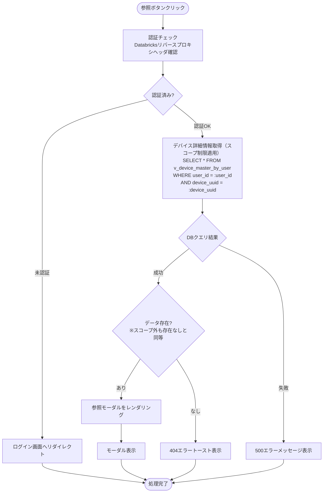
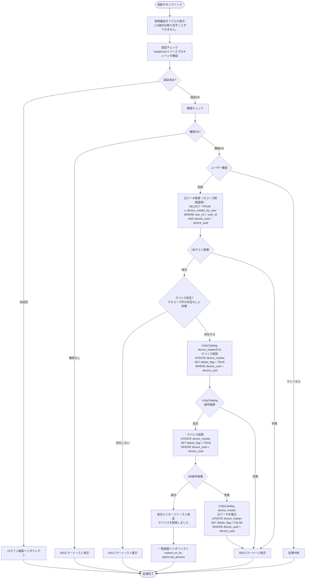

# デバイス管理 - ワークフロー仕様書

## 📑 目次

- [概要](#概要)
- [使用するFlaskルート一覧](#使用するflaskルート一覧)
- [ルート呼び出しマッピング](#ルート呼び出しマッピング)
- [ワークフロー一覧](#ワークフロー一覧)
  - [初期表示](#初期表示)
  - [検索・絞り込み](#検索絞り込み)
  - [全体ソート](#全体ソート)
  - [ページ内ソート](#ページ内ソート)
  - [ページング](#ページング)
  - [デバイス登録](#デバイス登録)
  - [デバイス更新](#デバイス更新)
  - [デバイス参照](#デバイス参照)
  - [デバイス削除](#デバイス削除)
  - [CSVエクスポート](#csvエクスポート)
- [使用データベース詳細](#使用データベース詳細)
- [トランザクション管理](#トランザクション管理)
- [セキュリティ実装](#セキュリティ実装)
- [関連ドキュメント](#関連ドキュメント)

---

## 概要

このドキュメントは、デバイス管理画面のユーザー操作に対する処理フロー、バリデーション実行タイミング、データベース処理の詳細を記載します。

**このドキュメントの役割:**
- ✅ ユーザー操作のトリガー条件
- ✅ 処理フローの詳細（Flaskルート呼び出しシーケンス、フォーム送信、リダイレクト）
- ✅ バリデーション実行タイミング（いつチェックするか）
- ✅ エラーハンドリングフロー
- ✅ サーバーサイド処理詳細（SQL、変数、条件分岐、コード例）
- ✅ データベース利用詳細（トランザクション管理、テーブル操作、インデックス）
- ✅ セキュリティ実装詳細（認証、入力検証、ログ出力）

**UI仕様書との役割分担:**
- **UI仕様書**: バリデーションルール定義（何をチェックするか）、UI要素の詳細仕様
- **ワークフロー仕様書**: バリデーション実行タイミング（いつどのようにチェックするか）、処理フロー、サーバーサイド実装詳細

**注:** UI要素の詳細やバリデーションルールは [UI仕様書](./ui-specification.md) を参照してください。

---

## 使用するFlaskルート一覧

この画面で使用するすべてのFlaskルート（エンドポイント）を記載します。

| No  | ルート名         | エンドポイント                      | メソッド | 用途                        | レスポンス形式     | 備考                                             |
| --- | ---------------- | ----------------------------------- | -------- | --------------------------- | ------------------ | ------------------------------------------------ |
| 1   | デバイス一覧表示 | `/admin/devices`                    | GET      | デバイス一覧初期表示・ページング | HTML               | pageパラメータなし=初期表示、あり=ページング |
| 2   | デバイス一覧表示 | `/admin/devices`                    | POST      | デバイス一覧検索結果表示    | HTML               | 検索条件をCookieに格納                      |
| 3   | デバイス登録画面 | `/admin/devices/create`             | GET      | デバイス登録フォーム表示    | HTML（モーダル）   | 組織選択肢を含む                                 |
| 4   | デバイス登録実行 | `/admin/devices/register`             | POST     | デバイス登録処理            | リダイレクト (302) | 成功時: `/admin/devices`、失敗時: フォーム再表示 |
| 5   | デバイス参照画面 | `/admin/devices/<device_uuid>`        | GET      | デバイス詳細情報表示        | HTML（モーダル）   | -                                                |
| 6   | デバイス更新画面 | `/admin/devices/<device_uuid>/edit`   | GET      | デバイス更新フォーム表示    | HTML（モーダル）   | 現在の値を初期表示                               |
| 7   | デバイス更新実行 | `/admin/devices/<device_uuid>/update` | POST     | デバイス更新処理            | リダイレクト (302) | 成功時: `/admin/devices`                         |
| 8   | デバイス削除実行 | `/admin/devices/delete` | POST     | デバイス削除処理            | リダイレクト (302) | 成功時: `/admin/devices`                         |
| 9   | CSVエクスポート  | `/admin/devices/export`            | POST      | デバイス一覧CSVダウンロード | CSV                | 現在の検索条件を適用                             |

**注:**
- **レスポンス形式**:
  - `HTML`: Jinja2テンプレートをレンダリングして返す（`render_template()`）
  - `リダイレクト (302)`: 成功時に別のルートへリダイレクト（`redirect(url_for())`）、失敗時はフォームを再表示
  - `CSV`: CSVファイルをダウンロードレスポンスとして返す
- **Flask Blueprint構成**: `admin_bp` として実装

---

## ルート呼び出しマッピング

| ユーザー操作     | トリガー        | 呼び出すルート                             | パラメータ                                                                                                                  | レスポンス                           | エラー時の挙動                         |
| ---------------- | --------------- | ------------------------------------------ | --------------------------------------------------------------------------------------------------------------------------- | ------------------------------------ | -------------------------------------- |
| 画面初期表示     | URL直接アクセス | `GET /admin/devices`                       | `page=1`                                                                                                                    | HTML（デバイス一覧画面）             | エラーページ表示                       |
| 検索ボタン押下   | フォーム送信    | `POST /admin/devices`                      | `device_id, device_name, device_type, location, organization_id, certificate_expiration_date, status, sort_by, order, page` | HTML（検索結果画面）                 | エラーメッセージ表示                   |
| ページボタン押下 | フォーム送信    | `GET /admin/devices`                       | `page`                                                                                                                      | HTML（検索結果画面）                 | エラーメッセージ表示                   |
| 登録ボタン押下   | ボタンクリック  | `GET /admin/devices/create`                | なし                                                                                                                        | HTML（登録モーダル）                 | エラーページ表示                       |
| 登録実行         | フォーム送信    | `POST /admin/devices/register`             | フォームデータ                                                                                                              | リダイレクト → `GET /admin/devices` | フォーム再表示（エラーメッセージ付き） |
| 参照ボタン押下   | ボタンクリック  | `GET /admin/devices/<device_uuid>`         | device_uuid                                                                                                                 | HTML（参照モーダル）                 | 404エラーページ                        |
| 更新ボタン押下   | ボタンクリック  | `GET /admin/devices/<device_uuid>/edit`    | device_uuid                                                                                                                 | HTML（更新モーダル）                 | 404エラーページ                        |
| 更新実行         | フォーム送信    | `POST /admin/devices/<device_uuid>/update` | フォームデータ                                                                                                              | リダイレクト → `GET /admin/devices` | フォーム再表示（エラーメッセージ付き） |
| 削除実行         | フォーム送信    | `POST /admin/devices/delete`               | device_id                                                                                                                   | リダイレクト → `GET /admin/devices` | エラーメッセージ表示                   |
| CSVエクスポート  | ボタンクリック  | `POST /admin/devices/export`               | 検索条件                                                                                                                    | CSVダウンロード                      | エラーメッセージ表示                   |

---

## ワークフロー一覧

### 初期表示

**トリガー:** URL直接アクセス時（ユーザーが `/admin/devices` にアクセスしたとき）

**前提条件:**
- ユーザーがログイン済み（Databricks認証完了）
- 適切な権限を持っている

#### 処理フロー



**ルート実装例:**

- `get_default_search_params()` / `search_devices()` は `device_service.py` に定義
- Cookie操作は `common` の `get_search_conditions_cookie` / `set_search_conditions_cookie` / `clear_search_conditions_cookie` を使用

```python
# views/admin/devices.py
@admin_bp.route('/devices', methods=['GET'])
@require_auth
@require_role('system_admin', 'management_admin', 'sales_company_user', 'service_company_user')
def devices_list():
    """初期表示・ページング（統合）"""

    if 'page' not in request.args:
        # 初期表示: デフォルト検索条件
        search_params = get_default_search_params()  # → device_service
        save_cookie = True
    else:
        # ページング: Cookie から検索条件取得 → page 上書き
        search_params = get_search_conditions_cookie('devices') or get_default_search_params()
        search_params['page'] = request.args.get('page', 1, type=int)
        save_cookie = False

    try:
        devices, total = search_devices(search_params, g.current_user.user_id)  # → device_service
        device_types, organizations, sort_items = get_device_form_options(g.current_user.user_id)  # → device_service
    except Exception:
        abort(500)

    response = make_response(render_template(
        'admin/devices/list.html',
        devices=devices,
        total=total,
        search_params=search_params,
        device_types=device_types,
        organizations=organizations,
        sort_items=sort_items,
    ))
    if save_cookie:
        response = clear_search_conditions_cookie(response, 'devices')
        response = set_search_conditions_cookie(response, 'devices', search_params)
    return response
```

#### Flaskルート

| ルート           | エンドポイント       | 詳細                    |
| ---------------- | -------------------- | --------------------- |
| デバイス一覧表示 | `GET /admin/devices` | クエリパラメータ: `page` |

#### バリデーション

**実行タイミング:** なし（初期表示のため、デフォルト値を使用）

**データスコープ制限:**
- **フィルタリングロジックは全ユーザーで共通、実質的なアクセス可能範囲に差分あり**
- システム保守者・管理者: すべてのユーザーにアクセス可能
- 販社ユーザ・サービス利用者: ログインユーザーの `organization_id` に紐づく全子組織でフィルタリング

#### 処理詳細（サーバーサイド）

**① 認証・認可チェック**

リバースプロキシヘッダから認証情報を取得し、権限を確認します。

**処理内容:**
- ヘッダ `X-Forwarded-User` からユーザーIDを取得
- データベースから現在ユーザー情報を取得（ユーザー種別、組織ID）
- 組織に応じてデータスコープを決定

**変数・パラメータ:**
- `current_user_id`: string - リバースプロキシヘッダから取得したユーザーID
- `current_user`: User - データベースから取得したユーザーオブジェクト
- `user_type_id`: int - ユーザー種別ID（user_type_masterへの外部キー）
- `organization_id`: string - データスコープ制限用の組織ID

**実装例:**
```python
from flask import request, abort, g
from functools import wraps

def require_auth(f):
    @wraps(f)
    def decorated_function(*args, **kwargs):
        user_id = request.headers.get('X-Forwarded-User')
        if not user_id:
            abort(401)

        user = User.query.filter_by(user_id=user_id, delete_flag=False).first()
        if not user:
            abort(403)

        g.current_user = user
        return f(*args, **kwargs)
    return decorated_function
```

**② クエリパラメータ取得**

```python
page = request.args.get('page', 1, type=int)
per_page = ITEM_PER_PAGE  # 設定ファイルから取得
```

**③ データスコープ制限の適用**

`v_device_master_by_user` にログインユーザーの `user_id` を渡すことで、アクセス可能な組織配下のデータに自動的に絞り込まれます。

詳細な実装仕様は[認証・認可実装](#認証認可実装)を参照してください。

**④ データベースクエリ実行**

デバイスマスタからデータを取得します。

**使用テーブル:** v_device_master_by_user（デバイスマスタ）、organization_master（組織マスタ）, device_status_data (デバイスステータス)

**SQL実装例:**
- 検索結果件数取得DBクエリ
```sql
SELECT
  COUNT(device_id) AS data_count
FROM
  v_device_master_by_user
WHERE
  user_id = :user_id
  AND delete_flag = FALSE
```

- 検索結果取得DBクエリ
```sql
SELECT
  d.device_id,
  d.device_name,
  t.device_type_name,
  d.device_location,
  o.organization_name,
  d.certificate_expiration_date,
  TIMESTAMPDIFF(SECOND, s.last_received_time, CURRENT_TIMESTAMP()) AS timediff
FROM
  v_device_master_by_user d
  LEFT JOIN organization_master o
    ON d.device_organization_id = o.organization_id
    AND o.delete_flag = FALSE
  LEFT JOIN device_status_data s
    ON d.device_id = s.device_id
    AND s.delete_flag = FALSE
  LEFT JOIN device_type_master t
    ON d.device_type_id = t.device_type_id
    AND t.delete_flag = FALSE
WHERE
  d.user_id = :user_id
  AND d.delete_flag = FALSE
ORDER BY
  d.device_id ASC
LIMIT :item_per_page OFFSET 0
```

一覧として出力する「ステータス」カラムの表示内容について、現在時刻とdevice_status_data.last_received_timeの差が、設定ファイルに記載されたデバイスデータの送信間隔の2倍より長い場合、「未接続」と表示し、それ以下である場合、「接続済み」と表示する。

**実装例:**
```python
# services/device_service.py
def get_default_search_params() -> dict:
    """デバイス一覧検索のデフォルトパラメータを返す"""
    return {
        'page': 1,
        'per_page': ITEM_PER_PAGE,
        'sort_by': '',
        'order': '',
        'device_id': '',
        'device_name': '',
        'device_type_id': None,
        'location': '',
        'organization_id': None,
        'certificate_expiration_date': '',
        'status': None,
    }


def search_devices(search_params: dict, user_id: int) -> tuple[list, int]:
    """デバイス一覧をスコープ制限付きで検索する

    Args:
        search_params: 検索条件（page, per_page, sort_by, order, 各検索項目）
        user_id: ログインユーザーID（スコープ制限に使用）

    Returns:
        (devices, total): デバイスリストと総件数のタプル
    """
    page = search_params['page']
    per_page = search_params['per_page']
    sort_by = search_params['sort_by']
    order = search_params['order']
    offset = (page - 1) * per_page

    query = db.session.query(
        DeviceMasterByUser,
        OrganizationMaster.organization_name,
        DeviceTypeMaster.device_type_name,
        DeviceStatusData.last_received_time,
    ).outerjoin(
        OrganizationMaster,
        and_(
            DeviceMasterByUser.device_organization_id == OrganizationMaster.organization_id,
            OrganizationMaster.delete_flag == False,
        )
    ).outerjoin(
        DeviceStatusData,
        and_(
            DeviceMasterByUser.device_id == DeviceStatusData.device_id,
            DeviceStatusData.delete_flag == False,
        )
    ).outerjoin(
        DeviceTypeMaster,
        and_(
            DeviceMasterByUser.device_type_id == DeviceTypeMaster.device_type_id,
            DeviceTypeMaster.delete_flag == False,
        )
    ).filter(
        DeviceMasterByUser.user_id == user_id,
        DeviceMasterByUser.delete_flag == False,
    )

    sort_col = getattr(DeviceMasterByUser, sort_by, None)
    # 検索条件フィルタ（フロー2: 検索・絞り込みでも共用）
    if search_params.get('device_uuid'):
        query = query.filter(DeviceMasterByUser.device_id.like(f"%{search_params['device_uuid']}%"))
    if search_params.get('device_name'):
        query = query.filter(DeviceMasterByUser.device_name.like(f"%{search_params['device_name']}%"))
    if search_params.get('device_type_id') is not None:
        query = query.filter(DeviceMasterByUser.device_type_id == search_params['device_type_id'])
    if search_params.get('location'):
        query = query.filter(DeviceMasterByUser.device_location.like(f"%{search_params['location']}%"))
    if search_params.get('organization_id') is not None:
        query = query.filter(DeviceMasterByUser.device_organization_id == search_params['organization_id'])
    if search_params.get('certificate_expiration_date'):
        query = query.filter(DeviceMasterByUser.certificate_expiration_date == search_params['certificate_expiration_date'])
    if search_params.get('status') is not None:
        threshold = current_app.config['DEVICE_DATA_INTERVAL_SECONDS']
        timediff = func.timestampdiff(text('SECOND'), DeviceStatusData.last_received_time, func.now())
        if search_params['status'] == 'connected':
            query = query.filter(
                DeviceStatusData.last_received_time.isnot(None),
                timediff <= threshold * 2,
            )
        elif search_params['status'] == 'disconnected':
            query = query.filter(
                or_(
                    DeviceStatusData.last_received_time.is_(None),
                    timediff > threshold * 2,
                )
            )

    if sort_col is None:
        query = query.order_by(DeviceMasterByUser.device_id.asc())
    else:
        query = query.order_by(
            sort_col.asc() if order == 'asc' else sort_col.desc(),
            DeviceMasterByUser.device_id.asc(),
        )

    total = query.count()
    devices = query.limit(per_page).offset(offset).all()
    return devices, total
```

**⑤ HTMLレンダリング**

Jinja2テンプレートをレンダリングしてHTMLレスポンスを返却します。

**実装例:**
```python
# views/admin/devices.py（devices_list 内）
return response # make_response + render_template は上記ルート実装例を参照
```

#### 表示メッセージ

| メッセージID | 表示内容                   | 表示タイミング | 表示場所     |
| ------------ | -------------------------- | -------------- | ------------ |
| ERR_001      | データの取得に失敗しました | DBクエリ失敗時 | エラーページ |

#### エラーハンドリング

| HTTPステータス | エラー種別         | 処理内容                   | 表示内容                   |
| -------------- | ------------------ | -------------------------- | -------------------------- |
| 401            | 認証エラー         | ログイン画面へリダイレクト | -                          |
| 500            | データベースエラー | 500エラーページ表示        | データの取得に失敗しました |

#### ログ出力タイミング
DBクエリ実行の直前、直後に操作ログを出力する

#### 検索条件の保持方法
Cookieに検索条件を保持する

#### UI状態

- 検索条件: デフォルト値
  - デバイスID：空
  - デバイス名：空
  - デバイス種別：すべて
  - 設置場所：空
  - 所属組織：すべて
  - 証明書期限：空
  - ステータス：すべて
  - ソート項目：空
  - ソート順：空
- テーブル: デバイス一覧データ表示
- ページネーション: 1ページ目を選択状態

---

### 検索・絞り込み

**トリガー:** (2.10) 検索ボタンクリック（フォーム送信）

**前提条件:**
- 検索条件が入力されている（空でも可）

#### 処理フロー



#### 処理詳細（サーバーサイド）

**検索DBクエリ実装例:**
- 検索結果件数取得DBクエリ
```sql
SELECT
  COUNT(d.device_id) AS data_count
FROM
  v_device_master_by_user d
  LEFT JOIN organization_master o
    ON d.device_organization_id = o.organization_id
    AND o.delete_flag = FALSE
  LEFT JOIN device_status_data s
    ON d.device_id = s.device_id
    AND s.delete_flag = FALSE
  LEFT JOIN device_type_master t
    ON d.device_type_id = t.device_type_id
    AND t.delete_flag = FALSE
WHERE
  d.user_id = :user_id
  AND d.delete_flag = FALSE
  AND CASE WHEN :device_uuid IS NULL THEN TRUE ELSE d.device_uuid LIKE CONCAT('%', :device_uuid, '%') END
  AND CASE WHEN :device_name IS NULL THEN TRUE ELSE d.device_name LIKE CONCAT('%', :device_name, '%') END
  AND CASE WHEN :device_category_id IS NULL THEN TRUE ELSE d.device_type_id = :device_category_id END
  AND CASE WHEN :location IS NULL THEN TRUE ELSE d.device_location LIKE CONCAT('%', :location, '%') END
  AND CASE WHEN :organization_id IS NULL THEN TRUE ELSE d.device_organization_id = :organization_id END
  AND CASE WHEN :certificate_expiration_date IS NULL THEN TRUE ELSE d.certificate_expiration_date = :certificate_expiration_date END
  AND CASE
      WHEN :status IS NULL THEN TRUE
      WHEN :status = 'connected'    THEN (s.last_received_time IS NOT NULL AND TIMESTAMPDIFF(SECOND, s.last_received_time, CURRENT_TIMESTAMP()) <= :threshold * 2)
      WHEN :status = 'disconnected' THEN (s.last_received_time IS NULL     OR  TIMESTAMPDIFF(SECOND, s.last_received_time, CURRENT_TIMESTAMP()) >  :threshold * 2)
      ELSE TRUE
  END
```

- 検索結果取得DBクエリ
```sql
SELECT
  d.device_id,
  d.device_name,
  t.device_type_name,
  d.device_location,
  o.organization_name,
  d.certificate_expiration_date,
  TIMESTAMPDIFF(SECOND, s.last_received_time, CURRENT_TIMESTAMP()) AS timediff
FROM
  v_device_master_by_user d
  LEFT JOIN organization_master o
    ON d.device_organization_id = o.organization_id
    AND o.delete_flag = FALSE
  LEFT JOIN device_status_data s
    ON d.device_id = s.device_id
    AND s.delete_flag = FALSE
  LEFT JOIN device_type_master t
    ON d.device_type_id = t.device_type_id
    AND t.delete_flag = FALSE
WHERE
  d.user_id = :user_id
  AND d.delete_flag = FALSE
  AND CASE WHEN :device_uuid IS NULL THEN TRUE ELSE d.device_id LIKE CONCAT('%', :device_uuid, '%') END
  AND CASE WHEN :device_name IS NULL THEN TRUE ELSE d.device_name LIKE CONCAT('%', :device_name, '%') END
  AND CASE WHEN :device_category_id IS NULL THEN TRUE ELSE d.device_type_id = :device_category_id END
  AND CASE WHEN :location IS NULL THEN TRUE ELSE d.device_location LIKE CONCAT('%', :location, '%') END
  AND CASE WHEN :organization_id IS NULL THEN TRUE ELSE d.device_organization_id = :organization_id END
  AND CASE WHEN :certificate_expiration_date IS NULL THEN TRUE ELSE d.certificate_expiration_date = :certificate_expiration_date END
  AND CASE
      WHEN :status IS NULL THEN TRUE
      WHEN :status = 'connected'    THEN (s.last_received_time IS NOT NULL AND TIMESTAMPDIFF(SECOND, s.last_received_time, CURRENT_TIMESTAMP()) <= :threshold * 2)
      WHEN :status = 'disconnected' THEN (s.last_received_time IS NULL     OR  TIMESTAMPDIFF(SECOND, s.last_received_time, CURRENT_TIMESTAMP()) >  :threshold * 2)
      ELSE TRUE
  END
ORDER BY
  {sort_by} {order}
LIMIT :item_per_page OFFSET (:page -1) * :item_per_page
```

**実装例:**

- `search_devices()` はフロー1と共用（フィルタ条件はすべてサービス内で処理）
- `DeviceSearchForm` は `forms/device.py` に定義
- Cookie操作は共通関数を使用

```python
# forms/device.py
class DeviceSearchForm(FlaskForm):
    device_id                   = StringField('デバイスID')
    device_name                 = StringField('デバイス名')
    device_type_id              = StringField('デバイス種別')
    location                    = StringField('設置場所')
    organization_id             = StringField('所属組織')
    certificate_expiration_date = StringField('証明書期限')
    status                      = SelectField('ステータス', coerce=str, choices=[('', 'すべて'), ('connected', '接続済み'), ('disconnected', '未接続')])
    sort_by                     = SelectField('ソート項目', coerce=str)   # 選択肢は sort_item_master から動的取得（空白=デフォルトソート）
    order                       = SelectField('ソート順', coerce=str, choices=[('', ''), ('asc', '昇順'), ('desc', '降順')])
```

```python
# views/admin/devices.py
@admin_bp.route('/devices', methods=['POST'])
@require_auth
@require_role('system_admin', 'management_admin', 'sales_company_user', 'service_company_user')
def search_devices_view():
    form = DeviceSearchForm(request.form)
    if not form.validate():
        abort(400)

    search_params = {
        'page': 1,
        'per_page': ITEM_PER_PAGE,
        'sort_by': form.sort_by.data or '',   # 空白選択時はデフォルトソート（デバイスID昇順）
        'order': form.order.data or '',
        'device_id': form.device_id.data or '',
        'device_name': form.device_name.data or '',
        'device_type_id': form.device_type_id.data,
        'location': form.location.data or '',
        'organization_id': form.organization_id.data,
        'certificate_expiration_date': form.certificate_expiration_date.data or '',
        'status': form.status.data or None,
    }

    try:
        devices, total = search_devices(search_params, g.current_user.user_id)  # → device_service
        device_types, organizations, sort_items = get_device_form_options(g.current_user.user_id)  # → device_service
    except Exception:
        abort(500)

    response = make_response(render_template(
        'admin/devices/list.html',
        devices=devices,
        total=total,
        search_params=search_params,
        device_types=device_types,
        organizations=organizations,
        sort_items=sort_items,
    ))
    response = clear_search_conditions_cookie(response, 'devices')
    response = set_search_conditions_cookie(response, 'devices', search_params)
    return response
```

#### 表示メッセージ

| メッセージID | 表示内容                   | 表示タイミング | 表示場所     |
| ------------ | -------------------------- | -------------- | ------------ |
| ERR_001      | データの取得に失敗しました | DBクエリ失敗時 | エラーページ |

#### エラーハンドリング

| HTTPステータス | エラー種別         | 処理内容                   | 表示内容                   |
| -------------- | ------------------ | -------------------------- | -------------------------- |
| 401            | 認証エラー         | ログイン画面へリダイレクト | -                          |
| 500            | データベースエラー | 500エラーページ表示        | データの取得に失敗しました |

#### ログ出力タイミング
DBクエリ実行の直前、直後に操作ログを出力する

#### 検索条件の保持方法
Cookieに検索条件を保持する

#### UI状態
- 検索条件: 入力値を保持（フォームに再設定）
- テーブル: 検索結果データ表示
- ページネーション: 1ページ目を選択状態

---

### 全体ソート

**トリガー:** (2) 検索条件欄でソート項目、ソート順ドロップダウンで具体値を選択し、検索を実行

#### 処理詳細
検索条件欄のソート項目ドロップダウンで選択した内容に対して、ソート順ドロップダウンで選択した順序でページをまたいだソートを行う。
詳細は[共通仕様書](../../common/common-specification.md)参照のこと。

---

### ページ内ソート

**トリガー:**（6）データテーブルのソート可能カラム（デバイスID、デバイス名、デバイス種別、設置場所、所属組織、証明書期限、ステータス）のヘッダをクリック

#### 処理詳細
データテーブルのヘッダをクリックすることで、ページ内で閉じたソートを行う。
詳細は[共通仕様書](../../common/common-specification.md)参照のこと

---

### ページング

**トリガー:** (6.10) ページネーションのページ番号ボタンクリック

#### 処理詳細
ページネーションのページ番号を選択することで、選択されたページ番号に対応するデータをデータテーブルに表示する。
具体的な処理は[初期表示](#初期表示)の処理と同様とする。

#### UI状態

- 検索条件: 保持
- ソート条件: 保持
- テーブル: 選択ページのデータ表示
- ページネーション: 選択ページをアクティブ状態

---

### デバイス登録

#### 登録ボタン押下

**トリガー:** (3.1) 登録ボタンクリック

**前提条件:**
- ユーザーが登録権限を持っている（システム保守者、管理者、販社ユーザ）

##### 処理フロー



※1　403エラー発生時、ドロップダウン、テキストボックスに具体的なデータは表示せず、空で表示する。

##### 処理詳細（サーバーサイド）

**実装例:**

- `get_device_form_options()` は `device_service.py` に定義（フロー5: 更新ボタン押下でも共用）

```python
# services/device_service.py
def get_device_form_options(user_id: int) -> tuple[list, list, list]:
    """検索・登録・更新フォーム用マスターデータを取得する

    Args:
        user_id: ログインユーザーID（組織スコープ制限に使用）

    Returns:
        (device_types, organizations, sort_items)
    """
    device_types = db.session.query(DeviceTypeMaster).filter(
        DeviceTypeMaster.delete_flag == False,
    ).order_by(DeviceTypeMaster.device_type_id).all()

    organizations = db.session.query(OrganizationMasterByUser).filter(
        OrganizationMasterByUser.user_id == user_id,
        OrganizationMasterByUser.delete_flag == False,
    ).order_by(OrganizationMasterByUser.organization_id).all()

    # TODO: デバイス一覧画面の view_id を sort_item_master 初期データに追加後、定数化すること
    DEVICE_LIST_VIEW_ID = None  # TODO: view_id 未定義。app-database-specification.md の sort_item_master 初期データに追加が必要
    sort_items = db.session.query(SortItem).filter(
        SortItem.view_id == DEVICE_LIST_VIEW_ID,
        SortItem.delete_flag == False,
    ).order_by(SortItem.sort_order).all()

    return device_types, organizations, sort_items
```

```python
# views/admin/devices.py
@admin_bp.route('/devices/create', methods=['GET'])
@require_auth
@require_role('system_admin', 'management_admin', 'sales_company_user')
def create_device_form():
    try:
        device_types, organizations, _ = get_device_form_options(g.current_user.user_id)  # → device_service（sort_itemsは登録フォームでは不要）
    except Exception:
        abort(500)

    return render_template(
        'admin/devices/form.html',
        mode='create',
        device_types=device_types,
        organizations=organizations,
    )
```

#### 表示メッセージ

| メッセージID | 表示内容                           | 表示タイミング | 表示場所       |
| ------------ | ---------------------------------- | -------------- | -------------- |
| ERR_001      | データの取得に失敗しました         | DBクエリ失敗時 | エラーページ   |
| -            | この操作を実行する権限がありません | 権限不足時     | エラートースト |

#### エラーハンドリング

| HTTPステータス | エラー種別         | 処理内容                   | 表示内容                   |
| -------------- | ------------------ | -------------------------- | -------------------------- |
| 401            | 認証エラー         | ログイン画面へリダイレクト | -                          |
| 403            | 権限エラー         | 403エラートースト表示     | この操作を実行する権限がありません |
| 500            | データベースエラー | 500エラーページ表示        | データの取得に失敗しました |

---

#### 登録実行

**トリガー:** (7.11) 登録ボタン（モーダル内）クリック後に表示される登録実施確認モーダルで「はい」を選択

##### 処理フロー



※1　403エラー発生時、登録モーダルを閉じる。

##### 処理詳細（サーバーサイド）

**実装例:**
```python
# forms/device.py
class DeviceCreateForm(FlaskForm):
    device_uuid = StringField('デバイスID', validators=[
        DataRequired(message='デバイスIDは必須です'),
        Length(min=1, max=128, message='デバイスIDは128文字以内で入力してください'),
    ])
    device_name = StringField('デバイス名', validators=[
        DataRequired(message='デバイス名は必須です'),
        Length(min=1, max=100, message='デバイス名は100文字以内で入力してください'),
    ])
    device_type_id = StringField('デバイス種別', validators=[
        DataRequired(message='デバイス種別は必須です'),
    ])
    device_model = StringField('モデル情報', validators=[
        DataRequired(message='モデル情報は必須です'),
        Length(min=1, max=100, message='モデル情報は100文字以内で入力してください'),
    ])
    sim_id = StringField('SIMID', validators=[
        Optional(),
        Length(min=1, max=20, message='SIMIDは20文字以内で入力してください'),
    ])
    mac_address = StringField('MACアドレス', validators=[
        Optional(),
        Regexp(r'^([0-9A-Fa-f]{2}:){5}[0-9A-Fa-f]{2}$', message='MACアドレスの形式が正しくありません'),
    ])
    device_location = StringField('設置場所', validators=[
        Optional(),
        Length(min=1, max=100, message='設置場所は100文字以内で入力してください'),
    ])
    organization_id = StringField('所属組織', validators=[
        DataRequired(message='所属組織は必須です'),
    ])
    certificate_expiration_date = StringField('証明書期限', validators=[
        Optional(),
        Date(message='証明書期限の形式が正しくありません'),
    ])
```

```python
# services/device_service.py
def _insert_unity_catalog_device(device_id: int, device_data: dict, creator_id: int) -> None:
    """UC device_master に新規レコードを INSERT する"""
    uc = UnityCatalogConnector()
    uc.execute_dml(
        """
        INSERT INTO iot_catalog.oltp_db.device_master (
            device_id, device_uuid, organization_id, device_type_id, 
            device_name, device_model, sim_id, mac_address,
            device_location, certificate_expiration_date,
            create_date, creator, update_date, modifier, delete_flag
        ) VALUES (
            :device_id, :device_uuid, :organization_id, :device_type_id, 
            :device_name, :device_model, :sim_id, :mac_address,
            :device_location, :certificate_expiration_date,
            CURRENT_TIMESTAMP(), :creator_id, CURRENT_TIMESTAMP(), :creator_id, FALSE
        )
        """,
        {
            'device_id':                    device_id,
            'device_uuid':                  device_data['device_uuid'],
            'organization_id':              device_data['organization_id'],
            'device_type_id':               device_data['device_type_id'],
            'device_name':                  device_data['device_name'],
            'device_model':                 device_data['device_model'],
            'sim_id':                       device_data['sim_id'],
            'mac_address':                  device_data['mac_address'],
            'device_location':              device_data['device_location'],
            'certificate_expiration_date':  device_data['certificate_expiration_date'],
            'creator_id':                   creator_id,
        },
        operation="UC device_master INSERT",
    )

def _rollback_create_device(device_id: int) -> None:
    """OLTP DB への INSERT を削除する補償トランザクション（ベストエフォート）"""
    try:
        device = DeviceMaster.query.get(device_id)
        if device:
            device.delete_flag = True
            db.session.commit()
    except Exception:


def create_device(device_data: dict, creator_id: int) -> None:
    """デバイス登録（Sagaパターン）

    Args:
        device_data: フォームから取得したデバイスデータ
        creator_id: 登録者のユーザーID

    Returns:
        None

    Raises:
        DuplicateDeviceIdError: デバイスID重複時
        DuplicateMacAddressError: MACアドレス重複時
        Exception: 登録処理失敗時（ロールバック済み）
    """
    device_id = None
    device_uuid = device_data['device_uuid']

    # デバイスID重複チェック
    if DeviceMaster.query.filter_by(device_uuid=device_uuid, delete_flag=False).first():
        raise DuplicateDeviceIdError(device_uuid)

    # MACアドレス重複チェック
    if DeviceMaster.query.filter_by(mac_address=device_data['mac_address'], delete_flag=False).first():
        raise DuplicateMacAddressError(device_data['mac_address'])

    try:
        # ① OLTP DB device_master INSERT
        device = DeviceMaster(
            device_id=device_id,
            device_uuid=device_data['device_uuid'],
            organization_id=device_data['organization_id'],
            device_type_id=device_data['device_type_id'],
            device_name=device_data['device_name'],
            device_model=device_data['device_model'],
            sim_id=device_data['sim_id'],
            mac_address=device_data['mac_address'],
            device_location=device_data['device_location'],
            certificate_expiration_date=device_data['certificate_expiration_date'],
            creator=creator_id,
            modifier=creator_id,
        )
        db.session.add(device)
        db.session.flush()
        device_id = device.device_id

        # ② OLTP DB COMMIT
        db.session.commit()

        # ③ Unity Catalog device_master INSERT
        _insert_unity_catalog_device(device_id, device_data, creator_id)

    except (DuplicateDeviceIdError, DuplicateMacAddressError):
        raise
    except Exception:
        db.session.rollback()
        _rollback_create_device(device_id)
        raise


# views/admin/devices.py
@admin_bp.route('/devices/register', methods=['POST'])
@require_auth
@require_role('system_admin', 'management_admin', 'sales_company_user')
def create_device_view():
    form = DeviceCreateForm(request.form)
    if not form.validate():
        return render_template('admin/devices/form.html', mode='create', form=form), 400

    device_data = {
        'device_uuid':                  form.device_uuid.data,
        'organization_id':              form.organization_id.data,
        'device_type_id':               form.device_type_id.data,
        'device_name':                  form.device_name.data,
        'device_model':                 form.device_model.data,
        'sim_id':                       form.sim_id.data,
        'mac_address':                  form.mac_address.data,
        'device_location':              form.device_location.data,
        'certificate_expiration_date':  form.certificate_expiration_date.data,
    }

    try:
        create_device(device_data, g.current_user.user_id)  # → device_service
    except DuplicateDeviceIdError:
        form.device_id.errors.append('このデバイスIDは既に登録されています')
        return render_template('admin/devices/form.html', mode='create', form=form), 400
    except DuplicateMacAddressError:
        form.mac_address.errors.append('このMACアドレスは既に登録されています')
        return render_template('admin/devices/form.html', mode='create', form=form), 400
    except Exception:
        abort(500)

    flash('デバイスを登録しました', 'success')

    return redirect(url_for('admin.devices.devices_list'))
```

##### バリデーション

**実行タイミング:** 登録ボタンクリック直後（サーバーサイド）

**バリデーションルール:** [UI仕様書](./ui-specification.md) の要素詳細 (7) デバイス登録/更新モーダル > バリデーション を参照

##### 表示メッセージ

| メッセージID | 表示内容                              | 表示タイミング | 表示場所       |
| ------------ | ------------------------------------- | -------------- | -------------- |
| SUC_001      | デバイスを登録しました                | 登録成功時     | 成功トースト   |
| ERR_002      | デバイスの登録に失敗しました          | DB操作失敗時   | エラートースト |
| ERR_003      | このデバイスIDは既に登録されています  | 重複エラー     | フォーム再表示 |
| ERR_004      | このMACアドレスは既に登録されています | 重複エラー     | フォーム再表示 |

#### エラーハンドリング

| HTTPステータス | エラー種別           | 処理内容                               | 表示内容                           |
| -------------- | -------------------- | -------------------------------------- | ---------------------------------- |
| 400            | バリデーションエラー | フォーム再表示（エラーメッセージ表示） | バリデーションエラーメッセージ     |
| 401            | 認証エラー           | ログイン画面へリダイレクト             | -                                  |
| 403            | 権限エラー           | 403エラートースト表示                  | この操作を実行する権限がありません |
| 500            | データベースエラー   | 500エラーページ表示                    | データの取得に失敗しました         |

#### ログ出力タイミング
DBクエリ実行の直前、直後に操作ログを出力する

---

### デバイス更新

#### 更新画面表示

**トリガー:** (6.9) 更新ボタンクリック

##### 処理フロー



※1　403エラー発生時、ドロップダウン、テキストボックスに具体的なデータは表示せず、空で表示する。

##### 処理詳細（サーバーサイド）

**実装例:**
```python
# services/device_service.py
def get_device_by_uuid(device_uuid: str, user_id: int):
    """デバイス情報を取得（スコープ制限適用）

    フロー5（更新ボタン押下）・フロー6（更新実行）で共用。

    Args:
        device_uud: 取得対象のデバイスUUID
        user_id: ログインユーザーID（スコープ制限に使用）

    Returns:
        DeviceMasterByUser or None（スコープ外・存在しない場合）
    """
    return db.session.query(DeviceMasterByUser).filter(
        DeviceMasterByUser.user_id == user_id,
        DeviceMasterByUser.device_uuid == device_uuid,
        DeviceMasterByUser.delete_flag == False,
    ).first()

# get_device_form_options(user_id) → フロー3定義済み、共用

# views/admin/devices.py
@admin_bp.route('/devices/<device_uuid>/edit', methods=['GET'])
@require_auth
@require_role('system_admin', 'management_admin', 'sales_company_user')
def edit_device_form(device_uuid):
    try:
        device = get_device_by_uuid(device_uuid, g.current_user.user_id)  # → device_service
    except Exception:
        abort(500)
    if not device:
        abort(404)

    try:
        device_types, organizations, _ = get_device_form_options(g.current_user.user_id)  # → device_service（フロー3と共用、sort_itemsは更新フォームでは不要）
    except Exception:
        abort(500)

    return render_template(
        'admin/devices/form.html',
        mode='edit',
        device=device,
        device_types=device_types,
        organizations=organizations,
    )
```

##### 表示メッセージ

| メッセージID | 表示内容                           | 表示タイミング | 表示場所       |
| ------------ | ---------------------------------- | -------------- | -------------- |
| -            | この操作を実行する権限がありません | 権限不足時     | エラートースト |
| -            | 指定されたデバイスが見つかりません | リソース不在時 | エラートースト |
| -            | データの取得に失敗しました         | DBクエリ失敗時 | エラーページ   |

#### エラーハンドリング

| HTTPステータス | エラー種別         | 処理内容                   | 表示内容                           |
| -------------- | ------------------ | -------------------------- | ---------------------------------- |
| 401            | 認証エラー         | ログイン画面へリダイレクト | -                                  |
| 403            | 権限エラー         | 403エラートースト表示      | この操作を実行する権限がありません |
| 404            | リソース不在       | 404エラートースト表示      | 指定されたデバイスが見つかりません |
| 500            | データベースエラー | 500エラーページ表示        | データの取得に失敗しました         |

---

#### 更新実行

**トリガー:** (7.11) 更新ボタン（モーダル内）クリック後に表示される更新実行確認モーダルで「はい」を選択

##### 処理フロー



※1　403エラー発生時、更新モーダルを閉じる。

##### 処理詳細（サーバーサイド）

**実装例:**
```python
# forms/device.py
class DeviceUpdateForm(FlaskForm):
    device_name = StringField('デバイス名', validators=[
        DataRequired(message='デバイス名は必須です'),
        Length(min=1, max=100, message='デバイス名は100文字以内で入力してください'),
    ])
    device_type_id = StringField('デバイス種別', validators=[
        DataRequired(message='デバイス種別は必須です'),
    ])
    device_model = StringField('モデル情報', validators=[
        DataRequired(message='モデル情報は必須です'),
        Length(min=1, max=100, message='モデル情報は100文字以内で入力してください'),
    ])
    sim_id = StringField('SIMID', validators=[
        Optional(),
        Length(min=1, max=20, message='SIMIDは20文字以内で入力してください'),
    ])
    mac_address = StringField('MACアドレス', validators=[
        Optional(),
        Regexp(r'^([0-9A-Fa-f]{2}:){5}[0-9A-Fa-f]{2}$', message='MACアドレスの形式が正しくありません'),
    ])
    device_location = StringField('設置場所', validators=[
        Optional(),
        Length(min=1, max=100, message='設置場所は100文字以内で入力してください'),
    ])
    device_organization_id = StringField('所属組織', validators=[
        DataRequired(message='所属組織は必須です'),
    ])
    certificate_expiration_date = StringField('証明書期限', validators=[
        Optional(),
        Date(message='証明書期限の形式が正しくありません'),
    ])


# services/device_service.py
# get_device_by_uuid(device_uuid, user_id) → フロー5定義済み、共用

def _update_unity_catalog_device(device_uuid: str, device_data: dict, modifier_id: int) -> None:
    """UC device_master の更新可能項目を UPDATE する"""
    uc = UnityCatalogConnector()
    uc.execute_dml(
        """
        UPDATE iot_catalog.oltp_db.device_master
        SET device_name=:device_name, device_type_id=:device_type_id,
            organization_id=:organization_id, device_model=:device_model,
            device_location=:device_location,
            mac_address=:mac_address, certificate_expiration_date=:certificate_expiration_date,
            update_date=CURRENT_TIMESTAMP(), modifier=:modifier_id
        WHERE device_uuid=:device_uuid
        """,
        {
            'device_name':                  device_data['device_name'],
            'device_type_id':               device_data['device_type_id'],
            'organization_id':              device_data['organization_id'],
            'device_model':                 device_data['device_model'],
            'device_location':              device_data['device_location'],
            'mac_address':                  device_data['mac_address'],
            'certificate_expiration_date':  device_data['certificate_expiration_date'],
            'modifier_id':                  modifier_id,
            'device_uuid':                  device_uuid,
        },
        operation="UC device_master UPDATE",
    )


def _rollback_update_device(device_uuid: str) -> None:
    """db.session.rollback() 後に UC を元データで復元する（ベストエフォート）

    db.session.rollback() 後は OLTP が元データに戻っているため、
    OLTP から元値を取得して UC を復元する。
    ロールバック自体の失敗はログ出力のみでエラーを握りつぶす（ベストエフォート）。
    """
    try:
        original = DeviceMaster.query.filter_by(device_uuid=device_uuid).first()
        if not original:
            return
        uc = UnityCatalogConnector()
        uc.execute_dml(
            """
            UPDATE iot_catalog.oltp_db.device_master
            SET device_name=:device_name, device_type_id=:device_type_id,
                device_organization_id=:device_organization_id, device_model=:device_model,
                device_location=:device_location,
                mac_address=:mac_address, certificate_expiration_date=:certificate_expiration_date,
                update_date=CURRENT_TIMESTAMP(), modifier=:modifier
            WHERE device_uuid=:device_uuid
            """,
            {
                'device_name':                  original.device_name,
                'device_type_id':               original.device_type_id,
                'device_organization_id':       original.device_organization_id,
                'device_model':                 original.device_model,
                'device_location':              original.device_location,
                'mac_address':                  original.mac_address,
                'certificate_expiration_date':  original.certificate_expiration_date,
                'modifier':                     original.modifier,
                'device_uuid':                  device_uuid,
            },
            operation="UC device_master 更新ロールバック",
        )
    except Exception:
        logger.error("デバイス更新ロールバック失敗", exc_info=True)


def _update_oltp_device(device_uuid: str, device_data: dict, modifier_id: int) -> None:
    """OLTP DB device_master を UPDATE する"""
    device = DeviceMaster.query.filter_by(device_uuid=device_uuid).first()
    device.device_name = device_data['device_name']
    device.device_type_id = device_data['device_type_id']
    device.device_organization_id = device_data['device_organization_id']
    device.device_model = device_data['device_model']
    device.device_location = device_data['device_location']
    device.mac_address = device_data['mac_address']
    device.certificate_expiration_date = device_data['certificate_expiration_date']
    device.modifier = modifier_id
    db.session.flush()


def update_device(device_uuid: str, device_data: dict, modifier_id: int) -> None:
    """デバイス更新（Sagaパターン）

    Args:
        device_uuid: 対象デバイスUUID（OLTP/UC更新に使用）
        device_data: 更新データ（新値）
        modifier_id: 更新者ID

    Raises:
        DuplicateMacAddressError: MACアドレス重複時
        Exception: 更新失敗時（ロールバック済み）
    """
    # MACアドレス重複チェック（自分以外）
    if DeviceMaster.query.filter(
        DeviceMaster.mac_address == device_data['mac_address'],
        DeviceMaster.device_uuid != device_uuid,
        DeviceMaster.delete_flag == False,
    ).first():
        raise DuplicateMacAddressError(device_data['mac_address'])

    try:
        # ① UC device_master 更新
        _update_unity_catalog_device(device_uuid, device_data, modifier_id)

        # ② OLTP DB 更新
        _update_oltp_device(device_uuid, device_data, modifier_id)
        db.session.commit()

    except DuplicateMacAddressError:
        raise
    except Exception:
        db.session.rollback()  # OLTPは自動巻き戻し（元データに復元済み）
        _rollback_update_device(device_uuid)  # rollback後にOLTPから元データ取得してUC復元
        raise


# views/admin/devices.py
@admin_bp.route('/devices/<device_uuid>/update', methods=['POST'])
@require_auth
@require_role('system_admin', 'management_admin', 'sales_company_user')
def update_device_view(device_uuid):
    form = DeviceUpdateForm(request.form)
    if not form.validate():
        return render_template('admin/devices/form.html', mode='edit', form=form), 400

    try:
        device = get_device_by_uuid(device_uuid, g.current_user.user_id)  # → device_service（フロー5と共用）
    except Exception:
        abort(500)
    if not device:
        abort(404)

    device_data = {
        'device_name':                  form.device_name.data,
        'device_type_id':               form.device_type_id.data,
        'device_organization_id':       form.device_organization_id.data,
        'device_model':                 form.device_model.data,
        'device_location':              form.device_location.data or '',
        'mac_address':                  form.mac_address.data,
        'certificate_expiration_date':  form.certificate_expiration_date.data,
    }

    try:
        update_device(device_uuid, device_data, g.current_user.user_id)  # → device_service
    except DuplicateMacAddressError:
        form.mac_address.errors.append('このMACアドレスは既に登録されています')
        return render_template('admin/devices/form.html', mode='edit', form=form), 400
    except Exception:
        abort(500)

    flash('デバイスを更新しました', 'success')
    return redirect(url_for('admin.devices.devices_list'))
```

##### 表示メッセージ

| メッセージID | 表示内容                              | 表示タイミング | 表示場所       |
| ------------ | ------------------------------------- | -------------- | -------------- |
| SUC_002      | デバイスを更新しました                | 更新成功時     | 成功トースト   |
| ERR_005      | デバイスの更新に失敗しました          | DB操作失敗時   | エラートースト |
| ERR_006      | このMACアドレスは既に登録されています | 重複チェック時 | フォーム再表示 |
| ERR_007      | 指定されたデバイスが見つかりません    | 存在チェック時 | エラートースト |

#### エラーハンドリング

| HTTPステータス | エラー種別           | 処理内容                               | 表示内容                           |
| -------------- | -------------------- | -------------------------------------- | ---------------------------------- |
| 400            | バリデーションエラー | フォーム再表示（エラーメッセージ表示） | バリデーションエラーメッセージ     |
| 401            | 認証エラー           | ログイン画面へリダイレクト             | -                                  |
| 403            | 権限エラー           | 403エラートースト表示                  | この操作を実行する権限がありません |
| 404            | リソース不在         | 404エラートースト表示                  | 指定されたデバイスが見つかりません |
| 500            | データベースエラー   | 500エラーページ表示                    | データの取得に失敗しました         |

#### ログ出力タイミング
DBクエリ実行の直前、直後に操作ログを出力する


---

### デバイス参照

**トリガー:** (6.9) 参照ボタンクリック

**前提条件:**
- データスコープ制限内のデバイスである

#### 処理フロー



##### 処理詳細（サーバーサイド）

**実装例:**
```python
# services/device_service.py
# get_device_by_uuid(device_uuid, g.current_user.user_id) → フロー5定義済み、共用

# views/admin/devices.py
@admin_bp.route('/devices/<device_uuid>', methods=['GET'])
@require_auth
@require_role('system_admin', 'management_admin', 'sales_company_user', 'service_company_user')
def view_device_detail(device_uuid):
    try:
        device = get_device_by_uuid(device_uuid, g.current_user.user_id)  # → device_service（フロー5と共用）
    except Exception:
        abort(500)
    if not device:
        abort(404)
    return render_template('admin/devices/detail.html', device=device)
```

##### 表示メッセージ

| メッセージID | 表示内容                           | 表示タイミング | 表示場所       |
| ------------ | ---------------------------------- | -------------- | -------------- |
| -            | 指定されたデバイスが見つかりません | リソース不在時 | エラートースト |
| -            | データの取得に失敗しました         | DBクエリ失敗時 | エラーページ   |

#### エラーハンドリング

| HTTPステータス | エラー種別         | 処理内容                   | 表示内容                           |
| -------------- | ------------------ | -------------------------- | ---------------------------------- |
| 401            | 認証エラー         | ログイン画面へリダイレクト | -                                  |
| 404            | リソース不在       | 404エラートースト表示      | 指定されたデバイスが見つかりません |
| 500            | データベースエラー | 500エラーページ表示        | データの取得に失敗しました         |

#### ログ出力タイミング
DBクエリ実行の直前、直後に操作ログを出力する

---

### デバイス削除

**トリガー:** (3.2) 削除ボタンクリック（確認モーダル経由）

**前提条件:**
- ユーザーが適切な権限を持っている（システム保守者、管理者、販社ユーザ）
- データスコープ制限内のデバイスである
- 1件以上のデバイスが選択されている

##### 処理フロー



##### 処理詳細（サーバーサイド）

**実装例:**
```python
# services/device_service.py
# get_device_by_uuid(device_uuid, user_id) → フロー5定義済み、共用

def _soft_delete_unity_catalog_device(device_id: int) -> None:
    """UC device_master から対象デバイスを SOFT_DELETE（論理削除）する"""
    uc = UnityCatalogConnector()
    uc.execute_dml(
        "UPDATE iot_catalog.oltp_db.device_master SET delete_flag = true WHERE device_id = :device_id",
        {'device_id': device_id},
        operation="UC device_master SOFT_DELETE",
    )


def _rollback_soft_delete_device(device_id: int) -> None:
    """UC device_master の削除フラグを FALSE にする
    ロールバック自体の失敗はログ出力のみでエラーを握りつぶす（ベストエフォート）。
    """
    try:
        uc = UnityCatalogConnector()
        uc.execute_dml(
            "UPDATE iot_catalog.oltp_db.device_master SET delete_flag = false WHERE device_id = :device_id",
            {'device_id': device_id},
            operation="UC device_master 論理削除ロールバック",
        )
    except Exception:
        logger.error("デバイス論理削除ロールバック失敗", exc_info=True)


def delete_device(device: DeviceMasterByUser, deleter_id: int) -> None:
    """デバイス削除（Sagaパターン）1件分

    Args:
        device: 削除対象デバイス（DeviceMasterByUser）
        deleter_id: 削除実行者のユーザーID

    Raises:
        Exception: 削除失敗時（ロールバック済み）
    """
    uc_deleted = False
    try:
        # ① OLTP DB 論理削除
        device.delete_flag = True
        device.modifier = deleter_id
        db.session.flush()
        db.session.commit()

        # ② UC device_master 論理削除
        _soft_delete_unity_catalog_device(device.device_id)
        uc_deleted = True

    except Exception:
        db.session.rollback()  # OLTPは自動巻き戻し
        if uc_deleted:
            _rollback_soft_delete_device(device.device_id)  # UCのみ補償トランザクション
        raise


# views/admin/devices.py
@admin_bp.route('/devices/delete', methods=['POST'])
@require_auth
@require_role('system_admin', 'management_admin', 'sales_company_user')
def delete_device_view():
    device_uuids = request.form.getlist('device_uuids')
    if not device_uuids:
        flash('削除するデバイスを選択してください', 'error')
        return redirect(url_for('admin.devices.devices_list'))

    deleted_count = 0
    for device_uuid in device_uuids:
        try:
            device = get_device_by_uuid(device_uuid, g.current_user.user_id)  # → device_service（フロー5と共用）
        except Exception:
            abort(500)

        if not device:
            flash('指定されたデバイスが見つかりません', 'error')
            continue

        try:
            delete_device(device, g.current_user.user_id)  # → device_service
        except Exception:
            abort(500)
        
        deleted_count += 1

    if deleted_count > 0:
        flash(f'{deleted_count}件のデバイスを削除しました', 'success')
    return redirect(url_for('admin.devices.devices_list'))
```

##### 表示メッセージ

| メッセージID | 表示内容                           | 表示タイミング | 表示場所       |
| ------------ | ---------------------------------- | -------------- | -------------- |
| SUC_003      | デバイスを削除しました             | 削除成功時     | 成功トースト   |
| ERR_008      | デバイスの削除に失敗しました       | DB操作失敗時   | エラートースト |
| ERR_009      | 指定されたデバイスが見つかりません | 存在チェック時 | エラートースト |
| -            | この操作を実行する権限がありません | 権限不足時     | エラートースト |

#### エラーハンドリング

| HTTPステータス | エラー種別           | 処理内容                   | 表示内容                           |
| -------------- | -------------------- | -------------------------- | ---------------------------------- |
| 401            | 認証エラー           | ログイン画面へリダイレクト | -                                  |
| 403            | 権限エラー           | 403エラートースト表示      | この操作を実行する権限がありません |
| 404            | リソース不在         | 404エラートースト表示      | 指定されたデバイスが見つかりません |
| 500            | データベースエラー   | 500エラーページ表示        | データの取得に失敗しました         |

#### ログ出力タイミング
DBクエリ実行の直前、直後に操作ログを出力する

---

### CSVエクスポート

**トリガー:** (3.3) CSVエクスポートボタンクリック

##### 処理詳細（サーバーサイド）

**実装例:**
```python
# services/device_service.py

def get_all_devices_for_export(search_params: dict, user_id: int) -> list:
    """CSVエクスポート用：検索条件を適用しつつ全件取得（ページングなし）

    Args:
        search_params: 検索条件（page/per_page は無視）
        user_id: ログインユーザーID（スコープ制限に使用）

    Returns:
        デバイスリスト（全件）
    """
    query = db.session.query(
        DeviceMasterByUser,
        OrganizationMaster.organization_name,
        DeviceTypeMaster.device_type_name,
        DeviceStatusData.last_received_time,
    ).outerjoin(
        OrganizationMaster,
        and_(
            DeviceMasterByUser.device_organization_id == OrganizationMaster.organization_id,
            OrganizationMaster.delete_flag == False,
        )
    ).outerjoin(
        DeviceStatusData,
        and_(
            DeviceMasterByUser.device_id == DeviceStatusData.device_id,
            DeviceStatusData.delete_flag == False,
        )
    ).outerjoin(
        DeviceTypeMaster,
        and_(
            DeviceMasterByUser.device_type_id == DeviceTypeMaster.device_type_id,
            DeviceTypeMaster.delete_flag == False,
        )
    ).filter(
        DeviceMasterByUser.user_id == user_id,
        DeviceMasterByUser.delete_flag == False,
    )

    if search_params.get('device_id'):
        query = query.filter(DeviceMasterByUser.device_id.like(f"%{search_params['device_id']}%"))
    if search_params.get('device_name'):
        query = query.filter(DeviceMasterByUser.device_name.like(f"%{search_params['device_name']}%"))
    if search_params.get('device_type_id') is not None:
        query = query.filter(DeviceMasterByUser.device_type_id == search_params['device_type_id'])
    if search_params.get('location'):
        query = query.filter(DeviceMasterByUser.device_location.like(f"%{search_params['location']}%"))
    if search_params.get('organization_id') is not None:
        query = query.filter(DeviceMasterByUser.device_organization_id == search_params['organization_id'])
    if search_params.get('certificate_expiration_date'):
        query = query.filter(DeviceMasterByUser.certificate_expiration_date == search_params['certificate_expiration_date'])
    if search_params.get('status') is not None:
        threshold = current_app.config['DEVICE_DATA_INTERVAL_SECONDS']
        timediff = func.timestampdiff(text('SECOND'), DeviceStatusData.last_received_time, func.now())
        if search_params['status'] == 'connected':
            query = query.filter(
                DeviceStatusData.last_received_time.isnot(None),
                timediff <= threshold * 2,
            )
        elif search_params['status'] == 'disconnected':
            query = query.filter(
                or_(
                    DeviceStatusData.last_received_time.is_(None),
                    timediff > threshold * 2,
                )
            )

    sort_col = getattr(DeviceMasterByUser, search_params.get('sort_by', ''), None)
    if sort_col is None:
        query = query.order_by(DeviceMasterByUser.device_id.asc())
    else:
        query = query.order_by(
            sort_col.asc() if search_params.get('order', 'asc') == 'asc' else sort_col.desc(),
            DeviceMasterByUser.device_id.asc(),
        )

    return query.all()  # limitなし・全件取得


def _get_device_status_label(last_received_time) -> str:
    """last_received_time から接続ステータスのラベル文字列を返す

    Args:
        last_received_time: device_status_data.last_received_time（NULLの場合あり）

    Returns:
        '接続済み' または '未接続'
    """
    if last_received_time is None:
        return '未接続'
    threshold = current_app.config['DEVICE_DATA_INTERVAL_SECONDS']
    elapsed = (datetime.now(timezone.utc) - last_received_time).total_seconds()
    return '接続済み' if elapsed <= threshold * 2 else '未接続'


def generate_devices_csv(devices: list) -> bytes:
    """デバイスリストをCSV形式に変換する（BOM付きUTF-8）

    Args:
        devices: デバイスリスト

    Returns:
        CSV データ（bytes）
    """
    output = StringIO()
    writer = csv.writer(output)
    writer.writerow(['デバイスID', 'デバイス名', 'デバイス種別', '設置場所',
                     '所属組織', '証明書期限', 'ステータス'])
    for device, organization_name, device_type_name, last_received_time in devices:
        writer.writerow([
            device.device_uuid,
            device.device_name,
            device_type_name or '',
            device.device_location or '',
            organization_name or '',
            device.certificate_expiration_date.strftime('%Y-%m-%d') if device.certificate_expiration_date else '',
            _get_device_status_label(last_received_time),
        ])
    return output.getvalue().encode('utf-8-sig')


# views/admin/devices.py
@admin_bp.route('/devices/export', methods=['POST'])
@require_auth
@require_role('system_admin', 'management_admin', 'sales_company_user')
def export_devices_csv_view():
    search_params = get_search_conditions_cookie('devices') or get_default_search_params()

    try:
        devices = get_all_devices_for_export(search_params, g.current_user.user_id)  # → device_service
        csv_data = generate_devices_csv(devices)  # → device_service
    except Exception:
        abort(500)

    timestamp = datetime.now().strftime('%Y%m%d_%H%M%S')
    response = make_response(csv_data)
    response.headers['Content-Type'] = 'text/csv; charset=utf-8-sig'
    response.headers['Content-Disposition'] = f'attachment; filename="devices_{timestamp}.csv"'
    return response
```

#### ログ出力タイミング
DBクエリ実行の直前、直後に操作ログを出力する

---

## 使用データベース詳細

### 使用テーブル一覧

| No  | テーブル名          | 論理名             | 操作種別 | ワークフロー         | 目的                         | インデックス利用                                   |
| --- | ------------------- | ------------------ | -------- | -------------------- | ---------------------------- | -------------------------------------------------- |
| 1   | device_master       | デバイスマスタ     | SELECT   | 初期表示、検索、参照 | デバイス情報の一覧取得       | PRIMARY KEY (device_id)<br>INDEX (organization_id) |
| 2   | device_master       | デバイスマスタ     | INSERT   | デバイス登録         | デバイス情報の新規登録       | -                                                  |
| 3   | device_master       | デバイスマスタ     | UPDATE   | デバイス更新、削除   | デバイス情報の更新・論理削除 | PRIMARY KEY (device_id)                            |
| 4   | organization_master | 組織マスタ         | SELECT   | 登録/更新画面表示    | 組織選択肢取得               | PRIMARY KEY (organization_id)                      |
| 5   | device_type_master  | デバイス種別マスタ | SELECT   | 登録/更新画面表示    | デバイス種別選択肢取得       | PRIMARY KEY (device_type_id)                       |

### SQL実行順序

| 順序 | ワークフロー | SQL種別 | テーブル      | トランザクション | 備考                   |
| ---- | ------------ | ------- | ------------- | ---------------- | ---------------------- |
| 1    | デバイス登録 | SELECT  | device_master | 読み取り         | デバイスID重複チェック |
| 2    | デバイス登録 | INSERT  | device_master | 書き込み         | 新規デバイス作成       |

### インデックス最適化

**使用するインデックス:**
- device_master.device_id: PRIMARY KEY - デバイス一意識別
- device_master.organization_id: INDEX - データスコープ制限（サービス利用者）による検索高速化
- device_master.device_type: INDEX - 種別検索高速化

---

## トランザクション管理

### トランザクション開始・終了タイミング

**トランザクション開始:**
- ワークフロー: デバイス登録/更新/削除
- 開始タイミング: バリデーション完了後、DB操作開始前
- 開始条件: バリデーションが成功

**トランザクション終了（コミット）:**
- 終了タイミング: INSERT/UPDATE操作完了後
- 終了条件: DB操作が成功

**トランザクション終了（ロールバック）:**
- ロールバックタイミング: いずれかのDB操作失敗時
- ロールバック対象: INSERT/UPDATE操作
- ロールバック条件: 重複エラー、データベースエラー

---

## セキュリティ実装

### 認証・認可実装

**認証方式:**
- Databricksリバースプロキシヘッダ認証（`X-Forwarded-User`）

**認可ロジック:**

組織階層に基づいて、ユーザーがアクセスできるデータを制限します。

**処理内容:**
- **全ユーザー共通**: 各リソース用VIEW（`v_organization_master_by_user` 等）に `user_id` を渡すことでスコープ制限を自動適用
  - VIEWが内部で `organization_closure` を参照し、アクセス可能な組織配下のデータのみ返す
  - **ロールによる条件分岐は一切行わない**

**注**: システム保守者・管理者が全データにアクセスできるのは、ルート組織（すべての組織を子組織に持つ）に所属しているため

**実装例:**
```python
# 使用例: デバイス一覧取得
@admin_bp.route('/devices', methods=['GET'])
@require_auth
def list_devices():
    # v_device_master_by_user に user_id を渡すだけでスコープ制限が自動適用される
    devices = db.session.query(DeviceMasterByUser).filter(
        DeviceMasterByUser.user_id == g.current_user.user_id,
        DeviceMasterByUser.delete_flag == False,
    ).all()
    return render_template('devices/list.html', devices=devices)
```

### 入力検証

**検証項目:**
- device_id: 英数字とハイフンのみ、最大128文字、重複チェック
- device_name: 最大100文字、必須
- device_type: 許可された値のみ（センサー、ゲートウェイ、その他）
- mac_address: MACアドレス形式
- SQLインジェクション対策: SQLAlchemy ORM使用（プリペアドステートメント）
- XSS対策: Jinja2自動エスケープ
- CSRF対策: Flask-WTF CSRF保護

### ログ出力ルール

**出力する情報:**
- リクエストID
- ユーザーID（操作者）
- 操作種別（デバイス登録、更新、削除等）
- 対象リソースID（device_id）
- 処理結果（成功/失敗）
- エラー種別（バリデーションエラー、DBエラー等）

**出力しない情報:**
- 認証トークン
- 機密情報

---

## 関連ドキュメント

### 画面仕様
- [機能概要 README](./README.md) - 画面の概要、データモデル、使用するテーブル一覧
- [UI仕様書](./ui-specification.md) - UI要素の詳細、バリデーションルール定義

### アーキテクチャ設計
- [バックエンド設計](../../../01-architecture/backend.md) - Flask/LDP設計、Blueprint構成
- [データベース設計](../../../01-architecture/database.md) - テーブル定義、インデックス設計

### 共通仕様
- [共通仕様書](../../common/common-specification.md) - HTTPステータスコード、エラーコード、トランザクション管理、セキュリティ等
- [UI共通仕様書](../../common/ui-common-specification.md) - すべての画面に共通するUI仕様

---

**このワークフロー仕様書は、実装前に必ずレビューを受けてください。**
