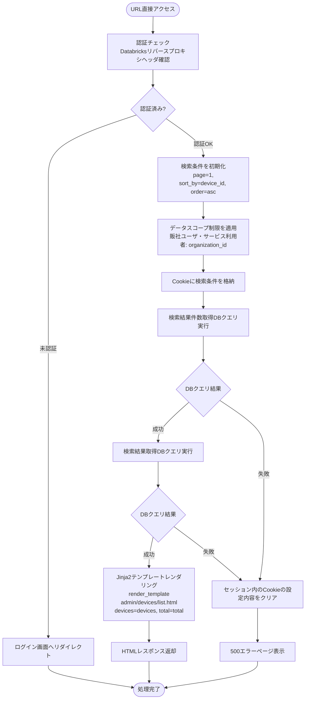
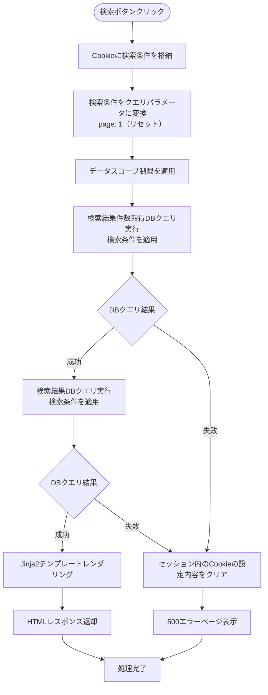
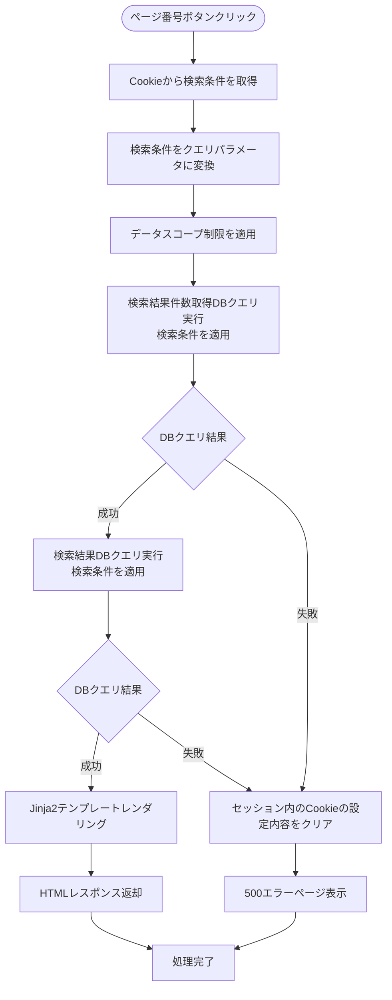
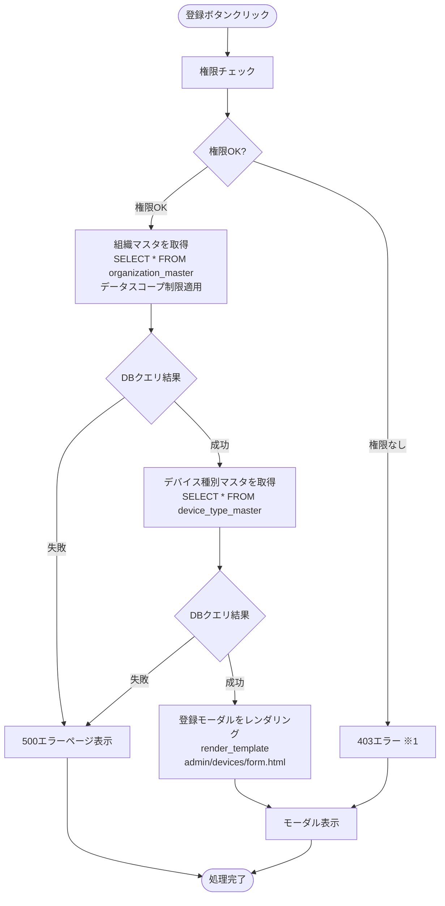
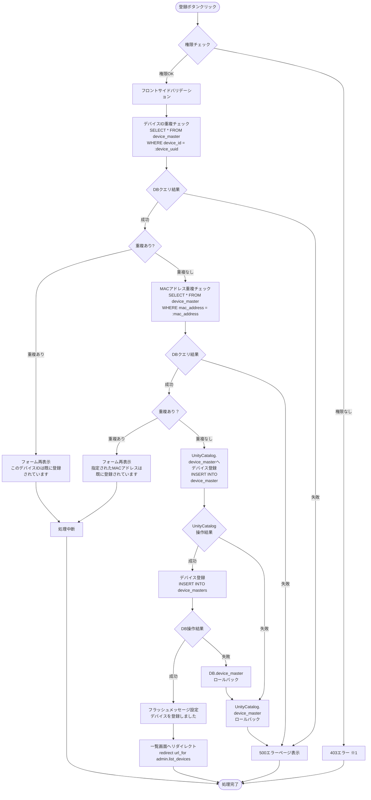
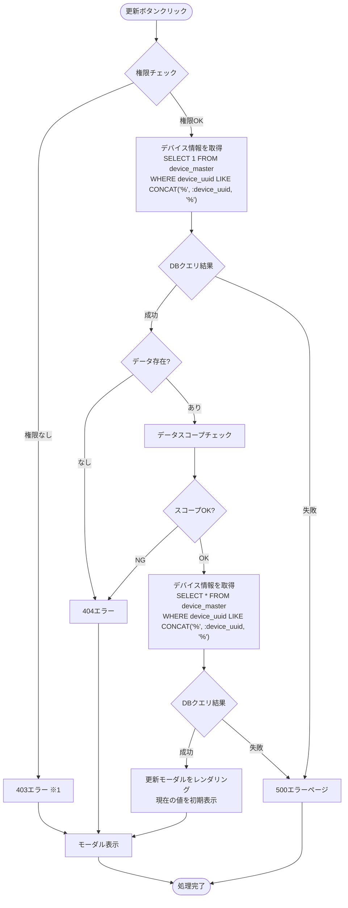
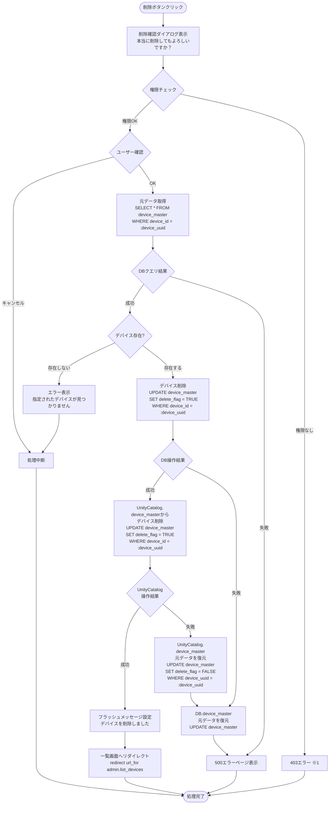

# デバイス管理 - ワークフロー仕様書

## 📑 目次

- [概要](#概要)
- [使用するFlaskルート一覧](#使用するflaskルート一覧)
- [ルート呼び出しマッピング](#ルート呼び出しマッピング)
- [ワークフロー一覧](#ワークフロー一覧)
  - [初期表示](#初期表示)
  - [検索・絞り込み](#検索絞り込み)
  - [全体ソート](#全体ソート)
  - [ページ内ソート](#ページ内ソート)
  - [ページング](#ページング)
  - [デバイス登録](#デバイス登録)
  - [デバイス更新](#デバイス更新)
  - [デバイス参照](#デバイス参照)
  - [デバイス削除](#デバイス削除)
  - [CSVエクスポート](#csvエクスポート)
- [使用データベース詳細](#使用データベース詳細)
- [トランザクション管理](#トランザクション管理)
- [セキュリティ実装](#セキュリティ実装)
- [関連ドキュメント](#関連ドキュメント)

---

## 概要

このドキュメントは、デバイス管理画面のユーザー操作に対する処理フロー、バリデーション実行タイミング、データベース処理の詳細を記載します。

**このドキュメントの役割:**
- ✅ ユーザー操作のトリガー条件
- ✅ 処理フローの詳細（Flaskルート呼び出しシーケンス、フォーム送信、リダイレクト）
- ✅ バリデーション実行タイミング（いつチェックするか）
- ✅ エラーハンドリングフロー
- ✅ サーバーサイド処理詳細（SQL、変数、条件分岐、コード例）
- ✅ データベース利用詳細（トランザクション管理、テーブル操作、インデックス）
- ✅ セキュリティ実装詳細（認証、入力検証、ログ出力）

**UI仕様書との役割分担:**
- **UI仕様書**: バリデーションルール定義（何をチェックするか）、UI要素の詳細仕様
- **ワークフロー仕様書**: バリデーション実行タイミング（いつどのようにチェックするか）、処理フロー、サーバーサイド実装詳細

**注:** UI要素の詳細やバリデーションルールは [UI仕様書](./ui-specification.md) を参照してください。

---

## 使用するFlaskルート一覧

この画面で使用するすべてのFlaskルート（エンドポイント）を記載します。

| No  | ルート名         | エンドポイント                      | メソッド | 用途                        | レスポンス形式     | 備考                                             |
| --- | ---------------- | ----------------------------------- | -------- | --------------------------- | ------------------ | ------------------------------------------------ |
| 1   | デバイス一覧表示 | `/admin/devices`                    | GET      | デバイス一覧初期表示        | HTML               | デバイス一覧の初期表示                           |
| 2   | デバイス一覧表示 | `/admin/devices`                    | POST      | デバイス一覧検索結果表示    | HTML               | デバイス一覧の検索、ページング対応               |
| 3   | デバイス登録画面 | `/admin/devices/create`             | GET      | デバイス登録フォーム表示    | HTML（モーダル）   | 組織選択肢を含む                                 |
| 4   | デバイス登録実行 | `/admin/devices/register`             | POST     | デバイス登録処理            | リダイレクト (302) | 成功時: `/admin/devices`、失敗時: フォーム再表示 |
| 5   | デバイス参照画面 | `/admin/devices/<device_id>`        | GET      | デバイス詳細情報表示        | HTML（モーダル）   | -                                                |
| 6   | デバイス更新画面 | `/admin/devices/<device_id>/edit`   | GET      | デバイス更新フォーム表示    | HTML（モーダル）   | 現在の値を初期表示                               |
| 7   | デバイス更新実行 | `/admin/devices/<device_id>/update` | POST     | デバイス更新処理            | リダイレクト (302) | 成功時: `/admin/devices`                         |
| 8   | デバイス削除実行 | `/admin/devices/<device_id>/delete` | POST     | デバイス削除処理            | リダイレクト (302) | 成功時: `/admin/devices`                         |
| 9   | CSVエクスポート  | `/admin/devices?export=csv`         | POST      | デバイス一覧CSVダウンロード | CSV                | 現在の検索条件を適用                             |

**注:**
- **レスポンス形式**:
  - `HTML`: Jinja2テンプレートをレンダリングして返す（`render_template()`）
  - `リダイレクト (302)`: 成功時に別のルートへリダイレクト（`redirect(url_for())`）、失敗時はフォームを再表示
  - `CSV`: CSVファイルをダウンロードレスポンスとして返す
- **Flask Blueprint構成**: `admin_bp` として実装

---

## ルート呼び出しマッピング

| ユーザー操作     | トリガー        | 呼び出すルート                           | パラメータ                                                                                                                  | レスポンス                          | エラー時の挙動                         |
| ---------------- | --------------- | ---------------------------------------- | --------------------------------------------------------------------------------------------------------------------------- | ----------------------------------- | -------------------------------------- |
| 画面初期表示     | URL直接アクセス | `GET /admin/devices`                     | `page=1`                                                                                                                    | HTML（デバイス一覧画面）            | エラーページ表示                       |
| 検索ボタン押下   | フォーム送信    | `POST /admin/devices`                     | `device_id, device_name, device_type, location, organization_id, certificate_expiration_date, status, sort_by, order, page` | HTML（検索結果画面）                | エラーメッセージ表示                   |
| ページボタン押下 | フォーム送信    | `GET /admin/devices`                     | `page`                                                                                                                      | HTML（検索結果画面）                | エラーメッセージ表示                   |
| 登録ボタン押下   | ボタンクリック  | `GET /admin/devices/create`              | なし                                                                                                                        | HTML（登録モーダル）                | エラーページ表示                       |
| 登録実行         | フォーム送信    | `POST /admin/devices/register`             | フォームデータ                                                                                                              | リダイレクト → `GET /admin/devices` | フォーム再表示（エラーメッセージ付き） |
| 参照ボタン押下   | ボタンクリック  | `GET /admin/devices/<device_id>`         | device_id                                                                                                                   | HTML（参照モーダル）                | 404エラーページ                        |
| 更新ボタン押下   | ボタンクリック  | `GET /admin/devices/<device_id>/edit`    | device_id                                                                                                                   | HTML（更新モーダル）                | 404エラーページ                        |
| 更新実行         | フォーム送信    | `POST /admin/devices/update` | フォームデータ                                                                                                              | リダイレクト → `GET /admin/devices` | フォーム再表示（エラーメッセージ付き） |
| 削除実行         | フォーム送信    | `POST /admin/devices/delete` | device_id                                                                                                                   | リダイレクト → `GET /admin/devices` | エラーメッセージ表示                   |
| CSVエクスポート  | ボタンクリック  | `POST /admin/devices?export=csv`          | 検索条件                                                                                                                    | CSVダウンロード                     | エラーメッセージ表示                   |

---

## ワークフロー一覧

### 初期表示

**トリガー:** URL直接アクセス時（ユーザーが画面にアクセスしたとき）

**前提条件:**
- ユーザーがログイン済み（Databricks認証完了）
- 適切な権限を持っている

#### 処理フロー



#### Flaskルート

| ルート           | エンドポイント       | 詳細                                                                                                                                                            |
| ---------------- | -------------------- | --------------------------------------------------------------------------------------------------------------------------------------------------------------- |
| デバイス一覧表示 | `GET /admin/devices` | クエリパラメータ: `page`, `device_id`, `device_name`, `device_type`, `location`, `organization_id`, `certificate_expiration_date`, `status`, `sort_by`, `order` |

#### バリデーション

**実行タイミング:** なし（初期表示のため、デフォルト値を使用）

**データスコープ制限:**
- システム保守者・管理者: 全データにアクセス可能
- 販社ユーザ・サービス利用者: ログインユーザーの `organization_id` でフィルタリング

#### 処理詳細（サーバーサイド）

**① 認証・認可チェック**

リバースプロキシヘッダから認証情報を取得し、権限を確認します。

**処理内容:**
- ヘッダ `X-Forwarded-User` からユーザーIDを取得
- データベースから現在ユーザー情報を取得（ロール、組織ID）
- ロールに応じてデータスコープを決定

**変数・パラメータ:**
- `current_user_id`: string - リバースプロキシヘッダから取得したユーザーID
- `current_user`: User - データベースから取得したユーザーオブジェクト
- `role`: string - ユーザーのロール
- `organization_id`: string - データスコープ制限用の組織ID

**実装例:**
```python
from flask import request, abort
from functools import wraps

def get_current_user():
    """リバースプロキシヘッダからユーザー情報取得"""
    user_id = request.headers.get('X-Forwarded-User')
    if not user_id:
        abort(401)

    user = User.query.filter_by(user_id=user_id, delete_flag=0).first()
    if not user:
        abort(403)

    return user

def require_permission(permission):
    """権限チェックデコレーター"""
    def decorator(f):
        @wraps(f)
        def decorated_function(*args, **kwargs):
            current_user = get_current_user()
            if not has_permission(current_user, permission):
                abort(403)
            return f(*args, **kwargs)
        return decorated_function
    return decorator

current_user = get_current_user()
```

**② クエリパラメータ取得**

```python
page = request.args.get('page', 1, type=int)
per_page = ITEM_PER_PAGE  # 設定ファイルから取得
```

**③ データスコープ制限の適用**

ロールに応じてWHERE句の条件を追加します。

**実装例:**
```python

# DBクエリで組織のフィルタを活性化するフラグ
organization_limit_active = True

"""ロールに応じたデータスコープを適用"""
if current_user.role != '販社ユーザ' and current_user.role != 'サービス利用者':
    organization_limit_active = False
```

**④ データベースクエリ実行**

デバイスマスタからデータを取得します。

**使用テーブル:** device_master（デバイスマスタ）、organization_master（組織マスタ）, device_status_data (デバイスステータス)

**SQL実装例:**
- 検索結果件数取得DBクエリ
```sql
SELECT
  COUNT(d.device_id) AS data_count
FROM
  device_master d
  LEFT JOIN organization_master o ON d.organization_id = o.organization_id
  INNER JOIN device_status_data s ON d.device_id = s.device_id
WHERE
  d.delete_flag = 0
  AND CASE WHEN :organization_limit_active THEN d.organization_id = :organization_id ELSE TRUE END
```

- 検索結果取得DBクエリ
```sql
SELECT
  d.device_id,
  d.device_name,
  t.device_type_name,
  d.model_info,
  d.sim_id,
  d.mac_address,
  d.device_location,
  d.organization_id,
  d.certificate_expiration_date,
  s.status,
  o.organization_name
FROM
  device_master d
  LEFT JOIN organization_master o ON d.organization_id = o.organization_id
  INNER JOIN device_status_data s ON d.device_id = s.device_id
  INNER JOIN device_type_master t ON d.device_type_id = t.device_type_id
WHERE
  d.delete_flag = 0
  AND CASE WHEN :organization_limit_active THEN d.organization_id = :organization_id ELSE TRUE END
ORDER BY
  d.device_id ASC
LIMIT :item_per_page OFFSET 0
```

**⑤ HTMLレンダリング**

Jinja2テンプレートをレンダリングしてHTMLレスポンスを返却します。

**実装例:**
```python
@admin_bp.route('/devices', methods=['GET'])
@require_permission('device_list')
def list_devices():

    # ユーザ情報取得
    current_user = get_current_user()

    # DBクエリで組織のフィルタを活性化するフラグ
    organization_limit_active = True

    """ロールに応じたデータスコープを適用"""
    if current_user.role != '販社ユーザ' and current_user.role != 'サービス利用者':
        organization_limit_active = False

    # パラメータ抽出
    page = request.args.get('page', 1, type=int)
    per_page = ITEM_PER_PAGE #  設定ファイル内で定義する

    # 検索結果件数取得DBクエリ実行
    data_count = ... # 検索結果件数取得DBクエリ実行処理を記載

    # 結果で返却される配列
    devices = []

    # パラメータをセッターに登録
    params = Params(per_page, data_count, organization_limit_active, current_user.organization_id)

    # パラメータ格納
    param = {
        'item_per_page': params.per_page,
        'total_count': params.data_count,
        'organization_limit_active': params.organization_limit_active,
        'organization_id': params.organization_id,
        } 

    # 検索結果取得DBクエリ実行
    query = ... # 検索結果取得DBクエリ実行処理を記載

    # 返却する配列に検索結果を格納
    for row in query:
        devices.append(row)

    # 返却
    return render_template('admin/devices/list.html',
                          devices=devices,
                          total=data_count,
                          page=page,
                          per_page=per_page)
```

#### 表示メッセージ

| メッセージID | 表示内容                   | 表示タイミング | 表示場所     |
| ------------ | -------------------------- | -------------- | ------------ |
| ERR_001      | データの取得に失敗しました | DBクエリ失敗時 | エラーページ |

#### エラーハンドリング

| HTTPステータス | エラー種別         | 処理内容                   | 表示内容                   |
| -------------- | ------------------ | -------------------------- | -------------------------- |
| 401            | 認証エラー         | ログイン画面へリダイレクト | -                          |
| 500            | データベースエラー | 500エラーページ表示        | データの取得に失敗しました |

#### ログ出力タイミング
DBクエリ実行の直前、直後に操作ログを出力する

#### 検索条件の保持方法
Cookieに検索条件を保持する

#### UI状態

- 検索条件: デフォルト値
  - デバイスID：空
  - デバイス名：空
  - デバイス種別：すべて
  - 設置場所：空
  - 所属組織：すべて
  - 証明書期限：空
  - ステータス：すべて
  - ソート項目：空
  - ソート順：空
- テーブル: デバイス一覧データ表示
- ページネーション: 1ページ目を選択状態

---

### 検索・絞り込み

**トリガー:** (2.10) 検索ボタンクリック（フォーム送信）

**前提条件:**
- 検索条件が入力されている（空でも可）

#### 処理フロー



#### 処理詳細（サーバーサイド）

**検索DBクエリ実装例:**
- 検索結果件数取得DBクエリ
```sql
SELECT
  COUNT(d.device_id) AS data_count
FROM
  device_master d
  LEFT JOIN organization_master o ON d.organization_id = o.organization_id
  INNER JOIN device_status_data s ON d.device_id = s.device_id
WHERE
  d.delete_flag = 0
  AND CASE WHEN :device_uuid IS NULL THEN TRUE ELSE d.device_id LIKE CONCAT('%', :device_uuid, '%') END
  AND CASE WHEN :device_name IS NULL THEN TRUE ELSE d.device_name LIKE CONCAT('%', :device_name, '%') END
  AND CASE WHEN :device_category_id < 0 THEN TRUE ELSE d.device_type_id = :device_category_id END
  AND CASE WHEN :location IS NULL THEN TRUE ELSE d.device_location LIKE CONCAT('%', :location, '%') END
  AND CASE WHEN :certificate_expiration_date IS NULL THEN TRUE ELSE d.certificate_expiration_date = :certificate_expiration_date END
  AND CASE WHEN :status < 0 THEN TRUE ELSE s.status = :status END
  AND CASE WHEN :organization_limit_active THEN d.organization_id = :organization_id ELSE TRUE END
```

- 検索結果取得DBクエリ
```sql
SELECT
  d.device_id,
  d.device_name,
  t.device_type_name,
  d.model_info,
  d.sim_id,
  d.mac_address,
  d.device_location,
  d.organization_id,
  d.certificate_expiration_date,
  s.status,
  o.organization_name
FROM
  device_master d
  LEFT JOIN organization_master o ON d.organization_id = o.organization_id
  INNER JOIN device_status_data s ON d.device_id = s.device_id
  INNER JOIN device_type_master t ON d.device_type_id = t.device_type_id
WHERE
  d.delete_flag = 0
  AND CASE WHEN :device_uuid IS NULL THEN TRUE ELSE d.device_id LIKE CONCAT('%', :device_uuid, '%') END
  AND CASE WHEN :device_name IS NULL THEN TRUE ELSE d.device_name LIKE CONCAT('%', :device_name, '%') END
  AND CASE WHEN :device_category_id < 0 THEN TRUE ELSE d.device_type_id = :device_category_id END
  AND CASE WHEN :location IS NULL THEN TRUE ELSE d.device_location LIKE CONCAT('%', :location, '%') END
  AND CASE WHEN :certificate_expiration_date IS NULL THEN TRUE ELSE d.certificate_expiration_date = :certificate_expiration_date END
  AND CASE WHEN :status < 0 THEN TRUE ELSE s.status = :status END
  AND CASE WHEN :organization_limit_active THEN d.organization_id = :organization_id ELSE TRUE END
ORDER BY
  CASE WHEN (:sort_item_id = 1 AND :sort_order = 1) THEN d.device_id END ASC
  , CASE WHEN (:sort_item_id = 1 AND :sort_order = 2) THEN d.device_id END DESC
LIMIT :item_per_page OFFSET (:page -1) * :item_per_page
```
#### ログ出力タイミング
DBクエリ実行の直前、直後に操作ログを出力する

#### 検索条件の保持方法
Cookieに検索条件を保持する

---

### 全体ソート

**トリガー:** (2) 検索条件欄でソート項目、ソート順ドロップダウンで具体値を選択し、検索を実行

#### 処理詳細
検索条件欄のソート項目ドロップダウンで選択した内容に対して、ソート順ドロップダウンで選択した順序でページをまたいだソートを行う。
詳細は[共通仕様書](../../common/common-specification.md)参照のこと。

---

### ページ内ソート

**トリガー:**（6）データテーブルのソート可能カラム（デバイスID、デバイス名、デバイス種別、設置場所、所属組織、証明書期限、ステータス）のヘッダをクリック

#### 処理詳細
データテーブルのヘッダをクリックすることで、ページ内で閉じたソートを行う。
詳細は[共通仕様書](../../common/common-specification.md)参照のこと

---

### ページング

**トリガー:** (6.10) ページネーションのページ番号ボタンクリック

#### 処理フロー



#### 処理詳細
ページネーションのページ番号を選択することで、選択されたページ番号に対応するデータをデータテーブルに表示する。
具体的な処理は[検索・絞り込み](#検索絞り込み)の処理と同様とする。

---

### デバイス登録

#### 登録ボタン押下

**トリガー:** (3.1) 登録ボタンクリック

**前提条件:**
- ユーザーが登録権限を持っている（システム保守者、管理者、販社ユーザ）

##### 処理フロー



※1　403エラー発生時、ドロップダウン、テキストボックスに具体的なデータは表示せず、空で表示する。

#### 登録実行

**トリガー:** (7.11) 登録ボタン（モーダル内）クリック後に表示される登録実施確認モーダルで「はい」を選択

##### 処理フロー



※1　403エラー発生時、ドロップダウン、テキストボックスに具体的なデータは表示せず、空で表示する。

##### 処理詳細（サーバーサイド）

**実装例:**
```python
@admin_bp.route('/devices/create', methods=['GET', 'POST'])
# MySQL接続設定
DB_CONFIG = {
    'host': os.getenv('MYSQL_HOST', 'localhost'),
    'port': int(os.getenv('MYSQL_PORT', 3306)),
    'user': os.getenv('MYSQL_USER', 'user'),
    'password': os.getenv('MYSQL_PASSWORD', 'password'),
    'database': os.getenv('MYSQL_DATABASE', 'iot_platform')
}

# Databricks接続設定
DATABRICKS_CONFIG = {
    'server_hostname': os.getenv('DATABRICKS_SERVER_HOSTNAME'),
    'http_path': os.getenv('DATABRICKS_HTTP_PATH'),
    'access_token': os.getenv('DATABRICKS_TOKEN')
}

def get_mysql_connection():
    """MySQL接続取得"""
    return mysql.connector.connect(**DB_CONFIG)

def get_databricks_connection():
    """Databricks SQL Warehouse接続取得"""
    return databricks_sql.connect(**DATABRICKS_CONFIG)

@admin_bp.route('/devices/register', methods=['GET', 'POST'])
def register_device():
    """デバイス登録"""
    import time

    SERVICE_NAME = register_device
    current_timestamp = time.time()
    logger.info(f'{current_timestamp} : {SERVICE_NAME} START')

    if request.method == 'GET':
        return render_template('register_device.html')
    
    # フロントサイドバリデーション後のデータ取得
    device_id = request.form.get('device_id')
    device_name = request.form.get('device_name')
    mac_address = request.form.get('mac_address')
    organization_id = request.form.get('organization_id')
    device_type = request.form.get('device_type')
    location = request.form.get('location')
    certificate_expiry = request.form.get('certificate_expiry')
    status = request.form.get('status', 'inactive')
    
    mysql_conn = None
    databricks_conn = None
    
    try:
        # MySQL接続
        mysql_conn = get_mysql_connection()
        mysql_cursor = mysql_conn.cursor(dictionary=True)
        
        # デバイスID重複チェック
        mysql_cursor.execute(
            "SELECT * FROM device_master WHERE device_id = %s",
            (device_id,)
        )
        if mysql_cursor.fetchone():
            flash('このデバイスIDは既に登録されています', 'error')
            return render_template('register_device.html', form_data=request.form)
        
        # MACアドレス重複チェック
        mysql_cursor.execute(
            "SELECT * FROM device_master WHERE mac_address = %s",
            (mac_address,)
        )
        if mysql_cursor.fetchone():
            flash('指定されたMACアドレスは既に登録されています', 'error')
            return render_template('register_device.html', form_data=request.form)
        
        # MySQLへデバイス登録
        insert_query = """
            INSERT INTO device_master 
            (device_id, device_name, mac_address, organization_id, device_type, 
             location, certificate_expiry, status, created_at, updated_at)
            VALUES (%s, %s, %s, %s, %s, %s, %s, %s, NOW(), NOW())
        """
        mysql_cursor.execute(insert_query, (
            device_id, device_name, mac_address, organization_id, device_type,
            location, certificate_expiry, status
        ))
        mysql_conn.commit()
        logger.info(f"MySQL insert successful: {device_id}")
        
        # Unity Catalogへデバイス登録
        databricks_conn = get_databricks_connection()
        databricks_cursor = databricks_conn.cursor()
        
        uc_insert_query = """
            INSERT INTO iot_platform.master_data.device_master 
            (device_id, device_name, mac_address, organization_id, device_type,
             location, certificate_expiry, status, created_at, updated_at)
            VALUES (?, ?, ?, ?, ?, ?, ?, ?, current_timestamp(), current_timestamp())
        """
        databricks_cursor.execute(uc_insert_query, (
            device_id, device_name, mac_address, organization_id, device_type,
            location, certificate_expiry, status
        ))
        databricks_cursor.close()
        logger.info(f"Unity Catalog insert successful: {device_id}")
        
        # 成功時
        flash('デバイスを登録しました', 'success')
        return redirect(url_for('list_devices'))
        
    except Error as mysql_error:
        # MySQL エラー時
        logger.error(f"MySQL error: {mysql_error}")
        if mysql_conn:
            mysql_conn.rollback()
        flash('データベースエラーが発生しました', 'error')
        return render_template('error.html', error_message=str(mysql_error)), 500
        
    except Exception as uc_error:
        # Unity Catalog エラー時
        logger.error(f"Unity Catalog error: {uc_error}")
        
        # Unity Catalog ロールバック（削除）
        try:
            if databricks_conn:
                rollback_cursor = databricks_conn.cursor()
                rollback_cursor.execute(
                    "DELETE FROM iot_platform.master_data.device_master WHERE device_id = ?",
                    (device_id,)
                )
                rollback_cursor.close()
                logger.info(f"Unity Catalog rollback successful: {device_id}")
        except Exception as rollback_error:
            logger.error(f"Unity Catalog rollback error: {rollback_error}")
        
        # MySQL ロールバック
        if mysql_conn:
            mysql_conn.rollback()
            logger.info(f"MySQL rollback successful: {device_id}")
        
        flash('データ同期エラーが発生しました', 'error')
        return render_template('error.html', error_message=str(uc_error)), 500
        
    finally:
        if mysql_cursor:
            mysql_cursor.close()
        if mysql_conn:
            mysql_conn.close()
        if databricks_conn:
            databricks_conn.close()
```

##### バリデーション

**実行タイミング:** 登録ボタンクリック直後（サーバーサイド）

**バリデーションルール:** [UI仕様書](./ui-specification.md) の要素詳細 (7) デバイス登録/更新モーダル > バリデーション を参照

##### 表示メッセージ

| メッセージID | 表示内容                              | 表示タイミング | 表示場所                               |
| ------------ | ------------------------------------- | -------------- | -------------------------------------- |
| SUC_001      | デバイスを登録しました                | 登録成功時     | ステータスメッセージモーダル（成功）   |
| ERR_002      | デバイスの登録に失敗しました          | DB操作失敗時   | ステータスメッセージモーダル（エラー） |
| ERR_003      | このデバイスIDは既に登録されています  | 重複エラー     | ステータスメッセージモーダル（エラー） |
| ERR_004      | このMACアドレスは既に登録されています | 重複エラー     | ステータスメッセージモーダル（エラー） |

#### ログ出力タイミング
DBクエリ実行の直前、直後に操作ログを出力する

---

### デバイス更新

#### 更新画面表示

**トリガー:** (6.9) 更新ボタンクリック

##### 処理フロー



※1　403エラー発生時、ドロップダウン、テキストボックスに具体的なデータは表示せず、空で表示する。

#### 更新実行

**トリガー:** (7.11) 更新ボタン（モーダル内）クリック後に表示される更新実行確認モーダルで「はい」を選択

##### 処理詳細（サーバーサイド）

**実装例:**
```python
# MySQL接続設定
DB_CONFIG = {
    'host': os.getenv('MYSQL_HOST', 'localhost'),
    'port': int(os.getenv('MYSQL_PORT', 3306)),
    'user': os.getenv('MYSQL_USER', 'user'),
    'password': os.getenv('MYSQL_PASSWORD', 'password'),
    'database': os.getenv('MYSQL_DATABASE', 'iot_platform')
}

# Databricks接続設定
DATABRICKS_CONFIG = {
    'server_hostname': os.getenv('DATABRICKS_SERVER_HOSTNAME'),
    'http_path': os.getenv('DATABRICKS_HTTP_PATH'),
    'access_token': os.getenv('DATABRICKS_TOKEN')
}

def get_mysql_connection():
    """MySQL接続取得"""
    return mysql.connector.connect(**DB_CONFIG)

def get_databricks_connection():
    """Databricks SQL Warehouse接続取得"""
    return databricks_sql.connect(**DATABRICKS_CONFIG)

@admin_bp.route('/devices/<device_id>/update', methods=['GET', 'POST'])
def update_device(device_id):
    """デバイス更新"""
    
    if request.method == 'GET':
        # 既存データ取得
        try:
            conn = get_mysql_connection()
            cursor = conn.cursor(dictionary=True)
            cursor.execute(
                "SELECT * FROM device_master WHERE device_id = %s",
                (device_id,)
            )
            device = cursor.fetchone()
            cursor.close()
            conn.close()
            
            if not device:
                flash('指定されたデバイスが見つかりません', 'error')
                return redirect(url_for('list_devices'))
            
            return render_template('update_device.html', device=device)
            
        except Error as e:
            logger.error(f"Error: {e}")
            flash('デバイスの更新に失敗しました', 'error')
            return redirect(url_for('list_devices'))
    
    # POST処理
    original_device_id = device_id
    new_device_id = request.form.get('device_id')
    device_name = request.form.get('device_name')
    mac_address = request.form.get('mac_address')
    organization_id = request.form.get('organization_id')
    device_type = request.form.get('device_type')
    location = request.form.get('location')
    certificate_expiry = request.form.get('certificate_expiry')
    status = request.form.get('status', 'inactive')
    
    mysql_conn = None
    databricks_conn = None
    mysql_original_data = None
    uc_original_data = None
    
    try:
        # MySQL接続
        mysql_conn = get_mysql_connection()
        mysql_cursor = mysql_conn.cursor(dictionary=True)
        
        # 既存データを取得（ロールバック用）
        mysql_cursor.execute(
            "SELECT * FROM device_master WHERE device_id = %s",
            (original_device_id,)
        )
        mysql_original_data = mysql_cursor.fetchone()
        
        if not mysql_original_data:
            flash('指定されたデバイスが見つかりません', 'error')
            return redirect(url_for('list_devices'))
        
        # MACアドレス重複チェック（自分自身以外）
        mysql_cursor.execute(
            "SELECT * FROM device_master WHERE mac_address = %s AND device_id != %s",
            (mac_address, original_device_id)
        )
        if mysql_cursor.fetchone():
            flash('指定されたMACアドレスは既に登録されています', 'error')
            return render_template('update_device.html', device=request.form)
        
        # MySQLでデバイス更新
        update_query = """
            UPDATE device_master 
            SET device_name = %s, mac_address = %s, organization_id = %s, 
                device_type = %s, location = %s, certificate_expiry = %s, 
                status = %s, updated_at = NOW()
            WHERE device_id = %s
        """
        mysql_cursor.execute(update_query, (
            device_name, mac_address, organization_id, device_type,
            location, certificate_expiry, status, original_device_id
        ))
        
        mysql_conn.commit()
        logger.info(f"MySQL update successful: {original_device_id} -> {new_device_id}")
        
        # Unity Catalogでデバイス更新
        databricks_conn = get_databricks_connection()
        databricks_cursor = databricks_conn.cursor()
        
        # Unity Catalogの既存データを取得（ロールバック用）
        databricks_cursor.execute(
            "SELECT * FROM iot_platform.master_data.device_master WHERE device_id = ?",
            (original_device_id,)
        )
        uc_original_data = databricks_cursor.fetchone()
        
        uc_merge_query = """
            MERGE INTO iot_platform.master_data.device_master AS target
            USING (
                SELECT ? as device_id, ? as device_name, ? as mac_address,
                        ? as organization_id, ? as device_type, ? as location,
                        ? as certificate_expiry, ? as status
            ) AS source
            ON target.device_id = source.device_id
            WHEN MATCHED THEN UPDATE SET
                device_name = source.device_name,
                mac_address = source.mac_address,
                organization_id = source.organization_id,
                device_type = source.device_type,
                location = source.location,
                certificate_expiry = source.certificate_expiry,
                status = source.status,
                updated_at = current_timestamp()
        """
        databricks_cursor.execute(uc_merge_query, (
            new_device_id, device_name, mac_address, organization_id, device_type,
            location, certificate_expiry, status
        ))
        
        databricks_cursor.close()
        logger.info(f"Unity Catalog update successful: {original_device_id} -> {new_device_id}")
        
        # 成功時
        flash('デバイスを更新しました', 'success')
        return redirect(url_for('list_devices'))
        
    except Error as mysql_error:
        # MySQL エラー時
        logger.error(f"MySQL error: {mysql_error}")
        if mysql_conn:
            mysql_conn.rollback()
        flash('デバイスの更新に失敗しました', 'error')
        return render_template('error.html', error_message=str(mysql_error)), 500
        
    except Exception as uc_error:
        # Unity Catalog エラー時
        logger.error(f"Unity Catalog error: {uc_error}")
        
        # Unity Catalog ロールバック
        try:
            if databricks_conn and uc_original_data:
                rollback_cursor = databricks_conn.cursor()
                
                # 新規データを削除
                if new_device_id != original_device_id:
                    rollback_cursor.execute(
                        "DELETE FROM iot_platform.master_data.device_master WHERE device_id = ?",
                        (new_device_id,)
                    )
                
                # 元のデータを復元
                restore_query = """
                    MERGE INTO iot_platform.master_data.device_master AS target
                    USING (
                        SELECT ? as device_id, ? as device_name, ? as mac_address,
                               ? as organization_id, ? as device_type, ? as location,
                               ? as certificate_expiry, ? as status, ? as created_at, ? as updated_at
                    ) AS source
                    ON target.device_id = source.device_id
                    WHEN MATCHED THEN UPDATE SET *
                    WHEN NOT MATCHED THEN INSERT *
                """
                rollback_cursor.execute(restore_query, (
                    uc_original_data[0], uc_original_data[1], uc_original_data[2],
                    uc_original_data[3], uc_original_data[4], uc_original_data[5],
                    uc_original_data[6], uc_original_data[7], uc_original_data[8],
                    uc_original_data[9]
                ))
                rollback_cursor.close()
                logger.info(f"Unity Catalog rollback successful: {original_device_id}")
        except Exception as rollback_error:
            logger.error(f"Unity Catalog rollback error: {rollback_error}")
        
        # MySQL ロールバック
        if mysql_conn and mysql_original_data:
            try:
                rollback_cursor = mysql_conn.cursor()
                
                # 新規データを削除
                if new_device_id != original_device_id:
                    rollback_cursor.execute(
                        "DELETE FROM device_master WHERE device_id = %s",
                        (new_device_id,)
                    )
                
                # 元のデータを復元
                restore_query = """
                    INSERT INTO device_master 
                    (device_id, device_name, mac_address, organization_id, device_type,
                     location, certificate_expiry, status, created_at, updated_at)
                    VALUES (%s, %s, %s, %s, %s, %s, %s, %s, %s, %s)
                    ON DUPLICATE KEY UPDATE
                        device_name = VALUES(device_name),
                        mac_address = VALUES(mac_address),
                        organization_id = VALUES(organization_id),
                        device_type = VALUES(device_type),
                        location = VALUES(location),
                        certificate_expiry = VALUES(certificate_expiry),
                        status = VALUES(status),
                        updated_at = VALUES(updated_at)
                """
                rollback_cursor.execute(restore_query, (
                    mysql_original_data['device_id'],
                    mysql_original_data['device_name'],
                    mysql_original_data['mac_address'],
                    mysql_original_data['organization_id'],
                    mysql_original_data['device_type'],
                    mysql_original_data['location'],
                    mysql_original_data['certificate_expiry'],
                    mysql_original_data['status'],
                    mysql_original_data['created_at'],
                    mysql_original_data['updated_at']
                ))
                mysql_conn.commit()
                rollback_cursor.close()
                logger.info(f"MySQL rollback successful: {original_device_id}")
            except Exception as mysql_rollback_error:
                logger.error(f"MySQL rollback error: {mysql_rollback_error}")
                mysql_conn.rollback()
        
        flash('デバイスの更新に失敗しました', 'error')
        return render_template('error.html', error_message=str(uc_error)), 500
        
    finally:
        if mysql_cursor:
            mysql_cursor.close()
        if mysql_conn:
            mysql_conn.close()
        if databricks_conn:
            databricks_conn.close()
```

##### 表示メッセージ

| メッセージID | 表示内容                              | 表示タイミング | 表示場所                               |
| ------------ | ------------------------------------- | -------------- | -------------------------------------- |
| SUC_002      | デバイスを更新しました                | 更新成功時     | ステータスメッセージモーダル（成功）   |
| ERR_005      | デバイスの更新に失敗しました          | DB操作失敗時   | ステータスメッセージモーダル（エラー） |
| ERR_006      | このMACアドレスは既に登録されています | 重複チェック時 | ステータスメッセージモーダル（エラー） |
| ERR_007      | 指定されたデバイスが見つかりません    | 存在チェック時 | ステータスメッセージモーダル（エラー） |

#### ログ出力タイミング
DBクエリ実行の直前、直後に操作ログを出力する


---

### デバイス参照

**トリガー:** (6.9) 参照ボタンクリック

##### 処理詳細（サーバーサイド）

**実装例:**
```python
@admin_bp.route('/devices/<device_id>', methods=['GET'])
@require_permission('device_read')
def view_device(device_id):
    current_user = get_current_user()

    device = device_master.query.filter_by(device_id=device_id, delete_flag=False).first()
    if not device:
        abort(404)

    # データスコープチェック
    if not check_device_scope(device, current_user):
        abort(404)

    return render_template('admin/devices/detail.html', device=device)
```
#### ログ出力タイミング
DBクエリ実行の直前、直後に操作ログを出力する

---

### デバイス削除

**トリガー:** (3.2) 削除ボタンクリック → (9) 削除確認モーダル → 削除するボタンクリック

##### 処理フロー



※1　403エラー発生時、ドロップダウン、テキストボックスに具体的なデータは表示せず、空で表示する。

##### 処理詳細（サーバーサイド）

**実装例:**
```python
# MySQL接続設定
DB_CONFIG = {
    'host': os.getenv('MYSQL_HOST', 'localhost'),
    'port': int(os.getenv('MYSQL_PORT', 3306)),
    'user': os.getenv('MYSQL_USER', 'user'),
    'password': os.getenv('MYSQL_PASSWORD', 'password'),
    'database': os.getenv('MYSQL_DATABASE', 'iot_platform')
}

# Databricks接続設定
DATABRICKS_CONFIG = {
    'server_hostname': os.getenv('DATABRICKS_SERVER_HOSTNAME'),
    'http_path': os.getenv('DATABRICKS_HTTP_PATH'),
    'access_token': os.getenv('DATABRICKS_TOKEN')
}

def get_mysql_connection():
    """MySQL接続取得"""
    return mysql.connector.connect(**DB_CONFIG)

def get_databricks_connection():
    """Databricks SQL Warehouse接続取得"""
    return databricks_sql.connect(**DATABRICKS_CONFIG)

@admin_bp.route('/devices/<device_id>/delete', methods=['POST'])
def delete_device(device_id):
    """デバイス削除"""
    
    mysql_conn = None
    databricks_conn = None
    mysql_original_data = None
    
    try:
        # MySQL接続
        mysql_conn = get_mysql_connection()
        mysql_cursor = mysql_conn.cursor(dictionary=True)
        
        # 既存データを取得（ロールバック用）
        mysql_cursor.execute(
            "SELECT * FROM device_master WHERE device_id = %s",
            (device_id,)
        )
        mysql_original_data = mysql_cursor.fetchone()
        
        if not mysql_original_data:
            flash('指定されたデバイスが見つかりません', 'error')
            return redirect(url_for('list_devices'))
        
        # MySQLからデバイス削除
        mysql_cursor.execute(
            "DELETE FROM device_master WHERE device_id = %s",
            (device_id,)
        )
        mysql_conn.commit()
        logger.info(f"MySQL delete successful: {device_id}")
        
        # Unity Catalogからデバイス削除
        databricks_conn = get_databricks_connection()
        databricks_cursor = databricks_conn.cursor()
        
        databricks_cursor.execute(
            "DELETE FROM iot_platform.master_data.device_master WHERE device_id = ?",
            (device_id,)
        )
        databricks_cursor.close()
        logger.info(f"Unity Catalog delete successful: {device_id}")
        
        # 成功時
        flash('デバイスを削除しました', 'success')
        return redirect(url_for('list_devices'))
        
    except Error as mysql_error:
        # MySQL エラー時
        logger.error(f"MySQL error: {mysql_error}")
        if mysql_conn:
            mysql_conn.rollback()
        flash('データベースエラーが発生しました', 'error')
        return render_template('error.html', error_message=str(mysql_error)), 500
        
    except Exception as uc_error:
        # Unity Catalog エラー時
        logger.error(f"Unity Catalog error: {uc_error}")
        
        # Unity Catalog ロールバック（元データを復元）
        try:
            if databricks_conn and mysql_original_data:
                rollback_cursor = databricks_conn.cursor()
                
                restore_query = """
                    UPDATE iot_platform.master_data.device_master 
                    SET delete_flag = FALSE
                    WHERE device_id = %d
                """
                rollback_cursor.execute(restore_query, (
                    mysql_original_data['device_id']
                ))
                rollback_cursor.close()
                logger.info(f"Unity Catalog rollback successful: {device_id}")
        except Exception as rollback_error:
            logger.error(f"Unity Catalog rollback error: {rollback_error}")
        
        # MySQL ロールバック（元データを復元）
        if mysql_conn and mysql_original_data:
            try:
                rollback_cursor = mysql_conn.cursor()
                
                restore_query = """
                    UPDATE device_master 
                    SET delete_flag - FALSE
                    WHERE debice_id = %d
                """
                rollback_cursor.execute(restore_query, (
                    mysql_original_data['device_id']
                ))
                mysql_conn.commit()
                rollback_cursor.close()
                logger.info(f"MySQL rollback successful: {device_id}")
            except Exception as mysql_rollback_error:
                logger.error(f"MySQL rollback error: {mysql_rollback_error}")
                mysql_conn.rollback()
        
        flash('データ同期エラーが発生しました', 'error')
        return render_template('error.html', error_message=str(uc_error)), 500
        
    finally:
        if mysql_cursor:
            mysql_cursor.close()
        if mysql_conn:
            mysql_conn.close()
        if databricks_conn:
            databricks_conn.close()
```

##### 表示メッセージ

| メッセージID | 表示内容                           | 表示タイミング | 表示場所                               |
| ------------ | ---------------------------------- | -------------- | -------------------------------------- |
| SUC_003      | デバイスを削除しました             | 削除成功時     | ステータスメッセージモーダル（成功）   |
| ERR_008      | デバイスの削除に失敗しました       | DB操作失敗時   | ステータスメッセージモーダル（エラー） |
| ERR_009      | 指定されたデバイスが見つかりません | 存在チェック時 | ステータスメッセージモーダル（エラー） |

#### ログ出力タイミング
DBクエリ実行の直前、直後に操作ログを出力する

---

### CSVエクスポート

**トリガー:** (3.3) CSVエクスポートボタンクリック

##### 処理詳細（サーバーサイド）

**実装例:**
```python
def export_devices_csv(devices):
    """デバイス一覧をCSVとしてエクスポート"""
    import csv
    from io import StringIO
    from flask import make_response
    from datetime import datetime

    output = StringIO()
    writer = csv.writer(output)

    # ヘッダー行
    writer.writerow([
        'device_uuid',
        'device_name',
        'device_type_id',
        'device_model',
        'sim_id',
        'mac_address',
        'organization_id',
        'software_version',
        'device_location',
        'certificate_expiration_date'
    ])

    # データ行
    for device in devices:
        writer.writerow([
            device.device_uuid,
            device.device_name,
            device.device_type_id,
            device.model_info or '',
            device.sim_id or '',
            device.mac_address,
            device.organization_id,
            device.software_version,
            device.location or '',
            device.certificate_expiration_date or None
        ])

    # CSVレスポンス作成
    csv_data = output.getvalue().encode('utf-8-sig')  # BOM付きUTF-8
    timestamp = datetime.now().strftime('%Y%m%d_%H%M%S')
    filename = f'devices_{timestamp}.csv'

    response = make_response(csv_data)
    response.headers['Content-Type'] = 'text/csv; charset=utf-8-sig'
    response.headers['Content-Disposition'] = f'attachment; filename="{filename}"'
    return response
```
#### CSV出力内容
デバイス一覧で選択されたレコードに紐づくデバイスマスタのレコードを出力する

#### ログ出力タイミング
DBクエリ実行の直前、直後に操作ログを出力する

---

## 使用データベース詳細

### 使用テーブル一覧

| No  | テーブル名          | 論理名             | 操作種別 | ワークフロー         | 目的                         | インデックス利用                                   |
| --- | ------------------- | ------------------ | -------- | -------------------- | ---------------------------- | -------------------------------------------------- |
| 1   | device_master       | デバイスマスタ     | SELECT   | 初期表示、検索、参照 | デバイス情報の一覧取得       | PRIMARY KEY (device_id)<br>INDEX (organization_id) |
| 2   | device_master       | デバイスマスタ     | INSERT   | デバイス登録         | デバイス情報の新規登録       | -                                                  |
| 3   | device_master       | デバイスマスタ     | UPDATE   | デバイス更新、削除   | デバイス情報の更新・論理削除 | PRIMARY KEY (device_id)                            |
| 4   | organization_master | 組織マスタ         | SELECT   | 登録/更新画面表示    | 組織選択肢取得               | PRIMARY KEY (organization_id)                      |
| 5   | device_type_master  | デバイス種別マスタ | SELECT   | 登録/更新画面表示    | デバイス種別選択肢取得       | PRIMARY KEY (device_type_id)                       |

### SQL実行順序

| 順序 | ワークフロー | SQL種別 | テーブル      | トランザクション | 備考                   |
| ---- | ------------ | ------- | ------------- | ---------------- | ---------------------- |
| 1    | デバイス登録 | SELECT  | device_master | 読み取り         | デバイスID重複チェック |
| 2    | デバイス登録 | INSERT  | device_master | 書き込み         | 新規デバイス作成       |

### インデックス最適化

**使用するインデックス:**
- device_master.device_id: PRIMARY KEY - デバイス一意識別
- device_master.organization_id: INDEX - データスコープ制限（サービス利用者）による検索高速化
- device_master.device_type: INDEX - 種別検索高速化

---

## トランザクション管理

### トランザクション開始・終了タイミング

**トランザクション開始:**
- ワークフロー: デバイス登録/更新/削除
- 開始タイミング: バリデーション完了後、DB操作開始前
- 開始条件: バリデーションが成功

**トランザクション終了（コミット）:**
- 終了タイミング: INSERT/UPDATE操作完了後
- 終了条件: DB操作が成功

**トランザクション終了（ロールバック）:**
- ロールバックタイミング: いずれかのDB操作失敗時
- ロールバック対象: INSERT/UPDATE操作
- ロールバック条件: 重複エラー、データベースエラー

---

## セキュリティ実装

### 認証・認可実装

**認証方式:**
- Databricksリバースプロキシヘッダ認証（`X-Forwarded-User`）

**認可ロジック:**
- システム保守者: すべてのデバイスを管理可能
- 管理者: すべてのデバイスを管理可能
- 販社ユーザ: 自社に紐づく、または自社の傘下組織のデバイスのみ管理可能
- サービス利用者: 自社のデバイスのみ参照可能（登録・更新・削除不可）

### 入力検証

**検証項目:**
- device_id: 英数字とハイフンのみ、最大50文字、重複チェック
- device_name: 最大100文字、必須
- device_type: 許可された値のみ（センサー、ゲートウェイ、その他）
- mac_address: MACアドレス形式
- SQLインジェクション対策: SQLAlchemy ORM使用（プリペアドステートメント）
- XSS対策: Jinja2自動エスケープ
- CSRF対策: Flask-WTF CSRF保護

### ログ出力ルール

**出力する情報:**
- リクエストID
- ユーザーID（操作者）
- 操作種別（デバイス登録、更新、削除等）
- 対象リソースID（device_id）
- 処理結果（成功/失敗）
- エラー種別（バリデーションエラー、DBエラー等）

**出力しない情報:**
- 認証トークン
- 機密情報

---

## 関連ドキュメント

### 画面仕様
- [機能概要 README](./README.md) - 画面の概要、データモデル、使用するテーブル一覧
- [UI仕様書](./ui-specification.md) - UI要素の詳細、バリデーションルール定義

### アーキテクチャ設計
- [バックエンド設計](../../../01-architecture/backend.md) - Flask/LDP設計、Blueprint構成
- [データベース設計](../../../01-architecture/database.md) - テーブル定義、インデックス設計

### 共通仕様
- [共通仕様書](../../common/common-specification.md) - HTTPステータスコード、エラーコード、トランザクション管理、セキュリティ等
- [UI共通仕様書](../../common/ui-common-specification.md) - すべての画面に共通するUI仕様

---

**このワークフロー仕様書は、実装前に必ずレビューを受けてください。**
