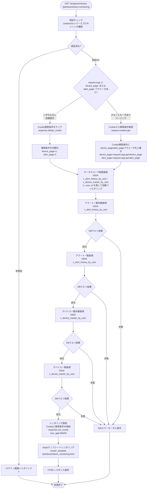
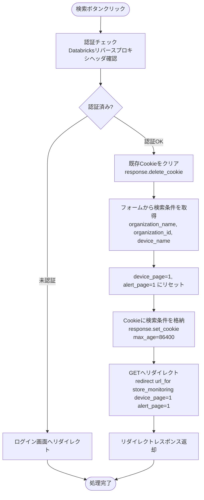
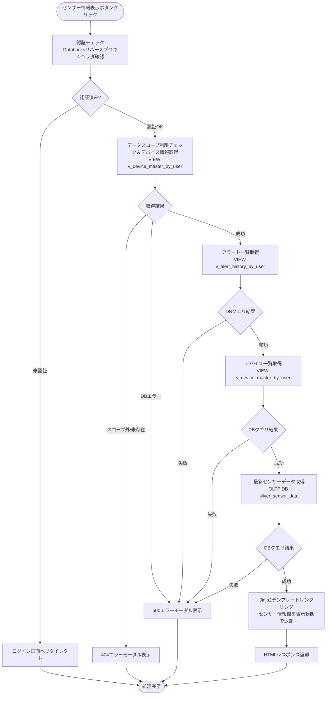
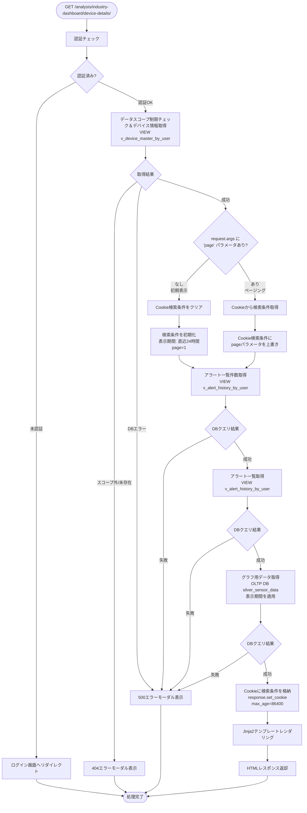

# 業種別ダッシュボード画面（冷蔵冷凍庫） - ワークフロー仕様書

## 📑 目次

- [業種別ダッシュボード画面（冷蔵冷凍庫） - ワークフロー仕様書](#業種別ダッシュボード画面冷蔵冷凍庫---ワークフロー仕様書)
  - [📑 目次](#-目次)
  - [概要](#概要)
  - [使用するFlaskルート一覧](#使用するflaskルート一覧)
  - [ルート呼び出しマッピング](#ルート呼び出しマッピング)
    - [店舗モニタリング画面](#店舗モニタリング画面)
    - [デバイス詳細画面](#デバイス詳細画面)
  - [ワークフロー一覧](#ワークフロー一覧)
    - [店舗モニタリング初期表示](#店舗モニタリング初期表示)
      - [処理フロー](#処理フロー)
      - [Flaskルート](#flaskルート)
      - [バリデーション](#バリデーション)
      - [処理詳細（サーバーサイド）](#処理詳細サーバーサイド)
      - [表示メッセージ](#表示メッセージ)
      - [エラーハンドリング](#エラーハンドリング)
      - [ログ出力タイミング](#ログ出力タイミング)
      - [検索条件の保持方法](#検索条件の保持方法)
      - [UI状態](#ui状態)
    - [店舗モニタリング検索](#店舗モニタリング検索)
      - [処理フロー](#処理フロー-1)
      - [処理詳細（サーバーサイド）](#処理詳細サーバーサイド-1)
      - [表示メッセージ](#表示メッセージ-1)
      - [エラーハンドリング](#エラーハンドリング-1)
      - [ログ出力タイミング](#ログ出力タイミング-1)
      - [検索条件の保持方法](#検索条件の保持方法-1)
      - [UI状態](#ui状態-1)
    - [センサー情報表示](#センサー情報表示)
      - [処理フロー](#処理フロー-2)
      - [Flaskルート](#flaskルート-1)
      - [処理詳細（サーバーサイド）](#処理詳細サーバーサイド-2)
      - [表示メッセージ](#表示メッセージ-2)
      - [エラーハンドリング](#エラーハンドリング-2)
      - [ログ出力タイミング](#ログ出力タイミング-2)
      - [UI状態](#ui状態-2)
    - [デバイス詳細初期表示](#デバイス詳細初期表示)
      - [処理フロー](#処理フロー-3)
      - [Flaskルート](#flaskルート-2)
      - [処理詳細（サーバーサイド）](#処理詳細サーバーサイド-3)
      - [表示メッセージ](#表示メッセージ-3)
      - [エラーハンドリング](#エラーハンドリング-3)
      - [ログ出力タイミング](#ログ出力タイミング-3)
      - [検索条件の保持方法](#検索条件の保持方法-2)
      - [UI状態](#ui状態-3)
    - [デバイス詳細検索（表示期間変更）](#デバイス詳細検索表示期間変更)
      - [処理フロー](#処理フロー-4)
      - [Flaskルート](#flaskルート-3)
      - [バリデーション](#バリデーション-1)
      - [処理詳細（サーバーサイド）](#処理詳細サーバーサイド-4)
      - [表示メッセージ](#表示メッセージ-4)
      - [エラーハンドリング](#エラーハンドリング-4)
      - [ログ出力タイミング](#ログ出力タイミング-4)
      - [検索条件の保持方法](#検索条件の保持方法-3)
      - [UI状態](#ui状態-4)
    - [ページ内ソート](#ページ内ソート)
      - [処理詳細](#処理詳細)
    - [ページング](#ページング)
      - [処理詳細](#処理詳細-1)
    - [CSVエクスポート](#csvエクスポート)
      - [処理詳細（サーバーサイド）](#処理詳細サーバーサイド-5)
      - [エラーハンドリング](#エラーハンドリング-5)
  - [使用データベース詳細](#使用データベース詳細)
    - [使用テーブル一覧](#使用テーブル一覧)
  - [センサーデータ取得仕様](#センサーデータ取得仕様)
  - [セキュリティ実装](#セキュリティ実装)
    - [認証・認可実装](#認証認可実装)
    - [ログ出力ルール](#ログ出力ルール)
  - [関連ドキュメント](#関連ドキュメント)
    - [画面仕様](#画面仕様)
    - [アーキテクチャ設計](#アーキテクチャ設計)
    - [共通仕様](#共通仕様)
    - [要件定義](#要件定義)

---

## 概要

このドキュメントは、業種別ダッシュボード画面（冷蔵冷凍庫）のユーザー操作に対する処理フロー、Databricks連携、エラーハンドリングの詳細を記載します。

**このドキュメントの役割:**
- ✅ ユーザー操作のトリガー条件
- ✅ 処理フローの詳細（Flaskルート呼び出し、フォーム送信）
- ✅ エラーハンドリングフロー
- ✅ サーバーサイド処理詳細（SQL、変数、条件分岐、コード例）
- ✅ データベース利用詳細（トランザクション管理、テーブル操作、インデックス）
- ✅ セキュリティ実装詳細（認証、データスコープ制限、ログ出力）
- ✅ Databricks API連携詳細（センサーデータ取得）

**UI仕様書との役割分担:**
- **UI仕様書**: 画面レイアウト、UI要素の詳細仕様
- **ワークフロー仕様書**: 処理フロー、Databricks連携、エラーハンドリング、サーバーサイド実装詳細

**注:** UI要素の詳細は [UI仕様書](./ui-specification.md) を参照してください。

---

## 使用するFlaskルート一覧

この画面で使用するすべてのFlaskルート（エンドポイント）を記載します。

| No | ルート名 | エンドポイント | メソッド | 用途 | レスポンス形式 | 備考 |
|----|---------|---------------|---------|------|---------------|------|
| 1 | 店舗モニタリング初期表示 | `/analysis/industry-dashboard/store-monitoring` | GET | 店舗モニタリングの初期表示 | HTML | device_page・alert_page いずれもなし=初期表示、少なくとも一方あり=ページング |
| 2 | 店舗モニタリング検索 | `/analysis/industry-dashboard/store-monitoring` | POST | 店舗モニタリングの検索 | HTML | 検索条件をCookieに格納 |
| 3 | センサー情報表示 | `/analysis/industry-dashboard/store-monitoring/<device_uuid>` | GET | センサー情報表示 | HTML | - |
| 4 | デバイス詳細初期表示 | `/analysis/industry-dashboard/device-details/<device_uuid>` | GET | デバイス詳細の初期表示 | HTML | pageパラメータなし=初期表示、あり=ページング |
| 5 | デバイス詳細検索 | `/analysis/industry-dashboard/device-details/<device_uuid>` | POST | デバイス詳細の検索 | HTML | 検索条件をCookieに格納 |
| 6 | CSVエクスポート | `/analysis/industry-dashboard/device-details/<device_uuid>?export=csv` | GET | センサー情報CSVダウンロード | CSV | 現在の検索条件を適用 |
| 7 | 店舗名オートコンプリート | `/analysis/industry-dashboard/store-monitoring/organizations` | GET | 店舗名候補リスト取得 | JSON | qパラメータで部分一致検索。DBエラー時は空リストと500を返す |

**注:**
- **レスポンス形式**:
  - `HTML`: Jinja2テンプレートをレンダリングして返す（`render_template()`）
  - `CSV`: CSVファイルをダウンロードレスポンスとして返す
- **Flask Blueprint構成**: `analysis_bp` として実装

## ルート呼び出しマッピング

### 店舗モニタリング画面

| ユーザー操作 | トリガー | 呼び出すルート | パラメータ | レスポンス | エラー時の挙動 |
|-------------|---------|-------------|-----------|-----------|---------------|
| 画面初期表示 | URL直接アクセス | `GET /analysis/industry-dashboard/store-monitoring` | なし | HTML（店舗モニタリング画面） | エラーモーダル表示 |
| 検索ボタン押下 | フォーム送信 | `POST /analysis/industry-dashboard/store-monitoring` | `organization_name, organization_id, device_name` | HTML（検索結果画面） | エラーメッセージ表示 |
| ページボタン押下 | リンククリック | `GET /analysis/industry-dashboard/store-monitoring` | `device_page` | HTML（検索結果画面） | エラーモーダル表示 |
| センサー情報表示ボタン押下 | ボタンクリック | `GET /analysis/industry-dashboard/store-monitoring/<device_uuid>` | `device_uuid` | HTML（店舗モニタリング画面） | エラーメッセージ表示 |
| 店舗名入力 | 入力イベント | `GET /analysis/industry-dashboard/store-monitoring/organizations` | `q`（部分一致文字列） | JSON（組織候補リスト） | 空リスト表示 |
| デバイス詳細ボタン押下 | ボタンクリック | `GET /analysis/industry-dashboard/device-details/<device_uuid>` | `device_uuid` | HTML（デバイス詳細画面） | エラーモーダル表示 |

### デバイス詳細画面

| ユーザー操作 | トリガー | 呼び出すルート | パラメータ | レスポンス | エラー時の挙動 |
|-------------|---------|-------------|-----------|-----------|---------------|
| 画面初期表示 | デバイス詳細ボタン押下 | `GET /analysis/industry-dashboard/device-details/<device_uuid>` | `device_uuid` | HTML（デバイス詳細画面） | エラーモーダル表示 |
| 表示期間変更ボタン押下 | フォーム送信 | `POST /analysis/industry-dashboard/device-details/<device_uuid>` | `search_start_datetime, search_end_datetime` | HTML（検索結果画面） | エラーメッセージ表示 |
| ページボタン押下 | リンククリック | `GET /analysis/industry-dashboard/device-details/<device_uuid>` | `page` | HTML（検索結果画面） | エラーモーダル表示 |
| デバイス変更ボタン押下 | ボタンクリック | `GET /analysis/industry-dashboard/store-monitoring` | なし | HTML（店舗モニタリング画面） | エラーモーダル表示 |
| CSVエクスポート | ボタンクリック | `GET /analysis/industry-dashboard/device-details/<device_uuid>?export=csv` | 検索条件 | CSVダウンロード | エラーメッセージ表示 |

---

## ワークフロー一覧

### 店舗モニタリング初期表示

**トリガー:** URL直接アクセス時（ユーザーが画面にアクセスしたとき）

**前提条件:**
- ユーザーがログイン済み（Databricks認証完了）
- 適切な権限を持っている（システム保守者、管理者、販社ユーザ、サービス利用者）

#### 処理フロー



#### Flaskルート

| ルート | エンドポイント | 詳細 |
|-------|---------------|------|
| 店舗モニタリング初期表示 | `GET /analysis/industry-dashboard/store-monitoring` | クエリパラメータ: `device_page`, `alert_page` |

#### バリデーション

**実行タイミング:** なし

**データスコープ制限:**
- **全ユーザー共通**: `v_alert_history_by_user` / `v_device_master_by_user` に `user_id` を渡すことで、アクセス可能な組織配下のデータに自動的に絞り込まれる
  - `organization_closure` による組織階層フィルタリングはVIEW内で自動適用
  - **ロールによる条件分岐は一切行わない**

**注**: システム保守者・管理者が全データにアクセスできるのは、ルート組織（すべての組織を子組織に持つ）に所属しているため

#### 処理詳細（サーバーサイド）

**① 認証・認可チェック**

リバースプロキシヘッダから認証情報を取得し、権限を確認します。

**処理内容:**
- ヘッダ `X-Databricks-User-Id` からユーザーIDを取得
- データベースから現在ユーザー情報を取得（ユーザー種別、組織ID）
- 組織に応じてデータスコープを決定

**変数・パラメータ:**
- `current_user_id`: string - リバースプロキシヘッダから取得したユーザーID
- `current_user`: User - データベースから取得したユーザーオブジェクト
- `organization_id`: string - データスコープ制限用の組織ID

**② データスコープ制限の適用**

`v_alert_history_by_user` / `v_device_master_by_user` にログインユーザーの `user_id` を渡すことで、アクセス可能な組織配下のデータに自動的に絞り込まれます。

詳細な実装仕様は[認証・認可実装](#認証認可実装)を参照してください。

**③ アラート一覧取得**

アラート履歴テーブルからアラート履歴を取得します。

**使用テーブル:** v_alert_history_by_user（アラート履歴一覧用VIEW）、 alert_status_master、 alert_setting_master、 alert_level_master、 device_master

**SQL詳細:**
- アラート一覧件数取得DBクエリ

> **注:** アラート件数の上限30件制御はアプリケーション側（`min(count, 30)`）で行う。COUNTクエリにLIMITを付けても件数上限にはならないため、SQLでは制御しない。

```sql
SELECT
  COUNT(v.alert_history_id) AS data_count
FROM
  v_alert_history_by_user v
WHERE
  v.user_id = :user_id
  AND v.delete_flag = FALSE
  AND v.alert_occurrence_datetime >= DATE_ADD(NOW(), INTERVAL -30 DAY)
```

- アラート一覧取得DBクエリ
```sql
SELECT
  v.alert_occurrence_datetime,
  dm.device_name,
  am.alert_name,
  al.alert_level_name,
  asm.alert_status_name
FROM
  v_alert_history_by_user v
LEFT JOIN alert_status_master asm
  ON v.alert_status_id = asm.alert_status_id
  AND asm.delete_flag = FALSE
LEFT JOIN alert_setting_master am
  ON v.alert_id = am.alert_id
  AND am.delete_flag = FALSE
LEFT JOIN alert_level_master al
  ON am.alert_level_id = al.alert_level_id
  AND al.delete_flag = FALSE
LEFT JOIN device_master dm
  ON v.device_id = dm.device_id
  AND dm.delete_flag = FALSE
WHERE
  v.user_id = :user_id
  AND v.delete_flag = FALSE
  AND v.alert_occurrence_datetime >= DATE_ADD(NOW(), INTERVAL -30 DAY)
ORDER BY
  al.alert_level_id ASC
  , v.alert_history_id DESC
LIMIT :item_per_page OFFSET (:alert_page - 1) * :item_per_page
```

**④ デバイス一覧取得**

デバイスマスタからデバイス一覧を取得します。

**使用テーブル:** v_device_master_by_user（デバイス一覧用VIEW）、organization_master、device_status_data

**SQL詳細:**
- デバイス一覧件数取得
```sql
SELECT
  COUNT(v.device_id) AS data_count
FROM
  v_device_master_by_user v
WHERE
  v.user_id = :user_id
  AND v.delete_flag = FALSE
```

- デバイス一覧取得
```sql
SELECT
  dm.device_uuid,
  om.organization_name,
  v.device_name,
  ds.status
FROM
  v_device_master_by_user v
INNER JOIN device_master dm
  ON v.device_id = dm.device_id
LEFT JOIN organization_master om
  ON v.device_organization_id = om.organization_id
  AND om.delete_flag = FALSE
LEFT JOIN device_status_data ds
  ON v.device_id = ds.device_id
WHERE
  v.user_id = :user_id
  AND v.delete_flag = FALSE
ORDER BY
  v.device_organization_id ASC
  , v.device_id ASC
LIMIT :item_per_page OFFSET (:device_page - 1) * :item_per_page
```

**⑤ HTMLレンダリング**

**実装例:**
```python
@analysis_bp.route('/analysis/industry-dashboard/store-monitoring', methods=['GET'])
@require_auth
def store_monitoring():
    """店舗モニタリング初期表示・ページング"""

    # 初期表示 vs ページング判定
    if 'device_page' not in request.args and 'alert_page' not in request.args:
        search_params = {
            'organization_name': '',
            'device_name': '',
            'device_page': 1,
            'alert_page': 1,
        }
    else:
        # ページング: Cookieから取得
        cookie_data = request.cookies.get('store_monitoring_search_params')
        if cookie_data:
            search_params = json.loads(cookie_data)
        else:
            search_params = get_default_search_params()
        search_params['device_page'] = request.args.get('device_page', search_params.get('device_page', 1), type=int)
        search_params['alert_page'] = request.args.get('alert_page', search_params.get('alert_page', 1), type=int)

    device_page = search_params.get('device_page', 1)
    alert_page = search_params.get('alert_page', 1)
    per_page = ITEM_PER_PAGE

    # アラート一覧取得（v_alert_history_by_userにuser_idを渡してスコープ制限適用）
    alerts, alerts_total = get_recent_alerts_with_count(search_params, g.current_user.user_id, page=alert_page, per_page=ITEM_PER_PAGE)

    # デバイス一覧取得（v_device_master_by_userにuser_idを渡してスコープ制限適用）
    devices, devices_total = get_device_list_with_count(search_params, g.current_user.user_id, device_page, per_page)

    # レンダリング
    response = make_response(render_template(
        'analysis/industry_dashboard/store_monitoring.html',
        alerts=alerts,
        alerts_total=alerts_total,
        devices=devices,
        devices_total=devices_total,
        device_page=device_page,
        per_page=per_page,
        search_params=search_params
    ))

    # 初期表示・ページング問わず常時Cookieを更新
    response.set_cookie(
        'store_monitoring_search_params',
        json.dumps(search_params),
        max_age=86400,
        httponly=True,
        samesite='Lax'
    )

    return response
```

#### 表示メッセージ

| メッセージID | 表示内容 | 表示タイミング | 表示場所 |
|-------------|---------|---------------|---------|
| ERR_001 | データの取得に失敗しました | DBクエリ失敗時 | エラーモーダル |

#### エラーハンドリング

| HTTPステータス | エラー種別 | 処理内容 | 表示内容 |
|--------------|-----------|---------|---------|
| 401 | 認証エラー | ログイン画面へリダイレクト | - |
| 500 | データベースエラー | 500エラーモーダル表示 | データの取得に失敗しました |

500エラー発生時のエラー通知については、共通仕様書参照。

#### ログ出力タイミング

DBクエリ実行の直前、直後に操作ログを出力する

#### 検索条件の保持方法

Cookieに検索条件を保持する（初期表示・ページング問わず常時更新）

#### UI状態

- 検索条件: デフォルト値
  - 店舗名: 空
  - デバイス名: 空
- アラート一覧: 過去30日以内の直近30件表示（1ページあたり10件表示）
- デバイス一覧: デバイスデータ表示
- センサー情報欄: 先頭デバイスのセンサー情報を自動表示（初期表示時）
- ページネーション: 1ページ目を選択状態

---

### 店舗モニタリング検索

**トリガー:** (2.3) 検索ボタンクリック（フォーム送信）

**前提条件:**
- 検索条件が入力されている（空でも可）

#### 処理フロー



#### 処理詳細（サーバーサイド）

> **注:** このルートはPRGパターン（Cookie保存後GETへリダイレクト）のため、サーバーサイドでのDBアクセスは行わない。アラート一覧・デバイス一覧の取得はリダイレクト先のGETルート（[店舗モニタリング初期表示](#店舗モニタリング初期表示)）が担当する。

**リダイレクト先GETルートでの検索条件の適用:**

リダイレクト先のGETルートは、Cookieから取得した検索条件をデバイス一覧・アラート一覧の両クエリに動的に追加する。適用ルールは以下の通り。

| 条件 | デバイス一覧への追加 | アラート一覧への追加 |
|------|---------------------|---------------------|
| `organization_id` が指定されている | `AND v.device_organization_id = :organization_id` | `AND v.device_organization_id = :organization_id` |
| `organization_id` が未指定かつ `organization_name` が指定されている | `AND om.organization_name LIKE :organization_name`（`om` は既存 JOIN） | `organization_master om` との `LEFT JOIN` を追加し `AND om.organization_name LIKE :organization_name` |
| `device_name` が指定されている | `AND v.device_name LIKE :device_name` | `device_master dm` との `LEFT JOIN` を追加し `AND dm.device_name LIKE :device_name` |

> **注:** `organization_id` と `organization_name` の両方が指定されている場合は `organization_id` を優先し、`organization_name` は無視する。

**実装例:**
```python
@analysis_bp.route('/analysis/industry-dashboard/store-monitoring', methods=['POST'])
@require_auth
def store_monitoring_search():
    """店舗モニタリング検索（PRG: Cookie保存後GETへリダイレクト）"""

    # フォームから検索条件を取得
    search_params = {
        'organization_name': request.form.get('organization_name', ''),
        'organization_id': request.form.get('organization_id', ''),
        'device_name': request.form.get('device_name', ''),
        'device_page': 1,
        'alert_page': 1,
    }

    # PRGパターン: Cookieに検索条件を格納してGETへリダイレクト
    response = make_response(
        redirect(url_for('analysis.store_monitoring', device_page=1, alert_page=1))
    )
    response.delete_cookie('store_monitoring_search_params')
    response.set_cookie(
        'store_monitoring_search_params',
        json.dumps(search_params),
        max_age=86400,
        httponly=True,
        samesite='Lax'
    )

    return response
```

#### 表示メッセージ

| メッセージID | 表示内容 | 表示タイミング | 表示場所 |
|-------------|---------|---------------|---------|
| ERR_001 | データの取得に失敗しました | DBクエリ失敗時 | エラーモーダル |

#### エラーハンドリング

| HTTPステータス | エラー種別 | 処理内容 | 表示内容 |
|--------------|-----------|---------|---------|
| 401 | 認証エラー | ログイン画面へリダイレクト | - |
| 500 | データベースエラー | 500エラーモーダル表示 | データの取得に失敗しました |

500エラー発生時のエラー通知については、共通仕様書参照。

#### ログ出力タイミング

DBクエリ実行の直前、直後に操作ログを出力する

#### 検索条件の保持方法

CookieにPOSTパラメータを格納してGETへリダイレクト（PRGパターン）。表示はGETルートが担当する

#### UI状態

- GETへリダイレクト後、検索条件: 入力値を保持（フォームに再設定）
- アラート一覧: 検索結果データ表示
- デバイス一覧: 検索結果データ表示
- センサー情報欄: 検索結果の先頭デバイスのセンサー情報を自動表示（検索結果が0件の場合は非表示）
- ページネーション: 1ページ目にリセット

---

### センサー情報表示

**トリガー:** (4.4) センサー情報表示ボタンクリック

**前提条件:**
- 対象デバイスへのアクセス権限がある

#### 処理フロー



#### Flaskルート

| ルート | エンドポイント | 詳細 |
|-------|---------------|------|
| センサー情報表示 | `GET /analysis/industry-dashboard/store-monitoring/<device_uuid>` | パスパラメータ: `device_uuid` |

#### 処理詳細（サーバーサイド）

**① データスコープ制限チェック＆デバイス情報取得**

**使用テーブル:** v_device_master_by_user（デバイス一覧用VIEW）、device_master、device_type_master、organization_master

```python
def check_device_access(device_uuid, user_id):
    """デバイスへのアクセス権限をチェック（v_device_master_by_userを使用）"""
    result = db.session.execute(
        text("""
            SELECT
                v.device_id,
                dm.device_uuid,
                v.device_name,
                dm.device_model,
                v.device_organization_id AS organization_id,
                dtm.device_type_name,
                om.organization_name
            FROM v_device_master_by_user v
            INNER JOIN device_master dm
              ON v.device_id = dm.device_id
            LEFT JOIN device_type_master dtm
              ON dm.device_type_id = dtm.device_type_id
              AND dtm.delete_flag = FALSE
            LEFT JOIN organization_master om
              ON v.device_organization_id = om.organization_id
              AND om.delete_flag = FALSE
            WHERE v.user_id = :user_id
              AND dm.device_uuid = :device_uuid
              AND v.delete_flag = FALSE
        """),
        {'user_id': user_id, 'device_uuid': device_uuid}
    ).first()
    return result
```

**② アラート一覧取得**

**使用テーブル:** v_alert_history_by_user（アラート履歴一覧用VIEW）、 alert_status_master、 alert_setting_master、 alert_level_master

**SQL詳細:**
- アラート一覧件数取得DBクエリ

> **注:** アラート件数の上限30件制御はアプリケーション側（`min(count, 30)`）で行う。

```sql
SELECT
  COUNT(v.alert_history_id) AS data_count
FROM
  v_alert_history_by_user v
WHERE
  v.user_id = :user_id
  AND v.delete_flag = FALSE
  AND v.alert_occurrence_datetime >= DATE_ADD(NOW(), INTERVAL -30 DAY)
```

- アラート一覧取得DBクエリ
```sql
SELECT
  v.alert_occurrence_datetime,
  dm.device_name,
  am.alert_name,
  al.alert_level_name,
  asm.alert_status_name
FROM
  v_alert_history_by_user v
LEFT JOIN alert_status_master asm
  ON v.alert_status_id = asm.alert_status_id
  AND asm.delete_flag = FALSE
LEFT JOIN alert_setting_master am
  ON v.alert_id = am.alert_id
  AND am.delete_flag = FALSE
LEFT JOIN alert_level_master al
  ON am.alert_level_id = al.alert_level_id
  AND al.delete_flag = FALSE
WHERE
  v.user_id = :user_id
  AND v.delete_flag = FALSE
  AND v.alert_occurrence_datetime >= DATE_ADD(NOW(), INTERVAL -30 DAY)
ORDER BY
  al.alert_level_id ASC
  , v.alert_history_id DESC
LIMIT :item_per_page OFFSET (:alert_page - 1) * :item_per_page
```

**③ デバイス一覧取得**

**使用テーブル:** v_device_master_by_user（デバイス一覧用VIEW）、organization_master、device_status_data

**SQL詳細:**
- デバイス一覧取得DBクエリ
```sql
SELECT
  dm.device_uuid,
  om.organization_name,
  v.device_name,
  ds.status
FROM
  v_device_master_by_user v
INNER JOIN device_master dm
  ON v.device_id = dm.device_id
LEFT JOIN organization_master om
  ON v.device_organization_id = om.organization_id
  AND om.delete_flag = FALSE
LEFT JOIN device_status_data ds
  ON v.device_id = ds.device_id
WHERE
  v.user_id = :user_id
  AND v.delete_flag = FALSE
ORDER BY
  v.device_organization_id ASC
  , v.device_id ASC
LIMIT :item_per_page OFFSET (:device_page - 1) * :item_per_page
```

**④ 最新センサーデータ取得**

**使用テーブル:** MySQL の `silver_sensor_data`

**SQL詳細:**
```sql
SELECT
  *
FROM
  silver_sensor_data
WHERE
  device_id = :device_id
ORDER BY
  event_timestamp DESC
LIMIT 1
```

**実装例:**
```python
@analysis_bp.route('/analysis/industry-dashboard/store-monitoring/<device_uuid>', methods=['GET'])
@require_auth
def show_sensor_info(device_uuid):
    """センサー情報表示"""

    # デバイスアクセス権限チェック（v_device_master_by_userにuser_idを渡してスコープ制限適用）
    device = check_device_access(device_uuid, g.current_user.user_id)
    if not device:
        abort(404)

    # Cookieから検索条件を取得
    cookie_data = request.cookies.get('store_monitoring_search_params')
    if cookie_data:
        search_params = json.loads(cookie_data)
    else:
        search_params = get_default_search_params()

    device_page = search_params.get('device_page', 1)
    alert_page = search_params.get('alert_page', 1)

    # アラート一覧取得（v_alert_history_by_userにuser_idを渡してスコープ制限適用）
    alerts, alerts_total = get_recent_alerts_with_count(search_params, g.current_user.user_id, page=alert_page, per_page=ITEM_PER_PAGE)

    # デバイス一覧取得（v_device_master_by_userにuser_idを渡してスコープ制限適用）
    devices, devices_total = get_device_list_with_count(search_params, g.current_user.user_id, device_page, ITEM_PER_PAGE)

    # 最新センサーデータ取得（MySQLから取得）
    sensor_data = get_latest_sensor_data(device.device_id)

    return render_template(
        'analysis/industry_dashboard/store_monitoring.html',
        alerts=alerts,
        alerts_total=alerts_total,
        devices=devices,
        devices_total=devices_total,
        device_page=device_page,
        per_page=ITEM_PER_PAGE,
        search_params=search_params,
        selected_device=device,
        sensor_data=sensor_data,
        show_sensor_info=True
    )
```

#### 表示メッセージ

| メッセージID | 表示内容 | 表示タイミング | 表示場所 |
|-------------|---------|---------------|---------|
| ERR_001 | データの取得に失敗しました | DBクエリ失敗時 | エラーモーダル |
| ERR_002 | 指定されたデバイスが見つかりません | デバイスが存在しない/アクセス権限なし | エラーモーダル |

#### エラーハンドリング

| HTTPステータス | エラー種別 | 処理内容 | 表示内容 |
|--------------|-----------|---------|---------|
| 401 | 認証エラー | ログイン画面へリダイレクト | - |
| 404 | リソース不存在 | 404エラーモーダル表示 | 指定されたデバイスが見つかりません |
| 500 | データベースエラー | 500エラーモーダル表示 | データの取得に失敗しました |

500エラー発生時のエラー通知については、共通仕様書参照。

#### ログ出力タイミング

DBクエリ実行の直前、直後に操作ログを出力する

#### UI状態

- 検索条件: 前回の検索条件を保持
- デバイス一覧: 選択されたデバイスをハイライト表示
- センサー情報欄: 表示状態（最新センサーデータを表示）

---

### デバイス詳細初期表示

**トリガー:** (4.4) デバイス詳細ボタンクリック

**前提条件:**
- デバイスが選択されている
- 対象デバイスへのアクセス権限がある

#### 処理フロー



#### Flaskルート

| ルート | エンドポイント | 詳細 |
|-------|---------------|------|
| デバイス詳細初期表示 | `GET /analysis/industry-dashboard/device-details/<device_uuid>` | パスパラメータ: `device_uuid`、クエリパラメータ: `page` |

#### 処理詳細（サーバーサイド）

**① 表示期間の初期値設定**

初期表示時は直近24時間を表示期間として設定します。

```python
from datetime import datetime, timedelta

def get_default_date_range():
    """デフォルトの表示期間を取得（直近24時間）"""
    end_datetime = datetime.now()
    start_datetime = end_datetime - timedelta(hours=24)
    return {
        'search_start_datetime': start_datetime.strftime('%Y-%m-%dT%H:%M'),
        'search_end_datetime': end_datetime.strftime('%Y-%m-%dT%H:%M')
    }
```

**② アラート一覧取得**

**使用テーブル:** v_alert_history_by_user（アラート履歴一覧用VIEW）、 alert_status_master、 alert_setting_master、 alert_level_master

**SQL詳細:**
- アラート一覧件数取得DBクエリ

> **注:** アラート件数の上限30件制御はアプリケーション側（`min(count, 30)`）で行う。

```sql
SELECT
  COUNT(v.alert_history_id) AS data_count
FROM
  v_alert_history_by_user v
WHERE
  v.user_id = :user_id
  AND v.device_id = :device_id
  AND v.delete_flag = FALSE
  AND v.alert_occurrence_datetime >= DATE_ADD(NOW(), INTERVAL -30 DAY)
```

- アラート一覧取得DBクエリ
```sql
SELECT
  v.alert_occurrence_datetime,
  am.alert_name,
  al.alert_level_name,
  asm.alert_status_name
FROM
  v_alert_history_by_user v
LEFT JOIN alert_status_master asm
  ON v.alert_status_id = asm.alert_status_id
  AND asm.delete_flag = FALSE
LEFT JOIN alert_setting_master am
  ON v.alert_id = am.alert_id
  AND am.delete_flag = FALSE
LEFT JOIN alert_level_master al
  ON am.alert_level_id = al.alert_level_id
  AND al.delete_flag = FALSE
WHERE
  v.user_id = :user_id
  AND v.device_id = :device_id
  AND v.delete_flag = FALSE
  AND v.alert_occurrence_datetime >= DATE_ADD(NOW(), INTERVAL -30 DAY)
ORDER BY
  al.alert_level_id ASC
  , v.alert_history_id DESC
LIMIT :item_per_page OFFSET (:alert_page - 1) * :item_per_page
```

**③ グラフ用データ取得**

時系列グラフ描画用に、表示期間内の全センサーデータを取得します。MySQLのみを参照し、MySQLにデータがない場合は空リストを返します。

**SQL詳細:**
```sql
SELECT
  *
FROM
  silver_sensor_data
WHERE
  device_id = :device_id
  AND event_timestamp BETWEEN :search_start_datetime AND :search_end_datetime
ORDER BY
  event_timestamp ASC
```

**実装例:**
```python
@analysis_bp.route('/analysis/industry-dashboard/device-details/<device_uuid>', methods=['GET'])
@require_auth
def device_details(device_uuid):
    """デバイス詳細初期表示・ページング"""

    # デバイスアクセス権限チェック（v_device_master_by_userにuser_idを渡してスコープ制限適用）
    device = check_device_access(device_uuid, g.current_user.user_id)
    if not device:
        abort(404)

    # 初期表示 vs ページング判定
    if 'page' not in request.args:
        search_params = get_default_date_range()
        search_params['page'] = 1
    else:
        cookie_data = request.cookies.get('device_details_search_params')
        if cookie_data:
            search_params = json.loads(cookie_data)
        else:
            search_params = get_default_date_range()
        search_params['page'] = request.args.get('page', 1, type=int)

    page = search_params['page']
    per_page = ITEM_PER_PAGE

    # CSVエクスポート処理（表示期間はCookieから取得）
    if request.args.get('export') == 'csv':
        csv_search_params = _get_device_details_search_params()  # Cookieから検索条件取得（Cookieなしの場合はデフォルト24時間）
        return export_sensor_data_csv(device, csv_search_params)

    # アラート一覧取得
    alerts, alerts_total = get_device_alerts_with_count(device.device_id, search_params)

    # グラフ用データ取得（MySQLから取得）
    graph_data = get_graph_data(device.device_id, search_params)

    # レンダリング
    response = make_response(render_template(
        'analysis/industry_dashboard/device_details.html',
        device=device,
        alerts=alerts,
        alerts_total=alerts_total,
        graph_data=graph_data,
        page=page,
        per_page=per_page,
        search_params=search_params
    ))

    # 初期表示・ページング問わず常時Cookieを更新
    response.set_cookie(
        'device_details_search_params',
        json.dumps(search_params),
        max_age=86400,
        httponly=True,
        samesite='Lax'
    )

    return response
```

#### 表示メッセージ

| メッセージID | 表示内容 | 表示タイミング | 表示場所 |
|-------------|---------|---------------|---------|
| ERR_001 | データの取得に失敗しました | DBクエリ失敗時 | エラーモーダル |
| ERR_002 | 指定されたデバイスが見つかりません | デバイスが存在しない/アクセス権限なし | エラーモーダル |

#### エラーハンドリング

| HTTPステータス | エラー種別 | 処理内容 | 表示内容 |
|--------------|-----------|---------|---------|
| 401 | 認証エラー | ログイン画面へリダイレクト | - |
| 404 | リソース不存在 | 404エラーモーダル表示 | 指定されたデバイスが見つかりません |
| 500 | データベースエラー | 500エラーモーダル表示 | データの取得に失敗しました |

500エラー発生時のエラー通知については、共通仕様書参照。

#### ログ出力タイミング

各DBクエリ実行の直前、直後に操作ログを出力する

#### 検索条件の保持方法

Cookieに検索条件を保持する（初期表示・ページング問わず常時更新）

#### UI状態

- デバイス情報欄: 選択されたデバイスの情報を表示
- 表示期間: デフォルト値（直近24時間）
- アラート一覧: 過去30日以内の直近30件表示（1ページあたり10件表示）
- 時系列グラフ: 表示期間内のセンサーデータをグラフ表示
- ページネーション: 1ページ目を選択状態

---

### デバイス詳細検索（表示期間変更）

**トリガー:** (10.3) 表示期間変更ボタンクリック（フォーム送信）

**前提条件:**
- 表示期間が入力されている

#### 処理フロー

```mermaid
flowchart TD
    Start([表示期間変更ボタンクリック]) --> Auth[認証チェック<br>Databricksリバースプロキシヘッダ確認]
    Auth --> CheckAuth{認証済み?}
    CheckAuth -->|未認証| LoginRedirect[ログイン画面へリダイレクト]

    CheckAuth -->|認証OK| DeviceQuery[データスコープ制限チェック＆デバイス情報取得<br>VIEW v_device_master_by_user]
    DeviceQuery --> CheckDeviceQuery{取得結果}
    CheckDeviceQuery -->|スコープ外/未存在| Error404[404エラーモーダル表示]
    CheckDeviceQuery -->|DBエラー| Error500[500エラーモーダル表示]

    CheckDeviceQuery -->|成功| Validate[バリデーション<br>表示期間の妥当性チェック]
    Validate --> CheckValidate{バリデーションOK?}
    CheckValidate -->|NG| Error400[400エラーモーダル表示]

    CheckValidate -->|OK| ClearCookie[Cookieの検索条件をクリア]
    ClearCookie --> GetParams[フォームから検索条件を取得<br>search_start_datetime, search_end_datetime]
    GetParams --> Convert[検索条件設定<br>page: 現在のページを引き継ぐ（current_params.get('page', 1)）]

    Convert --> DeviceQuery2[デバイス情報取得]
    DeviceQuery2 --> AlertCount[アラート一覧件数取得]
    AlertCount --> AlertQuery[アラート履歴取得]
    AlertQuery --> GraphQuery[グラフ用データ取得<br>表示期間を適用]

    GraphQuery --> CheckGraphQuery{DBクエリ結果}
    CheckGraphQuery -->|成功| Template[Jinja2テンプレートレンダリング]
    CheckGraphQuery -->|失敗| Error500[500エラーモーダル表示]

    Template --> PutParams[Cookieに検索条件を格納]
    PutParams --> Response[HTMLレスポンス返却]

    LoginRedirect --> End([処理完了])
    Response --> End
    Error400 --> End
    Error404 --> End
    Error500 --> End
```

#### Flaskルート

| ルート | エンドポイント | 詳細 |
|-------|---------------|------|
| デバイス詳細検索 | `POST /analysis/industry-dashboard/device-details/<device_uuid>` | パスパラメータ: `device_uuid` |

#### バリデーション

**実行タイミング:** フォーム送信時

**バリデーションルール:**
- `search_start_datetime`: 必須、日時形式（YYYY-MM-DDTHH:MM）
- `search_end_datetime`: 必須、日時形式（YYYY-MM-DDTHH:MM）
- 開始日時 < 終了日時であること
- 表示期間が最大2ヶ月（62日）以内であること

**実装例:**
```python
def validate_date_range(start_datetime_str, end_datetime_str):
    """表示期間のバリデーション"""
    errors = []

    try:
        start_dt = datetime.strptime(start_datetime_str, '%Y-%m-%dT%H:%M')
        end_dt = datetime.strptime(end_datetime_str, '%Y-%m-%dT%H:%M')
    except (ValueError, TypeError):
        errors.append('日時の形式が正しくありません')
        return errors

    if start_dt >= end_dt:
        errors.append('開始日時は終了日時より前である必要があります')

    if (end_dt - start_dt).days > 62:
        errors.append('表示期間は2ヶ月以内で指定してください')

    return errors
```

#### 処理詳細（サーバーサイド）

**① アラート一覧取得**

**使用テーブル:** v_alert_history_by_user（アラート履歴一覧用VIEW）、 alert_status_master、 alert_setting_master、 alert_level_master

**SQL詳細:**
- アラート一覧件数取得DBクエリ

> **注:** アラート件数の上限30件制御はアプリケーション側（`min(count, 30)`）で行う。

```sql
SELECT
  COUNT(v.alert_history_id) AS data_count
FROM
  v_alert_history_by_user v
WHERE
  v.user_id = :user_id
  AND v.device_id = :device_id
  AND v.delete_flag = FALSE
  AND v.alert_occurrence_datetime >= DATE_ADD(NOW(), INTERVAL -30 DAY)
```

- アラート一覧取得DBクエリ
```sql
SELECT
  v.alert_occurrence_datetime,
  am.alert_name,
  al.alert_level_name,
  asm.alert_status_name
FROM
  v_alert_history_by_user v
LEFT JOIN alert_status_master asm
  ON v.alert_status_id = asm.alert_status_id
  AND asm.delete_flag = FALSE
LEFT JOIN alert_setting_master am
  ON v.alert_id = am.alert_id
  AND am.delete_flag = FALSE
LEFT JOIN alert_level_master al
  ON am.alert_level_id = al.alert_level_id
  AND al.delete_flag = FALSE
WHERE
  v.user_id = :user_id
  AND v.device_id = :device_id
  AND v.delete_flag = FALSE
  AND v.alert_occurrence_datetime >= DATE_ADD(NOW(), INTERVAL -30 DAY)
ORDER BY
  al.alert_level_id ASC
  , v.alert_history_id DESC
LIMIT :item_per_page OFFSET (:alert_page - 1) * :item_per_page
```

**② 実装例:**
```python
@analysis_bp.route('/analysis/industry-dashboard/device-details/<device_uuid>', methods=['POST'])
@require_auth
def device_details_search(device_uuid):
    """デバイス詳細検索（表示期間変更）"""

    # デバイスアクセス権限チェック（v_device_master_by_userにuser_idを渡してスコープ制限適用）
    device = check_device_access(device_uuid, g.current_user.user_id)
    if not device:
        abort(404)

    # フォームから検索条件を取得
    search_start_datetime = request.form.get('search_start_datetime', '')
    search_end_datetime = request.form.get('search_end_datetime', '')

    # バリデーション
    current_params = _get_device_details_search_params()
    errors = validate_date_range(search_start_datetime, search_end_datetime)
    if errors:
        # バリデーションエラー: 400ステータスでフォーム内エラーメッセージを表示
        alerts, alerts_total = get_device_alerts_with_count(device.device_id, current_params, g.current_user.user_id)
        graph_data = get_graph_data(device.device_id, current_params)
        return render_template(
            'analysis/industry_dashboard/device_details.html',
            device=device,
            alerts=alerts,
            alerts_total=alerts_total,
            graph_data=graph_data,
            page=current_params.get('page', 1),
            per_page=ITEM_PER_PAGE,
            search_params={'search_start_datetime': search_start_datetime, 'search_end_datetime': search_end_datetime},
            period_error=errors[0],
        ), 400

    search_params = {
        'search_start_datetime': search_start_datetime,
        'search_end_datetime': search_end_datetime,
        'page': current_params.get('page', 1)
    }

    # アラート一覧取得（件数・リストを同時取得）
    alerts, alerts_total = get_device_alerts_with_count(device.device_id, search_params, g.current_user.user_id)

    # グラフ用データ取得（MySQLから取得）
    graph_data = get_graph_data(device.device_id, search_params)

    # レンダリング
    response = make_response(render_template(
        'analysis/industry_dashboard/device_details.html',
        device=device,
        alerts=alerts,
        graph_data=graph_data,
        alerts_total=alerts_total,
        page=1,
        per_page=ITEM_PER_PAGE,
        search_params=search_params
    ))

    # Cookieに検索条件を格納
    response.set_cookie(
        'device_details_search_params',
        json.dumps(search_params),
        max_age=86400,
        httponly=True,
        samesite='Lax'
    )

    return response
```

#### 表示メッセージ

| メッセージID | 表示内容 | 表示タイミング | 表示場所 |
|-------------|---------|---------------|---------|
| VAL_001 | 日時の形式が正しくありません | 日時形式不正時 | フォーム内エラーメッセージ（period_error） |
| VAL_002 | 開始日時は終了日時より前である必要があります | 期間不正時 | フォーム内エラーメッセージ（period_error） |
| VAL_003 | 表示期間は2ヶ月以内で指定してください | 期間超過時 | フォーム内エラーメッセージ（period_error） |
| ERR_001 | データの取得に失敗しました | DBクエリ失敗時 | エラーモーダル |

#### エラーハンドリング

| HTTPステータス | エラー種別 | 処理内容 | 表示内容 |
|--------------|-----------|---------|---------|
| 400 | パラメータ不正 | 400ステータスでデバイス詳細画面を再描画、フォーム直下にエラーメッセージを表示（period_error） | 日時の形式が正しくありません |
| 400 | パラメータ不正 | 400ステータスでデバイス詳細画面を再描画、フォーム直下にエラーメッセージを表示（period_error） | 開始日時は終了日時より前である必要があります |
| 400 | パラメータ不正 | 400ステータスでデバイス詳細画面を再描画、フォーム直下にエラーメッセージを表示（period_error） | 表示期間は2ヶ月以内で指定してください |
| 401 | 認証エラー | ログイン画面へリダイレクト | - |
| 404 | リソース不存在 | 404エラーモーダル表示 | 指定されたデバイスが見つかりません |
| 500 | データベースエラー | 500エラーモーダル表示 | データの取得に失敗しました |

500エラー発生時のエラー通知については、共通仕様書参照。

#### ログ出力タイミング

DBクエリ実行の直前、直後に操作ログを出力する

#### 検索条件の保持方法

Cookieに検索条件を保持する

#### UI状態

- 表示期間: 入力値を保持
- アラート一覧: 過去30日以内の直近30件表示（1ページあたり10件表示）
- 時系列グラフ: 新しい表示期間でデータ更新
- ページネーション: 1ページ目にリセット

---

### ページ内ソート

**トリガー:** (3) アラート一覧、(4) デバイス一覧、(9) アラート一覧のソート可能カラムのヘッダをクリック

#### 処理詳細
データテーブルのヘッダをクリックすることで、ページ内で閉じたソートを行う。
詳細は[共通仕様書](../../common/common-specification.md)参照のこと

---

### ページング

**トリガー:** (3.7)、(4.6)、(9.6) ページネーションのページ番号ボタンクリック

#### 処理詳細
ページネーションのページ番号を選択することで、選択されたページ番号に対応するデータをデータテーブルに表示する。
具体的な処理は[店舗モニタリング初期表示](#店舗モニタリング初期表示)と[デバイス詳細初期表示](#デバイス詳細初期表示)の処理と同様とする。

---

### CSVエクスポート

**トリガー:** (11) CSVエクスポートボタンクリック

**前提条件:**
- デバイス詳細画面が表示されている
- 表示期間が設定されている（表示期間内のデータをエクスポート）
  - 表示期間はCookieに保存されている（表示期間変更ボタンで設定した検索条件を使用）
  - Cookieに表示期間がない場合はデフォルト期間（直近24時間）でエクスポート

#### 処理詳細（サーバーサイド）

**実装例:**
```python
def export_sensor_data_csv(device, search_params):
    """センサーデータCSVエクスポート"""
    import csv
    from io import StringIO

    # 表示期間内の全センサーデータを取得（MySQLから取得）
    sensor_data_list = get_all_sensor_data(device.device_id, search_params)

    # CSV形式で出力
    si = StringIO()
    writer = csv.writer(si)

    # ヘッダー行
    writer.writerow([
        'イベント発生日時',
        '外気温度',
        '第1冷凍 設定温度',
        '第1冷凍 庫内センサー温度',
        '第1冷凍 表示温度',
        '第1冷凍 DF温度',
        '第1冷凍 凝縮温度',
        '第1冷凍 微調整後庫内温度',
        '第2冷凍 設定温度',
        '第2冷凍 庫内センサー温度',
        '第2冷凍 表示温度',
        '第2冷凍 DF温度',
        '第2冷凍 凝縮温度',
        '第2冷凍 微調整後庫内温度',
        '第1冷凍 圧縮機',
        '第2冷凍 圧縮機',
        '第1ファンモータ',
        '第2ファンモータ',
        '第3ファンモータ',
        '第4ファンモータ',
        '第5ファンモータ',
        '防露ヒータ出力(1)',
        '防露ヒータ出力(2)'
    ])

    # データ行（get_all_sensor_data はdictのリストを返す）
    def _val(v):
        return '' if v is None else v

    for row in sensor_data_list:
        writer.writerow([
            row['event_timestamp'] if row.get('event_timestamp') is not None else '',
            _val(row.get('external_temp')),
            _val(row.get('set_temp_freezer_1')),
            _val(row.get('internal_sensor_temp_freezer_1')),
            _val(row.get('internal_temp_freezer_1')),
            _val(row.get('df_temp_freezer_1')),
            _val(row.get('condensing_temp_freezer_1')),
            _val(row.get('adjusted_internal_temp_freezer_1')),
            _val(row.get('set_temp_freezer_2')),
            _val(row.get('internal_sensor_temp_freezer_2')),
            _val(row.get('internal_temp_freezer_2')),
            _val(row.get('df_temp_freezer_2')),
            _val(row.get('condensing_temp_freezer_2')),
            _val(row.get('adjusted_internal_temp_freezer_2')),
            _val(row.get('compressor_freezer_1')),
            _val(row.get('compressor_freezer_2')),
            _val(row.get('fan_motor_1')),
            _val(row.get('fan_motor_2')),
            _val(row.get('fan_motor_3')),
            _val(row.get('fan_motor_4')),
            _val(row.get('fan_motor_5')),
            _val(row.get('defrost_heater_output_1')),
            _val(row.get('defrost_heater_output_2')),
        ])

    # レスポンス作成（UTF-8 BOM付きバイト列に変換）
    csv_data = si.getvalue().encode("utf-8-sig")
    filename = f"sensor_data_{device.device_uuid}_{datetime.now().strftime('%Y%m%d_%H%M%S')}.csv"

    return Response(
        csv_data,
        headers={
            "Content-Disposition": f"attachment; filename={filename}",
            "Content-type": "text/csv; charset=utf-8-sig",
        },
    )
```

#### エラーハンドリング

| HTTPステータス | エラー種別 | 処理内容 | 表示内容 |
|--------------|-----------|---------|---------|
| 401 | 認証エラー | ログイン画面へリダイレクト | - |
| 404 | リソース不存 | 404エラーモーダル表示 | 指定されたデバイスが見つかりません |
| 500 | データベースエラー | 500エラーモーダル表示 | CSVエクスポートに失敗しました |

---

## 使用データベース詳細

### 使用テーブル一覧

| No | テーブル名 | 論理名 | データソース | 操作種別 | ワークフロー | 目的 |
|----|-----------|--------|-------------|---------|------------|------|
| 1 | v_device_master_by_user | デバイス一覧用VIEW | OLTP DB | SELECT | 店舗モニタリング、デバイス詳細 | デバイス取得・データスコープ制限 |
| 2 | v_alert_history_by_user | アラート履歴一覧用VIEW | OLTP DB | SELECT | 店舗モニタリング、デバイス詳細 | アラート履歴取得・データスコープ制限 |
| 3 | device_master | デバイスマスタ | OLTP DB | SELECT | 店舗モニタリング、デバイス詳細 | device_uuid取得（VIEW非保持カラム） |
| 4 | organization_master | 組織マスタ | OLTP DB | SELECT | 店舗モニタリング、デバイス詳細 | 組織名表示 |
| 5 | device_status_data | デバイスステータス | OLTP DB | SELECT | 店舗モニタリング | デバイスステータス表示 |
| 6 | alert_setting_master | アラート設定マスタ | OLTP DB | SELECT | 店舗モニタリング、デバイス詳細 | アラート名表示 |
| 7 | alert_level_master | アラートレベルマスタ | OLTP DB | SELECT | 店舗モニタリング、デバイス詳細 | アラートレベル表示 |
| 8 | alert_status_master | アラートステータスマスタ | OLTP DB | SELECT | 店舗モニタリング、デバイス詳細 | アラートステータス表示 |
| 9 | silver_sensor_data | センサーデータ | MySQL | SELECT | センサー情報表示、デバイス詳細 | センサーデータ取得 |

---

## センサーデータ取得仕様

### 概要

センサーデータは MySQL の `silver_sensor_data` テーブルのみを参照します。MySQL にデータが存在しない場合はデータなしとして扱います。

| 機能 | データソース | 備考 |
|------|------------|------|
| 最新センサーデータ取得 | MySQL | データなしの場合は None を返す |
| グラフ用データ取得 | MySQL | データなしの場合は空リストを返す |
| CSVエクスポート | MySQL | データなしの場合は空リストを返す |

---

## セキュリティ実装

### 認証・認可実装

**認証方式:**
- Databricksリバースプロキシヘッダ認証（`X-Databricks-User-Id`）

**認可ロジック:**

組織階層に基づいて、ユーザーがアクセスできるデータを制限します。

**処理内容:**
- **全ユーザー共通**: `v_device_master_by_user` / `v_alert_history_by_user` にログインユーザーの `user_id` を渡すことで、アクセス可能な組織配下のデータに自動的に絞り込まれる
  - `organization_closure` による組織階層フィルタリングはVIEW内で自動適用
  - **ロールによる条件分岐は一切行わない**

**注**: システム保守者・管理者が全データにアクセスできるのは、ルート組織（すべての組織を子組織に持つ）に所属しているため

**実装例:**
```python
# デバイス一覧取得（VIEWにuser_idを渡すだけでスコープ制限が自動適用）
query = text("""
    SELECT v.device_id, v.device_name, v.device_organization_id, dm.device_uuid
    FROM v_device_master_by_user v
    INNER JOIN device_master dm ON v.device_id = dm.device_id
    WHERE v.user_id = :user_id
      AND v.delete_flag = FALSE
""")
result = db.session.execute(query, {'user_id': g.current_user.user_id})

# アラート履歴取得（VIEWにuser_idを渡すだけでスコープ制限が自動適用）
query = text("""
    SELECT v.alert_history_id, v.alert_id, v.device_id, v.alert_occurrence_datetime
    FROM v_alert_history_by_user v
    WHERE v.user_id = :user_id
      AND v.delete_flag = FALSE
""")
result = db.session.execute(query, {'user_id': g.current_user.user_id})
```

### ログ出力ルール

**出力する情報:**
- リクエストID
- ユーザーID（操作者）
- 操作種別（画面表示、検索、CSVエクスポート等）
- 対象リソースID（device_uuid）
- 処理結果（成功/失敗）
- エラー種別（バリデーションエラー、DBエラー等）
- タイムスタンプ（UTC）

**出力しない情報（機密情報）:**
- 認証トークン
- センサーデータの具体値

**実装例:**
```python
import logging

logger = logging.getLogger(__name__)

@analysis_bp.route('/analysis/industry-dashboard/device-details/<device_uuid>', methods=['GET'])
@require_auth
def device_details(device_uuid):
    logger.info(f'デバイス詳細表示開始: user_id={g.current_user.user_id}, device_uuid={device_uuid}')

    try:
        # ... 処理 ...
        logger.info(f'デバイス詳細表示成功: device_uuid={device_uuid}')
        return response
    except Exception as e:
        logger.error(f'デバイス詳細表示エラー: device_uuid={device_uuid}, error={str(e)}')
        abort(500)
```

---

## 関連ドキュメント

### 画面仕様
- [機能概要 README](./README.md) - 画面の概要、アーキテクチャ
- [UI仕様書](./ui-specification.md) - UI要素の詳細、iframe仕様

### アーキテクチャ設計
- [バックエンド設計](../../../01-architecture/backend.md) - Flask/LDP設計、Blueprint構成
- [フロントエンド設計](../../../01-architecture/frontend.md) - Flask + Jinja2設計

### 共通仕様
- [共通仕様書](../../common/common-specification.md) - HTTPステータスコード、エラーコード等
- [UI共通仕様書](../../common/ui-common-specification.md) - すべての画面に共通するUI仕様

### 要件定義
- [機能要件定義書](../../../02-requirements/functional-requirements.md) - FR-006
- [非機能要件定義書](../../../02-requirements/non-functional-requirements.md) - NFR-PERF-003, NFR-SEC-007
- [技術要件定義書](../../../02-requirements/technical-requirements.md) - TR-DB-001

---

**このワークフロー仕様書は、実装前に必ずレビューを受けてください。**
