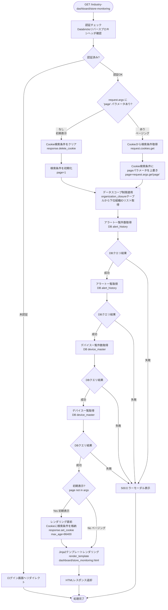
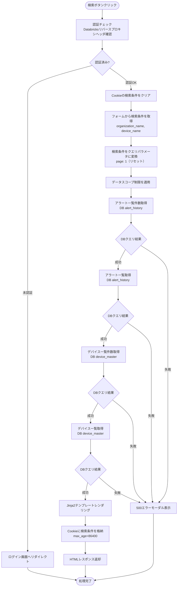
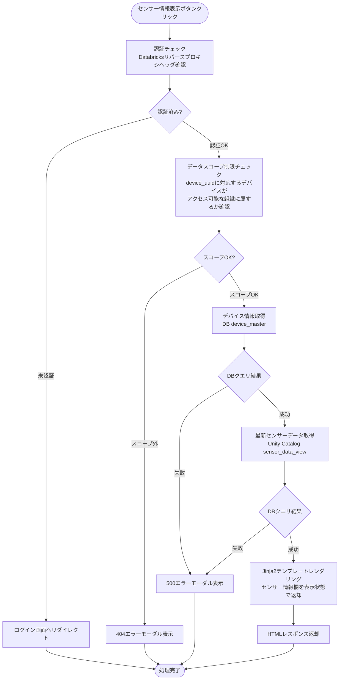
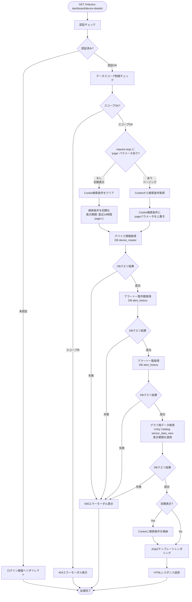
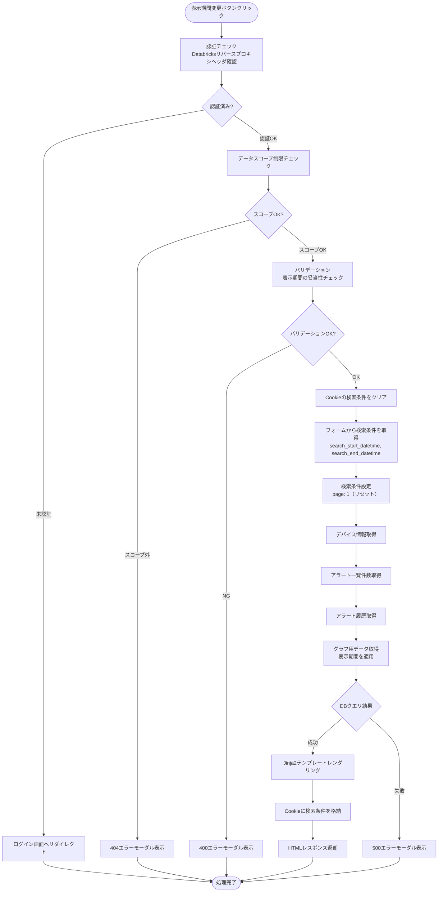

# 業種別ダッシュボード画面（冷蔵冷凍庫） - ワークフロー仕様書

## 📑 目次

- [業種別ダッシュボード画面（冷蔵冷凍庫） - ワークフロー仕様書](#業種別ダッシュボード画面冷蔵冷凍庫---ワークフロー仕様書)
  - [📑 目次](#-目次)
  - [概要](#概要)
  - [使用するFlaskルート一覧](#使用するflaskルート一覧)
  - [ルート呼び出しマッピング](#ルート呼び出しマッピング)
    - [店舗モニタリング画面](#店舗モニタリング画面)
    - [デバイス詳細画面](#デバイス詳細画面)
  - [ワークフロー一覧](#ワークフロー一覧)
    - [店舗モニタリング初期表示](#店舗モニタリング初期表示)
      - [処理フロー](#処理フロー)
      - [Flaskルート](#flaskルート)
      - [バリデーション](#バリデーション)
      - [処理詳細（サーバーサイド）](#処理詳細サーバーサイド)
      - [表示メッセージ](#表示メッセージ)
      - [エラーハンドリング](#エラーハンドリング)
      - [ログ出力タイミング](#ログ出力タイミング)
      - [検索条件の保持方法](#検索条件の保持方法)
      - [UI状態](#ui状態)
    - [店舗モニタリング検索](#店舗モニタリング検索)
      - [処理フロー](#処理フロー-1)
      - [処理詳細（サーバーサイド）](#処理詳細サーバーサイド-1)
      - [表示メッセージ](#表示メッセージ-1)
      - [エラーハンドリング](#エラーハンドリング-1)
      - [ログ出力タイミング](#ログ出力タイミング-1)
      - [検索条件の保持方法](#検索条件の保持方法-1)
      - [UI状態](#ui状態-1)
    - [センサー情報表示](#センサー情報表示)
      - [処理フロー](#処理フロー-2)
      - [Flaskルート](#flaskルート-1)
      - [処理詳細（サーバーサイド）](#処理詳細サーバーサイド-2)
      - [表示メッセージ](#表示メッセージ-2)
      - [エラーハンドリング](#エラーハンドリング-2)
      - [ログ出力タイミング](#ログ出力タイミング-2)
      - [UI状態](#ui状態-2)
    - [デバイス詳細初期表示](#デバイス詳細初期表示)
      - [処理フロー](#処理フロー-3)
      - [Flaskルート](#flaskルート-2)
      - [処理詳細（サーバーサイド）](#処理詳細サーバーサイド-3)
      - [表示メッセージ](#表示メッセージ-3)
      - [エラーハンドリング](#エラーハンドリング-3)
      - [ログ出力タイミング](#ログ出力タイミング-3)
      - [検索条件の保持方法](#検索条件の保持方法-2)
      - [UI状態](#ui状態-3)
    - [デバイス詳細検索（表示期間変更）](#デバイス詳細検索表示期間変更)
      - [処理フロー](#処理フロー-4)
      - [Flaskルート](#flaskルート-3)
      - [バリデーション](#バリデーション-1)
      - [処理詳細（サーバーサイド）](#処理詳細サーバーサイド-4)
      - [表示メッセージ](#表示メッセージ-4)
      - [エラーハンドリング](#エラーハンドリング-4)
      - [ログ出力タイミング](#ログ出力タイミング-4)
      - [検索条件の保持方法](#検索条件の保持方法-3)
      - [UI状態](#ui状態-4)
    - [ページ内ソート](#ページ内ソート)
      - [処理詳細](#処理詳細)
    - [ページング](#ページング)
      - [処理詳細](#処理詳細-1)
    - [CSVエクスポート](#csvエクスポート)
      - [処理詳細（サーバーサイド）](#処理詳細サーバーサイド-5)
      - [エラーハンドリング](#エラーハンドリング-5)
  - [使用データベース詳細](#使用データベース詳細)
    - [使用テーブル一覧](#使用テーブル一覧)
  - [セキュリティ実装](#セキュリティ実装)
    - [認証・認可実装](#認証認可実装)
    - [ログ出力ルール](#ログ出力ルール)
  - [関連ドキュメント](#関連ドキュメント)
    - [画面仕様](#画面仕様)
    - [アーキテクチャ設計](#アーキテクチャ設計)
    - [共通仕様](#共通仕様)
    - [要件定義](#要件定義)

---

## 概要

このドキュメントは、業種別ダッシュボード画面（冷蔵冷凍庫）のユーザー操作に対する処理フロー、Databricks連携、エラーハンドリングの詳細を記載します。

**このドキュメントの役割:**
- ✅ ユーザー操作のトリガー条件
- ✅ 処理フローの詳細（Flaskルート呼び出し、フォーム送信）
- ✅ エラーハンドリングフロー
- ✅ サーバーサイド処理詳細（SQL、変数、条件分岐、コード例）
- ✅ データベース利用詳細（トランザクション管理、テーブル操作、インデックス）
- ✅ セキュリティ実装詳細（認証、データスコープ制限、ログ出力）
- ✅ Databricks API連携詳細（センサーデータ取得）

**UI仕様書との役割分担:**
- **UI仕様書**: 画面レイアウト、UI要素の詳細仕様
- **ワークフロー仕様書**: 処理フロー、Databricks連携、エラーハンドリング、サーバーサイド実装詳細

**注:** UI要素の詳細は [UI仕様書](./ui-specification.md) を参照してください。

---

## 使用するFlaskルート一覧

この画面で使用するすべてのFlaskルート（エンドポイント）を記載します。

| No | ルート名 | エンドポイント | メソッド | 用途 | レスポンス形式 | 備考 |
|----|---------|---------------|---------|------|---------------|------|
| 1 | 店舗モニタリング初期表示 | `/industry-dashboard/store-monitoring` | GET | 店舗モニタリングの初期表示 | HTML | pageパラメータなし=初期表示、あり=ページング |
| 2 | 店舗モニタリング検索 | `/industry-dashboard/store-monitoring` | POST | 店舗モニタリングの検索 | HTML | 検索条件をCookieに格納 |
| 3 | センサー情報表示 | `/industry-dashboard/store-monitoring/<device_uuid>` | GET | センサー情報表示 | HTML | - |
| 4 | デバイス詳細初期表示 | `/industry-dashboard/device-details/<device_uuid>` | GET | デバイス詳細の初期表示 | HTML | pageパラメータなし=初期表示、あり=ページング |
| 5 | デバイス詳細検索 | `/industry-dashboard/device-details/<device_uuid>` | POST | デバイス詳細の検索 | HTML | 検索条件をCookieに格納 |
| 6 | CSVエクスポート | `/industry-dashboard/device-details/<device_uuid>?export=csv` | GET | センサー情報CSVダウンロード | CSV | 現在の検索条件を適用 |

**注:**
- **レスポンス形式**:
  - `HTML`: Jinja2テンプレートをレンダリングして返す（`render_template()`）
  - `CSV`: CSVファイルをダウンロードレスポンスとして返す
- **Flask Blueprint構成**: `dashboard_bp` として実装

## ルート呼び出しマッピング

### 店舗モニタリング画面

| ユーザー操作 | トリガー | 呼び出すルート | パラメータ | レスポンス | エラー時の挙動 |
|-------------|---------|-------------|-----------|-----------|---------------|
| 画面初期表示 | URL直接アクセス | `GET /industry-dashboard/store-monitoring` | なし | HTML（店舗モニタリング画面） | エラーモーダル表示 |
| 検索ボタン押下 | フォーム送信 | `POST /industry-dashboard/store-monitoring` | `organization_name, device_name` | HTML（検索結果画面） | エラーメッセージ表示 |
| ページボタン押下 | リンククリック | `GET /industry-dashboard/store-monitoring` | `page` | HTML（検索結果画面） | エラーモーダル表示 |
| センサー情報表示ボタン押下 | ボタンクリック | `GET /industry-dashboard/store-monitoring/<device_uuid>` | `device_uuid` | HTML（店舗モニタリング画面） | エラーメッセージ表示 |
| デバイス詳細ボタン押下 | ボタンクリック | `GET /industry-dashboard/device-details/<device_uuid>` | `device_uuid` | HTML（デバイス詳細画面） | エラーモーダル表示 |

### デバイス詳細画面

| ユーザー操作 | トリガー | 呼び出すルート | パラメータ | レスポンス | エラー時の挙動 |
|-------------|---------|-------------|-----------|-----------|---------------|
| 画面初期表示 | デバイス詳細ボタン押下 | `GET /industry-dashboard/device-details/<device_uuid>` | `device_uuid` | HTML（デバイス詳細画面） | エラーモーダル表示 |
| 表示期間変更ボタン押下 | フォーム送信 | `POST /industry-dashboard/device-details/<device_uuid>` | `search_start_datetime, search_end_datetime` | HTML（検索結果画面） | エラーメッセージ表示 |
| ページボタン押下 | リンククリック | `GET /industry-dashboard/device-details/<device_uuid>` | `page` | HTML（検索結果画面） | エラーモーダル表示 |
| デバイス変更ボタン押下 | ボタンクリック | `GET /industry-dashboard/store-monitoring` | なし | HTML（店舗モニタリング画面） | エラーモーダル表示 |
| CSVエクスポート | ボタンクリック | `GET /industry-dashboard/device-details/<device_uuid>?export=csv` | 検索条件 | CSVダウンロード | エラーメッセージ表示 |

---

## ワークフロー一覧

### 店舗モニタリング初期表示

**トリガー:** URL直接アクセス時（ユーザーが画面にアクセスしたとき）

**前提条件:**
- ユーザーがログイン済み（Databricks認証完了）
- 適切な権限を持っている（システム保守者、管理者、販社ユーザ、サービス利用者）

#### 処理フロー



#### Flaskルート

| ルート | エンドポイント | 詳細 |
|-------|---------------|------|
| 店舗モニタリング初期表示 | `GET /industry-dashboard/store-monitoring` | クエリパラメータ: `page` |

#### バリデーション

**実行タイミング:** なし

**データスコープ制限:**
- **全ユーザー共通**: 組織階層（`organization_closure`）でフィルタ
  - ユーザーの `organization_id` を親組織IDとして検索
  - 下位組織リスト（`subsidiary_organization_id`）を取得
  - そのリストに該当する組織のデータのみアクセス可能
  - **ロールによる条件分岐は一切行わない**

**注**: システム保守者・管理者が全データにアクセスできるのは、ルート組織に所属しているため

#### 処理詳細（サーバーサイド）

**① 認証・認可チェック**

リバースプロキシヘッダから認証情報を取得し、権限を確認します。

**処理内容:**
- ヘッダ `X-Databricks-User-Id` からユーザーIDを取得
- データベースから現在ユーザー情報を取得（ユーザー種別、組織ID）
- 組織に応じてデータスコープを決定

**変数・パラメータ:**
- `current_user_id`: string - リバースプロキシヘッダから取得したユーザーID
- `current_user`: User - データベースから取得したユーザーオブジェクト
- `organization_id`: string - データスコープ制限用の組織ID

**② データスコープ制限の適用**

組織階層に基づいてデータスコープ制限を適用します。

**実装例:**
```python
def get_accessible_organizations(current_user_organization_id):
    """アクセス可能な組織IDリストを取得"""
    accessible_org_ids = db.session.query(
        OrganizationClosure.subsidiary_organization_id
    ).filter(
        OrganizationClosure.parent_organization_id == current_user_organization_id
    ).all()
    return [org_id[0] for org_id in accessible_org_ids]
```

**③ アラート一覧取得**

アラート履歴テーブルからアラート履歴を取得します。

**使用テーブル:** alert_history、 alert_status_master、 alert_setting_master、 alert_level_master、 device_master

**SQL詳細:**
- アラート一覧件数取得DBクエリ
```sql
SELECT
  COUNT(alert_history_id) AS data_count
FROM
  alert_history ah
LEFT JOIN alert_setting_master am
  ON ah.alert_id = am.alert_id
  AND am.delete_flag = FALSE
LEFT JOIN device_master dm
  ON am.device_id = dm.device_id
  AND dm.delete_flag = FALSE
WHERE
  ah.delete_flag = FALSE
  AND dm.organization_id IN (:accessible_org_ids)
  AND ah.alert_occurrence_datetime >= DATE_ADD(NOW(), INTERVAL -30 DAY)
LIMIT 30
```

- アラート一覧取得DBクエリ
```sql
SELECT
  ah.alert_occurrence_datetime,
  dm.device_name,
  am.alert_name,
  al.alert_level_name,
  asm.alert_status_name
FROM
  alert_history ah
LEFT JOIN alert_status_master asm
  ON ah.alert_status_id = asm.alert_status_id
  AND asm.delete_flag = FALSE
LEFT JOIN alert_setting_master am
  ON ah.alert_id = am.alert_id
  AND am.delete_flag = FALSE
LEFT JOIN alert_level_master al
  ON am.alert_level_id = al.alert_level_id
  AND al.delete_flag = FALSE
LEFT JOIN device_master dm
  ON am.device_id = dm.device_id
  AND dm.delete_flag = FALSE
WHERE
  ah.delete_flag = FALSE
  AND dm.organization_id IN (:accessible_org_ids)
  AND ah.alert_occurrence_datetime >= DATE_ADD(NOW(), INTERVAL -30 DAY)
ORDER BY
  ah.alert_history_id DESC
LIMIT :item_per_page OFFSET 0
```

**④ デバイス一覧取得**

デバイスマスタからデバイス一覧を取得します。

**使用テーブル:** device_master、organization_master、device_status_data

**SQL詳細:**
- デバイス一覧件数取得
```sql
SELECT
  COUNT(device_id) AS data_count
FROM
  device_master dm
WHERE
  dm.delete_flag = FALSE
  AND dm.organization_id IN (:accessible_org_ids)
```

- デバイス一覧取得
```sql
SELECT
  dm.device_uuid,
  om.organization_name,
  dm.device_name,
  ds.status
FROM
  device_master dm
LEFT JOIN organization_master om
  ON dm.organization_id = om.organization_id
  AND om.delete_flag = FALSE
LEFT JOIN device_status_data ds
  ON dm.device_status_id = ds.device_status_id
WHERE
  dm.delete_flag = FALSE
  AND dm.organization_id IN (:accessible_org_ids)
ORDER BY
  dm.organization_id ASC
LIMIT :item_per_page OFFSET 0
```

**⑤ HTMLレンダリング**

**実装例:**
```python
@dashboard_bp.route('/industry-dashboard/store-monitoring', methods=['GET'])
@require_auth
def store_monitoring():
    """店舗モニタリング初期表示・ページング"""

    # 初期表示 vs ページング判定
    if 'page' not in request.args:
        search_params = {
            'organization_name': '',
            'device_name': ''
        }
        save_cookie = True
    else:
        # ページング: Cookieから取得
        cookie_data = request.cookies.get('store_monitoring_search_params')
        if cookie_data:
            search_params = json.loads(cookie_data)
        else:
            search_params = get_default_search_params()
        search_params['page'] = request.args.get('page', 1, type=int)
        save_cookie = False

    page = search_params.get('page', 1)
    per_page = ITEM_PER_PAGE

    # データスコープ制限適用
    accessible_org_ids = get_accessible_organizations(g.current_user.organization_id)

    # アラート一覧取得
    alerts, alerts_total = get_recent_alerts_with_count(search_params, accessible_org_ids, limit=30)

    # デバイス一覧取得
    devices, devices_total = get_device_list_with_count(search_params, accessible_org_ids, page, per_page)

    # レンダリング
    response = make_response(render_template(
        'dashboard/store_monitoring.html',
        alerts=alerts,
        alerts_total=alerts_total,
        devices=devices,
        devices_total=devices_total,
        page=page,
        per_page=per_page,
        search_params=search_params
    ))

    # 初期表示時のみCookie格納
    if save_cookie:
        response.set_cookie(
            'store_monitoring_search_params',
            json.dumps(search_params),
            max_age=86400,
            httponly=True,
            samesite='Lax'
        )

    return response
```

#### 表示メッセージ

| メッセージID | 表示内容 | 表示タイミング | 表示場所 |
|-------------|---------|---------------|---------|
| ERR_001 | データの取得に失敗しました | DBクエリ失敗時 | エラーモーダル |

#### エラーハンドリング

| HTTPステータス | エラー種別 | 処理内容 | 表示内容 |
|--------------|-----------|---------|---------|
| 401 | 認証エラー | ログイン画面へリダイレクト | - |
| 500 | データベースエラー | 500エラーモーダル表示 | データの取得に失敗しました |

500エラー発生時のエラー通知については、共通仕様書参照。

#### ログ出力タイミング

DBクエリ実行の直前、直後に操作ログを出力する

#### 検索条件の保持方法

Cookieに検索条件を保持する

#### UI状態

- 検索条件: デフォルト値
  - 店舗名: 空
  - デバイス名: 空
- アラート一覧: 過去30日以内の直近30件表示（1ページあたり10件表示）
- デバイス一覧: デバイスデータ表示
- センサー情報欄: 非表示（デバイス未選択状態）
- ページネーション: 1ページ目を選択状態

---

### 店舗モニタリング検索

**トリガー:** (2.3) 検索ボタンクリック（フォーム送信）

**前提条件:**
- 検索条件が入力されている（空でも可）

#### 処理フロー



#### 処理詳細（サーバーサイド）

**① アラート一覧取得**

**使用テーブル:** alert_history、 alert_status_master、 alert_setting_master、 alert_level_master、 device_master、organization_master

**SQL詳細:**
- アラート一覧件数取得DBクエリ
```sql
SELECT
  COUNT(alert_history_id) AS data_count
FROM
  alert_history ah
LEFT JOIN alert_setting_master am
  ON ah.alert_id = am.alert_id
  AND am.delete_flag = FALSE
LEFT JOIN device_master dm
  ON am.device_id = dm.device_id
  AND dm.delete_flag = FALSE
LEFT JOIN organization_master om
  ON dm.organization_id = om.organization_id
  AND om.delete_flag = FALSE
WHERE
  ah.delete_flag = FALSE
  AND dm.organization_id IN (:accessible_org_ids)
  AND ah.alert_occurrence_datetime >= DATE_ADD(NOW(), INTERVAL -30 DAY)
  AND CASE WHEN :organization_name IS NULL THEN TRUE
    ELSE om.organization_name LIKE CONCAT('%', :organization_name, '%') END
  AND CASE WHEN :device_name IS NULL THEN TRUE
    ELSE dm.device_name LIKE CONCAT('%', :device_name, '%') END
LIMIT 30
```

- アラート一覧取得DBクエリ
```sql
SELECT
  ah.alert_occurrence_datetime,
  dm.device_name,
  am.alert_name,
  al.alert_level_name,
  asm.alert_status_name
FROM
  alert_history ah
LEFT JOIN alert_status_master asm
  ON ah.alert_status_id = asm.alert_status_id
  AND asm.delete_flag = FALSE
LEFT JOIN alert_setting_master am
  ON ah.alert_id = am.alert_id
  AND am.delete_flag = FALSE
LEFT JOIN alert_level_master al
  ON am.alert_level_id = al.alert_level_id
  AND al.delete_flag = FALSE
LEFT JOIN device_master dm
  ON am.device_id = dm.device_id
  AND dm.delete_flag = FALSE
LEFT JOIN organization_master om
  ON dm.organization_id = om.organization_id
  AND om.delete_flag = FALSE
WHERE
  ah.delete_flag = FALSE
  AND dm.organization_id IN (:accessible_org_ids)
  AND ah.alert_occurrence_datetime >= DATE_ADD(NOW(), INTERVAL -30 DAY)
  AND CASE WHEN :organization_name IS NULL THEN TRUE
    ELSE om.organization_name LIKE CONCAT('%', :organization_name, '%') END
  AND CASE WHEN :device_name IS NULL THEN TRUE
    ELSE dm.device_name LIKE CONCAT('%', :device_name, '%') END
ORDER BY
  ah.alert_history_id DESC
LIMIT :item_per_page OFFSET 0
```

**② デバイス一覧取得**

**使用テーブル:** device_master、organization_master、device_status_data

**SQL詳細:**
- デバイス一覧件数取得
```sql
SELECT
  COUNT(device_id) AS data_count
FROM
  device_master dm
LEFT JOIN organization_master om
  ON dm.organization_id = om.organization_id
  AND om.delete_flag = FALSE
WHERE
  dm.delete_flag = FALSE
  AND dm.organization_id IN (:accessible_org_ids)
  AND CASE WHEN :organization_name IS NULL THEN TRUE
    ELSE om.organization_name LIKE CONCAT('%', :organization_name, '%') END
  AND CASE WHEN :device_name IS NULL THEN TRUE
    ELSE dm.device_name LIKE CONCAT('%', :device_name, '%') END
```

- デバイス一覧取得
```sql
SELECT
  dm.device_uuid,
  om.organization_name,
  dm.device_name,
  ds.status
FROM
  device_master dm
LEFT JOIN organization_master om
  ON dm.organization_id = om.organization_id
  AND om.delete_flag = FALSE
LEFT JOIN device_status_data ds
  ON dm.device_status_id = ds.device_status_id
WHERE
  dm.delete_flag = FALSE
  AND dm.organization_id IN (:accessible_org_ids)
  AND CASE WHEN :organization_name IS NULL THEN TRUE
    ELSE om.organization_name LIKE CONCAT('%', :organization_name, '%') END
  AND CASE WHEN :device_name IS NULL THEN TRUE
    ELSE dm.device_name LIKE CONCAT('%', :device_name, '%') END
ORDER BY
    dm.organization_id ASC
LIMIT :item_per_page OFFSET (:page - 1) * :item_per_page
```

**実装例:**
```python
@dashboard_bp.route('/industry-dashboard/store-monitoring', methods=['POST'])
@require_auth
def store_monitoring_search():
    """店舗モニタリング検索"""

    # フォームから検索条件を取得
    search_params = {
        'organization_name': request.form.get('organization_name', ''),
        'device_name': request.form.get('device_name', ''),
        'page': 1
    }

    # データスコープ制限適用
    accessible_org_ids = get_accessible_organizations(g.current_user.organization_id)

    # アラート一覧取得
    alerts, alerts_total = get_recent_alerts_with_count(search_params, accessible_org_ids, limit=30)

    # デバイス一覧取得
    devices, devices_total = get_device_list_with_count(search_params, accessible_org_ids, page, per_page)

    # レンダリング
    response = make_response(render_template(
        'dashboard/store_monitoring.html',
        alerts=alerts,
        alerts_total=alerts_total,
        devices=devices,
        devices_total=devices_total,
        page=1,
        per_page=ITEM_PER_PAGE,
        search_params=search_params
    ))

    # Cookieに検索条件を格納
    response.set_cookie(
        'store_monitoring_search_params',
        json.dumps(search_params),
        max_age=86400,
        httponly=True,
        samesite='Lax'
    )

    return response
```

#### 表示メッセージ

| メッセージID | 表示内容 | 表示タイミング | 表示場所 |
|-------------|---------|---------------|---------|
| ERR_001 | データの取得に失敗しました | DBクエリ失敗時 | エラーモーダル |

#### エラーハンドリング

| HTTPステータス | エラー種別 | 処理内容 | 表示内容 |
|--------------|-----------|---------|---------|
| 401 | 認証エラー | ログイン画面へリダイレクト | - |
| 500 | データベースエラー | 500エラーモーダル表示 | データの取得に失敗しました |

500エラー発生時のエラー通知については、共通仕様書参照。

#### ログ出力タイミング

DBクエリ実行の直前、直後に操作ログを出力する

#### 検索条件の保持方法

Cookieに検索条件を保持する

#### UI状態

- 検索条件: 入力値を保持（フォームに再設定）
- アラート一覧: 検索結果データ表示
- デバイス一覧: 検索結果データ表示
- センサー情報欄: 非表示（リセット）
- ページネーション: 1ページ目にリセット

---

### センサー情報表示

**トリガー:** (4.4) センサー情報表示ボタンクリック

**前提条件:**
- 対象デバイスへのアクセス権限がある

#### 処理フロー



#### Flaskルート

| ルート | エンドポイント | 詳細 |
|-------|---------------|------|
| センサー情報表示 | `GET /industry-dashboard/store-monitoring/<device_uuid>` | パスパラメータ: `device_uuid` |

#### 処理詳細（サーバーサイド）

**① データスコープ制限チェック**

```python
def check_device_access(device_uuid, accessible_org_ids):
    """デバイスへのアクセス権限をチェック"""
    device = Device.query.filter(
        Device.device_uuid == device_uuid,
        Device.organization_id.in_(accessible_org_ids),
        Device.delete_flag == 0
    ).first()
    return device
```

**② 最新センサーデータ取得**

**使用テーブル:** sensor_data_view (Unity Catalog)

**SQL詳細:**
```sql
SELECT
  *
FROM
  iot_catalog.views.sensor_data_view
WHERE
  device_id = :device_id
ORDER BY
    event_timestamp DESC
LIMIT 1
```

**実装例:**
```python
@dashboard_bp.route('/industry-dashboard/store-monitoring/<device_uuid>', methods=['GET'])
@require_auth
def show_sensor_info(device_uuid):
    """センサー情報表示"""

    # データスコープ制限適用
    accessible_org_ids = get_accessible_organizations(g.current_user.organization_id)

    # デバイスアクセス権限チェック
    device = check_device_access(device_uuid, accessible_org_ids)
    if not device:
        abort(404)

    # Cookieから検索条件を取得
    cookie_data = request.cookies.get('store_monitoring_search_params')
    if cookie_data:
        search_params = json.loads(cookie_data)
    else:
        search_params = get_default_search_params()

    page = search_params.get('page', 1)

    # アラート一覧取得
    alerts = get_recent_alerts(accessible_org_ids, limit=30)

    # デバイス一覧取得
    devices, total = get_device_list(search_params, accessible_org_ids, page, ITEM_PER_PAGE)

    # 最新センサーデータ取得（Unity Catalog）
    sensor_data = get_latest_sensor_data(device.device_id)

    return render_template(
        'dashboard/store_monitoring.html',
        alerts=alerts,
        devices=devices,
        total=total,
        page=page,
        per_page=ITEM_PER_PAGE,
        search_params=search_params,
        selected_device=device,
        sensor_data=sensor_data,
        show_sensor_info=True
    )
```

#### 表示メッセージ

| メッセージID | 表示内容 | 表示タイミング | 表示場所 |
|-------------|---------|---------------|---------|
| ERR_001 | データの取得に失敗しました | DBクエリ失敗時 | エラーモーダル |
| ERR_002 | 指定されたデバイスが見つかりません | デバイスが存在しない/アクセス権限なし | エラーモーダル |

#### エラーハンドリング

| HTTPステータス | エラー種別 | 処理内容 | 表示内容 |
|--------------|-----------|---------|---------|
| 401 | 認証エラー | ログイン画面へリダイレクト | - |
| 404 | リソース不存在 | 404エラーモーダル表示 | 指定されたデバイスが見つかりません |
| 500 | データベースエラー | 500エラーモーダル表示 | データの取得に失敗しました |

500エラー発生時のエラー通知については、共通仕様書参照。

#### ログ出力タイミング

DBクエリ実行の直前、直後に操作ログを出力する

#### UI状態

- 検索条件: 前回の検索条件を保持
- デバイス一覧: 選択されたデバイスをハイライト表示
- センサー情報欄: 表示状態（最新センサーデータを表示）

---

### デバイス詳細初期表示

**トリガー:** (4.4) デバイス詳細ボタンクリック

**前提条件:**
- デバイスが選択されている
- 対象デバイスへのアクセス権限がある

#### 処理フロー



#### Flaskルート

| ルート | エンドポイント | 詳細 |
|-------|---------------|------|
| デバイス詳細初期表示 | `GET /industry-dashboard/device-details/<device_uuid>` | パスパラメータ: `device_uuid`、クエリパラメータ: `page` |

#### 処理詳細（サーバーサイド）

**① 表示期間の初期値設定**

初期表示時は直近24時間を表示期間として設定します。

```python
from datetime import datetime, timedelta

def get_default_date_range():
    """デフォルトの表示期間を取得（直近24時間）"""
    end_datetime = datetime.now()
    start_datetime = end_datetime - timedelta(hours=24)
    return {
        'search_start_datetime': start_datetime.strftime('%Y/%m/%dT%H:%M'),
        'search_end_datetime': end_datetime.strftime('%Y/%m/%dT%H:%M')
    }
```

**② グラフ用データ取得**

時系列グラフ描画用に、表示期間内の全センサーデータを取得します。

**SQL詳細:**
```sql
SELECT
  *
FROM
  iot_catalog.views.sensor_data_view
WHERE
  device_id = :device_id
  AND event_timestamp BETWEEN :search_start_datetime AND :search_end_datetime
ORDER BY
  event_timestamp ASC
```

**実装例:**
```python
@dashboard_bp.route('/industry-dashboard/device-details/<device_uuid>', methods=['GET'])
@require_auth
def device_details(device_uuid):
    """デバイス詳細初期表示・ページング"""

    # データスコープ制限適用
    accessible_org_ids = get_accessible_organizations(g.current_user.organization_id)

    # デバイスアクセス権限チェック
    device = check_device_access(device_uuid, accessible_org_ids)
    if not device:
        abort(404)

    # 初期表示 vs ページング判定
    if 'page' not in request.args:
        search_params = get_default_date_range()
        search_params['page'] = 1
        save_cookie = True
    else:
        cookie_data = request.cookies.get('device_details_search_params')
        if cookie_data:
            search_params = json.loads(cookie_data)
        else:
            search_params = get_default_date_range()
        search_params['page'] = request.args.get('page', 1, type=int)
        save_cookie = False

    page = search_params['page']
    per_page = ITEM_PER_PAGE

    # CSVエクスポート処理
    if request.args.get('export') == 'csv':
        return export_sensor_data_csv(device, search_params)

    # アラート一覧取得
    alerts, alerts_total = get_device_alerts_with_count(device.device_id, search_params)

    # グラフ用データ取得
    graph_data = get_graph_data(device.device_id, search_params)

    # レンダリング
    response = make_response(render_template(
        'dashboard/device_details.html',
        device=device,
        alerts=alerts,
        alerts_total=alerts_total,
        graph_data=graph_data,
        page=page,
        per_page=per_page,
        search_params=search_params
    ))

    # 初期表示時のみCookie格納
    if save_cookie:
        response.set_cookie(
            'device_details_search_params',
            json.dumps(search_params),
            max_age=86400,
            httponly=True,
            samesite='Lax'
        )

    return response
```

#### 表示メッセージ

| メッセージID | 表示内容 | 表示タイミング | 表示場所 |
|-------------|---------|---------------|---------|
| ERR_001 | データの取得に失敗しました | DBクエリ失敗時 | エラーモーダル |
| ERR_002 | 指定されたデバイスが見つかりません | デバイスが存在しない/アクセス権限なし | エラーモーダル |

#### エラーハンドリング

| HTTPステータス | エラー種別 | 処理内容 | 表示内容 |
|--------------|-----------|---------|---------|
| 401 | 認証エラー | ログイン画面へリダイレクト | - |
| 404 | リソース不存在 | 404エラーモーダル表示 | 指定されたデバイスが見つかりません |
| 500 | データベースエラー | 500エラーモーダル表示 | データの取得に失敗しました |

500エラー発生時のエラー通知については、共通仕様書参照。

#### ログ出力タイミング

各DBクエリ実行の直前、直後に操作ログを出力する

#### 検索条件の保持方法

Cookieに検索条件を保持する

#### UI状態

- デバイス情報欄: 選択されたデバイスの情報を表示
- 表示期間: デフォルト値（直近24時間）
- アラート一覧: 過去30日以内の直近30件表示（1ページあたり10件表示）
- 時系列グラフ: 表示期間内のセンサーデータをグラフ表示
- ページネーション: 1ページ目を選択状態

---

### デバイス詳細検索（表示期間変更）

**トリガー:** (10.3) 表示期間変更ボタンクリック（フォーム送信）

**前提条件:**
- 表示期間が入力されている

#### 処理フロー



#### Flaskルート

| ルート | エンドポイント | 詳細 |
|-------|---------------|------|
| デバイス詳細検索 | `POST /industry-dashboard/device-details/<device_uuid>` | パスパラメータ: `device_uuid` |

#### バリデーション

**実行タイミング:** フォーム送信時

**バリデーションルール:**
- `search_start_datetime`: 必須、日時形式（YYYY-MM-DDTHH:MM）
- `search_end_datetime`: 必須、日時形式（YYYY-MM-DDTHH:MM）
- 開始日時 < 終了日時であること
- 表示期間が最大2ヶ月（62日）以内であること

**実装例:**
```python
def validate_date_range(start_datetime_str, end_datetime_str):
    """表示期間のバリデーション"""
    errors = []

    try:
        start_dt = datetime.strptime(start_datetime_str, '%Y-%m-%dT%H:%M')
        end_dt = datetime.strptime(end_datetime_str, '%Y-%m-%dT%H:%M')
    except ValueError:
        errors.append('日時の形式が正しくありません')
        return errors

    if start_dt >= end_dt:
        errors.append('開始日時は終了日時より前である必要があります')

    if (end_dt - start_dt).days > 62:
        errors.append('表示期間は2ヶ月以内で指定してください')

    return errors
```

#### 処理詳細（サーバーサイド）

**実装例:**
```python
@dashboard_bp.route('/industry-dashboard/device-details/<device_uuid>', methods=['POST'])
@require_auth
def device_details_search(device_uuid):
    """デバイス詳細検索（表示期間変更）"""

    # データスコープ制限適用
    accessible_org_ids = get_accessible_organizations(g.current_user.organization_id)

    # デバイスアクセス権限チェック
    device = check_device_access(device_uuid, accessible_org_ids)
    if not device:
        abort(404)

    # フォームから検索条件を取得
    search_start_datetime = request.form.get('search_start_datetime', '')
    search_end_datetime = request.form.get('search_end_datetime', '')

    # バリデーション
    errors = validate_date_range(search_start_datetime, search_end_datetime)
    if errors:
        flash(errors[0], 'error')
        # 前回の検索条件で再表示
        return redirect(url_for('dashboard.device_details', device_uuid=device_uuid))

    search_params = {
        'search_start_datetime': search_start_datetime,
        'search_end_datetime': search_end_datetime,
        'page': 1
    }

    # アラート一覧件数取得
    alerts_total = get_device_alerts_with_count(device.device_id, search_params)

    # アラート一覧取得
    alerts = get_device_alerts(device.device_id, search_params)

    # グラフ用データ取得
    graph_data = get_graph_data(device.device_id, search_params)

    # レンダリング
    response = make_response(render_template(
        'dashboard/device_details.html',
        device=device,
        alerts=alerts,
        graph_data=graph_data,
        alerts_total=alerts_total,
        page=1,
        per_page=ITEM_PER_PAGE,
        search_params=search_params
    ))

    # Cookieに検索条件を格納
    response.set_cookie(
        'device_details_search_params',
        json.dumps(search_params),
        max_age=86400,
        httponly=True,
        samesite='Lax'
    )

    return response
```

#### 表示メッセージ

| メッセージID | 表示内容 | 表示タイミング | 表示場所 |
|-------------|---------|---------------|---------|
| VAL_001 | 日時の形式が正しくありません | 日時形式不正時 | エラーモーダル |
| VAL_002 | 開始日時は終了日時より前である必要があります | 期間不正時 | エラーモーダル |
| VAL_003 | 表示期間は2ヶ月以内で指定してください | 期間超過時 | エラーモーダル |
| ERR_001 | データの取得に失敗しました | DBクエリ失敗時 | エラーモーダル |

#### エラーハンドリング

| HTTPステータス | エラー種別 | 処理内容 | 表示内容 |
|--------------|-----------|---------|---------|
| 400 | パラメータ不正 | 400エラーモーダル表示 | 日時の形式が正しくありません |
| 400 | パラメータ不正 | 400エラーモーダル表示 | 開始日時は終了日時より前である必要があります |
| 400 | パラメータ不正 | 400エラーモーダル表示 | 表示期間は2ヶ月以内で指定してください |
| 401 | 認証エラー | ログイン画面へリダイレクト | - |
| 404 | リソース不存在 | 404エラーモーダル表示 | 指定されたデバイスが見つかりません |
| 500 | データベースエラー | 500エラーモーダル表示 | データの取得に失敗しました |

500エラー発生時のエラー通知については、共通仕様書参照。

#### ログ出力タイミング

DBクエリ実行の直前、直後に操作ログを出力する

#### 検索条件の保持方法

Cookieに検索条件を保持する

#### UI状態

- 表示期間: 入力値を保持
- アラート一覧: 過去30日以内の直近30件表示（1ページあたり10件表示）
- 時系列グラフ: 新しい表示期間でデータ更新
- ページネーション: 1ページ目にリセット

---

### ページ内ソート

**トリガー:** (3) アラート一覧、(4) デバイス一覧、(9) アラート一覧のソート可能カラムのヘッダをクリック

#### 処理詳細
データテーブルのヘッダをクリックすることで、ページ内で閉じたソートを行う。
詳細は[共通仕様書](../../common/common-specification.md)参照のこと

---

### ページング

**トリガー:** (3.7)、(4.6)、(9.6) ページネーションのページ番号ボタンクリック

#### 処理詳細
ページネーションのページ番号を選択することで、選択されたページ番号に対応するデータをデータテーブルに表示する。
具体的な処理は[店舗モニタリング初期表示](#店舗モニタリング初期表示)と[デバイス詳細初期表示](#デバイス詳細初期表示)の処理と同様とする。

---

### CSVエクスポート

**トリガー:** (11) CSVエクスポートボタンクリック

**前提条件:**
- デバイス詳細画面が表示されている
- 表示期間が設定されている（表示期間内のデータをエクスポート）
  - 表示期間はCookieに保存されている
  - Cookieに表示期間がない場合はデフォルト期間（現在日時から1日前まで）でエクスポート

#### 処理詳細（サーバーサイド）

**実装例:**
```python
def export_sensor_data_csv(device, search_params):
    """センサーデータCSVエクスポート"""
    import csv
    from io import StringIO

    # 表示期間内の全センサーデータを取得
    sensor_data_list = get_all_sensor_data(device.device_id, search_params)

    # CSV形式で出力
    si = StringIO()
    writer = csv.writer(si)

    # ヘッダー行
    writer.writerow([
        'イベント発生日時',
        '外気温度',
        '第1冷凍 設定温度',
        '第1冷凍 庫内センサー温度',
        '第1冷凍 庫内温度',
        '第1冷凍 DF温度',
        '第1冷凍 凝縮温度',
        '第1冷凍 微調整後庫内温度',
        '第2冷凍 設定温度',
        '第2冷凍 庫内センサー温度',
        '第2冷凍 庫内温度',
        '第2冷凍 DF温度',
        '第2冷凍 凝縮温度',
        '第2冷凍 微調整後庫内温度',
        '第1冷凍 圧縮機',
        '第2冷凍 圧縮機',
        '第1ファンモータ',
        '第2ファンモータ',
        '第3ファンモータ',
        '第4ファンモータ',
        '第5ファンモータ',
        '防露ヒータ出力(1)',
        '防露ヒータ出力(2)'
    ])

    # データ行
    for data in sensor_data_list:
        writer.writerow([
            data.event_timestamp.strftime('%Y-%m-%d %H:%M:%S') if data.event_timestamp else '',
            data.external_temp or '',
            data.set_temp_freezer_1 or '',
            data.internal_sensor_temp_freezer_1 or '',
            data.internal_temp_freezer_1 or '',
            data.df_temp_freezer_1 or '',
            data.condensing_temp_freezer_1 or '',
            data.adjusted_internal_temp_freezer_1 or '',
            data.set_temp_freezer_2 or '',
            data.internal_sensor_temp_freezer_2 or '',
            data.internal_temp_freezer_2 or '',
            data.df_temp_freezer_2 or '',
            data.condensing_temp_freezer_2 or '',
            data.adjusted_internal_temp_freezer_2 or '',
            data.compressor_freezer_1 or '',
            data.compressor_freezer_2 or '',
            data.fan_motor_1 or '',
            data.fan_motor_2 or '',
            data.fan_motor_3 or '',
            data.fan_motor_4 or '',
            data.fan_motor_5 or '',
            data.defrost_heater_output_1 or '',
            data.defrost_heater_output_2 or ''
        ])

    # レスポンス作成
    output = make_response(si.getvalue())
    filename = f"sensor_data_{device.device_uuid}_{datetime.now().strftime('%Y%m%d_%H%M%S')}.csv"
    output.headers["Content-Disposition"] = f"attachment; filename={filename}"
    output.headers["Content-type"] = "text/csv; charset=utf-8-sig"

    return output
```

#### エラーハンドリング

| HTTPステータス | エラー種別 | 処理内容 | 表示内容 |
|--------------|-----------|---------|---------|
| 401 | 認証エラー | ログイン画面へリダイレクト | - |
| 404 | リソース不存 | 404エラーモーダル表示 | 指定されたデバイスが見つかりません |
| 500 | データベースエラー | 500エラーモーダル表示 | CSVエクスポートに失敗しました |

---

## 使用データベース詳細

### 使用テーブル一覧

| No | テーブル名 | 論理名 | データソース | 操作種別 | ワークフロー | 目的 |
|----|-----------|--------|-------------|---------|------------|------|
| 1 | device_master | デバイスマスタ | OLTP DB | SELECT | 店舗モニタリング、デバイス詳細 | デバイス情報取得 |
| 2 | organization_master | 組織マスタ | OLTP DB | SELECT | 店舗モニタリング、デバイス詳細 | 組織名表示 |
| 3 | organization_closure | 組織閉包テーブル | OLTP DB | SELECT | 全ワークフロー | データスコープ制限 |
| 4 | device_status_data | デバイスステータス | OLTP DB | SELECT | 店舗モニタリング | デバイスステータス表示 |
| 5 | alert_history | アラート履歴 | OLTP DB | SELECT | 店舗モニタリング、デバイス詳細 | アラート履歴取得 |
| 6 | alert_setting_master | アラート設定マスタ | OLTP DB | SELECT | 店舗モニタリング、デバイス詳細 | アラート名表示 |
| 7 | alert_level_master | アラートレベルマスタ | OLTP DB | SELECT | 店舗モニタリング、デバイス詳細 | アラートレベル表示 |
| 8 | alert_status_master | アラートステータスマスタ | OLTP DB | SELECT | 店舗モニタリング、デバイス詳細 | アラートステータス表示 |
| 9 | sensor_data_view | センサーデータビュー | Unity Catalog | SELECT | センサー情報表示、デバイス詳細 | センサーデータ取得 |

---

## セキュリティ実装

### 認証・認可実装

**認証方式:**
- Databricksリバースプロキシヘッダ認証（`X-Databricks-User-Id`）

**認可ロジック:**

組織階層に基づいて、ユーザーがアクセスできるデータを制限します。

**処理内容:**
- **全ユーザー共通**: 組織階層（`organization_closure`）でフィルタ
  - ユーザーの `organization_id` を親組織IDとして検索
  - 下位組織リスト（`subsidiary_organization_id`）を取得
  - そのリストに該当する組織のデバイス・センサーデータのみアクセス可能
  - **ロールによる条件分岐は一切行わない**

**注**: システム保守者・管理者が全データにアクセスできるのは、ルート組織（すべての組織を子組織に持つ）に所属しているため

**実装例:**
```python
def apply_device_data_scope_filter(query, current_user):
    """組織階層に基づいたデバイスデータのスコープ制限を適用"""
    accessible_org_ids = db.session.query(
        OrganizationClosure.subsidiary_organization_id
    ).filter(
        OrganizationClosure.parent_organization_id == current_user.organization_id
    ).all()

    org_ids = [org_id[0] for org_id in accessible_org_ids]

    if not org_ids:
        return query.filter(Device.organization_id.in_([]))

    return query.filter(Device.organization_id.in_(org_ids))
```

### ログ出力ルール

**出力する情報:**
- リクエストID
- ユーザーID（操作者）
- 操作種別（画面表示、検索、CSVエクスポート等）
- 対象リソースID（device_uuid）
- 処理結果（成功/失敗）
- エラー種別（バリデーションエラー、DBエラー等）
- タイムスタンプ（UTC）

**出力しない情報（機密情報）:**
- 認証トークン
- センサーデータの具体値

**実装例:**
```python
import logging

logger = logging.getLogger(__name__)

@dashboard_bp.route('/industry-dashboard/device-details/<device_uuid>', methods=['GET'])
@require_auth
def device_details(device_uuid):
    logger.info(f'デバイス詳細表示開始: user_id={g.current_user.user_id}, device_uuid={device_uuid}')

    try:
        # ... 処理 ...
        logger.info(f'デバイス詳細表示成功: device_uuid={device_uuid}')
        return response
    except Exception as e:
        logger.error(f'デバイス詳細表示エラー: device_uuid={device_uuid}, error={str(e)}')
        abort(500)
```

---

## 関連ドキュメント

### 画面仕様
- [機能概要 README](./README.md) - 画面の概要、アーキテクチャ
- [UI仕様書](./ui-specification.md) - UI要素の詳細、iframe仕様

### アーキテクチャ設計
- [バックエンド設計](../../../01-architecture/backend.md) - Flask/LDP設計、Blueprint構成
- [フロントエンド設計](../../../01-architecture/frontend.md) - Flask + Jinja2設計

### 共通仕様
- [共通仕様書](../../common/common-specification.md) - HTTPステータスコード、エラーコード等
- [UI共通仕様書](../../common/ui-common-specification.md) - すべての画面に共通するUI仕様

### 要件定義
- [機能要件定義書](../../../02-requirements/functional-requirements.md) - FR-006
- [非機能要件定義書](../../../02-requirements/non-functional-requirements.md) - NFR-PERF-003, NFR-SEC-007
- [技術要件定義書](../../../02-requirements/technical-requirements.md) - TR-DB-001

---

**このワークフロー仕様書は、実装前に必ずレビューを受けてください。**
