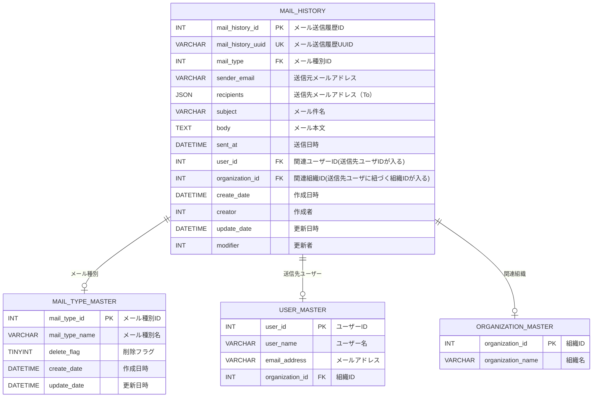

# メール通知履歴 (mail-history) - 機能概要

## 📑 目次

- [基本情報](#基本情報)
- [機能概要](#機能概要)
- [データモデル](#データモデル)
- [使用テーブル一覧](#使用テーブル一覧)
- [画面一覧](#画面一覧)
- [Flaskルート一覧](#flaskルート一覧)
- [関連ドキュメント](#関連ドキュメント)

---

## 基本情報

| 項目 | 内容 |
|------|------|
| 機能ID | FR-005-2 |
| 機能名 | メール通知履歴 |
| カテゴリ | 履歴機能 |
| 画面ID | NTC-005（一覧画面）、NTC-006（参照画面） |
| 実装領域 | Flask アプリケーション |
| ディレクトリ | `docs/03-features/flask-app/mail-history/` |

---

## 機能概要

### 目的

システム内で送信されたメール通知の履歴を参照する機能。アラート通知メール、招待メール、パスワードリセットメールなどの送信履歴を一覧表示し、詳細を確認できる。

### 主要機能

- **メール通知履歴の一覧表示**: 送信されたメールの履歴を一覧表示
- **メール通知履歴の検索・絞り込み**: メール種別、キーワード、日時範囲で検索
- **メール通知履歴の詳細表示**: メールの件名・本文・送信日時などの詳細をモーダルで表示

### 特徴

- **参照専用機能**: 登録・更新・削除機能なし
- **検索機能**: メール種別、キーワード、日時範囲による検索に対応
- **ページネーション**: 大量のメール履歴を効率的に表示

### アクセス権限

| ロール | 権限レベル | アクセス可能なデータ範囲 |
|--------|-----------|---------------------|
| システム保守者 | 〇 | 利用ユーザに紐づくデータのみ |
| 管理者 | 〇 | 利用ユーザに紐づくデータのみ |
| 販社ユーザ | 〇 | 利用ユーザに紐づくデータのみ |
| サービス利用者 | 〇 | 利用ユーザに紐づくデータのみ |

---

## データモデル

### エンティティ関連図（ER図）



### データ項目定義

#### メール通知履歴（mail_history）

| No | カラム名 | 論理名 | データ型 | NULL | デフォルト値 | 説明 |
|----|---------|--------|---------|------|-------------|------|
| 1 | mail_history_id | メール送信履歴ID | INT | NOT NULL | - | 主キー |
| 2 | mail_history_uuid | メール送信履歴UUID | VARCHAR(32) | NOT NULL | - | UUID（外部公開用一意識別子） |
| 3 | mail_type | メール種別ID | INT | NOT NULL | - | メール種別マスタのID（外部キー、mail_type_master.mail_type_id参照）<br>1:アラート通知, 2:招待メール, 3:パスワードリセット, 4:システム通知 |
| 4 | sender_email | 送信元メールアドレス | VARCHAR(254) | NOT NULL | - | 送信元のメールアドレス |
| 5 | recipients | 送信先メールアドレス | JSON | NOT NULL | - | 送信先のメールアドレス（JSON形式） |
| 6 | subject | メール件名 | VARCHAR(500) | NOT NULL | - | メールの件名 |
| 7 | body | メール本文 | TEXT | NOT NULL | - | メールの本文|
| 8 | sent_at | 送信日時 | DATETIME | NOT NULL | - | メール送信日時 |
| 9 | user_id | 関連ユーザーID | INT | NULL | - | 関連するユーザーID（外部キー、user_master.user_id参照） |
| 10 | organization_id | 関連組織ID | INT | NULL | - | 関連する組織ID（外部キー、organization_master.organization_id参照、データスコープ制限用） |
| 11 | create_date | 作成日時 | DATETIME | NOT NULL | NOW() | レコード作成日時 |
| 12 | creator | 作成者 | INT | NOT NULL | システムデフォルト | レコード作成者のユーザID |
| 13 | update_date | 更新日時 | DATETIME | NULL | NOW() | レコード最終更新日時 |
| 14 | modifier | 更新者 | INT | NULL | システムデフォルト | レコード更新者のユーザID |

**外部キー:**
- `mail_type` → `mail_type_master.mail_type_id`
- `user_id` → `user_master.user_id`
- `organization_id` → `organization_master.organization_id`

**ビジネスルール:**
- mail_typeはメール種別マスタのID（1:アラート通知, 2:招待メール, 3:パスワードリセット, 4:システム通知）
- recipientsはJSON形式で、toフィールドに送信先メールアドレスの配列を含む
- メール送信履歴は作成のみで更新は行わない（update_date, modifierは通常NULL）
- データスコープ制限: organization_idでアクセス制御

**recipients JSON構造:**

```json
{
  "to": ["user1@example.com", "user2@example.com"]
}
```
---

## 使用テーブル一覧

| No | テーブル名 | 論理名 | 操作種別 | 用途 |
|----|-----------|--------|---------|------|
| 1 | mail_history | メール送信履歴 | SELECT | メール通知履歴の一覧・検索・参照 |
| 2 | user_master | ユーザーマスタ | SELECT | 認証・認可、ユーザー情報の取得 |
| 3 | organization_master | 組織マスタ | SELECT | 認証・認可、ユーザー情報の取得 |
| 4 | sort_item_master | ソート項目マスタ | SELECT | ソート項目の検証 |
| 5 | mail_type_master | メール種別マスタ | SELECT | 名称の取得 |

**注:** テーブル詳細は [アプリケーションデータベース設計書](../../common/app-database-specification.md) を参照してください。

### インデックス設計

| テーブル名 | インデックス名 | カラム | 種別 | 用途 |
|-----------|--------------|--------|------|------|
| mail_history | PRIMARY | mail_history_id | PRIMARY KEY | 主キー |
| mail_history | uk_mail_history_uuid | mail_history_uuid | UNIQUE INDEX | UUID検索高速化、一意性保証 |
| mail_history | idx_organization_id | organization_id | INDEX | データスコープ制限用 |
| mail_history | idx_sent_at | sent_at | INDEX | 日時範囲検索用 |
| mail_history | idx_mail_type | mail_type | INDEX | メール種別検索用 |

---

## 画面一覧

| 画面ID | 画面名 | パス | 概要 |
|--------|--------|------|------|
| NTC-005 | メール通知履歴一覧画面 | `/notice/mail-history` | メール通知履歴の一覧・検索 |
| NTC-006 | メール通知履歴参照画面 | `/notice/mail-history/<mail_history_uuid>` | メール通知履歴の詳細表示（モーダル） |

---

## Flaskルート一覧

| No | ルート名 | エンドポイント | メソッド | 用途 | レスポンス形式 | 備考 |
|----|---------|---------------|---------|------|---------------|------|
| 1 | メール通知履歴一覧表示（初期表示） | `/notice/mail-history` | GET | メール通知履歴一覧表示（検索条件なし）、ページング処理 | HTML | ページング対応、Cookieから検索条件を取得 |
| 2 | メール通知履歴検索 | `/notice/mail-history` | POST | メール通知履歴検索（検索条件あり） | HTML | 検索条件をCookieに保存 |
| 3 | メール通知履歴詳細表示 | `/notice/mail-history/<mail_history_uuid>` | GET | メール通知履歴詳細表示（モーダル） | HTML | Jinja2パーシャルテンプレート |

## 関連ドキュメント

### 機能設計・仕様

- [UI仕様書](./ui-specification.md) - 画面レイアウト、UI要素の詳細仕様
- [ワークフロー仕様書](./workflow-specification.md) - ユーザー操作の処理フローと動作詳細
- [機能要件定義書](../../../02-requirements/functional-requirements.md) - FR-005-2: メール通知履歴
- [非機能要件定義書](../../../02-requirements/non-functional-requirements.md) - パフォーマンス・セキュリティ要件
- [技術要件定義書](../../../02-requirements/technical-requirements.md) - Flask/Jinja2技術仕様

### アーキテクチャ設計

- [アーキテクチャ概要](../../../01-architecture/overview.md)
- [バックエンド設計](../../../01-architecture/backend.md) - Flask/Blueprint設計
- [フロントエンド設計](../../../01-architecture/frontend.md) - Flask + Jinja2設計
- [データベース設計](../../../01-architecture/database.md) - テーブル定義、インデックス設計

### 共通仕様

- [共通仕様書](../../common/common-specification.md) - HTTPステータスコード、エラーコード、セキュリティ等
- [UI共通仕様書](../../common/ui-common-specification.md) - すべての画面に共通するUI仕様
- [アプリケーションデータベース設計書](../../common/app-database-specification.md) - テーブル定義、インデックス設計

---

**このドキュメントは、実装前に必ずレビューを受けてください。**
