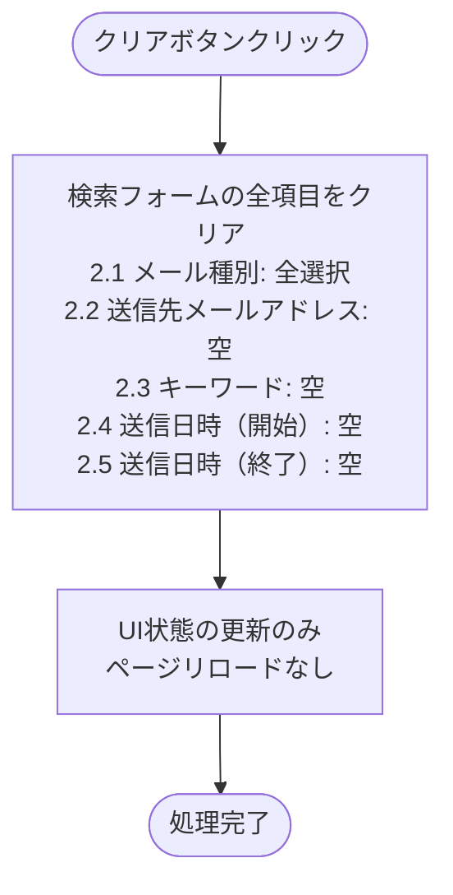

# メール通知履歴 - ワークフロー仕様書

## 📑 目次

- [概要](#概要)
- [使用するFlaskルート一覧](#使用するflaskルート一覧)
- [ワークフロー一覧](#ワークフロー一覧)
  - [初期表示](#初期表示)
  - [検索・絞り込み](#検索絞り込み)
  - [ソート](#ソート)
  - [ページング](#ページング)
  - [メール通知履歴詳細表示](#メール通知履歴詳細表示)
  - [その他の操作](#その他の操作)
- [使用データベース詳細](#使用データベース詳細)
- [セキュリティ実装](#セキュリティ実装)
- [関連ドキュメント](#関連ドキュメント)

---

## 概要

このドキュメントは、メール通知履歴画面のユーザー操作に対する処理フロー、バリデーション実行タイミング、データベース処理の詳細を記載します。

**このドキュメントの役割:**
- ✅ ユーザー操作のトリガー条件
- ✅ 処理フローの詳細（Flaskルート呼び出しシーケンス）
- ✅ バリデーション実行タイミング（いつチェックするか）
- ✅ エラーハンドリングフロー
- ✅ サーバーサイド処理詳細（SQL、変数、条件分岐、コード例）
- ✅ データベース利用詳細（テーブル操作、インデックス）
- ✅ セキュリティ実装詳細（認証、データスコープ制限、ログ出力）

**UI仕様書との役割分担:**
- **UI仕様書**: バリデーションルール定義（何をチェックするか）、UI要素の詳細仕様
- **ワークフロー仕様書**: バリデーション実行タイミング（いつどのようにチェックするか）、処理フロー、サーバーサイド実装詳細

**注:** UI要素の詳細やバリデーションルールは [UI仕様書](./ui-specification.md) を参照してください。

---

## 使用するFlaskルート一覧

この画面で使用するすべてのFlaskルート（エンドポイント）を記載します。

| No | ルート名 | エンドポイント | メソッド | 用途 | レスポンス形式 | 備考 |
|----|---------|---------------|---------|------|---------------|------|
| 1 | メール通知履歴一覧表示 | `/notice/mail-history` | GET | メール通知履歴一覧表示 | HTML | ページング・検索対応 |
| 2 | メール通知履歴詳細表示 | `/notice/mail-history/<mail_history_id>` | GET | メール通知履歴詳細表示（モーダル） | HTML（パーシャル） | Jinja2パーシャルテンプレート |

**注:**
- **レスポンス形式**:
  - `HTML`: Jinja2テンプレートをレンダリングして返す（`render_template()`）
  - `HTML（パーシャル）`: モーダル内部のHTMLのみを返す（`render_template('mail-history/detail_modal.html')`）
- **Flask Blueprint構成**: `notice_bp`（通知機能Blueprint）
- **SSR特性**: すべての処理はサーバーサイドで完結（JSONレスポンスなし）

---

## ワークフロー一覧

### 初期表示

**トリガー:** URL直接アクセス時（ユーザーが画面にアクセスしたとき）

**前提条件:**
- ユーザーがログイン済み（Databricks認証完了）
- 適切な権限を持っている（システム保守者、管理者、販社ユーザ、サービス利用者）

#### 処理フロー

```mermaid
flowchart TD
    Start([URL直接アクセス]) --> Auth[認証チェック<br>Databricksリバースプロキシヘッダ確認]
    Auth --> CheckAuth{認証済み?}
    CheckAuth -->|未認証| LoginRedirect[ログイン画面へリダイレクト]

    CheckAuth -->|認証済み| Permission[権限チェック<br>システム保守者、管理者、販社ユーザ、サービス利用者]
    Permission --> CheckPerm{権限OK?}
    CheckPerm -->|権限なし| Error403[403エラーページ表示]

    CheckPerm -->|権限OK| Init[検索条件を初期化<br>page=1, per_page=25<br>sort_by=sent_at, order=desc]
    Init --> Query[DBクエリ実行<br>SELECT * FROM mail_history<br>WHERE organization_id=現在の組織ID<br>ORDER BY sent_at DESC<br>LIMIT 25 OFFSET 0]
    Query --> CheckDB{DBクエリ<br>結果}

    CheckDB -->|成功| Template[Jinja2テンプレートレンダリング<br>render_template('mail-history/list.html'<br>mail_histories=histories, total=total, page=1)]
    Template --> Response[HTMLレスポンス返却]

    CheckDB -->|失敗| Error500[500エラーページ表示]

    LoginRedirect --> End([処理完了])
    Error403 --> End
    Response --> End
    Error500 --> End
```

#### Flaskルート

| ルート | エンドポイント | 詳細 |
|-------|---------------|------|
| メール通知履歴一覧表示 | `GET /notice/mail-history` | クエリパラメータ: `page`, `mail_types`, `recipient_email`, `keyword`, `sent_at_start`, `sent_at_end`, `sort_by`, `order` |

#### バリデーション

**実行タイミング:** なし（初期表示のため、デフォルト値を使用）

**データスコープ制限:**
- ログインユーザーの `organization_id` でデータを自動的にフィルタリング
- SQL WHERE句に `organization_id = current_user.organization_id` を追加

#### 処理詳細（サーバーサイド）

**① 認証・認可チェック**

リバースプロキシヘッダから認証情報を取得し、権限を確認します。

**処理内容:**
- ヘッダ `X-Forwarded-User` からユーザーIDを取得
- ヘッダ `X-Forwarded-Email` からメールアドレスを取得
- データベースから現在ユーザー情報を取得（ロール、組織ID）

**変数・パラメータ:**
- `current_user_id`: string - リバースプロキシヘッダから取得したユーザーID
- `current_user`: User - データベースから取得したユーザーオブジェクト
- `organization_id`: string - 現在ユーザーの組織ID（データスコープ制限用）

**実装例:**
```python
from flask import request, abort

def get_current_user():
    user_id = request.headers.get('X-Forwarded-User')
    if not user_id:
        abort(401)

    user = User.query.filter_by(user_id=user_id).first()
    if not user:
        abort(403)

    return user

current_user = get_current_user()
organization_id = current_user.organization_id
```

**② クエリパラメータ取得とバリデーション**

リクエストからクエリパラメータを取得し、デフォルト値を設定します。

**処理内容:**
- `page`: ページ番号（デフォルト: 1）
- `per_page`: 1ページあたりの件数（デフォルト: 25）
- `sort_by`: ソートフィールド（デフォルト: sent_at）
- `order`: ソート順（デフォルト: desc）

**変数・パラメータ:**
- `page`: int - ページ番号
- `per_page`: int - 1ページあたりの件数
- `sort_by`: string - ソートフィールド
- `order`: string - ソート順（asc/desc）

**パラメータ検証:**
- `page`: 1以上の整数
- `per_page`: 1以上、100以下の整数
- `sort_by`: 許可されたフィールド名のみ（mail_type, sender_email, subject, sent_at）
- `order`: ascまたはdescのみ

**実装例:**
```python
page = max(1, request.args.get('page', 1, type=int))
per_page = min(100, max(1, request.args.get('per_page', 25, type=int)))
sort_by = request.args.get('sort_by', 'sent_at')
order = request.args.get('order', 'desc')

# ソート項目の検証
allowed_sort_fields = ['mail_type', 'sender_email', 'subject', 'sent_at']
if sort_by not in allowed_sort_fields:
    sort_by = 'sent_at'

# ソート順の検証
if order not in ['asc', 'desc']:
    order = 'desc'
```

**③ データベースクエリ実行**

メール送信履歴テーブルからデータを取得します。

**使用テーブル:** mail_history（メール送信履歴）

**トランザクション管理:**
- この機能は読み取り専用（SELECT）のため、トランザクション開始は不要
- オートコミットモードで実行（SQLAlchemyデフォルト）
- 詳細は [共通仕様書 - トランザクション管理](../../common/common-specification.md#トランザクション管理) を参照

**SQL詳細:**
```sql
SELECT
  mail_history_id,
  mail_type,
  sender_email,
  recipient_email,
  subject,
  body,
  sent_at
FROM
  mail_history
WHERE
  organization_id = :organization_id
ORDER BY
  {sort_by} {order}
LIMIT :per_page OFFSET :offset
```

**変数・パラメータ:**
- `organization_id`: string - データスコープ制限用の組織ID
- `offset`: int - ページングオフセット（計算式: `(page - 1) * per_page`）
- `mail_histories`: list - 検索結果のメール送信履歴リスト
- `total`: int - 総件数（ページネーション用）

**実装例:**
```python
offset = (page - 1) * per_page

mail_histories = MailHistory.query.filter_by(
    organization_id=organization_id
).order_by(
    getattr(MailHistory, sort_by).desc() if order == 'desc' else getattr(MailHistory, sort_by).asc()
).limit(per_page).offset(offset).all()

total = MailHistory.query.filter_by(
    organization_id=organization_id
).count()
```

**④ HTMLレンダリング**

Jinja2テンプレートをレンダリングしてHTMLレスポンスを返却します。

**処理内容:**
- テンプレート: `mail-history/list.html`
- コンテキスト: `mail_histories`, `total`, `page`, `per_page`, `sort_by`, `order`

**実装例:**
```python
return render_template('mail-history/list.html',
                      mail_histories=mail_histories,
                      total=total,
                      page=page,
                      per_page=per_page,
                      sort_by=sort_by,
                      order=order)
```

#### 表示メッセージ

| メッセージID | 表示内容 | 表示タイミング | 表示場所 |
|-------------|---------|---------------|---------|
| ERR_001 | データの取得に失敗しました | DBクエリ失敗時 | エラーページ |
| INFO_001 | メール通知履歴が見つかりませんでした | 検索結果が0件 | (3) データテーブル内（情報） |

#### エラーハンドリング

| HTTPステータス | エラー種別 | 処理内容 | 表示内容 |
|--------------|-----------|---------|---------|
| 401 | 認証エラー | ログイン画面へリダイレクト | - |
| 403 | 権限エラー | 403エラーページ表示 | この操作を実行する権限がありません |
| 500 | データベースエラー | 500エラーページ表示 | データの取得に失敗しました |

#### UI状態

- 検索条件: デフォルト値（空）
- テーブル: メール通知履歴データ表示
- ページネーション: 1ページ目を選択状態

---

### 検索・絞り込み

**トリガー:** (2.6) 検索ボタンクリック（フォーム送信）

**前提条件:**
- 検索条件が入力されている（空でも可）

#### 処理フロー

```mermaid
flowchart TD
    Start([検索ボタンクリック<br>フォーム送信]) --> Validate[サーバーサイドバリデーション<br>WTForms検証]
    Validate --> ValidCheck{バリデーション<br>結果}

    ValidCheck -->|エラー| ValidError[フォーム再表示<br>エラーメッセージ付き]
    ValidError --> ValidEnd([処理中断])

    ValidCheck -->|OK| Convert[検索条件をクエリパラメータに変換<br>mail_types: form.mail_types.data<br>recipient_email: form.recipient_email.data<br>keyword: form.keyword.data<br>sent_at_start: form.sent_at_start.data<br>sent_at_end: form.sent_at_end.data<br>page: 1（リセット）<br>per_page: 25<br>現在のソート条件を保持]
    Convert --> Query[DBクエリ実行<br>SELECT * FROM mail_history<br>WHERE organization_id=現在の組織ID<br>AND mail_type IN (mail_types)<br>AND recipient_email LIKE '%keyword%'<br>AND (subject LIKE '%keyword%' OR body LIKE '%keyword%')<br>AND sent_at BETWEEN sent_at_start AND sent_at_end<br>ORDER BY sent_at DESC<br>LIMIT 25 OFFSET 0]
    Query --> CheckDB{DBクエリ<br>結果}

    CheckDB -->|成功| Template[Jinja2テンプレートレンダリング<br>render_template('mail-history/list.html'<br>mail_histories=histories, ...)]
    Template --> Response[HTMLレスポンス返却]

    CheckDB -->|失敗| Error500[500エラーページ表示]

    ValidEnd --> End([処理完了])
    Response --> End
    Error500 --> End
```

**パラメータ例:**
```
GET /notice/mail-history?mail_types=alert&recipient_email=user@example.com&keyword=アラート&sent_at_start=2025-12-01&sent_at_end=2025-12-10&page=1&per_page=25&sort_by=sent_at&order=desc
```

#### Flaskルート

| ルート | エンドポイント | 詳細 |
|-------|---------------|------|
| メール通知履歴一覧表示（検索） | `GET /notice/mail-history` | クエリパラメータ: `mail_types`, `recipient_email`, `keyword`, `sent_at_start`, `sent_at_end`, `page`, `sort_by`, `order` |

#### バリデーション

**実行タイミング:** フォーム送信直後（サーバーサイド）

**バリデーション対象:** (2.1) メール種別、(2.2) 送信先メールアドレス、(2.3) キーワード、(2.4) 送信日時（開始）、(2.5) 送信日時（終了）

**バリデーションルール:** [UI仕様書](./ui-specification.md) の要素詳細 (2) 検索フォーム > バリデーション を参照

**エラー表示:**
- 表示場所: 各入力フィールドの下（フォーム再表示時）
- 表示方法: 赤色テキスト、入力フィールドを赤枠で囲む

#### 処理詳細（サーバーサイド）

**① フォーム検証（WTForms）**

WTFormsを使用してフォームデータを検証します。

**処理内容:**
- `mail_types`: 許可された値のみ（alert, invitation, password_reset, system）
- `recipient_email`: 最大255文字、メールアドレス形式（入力された場合）
- `keyword`: 最大255文字
- `sent_at_start`, `sent_at_end`: 開始日時 ≦ 終了日時

**変数・パラメータ:**
- `form`: SearchForm - WTFormsフォームオブジェクト
- `mail_types`: list - メール種別フィルタ
- `recipient_email`: string - 送信先メールアドレス（部分一致）
- `keyword`: string - キーワード（件名・本文、部分一致）
- `sent_at_start`: date - 送信日時（開始）
- `sent_at_end`: date - 送信日時（終了）

**実装例:**
```python
from flask import request, render_template
from flask_wtf import FlaskForm
from wtforms import StringField, SelectMultipleField, DateField
from wtforms.validators import Length, Email, Optional

class SearchForm(FlaskForm):
    mail_types = SelectMultipleField('メール種別', choices=[
        ('alert', 'アラート通知'),
        ('invitation', '招待メール'),
        ('password_reset', 'パスワードリセット'),
        ('system', 'システム通知')
    ])
    recipient_email = StringField('送信先メールアドレス', validators=[Optional(), Length(max=255), Email()])
    keyword = StringField('キーワード', validators=[Optional(), Length(max=255)])
    sent_at_start = DateField('送信日時（開始）', validators=[Optional()])
    sent_at_end = DateField('送信日時（終了）', validators=[Optional()])

form = SearchForm(request.args)
if not form.validate():
    return render_template('mail-history/list.html', form=form, mail_histories=[], errors=form.errors)

mail_types = form.mail_types.data or []
recipient_email = form.recipient_email.data or ''
keyword = form.keyword.data or ''
sent_at_start = form.sent_at_start.data
sent_at_end = form.sent_at_end.data
```

**② 検索クエリ実行**

検索条件に基づいてデータベースからメール送信履歴を取得します。

**使用テーブル:** mail_history（メール送信履歴）

**SQL詳細:**
```sql
SELECT
  mail_history_id,
  mail_type,
  sender_email,
  recipient_email,
  subject,
  body,
  sent_at
FROM
  mail_history
WHERE
  organization_id = :organization_id
  AND (
    CASE WHEN :mail_types IS NOT NULL THEN mail_type IN :mail_types ELSE TRUE END
  )
  AND (
    CASE WHEN :recipient_email IS NOT NULL THEN recipient_email LIKE :recipient_email ELSE TRUE END
  )
  AND (
    CASE WHEN :keyword IS NOT NULL THEN (subject LIKE :keyword OR body LIKE :keyword) ELSE TRUE END
  )
  AND (
    CASE WHEN :sent_at_start IS NOT NULL THEN sent_at >= :sent_at_start ELSE TRUE END
  )
  AND (
    CASE WHEN :sent_at_end IS NOT NULL THEN sent_at <= :sent_at_end ELSE TRUE END
  )
ORDER BY
  {sort_by} {order}
LIMIT :per_page OFFSET :offset
```

**変数・パラメータ:**
- `mail_types`: list - メール種別フィルタ
- `recipient_email`: string - 部分一致検索用（`%recipient_email%`）
- `keyword`: string - 部分一致検索用（`%keyword%`）
- `sent_at_start`: date - 送信日時（開始）
- `sent_at_end`: date - 送信日時（終了）
- `offset`: int - ページングオフセット

**実装例:**
```python
query = MailHistory.query.filter_by(
    organization_id=current_user.organization_id
)

if mail_types:
    query = query.filter(MailHistory.mail_type.in_(mail_types))

if recipient_email:
    query = query.filter(MailHistory.recipient_email.like(f'%{recipient_email}%'))

if keyword:
    query = query.filter(
        or_(
            MailHistory.subject.like(f'%{keyword}%'),
            MailHistory.body.like(f'%{keyword}%')
        )
    )

if sent_at_start:
    query = query.filter(MailHistory.sent_at >= sent_at_start)

if sent_at_end:
    query = query.filter(MailHistory.sent_at <= sent_at_end)

mail_histories = query.order_by(
    getattr(MailHistory, sort_by).desc() if order == 'desc' else getattr(MailHistory, sort_by).asc()
).limit(per_page).offset(offset).all()

total = query.count()
```

#### 表示メッセージ

| メッセージID | 表示内容 | 表示タイミング | 表示場所 |
|-------------|---------|---------------|---------|
| ERR_001 | データの取得に失敗しました | DBクエリ失敗時 | エラーページ |
| INFO_001 | メール通知履歴が見つかりませんでした | 検索結果が0件 | (3) データテーブル内（情報） |

#### エラーハンドリング

| HTTPステータス | エラー種別 | 処理内容 | 表示内容 |
|--------------|-----------|---------|---------|
| 400 | バリデーションエラー | フォーム再表示（エラーメッセージ付き） | バリデーションエラーメッセージ |
| 500 | データベースエラー | 500エラーページ表示 | データの取得に失敗しました |

#### UI状態

- 検索条件: 入力値を保持（フォームに再設定）
- テーブル: 検索結果データ表示
- ページネーション: 1ページ目にリセット

---

### ソート

**トリガー:** (3) データテーブルのソート可能カラムのヘッダークリック

**前提条件:**
- ソート可能なカラム（(3.1), (3.2), (3.3), (3.5)）のヘッダーをクリック

#### 処理フロー

ソート処理は、現在の検索条件を保持したまま、ソート条件を変更してページをリロードします。

**パラメータ例:**
```
# メール種別でソート（昇順）
GET /notice/mail-history?mail_types=alert&sort_by=mail_type&order=asc&page=1&per_page=25

# 送信日時でソート（降順）
GET /notice/mail-history?mail_types=alert&sort_by=sent_at&order=desc&page=1&per_page=25
```

#### バリデーション

**実行タイミング:** なし

#### UI状態

- 検索条件: 保持
- ソート条件: 更新
- テーブル: ソート済みデータ表示
- ページネーション: 1ページ目にリセット

---

### ページング

**トリガー:** (3.7) ページネーションのページ番号ボタンクリック

**前提条件:**
- 複数ページのデータが存在する

#### 処理フロー

ページング処理は、現在の検索条件とソート条件を保持したまま、ページ番号を変更してページをリロードします。

**パラメータ例:**
```
# 2ページ目に遷移
GET /notice/mail-history?mail_types=alert&sort_by=sent_at&order=desc&page=2&per_page=25

# 5ページ目に遷移
GET /notice/mail-history?mail_types=alert&sort_by=sent_at&order=desc&page=5&per_page=25
```

#### バリデーション

**実行タイミング:** なし

#### UI状態

- 検索条件: 保持
- ソート条件: 保持
- テーブル: 選択ページのデータ表示
- ページネーション: 選択ページをアクティブ状態

---

### メール通知履歴詳細表示

**トリガー:** (3.6) 詳細ボタンクリック

**前提条件:** なし

#### 処理フロー

```mermaid
flowchart TD
    Start([詳細ボタンクリック]) --> GetID[クリックされた行のメール送信履歴IDを取得]
    GetID --> Request[サーバーにリクエスト<br>GET /notice/mail-history/mail_history_id]
    Request --> Auth[認証・権限チェック]
    Auth --> CheckAuth{認証・権限OK?}

    CheckAuth -->|NG| Error403[403エラー]
    CheckAuth -->|OK| Query[DBクエリ実行<br>SELECT * FROM mail_history<br>WHERE mail_history_id = mail_history_id<br>AND organization_id = current_user.organization_id]
    Query --> CheckDB{データ取得<br>結果}

    CheckDB -->|見つからない| Error404[404エラー<br>データが見つかりません]
    CheckDB -->|成功| Template[Jinja2パーシャルテンプレートレンダリング<br>render_template('mail-history/detail_modal.html'<br>mail_history=history)]
    Template --> Response[HTMLレスポンス返却<br>モーダル内部のHTMLのみ]
    Response --> Modal[モーダルを開く]

    Error403 --> End([処理完了])
    Error404 --> End
    Modal --> End
```

#### Flaskルート

| ルート | エンドポイント | 詳細 |
|-------|---------------|------|
| メール通知履歴詳細表示 | `GET /notice/mail-history/<mail_history_id>` | パスパラメータ: `mail_history_id` |

#### バリデーション

**実行タイミング:** なし

#### 処理詳細（サーバーサイド）

**① メール送信履歴取得**

データベースから指定されたメール送信履歴を取得します。

**使用テーブル:** mail_history（メール送信履歴）

**SQL詳細:**
```sql
SELECT
  mail_history_id,
  mail_type,
  sender_email,
  recipient_email,
  subject,
  body,
  sent_at
FROM
  mail_history
WHERE
  mail_history_id = :mail_history_id
  AND organization_id = :organization_id
```

**変数・パラメータ:**
- `mail_history_id`: string - メール送信履歴ID
- `organization_id`: string - データスコープ制限用の組織ID

**実装例:**
```python
@notice_bp.route('/mail-history/<mail_history_id>', methods=['GET'])
def mail_history_detail(mail_history_id):
    current_user = get_current_user()

    mail_history = MailHistory.query.filter_by(
        mail_history_id=mail_history_id,
        organization_id=current_user.organization_id
    ).first()

    if not mail_history:
        abort(404)

    return render_template('mail-history/detail_modal.html',
                          mail_history=mail_history)
```

#### 表示メッセージ

| メッセージID | 表示内容 | 表示タイミング | 表示場所 |
|-------------|---------|---------------|---------|
| ERR_002 | データが見つかりませんでした | データ不在時 | エラーページ |

#### エラーハンドリング

| HTTPステータス | エラー種別 | 処理内容 | 表示内容 |
|--------------|-----------|---------|---------|
| 403 | 権限エラー | 403エラーページ表示 | この操作を実行する権限がありません |
| 404 | データ不在 | 404エラーページ表示 | データが見つかりませんでした |

#### UI状態

- モーダル: 表示
- 背景: オーバーレイ表示

---

### その他の操作

#### クリアボタン押下

**トリガー:** (2.7) クリアボタンクリック

**前提条件:** なし

#### 処理フロー



**注:** クリア後に検索を実行する場合は、ユーザーが明示的に (2.6) 検索ボタンをクリックする必要があります。

#### バリデーション

**実行タイミング:** なし

#### エラーハンドリング

なし

#### UI状態

- 検索フォーム: すべてクリア
- テーブル: 変更なし（検索ボタン押下まで更新しない）

---

## 使用データベース詳細

### 使用テーブル一覧

| No | テーブル名 | 論理名 | 操作種別 | ワークフロー | 目的 | インデックス利用 |
|----|-----------|--------|---------|------------|------|----------------|
| 1 | mail_history | メール送信履歴 | SELECT | 初期表示、検索 | メール送信履歴取得 | PRIMARY KEY (mail_history_id)<br>INDEX (organization_id)<br>INDEX (sent_at)<br>INDEX (mail_type) |
| 2 | mail_history | メール送信履歴 | SELECT | メール通知履歴詳細表示 | メール送信履歴詳細取得 | PRIMARY KEY (mail_history_id)<br>INDEX (organization_id) |

### インデックス最適化

**使用するインデックス:**
- mail_history.mail_history_id: PRIMARY KEY - メール送信履歴一意識別
- mail_history.organization_id: INDEX - データスコープ制限による検索高速化
- mail_history.sent_at: INDEX - 日時範囲検索高速化
- mail_history.mail_type: INDEX - メール種別検索高速化

**注:** インデックス詳細は [データベース設計書](../../../01-architecture/database.md) を参照してください。

---

## セキュリティ実装

### 認証・認可実装

**認証方式:**
- Databricksリバースプロキシヘッダ認証（`X-Forwarded-User`, `X-Forwarded-Email`）

**認可ロジック:**
- システム保守者: すべてのメール送信履歴を参照可能
- 管理者: すべてのメール送信履歴を参照可能
- 販社ユーザ: 自社に紐づくメール送信履歴のみ参照可能
- サービス利用者: 自社データのみ参照可能

**実装例:**
```python
from functools import wraps
from flask import abort

def require_mail_history_access():
    def decorator(f):
        @wraps(f)
        def decorated_function(*args, **kwargs):
            current_user = get_current_user()
            if current_user.role not in ['system_admin', 'admin', 'sales_user', 'service_user']:
                abort(403)
            return f(*args, **kwargs)
        return decorated_function
    return decorator

@notice_bp.route('/mail-history', methods=['GET'])
@require_mail_history_access()
def mail_history_list():
    # メール通知履歴一覧表示処理
    pass
```

### データスコープ制限

**データスコープ制限実装:**

販社ユーザとサービス利用者は自社に紐づくデータのみ閲覧可能とするため、以下を実装します:

**実装方式:**
- OLTP DBのWHERE句にデータスコープ制限を追加
- `organization_id = current_user.organization_id`

**実装例:**
```python
# データスコープ制限を適用したクエリ
mail_histories = MailHistory.query.filter_by(
    organization_id=current_user.organization_id  # データスコープ制限
).all()
```

### ログ出力ルール

**ログレベル定義:**
- **INFO**: 正常な処理の開始・終了、主要な処理ステップ
- **WARN**: バリデーションエラー、認証・認可エラー（400系エラー）
- **ERROR**: データベースエラー、システムエラー（500系エラー）
- **DEBUG**: 詳細な処理内容、変数値（本番環境では無効化）

**必須出力項目:**
- リクエストID（トレーシング用）
- タイムスタンプ（ISO 8601形式、JST）
- ログレベル
- エンドポイント（Flaskルート）
- HTTPメソッド
- ユーザーID（操作者）
- 組織ID（データスコープ確認用）
- 処理結果（成功/失敗）
- HTTPステータスコード
- 処理時間（ミリ秒）

**エラー時の追加出力項目:**
- エラーコード
- エラーメッセージ
- スタックトレース（500系エラーのみ）

**出力禁止項目（機密情報）:**
- ❌ パスワード（存在しない）
- ❌ 認証トークン
- ❌ セッションID
- ❌ CSRFトークン
- ❌ メール本文の内容（個人情報保護のため、IDのみ記録）

**ログフォーマット:**
```
[2025-12-10T10:30:00.123+09:00] [INFO] [req_abc123] [GET /notice/mail-history] user_id=usr_001 organization_id=org_001 status=200 time=45ms
```

**実装例:**
```python
import logging
import time
from flask import request, g

logger = logging.getLogger(__name__)

@notice_bp.before_request
def before_request():
    """リクエスト開始時刻を記録"""
    g.start_time = time.time()
    g.request_id = request.headers.get('X-Request-ID', str(uuid.uuid4()))

@notice_bp.after_request
def after_request(response):
    """リクエスト終了時のログ出力"""
    if hasattr(g, 'start_time'):
        elapsed_time = int((time.time() - g.start_time) * 1000)
        current_user = get_current_user()
        logger.info(
            f"[{g.request_id}] [{request.method} {request.path}] "
            f"user_id={current_user.user_id} "
            f"organization_id={current_user.organization_id} "
            f"status={response.status_code} time={elapsed_time}ms"
        )
    return response

@notice_bp.route('/mail-history', methods=['GET'])
def mail_history_list():
    current_user = get_current_user()
    logger.info(
        f"[{g.request_id}] メール通知履歴一覧表示開始 - "
        f"user_id={current_user.user_id} organization_id={current_user.organization_id}"
    )

    try:
        mail_histories = get_mail_histories()
        logger.info(
            f"[{g.request_id}] メール通知履歴一覧表示成功 - "
            f"user_id={current_user.user_id} count={len(mail_histories)}"
        )
        return render_template('mail-history/list.html', mail_histories=mail_histories)

    except Exception as e:
        logger.error(
            f"[{g.request_id}] メール通知履歴一覧表示失敗（サーバーエラー） - "
            f"user_id={current_user.user_id} error={type(e).__name__}",
            exc_info=True  # スタックトレースを出力
        )
        abort(500)
```

**ログローテーション:**
- ローテーション周期: 日次（毎日0時）
- 保存期間: 90日間
- 圧縮: あり（gzip）
- ファイルサイズ上限: 100MB（超過時は即座にローテーション）

詳細は [共通仕様書 - ログ出力ポリシー](../../common/common-specification.md#ログ出力ポリシー) を参照してください。

---

## 関連ドキュメント

### 画面仕様
- [機能概要 README](./README.md) - 画面の概要、データモデル、使用するテーブル一覧
- [UI仕様書](./ui-specification.md) - UI要素の詳細、バリデーションルール定義

### アーキテクチャ設計
- [バックエンド設計](../../../01-architecture/backend.md) - Flask/Blueprint設計
- [データベース設計](../../../01-architecture/database.md) - テーブル定義、インデックス設計

### 共通仕様
- [共通仕様書](../../common/common-specification.md) - HTTPステータスコード、エラーコード、トランザクション管理、セキュリティ等
- [UI共通仕様書](../../common/ui-common-specification.md) - すべての画面に共通するUI仕様

---

**このワークフロー仕様書は、実装前に必ずレビューを受けてください。**
