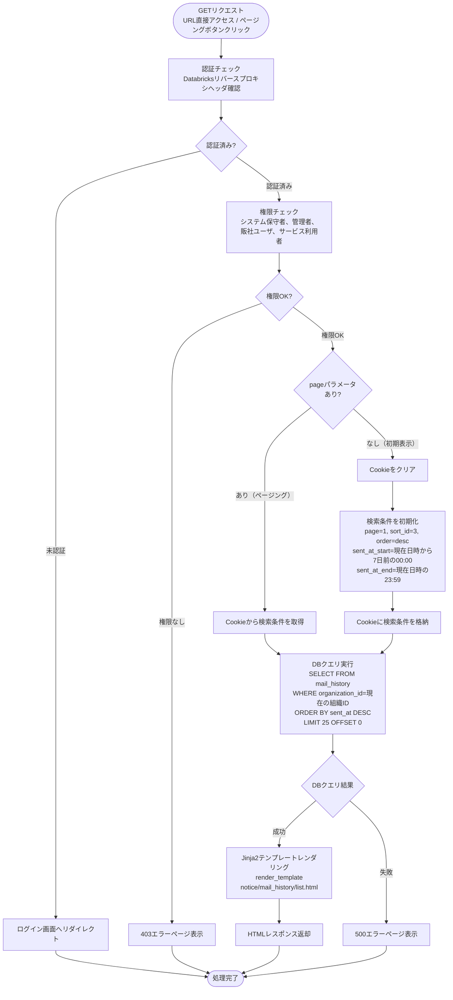
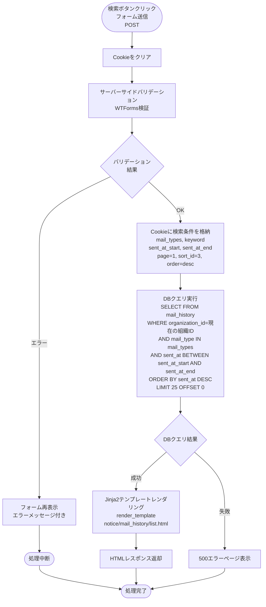
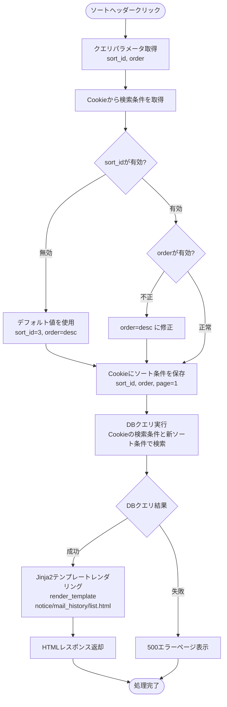
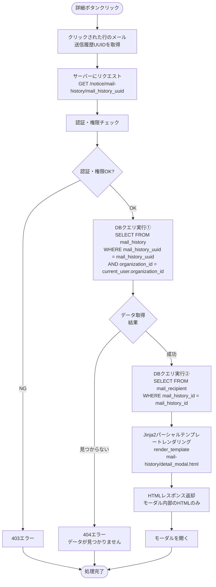
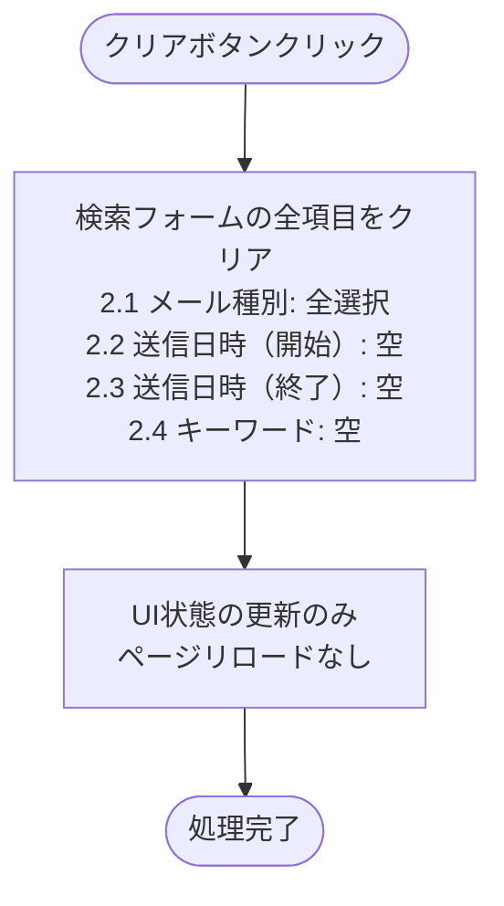

# メール通知履歴 - ワークフロー仕様書

## 📑 目次

- [メール通知履歴 - ワークフロー仕様書](#メール通知履歴---ワークフロー仕様書)
  - [📑 目次](#-目次)
  - [概要](#概要)
  - [使用するFlaskルート一覧](#使用するflaskルート一覧)
  - [ルート呼び出しマッピング](#ルート呼び出しマッピング)
  - [ワークフロー一覧](#ワークフロー一覧)
    - [初期表示](#初期表示)
    - [検索・絞り込み](#検索絞り込み)
    - [ソート](#ソート)
    - [ページング](#ページング)
    - [メール通知履歴詳細表示](#メール通知履歴詳細表示)
    - [その他の操作](#その他の操作)
  - [使用データベース詳細](#使用データベース詳細)
    - [使用テーブル一覧](#使用テーブル一覧)
    - [インデックス最適化](#インデックス最適化)
  - [トランザクション管理](#トランザクション管理)
    - [トランザクション開始・終了タイミング](#トランザクション開始終了タイミング)
  - [セキュリティ実装](#セキュリティ実装)
    - [認証・認可実装](#認証認可実装)
    - [データスコープ制限](#データスコープ制限)
    - [入力値の安全性確保（共通仕様）](#入力値の安全性確保共通仕様)
    - [ログ出力ルール](#ログ出力ルール)
  - [関連ドキュメント](#関連ドキュメント)
    - [機能設計・仕様](#機能設計仕様)
    - [アーキテクチャ設計](#アーキテクチャ設計)
    - [共通仕様](#共通仕様)

---

## 概要

このドキュメントは、メール通知履歴画面のユーザー操作に対する処理フロー、バリデーション実行タイミング、データベース処理の詳細を記載します。

**このドキュメントの役割:**
- ✅ ユーザー操作のトリガー条件
- ✅ 処理フローの詳細（Flaskルート呼び出しシーケンス、フォーム送信、リダイレクト）
- ✅ バリデーション実行タイミング（いつチェックするか）
- ✅ エラーハンドリングフロー
- ✅ サーバーサイド処理詳細（SQL、変数、条件分岐、コード例）
- ✅ データベース利用詳細（トランザクション管理、テーブル操作、インデックス）
- ✅ セキュリティ実装詳細（認証、入力検証、ログ出力）

**UI仕様書との役割分担:**
- **UI仕様書**: バリデーションルール定義（何をチェックするか）、UI要素の詳細仕様
- **ワークフロー仕様書**: バリデーション実行タイミング（いつどのようにチェックするか）、処理フロー、サーバーサイド実装詳細

**注:** UI要素の詳細やバリデーションルールは [UI仕様書](./ui-specification.md) を参照してください。

---

## 使用するFlaskルート一覧

この画面で使用するすべてのFlaskルート（エンドポイント）を記載します。

| No | ルート名 | エンドポイント | メソッド | 用途 | レスポンス形式 | 備考 |
|----|---------|---------------|---------|------|---------------|------|
| 1 | メール通知履歴一覧表示（初期表示） | `/notice/mail-history` | GET | メール通知履歴一覧表示（検索条件なし）、ページング処理 | HTML | ページング対応、Cookieから検索条件を取得 |
| 2 | メール通知履歴検索 | `/notice/mail-history` | POST | メール通知履歴検索（検索条件あり） | HTML | 検索条件をCookieに保存 |
| 3 | メール通知履歴詳細表示 | `/notice/mail-history/<mail_history_uuid>` | GET | メール通知履歴詳細表示（モーダル） | HTML（パーシャル） | Jinja2パーシャルテンプレート |

**注:**
- **レスポンス形式**:
  - `HTML`: Jinja2テンプレートをレンダリングして返す（`render_template()`）
  - `HTML（パーシャル）`: モーダル内部のHTMLのみを返す（`render_template('notice/mail_history/detail_modal.html')`）
- **Flask Blueprint構成**: `notice_bp`（通知機能Blueprint）
- **SSR特性**: すべての処理はサーバーサイドで完結（JSONレスポンスなし）

---

## ルート呼び出しマッピング

| ユーザー操作 | トリガー | 呼び出すルート | パラメータ | レスポンス | エラー時の挙動 |
|-------------|---------|-------------|-----------|-----------|---------------|
| 画面初期表示 | URL直接アクセス | `GET /notice/mail-history` | `page=1` | HTML（メール通知履歴一覧画面） | エラーページ表示 |
| 検索ボタン押下 | フォーム送信 | `POST /notice/mail-history` | `mail_type_ids, keyword, sent_at_start, sent_at_end` | HTML（検索結果画面） | エラーメッセージ表示 |
| ページボタン押下 | ボタンクリック | `GET /notice/mail-history` | `page` | HTML（検索結果画面） | エラーページ表示 |
| ソートヘッダークリック | ボタンクリック | `GET /notice/mail-history` | `sort_id, order` | HTML（検索結果画面） | エラーページ表示 |
| 詳細ボタン押下 | ボタンクリック | `GET /notice/mail-history/<mail_history_uuid>` | `mail_history_uuid` | HTML（メール通知履歴参照モーダル） | 404エラーページ表示 |

---

## ワークフロー一覧

### 初期表示

**トリガー:** URL直接アクセス時（ユーザーが画面にアクセスしたとき）

**前提条件:**
- ユーザーがログイン済み（Databricks認証完了）
- 適切な権限を持っている（システム保守者、管理者、販社ユーザ、サービス利用者）

**処理概要:**
- 検索条件なしでメール通知履歴を取得
- デフォルトソート：送信日時（降順）、メール履歴ID（昇順）

#### 処理フロー



#### Flaskルート

| ルート | エンドポイント | 詳細 |
|-------|---------------|------|
| メール通知履歴一覧表示（初期表示） | `GET /notice/mail-history` | クエリパラメータ: `page`, `sort_id`, `order` |

#### バリデーション

**実行タイミング:** なし（初期表示のため、デフォルト値を使用）

**データスコープ制限:**
- ログインユーザーの `organization_id` でデータを自動的にフィルタリング
- SQL WHERE句に `organization_id = current_user.organization_id` を追加

#### 処理詳細（サーバーサイド）

**① 認証・認可チェック**

リバースプロキシヘッダから認証情報を取得し、権限を確認します。

**処理内容:**
- ヘッダ `X-Forwarded-User` からユーザーIDを取得
- ヘッダ `X-Forwarded-Email` からメールアドレスを取得
- データベースから現在ユーザー情報を取得（ロール、組織ID）

**変数・パラメータ:**
- `current_user_id`: string - リバースプロキシヘッダから取得したユーザーID
- `current_user`: User - データベースから取得したユーザーオブジェクト
- `organization_id`: string - 現在ユーザーの組織ID（データスコープ制限用）

**実装例:**
```python
from flask import request, abort
import logging
import json

logger = logging.getLogger(__name__)

def get_current_user():
    user_id = request.headers.get('X-Forwarded-User')
    if not user_id:
        logger.warning('認証ヘッダーなし')
        abort(401)

    user = User.query.filter_by(user_id=user_id).first()
    if not user:
        logger.warning(f'ユーザーが見つかりません: user_id={user_id}')
        abort(403)

    return user

logger.info('メール通知履歴一覧表示開始')
current_user = get_current_user()
organization_id = current_user.organization_id
logger.info(f'認証・権限チェック成功: user_id={current_user.user_id}, organization_id={organization_id}')
```

**② クエリパラメータ取得とバリデーション**

リクエストからクエリパラメータを取得し、デフォルト値を設定します。

**処理内容:**
- `page`: ページ番号（デフォルト: 1）
- `sort_id`: ソート項目ID（デフォルト: 3 = sent_at）
- `order`: ソート順（デフォルト: desc）

**変数・パラメータ:**
- `page`: int - ページ番号
- `sort_id`: int - ソート項目ID（sort_item_master テーブルの項目ID）
- `sort_by`: string - ソート項目IDから変換されたカラム名
- `order`: string - ソート順（asc/desc）

**パラメータ検証:**
- `page`: 1以上の整数
- `sort_id`: sort_item_master テーブルに存在するIDのみ（1-3）
- `order`: ascまたはdescのみ

**実装例:**
```python
from datetime import datetime, time, timedelta
import pytz

# 設定ファイルから1ページあたりの件数を取得
PER_PAGE = current_app.config.get('MAIL_HISTORY_PER_PAGE', 25)

# ソート項目は sort_item_master テーブルから取得
# view_id = 5（メール通知履歴一覧画面）でフィルタリング
# sort_item_id をキーとして sort_item_name（カラム名）を取得

logger.info('クエリパラメータ取得開始')
page = max(1, request.args.get('page', 1, type=int))
sort_id = request.args.get('sort_id', 3, type=int)  # デフォルト: 3 (sent_at)
order = request.args.get('order', 'desc')

# 検索条件の初期値を設定（現在日時基準、JST）
jst = pytz.timezone('Asia/Tokyo')
now_jst = datetime.now(jst)
default_sent_at_start = now_jst.replace(hour=0, minute=0, second=0, microsecond=0) - timedelta(days=7)
default_sent_at_end = now_jst.replace(hour=23, minute=59, second=0, microsecond=0)

# ソート項目IDの検証とカラム名の取得は sort_item_master テーブルで実施
# ソート順の検証
if order not in ['asc', 'desc']:
    order = 'desc'

logger.info(f'クエリパラメータ取得成功: page={page}, sort_id={sort_id}, order={order}, sent_at_start={default_sent_at_start}, sent_at_end={default_sent_at_end}')
```

**③ データベースクエリ実行**

メール送信履歴テーブルからデータを取得します。

**使用テーブル:** mail_history（メール送信履歴）

**トランザクション管理:**
- この機能は読み取り専用（SELECT）のため、トランザクション開始は不要
- オートコミットモードで実行（SQLAlchemyデフォルト）
- 詳細は [共通仕様書 - トランザクション管理](../../common/common-specification.md#トランザクション管理) を参照

**SQL詳細:**
```sql
SELECT
  mail_history_id,
  mail_type,
  subject,
  body,
  sent_at
FROM
  mail_history
WHERE
  organization_id = :organization_id
ORDER BY
  {sort_by} {order}, mail_history_id ASC
LIMIT :per_page OFFSET :offset
```

**注:** ORDER BY句の`{sort_by}`と`{order}`は、`sort_item_master` テーブルで検証済みのホワイトリスト値のみが使用されます。SQLインジェクション対策として、テーブルに登録された項目ID（1-4）からマッピングされたカラム名と、検証済みのソート順（asc/desc）のみが使用されます。

**変数・パラメータ:**
- `organization_id`: string - データスコープ制限用の組織ID
- `sort_by`: string - sort_item_master テーブルで検証済みのカラム名（mail_type, subject, sent_at のいずれか）
- `order`: string - 検証済みのソート順（asc または desc）
- `offset`: int - ページングオフセット（計算式: `(page - 1) * PER_PAGE`）
- `per_page`: int - 1ページあたりの件数（設定ファイルから取得、デフォルト: 25）
- `mail_histories`: list - 検索結果のメール送信履歴リスト
- `total`: int - 総件数（ページネーション用）

**実装例:**
```python
logger.info('メール通知履歴取得開始')
offset = (page - 1) * PER_PAGE

try:
    query = MailHistory.query.filter_by(organization_id=organization_id)

    total = query.count()
    offset = (page - 1) * PER_PAGE
    mail_histories = query.order_by(
        getattr(MailHistory, sort_by).desc() if order == 'desc' else getattr(MailHistory, sort_by).asc(),
        MailHistory.mail_history_id.asc()  # 第2ソートキー
    ).limit(PER_PAGE).offset(offset).all()

    logger.info(f'メール通知履歴取得成功: count={len(mail_histories)}, total={total}')
except Exception as e:
    logger.error(f'メール通知履歴取得失敗: error={str(e)}')
    raise
```

**④ HTMLレンダリング**

Jinja2テンプレートをレンダリングしてHTMLレスポンスを返却します。

**処理内容:**
- テンプレート: `notice/mail_history/list.html`
- コンテキスト: `mail_histories`, `total`, `page`, `sort_by`, `order`

**実装例:**
```python
logger.info('HTMLレンダリング開始')
return render_template('notice/mail_history/list.html',
                      mail_histories=mail_histories,
                      total=total,
                      page=page,
                      sort_by=sort_by,
                      order=order,
                      sent_at_start=default_sent_at_start.strftime('%Y-%m-%d'),
                      sent_at_end=default_sent_at_end.strftime('%Y-%m-%d'))
```

#### 表示メッセージ

| メッセージID | 表示内容 | 表示タイミング | 表示場所 |
|-------------|---------|---------------|---------|
| ERR_001 | データの取得に失敗しました | DBクエリ失敗時 | エラーページ |
| INFO_001 | メール通知履歴が見つかりませんでした | 検索結果が0件 | (3) データテーブル内（情報） |

#### エラーハンドリング

| HTTPステータス | エラー種別 | 処理内容 | 表示内容 |
|--------------|-----------|---------|---------|
| 401 | 認証エラー | ログイン画面へリダイレクト | - |
| 403 | 権限エラー | toast表示 | アクセス権限がありません |
| 500 | データベースエラー | 500エラーページ表示 | データの取得に失敗しました |

#### UI状態

- 検索条件: 初期値を設定（送信日時（開始）: 現在日時から7日前の00:00、送信日時（終了）: 現在日時の23:59）
- テーブル: メール通知履歴データ表示
- ページネーション: 1ページ目を選択状態

#### ログ出力タイミング

処理開始時、認証・権限チェック、クエリパラメータ取得、DBクエリ実行の各ステップで操作ログを出力する

#### 検索条件の保持方法

Cookieに検索条件を保持する

---

### 検索・絞り込み

**トリガー:** (2.6) 検索ボタンクリック（フォーム送信）

**前提条件:**
- 検索条件が入力されている（空でも可）

**処理概要:**
- POSTメソッドで検索条件を送信
- 検索条件をCookieに保存（ソート・ページング時に利用）
- 検索結果を表示

#### 処理フロー



**リクエスト例:**
```
POST /notice/mail-history

フォームデータ:
mail_type_ids: 1  # 1=alert（アラート通知）
keyword: アラート
sent_at_start: 2025-12-01
sent_at_end: 2025-12-10
```

**注:** フロントエンドから送信されるメール種別はID（1, 2, 3, 4）です。バックエンドでメール種別マスタを使用してIDの妥当性を検証します。これにより、想定外の値がリクエストされることを防止します。

#### Flaskルート

| ルート | エンドポイント | 詳細 |
|-------|---------------|------|
| メール通知履歴検索 | `POST /notice/mail-history` | フォームデータ: `mail_type_ids`, `keyword`, `sent_at_start`, `sent_at_end` |

#### バリデーション

**実行タイミング:** フォーム送信直後（サーバーサイド）

**バリデーション対象:** (2.1) メール種別、(2.2) 送信日時（開始）、(2.3) 送信日時（終了）、(2.4) キーワード

**バリデーションルール:** [UI仕様書](./ui-specification.md) の要素詳細 (2) 検索フォーム > バリデーション を参照

**エラー表示:**
- 表示場所: 各入力フィールドの下（フォーム再表示時）
- 表示方法: 赤色テキスト、入力フィールドを赤枠で囲む

#### 処理詳細（サーバーサイド）

**① フォーム検証（WTForms）**

WTFormsを使用してフォームデータを検証します。

**メール種別マスタテーブル（mail_type_master）:**

フロントエンドから送信されるメール種別IDと実際の値のマッピング定義。セキュリティのため、許可されたIDのみを受け付ける。

**テーブル構造:**

| カラム名 | データ型 | NULL | 説明 |
|---------|---------|------|------|
| mail_type_id | INT | NOT NULL | メール種別ID（主キー） |
| mail_type_name | VARCHAR(50) | NOT NULL | メール種別表示名 |
| delete_flag | TINYINT | NOT NULL | 論理削除フラグ（0:有効、1:削除） |
| create_date | DATETIME | NOT NULL | 作成日時 |
| creator | INT | NOT NULL | レコード作成者のユーザID |
| update_date | DATETIME | NULL | 更新日時 |
| modifier | INT | NULL | レコード更新者のユーザID |

**登録データ:**

| mail_type_id | mail_type_name |
|-------------|----------------|
| 1 | アラート通知 |
| 2 | 招待メール |
| 3 | パスワードリセット |
| 4 | システム通知 |

**処理内容:**
- `mail_type_ids`: mail_type_masterテーブルに存在する有効なメール種別IDのみを受け付ける
- フロントエンドから送信されたIDをmail_type_masterテーブルで検証
- `keyword`: 最大255文字
- `sent_at_start`, `sent_at_end`: 開始日時 ≦ 終了日時

**変数・パラメータ:**
- `form`: SearchForm - WTFormsフォームオブジェクト
- `mail_type_ids`: list - フロントエンドから送信されたメール種別IDリスト
- `valid_mail_types`: list[MailTypeMaster] - mail_type_masterテーブルから取得した有効なメール種別オブジェクトリスト
- `mail_types`: list[int] - 検証済みのメール種別IDリスト
- `keyword`: string - キーワード（件名・本文、部分一致）
- `sent_at_start`: date - 送信日時（開始）
- `sent_at_end`: date - 送信日時（終了）

**実装例:**
```python
from flask import request, render_template, make_response
from flask_wtf import FlaskForm
from wtforms import StringField, SelectMultipleField, DateField
from wtforms.validators import Length, Email, Optional
import json

logger.info(f'メール通知履歴検索開始: user_id={current_user.user_id}')

# メール種別マスタからデータを取得してフォームの選択肢を生成
def get_mail_type_choices() -> list:
    return (
        MailTypeMaster.query
        .filter_by(delete_flag=False)
        .order_by(MailTypeMaster.mail_type_id)
        .all()
    )

# view側でフォームの選択肢を設定する場合
# form.mail_type_ids.choices = [(mt.mail_type_id, mt.mail_type_name) for mt in get_mail_type_choices()]

class SearchForm(FlaskForm):
    # フロントエンドから送信されるのはメール種別ID（1, 2, 3, 4）
    # 選択肢はmail_type_masterテーブルから動的に取得
    mail_type_ids = SelectMultipleField('メール種別', coerce=int, choices=get_mail_type_choices())
    keyword = StringField('キーワード', validators=[Optional(), Length(max=255)])
    sent_at_start = DateField('送信日時（開始）', validators=[Optional()])
    sent_at_end = DateField('送信日時（終了）', validators=[Optional()])

logger.info('フォームバリデーション開始')
form = SearchForm(request.form)
if not form.validate():
    logger.warning(f'フォームバリデーションエラー: errors={form.errors}')
    return render_template('notice/mail_history/list.html', form=form, mail_histories=[], errors=form.errors)

logger.info('フォームバリデーション成功')

# メール種別IDの検証（セキュリティチェック）
# mail_type_masterテーブルから有効なメール種別を取得
logger.info('メール種別マスタ検証開始')
mail_type_ids = form.mail_type_ids.data or []
mail_types = []
if mail_type_ids:
    valid_mail_types = MailTypeMaster.query.filter(
        MailTypeMaster.mail_type_id.in_(mail_type_ids),
        MailTypeMaster.delete_flag == 0
    ).all()
    mail_types = [mt.mail_type_id for mt in valid_mail_types]
    # 許可されていないIDは無視（想定外の値の送信を防止）
    logger.info(f'メール種別マスタ検証成功: valid_count={len(mail_types)}')

# 検索条件をCookieに保存（共通ユーティリティを使用）
# Cookie名: search_conditions_mail_history
# secure属性はAUTH_TYPE='dev'（ローカルHTTP）の場合はFalse、本番はTrue
from iot_app.common.cookie import set_search_conditions_cookie
response = make_response()
set_search_conditions_cookie(response, 'mail_history', {
    'mail_types': mail_types,
    'keyword': form.keyword.data or '',
    'sent_at_start': form.sent_at_start.data.isoformat() if form.sent_at_start.data else None,
    'sent_at_end': form.sent_at_end.data.isoformat() if form.sent_at_end.data else None,
    'page': 1,
    'sort_id': 3,  # デフォルト: 3 (sent_at)
    'order': 'desc'
})

keyword = form.keyword.data or ''
sent_at_start = form.sent_at_start.data
sent_at_end = form.sent_at_end.data
```

**② 検索クエリ実行**

検索条件に基づいてデータベースからメール送信履歴を取得します。

**使用テーブル:** mail_history（メール送信履歴）

**SQL詳細:**
```sql
SELECT
  mail_history_id,
  mail_type,
  subject,
  body,
  sent_at
FROM
  mail_history
WHERE
  organization_id = :organization_id
  AND (
    CASE WHEN :mail_types IS NOT NULL THEN mail_type IN :mail_types ELSE TRUE END
  )
  AND (
    CASE WHEN :keyword IS NOT NULL THEN (subject LIKE :keyword OR body LIKE :keyword) ELSE TRUE END
  )
  AND (
    CASE WHEN :sent_at_start IS NOT NULL THEN sent_at >= :sent_at_start ELSE TRUE END
  )
  AND (
    CASE WHEN :sent_at_end IS NOT NULL THEN sent_at <= :sent_at_end ELSE TRUE END
  )
ORDER BY
  {sort_by} {order}, mail_history_id ASC
LIMIT :per_page OFFSET :offset
```

**注:** ORDER BY句の`{sort_by}`と`{order}`は、`sort_item_master` テーブルで検証済みのホワイトリスト値のみが使用されます。SQLインジェクション対策として、テーブルに登録された項目ID（1-4）からマッピングされたカラム名と、検証済みのソート順（asc/desc）のみが使用されます。

**変数・パラメータ:**
- `organization_id`: string - データスコープ制限用の組織ID
- `mail_types`: list[int] - メール種別IDフィルタ（許可されたID: 1, 2, 3, 4）
- `keyword`: string - 部分一致検索用（`%keyword%`）
- `sent_at_start`: date - 送信日時（開始）
- `sent_at_end`: date - 送信日時（終了）
- `sort_by`: string - sort_item_master テーブルで検証済みのカラム名（mail_type, subject, sent_at のいずれか）
- `order`: string - 検証済みのソート順（asc または desc）
- `offset`: int - ページングオフセット
- `per_page`: int - 1ページあたりの件数（設定ファイルから取得、デフォルト: 25）

**実装例:**
```python
logger.info('検索クエリ実行開始')
try:
    query = MailHistory.query.filter_by(
        organization_id=current_user.organization_id
    )

    if mail_types:
        query = query.filter(MailHistory.mail_type.in_(mail_types))

    if keyword:
        query = query.filter(
            or_(
                MailHistory.subject.like(f'%{keyword}%'),
                MailHistory.body.like(f'%{keyword}%')
            )
        )

    if sent_at_start:
        # date → datetime に変換（当日 00:00:00 から検索）
        start_dt = datetime.combine(sent_at_start, time.min)
        query = query.filter(MailHistory.sent_at >= start_dt)

    if sent_at_end:
        # date → datetime に変換（当日 23:59:59 まで検索）
        end_dt = datetime.combine(sent_at_end, time(23, 59, 59))
        query = query.filter(MailHistory.sent_at <= end_dt)

    mail_histories = query.order_by(
        getattr(MailHistory, sort_by).desc() if order == 'desc' else getattr(MailHistory, sort_by).asc(),
        MailHistory.mail_history_id.asc()  # 第2ソートキー
    ).limit(PER_PAGE).offset(offset).all()

    total = query.count()

    logger.info(f'検索クエリ実行成功: count={len(mail_histories)}, total={total}')
except Exception as e:
    logger.error(f'検索クエリ実行失敗: error={str(e)}')
    raise
```

#### 表示メッセージ

| メッセージID | 表示内容 | 表示タイミング | 表示場所 |
|-------------|---------|---------------|---------|
| ERR_001 | データの取得に失敗しました | DBクエリ失敗時 | エラーページ |
| INFO_001 | メール通知履歴が見つかりませんでした | 検索結果が0件 | (3) データテーブル内（情報） |

#### エラーハンドリング

| HTTPステータス | エラー種別 | 処理内容 | 表示内容 |
|--------------|-----------|---------|---------|
| 422 | バリデーションエラー | フォーム再表示（エラーメッセージ付き） | バリデーションエラーメッセージ |
| 500 | データベースエラー | 500エラーページ表示 | データの取得に失敗しました |

#### UI状態

- 検索条件: 入力値を保持（フォームに再設定）
- テーブル: 検索結果データ表示
- ページネーション: 1ページ目にリセット

#### ログ出力タイミング

処理開始時、フォームバリデーション、メール種別マスタ検証、検索クエリ実行の各ステップで操作ログを出力する

#### 検索条件の保持方法

Cookieに検索条件を保持する

---

### ソート

**トリガー:** (4) データテーブルのソート可能カラムのヘッダークリック

**前提条件:**
- ソート可能なカラム（(4.1)メール種別、(4.2)件名、(4.4)送信日時）のヘッダーをクリック

**処理概要:**
- Cookieから検索条件を取得
- ソート項目IDを使用してソート（ソート項目マスタから実際のカラム名にマッピング）
- ソート条件をCookieに保存
- 検索処理を実行してページをリロード

**ソート項目マスタ:**
フロントエンドから送信されるソート項目IDと実際のカラム名のマッピングは、`sort_item_master` テーブルで管理します。セキュリティのため、テーブルに登録された項目IDのみを受け付けます。

**テーブル構造:** `sort_item_master`

| カラム物理名 | カラム論理名 | データ型 | NULL | PK | FK | デフォルト値 | 説明 |
|------------|------------|---------|------|----|----|-------------|------|
| view_id | 画面ID | INT | NOT NULL | ○ | - | - | 画面固有のID |
| sort_item_id | ソート項目ID | INT | NOT NULL | ○ | - | - | ソート項目固有のID |
| sort_item_name | ソート項目名 | VARCHAR(100) | NOT NULL | - | - | - | ソート項目の内容（カラム名） |
| sort_order | 表示順序 | INT | NOT NULL | - | - | - | ソート項目リストでの表示順 |
| delete_flag | 削除フラグ | BOOLEAN | NOT NULL | - | - | FALSE | 論理削除状態：TRUE　その他の場合：FALSE |
| create_date | 作成日時 | DATETIME | NOT NULL | - | - | CURRENT_TIMESTAMP | レコード作成日時 |
| update_date | 更新日時 | DATETIME | NULL | - | - | - | レコード更新日時 |

**メール通知履歴画面の初期データ（view_id = 5）:**

| view_id | sort_item_id | sort_item_name | sort_order | delete_flag | 説明 |
|---------|-------------|----------------|-----------|------------|------|
| 5 | 1 | mail_type | 1 | FALSE | メール種別 |
| 5 | 2 | subject | 2 | FALSE | 件名 |
| 5 | 3 | sent_at | 3 | FALSE | 送信日時 |

**注意事項:**
- 昇順/降順の情報はテーブルに保持しない
- 現在のソート状態（昇順/降順）はフロントエンドで管理し、リクエストパラメータ `order` (asc/desc) で送信される
- 第2ソートキーとして常に `mail_history_id ASC` を使用し、ページング時の並び順を一定に保つ

#### 処理フロー



ソート処理は、Cookieに保存された検索条件を保持したまま、ソート条件を変更して検索処理を実行します。

**リクエスト例:**
```
# メール種別でソート（昇順） - 項目ID: 1
GET /notice/mail-history?sort_id=1&order=asc

# 送信日時でソート（降順） - 項目ID: 3
GET /notice/mail-history?sort_id=3&order=desc
```

**実装例:**
```python
# ソート項目は sort_item_master テーブルから取得
# view_id = 5（メール通知履歴一覧画面）でフィルタリング

@notice_bp.route('/mail-history', methods=['GET'])
def mail_history_list():
    # Cookieから検索条件を取得（共通ユーティリティを使用）
    # Cookie名: search_conditions_mail_history
    from iot_app.common.cookie import get_search_conditions_cookie, set_search_conditions_cookie
    search_params = get_search_conditions_cookie('mail_history')

    # ソート項目IDを取得
    sort_id = request.args.get('sort_id', search_params.get('sort_id', 3), type=int)  # デフォルト: 3 (sent_at)
    order = request.args.get('order', search_params.get('order', 'desc'))

    # ソート項目IDをカラム名にマッピング（sort_item_master テーブルで検証）
    # view_id = 5, sort_item_id = sort_id, delete_flag = FALSE で検索
    # 取得した sort_item_name をカラム名として使用

    # 昇順/降順の検証
    if order not in ['asc', 'desc']:
        order = 'desc'

    # Cookieに保存（secure属性はAUTH_TYPE='dev'で自動的にFalse）
    search_params['sort_id'] = sort_id
    search_params['order'] = order
    search_params['page'] = 1  # ソート時はページをリセット
    response = make_response()
    set_search_conditions_cookie(response, 'mail_history', search_params)

    # 検索条件でクエリ実行（第2ソートキーとしてmail_history_idを使用）
    # 注: sort_byはsort_item_masterテーブルで検証済みのため、SQLインジェクションのリスクはない
    # ORDER BY {sort_by} {order}, mail_history_id ASC
    # ...
```

#### バリデーション

**実行タイミング:** なし

#### UI状態

- 検索条件: 保持
- ソート条件: 更新
- テーブル: ソート済みデータ表示
- ページネーション: 1ページ目にリセット

#### ログ出力タイミング

ソート項目変更時、Cookie更新、検索クエリ実行の各ステップで操作ログを出力する

---

### ページング

**トリガー:** (4.6) ページネーションのページ番号ボタンクリック

**前提条件:**
- 複数ページのデータが存在する

**処理概要:**
- ページングは `GET /notice/mail-history?page=N` として初期表示と同一エンドポイントで処理される
- 初期表示フローの「pageパラメータあり（ページング）」分岐で処理が行われる
- Cookieから検索条件・ソート条件を取得し、指定ページのデータを表示する
- **Cookieはクリアせず、保存済みの検索条件を維持したままページ遷移する**

**注:** ページング処理の詳細フローは [初期表示](#初期表示) セクションの「pageパラメータあり（ページング）」分岐を参照してください。

#### 処理フロー

ページング処理は初期表示フロー（`GET /notice/mail-history`）内の「pageパラメータあり」分岐で処理されます。

```
ページ番号ボタンクリック
  → GET /notice/mail-history?page=N
  → 初期表示フロー「pageパラメータあり（ページング）」分岐
  → Cookieから検索条件・ソート条件を取得
  → DBクエリ実行（指定ページ）
  → Jinja2テンプレートレンダリング
  → HTMLレスポンス返却
```

ページング処理は、Cookieに保存された検索条件とソート条件を保持したまま、ページ番号を変更して検索処理を実行します。

**リクエスト例:**
```
# 2ページ目に遷移
GET /notice/mail-history?page=2

# 5ページ目に遷移
GET /notice/mail-history?page=5
```

**実装例:**
```python
@notice_bp.route('/mail-history', methods=['GET'])
def mail_history_list():
    # Cookieから検索条件を取得（共通ユーティリティを使用）
    # Cookie名: search_conditions_mail_history
    from iot_app.common.cookie import get_search_conditions_cookie
    search_params = get_search_conditions_cookie('mail_history')

    # ページ番号を取得（クエリパラメータ優先、なければCookieから）
    page = request.args.get('page', search_params.get('page', 1), type=int)

    # Cookieの検索条件を使用してクエリ実行
    mail_types = search_params.get('mail_types', [])
    keyword = search_params.get('keyword', '')
    sent_at_start = search_params.get('sent_at_start')
    sent_at_end = search_params.get('sent_at_end')
    sort_id = search_params.get('sort_id', 3)
    order = search_params.get('order', 'desc')

    # ソート項目IDをカラム名にマッピング（sort_item_master テーブルから取得）
    # view_id = 5, sort_item_id = sort_id, delete_flag = FALSE で検索

    # 検索処理を実行
    # ...
```

#### バリデーション

**実行タイミング:** なし

#### UI状態

- 検索条件: 保持
- ソート条件: 保持
- テーブル: 選択ページのデータ表示
- ページネーション: 選択ページをアクティブ状態

#### ログ出力タイミング

ページ番号変更時、Cookie取得、検索クエリ実行の各ステップで操作ログを出力する

---

### メール通知履歴詳細表示

**トリガー:** (4.6) 詳細ボタンクリック

**前提条件:** なし

#### 処理フロー



#### Flaskルート

| ルート | エンドポイント | 詳細 |
|-------|---------------|------|
| メール通知履歴詳細表示 | `GET /notice/mail-history/<mail_history_uuid>` | パスパラメータ: `mail_history_uuid` |

#### バリデーション

**実行タイミング:** なし

#### 処理詳細（サーバーサイド）

**① メール送信履歴取得**

データベースから指定されたメール送信履歴を取得します。

**使用テーブル:** mail_history（メール送信履歴）、mail_recipient（メール宛先）

**SQL詳細:**

```sql
-- クエリ1: メール送信履歴取得
SELECT
  mail_history_id,
  mail_type,
  sender_email,
  subject,
  body,
  sent_at
FROM
  mail_history
WHERE
  mail_history_uuid = :mail_history_uuid
  AND organization_id = :organization_id

-- クエリ2: 宛先取得
SELECT
  recipient_email
FROM
  mail_recipient
WHERE
  mail_history_id = :mail_history_id
ORDER BY
  user_id ASC
```

**変数・パラメータ:**
- `mail_history_uuid`: string - メール送信履歴UUID
- `organization_id`: string - データスコープ制限用の組織ID
- `recipients`: list[str] - 宛先メールアドレスリスト（mail_recipient テーブルから取得）

**実装例:**
```python
@notice_bp.route('/mail-history/<mail_history_uuid>', methods=['GET'])
def mail_history_detail(mail_history_uuid):
    current_user = get_current_user()

    logger.info(f'メール通知履歴詳細表示開始: user_id={current_user.user_id}, mail_history_uuid={mail_history_uuid}')

    try:
        logger.info('メール通知履歴取得開始')
        mail_history = MailHistory.query.filter_by(
            mail_history_uuid=mail_history_uuid,
            organization_id=current_user.organization_id
        ).first()

        if not mail_history:
            logger.warning(f'メール通知履歴が見つかりません: mail_history_uuid={mail_history_uuid}')
            abort(404)

        logger.info(f'メール通知履歴取得成功: mail_history_id={mail_history.mail_history_id}')

        logger.info('宛先取得開始')
        recipients = MailRecipient.query.filter_by(
            mail_history_id=mail_history.mail_history_id
        ).order_by(MailRecipient.user_id).all()
        recipient_emails = [r.recipient_email for r in recipients]
        logger.info(f'宛先取得成功: count={len(recipient_emails)}')

        return render_template('mail-history/detail_modal.html',
                              mail_history=mail_history,
                              recipient_emails=recipient_emails)

    except Exception as e:
        logger.error(f'メール通知履歴詳細表示失敗: mail_history_uuid={mail_history_uuid}, error={str(e)}')
        raise
```

#### 表示メッセージ

| メッセージID | 表示内容 | 表示タイミング | 表示場所 |
|-------------|---------|---------------|---------|
| ERR_002 | データが見つかりませんでした | データ不在時 | エラーページ |

#### エラーハンドリング

| HTTPステータス | エラー種別 | 処理内容 | 表示内容 |
|--------------|-----------|---------|---------|
| 403 | 権限エラー | toast表示 | アクセス権限がありません |
| 404 | データ不在 | 404エラーページ表示 | データが見つかりませんでした |

#### UI状態

- モーダル: 表示
- 背景: オーバーレイ表示

#### ログ出力タイミング

処理開始時、DBクエリ実行の直前、直後に操作ログを出力する

---

### その他の操作

#### クリアボタン押下

**トリガー:** クリアボタンクリック

**前提条件:** なし

#### 処理フロー



**注:** クリア後に検索を実行する場合は、ユーザーが明示的に (2.6) 検索ボタンをクリックする必要があります。

#### バリデーション

**実行タイミング:** なし

#### エラーハンドリング

なし

#### UI状態

- 検索フォーム: すべてクリア
- テーブル: 変更なし（検索ボタン押下まで更新しない）

---

## 使用データベース詳細

### 使用テーブル一覧

| No | テーブル名 | 論理名 | 操作種別 | ワークフロー | 目的 | インデックス利用 |
|----|-----------|--------|---------|------------|------|----------------|
| 1 | mail_history | メール送信履歴 | SELECT | 初期表示、検索 | メール送信履歴取得 | PRIMARY KEY (mail_history_id)<br>INDEX (organization_id)<br>INDEX (sent_at)<br>INDEX (mail_type) |
| 2 | mail_history | メール送信履歴 | SELECT | メール通知履歴詳細表示 | メール送信履歴詳細取得 | PRIMARY KEY (mail_history_id)<br>INDEX (organization_id) |
| 3 | mail_recipient | メール宛先 | SELECT | メール通知履歴詳細表示 | 宛先メールアドレス取得 | PRIMARY KEY (mail_history_id, user_id)<br>INDEX (user_id) |
| 4 | sort_item_master | ソート項目マスタ | SELECT | 初期表示、検索、ソート | ソート項目の検証とカラム名マッピング | PRIMARY KEY (view_id, sort_item_id) |
| 5 | user_master | ユーザーマスタ | SELECT | 初期表示、検索、詳細表示 | 認証・認可、ユーザー情報（organization_id）の取得 | PRIMARY KEY (user_id) |
| 6 | organization_master | 組織マスタ | SELECT | （参照のみ） | 関連組織情報の取得 | PRIMARY KEY (organization_id) |
| 7 | mail_type_master | メール種別マスタ | SELECT | 初期表示、検索 | メール種別IDの検証と値の変換 | PRIMARY KEY (mail_type_id) |

### インデックス最適化

**使用するインデックス:**
- mail_history.mail_history_id: PRIMARY KEY - メール送信履歴一意識別
- mail_history.organization_id: INDEX - データスコープ制限による検索高速化
- mail_history.sent_at: INDEX - 日時範囲検索高速化
- mail_history.mail_type: INDEX - メール種別検索高速化
- mail_recipient.(mail_history_id, user_id): PRIMARY KEY - メール宛先一意識別
- mail_recipient.user_id: INDEX - ユーザーID検索高速化
- sort_item_master.(view_id, sort_item_id): PRIMARY KEY - ソート項目一意識別
- mail_type_master.mail_type_id: PRIMARY KEY - メール種別マスタ一意識別

**注:** インデックス詳細は [データベース設計書](../../../01-architecture/database.md) を参照してください。

---

## トランザクション管理

### トランザクション開始・終了タイミング

この機能はすべての操作が読み取り専用（SELECT）のため、トランザクション管理は不要です。詳細は [共通仕様書 - トランザクション管理](../../common/common-specification.md#トランザクション管理) を参照してください。

| ワークフロー | トランザクション | 備考 |
|------------|----------------|------|
| 初期表示 | なし | 読み取り専用（SELECT） |
| 検索・絞り込み | なし | 読み取り専用（SELECT） |
| ソート | なし | 読み取り専用（SELECT） |
| ページング | なし | 読み取り専用（SELECT） |
| メール通知履歴詳細表示 | なし | 読み取り専用（SELECT） |

---

## セキュリティ実装

### 認証・認可実装

**認可ロジック:**
- 全ロール共通：自身の組織の `organization_id` を持つメール送信履歴のみ参照可能
- ロールによるデータ範囲の差異なし（`organization_id` フィルタのみで制御）

**実装例:**
```python
from functools import wraps
from flask import abort

def require_mail_history_access():
    def decorator(f):
        @wraps(f)
        def decorated_function(*args, **kwargs):
            current_user = get_current_user()
            if current_user.role not in ['system_admin', 'management_admin', 'sales_company_user', 'service_company_user']:
                abort(403)
            return f(*args, **kwargs)
        return decorated_function
    return decorator

@notice_bp.route('/mail-history', methods=['GET'])
@require_mail_history_access()
def mail_history_list():
    # 認証はmiddleware.pyで一元管理。g.current_userにユーザー情報が格納済み
    organization_id = g.current_user.organization_id
    # organization_idで全ユーザー一律にデータスコープを制限
    # ...
```

### データスコープ制限

**データスコープ制限実装:**

販社ユーザとサービス利用者は自社に紐づくデータのみ閲覧可能とするため、以下を実装します:

**実装方式:**
- OLTP DBのWHERE句にデータスコープ制限を追加
- `organization_id = current_user.organization_id`

**実装例:**
```python
# データスコープ制限を適用したクエリ
mail_histories = MailHistory.query.filter_by(
    organization_id=current_user.organization_id  # データスコープ制限
).all()
```

### 入力値の安全性確保（共通仕様）

**選択肢のID化によるセキュリティ対策:**

フロントエンドから送信される選択肢の値（メール種別、ソート項目等）は、文字列ではなくIDを使用します。これにより、想定外の値がリクエストされることを防止し、SQLインジェクション等のセキュリティリスクを軽減します。

**対象項目:**
- メール種別: ID（1, 2, 3, 4）で管理
- ソート項目: ID（1, 2, 3）で管理、カラム名にマッピング
- ソート順: 検証済みの値（asc, desc）のみ許可

**実装方式:**
1. **マスタ定義**: 各選択肢項目に対してIDと表示名のマッピングをマスタとして定義
2. **フロントエンド**: 選択肢の値としてIDを送信
3. **バックエンド**:
   - 受信したIDをマスタで検証（ホワイトリスト方式）
   - 許可されたIDのみを受け付ける
   - 許可されていないIDは無視または拒否
4. **データベースクエリ**: 検証済みのIDのみを使用

**セキュリティ効果:**
- ✅ 想定外の文字列がリクエストされることを防止
- ✅ SQLインジェクションのリスク軽減
- ✅ ホワイトリスト方式による厳格な入力検証
- ✅ フロントエンドからの不正なリクエストを無効化

**実装例（メール種別マスタ）:**
```python
# フロントエンドから受信したIDを検証
# mail_type_masterテーブルから有効なメール種別を取得
mail_type_ids = request.form.getlist('mail_type_ids', type=int)
mail_types = []

if mail_type_ids:
    # テーブルから有効なメール種別のみ取得（ホワイトリスト方式）
    valid_mail_types = MailTypeMaster.query.filter(
        MailTypeMaster.mail_type_id.in_(mail_type_ids),
        MailTypeMaster.delete_flag == 0
    ).all()

    mail_types = [mt.mail_type_id for mt in valid_mail_types]

    # 無効なIDがあればログに記録
    valid_ids = {mt.mail_type_id for mt in valid_mail_types}
    invalid_ids = set(mail_type_ids) - valid_ids
    if invalid_ids:
        logger.warning(f"Invalid mail_type_id received: {invalid_ids}")
```

**注:** この仕様はすべての選択肢項目に適用される共通仕様です。新規画面実装時も同様の方式を採用してください。

### ログ出力ルール

**必須出力項目:**
- リクエストID（トレーシング用）
- タイムスタンプ（ISO 8601形式、JST）
- ログレベル
- エンドポイント（Flaskルート）
- HTTPメソッド
- ユーザーID（操作者）
- 組織ID（データスコープ確認用）
- 処理結果（成功/失敗）
- HTTPステータスコード
- 処理時間（ミリ秒）

**エラー時の追加出力項目:**
- エラーコード
- エラーメッセージ
- スタックトレース（500系エラーのみ）

**出力禁止項目（機密情報）:**
- ❌ パスワード（存在しない）
- ❌ 認証トークン
- ❌ セッションID
- ❌ Cookie ID
- ❌ CSRFトークン
- ❌ メール本文の内容（個人情報保護のため、IDのみ記録）

**ログ出力タイミング:**

各ワークフロー（初期表示、検索・絞り込み、メール通知履歴詳細表示）において、以下のタイミングでログを出力します。

1. **処理開始時**: 処理の開始を記録
   ```python
   logger.info(f'メール通知履歴一覧表示開始: user_id={current_user.user_id}')
   ```

2. **各ステップ開始時**: 主要な処理ステップの開始を記録
   ```python
   logger.info('メール通知履歴取得開始')
   logger.info('フォームバリデーション開始')
   ```

3. **各ステップ成功時**: 処理の成功とデータ件数などの結果を記録
   ```python
   logger.info(f'メール通知履歴取得成功: count={len(mail_histories)}, total={total}')
   logger.info('フォームバリデーション成功')
   ```

4. **警告時**: 想定内のエラーや特殊ケースを記録
   ```python
   logger.warning(f'メール通知履歴が見つかりません: mail_history_uuid={mail_history_uuid}')
   logger.warning(f'フォームバリデーションエラー: errors={form.errors}')
   ```

5. **エラー時**: 例外やシステムエラーを記録
   ```python
   logger.error(f'メール通知履歴取得失敗: error={str(e)}')
   logger.error(f'検索クエリ実行失敗: error={str(e)}')
   ```

**ログレベルの使い分け:**
- `INFO`: 正常な処理フロー（開始、成功、完了）
- `WARNING`: 想定内のエラーや注意が必要な状況（データ不在、バリデーションエラー）
- `ERROR`: システムエラーや予期しない例外

## 関連ドキュメント

### 機能設計・仕様
- [機能概要 README](./README.md) - 画面の概要、データモデル、使用するテーブル一覧
- [UI仕様書](./ui-specification.md) - UI要素の詳細、バリデーションルール定義

### アーキテクチャ設計
- [バックエンド設計](../../../01-architecture/backend.md) - Flask/Blueprint設計
- [データベース設計](../../../01-architecture/database.md) - テーブル定義、インデックス設計

### 共通仕様
- [共通仕様書](../../common/common-specification.md) - HTTPステータスコード、エラーコード、トランザクション管理、セキュリティ等
- [UI共通仕様書](../../common/ui-common-specification.md) - すべての画面に共通するUI仕様

---

**このワークフロー仕様書は、実装前に必ずレビューを受けてください。**
